# 七、传统的监督学习算法

在本章中，我们将重点介绍监督机器学习算法，这是现代算法中最重要的一种。有监督机器学习算法的显著特点是使用标记数据来训练模型。在本书中，监督机器学习算法分为两章。在本章中，我们将介绍所有传统的有监督机器学习算法，不包括神经网络。下一章将介绍使用神经网络实现有监督机器学习算法。事实是，随着这个领域的不断发展，神经网络是一个综合性的主题，值得在本书中单独一章

因此，本章是关于有监督机器学习算法的两部分中的第一部分。首先，我们将介绍监督机器学习的基本概念。接下来，我们将介绍两种类型的有监督机器模型——分类器和回归器。为了展示分类器的能力，我们将首先提出一个现实问题作为挑战。然后，我们将介绍六种不同的分类算法来解决这个问题。然后，我们将重点讨论回归算法，首先提出一个类似的问题来解决回归。接下来，我们将介绍三种回归算法，并使用它们来解决这个问题。最后，我们将比较结果，以帮助我们总结本章中提出的概念。

本章的总体目标是让您了解不同类型的有监督机器学习技术，并了解针对某些问题的最佳有监督机器学习技术

本章讨论了以下概念：

*   理解监督机器学习
*   理解分类算法
*   分类器性能的评价方法
*   理解回归算法
*   回归算法性能的评价方法

让我们先看看监督机器学习背后的基本概念。

# 理解监督机器学习

机器学习的重点是使用数据驱动的方法来创建自治系统，以帮助我们在有人监督或没有人监督的情况下做出决策。为了创建这些自治系统，机器学习使用一组算法和方法来发现和制定数据中的可重复模式。机器学习中使用的最流行和最强大的方法之一是监督机器学习方法。在监督机器学习中，算法被赋予一组输入，称为**特征**，及其相应的输出，称为**目标****变量**。使用给定的数据集，使用有监督的机器学习算法来训练一个模型，该模型捕获由数学公式表示的特征和目标变量之间的复杂关系。这个经过训练的模型是用于预测的基本工具

通过训练模型生成一组不熟悉特征的目标变量进行预测。

The ability to learn from existing data in supervised learning is similar to the ability of the human brain to learn from experience. This learning ability in supervised learning uses one of the attributes of the human brain and is a fundamental way of opening the gates to bring decision-making power and intelligence to machines.

让我们考虑一个例子，在这里我们想要使用有监督的机器学习技术来训练一个模型，该模型可以将一组电子邮件分类为合法的电子邮件（称为“OntT0}LeTealTyt1”）和不需要的电子邮件（称为 OrthT2 垃圾垃圾邮件 T3 T3）。首先，为了开始，我们需要从过去的例子，以便机器可以了解什么样的电子邮件内容应归类为垃圾邮件。这种基于内容的文本数据学习任务是一个复杂的过程，通过一种有监督的机器学习算法来实现。在此示例中，可用于训练模型的有监督机器学习算法的一些示例包括决策树和朴素贝叶斯分类器，我们将在本章后面讨论。

# 有监督机器学习

在深入了解监督机器学习算法的细节之前，让我们先定义一些基本的监督机器学习术语：

| **术语** | **说明** |
| 目标变量 | 目标变量是我们希望模型预测的变量。有监督机器学习模型中只能有一个目标变量。 |
| 标签 | 如果我们要预测的目标变量是一个类别变量，则称为标签。 |
| 特征 | 用于预测标签的一组输入变量称为特征 |
| 特征工程 | 转换特征为所选择的有监督机器学习算法做准备称为特征工程。 |
| 特征向量 | 在向有监督机器学习算法提供输入之前，所有特征都组合在一个称为特征向量的数据结构中 |
| 历史数据 | 过去用于描述目标变量和特征之间关系的数据称为历史数据。历史数据有例子 |
| 培训/测试数据 | 带有示例的历史数据分为两部分：一个较大的数据集（称为训练数据）和一个较小的数据集（称为测试数据） |
| 模型 | 模式的数学公式，最能捕捉目标变量和特征之间的关系。 |
| 训练 | 使用训练数据创建模型。 |
| 测试 | 使用测试数据评估训练模型的质量。 |
| 预言 | 使用模型预测目标变量。 |

A trained supervised machine learning model is capable of making predictions by estimating the target variable based on the features.  

让我们介绍一下在本章中我们将用来讨论机器学习技术的符号：

| **变量** | **意思是** |
| *y* | 实际标签 |
| *ý* | 预测标签 |
| *d* | 示例总数 |
| *b* | 培训示例的数量 |
| *c* | 测试示例的数量 |

现在，让我们看看这些术语中的一些是如何在实践中形成的。

正如我们所讨论的，特征向量被定义为具有存储在其中的所有特征的数据结构。

如果特征数为*n*且训练样本数为*b*，则`X_train`表示训练特征向量。每个示例都是特征向量中的一行。

对于训练数据集，特征向量用`X_train`表示。如果训练数据集中有*b*个示例，则`X_train`将有*b*行。如果训练数据集中有*n*个变量，那么它将有*n*列。因此，训练数据集的维度为*n*x*b*，如下图所示：


现在，我们假设有*b*训练示例和*c*测试示例。特定的训练示例由（*X*、*y*表示）。

我们使用上标表示训练集中的训练示例。

因此，我们的标记数据集由 D={X<sup>（1）</sup>、y<sup>（1）</sup>、（X<sup>（2）</sup>、y<sup>（2）</sup>、…、（X<sup>（D）</sup>、y<sup>（D）</sup>}表示。

我们将其分为两部分：D<sub>列车</sub>和 D<sub>试验</sub>。

因此，我们的训练集可以用 D<sub>列</sub>={X<sup>（1）</sup>、y<sup>（1）</sup>、（X<sup>（2）</sup>、y<sup>（2）</sup>、…、（X<sup>（b）</sup>、y<sup>（b）</sup>}来表示。

训练模型的目的是，对于训练集中的任何*i*<sup>th</sup>示例，目标值的预测值应尽可能接近示例中的实际值。换句话说，。

因此，我们的测试集可以用 D<sub>测试</sub>={X<sup>（1）</sup>、y<sup>（1）</sup>、（X<sup>（2）</sup>、y<sup>（2）</sup>、…、（X<sup>（c）</sup>、y<sup>（c）</sup>}来表示。

目标变量的值由向量*Y*表示：

Y={Y<sup>（1）</sup>、Y<sup>（2）</sup>、…、Y<sup>（m）</sup>}

# 了解有利条件

有监督机器学习是基于一种算法使用示例训练模型的能力。有监督机器学习算法需要满足一定的启用条件才能执行。这些启用条件如下：

*   **足够的例子**：**有监督机器学习算法需要足够的例子来训练模型。**
***   **历史数据中的模式**：用于训练模型的示例需要包含模式。我们关注事件发生的可能性应取决于模式、趋势和事件的组合。如果没有这些，我们将处理无法用于训练模型的随机数据。*   **有效假设**：**当我们使用示例训练有监督的机器学习模型时，我们期望应用于示例的假设在将来也会有效。让我们看一个实际的例子。如果我们想为政府培训一个机器学习模型，该模型能够预测是否向学生发放签证的可能性，我们的理解是，当该模型用于预测时，法律和政策不会改变。如果在对模型进行培训后实施了新的政策或法律，则可能需要对模型进行再培训，以纳入这些新信息。****

 ****# 区分分类器和回归器

在机器学习模型中，目标变量可以是类别变量或连续变量。目标变量的类型决定了我们所拥有的有监督机器学习模型的类型。基本上，我们有两种有监督的机器学习模型：

*   **分类器**：如果目标变量是类别变量，则机器学习模型称为分类器。分类器可用于回答以下类型的业务问题：
    *   这种不正常的组织生长是恶性肿瘤吗？
    *   根据目前的天气情况，明天会下雨吗？
    *   根据特定申请人的个人资料，他们的抵押申请是否应获得批准？
*   **回归器**：如果目标变量是连续变量，我们训练回归器。回归系数可用于回答以下类型的业务问题：
    *   根据目前的天气情况，明天会下雨多少？
    *   特定房屋的价格会是多少？

让我们更详细地了解分类器和回归器。

# 理解分类算法

在有监督机器学习中，如果目标变量是类别变量，则将模型分类为分类器：

*   目标变量称为**标签**。
*   历史数据称为**标记数据**。
*   需要预测标签的生产数据称为**未标记数据**。

The ability to accurately label unlabeled data using a trained model is the real power of classification algorithms. Classifiers predict labels for unlabeled data to answer a particular business question.

在我们介绍分类算法的细节之前，让我们首先介绍一个业务问题，我们将使用它作为分类器的挑战。然后，我们将使用六种不同的算法来回答相同的问题，这将帮助我们比较它们的方法、方法和性能。

# 提出分类器挑战

我们将首先提出一个常见的问题，我们将用它来测试六种不同的分类算法。这一常见问题在本章中称为分类器挑战。使用所有六个分类器解决同一问题将在两个方面帮助我们：

*   所有输入变量都需要作为一个复杂的数据结构进行处理和组装，称为特征向量。使用相同的特征向量有助于我们避免重复所有六种算法的数据准备
*   当我们使用相同的特征向量作为输入时，我们可以比较各种算法的性能

分类器的挑战在于预测一个人进行购买的可能性。在零售业，有助于销售最大化的一件事是更好地了解客户的行为。这可以通过分析历史数据中发现的模式来实现。让我们先说明问题所在。

# 问题陈述

给定历史数据，我们是否可以训练一个二进制分类器来预测特定用户是否最终会根据他们的个人资料购买产品？

首先，让我们探索可用于解决此问题的历史标记数据集：

x 欧元ℜ <sup>b</sup>，y{0,1}

对于一个特定的例子，当*y*=1 时，我们称之为正类；当*y*=0 时，我们称之为负类。

Although the level of the positive and negative class can be chosen arbitrarily, it is good practice to define the positive class as the event of interest. If we are trying to flag the fraudulent transaction for a bank, then the positive class (that is, *y* = 1 ) should be the fraudulent transaction, not the other way around.

现在，让我们看一下以下内容：

*   实际标签，用*y*表示
*   预测标签，用*y`*表示

注意，对于我们的分类器挑战，在示例中找到的标签的实际值由*y*表示。在我们的例子中，如果有人购买了一件物品，我们说*y*=1。预测值用*y`*表示。输入特征向量*x*的维数为 4。我们想确定用户在给定特定输入的情况下进行购买的概率

因此，我们想要确定给定特征向量*x*的特定值时*y*=1 的概率。从数学上讲，我们可以表示如下：

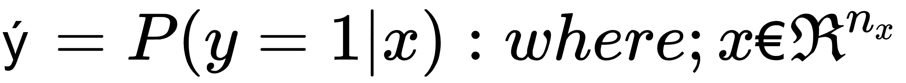

现在，让我们看看如何在特征向量*x*中处理和组合不同的输入变量。下一节将详细讨论使用处理管道组装*x*不同部件的方法。

# 使用数据处理管道的特征工程

为选定的机器学习算法准备数据称为**特征工程**，是机器学习生命周期的关键部分。特征工程分不同阶段或阶段进行。用于处理数据的多阶段处理代码统称为**数据管道**。在可能的情况下，使用标准处理步骤创建数据管道可以使其可重用，并减少训练模型所需的工作量。通过使用经过良好测试的软件模块，代码的质量也得到了提高。

让我们看看为分类器挑战设计一个可重用的处理管道。如前所述，我们将准备一次数据，然后将其用于所有分类器。

# 导入数据

此问题的历史数据以`.csv`格式存储在名为`dataset`的文件中。我们将使用 pandas 的`pd.read_csv`功能将数据作为数据帧导入：

```py
dataset = pd.read_csv('Social_Network_Ads.csv')
```

# 特征选择

选择与我们要解决的问题的上下文相关的特征的过程称为**特征选择**。它是特征工程的重要组成部分。

导入文件后，我们将删除`User ID`列，该列用于识别人员，在培训模型时应将其排除在外：

```py
dataset = dataset.drop(columns=['User ID'])
```

现在让我们预览数据集：

```py
dataset.head(5)
```

数据集如下所示：


现在，让我们看看如何进一步处理输入数据集。

# 一个热编码

许多机器学习算法要求所有特征都是连续变量。这意味着，如果某些特征是类别变量，我们需要找到一种策略将它们转换为连续变量。热编码是执行此转换的最有效方法之一。对于这个特殊的问题，我们唯一的类别变量是`Gender`。让我们使用一种热编码将其转换为连续变量：

```py
enc = sklearn.preprocessing.OneHotEncoder()
enc.fit(dataset.iloc[:,[0]])
onehotlabels = enc.transform(dataset.iloc[:,[0]]).toarray()
genders = pd.DataFrame({'Female': onehotlabels[:, 0], 'Male': onehotlabels[:, 1]})
result = pd.concat([genders,dataset.iloc[:,1:]], axis=1, sort=False)
result.head(5)
```

转换后，让我们再次查看数据集：


请注意，为了将一个变量从一个类别变量转换为一个连续变量，一个热编码将`Gender`转换为两个单独的列—`Male`和`Female`。

# 指定特征和标签

让我们指定特征和标签。我们将通过本书使用`y`表示标签，`X`表示功能集：

```py
y=result['Purchased']
X=result.drop(columns=['Purchased'])
```

`X`表示特征向量，包含训练模型所需的所有输入变量。

# 将数据集划分为测试和训练部分

现在，让我们使用`sklearn.model_selection import train_test_split`将训练数据集划分为 25%的测试和 75%的训练部分：

```py
#from sklearn.cross_validation import train_test_split
X_train, X_test, y_train, y_test = train_test_split(X, y, test_size = 0.25, random_state = 0)
```

这创建了以下四种数据结构：

*   `X_train`：包含训练数据特征的数据结构
*   `X_test`：包含训练测试特征的数据结构
*   `y_train`：包含训练数据集中标签值的向量
*   `y_test`：包含测试数据集中标签值的向量

# 缩放功能

对于许多机器学习算法，将变量从`0`缩放到`1`是一种很好的做法。这也称为**特征规范化**。让我们应用缩放变换来实现这一点：

```py
from sklearn.preprocessing import StandardScaler
sc = StandardScaler()
X_train = sc.fit_transform(X_train)
X_test = sc.transform(X_test)
```

在我们缩放数据之后，它就可以作为不同分类器的输入了，我们将在后面的章节中介绍这些分类器。

# 评价分类器

一旦模型经过训练，我们就需要评估其性能。为此，我们将使用以下过程：

1.  我们将标签数据集分为两部分：训练部分和测试部分。我们将使用测试分区来评估经过训练的模型。
2.  我们将使用测试分区的特性为每一行生成标签。这是我们的一组预测标签。
3.  我们将比较预测标签集与实际标签，以评估模型。

Unless we are trying to solve something quite trivial, there will be some misclassifications when we evaluate the model. How we interpret these misclassifications to determine the quality of the model depends on which performance metrics we choose to use.

一旦我们有了一组实际标签和预测标签，就可以使用一组性能指标来评估模型。量化模型的最佳指标将取决于我们想要解决的业务问题的需求，以及培训数据集的特征。

# 混淆矩阵

混淆矩阵用于总结分类器的评估结果。二元分类器的混淆矩阵如下所示：


If the label of the classifier we are training has two levels, it is called a **binary classifier**. The first critical use case of supervised machine learning—specifically, a binary classifier—was during the First World War to differentiate between an aircraft and flying birds.

分类可分为以下四类：

*   **真阳性****TP**：正确分类的阳性分类
*   **真阴性****TN**：正确分类的阴性分类
*   **假阳性****FP**：实际为阴性的阳性分类
*   **假阴性****FN**：实际阳性的阴性分类

让我们看看如何使用这四个类别来创建各种性能指标。

# 性能指标

性能指标用于量化训练模型的性能。基于此，让我们定义以下四个指标：

| **公制** | **公式** |
| 精确 | 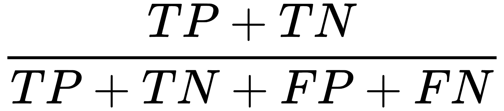 |
| 回忆起 |  |
| 精确 | 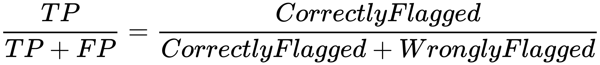 |
| F1 成绩 |  |

准确度是所有预测中校正分类的比例。在计算精度时，我们不区分 TP 和 TN。通过精度评估模型很简单，但在某些情况下，它不会起作用。

让我们看一下，在哪些情况下，我们需要更多的准确性来量化模型的性能。其中一种情况是当我们使用模型预测罕见事件时，例如在以下示例中：

*   银行交易数据库中欺诈交易的预测模型
*   预测飞机发动机部件机械故障可能性的模型

在这两个例子中，我们都试图预测一个罕见的事件。在这些情况下，还有两项措施比准确度更为重要：召回率和准确度。让我们逐一看一下：

*   **召回**：计算命中率。在前面的第一个示例中，它是模型成功标记的欺诈文档在所有欺诈文档中所占的比例。如果在我们的测试数据集中，我们有 100 万笔交易，其中 100 笔是已知的欺诈交易，那么模型能够识别其中 78 笔。在这种情况下，召回值将为 78/100。
*   **精度**：精度度量模型标记的事务中有多少实际上是坏的。我们不想关注模型未能标记的坏事务，而是想确定模型标记的坏箱子到底有多精确

请注意，F1 成绩将召回率和准确率结合在一起。如果一个模型在精确度和召回率方面都有完美的分数，那么它的 F1 分数将是完美的。F1 的高分意味着我们已经训练出了一个高质量的模型，它具有很高的召回率和精确度。

# 理解过拟合

如果一个机器学习模型在开发环境中表现出色，但在生产环境中表现明显下降，那么我们就说该模型过于适合。这意味着经过训练的模型过于接近训练数据集。这表明模型创建的规则中有太多的细节。模型差异和偏差之间的权衡最能体现这一观点。让我们逐一看一下这些概念。

# 偏见

任何机器学习模型都是基于一定的假设进行训练的。一般来说，这些假设是对一些现实世界现象的过于简单的近似。这些假设简化了特征及其特征之间的实际关系，使模型更易于训练。更多的假设意味着更多的偏见。因此，在训练模型时，更简单的假设=高偏差，更能代表实际现象的现实假设=低偏差

In linear regression, the non-linearity of the features is ignored and they are approximated as linear variables. So, linear regression models are inherently vulnerable to exhibiting high bias.

# 方差

方差量化了如果使用不同的数据集训练模型，模型估计目标变量的准确性。它量化了我们模型的数学公式是否是底层模式的良好泛化

基于特定场景和情况的特定过度拟合规则=高方差，而广义且适用于各种场景和情况的规则=低方差。

Our goal in machine learning is to train models that exhibit low bias and low variance. Achieving this goal is not always easy and usually keeps data scientists awake at night. 

# 偏差-方差权衡

当训练一个特定的机器学习模型时，很难确定组成训练模型的规则的正确泛化级别。通过偏差-方差权衡，我们可以找到正确的推广水平。

Note that more simplistic assumptions = more generalization = low variance = high variance.

偏差和方差之间的权衡取决于算法的选择、数据的特征和各种超参数。根据您试图解决的具体问题的要求，在偏差和差异之间达成正确的折衷是很重要的。

# 指定分类器的阶段

一旦准备好标记数据，分类器的开发就涉及到培训、评估和部署。实现分类器的这三个阶段如下图中的**CRISP-DM**（**数据挖掘跨行业标准流程**）生命周期所示（CRISP-DM 生命周期在[第 5 章](05.html)*图形算法*中有更详细的解释）

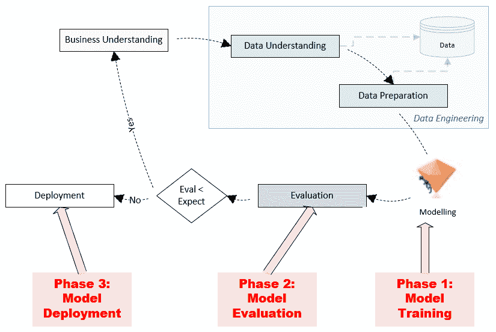

在实现分类器的前两个阶段，即测试和训练阶段，我们使用标记数据。标记的数据分为两个分区，一个较大的分区称为训练数据，另一个较小的分区称为测试数据。随机抽样技术用于将输入标记数据划分为训练和测试分区，以确保两个分区包含一致的模式。请注意，如上图所示，首先是一个训练阶段，其中训练数据用于训练模型。训练阶段结束后，使用测试数据评估训练后的模型。不同的性能矩阵用于量化训练模型的性能。一旦评估了模型，我们就进入了模型部署阶段，在该阶段，将部署经过训练的模型，并将其用于推理，通过标记未标记的数据来解决实际问题。

现在，让我们看看一些分类算法。

我们将在后续章节中介绍以下分类算法：

*   决策树算法
*   XGBoost 算法
*   随机森林算法
*   logistic 回归算法
*   **支持向量机**（**SVM**算法
*   朴素贝叶斯算法

让我们从决策树算法开始。

# 决策树分类算法

决策树基于递归分区方法（分而治之），该方法生成一组可用于预测标签的规则。它从一个根节点开始，并拆分为多个分支。内部节点表示对某个属性的测试，测试结果由下一级的分支表示。决策树以包含决策的叶节点结束。当分区不再改善结果时，进程停止。

# 理解决策树分类算法

决策树分类的显著特征是生成人类可解释的规则层次结构，用于在运行时预测标签。该算法本质上是递归的。创建此规则层次结构涉及以下步骤：

1.  **找到最重要的特征**：在所有特征中，该算法识别出与标签相关的训练数据集中的数据点之间最有区别的特征。计算基于信息增益或基尼杂质等指标
2.  **分叉**：该算法使用识别最重要的特征，创建一个准则，用于将训练数据集划分为两个分支：
    *   通过标准的数据点
    *   不符合标准的数据点
3.  **检查叶节点**：如果任何结果分支大多包含一个类的标签，则该分支为最终分支，生成一个叶节点。
4.  **检查停止条件并重复**：如果不满足提供的停止条件，则算法将返回*步骤 1*进行下一次迭代。否则，将模型标记为已训练，并将生成的决策树最低级别的每个节点标记为叶节点。停止条件可以简单到定义迭代次数，也可以使用默认停止条件，即算法在每个叶节点达到某个同质性水平时停止。

决策树算法可以用下图来解释：

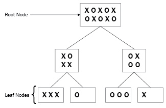

在上图中，根包含一组圆和十字。该算法创建了一个标准，试图将圆与十字分开。在每个级别上，决策树都会创建数据分区，从级别 1 开始，这些分区将越来越同质。完美分类器的叶节点只包含圆或十字。由于训练数据集固有的随机性，训练完美分类器通常比较困难

# 使用决策树分类算法进行分类器挑战

现在，让我们使用决策树分类算法来解决我们之前定义的常见问题，以预测客户是否最终购买产品：

1.  首先，让我们实例化决策树分类算法，并使用我们为分类器准备的数据的训练部分来训练模型：

```py
classifier = sklearn.tree.DecisionTreeClassifier(criterion = 'entropy', random_state = 100, max_depth=2)
classifier.fit(X_train, y_train)
```

2.  现在，让我们使用经过训练的模型来预测标记数据的测试部分的标签。让我们生成一个混乱矩阵，它可以总结我们经过培训的模型的性能：

```py
import sklearn.metrics as metrics
y_pred = classifier.predict(X_test)
cm = metrics.confusion_matrix(y_test, y_pred)
cm
```

这将提供以下输出：


3.  现在，让我们使用决策树分类算法计算所创建分类器的`accuracy`、`recall`和`precision`值：

```py
accuracy= metrics.accuracy_score(y_test,y_pred)
recall = metrics.recall_score(y_test,y_pred)
precision = metrics.precision_score(y_test,y_pred)
print(accuracy,recall,precision)
```

4.  运行上述代码将产生以下输出：


性能度量有助于我们相互比较不同的训练建模技术。

# 决策树分类器的优缺点

在本节中，让我们看看使用决策树分类算法的优缺点。

# 优势

以下是决策树分类器的优势：

*   **使用决策树算法创建的模型的规则可由人类解释。像这样的模型被称为**白盒模型**。每当需要透明性来跟踪模型所做决策的细节和原因时，都需要白盒模型。在我们希望防止偏见和保护弱势群体的应用中，这种透明度至关重要。例如，白盒模型通常是政府和保险行业中关键用例的需求**
***   决策树分类器用于从离散问题空间中提取信息。这意味着大多数特征都是类别变量，因此使用决策树来训练模型是一个不错的选择。**

 **# 弱点

以下是决策树分类器的弱点：

*   如果决策树分类器生成的树太深，则规则捕获的细节太多，导致模型过度拟合。在使用决策树算法时，我们需要意识到决策树容易过度拟合，因此我们需要在必要时修剪树以防止过度拟合。
*   决策树分类器的一个弱点是它们无法捕获它们创建的规则中的非线性关系。

# 用例

在本节中，让我们看看决策树算法用于的用例。

# 分类记录

决策树分类器可用于对数据点进行分类，例如在以下示例中：

*   **抵押申请**：训练二元分类器，判断申请人是否可能违约
*   **客户细分**：将客户分为高价值客户、中价值客户和低价值客户，以便为每个类别定制营销策略。
*   **医学诊断**：训练分类器，对良性或恶性生长进行分类。
*   **治疗效果分析**：训练分类器，用于标记对特定治疗有积极反应的患者。

# 特征选择

决策树分类算法选择一小部分特征来创建规则。当您拥有大量特征时，该特征选择可用于为其他机器学习算法选择特征。

# 理解系综方法

集成是机器学习中的一种方法，使用不同的参数创建多个稍有不同的模型，然后将它们组合成一个聚合模型。为了创建有效的集成，我们需要找到生成结果模型的聚合标准。让我们看看一些集成算法。

# 用 XGBoost 算法实现梯度增强

XGBoost 创建于 2014 年，基于梯度推进原则。它已成为最流行的集成分类算法之一。它生成一组相互关联的树，并使用梯度下降来最小化剩余误差。这使得它非常适合分布式基础设施，如 Apache Spark，或云计算，如谷歌云或**亚马逊网络服务****（**AWS****。****

 **现在让我们看看如何使用 XGBoost 算法实现梯度增强：

1.  首先，我们将实例化 XGBClassifier 分类器，并使用数据的训练部分训练模型：


2.  然后，我们将根据新训练的模型生成预测：

```py
y_pred = classifier.predict(X_test)
cm = metrics.confusion_matrix(y_test, y_pred)
cm
```

生成以下输出：


3.  最后，我们将量化模型的性能：

```py
accuracy= metrics.accuracy_score(y_test,y_pred)
recall = metrics.recall_score(y_test,y_pred)
precision = metrics.precision_score(y_test,y_pred)
print(accuracy,recall,precision)
```

这为我们提供了以下输出：

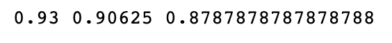

接下来，让我们看看随机森林算法。

# 使用随机森林算法

随机森林是一种集成方法，通过组合多个决策树来减少偏差和方差。

# 训练一个随机森林算法

在训练中，该算法从训练数据中抽取*N*个样本，并创建我们整体数据的*m*子集。这些子集是通过随机选择输入数据的一些行和列来创建的。该算法构建*m*独立决策树。这些分类树由`C<sub>1</sub>`到`C<sub>m</sub>`表示。

# 使用随机森林进行预测

一旦模型经过训练，就可以用来标记新数据。每棵树都会生成一个标签。通过投票这些单独的预测来确定最终预测，如图所示：

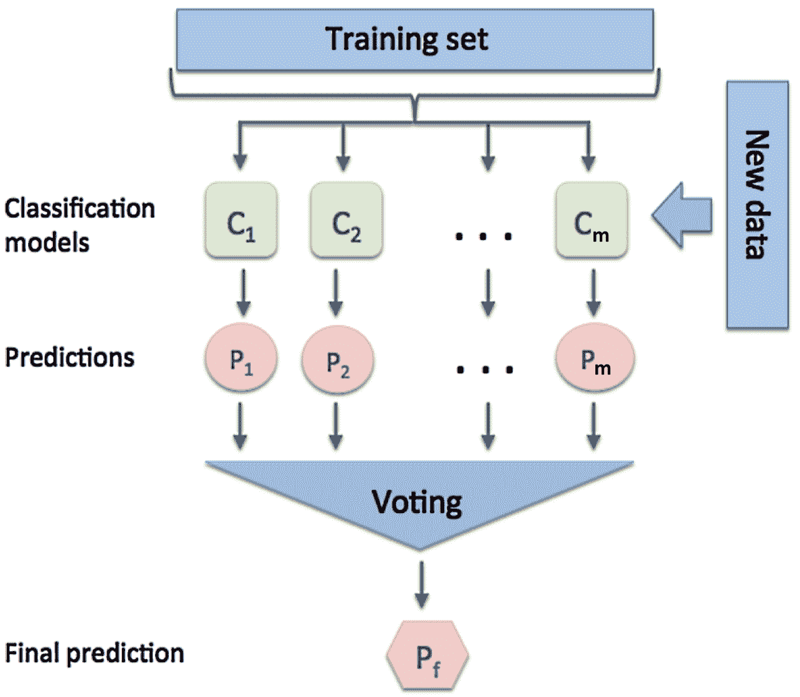

请注意，在上图中，*m*树经过训练，由`C<sub>1</sub>`到`C<sub>m</sub>`表示。那就是树={C<sub>1</sub>，…，C<sub>m</sub>}

每个树生成一个预测，该预测由一个集合表示：

个人预测=P={P<sub>1</sub>…，P<sub>m</sub>}

最终预测用`P<sub>f</sub>`表示。这是由大多数个人预测决定的。`mode`函数可用于查找多数决定（`mode`是重复次数最多且处于多数的数字）。单个预测和最终预测链接如下：

P<sub>f</sub>=模式（P）

# 区分随机森林算法和集合 boosting 算法

随机森林算法生成的每棵树都是完全独立的。它不知道集合中其他树的任何细节。这使它不同于其他技术，如集合增强。

# 使用随机森林算法进行分类器挑战

让我们实例化随机森林算法，并使用它来使用训练数据训练我们的模型。

我们将在这里查看两个关键的超参数：

*   `n_estimators`
*   `max_depth`

`n_estimators`超参数控制构建的单个决策树的数量，`max_depth`超参数控制每个决策树的深度

因此，也就是说，决策树可以不断地拆分和拆分，直到它有一个代表训练集中每个给定示例的节点。通过设置`max_depth`，我们限制它可以进行多少级拆分。这控制了模型的复杂性，并确定了它与训练数据的拟合程度。如果我们参考以下输出，`n_estimators`控制随机森林模型的宽度，`max_depth`控制模型的深度：

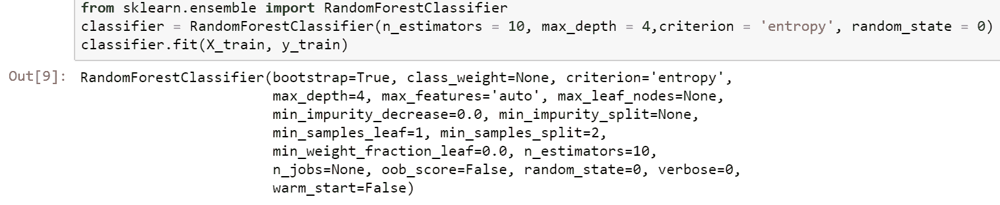

训练随机森林模型后，让我们使用它进行预测：

```py
y_pred = classifier.predict(X_test)
cm = metrics.confusion_matrix(y_test, y_pred)
cm
```

其输出为：


现在，让我们量化一下我们的模型有多好：

```py
accuracy= metrics.accuracy_score(y_test,y_pred)
recall = metrics.recall_score(y_test,y_pred)
precision = metrics.precision_score(y_test,y_pred)
print(accuracy,recall,precision)
```

我们将观察以下输出：

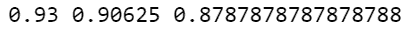

接下来，让我们看看逻辑回归。

# 逻辑回归

Logistic 回归是一种用于二元分类的分类算法。它使用逻辑函数来描述输入特征和目标变量之间的交互作用。它是用于对二元因变量建模的最简单分类技术之一

# 假设

逻辑回归假设如下：

*   训练数据集没有缺少的值。
*   标签是一个二进制类别变量。
*   标签是有序的，换句话说，是具有有序值的分类变量。
*   所有特征或输入变量彼此独立。

# 建立关系

对于逻辑回归，预测值计算如下：


让我们假设。

所以现在：

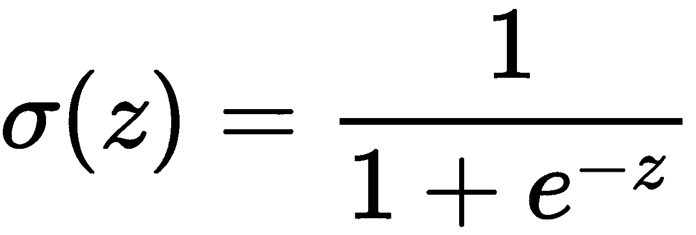

上述关系可以图形化显示如下：

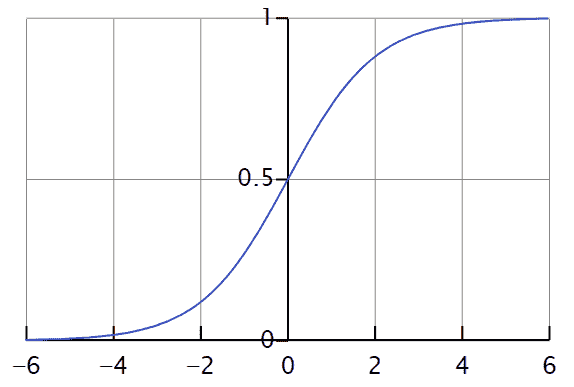

注意，如果*z*较大，σ（*z*将等于`1`。如果*z*非常小或是一个大的负数，σ（z）将等于`0`。因此，逻辑回归的目标是找到*w*和*j*的正确值。

Logistic regression is named after the function that is used to formulate it, called the **logistic** or **sigmoid function**. 

# 损失与成本函数

`loss`函数定义了如何量化训练数据中特定示例的错误。`cost`函数定义了我们希望如何将整个训练数据集中的错误最小化。因此，`loss`函数用于训练数据集中的一个示例，`cost`函数用于量化实际值和预测值的总体偏差的总体成本。这取决于*w*和*h*的选择。

逻辑回归中使用的`loss`函数如下：

*损失（ý<sup>（i）</sup>、y<sup>（i）</sup>=-（y<sup>（i）</sup><sup>日志<sup>（i）</sup><sup><sup>+<sup>（1-y】<sup>（i）</sup>日志【T11-T19】</sup></sup></sup></sup>*<sup><sup><sup><sup><sup><sup><sup><sup><sup><sup><sup><sup>】】日志】</sup></sup></sup></sup></sup></sup></sup></sup></sup></sup></sup></sup>

请注意，当*y<sup>（i）</sup>=1 时，损失（ý<sup>（i）</sup>、y<sup>（i）</sup>**=-logý<sup>（i）</sup>*。<sup>将损失最小化将导致ý<sup>（i）</sup>的较大值。作为一个 S 形函数，最大值为`1`。</sup>

若*y<sup>（i）</sup>=0，则损失（ý<sup>（i）</sup>、y<sup>（i）</sup>=-log（1-ý<sup>（i）</sup>**。将损失最小化将导致*ý<sup>（i）</sup>*尽可能小，即`0`。*

 *逻辑回归的成本函数如下所示：

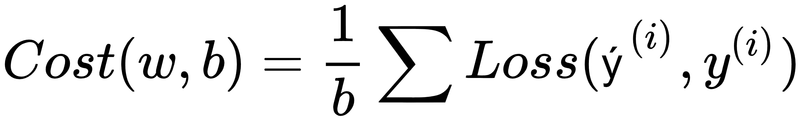

# 何时使用逻辑回归

Logistic 回归对二元分类器非常有效。当数据量很大但数据质量不高时，Logistic 回归效果不太好。它可以捕获不太复杂的关系。虽然它通常不会产生最好的性能，但它确实设置了一个非常好的基准

# 使用 logistic 回归算法进行分类器挑战

在本节中，我们将了解如何将逻辑回归算法用于分类器挑战：

1.  首先，让我们实例化一个逻辑回归模型，并使用训练数据对其进行训练：

```py
from sklearn.linear_model import LogisticRegression
classifier = LogisticRegression(random_state = 0)
classifier.fit(X_train, y_train)
```

2.  让我们预测`test`数据的值，并创建一个混淆矩阵：

```py

y_pred = classifier.predict(X_test)
cm = metrics.confusion_matrix(y_test, y_pred)
cm
```

运行上述代码后，我们得到以下输出：

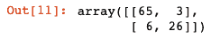

3.  现在，让我们看看性能指标：

```py
accuracy= metrics.accuracy_score(y_test,y_pred)
recall = metrics.recall_score(y_test,y_pred)
precision = metrics.precision_score(y_test,y_pred)
print(accuracy,recall,precision)
```

4.  运行上述代码后，我们得到以下输出：


接下来我们来看**SVM**。

# 支持向量机算法

现在，让我们来看 SVM。支持向量机是一种分类器，它可以找到一个最优超平面来最大化两类之间的边界。在支持向量机中，我们的优化目标是最大化边界。边界定义为分离超平面（决策边界）与最接近该超平面的训练样本之间的距离，称为**支持向量***。*那么，让我们从一个只有两个维度的非常基本的例子开始，*X1*和*X2*。我们需要一条线将圆与十字架分开。如下图所示：


我们画了两条线，两条线都将交叉点与圆完全分开。但是，必须有一条最佳线，或决策边界，这为我们提供了最好的机会来正确分类大多数其他示例。一个合理的选择可能是在这两个类之间均匀地间隔一行，以便为每个类提供一点缓冲区，如图所示：


现在，让我们看看如何使用 SVM 来训练分类器以应对我们的挑战。

# 使用 SVM 算法进行分类器挑战

1.  首先，让我们实例化 SVM 分类器，然后使用标记数据的训练部分对其进行训练。`kernel`超参数确定应用于输入数据的变换类型，以使其线性可分离：

```py
from sklearn.svm import SVC
classifier = SVC(kernel = 'linear', random_state = 0)
classifier.fit(X_train, y_train)
```

2.  经过培训后，让我们生成一些预测，并查看混淆矩阵：

```py
y_pred = classifier.predict(X_test)
cm = metrics.confusion_matrix(y_test, y_pred)
cm
```

3.  观察以下输出：

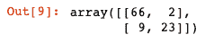

4.  现在，让我们看看各种性能指标：

```py
accuracy= metrics.accuracy_score(y_test,y_pred)
recall = metrics.recall_score(y_test,y_pred)
precision = metrics.precision_score(y_test,y_pred)
print(accuracy,recall,precision)
```

运行上述代码后，我们将获得以下值作为输出：

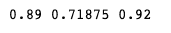

# 理解朴素贝叶斯算法

基于概率论的朴素贝叶斯分类算法是最简单的分类算法之一。如果使用得当，它可以做出准确的预测。Naive Bayes 算法命名为 s0 有两个原因：

*   它基于一个天真的假设，即特征和输入变量之间是独立的
*   它基于贝叶斯定理。

该算法尝试根据前面属性/实例的概率对实例进行分类，假设属性完全独立。

有三种类型的事件：

*   **独立**事件不会影响另一事件发生的概率（例如，收到一封电子邮件，让您免费进入贵公司发生的技术事件*和*重组）。
*   **依赖**事件影响另一事件发生的概率；也就是说，它们以某种方式联系在一起（例如，航空公司员工罢工或航班可能无法按时运行可能会影响您准时参加会议的可能性）。
*   **互斥**事件不能同时发生（例如，在一个骰子上掷 3 和 6 的概率为 0——这两种结果互斥）。

# 贝叶斯定理

贝叶斯定理用于计算两个独立事件*A*和*B*之间的条件概率。事件*A*和*B*发生的概率由 P（*A*和 P（*B*表示）。条件概率用 P（*B**A*表示，即事件*B*发生的条件概率，假设事件*A*已经发生：

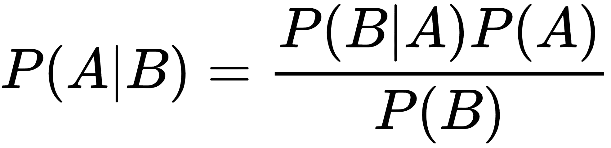

# 计算概率

朴素贝叶斯是基于概率基础的。单个事件发生的概率（观测概率）是通过将事件发生的次数除以可能导致该事件的过程总数来计算的。例如，呼叫中心每天接收 100 多个支持电话，一个月内 50 次。您想知道根据之前的响应次数，在 3 分钟内响应呼叫的概率。如果呼叫中心成功匹配了 27 次该时间记录，则在 3 分钟内接听 100 个电话的观察概率如下：

*P（3 分钟内拨打 100 个支持电话）=（27/50）=0.54（54%）*

根据过去 50 次的记录，100 个电话可以在大约一半的时间内在 3 分钟内得到回复。

# 和事件的乘法规则

为了计算两个或多个事件同时发生的概率，考虑事件是独立的还是依赖的。如果它们是独立的，则使用简单乘法规则：

*P（结果 1 和结果 2）=P（结果 1）*P（结果 2）*

例如，要计算收到免费进入工作场所的技术事件*和*重组的电子邮件的概率，可以使用这个简单的乘法规则。这两个事件是独立的，因为一个事件的发生不会影响另一个事件发生的机会

如果收到技术事件电子邮件的概率为 31%，员工重组的概率为 82%，则两者发生的概率计算如下：

P（电子邮件和重组）=P（电子邮件）*P（重组）=（0.31）*（0.82）=0.2542（25%）

# 一般乘法规则

如果两个或多个事件相互依赖，则使用通用乘法规则。该公式实际上适用于独立事件和从属事件：

*P（结果 1 和结果 2）=P（结果 1）*P（结果 2 |结果 1）*

注意，`P(outcome 2 | outcome 1)`是指给定`outcome 1`已经发生的`outcome 2`发生的条件概率。该公式包含了事件之间的依赖关系。如果事件是独立的，那么条件概率是无关的，因为一个结果不会影响另一个发生的概率，`P(outcome 2 | outcome 1)`只是`P(outcome 2)`。注意，本例中的公式只是简单的乘法规则。

# 事件的添加规则

当计算一个或另一个事件发生的概率（互斥）时，使用以下简单加法规则：

*P（结果 1 或结果 2）=P（结果 1）+P（结果 2）*

例如，滚动 6 或 3 的概率是多少？要回答这个问题，首先要注意两种结果不能同时发生。滚动 a 6 的概率为（1/6），滚动 a 3 的概率为（1/6）：

*P（6 或 3）=（1/6）+（1/6）=0.33（33%）*

如果事件不是互斥的，并且可以同时发生，则使用以下通用加法公式，该公式在互斥和非互斥两种情况下始终有效：

*P（结果 1 或结果 2）=P（结果 1）+P（结果 2）P（结果 1 和结果 2）*

# 使用朴素贝叶斯算法进行分类器挑战

现在，让我们使用朴素贝叶斯算法来解决分类器的挑战：

1.  首先，我们导入`GaussianNB()`函数并使用它来训练模型：

```py
from sklearn.naive_bayes import GaussianNB
classifier = GaussianNB()
classifier.fit(X_train, y_train)
```

2.  现在，让我们使用经过训练的模型来预测结果。我们将使用它来预测我们的测试分区的标签，即`X_test`：

```py
Predicting the Test set results
y_pred = classifier.predict(X_test)
cm = metrics.confusion_matrix(y_test, y_pred)
cm
```

3.  现在，让我们打印混淆矩阵：

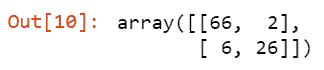

4.  现在，让我们打印性能矩阵，以量化经过培训的模型的质量：

```py
accuracy= metrics.accuracy_score(y_test,y_pred)
recall = metrics.recall_score(y_test,y_pred)
precision = metrics.precision_score(y_test,y_pred)
print(accuracy,recall,precision)
```

其输出为：

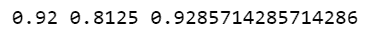

# 对于分类算法，赢家是。。。

让我们看看我们所介绍的各种算法的性能指标。下表对此进行了总结：

| **算法** | **准确度** | **召回** | **精度** |
| 决策树 | 0.94 | 0.93 | 0.88 |
| XGBoost | 0.93 | 0.90 | 0.87 |
| 随机森林 | 0.93 | 0.90 | 0.87 |
| 逻辑回归 | 0.91 | 0.81 | 0.89 |
| 支持向量机 | 0.89 | 0.71 | 0.92 |
| 朴素贝叶斯 | 0.92 | 0.81 | 0.92 |

查看上表，我们可以观察到决策树分类器在准确性和召回率方面表现最好。如果我们在寻找精度，那么支持向量机和朴素贝叶斯之间是有联系的，所以任何一种都适用于我们。

# 理解回归算法

如果目标变量是连续变量，则有监督机器学习模型使用其中一种回归算法。在这种情况下，机器学习模型被称为回归器。

在本节中，我们将介绍可用于训练有监督机器学习回归模型或简单的回归器的各种算法。在我们深入研究算法的细节之前，让我们首先为这些算法创建一个挑战，以测试它们的性能、能力和有效性。

# 提出回归者挑战

与我们在分类算法中使用的方法类似，我们将首先提出一个要解决的问题，作为对所有回归算法的挑战。我们将这一常见问题称为回归者挑战。然后，我们将使用三种不同的回归算法来应对这一挑战。这种对不同回归算法使用共同挑战的方法有两个好处：

*   我们可以准备一次数据，并将准备好的数据用于所有三种回归算法。
*   我们可以有意义地比较三种回归算法的性能，因为我们将使用它们来解决相同的问题。

让我们看看挑战的问题陈述。

# 回归者挑战的问题陈述

如今，预测不同车辆的行驶里程很重要。一辆高效的汽车对环境有好处，而且成本效益高。里程数可根据发动机功率和车辆特性进行估算。让我们为回归者创造一个挑战，以训练一个模型，该模型可以根据车辆的特性预测车辆的**英里/加仑**（**英里/加仑**）

让我们看看我们将用来训练回归者的历史数据集。

# 探索历史数据集

以下是我们拥有的历史数据集数据的特征：

| **名称** | **型** | **说明** |
| `NAME` | 类别 | 识别特定的车辆 |
| `CYLINDERS` | 不断的 | 气缸数（在 4 到 8 之间） |
| `DISPLACEMENT` | 不断的 | 发动机的排量，单位为立方英寸 |
| `HORSEPOWER` | 不断的 | 发动机的马力 |
| `ACCELERATION` | 不断的 | 从 0 英里/小时加速到 60 英里/小时所需的时间（以秒为单位） |

此问题的目标变量是一个连续变量`MPG`，用于指定每辆车的 mpg。

让我们首先为这个问题设计数据处理管道。

# 使用数据处理管道的特征工程

让我们看看如何设计一个可重用的处理管道来解决回归器的挑战。如前所述，我们将准备一次数据，然后在所有回归算法中使用它。让我们按照以下步骤进行操作：

1.  我们首先导入数据集，如下所示：

```py
dataset = pd.read_csv('auto.csv')
```

2.  现在让我们预览数据集：

```py
dataset.head(5)
```

以下是数据集的外观：


3.  现在，让我们继续功能选择。让我们删除`NAME`列，因为它只是汽车所需的标识符。用于标识数据集中的行的列与训练模型无关。让我们放下这个专栏：

```py
dataset=dataset.drop(columns=['NAME'])
```

4.  让我们转换所有输入变量并输入所有空值：

```py
dataset=dataset.drop(columns=['NAME'])
dataset= dataset.apply(pd.to_numeric, errors='coerce')
dataset.fillna(0, inplace=True)
```

插补提高了数据的质量，并为训练模型做好准备。现在，让我们看看最后一步：

5.  让我们将数据划分为测试和培训分区：

```py
from sklearn.model_selection import train_test_split
#from sklearn.cross_validation import train_test_split
X_train, X_test, y_train, y_test = train_test_split(X, y, test_size = 0.25, random_state = 0)
```

这创建了以下四种数据结构：

*   `X_train`：包含训练数据特征的数据结构
*   `X_test`：包含训练测试特征的数据结构
*   `y_train`：包含训练数据集中标签值的向量
*   `y_test`：包含测试数据集中标签值的向量

现在，让我们使用三个不同回归器上准备好的数据，以便比较它们的性能。

# 线性回归

在所有有监督机器学习技术中，线性回归算法是最容易理解的。我们将首先研究简单线性回归，然后将概念扩展到多元线性回归。

# 简单线性回归

线性回归以其最简单的形式表述了单个连续自变量和单个连续自变量之间的关系。（简单）回归用于显示因变量（显示在*y*轴上）的变化可归因于解释变量变化的程度（如*x*轴所示），可表示为：


这个公式可以解释如下：

*   *y*为因变量。
*   *X*为自变量。
*   是斜率，表示*X*每增加一次，直线上升多少。
*   *α*是表示*X*=0 时*y*值的截距。

单个连续因变量和单个连续自变量之间的关系示例如下：

*   一个人的体重和卡路里摄入量
*   某一特定街区的房价及其面积（平方英尺）
*   空气中的湿度和下雨的可能性

对于线性回归，输入（自变量）和目标（因变量）都必须是数字。最佳关系是通过最小化从一条穿过所有点的线开始的每个点的垂直距离的平方和来找到的。假设预测变量和目标变量之间的关系是线性的。例如，投入研发的资金越多，销售额就越高。

让我们看一个具体的例子。让我们试着建立一个特定产品的营销支出和销售之间的关系。人们发现它们之间有着直接的关系。营销支出和销售额绘制在二维图上，并显示为蓝色钻石。最好通过绘制一条直线来近似该关系，如下图所示：

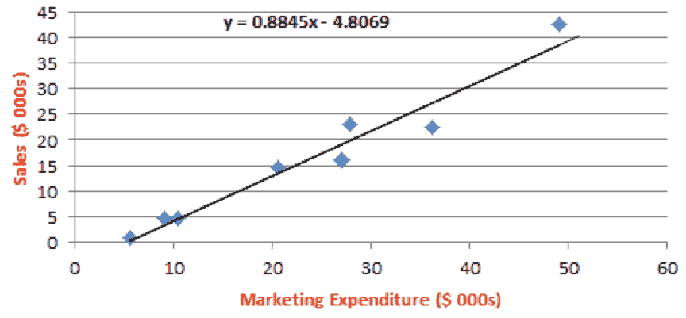

一旦画出线性线，我们就可以看到营销支出和销售额之间的数学关系。

# 评估回归系数

我们画的线性线是因变量和自变量之间关系的近似值。即使是最好的线也会与实际值有一些偏差，如图所示：

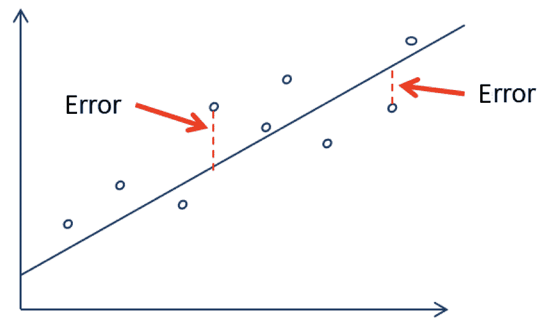

量化线性回归模型性能的典型方法是使用**均方根误差**（**RMSE**）。这将从数学上计算训练模型产生的误差的标准偏差。对于训练数据集中的某个示例，`loss`函数计算如下：

损失（ý<sup>（i）</sup>、y<sup>（i）</sup>=1/2（ý<sup>（i）</sup>y<sup>（i）</sup><sup>2</sup>

这将产生以下`cost`功能，最大限度地减少培训集中所有示例的损失：


让我们试着解释 RMSE。如果我们预测产品价格的示例模型的 RMSE 为 50 美元，这意味着大约 68.2%的预测将落在真实值的 50 美元以内（即，*α*）。这也意味着 95%的预测值将落在实际值的 100 美元（即 2*α*）以内。最后，99.7%的预测值将落在实际值的 150 美元以内。

# 多元回归

事实上，大多数现实世界的分析都有不止一个自变量。多元回归是简单线性回归的延伸。关键区别在于，对于额外的预测变量，存在额外的β系数。训练模型时，目标是找到使线性方程的误差最小化的贝塔系数。让我们试着用数学方法来描述因变量和自变量集（特征）之间的关系。

与简单的线性方程类似，因变量*y*被量化为截距项加*β*系数乘以*i*特征的*x*值之和：

y=α+β<sub>1</sub>x<sub>1</sub>+β<sub>2</sub>x2+…+β<sub>i</sub>x<sub>i</sub>ε

误差由*ε*表示，表明预测不完美。

*β*系数允许每个特征对*y*的值产生单独的估计影响，因为*y*的变化量为*x*<sub xmlns:epub="http://www.idpf.org/2007/ops">*i*的每单位增加*β<sub>i</sub>*。此外，截距（*α*表示自变量均为 0 时*y*的期望值。</sub>

注意，前面等式中的所有变量都可以用一组向量表示。目标变量和预测变量现在是一行向量，回归系数*β*和误差*ε*也是向量。

# 使用线性回归算法进行回归挑战

现在，让我们使用数据集的训练部分训练模型：

1.  让我们从导入线性回归包开始：

```py
from sklearn.linear_model import LinearRegression
```

2.  然后，让我们实例化线性回归模型，并使用训练数据集对其进行训练：

```py
regressor = LinearRegression()
regressor.fit(X_train, y_train)
```

3.  现在，让我们使用数据集的测试部分预测结果：

```py
y_pred = regressor.predict(X_test)
from sklearn.metrics import mean_squared_error
from math import sqrt
sqrt(mean_squared_error(y_test, y_pred))
```

4.  通过运行上述代码生成的输出将生成以下内容：

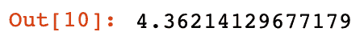

如前一节所述，RMSE 是误差的标准偏差。这表明 68.2%的预测将落在目标变量值的`4.36`范围内。

# 什么时候使用线性回归？

线性回归用于解决许多实际问题，包括：

*   销售预测
*   预测最优产品价格
*   量化事件与反应之间的因果关系，如在临床药物试验、工程安全性试验或营销研究中
*   确定可用于预测未来行为的模式，给定已知标准，例如预测保险索赔、自然灾害损失、选举结果和犯罪率

# 线性回归的弱点

线性回归的缺点如下：

*   它只适用于数字特征。
*   分类数据需要进行预处理。
*   它不能很好地处理丢失的数据。
*   它对数据进行假设。

# 回归树算法

回归树算法与分类树算法类似，只是目标变量是连续变量，而不是类别变量。

# 使用回归树算法进行回归挑战

在本节中，我们将了解回归树算法如何用于回归器挑战：

1.  首先，我们使用回归树算法训练模型：


2.  一旦对回归树模型进行了训练，我们将使用经过训练的模型来预测值：

```py
y_pred = regressor.predict(X_test)
```

3.  然后，我们计算 RMSE 以量化模型的性能：

```py
from sklearn.metrics import mean_squared_error
from math import sqrt
sqrt(mean_squared_error(y_test, y_pred))
```

我们得到以下输出：

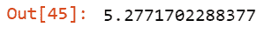

# 梯度 boost 回归算法

现在让我们看看梯度推进回归算法。它使用决策树的集合来更好地描述数据中的底层模式

# 使用梯度 boost 回归算法解决回归问题

在本节中，我们将了解如何将梯度推进回归算法用于回归器挑战：

1.  首先，我们使用梯度推进回归算法训练模型：

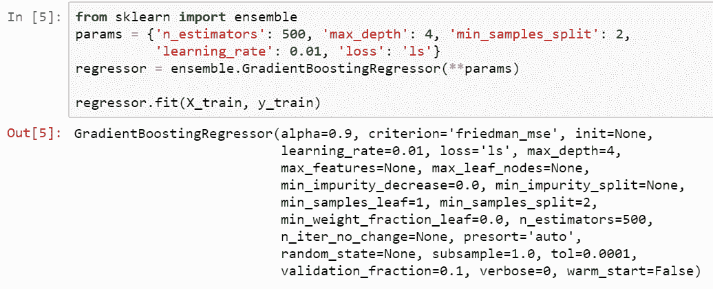

2.  一旦梯度回归算法模型经过训练，我们将使用它来预测值：

```py
y_pred = regressor.predict(X_test)
```

3.  最后，我们计算 RMSE 以量化模型的性能：

```py
from sklearn.metrics import mean_squared_error
from math import sqrt
sqrt(mean_squared_error(y_test, y_pred))
```

4.  运行此命令将获得输出值，如下所示：


# 对于回归算法，赢家是。。。

让我们看看我们在相同数据和完全相同的用例上使用的三种回归算法的性能：

| **算法** | **RMSE** |
| 线性回归 | 4.36214129677179 |
| 回归树 | 5.2771702288377 |
| 梯度推进回归 | 4.034836373089085 |

从所有回归算法的性能来看，很明显梯度 boost 回归的性能最好，因为它的 RMSE 最低。然后是线性回归。回归树算法在这个问题上表现最差。

# 实例–如何预测天气

让我们看看如何使用本章中提出的概念来预测天气。让我们假设，我们想根据一年来为某个特定城市收集的数据预测明天是否会下雨

可用于培训该模型的数据位于名为`weather.csv`的 CSV 文件中：

1.  让我们将数据作为数据帧导入：

```py
import numpy as np 
import pandas as pd
df = pd.read_csv("weather.csv")
```

2.  让我们看一下数据框的列：

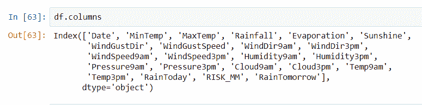

3.  接下来，让我们看一下`weather.csv`数据前 13 列的标题：


4.  现在，让我们看看`weather.csv`数据的最后 10 列：

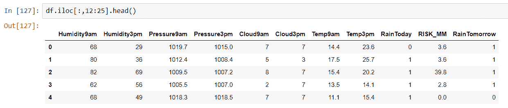

5.  让我们用`x`来表示输入特征。我们将删除特征列表的`Date`字段，因为它在预测上下文中没有用处。我们还将取消`RainTomorrow`标签：

```py
x = df.drop(['Date','RainTomorrow'],axis=1)
```

6.  我们用`y`来表示标签：

```py
y = df['RainTomorrow']
```

7.  现在，我们将数据分为`train_test_split`：

```py
from sklearn.model_selection import train_test_split
train_x , train_y ,test_x , test_y = train_test_split(x,y , test_size = 0.2,random_state = 2)
```

8.  由于标签是一个二进制变量，我们正在训练一个分类器。因此，逻辑回归将是一个很好的选择。首先，让我们举例说明逻辑回归模型：

```py
model = LogisticRegression()
```

9.  现在，我们可以使用`train_x`和`test_x`来训练模型：

```py
model.fit(train_x , test_x)
```

10.  一旦模型经过训练，我们就可以使用它进行预测：

```py
predict = model.predict(train_y)
```

11.  现在，让我们来看看我们训练过的模型的准确性：

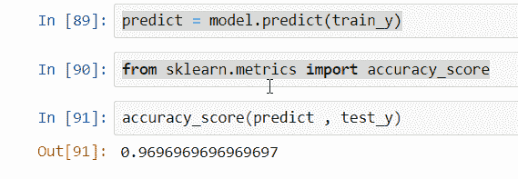

现在，这个二元分类器可以用来预测明天是否下雨。

# 总结

在本章中，我们首先介绍有监督机器学习的基础知识。然后，我们更详细地研究了各种分类算法。接下来，我们研究了评估分类器性能的不同方法，并研究了各种回归算法。我们还研究了可用于评估所研究算法性能的不同方法。

在下一章中，我们将介绍神经网络和深度学习算法。我们将介绍用于训练神经网络的方法，还将介绍用于评估和部署神经网络的各种工具和框架。*********