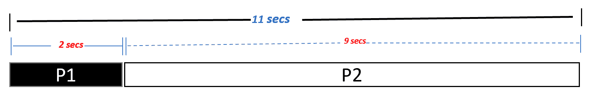
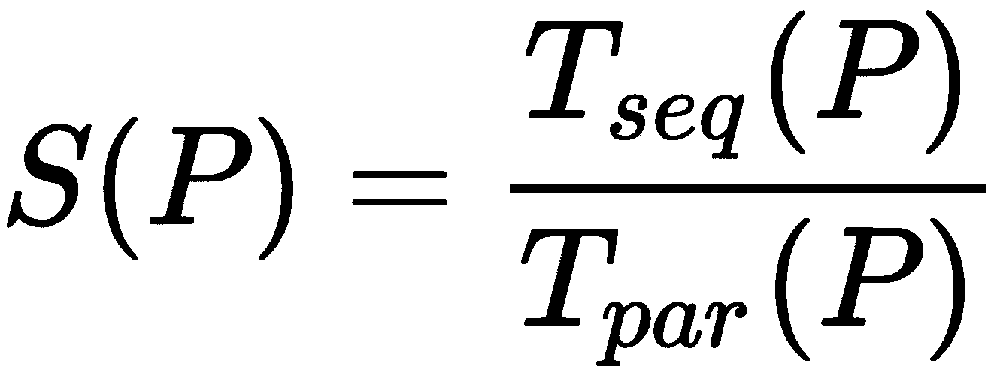
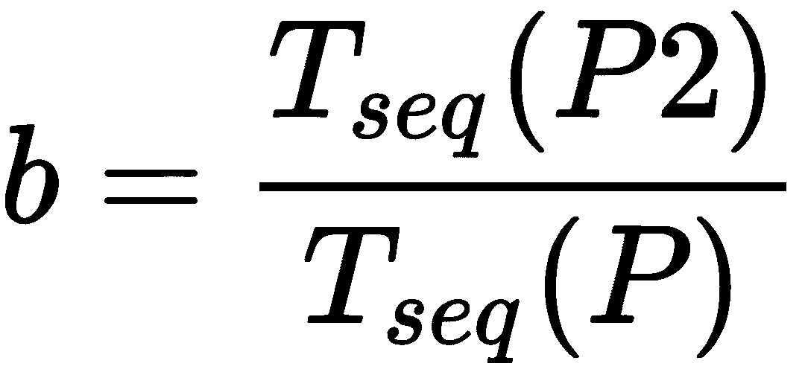
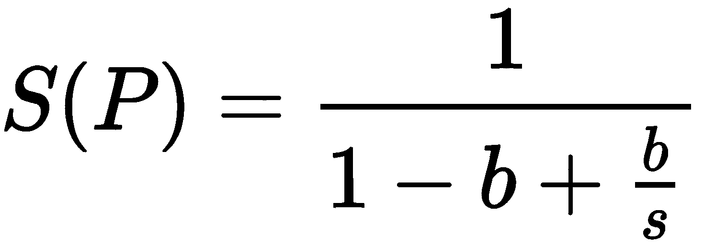
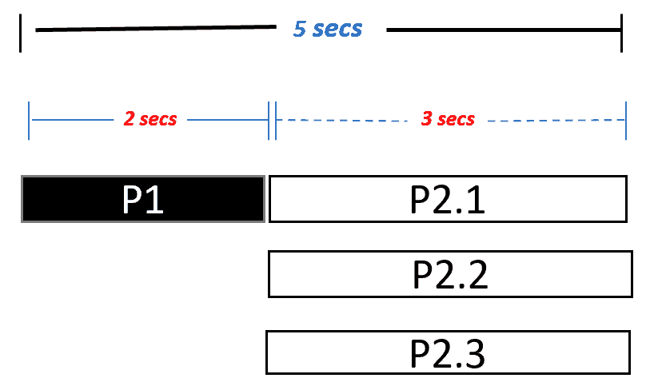
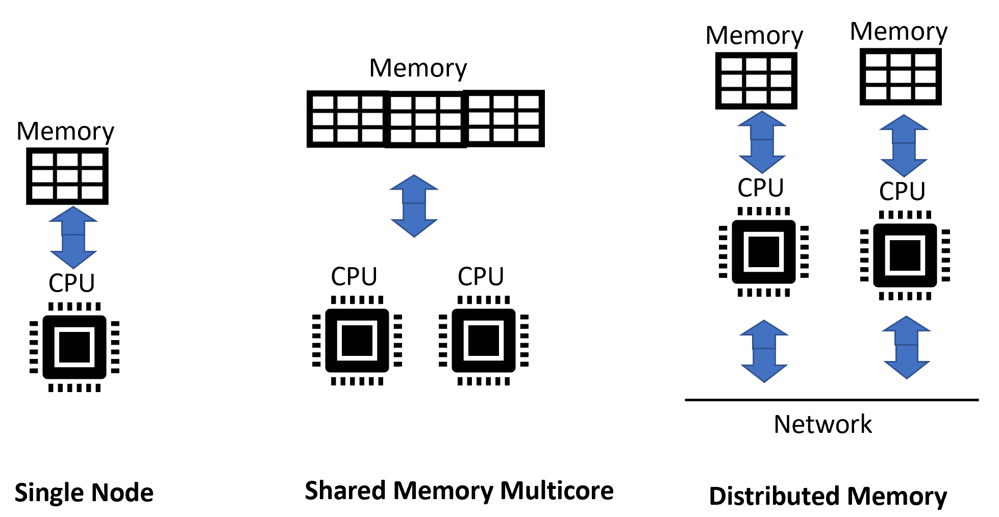
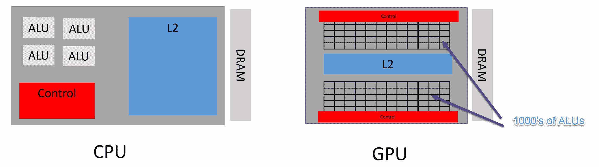
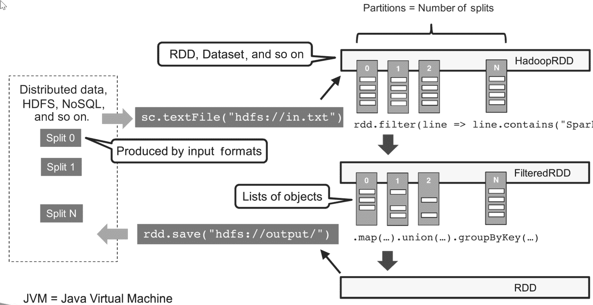
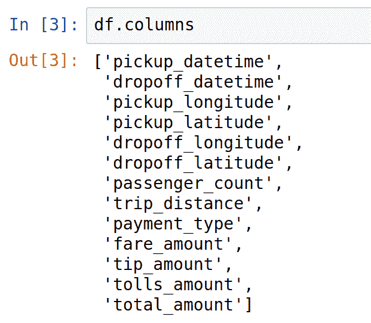
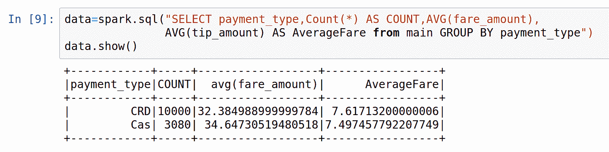

# 十三、大规模算法

大规模算法被设计用来解决巨大的复杂问题。大规模算法的特征是，由于其数据和处理需求的规模，它们需要有多个执行引擎。本章首先讨论什么类型的算法最适合并行运行。然后，讨论了并行化算法的相关问题。接下来，介绍了**计算统一设备架构****CUDA****架构，并讨论了如何使用单个**图形处理单元****GPU**或一组 GPU 来加速算法。它还讨论了需要对算法进行哪些更改以有效利用 GPU 的功能。最后，本章讨论了集群计算，并讨论了 Apache Spark 如何创建**弹性分布式数据集**（**RDDs**），以创建标准算法的极快并行实现。**

 **在本章结束时，您将能够理解与大规模算法设计相关的基本策略。

本章涵盖以下主题：

*   大规模算法简介
*   并行算法的设计
*   利用 GPU 的算法
*   理解利用集群计算的算法
*   如何使用 GPU 运行大规模算法
*   如何利用集群的能力运行大规模算法

让我们从介绍开始。

# 大规模算法简介

人类喜欢被挑战。几个世纪以来，人类的各种创新使我们能够以不同的方式解决真正复杂的问题。从预测蝗虫袭击的下一个目标区域到计算最大素数，为我们周围的复杂问题提供答案的方法不断发展。随着计算机的出现，我们发现了一种强大的解决复杂算法的新方法

# 定义设计良好的大规模算法

设计良好的大规模算法具有以下两个特点：

*   它的设计目的是以最佳方式使用可用资源池来处理大量数据和处理需求。
*   它是可伸缩的。随着问题变得更加复杂，它可以通过提供更多资源来处理复杂性。

实现大规模算法最实用的方法之一是使用分而治之策略，即将较大的问题划分为可独立解决的较小问题

# 术语

让我们研究一下可以用来量化大规模算法质量的一些术语。

# 延迟

延迟是执行单个计算所花费的端到端时间。如果*计算<sub>1</sub>*表示从*t<sub>1</sub>*开始到*t<sub>2</sub>*结束的单个计算，那么我们可以说：

*潜伏期=t<sub>2</sub>-t<sub>1</sub>*

# 吞吐量

在并行计算的上下文中，吞吐量是可以同时执行的单个计算的数量。例如，如果在*t<sub>1</sub>*可以同时执行四个计算，*C<sub>1</sub>*、*C<sub>2</sub>*、*C<sub>3</sub>*和 C<sub xmlns:epub="http://www.idpf.org/2007/ops">4</sub>，则吞吐量为四。

# 网络二分法带宽

网络两个相等部分之间的带宽称为**网络二等分带宽**。对于分布式计算工作效率，这是最重要的参数要考虑。如果我们没有足够的网络平分带宽，那么在分布式计算中使用多个执行引擎所获得的好处将被缓慢的通信链路所掩盖。

# 弹性

基础架构通过提供更多资源来应对处理需求突然增加的能力称为弹性

The three cloud computing giants, Google, Amazon, and Microsoft can provide highly elastic infrastructures. Due to the gigantic size of their shared resource pools, there are very few companies that have the potential to match the elasticity of infrastructure of these three companies.

如果基础设施是有弹性的，它可以为问题创建一个可伸缩的解决方案。

# 并行算法的设计

需要注意的是，并行算法并不是万能的。即使是设计最好的并行体系结构也可能无法提供我们所期望的性能。一个被广泛用于设计并行算法的定律是阿姆达尔定律。

# 阿姆达尔定律

吉恩·阿姆达尔是 20 世纪 60 年代最早研究并行处理的人之一。他提出了阿姆达尔定律，该定律至今仍然适用，可以成为理解设计并行计算解决方案时所涉及的各种权衡的基础。阿姆达尔定律可以解释如下：

它基于这样一个概念，即在任何计算过程中，并非所有的过程都可以并行执行。该过程将有一个无法并行化的连续部分。

让我们看一个特定的例子。假设我们想要读取存储在计算机上的大量文件，并且想要使用这些文件中的数据来训练机器学习模型。

整个过程称为 P。很明显，P 可分为以下两个子过程：

*   *P1*：扫描目录中的文件，创建与输入文件匹配的文件名列表，并传递。
*   *P2*：读取文件，创建数据处理管道，处理文件，训练模型。

# 进行顺序过程分析

运行时间*P*由*T<sub>seq</sub>**（P）*表示。运行*P1*和*P2*的时间由*T<sub>seq</sub>（P1）*和*T<sub>seq</sub>（P2）*表示。很明显，在单个节点上运行时，我们可以观察到两件事：

*   *P2*无法在 P1 完成前开始运行。这由*P1*-->*P2*表示
*   *T<sub>序列</sub>（P）=T<sub>序列</sub>（P1）+T<sub>序列</sub>（P2）*

假设 P 在单个节点上运行总共需要 10 分钟。在这 10 分钟中，P1 在单个节点上运行需要 2 分钟，P2 在单个节点上运行需要 8 分钟。如下图所示：



现在需要注意的是*P1*在本质上是顺序的。我们不能通过使它并行来加快它。另一方面，*P2*可以很容易地被分割成可以并行运行的并行子任务。因此，我们可以通过并行运行使其运行得更快。

The major benefit of using cloud computing is the availability of a large pool of resources and many of them are used in parallel. The plan to use these resources for a given problem is called an execution plan. Amdahl's law is used comprehensively to identify the bottlenecks for a given problem and a pool of resources.

# 进行并行执行分析

如果我们想使用多个节点来加速*P*，它只会影响*P2*一个*s>1*的因子：


过程 P 的加速比可以很容易地计算如下：



一个进程的可并行部分与其总量的比率由*b*表示，计算如下：



例如，在前面的场景中，*b=8/10=0.8。*

简化这些方程将得到阿姆达尔定律：



在这里，我们有以下几点：

*   *P*是整个流程。
*   *b*是*P*的可并行部分的比率。
*   *s*是*P*的可并行部分实现的加速比。

假设我们计划在三个并行节点上运行进程 P：

*   *P1*是顺序部分，不能使用并行节点进行缩减。它将保持在 2 秒。
*   *P2*现在需要 3 秒而不是 9 秒。

因此，流程*P*所花费的总时间减少为 5 秒，如下图所示：



在前面的示例中，我们可以计算以下内容：

*   *n<sub>p</sub>*=处理器数量=3
*   *b*=平行部分=9/11=81.81%
*   *s*=加速比=3

现在，让我们看一个解释阿姆达尔定律的典型图表：


在上图中，我们为*b*的不同值绘制了*s*和*n*<sub>*p*</sub>之间的图表。

# 理解任务粒度

当我们并行化一个算法时，一个较大的任务被划分为多个并行任务。找到一个作业应该划分成的并行任务的最佳数量并不总是简单的。如果并行任务太少，我们将不会从并行计算中获得太多好处。如果任务太多，那么会产生太多的开销。这是一个挑战，也称为任务粒度。

# 负载平衡

在并行计算中，调度器负责选择执行任务的资源。最佳负载平衡是一件很难实现的事情，如果没有它，资源就不会得到充分利用。

# 地方问题

在并行处理中，应阻止数据移动。只要有可能，就应该在数据所在的节点上本地处理数据，而不是移动数据，否则会降低并行化的质量。

# 在 Python 中启用并发处理

在 Python 中启用并行处理的最简单方法是克隆一个当前进程，该进程将启动一个名为**子进程**的新并发进程。

Python programmers, although not biologists, have created their own process of cloning. Just like a cloned sheep, the clone copy is the exact copy of the original process. 

# 制定多资源处理策略

最初，大规模算法被用于在称为**超级计算机**的大型机器上运行。这些超级计算机共享相同的内存空间。这些资源都是本地的，物理上放在同一台机器上。这意味着不同处理器之间的通信非常快，它们能够通过公共内存空间共享相同的变量。随着系统的发展和运行大规模算法的需求的增长，超级计算机演变为**分布式共享内存**（**DSM**，其中每个处理节点都拥有一部分物理内存。最后，开发了松散耦合的集群，它们依赖于处理节点之间的消息传递。对于大规模算法，我们需要找到多个并行运行的执行引擎来解决复杂问题：



有三种策略可以使用多个执行引擎：

*   **查看**：利用计算机上已有的资源。使用 GPU 的数百个内核运行大规模算法。
*   **向外看**：使用分布式计算来寻找更多的计算资源，这些资源可以集中用于解决手头的大规模问题。
*   **混合策略**：使用分布式计算，在每个节点上使用 GPU 或 GPU 阵列加速算法的运行。

# 介绍 CUDA

GPU 最初是为图形处理而设计的。它们的设计满足了优化处理典型计算机多媒体数据的需要。为了做到这一点，他们开发了某些特性，将它们与 CPU 区分开来。例如，与数量有限的 CPU 内核相比，它们有数千个内核。它们的时钟速度比 CPU 慢得多。GPU 有自己的 DRAM。例如，Nvidia 的 RTX 2080 有 8GB 的 RAM。请注意，GPU 是专门的处理设备，没有通用的处理单元功能，包括中断或寻址设备，例如键盘和鼠标。以下是 GPU 的体系结构：



GPU 成为主流后不久，数据科学家就开始探索 GPU 的潜力，以有效地执行并行操作。由于一个典型的 GPU 有数千个 ALU，它有可能产生 1000 个并发进程。这使得 GPU 成为为数据并行计算而优化的体系结构。因此，能够执行并行计算的算法最适合 GPU。例如，众所周知，在 GPU 中，视频中的对象搜索速度至少是 CPU 的 20 倍。[第 5 章](05.html)、*图形算法*中讨论的图形算法在 GPU 上的运行速度要比在 CPU 上的运行速度快得多。

为了实现数据科学家充分利用 GPU 实现算法的梦想，2007 年，Nvidia 创建了一个名为 CUDA 的开源框架，代表计算统一设备架构。CUDA 将 CPU 和 GPU 分别抽象为主机和设备。主机，即 CPU，负责调用设备，即 GPU。CUDA 体系结构具有不同的抽象层，可呈现如下：


请注意，CUDA 运行在 Nvidia 的 GPU 之上。它需要操作系统内核的支持。CUDA 最初是在 Linux 内核中支持的。最近，Windows 现在得到了完全支持。然后，我们有了 CUDA 驱动程序 API，它充当编程语言 API 和 CUDA 驱动程序之间的桥梁。在顶层，我们支持 C、C+和 Python。

# 基于 CUDA 的并行算法设计

让我们深入了解 GPU 如何加速某些处理操作。正如我们所知，CPU 是为数据的顺序执行而设计的，这会导致某些类应用程序的大量运行时间。让我们看看处理 1920 x 1200 大小图像的示例。可以计算出有 2204000 个像素需要处理。顺序处理意味着在传统的 CPU 上处理它们需要很长时间。现代 GPU，如 Nvidia 的特斯拉，能够产生令人难以置信的 2204000 个并行线程来处理像素。对于大多数多媒体应用程序，像素可以彼此独立处理，并将实现显著的加速。如果我们用一个线程映射每个像素，它们都可以在 O（1）恒定时间内处理。

但是，图像处理并不是我们可以使用数据并行性来加快处理速度的唯一应用程序。数据并行可以用于为机器学习库准备数据。事实上，GPU 可以大大减少可并行化算法的执行时间，包括以下内容：

*   为比特币挖矿
*   大规模模拟
*   DNA 分析
*   视频和照片分析

GPU 不是为**单程序、多数据**（**SPMD**而设计的。例如，如果我们要计算一个数据块的哈希值，那么它是一个无法并行运行的单个程序。在这种情况下，GPU 的性能会变慢。

The code that we want to run on the GPU is marked with special CUDA keywords called **kernels**. These kernels are used to mark the functions that we intend to run on GPUs for parallel processing. Based on the kernels, the GPU compiler separates which code needs to run on the GPU and the CPU.

# 在 Python 中使用 GPU 进行数据处理

GPU 非常适合多维数据结构中的数据处理。这些数据结构本质上是可并行的。让我们看看如何在 Python 中使用 GPU 进行多维数据处理：

1.  首先，让我们导入所需的 Python 包：

```py
import numpy as np
import cupy as cp
import time
```

2.  我们将在 NumPy 中使用多维数组，这是一个使用 CPU 的传统 Python 包

3.  然后，我们使用使用 GPU 的 CuPy 数组创建多维数组。然后，我们将比较时间安排：

```py
### Running at CPU using Numpy
start_time = time.time()
myvar_cpu = np.ones((800,800,800))
end_time = time.time()
print(end_time - start_time)

### Running at GPU using CuPy
start_time = time.time()
myvar_gpu = cp.ones((800,800,800))
cp.cuda.Stream.null.synchronize()
end_time = time.time()
print(end_time - start_time)
```

如果我们运行此代码，它将生成以下输出：


请注意，在 NumPy 中创建此阵列大约需要 1.13 秒，在 CuPy 中创建此阵列大约需要 0.012 秒，这使得此阵列在 GPU 中的初始化速度加快 92 倍。

# 集群计算

集群计算是实现大规模算法并行处理的方法之一。在集群计算中，我们有多个节点通过高速网络连接。大规模算法作为作业提交。每个作业都分为不同的任务，每个任务都在单独的节点上运行。

apachespark 是实现集群计算最流行的方法之一。在 Apache Spark 中，数据被转换成分布式容错数据集，称为**弹性分布式数据集**（**RDDs**。RDD 是 ApacheSpark 抽象的核心。它们是可以并行操作的不可变元素集合。它们被划分为多个分区，并分布在各个节点上，如下所示：



通过这种并行数据结构，我们可以并行运行算法

# 在 apachespark 中实现数据处理

让我们看看如何在 Apache Spark 中创建 RDD，并在集群中对其运行分布式处理：

1.  为此，首先，我们需要创建一个新的 Spark 会话，如下所示：

```py
from pyspark.sql import SparkSession
spark = SparkSession.builder.appName('cloudanum').getOrCreate()
```

2.  创建 Spark 会话后，我们将使用 CSV 文件作为 RDD 的源。然后，我们将运行以下函数，它将创建一个 RDD，该 RDD 被抽象为名为`df`的数据帧。Spark 2.0 中添加了将 RDD 抽象为数据帧的功能，这使得处理数据变得更加容易：

```py
df = spark.read.csv('taxi2.csv',inferSchema=True,header=True)
```

让我们看看 DataFrame 的列：



3.  接下来，我们可以从 DataFrame 创建一个临时表，如下所示：

```py
df.createOrReplaceTempView("main")
```

4.  创建临时表后，我们可以运行 SQL 语句来处理数据：



需要注意的一点是，尽管它看起来像一个常规数据帧，但它只是一个高级数据结构。在引擎罩下，是 RDD 在集群中传播数据。类似地，当我们在后台运行 SQL 函数时，它们被转换为并行转换器和还原器，它们充分利用集群的能力来处理代码。

# 混合战略

云计算越来越流行于运行大规模算法。这为我们提供了将*向外看*和*向内看*策略相结合的机会。这可以通过在多个虚拟机中配置一个或多个 GPU 来实现，如以下屏幕截图所示：


充分利用混合体系结构是一项非常重要的任务。这是通过首先将数据划分为多个分区来实现的。需要较少数据的计算密集型任务在 GPU 的每个节点内并行化

# 总结

在本章中，我们研究了并行算法的设计和大规模算法的设计问题。我们研究了使用并行计算和 GPU 来实现大规模算法。我们还研究了如何使用 Spark 集群来实现大规模算法。

在本章中，我们学习了与大规模算法相关的问题。我们研究了与并行化算法相关的问题以及在这个过程中产生的潜在瓶颈。

在下一章中，我们将研究实现算法的一些实际方面。**