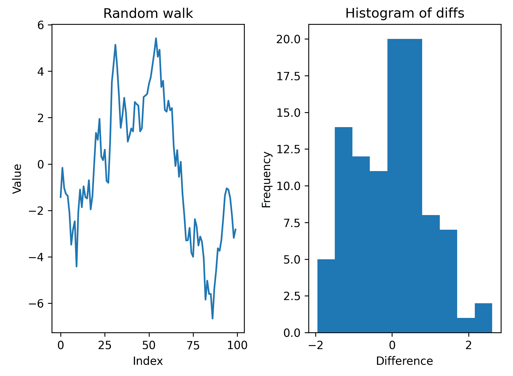
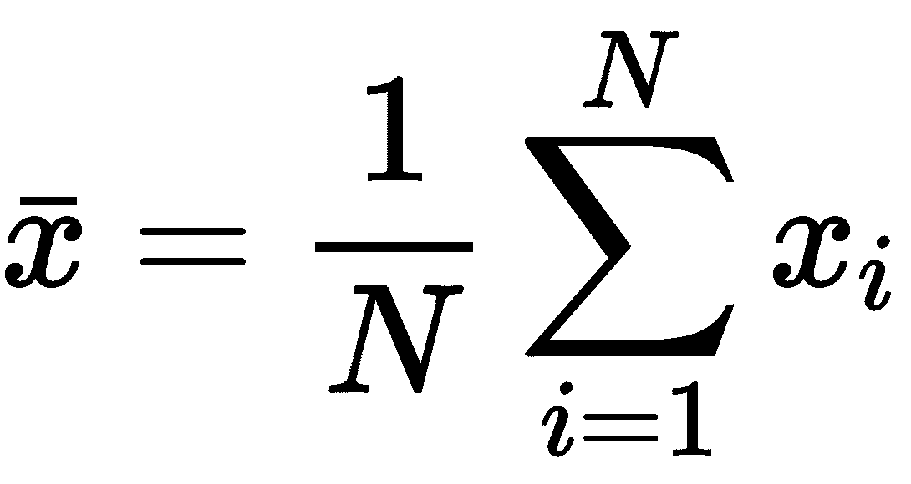
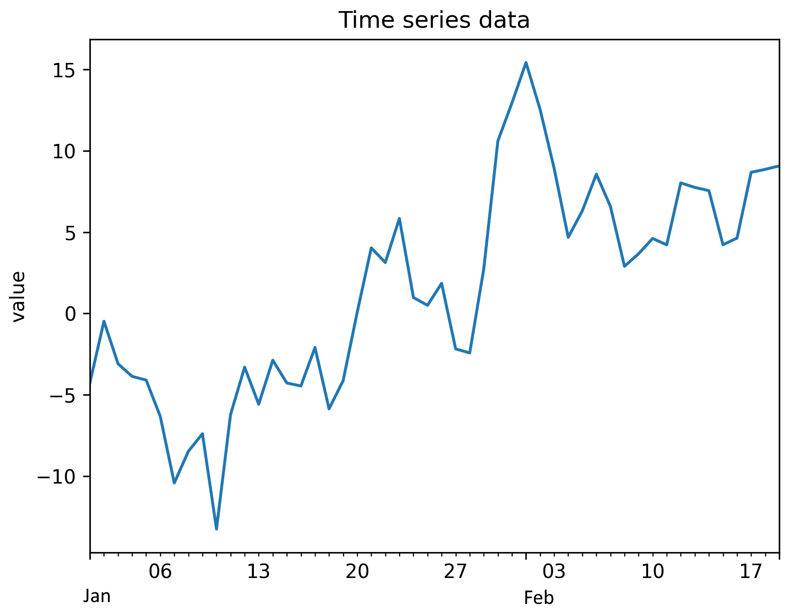

# 六、处理数据和统计

对于需要分析数据的人来说，Python 最吸引人的特性之一是庞大的数据操作和分析包生态系统，以及活跃的数据科学家社区，他们与 Python 一起工作。Python 易于使用，同时还提供了非常强大、快速的库，这使得即使是相对新手的程序员也能够快速、轻松地处理大量数据集。熊猫图书馆是许多数据科学软件包和工具的核心。Pandas 提供了两种数据容器类型，它们构建在 NumPy 数组之上，并且很好地支持标签（而不是简单的整数）。它们还使处理大型数据集变得极其容易。

统计学是运用数学，特别是概率论对数据进行的系统研究。统计有两个方面。第一种方法是找到描述一组数据的数值，包括数据的中心（平均值或中值）和分布（标准差或方差）等特征。统计的第二个方面是推断，使用相对较小的样本数据集描述更大的数据集（总体）。

在本章中，我们将了解如何利用 Python 和 pandas 处理大型数据集并执行统计测试。

本章包含以下配方：

*   创建系列和数据帧对象
*   从数据帧加载和存储数据
*   在数据帧中操作数据
*   从数据帧打印数据
*   从数据帧获取描述性统计信息
*   使用抽样了解总体
*   用 t 检验检验假设
*   使用方差分析检验假设
*   非参数数据的假设检验
*   使用 Bokeh 创建交互式绘图

# 技术要求

在本章中，我们将主要使用 pandas 库进行数据操作，该库提供了类似 R 的数据结构，如`Series`和`DataFrame`对象，用于存储、组织和操作数据。在本章的最终配方中，我们还将使用 Bokeh 数据可视化库。可以使用您喜爱的软件包管理器安装这些库，例如 pip：

```py
          python3.8 -m pip install pandas bokeh

```

我们还将使用 NumPy 和 SciPy 包。

本章的代码可以在 GitHub 存储库的[的`Chapter 06`文件夹中找到 https://github.com/PacktPublishing/Applying-Math-with-Python/tree/master/Chapter%2006](https://github.com/PacktPublishing/Applying-Math-with-Python/tree/master/Chapter%2006) 。

查看以下视频以查看代码的运行：[https://bit.ly/2OQs6NX](https://bit.ly/2OQs6NX) 。

# 创建系列和数据帧对象

Python 中的大多数数据处理都是使用 pandas 库完成的，pandas 库构建在 NumPy 的基础上，提供了用于保存数据的类似 R 的结构。这些结构允许使用字符串或除整数之外的其他 Python 对象轻松地对行和列进行索引。一旦数据被加载到 pandas`DataFrame`或`Series`中，它就可以很容易地进行操作，就像在电子表格中一样。这使得 Python 与 pandas 结合成为处理和分析数据的强大工具。

在这个配方中，我们将看到如何创建新的熊猫`Series`和`DataFrame`对象，以及如何从`Series`或`DataFrame`访问项目。

## 准备

对于此配方，我们将使用以下命令将 pandas 库作为 pd 导入：

```py
import pandas as pd
```

NumPy 包是`np`。我们还从 NumPy 创建（种子）随机数生成器，如下所示：

```py
from numpy.random import default_rng
rng = default_rng(12345)
```

## 怎么做。。。

以下步骤概述了如何创建保存数据的`Series`和`DataFrame`对象：

1.  首先，创建我们将存储在`Series`和`DataFrame`对象中的随机数据：

```py
diff_data = rng.normal(0, 1, size=100)
cumulative = np.add.accumulate(diff_data)
```

2.  接下来，创建一个包含`diff_data`的`Series`对象。我们将打印`Series`以生成数据视图：

```py
data_series = pd.Series(diff_data)
print(data_series)
```

3.  现在，创建一个包含两列的`DataFrame`对象：

```py
data_frame = pd.DataFrame({
   "diffs": data_series,
    "cumulative": cumulative
}) 
```

4.  打印`DataFrame`对象以生成其持有数据的视图：

```py
print(data_frame)
```

## 它是如何工作的。。。

pandas 包提供了`Series`和`DataFrame`类，它们反映了 R 对应的功能和能力。`Series`用于存储时间序列等一维数据，`DataFrame`用于存储多维数据；你可以把一个`DataFrame`对象想象成一个“电子表格”

`Series`与简单 NumPy`ndarray`的区别在于`Series`对其项目进行索引的方式。NumPy 数组由整数索引，这也是`Series`对象的默认值。但是，`Series`可以被任何可散列 Python 对象索引，包括字符串和`datetime`对象。这使得`Series`对于存储时间序列数据非常有用。`Series`可以通过多种方式创建。在这个方法中，我们使用了一个 NumPy 数组，但是可以使用任何 pythoniterable，比如 list。

`DataFrame`对象中的每一列都是包含行的序列，就像传统数据库或电子表格中一样。在这个配方中，当通过字典的键构造`DataFrame`对象时，列被赋予标签。

`DataFrame`和`Series`对象在打印时创建它们所包含数据的摘要。这包括列名、行数和列数以及框架（系列）的第一行和最后五行。这对于快速获取对象及其包含的数据分布的概览非常有用。

## 还有更多。。。

`Series`对象的各行（记录）可以通过提供相应的索引，使用常用的索引表示法进行访问。我们还可以使用特殊的`iloc`属性对象，通过行的数字位置访问行。这允许我们通过数字（整数）索引访问行，例如使用 Python 列表或 NumPy 数组。

`DataFrame`对象中的列可以使用通常的索引表示法访问，并提供列的名称。其结果是一个包含所选列数据的`Series`对象。DataFrames 还提供了两个可用于访问数据的属性。`loc`属性通过索引提供对单个行的访问，无论该对象是什么。`iloc`属性通过数字索引提供对行的访问，就像对`Series`对象一样。

您可以向`loc`提供选择标准（或仅使用对象的索引符号）来选择数据。这包括单个标签、标签列表、标签片段或布尔数组（大小适当）。`iloc`选择方法接受类似的标准。

除了我们在这里描述的简单方法之外，还有其他方法可以从`Series`或`DataFrame`对象中选择数据。例如，我们可以使用`at`属性访问对象中指定行（和列）的单个值。

## 另见

pandas 文档详细描述了在[处创建和索引`DataFrame`或`Series`对象的不同方法 https://pandas.pydata.org/docs/user_guide/indexing.html](https://pandas.pydata.org/docs/user_guide/indexing.html) 。

# 从数据帧加载和存储数据

在 Python 会话中，从原始数据创建`DataFrame`对象是相当不寻常的。实际上，数据通常来自外部源，如现有的电子表格或 CSV 文件、数据库或 API 端点。出于这个原因，pandas 提供了许多实用程序，用于将数据加载和存储到文件中。pandas 支持从 CSV、Excel（`xls`或`xlsx`）、JSON、SQL、Parquet 和 Google BigQuery 加载和存储数据。这使得将数据导入 pandas，然后使用 Python 操作和分析这些数据变得非常容易。

在这个配方中，我们将看到如何将数据加载并存储到 CSV 文件中。有关加载数据并将其存储为其他文件格式的说明与此类似。

## 准备

对于此配方，我们需要在`pd`别名下导入 pandas 包，并将 NumPy 库作为`np`导入，然后使用以下命令从 NumPy 创建默认随机数生成器：

```py
from numpy.random import default_rng
rng = default_rng(12345) # seed for example
```

## 怎么做。。。

按照以下步骤将数据存储到文件中，然后将数据加载回 Python：

1.  首先，我们将使用随机数据创建一个样本`DataFrame`对象。然后我们打印这个`DataFrame`对象，以便我们可以将其与稍后读取的数据进行比较：

```py
diffs = rng.normal(0, 1, size=100)
cumulative = np.add.accumulate(diffs)

data_frame = pd.DataFrame({
    "diffs": diffs, 
    "cumulative": cumulative
})
print(data_frame)
```

2.  我们将使用`DataFrame`对象上的`to_csv`方法将此`DataFrame`对象中的数据存储到`sample.csv`文件中。我们将使用`index=False`关键字参数，以便索引不会存储在 CSV 文件中：

```py
data_frame.to_csv("sample.csv", index=False)
```

3.  现在，我们可以使用 pandas 的`read_csv`例程将`sample.csv`文件读入新的`DataFrame`对象。我们将打印此对象以显示结果：

```py
df = pd.read_csv("sample.csv", index_col=False)
print(df)
```

## 它是如何工作的。。。

这个食谱的核心是大熊猫的`read_csv`程序。此例程将路径或类似文件的对象作为参数，并将文件内容作为 CSV 数据读取。我们可以使用`sep`关键字参数自定义分隔符，默认情况下该参数为逗号（`,`。还提供了自定义列标题和自定义每列类型的选项。

`DataFrame`或`Series`中的`to_csv`方法将内容存储到 CSV 文件中。我们在这里使用了`index`关键字参数，这样索引就不会打印到文件中。这意味着 pandas 将根据 CSV 文件中的行号推断索引。如果数据是由整数索引的，则这种行为是可取的，但如果数据是由时间或日期索引的，则可能不是这种情况。我们还可以使用这个关键字参数来指定 CSV 文件中的哪个列是索引列。

## 另见

有关支持的文件格式列表，请参见熊猫文档，网址为[https://pandas.pydata.org/docs/reference/io.html](https://pandas.pydata.org/docs/reference/io.html) [。](https://pandas.pydata.org/docs/reference/io.html)

# 在数据帧中操作数据

一旦我们有了`DataFrame`中的数据，我们通常需要对数据进行一些简单的转换或过滤，然后才能执行任何分析。例如，这可能包括筛选缺少数据的行或将函数应用于单个列。

在本配方中，我们将了解如何对`DataFrame`对象执行一些基本操作，以准备数据进行分析。

## 准备

对于此配方，我们需要在`pd`别名下导入`pandas`包，在`np`别名下导入 NumPy 包，以及使用以下命令从 NumPy 创建的默认随机数生成器对象：

```py
from numpy.random import default_rng
rng = default_rng(12345)
```

## 怎么做。。。

以下步骤说明了如何在熊猫`DataFrame`上执行一些基本过滤和操作：

1.  我们将首先使用随机数据创建一个样本`DataFrame`：

```py
three = rng.uniform(-0.2, 1.0, size=100)
three[three < 0] = np.nan

data_frame = pd.DataFrame({
    "one": rng.random(size=100),
    "two": np.add.accumulate(rng.normal(0, 1, size=100)),
    "three": three
})
```

2.  接下来，我们必须从现有列生成一个新列。如果`"one"`列对应的条目大于`0.5`，则此新列将保持`True`，否则`False`列将保持：

```py
data_frame["four"] = data_frame["one"] > 0.5
```

3.  我们现在必须创建一个新函数，将其应用于我们的`DataFrame`。此函数将第`"two"`行的值乘以第`"one"`行和第`0.5`行的最大值（编写此函数有更简洁的方法）：

```py
def transform_function(row):
    if row["four"]:
        return 0.5*row["two"]
    return row["one"]*row["two"]
```

4.  现在，我们将对 DataFrame 中的每一行应用前面定义的函数，以生成一个新列。我们还将打印更新后的数据框，以便稍后进行比较：

```py
data_frame["five"] = data_frame.apply(transform_function, axis=1)
print(data_frame)
```

5.  最后，我们必须过滤掉数据帧中包含**而不是数字**（**NaN**值的行。我们将打印生成的数据帧：

```py
df = data_frame.dropna()
print(df)
```

## 它是如何工作的。。。

只需将新列分配给新列索引，即可将新列添加到现有的`DataFrame`。然而，在这方面需要注意一些。在某些情况下，pandas 将为`DataFrame`对象创建一个“视图”，而不是复制，在这种情况下，指定给新列可能不会产生预期效果。熊猫文件（[中对此进行了讨论 https://pandas.pydata.org/pandas-docs/stable/user_guide/indexing.html#returning-a-view-vs-a-copy](https://pandas.pydata.org/pandas-docs/stable/user_guide/indexing.html#returning-a-view-versus-a-copy)。

Pandas`Series`对象（a`DataFrame`中的列）支持丰富的比较运算符，例如相等和小于或大于（在本配方中，我们使用了大于运算符）。这些比较运算符返回一个`Series`，其中包含与比较为真和假的位置相对应的布尔值。反过来，这可以用于索引原始序列，并仅获取比较结果为真的行。在这个配方中，我们只是将这一系列布尔值添加到原始的`DataFrame`。

`apply`方法接受一个函数（或其他可调用函数）并将其应用于数据帧中的每一列。在这个配方中，我们希望将函数应用于每一行，因此我们使用`axis=1`关键字参数将函数应用于数据帧中的每一行。在这两种情况下，函数都提供了一个由行（列）索引的`Series`对象。我们还对每一行应用了一个函数，该函数返回一个使用每一行的数据计算的值。实际上，如果 DataFrame 包含大量行，则此应用程序将非常慢。如果可能的话，您应该使用设计用于操作 NumPy 阵列的函数对整个列进行操作，以提高效率。这对于对数据帧列中的值执行简单算术尤其如此。与 NumPy 阵列一样，`Series`对象实现标准算术运算，这可以大大缩短大型数据帧的运算时间。

在这个配方的最后一步中，我们使用`dropna`方法快速地只从数据帧中选择不包含 NaN 值的行。Pandas 使用 NaN 表示数据帧中缺少的数据，因此此方法选择不包含缺少值的行。此方法返回原始`DataFrame`对象的视图，但也可以通过传递`inplace=True`关键字参数来修改原始数据帧。正如在本配方中使用的，这大致相当于使用索引表示法使用包含布尔值的索引数组来选择行。

You should always be cautious when modifying original data directly since it might not be possible to return to this data to repeat your analysis later. If you do need to modify the data directly, you should make sure that it is either backed up or that the modifications do not remove data that you might later need.

## 还有更多。。。

大多数程序都以合理的方式处理缺失数据（NaN）。但是，如果您确实需要删除或替换数据帧中丢失的数据，那么有几种方法可以做到这一点。在这个配方中，我们使用了`dropna`方法简单地从数据帧中删除丢失数据的行。我们可以使用`fillna`方法用特定值填充所有缺失值，或者使用`interpolate`方法用周围值插值缺失值。

更一般地，我们可以使用`replace`方法将特定（非 NaN）值替换为其他值。此方法可以处理数值或字符串值，包括与正则表达式的模式匹配。

`DataFrame`类有许多有用的方法。我们在这里只介绍了最基本的方法，但是还有两种方法我们也应该提到。这些是`agg`方法和`merge`方法。

`agg`方法聚合数据帧给定轴上一个或多个操作的结果。这使我们能够通过应用聚合函数快速生成每列（或每行）的摘要信息。输出是一个数据框，其中包含应用为行的函数名称，以及选定轴的标签（例如列标签）。

`merge`方法在两个数据帧上执行类似 SQL 的连接。这将生成一个包含联接结果的新数据帧。可以将各种参数传递给`how`关键字参数，以指定要执行的合并类型，默认值为`inner`。如果两个`DataFrame`对象包含相同的键，则执行联接的列或索引的名称应传递给`on`关键字参数，或者传递给`left_on`和`right_on`。

# 从数据帧打印数据

与许多数学问题一样，要想找到将问题和所有信息可视化的方法，第一步就是制定策略。对于基于数据的问题，这通常意味着生成一个数据图，并直观地检查它的趋势、模式和底层结构。由于这是一种常见的操作，pandas 提供了一个快速简单的界面，用于以各种形式绘制数据，默认情况下，直接从`Series`或`DataFrame`在引擎盖下使用 Matplotlib。

在这个配方中，我们将看到如何直接从`DataFrame`或`Series`绘制数据，以了解潜在的趋势和结构。

## 准备

对于此配方，我们需要熊猫库导入为`pd`、NumPy 库导入为`np`、matplotlib`pyplot`模块导入为`plt`，以及使用以下命令创建的默认随机数生成器实例：

```py
from numpy.random import default_rng
rng = default_rng(12345)
```

## 怎么做。。。

按照以下步骤使用随机数据创建一个简单的数据框，并生成其包含的数据的绘图：

1.  使用随机数据创建示例数据帧：

```py
diffs = rng.standard_normal(size=100)
walk = np.add.accumulate(diffs)
df = pd.DataFrame({
    "diffs": diffs,
    "walk": walk
})
```

2.  接下来，我们必须创建一个空白图形，其中有两个子图可供绘制：

```py
fig, (ax1, ax2) = plt.subplots(1, 2, tight_layout=True)
```

3.  我们必须将`walk`列绘制为标准的折线图。这是通过使用`Series`（列）对象上的`plot`方法完成的，无需附加参数。我们将通过传递`ax=ax1`关键字参数在`ax1`上强制绘图：

```py
df["walk"].plot(ax=ax1, title="Random walk")
ax1.set_xlabel("Index")
ax1.set_ylabel("Value")
```

4.  现在，我们必须通过将`kind="hist"`关键字参数传递给`plot`方法来绘制`diffs`列的直方图：

```py
df["diffs"].plot(kind="hist", ax=ax2, title="Histogram of diffs")
ax2.set_xlabel("Difference")
```

结果图如下所示：



Figure 6.1 – Plot of the walk value and a histogram of differences from a DataFrame

## 它是如何工作的。。。

`Series`（或`DataFrame`上的`plot`方法是根据行索引绘制数据的快速方法。`kind`关键字参数用于控制生成的绘图类型，默认为线形绘图。绘图类型有很多选项，包括垂直条形图的`bar`、水平条形图的`barh`、柱状图的`hist`（也可以在本配方中看到）、方框图的`box`和散点图的`scatter`。还有其他几个关键字参数用于自定义它生成的绘图。在这个配方中，我们还提供了`title`关键字参数来为每个子批次添加标题。

由于我们希望使用已经创建的子图将两个图并排放置在同一个图形上，因此我们使用`ax`关键字参数将各自的轴句柄传递给绘图例程。即使您让`plot`方法构建自己的图形，您可能仍然需要使用`plt.show`例程以显示具有特定设置的图形。

## 还有更多。。。

我们可以使用 pandas 界面生成几种常见类型的绘图。除了本配方中提到的以外，还包括散点图、条形图（水平条和垂直条）、面积图、饼图和方框图。`plot`方法还接受各种关键字参数来定制绘图的外观。

# 从数据帧获取描述性统计信息

描述性统计或汇总统计是与一组数据关联的简单值，例如平均值、中值、标准偏差、最小值、最大值和四分位值。这些值以各种方式描述数据集的位置和分布。平均值和中位数是数据中心（位置）的度量，其他值是从平均值和中位数度量数据的扩散。这些统计数据对于理解数据集至关重要，并构成许多分析技术的基础。

在这个配方中，我们将看到如何为数据框中的每一列生成描述性统计信息。

## 准备

对于此配方，我们需要将 pandas 包导入为`pd`，将 NumPy 包导入为`np`，将 matplotlib`pyplot`模块导入为`plt`，并使用以下命令创建默认随机数生成器：

```py
from numpy.random import default_rng
rng = default_rng(12345)
```

## 怎么做。。。

以下步骤显示如何为数据帧中的每列生成描述性统计信息：

1.  我们将首先创建一些可以分析的样本数据：

```py
uniform = rng.uniform(1, 5, size=100)
normal = rng.normal(1, 2.5, size=100)
bimodal = np.concatenate([rng.normal(0, 1, size=50), 
    rng.normal(6, 1, size=50)])
df = pd.DataFrame({
    "uniform": uniform, 
    "normal": normal, 
    "bimodal": bimodal
})
```

2.  接下来，我们绘制数据的直方图，以便了解数据帧中数据的分布：

```py
fig, (ax1, ax2, ax3) = plt.subplots(1, 3, tight_layout=True)

df["uniform"].plot(kind="hist", title="Uniform", ax=ax1)
df["normal"].plot(kind="hist", title="Normal", ax=ax2)
df["bimodal"].plot(kind="hist", title="Bimodal", ax=ax3, bins=20)
```

3.  Pandas`DataFrame`对象有一种方法可以获得每列的几种常见描述性统计数据。`describe`方法创建一个新的数据框，其中列标题与原始对象中的相同，每行包含不同的描述性统计信息：

```py
descriptive = df.describe()
```

4.  我们还计算了*峰度*，并将其添加到我们刚刚获得的新数据帧中。我们还将描述性统计数据打印到控制台，以查看值：

```py
descriptive.loc["kurtosis"] = df.kurtosis()
print(descriptive)
#             uniform     normal    bimodal
# count    100.000000 100.000000 100.000000
# mean       2.813878   1.087146   2.977682
# std        1.093795   2.435806   3.102760
# min        1.020089  -5.806040  -2.298388
# 25%        1.966120  -0.498995   0.069838
# 50%        2.599687   1.162897   3.100215
# 75%        3.674468   2.904759   5.877905
# max        4.891319   6.375775   8.471313
# kurtosis  -1.055983   0.061679  -1.604305
```

5.  最后，我们将垂直线添加到直方图中，以说明每种情况下的平均值：

```py
uniform_mean = descriptive.loc["mean", "uniform"]
normal_mean = descriptive.loc["mean", "normal"]
bimodal_mean = descriptive.loc["mean", "bimodal"]
ax1.vlines(uniform_mean, 0, 20)
ax2.vlines(uniform_mean, 0, 25)
ax3.vlines(uniform_mean, 0, 20)
```

产生的直方图如下所示：


Figure 6.2 – Histograms of three sets of data with their mean values indicated

## 它是如何工作的。。。

`describe`方法返回一个数据框，其中包含以下数据描述性统计的行：计数、平均值、标准偏差、最小值、25%四分位数、中位数（50%四分位数）、75%四分位数和最大值。计数是相当不言自明的，最小值和最大值也是如此。平均值和中位数是数据的两个不同的*平均值*，大致代表数据的中心值。以一种熟悉的方式将平均值定义为所有值的总和除以值的数量。我们可以使用以下公式表示该数量：



这里，*x<sub>i</sub>*值代表数据值，*N*是值的个数（计数）。在这里，我们还采用了常用的条形表示法来表示平均值。对所有数据进行排序时，中位数为“中间值”（如果值为奇数，则取两个中间值的平均值）。25%和 75%的四分位值的定义类似，但在排序值中取 25%或 75%的值。您可能还认为最小值为 0%四分位数，最大值为 100%四分位数。

**标准差**是数据从平均值扩散的度量，与统计学中经常提到的另一个量**方差***相关。*方差是标准偏差的平方，定义如下：


您可能还会看到*N–*1 出现在这里的分数中，这是对**偏差**的修正，该偏差是根据样本估算总体参数时产生的。我们将在下一个配方中讨论总体参数及其估计。标准差、方差、四分位数以及最大值和最小值描述了数据的传播。例如，如果最大值为 5，最小值为 0，25%的四分位数为 2，75%的四分位数为 4，则这表示数据的大部分（实际上至少 50%）集中在 2 和 4 之间。

*峰度*是测量数据集中在分布的“尾部”（远离平均值）的程度。这并不像我们在本配方中讨论的其他数量那样常见，但它确实出现在一些分析中。我们在这里包含它主要是为了演示如何使用此处适当命名的方法`kurtosis`计算`describe`方法返回的数据帧中未出现的汇总统计值。当然，计算平均值（`mean`、标准偏差（`std`）和`describe`方法中的其他量有不同的方法。

When pandas computes the quantities described in this recipe, it will automatically ignore any "missing values" represented by NaN. This will also be reflected in the count reported in the descriptive statistics.

## 还有更多。。。

我们在统计数据中包含的第三个数据集说明了查看数据以确保我们计算的值有意义的重要性。事实上，我们计算的平均值约为`2.9`，但从柱状图上看，很明显大多数数据与该值相差甚远。我们应该经常检查我们计算的汇总统计数据是否准确汇总了样本中的数据。简单地引用平均值可能会给出样本的不准确表示。

# 使用抽样了解总体

统计学中的一个核心问题是，在一个小（随机）样本的情况下，对整个人口的分布进行估计并量化这些估计的好坏。一个典型的例子是在测量随机选择的人群样本的身高时，估计一个国家所有人的平均身高。当真实的人口分布（我们通常指的是整个人口的平均数）无法切实测量时，这类问题尤其令人感兴趣。在这种情况下，我们必须依靠我们的统计知识和（通常小得多）随机选择的样本来估计真实的总体平均值和标准偏差，并量化我们的估计有多好。正是后者导致了更广泛世界中统计数据的混乱、误解和误传。

在这个配方中，我们将看到如何估计总体平均值，并给出这些估计值的**置信区间**。

## 准备

对于这个配方，我们需要熊猫包导入为`pd`、Python 标准库中的`math`模块和 SciPy`stats`模块，使用以下命令导入：

```py
from scipy import stats
```

## 怎么做。。。

在以下步骤中，我们将根据随机抽取的 20 人样本，估算英国男性的平均身高：

1.  我们必须将样本数据加载到 pandas`Series`中：

```py
sample_data = pd.Series(
    [172.3, 171.3, 164.7, 162.9, 172.5, 176.3, 174.8, 171.9, 
     176.8, 167.8, 164.5, 179.7, 157.8, 170.6, 189.9, 185\. , 
     172.7, 165.5, 174.5, 171.5]
)
```

2.  接下来，我们将计算样本平均值和标准偏差：

```py
sample_mean = sample_data.mean()
sample_std = sample_data.std()
print(f"Mean {sample_mean}, st. dev {sample_std}")
# Mean 172.15, st. dev 7.473778724383846
```

3.  然后，我们将计算**标准误差***如下：*

```py
N = sample_data.count()
std_err = sample_std/math.sqrt(N)
```

4.  我们将从学生*t*分布中计算我们期望的置信值的**临界值**：

```py
cv_95, cv_99 = stats.t.ppf([0.975, 0.995], df=N-1)
```

5.  现在，我们可以使用以下代码计算真实总体平均值的 95%和 99%置信区间：

```py
pm_95 = cv_95*std_err
conf_interval_95 = [sample_mean - pm_95, sample_mean + pm_95]
pm_99 = cv_99*std_err
conf_interval_99 = [sample_mean - pm_99, sample_mean + pm_99]

print("95% confidence", conf_interval_95)
# 95% confidence [168.65216388659374, 175.64783611340627]
print("99% confidence", conf_interval_99)
# 99% confidence [167.36884119608774, 176.93115880391227]
```

## 它是如何工作的。。。

参数估计的关键是正态分布，我们在[第 4 章](04.html)、*中讨论了随机性和概率*。如果我们找到一个标准正态分布随机数低于该值的概率为 97.5%的*z*临界值，那么该数字位于-*z*和*z*之间的概率为 95%（每尾 2.5%）。*z*的临界值为 1.96，四舍五入到小数点后 2 位。也就是说，我们可以 95%确定标准正态分布随机数的值位于*-z*和*z*之间。同样，99%置信度的临界值为 2.58（四舍五入至小数点后 2 位）。

如果我们的样本“大”，我们可以调用**中心极限定理**，它告诉我们，即使总体本身不是正态分布，从该总体中抽取的随机样本的平均值也将是正态分布，与整个总体的平均值相同。然而，这仅在假设我们的样品很大的情况下有效。在这个配方中，样本并不多，它只有 20 个值，这与英国男性人口相比肯定不是很大。这意味着，与正态分布不同，我们必须使用具有*N-*1 自由度的 student*t*分布来找到我们的临界值，其中*N*是我们样本的大小。为此，我们使用 SciPy`stats`模块中的`stats.t.ppf`例程。

student*t*分布与正态分布相关，但有一个参数，即改变分布形状的自由度。随着自由度的增加，student*t*分布将越来越像正态分布。你认为分布足够相似的点取决于你的应用程序和你的数据。一般的经验法则是，30 的样本量足以调用中心极限定理并简单地使用正态分布，但这绝不是一个好的规则。在根据样本进行扣减时，尤其是当样本与总人口相比非常小时，你应该非常小心。（显然，如果总人口由 30 人组成，那么使用 20 人的样本量将非常具有描述性，但如果总人口由 3000 万人组成，则不具有描述性。）

一旦我们有了临界值，真实总体平均值的置信区间可以通过将临界值乘以样本的标准误差并从样本平均值中加上或减去来计算。标准误差是给定样本量的样本均值分布与真实总体均值的近似值。这就是为什么我们使用标准误差来给出估计总体平均值的置信区间。当我们将标准误差乘以取自 student*t*分布的临界值时（在本例中），我们获得了给定置信水平下观察样本平均值与真实总体平均值之间最大差异的估计值。

在这个配方中，这意味着我们 95%确定英国男性的平均身高在 168.7 厘米到 175.6 厘米之间，99%确定英国男性的平均身高在 167.4 厘米到 176.9 厘米之间。事实上，我们的样本来自一个平均值为 175.3 厘米、标准偏差为 7.2 厘米的人群。这个真实的平均值（175.3 厘米）确实在我们的两个置信区间内，但仅在一个范围内。

## 另见

有一个名为`uncertainties`的有用软件包，用于计算带有不确定性的数值。参见[第 10 章](10.html)*杂项主题*中的*计算不确定性核算*配方。

# 用 t 检验检验假设

统计学中最常见的任务之一是测试关于正态分布总体平均值的假设的有效性，假设您已从该总体中收集样本数据。例如，在质量控制中，我们可能希望测试在轧机上生产的板材的厚度是否为 2 mm。为了测试这一点，我们将随机选择样本并测量厚度，以获得样本数据。然后，我们可以使用一个**t 检验**来检验我们的无效假设*H<sub>0</sub>*，即平均纸张厚度为 2mm，而不是替代假设*H<sub>1</sub>*，即平均纸张厚度不是 2mm。我们使用 SciPy`stats`模块计算*t*统计量*和*p*值。如果*p*值低于 0.05，则我们接受具有 5%显著性（95%置信度）的零假设。如果*p*值大于 0.05，那么我们必须拒绝无效假设，支持我们的替代假设。*

 *在这个配方中，我们将看到如何使用 t 检验来测试给定样本的假设总体平均值是否有效。

## 准备

对于该配方，我们需要将 pandas 包作为`pd`导入，并使用以下命令导入 SciPy`stats`模块：

```py
from scipy import stats
```

## 怎么做。。。

按照以下步骤使用 t 检验测试给定一些样本数据的拟定总体平均值的有效性：

1.  我们将首先将数据加载到 pandas`Series`中：

```py
sample = pd.Series([
    2.4, 2.4, 2.9, 2.6, 1.8, 2.7, 2.6, 2.4, 2.8, 2.4, 2.4,
    2.4, 2.7, 2.7, 2.3, 2.4, 2.4, 3.2, 2.2, 2.5, 2.1, 1.8,
    2.9, 2.5, 2.5, 3.2, 2\. , 2.3, 3\. , 1.5, 3.1, 2.5, 3.1,
    2.4, 3\. , 2.5, 2.7, 2.1, 2.3, 2.2, 2.5, 2.6, 2.5, 2.8,
    2.5, 2.9, 2.1, 2.8, 2.1, 2.3
])
```

2.  现在，设置我们将测试的假设总体平均值和显著性水平：

```py
mu0 = 2.0
significance = 0.05
```

3.  接下来，使用 SciPy`stats`模块中的`ttest_1samp`例程生成*t*统计量和*p*值：

```py
t_statistic, p_value = stats.ttest_1samp(sample, mu0)
print(f"t stat: {t_statistic}, p value: {p_value}")
# t stat: 9.752368720068665, p value: 4.596949515944238e-13
```

4.  最后，测试*p*值是否小于我们选择的显著性水平：

```py
if p_value <= significance:
    print("Reject H0 in favour of H1: mu != 2.0")
else:
    print("Accept H0: mu = 2.0")
# Reject H0 in favour of H1: mu != 2.0
```

## 它是如何工作的。。。

*t*统计量使用以下公式计算：


此处，*μ<sub>0</sub>*为假设平均值（来自零假设），*x*条为样本平均值，*s*为样本标准偏差，*N*为样本大小。*t*统计量是对观察样本平均数和假设总体平均数*μ<sub>0</sub>*之间差异的估计，通过标准误差进行归一化。假设人口为正态分布，*t*统计将遵循*t*分布，其中*N*-1 自由度。通过观察 t 统计量在相应的 student*t*分布中的位置，我们可以了解到，我们观察到的样本平均值来自具有假设平均值的人群的可能性有多大。这是以*p*值的形式给出的。

*p*值是在假设总体平均值等于*μ<sub>0</sub>*的情况下，观察到比我们观察到的样本平均值更极端的值的概率。如果*p*值小于我们选择的显著性值，那么我们不能期望真实总体平均值是我们假设的值*μ<sub>0</sub>*。在这种情况下，我们必须接受另一种假设，即真实总体范数不等于*μ<sub>0</sub>*。

## 还有更多。。。

我们在这个配方中演示的测试是 t 检验的最基本用法。在这里，我们将样本平均数与假设的总体平均数进行比较，以确定总体平均数为该假设值是否合理。更一般地说，我们可以使用 t 检验来比较两个独立的群体，使用**2 样本 t 检验**，或者使用**配对 t 检验**来比较数据配对的群体（以某种方式）。这使得 t 检验成为统计学家的重要工具。

显著性和置信度是统计学中经常出现的两个概念。一个统计上显著的结果是一个很有可能是正确的结果。在许多情况下，我们考虑任何在某个阈值（通常为 5%或 1%）以下的概率都有统计学意义的结果。信心是我们对结果的确定程度的量化。结果的置信度为 1 减去显著性。

不幸的是，结果的意义往往被误用或误解。如果说一个结果在统计上有 5%的显著性，那就是说我们有 5%的机会错误地接受了无效假设。也就是说，如果我们在人群中的 20 个其他样本上重复相同的测试，我们预计其中至少有一个会给出相反的结果。然而，这并不是说他们中的一个一定会这样做。

意义重大表明，我们更确信我们得出的结论是正确的，但这肯定不能保证事实确实如此。事实上，在这个配方中发现的结果就是这方面的证据；我们使用的样本实际上是从一个平均值为`2.5`且标准偏差为`0.35`的人群中抽取的。（在创建后对样本进行了一些舍入，这将略微改变分布。）这并不是说我们的分析是错误的，或者我们从样本得出的结论不是正确的。

重要的是要记住，t 检验只有在基础种群服从正态分布时才有效，或者至少在近似服从正态分布时才有效。如果不是这样，则可能需要使用非参数测试。我们将在非参数数据配方的*测试假设中讨论这一点。*

# 使用方差分析检验假设

假设我们设计了一个实验，针对当前流程测试两个新流程，我们想测试这些新流程的结果是否与当前流程不同。在这种情况下，我们可以使用**方差分析***（**方差分析**）来帮助我们确定三组结果的平均值之间是否存在任何差异（为此，我们需要假设每个样本来自具有共同方差的正态分布）。*

 *在这个配方中，我们将看到如何使用方差分析来比较多个样本。

## 准备

对于这个配方，我们需要 SciPy`stats`模块。我们还需要使用以下命令创建默认随机数生成器实例：

```py
from numpy.random import default_rng
rng = default_rng(12345)
```

## 怎么做。。。

按照以下步骤执行（单向）方差分析测试，以测试三个不同过程之间的差异：

1.  首先，我们将创建一些样本数据，并对其进行分析：

```py
current = rng.normal(4.0, 2.0, size=40)
process_a = rng.normal(6.2, 2.0, size=25)
process_b = rng.normal(4.5, 2.0, size=64)
```

2.  接下来，我们将设置测试的显著性级别：

```py
significance = 0.05
```

3.  然后，我们将使用 SciPy`stats`模块中的`f_oneway`例程生成 F 统计量和*p*值：

```py
F_stat, p_value = stats.f_oneway(current, process_a, process_b)
print(f"F stat: {F_stat}, p value: {p_value}")
# F stat: 9.949052026027028, p value: 9.732322721019206e-05
```

4.  现在，我们必须测试*p*值是否足够小，以确定我们是否应该接受或拒绝所有平均值相等的零假设：

```py
if p_value <= significance:
    print("Reject H0: there is a difference between means")
else:
    print("Accept H0: all means equal")
# Reject H0: there is a difference between means
```

## 它是如何工作的。。。

方差分析是一种同时比较多个样本的强大技术。其工作原理是将样本中的变化与总体变化进行比较。方差分析在比较三个或更多样本时尤其有效，因为运行多个测试不会产生累积误差。不幸的是，如果方差分析检测到并非所有的平均值都相等，则无法从测试信息中确定哪些样本与其他样本显著不同。为此，您需要使用额外的测试来找出差异。

`f_oneway`SciPy`stats`包例程执行单向 ANOVA 检验。ANOVA 中生成的检验统计量遵循 F 分布。同样，*p*值是来自测试的关键信息。如果*p*值小于我们预定义的显著性水平（在本配方中为 5%），我们接受无效假设，否则拒绝无效假设。

## 还有更多。。。

方差分析方法非常灵活。我们在这里介绍的单向方差分析测试是最简单的情况，因为只有一个因素需要测试。双向方差分析测试可用于测试两个不同因素的差异。这在药物临床试验中很有用，例如，我们对照对照组进行试验，但也测量性别（例如）对结果的影响。不幸的是，SciPy 没有在`stats`模块中执行双向方差分析的例程。您需要使用另一个软件包，例如`statsmodels`软件包。我们将在[第 7 章](07.html)、*回归和预测*中使用此软件包。

如上所述，方差分析只能检测是否存在差异。如果存在显著差异，则无法检测这些差异发生的位置。例如，我们可以使用 Durnett 的测试来测试其他样本的平均值是否与对照样本不同，或者使用 Tukey 的范围测试来测试每个组的平均值与其他组的平均值。

# 非参数数据的假设检验

t 检验和方差分析都有一个主要缺点：被抽样的人群必须服从正态分布。在许多应用中，这并不具有太大的限制性，因为许多真实世界的总体值遵循正态分布，或者一些规则，例如中心极限定理，允许我们分析一些相关数据。然而，并非所有可能的总体值都以任何合理的方式遵循正态分布。对于这些（谢天谢地，罕见的）病例，我们需要一些替代测试统计数据来替代 t 检验和方差分析。

在此配方中，我们将使用 Wilcoxon 秩和检验和 Kruskal-Wallis 检验来检验两个（或更多，在后一种情况下）群体之间的差异。

## 准备

对于此配方，我们需要导入 pandas 包作为`pd`、SciPy`stats`模块，以及使用以下命令创建的默认随机数生成器实例：

```py
from numpy.random import default_rng
rng = default_rng(12345)
```

## 怎么做。。。

按照以下步骤比较两个或多个非正态分布群体的群体：

1.  首先，我们将生成一些样本数据用于分析：

```py
sample_A = rng.uniform(2.5, 4.5, size=22)
sample_B = rng.uniform(3.0, 4.4, size=25)
sample_C = rng.uniform(3.0, 4.4, size=30)
```

2.  接下来，我们设置将在本分析中使用的显著性水平：

```py
significance = 0.05
```

3.  现在，我们使用`stats.kruskal`例程生成检验统计量和*p*值，用于总体具有相同中值的无效假设：

```py
statistic, p_value = stats.kruskal(sample_A, sample_B, sample_C)
print(f"Statistic: {statistic}, p value: {p_value}")
# Statistic: 5.09365664638392, p value: 0.07832970895845669
```

4.  我们将使用条件语句打印关于测试结果的语句：

```py
if p_value <= significance:
    print("Accept H0: all medians equal")
else:
    print("There are differences between population medians")
# There are differences between population medians
```

5.  现在，我们使用 Wilcoxon 秩和检验来获得*p*值，用于每对样本之间的比较：

```py
_, p_A_B = stats.ranksums(sample_A, sample_B)
_, p_A_C = stats.ranksums(sample_A, sample_C)
_, p_B_C = stats.ranksums(sample_B, sample_C)
```

6.  接下来，我们使用条件语句为那些表示显著差异的比较打印消息：

```py
if p_A_B > significance:
    print("Significant differences between A and B, p value", 
        p_A_B)
# Significant differences between A and B, p value
     0.08808151166219029

if p_A_C > significance:
    print("Significant differences between A and C, p value",
        p_A_C)
# Significant differences between A and C, p value 
     0.4257804790323789

if p_B_C > significance:
    print("Significant differences between B and C, p value",
        p_B_C) 
else:
    print("No significant differences between B and C, p value",
        p_B_C)
# No significant differences between B and C, p value
     0.037610047044153536

```

## 它是如何工作的。。。

如果抽样数据的总体不遵循可以由少量参数描述的分布，我们就说数据是非参数的。这通常意味着人口不是正态分布，而是比正态分布更广。在这个配方中，我们从均匀分布中取样，但这仍然是一个比我们通常需要非参数测试时更结构化的示例。非参数测试可以也应该用于我们不确定潜在分布的任何情况。这样做的代价是测试的功能稍微弱一点。

任何（真实）分析的第一步应该是绘制数据的直方图，并目视检查分布。如果你从一个正态分布的群体中随机抽取样本，你也可能期望样本是正态分布的（我们在这本书中已经见过好几次）。如果您的样本显示正态分布的特征钟形曲线，那么很可能总体本身就是正态分布的。您还可以使用**内核密度估计**图来帮助确定分布。这在熊猫绘图界面上以`kind="kde"`的形式提供。如果你仍然不确定总体是否正常，你可以应用一个统计检验，如 D'Agostino 的 K 平方检验或 Pearson 的卡方检验。这两个测试组合成一个单独的例程，用于测试 SciPy`stats`模块中名为`normaltest`的正常性，以及其他几个正常性测试。

Wilcoxon 秩和检验也称为 Mann-Whitney U 检验，是两样本 t 检验的非参数替代。与 t 检验不同，秩和检验不比较样本平均值来量化总体是否具有不同的分布。取而代之的是，它将样本的数据组合起来，并按大小对它们进行排序。测试统计数据是由元素最少的样本的秩和生成的。从这里，像往常一样，我们为两个种群具有相同分布的无效假设生成一个*p*值。

Kruskal-Wallis 检验是对单向方差分析检验的非参数替代。与秩和检验一样，它使用样本数据的排序来生成检验统计量和*p*值，用于所有总体具有相同中值的无效假设。与单因素方差分析一样，我们只能检测所有人群是否具有相同的中位数，而不能检测差异所在。为此，我们必须使用额外的测试。

在这个配方中，我们使用 Kruskal-Wallis 检验来确定与我们的三个样本相对应的群体之间是否存在任何显著差异。在*p*值`0.07`中检测到差异，这与 5%的显著性相差不远。然后我们使用秩和检验来确定群体之间的显著差异。在这里，我们发现样品 A 与样品 B 和 C 有显著差异，而样品 B 和 C 没有显著差异。考虑到这些样本的生成方式，这并不奇怪。

Unfortunately, since we have used multiple tests in this recipe, our overall confidence in our conclusions is not as high as we might expect it to be. We performed four tests with 95% confidence, which means our overall confidence in our conclusion is only approximately 81%. This is because errors aggregate over multiple tests, reducing the overall confidence. To correct for this, we would have to adjust our significance threshold for each test, using the Bonferroni correction (or similar).

# 使用 Bokeh 创建交互式绘图

测试统计和数值推理有助于系统地分析数据集。然而，它们并没有像绘图那样给我们一个完整数据集的好画面。数值是确定的，但很难理解，特别是在统计学中，而曲线图可以立即说明数据集和趋势之间的差异。由于这个原因，有大量的库以更具创造性的方式绘制数据。用于生成数据图的一个特别有趣的包是 Bokeh，它允许我们通过利用 JavaScript 库在浏览器中创建交互式图。

在本配方中，我们将了解如何使用 Bokeh 创建可在浏览器中显示的交互式绘图。

## 准备

对于该配方，我们需要将 pandas 包导入为`pd`、NumPy 包导入为`np`、使用以下代码构造的默认随机数生成器实例，以及 Bokeh 的`plotting`模块，我们以`bk`别名导入该模块：

```py
from bokeh import plotting as bk
from numpy.random import default_rng
rng = default_rng(12345)
```

## 怎么做。。。

以下步骤显示了如何使用 Bokeh 在浏览器中创建交互式绘图：

1.  我们首先需要创建一些样本数据来绘制：

```py
date_range = pd.date_range("2020-01-01", periods=50)
data = np.add.accumulate(rng.normal(0, 3, size=50))
series = pd.Series(data, index=date_range)
```

2.  接下来，我们使用`output_file`例程指定打印 HTML 代码存储的输出文件：

```py
bk.output_file("sample.html")
```

3.  现在，我们创建一个新图形，设置标题和轴标签，并将*x*轴类型设置为`datetime`，以便正确显示我们的日期索引：

```py
fig = bk.figure(title="Time series data", 
                x_axis_label="date",
                x_axis_type="datetime",
                y_axis_label="value")
```

4.  我们将数据作为一行添加到图中：

```py
fig.line(date_range, series)
```

5.  最后，我们使用`show`例程或`save`例程保存或更新指定输出文件中的 HTML。我们在这里使用`show`使绘图在浏览器中打开：

```py
bk.show(fig)
```

Bokeh 图不是静态对象，应该通过浏览器进行交互。Bokeh 图中显示的数据已在此处重新创建，使用`matplotlib`进行比较：



Figure 6.3 – Plot of Time series data created using Matplotlib

## 它是如何工作的。。。

Bokeh 使用一个 JavaScript 库，使用 Python 后端提供的数据在浏览器中呈现绘图。这样做的好处是，它可以生成用户可以自己检查的绘图。例如，我们可以放大以查看绘图中可能隐藏的细节，或者以自然的方式平移数据。这个食谱中给出的例子只是一个使用 Bokeh 的尝试者。

`figure`例程创建一个表示绘图的对象，我们将元素添加到该对象中，例如通过数据点的线，就像我们将绘图添加到 matplotlib`Axes`对象中一样。在此配方中，我们创建了一个简单的 HTML 文件，其中包含用于呈现数据的 JavaScript 代码。每当我们保存或调用`show`例程时，这个 HTML 代码就会转储到指定的文件中。实际上，*p*值越小，我们就越有信心假设的总体平均值是正确的。

## 还有更多。。。

博克的能力远远超出了这里所描述的。Bokeh 绘图可以嵌入到 Jupyter 笔记本等文件中，这些文件也可以在浏览器中呈现，也可以嵌入到现有网站中。如果您使用的是 Jupyter 笔记本，则应使用`output_notebook`例程而不是`output_file`例程将绘图直接打印到笔记本中。它具有多种不同的打印样式，支持在打印之间共享数据（例如，数据可以在一个打印中选择，在另一个打印中突出显示），并支持流式数据。

# 进一步阅读

有大量关于统计学和统计理论的教科书。本章参考了以下书籍：

*   *门登霍尔，W.，比弗，R.，和比弗，B.，（2006），概率统计导论，第 12 版，（加利福尼亚州贝尔蒙特：汤姆森布鲁克斯/科尔）*

熊猫文件（[https://pandas.pydata.org/docs/index.html](https://pandas.pydata.org/docs/index.html) 和以下《熊猫书》为熊猫工作提供了很好的参考：

*   *麦金尼，W.*（*2017*），*Python 数据分析，第二版，*（*塞巴斯托波尔：奥雷利传媒有限公司，**美国*）

SciPy 文件（[https://docs.scipy.org/doc/scipy/reference/tutorial/stats.html](https://docs.scipy.org/doc/scipy/reference/tutorial/stats.html) 还包含本章中多次使用的统计模块的详细信息。***