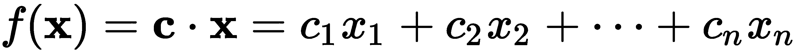
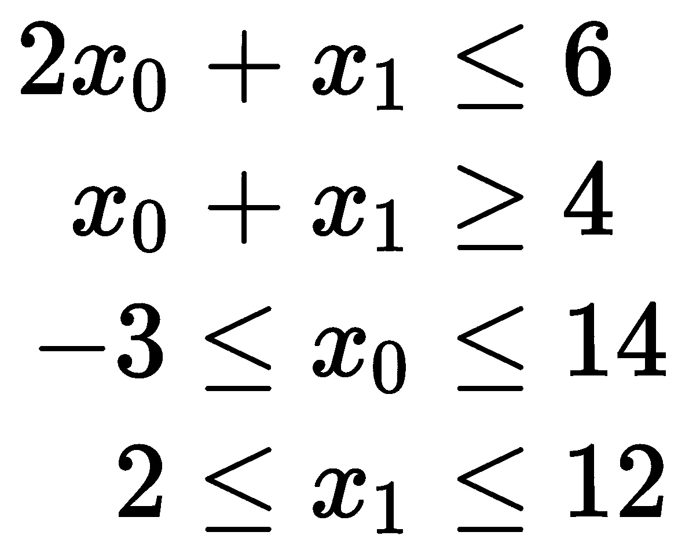
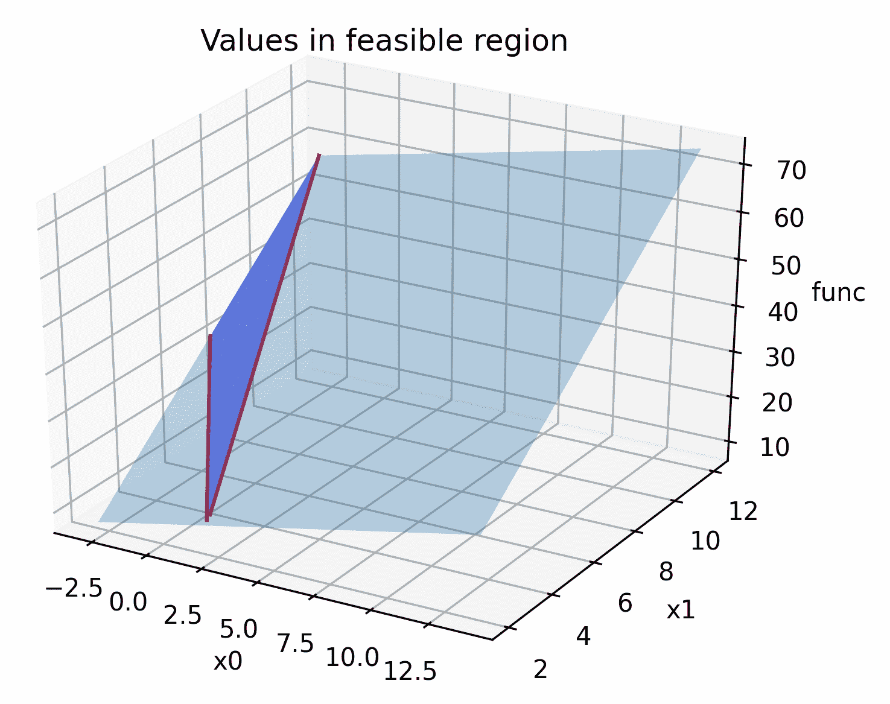
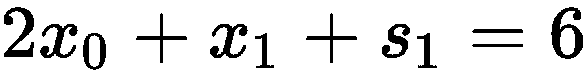
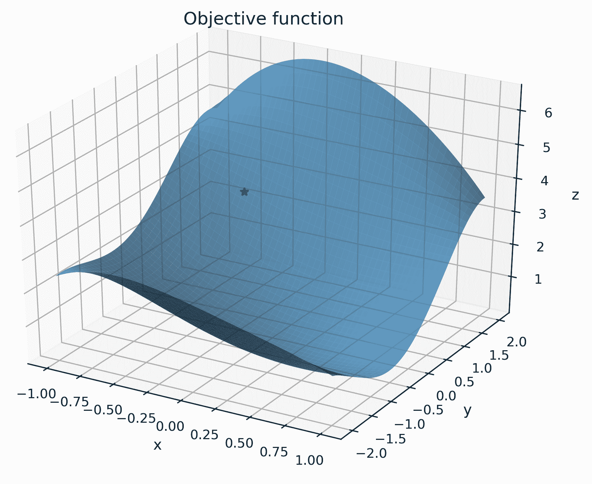
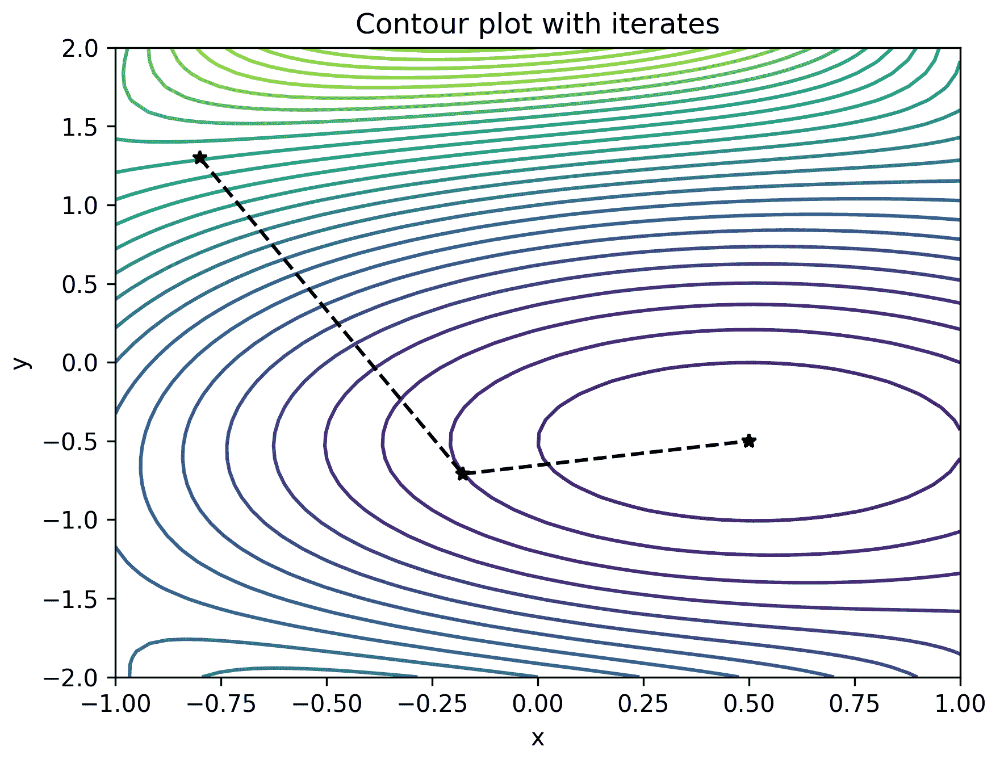
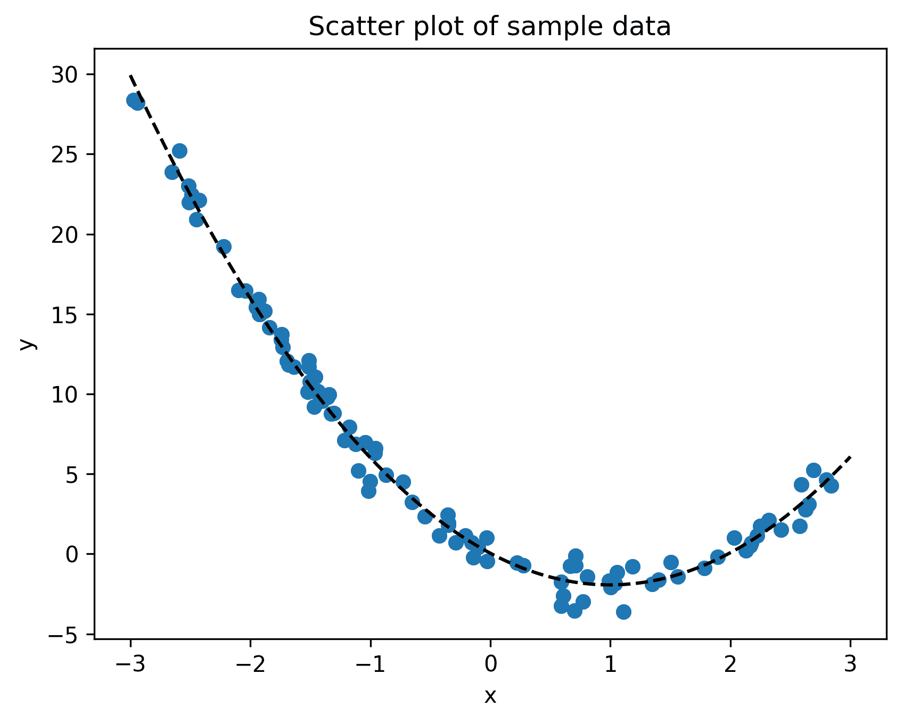

# 九、寻找最优解

在本章中，我们将讨论在给定情况下寻找最佳结果的各种方法。这被称为*优化*，通常涉及最小化或最大化目标函数。*目标函数*是一个函数，它将多个参数作为参数，并返回单个标量值，表示给定参数选择的成本或收益。关于最小化和最大化函数的问题实际上是等价的，所以我们在本章只讨论最小化目标函数。最小化函数*f*（*x*）等于最大化函数*-f*（*x*）。我们将在讨论第一个配方时提供更多详细信息。

我们可用的最小化给定函数的算法取决于函数的性质。例如，与具有多个变量的非线性函数相比，包含一个或多个变量的简单线性函数具有不同的可用算法。线性函数的最小化属于*线性规划*的范畴，这是一个成熟的理论。对于非线性函数，我们通常利用函数的梯度（导数）来寻找最小点。我们将讨论几种最小化不同类型函数的方法。

求一个变量函数的极小值和极大值特别简单，如果函数的导数已知，就很容易找到。如果没有，则适用相应配方中描述的方法。*最小化非线性函数*配方中的注释给出了一些额外的细节。

我们还将简要介绍*博弈论*。广义地说，这是一种围绕决策的理论，在经济学等学科中有着广泛的影响。特别是，我们将讨论如何在 Python 中将简单的两人博弈表示为对象，计算与某些选择相关的收益，以及计算这些博弈的纳什均衡。

我们将从研究如何最小化包含一个或多个变量的线性和非线性函数开始。然后，我们将继续看梯度下降法和使用最小二乘法的曲线拟合。我们将通过分析两人博弈和纳什均衡来结束本章。

在本章中，我们将介绍以下配方：

*   一个简单线性函数的极小化
*   最小化非线性函数
*   梯度下降法在优化中的应用
*   使用最小二乘法将曲线拟合到数据
*   分析简单的两人博弈
*   纳什均衡的计算

让我们开始吧！

# 技术要求

在本章中，我们将一如既往地需要 NumPy 包、SciPy 包和 Matplotlib 包。我们还需要最后两个食谱的 Nashpy 套餐。可以使用您喜爱的软件包管理器安装这些软件包，例如`pip`：

```py
          python3.8 -m pip install numpy scipy matplotlib nashpy

```

本章的代码可以在 GitHub 存储库的[的`Chapter 09`文件夹中找到 https://github.com/PacktPublishing/Applying-Math-with-Python/tree/master/Chapter%2009](https://github.com/PacktPublishing/Applying-Math-with-Python/tree/master/Chapter%2009) 。

查看以下视频以查看代码的运行：[https://bit.ly/2BjzwGo](https://bit.ly/2BjzwGo) 。

# 一个简单线性函数的极小化

我们在优化中面临的最基本的问题是找到函数取其最小值的参数。通常，该问题被*约束在*参数的可能值上，这增加了问题的复杂性。显然，如果我们要最小化的函数也是复杂的，那么这个问题的复杂性会进一步增加。由于这个原因，我们必须首先考虑 ART T2。



为了解决这类问题，我们需要将约束转换为计算机可以使用的形式。在这种情况下，我们通常将它们转化为线性代数问题（矩阵和向量）。完成后，我们可以使用 NumPy 和 SciPy 中的线性代数包中的工具来查找所需的参数。幸运的是，由于这类问题经常发生，SciPy 有处理此转换和后续解决的例程。

在此配方中，我们将使用 SciPy`optimize`模块中的例程解决以下约束线性最小化问题：


这将受制于以下条件：



## 准备

对于此配方，我们需要导入别名为`np`的 NumPy 包、名称为`plt`的 Matplotlib`pyplot`模块和 SciPy`optimize`模块。我们还需要从`mpl_toolkits.mplot3d`中导入`Axes3D`类，以使 3D 绘图可用：

```py
import numpy as np
from scipy import optimize
import matplotlib.pyplot as plt
from mpl_toolkits.mplot3d import Axes3D
```

## 怎么做。。。

按照以下步骤使用 SciPy 解决约束线性最小化问题：

1.  以 SciPy 可以识别的形式设置系统：

```py
A = np.array([
    [2, 1],   # 2*x0 + x1 <= 6
    [-1, -1]  # -x0 - x1 <= -4
])
b = np.array([6, -4])
x0_bounds = (-3, 14) # -3 <= x0 <= 14
x1_bounds = (2, 12)  # 2 <= x1 <= 12
c = np.array([1, 5])
```

2.  接下来，我们需要定义一个例程，该例程以*x*的值计算线性函数，这是一个向量（NumPy 数组）：

```py
def func(x):
    return np.tensordot(c, x, axes=1)
```

3.  然后，我们创建一个新图形并添加一组`3d`轴，我们可以在这些轴上绘制函数：

```py
fig = plt.figure()
ax = fig.add_subplot(projection="3d")
ax.set(xlabel="x0", ylabel="x1", zlabel="func")
ax.set_title("Values in Feasible region")
```

4.  接下来，我们创建一个覆盖问题区域的值网格，并在此区域上绘制函数值：

```py
X0 = np.linspace(*x0_bounds)
X1 = np.linspace(*x1_bounds)
x0, x1 = np.meshgrid(X0, X1)
z = func([x0, x1])
ax.plot_surface(x0, x1, z, alpha=0.3)
```

5.  现在，我们在与临界线`2*x0 + x1 == 6`相对应的函数值平面上绘制线，并在图顶部绘制在范围内的值：

```py
Y = (b[0] - A[0, 0]*X0) / A[0, 1]
I = np.logical_and(Y >= x1_bounds[0], Y <= x1_bounds[1])
ax.plot(X0[I], Y[I], func([X0[I], Y[I]]), "r", lw=1.5)
```

6.  我们对第二条临界线`x0 + x1 == -4`重复该绘图步骤：

```py
Y = (b[1] - A[1, 0]*X0) / A[1, 1]
I = np.logical_and(Y >= x1_bounds[0], Y <= x1_bounds[1])
ax.plot(X0[I], Y[I], func([X0[I], Y[I]]), "r", lw=1.5)
```

7.  接下来，我们对位于两条临界线内的区域进行着色，该区域对应于最小化问题的可行区域：

```py
B = np.tensordot(A, np.array([x0, x1]), axes=1)
II = np.logical_and(B[0, ...] <= b[0], B[1, ...] <= b[1]) 
ax.plot_trisurf(x0[II], x1[II], z[II], color="b", alpha=0.5)
```

在下图中可以看到可行区域上的函数值图：



Figure 9.1: Values of the linear function with the feasible region highlighted

如我们所见，位于该阴影区域内的最小值出现在两条临界线的交点处。

8.  接下来，我们使用`linprog`以*步骤 1*中创建的边界来解决约束最小化问题。我们在终端中打印生成的对象：

```py
res = optimize.linprog(c, A_ub=A, b_ub=b, bounds=
    (x0_bounds, x1_bounds))
print(res)
```

9.  最后，我们在可行区域顶部绘制最小函数值：

```py
ax.plot([res.x[0]], [res.x[1]], [res.fun], "k*")
```

更新后的绘图可以在下图中看到：


Figure 9.2: Minimum value plotted on the feasible region

在这里，我们可以看到`linprog`例程确实发现最小值位于两条临界线的交点处。

## 它是如何工作的。。。

约束线性最小化问题在经济情况下很常见，在这种情况下，您可以在保持参数的其他方面的同时，尝试最小化成本。事实上，优化理论中的许多术语都反映了这一事实。解决这类问题的一种非常简单的算法称为**单纯形法**，它使用一系列数组运算来寻找最小解。从几何角度看，这些操作表示改变到单纯形的不同顶点（我们在这里不定义），正是这一点赋予了算法的名称。

在继续之前，我们将简要介绍单纯形法用于解决约束线性优化问题的过程。正如我们所看到的，这个问题不是一个矩阵方程问题，而是一个矩阵不等式问题。我们可以通过引入**松弛变量**来解决这个问题，将不等式转化为等式。例如，通过引入松弛变量*s<sub>1</sub>*，第一个约束不等式可以重写如下：



只要*s<sub>1</sub>*不是负值，则满足所需的不等式。第二个约束不等式是一个大于或等于类型的不等式，我们必须首先改变它，使之成为小于或等于类型。我们通过将所有项乘以-1 来实现。这给了我们在配方中定义的第二行矩阵`A`。在引入第二个松弛变量*s<sub>2</sub>*后，我们得到第二个方程：


由此，我们可以构造一个矩阵，其列包含两个参数变量*x<sub>1</sub>*和*x<sub>2、</sub>*和两个松弛变量*s<sub>1</sub>*和*s<sub>2 的系数。</sub>*该矩阵的行表示两个边界方程和目标函数*。*现在可以通过对该矩阵进行基本行运算来求解该方程组，以获得使目标函数最小化的*x<sub>1</sub>*和*x<sub>2</sub>*的值。由于求解矩阵方程既简单又快速，这意味着我们可以快速有效地最小化线性函数。

幸运的是，我们不需要记住如何将不等式系统简化为线性方程组，因为像`linprog`这样的例程会为我们做这件事。我们可以简单地将边界不等式提供为矩阵和向量对，由每个矩阵和向量对的系数以及定义目标函数的单独向量组成。`linprog`例程负责制定并解决最小化问题。

实际上，单纯形法并不是`linprog`例程用来最小化函数的算法。相反，`linprog`使用了一种更有效的内点算法。（通过为`method`关键字参数提供适当的方法名称，实际上可以将该方法设置为`simplex`或`revised-simplex`。在打印的结果输出中，我们可以看到，只需五次迭代即可获得解决方案。）此例程返回的结果对象包含存储在`x`属性中的最小值出现的参数值、存储在`fun`属性中的该最小值处的函数值以及有关求解过程的各种其他信息。如果方法失败了，`status`属性将包含一个数字代码，描述方法失败的原因。

在本配方的*步骤 2*中，我们创建了一个表示该问题目标函数的函数。此函数将单个数组作为输入，其中包含应在其中计算函数的参数空间值。在这里，我们使用 NumPy 的`tensordot`例程（带`axes=1`）计算系数向量*c*与每个输入*x*的点积。在这里我们必须非常小心，因为我们传递到函数中的值在后面的步骤中将是一个 2×50×50 数组。普通的矩阵乘法（`np.dot`不会给出我们在本例中所希望的 50×50 数组输出。

在*步骤 5*和*6*中，我们将临界线上的点计算为具有以下等式的点：


然后，我们计算相应的*z*值，以便绘制位于目标函数定义的平面上的线。我们还需要“修剪”这些值，以便只包括问题中指定范围内的值。

## 还有更多。。。

该配方涵盖了约束最小化问题以及如何使用 SciPy 解决该问题。然而，同样的方法也可用于解决受约束的*最大化*问题。这是因为最大化和最小化是相互的*对偶*，在这个意义上，最大化函数*f*（*x*）与最小化函数*-f*（*x*）相同，然后取该值的负值。事实上，我们在这个配方中使用了这个事实，将第二个约束不等式从≥ 到≤.

在这个配方中，我们只解决了一个只有两个参数变量的问题，但对于一个涉及两个以上此类变量的问题，同样的方法也适用（绘图步骤除外）。我们只需要向每个数组中添加更多的行和列，以说明变量数量的增加——这包括提供给例程的边界元组。在适当的情况下，该例程还可以用于稀疏矩阵，以在处理大量变量时获得更高的效率。

`linprog`例程得名于*线性规划*，用于描述这类问题——在其他条件下寻找满足某些矩阵不等式的*x*值。由于与矩阵理论和线性代数有着非常密切的联系，因此有许多非常快速有效的技术可用于线性规划问题，而这些技术在非线性环境中是不可用的。

# 最小化非线性函数

在前面的配方中，我们看到了如何最小化一个非常简单的线性函数。不幸的是，大多数函数不是线性的，通常没有我们想要的好的性质。对于这些非线性函数，我们无法使用针对线性问题开发的快速算法，因此我们需要设计新的方法，用于更一般的情况。我们将在那里使用的算法称为 Nelder-Mead algorthim，这是一种稳健的通用方法，用于寻找函数的最小值，不依赖于函数的梯度。

在本配方中，我们将学习如何使用 Nelder-Mead 单纯形法最小化包含两个变量的非线性函数。

## 准备

在本配方中，我们将使用作为`np`导入的 NumPy 包、作为`plt`导入的 Matplotlib`pyplot`模块、从`mpl_toolkits.mplot3d`导入的`Axes3D`类来启用 3D 打印，以及 SciPy`optimize`模块：

```py
import numpy as np
import matplotlib.pyplot as plt
from mpl_toolkits.mplot3d import Axes3D
from scipy import optimize
```

## 怎么做。。。

以下步骤说明了如何使用 Nelder-Mead 单纯形法找到一般非线性目标函数的最小值：

1.  定义我们将最小化的目标函数：

```py
def func(x):
    return ((x[0] - 0.5)**2 + (x[1] + 0.5)**2)*
       np.cos(0.5*x[0]*x[1])
```

2.  接下来，创建一个值网格，我们可以在其上绘制目标函数：

```py
x_r = np.linspace(-1, 1)
y_r = np.linspace(-2, 2)
x, y = np.meshgrid(x_r, y_r)
```

3.  现在，我们在此点网格上评估函数：

```py
z = func([x, y])
```

4.  接下来，我们使用`3d`轴对象创建一个新图形，并设置轴标签和标题：

```py
fig = plt.figure(tight_layout=True)
ax = fig.add_subplot(projection="3d")
ax.tick_params(axis="both", which="major", labelsize=9)
ax.set(xlabel="x", ylabel="y", zlabel="z")
ax.set_title("Objective function")
```

5.  现在，我们可以在刚刚创建的轴上将目标函数绘制为曲面：

```py
ax.plot_surface(x, y, z, alpha=0.7)
```

6.  我们选择一个初始点，我们的最小化程序将在该点开始迭代，并在曲面上绘制该点：

```py
x0 = np.array([-0.5, 1.0])
ax.plot([x0[0]], [x0[1]], func(x0), "r*")
```

目标函数的曲面图以及初始点可以在下图中看到。在这里，我们可以看到最小值出现在 x 轴上约 0.5 处，y 轴上约-0.5 处：



Figure 9.3: Non-linear objective function with a starting value

7.  现在，我们使用`optimize`包中的`minimize`例程找到最小值并打印它生成的`result`对象：

```py
result = optimize.minimize(func, x0, tol=1e-6, method=
    "Nelder-Mead")
print(result)
```

8.  最后，我们在目标函数曲面顶部绘制`minimize`例程找到的最小值：

```py
ax.plot([result.x[0]], [result.x[1]], [result.fun], "r*")
```

目标函数的更新图，包括`minimize`例程找到的最小点，可以在下图中看到：


Figure 9.4: Objective function with a starting point and a minimum point

## 它是如何工作的。。。

Nelder-Mead 单纯形法——不要与线性优化问题的单纯形法混淆——是一种寻找非线性函数最小值的简单算法，即使在目标函数没有已知导数时也有效。（本配方中的函数并非如此；使用基于梯度的方法的唯一好处是收敛速度。）该方法通过比较单纯形顶点处的目标函数值来工作，单纯形是二维空间中的三角形。函数值最大的顶点通过对边“反射”，并执行适当的扩展或收缩，从而使单纯形“下山”。

来自 SciPy`optimize`模块的`minimize`例程是许多非线性函数最小化算法的入口点。在这个配方中，我们使用了内尔德-米德单纯形算法，但也有许多其他算法可用。这些算法中的许多都需要函数梯度的知识，而梯度可以由算法自动计算。该算法可以通过为`method`关键字参数提供适当的名称来使用。

由`minimize`例程返回的`result`对象包含大量关于解算器已找到（或未找到，如果发生错误）的解决方案的信息。特别是，计算出的最小值所在的期望参数存储在结果的`x`属性中，而函数值存储在`fun`属性中。

`minimize`例程需要该功能和一个`x0`的起始值。在这个配方中，我们还提供了一个公差值，最小值应该在使用`tol`关键字参数时计算。更改此值将修改解决方案的计算精度。

## 还有更多。。。

Nelder-Mead 算法是“无梯度”最小化算法的一个示例，因为它不需要关于目标函数梯度（导数）的任何信息。有几种这样的算法，所有这些算法通常都涉及在多个指定点评估目标函数，然后使用这些信息向最小值移动。一般来说，无梯度方法的收敛速度比梯度下降模型慢。然而，它们几乎可以用于任何目标函数，即使在不容易精确或通过近似计算梯度的情况下也是如此。

优化单个变量的函数通常比多维情况更容易，并且在 SciPy`optimize`库中有自己的特殊功能。`minimize_scalar`例程对单个变量的函数执行最小化操作，在这种情况下应使用该例程而不是`minimize`。

# 梯度下降法在优化中的应用

在上一个配方中，我们使用 Nelder-Mead 单纯形算法最小化包含两个变量的非线性函数。这是一种相当稳健的方法，即使对目标函数知之甚少，也能奏效。然而，在许多情况下，我们确实对目标函数了解得更多，这一事实使我们能够设计出更快、更有效的算法来最小化函数。我们可以利用函数的梯度等性质来实现这一点。

多个变量函数的*梯度*描述了函数在其每个分量方向上的变化率。这是函数对每个变量的偏导数向量。从这个梯度向量，我们可以推断函数增长最快的方向，反之，函数从任何给定位置下降最快的方向。这为我们提供了最小化函数的*梯度下降*方法的基础。该算法非常简单：给定一个起始位置**x**，我们计算该**x**处的梯度以及梯度下降最快的对应方向，然后在该方向上迈出一小步。经过几次迭代后，这将从函数的起始位置移动到最小值。

在本配方中，我们将学习如何实现基于最速下降算法的算法，以最小化有界区域内的目标函数。

## 准备

对于该配方，我们需要将 NumPy 包作为`np`导入，将 Matplotlib`pyplot`模块作为`plt`导入，并从`mpl_toolkits.mplot3d`导入`Axes3D`对象：

```py
import numpy as np
import matplotlib.pyplot as plt
from mpl_toolkits.mplot3d import Axes3D
```

## 怎么做。。。

在以下步骤中，我们将实现一个简单的梯度下降方法，以最小化具有已知梯度函数的目标函数（我们实际上将使用生成函数，以便我们可以看到该方法的工作原理）：

1.  我们将首先定义一个`descend`例程，它将执行我们的算法。函数声明如下：

```py
def descend(func, x0, grad, bounds, tol=1e-8, max_iter=100):
```

2.  接下来，我们需要实现这个例程。我们首先定义在方法运行时保存迭代值的变量：

```py
xn = x0
xnm1 = np.inf
grad_xn = grad(x0)
```

3.  然后开始循环，循环将运行迭代。在继续之前，我们会立即检查我们是否取得了有意义的进展：

```py
for i in range(max_iter):
    if np.linalg.norm(xn - xnm1) < tol:
        break
```

4.  方向减去梯度向量。我们计算一次并将其存储在`direction`变量中：

```py
direction = -grad_xn
```

5.  现在，我们分别更新先前和当前的值`xnm1`和`xn`，为下一次迭代做好准备。`descend`例程的代码到此结束：

```py
xnm1 = xn
xn = xn + 0.2*direction
```

6.  现在，我们可以计算当前值处的梯度，并得出所有适当的值：

```py
grad_xn = grad(xn)
yield i, xn, func(xn), grad_xn
```

这就结束了`descend`例程的定义。

7.  我们现在可以定义一个样本目标函数，以最小化：

```py
def func(x):
    return ((x[0] - 0.5)**2 + (x[1] + 0.5)**2)*np.cos(0.5*x[0]*x[1])
```

8.  接下来，我们将创建一个网格，对其进行评估，然后绘制目标函数：

```py
x_r = np.linspace(-1, 1)
y_r = np.linspace(-2, 2)
x, y = np.meshgrid(x_r, y_r)
```

9.  创建网格后，我们可以评估函数并将结果存储在`z`变量中：

```py
z = func([x, y])
```

10.  接下来，我们创建目标函数的三维曲面图：

```py
surf_fig = plt.figure(tight_layout=True)
surf_ax = surf_fig.add_subplot(projection="3d")
surf_ax.tick_params(axis="both", which="major", labelsize=9)
surf_ax.set(xlabel="x", ylabel="y", zlabel="z")
surf_ax.set_title("Objective function")
surf_ax.plot_surface(x, y, z, alpha=0.7)
```

11.  在开始最小化过程之前，我们需要定义一个初始点`x0`。我们在上一步中创建的目标函数图上绘制该点：

```py
x0 = np.array([-0.8, 1.3])
surf_ax.plot([x0[0]], [x0[1]], func(x0), "r*")
```

目标函数的曲面图以及初始值可以在下图中看到：


Figure 9.5: Surface of the objective function with the initial position

12.  我们的`descend`例程需要一个评估目标函数梯度的函数，因此我们将定义一个：

```py
def grad(x):
    c1 = x[0]**2 - x[0] + x[1]**2 + x[1] + 0.5
    cos_t = np.cos(0.5*x[0]*x[1])
    sin_t = np.sin(0.5*x[0]*x[1])
    return np.array([
        (2*x[0]-1)*cos_t - 0.5*x[1]*c1*sin_t,
        (2*x[1]+1)*cos_t - 0.5*x[0]*c1*sin_t
    ])
```

13.  我们将在等高线图上绘制迭代，因此我们将其设置如下：

```py
cont_fig, cont_ax = plt.subplots()
cont_ax.set(xlabel="x", ylabel="y")
cont_ax.set_title("Contour plot with iterates")
cont_ax.contour(x, y, z, levels=30)
```

14.  现在，我们创建一个变量，该变量将*x*和*y*方向的边界作为元组的元组。这些是与*步骤 10*中的`linspace`调用相同的边界：

```py
bounds = ((-1, 1), (-2, 2))
```

15.  我们现在可以使用`for`循环来驱动`descend`生成器生成每个迭代，并将步骤添加到等高线图中：

```py
xnm1 = x0
for i, xn, fxn, grad_xn in descend(func, x0, grad, bounds):
    cont_ax.plot([xnm1[0], xn[0]], [xnm1[1], xn[1]], "k*--")
    xnm1, grad_xnm1 = xn, grad_xn
```

16.  循环完成后，我们将最终值打印到终端：

```py
print(f"iterations={i}")
print(f"min val at {xn}")
print(f"min func value = {fxn}")
```

上述打印语句的输出如下所示：

```py
iterations=37
min val at [ 0.49999999 -0.49999999]
min func value = 2.1287163880894953e-16
```

在这里，我们可以看到，我们的例程使用了 37 次迭代，在大约（0.5，-0.5）处找到一个最小值，这是正确的。

等高线图及其绘制的迭代可以在下图中看到：



Figure 9.6: Contour plot of the objective function with gradient descent iterating to a minimum value

在这里，我们可以看到每个迭代的方向——用虚线表示——是目标函数下降最快的方向。最终迭代位于目标函数“碗”的中心，这是最小值出现的地方。

## 它是如何工作的。。。

这个食谱的核心是`descend`程序。这个例程中定义的过程是梯度下降法的一个非常简单的实现。通过`grad`参数计算给定点处的梯度，然后通过`direction = -grad`推导出迭代的行进方向。我们将该方向乘以一个固定的比例因子（有时称为**学习率**，其值为 0.2，以获得比例步长，然后通过将`0.2*direction`添加到当前位置来执行该步骤。

配方中的解需要 37 次迭代才能收敛，这是对 Nelder-Mead 单纯形算法的轻微改进，而*最小化非线性函数*配方需要 58 次迭代。（这不是一个完美的比较，因为我们更改了此配方的起始位置。）此性能在很大程度上取决于我们选择的步长。在这种情况下，我们将最大步长固定为方向向量大小的 0.2 倍。这使得算法简单，但不是特别有效。

在这个配方中，我们选择将算法实现为一个生成器函数，这样我们就可以看到每个步骤的输出，并在迭代过程中绘制等高线图。实际上，我们可能不希望这样做，而是在迭代完成后返回计算出的最小值。要做到这一点，我们可以简单地删除`yield`语句，并在函数的最后，在主函数的缩进处（即，不在循环内）用`return xn`替换它。如果您想防止不收敛，可以使用`for`循环的`else`功能捕捉循环结束的情况，因为它已经到达迭代器的末尾，而没有点击`break`关键字。此`else`块可能引发异常，表明算法未能稳定到解决方案。在这个配方中，我们用来结束迭代的条件并不能保证方法已经达到最小值，但通常情况就是这样。

## 还有更多。。。

实际上，您通常不会自己实现梯度下降算法，而是使用来自库（如 SciPy`optimize`模块）的通用例程。我们可以使用前面配方中使用的相同`minimize`例程，使用各种不同的算法执行最小化，包括几个梯度下降算法。这些实现可能比这样的定制实现具有更高的性能和更健壮的性能。

我们在这个配方中使用的梯度下降法是一个非常简单的实现，通过允许例程在每一步选择步长，可以大大改进。（允许选择自己步长的方法有时被称为自适应方法。）这种改进的困难部分是选择朝这个方向采取的步长。为此，我们需要考虑一个单变量的函数，它由下列方程给出：


这里，**x***n*代表当前点，**d**<sub xmlns:epub="http://www.idpf.org/2007/ops">*n*</sub>代表当前方向，*t*为参数。为简单起见，我们可以对 SciPy`optimize`模块中的标量值函数使用名为`minimize_scalar`的最小化例程。不幸的是，它并不像传递这个辅助函数并找到最小值那样简单。我们必须对*t*的可能值进行约束，以便计算出的最小化点**x**<sub xmlns:epub="http://www.idpf.org/2007/ops">*n*</sub>+*t***d<sub xmlns:epub="http://www.idpf.org/2007/ops">*n*</sub>位于我们感兴趣的区域内。**

为了理解我们是如何限定*t*的值的，我们必须首先从几何角度观察构造。我们引入的辅助函数沿着给定方向的一条直线计算目标函数。我们可以将其想象为在通过电流**x***<sub>n</sub>*点的**d**<sub>*n*</sub>方向的表面上拍摄一个横截面。该算法的下一步是找到步长*t*，它沿着这条线最小化目标函数的值–这是一个标量函数，更容易最小化。边界应为*t*值的范围，在此期间，该线位于*x*和*y*边界值定义的矩形内。我们确定这条线与*x*和*y*边界线相交的四个值，其中两个为负，两个为正。（这是因为当前点必须位于矩形内。）我们取两个正值的最小值和两个负值的最大值，并将这些边界传递给标量最小化例程。这是使用以下代码实现的：

```py
alphas = np.array([
        (bounds[0][0] - xn[0]) / direction[0], # x lower
        (bounds[1][0] - xn[1]) / direction[1], # y lower
        (bounds[0][1] - xn[0]) / direction[0], # x upper
        (bounds[1][1] - xn[1]) / direction[1] # y upper
])

alpha_max = alphas[alphas >= 0].min()
alpha_min = alphas[alphas < 0].max()
result = minimize_scalar(lambda t: func(xn + t*direction), 
        method="bounded", bounds=(alpha_min, alpha_max))
amount = result.x
```

一旦选择了步长，剩下的唯一步骤就是更新当前的`xn`值，如下所示：

```py
xn = xn + amount * direction
```

使用这种自适应步长会增加例程的复杂度，但性能会大大提高。使用此修订例程，该方法仅在三次迭代中收敛，远远少于此配方中的原始代码（37 次迭代）或前一配方中的内尔德-米德单纯形算法（58 次迭代）使用的迭代次数。通过以梯度函数的形式为方法提供更多信息，迭代次数的减少正是我们所期望的。

我们创建了一个函数，返回函数在给定点的梯度。在开始之前，我们手工计算了这个梯度，这并不容易，甚至不可能。相反，更常见的做法是用数值计算的梯度代替此处使用的“解析”梯度，该梯度是使用有限差分或类似算法估计的。与所有近似方法一样，这会对性能和精度产生影响，但考虑到梯度下降方法的收敛速度有所提高，这些问题通常很小。

梯度下降型算法在机器学习应用中特别流行。大多数流行的 Python 机器学习库——包括 PyTorch、TensorFlow 和 Theano——都提供了自动计算数据数组梯度的实用程序。这允许在后台使用梯度下降方法来提高性能。

梯度下降法的一个流行变体是**随机梯度下降**，其中梯度是通过随机抽样而不是使用整个数据集来估计的。这可以极大地减少该方法的计算负担——以降低收敛速度为代价——特别是对于高维问题，如机器学习应用中常见的问题。随机梯度下降方法通常与反向传播相结合，形成机器学习应用中人工神经网络训练的基础。

基本随机梯度下降算法有几个扩展。例如，动量算法将上一个增量合并到下一个增量的计算中。另一个例子是自适应梯度算法，它结合了每个参数的学习率，以提高涉及大量稀疏参数的问题的收敛速度。

# 使用最小二乘法将曲线拟合到数据

最小二乘法是一种从相对较小的势函数族中寻找函数的强大技术，它可以最好地描述一组特定的数据。这种技术在统计学中尤其常见。例如，最小二乘法用于线性回归问题——这里，势函数族是所有线性函数的集合。通常，我们尝试拟合的函数族具有相对较少的参数，可以通过调整来解决问题。

最小二乘法的思想相对简单。对于每个数据点，我们计算残差的平方——点的值与给定函数的期望值之间的差值——并尝试使这些残差平方和尽可能小（因此最小平方）。

在本食谱中，我们将学习如何使用最小二乘法将曲线拟合到样本数据集。

## 准备

对于这个配方，我们需要像往常一样导入 NumPy 包作为`np`，而 Matplotlib`pyplot`模块作为`plt`导入：

```py
import numpy as np
import matplotlib.pyplot as plt
```

我们还需要从 NumPy`random`模块导入一个默认随机数生成器实例，如下所示：

```py
from numy.random import default_rng
rng = default_rng(12345)
```

最后，我们需要 SciPy`optimize`模块中的`curve_fit`例程：

```py
from scipy.optimize import curve_fit
```

## 怎么做。。。

以下步骤说明如何使用`curve_fit`例程将曲线拟合到一组数据：

1.  第一步是创建示例数据：

```py
SIZE = 100
x_data = rng.uniform(-3.0, 3.0, size=SIZE)
noise = rng.normal(0.0, 0.8, size=SIZE)
y_data = 2.0*x_data**2 - 4*x_data + noise
```

2.  接下来，我们制作一个数据散点图，看看是否能够识别数据中的潜在趋势：

```py
fig, ax = plt.subplots()
ax.scatter(x_data, y_data)
ax.set(xlabel="x", ylabel="y", title="Scatter plot of sample data")
```

我们制作的散点图可以在下图中看到。在这里，我们可以看到，数据肯定不会遵循线性趋势（直线）。既然我们知道趋势是多项式，我们下一步的猜测就是二次趋势。这就是我们在这里使用的：


Figure 9.7: Scatter plot of the sample data. We can see that the data does not follow a linear trend

3.  接下来，我们创建一个函数来表示我们希望适合的模型：

```py
def func(x, a, b, c):
    return a*x**2 + b*x + c
```

4.  现在，我们可以使用`curve_fit`例程将模型函数拟合到样本数据：

```py
coeffs, _ = curve_fit(func, x_data, y_data)
print(coeffs)
# [ 1.99611157 -3.97522213 0.04546998]
```

5.  最后，我们在散点图顶部绘制最佳拟合曲线，以评估拟合曲线对数据的描述程度：

```py
x = np.linspace(-3.0, 3.0, SIZE)
y = func(x, coeffs[0], coeffs[1], coeffs[2])
ax.plot(x, y, "k--")
```

更新后的散点图如下图所示：



Figure 9.8: Scatter plot with the curve of best fit found using least-squares superimposed

在这里，我们可以看到，我们发现的曲线与数据相当吻合。

## 它是如何工作的。。。

`curve_fit`例行程序执行最小二乘拟合，将模型曲线拟合到样本数据。实际上，这相当于最小化以下目标函数：


这里，*x<sub>i</sub>*、*y<sub>i</sub>*是样本数据中的点。在这种情况下，我们在三维参数空间上进行优化，每个参数都有一个维度。该例程返回估计的系数（目标函数最小化的参数空间中的点）和第二个变量，该变量包含拟合协方差矩阵的估计值。我们在这个食谱中忽略了这一点。

从`curve_fit`例程返回的估计协方差矩阵可用于给出估计参数的置信区间。这是通过将对角线元素的平方根除以样本量（本配方中为 100）来实现的。这给出了估计的标准误差，当乘以与置信度对应的适当值时，给出了置信区间的大小。（我们在[第 6 章](06.html)、*处理数据和统计*中讨论了置信区间。）

您可能已经注意到，`curve_fit`例程估计的参数与我们在*步骤 1*中用于定义样本数据的参数非常接近，但并不完全相等。事实上，这些数据并不完全相等，这是由于我们添加到数据中的正态分布噪声造成的。在这个配方中，我们知道数据的底层结构是二次的——也就是二次多项式——而不是其他更深奥的函数。在实践中，我们不太可能对数据的底层结构了解太多，这就是我们在样本中添加噪声的原因。

## 还有更多。。。

SciPy`optimize`模块中还有一个用于执行最小二乘拟合的例程，称为`least_squares`。此例程的签名不太直观，但返回的结果对象包含有关优化过程的更多信息。然而，这个例程的设置方式可能更类似于我们在*中构建基本数学问题的方式。。。*部分。为了使用该例程，我们将目标函数定义如下：

```py
def func(params, x, y):
    return y - (params[0]*x**2 + params[1]*x + params[2])
```

我们将此函数与参数空间中的起始估计值一起传递，`x0`，例如`(1, 0, 0)`。目标函数的附加参数`func`可以使用`args`关键字参数传递；例如，我们可以使用`args=(x_data, y_data)`。这些参数被传递到目标函数的`x`和`y`参数中。总之，我们可以使用以下调用`least_squares`来估计参数：

```py
results = least_squares(func, [1, 0, 0], args=(x_data, y_data))
```

从`least_squares`例程返回的`results`对象实际上与本章描述的其他优化例程返回的对象相同。它包含详细信息，如使用的迭代次数、过程是否成功、详细的错误消息、参数值以及目标函数的最小值。

# 分析简单的两人博弈

博弈论是数学的一个分支，研究决策和策略的分析。它在经济学、生物学和行为科学中都有应用。许多看似复杂的情况可以简化为一个相对简单的数学游戏，可以通过系统的方式进行分析，找到“最佳”解决方案。

博弈论中的一个经典问题是*囚徒困境*，其原始形式如下：两名同谋被抓获，必须决定是保持沉默还是指证对方。如果两人都保持沉默，他们都将被判处 1 年徒刑；如果一人作证，而另一人不作证，则证人被释放，另一人被判处 3 年徒刑；如果两人互相指证，他们都将被判 2 年徒刑。每个同谋者应该怎么做？事实证明，考虑到对另一方的合理不信任，每个同谋者能做出的最佳选择就是作证。采用这一战略，他们要么不服刑，要么最多服刑 2 年。

因为这本书是关于 Python 的，所以我们将使用这个经典问题的变体来说明这个问题的思想是多么普遍。考虑下面的问题：你和你的同事必须为客户编写一些代码。您认为可以用 Python 更快地编写代码，但您的同事认为他们可以用 C 更快地编写代码。问题是，您应该为项目选择哪种语言？

您认为编写 Python 代码的速度比 C 快 4 倍，因此您可以使用速度 1 编写 C，使用速度 4 编写 Python。您的同事说，他们编写 C 的速度比 Python 稍快，所以他们编写 C 的速度为 3，Python 的速度为 2。如果你俩都同意一种语言，那么你就以你预测的速度编写代码，但是如果你不同意，那么速度更快的程序员的生产率就会降低 1。我们可以总结如下：

| **同事/你** | **C** | **蟒蛇** |
| C | 3/1 | 3/2 |
| python | 2/1 | 2/4 |

在这个配方中，我们将学习如何用 Python 构造一个对象来表示这个简单的两人游戏，然后对这个游戏的结果进行一些基本分析。

## 准备

对于该配方，我们需要将 NumPy 包装作为`np`导入，将 Nashpy 包装作为`nash`导入：

```py
import numpy as np
import nashpy as nash
```

## 怎么做。。。

以下步骤说明如何使用 Nashpy 创建和执行两人游戏的一些简单分析：

1.  首先，我们需要创建保存每个玩家（本例中为您和您的同事）的支付信息的矩阵：

```py
you = np.array([[1, 3], [1, 4]])
colleague = np.array([[3, 2], [2, 2]])
```

2.  接下来，我们创建一个`Game`对象，该对象保存由这些支付矩阵表示的游戏：

```py
dilemma = nash.Game(you, colleague)
```

3.  我们使用索引表示法计算给定选择的效用：

```py
print(dilemma[[1, 0], [1, 0]])  # [1 3]
print(dilemma[[1, 0], [0, 1]])  # [3 2]
print(dilemma[[0, 1], [1, 0]])  # [1 2]
print(dilemma[[0, 1], [0, 1]])  # [4 2]
```

4.  我们还可以根据做出特定选择的概率计算预期效用：

```py
print(dilemma[[0.1, 0.9], [0.5, 0.5]]) # [2.45 2.05]
```

## 它是如何工作的。。。

在这个配方中，我们构建了一个 Python 对象，它表示一个非常简单的两人战略游戏。这里的想法是，有两个“玩家”要做决定，两个玩家的选择的每一个组合都给出了一个特定的回报值。我们的目标是找到每个玩家都能做出的最佳选择。玩家被假定同时做出一个动作，即双方都不知道对方的选择。每个玩家都有一个决定他们选择的策略。

在*步骤 1 中，*我们创建了两个矩阵——每个玩家一个矩阵——分配给每个选择组合的回报值。这两个矩阵由 Nashpy 的`Game`类包装，它提供了一个方便直观的（从博弈论的角度来看）游戏界面。通过使用索引表示法传入选项，我们可以快速计算给定选项组合的效用。

我们还可以提供基于策略的计算预期效用的方法，其中选择是根据某种概率分布随机选择的。语法与前面描述的确定性情况相同，只是我们为每个选择提供了一个概率向量。我们根据您 90%的时间选择 Python，而您的同事 50%的时间选择 Python 的概率来计算预期的实用程序。您和同事的预期速度分别为 2.45 和 2.05。

## 还有更多。。。

Python 中有一种替代计算博弈论的方法。Gambit 项目是博弈论中用于计算的工具集合，具有 Python 接口（[http://www.gambit-project.org/](http://www.gambit-project.org/) ）。这是一个围绕 C 库构建的成熟项目，提供了比 Nashpy 更高的性能。

# 纳什均衡的计算

*纳什均衡*是一种两人战略博弈——类似于我们在*分析简单的两人博弈*配方中看到的博弈——它代表了一种“稳定状态”，在这种状态下，每个参与者都看到了“最好的可能”结果。然而，这并不意味着与纳什均衡相关的结果总体上是最好的。纳什均衡比这更微妙。纳什均衡的非正式定义如下：假设所有其他参与者都遵守该行为模式，则没有一个参与者能够改善其结果的行为模式。

我们将用经典的石头剪纸游戏来探索纳什均衡的概念。规则如下。每个玩家都可以选择其中一个选项：石头、布或剪刀。石头胜过剪刀，但输给了纸；纸打败石头，但输给剪刀；剪刀打败了纸，但输给了石头。任何两个玩家做出相同选择的游戏都是平局。从数字上看，我们代表了+1 的胜利，-1 的失败，0 的平局。由此，我们可以构造一个两人博弈，并计算该博弈的纳什均衡。

在这个配方中，我们将计算经典的石头剪纸游戏的纳什均衡。

## 准备

对于该配方，我们需要将 NumPy 包装作为`np`导入，将 Nashpy 包装作为`nash`导入：

```py
import numpy as np
import nashpy as nash
```

## 怎么做。。。

以下步骤说明如何计算简单两人博弈的纳什均衡：

1.  首先，我们需要为每个玩家创建一个支付矩阵。我们将从第一个玩家开始：

```py
rps_p1 = np.array([
    [ 0, -1,  1],  # rock payoff
    [ 1,  0, -1],   # paper payoff
    [-1,  1,  0]   # scissors payoff
])
```

2.  第二个玩家的支付矩阵是`rps_p1`的转置：

```py
rps_p2 = rps_p1.transpose()
```

3.  接下来，我们创建`Game`对象来表示游戏：

```py
rock_paper_scissors = nash.Game(rps_p1, rps_p2)
```

4.  我们使用支持枚举算法计算博弈的纳什均衡：

```py
equilibria = rock_paper_scissors.support_enumeration()
```

5.  我们迭代平衡并打印每个玩家的档案：

```py
for p1, p2 in equilibria:
    print("Player 1", p1)
    print("Player 2", p2)
```

这些打印语句的输出如下所示：

```py
Player 1 [0.33333333 0.33333333 0.33333333]
Player 2 [0.33333333 0.33333333 0.33333333]
```

## 它是如何工作的。。。

纳什均衡在博弈论中非常重要，因为它使我们能够分析战略博弈的结果并确定有利的位置。它们最早由约翰·F·纳什在 1950 年描述，并在现代博弈论中发挥了关键作用。两人博弈可能有许多纳什均衡，但任何有限的两人博弈必须至少有一个纳什均衡。问题在于找到给定博弈的所有可能纳什均衡。

在这个配方中，我们使用了支持枚举，它有效地枚举了所有可能的策略，并过滤到纳什均衡。在这个配方中，支持枚举算法只找到一个纳什均衡，这是一种混合策略。这意味着唯一没有改进的策略是随机选择一个选项，每个选项的概率为 1/3。这对玩过石头剪刀的人来说并不奇怪，因为对于我们做出的任何选择，我们的对手有三分之一的机会（随机）选择击败我们选择的动作。同样，我们有三分之一的机会抽签或赢得比赛，因此我们对所有这些可能性的预期价值如下：


如果不知道我们的对手会选择哪种选择，就无法改善这一预期结果。

## 还有更多。。。

Nashpy 包还提供了计算纳什均衡的其他算法。具体而言，`vertex_enumeration`方法在`Game`对象上使用时，使用*顶点枚举*算法，而`lemke_howson_enumeration`方法使用*Lemke-Howson*算法。这些替代算法具有不同的特点，对于某些问题可能更有效。

## 另见

Nashpy 软件包的文档包含有关算法和博弈论的更详细信息。这包括对博弈论文本的大量参考。该文件可在[中找到 https://nashpy.readthedocs.io/en/latest/](https://nashpy.readthedocs.io/en/latest/) 。

# 进一步阅读

和往常一样，*数值配方*书是数值算法的良好来源。[第 10 章](10.html)*杂项主题*涉及函数的最大化和最小化：

*   *出版社，W.H.，Teukolsky，S.A.，维特林，W.T.，和弗兰纳里，B.P.，2017 年。数字配方：科学计算的艺术。剑桥：剑桥大学出版社*。

有关优化的更多具体信息，请参阅以下书籍：

*   *Boyd，S.P.和 Vandenberghe，L.，2018 年。凸优化**。剑桥：剑桥大学出版社*。
*   *格里瓦，I.，纳什，S.，和索弗，A.，2009 年。线性和非线性优化。**第二版。费城：工业和应用数学学会*。

最后，下面这本书是对博弈论的一个很好的介绍：

*   *奥斯本，M.J.，2017 年。博弈论导论**。牛津：牛津大学出版社*。