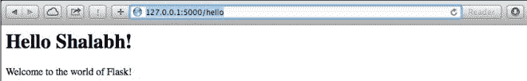
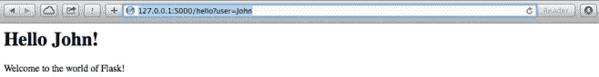
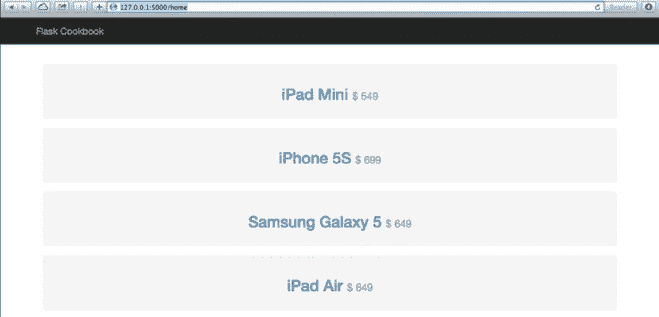
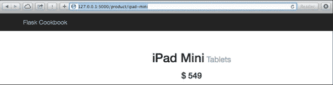
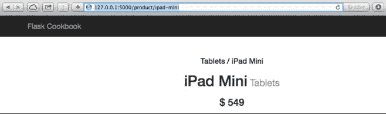
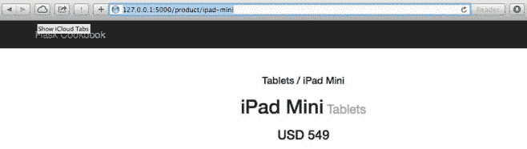

# 第二章 使用 Jinja2 模板

这一章将会从 Flask 的角度来介绍 Jinja2 模板的基础知识；我们同时会学习怎么用模块化和可扩展的模板来创建应用。这一章，将会覆盖以下小节：

*   Bootstrap 布局
*   块组合(block composition)和布局继承(layout inheritance)
*   创建自定义的上下文处理器
*   创建自定义的 Jinja2 过滤器
*   为表单创建自定义宏(custom macro)
*   高级日期和时间格式

## 介绍

在 Flask 中，我们完全可以不用第三方模板引擎写一个完整的 web 应用。举个栗子，看下面的代码；这是一个简单的包含 HTML 样式的 Hello World 应用：

```py
from flask import Flask
app = Flask(__name__)

@app.route('/')
@app.route('/hello')
@app.route('/hello/<user>')
def hello_world(user=None):
    user = user or 'Shalabh'
    return '''
<html>
    <head>
        <title>Flask Framework Cookbook</title>
    </head>
    <body>
        <h1>Hello %s!</h1>
        <p>Welcome to the world of Flask!</p>
    </body>
</html>''' % user

if __name__ == '__main__':
    app.run() 
```

在涉及上千行 HTML，JS 和 CSS 代码的大型应用中，使用上面编写方式可行吗？当然不！
这里，模板拯救了我们，因为我们能够保持模板独立来构建我们的视图代码。Flask 提供了对 Jinja2 的默认支持，不过我们可以使用任何其他合适的模板引擎。进一步来说，Jinja2 提供了许多额外的特性来使我们的模板更加强大和模块化。

## Bootstrap 布局

大部分的 Flask 应用遵循一个特定的方式去布置模板。在这一小节，我们将会讨论 Flask 应用中推荐的布置模板的方式。

#### 准备

通常，Flask 期待模板被放置在应用根目录下名为 templates 的文件夹中。如果这个文件夹是存在的，Flask 将会自动读取目录，使得在使用 render_template()的时候文件下的目标可获得，这些方式将在本书大量的使用。

#### 怎么做

用一个小的应用来演示。这个应用和第一章的应用非常相似。首先需要做的是在 my_app 文件夹下新增一个名为 templates 的文件夹。这个应用结构看起来像下面这样：

```py
flask_app/
    - run.py
    my_app/
        – __init__.py
        - hello/
            - __init__.py
            - views.py
        - templates
        - 
```

我们需要去对应用做些修改。视图文件`my_app/hello/views.py`中的 hello_world 方法将会看起来像这样：

```py
from flask import render_template, request

@hello.route('/')
@hello.route('/hello')
def hello_world():
    user = request.args.get('user', 'Shalabh')
    return render_template('index.html', user=user) 
```

在前面的方法中，我们去查询 URL 查询 user 参数。如果找到，就使用它，如果没找到，就使用默认的值，Shalabh。然后这个值将会被传递到要呈现的模板上下文（context）中，也就是 index.html，稍后渲染后的模板会被加载。
第一步，`my_app/templates/index.html`模板将看起来像这样：

```py
<html>
    <head>
        <title>Flask Framework Cookbook</title>
    </head>
    <body>
        <h1>Hello {{ user }}!</h1>
        <p>Welcome to the world of Flask!</p>
    </body>
</html> 
```

#### 原理

现在在浏览器打开 URL：`http://127.0.0.1:5000/hello`，将会看到一个响应，像下面这样：


我们也可以传递参数 user 给 URL，比如：`http://127.0.0.1:5000/hello?user=John`，将会看到下面这个响应：


从 views.py 中可以看出，传递给 URL 的参数可以通过 request 的 request.args.get(‘user’)方法获得，然后传递给了模板上下文中，模板将使用 render_template 进行渲染。使用 Jinja2 占位符{{ user }}解析出这个参数，它的真实值来自于模板上下文中 user 变量值。占位符里放置的所有表达式都依赖于模板上下文。

###### 其他

*   Jinja2 文档可以通过`http://jinja.pocoo.org/`获得。

## 块组合和布局继承

通常一个 web 应用将会有许多不同的页面。但，一个网站内大部分页面的头部和底部是差不多的。同样的，菜单也类似。实际上只有中心内容存在差别，剩下都是一样的。因为这些,Jinja2 提供了一个很好的模板间继承方式。

这是一个很好的实践去构建一个基础模板，包含网站的基本布局比如头部和尾部。

#### 准备

这一小节，我们将会尝试去创建一个小的应用，它包含一个主页和商品页(就像我们看到的购物网站那样)。我们会使用 Bootstrap 去给模板做一个最简约的设计。Bootstrap 可以从`http://getbootstrap.com`下载。

在 models.py 有一些写死的产品数据。他们会在 views.py 被读取，通过 render_template()方法，他们会被当做上下文变量发送给模板。剩下的解析和显示是通过模板语言处理的，在这里就是 Jinja2。

#### 怎么做

看一下项目结构：

```py
flask_app/
    - run.py
    my_app/
        – __init__.py
        - product/
            - __init__.py
            - views.py
            - models.py
    - templates/
        - base.html
        - home.html
        - product.html
    - static/
        - js/
            - bootstrap.min.js
        - css/
            - bootstrap.min.css
            - main.css 
```

上面的结构中，`static/css/bootstrap.min.css`和`static/js/bootstrap.min.js`是可以从 Bootstrap 网站下载的标准文件。run.py 和之前一样。介绍一下应用其余的东西。首先，我们定义了模型，`my_app/product/models.py`。这一章节，我们会使用一个简单的非持久化的键值对存储。我们提前准备了一些写死的商品记录：

```py
PRODUCTS = {
    'iphone': {
        'name': 'iPhone 5S',
        'category': 'Phones',
        'price': 699,
    },
    'galaxy': {
        'name': 'Samsung Galaxy 5',
        'category': 'Phones',
        'price': 649,
    },
    'ipad-air': {
        'name': 'iPad Air',
        'category': 'Tablets',
        'price': 649,
    },
    'ipad-mini': {
        'name': 'iPad Mini',
        'category': 'Tablets',
        'price': 549
    }
} 
```

接下来是视图文件，`my_app/product/views.py`。这里我们将会遵循蓝图方式去写应用。

```py
from werkzeug import abort
from flask import render_template
from flask import Blueprint]
from my_app.product.models import PRODUCTS

product_blueprint = Blueprint('product', __name__)

@product_blueprint.route('/')
@product_blueprint.route('/home')
def home():
    return render_template('home.html', products=PRODUCTS)

@product_blueprint.route('/product/<key>')
def product(key):
    product = PRODUCTS.get(key)
    if not product:
        abort(404)
    return render_template('product.html', product=product) 
```

被传递到 Blueprint 构造函数中的蓝本的名字：product，会被添加到在这个蓝图里定义的端点（endpoints）中。看一下 base.html 代码。

###### 提示

当想终止一个请求并给出特定的错误信息时，使用 abort()会很方便。Flask 提供了一些基本的错误信息页面，也可以根据需要自定义。我们将会在第四章创建自定义的 404 和 500 处理器章节看到相关用法。

应用的配置文件，`my_app/__init__.py`，将会看起来像这样：

```py
from flask import Flask
from my_app.product.views import product_blueprint

app = Flask(__name__)
app.register_blueprint(product_blueprint) 
```

除了 Bootstrap 提供的 CSS 代码，我们有自定义的 CSS 代码，`my_app/static/css/main.css`:

```py
body {
    padding-top: 50px;
}
.top-pad {
    pdding: 40px 15px;
    text-align: center;
} 
```

来看一下模板，第一个模板是所有模板的基础。所以可以被命名为 base.html，位置为`my_app/templates/base.html`：

```py
<!DOCTYPE html>
<html lang="en">
    <head>
        <meta charset="utf-8">
        <meta http-equiv="X-UA-Compatible" content="IE=edge">
        <meta name="viewport" content="width=device-width, initial-scale=1">
        <title>Flask Framework Cookbook</title>
        <link href="{{ url_for('static', filename='css/bootstrap.min.css') }}" rel="stylesheet">
        <link href="{{ url_for('static', filename='css/main.css') }}" rel="stylesheet">
    </head>
    <body>
        <div class="navbar navbar-inverse navbar-fixed-top" role="navigation">
            <div class="container">
                <div class="navbar-header">
                    <a class="navbar-brand" href="{{ url_for('product.home') }}">Flask Cookbook</a>
                </div>
            </div>
        </div>
        <div class="container">
            
        </div>

        <!-- jQuery (necessary for Bootstrap's JavaScript plugins) -->
        <script src="https://ajax.googleapis.com/ajax/libs/jquery/2.0.0/jquery.min.js"></script>
        <script src="{{ url_for('static', filename='js/bootstrap.min.js') }}"></script>
    </body>
</html> 
```

前面大部分代码是 HTML 和 Jinja2 的语法，前一小节已经接触过了。需要指出的是如何使用 url_for()来获取蓝本 URLs。蓝本的名字将会被添加到所有的端点中。这是非常有用的，因为当我们的应用有大量的蓝本时，其中一些是可以有相似的 URLs。

主页，`my_app/templates/home.html`，我们遍历了所有产品和=并展示他们：

```py


    <div class="top-pad">

        
            <div class="well">
                <h2>
                    <a href="{{ url_for('products.product', key=id) }}">{{ product['name'] }}</a>
                    <small>$ {{ product['price'] }}</small>
                </h2>
            </div>
        
    </div>
 
```

###### 译者注

书里原文写的是 products.iteritems()，运行会错误，Python3 下应为 products.items()

单独的产品页面，`my_app/templates/product.html`，看起来像这样：

```py


    <div class="top-pad">
        <h1>{{ product['name'] }}
            <small>{{ product['category'] }}</small>
        </h1>
        <h3>$ {{ product['price'] }}</h3>
    </div>
 
```

#### 原理

在上面的模板结构中，我们可以看到使用了继承模式。base.html 对于所有其他模板而言是一个基础。home.html 从 base.html 继承而来，product.html 继承自 home.html。在 product.html 中，我们重写了在 home.html 中定义的 container 块。运行这个应用，输出看起来像这样：


前面的截图展示了主页的样子。注意浏览器中的 URL。产品页面看起来像这样：


#### 其他

*   下面两小节将扩展这个应用

## 创建一个自定义的上下文处理器(context processor)

有时，我们想要在模板里直接计算或者处理一个值。Jinja2 维持了一个宗旨：逻辑处理应该在视图里处理而不能在模板里，目的是保持模板的干净。在这样情况下使用上下文处理器会很方便。我们可以传递值到一个方法里，然后用 Python 进行处理，之后结果会被返回。因此，我们基本上只需在模板上下文里添加一个函数(得益于 Python 允许我们可以传递函数像传递其他对象一样)。

#### 怎么做

让我们以这种格式展示产品名字的描述:Category / Prduct-name:

```py
@product_blueprint.context_processor
def some_processor():
    def full_name(product):
        return '{0} / {1}'.format(product['category'], prodyct['name'])
    return {'full_name': full_name} 
```

一个上下文就是一个简单的字典，可以修改，增加或删除值。任何用@product_blueprint.context_processor 修饰的方法应该返回一个字典，用来更新实际的上下文。

我们可以像这样使用前面的上下文处理器：

```py
{{ full_name(product) }} 
```

下面将这个处理器添加到应用中商品列表里(`flask_app/my_app/templates/product.html`)：

```py



    <div class="top-pad">
        <h4>{{ full_name(product) }}</h4>
        <h1>{{ product['name'] }}
            <small>{{ product['category'] }}</small>
        </h1>
        <h3>$ {{ product['price'] }}</h3>
    </div>
 
```

这个 HTML 页面将看起来像这样：


#### 其他

*   通过阅读块组合和布局继承来理解这一小节中的上下文(context)。

## 创建一个自定义的 Jinja2 过滤器

看了前面小节，有经验的开发者可能认为使用上下文处理器来描述商品名字是愚蠢的。我们可以简单的写一个过滤器去得到相同的结果；同时会变得更简洁。使用过滤器去描述商品名字的代码看起来像这样：

```py
@product_blueprint.template_filter('full_name')
def full_name_filter(product):
    return '{0} / {1}'.format(product['category'], product['name']) 
```

可以像下面这样使用它：

```py
{{ product | full_name }} 
```

前面的代码和上一小节的效果是一样的。

###### 译者注

template_filter()方法好像新版本的 Flask 已经取消了，应该使用 add_app_template_filter()替代。
所以注册过滤器代码得改为：

```py
def full_name_filter(product):
    return '{0} / {1}'.format(product['category'], product['name'])

product_blueprint.add_app_template_filter(full_name_filter, 'full_name') 
```

#### 怎么做

让事情变得高端一点，创建一个过滤器来基于本地语言格式化货币：

```py
import ccy
from flask impor request

@app.template_filter('format_currenty')
def format_currency_filter(amount):
    currency_code = ccy.countryccy(request.accept_languages.best[-2:])
    return '{0} {1}'.format(currency_code, amount) 
```

###### 译者注

同上，需改写为：

```py
def format_currency_filter(amount):
    currency_code = ccy.countryccy(request.accept_languages.best[-2:])
    return '{0} {1}'.format(currency_code, amount)

product_blueprint.add_app_template_filter(format_currency_filter, 'format_currency') 
```

###### 提示

request.accept_language 列表在请求里没有 ACCEPT-LANGUAGE 头的时候可能会无效。

前面一小段代码需要安装包：ccy：

```py
$ pip install ccy 
```

这个过滤器将会获取最匹配当前浏览器配置的语言（我的是 en-US），然后从配置字符串里获取最后两个字符，然后根据最后两个字符表示的 ISO 国家代码去获取货币。

#### 原理

这个过滤器可以在模板里这样使用：

```py
<h3>{{ product['price'] | format_currenty }}</h3> 
```

结果看起来像这样：


## 为表单创建一个自定义的宏（macro）

宏允许我们去编写可以重复使用的 HTML 代码。它们类似于常规编程语言中的函数。我们可以传递参数给宏就像我们在 Python 中对函数做的那样，然后我们可以使用宏去处理 HTML 块。宏可以被调用任意次数，输出将会根据其中的逻辑而变化。

#### 准备

在 Jinja2 中使用宏非常普遍的并且有很多使用案例。这里我们将看到如何创建一个宏和如何使用它。

#### 怎么做

输入表单是 HTML 许多冗余代码中的一个。大部分字段（fields）都有相似的代码，仅仅是样式做了些修改。下面是一个宏，它在调用的时候创建输入字段。为了更好的服用，创建宏的方式最好方式是在一个单独的文件里进行，比如`_helpers.html`:

```py

    <input type="{{ type }}" name="{{ name }}" class="{{ class }}" value="{{ value }}">
 
```

###### 提示

在/之前%之后的减号（-）将会消除代码块之前之后的空格，使 HTML 代码能容易阅读。

现在，这个宏使用前需导入：

```py
 
```

然后，使用方法如下：

```py
<fieldset>
    {{ render_field('username', 'icon-user') }}
    {{ render_field('password', 'icon-key', type='password') }}
</fieldset> 
```

这是一个很好的实践是在不同文件里定义不同的宏来保持代码的简洁和增加代码的可读性。如果一个宏不能在当前文件之外访问，需要在名称前面加上一个下划线来命名宏。

## 高级的时间和日期格式

在 web 应用里格式化日期和时间是一个很痛苦的事情。使用 datetime 库在 Python 层面处理增加了开销，正确的处理时区也是非常复杂的。当存储到数据库时，我们都需要标准化时间戳到 UTC，但是需要向全时间用户展示的时候，时间戳每次都需要被处理。
更机智的方式是在客户端处理他们，也就是在浏览器。浏览器总是知道用户的准确时区，并能够正确的处理时间和日期。同时，减少应用不必要的消耗。为此，我们将使用 Moment.js。

#### 准备

和其他 JS 库一样，我们的应用可以用下面的方式包含 Moment.js。我们仅仅需要将 moment.min.js 文件放置在 static/js 文件夹中。通过添加下面的代码和其他 JS 库，Moment.js 将在 HTML 中变得可用：

```py
<script src="/static/js/moment.min.js"></script> 
```

基本的使用 Moment.js 的方法见下面代码。可以在浏览器的控制台使用它们：

```py
>>> moment().calendar();
"Today at 4:49 PM"
>>> moment().endOf('day').fromNow();
"in 7 hours"
>>> moment().format('LLLL');
"Tuesday, April 15 2014 4:55 PM" 
```

###### 译者注

导入 moment.min.js 最好在页头导入，如果在页尾导入，会出现 moment is not defined 的错误。

#### 怎么做

在我们的应用里使用 Moment.js 最好的方式是用 Python 写一个修饰器（wrapper），然后通过 Jinja2 环境变量使用它。更多信息参见`http://runnable.com/UqGXnKwTGpQgAAO7/dates-and-times-in-flask-for-python`寻求更多信息:

```py
from jinja2 import Markup

class momentjs(object):
    def __init__(self, timestamp):
        self.timestamp = timestamp

    # Wrapper to call moment.js method
    def render(self, format):
        return Markup("<script>\ndocument.write(moment(\"%s\").%s);\n</script>" %(self.timestamp.strftime("%Y-%m-%dT%H:%M:%S"), format))

    # Format time
    def format(self, fmt):
        return self.render("format(\"%s\")" % fmt)

    def calendar(self):
        return self.render("calendar()")

    def fromNow(self):
        return self.render("fromNow()") 
```

当我们需要的时候可以添加许多 Moment.js 方法到之前的类中。现在，在 app.py 文件中，我们设置这个类到 Jinja 环境变量中。

```py
# Set jinja template global
app.jinja_env.globals['momentjs'] = momentjs 
```

可以在模板中像下面这样使用它：

```py
<p>Current time: {{ momentjs(timestamp).calendar() }}</p>
<br/>
<p>Time: {{momentjs(timestamp).format('YYYY-MM-DD HH:mm:ss')}}</p>
<br/>
<p>From now: {{momentjs(timestamp).fromNow()}}</p> 
```

#### 其他

*   Moment.js 库的更多信息参见：`http://momentjs.com/`

