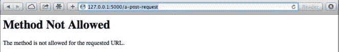
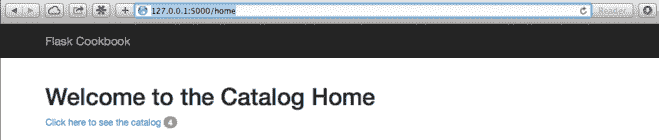
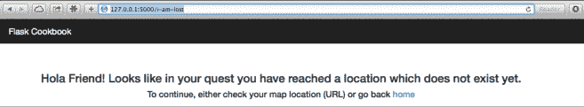
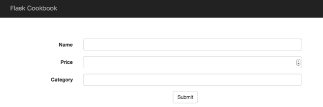
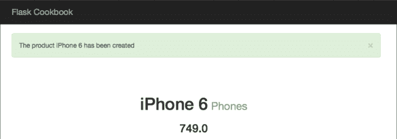

# 第四章 视图的使用

对于任何 Web 应用程序，控制与 Web 请求的交互以及适当的响应来满足这些请求是非常重要的。这一章将讲解正确处理请求的各种方式，然后用最好的方式设计他们。

这一章将包含下面的小节：

*   基于函数的视图和 URL 路由
*   基于类的视图
*   URL 路由和商品分页
*   渲染模板
*   处理 XHR 请求
*   优雅的装饰请求
*   创建自定义的 404 和 500 处理
*   Flash 消息用于更好的用户反馈
*   基于 SQL 的搜索

#### 介绍

Flask 为我们的应用程序提供了几种设计和布局 URL 路由的方法。同时，它提供了基于类的方式（类可以被继承和根据需要进行修改）来处理视图，这种方式和函数一样简单。前面版本中，Flask 支持基于函数的视图。但是，受 Django 影响，在 0.7 版本的时候，Flask 介绍了一个热插拔（pluggable）视图的概念，这允许我们去创建类，然后编写类的方法。这使得构建 RESTful API 的过程非常简单。同时，我可以进一步探索 Werkzeug，使用更灵活但是稍复杂的 URL maps。事实上，大型应用程序和框架更喜欢使用 URL maps。

## 基于函数的视图和 URL 路由

这是 Flask 里最简单的编写视图的方法。我们仅仅需要编写一个方法然后用端点（endpoint）装饰它。

#### 准备

为理解这一小节，可以从任何一个 Flask 应用开始。这个应用可以是一个新的，空的或者任何复杂的应用。我们需要做的是理解这一小节列出的方法。

#### 怎么做

下面是三种最常用的方法来处理各种各样的请求，用简单的例子说明一下。

```py
# A simple GET request
@app.route('/a-get-request')    
def get_request():
    bar = request.args.get('foo', 'bar')
    return 'A simple Flask request where foo is %s' % bar 
```

一个处理 GET 请求的例子看起来就像上面这样。我们检查 URL 查询参数是否含有一个叫 foo 的参数。如果有，就在响应中展示他们；否则使用默认值 bar。

```py
# A simple POST request
@app.route('/a-post-request', method=['POST'])
def post_request():
    bar = request.form.get('foo', 'bar')
    return 'A simple Flask request where foo is %s' % bar 
```

和 GET 请求很相似，只有一点差别，路由（route）现在有了一个额外的参数：methods。同时，用 request.form 替换了 request.args，因为 POST 请求假定数据是以表单方式提交的。

###### 提示

是否真有必要将 GET 和 POST 写在单独的方法里？当然不！

```py
# A simple GET/POST request
@app.route('/a-request', methods=['GET', 'POST'])
def some_request():
    if request.method == 'GET':
        bar = request.args.get('foo', 'bar')
    else:
        bar = request.form.get('foo', 'bar')
    return 'A simple Flask request where foo is %s' % bar 
```

在这里，我们可以看到我们已经将前两种方法合并为一个，现在 GET 和 POST 都由一个视图函数处理。

#### 原理

让我们试着理解前面的方法。
默认的，任何 Flask 视图函数仅仅支持 GET 请求。为了让处理函数支持其他请求，我们需要告诉 route()装饰器我们想要支持的方法。这就是我们在 POST 和 GET/POST 这两个方法中做的。

对于 GET 请求，request 对象将会查找 args，即 request.args.get()，对于 POST 方法，将查找 form，即 request.form.get()。
此外，如果我们尝试向只支持 POST 的方法发出 GET 请求，则请求将失败，导致 405 错误。所有方法都是如此。看下面的截图：



#### 更多

有时，我们可能希望有一个 URL 映射模式，可以将带端点的 URL 规则定义在一个单独的地方，而不是分散在应用的各处。为此，我们不能用 route()装饰方法，应该像下面这样在应用对象定义路由：

```py
def get_request():
    bar = request.args.get('foo', 'bar')
    return 'A simple Flask request where foo is %s' % bar

app = Flask(__name__)
app.add_url_rule('/a-get-request', view_func=get_request) 
```

确保为 view_func 分配的方法提供了正确的相对路径。

## 基于类的视图

Flask 在 0.7 版本介绍了热插拔（pluggable）视图的概念；这为现有的实现增加了很大的灵活性。我们可以用类的方式编写视图，这些视图可以用通用的方式编写，并允许继承。

#### 准备

理解这一小节之前需理解上一小节。

#### 怎么做

Flask 提供一个叫做 View 的类，我们可以继承它做自定义的处理。
下面是一个简单的 GET 请求例子：

```py
from flask.views import View

class GetRequest(View):
    def dispatch_request(self):
        bar = request.args.get('foo', 'bar')
        return 'A simple Flask request where foo is %s' % bar

app.add_url_rule(
    '/a-get-request', view_func=GetRequest.as_view('get_request')
) 
```

为了同时满足 GET 和 POST 请求，我们可以编写以下代码：

```py
from flask.views import View

class GetPostRequest(View):
    methods = ['GET', 'POST']

    def dispatch_request(self):
        if request.method == 'GET':
            bar = request.args.get('foo', 'bar')
        if request.method == 'POST':
            bar = request.form.get('foo', 'bar')
        return 'A simple Flask request where foo is %s' % bar

app.add_url_rule(
    '/a-request', view_func=GetPostRequest.as_view('a_request')
) 
```

#### 原理

默认情况下，Flask 视图函数仅仅支持 GET 请求。基于类的视图也是如此。为了支持或者处理各种类型的请求，我们需要通过类 methods 属性来告诉我们的类，我们需要支持的 HTTP 方法。这正是我们在之前的 GET/POST 请求示例中所做的。
对于 GET 请求，request 将会查找 args，即 request.args.get()，对于 POST 将会查找 form，即 request.form.get()。
另外，如果我们试图对只支持 POST 的方法进行 GET 请求，则请求将失败，报 405 错误。其他方法也是如此。

#### 更多

现在很多人认为不可能在 View 类里仅仅只声明 GET 和 POST 方法，然后 Flask 会处理剩余的东西。对于这个问题的回答是使用 MethodView。让我们用 MethodView 来写之前的片段：

```py
from flask.views import MethodView

class GetPostRequest(MethodView):

    def get(self):
        bar = request.args.get('foo', 'bar')
        return 'A simple Flask request where foo is %s' % bar

    def post(self):
        bar = request.form.get('foo', 'bar')
        return 'A simple Flask request where foo is %s' % bar

app.add_url_rule(
    '/a-reqquest', view_func=GetPostRequest.as_view('a_request')
) 
```

#### 其他

*   参见前一小节，明白基于函数的视图和基于类的视图差别

## URL 路由和商品分页

有时，我们可能需要解析不同部分的 URL 的各个部分。举个例子，我们的 URL 可以有一个整数部分，字符串部分，特定长度的字符串部分，斜杠等等。我们可以使用 URL 转换器（converters）解析 URL 中的所有这些组合。这一小节，我们将会看到如何做到这些。同时，我们将会学习如何使用 Flask-SQLAlchemy 扩展完成分页。

#### 准备

我们已经看到了几个基本 URL 转换器的实例。这一小节，我们将会看到一些高级的 URL 转换器并学习如何使用它们。

#### 怎么做

假设我们有一个 URL 路由像下面这样:

```py
@app.route('/test/<name>')
def get_name(name):
    return name 
```

这里，`http://127.0.0.1:5000/test/Shalabh`里的 Shalabh 会被解析出来，然后传入到 get_name 方法的 name 参数中。这是一个 unicode 或者字符串转换器，是默认的，不需要显式地指定。

我们同样可以有一些特定长度的字符串。假设我们想要去解析一个 URL 包括一个国家码和货币码。国家码通常是两个字符长度，货币码是三个字符长度。可以像下面这样做：

```py
@app.route('/test/<string(minlength=2,maxlength=3):code>')
def get_name(code):
    return code 
```

URL 中含有的 US 和 USD 都将被匹配，`http://127.0.0.1:5000/test/USD`和`http://127.0.0.1:5000/test/US`处理方法类似。我们还可以通过 length 参数匹配准确的长度，而不是 minlength 和 maxlength。
我们可以用类似的方式解析整数：

```py
@app.route('/test/<int:age>')
def get_age(age):
    return str(age) 
```

我们可以指定期望的最大值和最小值是多少，比如，`@app.route('/test/<int(min=18,max=99):age>')`。在前面的例子里，我们也可以解析 float 数，只需将 int 改为 float。

有时，我们希望忽略 URL 中的斜杠或者解析文件系统路径中 URL 或者其它 URL 路径。可以这样做：

```py
@app.route('/test/<path:file>/end')
def get_file(file):
    return file 
```

如果接收到类似于`http://127.0.0.1:5000/test/usr/local/app/settings.py/end`的请求，`usr/local/app/settings.py`将会作为 file 参数传递到这个方法中。

#### 给应用添加分页

在第三章，我们创建了一个处理程序来展示数据库里的商品列表。如果我们有成百上千个商品，将会在一个列表里展示所有的商品，这将花费一些时间。同时，如果我们想要在模板里渲染这些商品，我们不应该在一个页面里展示超过 10~20 个的商品。分页将有助于构建优秀的应用。

```py
@catalog.route('/products')
@catalog.route('/products/<int:page>')
def products(page=1):
    products = Product.query.paginate(page, 10).items
    res = {}
    for product in products:
        res[product.id] = {
            'name': product.name,
            'price': product.price,
            'category': product.category.name
        }
    return jsonify(res) 
```

在前面的处理程序中，我们添加了一个新的 URL 路径，给它添加了一个 page 参数。现在，`http://127.0.0.1:5000/products`和`http://127.0.0.1:5000/products/1`是一样的，他们都会返回数据库里的前 10 个商品。`http://127.0.0.1:5000/products/2`将会返回下 10 个商品，以此类推。

###### 提示

paginate()方法接收三个参数，返回一个 Pagination 类的对象。三个参数是：

*   page：需要被列出的当前页码。
*   per_page：每页需要列出的条目数量。
*   error_out：如果该页没找到条目，将会报 404 错误。为了防止这个的发生，可以设置`error_out`为 False，这样将返回空的列表。

## 渲染模板

在编写了视图之后，我们肯定希望将内容呈现在模板上并得到底层数据库的数据。

#### 准备

为了渲染模板，我们将使用 Jinja2 作为模板语言。参见第二章去深入理解模板。

#### 怎么做

我们将继续使用前面的小节的商品目录应用程序。现在，我们修改视图来渲染模板，然后将数据库的信息展示在这些模板上面。
下面是修改过的 views.py 代码和模板。
首先开始修改视图，`flask_catalog_template/my_app/catalog/views.py`，在特定处理方法里渲染模板：

```py
from flask import render_template

@catalog.route('/')
@catalog.route('/home')
def home():
    return render_template('home.html') 
```

注意 render_template()方法。当 home 方法被调用时，将会渲染 home.html。看下面的代码：

```py
@catalog.route('/product/<id>') 
def product(id):
    product = Product.query.get_or_404(id)
    return render_template('product.html', product=product) 
```

这里，product.html 模板将会在模板中渲染 product 对象。看下面代码：

```py
@catalog.route('/products')
@catalog.route('/products/<int:page>')
def products(page=1):
    products = Product.query.paginate(page, 10)
    return render_template('products.html', products=products) 
```

这里，products.html 模板将会用分页好的 product 列表对象进行渲染。看下面代码：

```py
@catalog.route('/product-create', methods=['POST','GET'])
def create_product():
    # … Same code as before …
    return render_template('product-create.html') 
```

从前面的代码里可以看到，在这个例子里，新建的商品将被模板渲染。同样也可以使用 redirect()，但是我们将在下面的小节讲到它。现在看下面的代码：

```py
@catalog.route('/category-create', methods=['POST',])
def create_category():
    # ... Same code as before ...
    return render_template('category.html', category=category)

@catalog.route('/category/<id>')
def category(id):
    category = Category.query.get_or_404(id)
    return render_template('category.html', category=category)

@catalog.route('/categories')
def categories():
    categories = Category.query.all()
    return render_template('categories.html', categories=categories) 
```

上面三个处理方法和之前讨论过的渲染商品模板过程类似。

下面是创建的所有模板。理解这些模板是如何编写出来的，是如何工作的，需要参见第二章。

`flask_catalog_template/my_app/templates/home.html` 看起来像这样：

```py


    <h1>Welcome to the Catalog Home</h1>
    <a href="{{ url_for('catalog.products') }}">Click here to see the catalog</a>
 
```

`flask_catalog_template/my_app/templates/product.html` 看起来像这样：

```py


    <div class="top-pad">
        <h1>{{ product.name }}<small> {{ product.category.name}}</small></h1>
        <h4>{{ product.company }}</h4>
        <h3>{{ product.price }}</h3>
    </div>
 
```

`flask_catalog_template/my_app/templates/products.html` 看起来像这样：

```py


    <div class="top-pad">
        
            <div class="well">
                <h2>
                    <a href="{{ url_for('catalog.product', id=product.id)}}">{{ product.name }}</a>
                    <small>$ {{ product.price }}</small>
                </h2>
            </div>
        
        
            <a href="{{ url_for('catalog.products', page=products.prev_num) }}">
                {{"<< Previous Page"}}
            </a>
        
            {{"<< Previous Page"}}
         |
        
            <a href="{{ url_for('catalog.products', page=products.next_num) }}"> 
                {{"Next page >>"}}
             </a>
        
            {{"Next page >>"}}
        
    </div>
 
```

`flask_catalog_template/my_app/templates/category.html` 看起来像这样：

```py


    <div class="top-pad">
        <h2>{{ category.name }}</h2>
        <div class="well">
            
                <h3>
                    <a href="{{ url_for('catalog.product', id=product.id) }}">{{ product.name }}</a>
                    <small>$ {{ product.price }}</small>
                </h3>
            
        </div>
    </div>
 
```

`flask_catalog_template/my_app/templates/categories.html` 看起来像这样：

```py


    <div class="top-pad">
        
            <a href="{{ url_for('catalog.category', id=category.id) }}">
                <h2>{{ category.name }}</h2>
            </a>
        
    </div>
 
```

#### 原理

我们的视图方法在最后都有一个`render_template`方法。这意味着在成功完成请求之后，将使用一些参数去渲染模板。

###### 提示

注意在 products.html 是如何完成分页的。还可以进一步改进，显示两个导航链接之间的页面编号。建议你们自己探索。

## 处理 XHR 请求

Asynchronous JavaScript XMLHttpRequest (XHR)，即熟知的 Ajax，Ajax 在过去的几年里已经成为了 web 应用重要的一部分。随着单页（one-page）应用和 JavaScript 应用框架，比如 AngularJS，BackboneJS 等的出现，web 发展技术呈现指数级增长。

#### 准备

Flask 提供了一个简单的方法在视图函数里处理 XHR 请求。我们甚至可以对正常的 web 请求和 XHR 做通用化的处理。我们仅仅需要在 request 对象里寻找一个标志，来决定所需调用的方法。

我们将升级前面小节的商品目录应用来演示 XHR 请求。

#### 怎么做

Flask request 对象含有一个标记叫做`is_xhr`，通过它可以判断请求是 XHR 请求还是一个简单的 web 请求。通常，当有一个 XHR 请求时，调用方希望结果返回的是 JSON 格式，这样可以用来在网页上正确的位置渲染内容，而不是重新加载整个页面。
所以，假设我们在主页上有一个 Ajax 请求来获取数据库中商品的数量。一种方式是将商品数量放进`render_template()`上下文。另一种方法是将此信息作为 Ajax 调用的一个响应。我们将使用第二种方式，以便理解怎么用 Flask 处理 XHR：

```py
from flask import request, render_template, jsonify

@catalog.route('/')
@catalog.route('/home')
def home():
    if request.is_xhr:
        products = Product.query.all()
        return jsonify({'count': len(products)})
    return render_template('home.html') 
```

###### 提示

将 XHR 处理和常规请求写在一个方法里将变得有些臃肿，因为随着应用的增长，XHR 和常规请求业务逻辑将有所不同。
在这些情况下，XHR 请求和常规请求需要分开。这甚至可以扩展到使用蓝图来保持 URL 的简洁。

前面的方法中，我们首先检查这是否是一个 XHR 请求。如果是，则返回 JSON 数据，否则像之前做的一样渲染 home.html。修改`flask_catalog_template/my_app/templates/base.html`，增加一个 scripts 块。这里展示的空块可以放置在包含 BootstrapJS 脚本的后面：

```py


 
```

接下来，看一下`flask_catalog_template/my_app/templates/home.html`，这里发送了一个 Ajax 请求给了 home()处理程序，该处理程序检查该请求是否是 XHR。如果是，它从数据库取得商品的数量，然后以 JSON 的形式返回出去。看一下 scripts 块里的代码：

```py


    <h1>Welcome to the Catalog Home</h1>
    <a href="{{ url_for('catalog.products') }}" id="catalog_link">
        Click here to see the catalog
    </a>



<script>
$(document).ready(function(){
    $.getJSON("/home", function(data) {
        $('#catalog_link').append('<span class="badge">' + data.count + span>');
    });
});
</script>
 
```

#### 原理

现在主页包含了一个标记（badge），会展示数据库里商品的数量。此标记只在整个页面加载后才加载。当数据库商品数量非常巨大时，加载标记和加载页面其他内容的差别才会体现出来。
下面的截图显示了主页的样子：


###### 译者注

如果没有出现商品数量，原因之一可能是 base.html 中引用的 jquery 是访问不到的，可以替换 jquery 地址为：
`<script src="https://code.jquery.com/jquery-3.1.1.min.js"></script>`

## 优雅的装饰请求

有一些人可能认为每次检查请求是否是 XHR，会让代码可读性变得很差。为了解决这个问题，我们有一个简单的解决方案。可以写一个装饰器为我们处理冗余代码。

#### 准备

这一小节，我们将写一个装饰器。装饰器对于 Python 的初学者来说可能很陌生。如果是这样，参见`http://legacy.python.org/dev/peps/pep-0318/`来理解装饰器。

#### 怎么做

下面是为了这一章所写的装饰器：

```py
from functools import wraps

def template_or_json(template=None):
    """Return a dict from your view and this will either pass it to a template or render json. Use like:
    @template_or_json('template.html')
    """

    def decorated(f):
        @wraps(f)
        def decorated_fn(*args, **kwargs):
            ctx = f(*args, **kwargs)
            if request.is_xhr or not template:
                return jsonify(ctx)
            else:
                return render_template(template, **ctx)
        return decorated_fn
    return decorated 
```

这个装饰器做的就是之前小节中我们对 XHR 的处理，即检查请求是否是 XHR，根据结果是否决定是渲染模板还是返回 JSON 数据。

现在，让我们将装饰器用在 home()上：

```py
@app.route('/')
@app.route('/home')
@template_or_json('home.html')
def home():
    products = Product.query.all()
    return {'count': len(products)} 
```

## 创建自定义的 404 和 500 处理

每个应用都会在某些情况下向用户抛出错误。这些错误可能是由于输入了一个错误的 URL（404），服务器内部错误（500），或者一个用户被禁止访问的（403）导致的。一个好的应用程序可以以交互的方式处理这些错误而不是显示一个丑陋的白色页面，这对大多数用户来说毫无意义。Flask 对所有的错误提供了一个容易使用的装饰器。

#### 准备

Flask 对象 app 有一个叫做 errorhandler()的方法，这使得处理应用程序错误的方式更加美观和高效。

#### 怎么做

看下面的代码：

```py
@app.errorhandler(404)
def page_not_found(e):
    return render_template('404.html'), 404 
```

这里，我们创建了一个用 errorhandler()装饰的方法，当 404 Not Found 错误发生的时候它渲染了 404.html 模板。

下面是`flask_catalog_template/my_app/templates/404.html`的代码，在 404 错误发生的时候进行渲染。

```py


    <div class="top-pad">
        <h3>Hola Friend! Looks like in your quest you have reached a location which does not exist yet.</h3>
        <h4>To continue, either check your map location (URL) or go back <a href="{{ url_for('catalog.home') }}">home</a></h4>
    </div>
 
```

#### 原理

如果输入了一个错误的 URL，比如`http://127.0.0.1:5000/i-am-lost`，我们将看到下面的样子：


类似地，我们可以为其他错误代码添加错误处理程序。

#### 更多

还可以根据应用程序需求创建自定义错误并将其和错误代码和自定义错误输出绑定。可以通过下面代码做到这些：

```py
class MyCustom404(Exception):
    pass

@app.errorhandler(MyCustom404)
def special_page_not_found(error):
    return rendera_template("errors/custom_404.html"), 404 
```

## Flash 消息为了更好的用户反馈

所有 web 应用的重要一部分是良好的用户反馈。举个例子，当用户创建一个商品的时候，好的用户体验是提示用户商品已经创建好了。

#### 准备

我们将向已经存在的商品目录应用程序添加 flash 消息功能。我们得确保为应用添加了一个密匙（secret key），因为会话（session）依赖于这个密匙，当缺失密匙的时候，flash 消息会出错。

#### 怎么做

为了演示 flash 消息，我们将在创建商品时提示 flash 消息。首先，在`flask_catalog_template/my_app/__init__.py`添加一个密匙。

```py
app.secret_key = 'some_random_key' 
```

现在修改`flask_catalog_template/my_app/catalog/views.py`的`create_product()`，当创建商品的时候向用户提示一个消息。同时，这个处理程序做了一个小的修改，现在可以通过 web 接口使用 form 来创建产品：

```py
from flask import flash

@catalog.route('/product-create', methods=['GET', 'POST'])
def create_product():
    if request.method == "POST":
        name = request.form.get('name')
        price = request.form.get('price')
        categ_name = request.form.get('category')
        category = Category.query.filter_by(name=categ_name).first()
        if not category:
            category = Category(categ_name)
        product = Product(name, price, category)
        db.session.add(product)
        db.session.commit()
        flash('The product %s has been created' % name, 'success')
        return redirect(url_for('catalog.product', id=product.id))
    return render_template('product-create.html') 
```

在前面的方法中，我们首先检查请求类型是否是 POST，如果是，我们继续进行商品创建，或者呈现表单来创建商品。同时，注意 flash 消息，它提醒用户一个商品创建成功了。flash()的第一个参数是要被显示的消息，第二个参数是消息的类型。我们可以使用消息类型中的任何合适的标识符。这稍后可以确定要显示的警告消息类型。
新增了一个模板；它包含了商品表单的代码。模板的路径是：`flask_catalog_template/my_app/templates/product-create.html`:

```py


    <div class="top-pad">
        <form class="form-horizontal" method="POST" action="{{ url_for('catalog.create_product') }}" role="form">
            <div class="form-group">
                <label for="name" class="col-sm-2 control-label">Name</label>
                <div class="col-sm-10">
                    <input type="text" class="form-control" id="name" name="name">
                </div>
            </div>
            <div class="form-group">
                <label for="price" class="col-sm-2 control-label">Price</label>
                <div class="col-sm-10">
                    <input type="number" class="form-control" id="price" name="price">
                </div>
                </div>
            <div class="form-group">
                <label for="category" class="col-sm-2 control-label">Category</label>
                <div class="col-sm-10">
                    <input type="text" class="form-control" id="category" name="category">
                </div>
            </div>
            <button type="submit" class="btn btn-default">Submit</button>
        </form>
    </div>
 
```

我们将修改我们的基础模板，`flask_catalog_template/my_app/templates/base.html`来支持 flash 消息。仅仅需要在 container 块前添加`<div>`里的代码：

```py
<br/>
<div>
    
        <div class="alert alert-{{category}} alert-dismissable">
            <button type="button" class="close" data-dismiss="alert" aria-hidden="true">&times;</button>
            {{ message }}
        </div>
    
</div> 
```

###### 提示

看`<div>`容器，我们添加了一个机制显示 flash 消息，在模板中获取 flash 消息需使用`get_flashed_messages()`。

#### 原理

当访问`http://127.0.0.1:5000/product-create`的时候将看到下面截图中这样的表单：



填写表单点击 Submit。商品页顶部将显示一个提醒消息：



## 基于 SQL 的搜索

在任何应用中，能够基于某些标准在数据中搜索记录是很重要的。这一小节，我们将用 SQLAlchemy 完成基本的基于 SQL 的搜索。同样的方法也可以用来搜索任何其他数据库系统。

#### 准备

开始的时候我们已经在商品目录应用程序中完成了一定程度的搜索。当展示商品页的时候，我们用 ID 搜索特定的商品。现在我们将进一步深入，在名称和类别的基础上进行搜索。

#### 怎么做

下面是一个方法，将在目录应用程序里通过 name，price，company，category 搜索。我们可以搜索一个或多个标准（criterion）（除了 category，它仅能被单独搜索）。注意，对于不同的值有不同的表示形式。比如价格中的浮点数可以用相等进行搜索，但是在字符串的情况下可以使用相似进行搜索。同时，留意 join 是如何完成 category 的搜索的。这些方法在视图文件里完成，即，`flask_catalog_template/my_app/catalog/views.py`:

```py
from sqlalchemy.orm.util import join
@catalog.route('/product-search')
@catalog.route('/product-search/<int:page>')
def product_search(page=1):
    name = request.args.get('name')
    price = request.args.get('price')
    company = request.args.get('company')
    category = request.args.get('category')
    products = Product.query
    if name:
        products = products.filter(Product.name.like('%' + name + '%'))
    if price:
        products = products.filter(Product.price == price)
    if company:
        products = products.filter(Product.company.like('%' + company + '%'))
    if category:
        products = products.select_from(join(Product, Category)).filter(Category.name.like('%' + category + '%'))
    return render_template(
        'products.html', products=products.paginate(page, 10)
    ) 
```

#### 原理

输入一个 URL 进行商品的搜索，比如`http://127.0.0.1:5000/product-search?name=iPhone`。这将搜索名称为 iPhone 的商品，然后在 pruducts.html 模板上列出搜索结果。相似的，当需要的时候我们可以搜索 price 或者 company，或者 category。为了更好的理解，你可以尝试各种各样的组合。

###### 提示

我们使用相同的产品列表页面来呈现搜索结果。使用 Ajax 实现搜索将非常有趣。这留给你自己完成。

