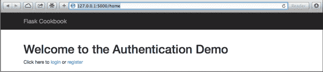
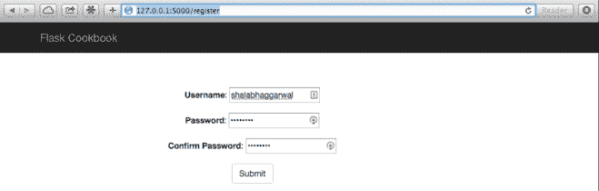
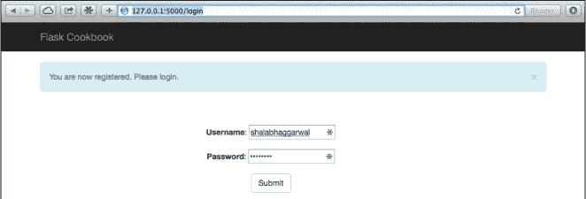
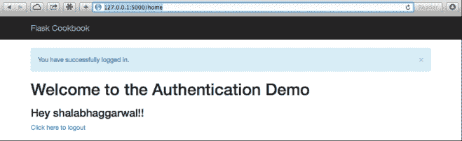

# 第六章 Flask 认证

认证是任何应用重要的部分，无论是 web，还是桌面，还是手机应用。每个应用都有处理它用户认证最好的方法。基于 web 的应用，尤其是 SaaS 应用，这一过程极其重要，因为这是应用安全与不安全的之间的界限。
这一章，将包含下面小节：

*   基于 session 的简单认证
*   使用 Flask-Login 扩展认证
*   使用 OpenID 认证
*   使用 Facebook 认证
*   使用 Google 认证
*   使用 Twitter 认证

## 介绍

Flask 为了保持简单和灵活，默认不提供认证机制。但是开发者可以根据每个应用的需求自己实现。
应用的用户认证可以通过多种方式完成。它可以通过使用简单的 session 完成，也可以通过更安全的 Flask-Login 扩展完成。同样也可以集成受欢迎的第三方服务比如 OpenID，或者 Facebook，Google 等等。这一章将看到这些方法的使用。

## 基于 session 的简单认证

在基于 session 的认证中，当用户第一次登陆后，用户信息被存储在服务器的 session 和浏览器的 cookie 中。之后，当用户打开应用时，存储在 cookie 中的用户信息将和服务器中的 seesion 做比较。如果 session 是存活的，用户将自动登陆。

###### 注意

应用配置应该总是指定 SECRET_KEY，否则存储在 cookie 中的数据和服务器的 session 都将是明文，这样很不安全。

我们将自己完成一个简单的认证机制。

###### 注意

这一小节完成的东西只是用来演示基本的认证的原理。这种方法不能用来任何生产环境中。

#### 准备

我们从第五章的 Flask 应用开始。它使用了 SQLAlchemy 和 WTForms 扩展（详情见前一章）。

#### 怎么做

在开始认证之前，我们需要一个模型来存储用户详细信息。首先在`flask_authentication/my_app/auth/models.py`里创建一个模型和表单：

```py
from werkzeug.security import generate_password_hash,check_password_hash
from flask_wtf import Form
from wtforms import TextField, PasswordField
from wtforms.validators import InputRequired, EqulTo
from my_app import db

class User(db.Model):
    id = db.Column(db.Integer, primary_key=True)
    username = db.Column(db.String(100))
    pwdhash = db.Column(db.String())

    def __init__(self, username, password):
        self.username = username
        self.pwdhash = generate_password_hash(password)

    def check_password(self, password):
        return check_password_hash(self.pwdhash, password) 
```

前面的代码是 User 模型，拥有两个字段：username 和 pwdhash。username 字段意思从名字可以看出。pwdhash 字段存储加了盐的密码，因为建议不要在数据库直接存储密码。

然后，创建两个表单：一个用于用户注册，一个用于登录。在 RegistrationForm 中，我们将创建两个 PasswordField，就像其他网站注册一样；目的是确保用户在两个字段里输入的密码一致：

```py
class RegistrationForm(Form):
    username = TextField('Username', [InputRequired()])
    password = PasswordField(
        'Password', [
            InputRequired(), EqualTo('confirm', message='Passwords must match')
        ]
    )
    confirm = PasswordField('Confirm Password', [InputRequired()])

class LoginForm(Form):
    username = TextField('Username', [InputRequired()])
    password = PasswordField('Password', [InputRequired()]) 
```

然后，在`flask_authentication/my_app/auth/views.py`创建视图处理用户的注册和登录请求：

```py
from flask import request, render_template, flash, redirect, url_for, session, Blueprint
from my_app import app, db
from my_app.auth.models import User, RegisterationForm, LoginForm

auth = Blueprint('auth', __name__)

@auth.route('/')
@auth.reoute('/home')
def home():
    return render_template('home.html')

@auth.route('/register', methods=['GET', 'POST'])
def register():
    if session.get('username'):
        flash('You are already logged in.', 'info')
        return rendirect(url_for('auth.home'))

    form = RegistrationForm(request.form)

    if request.method == 'POST' and form.validate():
        username = request.form.get('username')
        password = request.form.get('password')
        existing_username = User.query.filter_by(username=username).first()
        if existing_username:
            flash('This username has been already taken. Try another one.', 'warning')
            return render_template('register.html', form=form)
        user = User(username, password)
        db.session.add(user)
        db.session.commit()
        flash('You are now registered. Please login.', 'success')
        return redirect(url_for('auth.login'))

    if form.errors:
        flash(form.errors, 'danger')
    return render_template('register.html', form=form) 
```

前面的方法处理用户注册。在 GET 请求中，注册表单展示给了用户；表单需要填写用户名和密码。然后检查用户名是否已经被注册。如何用户名已经被注册，用户需要填写一个新的用户名。之后一个新的用户在数据库里被创建，然后重定向到登录页面。登录通过下面代码处理：

```py
@auth.route('/login', methods=['GET', 'POST'])
def login():
    form = LoginForm(request.form)
    if request.method == 'POST' and form.validate():
        username = request.form.get('username')
        password = request.form.get('password')
        existing_user = User.query.filter_by(username=username).first()
        if not (existing_user and existing_user.check_password(password)):
            flash('Invalid username or password. Please try again.', 'danger')
            return render_template('login.html', form=form)
        session['username'] = username
        flash('You have successfully logged in.', 'success')
        return redirect(url_for('auth.home'))

    if form.errors:
        flash(form.errors, 'danger')
    return render_template('login.html', form=form) 
```

前面的方法处理了用户登录。在表单验证之后，我们首先检查用户名是否存在。如果不存在，用户需重新输入用户名。同样的，我们检查密码是否正确。如果不正确，用户需重新填写密码。如果所有的检查通过了，session 使用 username 作为键存储用户的用户名。如果 session 存在则表示用户已登录。现在看下面用户注销代码：

```py
@auth.route('/logout')
def logout():
    if 'username' in session:
        session.pop('username')
        flash('You have successfully logged out.', 'success')

    return redirect(url_for('auth.home')) 
```

在理解了 login()方法后，前面的代码是很容易理解的。这里，我们从 session 中删除了 username，用户就自动注销了。

之后，我们将创建 register()和 login()用到的模板。
`flask_authentication/my_app/templates/base.html`模板几乎和第五章一样。唯一的区别是使用 catalog 的地方被 auth 替换了。
首先，我们将有一个简单的主页`flask_authentication/my_app/templates/home.html`，其中会根据用户是否注册和登录显示出不同的链接：

```py


    <h1>Welcome to the Authentication Demo</h1>
    
        <h3>Hey {{ session.username }}!!</h3>
        <a href="{{ url_for('auth.logout') }}">Click here to logout</a>
    
    Click here to <a href="{{ url_for('auth.login') }}">login</a> or
        <a href="{{ url_for('auth.register') }}">register</a>
    
 
```

之后，创建一个注册页，`flask_authentication/my_app/templates/register.html`：

```py


    <div class="top-pad">
        <form method="POST" action="{{ url_for('auth.register') }}" role="form">
            {{ form.csrf_token }}
            <div class="form-group">{{ form.username.label }}: {{ form.username() }}</div>
            <div class="form-group">{{ form.password.label }}: {{ form.password() }}</div>
            <div class="form-group">{{ form.confirm.label }}: {{ form.confirm() }}</div>
            <button type="submit" class="btn btn-default"> Submit</button>
        </form>
    </div>
 
```

最后，我们创建一个简单的登录页，`flask_authentication/my_app/templates/login.html`：

```py


    <div class="top-pad">
        <form method="POST" action="{{ url_for('auth.login') }}" role="form">
            {{ form.csrf_token }}
            <div class="form-group">{{ form.username.label }}: {{ form.username() }}</div>
            <div class="form-group">{{ form.password.label }}: {{ form.password() }}</div>
            <button type="submit" class="btn btn-default"> Submit</button>
        </form>
    </div>
 
```

#### 原理

看下面的截图，可以知道应用是如何工作的。
第一个截图是当打开`http://127.0.0.1:5000/home`时的主页：



这是用户未登录时的主页样子。

打开`http://127.0.0.1:5000/register`是注册页：



注册之后，打开`ttp://127.0.0.1:5000/register`可以看到登录页：



最后，用户登录后的主页`http://127.0.0.1:5000/home`看起来是：



## 使用 Flask-Login 扩展进行认证

前面一节，我们已经学习了如何完成基于 session 的认证。Flask-Login 是一个受欢迎的扩展，可以为我们以很好的方式处理很多东西，防止我们重新造轮子。它也不限制我们使用任何特定的数据库或者限制我们使用特定的字段/方法进行身份验证。它同样可以处理 Remember me 特性和账户找回等功能。

#### 准备

我们可以修改上一小节创建的应用，来用 Flask-Login 扩展完成同样的功能。
开始之前，需安装扩展：

```py
$ pip install Flask-Login 
```

#### 怎么做

为了使用 Flask-Login，首先需修改应用配置，`flask_authentication/my_app/__init__.py`：

```py
from flask_login import LoginManager

# Do other application config

login_manager = LoginManager()
login_manager.init_app(app)
login_manager.login_view = 'login' 
```

从扩展导入`LoginManager`之后，我们创建了这个类的一个对象。然后，使用`LoginManager`的`init_app()`方法配置 app 对象。之后，根据需要，`login_manager`还有很多配置可以设置。这里，我们演示一个基本的和必须的配置，即`login_view`，它表示登录请求的视图处理函数。我们甚至可以配置需要展示给用户的信息，我们 session 将会持续多久，应用处理登录使用的请求头等等。更多`Flask-Login`信息，参见`https://flask-login.readthedocs.org/en/latest/#customizing-the-login-process`。

Flask-Login 需要我们在 User 模型里增加一些额外的方法：

```py
def is_authenticated(self):
    return True

def is_active(self):
    return True

def is_anonymous(self):
    return False

def get_id(self):
    return self.id 
```

###### 译者注

使用 flask_login 替换 flask_ext_login
原书为 return unicode(self.id)，应为 return self.id

在前面的代码里，我们增加了四个方法，它们的解释在下面：

*   is_authenticated(): 这个方法通常返回 True。仅在我们不希望用户不被认证的时候返回 False。

*   is_active(): 这个方法通常返回 True。仅在我们封锁了或者禁止了一个用户的时候返回 False。

*   is_anonymous(): 这个方法用来表示一个用户不应该登录系统，应该作为一个匿名用户登录系统。对于正常登录的用户来说这个方法通常返回 False。

*   get_id(): 这个方法代表了认证用户的唯一 ID。这应该是一个 unicode 值。

接下来，我们得去修改`my_app/views.py`：

```py
from flask import g
from flask_login import current_user, login_user, logout_user, login_required
from my_app import login_manager

@login_manager.user_loader
def load_user(id):
    return User.query.get(int(id))

@auth.before_request
def get_current_user():
    g.user = current_user 
```

前面的方法中，@auth.before_request 装饰方法表示当收到每个请求时，在视图函数前调用该方法。这里我们记住了已经登录的用户：

```py
@auth.route('/login', methods=['GET', 'POST'])
def login():
    if current_user.is_authenticated:
        flash('You are already logged in.')
        return redirect(url_for('auth.home'))

        # 这边好像有问题
        # Same block of code as from last recipe Simple session based authentication
        # Next replace the statement session['username'] = username by the one below
        login_user(existing_user)
        flash('You have successfully logged in.', 'success')
        return redirect(url_for('auth.home'))

    if form.errors:
        flash(form.errors, 'danger')
    return render_template('login.html', form=form)

@auth.route('/logout')
@login_required
def logout():
    logout_user()
    return redirect(url_for('auth.home')) 
```

在`login()`方法中，在任何其他操作前，我们先检查`current_user`是否已认证。这里，`current_user`是一个代理，用来表示当前已登录的用户。在所有验证通过之后，使用`login_user()`方法进行用户登录。这个方法接收一个`user`对象并处理所有为登录用户而进行的会话活动。
现在，看`logout`方法，首先看到这个方法用`login_required()`装饰。这个装饰器确保这个方法执行前用户是登录的。它可以用在应用里的任何视图方法中。注销一个用户，我们需要去调用`logout_user()`，这将清除当前已登录用户的`session`，然后将用户从应用中注销。
我们不需要自己处理`session`。模板也存在一个小的改动。每当需要根据用户是登录状态时来显示一些内容，应该这样处理：

```py

    ...do something...
 
```

###### 译者注

原书为 current_user.is_authenticated()，这是错误的，应该去掉括号。
原书为 redirect(url_for(‘home’))，这是错误的，应为 redirect(url_for(‘auth.home’))。

#### 原理

这一小节的演示效果和上一小节是一样的。仅仅是完成方式的不同。

#### 更多

Flask-Login 使得实现 Remember me 特性相当简单。仅仅需要性 login_user()方法传递 remember=True。这将在用户电脑上保存一个 cookie，当 session 是存活的时候，Flask-Login 会自动登录。读者可以自行实现。

#### 其他

*   Flask 提供了一个特殊的对象：g。可以阅读`http://flask.pocoo.org/docs/0.10/api/#flask.g`了解更多。

下面暂不进行翻译

## 使用 OpenID 认证

## 使用 Facebook 认证

## 使用 Google 认证

## 使用 Twitter 认证

