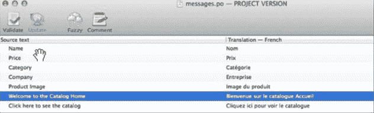
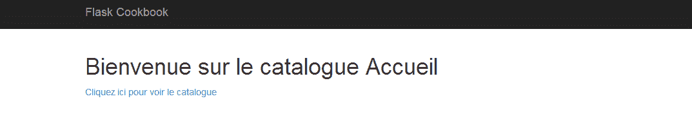
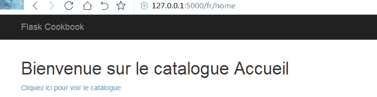

# 第九章 国际化和本地化

web 应用通常不限制于一个地区或者为一种特定语言的人群服务。比如，一个 web 应用意图服务于欧洲的用户，除了英语同样需要支持其它欧洲语言国家比如德国，法国，意大利，西班牙等等。这一章节将讲述如何在一个 Flask 应用中支持多种语言。

这一章将包括下面小节：

*   新增一种语言
*   延迟计算和 gettext/ngettext 函数
*   全球语言转换动作

## 介绍

在任何 web 应用中支持第二种语言都是一件麻烦的事情。每次应用发生修改的时候都增加了额外的开销，并且这种开销随着语言数量的增加而增加。除了为每种语言修改文本之外，还有很多事情需要去处理。其中一些是处理货币，数字，时间日期格式等等。

Flask-Babel 是一个扩展，用来向 Flask 应用添加 i18n 和 l1on 支持，它提供了一些工具和技术来使得这个过程更简单和更容易实现。

###### 提示

i18n 表示国际化，l10n 表示本地化。
这一章节，我们将使用这个扩展来理解这些概念。

## 新增一种语言

默认情况下 Flask 应用的语言是英语（大多数 web 框架都是如此）。我们将为我们的应用新增第二种语言并且为应用字符串新增一些转换。向用户展示的语言将依据用户浏览器中设置的语言而定。

#### 准备

我们从安装 Flask-Babel 扩展开始：

```py
$ pip install Flask-Babel 
```

这个扩展使用 Babel，pytz 和 speaklater 来向应用添加 i18b 和 l1on。
我们将使用第五章的应用来做演示。

#### 怎么做

首先，我们从配置部分开始，使用 app 对象创建一个 Babel 类的实例，并且指定这里可以使用的语言。French 被添加作为第二种语言：

```py
from flask_babel import Babel

ALLOWED_LANGUAGES = {
    'en': 'English',
    'fr': 'French',
}
babel = Babel(app) 
```

###### 提示

我们使用 en 和 fr 作为语言代码。他们分别表示英语（标准）和法语（标准）。如果我们想新增其他同一标准但是地区不同的语言比如英语（US）和英语（GB），这样的话需要使用这些代码比如 en-us 和 en-gb。

接下来，我们将在应用文件夹创建一个文件叫做 babel.cfg。这个文件的路径将是`flask_catalog/my_app/babel.cfg`，它将包含下面内容：

```py
[python: catalog/**.py]
[jinja2: templates/**.html]
extensions=jinja2.ext.autoescape,jinja2.ext.with_ 
```

这里，前两行告诉 Babel 哪些文件需要进行文本转换。第三行加载了一些扩展使得这些文件里的文本搜索变得可能。

应用的语言环境依赖于使用@babel.localeselector 装饰器修饰的这个方法的输出结果。向视图文件 views.py 新增下面方法：

```py
from my_app import ALLOWED_EXTENSIONS, babel

@babel.localeselector
def get_locale():
    return request.accept_languages.best_match(ALLOWED_LANGUAGES.keys())
    # return g.get('current_lang', 'en') 
```

前面方法从请求获取 Accept-Languages 头，然后寻找我们允许的最佳匹配语言。

###### 提示

修改浏览器的语言首选项是非常简单的。但是任何情况下，如果你不打算弄乱浏览器的语言首选项，仅仅需要从 get_locale()方法返回期待的语言代码。

接下来，我们需要标记一些文本是打算用来根据语言进行转换的。首先从 home.html 开始：

```py

<h1>{{ _('Welcome to the Catalog Home') }}</h1>
  <a href="{{ url_for('catalog.products') }}" id="catalog_link">
      {{ _('Click here to see the catalog ') }}
  </a>
 
```

这里，_ 是 Babel 提供的 gettext 函数的简写，它用来转换字符串。
之后，我们需要运行下面命令来使得被标记的文本在浏览器渲染我们模板时变得可用：

```py
$ pybabel extract -F my_app/babel.cfg -o my_app/messages.pot my_app 
```

前面命令遍历 babel.cfg 中所配置的文件内容，挑选出那些被标记为可转换的文本。所有这些文本被放置在 my_app/messages.pot 文件中。看下面命令：

```py
$ pybabel init -i my_app/messages.pot -d my_app/translations -l fr 
```

前面初始化命令创建了一个.po 文件，它包含那些需要被翻译文本的翻译。这个文件被创建在特定的文件夹里，即`my_app/translations/fr/LC_MESSAGES/messages.po`。当我们添加越多的语言时，越多的文件夹就会被添加。

现在，我们需要向 messages.po 文件新增一些翻译。这可以手动处理，或者我们也可以使用 GUI 工具比如 Poedit(`http://poedit.net/`)。使用这个工具，转换将看起来像下面截图这样：



手动编辑 messages.po 将看起来像下面代码。为了演示只有一条信息被翻译：

```py
#:my_app/templates/home.html:6
msgid "Click here to see the catalog"
msgstr "Cliquez ici pour voir le catalogue" 
```

在翻译添加完之后保存 messages.po 文件，然后运行下面命令：

```py
$ pybabel compile -d my_app/translations 
```

这将在 message.po 文件旁边创建一个 messages.mo 文件，它将被应用用来去渲染翻译文本。

###### 提示

有时在运行上面代码之后消息不会被编译。这是因为这些信息可能被标记为模糊的（以#开头）。这需要进行人工排查，如果信息需要被编译器更新则需要移除#标记。为了通过检查，向前面编译命令添加一个-f 标记，这将强制编译所有东西。

#### 原理

如果我们设置浏览器语言为 French，然后运行应用，主页将看起来像下面截图这样：


如果浏览器首选项语言不是法语，文本将以英语展示，英语是默认语言。

#### 更多

接下来，如果我们需要去更新 messages.po 文件的翻译，我们不需要再一次运行 init 命令。取而代之的是运行更新命令即：

```py
$ pybabel update -i my_app/messages.pot -d my_app/translations 
```

之后，像之前一样运行编译命令。

#### 提示

通常会依据于用户的 IP 和位置（有 IP 推断而来）来改变网站的语言。和使用 Accept-Language 头相比，这是一个更好的处理本地化的方法。

#### 其他

*   全球语言转换动作一节将允许用户直接去修改应用语言而不是在浏览器层面处理。
*   多语言的一个重要方面是需要处理日期，时间，货币。Babel 处理这些同样非常的简洁。我建议你自己尝试实现。参见 Babel 文档寻求更多信息`http://babel.pocoo.org/docs/`。

## 延迟计算和 gettext/negettext 函数

延迟计算（lazy evaluation）是一种计算策略，用来延迟表达的计算，直到需要值的时候才进行计算，因此这也叫做 call-by-need 机制。在我们的应用中，存在一些文本实例需要在渲染模板的时候才进行计算。通常情况下，当我们的文本在请求上下文之外被标记为可翻译时，我们就会推迟这些文本的执行，直到它们真正需要时。

#### 准备

让我们从前一小节应用开始。现在，我们希望商品和类别创建表单中的标签可以显示翻译的值。

#### 怎么做

为了标记商品和类别表单中的所有字段都是可以翻译的，我们需要对 models.py 做下面的修改：

```py
class NameForm(Form):
    name = StringField(_('Name'), validators=[InputRequired()])

class ProductForm(NameForm):
    price = DecimalField(_('Price'), validators=[
        InputRequired(), NumberRange(min=Decimal('0.0'))
    ])
    category = CategoryField(
        _('Category'), validators=[InputRequired()], coerce=int
    )
    image = FileField(_('Product Image'))

class CategoryForm(NameForm):
    name = StringField(_('Name'), validators=[
        InputRequired(), check_duplicate_category()
    ]) 
```

注意到所有这些字段标签都使用了 _()进行了标记。
现在，运行 pybabel extract 和 update 命令来更新 messages.po 文件，然后填充相关翻译，并且运行编译命令。具体细节参见上一小节。
使用`http://127.0.0.1:5000/product-create`打开商品创建页面。但是，它像我们期待的那样工作了吗？没有！因为，我们中的大多数应该猜到出现这样的情况原因可能是因为文本被标记为在请求上下文之外可翻译。

为了使之生效，我们仅仅需要修改下面的 import 语句：

```py
from flask_babel import lazy_ggetext as _ 
```

现在，我们有了更多的文本要来翻译。比如我们需要翻译商品创建的 flash 消息文本，像下面这样：

```py
flash("The product %s has been created" % name) 
```

为了标记它为可翻译的，我们不能仅仅简单的将所有东西包在 _()或 gettext()里面。gettext()函数支持占位符，可以使用%(name)s 替代。使用这种方法，前面代码将看起来像下面这样：

```py
flash(_('The product %(name)s has been created', name=name)) 
```

这句话的翻译结果看起来像这样 le produit %(name)s a été créé。

有些情况下，我们需要根据条目的数量来管理翻译，也就是单数或复数的名称。通过使用 ngettext()方法处理它。我们以在 products.html 模板中显示页码为例进行说明。
为此我们需要添加下面这行：

```py
{{ngettext('%(num)d page', '%(num)d pages', products.pages)}} 
```

这里，模板将渲染 page 如果只有一个页面，如果不止一个页面，将渲染 pages。

这是非常有趣的去注意 messages.po 文件里的翻译看起来是什么样子：

```py
#:my_app/templates/products.html:20
#,python-format
msgid "%(num)d page"
msgid_plural "%(num)d pages"
msgstr[0] "%(num)d page"
msgstr[1] "%(num)d pages" 
```

## 全球语言转换动作

前面一节，我们看到了依赖于当前浏览器语言首选项改变语言的处理。但是现在，我们需要一个机制来脱离浏览器的语言首选项转换语言。为此，我们需要在应用层面进行处理。

#### 准备

我们将修改上一小节的应用来完成语言转换。我们将新增一个额外的 URL 部分到所有的路由中来增加当前语言。我们可以仅仅在 URL 里修改语言就可以实现语言的切换。

#### 怎么做

首先需要修改所有的 URL 规则来增加一个额外的 URL 部分。
`@app.route('/')`将变为`@app.route('/<lang>/')`，同时`@app.route('/home')`将变为`@app.route('/<lang>/home')`。相似的，`@app.route('/product-search/<int:page>')`将变为`@app.route('/<lang>/product-search/<int:page>')`。所有的 URL 规则都需要这样处理。

现在，需要新增一个函数来添加 URL 中传递过来的语言到全局代理对象 g 中：

```py
@app.before_request
def before():
    if request.view_args and 'lang' in request.view_args:
        g.current_lang = request.view_args['lang']
        request.view_args.pop('lang') 
```

这个方法将在每个请求之前运行，向 g 中添加当前语言。
但是这意味着当前应用的所有的 url_for()调用需要修改来传递一个额外的参数 lang。幸运的是，有一个简单的方法处理它，像下面这样：

```py
from flask import url_for as flask_url_for

@app.context_processor
def inject_url_for():
    return {
        'url_for': lambda endpoint, **kwargs: flask_url_for(
            endpoint, lang=g.current_lang, **kwargs
        )   
    }

url_for = inject_url_for()['url_for'] 
```

前面代码中，我们首先导入`url_for`为`flask_url_for`。然后我们更新应用上下文处理器来添加`url_for()`函数，它是 Flask 提供的`url_for()`的修改版本，其中添加了额外的参数。

#### 原理

现在，运行这个应用，你会注意到所有的 URLs 有了一个语言部分。下面截图显示了渲染的模板看起来像什么样子。
打开`http://127.0.0.1:5000/en/home`我们将看到下面这样子：


主页使用英语作为语言。
现在，仅仅修改 URL 为`http://127.0.0.1:5000/fr/home`然后主页将看起来像这样：



主页使用法语作为语言。

#### 其他

*   第一小节，新增一个语言，是依赖于浏览器设置的语言来处理本地化。

###### 译者注

Flask-Babel 使用方法参见其中文文档:
[https://translations.readthedocs.io/en/latest/flask-babel.html](https://translations.readthedocs.io/en/latest/flask-babel.html)

