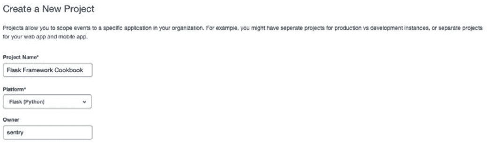
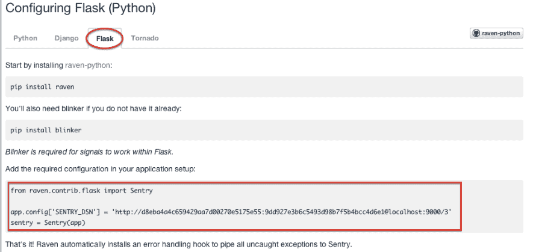
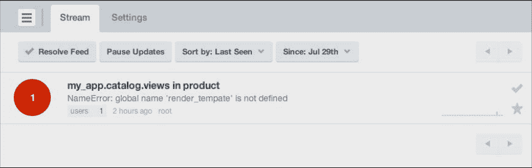
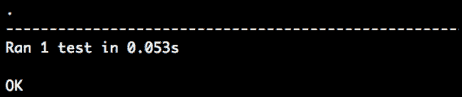
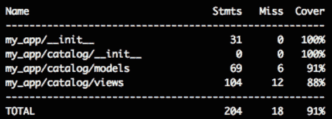
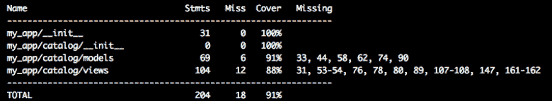
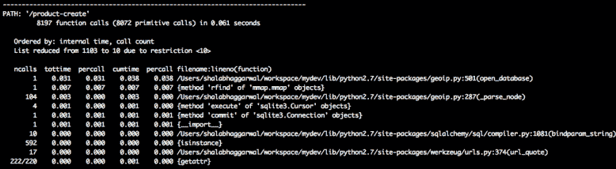

# 第十章 调试，错误处理和测试

直到现在，我们一直专注于应用开发，并且一次只增加一个特性。了解我们的应用程序的健壮程度并跟踪应用程序的工作和执行情况是非常重要的。这反过来又导致了在应用程序出现问题时被通知的必要性。开发应用程序时漏掉某些边缘情况是正常的，通常情况下，即使是测试用例也会遗漏它们。了解这些边缘情况是有必要的，当他们真正发生时，可以相应的进行处理。
测试本身是一个非常大的话题，有很多书在讲述它。这里我们尝试理解 Flask 测试的基本知识。

这一章，我们将包含下面小节：

*   设置基本 logging 文件
*   错误发生时发送邮件
*   使用 Sentry 监测异常
*   使用 pdb 调试
*   创建第一个简单测试
*   为视图和逻辑编写更多的测试
*   Nose 库集成
*   使用 mocking 避免真实 API 访问
*   确定测试覆盖率
*   使用 profiling 寻找瓶颈

## 介绍

高效的日志功能和快速调试能力是选择应用开发框架时需要考虑的因素。框架拥有越好的日志和调试能力，应用开发就会变得更快，维护也会更容易。它有助于帮助开发者快速找出应用里的问题，有时日志可以在终端用户发现问题前提前发现问题。高效的错误处理在增加用户满意度方面和减轻开发者调试痛苦方面都扮演着重要的角色。即使代码是完美的，应用有时也会报错。为什么？答案是显而易见的，虽然代码是完美的，但是这个世界并不是。有数不清的情况会发生，作为开发者，我们总是想知道背后的原因。编写应用测试是编写优秀软件的重要支柱之一。
Python 自带的日志调试系统在 Flask 下也可以很好的工作。我们这一章将使用这个日志调试系统，之后去使用一个炫酷的服务叫做 Sentry，它极大程度上减少了调试日志的痛苦。
我们已经阐述了应用开发中测试的重要性，我们将看到如何为 Flask 应用编写单元测试。我们同样将看到如何测量代码覆盖率和寻找应用瓶颈。

## 设置基本 logging 文件

通常，Flask 不会为我们生成日志，除了带有堆栈跟踪信息的错误，这些错误会被发送给 logger(我们将在本章的其余部分看到更多关于这一点的说明)。当在开发模式下，使用 run.py 运行应用时会产生很多的堆栈信息，但是在生产环境下很难奢望还拥有这些信息。幸运的是，logging 库提供了很多 log 处理方法可以根据需要进行使用。

#### 准备

我们将开始我们的商品目录应用，使用 FileHandler 添加一些基本 logging。他们将信息记录在文件系统的特定文件里。

#### 怎么做

首先，需要改动`__init__.py`：

```py
app.config['LOG_FILE'] = 'application.log'

if not app.debug:
    import logging
    from logging import FileHandler
    file_handler = FileHandler(app.config['LOG_FILE'])
    file_handler.setLevel(logging.INFO)
    app.logger.addHandler(file_handler) 
```

这里我们增加了一个配置用于指定日志文件的位置。这指的是从应用目录的相对路径，除非特别指定绝对路径。接下来，我们要检查是否启用 debug 模式，如果否，在文件里添加一个日志输出，并设置日志等级为 INFO.DEBUG，这个是最低级别，将会记录所有级别的信息。更多细节，参见日志库文档。

之后，在应用需要日志的地方仅需添加 logger，应用就会将日志信息记录到指定文件。让我们在 views.py 添加一些 loggers 进行演示：

```py
@catalog.route('/')
@catalog.route('/<lang>/')
@catalog.route('/<lang>/home')
@template_or_json('home.html')
def home():
    products = Product.query.all()
    app.logger.info(
        'Home page with total of %d products' % len(products)
    )
    return {'count': len(products)}

@catalog.route('/<lang>/product/<id>')
def product(id):
    product = Product.query.filter_by(id=id).first()
    if not product:
        app.logger.warning('Requested product not found.')
        abort(404)
    return render_template('product.html', product=product) 
```

前面代码中，我们为视图添加了一些 logger。home()里的第一个 logger 等级是 info，product()等级是 warning。如果我们在`__init__.py`设置日志等级为 INFO，两者都将被记录。但是如果设置等级为 WARNING，只有 warning 日志会被记录。

#### 原理

前面代码会在应用根目录创建一个叫做 application.log 的文件。日志会被记录到这个文件，内容看起来像下面这样，内容根据被调用的 handler 不同而有所区别。第一个是来自 home 的请求，第二个是请求商品不存在时的情况：

```py
Home page with total of 1 products
Requested product not found. 
```

#### 更多

*   阅读 Python 日志库文档了解更多 handlers，参见`https://docs.python.org/dev/library/logging.handlers.html`

## 发生错误时发送邮件

这是一个好的主意，在未知事情发生的时候去接收这些错误。实现这非常的容易，并且为错误处理的带来了便利。

#### 准备

我们将采用上一小节的应用，给它添加 mail_handler，来使得应用可以在发生错误的时候发送邮件。同时，我们将演示怎么使用 Gmail 和 SMTP 服务器创建这些 e-mail。

#### 怎么做

首先向配置文件`__init__.py`添加处理程序。这和我们在上一小节添加 file_handler 是类似的：

```py
RECEPIENTS = ['some_receiver@gmail.com']

if not app.debug:
    import logging
    from logging import FileHandler, Formatter
    from logging.handlers import SMTPHandler
    file_handler = FileHandler(app.config['LOG_FILE'])
    file_handler.setLevel(logging.INFO)
    app.logger.addHandler(file_handler)
    mail_handler = SMTPHandler(
        ("smtp.gmail.com", 587), 'sender@gmail.com', RECEPIENTS,
        'Error occurred in your application',
        ('sender@gmail.com', 'some_gmail_password'), secure=())
    mail_handler.setLevel(logging.ERROR)
    app.logger.addHandler(mail_handler)
    for handler in [file_handler, mail_handler]:
        handler.setFormatter(Formatter(
            '%(asctime)s %(levelname)s: %(message)s '           
            '[in %(pathname)s:%(lineno)d]'
        )) 
```

这里我们设置了一些 e-mail 地址，错误发生的时候会给这些地址发送邮件。同时注意 mail_handler 中设置了日志等级为 EROOR。这是因为只有重要和关键的事情才需要发送邮件。
更多配置 SMTPHanderder 的细节，参见它的文档。

###### 提示

确保关闭 run.py 中的 debug 标记，这样才能使能应用日志，并且为内部应用程序错误发送电子邮件(错误 500)。

#### 原理

为了引起一个内部应用错误，只需在处理程序任何地方拼错关键字即可。你将在你的邮箱中收到一封邮件，具有配置中设置的格式和完整的堆栈信息以供参考。

#### 更多

当找不到页面时（404），我们还可能希望记录所有这些错误。为此，我们只需稍微修改一下 errorhandler 方法：

```py
@app.errorhandler(404)
def page_not_found(e):
    app.logger.error(e)
    return render_template('404.html'), 404 
```

## 使用 Sentry 监控异常

Sentry 是一个工具，它简化了监控异常的过程，同时也给用户带来了深入了解这些错误的可能。日志中的错误很大程度上会被我们眼睛忽略掉。Sentry 分类了不同类型的错误，对错误的重复次数进行计数。这有助于理解错误的严重性，并帮助我们相应地处理它们。

#### 准备

我们将从 Sentry 安装和配置开始。有很多安装和配置 Sentry 的方法。Sentry 还提供了一个基于 SaaS 的托管解决方案，您可以跳过前面讨论的安装部分，直接进行集成。可以从`https://www.getsentry.com`获取 Sentry。

这里，我们将讨论一个非常基础的 Sentry 安装和配置方法，剩下的留给你们自己实现。我们将使用 PostgreSQL 做为 Sentry 的数据库，因为这是 Sentry 团队强烈推荐使用的。运行下面命令：

```py
$ pip install sentry[postgres] 
```

Sentry 是一个服务程序，我们需要一个客户端去访问它。推荐使用 Raven，通过下面命令可以安装:

```py
$ pip install raven[flask] 
```

这里还需要一个库:blinker。这用来处理 Flask 应用的信号（这已经超出本书的范围了，但是你可以阅读`https://pypi.python.org/pypi/blinker`了解更多）。可以使用下面命令安装：

```py
$ pip install blinker 
```

#### 怎么做

安装好了之后，我们需要去给 Sentry 服务器添加配置。首先，在你选择的路径初始化配置文件。推荐在当前虚拟环境里一个名字为 etc 的文件夹下做初始化。可以通过下面命令运行：

```py
$ sentry init etc/sentry.conf.py 
```

之后，基础配置看起来像这样：

```py
from sentry.conf.server import *

DATABASES = {
    'default': {
        'ENGINE': 'django.db.backends.postgresql_psycopg2',
        'NAME': 'sentry', # Name of the postgres database
        'USER': 'postgres', # Name of postgres user
        'PASSWORD': '',
        'HOST': '',
        'PORT': '',
        'OPTIONS': {
            'autocommit': True,
        }
    }
}
SENTRY_URL_PREFIX = 'http://localhost:9000'
SENTRY_WEB_HOST = '0.0.0.0'
SENTRY_WEB_PORT = 9000
SENTRY_WEB_OPTIONS = {
    'workers': 3, # the number of gunicorn workers
    'limit_request_line': 0, # required for raven-js
    'secure_scheme_headers': {'X-FORWARDED-PROTO': 'https'},
} 
```

我们同样可以配置邮件服务器的细节，使得 Sentry 在错误发生的时候发送邮件，高效的从日志里获取信息，就像上一小节做的那样。详情可以参见 `http://sentry.readthedocs.org/en/latest/quickstart/index.html#configure-outbound-mail`。

现在，在 postgres 中，我们需要去创建 Sentry 中使用的数据库，并升级初始集合：

```py
$ createdb -E utf-8 sentry
$ sentry --config=etc/sentry.conf.py upgrade 
```

升级进程将创建一个默认的超级用户。如果没有，请运行下面命令：

```py
$ sentry --config=etc/sentry.conf.py createsuperuser
Username: sentry
Email address: someuser@example.com
Password:
Password (again):
Superuser created successfully.
$ sentry --config=etc/sentry.conf.py repair –owner=sentry 
```

上一个命令中，sentry 是在创建超级用户时选择的用户名。
现在，开启 Sentry 服务仅仅需要运行下面的命令：

```py
$ sentry --config=etc/sentry.conf.py start 
```

通常，Sentry 运行在 9000 端口，可以通过`http://localhost:9000/`访问到。

接下来，我们需要使用 GUI 在 Sentry 中创建一个团队（team），然后创建一个项目去记录我们应用的错误日志。使用超级用户登录 Sentry 后，会看到一个按钮，如下面的截图所示：


根据表单要求创建一个团队和项目。项目表单看起来像这样：



之后，下个屏幕截图看起来像这样。这里的细节将用于我们的 Flask 应用程序的配置。



现在，拷贝前面截图中高亮的部分，然后粘贴到 Flask 配置文件中。这将使得任何未被捕捉到的错误会被记录到 Sentry。

#### 原理

Sentry 记录一个错误，看起来像这样：



还可以在 Sentry 中记录消息和用户定义的异常。将这个留给你们自己去实现。

## 使用 pdb 调试

大多数 Python 开发者读这本书的时候可能已经对 Python 调试器 pdb 的用法有一点了解。对于那些不知道它的人来说，pdb 是一个用于调试 Python 程序的交互式调试器。我们可以在需要的地方设置断点，使用单步调试，看堆栈信息。
许多新的开发者可能持有这样的观点，调试可以使用日志就可以了。但是调试器可以让我们看到运行流程，每一步的运行状态，会节省很多的开发时间。

#### 准备

这一小节将使用 Python 内带的 pdb 模块，使用上一小节的应用做为演示。

#### 怎么做

使用 pdb 大多是情况下非常的简单。我们仅仅需要在需要打断点的地方插入下面一句就可以了；

```py
import pdb; pdb.set_trace() 
```

这将触发应用在这个断点停止执行，之后可以使用调试器命令单步执行。
现在，在我们的方法中插入这一句，在商品处理函数中：

```py
def products(page=1):
    products = Product.query.paginate(page, 10)
    import pdb; pdb.set_trace()
    return render_template('products.html', products=products) 
```

当来到这一行的时候，调试器提示符就会启动；看起来像这样：

```py
-> return render_template('products.html', products=product)
(Pdb) u
> /Users/shalabhaggarwal/workspace/flask_heroku/lib/python2.7/sitepackages/Flask-0.10.1-py2.7.egg/flask/app.py(1461)dispatch_request()
-> return self.view_functions[rule.endpoint](**req.view_args)
(Pdb) u
> /Users/shalabhaggarwal/workspace/flask_heroku/lib/python2.7/sitepackages/Flask-0.10.1-py2.7.egg/flask/app.py(1475)full_dispatch_request()
-> rv = self.dispatch_request()
(Pdb) u
> /Users/shalabhaggarwal/workspace/flask_heroku/lib/python2.7/sitepackages/Flask-0.10.1-py2.7.egg/flask/app.py(1817)wsgi_app()
-> response = self.full_dispatch_request() 
```

看 Pdb 中使用的 u，这意味单步执行。该语句中的所有变量，参数属性在当前上下文中都可以使用，以帮助解决问题或理解代码的运行流程。

#### 其他

*   更多调试器命令参见 `https://docs.python.org/2/library/pdb.html#debugger-commands`

## 创建第一个简单测试

测试是任何开发过程中的一个核心，在维护和扩展中也是如此。尤其是 web 应用程序面临高流量，高用户的情况下，测试变的尤其重要，因为用户反馈决定了程序的命运。这一小节，我们将看到如何开始编写测试，后面小节也会讲到更复杂的测试。

#### 准备

在应用根目录下新建一个文件：`app_tests.py`，即`my_app`文件夹里面。
Python 库 unittest2 需要使用下面命令安装：

```py
$ pip install unittest2 
```

#### 怎么做

开始，`app_tests.py`测试文件看起来像这样：

```py
import os
from my_app import app, db
import unittest2 as unittest
import tempfile 
```

前面的代码导入了需要的包。我们将使用 unittest2（前面已经使用 pip 安装了）。需要一个 tempfile 来动态创建 SQLite 数据库。
所有的测试用例需要继承 unitest.TestCase:

```py
class CatalogTestCase(unittest.TestCase):

    def setUp(self):
        self.test_db_file = tempfile.mkstemp()[1]
        app.config['SQLALCHEMY_DATABASE_URI'] = 'sqlite:///' + self.test_db_file
        app.config['TESTING'] = True
        self.app = app.test_client()
        db.create_all() 
```

前面方法在任何测试方法运行前运行，里面新建了一个测试客户端。这个类里面需要测试的方法是以`test_`前缀开头的。这里，在应用配置里设置了数据库的名字，是一个时间戳，这将不会重复。同样设置了 TESTING 标记为 True，关闭了错误捕捉，为了更好的进行测试。最后运行 db 的 create_all()方法创建所需的数据库表。看下面代码：

```py
def tearDown(self):
    os.remove(self.test_db_file) 
```

前面方法会在测试运行完后运行。我们移除了当前的数据库文件。看下面代码：

```py
def test_home(self):
    rv = self.app.get('/')
    self.assertEqual(rv.status_code, 200) 
```

前面代码是我们的第一个测试，我们发送了一个 HTTP GET 请求到我们的应用，然后测试返回码是否是 200，200 代表这是一个成功的 GET 请求。

```py
if __name__ == '__main__':
    unittest.main() 
```

#### 原理

为了运行测试文件，仅仅需要在终端运行下面命令：

```py
$ python app_tests.py 
```

下面截图显示了测试的输出结果：



## 为视图和逻辑编写更多的测试

上一小节，我们开始为 Flask 应用编写测试了，这一小节，我们将为应用编写更多的测试，这些测试将覆盖视图，以便测试行为和逻辑。

#### 准备

我们将继续使用上一小节的`app_tests.py`文件。

#### 怎么做

在编写任何测试前，需要在 setUp()方法中添加一些配置，关闭 CSRF token，因为测试环境不会生成它们：

```py
app.config['WTF_CSRF_ENABLED'] = False 
```

下面是这一小节需要创建的测试用例，我们会逐步介绍每一个测试用例：

```py
def test_products(self):
    "Test Products list page"
    rv = self.app.get('/en/products')
    self.assertEqual(rv.status_code, 200)
    self.assertTrue('No Previous Page' in rv.data)
    self.assertTrue('No Next Page' in rv.data) 
```

前面测试发送一个 GET 请求到/products，然后 assert 返回状态码是否是 200。同样 assert 有没有前一页和后一页（做为模板渲染逻辑的一部分）。看下面代码：

```py
def test_create_category(self):
    "Test creation of new category"
    rv = self.app.get('/en/category-create')
    self.assertEqual(rv.status_code, 200)

    rv = self.app.post('/en/category-create')
    self.assertEqual(rv.status_code, 200)
    self.assertTrue('This field is required.' in rv.data)

    rv = self.app.get('/en/categories')
    self.assertEqual(rv.status_code, 404)
    self.assertFalse('Phones' in rv.data)
    rv = self.app.post('/en/category-create', data={
        'name': 'Phones',
    })
    self.assertEqual(rv.status_code, 302)

    rv = self.app.get('/en/categories')
    self.assertEqual(rv.status_code, 200)
    self.assertTrue('Phones' in rv.data)

    rv = self.app.get('/en/category/1')
    self.assertEqual(rv.status_code, 200)
    self.assertTrue('Phones' in rv.data) 
```

前面测试创建一个 category，并且 assert 相应的状态信息。当一个 category 成功创建的时候，我们将重定向到新建好的 category 页面，这时候状态码是 302。看下面代码：

```py
def test_create_product(self):
"Test creation of new product"
rv = self.app.get('/en/product-create')
self.assertEqual(rv.status_code, 200)

rv = self.app.post('/en/product-create')
self.assertEqual(rv.status_code, 200)
self.assertTrue('This field is required.' in rv.data)

# Create a category to be used in product creation
rv = self.app.post('/en/category-create', data={
    'name': 'Phones',
})
self.assertEqual(rv.status_code, 302)

rv = self.app.post('/en/product-create', data={
    'name': 'iPhone 5',
    'price': 549.49,
    'company': 'Apple',
    'category': 1
})
self.assertEqual(rv.status_code, 302)

rv = self.app.get('/en/products')
self.assertEqual(rv.status_code, 200)
self.assertTrue('iPhone 5' in rv.data) 
```

前面测试创建了一个商品，assert 了每个调用相应的状态信息。

###### 提示 【待修改】

做为这个测试的一部分，我们对 create_product()方法做了一些修改。之前见到的`image = request.files['image']`被替换为了`image = request.files`和`request.files['image']`。这是因为在使用 HTML 表单的时候，我们有一个空的参数 request.files[‘image’]，但是现在我们没有了。

看下面代码：

```py
def test_search_product(self):
    "Test searching product"
    # Create a category to be used in product creation
    rv = self.app.post('/en/category-create', data={
        'name': 'Phones',
    })
    self.assertEqual(rv.status_code, 302)

    # Create a product
    rv = self.app.post('/en/product-create', data={
        'name': 'iPhone 5',
        'price': 549.49,
        'company': 'Apple',
        'category': 1
    })
    self.assertEqual(rv.status_code, 302)

    # Create another product
    rv = self.app.post('/en/product-create', data={
        'name': 'Galaxy S5',
        'price': 549.49,
        'company': 'Samsung',
        'category': 1
    })
    self.assertEqual(rv.status_code, 302)

    self.app.get('/')

    rv = self.app.get('/en/product-search?name=iPhone')
    self.assertEqual(rv.status_code, 200)
    self.assertTrue('iPhone 5' in rv.data)
    self.assertFalse('Galaxy S5' in rv.data)

    rv = self.app.get('/en/product-search?name=iPhone 6')
    self.assertEqual(rv.status_code, 200)
    self.assertFalse('iPhone 6' in rv.data) 
```

前面测试文件新建了一个 category 和两个 product。之后，搜索一个产品，并确保结果中只返回搜索的产品。

#### 怎么做

运行测试文件，需要在终端运行下面命令：

```py
$ python app_tests.py -v
test_create_category (__main__.CatalogTestCase)
Test creation of new category ... ok
test_create_product (__main__.CatalogTestCase)
Test creation of new product ... ok
test_home (__main__.CatalogTestCase)
Test home page ... ok
test_products (__main__.CatalogTestCase)
Test Products list page ... ok
test_search_product (__main__.CatalogTestCase)
Test searching product ... ok
---------------------------------------------------------------
Ran 5 tests in 0.189s

OK 
```

上面输出表明了测试的结果。

## Nose 库集成

Nose 是一个库，可以用来使得测试更容易更有趣。它提供了许多工具来加强测试。尽管 Nose 可以用于多种用途，最重要的用法仍然是测试收集器和运行器。Nose 从当前工作目录下的 Python 源文件、目录和软件包中自动收集测试用例。我们将重点关注如何使用 Nose 运行单个测试，而不是每次运行全部测试。

#### 准备

首先，安装 Nose 库：

```py
$ pip install nose 
```

#### 怎么做

我们可以使用 Nose 运行应用中所有的测试，通过下面命令：

```py
$ nosetests -v
Test creation of new category ... ok
Test creation of new product ... ok
Test home page ... ok
Test Products list page ... ok
Test searching product ... ok
---------------------------------------------------------------
Ran 5 tests in 0.399s

OK 
```

这将选择应用程序中的所有测试，并运行它们，即使我们有多个测试文件。
为了运行单个测试文件，需使用下面命令：

```py
$ nosetests app_tests.py 
```

现在，如果需要运行单个测试，可以使用下面命令：

```py
$ nosetests app_tests:CatalogTestCase.test_home 
```

当我们有一个内存密集型的应用程序和大量的测试用例时，这一点变得非常重要。测试本身可能会花费大量的时间来运行，而且每次这样做对开发人员来说都是非常令人沮丧的。相反，我们更愿意只运行那些与所做的更改有关的测试，或者在某个更改上失败的测试。

#### 其他

*   还有许多其他配置 Nose 的方法。参见`http://nose.readthedocs.org/en/latest/usage.html`。

## 使用 mocking 避免真实 API 访问

## 确定测试覆盖率

前一小节，包含了测试编写，但测试还有一个重要的方法是测试覆盖。覆盖率表示测试覆盖了我们多少的代码。覆盖率越高，测试越高（尽管这不是优秀测试的唯一标准）。这一小节，我们将检查我们应用的覆盖率。

###### 提示

记住百分百的测试率并不意味着代码是完美的。然后在多数情况下，这比没有测试或者低覆盖率要好很多。没有测试的东西都可能是存在问题的。

#### 准备

我们将使用一个库叫做 coverage。安装它：

```py
$ pip install coverage 
```

#### 怎么做

最简单的获取覆盖率细节的方法是使用命令行。仅需运行下面命令：

```py
$ coverage run –source=../<Folder name of application> --omit=app_tests.py,run.py app_tests.py 
```

这里–source 表示需要覆盖率中需要考虑的目录，–omit 表示需要忽略的文件。

现在，在终端打印报告，需运行：

```py
$ coverage report 
```

下面截图显示了输出：



为了得到覆盖率 HTML 形式的输出，运行下面命令：

```py
$ coverage html 
```

这会在当前工作目录中创建一个新的文件夹叫做 htmlcov。仅需在用浏览器打开其中的 index.html，就可以看到所有的细节。
或者，我们可以在测试文件中包含一段代码，这样每次运行测试时都会获得覆盖率报告。在 app_tests.py 中最前面添加以下代码片段：

```py
import coverage
cov = coverage.coverage(
    omit = [
    '/Users/shalabhaggarwal/workspace/mydev/lib/python2.7/sitepackages/*',
    'app_tests.py'
    ]
)
cov.start() 
```

这里，导入了 coverage 库，然后创建了一个对象；告诉 coverage 忽略所有的 site-packages（通常 coverage 会包含所有的依赖），以及测试文件本身。然后，我们开始计算覆盖率的过程。
最后，修改最后一个代码块：

```py
if __name__ == '__main__':
    try:
        unittest.main()
    finally:
        cov.stop()
        cov.save()
        cov.report()
        cov.html_report(directory = 'coverage')
        cov.erase() 
```

前面的代码，首先将 unittest.main()放在 try..finally 块中。这是因为在执行完所有测试之后，unittest.main()会退出。现在，在这个方法完成之后，覆盖率的代码会运行。我们首先停止覆盖率报告，保存它，在控制台上打印报告，然后在删除临时文件.coverage 之前产生 HTML 版本的报告（这些是自动完成的）。

#### 原理

现在运行命令：

```py
$ python app test.py 
```

输出看起来像这样：



#### 其他

*   使用 Nose 库也是可以测量覆盖率的。这留给你们自己探索。参见`https://nose.readthedocs.org/en/latest/plugins/cover.html?highlight=coverage`。

## 使用 profiling 寻找瓶颈

当我们决定去扩展应用的时候，Profiling 是一个重要的工具。在扩展前，我们希望知道哪一个进程是一个瓶颈，影响了整体上的运行。Python 有一个自带的分析器叫做 cProfile 可以帮助我们做这件事，但是为了生活更加的美好，Werkzeug 自带一个基于 cProfile 的 ProfilerMiddleware。我们将使用它来寻找应用瓶颈。

#### 准备

我们将使用上一小节的应用，新建一个文件叫做 generate_profile.py，在里面增加 ProfileMiddleware。

#### 怎么做

在 run.py 旁边，新建一个文件 generate_profile.py，这个文件就像 run.py 一样，但是它使用 ProfilerMiddleware：

```py
from werkzeug.contrib.profiler import ProfilerMiddleware
from my_app import app
app.wsgi_app = ProfilerMiddleware(app.wsgi_app, restrictions = [10])
app.run(debug=True) 
```

这里，我们从 werkzeug 导入了 ProfileMiddleware，然后修改 wsgi_app 去使用它，限制输出只打印 10 个调用的结果。

#### 原理

现在，使用 generate_profile.py 运行应用：

```py
$ python generate_profile.py 
```

之后新建一个新的商品。然后特定调用的输出类似于下面截图：



从前面截图中看出，这个过程中最密集的调用是对数据库的调用。所以，如果我们决定在未来某个时候提高性能，那么这个是首先需要考虑的问题。