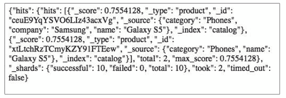

# 第十二章 其他贴士和技巧

这本书已经覆盖了使用 Flask 创建 web 应用需要知道的所有东西。但还是有很多需要你自己去探索。最后一章，我们将讲述额外一些小节，如果有必要的话，他们可以被添加进应用。

这一章，将包含下面内容：

*   使用 Whoosh 进行全文搜索
*   使用 Elasticsearch 进行全文搜索
*   使用 signals
*   使用缓存
*   为 Flask 应用支持 E-mail
*   理解异步操作
*   使用 Celery

## 介绍

这一章，我们首先将学习如何使用 Whoosh 和 Elasticsearch 进行全文搜索。全文搜索对于提供大量内容和选项的 Web 应用程序（如电子商务网站）非常重要。接下来我们将捕捉信号，这些信号是在应用里某些操作执行时被发送的。然后为我们的 Flask 应用实现缓存。
我们同样将会看到应用如何支持发送 e-mail。然后将看到如何实现应用异步。通常，WSGI 应用是同步和阻塞的，不能同时处理多个同步请求。我们将看到如何通过一个简单的例子解决这个问题。我们还会集成 Celery 到我们的应用，看一个任务队列对应用带来的好处。

## 使用 Whoosh 进行全文搜索

Whoosh 是使用 Python 完成的一个快速全文索引和搜索库。它是一个完全 Pythonic 的 API，使得开发者为他们的应用增加搜索功能非常容易和高效。这一节，我们将使用一个叫做 Flask-WhooshAlchemy 的包，它集成了 Whoosh 文本搜索功能和 SQLAlchemy，以便用于 Flask 应用中。

#### 准备

使用下面命令安装 Flask-WhooshAlchemy：

```py
$ pip install flask_whooshalchemy 
```

它将安装需要的包和依赖。

###### 译者注

flask_whooshalchemy 不支持 Python3，另外对中文支持也不好，不推荐使用，可以使用 jieba。

#### 怎么做

使用 SQLAlchemy 集成 Whoosh 和 Flask 是非常简单的。首先，我们需要提供一个 Whoosh 目录的路径，这个目录下将创建模型索引。这应该在应用配置里完成，即`my_app/__init__.py`:

```py
app.config['WHOOSH_BASE'] = '/tmp/whoosh' 
```

你可以选择任意你喜欢的路径，可以是绝对路径也可以是相对路径。

接下来，我们需要改变 models.py 文件，使得一些 string/text 字段可搜索：

```py
import flask.ext.whooshalchemy as whooshalchemy
from my_app import app

class Product(db.Model):
    __searchable__ = ['name', 'company']
    # … Rest of code as before … #

whooshalchemy.whoosh_index(app, Product)

class Category(db.Model):
    __searchable__ = ['name']
    # … Rest of code as before … #

whooshalchemy.whoosh_index(app, Category) 
```

注意每个模型添加的`__searchable__`语句。它告诉 Whoosh 去创建这些字段的索引。记住这些字段应该是 text 或者是 string 类型的。whoosh_index 语句告诉应用为这些模型创建索引，如果他们还不存在的话。

做好这些之后，添加一个 handler 使用 Whoosh 进行搜索。可以在 views.py 处理这些：

```py
@catalog.route('/product-search-whoosh')
@catalog.route('/product-search-whoosh/<int:page>')
def product_search_whoosh(page=1):
    q = request.args.get('q')
    products = Product.query.whoosh_search(q)
    return render_template(
        'products.html', products=products.paginate(page, 10)
    ) 
```

这里，通过 q 获取 URL 参数，然后传递它的值到 whoosh_search()方法里。这个方法将会对 Product 模型的 name 和 company 字段进行全文搜索。我们前面已经进行了设置，使得模型里的 name 和 company 变得可搜索了。

#### 原理

在第四章基于 SQL 搜索一节中我们实现了一个基于基本字段搜索的方法。但是在使用 Whoosh 情况下，搜索时我们不需要指定任何字段。我们可以输入任何字段，如何匹配上可搜索字段的话，将会返回结果，并按照相关性进行排序。

首先，在应用创建一些商品。现在，打开`http://127.0.0.1:5000/product-search-whoosh?q=iPhone`，结果页将显示商品名包含 iPhone 的列表。

###### 提示

Whoosh 提供了一些高级选项，我们可以控制哪些字段可以搜索或者结果是如何排序的。你可以根据应用的需要自行探索。

#### 其他

*   参考 `https://pythonhosted.org/Whoosh/`
*   参考 `https://pypi.python.org/pypi/Flask-WhooshAlchemy`

## 使用 Elasticsearch 进行全文搜索

Elasticsearch 是一个基于 Lucene 的搜索服务，是一个开源信息检索库。ElasticSearch 提供了一个分布式全文搜索引擎，它具有 RESTful Web 接口和 schema-free JSON 文档。这一小节，我们将使用 Elasticsearch 为我们的 Flask 应用完成全文搜索。

#### 准备

我们将使用一个叫做 pyelasticsearch 的 Python 库，它使得处理 Elasticsearch 很容易：

```py
$ pip install pyelasticsearch 
```

我们同样需要安装 Elasticsearch 服务本身。可以从`http://www.elasticsearch.org/download/`下载。解压文件，然后运行下面命令：

```py
$ bin/elasticsearch 
```

默认情况下，将在`http://localhost:9200/`上运行 Elasticsearch 服务。

#### 怎么做

为了演示集成，我们将从向应用配置添加 Elasticsearch 开始，即`my_app/__init__.py`:

```py
from pyelasticsearch import ElasticSearch
from pyelasticsearch.exceptions import IndexAlreadyExistsError

es = ElasticSearch('http://localhost:9200/')
try:
    es.create_index('catalog')
except IndexAlreadyExistsError, e:
    pass 
```

这里，我们从 ElasticSearch 类创建了一个 es 对象，它接收了服务器 URL。然后创建了一个叫做 catalog 的索引。他们是在 try-except 块中处理的，因为如果索引已经存在 ，将会抛出 IndexAlradyExistsError，通过捕捉异常，可以忽略这个错误。

接下来，我们需要往 Elasticsearch 索引里添加文档（document）。可以在视图和模型里完成这些，但是最好是将它添加在模型层。所以，我们将在 models.py 里完成这些:

```py
from my_app import es

class Product(db.Model):

    def add_index_to_es(self):
        es.index('catalog', 'product', {
            'name': self.name,
            'category': self.category.name
        })
        es.refresh('catalog')

class Category(db.Model):

    def add_index_to_es(self):
        es.index('catalog', 'category', {
            'name': self.name,
        })
        es.refresh('catalog') 
```

这里，在每个模型里，我们添加了一个叫做 add_index_to_es()的方法，这个方法将添加与当前 Product 或者 Category 对象对应的文档到 catalog 索引里，并伴随相关的文件类型，即 product 或 category。最后，我们刷新索引以保证新建的索引可以被搜索到。

`add_index_to_es()`方法可以在我们创建，更新，删除商品时被调用。为了演示，我们仅仅在 views.py 创建商品时添加了这个方法：

```py
from my_app import es

def create_product():
    #... normal product creation as always ...#
    db.session.commit()
    product.add_index_to_es()
    #... normal process as always ...#

@catalog.route('/product-search-es')
@catalog.route('/product-search-es/<int:page>')
def product_search_es(page=1):
    q = request.args.get('q')
    products = es.search(q)
    return products 
```

同时，添加一个`product_search_es()`方法，允许在刚刚创建的 Elasticsearch 上进行搜索。对 create_category()方法做同样的处理。

#### 怎么做

假设已经在每个类别里面创建一些商品。现在，如果打开`http://127.0.0.1:5000/product-search-es?q=galaxy`，我们将看到类似于下面截图的回复：



## 使用 signals

Signals 可以理解为应用里发生的事件。这些事件可以被一些特定接收方订阅，当事件发生的时候会触发一个函数。事件的发生由发送方广播，发送方可以指定接收方触发函数里可以使用的参数。

###### 提示

您应该避免修改信号中的任何应用程序数据，因为信号不是按指定的顺序执行的，而且很容易导致数据损坏。

#### 准备

我们将使用一个叫做 binker 的 Python 库，它提供了一些信号特性。Flask 内建了对 blinker 的支持，可以很大程度上使用信号。其中一些核心信号是由 Flask 提供的。

这一小节，我们将使用上一小节的应用，通过信号添加额外的 product 和 category 文档（documents）到索引里。

#### 怎么做

首先，我们创建新建商品和类别时的信号。可以在 models.py 中处理这个。也可以在任何我们希望的文件里处理，因为信号是在全局范围创建的：

```py
from blinker import Namespace

catalog_signals = Namespace()
product_created = catalog_signals.signal('product-created')
category_created = catalog_signals.signal('category-created') 
```

我们使用 Namespace 去创建信号，因为这将在自定义命名空间创建他们，而不是在全局空间，这将有助于管理信号。我们创造了两个信号，可以从他们的名字明白他们的意思。

之后，我们需要去为这些信号创建订阅者，给他们绑定函数。为了这个目的，`add_index_to_es()`需要被移除，在全局范围需要创建新的函数：

```py
def add_product_index_to_es(sender, product):
    es.index('catalog', 'product', {
        'name': product.name,
        'category': product.category.name   
    })
    es.refresh('catalog')

product_created.connect(add_product_index_to_es, app)

def add_category_index_to_es(sender, category):
    es.index('catalog', 'category', {
        'name': category.name,
    })
    es.refresh('catalog')

category_created.connect(add_category_index_to_es, app) 
```

前面的代码中，我们使用.connect()为信号创建了订阅者。这个方法接收一个函数，这个函数会在事件发生时调用。它同样接收一个发送方做为可选参数。app 对象作为发送者被提供，因为，我们不希望我们的函数在任何应用任何地方触发的时候都会被调用。这在扩展的情况下尤其适用，可以被多个应用程序使用。接收方调用的函数接收发送者作为第一个参数，如果发送方没提供的话，通常情况下是 None。我们提供`product/category`作为第二个参数，为了将这条记录添加进 Elasticsearch 索引。

现在，我们仅仅需要触发可以被接收方捕捉的信号。可以在 views.py 处理这些。为了达到这个目的，需要移除`add_index_to_es()`方法，使用.send()方法替换他们：

```py
from my_app.catalog.models import product_created, category_created

def create_product():
    #... normal product creation as always ...#
    db.session.commit()
    product_created.send(app, product=product)
    # product.add_index_to_es()
    #... normal process as always ...# 
```

对 create_category()做同样的处理。

#### 原理

当一个商品被创建的时候，`product_created`信号被触发了，app 做为发送方，商品做为关键参数。这个会在 models.py 中被捕捉，当`add_product_index_to_es()`函数被调用的时候，会向目录索引添加文档。

#### 其他

*   参考资料 `https://pypi.python.org/pypi/blinker`
*   参考资料 `http://flask.pocoo.org/docs/0.10/signals/#core-signals`
*   Flask-SQLAlchemy 提供的信号可以在`https://pythonhosted.org/Flask-SQLAlchemy/signals.html`找到

## 使用缓存

当应用程序的响应时间增加成为一个问题时，缓存成为了任何 Web 应用程序的重要组成部分。Flask 本身默认不提供任何缓存支持，但是 Werkzeug 支持。Werkzeug 对缓存提供了基本的支持，并可以使用多种后端（backend），比如 Memcached 和 Redis。

#### 准备

我们将安装一个叫做 Flask-Cache 的扩展，这会在很大程度上简化缓存的使用：

```py
$ pip install Flask-Cache 
```

#### 怎么做

首先，需初始化 Cache。将在应用配置里进行处理，`my_app/__init__.py`：

```py
from flask.ext.cache import Cache

cache = Cache(app, config={'CACHE_TYPE': 'simple'}) 
```

这里，使用 simple 做为 Cache 的类型，缓存存储在内存里。不建议在生产环境这样做。对于生产环境，需使用 Redis，Memcached，文件系统等等这些。Flask-Cache 对这些全部支持。

接下来，需在方法里增加缓存；这是非常容易实现的。我们仅仅需要对视图方法增加@cache.cached(timeout=<time>)装饰器。列出所有的商品类别可以这样做（在 views.py 中处理）：</time>

```py
from my_app import cache
@catalog.route('/categories')
@cache.cached(timeout=120)
def categories():
    # Fetch and display the list of categories 
```

这种缓存方式以键值对的形式进行存储，键为请求路径，值为这个方法的输出值。

#### 原理

在添加了前面的代码后，检查缓存是否生效。首先访问`http://127.0.0.1:5000/categories`获取类别列表。在将会在缓存里为这个 URL 存储一个键值对。现在，快速的创建一个新的类别，然后再次访问商品类别列表页面。你将看到新建的类别没有被列出来。等几分钟，然后刷新页面。新的类别才会被展示出来。这是因为第一次访问的时候类别列表被缓存了，有效时间是 2 分钟，即 120 秒。

这可能看起来像是应用的一个错误，但是在大型应用程序中，减少对数据库的访问次数是一种恩惠，并且整个应用程序体验也会得到改善。缓存通常用于那些结果不经常更新的处理程序。

#### 更多

我们中的许多人可能认为，在单个类别或产品页面中，这种缓存将失败，因为每个记录都有一个单独的页面。解决这个问题的方法是 memoization。当一个方法用同样参数进行多次调用时，结果应该是从缓存中加载而不是访问数据库。实现 memoization 非常简单:

```py
@catalog.route('/product/<id>')
@cache.memoize(120)
def product(id):
    # Fetch and display the product 
```

现在，如果我们在浏览器输入`http://127.0.0.1:5000/product/1`，第一次请求将从数据库读取数据。但是，第二次，如果做相同的访问，将从缓存加载数据。如果我们打开另一个商品页面`http://127.0.0.1:5000/product/2`，将从数据库获取商品细节。

#### 其他

*   了解更多 Flask-Cache，参见`https://pythonhosted.org/Flask-Cache/`
*   了解更多 memoization，参见`http://en.wikipedia.org/wiki/Memoization`

## 为 Flask 应用支持 E-mail

发送邮件功能是任何 web 应用最基础功能中的一个。基于 Python 的应用，可以使用 smptblib 非常容易的完成这一功能。在 Flask 中，使用 Flask-Mail 扩展更加简化了这一过程。

#### 准备

Flask-Mail 通过 pip 安装：

```py
$ pip install Flask-Mail 
```

让我们以一个简单的例子为例，每当添加新类别时，将向应用管理者发送一封 e-mail。

#### 怎么做

首先，需要在应用配置里实例化 Mail 对象，即`my_app/__init__.py`:

```py
from flask_mail import Mail

app.config['MAIL_SERVER'] = 'smtp.gmail.com'
app.config['MAIL_PORT'] = 587
app.config['MAIL_USE_TLS'] = True
app.config['MAIL_USERNAME'] = 'gmail_username'
app.config['MAIL_PASSWORD'] = 'gmail_password'
app.config['MAIL_DEFAULT_SENDER'] = ('Sender name', 'sender email')
mail = Mail(app) 
```

同时，我们需一些配置去创建 e-mail 服务和发送者账号。前面的代码是一个配置 Gmail 账户的简单示例。任何 SMTP 服务可以像这样建立。还有一些其他选项可以选择，可以参见 Flask-Mail 文档`https://pythonhosted.org/Flask-Mail`。

#### 原理

在类别创建的时候发送 e-mail，我们需要对 view.py 做下面修改：

```py
from my_app import mail
from flask_mail import Message

@catalog.route('/category-create', methods=['GET', 'POST'])
def create_category():
    # … Create category … #
    db.session.commit()
    message = Message(
        "New category added",
        recipients=['some-receiver@domain.com']
    )
    message.body = 'New category "%s" has been created' % category.name
    mail.send(message)
    # … Rest of the process … # 
```

这里，一个新的 e-mail 将从我们创建的发送方发送给接收列表方。

#### 更多

现在，假设需要发送一封非常大的邮件，包含非常多的 HTML 文本。将这些全都写在 Python 文件里会使得代码丑陋和难以管理。一个简单的方法是创建模板，然后在发送邮件的时候渲染。我创建了两个模板，一个是 HTML 文本，一个纯文本。

category-create-email-text.html 模板看起来像这样：

```py
A new category has been added to the catalog.
The name of the category is {{ category.name }}.
Click on the URL below to access the same:
{{ url_for('catalog.category', id=category.id, _external = True) }}
This is an automated email. Do not reply to it. 
```

category-create-email-html.html 模板看起来像这样：

```py
<p>A new category has been added to the catalog.</p>
<p>The name of the category is <a href="{{ url_for('catalog.category', id=category.id, _external = True) }}">
        <h2>{{ category.name }}</h2>
    </a>.
</p>
<p>This is an automated email. Do not reply to it.</p> 
```

之后，我们需修改之前在 views.py 里创建 e-mail 的代码；

```py
message.body = render_template(
    "category-create-email-text.html", category=category
)
message.html = render_template(
    "category-create-email-html.html", category=category
) 
```

#### 其他

*   阅读下一小节，明白怎么将耗时的 email 发送过程用一个异步线程处理

## 理解异步操作

应用中有一些操作可能是耗时的，会使用应用变慢，即使这并不是真正意义上的慢。但这降低了用户体验。为了解决这个问题，最简单的方式是使用线程进行异步操作。这一小节，我们将使用 Python 的 thread 和 threading 库来完成这一功能。threading 库是 thread 的一个简单接口；它提供了更多功能和隐藏了用户不常使用的一些东西。

#### 准备

我们将使用上一小节的应用代码。我们中的许多人可能会注意到当邮件在发送的时候，应用在等待这一过程完成，事实上这是不必要的。E-mail 发送可以在后台处理，这样我们的应用对用户来说响应就变得及时。

#### 怎么做

使用 thread 库处理异步是非常简单。仅仅需要在 views.py 里增加这些代码：

```py
import thread

def send_mail(message):
    with app.app_context():
        mail.send(message)
# Replace the line below in create_category()
#mail.send(message)
# by
thread.start_new_thread(send_mail, (message,)) 
```

你可以看到，在一个新的线程里发生邮件，这个线程接收一个叫 message 的参数。我们需要去创建一个新的`send_mail()`方法，因为我们的 e-mail 模板包含`url_for`，所以`send_mail`方法仅能运行在应用上下文中，默认情况下在一个新建的线程里不可用。

同时，发送 e-mail 同样可以使用 threading 库：

```py
from threading import Thread

# Replace the previously added line in create_category() by
new_thread = Thread(target=send_mail, args=[message])
new_thread.start() 
```

实际上，效果和前面一样，但是 threading 库提供了在需要的时候启动线程的灵活性，而不是同时创建和启动线程。

#### 原理

很容易观察上面代码的效果。比较这个应用的执行效果和前一小节的应用效果。你会发现这个应用响应性更强。其他一种方式是监测日志输出，在 e-mail 发送之前，新建的类别页面将会加载。

## 使用 Celery

Celery 是为 Python 准备的任务队列。早期的时候有一个扩展是集成了 Flask 和 Celery，但是在 Celery3.0 的时候，这个扩展被废弃了。现在，Celery 可以直接在 Flask 里使用，而仅仅需做一些配置。前面小节，我们实现了异步发送邮件，这一小节将使用 Celery 完成同样的功能。

#### 准备

安装 Celery:

```py
$ pip install celery 
```

在 Flask 下使用 Celery，我们仅仅需要修改一点 Flask app 配置。这里，使用 Redis 做为代理（broker）。
我们将使用前一小节的应用，然后使用 Celery 完成它。

#### 怎么做

首先要做的是，在应用配置文件里做一些配置，即`my_app/__init__.py`:

```py
from celery import Celery

app.config.update(
    CELERY_BROKER_URL='redis://localhost:6379',
    CELERY_RESULT_BACKEND='redis://localhost:6379'
)
def make_celery(app):
    celery = Celery(
        app.import_name, broker=app.config['CELERY_BROKER_URL']
    )
    celery.conf.update(app.config)
    TaskBase = celery.Task
    class ContextTask(TaskBase):
        abstract = True
        def __call__(self, *args, **kwargs):
            with app.app_context():
                return TaskBase.__call__(self, *args, **kwargs)
    celery.Task = ContextTask
    return celery 
```

前面的代码直接来自于 Flask 网站，大部分情况下可以在应用里这样使用：

```py
celery = make_celery(app) 
```

运行 Celery 进程，需执行下面命令：

```py
$ celery worker -b redis://localhost:6379 --app=my_app.celery -l INFO 
```

###### 提示

确保 Redis 运行在 broker URL 上，如配置中所指定的那样。

这里，-b 指定了 broker，-app 指定了在配置文件里创建的 celery 对象。
现在，仅仅需要在 views.py 里使用 celery 对象去异步发送邮件：

```py
from my_app import celery

@celery.task()
def send_mail(message):
    with app.app_context():
        mail.send(message)

# Add this line wherever the email needs to be sent
send_mail.apply_async((message,)) 
```

如果我们希望一个方法作为 Celery 任务运行只需增加@celery.task 装饰器即可。Celery 进程会自动检测到这些方法。

#### 原理

现在，我们创建了一个商品，并且一封邮件发送了，我们可以在 Celery 进程日志里看到一个任务正在运行，看起来像这样：

```py
[2014-08-28 01:16:47,365: INFO/MainProcess] Received task: my_app.catalog.views.send_mail[d2ca07ae-6b47-4b76-9935-17b826cdc340]
[2014-08-28 01:16:55,695: INFO/MainProcess] Task my_app.catalog.views.send_mail[d2ca07ae-6b47-4b76-9935-17b826cdc340] succeeded in 8.329121886s: None 
```

#### 其他

*   更多 Celery 信息，参见 `http://docs.celeryproject.org/en/latest/index.html`