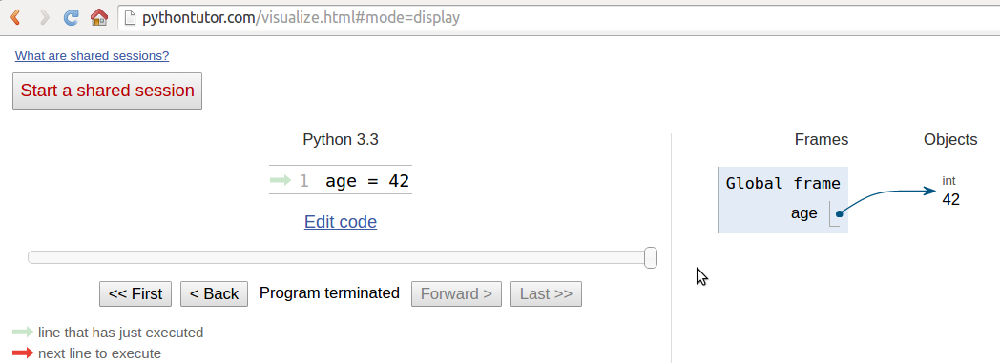
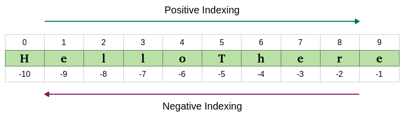

# 二、内置数据类型

"Data! Data! Data!" he cried impatiently. "I can't make bricks without clay." – Sherlock Holmes – The Adventure of the Copper Beeches

使用计算机所做的一切都是管理数据。数据有许多不同的形状和风格。你听的是音乐，流的是电影，打开的是 PDF。甚至你现在正在阅读的章节的来源也只是一个文件，这是数据。

数据可以是简单的，表示年龄的整数，也可以是复杂的，比如网站上的订单。它可以是关于单个对象，也可以是关于它们的集合。数据甚至可以是关于数据的，也就是元数据。描述其他数据结构设计的数据或描述应用程序数据或其上下文的数据。在 Python 中，*对象是数据*的抽象，Python 有各种各样的数据结构，可以用来表示数据，也可以将它们组合起来创建自己的自定义数据。

在本章中，我们将介绍以下内容：

*   Python 对象的结构
*   易变性和不变性
*   内置数据类型：数字、字符串、序列、集合和映射类型
*   集合模块
*   枚举

# 一切都是物体

在我们深入研究细节之前，我希望您非常清楚 Python 中的对象，因此让我们进一步讨论一下它们。但是，当您在 Python 模块中键入类似于`age = 42`的指令时，会发生什么呢？

If you go to [http://pythontutor.com/](http://pythontutor.com/), you can type that instruction into a text box and get its visual representation. Keep this website in mind; it's very useful to consolidate your understanding of what goes on behind the scenes.

因此，所发生的是创建了一个对象。获取一个`id`，将`type`设置为`int`（整数），将`value`设置为`42`。在全局名称空间中放置一个名称`age`，指向该对象。因此，只要我们在全局名称空间中，在执行该行之后，我们就可以通过名称`age`访问该对象来检索该对象。

如果你要搬家，你会把所有的刀、叉和勺子都放在一个盒子里，并贴上*餐具*的标签。你能看出这是完全相同的概念吗？下面是它的屏幕截图（您可能需要调整设置以获得相同的视图）：



因此，在本章的其余部分中，每当您阅读诸如`name = some_value`之类的内容时，请考虑放置在名称空间中的名称，该名称与编写指令的作用域相关联，带有一个漂亮的箭头，指向具有`id`、`type`和`value`的对象。关于这个机制还有一点要说，但是通过一个例子来讨论它要容易得多，所以我们稍后会回到这个问题上。

# 可变的还是不变的？这就是问题所在

Python 对数据的第一个基本区别是对象的值是否改变。如果该值可以更改，则该对象称为**可变**，如果该值不能更改，则该对象称为**不可变**。

理解可变和不可变之间的区别非常重要，因为它会影响您编写的代码，所以这里有一个问题：

```py
>>> age = 42
>>> age
42
>>> age = 43  #A
>>> age
43
```

在前面的代码中，`#A`行中，我是否更改了年龄的值？嗯，没有。但是现在是`43`（我听到你说…）。是的，它是`43`，但是`42`是一个整数，属于`int`类型，是不可变的。因此，实际情况是，在第一行，`age`是一个名称，设置为指向`int`对象，其值为`42`。当我们输入`age = 43`时，会创建另一个对象，类型为`int`且值为`43`（`id`也会不同），并且名称`age`被设置为指向它。所以，我们没有将`42`更改为`43`。实际上，我们只是将`age`指向另一个位置：新的`int`对象，其值为`43`。让我们看看同样的代码也打印 ID：

```py
>>> age = 42
>>> id(age)
4377553168
>>> age = 43
>>> id(age)
4377553200
```

注意，我们通过调用内置的`id`函数来打印 ID。正如你所看到的，他们是不同的，正如预期的那样。请记住，`age`一次指向一个对象：`42`首先，然后是`43`。从不在一起。

现在，让我们看看使用可变对象的相同示例。对于这个例子，我们只使用一个`Person`对象，它有一个属性`age`（现在不要担心类声明，它只是为了完整性）：

```py
>>> class Person():
...     def __init__(self, age):
...         self.age = age
...
>>> fab = Person(age=42)
>>> fab.age
42
>>> id(fab)
4380878496
>>> id(fab.age)
4377553168
>>> fab.age = 25  # I wish!
>>> id(fab)  # will be the same
4380878496
>>> id(fab.age)  # will be different
4377552624
```

在本例中，我设置了一个对象`fab`，其`type`是`Person`（自定义类）。创建时，对象被赋予`42`的`age`。我正在打印它，还有对象`id`，还有`age`的 ID。请注意，即使在我将`age`更改为`25`之后，`fab`的 ID 仍然保持不变（当然，`age`的 ID 已经更改）。Python 中的自定义对象是可变的（除非您将它们编码为不可变）。牢记这一理念,；这很重要。在本章的其余部分，我将提醒你这一点。

# 数字

让我们从探索 Python 内置的数字数据类型开始。Python 是由一位拥有数学和计算机科学硕士学位的人设计的，因此它对数字的惊人支持是合乎逻辑的。

数字是不可变的对象。

# 整数

Python 整数的范围是无限的，只受可用虚拟内存的限制。这意味着，你想要存储的数字有多大并不重要：只要它能放入你的计算机内存中，Python 就会处理它。整数可以是正数、负数和 0（零）。它们支持所有基本的数学运算，如以下示例所示：

```py
>>> a = 14
>>> b = 3
>>> a + b  # addition
17
>>> a - b  # subtraction
11
>>> a * b  # multiplication
42
>>> a / b  # true division
4.666666666666667
>>> a // b  # integer division
4
>>> a % b  # modulo operation (reminder of division)
2
>>> a ** b  # power operation
2744
```

前面的代码应该很容易理解。请注意一件重要的事情：Python 有两个除法运算符，一个执行所谓的**真除法**（`/`），返回操作数的商，另一个执行所谓的**整数除法**（`//`），返回操作数的*下限*商。值得注意的是，在 Python 2 中，除法运算符`/`的行为与 Python 3 中的不同。看看正数和负数的区别：

```py
>>> 7 / 4  # true division
1.75
>>> 7 // 4  # integer division, truncation returns 1
1
>>> -7 / 4  # true division again, result is opposite of previous
-1.75
>>> -7 // 4  # integer div., result not the opposite of previous
-2
```

这是一个有趣的例子。如果您希望在最后一行出现一个`-1`，请不要难过，这正是 Python 的工作方式。Python 中整数除法的结果总是向负无穷大舍入。如果不希望将数字截断为整数，可以使用内置的`int`函数，如下例所示：

```py
>>> int(1.75)
1
>>> int(-1.75)
-1
```

请注意，截断是朝着`0`进行的。

还有一个运算符用于计算除法的余数。它被称为模运算符，用百分比（`%`表示：

```py
>>> 10 % 3  # remainder of the division 10 // 3
1
>>> 10 % 4  # remainder of the division 10 // 4
2
```

Python3.6 中引入的一个很好的特性是能够在数字文本中添加下划线（在数字或基本说明符之间，但不在前导或尾随之间）。目的是帮助使某些数字更具可读性，例如`1_000_000_000`：

```py
>>> n = 1_024
>>> n
1024
>>> hex_n = 0x_4_0_0  # 0x400 == 1024
>>> hex_n
1024 
```

# 布尔值

布尔代数是代数的子集，其中变量的值是真值：真值和假值。在 Python 中，`True`和`False`是用于表示真值的两个关键字。布尔是整数的一个子类，其行为分别类似于`1`和`0`。布尔类的`int`类的等价物是`bool`类，它返回`True`或`False`。每个内置 Python 对象在布尔上下文中都有一个值，这意味着它们在输入到`bool`函数时基本上计算为`True`或`False`。我们将在[第 3 章](03.html)*迭代和决策*中了解所有相关内容。

可以使用逻辑运算符`and`、`or`和`not`在布尔表达式中组合布尔值。同样，我们将在下一章中完整地看到它们，所以现在让我们来看一个简单的例子：

```py
>>> int(True)  # True behaves like 1
1
>>> int(False)  # False behaves like 0
0
>>> bool(1)  # 1 evaluates to True in a boolean context
True
>>> bool(-42)  # and so does every non-zero number
True
>>> bool(0)  # 0 evaluates to False
False
>>> # quick peak at the operators (and, or, not)
>>> not True
False
>>> not False
True
>>> True and True
True
>>> False or True
True
```

您可以看到，`True`和`False`是整数的子类，当您尝试添加它们时。Python 将它们向上转换为整数并执行加法：

```py
>>> 1 + True
2
>>> False + 42
42
>>> 7 - True
6 
```

**Upcasting** is a type conversion operation that goes from a subclass to its parent. In the example presented here, `True` and `False`, which belong to a class derived from the integer class, are converted back to integers when needed.

# 实数

实数或浮点数根据 IEEE 754 双精度二进制浮点格式用 Python 表示，该格式存储在 64 位信息中，分为三部分：符号、指数和尾数。

Quench your thirst for knowledge about this format on Wikipedia: [http://en.wikipedia.org/wiki/Double-precision_floating-point_format](http://en.wikipedia.org/wiki/Double-precision_floating-point_format).

通常，编程语言为编码器提供两种不同的格式：单精度和双精度。前者占用 32 位内存，后者占用 64 位内存。Python 只支持双精度格式。让我们看一个简单的例子：

```py
>>> pi = 3.1415926536  # how many digits of PI can you remember?
>>> radius = 4.5
>>> area = pi * (radius ** 2)
>>> area
63.617251235400005 
```

In the calculation of the area, I wrapped the `radius ** 2` within braces. Even though that wasn't necessary because the power operator has higher precedence than the multiplication one, I think the formula reads more easily like that. Moreover, should you get a slightly different result for the area, don't worry. It might depend on your OS, how Python was compiled, and so on. As long as the first few decimal digits are correct, you know it's a correct result. 

`sys.float_info`结构序列保存有关浮点数在系统上的行为的信息。这是我在我的盒子上看到的：

```py
>>> import sys
>>> sys.float_info
sys.float_info(max=1.7976931348623157e+308, max_exp=1024, max_10_exp=308, min=2.2250738585072014e-308, min_exp=-1021, min_10_exp=-307, dig=15, mant_dig=53, epsilon=2.220446049250313e-16, radix=2, rounds=1)
```

让我们考虑一下：我们有 64 位来表示浮点数。这意味着我们最多可以用那个数量的位来表示`2 ** 64 == 18,446,744,073,709,551,616`个数字。看看浮点数的`max`和`epsilon`值，你会发现不可能全部表示出来。因为没有足够的空间，所以它们近似于最接近的可表示数字。你可能认为只有非常大或非常小的数字会受到这个问题的影响。好的，请重新思考，然后在控制台中尝试以下操作：

```py
>>> 0.3 - 0.1 * 3  # this should be 0!!!
-5.551115123125783e-17 
```

这告诉你什么？它告诉你，双精度数字即使涉及到像`0.1`或`0.3`这样的简单数字，也会遇到近似问题。为什么这很重要？如果你在处理价格、财务计算或任何不需要近似计算的数据，这可能是一个大问题。别担心，Python 为您提供了**decimal**类型，它不会遇到这些问题；我们一会儿见。

# 复数

Python 为您提供了开箱即用的复数支持。如果你不知道什么是复数，它们可以用*a+ib*的形式表示，其中*a*和*b*是实数，*i*（或者*j*（如果你是工程师）是虚单位，也就是*-1*的平方根。*a*和*b*分别称为数字的*实*和*虚*部分。

事实上，你不太可能使用它们，除非你在编写一些科学的东西。让我们看一个小例子：

```py
>>> c = 3.14 + 2.73j
>>> c.real  # real part
3.14
>>> c.imag  # imaginary part
2.73
>>> c.conjugate()  # conjugate of A + Bj is A - Bj
(3.14-2.73j)
>>> c * 2  # multiplication is allowed
(6.28+5.46j)
>>> c ** 2  # power operation as well
(2.4067000000000007+17.1444j)
>>> d = 1 + 1j  # addition and subtraction as well
>>> c - d
(2.14+1.73j)
```

# 分数和小数

让我们以分数和小数来结束数字系的参观。分数的最低形式是有理分子和分母。让我们看一个简单的例子：

```py
>>> from fractions import Fraction
>>> Fraction(10, 6)  # mad hatter?
Fraction(5, 3)  # notice it's been simplified
>>> Fraction(1, 3) + Fraction(2, 3)  # 1/3 + 2/3 == 3/3 == 1/1
Fraction(1, 1)
>>> f = Fraction(10, 6)
>>> f.numerator
5
>>> f.denominator
3
```

虽然它们有时非常有用，但在商业软件中发现它们并不常见。相反，更容易看到的是，十进制数在所有那些精度就是一切的环境中被使用；例如，在科学和金融计算中。

It's important to remember that arbitrary precision decimal numbers come at a price in performance, of course. The amount of data to be stored for each number is far greater than it is for fractions or floats as well as the way they are handled, which causes the Python interpreter much more work behind the scenes. Another interesting thing to note is that you can get and set the precision by accessing `decimal.getcontext().prec`.

让我们看一个十进制数的快速示例：

```py
>>> from decimal import Decimal as D  # rename for brevity
>>> D(3.14)  # pi, from float, so approximation issues
Decimal('3.140000000000000124344978758017532527446746826171875')
>>> D('3.14')  # pi, from a string, so no approximation issues
Decimal('3.14')
>>> D(0.1) * D(3) - D(0.3)  # from float, we still have the issue
Decimal('2.775557561565156540423631668E-17')
>>> D('0.1') * D(3) - D('0.3')  # from string, all perfect
Decimal('0.0')
>>> D('1.4').as_integer_ratio()  # 7/5 = 1.4 (isn't this cool?!)
(7, 5)
```

注意，当我们从一个`float`构造一个`Decimal`数时，它承担了`float`可能来自的所有近似问题。另一方面，当`Decimal`没有近似问题时（例如，当我们向构造函数提供`int`或`string`表示时），则计算没有奇怪的行为。说到钱，用小数。

我们对内置数字类型的介绍到此结束。现在让我们看一下序列。

# 不变序列

让我们从不可变序列开始：字符串、元组和字节。

# 字符串和字节

Python 中的文本数据是用`str`对象处理的，通常称为**字符串**。它们是**Unicode 码点**的不可变序列。Unicode 代码点可以表示字符，但也可以具有其他含义，例如格式化数据。与其他语言不同，Python 没有`char`类型，因此单个字符仅由长度为`1`的字符串呈现。

Unicode 是处理数据的极好方法，应该用于任何应用程序的内部。当涉及到存储文本数据或在网络上发送文本数据时，您可能希望对其进行编码，使用适合您使用的媒体的适当编码。编码的结果生成一个`bytes`对象，其语法和行为与字符串类似。字符串文本在 Python 中使用单引号、双引号或三引号（单引号或双引号）编写。如果使用三重引号构建，字符串可以跨多行。举例说明：

```py
>>> # 4 ways to make a string
>>> str1 = 'This is a string. We built it with single quotes.'
>>> str2 = "This is also a string, but built with double quotes."
>>> str3 = '''This is built using triple quotes,
... so it can span multiple lines.'''
>>> str4 = """This too
... is a multiline one
... built with triple double-quotes."""
>>> str4  #A
'This too\nis a multiline one\nbuilt with triple double-quotes.'
>>> print(str4)  #B
This too
is a multiline one
built with triple double-quotes.
```

在`#A`和`#B`中，我们使用`print`函数先隐式打印`str4`，然后显式打印。一个很好的练习是找出它们不同的原因。你能接受挑战吗？（提示：查阅`str`功能。）

与任何序列一样，字符串也有长度。您可以通过调用`len`函数来实现：

```py
>>> len(str1)
49
```

# 编码和解码字符串

使用`encode`/`decode`方法，我们可以对 Unicode 字符串进行编码，并对字节对象进行解码。**UTF-8**是一种可变长度字符编码，能够对所有可能的 Unicode 码点进行编码。它是网络的主要编码方式。还请注意，通过在字符串声明前面添加一个文本`b`，我们正在创建一个*字节*对象：

```py
>>> s = "This is üŋíc0de"  # unicode string: code points
>>> type(s)
<class 'str'>
>>> encoded_s = s.encode('utf-8')  # utf-8 encoded version of s
>>> encoded_s
b'This is \xc3\xbc\xc5\x8b\xc3\xadc0de'  # result: bytes object
>>> type(encoded_s)  # another way to verify it
<class 'bytes'>
>>> encoded_s.decode('utf-8')  # let's revert to the original
'This is üŋíc0de'
>>> bytes_obj = b"A bytes object"  # a bytes object
>>> type(bytes_obj)
<class 'bytes'>
```

# 索引和切片字符串

在操作序列时，通常必须在一个精确的位置访问序列（索引），或者从序列中获取子序列（切片）。在处理不可变序列时，这两个操作都是只读的。

虽然索引有一种形式，即从零开始访问序列中的任何位置，但切片有不同的形式。当您获得序列的切片时，您可以指定`start`和`stop`位置，以及`step`。它们之间用一个冒号（`:`）分隔，如下所示：`my_sequence[start:stop:step]`。所有参数都是可选的，`start`是包含的，`stop`是独占的。举个例子比用文字进一步解释要容易得多：

```py
>>> s = "The trouble is you think you have time."
>>> s[0]  # indexing at position 0, which is the first char
'T'
>>> s[5]  # indexing at position 5, which is the sixth char
'r'
>>> s[:4]  # slicing, we specify only the stop position
'The '
>>> s[4:]  # slicing, we specify only the start position
'trouble is you think you have time.'
>>> s[2:14]  # slicing, both start and stop positions
'e trouble is'
>>> s[2:14:3]  # slicing, start, stop and step (every 3 chars)
'erb '
>>> s[:]  # quick way of making a copy
'The trouble is you think you have time.'
```

在所有的台词中，最后一句可能是最有趣的。如果不指定参数，Python 将为您填充默认值。在这种情况下，`start`将是字符串的开始，`stop`将是字符串的结束，`step`将是默认的`1`。这是获取字符串`s`（相同的值，但不同的对象）副本的一种简单快捷的方法。你能找到一种通过切片获得字符串反向副本的方法吗（不要查找，自己找）？

# 字符串格式

字符串的一个特性是可以用作模板。格式化字符串有几种不同的方法，对于完整的可能性列表，我鼓励您查阅文档。以下是一些常见的例子：

```py
>>> greet_old = 'Hello %s!'
>>> greet_old % 'Fabrizio'
'Hello Fabrizio!'
>>> greet_positional = 'Hello {} {}!'
>>> greet_positional.format('Fabrizio', 'Romano')
'Hello Fabrizio Romano!' 
>>> greet_positional_idx = 'This is {0}! {1} loves {0}!'
>>> greet_positional_idx.format('Python', 'Fabrizio')
'This is Python! Fabrizio loves Python!'
>>> greet_positional_idx.format('Coffee', 'Fab')
'This is Coffee! Fab loves Coffee!'
 >>> keyword = 'Hello, my name is {name} {last_name}'
>>> keyword.format(name='Fabrizio', last_name='Romano')
'Hello, my name is Fabrizio Romano'
```

在上一个示例中，您可以看到四种不同的设置 Sting 格式的方法。第一个依赖于`%`运算符的已弃用，不应再使用。当前，格式化字符串的现代方法是使用`format`字符串方法。从不同的示例中可以看到，一对大括号充当字符串中的占位符。当我们调用`format`时，我们会向它提供替换占位符的数据。我们可以在大括号内指定索引（以及更多），甚至名称，这意味着我们必须使用关键字参数而不是位置参数来调用`format`。

请注意，`greet_positional_idx`是如何通过向`format`的调用提供不同的数据来呈现的。显然，我喜欢蟒蛇和咖啡。。。大惊喜！

我想向您展示的最后一个功能是 Python（3.6 版）的一个相对较新的新增功能，它被称为**格式的字符串文本**。这个特性非常酷：字符串的前缀是`f`，包含替换字段，替换字段用大括号括起来。替换字段是在运行时计算的表达式，然后使用`format`协议格式化：

```py
>>> name = 'Fab'
>>> age = 42
>>> f"Hello! My name is {name} and I'm {age}"
"Hello! My name is Fab and I'm 42"
>>> from math import pi
>>> f"No arguing with {pi}, it's irrational..."
"No arguing with 3.141592653589793, it's irrational..."
```

查看官方文档，了解有关字符串格式的所有信息以及它的强大功能。

# 多元组

我们将要看到的最后一个不可变序列类型是 tuple。**元组**是任意 Python 对象的序列。在元组中，项由逗号分隔。它们在 Python 中随处可见，因为它们允许在其他语言中难以复制的模式。有时，元组被隐式使用；例如，要在一行上设置多个变量，或者允许一个函数返回多个不同的对象（在许多其他语言中，通常一个函数只返回一个对象），甚至在 Python 控制台中，也可以使用元组隐式地使用一条指令打印多个元素。我们将看到所有这些情况的示例：

```py
>>> t = ()  # empty tuple
>>> type(t)
<class 'tuple'>
>>> one_element_tuple = (42, )  # you need the comma!
>>> three_elements_tuple = (1, 3, 5)  # braces are optional here
>>> a, b, c = 1, 2, 3  # tuple for multiple assignment
>>> a, b, c  # implicit tuple to print with one instruction
(1, 2, 3)
>>> 3 in three_elements_tuple  # membership test
True
```

请注意，成员资格操作符`in`也可以用于列表、字符串、字典，通常还可以用于集合和序列对象。

Notice that to create a tuple with one item, we need to put that comma after the item. The reason is that without the comma that item is just itself wrapped in braces, kind of in a redundant mathematical expression. Notice also that on assignment, braces are optional so `my_tuple = 1, 2, 3` is the same as `my_tuple = (1, 2, 3)`.

元组赋值允许我们做的一件事是*一行交换*，不需要第三个临时变量。让我们先看看更传统的方法：

```py
>>> a, b = 1, 2
>>> c = a  # we need three lines and a temporary var c
>>> a = b
>>> b = c
>>> a, b  # a and b have been swapped
(2, 1)
```

现在让我们看看如何在 Python 中实现它：

```py
>>> a, b = 0, 1
>>> a, b = b, a  # this is the Pythonic way to do it
>>> a, b
(1, 0)
```

看看这行代码，它向您展示了交换两个值的 Pythonic 方法。你还记得我在[第一章](01.html)中写的内容吗？*是对 Python*的温和介绍？Python 程序通常是等效 java 或 C++代码的五分之一到三分之一，而像一行交换这样的特性有助于此。Python 是优雅的，这里的优雅也意味着经济。

因为元组是不可变的，所以元组可以用作字典的键（我们将很快看到这一点）。对我来说，元组是 Python 的内置数据，最接近于表示数学向量。但这并不意味着这就是它们被创建的原因。元组通常包含一个异构的元素序列，而另一方面，列表在大多数情况下是同构的。此外，元组通常通过解包或索引进行访问，而列表通常是迭代的。

# 可变序列

可变序列与不可变序列的不同之处在于，它们可以在创建后改变。Python 中有两种可变序列类型：列表和字节数组。我之前说过，字典是 Python 数据结构之王。我想这使名单成为了它的合法女王。

# 列表

Python 列表是可变序列。它们与元组非常相似，但没有不变性的限制。列表通常用于存储同质对象的集合，但是没有什么可以阻止您存储异构集合。列表可以以多种不同的方式创建。让我们看一个例子：

```py
>>> []  # empty list
[]
>>> list()  # same as []
[]
>>> [1, 2, 3]  # as with tuples, items are comma separated
[1, 2, 3]
>>> [x + 5 for x in [2, 3, 4]]  # Python is magic
[7, 8, 9]
>>> list((1, 3, 5, 7, 9))  # list from a tuple
[1, 3, 5, 7, 9]
>>> list('hello')  # list from a string
['h', 'e', 'l', 'l', 'o']
```

在前面的示例中，我向您展示了如何使用不同的技术创建列表。我想让你仔细看看写着`Python is magic`的那句话，我不希望你在这一点上完全理解（除非你作弊，而且你不是新手！）。这就是所谓的**列表****理解**，Python 非常强大的功能特性。

创建列表很好，但是当我们使用它们时，真正的乐趣就来了，所以让我们看看它们提供给我们的主要方法：

```py
>>> a = [1, 2, 1, 3]
>>> a.append(13)  # we can append anything at the end
>>> a
[1, 2, 1, 3, 13]
>>> a.count(1)  # how many `1` are there in the list?
2
>>> a.extend([5, 7])  # extend the list by another (or sequence)
>>> a
[1, 2, 1, 3, 13, 5, 7]
>>> a.index(13)  # position of `13` in the list (0-based indexing)
4
>>> a.insert(0, 17)  # insert `17` at position 0
>>> a
[17, 1, 2, 1, 3, 13, 5, 7]
>>> a.pop()  # pop (remove and return) last element
7
>>> a.pop(3)  # pop element at position 3
1
>>> a
[17, 1, 2, 3, 13, 5]
>>> a.remove(17)  # remove `17` from the list
>>> a
[1, 2, 3, 13, 5]
>>> a.reverse()  # reverse the order of the elements in the list
>>> a
[5, 13, 3, 2, 1]
>>> a.sort()  # sort the list
>>> a
[1, 2, 3, 5, 13]
>>> a.clear()  # remove all elements from the list
>>> a
[]
```

前面的代码提供了列表主要方法的综述。我想以`extend`为例，向大家展示它们的强大。可以使用任何序列类型扩展列表：

```py
>>> a = list('hello')  # makes a list from a string
>>> a
['h', 'e', 'l', 'l', 'o']
>>> a.append(100)  # append 100, heterogeneous type
>>> a
['h', 'e', 'l', 'l', 'o', 100]
>>> a.extend((1, 2, 3))  # extend using tuple
>>> a
['h', 'e', 'l', 'l', 'o', 100, 1, 2, 3]
>>> a.extend('...')  # extend using string
>>> a
['h', 'e', 'l', 'l', 'o', 100, 1, 2, 3, '.', '.', '.']
```

现在，让我们看看您可以对列表执行哪些最常见的操作：

```py
>>> a = [1, 3, 5, 7]
>>> min(a)  # minimum value in the list
1
>>> max(a)  # maximum value in the list
7
>>> sum(a)  # sum of all values in the list
16
>>> len(a)  # number of elements in the list
4
>>> b = [6, 7, 8]
>>> a + b  # `+` with list means concatenation
[1, 3, 5, 7, 6, 7, 8]
>>> a * 2  # `*` has also a special meaning
[1, 3, 5, 7, 1, 3, 5, 7]
```

前面代码中的最后两行非常有趣，因为它们向我们介绍了一个称为**操作符****重载**的概念。简而言之，它意味着像`+`、`-`这样的操作符。`*`、`%`等可根据其使用的上下文表示不同的操作。把两张清单加起来没有任何意义，对吧？因此，`+`符号用于连接它们。因此，`*`符号用于根据右操作数将列表连接到自身。

现在，让我们再向前看一步，看看有意思的东西。我想向您展示`sorted`方法的强大功能，以及在 Python 中实现需要在其他语言中付出大量努力的结果的容易程度：

```py
>>> from operator import itemgetter
>>> a = [(5, 3), (1, 3), (1, 2), (2, -1), (4, 9)]
>>> sorted(a)
[(1, 2), (1, 3), (2, -1), (4, 9), (5, 3)]
>>> sorted(a, key=itemgetter(0))
[(1, 3), (1, 2), (2, -1), (4, 9), (5, 3)]
>>> sorted(a, key=itemgetter(0, 1))
[(1, 2), (1, 3), (2, -1), (4, 9), (5, 3)]
>>> sorted(a, key=itemgetter(1))
[(2, -1), (1, 2), (5, 3), (1, 3), (4, 9)]
>>> sorted(a, key=itemgetter(1), reverse=True)
[(4, 9), (5, 3), (1, 3), (1, 2), (2, -1)]
```

前面的代码值得一点解释。首先，`a`是一个元组列表。这意味着`a`中的每个元素都是一个元组（确切地说是一个 2 元组）。当我们调用`sorted(some_list)`时，我们会得到`some_list`的排序版本。在这种情况下，对 2 元组进行排序的方法是对元组中的第一项进行排序，当第一项相同时，对第二项进行排序。你可以在`sorted(a)`的结果中看到这种行为，它产生`[(1, 2), (1, 3), ...]`。Python 还使我们能够控制必须针对元组中的哪些元素运行排序。请注意，当我们指示`sorted`函数处理每个元组的第一个元素时（通过`key=itemgetter(0)`，结果是不同的：`[(1, 3), (1, 2), ...]`。排序只对每个元组的第一个元素（即位于位置 0 的元素）进行。如果我们想要复制一个简单的`sorted(a)`调用的默认行为，我们需要使用`key=itemgetter(0, 1)`，它告诉 Python 首先对元组中位置 0 处的元素进行排序，然后对位置 1 处的元素进行排序。比较结果，你会发现它们是匹配的。

为了完整起见，我提供了一个仅对位置 1 处的元素进行排序的示例，相同但顺序相反。如果您曾经见过 Java 中的排序，我希望您现在会印象深刻。

Python 排序算法非常强大，它是由 Tim Peters 编写的（我们已经看到了这个名字，你还记得什么时候吗？）。它被恰当地命名为**Timsort**，它是**合并**和**插入****排序**的混合体，比主流编程语言中使用的大多数其他算法具有更好的时间性能。Timsort 是一种稳定的排序算法，这意味着当多个记录具有相同的密钥时，它们的原始顺序将保持不变。我们在`sorted(a, key=itemgetter(0))`的结果中看到了这一点，它产生了`[(1, 3), (1, 2), ...]`，其中这两个元组的顺序被保留，因为它们在位置 0 处具有相同的值。

# 字节数组

为了总结我们对可变序列类型的概述，让我们花几分钟讨论一下`bytearray`类型。基本上，它们代表`bytes`对象的可变版本。它们公开了大多数可变序列的常用方法以及大多数`bytes`类型的方法。项目是[0，256]范围内的整数。

When it comes to intervals, I'm going to use the standard notation for open/closed ranges. A square bracket on one end means that the value is included, while a round brace means it's excluded. The granularity is usually inferred by the type of the edge elements so, for example, the interval [3, 7] means all integers between 3 and 7, inclusive. On the other hand, (3, 7) means all integers between 3 and 7 exclusive (hence 4, 5, and 6). Items in a `bytearray` type are integers between 0 and 256; 0 is included, 256 is not. One reason intervals are often expressed like this is to ease coding. If we break a range *[a, b)* into *N* consecutive ranges, we can easily represent the original one as a concatenation like this:
*[a,k<sub>1</sub>)+[k<sub>1</sub>,k<sub>2</sub>)+[k<sub>2</sub>,k<sub>3</sub>)+...+[k<sub>N-1</sub>,b)*
The middle points (*k<sub>i</sub>*) being excluded on one end, and included on the other end, allow for easy concatenation and splitting when intervals are handled in the code.

让我们看一个关于`bytearray `类型的快速示例：

```py
>>> bytearray()  # empty bytearray object
bytearray(b'')
>>> bytearray(10)  # zero-filled instance with given length
bytearray(b'\x00\x00\x00\x00\x00\x00\x00\x00\x00\x00')
>>> bytearray(range(5)) # bytearray from iterable of integers
bytearray(b'\x00\x01\x02\x03\x04')
>>> name = bytearray(b'Lina')  #A - bytearray from bytes
>>> name.replace(b'L', b'l')
bytearray(b'lina')
>>> name.endswith(b'na')
True
>>> name.upper()
bytearray(b'LINA')
>>> name.count(b'L')
1
```

正如您在前面的代码中所看到的，有几种方法可以创建`bytearray`对象。它们在许多情况下都很有用；例如，当通过套接字接收数据时，它们消除了在轮询时连接数据的需要，因此可以证明它们非常方便。在`#A`行中，我根据字节文字`b'Lina'`创建了一个名为`name`的`bytearray`，向您展示`bytearray`对象如何从序列和字符串中公开方法，这非常方便。仔细想想，它们可以被视为可变字符串。

# 设置类型

Python 还提供了两种集合类型，`set`和`frozenset`。`set`类型是可变的，而`frozenset`是不可变的。它们是不可变对象的无序集合。**哈希性**是一种特性，允许对象用作集合成员以及字典的键，我们很快就会看到。

From the official documentation: <q>An object is hashable if it has a hash value which never changes during its lifetime, and can be compared to other objects. Hashability makes an object usable as a dictionary key and a set member, because these data structures use the hash value internally. All of Python’s immutable built-in objects are hashable while mutable containers are not.</q>

相等比较的对象必须具有相同的哈希值。集合通常用于测试成员资格，因此让我们在下面的示例中介绍`in`操作符：

```py
>>> small_primes = set()  # empty set
>>> small_primes.add(2)  # adding one element at a time
>>> small_primes.add(3)
>>> small_primes.add(5)
>>> small_primes
{2, 3, 5}
>>> small_primes.add(1)  # Look what I've done, 1 is not a prime!
>>> small_primes
{1, 2, 3, 5}
>>> small_primes.remove(1)  # so let's remove it
>>> 3 in small_primes # membership test
True
>>> 4 in small_primes
False
>>> 4 not in small_primes  # negated membership test
True
>>> small_primes.add(3)  # trying to add 3 again
>>> small_primes
{2, 3, 5}  # no change, duplication is not allowed
>>> bigger_primes = set([5, 7, 11, 13])  # faster creation
>>> small_primes | bigger_primes # union operator `|`
{2, 3, 5, 7, 11, 13}
>>> small_primes & bigger_primes  # intersection operator `&`
{5}
>>> small_primes - bigger_primes  # difference operator `-`
{2, 3}
```

在前面的代码中，您可以看到创建集合的两种不同方法。创建一个空集，然后一次添加一个元素。另一个使用数字列表作为构造函数的参数创建集合，构造函数为我们完成所有工作。当然，您可以从列表或元组（或任何 iterable）创建一个集合，然后您可以根据自己的意愿从集合中添加和删除成员。

We'll look at iterable objects and iteration in the next chapter. For now, just know that iterable objects are objects you can iterate on in a direction.

创建集合的另一种方法是使用大括号表示法，如下所示：

```py
>>> small_primes = {2, 3, 5, 5, 3}
>>> small_primes
{2, 3, 5}
```

请注意，我添加了一些副本以强调结果集不会有任何副本。让我们看一个关于 set 类型的不可变对应项`frozenset`的示例：

```py
>>> small_primes = frozenset([2, 3, 5, 7])
>>> bigger_primes = frozenset([5, 7, 11])
>>> small_primes.add(11)  # we cannot add to a frozenset
Traceback (most recent call last):
 File "<stdin>", line 1, in <module>
AttributeError: 'frozenset' object has no attribute 'add'
>>> small_primes.remove(2)  # neither we can remove
Traceback (most recent call last):
 File "<stdin>", line 1, in <module>
AttributeError: 'frozenset' object has no attribute 'remove'
>>> small_primes & bigger_primes  # intersect, union, etc. allowed
frozenset({5, 7})
```

正如你所看到的，`frozenset`对象相对于它们的可变对应物来说是非常有限的。它们对于成员资格测试、并集、交集和差分操作以及性能方面仍然非常有效。

# 映射类型-字典

在所有内置 Python 数据类型中，字典无疑是最有趣的。它是唯一的标准映射类型，是每个 Python 对象的主干。

字典将键映射到值。键需要是可散列的对象，而值可以是任意类型。字典是可变的对象。创建字典的方法有很多种，所以让我给你一个简单的例子，说明如何用五种不同的方法创建一个等于`{'A': 1, 'Z': -1}`的字典：

```py
>>> a = dict(A=1, Z=-1)
>>> b = {'A': 1, 'Z': -1}
>>> c = dict(zip(['A', 'Z'], [1, -1]))
>>> d = dict([('A', 1), ('Z', -1)])
>>> e = dict({'Z': -1, 'A': 1})
>>> a == b == c == d == e  # are they all the same?
True  # They are indeed
```

你注意到了吗？赋值是用一个等号完成的，而为了检查一个对象是否与另一个对象相同（在本例中是一次五个），我们使用双等号。还有另一种比较对象的方法，它涉及到`is`操作符，并检查两个对象是否相同（如果它们具有相同的 ID，而不仅仅是值），但除非您有充分的理由使用它，否则您应该使用双等于。在前面的代码中，我还使用了一个很好的函数：`zip`。它是以现实生活中的拉链命名的，它将两件东西粘在一起，每次只取一个元素。让我给你举个例子：

```py
>>> list(zip(['h', 'e', 'l', 'l', 'o'], [1, 2, 3, 4, 5]))
[('h', 1), ('e', 2), ('l', 3), ('l', 4), ('o', 5)]
>>> list(zip('hello', range(1, 6)))  # equivalent, more Pythonic
[('h', 1), ('e', 2), ('l', 3), ('l', 4), ('o', 5)]
```

在前面的示例中，我以两种不同的方式创建了同一个列表，一种是显式的，另一种是 Python 式的。暂时忘记我必须将`list`构造函数包装在`zip`调用周围（原因是`zip`返回一个迭代器，而不是`list`，因此如果我想看到结果，我需要将迭代器排成一些东西——在本例中是一个列表），然后集中精力处理结果。看看`zip`是如何将两个参数的第一个元素耦合在一起的，然后是第二个，然后是第三个，依此类推？看看你的裤子（或者钱包，如果你是女士的话），你会在你的拉链上看到同样的行为。但让我们回到字典，看看他们展示了多少奇妙的方法，让我们可以随心所欲地操作它们。

让我们从基本操作开始：

```py
>>> d = {}
>>> d['a'] = 1  # let's set a couple of (key, value) pairs
>>> d['b'] = 2
>>> len(d)  # how many pairs?
2
>>> d['a']  # what is the value of 'a'?
1
>>> d  # how does `d` look now?
{'a': 1, 'b': 2}
>>> del d['a']  # let's remove `a`
>>> d
{'b': 2}
>>> d['c'] = 3  # let's add 'c': 3
>>> 'c' in d  # membership is checked against the keys
True
>>> 3 in d  # not the values
False
>>> 'e' in d
False
>>> d.clear()  # let's clean everything from this dictionary
>>> d
{}
```

请注意，无论我们执行的操作类型如何，访问字典的键都是通过方括号完成的。你记得字符串、列表和元组吗？我们也通过方括号访问某些位置的元素，这是 Python 一致性的另一个例子。

现在我们来看三个称为字典视图的特殊对象：`keys`、`values`和`items`。这些对象提供字典条目的动态视图，并且当字典更改时，它们也会更改。`keys()`返回字典中的所有键，`values()`返回字典中的所有值，`items()`返回字典中的所有*（键，值）*对。

According to the Python documentation: "*Keys and values are iterated over in an arbitrary order which is non-random, varies across Python implementations, and depends on the dictionary’s history of insertions and deletions. If keys, values and items views are iterated over with no intervening modifications to the dictionary, the order of items will directly correspond.*"

别再唠叨了；让我们把这些都写进代码中：

```py
>>> d = dict(zip('hello', range(5)))
>>> d
{'h': 0, 'e': 1, 'l': 3, 'o': 4}
>>> d.keys()
dict_keys(['h', 'e', 'l', 'o'])
>>> d.values()
dict_values([0, 1, 3, 4])
>>> d.items()
dict_items([('h', 0), ('e', 1), ('l', 3), ('o', 4)])
>>> 3 in d.values()
True
>>> ('o', 4) in d.items()
True
```

在前面的代码中有几点需要注意。首先，注意我们是如何通过迭代字符串`'hello'`和列表`[0, 1, 2, 3, 4]`的压缩版本来创建字典的。字符串`'hello'`中有两个`'l'`字符，它们通过`zip`函数与值`2`和`3`配对。请注意，在字典中，第二次出现的`'l'`键（值为`3`的键）覆盖了第一次出现的`2`键。另一件需要注意的事情是，当询问任何视图时，原始顺序现在被保留，而在版本 3.6 之前，这一点没有保证。

As of Python 3.6, the `dict` type has been reimplemented to use a more compact representation. This resulted in dictionaries using 20% to 25% less memory when compared to Python 3.5\. Moreover, in Python 3.6, as a side effect, dictionaries are natively ordered. This feature has received such a welcome from the community that in 3.7 it has become a legit feature of the language rather than an implementation side effect. A `dict` is ordered if it remembers the order in which keys were first inserted.

当我们讨论对集合进行迭代时，我们将看到这些视图是如何成为基本工具的。现在让我们来看看 Python 字典所揭示的一些其他方法；它们有很多，非常有用：

```py
>>> d
{'e': 1, 'h': 0, 'o': 4, 'l': 3}
>>> d.popitem()  # removes a random item (useful in algorithms)
('o', 4)
>>> d
{'h': 0, 'e': 1, 'l': 3}
>>> d.pop('l')  # remove item with key `l`
3
>>> d.pop('not-a-key')  # remove a key not in dictionary: KeyError
Traceback (most recent call last):
 File "<stdin>", line 1, in <module>
KeyError: 'not-a-key'
>>> d.pop('not-a-key', 'default-value')  # with a default value?
'default-value'  # we get the default value
>>> d.update({'another': 'value'})  # we can update dict this way
>>> d.update(a=13)  # or this way (like a function call)
>>> d
{'h': 0, 'e': 1, 'another': 'value', 'a': 13}
>>> d.get('a')  # same as d['a'] but if key is missing no KeyError
13
>>> d.get('a', 177)  # default value used if key is missing
13
>>> d.get('b', 177)  # like in this case
177
>>> d.get('b')  # key is not there, so None is returned
```

所有这些方法都很容易理解，但值得一谈。Python 中的每个函数都返回`None`，除非`return`语句显式用于返回其他内容，但我们将在探索函数时看到这一点。`None`经常用于表示缺少值，并且它通常用作函数声明中参数的默认值。一些没有经验的程序员有时编写返回`False`或`None`的代码。`False`和`None`在布尔上下文中计算为`False`，因此它们之间似乎没有太大区别。但事实上，我认为有一个相当重要的区别：`False`意味着我们有信息，而我们拥有的信息是`False`。`None`表示*无信息*。没有任何信息与`False`中的信息有很大区别。用外行的话说，如果你问你的机修工，*我的车准备好了吗？*，*不，不是*（`False`）和*我不知道*（`None`）之间有很大的区别。

关于字典，我最喜欢的最后一种方法是`setdefault`。其行为类似于`get`，但如果不存在，也会使用给定值设置键。让我们看一个例子：

```py
>>> d = {}
>>> d.setdefault('a', 1)  # 'a' is missing, we get default value
1
>>> d
{'a': 1}  # also, the key/value pair ('a', 1) has now been added
>>> d.setdefault('a', 5)  # let's try to override the value
1
>>> d
{'a': 1}  # no override, as expected
```

那么，我们现在就到此结束了。通过预测这一行之后的`d`会是什么样子来测试你对词典的知识：

```py
>>> d = {}
>>> d.setdefault('a', {}).setdefault('b', []).append(1)
```

如果你不能马上得到，不要担心。我只是想鼓励你尝试使用字典。

我们的内置数据类型之旅到此结束。在讨论我们在本章中看到的一些注意事项之前，我想简单地看一下`collections`模块。

# 集合模块

当 Python 通用内置容器（`tuple`、`list`、`set`、`dict`不够时，我们可以在`collections`模块中找到专门的容器数据类型。他们是：

| **数据类型** | **说明** |
| `namedtuple()` | 用于创建具有命名字段的元组子类的工厂函数 |
| `deque` | 列表式容器，两端有快速的附件和弹出窗口 |
| `ChainMap` | 用于创建多个映射的单个视图的类似字典的类 |
| `Counter` | 用于计算散列对象的字典子类 |
| `OrderedDict` | 用于记住添加的顺序条目的字典子类 |
| `defaultdict` | 调用工厂函数以提供缺少值的字典子类 |
| `UserDict` | 围绕字典对象进行包装，以简化字典子类化 |
| `UserList` | 围绕列表对象进行包装，以简化列表子类化 |
| `UserString` | 围绕字符串对象进行包装，以简化字符串子类化 |

我们没有足够的空间来涵盖所有这些内容，但是您可以在官方文档中找到大量的示例，所以这里我只举一个小示例来向您展示`namedtuple`、`defaultdict`和`ChainMap`。

# 命名双倍

`namedtuple`是一个类似元组的对象，其字段可以通过属性查找访问，并且可以索引和 ITE（它实际上是`tuple`的一个子类）。这在某种程度上是成熟对象和元组之间的折衷，在不需要自定义对象的全部功能，但希望通过避免奇怪的索引使代码更具可读性的情况下，它非常有用。另一个用例是，元组中的项在重构后可能需要改变它们的位置，迫使编码人员重构所有涉及的逻辑，这可能非常棘手。像往常一样，一个例子胜过千言万语（或者是一张图片？）。假设我们正在处理关于患者左眼和右眼的数据。我们在常规元组中为左眼（位置 0）保存一个值，为右眼（位置 1）保存一个值。这可能是这样的：

```py
>>> vision = (9.5, 8.8)
>>> vision
(9.5, 8.8)
>>> vision[0]  # left eye (implicit positional reference)
9.5
>>> vision[1]  # right eye (implicit positional reference)
8.8
```

现在让我们假设我们一直在处理`vision`对象，在某个时刻，设计师决定通过为组合视觉添加信息来增强它们，以便`vision`对象以以下格式存储数据：*（左眼，组合，右眼）*。

你看到我们现在的麻烦了吗？我们可能有很多代码依赖于`vision[0]`是左眼信息（现在仍然如此）和`vision[1]`是右眼信息（现在不再如此）。无论我们在哪里处理这些对象，我们都必须重构代码，将`vision[1]`更改为`vision[2]`，这可能会很痛苦。通过使用`namedtuple`，我们可能从一开始就可以更好地实现这一点。让我告诉你我的意思：

```py
>>> from collections import namedtuple
>>> Vision = namedtuple('Vision', ['left', 'right'])
>>> vision = Vision(9.5, 8.8)
>>> vision[0]
9.5
>>> vision.left  # same as vision[0], but explicit
9.5
>>> vision.right  # same as vision[1], but explicit
8.8
```

如果在我们的代码中，我们使用`vision.left`和`vision.right`来引用左眼和右眼，那么我们需要做的就是修改我们的工厂和创建实例的方式，以解决新的设计问题。代码的其余部分不需要更改：

```py
>>> Vision = namedtuple('Vision', ['left', 'combined', 'right'])
>>> vision = Vision(9.5, 9.2, 8.8)
>>> vision.left  # still correct
9.5
>>> vision.right  # still correct (though now is vision[2])
8.8
>>> vision.combined  # the new vision[1]
9.2
```

您可以看到按名称而不是按位置引用这些值是多么方便。毕竟，一位智者曾经写道，*显性优于*（你能回忆起在哪里吗？如果你不能，想想*禅*。）。这个例子可能有点极端；当然，我们的代码设计人员不太可能进行这样的更改，但是您会惊讶地发现，在专业环境中，类似的问题发生的频率有多高，重构它们是多么痛苦。

# 默认命令

`defaultdict`数据类型是我最喜欢的数据类型之一。它允许您通过在第一次尝试访问时简单地为您插入一个密钥，并在创建时传递其类型的默认值，来避免检查密钥是否在字典中。在某些情况下，此工具非常方便，可以稍微缩短代码。让我们看一个简单的例子。假设我们正在更新`age`的值，增加一年。如果`age`不存在，我们假设它是`0`，并将其更新为`1`：

```py
>>> d = {}
>>> d['age'] = d.get('age', 0) + 1  # age not there, we get 0 + 1
>>> d
{'age': 1}
>>> d = {'age': 39}
>>> d['age'] = d.get('age', 0) + 1  # age is there, we get 40
>>> d
{'age': 40}
```

现在让我们看看它将如何处理`defaultdict`数据类型。第二行实际上是一个四行长的`if`从句的简短版本，如果字典没有`get`方法，我们将不得不编写该从句（我们将在[第 3 章](03.html)、*迭代和决策中看到所有关于`if`从句的内容）*：

```py
>>> from collections import defaultdict
>>> dd = defaultdict(int)  # int is the default type (0 the value)
>>> dd['age'] += 1  # short for dd['age'] = dd['age'] + 1
>>> dd
defaultdict(<class 'int'>, {'age': 1})  # 1, as expected
```

请注意，我们只需要指示`defaultdict`工厂，我们希望在缺少密钥的情况下使用`int`编号（我们将得到`0`，这是`int`类型的默认值）。另外，请注意，即使在本例中，行数没有增加，但可读性肯定会增加，这一点非常重要。您还可以使用不同的技术来实例化`defaultdict`数据类型，这涉及到创建工厂对象。要深入挖掘，请参考官方文件。

# 链图

`ChainMap`是 Python 3.3 中引入的一种非常好的数据类型。它的行为类似于普通字典，但根据 Python 文档：“*用于快速链接多个映射，因此可以将它们视为单个单元<q>”</q>。*这通常比创建一个字典并对其运行多个更新调用要快得多。`ChainMap`可用于模拟嵌套的作用域，并可用于模板化。基础映射存储在一个列表中。该列表是公共的，可以使用“地图”属性访问或更新。查找连续搜索基础映射，直到找到键。相反，写入、更新和删除仅在第一个映射上操作。

一个非常常见的用例是提供默认值，因此让我们看一个示例：

```py
>>> from collections import ChainMap
>>> default_connection = {'host': 'localhost', 'port': 4567}
>>> connection = {'port': 5678}
>>> conn = ChainMap(connection, default_connection)  # map creation
>>> conn['port']  # port is found in the first dictionary
5678
>>> conn['host']  # host is fetched from the second dictionary
'localhost'
>>> conn.maps  # we can see the mapping objects
[{'port': 5678}, {'host': 'localhost', 'port': 4567}]
>>> conn['host'] = 'packtpub.com'  # let's add host
>>> conn.maps
[{'port': 5678, 'host': 'packtpub.com'},
 {'host': 'localhost', 'port': 4567}]
>>> del conn['port']  # let's remove the port information
>>> conn.maps
[{'host': 'packtpub.com'}, {'host': 'localhost', 'port': 4567}]
>>> conn['port']  # now port is fetched from the second dictionary
4567
>>> dict(conn)  # easy to merge and convert to regular dictionary
{'host': 'packtpub.com', 'port': 4567}
```

我只是喜欢 Python 让你的生活变得轻松。您处理一个`ChainMap`对象，根据需要配置第一个映射，当您需要一个包含所有默认值和自定义项的完整字典时，您只需将`ChainMap`对象提供给`dict`构造函数。如果你从未用其他语言编码，比如 java 或 C++，你可能无法完全理解这是多么珍贵，Python 如何让你的生活变得更容易。是的，每当我不得不用其他语言编写代码时，我都会感到幽闭恐惧症。

# 枚举类型

从技术上讲，不是内置的数据类型，因为您必须从`enum`模块导入它们，但绝对值得一提的是枚举。它们是在 Python3.4 中引入的，虽然在专业代码中还不常见，但我还是想给大家举个例子。

官方定义如下：“*枚举是一组**sy**mbolic**名称（成员）绑定到唯一的常量值。在枚举中，成员可以通过标识进行比较，枚举本身可以在*上迭代。”

假设你需要代表交通灯。在代码中，您可以采取以下措施：

```py
>>> GREEN = 1
>>> YELLOW = 2
>>> RED = 4
>>> TRAFFIC_LIGHTS = (GREEN, YELLOW, RED)
>>> # or with a dict
>>> traffic_lights = {'GREEN': 1, 'YELLOW': 2, 'RED': 4}
```

前面的代码没有什么特别之处。事实上，这是很常见的。但是，请考虑这样做：

```py
>>> from enum import Enum
>>> class TrafficLight(Enum):
...     GREEN = 1
...     YELLOW = 2
...     RED = 4
...
>>> TrafficLight.GREEN
<TrafficLight.GREEN: 1>
>>> TrafficLight.GREEN.name
'GREEN'
>>> TrafficLight.GREEN.value
1
>>> TrafficLight(1)
<TrafficLight.GREEN: 1>
>>> TrafficLight(4)
<TrafficLight.RED: 4>
```

暂时忽略类定义的（相对）复杂性，您可以理解这可能更有利。数据结构更干净，它提供的 API 功能更强大。我鼓励您查看官方文档，探索`enum`模块中的所有重要功能。我认为它值得探索，至少一次。

# 最后考虑

就这样。现在您已经看到了将在 Python 中使用的数据结构的一个很好的比例。我鼓励您深入了解 Python 文档，并进一步试验我们在本章中看到的每种数据类型。相信我，这是值得的。您将要写的所有内容都是关于处理数据的，因此请确保您对数据的了解坚如磐石。

在我们进入[第 3 章](03.html)*迭代和决策*之前，我想分享一些关于不同方面的最后考虑，这些对我来说是重要的，不可忽视的。

# 小值缓存

在本章开头讨论对象时，我们看到，当我们为对象指定名称时，Python 会创建对象，设置其值，然后将名称指向该对象。我们可以为同一个值指定不同的名称，我们希望创建不同的对象，如下所示：

```py
>>> a = 1000000
>>> b = 1000000
>>> id(a) == id(b)
False
```

在上例中，`a`和`b`被分配给两个`int`对象，它们具有相同的值，但它们不是相同的对象，正如您所看到的，它们的`id`不相同。让我们再来一次：

```py
>>> a = 5
>>> b = 5
>>> id(a) == id(b)
True
```

哦，哦！Python 坏了吗？为什么这两个物体现在是一样的？我们没有做`a = b = 5`，我们分别设置了它们。答案是表演。Python 缓存短字符串和小数字，以避免它们的许多副本阻塞系统内存。所有的事情都在幕后得到了正确的处理，所以你不需要担心一点，但是如果你的代码需要修改 ID，请确保你记住了这个行为。

# 如何选择数据结构

正如我们所看到的，Python 为您提供了几种内置的数据类型，有时，如果您没有那么丰富的经验，选择最适合您的数据类型可能会很棘手，尤其是在集合方面。例如，假设您有许多字典要存储，每个字典代表一个客户。在每个客户字典中，都有一个`'id': 'code'`唯一的识别码。你会把它们放在什么样的收藏品中？除非我对这些客户了解得更多，否则很难回答。我需要什么样的访问权限？我需要对每一个设备执行什么样的操作，以及执行多少次？收藏会随着时间的推移而改变吗？我是否需要以任何方式修改客户词典？我必须对集合执行的最频繁操作是什么？

如果你能回答前面的问题，那么你就知道该选择什么了。如果集合从不收缩或增长（换句话说，它在创建后不需要添加/删除任何客户对象）或洗牌，那么元组是一种可能的选择。否则，列表是一个很好的候选者。不过，每个客户字典都有一个唯一的标识符，所以即使是字典也可以工作。让我为您起草以下选项：

```py
# example customer objects 
customer1 = {'id': 'abc123', 'full_name': 'Master Yoda'} 
customer2 = {'id': 'def456', 'full_name': 'Obi-Wan Kenobi'} 
customer3 = {'id': 'ghi789', 'full_name': 'Anakin Skywalker'} 
# collect them in a tuple 
customers = (customer1, customer2, customer3) 
# or collect them in a list 
customers = [customer1, customer2, customer3] 
# or maybe within a dictionary, they have a unique id after all 
customers = { 
    'abc123': customer1, 
    'def456': customer2, 
    'ghi789': customer3, 
} 
```

我们有一些客户，对吗？我可能不会选择 tuple 选项，除非我想强调集合不会改变。我会说通常一个列表更好，因为它允许更多的灵活性。

另一个需要记住的因素是元组和列表是有序集合。如果使用字典（Python3.6 之前的版本）或集合，则会丢失排序，因此需要知道排序在应用程序中是否重要。

表演怎么样？例如，在列表中，插入和成员资格等操作可以采用*O（n）*，而对于字典则是*O（1）*。但是，如果我们不能保证可以通过集合的一个属性唯一地标识集合中的每个项，并且所讨论的属性是可散列的（因此它可以是`dict`中的一个键），那么使用字典并不总是可能的。

If you're wondering what *O(n)* and *O(1)* mean, please Google `big O notation`. In this context, let's just say that if performing an operation *Op* on a data structure takes *O(f(n))*, it would mean that *Op* takes at most a time *t ≤ c * f(n)*  to complete, where *c* is some positive constant, *n* is the size of the input, and *f* is some function. So, think of *O(...)* as an upper bound for the running time of an operation (it can be used also to size other measurable quantities, of course).

了解是否选择了正确的数据结构的另一种方法是查看必须编写的代码以对其进行操作。如果每件事都很容易实现并且流程自然，那么您可能已经做出了正确的选择，但是如果您发现自己认为代码变得不必要的复杂，那么您可能应该尝试决定是否需要重新考虑您的选择。但是，如果没有实际案例，就很难给出建议，因此当您为数据选择数据结构时，请尽量记住易用性和性能，并优先考虑在您所处的上下文中最重要的内容。

# 关于索引和切片

在本章的开头，我们看到了切片应用于字符串。通常，切片应用于序列：元组、列表、字符串等。对于列表，切片也可用于分配。我几乎从未见过在专业代码中使用这种方法，但是，你知道你可以。你能把字典或集合切片吗？我听到你尖叫，*当然不是！*。杰出的我看到我们在同一页上，所以让我们谈谈索引。

Python 索引有一个我以前没有提到的特性。我给你举个例子。如何处理集合的最后一个元素？让我们看看：

```py
>>> a = list(range(10))  # `a` has 10 elements. Last one is 9.
>>> a
[0, 1, 2, 3, 4, 5, 6, 7, 8, 9]
>>> len(a)  # its length is 10 elements
10
>>> a[len(a) - 1]  # position of last one is len(a) - 1
9
>>> a[-1]  # but we don't need len(a)! Python rocks!
9
>>> a[-2]  # equivalent to len(a) - 2
8
>>> a[-3]  # equivalent to len(a) - 3
7
```

如果列表`a`有 10 个元素，由于 Python 的 0 索引定位系统，第一个元素位于 0 位置，最后一个元素位于 9 位置。在前面的示例中，元素被方便地放置在与其值相等的位置：`0`位于位置 0，`1`位于位置 1，依此类推。

因此，为了获取最后一个元素，我们需要知道整个列表（或元组、或字符串等）的长度，然后减去`1`。因此：`len(a) - 1`。这是一种非常常见的操作，Python 为您提供了一种使用**负****索引**检索元素的方法。这在进行数据操作时非常有用。下面是一个关于索引如何在字符串`"HelloThere"`上工作的很好的图表（欧比-万·克诺比讽刺地问候格里弗斯将军）：



尝试处理大于**9**或小于**-10**的索引将引发`IndexError`，正如预期的那样。

# 关于名字

您可能已经注意到，为了使示例尽可能简短，我使用简单的字母调用了许多对象，如`a`、`b`、`c`、`d`等等。当您在控制台上调试或显示`a + b == 7`时，这是完全可以的，但当涉及到专业编码（或任何类型的编码）时，这是不好的做法。如果我有时这样做，我希望你能纵容我；原因是以更紧凑的方式呈现代码。

然而，在实际环境中，当您为数据选择名称时，您应该仔细选择它们，它们应该反映数据的内容。所以，如果你有一个`Customer`对象的集合，`customers`是一个非常好的名称。`customers_list`、`customers_tuple`或`customers_collection`也会起作用吗？想一想。将集合的名称与数据类型绑定好吗？我不这么认为，至少在大多数情况下是这样。所以我想说，如果你有很好的理由这么做，那就去吧；否则，不要。原因是，一旦`customers_tuple`开始在代码的不同位置使用，并且您意识到您实际上想要使用列表而不是元组，您就可以进行一些有趣的重构（也称为**浪费时间**。数据的名称应该是名词，函数的名称应该是动词。名字应该尽可能有表现力。Python 实际上是一个非常好的名称示例。大多数情况下，如果你知道函数的作用，你就可以猜测它调用了什么。疯了吧？

*第二章*中*有意义的名字*中*清洁代码*、*罗伯特·C·马丁*、*婚前礼堂*完全是为名字而设。这是一本很棒的书，它以许多不同的方式帮助我改进了我的编码风格，如果你想把你的编码提升到一个新的水平，它是一本必读的书。

# 总结

在本章中，我们探讨了 Python 的内置数据类型。我们已经看到了有多少，以及通过在不同的组合中使用它们可以实现多少。

我们看到了数字类型、序列、集合、映射、集合（以及`Enum`的特殊来宾外观），我们看到了一切都是一个对象，我们了解了可变和不可变之间的区别，我们还了解了切片和索引（以及引以为傲的负索引）。

我们已经给出了一些简单的例子，但是关于这个主题，您还可以了解更多，所以请深入官方文档并进行探索。

最重要的是，我鼓励你自己尝试所有的练习，让你的手指使用这些代码，建立一些肌肉记忆，然后实验，实验，实验。了解被零除、将不同的数字类型组合到单个表达式中以及管理字符串时会发生什么情况。使用所有数据类型。练习它们，打破它们，发现它们的所有方法，享受它们，并且非常非常好地学习它们。

如果你的基础不稳固，你的代码有多好？数据是一切的基础。数据塑造了围绕它跳舞的东西。

这本书读得越多，你就越有可能在我的代码（或你的代码）中发现一些不一致之处，或者可能有一些小的排版错误。您将收到一条错误消息，某些内容将中断。太好了！当你编码时，所有的事情都会中断，你一直在调试和修复，所以把错误当作有用的练习来学习你正在使用的语言的新事物，而不是失败或问题。错误会一直出现，直到你的最后一行代码，这是肯定的，所以你最好现在就开始与它们和睦相处。

下一章是关于迭代和决策的。我们将了解如何实际使用这些集合，并根据提供的数据做出决策。随着您的知识不断积累，我们将开始加快速度，因此请确保您在进入下一章之前熟悉本章的内容。再一次，享受乐趣，探索，打破一切。这是一个很好的学习方法。