# 六、算法设计原则

我们为什么要研究算法设计？当然有很多原因，我们学习东西的动机很大程度上取决于我们自己的环境。毫无疑问，对算法设计感兴趣有着重要的专业原因。算法是所有计算的基础。我们认为计算机是硬件、硬盘、内存芯片、处理器等的一部分。然而，算法是最基本的组成部分，如果缺失了它，将使现代技术变得不可能。

算法的理论基础，以图灵机的形式，在数字逻辑电路实际上可以实现这样的机器之前建立了几十年。图灵机本质上是一个数学模型，它使用一组预定义的规则将一组输入转换为一组输出。图灵机的第一个实现是机械的，下一代可能会看到数字逻辑电路被量子电路或类似的东西所取代。无论平台是什么，算法都起着核心的主导作用。

另一个方面是算法在技术创新中的作用。作为一个明显的例子，考虑页面排名搜索算法，谷歌搜索引擎基于它的变化。使用这种和类似的算法可以让研究人员、科学家、技术人员和其他人以极快的速度快速搜索大量信息。这对新研究、新发现和新创新技术的发展速度有着巨大的影响。

算法的研究也很重要，因为它训练我们非常具体地思考某些问题。它可以帮助我们分离问题的组成部分并定义这些组成部分之间的关系，从而提高我们的思维和解决问题的能力。总之，研究算法有四大理由：

1.  它们对于计算机科学和*智能*系统至关重要。
2.  它们在许多其他领域（计算生物学、经济学、生态学、通信、生态学、物理学等）都很重要。
3.  它们在技术创新中发挥作用。
4.  他们改进了问题解决和分析思维。

算法，以其最简单的形式，只是一系列动作，一系列指令。它可能只是一个线性构造，形式为 do*x*，然后执行*y*，然后执行*z*，然后完成。然而，为了使事情变得更有用，我们在 Python 的`if-else`语句中添加了子句，其作用是，*x*然后执行*y*。在这里，未来的行动方针取决于某些条件；比如说数据结构的状态。为此，我们还添加了操作、迭代、while 和 for 语句。进一步扩展我们的算法知识，我们添加了递归。递归通常可以获得与迭代相同的结果，然而，它们是根本不同的。递归函数调用自身，将相同的函数应用于逐渐减小的输入。任何递归步骤的输入都是前一个递归步骤的输出。

本质上，我们可以说算法由以下四个元素组成：

*   顺序操作
*   基于数据结构状态的操作
*   迭代，多次重复一个动作
*   递归，在输入子集上调用自身

# 算法设计范例

一般来说，我们可以区分三种广泛的算法设计方法。他们是：

*   分而治之
*   贪婪算法
*   动态规划

顾名思义，分而治之的范式包括将一个问题分解成更小的子问题，然后以某种方式将结果结合起来以获得全局解决方案。这是一种非常常见和自然的问题解决技术，可以说是算法设计中最常用的方法。

贪婪算法通常涉及优化和组合问题；经典的例子是将其应用于旅行推销员问题，其中贪婪的方法总是首先选择最近的目的地。这种最短路径策略包括找到局部问题的最佳解决方案，希望这将导致一个全局解决方案。

当子问题重叠时，动态规划方法很有用。这不同于分而治之。与将问题分解为独立的子问题不同，使用动态规划，中间结果将被缓存并可用于后续操作。像分而治之一样，它使用递归；然而，动态规划允许我们比较不同阶段的结果。对于某些问题，这可能比分而治之具有性能优势，因为从内存中检索以前计算的结果通常比重新计算结果更快。

# 递归与回溯

递归对于分治问题特别有用；然而，很难准确地理解发生了什么，因为每个递归调用本身都与其他递归调用分离。递归函数的核心是两种类型的情况：告诉递归何时终止的基本情况，以及调用所处函数的递归情况。计算阶乘是一个简单的问题，它自然适合于递归解决方案。递归阶乘算法定义了两种情况：*n*为零时的基本情况，以及*n*大于零时的递归情况。典型的实现方式如下所示：

```py
    def factorial(n):
        #test for a base case
        if n==0:
            return 1
            # make a calculation and a recursive call
            f= n*factorial(n-1)
        print(f)
        return(f)
        factorial(4)
```

该代码打印出数字 1、2、4、24。计算 4 需要四个递归调用加上初始父调用。在每次递归中，方法变量的副本存储在内存中。一旦该方法返回，它将从内存中删除。以下是我们可以可视化此过程的方法：

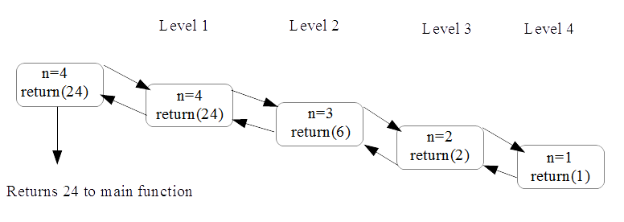

对于一个特定的问题，递归或迭代是否是更好的解决方案并不一定很清楚；毕竟，它们都会重复一系列操作，并且都非常适合采用分而治之的算法设计方法。迭代不断地进行，直到问题解决为止。递归将问题分解成越来越小的块，然后合并结果。迭代对于程序员来说通常更容易，因为控制保持在循环的局部，而递归可以更接近地表示数学概念，如阶乘。递归调用存储在内存中，而迭代不存储在内存中。这会在处理器周期和内存使用之间进行权衡，因此选择使用哪个周期可能取决于任务是处理器密集型任务还是内存密集型任务。下表概述了递归和迭代之间的主要区别：

| **递归** | **迭代** |
| 在达到基本情况时终止 | 在满足定义的条件时终止 |
| 每个递归调用都需要内存空间 | 每次迭代都不会存储在内存中 |
| 无限递归会导致栈溢出错误 | 当硬件通电时，将运行无限迭代 |
| 有些问题自然更适合递归解决方案 | 迭代解可能并不总是显而易见的 |

# 回溯

回溯是一种递归形式，对于遍历树结构之类的问题特别有用，在树结构中，每个节点上都有许多选项，我们必须从中选择一个。随后，我们会看到一组不同的选项，这取决于所做的一系列选择，要么是目标状态，要么是死路一条。如果是后者，我们必须回溯到前一个节点并遍历另一个分支。回溯是一种用于穷举搜索的分治方法。重要的是，回溯**修剪**无法给出结果的分支。

下例中给出了回溯跟踪的示例。在这里，我们使用递归方法来生成给定长度*n*的给定字符串*s*的所有可能排列：

```py
    def bitStr(n, s):            

         if n == 1: return s 
         return [ digit + bits for digit in bitStr(1,s)for bits in bitStr(n - 1,s)] 

    print (bitStr(3,'abc'))     
```

这将生成以下输出：

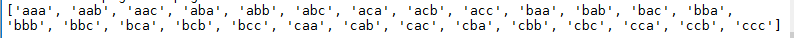

注意这个理解中的双列表压缩和两个递归调用。这将递归地连接初始序列的每个元素（在`*n* = 1`时返回），以及在上一次递归调用中生成的字符串的每个元素。从这个意义上说，它是*回溯*来发现以前的独创组合。返回的最后一个字符串是初始字符串的所有*n*字母组合。

# 分治-长乘法

为了使递归不仅仅是一个聪明的技巧，我们需要了解如何将它与其他方法（如迭代）进行比较，并了解何时使用它将导致更快的算法。我们都熟悉的一种迭代算法是我们在小学数学课上学习的，用来将两个大数相乘的过程。也就是说，长乘法。如果您还记得，长乘法包括迭代乘法和进位运算，然后是移位和加法运算。

我们的目的是研究如何衡量这一程序的效率，并试图回答这个问题；这是将两个大数字相乘的最有效的方法吗？

在下图中，我们可以看到两个 4 位数字相乘需要 16 次乘法运算，我们可以概括为一个*n*位数字大约需要*n<sup>2</sup>*乘法运算：


根据乘法和加法等计算原语的数量，这种分析算法的方法非常重要，因为它为我们提供了一种了解完成某一计算所需时间与该计算输入大小之间关系的方法。特别是，我们想知道当输入的位数 n 非常大时会发生什么。这一主题，称为渐近分析，或时间复杂度，是我们研究算法的关键，我们将在本章和本书的其余部分经常重温它。

# 我们能做得更好吗？递归方法

事实证明，在长乘法的情况下，答案是肯定的，事实上有几种大数乘法算法需要较少的运算。最著名的长乘法替代方法之一是 1962 年首次发表的**Karatsuba 算法**。这采用了一种根本不同的方法：它不是对单个数字进行迭代乘法，而是对逐渐减小的输入进行递归乘法运算。递归程序在较小的输入子集上调用自己。构建递归算法的第一步是将一个大数分解为几个小数。最自然的方法是简单地将数字分成两半，前一半是最高有效数字，后一半是最低有效数字。例如，我们的四位数 2345 变成了一对两位数 23 和 45。我们可以使用以下公式编写任意 2 个*n*位数、*x*和*y*的更一般分解，其中*m*是小于*n*的任何正整数：

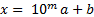

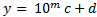

现在我们可以将乘法问题*x*、*y*重写如下：


当我们像术语一样展开和聚集时，我们得到以下结果：

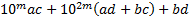

更方便的是，我们可以这样写：


哪里：

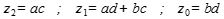

应该指出的是，这表明了两个数字相乘的递归方法，因为这个过程本身确实涉及乘法。具体而言，产品*ac*、*ad*、*bc*和*bd*都涉及比输入数字小的数字，因此可以想象，我们可以将相同的操作作为整体问题的部分解决方案。到目前为止，该算法由四个递归乘法步骤组成，目前还不清楚它是否比经典的长乘法方法更快。

到目前为止，我们讨论的乘法递归方法，从 19 世纪末开始就为数学家所熟知。Karatsuba 算法对此进行了改进，方法是进行以下观察。我们只需要知道三个量：*z<sub>2</sub>*=*ac*；*z<sub>1</sub>=ad+bc*，*z<sub>0</sub>*=*bd*求解方程 3.1。我们只需要知道*a、b、c、d*的值对计算*z<sub>2</sub>*、*z<sub>1</sub>*和【T28 z<sub>0</sub>所涉及的总量和乘积的贡献。这表明我们有可能减少递归步骤的数量。事实证明，情况确实如此。

由于产品*ac*和*bd*已经是最简单的形式，我们似乎不太可能消除这些计算。然而，我们可以作出以下观察：


当我们减去前面递归步骤中计算的数量*ac*和*bd*时，我们得到了我们需要的数量，即（*ad*+*bc*：


这表明我们确实可以计算*ad+bc*之和，而无需单独计算每个量。总之，我们可以通过将四个递归步骤减少到三个来改进等式 3.1。这三个步骤如下：

1.  递归计算*ac.*
2.  递归计算*bd.*
3.  递归计算（*a*+*b*（*c*+*d*）并减去*ac*和*bd*

以下示例显示了 Karatsuba 算法的 Python 实现：

```py
    from math import log10  
    def karatsuba(x,y): 

        # The base case for recursion 
        if x < 10 or y < 10: 
            return x*y     

        #sets n, the number of digits in the highest input number 
        n = max(int(log10(x)+1), int(log10(y)+1)) 

        # rounds up n/2     
        n_2 = int(math.ceil(n / 2.0)) 
        #adds 1 if n is uneven 
        n = n if n % 2 == 0 else n + 1 

        #splits the input numbers      
        a, b = divmod(x, 10**n_2) 
        c, d = divmod(y, 10**n_2) 

        #applies the three recursive steps 
        ac = karatsuba(a,c) 
        bd = karatsuba(b,d) 
        ad_bc = karatsuba((a+b),(c+d)) - ac - bd 

        #performs the multiplication     
        return (((10**n)*ac) + bd + ((10**n_2)*(ad_bc))) 
```

为了让我们自己确信这确实有效，我们可以运行以下测试函数：

```py
    import random 
    def test(): 
            for i in range(1000): 
                x = random.randint(1,10**5) 
                y = random.randint(1,10**5) 
                expected = x * y 
                result = karatsuba(x, y) 
                if result != expected: 
                    return("failed")                 
            return('ok')   
```

# 运行时分析

应该清楚的是，算法设计的一个重要方面是从空间（内存）和时间（操作数）两方面衡量效率。第二个度量，称为运行时性能，是本节的主题。应该提到的是，使用相同的度量来衡量算法的内存性能。可以想象，我们有很多方法可以测量运行时间，最明显的可能就是测量算法完成所需的时间。这种方法的主要问题是，算法运行所需的时间在很大程度上取决于它所运行的硬件。衡量算法运行时间的一种与平台无关的方法是计算所涉及的操作数。然而，这也是有问题的，因为没有确定的方法来量化操作。这取决于编程语言、编码风格以及我们决定如何计算操作。但是，如果我们将计数操作的思想与期望结合起来，即随着输入的大小增加，运行时将以特定的方式增加，那么我们就可以使用这种想法。也就是说，*n*与输入的大小以及算法运行所需的时间之间存在数学关系。

接下来的大部分讨论将以以下三项指导原则为框架。这些原则的合理性和重要性应该随着我们的行动而变得更加清楚。这些原则如下：

*   最坏情况分析。对输入数据不作任何假设。
*   忽略或抑制常数因子和低阶项。在大的输入中，高阶项占主导地位。
*   关注输入量大的问题。

最坏情况分析很有用，因为它给了我们一个严格的上界，我们的算法保证不会超过这个上界。忽略小的常数因子和低阶项实际上就是忽略在输入大小的大值*n*下，在很大程度上对总体运行时间没有贡献的东西。它不仅使我们的工作在数学上更容易，还使我们能够专注于对性能影响最大的事情。

我们在 Karatsuba 算法中看到，乘法运算的数量增加到输入的大小*n*的平方。如果我们有一个四位数，乘法运算的次数是 16；八位数需要 64 次运算。但通常，我们对*n*的小值下的算法行为并不感兴趣，因此我们通常忽略以较慢速率增加的因素，比如与*n*线性增加的因素。这是因为在*n*的高值下，随着*n*的增加，增长最快的操作将占主导地位。

我们将用一个例子，合并排序算法来更详细地解释这一点。排序是[第 13 章](13.html)、*排序*的主题，但是，作为一种先兆和了解运行时性能的有用方法，我们将在这里介绍合并排序。

合并排序算法是 60 多年前开发的经典算法。它仍然在许多最流行的排序库中广泛使用。这是相对简单和有效的。这是一种使用分治方法的递归算法。这涉及到将问题分解成更小的子问题，递归地解决它们，然后以某种方式组合结果。合并排序是分而治之范式最明显的演示之一。

合并排序算法由三个简单步骤组成：

1.  对输入数组的左半部分进行递归排序。
2.  对输入数组的右半部分进行递归排序。
3.  将两个已排序的子数组合并为一个。

一个典型的问题是将数字列表按数字顺序排序。合并排序的工作原理是将输入分成两半，并并行处理每一半。我们可以用下图示意性地说明这一过程：

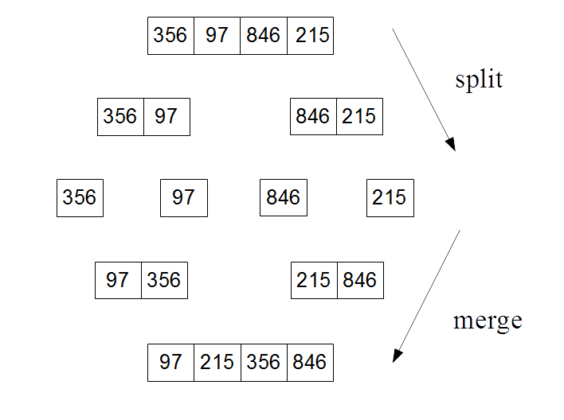

以下是合并排序算法的 Python 代码：

```py
    def mergeSort(A): 
        #base case if the input array is one or zero just return. 
        if len(A) > 1: 
            # splitting input array 
            print('splitting ', A ) 
            mid = len(A)//2 
            left = A[:mid] 
            right = A[mid:] 
            #recursive calls to mergeSort for left and right sub arrays                 
            mergeSort(left) 
            mergeSort(right) 
            #initalizes pointers for left (i) right (j) and output array (k)  
    # 3 initalization operations 
            i = j = k = 0         
            #Traverse and merges the sorted arrays 
            while i <len(left) and j<len(right): 
    # if left < right comparison operation  
                if left[i] < right[j]: 
    # if left < right Assignment operation 
                    A[k]=left[i] 
                    i=i+1 
                else: 
    #if right <= left assignment 
                    A[k]= right[j] 
                    j=j+1 
                k=k+1 

            while i<len(left): 
    #Assignment operation 
                A[k]=left[i] 
                i=i+1 
                k=k+1 

            while j<len(right): 
    #Assignment operation 
                A[k]=right[j] 
                j=j+1 
                k=k+1 
        print('merging ', A) 
        return(A)   
```

我们运行此程序以获得以下结果：

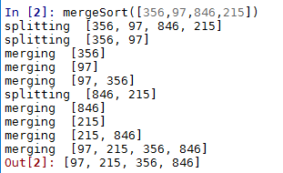

我们感兴趣的问题是如何确定运行时性能，即相对于*n*的大小，算法完成所需时间的增长率是多少。为了更好地理解这一点，我们可以将每个递归调用映射到树结构上。

树中的每个节点都是一个递归调用，处理逐渐变小的子问题：


每次调用 merge-sort 都会创建两个递归调用，因此我们可以用二叉树来表示这一点。每个子节点接收一个子集的输入。最终，我们想知道相对于*n*的大小，算法完成所需的总时间。首先，我们可以计算树的每个级别上的工作量和操作数。

以运行时分析为重点，在第 1 级，问题分为两个子问题*n*/2，在第 2 级，有四个子问题*n*/4，以此类推。问题是递归何时见底，即何时到达其基本情况。这只是当数组为 0 或 1 时。

递归级别的数量正是您需要将*n*除以 2 的次数，直到您得到一个最多为 1 的数字。这正是 log2 的定义。由于我们将初始递归调用计数为级别 0，因此总级别数为 log<sub>2</sub>*n*+1。

让我们停下来完善我们的定义。到目前为止，我们已经用字母*n*描述了输入中的元素数量。这是指递归第一级中的元素数量，即初始输入的长度。我们需要在后续递归级别区分输入的大小。为此，我们将使用字母*m*或特别是*m<sub>j</sub>*作为递归级别*j 的输入长度。*

还有一些我们忽略了的细节，我相信你已经开始怀疑了。例如，当*m*/2 不是整数，或者输入数组中存在重复项时会发生什么情况。事实证明，这对我们的分析没有重要影响。

使用递归树分析算法的优点是，我们可以计算在递归的每个级别上所做的工作。如何定义这项工作仅仅是操作的总数，这当然与输入的大小有关。以独立于平台的方式测量和比较算法的性能非常重要。实际运行时间当然取决于运行它的硬件。计算操作数很重要，因为它为我们提供了一个与算法性能直接相关的度量，与平台无关。

一般来说，由于 merge-sort 的每次调用都会进行两次递归调用，因此每个级别的调用数量都会翻倍。同时，这些调用中的每个调用都在处理一个输入，该输入是其父调用的一半。我们可以将其形式化，并说：

For level j , where *j* is an integer 0, 1, 2 ... log<sub>2</sub>*n*, there are two <sup>j</sup> sub problems each of size *n*/2<sup>j</sup>.

要计算操作总数，我们需要知道两个子数组的单个合并所包含的操作数。让我们统计一下前面 Python 代码中的操作数。我们感兴趣的是两次递归调用之后的所有代码。首先，我们有三个赋值操作。然后是三个 while 循环。在第一个循环中，我们有一个 if-else 语句，每个语句中有两个操作，一个比较，然后是赋值。由于 if-else 语句中只有一组操作，我们可以将这段代码计算为执行了*m*次的两个操作。接下来是两个 while 循环，每个循环都有一个赋值操作。这使得合并排序的每个递归总共有 4*m*+3 个操作。

由于*m*必须至少为 1，因此操作数的上限为 7*m*。必须说，这并不是一个确切的数字。当然，我们可以决定以不同的方式计算操作数。我们没有计算增量操作或任何内务操作；然而，这并不重要，因为我们更关心的是在*n*的高值下*n*的运行时增长率。

这似乎有点让人望而生畏，因为递归调用本身的每次调用都会派生出更多的递归调用，并且似乎呈指数级增长。使之易于管理的关键事实是，当递归调用的数量翻倍时，每个子问题的大小会减半。正如我们可以证明的那样，这两种相反的力量相互抵消得很好。

为了计算递归树每个级别的最大操作数，我们只需将子问题数乘以每个子问题中的操作数，如下所示：

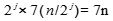

重要的是，这表明，由于 2<sup>j</sup>取消了每个级别上的操作数，因此每个级别上的操作数与该级别无关。这为我们提供了每个级别上执行的操作数的上限，在本例中为 7*n*。应该指出的是，这包括在该级别上每个递归调用执行的操作数，而不是在后续级别上执行的递归调用数。这表明，当递归调用的数量随着每个级别的增加而增加一倍时，所做的工作正好与每个子问题的输入大小减半这一事实相平衡。

要找到完整合并排序的操作总数，只需将每个级别上的操作数乘以级别数即可。这给了我们以下信息：

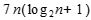

当我们将其展开时，我们得到以下结果：


从中得出的关键点是，输入大小与总运行时间之间存在对数关系。如果你还记得学校数学的话，对数函数的显著特点是它很快变平。作为一个输入变量，*x*的大小在增加，而输出变量，*y*的增加量越来越小。例如，将对数函数与线性函数进行比较：


在上一示例中，将*n*log<sub>2</sub>n*n*分量相乘，并将其与*n*<sup>2</sup>进行比较。

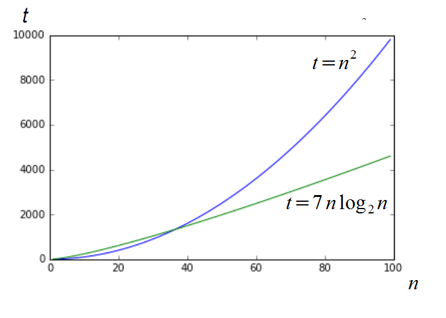

请注意，对于非常低的*n*值，对于在 n<sup xmlns:epub="http://www.idpf.org/2007/ops">2</sup>时间内运行的算法，完成时间*t*实际上较低。然而，对于大于约 40 的值，log 函数开始占主导地位，将输出平坦化，直到在相对适中的大小*n*=100 时，其性能是在*n*2 时间内运行的算法性能的两倍以上。还要注意的是，常数因子+7 的消失在*n*的高值处是不相关的。

用于生成这些图形的代码如下所示：

```py
    import matplotlib.pyplot as plt 
    import math 
    x=list(range(1,100)) 
    l =[]; l2=[]; a = 1 
    plt.plot(x , [y * y for y in x] ) 
    plt.plot(x, [(7 *y )* math.log(y, 2) for y in x]) 
    plt.show() 
```

如果尚未安装 matplotlib 库，则需要安装该库才能工作。详情可在以下地址找到；我鼓励您尝试使用这个列表理解表达式来生成图。例如，添加以下 plot 语句：

```py
    plt.plot(x, [(6 *y )* math.log(y, 2) for y in x]) 
```

提供以下输出：

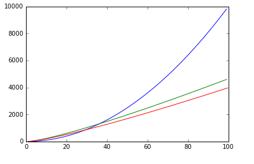

上图显示了计算六个操作或七个操作之间的差异。我们可以看到这两种情况是如何分歧的，这在我们讨论应用程序的细节时很重要。然而，我们更感兴趣的是一种描述增长率的方法。我们不太关心绝对值，而是随着*n*的增加，这些值是如何变化的。这样我们可以看到，与顶部（*x*<sup>2</sup>曲线相比，两条较低的曲线具有相似的增长率。我们说这两条较低的曲线具有相同的**复杂度等级**。这是一种理解和描述不同运行时行为的方法。我们将在下一节中正式确定此性能指标。

# 渐近分析

算法的运行时性能主要有三个方面。他们是：

*   最坏情况-使用性能最慢的输入
*   最佳案例-使用能给出最佳结果的输入
*   平均情况-假设输入是随机的

为了计算每一个，我们需要知道上界和下界。我们已经看到了一种使用数学表达式表示算法运行时的方法，本质上是加法和乘法运算。为了使用渐近分析，我们只需创建两个表达式，最好和最坏情况各一个。

# 大 O 符号

大的*O*符号中的字母“O”代表顺序，因为增长率被定义为函数的顺序。我们说一个函数*T*（*n*）是另一个函数*F*（*n*）的大 O，我们定义如下：


输入大小*n*的函数*g*（*n*）基于以下观察结果：对于*n*的所有足够大的值，*g*（*n*在上面以*f*（*n*的常数倍数为界。目标是找到小于或等于*f*（*n*的最小增长率）。我们只关心*n*的较高值会发生什么。变量*n<sub>0</sub>*表示增长率不重要的阈值，函数 T（n）表示**紧上界**F（n）。在下面的图中我们可以看到，*T*（*n*）=*n<sup>2</sup>*+500=*O*（*n<sup>2</sup>*）与*C*=2 和*n【T45 0】*约为 23:


您还将看到符号*f*（*n*）=*O*（*g*（*n*）。这说明了*O*（*g*（*n*）实际上是一组函数，其中包括所有具有与*f*（n）相同或更小增长率的函数。例如，*O*（*n<sup>2</sup>*）还包括*O*（*n*）、*O*（*n*日志*n*等功能。

在下表中，我们按从最低到最高的顺序列出了最常见的增长率。我们有时将这些增长率称为函数的**时间复杂度**，或函数的复杂度等级：

| **复杂度等级** | **名称** | **示例操作** |
| O（1） | 常数 | 追加、获取项目、设置项目。 |
| O（日志*n* | 对数的 | 在排序数组中查找元素。 |
| O（n） | 线性的 | 复制、插入、删除、迭代。 |
| *n*日志*n* | 线性对数 | 对列表排序，合并-排序。 |
| *n<sup>2</sup>* | 二次的 | 查找图中两个节点之间的最短路径。嵌套循环。 |
| *n<sup>3</sup>* | 立方体的 | 矩阵乘法。 |
| 2*<sup>n</sup>* | 指数型 | “河内塔”问题，回溯。 |

# 组成复杂类

通常，我们需要找到一些基本操作的总运行时间。事实证明，我们可以组合简单操作的复杂性类，以找到更复杂的组合操作的复杂性类。目标是分析函数或方法中的组合语句，以了解执行多个操作的总时间复杂度。组合两个复杂类的最简单方法是添加它们。当我们有两个连续的操作时，就会发生这种情况。例如，考虑将一个元素插入列表并排序该列表的两种操作。我们可以看到，插入项目发生在 O（*n*时间，排序是 O（*n*日志*n*时间。我们可以将总时间复杂度写为 O（*n*+*n*log*n*），也就是说，我们将这两个函数放在 O（…）中。我们只对最高阶项感兴趣，因此只剩下 O（*n*log*n*）。

例如，如果我们在 while 循环中重复一个操作，那么我们将复杂性类乘以执行该操作的次数。如果时间复杂度为 O（*f*（*n*）的操作被重复 O（*n*次），则我们将两种复杂度相乘：

O（*f*（*n*）*O（*n*）=O（*nf*（*n*）。

例如，假设函数 f（…）的时间复杂度为 O（*n*<sup>2</sup>，在 while 循环中执行*n*次，如下所示：

```py
    for i n range(n): 
        f(...) 
```

这个循环的时间复杂度变成 O（*n*<sup xmlns:epub="http://www.idpf.org/2007/ops">2</sup>）*O（*n*）=O（*n*n<sup>2</sup>*）=O（*n<sup>3</sup>*。这里我们只是将操作的时间复杂度乘以该操作执行的次数。循环的运行时间最多是循环内语句的运行时间乘以迭代次数。假设两个循环都运行*n*次，则单个嵌套循环，即一个循环嵌套在另一个循环中，将在*n*2 时间内运行。例如：

```py
    for i in range(0,n):  
        for j in range(0,n) 
            #statements 
```

每个语句都是一个常量，c，执行*n**n*次，因此我们可以将运行时间表示为；*c**n**n*=*cn*<sup>2</sup>=O（*n*2）。

对于嵌套循环中的连续语句，我们将每个语句的时间复杂度相加，然后乘以语句执行的次数。例如：

```py
    n = 500    #c0   
    #executes n times 
    for i in range(0,n): 
        print(i)    #c1 
    #executes n times 
    for i in range(0,n): 
        #executes n times 
        for j in range(0,n): 
        print(j)   #c2 
```

这可以写为*c*<sub xmlns:epub="http://www.idpf.org/2007/ops">0</sub>+*c*<sub xmlns:epub="http://www.idpf.org/2007/ops">1</sub>n+*cn*<sup xmlns:epub="http://www.idpf.org/2007/ops">2</sup>=O（*n*<sup xmlns:epub="http://www.idpf.org/2007/ops">2</sup>）。

我们可以定义（基数 2）对数复杂度，在恒定时间内将问题的大小减少½。例如，考虑下面的片段：

```py
    i = 1 
    while i <= n: 
        i=i * 2 
        print(i) 
```

注意，`i`在每次迭代中都是加倍的，如果我们在*n*=10 的情况下运行它，我们会看到它打印出四个数字；2、4、8 和 16。如果我们将*n*加倍，我们会看到它打印出五个数字。随着 n 的每增加一倍，迭代次数只增加 1。如果我们假设*k*迭代，我们可以这样写：


由此我们可以得出结论，总时间=**O**（*log（n）*。

虽然大 O 是渐近分析中最常用的符号，但还有两个相关的符号需要简要提及。它们是ω表示法和θ表示法。

# 欧米茄符号(Ω)

与大 O 表示法描述上限的方式类似，欧米茄表示法描述了一个**紧下限**。定义如下：

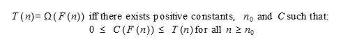

目标是给出等于或小于给定算法的最大增长率 T（*n*），即增长率。

# θ表示法（ϴ）

通常情况下，给定函数的上界和下界相同，θ表示法的目的是确定是否存在这种情况。定义如下：


虽然完全描述增长率需要ω和θ符号，但最实用的是大 O 符号，这是您最常看到的符号。

# 平摊分析

我们通常对单个操作的时间复杂性不感兴趣，而是对操作序列的时间平均运行时间感兴趣。这称为摊销分析。它不同于我们稍后将讨论的平均案例分析，因为它不对输入值的数据分布进行假设。然而，它考虑了数据结构的状态变化。例如，如果对列表进行排序，则后续的查找操作应该会更快。摊销分析可以考虑数据结构的状态变化，因为它分析操作序列，而不是简单地聚合单个操作。

摊销分析通过对一系列操作中的每个操作施加人工成本，然后结合这些成本，找到运行时的上限。序列的人工成本考虑到初始昂贵的操作会使后续操作更便宜。

当我们有少量昂贵的操作（如排序）和大量便宜的操作（如查找）时，标准的最坏情况分析可能会导致过于悲观的结果，因为它假设每次查找都必须比较列表中的每个元素，直到找到匹配项。我们应该考虑到，一旦我们对列表进行排序，我们就可以使后续的查找操作更便宜。

到目前为止，在我们的运行时分析中，我们假设输入数据是完全随机的，只考虑了输入大小对运行时的影响。还有两种常见的算法分析方法；他们是：

*   平均案例分析
*   标杆管理

Average case analysis 根据有关各种输入值的相对频率的一些假设，找到平均运行时间。使用真实世界数据或复制真实世界数据分布的数据在特定数据分布上会重复多次，并计算平均运行时间。

基准管理就是简单地拥有一组商定的典型输入，用于衡量绩效。基准测试和平均时间分析都依赖于具备一些领域知识。我们需要知道典型的或预期的数据集是什么。最终，我们将尝试通过微调到非常特定的应用程序设置来找到提高性能的方法。

让我们看一下一种测试算法运行时性能的简单方法。这可以通过简单地计时算法完成给定的各种输入大小所需的时间来完成。正如我们前面提到的，这种测量运行时性能的方法取决于它所运行的硬件。显然，更快的处理器将提供更好的结果，但是，随着输入大小的增加，相对增长率将保留算法本身的特征，而不是它运行在的硬件上。硬件（和软件）平台之间的绝对时间值不同；然而，它们的相对增长仍然受到算法时间复杂度的限制。

让我们举一个嵌套循环的简单例子。很明显，该算法的时间复杂度为 O（n<sup>2</sup>，因为外循环中每 n 次迭代，中间循环中也有 n 次迭代。例如，我们的简单嵌套 For 循环由在内部循环上执行的简单语句组成：

```py
    def nest(n): 
        for i in range(n): 
            for j in range(n): 
                i+j 
```

下面的代码是一个简单的测试函数，它以增加的值`n`运行嵌套函数。在每次迭代中，我们使用`timeit.timeit`函数计算完成此函数所需的时间。在本例中，`timeit`函数有三个参数，一个是要计时的函数的字符串表示，一个是导入嵌套函数的设置函数，另一个是指示执行 main 语句的次数的`int`参数。由于我们对嵌套函数相对于输入大小`n`完成所需的时间感兴趣，因此就我们的目的而言，在每次迭代中调用一次嵌套函数就足够了。以下函数返回每个 n 值的计算运行时列表：

```py
    import timeit  
    def test2(n): 
        ls=[] 
        for n in range(n): 
            t=timeit.timeit("nest(" + str(n) +")", setup="from __main__ import nest", number = 1) 
            ls.append(t) 
        return ls    
```

在下面的代码中，我们运行 test2 函数并将结果与适当缩放的 n<sup>2</sup>函数一起绘制图表，以进行比较，用虚线表示：

```py
    import matplotlib.pyplot as plt 
    n=1000 
    plt.plot(test2(n)) 
    plt.plot([x*x/10000000 for x in range(n)]) 
```

这将产生以下结果：

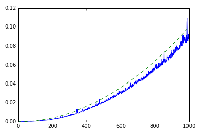

正如我们所看到的，这给了我们很大的期望。应该记住，这既代表了算法本身的性能，也代表了底层软件和硬件平台的行为，如测量运行时的可变性和运行时的相对大小所示。显然，更快的处理器会导致更快的运行时间，而且性能也会受到其他运行进程、内存限制、时钟速度等的影响。

# 总结

在本章中，我们对算法设计进行了概述。重要的是，我们看到了一种独立于平台的方法来衡量算法的性能。我们研究了一些解决算法问题的不同方法。我们研究了一种递归乘法大数的方法，以及一种用于合并排序的递归方法。我们了解了如何使用回溯进行穷举搜索和生成字符串。我们还介绍了基准测试的思想和一种简单的依赖于平台的运行时度量方法。在接下来的章节中，我们将参考特定的数据结构，重新讨论其中的许多想法。在下一章中，我们将讨论链表和其他指针结构。