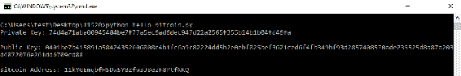
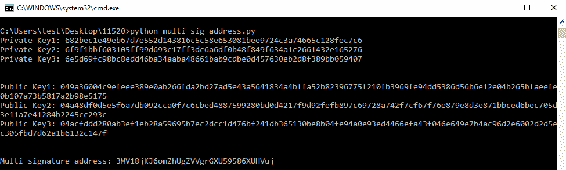
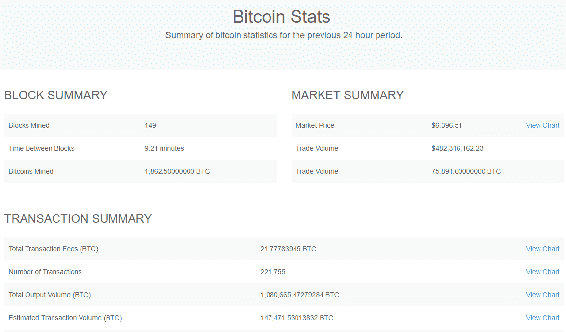
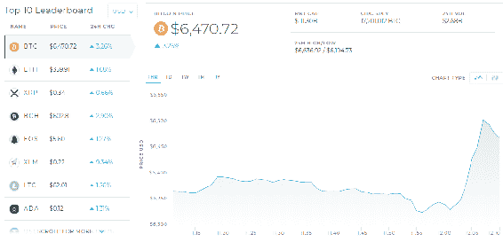
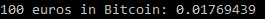
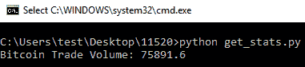
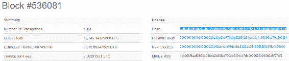
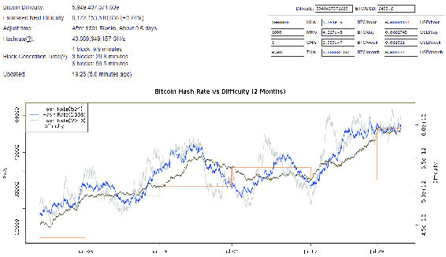

# 二、使用 Python 编程比特币和区块链

本章重点介绍如何使用 Raspberry Pi 比特币工具使用 Python 编程比特币，并以编程方式与区块链 API 交互。读者还将大致了解比特币的开采过程及其初始阶段。

在本章中，我们将学习以下主题：

*   使用 Python 编程比特币
*   创建多签名比特币地址
*   用 Python 进行区块链 API 编程
*   安装 Blockchain.info
*   Python 库
*   学习挖掘比特币
*   如何挖掘比特币
*   比特币开采难度加大

# 用 Python 编程比特币

在本节中，我们将介绍以下主题：

*   Raspberry Pi 比特币工具库以及如何开始使用它
*   如何生成私钥和公钥
*   如何从生成的私钥和公钥创建简单的比特币地址

To get started with bitcoin using Python, you must install Python 3.x and the bitcoin Python library called Pi Bitcoin tools in the system.

# 比特币工具库

要安装 Pi 比特币工具库，请打开命令行程序并执行以下命令：

```py
pip install bitcoin
```

The best thing about this library is that it does not need to have a bitcoin node on your computer in order for you to start using it.

该库连接到比特币网络，并从 Blockchain.info 等地方提取数据。

首先，我们将用 Python 编写一个相当于比特币的`Hello World`程序。在`hello_bitcoin.py`脚本中，使用 Python 创建新比特币地址的演示。

执行以下步骤以运行程序：

1.  导入比特币库：

```py
#!/usr/bin/env python
'''
Title - Hello Bitcoin
This program demonstrates the creation of
- private key,
- public key
- and a bitcoin address.
'''

# import bitcoin
from bitcoin import *
```

2.  使用随机密钥函数生成私钥：

```py
my_private_key = random_key()
```

3.  在屏幕上显示私钥：

```py
print("Private Key: %s\n" % my_private_key)
```

# 如何生成私钥和公钥

使用私钥，将生成公钥。通过将生成的私钥传递给`privtopub`函数来执行此步骤，如下所示：

```py
# Generate Public Key
my_public_key = privtopub(my_private_key)
print("Public Key: %s\n" % my_public_key)
```

现在，使用公钥生成比特币地址。通过将生成的公钥传递给`pubtoaddr`函数来执行此操作：

```py
# Create a bitcoin address
my_bitcoin_address = pubtoaddr(my_public_key)
print("Bitcoin Address: %s\n" % my_bitcoin_address)
```

以下屏幕截图显示生成的私钥、公钥和比特币地址：



Bitcoin address
A bitcoin address is a single-use token. Just as people use email addresses to send and receive emails, you can use this bitcoin address to send and receive bitcoins. Unlike email addresses, however, people have many different bitcoin addresses, and a unique address should be used for each transaction.

# 创建多签名比特币地址

多重签名地址是与多个私钥关联的地址；因此，我们需要创建三个私钥。

按照以下步骤创建多签名比特币地址：

1.  创建三个私钥：

```py
#!/usr/bin/env python
'''
Title - Create multi-signature address

This program demonstrates the creation of
Multi-signature bitcoin address.
'''
# import bitcoin
from bitcoin import *

# Create Private Keys
my_private_key1 = random_key()
my_private_key2 = random_key()
my_private_key3 = random_key()

print("Private Key1: %s" % my_private_key1)
print("Private Key2: %s" % my_private_key2)
print("Private Key3: %s" % my_private_key3)
print('\n')
```

2.  使用`privtopub`功能从这些私钥创建三个公钥：

```py
# Create Public keys
my_public_key1 = privtopub(my_private_key1)
my_public_key2 = privtopub(my_private_key2)
my_public_key3 = privtopub(my_private_key3)

print("Public Key1: %s" % my_public_key1)
print("Public Key2: %s" % my_public_key2)
print("Public Key3: %s" % my_public_key3)
print('\n')
```

3.  生成公钥后，将三个公钥传递给`mk_ multi-sig_script`函数，创建`multisig`。生成的`multisig`被传递到`addr`脚本函数，以创建多重签名比特币地址。

```py
# Create Multi-signature address
my_multi_sig = mk_multisig_script(my_private_key1, my_private_key2, my_private_key3, 2,3)
my_multi_address = scriptaddr(my_multi_sig)
print("Multi signature address: %s" % my_multi_address)
```

4.  打印多重签名地址并执行脚本。

以下屏幕截图显示了`multisig`比特币地址的输出：



Multisignature addresses are useful in organizations where no single individual is trusted with authorising the spending of bitcoins.

您还可以查看先前存在的比特币地址的交易历史。我们将首先从 Blockchain.info 获取有效地址。

以下屏幕截图显示了比特币块的复制地址：


将复制的地址连同输出一起传递给`history`函数，如下代码所示，以获取比特币地址的历史记录，包括交易信息：

```py
!/usr/bin/env python
'''
Title - Bitcoin Transaction History

This program demonstrates listing history of a bitcoin address.
'''
# import bitcoin
from bitcoin import *

#View address transaction history
a_valid_bitcoin_address = '329e5RtfraHHNPKGDMXNxtuS4QjZTXqBDg'
print(history(a_valid_bitcoin_address))
```


# 用 Python 进行区块链 API 编程

Blockchain.info 是最受欢迎的区块链和比特币网络探索者和钱包提供商之一。从 web 上，您可以查看块级别并查看已发生的所有事务。例如，通过转到此特定块，即块#536081，您可以看到所有事务以及一些其他信息，如以下屏幕截图所示：


以下屏幕截图显示了统计数据（数据统计）。这是伟大的，也是有用的；但是，对于基于此数据构建应用程序或执行分析的开发人员，以编程方式获取此数据非常重要：



以下屏幕截图显示了市场数据（数据|市场）：



# 安装 Blockchain.info Python 库

以下是安装`blockchain`Python 库的步骤：

1.  打开计算机上的命令行程序。
2.  运行`pip install blockchain `命令安装`blockchain`库。

以下屏幕截图显示了比特币的安装：


# 从 Blockchain.info 获取比特币汇率

以下步骤显示了比特币汇率的计算方法：

1.  首先，从`blockchain`库中导入`exchangerates`类：

```py
#!/usr/bin/env python

# import blockchain library
from blockchain import exchangerates
```

2.  汇率定义一个`get_ticker`方法，该方法返回字典对象中的汇率数据。调用此方法并保存生成的对象。我们拥有的`ticker`字典对象以货币符号作为键：

```py
# get the Bitcoin rates in various currencies
ticker = exchangerates.get_ticker()
```

3.  通过运行这些键，可以提取有关各种速率的数据。例如，通过获取`p15min`最小值，可以获得每种货币的最新比特币汇率：

```py
# print the Bitcoin price for every currency
print("Bitcoin Prices in various currencies:")
for k in ticker:
 print(k, ticker[k].p15min)
```

以下屏幕截图显示了当时或过去 15 分钟内的货币列表以及这些货币的等价比特币汇率：


特定货币也可以转换为比特币。例如，您可以传递`to_btc`方法，并传入我们要转换为`btc`的货币和金额，结果为比特币。以下代码显示了如何在值为 100 欧元的情况下执行此操作：

```py
# Getting Bitcoin value for a particular amount and currency
btc = exchangerates.to_btc('EUR', 100)
print("\n100 euros in Bitcoin: %s " % btc)
```

以下屏幕截图显示了 100 欧元比特币的输出：



# 统计数字

比特币区块链库的下一个类称为`statistics`。

可以调用许多方法来获取各种区块链统计数据，例如，如以下屏幕截图所示：


您可以按如下方式调用不同的方法：

*   导入相关类，调用`statistics`上的`get`方法，保存该对象。例如，要获取比特币交易量，我们应该从创建的`stats`对象中获取`trade_volume_btc`属性，如下代码所示：

```py
#!/usr/bin/env python

# import blockchain library
from blockchain import statistics

# get the stats object
stats = statistics.get()

# get and print Bitcoin trade volume
print("Bitcoin Trade Volume: %s\n" % stats.trade_volume_btc)
```

以下屏幕截图显示了比特币交易量：



*   要获取挖掘的比特币总数，请调用`stats`对象上的`btc_mined`属性，如下所示：

```py
# get and print Bitcoin mined
print("Bitcoin mined: %s\n" % stats.btc_mined)
```

以下屏幕截图显示了挖掘的比特币数量的输出：


*   要获取比特币市场价格，请使用`stats`类，调用市场价格并将其附加到特定货币：

```py
# get and print Bitcoin market price in usd
print("Bitcoin market price: %s\n" % stats.market_price_usd)
```

*   比特币当前价格以美元表示如下：


# 块浏览器方法

对于块资源管理器方法，首先从`blockchain`库导入相关类。要获取特定的块，请调用`get_block`方法，如下代码所示。它期望一个块作为参数传入。

```py
# import blockchain library
from blockchain import blockexplorer

# get a particular block
block = blockexplorer.get_block('')
```

通过从 Blockchain.info 中从 web 获取一个示例块，复制该块的哈希（block#536081）并将其传递给`get_block`方法，如以下屏幕截图所示：



现在，让我们了解一些有关此块的信息。例如，可以在创建的`block`对象上分别使用`fee`、`size`、`transactions`属性获取区块费用、区块大小、区块交易，如下代码所示：

```py
#!/usr/bin/env python

# import blockchain library
from blockchain import blockexplorer

# get a particular block
block = blockexplorer.get_block('0000000000000000002e90b284607359f3415647626447643b9b880ee00e41fa')

print("Block Fee: %s\n" % block.fee)
print("Block size: %s\n" % block.size)
print("Block transactions: %s\n" % block.transactions)

# get the latest block
block = blockexplorer.get_latest_block()
```

以下屏幕截图显示了区块费用、区块大小和区块交易输出：


Blockchain.info 库中还有许多可用功能；有一些更为相关，例如，钱包、创建钱包等等。

In order to explore this library further, visit the link [https://github.com/blockchain/api-v1-client-python](https://github.com/blockchain/api-v1-client-python).

# 学习挖掘比特币

比特币挖掘的一些特点如下：

*   比特币挖掘是将比特币交易数据添加到比特币过去交易的全球公共分类账的过程。每个比特币矿商都会与所有其他矿商合作，通过处理专门的分析和算术问题，将未完成的交易收集到一起。
*   为了获得准确性并解决问题，比特币矿商获得了他们处理的所有交易
*   除了交易费，矿工们还可以为开采的每个区块获得额外奖励。任何人都可以通过运行计算机程序参与比特币挖掘。除了在传统计算机上运行外，一些公司还设计了专门的比特币挖掘硬件，可以更快地处理交易和构建块。

您可以选择在[上在云端挖掘比特币 https://www.bitcoin.com/](https://www.bitcoin.com/) 。

The course of these plans shows you that the difficulty of bitcoin mining is increasing, and getting more expensive as time goes by.

一些公司购买专门的硬件来开采比特币。其中一个硬件是 21.co 公司的 21 比特币计算机。因此，该硬件预装了必要的软件。

# 如何挖掘比特币

还有很多比特币挖掘软件，可以在任何机器上运行。然而，它可能不再那么有效了。例如，让我们转到[http://www.bitcoinx.com/bitcoin-mining-software/](http://www.bitcoinx.com/bitcoin-mining-software/) 这类软件的清单很长。它们可以在各种操作系统上运行：Windows、Linux 和 macOS。有基于 UI 的比特币矿工，也有基于命令行的比特币矿工，例如 Pyminer，它是 Python 中的一个实现。

# 挖掘比特币的难度越来越大

由于竞争和困难不断加剧，在挖掘比特币时必须牢记许多因素，如下表所示：

*   由于竞争，比特币越来越贵
*   全球许多超级计算机都在竞相开采下一个区块和比特币
*   随着比特币矿商数量的增加，开始开采新比特币的问题越来越严重，价格也越来越高

例如，下面的屏幕截图显示了比特币挖掘的难度是如何增加的；有关更多信息，请参阅[https://bitcoinwisdom.com/bitcoin/difficulty](https://bitcoinwisdom.com/bitcoin/difficulty) 。此特定图表显示了过去两个月的数值。这一最新趋势反映了比特币诞生之初的难度不断增加：



# 总结

在本章中，我们学习了如何开始使用 Python 编程比特币。我们使用 Python 探索 Blockchain.info API 编程，以获取统计数据和其他比特币市场数据。

我们还学习了如何开始挖掘比特币。我们研究了挖掘比特币的各种方法，并了解了为什么比特币挖掘可能不适合所有人，因为它的竞争和难度越来越大。

在下一章中，我们将学习如何通过在网站上接受比特币、运行基于 API 的微服务或构建比特币交易机器人，以编程方式开始运行比特币。