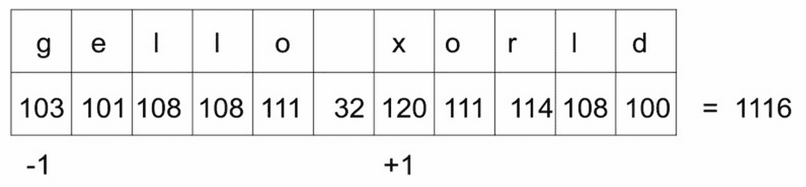
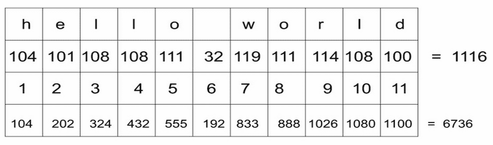
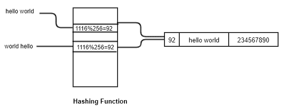
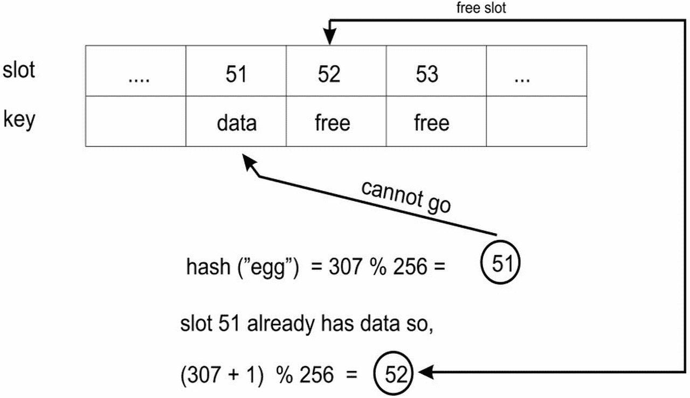
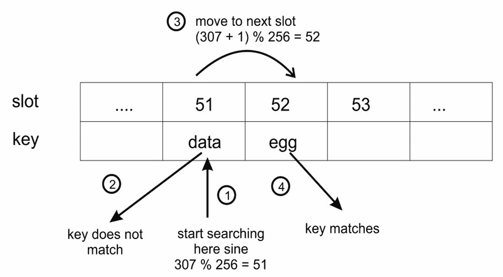
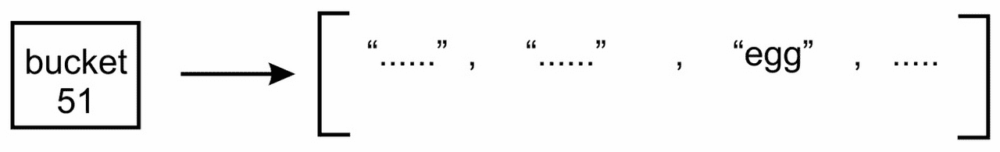
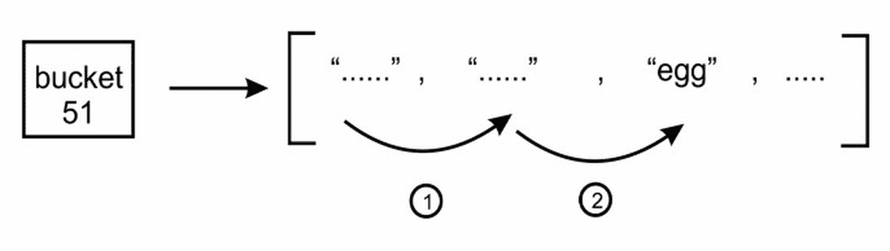
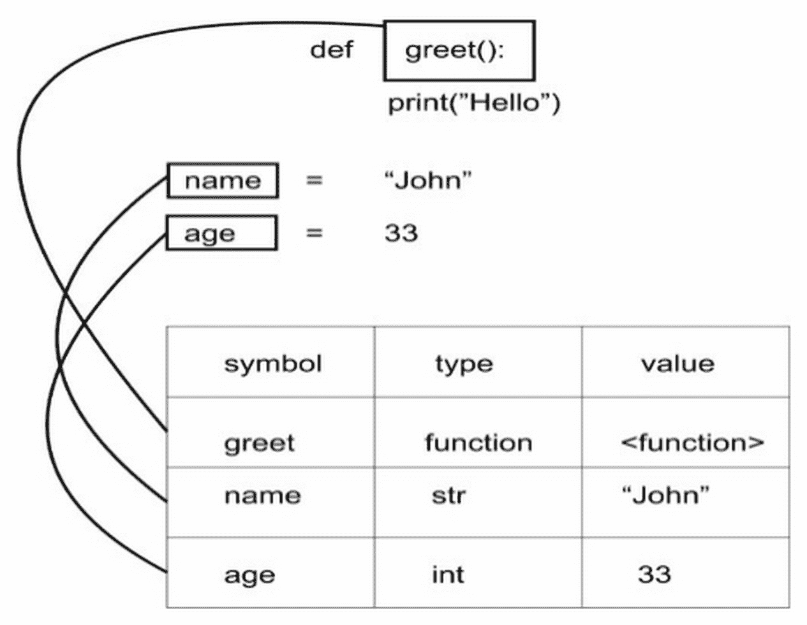

# 七、哈希表和符号表

我们之前已经研究过**数组**和**列表**，其中项目按顺序存储并通过索引号访问。索引数字对计算机很有效。它们是整数，因此运算速度快，易于操作。然而，他们并不总是为我们工作得那么好。例如，如果我们有一个地址簿条目，比如说索引编号 56，那么这个数字并不能告诉我们多少。没有任何东西可以将特定联系人与号码 56 联系起来。使用索引值很难从列表中检索条目

在本章中，我们将研究一种更适合此类问题的数据结构：字典。字典使用关键字而不是索引号，它以`(key, value)`对存储数据。因此，如果该联系人被称为*詹姆斯*，我们可能会使用关键字*詹姆斯*来定位该联系人。也就是说，我们不会通过呼叫*联系人【56】*来访问联系人，而是使用*联系人*`james`

字典是一种广泛使用的数据结构，通常使用哈希表构建。顾名思义，哈希表依赖于一个称为**哈希**的概念。哈希表数据结构将数据存储在`key/value`对中，其中通过对其应用哈希函数获得密钥。它以一种非常有效的方式存储数据，因此检索速度非常快。我们将在本章中讨论所有相关问题。

本章将介绍以下主题：

*   散列
*   哈希表
*   元素的不同功能

# 技术要求

除了需要在系统上安装 Python 之外，没有其他技术要求。这是本章讨论的源代码的 GitHub 链接：[https://github.com/PacktPublishing/Hands-On-Data-Structures-and-Algorithms-with-Python-Second-Edition/tree/master/Chapter07](https://github.com/PacktPublishing/Hands-On-Data-Structures-and-Algorithms-with-Python-Second-Edition/tree/master/Chapter07) 。

# 散列

散列是一个概念，在这个概念中，当我们给一个函数提供任意大小的数据时，我们得到一个小的简化值。此函数称为**散列函数**。散列使用一个散列函数将给定数据映射到另一个数据范围，以便新的数据范围可以用作散列表中的索引。更具体地说，我们将使用散列将字符串转换为整数。在本章的讨论中，我们使用字符串转换为整数，但是，它可以是可以转换为整数的任何其他数据类型。让我们看一个例子来更好地理解这个概念。我们想要散列表达式`hello world`，也就是说，我们想要得到一个数值，我们可以说*代表*字符串。

我们可以使用`ord()`函数获得任何字符的唯一序数值。例如，`ord('f')`函数给出 102。此外，为了得到整个字符串的散列，我们可以对字符串中每个字符的序数求和。请参阅以下代码段：

```py
>>> sum(map(ord, 'hello world'))
1116
```

获取的整个`hello world`字符串的数值`1116`称为该字符串的**散列。考虑下面的图表来查看字符串中每个字符的顺序值，这些值导致散列值**


前面的方法用于获取给定字符串的哈希值，并且似乎工作正常。但是，请注意，我们可以更改字符串中字符的顺序，得到相同的哈希值；请参阅下面的代码片段，其中我们为`world hello`字符串获得了相同的哈希值：

```py
>>> sum(map(ord, 'world hello'))
1116
```

同样，`gello xorld`字符串也会有相同的散列值，因为该字符串的字符序数值之和将是相同的，因为`g`的序数值比`h`的序数值小一，而`x`的序数值比`w`的序数值大一。请参阅以下代码段：

```py
>>> sum(map(ord, 'gello xorld'))
1116
```

请看下图，我们可以看到此字符串的哈希值再次为`1116`：



# 完美散列函数

**完美散列函数**是我们为给定字符串获取唯一散列值的函数（它可以是任何数据类型，这里是字符串，因为我们现在只讨论字符串）。在实践中，大多数散列函数都是不完善的，并且存在面冲突。这意味着哈希函数为多个字符串提供相同的哈希值；这是不可取的，因为一个完美的散列函数应该向字符串返回一个唯一的散列值。通常，散列函数需要非常快，因此尝试创建一个函数为每个字符串提供一个唯一的散列值通常是不可能的。因此，我们接受这一事实，并且我们知道我们可能会遇到一些冲突，即，两个或多个字符串可能具有相同的哈希值。因此，我们试图找到一种解决冲突的策略，而不是试图找到一个完美的哈希函数。

为了避免前面示例中的冲突，例如，我们可以添加一个乘数，使每个字符的序数值乘以一个值，该值在字符串中不断增加。接下来，通过将每个字符的相乘序数值相加，获得字符串的哈希值。为了更好地理解该概念，请参考下图：



在上图中，每个字符的序数值逐渐乘以一个数字。请注意，最后一行是值乘以的结果；第二行具有每个字符的序号值；第三行显示乘数值；在第四行中，我们将第二行和第三行的值相乘得到值，这样`104 x 1`等于`104`。最后，我们将所有这些相乘的值相加，得到`hello world`字符串的散列值，即`6736`

此概念的实现如以下功能所示：

```py
    def myhash(s): 
        mult = 1 
        hv = 0 
        for ch in s: 
            hv += mult * ord(ch) 
            mult += 1 
        return hv 
```

我们可以在前面使用的字符串上测试此函数，如下所示：

```py
for item in ('hello world', 'world hello', 'gello xorld'): 
        print("{}: {}".format(item, myhash(item))) 
```

运行此程序，我们得到以下输出：

```py
% python hashtest.py

hello world: 6736
world hello: 6616
gello xorld: 6742
```

我们可以看到，这一次，这三个字符串的散列值不同。不过，这并不是一个完美的散列。让我们试试字符串`ad`和`ga`：

```py
% python hashtest.py

ad: 297
ga: 297
```

对于两个不同的字符串，我们仍然得到相同的哈希值。因此，我们需要制定解决此类冲突的战略。我们将很快了解这一点，但首先，我们将研究哈希表的实现。

# 哈希表

与**列表**和**数组**不同，**哈希表**是一种数据结构，元素通过关键字而不是索引号进行访问。在此数据结构中，数据项存储在键/值对中，类似于字典。散列表使用散列函数来查找应该存储和检索元素的索引位置。这为我们提供了快速查找，因为我们使用的索引号对应于密钥的散列值

哈希表数据结构中的每个位置通常称为一个**槽**或**桶**，并且**可以存储一个元素。因此，`(key, value)`对形式的每个数据项将存储在哈希表中由数据的哈希值决定的位置。例如，哈希函数将输入字符串名称映射到哈希值；`hello world`字符串映射到哈希值 92，该值在哈希表中查找插槽位置。考虑下面的图表：**

 **

为了实现哈希表，我们首先创建一个类来保存哈希表项。它们需要有一个键和一个值，因为我们的哈希表是一个`{key-value}`存储：

```py
    class HashItem: 
        def __init__(self, key, value): 
            self.key = key 
            self.value = value 
```

这为我们提供了一种非常简单的存储项目的方法。接下来，我们开始处理哈希表类本身。像往常一样，我们从一个构造函数开始：

```py
    class HashTable: 
        def __init__(self): 
            self.size = 256 
            self.slots = [None for i in range(self.size)] 
            self.count = 0 
```

哈希表使用标准 Python 列表存储其元素。首先，我们将哈希表的大小设置为 256 个元素。稍后，我们将研究如何在开始填充哈希表时增加它的策略。我们现在将初始化代码中包含 256 个元素的列表。这些是将元件存储在槽或铲斗中的位置。因此，我们有 256 个插槽来存储哈希表中的元素。最后，我们为实际哈希表元素的数量添加一个计数器：


注意表的大小和计数之间的差异很重要。表的大小是指表中插槽的总数（已使用或未使用）。表的计数是指填充的插槽数，表示已添加到表中的实际`(key-value)`对数。

现在，我们必须决定将哈希函数添加到表中。我们可以使用相同的哈希函数返回字符串中每个字符的序数值之和，只需稍作更改。由于哈希表有 256 个插槽，这意味着我们需要一个哈希函数，该函数返回的值范围为 1 到 256（表的大小）。一个好方法是返回哈希值除以表大小的余数，因为余数肯定是 0 到 255 之间的整数值。

由于散列函数只能在类内部使用，因此我们在名称的开头放了一个下划线（`_`，以表示这一点。这是一个普通的 Python 约定，用于指示某些内容是供内部使用的。以下是`hash`功能的实现：

```py
    def _hash(self, key): 
        mult = 1 
        hv = 0 
        for ch in key: 
            hv += mult * ord(ch) 
            mult += 1 
        return hv % self.size 
```

目前，我们假设键是字符串。稍后我们将讨论如何使用非字符串键。现在，`_hash()`函数将为字符串生成哈希值。

# 在哈希表中存储元素

为了将元素存储在哈希表中，我们使用`put()`函数将它们添加到表中，并使用`get()`函数检索它们。首先，我们来看一下`put()`函数的实现。我们首先将密钥和值嵌入到`HashItem`类中，然后计算密钥的哈希值

下面是`put`函数在哈希表中存储元素的实现：

```py
    def put(self, key, value): 
        item = HashItem(key, value) 
        h = self._hash(key) 
```

一旦我们知道了键的散列值，它将用于查找元素应该存储在散列表中的位置。因此，我们需要找到一个空槽。我们从对应于密钥哈希值的插槽开始。如果那个插槽是空的，我们就在那里插入我们的项目。

但是，如果插槽不是空的，并且项目的键与当前键不同，则会发生冲突。这意味着该项的哈希值与表中以前存储的某个项相同。这就是我们需要找出处理冲突的方法的地方。

例如，在下图中，**hello world**键字符串已经存储在表中，当一个新字符串`world hello`获得相同的哈希值`92`时会发生冲突。请看下图：



解决此类碰撞的一种方法是从碰撞位置找到另一个自由槽；此冲突解决过程称为**开放寻址**。我们可以通过线性查找下一个可用插槽来实现这一点，方法是将`1`添加到上一个哈希值中，在该值中我们得到冲突。我们可以通过将`1`添加到键字符串中每个字符的序数值之和来解决这一冲突，该值再除以哈希表的大小以获得哈希值。这种访问每个插槽的系统方式是解决碰撞的线性方式，称为**线性探测**。

让我们考虑一个例子，如下面的图表所示，以便更好地理解我们如何解决这一冲突。`eggs`键字符串的哈希值为`51`。现在，发生了冲突，因为我们已经使用此位置存储数据。因此，我们在哈希值中添加`1`，该哈希值由字符串中每个字符的序数值之和计算得出，以解决冲突。因此，我们为该密钥字符串获取一个新的哈希值来存储数据位置`52`。请参阅此实现的下图和代码段：



现在，考虑下面的代码：

```py
    while self.slots[h] is not None: 
        if self.slots[h].key is key: 
            break 
        h = (h + 1) % self.size 
```

前面的代码是检查插槽是否为空，然后使用描述的方法获取新的哈希值。如果插槽是空的，为了存储新元素（这意味着前面包含的插槽`None`，那么我们将计数增加 1。最后，我们将项目插入列表中所需的位置：

```py
    if self.slots[h] is None: 
        self.count += 1 
    self.slots[h] = item  
```

# 从哈希表中检索元素

要从哈希表中检索元素，将返回与键对应的存储值。在这里，我们将讨论检索方法`get()`方法的实现。此方法将返回存储在与给定键对应的表中的值。

首先，我们计算与要检索的值相对应的给定键的哈希值，一旦得到了该键的哈希值，我们就在哈希值的位置查找哈希表。如果密钥项与该位置存储的密钥值匹配，则检索相应的`value`。如果不匹配，那么我们将`1`添加到字符串中所有字符的序数值之和，类似于我们在存储数据时所做的，我们查看新获得的哈希值。我们一直在寻找，直到得到关键元素或检查哈希表中的所有插槽。

考虑一个例子来理解以下图表中的概念：四个步骤：

1.  我们计算给定密钥字符串`"egg"`的哈希值，结果是`51`。然后，我们将该密钥与位置`51`处存储的密钥值进行比较，但不匹配。
2.  由于密钥不匹配，我们计算一个新的哈希值。
3.  我们在新创建的散列值的位置查找密钥，即`52`；我们将键字符串与存储的键值进行比较，在这里，它匹配，如下图所示。

4.  返回与哈希表中该键值对应的存储值。见下图：



为了实现这种检索方法，即`get()`方法，我们首先计算密钥的哈希值。接下来，我们查看表中计算的哈希值。如果存在匹配项，则返回相应的存储值。否则，我们将继续查看按所述计算的新哈希值位置。以下是`get()`方法的实现：

```py
def get(self, key): 
    h = self._hash(key)    # computer hash for the given key 
    while self.slots[h] is not None:
        if self.slots[h].key is key: 
            return self.slots[h].value 
        h = (h+ 1) % self.size 
    return None        
```

最后，如果在表中找不到键，则返回`None`。另一个好的选择是在表中不存在键的情况下引发异常。

# 测试哈希表

为了测试我们的哈希表，我们创建`HashTable`并在其中存储一些元素，然后尝试检索它们。我们还将尝试`get()`一个不存在的密钥。我们还使用两个字符串，`ad`和`ga`，这两个字符串发生冲突，并通过哈希函数返回相同的哈希值。为了正确地评估哈希表的工作，我们也抛出了这个冲突，只是为了查看冲突是否得到了正确的解决。请参见示例代码，如下所示：

```py
ht = HashTable() 
    ht.put("good", "eggs") 
    ht.put("better", "ham") 
    ht.put("best", "spam") 
    ht.put("ad", "do not") 
    ht.put("ga", "collide") 

    for key in ("good", "better", "best", "worst", "ad", "ga"): 
        v = ht.get(key) 
        print(v) 
```

运行上述代码将返回以下结果：

```py
% python hashtable.py

eggs
ham
spam
None
do not
collide 
```

如您所见，查找`worst`键返回`None`，因为该键不存在。`ad`和`ga`键也返回它们相应的值，表明它们之间的冲突得到了正确处理。

# 将[]与哈希表一起使用

使用`put()`和`get()`方法看起来不太方便。但是，我们希望能够将哈希表视为一个列表，因为它更易于使用。例如，我们希望能够使用`ht["good"]`而不是`ht.get("good")`从表中检索元素。

这可以通过特殊方法`__setitem__()`和`__getitem__()`轻松完成。有关此信息，请参阅以下代码：

```py
    def __setitem__(self, key, value): 
        self.put(key, value) 

    def __getitem__(self, key): 
        return self.get(key) 
```

现在，我们的测试代码如下所示：

```py
    ht = HashTable() 
    ht["good"] = "eggs" 
    ht["better"] = "ham" 
    ht["best"] = "spam" 
    ht["ad"] = "do not" 
    ht["ga"] = "collide" 

    for key in ("good", "better", "best", "worst", "ad", "ga"): 
        v = ht[key] 
        print(v) 

    print("The number of elements is: {}".format(ht.count)) 
```

请注意，我们还使用`count`变量打印已存储在哈希表中的元素数

# 非字符串键

在大多数情况下，在实时应用中，通常需要使用字符串作为键。但是，如果需要，您可以使用任何其他 Python 类型。如果您创建了自己想要用作键的类，则需要重写该类的特殊`__hash__()`函数，以便获得可靠的散列值。

请注意，您仍然需要计算哈希值的模（`%`）和哈希表的大小才能获得插槽。该计算应该在哈希表中进行，而不是在 key 类中，因为该表知道自己的大小（key 类不应该知道它所属的表的任何信息）。

# 生成哈希表

在我们的示例中，我们将哈希表大小固定为 256。很明显，当我们将元素添加到哈希表中时，我们将开始填充空插槽，在某个时候，所有插槽都将被填充，哈希表将被填满。为了避免这种情况，我们可以在表开始满的时候增大表的大小

为了增加哈希表的大小，我们比较表中的大小和计数。`size`是插槽总数，`count`表示包含元素的插槽数量。因此，如果`count`等于`size`，这意味着我们已经填满了表格。哈希表的负载因子通常用于扩展表的大小；这给了我们一个表中有多少可用插槽已被使用的指示。哈希表的负载因子是通过将**已使用的**插槽数除以表中**总**插槽数来计算的。其定义如下：


随着负载因子值接近 1，这意味着表将被填充，我们需要增加表的大小。最好在表几乎满之前增大表的大小，因为当表满时，从表中检索元素的速度会变慢。负载系数的值为 0.75 可能是增加表大小的一个好值。

下一个问题是我们应该把桌子的大小增加多少。一个策略是简单地将表的大小增加一倍。

# 公开寻址

我们在示例中使用的冲突解决机制是线性探测，这是开放寻址策略的一个示例。线性探测很简单，因为我们使用固定数量的插槽。还有其他的开放寻址策略，但是，它们都有一个相同的想法，即存在一系列插槽。当我们想插入一个密钥时，我们会检查插槽是否已经有一个项。如果有，我们将寻找下一个可用插槽。

如果我们有一个包含 256 个插槽的哈希表，那么 256 是该哈希表中的最大元素数。此外，随着荷载系数的增加，找到新元素的插入点所需的时间也会延长

由于这些限制，我们可能更愿意使用不同的策略来解决冲突，例如链接。

# 锁链

链接是处理哈希表中冲突问题的另一种方法。它通过允许哈希表中的每个槽在冲突位置存储对许多项的引用来解决这个问题。因此，在冲突索引处，我们可以在哈希表中存储许多项。观察下图，字符串**hello world**和**world hello**发生冲突。在链接的情况下，两个项目都允许使用**列表**存储在**92**散列值的位置。下面是显示使用链接解决冲突的示例图：


在链接中，哈希表中的插槽用空列表初始化：


插入元素时，它将被追加到与该元素的哈希值对应的列表中。也就是说，如果有两个元素的哈希值均为`1075`，则这两个元素都将添加到哈希表的`1075%256=51`插槽中的列表中：



上图显示了哈希值为`51`的条目列表。

然后，链接通过允许多个元素具有相同的哈希值来避免冲突。因此，哈希表中可以存储的元素数量没有限制，而在线性探测的情况下，我们必须固定表的大小，当表被填满时，我们需要根据负载系数增加表的大小。此外，哈希表可以容纳比可用插槽数更多的值，因为每个插槽都有一个可以增长的列表。

然而，链接中存在一个问题，当列表在特定的散列值位置增长时，链接将变得效率低下。由于一个特定的槽有很多项，搜索它们可能会非常慢，因为我们必须在列表中进行线性搜索，直到找到具有所需键的元素。这可能会减慢检索速度，这并不好，因为哈希表意味着高效。下图演示了通过列表项进行线性搜索，直到找到匹配项：



因此，当哈希表中的某个特定位置有许多条目时，存在检索项速度慢的问题。这个问题可以通过使用另一种数据结构来解决，而不是使用能够执行快速搜索和检索的列表。使用**二进制搜索树**（**BSTs**）是一个不错的选择，它提供了快速检索，正如我们在上一章中所讨论的。

我们可以简单地在每个插槽中放置一个（最初为空）BST，如下图所示：


在前面的图中，`51`插槽保存一个 BST，我们使用它来存储和检索数据项。但是，根据项目添加到 BST 的顺序，我们仍然会有一个潜在的问题，我们最终可能会得到一个与列表一样低效的搜索树。也就是说，树中的每个节点正好有一个子节点。为了避免这种情况，我们需要确保我们的 BST 是自我平衡的。

# 符号表

编译器和解释器使用符号表来跟踪已声明的符号并保留有关这些符号的信息。符号表通常使用哈希表构建，因为有效地从表中检索符号非常重要。

让我们看一个例子。假设我们有以下 Python 代码：

```py
    name = "Joe" 
    age = 27 
```

这里，我们有两个符号，`name`和`age`。它们属于一个名称空间，可以是`__main__`，但如果您将模块放在那里，它也可以是模块的名称。每个符号有一个`value`；例如，`name`符号的值为`Joe`，而`age`符号的值为`27`。符号表允许编译器或解释器查找这些值。因此，`name`和`age`符号成为哈希表中的键。与它们相关联的所有其他信息成为符号表条目的`value`。

不仅变量是符号，函数和类也被视为符号，它们还将被添加到符号表中，以便在需要访问其中任何一个变量时，可以从符号表中访问它们。例如，`greet()`函数和两个变量存储在下图的符号表中：



在 Python 中，加载的每个模块都有自己的符号表。符号表给出了该模块的名称。这样，模块就充当名称空间。我们可以有多个相同名称的符号，只要它们存在于不同的符号表中，我们可以通过适当的符号表访问它们。请参见以下示例，其中显示了程序中的多个符号表：


# 总结

在本章中，我们研究了哈希表。我们研究了如何编写散列函数将字符串数据转换为整数数据。然后，我们研究了如何使用散列键快速有效地查找与键对应的值

此外，我们还研究了由于哈希值中的冲突导致的哈希表实现中的困难。这导致我们研究了冲突解决策略，因此我们讨论了两种重要的冲突解决方法，即线性探测和链接。

在本章的最后一节中，我们研究了符号表，它们通常使用哈希表构建。符号表允许编译器或解释器查找已定义的符号（如变量、函数或类），并检索有关该符号的所有信息。

在下一章中，我们将讨论图和其他算法。**