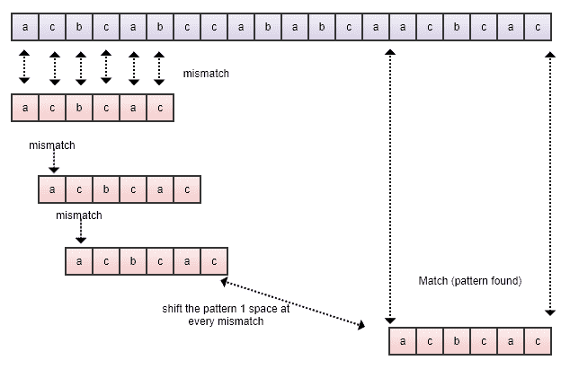
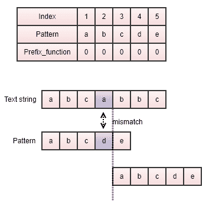
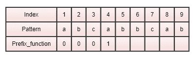
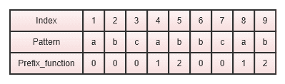
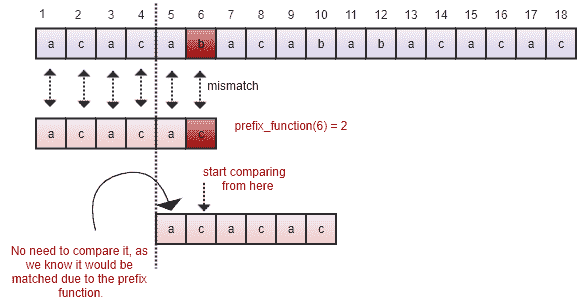
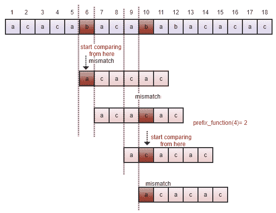
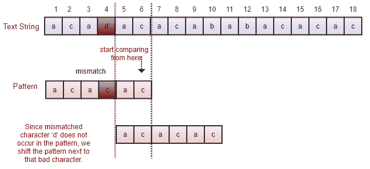
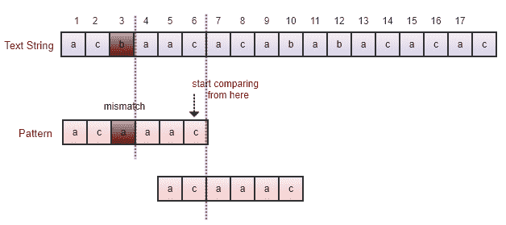
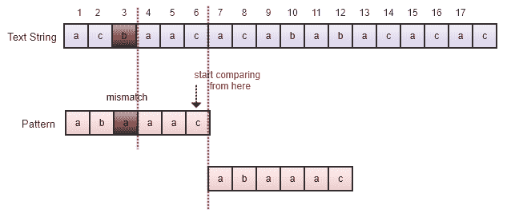

# 十二、字符串算法和技术

根据要解决的问题，有许多流行的字符串处理算法可用。然而，最重要、最流行和最有用的字符串处理问题之一是从给定的文本中找到给定的子字符串或模式。它有多种应用用途，例如从文本文档中搜索元素、剽窃检测等

在本章中，我们将研究标准的字符串处理或模式匹配算法，以找出给定模式或子字符串在某些给定文本中的位置。我们还将讨论暴力算法，以及 Rabin Karp、**Knuth Morris Pratt**（**KMP**）和 Boyer Moore 模式匹配算法。我们还将讨论与字符串相关的一些基本概念。我们将对所有算法进行简单的解释，包括示例和实现。

本章旨在讨论与字符串相关的算法。本章将介绍以下主题：

*   学习 Python 中字符串的基本概念
*   学习模式匹配算法及其实现
*   理解和实现 Rabin-Karp 模式匹配算法
*   理解和实现 Knuth-Morris-Pratt（KMP）算法
*   理解和实现 Boyer-Moore 模式匹配算法

# 技术要求

基于本章讨论的概念和算法的所有程序都在本书以及 GitHub 存储库中提供，链接如下：[https://github.com/PacktPublishing/Hands-On-Data-Structures-and-Algorithms-with-Python-Second-Edition/tree/master/Chapter12](https://github.com/PacktPublishing/Hands-On-Data-Structures-and-Algorithms-with-Python-Second-Edition/tree/master/Chapter12) 。

# 字符串符号和概念

字符串基本上是一个对象序列，主要是一个字符序列。与任何其他数据类型（如 int 或 float）一样，我们需要存储必须应用于它们的数据和操作。字符串数据类型允许我们存储数据，Python 提供了一组丰富的操作和函数，可以应用于字符串数据类型的数据。Python 3.7 提供的可应用于字符串的大部分操作和函数在[第 1 章](01.html)、*Python 对象、类型和表达式*中有详细描述。

字符串主要是文本数据，通常处理效率很高。以下是一个字符串的示例-`"packt publishing"`

子字符串也是作为给定字符串一部分的字符序列。例如，`"packt"`是字符串`"packt publishing"`的子字符串。

子序列是一个字符序列，可以通过从字符串中删除一些字符，但保持字符的出现顺序，从给定字符串中获得该序列。例如，`"pct pblishing"`是通过删除字符`a`、`k`和`u`获得的字符串`"packt publishing"`的有效子序列。但是，这不是子字符串。子序列不同于子字符串，因为它可以被视为子字符串的泛化。

字符串的前缀`s`是`s`的子字符串，因为它出现在字符串的开头。还有另一个字符串`u`，它存在于前缀后面的字符串 s 中。例如，子字符串`"pack"`是字符串`(s) = "packt publishing"`的前缀，因为它正在启动子字符串，并且后面还有另一个子字符串。

后缀`(d)`是出现在字符串末尾的子字符串，因此在子字符串 d 之前存在另一个非空子字符串。例如，子字符串`"shing"`是字符串`"packt publishing"`的后缀。Python 具有内置函数来检查字符串是否具有给定的前缀或后缀，如以下代码段所示：

```py
string = "this is data structures book by packt publisher";
suffix = "publisher";
prefix = "this";

print(string.endswith(suffix))  #Check if string contains given suffix.
print(string.startswith(prefix)) #Check if string starts with given prefix.

#Outputs
>>True
>>True
```

模式匹配算法是最重要的字符串处理算法，我们将在后续章节中讨论它们

# 模式匹配算法

模式匹配算法用于确定给定模式字符串（P）在文本字符串（T）中匹配的索引位置。如果模式在文本字符串中不匹配，则返回`"pattern not found"`。例如，对于给定字符串=`"packt publisher"`，模式（p）=`"publisher"`，模式匹配算法返回文本字符串中模式匹配的索引位置。

在本节中，我们将讨论四种模式匹配算法，即蛮力法，以及 Rabin-Karp 算法、Knuth-Morris-Pratt（KMP）和 Boyer-Moore 模式匹配算法

# 蛮力算法

蛮力算法（模式匹配算法的朴素方法）是非常基本的。使用此方法，我们只需测试给定字符串中输入模式的所有可能组合，以找到模式出现的位置。该算法非常简单，如果文本很长，则不适用。

在这里，我们首先逐个比较模式的字符和文本字符串，如果模式的所有字符都与文本匹配，我们将返回放置模式第一个字符的文本索引位置。如果模式的任何字符与文本字符串不匹配，我们将模式移位一位。通过将模式移动一个索引位置，我们继续比较模式和文本字符串

为了更好地理解暴力算法是如何工作的，让我们看一个例子。假设我们有一个文本字符串（T）=**acbcabccabcaacbcac**，模式字符串（P）是**acbcac**。现在，模式匹配算法的目标是确定模式字符串在给定文本 T 中的索引位置，如下图所示：



我们首先比较文本的第一个字符，即**a**，以及模式的字符。这里，模式的最初五个字符是匹配的，模式的最后一个字符是不匹配的。由于存在不匹配，我们将模式进一步移动一个位置。我们再次开始逐个比较模式的第一个字符和文本字符串的第二个字符。这里，文本字符串的字符**c**与模式的字符**a**不匹配。因为它是不匹配的，所以我们将模式移动一个空间，如上图所示。我们继续比较模式和文本字符串的字符，直到遍历整个文本字符串。在前面的示例中，我们在索引位置**14**处找到一个匹配项，该匹配项显示为指向**aa**的箭头。

在这里，让我们考虑 Python 实现的模式匹配的蛮力算法：

```py
def brute_force(text, pattern):
    l1 = len(text)      # The length of the text string
    l2 = len(pattern)   # The length of the pattern 
    i = 0
    j = 0               # looping variables are set to 0
    flag = False        # If the pattern doesn't appear at all, then set this to false and execute the last if statement

    while i < l1:         # iterating from the 0th index of text
        j = 0
        count = 0    
        # Count stores the length upto which the pattern and the text have matched

        while j < l2:
            if i+j < l1 and text[i+j] == pattern[j]:  
        # statement to check if a match has occoured or not
        count += 1     # Count is incremented if a character is matched 
            j += 1
        if count == l2:   # it shows a matching of pattern in the text 
                print("\nPattern occours at index", i) 
                  # print the starting index of the successful match
                flag = True 
     # flag is True as we wish to continue looking for more matching of  
      pattern in the text. 
            i += 1
    if not flag: 
        # If the pattern doesn't occours at all, means no match of  
         pattern in the text string
        print('\nPattern is not at all present in the array')

brute_force('acbcabccababcaacbcac','acbcac')         # function call

#outputs
#Pattern occours at index 14
```

在前面的暴力方法代码中，我们首先计算给定文本字符串和模式的长度。我们还使用`0`初始化循环变量，并将标志设置为`False`。此变量用于继续搜索字符串中模式的匹配项。如果文本字符串末尾的标志为`False`，则表示文本字符串中完全没有模式匹配。

接下来，我们开始从`0th`索引到文本字符串末尾的搜索循环。在这个循环中，我们有一个 count 变量，用于跟踪模式和文本匹配的长度。接下来，我们有另一个嵌套循环，它从`0th`索引运行到模式的长度。这里，变量`i`跟踪文本字符串中的索引位置，变量`j`跟踪模式中的字符。接下来，我们使用以下代码片段比较模式的字符和文本字符串：

```py
if i+j<l1 and text[i+j] == pattern[j]:
```

此外，在文本字符串中模式字符的每次匹配之后，我们都会增加 count 变量。然后，我们继续匹配模式和文本字符串的字符。如果图案的长度等于 count 变量，则表示存在匹配项。

如果文本字符串中存在匹配的模式，我们将打印文本字符串的索引位置，并将标志变量保持为`True`，因为我们希望继续搜索文本字符串中更多匹配的模式。最后，如果变量标志的值为`False`，则表示文本字符串中的模式根本不匹配。

朴素字符串匹配算法的最佳情况和最坏情况时间复杂度分别为`O(n)`和`O(m*(n-m+1))`。最佳情况发生在文本中找不到模式且模式的第一个字符根本不存在于文本中时，例如，如果文本字符串为`ABAACEBCCDAAEE`，而模式为`FAA`。在这里，由于模式的第一个字符在文本中不匹配，它的比较将等于文本的长度（`n`

最坏情况发生在文本字符串和模式的所有字符都相同时，例如，如果文本字符串为`AAAAAAAAAAAAAAAA`，模式为`AAAA`。另一种最坏情况是，只有最后一个字符不同，例如，如果文本字符串为`AAAAAAAAAAAAAAAF`，模式为`AAAAF`。因此，最坏情况下的时间复杂度为`O(m*(n-m+1))`。

# Rabin-Karp 算法

Rabin-Karp 模式匹配算法是蛮力方法的一个改进版本，用于在文本字符串中查找给定模式的位置。Rabin-Karp 算法的性能通过使用哈希减少比较次数而得到改进。我们在[第 7 章](07.html)、*哈希和符号表*中详细描述了哈希。哈希函数返回给定字符串的唯一数值

该算法比暴力方法更快，因为它避免了不必要的逐字符比较。相反，模式的哈希值将与文本字符串的子字符串的哈希值同时进行比较。如果哈希值不匹配，则模式将移动一个位置，因此不需要逐个比较模式的所有字符

该算法基于这样一个概念：如果两个字符串的哈希值相等，则假定这两个字符串也相等。该算法的主要问题是可能有两个散列值相等的不同字符串。在这种情况下，算法可能无法工作；这种情况被称为虚假打击。为了避免这个问题，在匹配模式和子字符串的散列值之后，我们通过逐个字符的比较来确保模式实际上是匹配的。

Rabin-Karp 模式匹配算法的工作原理如下：

1.  首先，我们在开始搜索之前对模式进行预处理，即计算长度为`m`的模式的哈希值和长度为`m`的文本的所有可能子字符串的哈希值。因此，可能的子字符串总数将为`(n-m+1)`。这里，`n`是文本的长度。
2.  我们比较模式的散列值，并将其与文本子字符串的散列值逐一进行比较。
3.  如果哈希值不匹配，则将模式移动一个位置。
4.  如果模式的散列值和文本子字符串的散列值匹配，那么我们将逐个字符比较模式和子字符串，以确保在文本中实际找到模式
5.  我们继续步骤 2-4 的过程，直到到达给定文本字符串的末尾。

在该算法中，我们可以使用 Horner 规则或任何其他为给定字符串返回唯一值的散列函数来计算数值散列值。我们还可以使用字符串中所有字符的序数值之和来计算哈希值

让我们考虑一个例子来理解 Rabin Karp 算法。假设我们有一个文本字符串（T）=`"publisher paakt packt"`，模式（P）=`"packt"`。首先，我们计算模式的散列值（长度`m`）和文本字符串的所有子字符串（长度`m`）

我们开始将模式`"packt"`的哈希值与第一个子字符串`"publi" `进行比较。由于哈希值不匹配，我们将模式移动一个位置，然后再次将模式的哈希值与文本的下一个子字符串`"ublis"`的哈希值进行比较。由于这些散列值也不匹配，我们再次将模式移动一个位置。如果散列值不匹配，我们总是将模式移动一个位置。

此外，如果模式的散列值和子字符串的散列值匹配，我们将逐个字符比较模式和子字符串，并返回文本字符串的位置。在本例中，这些值在位置`17`处匹配。需要注意的是，可以有一个不同的字符串，其哈希值可以与模式的哈希值匹配。这种情况称为伪命中，是由于散列中的冲突造成的。Rabin-Karp 算法的功能如下所示：


# Rabin-Karp 算法的实现

实现 Rabin-Karp 算法的第一步是选择哈希函数。我们使用字符串字符的所有序数值之和作为哈希函数

我们首先存储文本和模式中所有字符的序数值。接下来，我们将文本的长度和模式存储在`len_text`和`len_pattern`变量中。接下来，我们通过对模式中所有字符的序数值求和来计算模式的哈希值

接下来，我们创建一个名为`len_hash_array`的变量，该变量使用`len_text - len_pattern + 1`存储长度（等于模式长度）的可能子字符串的总数，并创建一个名为`hash_text`的数组，该数组存储所有可能子字符串的哈希值

接下来，我们开始一个循环，该循环将运行文本的所有可能的子字符串。最初，我们通过使用`sum(ord_text[:len_pattern])`对第一个子串的所有字符的序数值求和来计算第一个子串的哈希值。此外，使用其先前子串的哈希值作为`((hash_text[i-1] - ord_text[i-1]) + ord_text[i+len_pattern-1])`来计算所有子串的哈希值。

计算散列值的完整 Python 实现如下所示：

```py
def generate_hash(text, pattern):
      ord_text = [ord(i) for i in text]   
                       # stores unicode value of each character in text 
      ord_pattern = [ord(j) for j in pattern] 
                   # stores unicode value of each character in pattern
      len_text = len(text)           # stores length of the text 
      len_pattern = len(pattern)     # stores length of the pattern
      hash_pattern = sum(ord_pattern)
      len_hash_array = len_text - len_pattern + 1    
       #stores the length of new array that will contain the hash 
       values of text
      hash_text = [0]*(len_hash_array) 
                         # Initialize all the values in the array to 0.
      for i in range(0, len_hash_array): 
           if i == 0:  
                hash_text[i] = sum(ord_text[:len_pattern]) 
                                      # initial value of hash function
           else:
                hash_text[i] = ((hash_text[i-1] - ord_text[i-1]) + 
                ord_text[i+len_pattern-1]) 
                    # calculating next hash value using previous value

      return [hash_text, hash_pattern]         # return the hash values
```

在对模式和文本进行预处理之后，我们已经预计算了哈希值，我们将使用这些哈希值来比较模式和文本。

主要 Rabin-Karp 算法的实现工作如下。首先，我们将给定的文本和模式转换为字符串格式，因为只能为字符串计算序数值。

接下来，我们调用`generate_hash`函数来计算散列值。我们还将文本的长度和模式存储在`len_text`和`len_pattern`变量中。我们还将`flag`变量初始化为`False`，以便它至少跟踪一次文本中是否存在该模式

接下来，我们开始一个实现算法主要概念的循环。此循环将在`hash_text`的长度上运行，这是可能的子字符串的总数。首先，我们使用`if hash_text[i] == hash_pattern`将子字符串的第一个哈希值与模式的哈希值进行比较。他们不匹配；我们什么也不做，而是寻找另一个子串。如果匹配，我们使用`if pattern[j] == text[i+j]`通过循环逐个字符比较子字符串和模式字符。

然后我们创建一个`count`变量来跟踪模式和子字符串中匹配的字符数。如果计数的长度和模式的长度相等，则表示所有字符都匹配，并返回找到模式的索引位置。最后，如果`flag`变量仍为`False`，则表示文本中的模式根本不匹配。

Rabin-Karp 算法的完整 Python 实现如下所示：

```py
def Rabin_Karp_Matcher(text, pattern):
    text = str(text)                 # convert text into string format
    pattern = str(pattern)           # convert pattern into string format
    hash_text, hash_pattern = generate_hash(text, pattern) 
                    # generate hash values using generate_hash function
    len_text = len(text)              # length of text
    len_pattern = len(pattern)        # length of pattern
    flag = False # checks if pattern is present atleast once or not at all
    for i in range(len(hash_text)): 
        if hash_text[i] == hash_pattern:     # if the hash value matches
            count = 0 
            for j in range(len_pattern): 
                if pattern[j] == text[i+j]: 
                        # comparing patten and substring character by character
                    count += 1  
                else:
                    break
                if count == len_pattern:       # Pattern is found in the text
                    flag = True                # update flag accordingly
                    print("Pattern occours at index", i)
                if not flag:                # Pattern doesn't match even once.
                    print("Pattern is not at all present in the text")
```

Rabin-Karp 模式匹配算法在搜索之前对模式进行预处理，即计算复杂度为`O(m)`的模式的哈希值。此外，Rabin-Karp 算法的最坏情况运行时间复杂度为`O(m *(n-m+1))`。

更糟糕的情况是，文本中根本没有出现模式。

当模式至少出现一次时，通常会出现这种情况。

# Knuth-Morris-Pratt 算法

**Knuth-Morris-Pratt**（**KMP**算法）是一种基于预计算前缀函数的模式匹配算法，该前缀函数存储模式中重叠文本部分的信息。KMP 算法对该模式进行预处理，以避免在使用 prefix 函数时进行不必要的比较。该算法利用前缀函数来估计当我们得到不匹配时，为了搜索文本字符串中的模式，模式应该移位多少。KMP 算法是有效的，因为它最小化了给定模式与文本字符串的比较。

KMP 算法背后的动机可以在下面的解释图中看到：


# 前缀函数

`prefix`函数（也称为故障函数）在模式本身中查找模式。它试图找出当存在不匹配时，由于模式本身的重复，前面的比较可以重用多少。它的值主要是最长的前缀，也是后缀

例如，如果我们有一个用于所有字符都不同的模式的`prefix`函数，`prefix`函数的值为`0`，这意味着如果我们发现任何不匹配，模式将根据模式中的字符数进行移位。这也意味着模式中没有重叠，之前的比较也不会被重用。我们首先比较模式的第一个字符和文本字符串（如果它只包含不同的字符）。考虑下面的例子：模式 Apple T3。AbCDE Apple T4A.包含所有不同的字符，因此它将转移到模式中的字符数，并且我们将开始将模式的第一个字符与文本字符串的下一个字符进行比较，如下图所示：



让我们考虑另一个例子，以便更好地理解图中的 Ty0T0-函数如何工作（P）？


在上图中，我们从索引**1**开始计算`prefix`函数的值。如果字符没有重复，我们将赋值为**0**。在上例中，我们为索引位置**1**到**3**分配**0**到`prefix`函数。接下来，在索引位置**4**处，我们可以看到有一个字符**a**，它是模式本身第一个字符的重复，所以我们在这里赋值为**1**，如下所示：



接下来，我们来看位置**5**的下一个字符。它有最长的后缀模式**ab**，因此它的值为**2**，如下图所示：


类似地，我们来看下一个索引位置**6**。这里的字符是**b**。此字符在模式中没有最长的后缀，因此其值为**0**。接下来，我们在索引位置**7**分配值**0**。然后，我们查看索引位置**8**，并分配值**1**，因为它具有长度**1**的最长后缀。最后，在**9**的索引位置，我们有最长的后缀**2**：



`prefix`函数的值显示，如果存在不匹配，字符串开头有多少可以重用。例如，如果在**5**的索引位置比较失败，`prefix`功能值为**2**，这意味着两个起始字符不需要进行比较。

# 理解 KMP 算法

KMP 模式匹配算法使用模式本身具有重叠的模式，以避免不必要的比较。KMP 算法背后的主要思想是根据模式中的重叠来检测模式应该移动多少。该算法的工作原理如下：

1.  首先，我们为给定的模式预计算`prefix`函数，并初始化一个计数器 q，它表示匹配的字符数。
2.  我们首先比较模式的第一个字符和文本字符串的第一个字符，如果匹配，那么我们增加模式的计数器**q**，增加文本字符串的计数器，然后比较下一个字符。
3.  如果存在不匹配，则我们将预计算的**q**的`prefix`函数的值分配给**q**的索引值
4.  我们继续搜索文本字符串中的模式，直到到达文本末尾，也就是说，如果没有找到任何匹配项。如果模式中的所有字符在文本字符串中匹配，我们将返回模式在文本中匹配的位置，并继续搜索另一个匹配。

让我们考虑下面的例子来理解这一点：

给定模式的`prefix`功能如下：


现在，我们开始比较模式的第一个字符和文本字符串的第一个字符，并继续比较，直到找到匹配项。例如，在下图中，我们首先比较文本字符串的字符**a**与模式的字符**a**。当它匹配时，我们继续比较，直到我们发现不匹配或者我们已经比较了整个模式。在这里，我们发现索引位置**6**不匹配，所以现在我们必须改变模式。
我们通过`prefix`函数的帮助，找到该模式应采取的移位次数。这是因为`prefix`函数在不匹配位置的值为**2**（即`prefix_function(6)`为**2**，因此我们开始从模式的索引位置`2`比较模式。由于 KMP 算法的效率，我们不需要比较**1**索引位置的字符，我们比较模式的字符**c**和文本的字符**b**。由于这些不匹配，我们将模式移动到**1**位置，如下所示：



接下来，比较的字符是**b**和**a**——它们不匹配，因此我们将模式移动**1**距离。接下来，我们比较模式和文本字符串，发现文本中的索引位置 10 处的字符**b**和**c**不匹配。这里，我们使用预计算的`prefix`函数来移动模式，因为`prefix_function(4)`是**2**，所以我们在其索引位置**2**移动模式，如下图所示：



之后，由于字符**b**和**c**之间存在不匹配，我们将模式移动 1 个位置。接下来，我们比较文本中索引**11**处的字符，并继续，直到发现不匹配。我们发现字符**b**和**c**不匹配，如下图所示。我们移动模式并将其移动到模式的索引`0`，因为`prefix_function(2)`是`0`。我们重复同样的过程，直到到达字符串的末尾。我们在文本字符串中的索引位置**13**处发现文本字符串中的模式匹配，如下所示：


KMP 算法分为两个阶段，预处理阶段，即我们计算`prefix`函数的阶段，它的空间和时间复杂度为`O(m)`，在第二阶段，搜索阶段，KMP 算法的时间复杂度为`O(n)`

现在，我们将讨论使用 Python 实现 KMP 算法。

# KMP 算法的实现

这里解释了 KMP 算法的 Python 实现。我们首先为给定模式实现`prefix`函数。为此，首先，我们使用`len()`函数计算模式的长度，然后初始化一个列表以存储`prefix`函数计算的值

接下来，我们开始从 2 到模式长度执行的循环。然后，我们有一个嵌套循环，在处理完整个模式之前一直执行该循环。变量`k`被初始化为`0`，这是模式第一个元素的`prefix`函数。如果模式的`k<sup>th</sup>`元素等于`q<sup>th</sup>`元素，则我们将`k`的值增加`1`。

k 的值是`prefix`函数计算的值，因此我们将其分配到模式`q`的索引位置。最后，我们返回具有模式每个字符的计算值的`prefix`函数列表。`prefix`功能代码如下：

```py
def pfun(pattern): # function to generate prefix function for the given pattern
    n = len(pattern) # length of the pattern
    prefix_fun = [0]*(n) # initialize all elements of the list to 0
    k = 0
    for q in range(2,n):
         while k>0 and pattern[k+1] != pattern[q]:
            k = prefix_fun[k]
         if pattern[k+1] == pattern[q]: # If the kth element of the pattern is equal to the qth element
            k += 1            # update k accordingly
         prefix_fun[q] = k
    return prefix_fun         # return the prefix function 
```

一旦我们创建了`prefix`函数，我们就实现了主要的 KMP 匹配算法。我们首先计算文本字符串的长度和模式，它们分别存储在变量`m`和`n`中。下面的代码详细说明了这一点：

```py

def KMP_Matcher(text,pattern):     
    m = len(text)
    n = len(pattern)
    flag = False
    text = '-' + text       # append dummy character to make it 1-based indexing
    pattern = '-' + pattern       # append dummy character to the pattern also
    prefix_fun = pfun(pattern) # generate prefix function for the pattern
    q = 0
    for i in range(1,m+1):
        while q>0 and pattern[q+1] != text[i]: 
        # while pattern and text are not equal, decrement the value of q if it is > 0
            q = prefix_fun[q]
        if pattern[q+1] == text[i]: # if pattern and text are equal, update value of q
            q += 1
        if q == n: # if q is equal to the length of the pattern, it means that the pattern has been found.
            print("Pattern occours with shift",i-n) # print the index,
```

```py
where first match occours.
            flag = True
            q = prefix_fun[q]
    if not flag:
            print('\nNo match found')

KMP_Matcher('aabaacaadaabaaba','abaac')         #function call
```

# Boyer-Moore 算法

正如我们已经讨论过的，字符串模式匹配算法的主要目标是通过避免不必要的比较，找到尽可能跳过比较的方法。

Boyer-Moore 模式匹配算法是另一种此类算法（KMP 算法除外），它通过跳过使用某些方法的某些比较，进一步提高了模式匹配的性能。您需要了解以下概念才能使用 Boyer-Moore 算法：

1.  在该算法中，我们将模式从左向右移动，类似于 KMP 算法
2.  我们从右向左比较模式和文本字符串的字符，这与 KMP 算法相反
3.  该算法通过使用好后缀和坏字符移位的概念，跳过了不必要的比较

# 理解 Boyer-Moore 算法

Boyer-Moore 算法从右到左比较文本上的模式。它通过预处理来使用模式中各种可能对齐的信息。该算法的主要思想是将模式的结束字符与文本进行比较。如果它们不匹配，则可以进一步移动模式。如果最后字符不匹配，则无需进行进一步比较。此外，在这个算法中，我们还可以看到模式的哪个部分匹配（带有匹配的后缀），因此我们利用这个信息，通过跳过任何不必要的比较来对齐文本和模式

当我们发现不匹配时，Boyer-Moore 算法有两种启发式方法来确定模式可能的最大偏移：

*   不良性格启发法
*   好后缀启发式

在出现不匹配时，这些启发式算法中的每一种都建议可能的移位，而 Boyer-Moore 算法通过考虑坏字符和好后缀启发式算法可能导致的最大移位来移位模式。以下小节将通过示例详细解释坏字符和好后缀启发式算法的细节。

# 不良性格启发法

Boyer-Moore 算法从右向左比较模式和文本字符串。它使用坏字符启发来改变模式。根据坏字符移位的概念，如果模式的字符和文本之间存在不匹配，那么我们检查文本的不匹配字符是否出现在模式中。如果该不匹配字符（也称为坏字符）没有出现在模式中，则模式将移到该字符旁边，如果该字符出现在模式中的某个位置，我们将移动模式以与该字符与文本字符串中坏字符的出现处对齐。

让我们通过一个例子来理解这个概念。考虑一个文本字符串（t）和模式= {我们首先从右到左比较字符，即文本字符串的字符**b**和模式的字符**c**。它们不匹配，因此我们在模式中查找文本字符串的不匹配字符，即**b**。由于它不会出现在模式中，我们将模式移到不匹配字符旁边，如下图所示：


让我们看另一个例子。我们首先从右到左比较文本字符串和模式的字符，得到文本的字符**d**不匹配。这里，后缀**ac**匹配，但字符**d**和**c**不匹配，模式中不出现不匹配的字符**d**。因此，我们将模式转换为不匹配的字符，如下图所示：



让我们考虑坏字符启发式的另一个例子。这里，后缀**ac**匹配，但后面的字符**a**和**c**不匹配，因此我们搜索模式中出现的不匹配字符**a**。因为它在模式中有两次出现，所以我们有两个选项可以对齐不匹配的字符，如下图所示。在这种情况下，当我们有多个选项来移动模式时，我们会以最小的移动量来移动模式，以避免任何可能的匹配。（换句话说，它将是该字符在模式中最右边的位置。）如果模式中只出现一个不匹配的字符，我们可以轻松地移动模式，使不匹配的字符对齐。

在以下示例中，我们希望选项**1**改变模式：


# 好后缀启发式

坏性格启发法并不总是提供好的建议。Boyer-Moore 算法还使用良好的后缀启发式方法，将模式移动到文本字符串上，以找到匹配模式的位置

好的后缀启发是基于匹配的后缀。这里，我们将模式向右移动，使匹配的后缀子模式与模式中相同后缀的另一个匹配项对齐。它的工作原理是这样的：我们首先从右到左比较模式和文本字符串。如果我们发现任何不匹配，那么我们将检查到目前为止匹配的后缀的出现情况。这被称为好后缀。我们移动模式的方式是，将另一个出现的好后缀与文本对齐。好后缀启发式主要有两种情况：

1.  匹配后缀在模式中有一个或多个引用。
2.  匹配后缀的某些部分出现在模式的开头（这意味着匹配后缀的后缀作为模式的前缀存在）。

让我们用下面的例子来理解这些情况。假设我们有一个模式，**acabac**。我们得到的字符**a**和**b**不匹配，但此时，我们已经匹配了后缀，即**ac**。现在，我们在模式中搜索另一个好后缀**ac**，并通过对齐该后缀来移动模式，如下所示：


让我们考虑另一个例子，在这里我们有两个选项来调整模式的移位，这样我们就可以得到两个好的后缀字符串。在这里，我们将通过考虑具有最小移位的选项，使用选项**1**来对齐好后缀，如下所示：


让我们来看另一个例子。在这里，我们得到了后缀匹配**aac**，但是我们得到了字符**b**和**a**的不匹配。我们搜索了好的后缀**aac**，但是我们没有在模式中找到另一个匹配。然而，我们发现模式开头的前缀**ac**与整个后缀不匹配，但它与匹配后缀**aac**的后缀**ac**匹配。在这种情况下，我们通过对齐**aac**的后缀来移动模式，该后缀也是模式的前缀，并将该前缀与后缀对齐，如下所示：



好后缀启发式的另一种情况如下。在本例中，我们匹配后缀**aac**，但在字符**b**和**a**处不匹配。我们尝试在模式中搜索匹配的后缀，但在模式中没有出现后缀，因此在这种情况下，我们将模式移动到匹配后缀之后，如下所示：



We shift the pattern by the longer distance that is given by the bad character heuristics and the good suffix heuristics.

Boyer-Moore 算法对模式进行预处理需要花费`O(m)`的时间，进一步搜索需要`O(mn)`的时间复杂度。

# 实现 Boyer-Moore 算法

让我们了解一下 Boyer-Moore 算法的实现。最初，我们有文本字符串和模式。初始化变量后，我们开始一个 while 循环，该循环通过比较模式的最后一个字符与文本的对应字符开始。

然后，使用嵌套循环从模式的最后一个索引到模式的第一个字符，从右到左比较字符。这使用了`range(len(pattern)-1, -1, -1)`。

外部 while 循环跟踪文本字符串中的索引，而内部 for 循环跟踪模式中的索引位置。

接下来，我们使用`pattern[j] != text[i+j]`开始比较字符。如果它们不匹配，我们将标记变量`False`，表示存在不匹配

现在，我们使用条件`j == len(pattern)-1`检查是否存在好后缀。如果该条件为真，则意味着不可能有好的后缀，因此我们检查坏字符启发式，即，如果模式中存在不匹配的字符或未使用条件`text[i+j] in pattern[0:j]`，如果该条件为真，则表示模式中存在坏字符。在这种情况下，我们通过使用`i=i+j-pattern[0:j].rfind(text[i+j])`移动模式，将该坏字符与模式中该字符的另一个匹配项对齐。这里，`(i+j)`是坏性格的指标

如果坏字符不在模式中（它不在模式的`else`部分），我们使用索引`i=i+j+1`将整个模式移动到不匹配字符旁边。

接下来，我们进入条件的`else`部分，检查好的后缀。当我们发现不匹配时，我们会进一步测试，看看在模式的前缀中是否存在好后缀的任何子部分。我们通过使用以下条件来实现这一点：

```py
 text[i+j+k:i+len(pattern)] not in pattern[0:len(pattern)-1]
```

此外，我们还检查好后缀的长度是否为`1`。如果好后缀的长度是席 T1，我们不考虑这种转变。如果好后缀大于`1`，我们将使用好后缀启发法找出移位数，并将其存储在`gsshift`变量中。这是使用指令`gsshift=i+j+k-pattern[0:len(pattern)-1].rfind(text[i+j+k:i+len(pattern)])`将模式的良好后缀与文本的良好后缀匹配的位置。此外，我们还计算了由于不良字符启发而可能发生的移位次数，并将其存储在`bcshift`变量中。当模式中存在坏字符时，可能的移位数为`i+j-pattern[0:j].rfind(text[i+j])`，而当模式中不存在坏字符时，可能的移位数为`i+j+1`。

接下来，我们使用指令`i=max((bcshift, gsshift))`将文本字符串上的模式移动坏字符和好后缀试探法给出的最大移动次数。最后，我们检查标志变量是否为`True`。如果为`True`，则表示已找到模式，且匹配索引已存储在`matched_indexes`变量中。

Boyer-Moore 算法的完整实现如下所示：

```py
text= "acbaacacababacacac"
pattern = "acacac"

matched_indexes = []
i=0
flag = True
while i<=len(text)-len(pattern):
    for j in range(len(pattern)-1, -1, -1): #reverse searching
        if pattern[j] != text[i+j]:
            flag = False #indicates there is a mismatch
            if j == len(pattern)-1: #if good-suffix is not present, we test bad character 
                if text[i+j] in pattern[0:j]:
                    i=i+j-pattern[0:j].rfind(text[i+j]) #i+j is index of bad character, this line is used for jumping pattern to match bad character of text with same character in pattern
                else:
                    i=i+j+1 #if bad character is not present, jump pattern next to it
            else:
                k=1
                while text[i+j+k:i+len(pattern)] not in pattern[0:len(pattern)-1]: #used for finding sub part of a good-suffix
                    k=k+1
                if len(text[i+j+k:i+len(pattern)]) != 1: #good-suffix should not be of one character
                    gsshift=i+j+k-pattern[0:len(pattern)-1].rfind(text[i+j+k:i+len(pattern)]) #jumps pattern to a position where good-suffix of pattern matches with good-suffix of text
                else:
                    #gsshift=i+len(pattern)
                    gsshift=0 #when good-suffix heuristic is not applicable, we prefer bad character heuristic
                if text[i+j] in pattern[0:j]:
                    bcshift=i+j-pattern[0:j].rfind(text[i+j]) #i+j is index of bad character, this line is used for jumping pattern to match bad character of text with same character in pattern
                else:
                    bcshift=i+j+1
                i=max((bcshift, gsshift))
            break
    if flag: #if pattern is found then normal iteration
        matched_indexes.append(i)
        i = i+1
    else: #again set flag to True so new string in text can be examined
        flag = True

print ("Pattern found at", matched_indexes)

```

# 总结

在本章中，我们讨论了在实时场景中有广泛应用的最流行和最重要的字符串处理算法。本章首先介绍与字符串相关的基本概念和定义。接下来，我们详细介绍了模式匹配问题的 brute force、Rabin Karp、KMP 和 Boyer Moore 模式匹配算法。我们已经看到，brute force 模式匹配算法非常慢，因为它逐个字符地比较模式的字符和文本字符串。

在模式匹配算法中，我们试图找到跳过不必要的比较的方法，并尽可能快地在文本上移动模式，以快速找到匹配模式的位置。KMP 算法通过查看模式本身中的重叠子字符串来发现不必要的比较，以避免不重要的比较。此外，我们还讨论了 Boyer-Moore 算法，该算法在文本和模式较长时非常有效。它是目前在实际中用于模式匹配的最流行的算法

在下一章中，我们将更详细地讨论数据结构设计策略和技术