# 五、从网络设备中提取有用数据

在上一章中，我们已经看到了如何使用不同的方法和协议访问网络设备，然后在远程设备上执行命令以将输出返回到 Python。现在，是时候从这个输出中提取一些有用的数据了。

在本章中，您将学习如何使用 Python 中的不同工具和库从返回的输出中提取有用的数据，并使用正则表达式对其进行处理。此外，我们将使用一个名为`CiscoConfParse`的特殊库来审核配置，然后我们将学习如何可视化数据，以使用`matplotlib`库生成具有视觉吸引力的图形和报告。

本章将介绍以下主题：

*   理解解析器
*   正则表达式简介
*   使用`Ciscoconfparse`进行配置审核
*   使用`matplotlib`可视化返回的数据

# 技术要求

应在您的环境中安装并提供以下工具：

*   Python 2.7.1x

*   PyCharm 社区或专业版
*   EVE-NG 实验室

您可以在以下 GitHub URL 中找到本章中开发的完整脚本：

[https://github.com/TheNetworker/EnterpriseAutomation.git](https://github.com/TheNetworker/EnterpriseAutomation.git)

# 理解解析器

在上一章中，我们探讨了访问网络设备、执行命令以及将输出返回到终端的不同方式。我们现在需要处理返回的输出并从中提取一些有用的信息。请注意，从 Python 的角度来看，输出只是一个多行字符串，Python 没有区分 IP 地址、接口名称或节点主机名，因为它们都是字符串。因此，第一步是使用 Python 设计和开发我们自己的解析器，根据返回的输出中的重要信息对项目进行分类和区分。

之后，您可以处理解析后的数据并生成有助于可视化的图形，甚至可以将它们存储到持久性和外部存储或数据库中。

# 正则表达式简介

正则表达式是一种语言，用于通过在整个字符串中遵循字符串的模式来匹配字符串的特定出现。当找到匹配项时，生成的匹配字符串将返回给用户，并保存在 Python 格式的结构中，如`tuple`、`list`或`dictionary`。下表总结了正则表达式中最常见的模式：


此外，正则表达式中的一个重要规则是，您可以编写自己的正则表达式，并用括号`()`将其括起来，称为捕获组，帮助您保存重要数据，以便稍后使用捕获组编号引用：

```py
line = '30 acd3.b2c6.aac9 FastEthernet0/1' 
match = re.search('(\d+) +([0-9a-f.]+) +(\S+)', line)
print match.group(1)
print match.group(2)
```

PyCharm will automatically color strings written as regular expressions and can help you to check the validity of a regex before applying it to data. Make sure the Check RegExp intention is enabled in the settings, as shown here:


# 在 Python 中创建正则表达式

您可以使用 Python 安装自带的`re`模块在 Python 中构造正则表达式。该模块内部有多种方法，如`search()`、`sub()`、`split()`、`compile()`、`findall()`等，将结果作为正则表达式对象返回。以下是每个函数的使用摘要：

| **功能名称** | **用法** |
| `search()` | 搜索并匹配模式的第一个匹配项。 |
| `findall()` | 搜索并匹配所有出现的图案，并将结果作为列表返回。 |
| `Finditer()` | 搜索并匹配所有出现的模式，并以迭代器的形式返回结果。 |
| `compile()` | 将正则表达式编译成一个模式对象，该对象具有用于各种操作的方法，例如搜索模式匹配或执行字符串替换。如果在脚本中多次使用相同的正则表达式模式，这将非常有用。 |
| `sub()` | 用于用另一个字符串替换匹配的模式。 |
| `split()` | 用于根据匹配的图案进行拆分并创建列表。 |

正则表达式很难阅读；因此，让我们从简单开始，从最基本的层面上看一些简单的正则表达式。

使用`re`模块的第一步是将其导入 Python 代码中

```py
import re
```

我们将开始探索`re`模块中最常见的功能，即`search()`，然后我们将探索`findall()`。当您只需要在字符串中找到一个匹配项，或者当您编写正则表达式模式以匹配整个输出，并且需要使用名为`groups()`的方法获得结果时，`search()`函数非常合适，我们将在下面的示例中看到。

`re.search()`函数的语法如下：

```py
match = re.search('regex pattern', 'string')
```

第一个参数`'regex pattern'`是为匹配`'string'`中的特定事件而开发的正则表达式。当找到匹配时，`search()`函数返回一个特殊的匹配对象，否则返回`None`。请注意，`search()`将仅返回模式的第一个匹配项，并忽略其余的匹配项。让我们看几个在 Python 中使用`re`模块的示例：

**示例 1：搜索特定 IP 地址**

```py
import re
intf_ip = 'Gi0/0/0.911            10.200.101.242   YES NVRAM  up                    up'
match = re.search('10.200.101.242', intf_ip)

if match:
    print match.group()
```

在本例中，我们可以看到以下内容：

*   `re`模块被导入到我们的 Python 脚本中。
*   我们有一个对应于接口详细信息的字符串，其中包含名称、IP 地址和状态。此字符串可以在脚本中硬编码，也可以使用 Netmiko 库从网络设备生成。
*   我们将这个字符串和正则表达式一起传递给`search()`函数，正则表达式就是 IP 地址。
*   然后脚本检查是否有上一次操作返回的`match`对象；如果是，它将打印它。

测试匹配的最基本方法是通过`re.match`函数，正如我们在前面的示例中所做的那样。`match`函数采用正则表达式模式和字符串值。

请注意，我们只在`intf_ip`参数中搜索特定字符串，而不是每个 IP 地址模式。

**示例 1 输出**

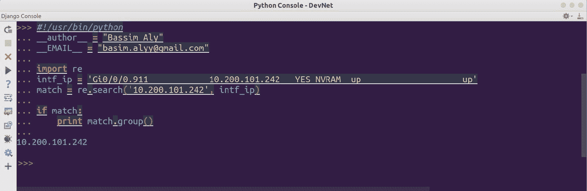

**例 2：匹配 IP 地址模式**

```py
import re
intf_ip = '''Gi0/0/0.705            10.103.17.5      YES NVRAM  up                    up      
Gi0/0/0.900            86.121.75.31  YES NVRAM  up                    up      
Gi0/0/0.911            10.200.101.242   YES NVRAM  up                    up      
Gi0/0/0.7000           unassigned      YES unset  up                    up '''
match = re.search("\d+\.\d+\.\d+\.\d+", intf_ip)

if match:
    print match.group()
```

在本例中，我们可以看到以下内容：

*   `re`模块被导入到我们的 Python 脚本中。
*   我们有一个多行字符串，它对应于接口详细信息，并包含名称、IP 地址和状态。
*   我们将这个字符串连同正则表达式一起传递给了`search()`函数，正则表达式是使用`\d+`和`\.`构建的 IP 地址模式，前者匹配一个或多个数字，后者匹配点的出现。
*   然后，脚本检查是否有上一次操作返回的`match`对象；如果是，它将打印它。否则返回`None`对象。

**示例 2 输出**


请注意，`search()`函数只返回模式的第一个匹配匹配匹配项，而不是所有匹配项。

**例 3：使用****groups（）正则表达式**

如果您有一个长的输出，并且需要从中提取多个字符串，那么您可以用`()`包围提取的值，并在其中写入正则表达式。这称为**捕获组**，用于捕获长字符串中的特定模式，如以下代码段所示：

```py
import re
log_msg = 'Dec 20 12:11:47.417: %LINK-3-UPDOWN: Interface GigabitEthernet0/0/4, changed state to down'
match = re.search("(\w+\s\d+\s\S+):\s(\S+): Interface (\S+), changed state to (\S+)", log_msg)
if match:
    print match.groups()

```

在本例中，我们可以看到以下内容：

*   `re`模块被导入到我们的 Python 脚本中。
*   我们有一个字符串，它对应于路由器中发生的事件，并存储在日志中。
*   我们将这个字符串和正则表达式一起传递给`search()`函数。请注意，我们将时间戳、事件类型、接口名称和捕获组的新状态括起来，并在其中写入正则表达式。
*   然后，脚本检查是否有从上一个操作返回的匹配对象；如果是这样，它将打印它，但这次我们使用了`groups()`而不是`group()`，因为我们正在捕获多个字符串。

**示例 3 输出**

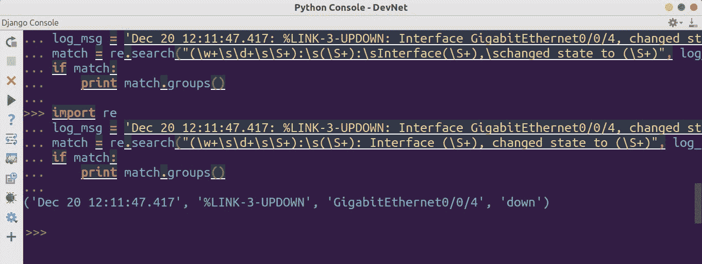

请注意，返回的数据是一种称为**元组**的结构化格式。我们可以稍后使用此输出触发事件并启动（例如）冗余接口上的恢复过程。

We could enhance our previous code and use a `Named` group to give each capture group a name that could be referenced later or used to create a dictionary. In this case, we prefixed our regex with `?P<"NAME">` as in the next example (**Example 4** in the GitHub repository): **Example 4: Named group**


**例 5-1：使用 re.search（）搜索多行** 

假设输出中有多行代码，我们需要对照 regex 模式检查所有代码行。记住，`search()`函数在找到第一个模式匹配时退出。在这种情况下，我们有两种解决方案。第一种方法是通过在`"\n"`上拆分整个字符串，将每一行输入搜索函数，第二种方法是使用`findall()`函数。让我们探讨两种解决方案：

```py

import re

show_ip_int_br_full = """
GigabitEthernet0/0/0        110.110.110.1   YES NVRAM  up                    up      
GigabitEthernet0/0/1        107.107.107.1   YES NVRAM  up                    up      
GigabitEthernet0/0/2        108.108.108.1   YES NVRAM  up                    up      
GigabitEthernet0/0/3        109.109.109.1   YES NVRAM  up                    up      
GigabitEthernet0/0/4   unassigned      YES NVRAM  up                    up      
GigabitEthernet0/0/5             10.131.71.1     YES NVRAM  up                    up      
GigabitEthernet0/0/6          10.37.102.225   YES NVRAM  up                    up      
GigabitEthernet0/1/0            unassigned      YES unset  up                    up      
GigabitEthernet0/1/1           57.234.66.28   YES manual up                    up      
GigabitEthernet0/1/2           10.10.99.70   YES manual up                    up      
GigabitEthernet0/1/3           unassigned      YES manual deleted               down    
GigabitEthernet0/1/4           192.168.200.1   YES manual up                    up      
GigabitEthernet0/1/5   unassigned      YES manual down                  down    
GigabitEthernet0/1/6         10.20.20.1      YES manual down                  down    
GigabitEthernet0/2/0         10.30.40.1      YES manual down                  down    
GigabitEthernet0/2/1         57.20.20.1      YES manual down                  down    

"""
for line in show_ip_int_br_full.split("\n"):
    match = re.search(r"(?P<interface>\w+\d\/\d\/\d)\s+(?P<ip>\d+.\d+.\d+.\d+)", line)
    if match:
        intf_ip = match.groupdict()
        if intf_ip["ip"].startswith("57"):
            print "Subnet is configured on " + intf_ip["interface"] + " and ip is " + intf_ip["ip"]
```

前面的脚本将拆分`show ip interface brief`输出并搜索特定模式，即接口名称和在其上配置的 IP 地址。根据匹配的数据，脚本将继续检查每个 IP 地址并使用`start with 57`进行验证，然后脚本将打印相应的接口和完整的 IP 地址。

**示例 5-1 输出**

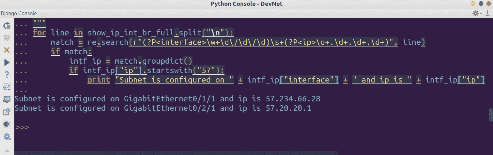

If you're searching only for the first occurrence, you can optimize the script and only get the first result by breaking the outer `for` loop upon locating the first match, but note that the second match won't be located or printed.

**示例 5-2：使用 re.findall（）**搜索多行

`findall()`函数在提供的字符串中搜索所有不重叠的匹配项，并返回一个字符串列表（与`search`函数不同，它返回由正则表达式模式匹配的`match`对象，如果没有捕获组。如果您在正则表达式中包含一个捕获组，`findall()`将返回一个元组列表。在下面的脚本中，我们有相同的多行输出，我们将使用`findall()`方法获取所有配置了以 57 开头的 IP 地址的接口：

```py
import re
from pprint import pprint
show_ip_int_br_full = """
GigabitEthernet0/0/0        110.110.110.1   YES NVRAM  up                    up      
GigabitEthernet0/0/1        107.107.107.1   YES NVRAM  up                    up      
GigabitEthernet0/0/2        108.108.108.1   YES NVRAM  up                    up      
GigabitEthernet0/0/3        109.109.109.1   YES NVRAM  up                    up      
GigabitEthernet0/0/4   unassigned      YES NVRAM  up                    up      
GigabitEthernet0/0/5             10.131.71.1     YES NVRAM  up                    up      
GigabitEthernet0/0/6          10.37.102.225   YES NVRAM  up                    up      
GigabitEthernet0/1/0            unassigned      YES unset  up                    up      
GigabitEthernet0/1/1           57.234.66.28   YES manual up                    up      
GigabitEthernet0/1/2           10.10.99.70   YES manual up                    up      
GigabitEthernet0/1/3           unassigned      YES manual deleted               down    
GigabitEthernet0/1/4           192.168.200.1   YES manual up                    up      
GigabitEthernet0/1/5   unassigned      YES manual down                  down    
GigabitEthernet0/1/6         10.20.20.1      YES manual down                  down    
GigabitEthernet0/2/0         10.30.40.1      YES manual down                  down    
GigabitEthernet0/2/1         57.20.20.1      YES manual down                  down    
"""

intf_ip = re.findall(r"(?P<interface>\w+\d\/\d\/\d)\s+(?P<ip>57.\d+.\d+.\d+)", show_ip_int_br_full)
pprint(intf_ip)

```

**例 5-2 输出**：


请注意，这次我们不必编写`for`循环来对照 regex 模式检查每一行。这将通过`findall()`方法自动完成。

# 使用 CiscoConfParse 进行配置审核

在网络配置中应用正则表达式从输出中获取特定信息需要我们编写一些复杂的表达式来解决一些复杂的用例。在某些情况下，您只需要检索一些配置或修改现有配置，而不必深入编写正则表达式，这就是`CiscoConfParse`库（[的诞生原因 https://github.com/mpenning/ciscoconfparse](https://github.com/mpenning/ciscoconfparse) 。

# CiscoConfParse 库

正如 GitHub 官方页面所说，该库检查 iOS 样式的配置，并将其分解为一组链接的父/子关系。您可以对这些关系执行复杂查询：

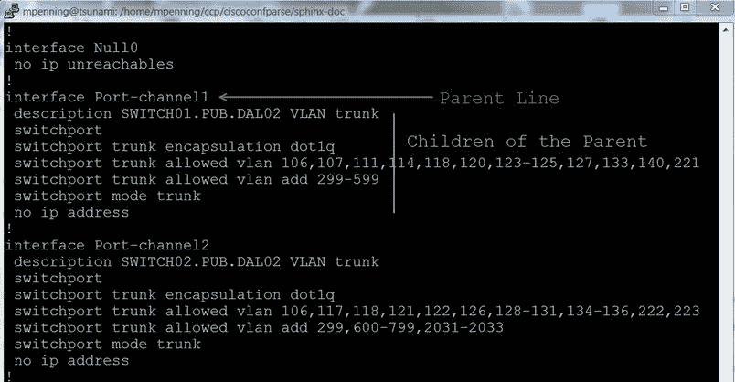

Source: [https://github.com/mpenning/ciscoconfparse](https://github.com/mpenning/ciscoconfparse)

因此，配置的第一行被视为父级，而后续行被视为父级的子级。`CiscoConfparse`库将父级和子级之间的关系构建到一个对象中，这样最终用户就可以轻松检索特定父级的配置，而无需编写复杂的表达式。

It's extremely important that your configuration file is well-formatted in order to build the correct relationship between the parent and child.

如果需要将配置注入文件，同样的概念也适用。库将搜索给定的父级，并将配置插入其下方，并将其保存到新文件中。如果您需要在多个文件上运行配置审核作业，并确保它们都具有一致的配置，这将非常有用。

# 支持的供应商

根据经验，任何具有制表符分隔配置的文件都可以由`CiscoConfParse`解析，它将建立父级和子级关系。

以下是受支持的供应商列表：

*   Cisco IOS、Cisco Nexus、Cisco IOS-XR、Cisco IOS-XE、Aironet OS、Cisco ASA、Cisco CatOS
*   阿里斯塔状态方程
*   锦缎
*   高压交换机
*   强制 10 开关
*   戴尔 PowerConnect 交换机
*   极端网络
*   美国凯创
*   屏风

此外，从版本 1.2.4 开始，`CiscoConfParse`可以处理大括号分隔的配置，这意味着它可以处理以下供应商：

*   Juniper 网络的 Junos
*   Palo Alto 网络防火墙配置
*   F5 网络配置

# CiscoConfParse 安装

可以在 Windows 命令行或 Linux shell 上使用`pip`安装`CiscoConfParse`：

```py
pip install ciscoconfparse
```


请注意，还安装了一些其他依赖项，例如`CiscoConfParse`使用的`ipaddr`、`dnsPython`和`colorama`。

# 与 CiscoConfParse 合作

我们将处理的第一个示例是从名为`Cisco_Config.txt`的文件中的示例 Cisco 配置中提取关机接口。

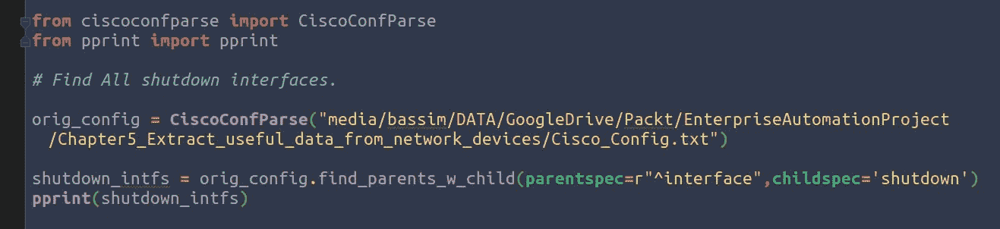

在本例中，我们可以看到以下内容：

*   从`CiscoConfParse`模块中，我们导入了`CiscoConfParse`类。此外，我们还导入了`pprint`模块，以可读格式打印输出，以适应 Python 控制台输出。
*   然后，我们提供了`CiscoConfParse`类的`config`文件完整路径。

*   最后一步是使用一个内置函数，如`find_parents_w_child()`，并提供两个参数。第一个是父规范，它搜索以`interface`关键字开头的任何内容，而子规范有`shutdown`关键字。

如您所见，通过三个简单的步骤，我们可以获得所有包含 shutdown 关键字的接口，并将其输出为结构化列表。

**示例 1 输出**

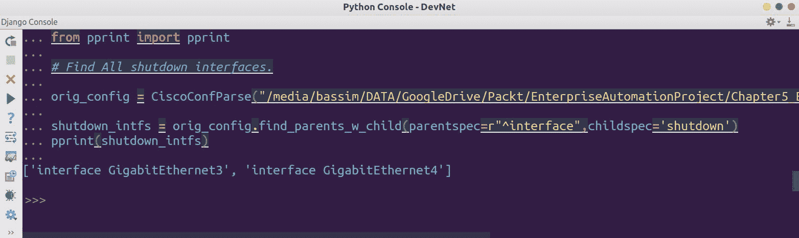

**例 2：检查某一特定特征**的存在性

第二个示例将检查配置文件中是否存在路由器关键字，以指示是否启用了路由协议，例如`ospf`或`bgp`。如果模块找到，则结果为`True`。否则为`False`。这可以通过名为`has_line_with()`的模块内的内置功能实现：

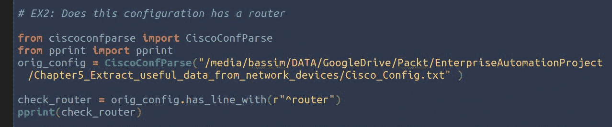

此方法可用于在`if`语句中设计条件，我们将在下一个也是最后一个示例中看到。

**示例 2 输出**


**例 3：从父**打印特定子项：

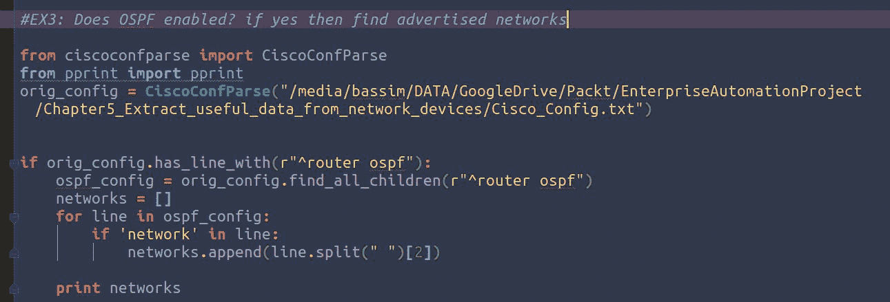

在本例中，我们可以看到以下内容：

*   从`CiscoConfParse`模块中，我们导入了`CiscoConfParse`类。此外，我们还导入了`pprint`模块，以可读格式打印输出，以适应 Python 控制台输出。
*   然后，我们提供了`CiscoConfParse`类的`config`文件完整路径。
*   我们使用了一个内置函数，比如`find_all_children()`，只提供了父函数。这将指示`CiscoConfParse`类列出此父项下的所有配置行。
*   最后，我们迭代返回的输出（记住，这是一个列表），并检查字符串中是否存在网络关键字。如果是，则会将其附加到网络列表中，并在最后打印。

**例 3 输出：**


`CiscoConfParse`模块中还有许多其他功能，可用于轻松从配置文件中提取数据，并以结构化格式返回输出。以下是其他功能的列表：

*   `find_lineage`
*   `find_lines()`
*   `find_all_children()`
*   `find_blocks()`
*   `find_parent_w_children()`
*   `find_children_w_parent()`
*   `find_parent_wo_children()`
*   `find_children_wo_parent()`

# 使用 matplotLib 可视化返回的数据

正如一句老话所说，*一幅画抵得上千言万语*。可以从网络中提取很多信息，例如接口状态、接口计数器、路由器更新、丢包、通信量等等。可视化这些数据并将其放入图表将帮助您了解网络的整体情况。Python 有一个名为**matplotlib**（[的优秀库 https://matplotlib.org/](https://matplotlib.org/) ），用于生成图形并对其进行自定义。

Matplotlib 能够创建大多数类型的图表，如线形图、散点图、条形图、饼图、堆栈图、3D 图和地理地图图。

# Matplotlib 安装

我们将首先使用`pip`从 PYpI 安装库。请注意，一些附加软件包将与 matplotlib 一起安装，例如`numpy`和`six`：

```py
pip install matplotlib
```

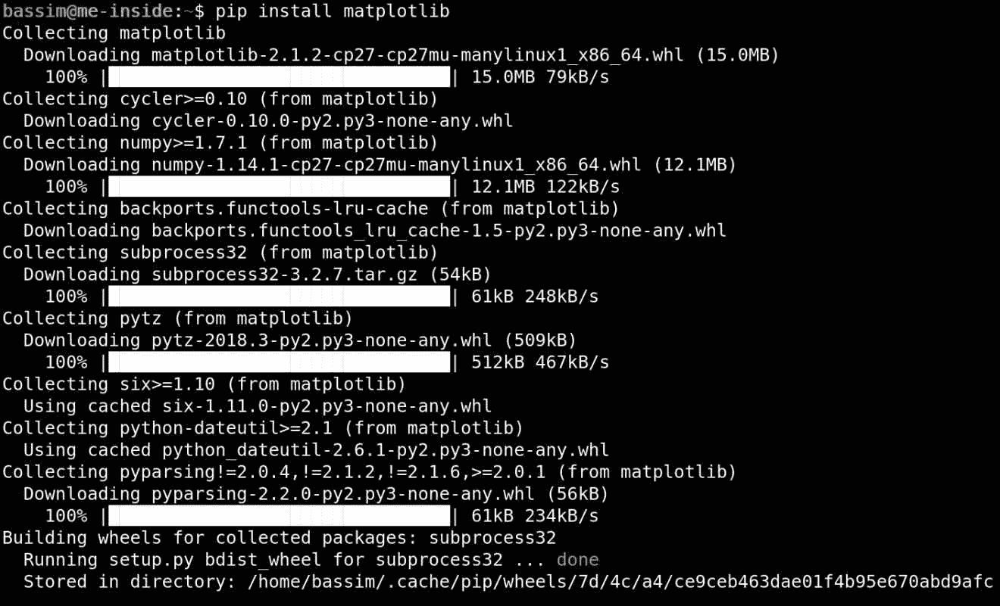

现在尝试导入`matplotlib`，如果没有打印错误，则模块导入成功：


# 使用 matplotlib 动手

我们将从简单的示例开始探索 matplotlib 的功能。我们通常要做的第一件事是将`matplotlib`导入 Python 脚本：

```py
import matplotlib.pyplot as plt
```

注意，我们导入了`pyplot`作为一个短名称`plt`，用于脚本中。现在，我们将使用其中的`plot()`方法来绘制我们的数据，它由两个列表组成。第一个列表代表*x*轴的值，第二个列表代表*y*轴的值：

```py
plt.plot([0, 1, 2, 3, 4], [0, 10, 20, 30, 40])
```

现在，这些值被放到绘图中。

最后一步是使用`show()`方法将绘图显示为窗口：

```py
plt.show()
```

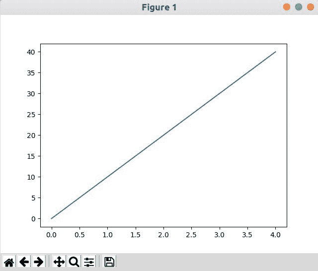

You may need to install `Python-tk` in Ubuntu in order to view the graph. Use `apt install Python-tk`.

生成的图形将显示一条线，表示 x 轴和 y 轴的输入值。在窗口中，可以执行以下操作：

*   使用十字图标移动图形
*   调整图表的大小
*   使用缩放图标放大特定区域
*   使用主视图图标重置为原始视图
*   使用“保存”图标保存地物

通过向生成的地物添加标题并向两个轴添加标签，可以自定义生成的地物。此外，如果同一图表上有多条直线，请添加图例，说明每条直线的含义：

```py
import matplotlib.pyplot as plt
plt.plot([0, 1, 2, 3, 4], [0, 10, 20, 30, 40])
plt.xlabel("numbers")
plt.ylabel("numbers multiplied by ten")
plt.title("Generated Graph\nCheck it out")
plt.show()
```

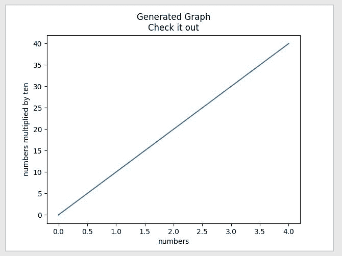

Notice that we usually don't hardcode the plotted values inside the Python script, but we will get them externally from the network, as we will see in the next example.

此外，您可以在同一个图形上绘制多个数据集。您可以将另一个表示数据的列表添加到上一个图形中，`matplotlib`将绘制它。此外，还可以添加标签来区分图形上的数据集。这些标签的图例将使用`legend()`功能打印在图形上：

```py
import matplotlib.pyplot as plt
plt.plot([0, 1, 2, 3, 4], [0, 10, 20, 30, 40], label="First Line")
plt.plot([5, 6, 7, 8, 9], [50, 60, 70, 80, 90], label="Second Line")
plt.xlabel("numbers")
plt.ylabel("numbers multiplied by ten")
plt.title("Generated Graph\nCheck it out")
plt.legend()
plt.show()
```


# 使用 matplotlib 可视化 SNMP

在本用例中，我们将利用`pysnmp`模块向路由器发送 SNMP`GET`请求，检索特定接口的输入和输出流量，并使用`matplotlib`库可视化输出。使用的 OID 为`.1.3.6.1.4.1.9.2.2.1.1.6`和`.1.3.6.1.4.1.9.2.2.1.1.8`，分别代表输入和输出速率：

```py
from pysnmp.entity.rfc3413.oneliner import cmdgen
import time
import matplotlib.pyplot as plt

cmdGen = cmdgen.CommandGenerator()

snmp_community = cmdgen.CommunityData('public')
snmp_ip =  cmdgen.UdpTransportTarget(('10.10.88.110', 161))
snmp_oids = [".1.3.6.1.4.1.9.2.2.1.1.6.3",".1.3.6.1.4.1.9.2.2.1.1.8.3"]

slots = 0
input_rates = []
output_rates = []
while slots <= 50:
    errorIndication, errorStatus, errorIndex, varBinds = cmdGen.getCmd(snmp_community, snmp_ip, *snmp_oids)

    input_rate = str(varBinds[0]).split("=")[1].strip()
    output_rate = str(varBinds[1]).split("=")[1].strip()

    input_rates.append(input_rate)
    output_rates.append(output_rate)

    time.sleep(6)
    slots = slots + 1
    print slots

time_range = range(0, slots)

print input_rates
print output_rates
# plt.figure()
plt.plot(time_range, input_rates, label="input rate")
plt.plot(time_range, output_rates, label="output rate")
plt.xlabel("time slot")
plt.ylabel("Traffic Measured in bps")
plt.title("Interface gig0/0/2 Traffic")

```

```py
plt.legend()
plt.show()
```

在本例中，我们可以看到以下内容：

*   我们从`pysnmp`模块导入`cmdgen`，该模块用于为路由器创建 SNMP`GET`命令。我们还进口了`matplotlib`模块。
*   然后，我们使用`cmdgen`定义 Python 和路由器之间的传输通道属性，并提供 SNMP 社区。
*   `pysnmp`将使用提供的 OID 开始发送 SNMP GET 请求，并将输出和错误（如果有）返回给`errorIndication`、`errorStatus`、`errorIndex`和`varBinds`。我们对`varBinds`感兴趣，因为它包含输入和输出流量率的实际值。
*   请注意，`varBinds`将以`<oid> = <value>`的形式出现，因此我们只提取了该值，并将其添加到之前创建的相应列表中。
*   此操作将以 6 秒的间隔重复 100 次，以收集有用的数据。
*   最后，我们将收集到的数据提供给从`matplotlib`导入的`plt`，并通过提供`xlabel`、`ylabel`、标题和`legends`定制图形：

**脚本输出**：


# 总结

在本章中，我们学习了如何在 Python 中使用不同的工具和技术从返回的输出中提取有用的数据并对其进行操作。此外，我们还使用了一个名为`CiscoConfParse`的特殊库来审核配置，并学习了如何可视化数据以生成吸引人的图形和报告。

在下一章中，我们将学习如何编写模板，并使用 Jinja2 模板语言生成配置。