# 十四、创建和管理 VMware 虚拟机

长期以来，虚拟化一直是 IT 行业的一项重要技术，因为它为硬件资源提供了一种有效的方式，并允许我们在**虚拟机**（**VM**中轻松管理应用程序生命周期。2001 年，VMware 发布了 ESXi 的第一个版本，该版本可以直接在**现货**（**COTS**）**服务器**上运行，同时将其转换为可由多个独立虚拟机使用的资源。在本章中，由于 Python 和 Ansible 的存在，我们将探讨许多可用于自动构建虚拟机的选项。

本章将介绍以下主题：

*   建立实验室环境
*   使用 Jinja2 生成 VMX 文件
*   VMware Python 客户端
*   使用 Ansible 剧本管理实例

# 建立环境

在本章中，我们将在 Cisco UCS 服务器上安装 VMware ESXi 5.5 版，并托管一些虚拟机。为了向外界公开一些外部端口，我们需要在 ESXi 服务器中启用一些功能：

1.  第一件事是启用对 ESXi 控制台的 Shell 和 SSH 访问。基本上，ESXi 允许您使用 vSphere 客户端管理它（对于 5.5.x 之前的版本，基于 C#，对于版本 6 和更高版本，基于 HTML）。一旦我们启用了 Shell 和 SSH 访问，这将使我们能够使用 CLI 管理虚拟基础设施，并执行创建、删除和自定义虚拟机等任务。

2.  访问 ESXi vSphere 客户端并转到配置，然后从左侧选项卡中选择安全配置文件，最后单击属性：


将打开一个弹出窗口，其中包含可应用的服务、状态和各种选项的列表：

3.  选择 SSH 服务，然后单击选项。将打开另一个弹出窗口。
4.  选择第一个选项，该选项将在任何端口打开时自动启动，在启动策略下关闭所有端口时停止。
5.  另外，单击“服务命令”下的“开始”，然后单击“确定”：

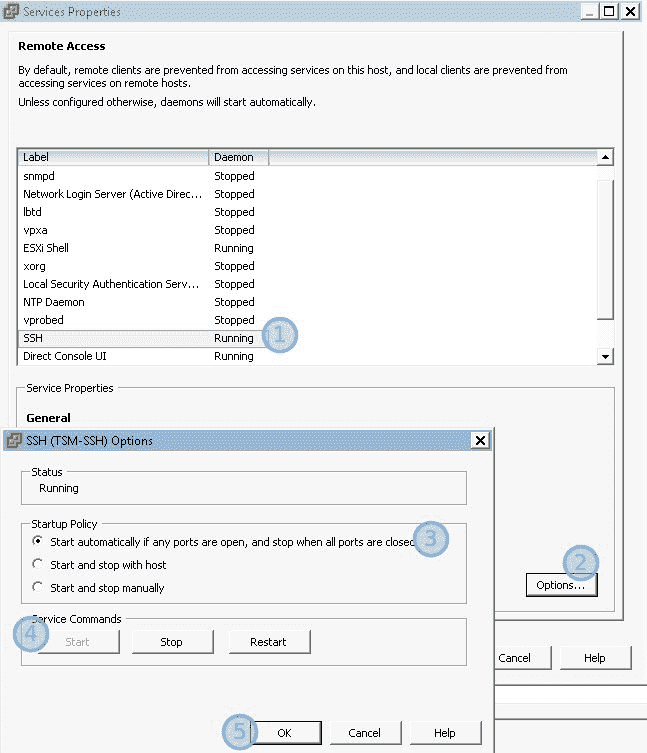

对 ESXi Shell 服务再次重复相同的步骤。这将确保 ESXi 服务器启动后，两个服务都将启动，并将打开并准备好接受连接。您可以测试这两个服务，将 SSH 连接到 ESXi IP 地址，并提供与 SSH 连接相同的根凭据：


# 使用 Jinja2 生成 VMX 文件

虚拟机（有时称为来宾机）的基本单元是 VMX 文件。该文件包含构建虚拟机所需的所有设置，包括计算资源、分配内存、HDD 和网络。此外，它还定义了在机器上运行的操作系统，以便 VMware 可以安装一些工具来管理 VM 供电。

需要一个附加文件：VMDK。此文件存储虚拟机的实际内容，并充当虚拟机分区的硬盘：


这些文件（VMX 和 VMDK）应存储在 ESXi Shell 中的`/vmfs/volumes/datastore1`目录下，并应位于具有虚拟机名称的目录中。

# 构建 VMX 模板

我们现在将创建模板文件，用于用 Python 构建虚拟机。下面是我们需要借助 Python 和 Jinja2 生成的最终运行的 VMX 文件的示例：

```py
.encoding = "UTF-8"
vhv.enable = "TRUE"
config.version = "8"
virtualHW.version = "8"

vmci0.present = "TRUE"
hpet0.present = "TRUE"
displayName = "test_jinja2"

# Specs
memSize = "4096"
numvcpus = "1"
cpuid.coresPerSocket = "1"

# HDD
scsi0.present = "TRUE"
scsi0.virtualDev = "lsilogic"
scsi0:0.deviceType = "scsi-hardDisk"
scsi0:0.fileName = "test_jinja2.vmdk"
scsi0:0.present = "TRUE"

# Floppy
floppy0.present = "false"

#  CDRom
ide1:0.present = "TRUE"
ide1:0.deviceType = "cdrom-image"
ide1:0.fileName = "/vmfs/volumes/datastore1/ISO Room/CentOS-7-x86_64-Minimal-1708.iso"

#  Networking
ethernet0.virtualDev = "e1000"
ethernet0.networkName = "network1"
ethernet0.addressType = "generated"
ethernet0.present = "TRUE"

# VM Type
guestOS = "ubuntu-64"

# VMware Tools
toolScripts.afterPowerOn = "TRUE"
toolScripts.afterResume = "TRUE"
toolScripts.beforeSuspend = "TRUE"
toolScripts.beforePowerOff = "TRUE"
tools.remindInstall = "TRUE"
tools.syncTime = "FALSE"
```

I added some comments inside the file to illustrate the functionality of each block. However, in the actual file, you won't see these comments.

让我们分析文件并理解一些字段的含义：

*   `vhv.enable`：当设置为`True`时，ESXi 服务器将向来宾 CPU 公开 CPU 主机标志，以允许在来宾计算机内运行 VM（称为嵌套虚拟化）。
*   `displayName`：将在 ESXi 中注册并在 vSphere 客户端中显示的名称。
*   `memsize`：定义分配给 VM 的 RAM，以兆字节为单位。
*   `numvcpus`：定义分配给虚拟机的物理 CPU 数量。此标志与`cpuid.coresPerSocket`一起使用，因此它可以定义分配的 vCPU 总数。
*   `scsi0.virtualDev`：虚拟硬盘驱动器的 SCSI 控制器类型。它可以是四个值之一：总线逻辑、LSI 逻辑并行、LSI 逻辑 SAS 或 VMware 虚拟。
*   `scsi0:0.fileName`：定义将存储实际虚拟机设置的`vmdk`（在同一目录中）的名称。
*   `ide1:0.fileName`：包含以 ISO 格式打包的安装二进制文件的映像路径。这将使 ESXi 连接映像 CD-ROM（IDE 设备）中的 ISO 映像。
*   `ethernet0.networkName`：这是 ESXi 中应该连接到 VM NIC 的虚拟交换机的名称。可以添加此参数的其他实例以反映其他网络接口。

现在我们将构建 Jinja2 模板；您可以查看[第 6 章](06.html#318PC0-9cfcdc5beecd470bbeda046372f0337f)、*配置生成器以及 Python 和 Jinja2、*，了解使用 Jinja2 语言进行模板制作的基础知识：

```py
.encoding = "UTF-8"
vhv.enable = "TRUE"
config.version = "8"
virtualHW.version = "8"

vmci0.present = "TRUE"
hpet0.present = "TRUE"
displayName = "{{vm_name}}"

# Specs
memSize = "{{ vm_memory_size }}"
numvcpus = "{{ vm_cpu }}"
cpuid.coresPerSocket = "{{cpu_per_socket}}"

# HDD
scsi0.present = "TRUE"
scsi0.virtualDev = "lsilogic"
scsi0:0.deviceType = "scsi-hardDisk"
scsi0:0.fileName = "{{vm_name}}.vmdk"
scsi0:0.present = "TRUE"

# Floppy
floppy0.present = "false"

# CDRom
ide1:0.present = "TRUE"
ide1:0.deviceType = "cdrom-image"
ide1:0.fileName = "/vmfs/volumes/datastore1/ISO Room/{{vm_image}}"

# Networking
ethernet0.virtualDev = "e1000"
ethernet0.networkName = "{{vm_network1}}"
ethernet0.addressType = "generated"
ethernet0.present = "TRUE"

# VM Type
guestOS = "{{vm_guest_os}}" #centos-64 or ubuntu-64

# VMware Tools
toolScripts.afterPowerOn = "TRUE"
toolScripts.afterResume = "TRUE"
toolScripts.beforeSuspend = "TRUE"
toolScripts.beforePowerOff = "TRUE"
tools.remindInstall = "TRUE"
tools.syncTime = "FALSE"
```

请注意，我们删除了相关字段的静态值，如`diplayName`、`memsize`等，并将其替换为双大括号，其中包含变量名。在从 Python 进行模板呈现期间，这些字段将被替换为实际值，以构造有效的 VMX 文件。

现在，让我们构建呈现文件的 Python 脚本。通常，我们使用 YAML 数据序列化和 Jinja2 来填充模板的数据。但由于我们已经在[第 6 章](https://cdp.packtpub.com/hands_on_enterprise_automation_with_python/wp-admin/post.php?post=295&action=edit#post_33)、*配置生成器以及 Python 和 Jinja2*中解释了 YAML 概念，我们将从另一个数据源 Microsoft Excel 获取数据：

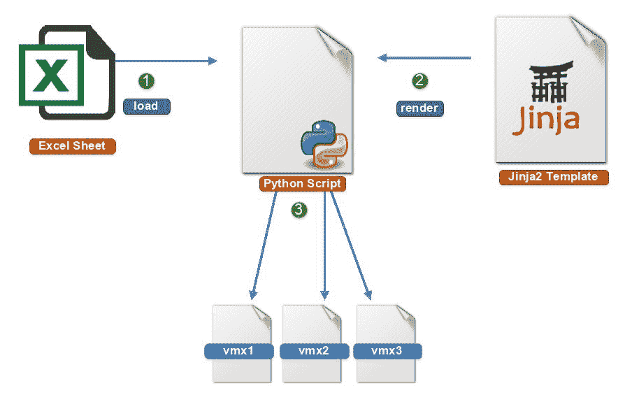

# 处理 Microsoft Excel 数据

Python 有一些优秀的库，可以处理 Excel 工作表中写入的数据。当我们需要自动化`netmiko`配置并读取描述 Excel 文件基础结构的数据时，我们已经在[第 4 章](04.html#1R42S0-9cfcdc5beecd470bbeda046372f0337f)*使用 Python 管理网络设备*中使用了 Excel 表。现在，我们将开始在自动化服务器中安装 Python`xlrd`库。

使用以下命令安装`xlrd`：

```py
pip install xlrd
```

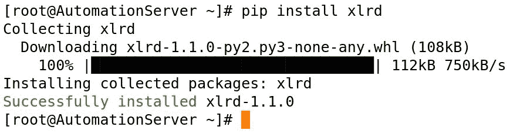

按照以下步骤操作：

1.  XLRD 模块可以打开 Microsoft 工作簿并使用`open_workbook()`方法解析内容。
2.  然后，您可以通过分别向`sheet_by_index()`或`sheet_by_name()`方法提供工作表索引或工作表名称来选择包含数据的工作表。
3.  最后，您可以通过向`row()`函数提供行号来访问行数据，该函数将行数据转换为 Python 列表：


请注意，`nrows`和`ncols`是特殊变量，打开统计表内行数和列数的表后，将填充这些变量。您可以使用`for`循环进行迭代。数字总是从开始

回到虚拟机示例。Excel 工作表中将包含以下数据，这些数据反映了虚拟机设置：


要将数据读入 Python，我们将使用以下脚本：

```py
import xlrd
workbook = xlrd.open_workbook(r"/media/bassim/DATA/GoogleDrive/Packt/EnterpriseAutomationProject/Chapter14_Creating_and_managing_VMware_virtual_machines/vm_inventory.xlsx")
sheet = workbook.sheet_by_index(0)
print(sheet.nrows)
print(sheet.ncols)

print(int(sheet.row(1)[1].value))

for row in range(1,sheet.nrows):
    vm_name = sheet.row(row)[0].value
    vm_memory_size = int(sheet.row(row)[1].value)
    vm_cpu = int(sheet.row(row)[2].value)
    cpu_per_socket = int(sheet.row(row)[3].value)
    vm_hdd_size = int(sheet.row(row)[4].value)
    vm_guest_os = sheet.row(row)[5].value
    vm_network1 = sheet.row(row)[6].value
```

在上一个脚本中，我们执行了以下操作：

1.  我们导入了`xlrd`模块，并将 Excel 文件提供给`open_workbook()`方法来读取 Excel 工作表，并将其保存到`workbook`变量中。
2.  然后，我们使用`sheet_by_index()`方法访问第一张表，并将引用保存到`sheet`变量。

3.  现在，我们将迭代打开的表单，并使用`row()`方法获取每个字段。这将允许我们将该行转换为 Python 列表。因为我们在行中只需要一个值，所以我们将使用列表切片来访问索引。请记住，列表索引始终以零开始。我们将把该值存储到变量中，并在下一节中使用该变量填充 Jinja2 模板。

# 生成 VMX 文件

最后一部分是从 Jinja2 模板生成 VMX 文件。我们将从 Excel 表格中读取数据，并将其添加到空字典`vmx_data`。此字典稍后将传递给 Jinja2 模板中的`render()`函数。Python 字典键将是模板变量名，而值将是文件中应包含的替换值。脚本的最后一部分是在`vmx_files`目录中以写入模式打开一个文件，并将每个 VMX 文件的数据写入其中：

```py

from jinja2 import FileSystemLoader, Environment
import os
import xlrd

print("The script working directory is {}" .format(os.path.dirname(__file__)))
script_dir = os.path.dirname(__file__)

vmx_env = Environment(
    loader=FileSystemLoader(script_dir),
    trim_blocks=True,
    lstrip_blocks= True
)

workbook = xlrd.open_workbook(os.path.join(script_dir,"vm_inventory.xlsx"))
sheet = workbook.sheet_by_index(0)
print("The number of rows inside the Excel sheet is {}" .format(sheet.nrows))
print("The number of columns inside the Excel sheet is {}" .format(sheet.ncols))

vmx_data = {}

for row in range(1,sheet.nrows):
    vm_name = sheet.row(row)[0].value
    vm_memory_size = int(sheet.row(row)[1].value)
    vm_cpu = int(sheet.row(row)[2].value)
    cpu_per_socket = int(sheet.row(row)[3].value)
    vm_hdd_size = int(sheet.row(row)[4].value)
    vm_guest_os = sheet.row(row)[5].value
    vm_network1 = sheet.row(row)[6].value

    vmx_data["vm_name"] = vm_name
    vmx_data["vm_memory_size"] = vm_memory_size
    vmx_data["vm_cpu"] = vm_cpu
    vmx_data["cpu_per_socket"] = cpu_per_socket
    vmx_data["vm_hdd_size"] = vm_hdd_size
    vmx_data["vm_guest_os"] = vm_guest_os
    if vm_guest_os == "ubuntu-64":
        vmx_data["vm_image"] = "ubuntu-16.04.4-server-amd64.iso"

    elif vm_guest_os == "centos-64":
        vmx_data["vm_image"] = "CentOS-7-x86_64-Minimal-1708.iso"

    elif vm_guest_os == "windows7-64":
        vmx_data["vm_image"] = "windows_7_ultimate_sp1_ x86-x64_bg-en_IE10_ April_2013.iso"

    vmx_data["vm_network1"] = vm_network1

    vmx_data = vmx_env.get_template("vmx_template.j2").render(vmx_data)
    with open(os.path.join(script_dir,"vmx_files/{}.vmx".format(vm_name)), "w") as f:
        print("Writing Data of {} into directory".format(vm_name))
        f.write(vmx_data)
    vmx_data = {}

```

脚本输出如下：

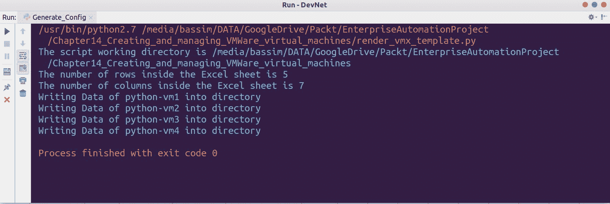

文件存储在`vmx_files`下，每个文件都包含 excel 表中配置的虚拟机的特定信息：


现在，我们将使用`paramiko`和`scp`库连接到 ESXi Shell，并在`/vmfs/volumes/datastore1`下上传这些文件。为了实现这一点，我们将首先创建一个名为`upload_and_create_directory()`的函数，该函数接受`vm name`、`hard disk size`和 VMX`source file`。`paramiko`将连接到 ESXi 服务器并执行所需的命令，该命令将在`/vmfs/volumes/datastore1`下创建目录和 VMDK。最后，我们将使用`scp`模块中的`SCPClient`将源文件上传到之前创建的目录，并运行注册表命令将机器添加到 vSphere 客户端：

```py
#!/usr/bin/python
__author__ = "Bassim Aly"
__EMAIL__ = "basim.alyy@gmail.com"

import paramiko
from scp import SCPClient
import time

def upload_and_create_directory(vm_name, hdd_size, source_file):

    commands = ["mkdir /vmfs/volumes/datastore1/{0}".format(vm_name),
                "vmkfstools -c {0}g -a lsilogic -d zeroedthick /vmfs/volumes/datastore1/{1}/{1}.vmdk".format(hdd_size,
                                                                                                             vm_name),]
    register_command = "vim-cmd solo/registervm /vmfs/volumes/datastore1/{0}/{0}.vmx".format(vm_name)

    ipaddr = "10.10.10.115"
    username = "root"
    password = "access123"

    ssh = paramiko.SSHClient()
    ssh.set_missing_host_key_policy(paramiko.AutoAddPolicy())

    ssh.connect(ipaddr, username=username, password=password, look_for_keys=False, allow_agent=False)

    for cmd in commands:
        try:
            stdin, stdout, stderr = ssh.exec_command(cmd)
            print " DEBUG: ... Executing the command on ESXi server".format(str(stdout.readlines()))

        except Exception as e:
            print e
            pass
            print " DEBUG: **ERR....unable to execute command"
        time.sleep(2)
    with SCPClient(ssh.get_transport()) as scp:
        scp.put(source_file, remote_path='/vmfs/volumes/datastore1/{0}'.format(vm_name))
        ssh.exec_command(register_command)

    ssh.close()
```

我们需要在运行 Jinja2 模板并生成 VMX 之前定义此函数*，在*将文件保存到`vmx_files`目录并将所需参数传递给它之后调用函数*。*

最终代码如下：

```py
#!/usr/bin/python
__author__ = "Bassim Aly"
__EMAIL__ = "basim.alyy@gmail.com"

import paramiko
from scp import SCPClient
import time
from jinja2 import FileSystemLoader, Environment
import os
import xlrd

def upload_and_create_directory(vm_name, hdd_size, source_file):

    commands = ["mkdir /vmfs/volumes/datastore1/{0}".format(vm_name),
                "vmkfstools -c {0}g -a lsilogic -d zeroedthick /vmfs/volumes/datastore1/{1}/{1}.vmdk".format(hdd_size,
                                                                                                             vm_name),]
    register_command = "vim-cmd solo/registervm /vmfs/volumes/datastore1/{0}/{0}.vmx".format(vm_name)

    ipaddr = "10.10.10.115"
    username = "root"
    password = "access123"

    ssh = paramiko.SSHClient()
    ssh.set_missing_host_key_policy(paramiko.AutoAddPolicy())

    ssh.connect(ipaddr, username=username, password=password, look_for_keys=False, allow_agent=False)

    for cmd in commands:
        try:
            stdin, stdout, stderr = ssh.exec_command(cmd)
            print " DEBUG: ... Executing the command on ESXi server".format(str(stdout.readlines()))

        except Exception as e:
            print e
            pass
            print " DEBUG: **ERR....unable to execute command"
        time.sleep(2)
    with SCPClient(ssh.get_transport()) as scp:
        print(" DEBUG: ... Uploading file to the datastore")
        scp.put(source_file, remote_path='/vmfs/volumes/datastore1/{0}'.format(vm_name))
        print(" DEBUG: ... Register the virtual machine {}".format(vm_name))
        ssh.exec_command(register_command)

    ssh.close()

print("The script working directory is {}" .format(os.path.dirname(__file__)))
script_dir = os.path.dirname(__file__)

vmx_env = Environment(
    loader=FileSystemLoader(script_dir),
    trim_blocks=True,
    lstrip_blocks= True
)

workbook = xlrd.open_workbook(os.path.join(script_dir,"vm_inventory.xlsx"))
sheet = workbook.sheet_by_index(0)
print("The number of rows inside the Excel sheet is {}" .format(sheet.nrows))
print("The number of columns inside the Excel sheet is {}" .format(sheet.ncols))

vmx_data = {}

for row in range(1,sheet.nrows):
    vm_name = sheet.row(row)[0].value
    vm_memory_size = int(sheet.row(row)[1].value)
    vm_cpu = int(sheet.row(row)[2].value)
    cpu_per_socket = int(sheet.row(row)[3].value)
    vm_hdd_size = int(sheet.row(row)[4].value)
    vm_guest_os = sheet.row(row)[5].value
    vm_network1 = sheet.row(row)[6].value

    vmx_data["vm_name"] = vm_name
    vmx_data["vm_memory_size"] = vm_memory_size
    vmx_data["vm_cpu"] = vm_cpu
    vmx_data["cpu_per_socket"] = cpu_per_socket
    vmx_data["vm_hdd_size"] = vm_hdd_size
    vmx_data["vm_guest_os"] = vm_guest_os
    if vm_guest_os == "ubuntu-64":
        vmx_data["vm_image"] = "ubuntu-16.04.4-server-amd64.iso"

    elif vm_guest_os == "centos-64":
        vmx_data["vm_image"] = "CentOS-7-x86_64-Minimal-1708.iso"

    elif vm_guest_os == "windows7-64":
        vmx_data["vm_image"] = "windows_7_ultimate_sp1_ x86-x64_bg-en_IE10_ April_2013.iso"

    vmx_data["vm_network1"] = vm_network1

    vmx_data = vmx_env.get_template("vmx_template.j2").render(vmx_data)
    with open(os.path.join(script_dir,"vmx_files/{}.vmx".format(vm_name)), "w") as f:
        print("Writing Data of {} into directory".format(vm_name))
        f.write(vmx_data)
        print(" DEBUG:Communicating with ESXi server to upload and register the VM")
    upload_and_create_directory(vm_name,
                                vm_hdd_size,
                                os.path.join(script_dir,"vmx_files","{}.vmx".format(vm_name)))
    vmx_data = {}
```

脚本输出如下所示：

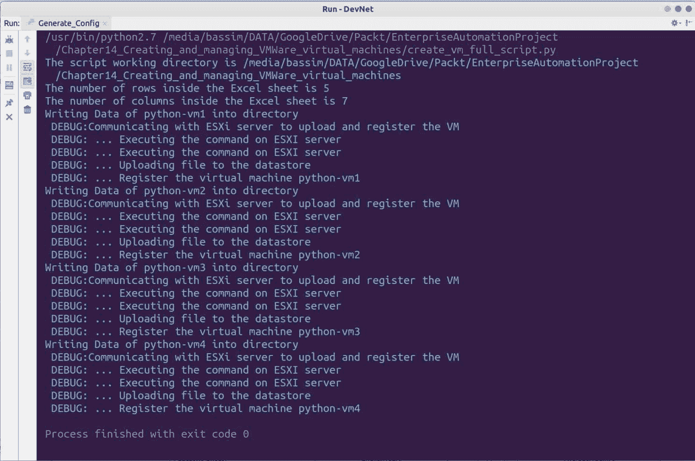

如果在运行脚本后检查 vSphere 客户端，您将发现已使用 Excel 工作表中提供的名称创建了四台计算机：


此外，您还可以找到使用 CPU、内存和连接的 ISO 室等设置定制的虚拟机：

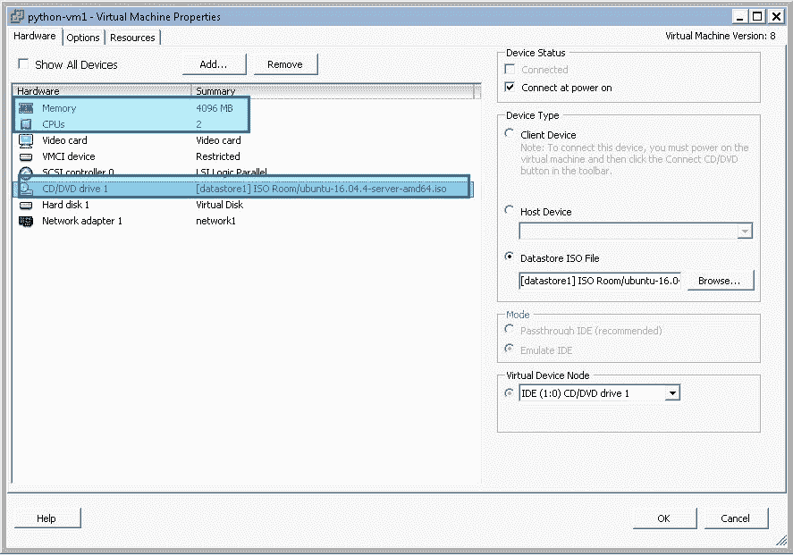

You can complete your automation workflow in VMware by connecting the created virtual machine to Cobbler. We covered it in [Chapter 8](08.html#3EK180-9cfcdc5beecd470bbeda046372f0337f), *Preparing the System Lab Environment*. Cobbler will automate the operating system installation and customization either Windows, CentOS, or Ubuntu. After that, you can use Ansible, which we covered in [Chapter 13](13.html#506UG0-9cfcdc5beecd470bbeda046372f0337f)*, Ansible for System Administration*, to prepare the system in terms of security, configuration, and installed packages, then deploy your application after that. This is a full-stack automation that covers things such as virtual machine creation and getting your application up and running.

# VMware Python 客户端

VMware 产品（用于管理 ESXi 的 ESXi 和 vCenter）支持通过 web 服务接收外部 API 请求。您可以在 vSphere 客户端上执行相同的管理任务，例如创建新的虚拟机、创建新的 vSwitch，甚至控制`vm`状态，但这次是通过支持的 API 执行的，该 API 具有多种语言的绑定，如 Python、Ruby 和 Go。

vSphere 对资源清册有一个特殊的模型，其中的所有内容都是具有特定值的对象。您可以通过**托管对象浏览器**（**MoB**访问所有对象详细信息），访问此模型并查看基础设施的实际值。我们将使用来自 VMware（`pyvmomi`的官方 Python 绑定与此模型交互，并更改（或创建）库存中的值。

值得注意的是，可以通过网络浏览器进入`http://<ESXi_server_ip_or_domain>/mob`，要求您提供 root 用户名和密码：

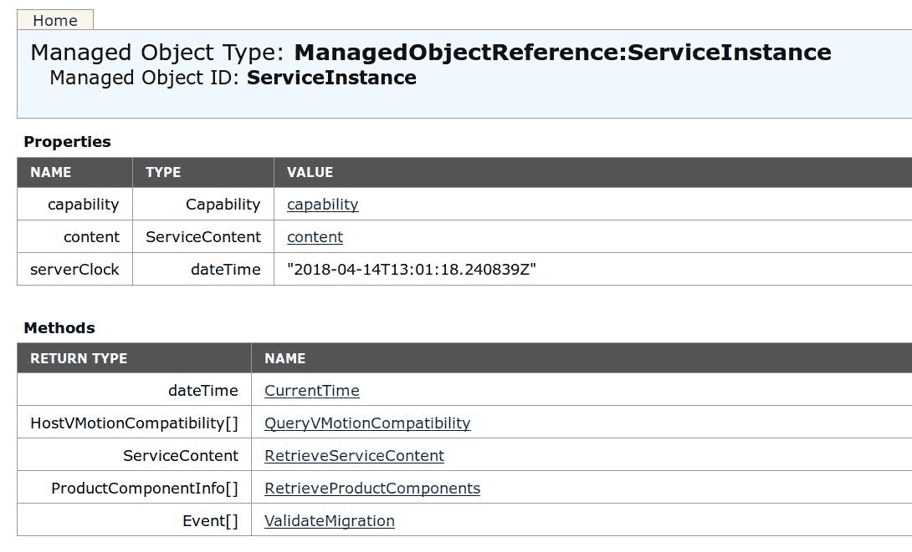

您可以单击任何超链接查看更多详细信息，并访问每个树或上下文中的每个*叶*。例如，单击 Content.about 以查看有关服务器的完整详细信息，如确切版本、版本和全名：

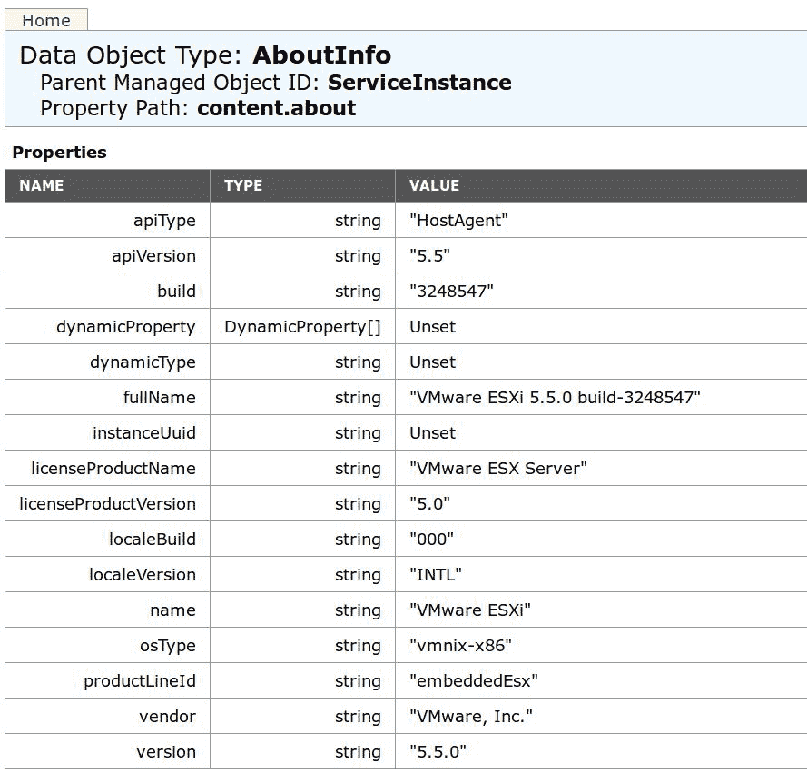

请注意表的结构。第一列包含属性名称，第二列是该属性的数据类型，最后第三列是实际运行的值。

# 安装 PyVmomi

PyVmomi 可以通过 Python`pip`下载，也可以作为系统包从不同的 repo 下载。

对于 Python 安装，请使用以下命令：

```py
pip install -U pyvmomi
```

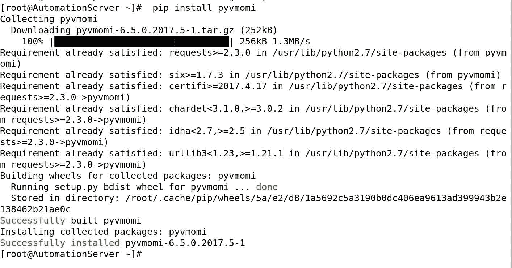

请注意，从`pip`下载的版本是`6.5.2017.5-1`，它与 vSphere 版本 VMware vSphere 6.5 相关，但这并不意味着它不适用于旧版本的 ESXi。例如，我有 VMware vSphere 5.5，它与最新的`pyvmomi`版本完美配合。

对于系统安装：

```py
yum install pyvmomi -y
```

The Pyvmomi library uses dynamic types which means features such as Intelli-Sense and autocomplete features in IDE do not work with it. You have to rely on documentation and MoB to discover what classes or methods are needed to get the job done but, once you discover the way it works, it will be pretty easy to work with.

# pyvmomi 的第一步

首先，您需要通过提供用户名、密码和主机 IP 连接到 ESXi MoB，并开始导航到 MoB 以获取所需数据。这可以通过使用`SmartConnectNoSSL()`方法完成：

```py
from pyVim.connect import SmartConnect, Disconnect,SmartConnectNoSSL
ESXi_connection = SmartConnectNoSSL(host="10.10.10.115", user="root", pwd='access123')
```

请注意，还有另一个名为`SmartConnect()`的方法，在建立连接时必须为其提供 SSL 上下文，否则连接将失败。但是，您可以使用以下代码段请求 SSL 不验证证书，并将此上下文传递给`sslCContext`参数中的`SmartConnect()`：

```py
import ssl
import requests
certificate = ssl.SSLContext(ssl.PROTOCOL_TLSv1)
certificate.verify_mode = ssl.CERT_NONE
requests.packages.urllib3.disable_warnings()

```

为了方便起见并保持代码简短，我们将使用内置的`SmartConnectNoSSL()`。

接下来，我们将开始研究 MoB，并在`about`对象中获取服务器的全名和版本。记住，它位于`content`对象下，所以我们也需要访问它：

```py
#!/usr/bin/python
__author__ = "Bassim Aly"
__EMAIL__ = "basim.alyy@gmail.com"

from pyVim.connect import SmartConnect, Disconnect,SmartConnectNoSSL
ESXi_connection = SmartConnectNoSSL(host="10.10.10.115", user="root", pwd='access123')

full_name = ESXi_connection.content.about.fullName
version = ESXi_connection.content.about.version
print("Server Full name is {}".format(full_name))
print("ESXi version is {}".format(version))
Disconnect(ESXi_connection)

```

结果如下：

****

伟大的现在我们了解了 API 的工作原理。让我们进入一些严肃的脚本，并检索有关 ESXi 中已部署虚拟机的一些详细信息。

脚本如下：

```py
#!/usr/bin/python
__author__ = "Bassim Aly"
__EMAIL__ = "basim.alyy@gmail.com"

from pyVim.connect import SmartConnect, Disconnect,SmartConnectNoSSL

ESXi_connection = SmartConnectNoSSL(host="10.10.10.115", user="root", pwd='access123')

datacenter = ESXi_connection.content.rootFolder.childEntity[0] #First Datacenter in the ESXi\

virtual_machines = datacenter.vmFolder.childEntity #Access the child inside the vmFolder

print virtual_machines

for machine in virtual_machines:
    print(machine.name)
    try:
        guest_vcpu = machine.summary.config.numCpu
        print("  The Guest vCPU is {}" .format(guest_vcpu))

        guest_os = machine.summary.config.guestFullName
        print("  The Guest Operating System is {}" .format(guest_os))

        guest_mem = machine.summary.config.memorySizeMB
        print("  The Guest Memory is {}" .format(guest_mem))

        ipadd = machine.summary.guest.ipAddress
        print("  The Guest IP Address is {}" .format(ipadd))
        print "================================="
    except:
        print("  Can't get the summary")
```

在上一个示例中，我们执行了以下操作：

1.  通过向`SmartConnectNoSSL`方法提供 ESXi/vCenter 凭据，我们再次建立了与 MoB 的 API 连接。
2.  然后，我们通过访问`content`然后是`rootFolder`对象，最后是`childEntity`对象来访问数据中心对象。返回的对象是 iterable，因此我们访问了第一个元素（第一个数据中心），因为实验室中只有一个 ESXi。您可以遍历所有数据中心，以获得所有注册数据中心中所有虚拟机的列表。
3.  可以通过`vmFolder`和`childEntity`访问虚拟机。同样，请记住，返回的输出是可迭代的，表示存储在`virtual_machines`变量中的虚拟机列表：


4.  我们迭代了`virtual_machines`对象，并查询每个元素（对于每个虚拟机）的 CPU、内存、全名和 IP 地址。这些元素位于`summary`和`config`叶中的每个虚拟机树下。以下是我们的`AutomationServer`设置示例：

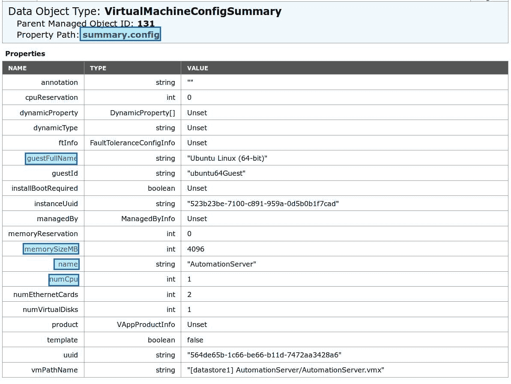

脚本输出如下所示：

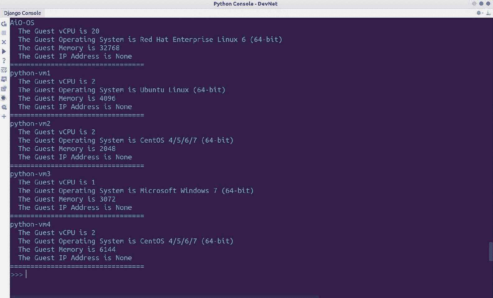

Note that the `python-vm` machines that we created early at the beginning of the chapter are printed in the last screenshot. You can use PyVmomi as a validation tool that integrates with your automation workflow to validate whether machines are up and running and to make decisions based on the returned output.

# 更改虚拟机状态

这次我们将使用`pyvmomi`绑定来更改虚拟机状态。这将通过检查虚拟机名称来完成，就像我们以前做的那样；然后，我们将导航到 MoB 中的另一棵树并获取运行时状态。最后，我们将根据机器的当前状态在机器上应用`PowerOn()`或`PowerOff()`功能。这会将机器状态从`On`切换到`Off`，反之亦然。

脚本如下：

```py
#!/usr/bin/python
__author__ = "Bassim Aly"
__EMAIL__ = "basim.alyy@gmail.com"

from pyVim.connect import SmartConnect, Disconnect,SmartConnectNoSSL

ESXi_connection = SmartConnectNoSSL(host="10.10.10.115", user="root", pwd='access123')

datacenter = ESXi_connection.content.rootFolder.childEntity[0] #First Datacenter in the ESXi\

virtual_machines = datacenter.vmFolder.childEntity #Access the child inside the vmFolder

for machine in virtual_machines:
    try:
        powerstate = machine.summary.runtime.powerState
        if "python-vm" in machine.name and powerstate == "poweredOff":
            print(machine.name)
            print("     The Guest Power state is {}".format(powerstate))
            machine.PowerOn()
            print("**Powered On the virtual machine**")

        elif "python-vm" in machine.name and powerstate == "poweredOn":
            print(machine.name)
            print("     The Guest Power state is {}".format(powerstate))
            machine.PowerOff()
            print("**Powered Off the virtual machine**")
    except:
        print("  Can't execute the task")

Disconnect(ESXi_connection)
```

脚本输出如下所示：


此外，您还可以从 vSphere 客户端验证虚拟机状态，并检查以`python-vm*`开头的主机，将其电源状态从`poweredOff`更改为`poweredOn`：


# 还有更多

您可以在 GitHub 的官方 VMware 存储库（[中找到许多基于`pyvmomi`绑定（不同语言）的有用脚本 https://github.com/vmware/pyvmomi-community-samples/tree/master/samples](https://github.com/vmware/pyvmomi-community-samples/tree/master/samples) 。脚本由许多使用这些工具并每天对其进行测试的贡献者提供。大多数脚本都提供了输入配置（如 ESXi IP 地址和凭据）的空间，而无需通过提供参数来修改脚本源代码。

# 使用 Ansible playbook 管理实例

在 VMware automation 的最后一部分中，我们将使用 Ansible 工具来管理 VMware 基础架构。Ansible 附带 20 多个 VMware 模块（[http://docs.ansible.com/ansible/latest/modules/list_of_cloud_modules.html#vmware](http://docs.ansible.com/ansible/latest/modules/list_of_cloud_modules.html#vmware) ），它可以执行许多任务，例如管理数据中心、群集和虚拟机。在较早的 Ansible 版本中，Ansible 使用`pysphere`模块（这不是官方的；该模块的作者自 2013 年以来就没有维护过）来自动化任务。但是，较新的版本现在支持`pyvmomi`绑定。

Ansible also supports the VMware SDN product (NSX). Ansible Tower can be accessed from **VMware vRealize Automation** (**vRA**), which allows for complete workflow integration between different tools.

以下是 Ansible 的剧本：

```py
- name: Provision New VM
  hosts: localhost
  connection: local
  vars:
    - VM_NAME: DevOps
    - ESXi_HOST: 10.10.10.115
    - USERNAME: root
    - PASSWORD: access123
  tasks:
    - name: current time
      command: date +%D
      register: current_time

    - name: Check for vSphere access parameters
      fail: msg="Must set vsphere_login and vsphere_password in a Vault"
      when: (USERNAME is not defined) or (PASSWORD is not defined)

    - name: debug vCenter hostname
      debug: msg="vcenter_hostname = '{{ ESXi_HOST }}'"

    - name: debug the time
      debug: msg="Time is = '{{ current_time }}'"

    - name: "Provision the VM"
      vmware_guest:
        hostname: "{{ ESXi_HOST }}"
        username: "{{ USERNAME }}"
        password: "{{ PASSWORD }}"
        datacenter: ha-datacenter
        validate_certs: False
        name: "{{ VM_NAME }}"
        folder: /
        guest_id: centos64Guest
        state: poweredon
        force: yes
        disk:
          - size_gb: 100
            type: thin
            datastore: datastore1

        networks:
          - name: network1
            device_type: e1000
#            mac: ba:ba:ba:ba:01:02
#            wake_on_lan: True

          - name: network2
            device_type: e1000

        hardware:
          memory_mb: 4096
          num_cpus: 4
          num_cpu_cores_per_socket: 2
          hotadd_cpu: True
          hotremove_cpu: True
          hotadd_memory: True
          scsi: lsilogic

        cdrom:
          type: "iso"
          iso_path: "[datastore1] ISO Room/CentOS-7-x86_64-Minimal-1708.iso"
      register: result

```

在前面的剧本中，我们可以看到以下内容：

*   剧本的第一部分是在`vars`部分定义 ESXi 主机 IP 和凭证，并在以后的任务中使用它们。
*   然后，我们编写了一个简单的验证，如果没有提供用户名或密码，就无法通过 playbook。

*   然后，我们使用 ansible 提供的`vmware_guest`模块（[https://docs.ansible.com/ansible/2.4/vmware_guest_module.html](https://docs.ansible.com/ansible/2.4/vmware_guest_module.html) 配置虚拟机。在这个任务中，我们提供了所需的信息，比如磁盘大小以及 CPU 和内存方面的硬件。请注意，我们将虚拟机的状态定义为`poweredon`，因此 ansible 将在创建虚拟机后启动虚拟机。
*   磁盘、网络、硬件和 CD-ROM 都是`vmware_guest`模块中的关键，用于描述通过 VMware ESXi 生成新 VM 所需的虚拟化硬件规格。

使用以下命令运行 playbook：

```py
# ansible-playbook esxi_create_vm.yml -vv
```

以下是剧本输出的屏幕截图：

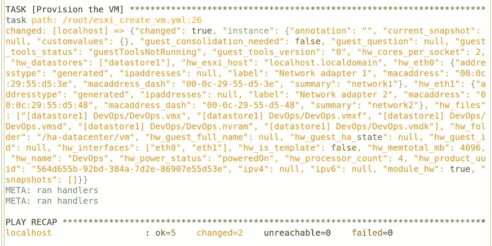

您可以使用 vSphere 客户端中的 CentOS ISO 文件验证虚拟机的创建和绑定：

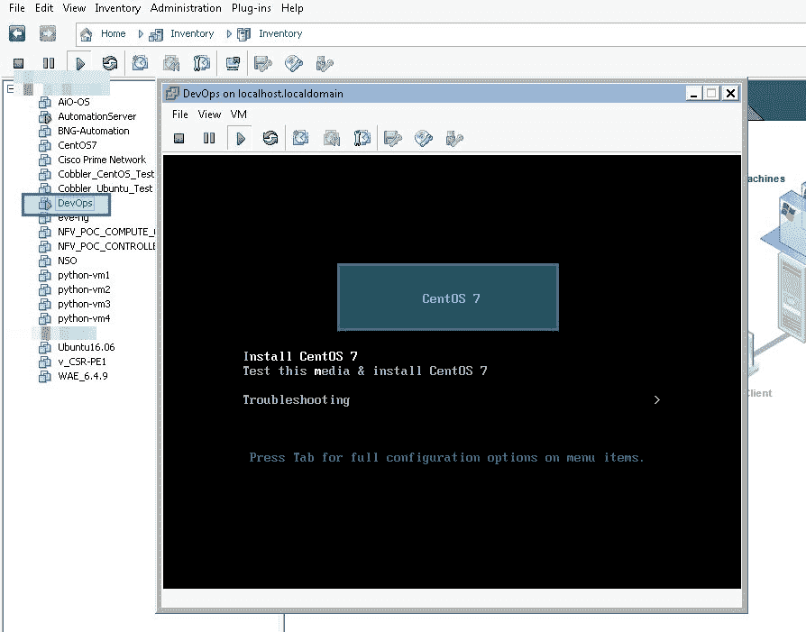

您还可以更改现有虚拟机的状态，并通过更改剧本中`state`中的值从`poweredon`、`poweredoff`、`restarted`、`absent`、`suspended`、`shutdownguest`和`rebootguest`中进行选择。

# 总结

VMware 产品广泛用于 IT 基础架构中，为运行应用程序和工作负载提供虚拟化环境。同时，VMware 还提供了多种语言的 API 绑定，可用于自动化管理任务。在下一章中，我们将探索另一个名为 OpenStack 的虚拟化框架，该框架依赖于 Red Hat 的 KVM 虚拟机监控程序。