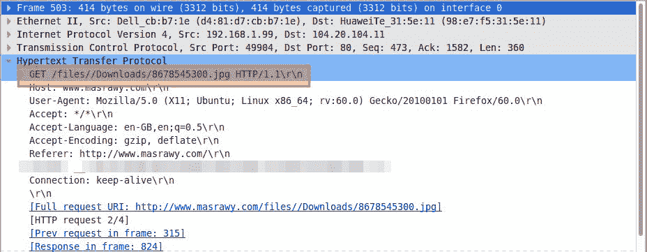
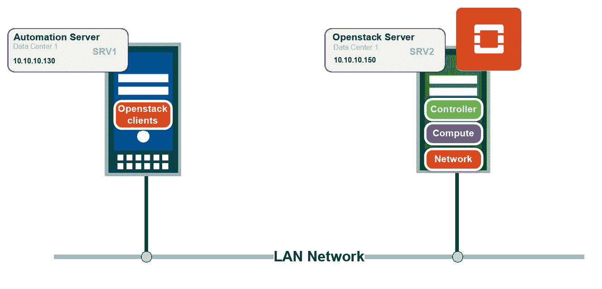
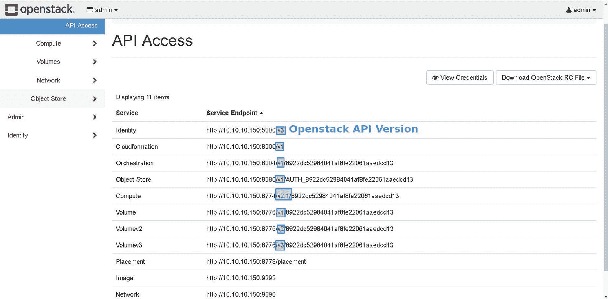
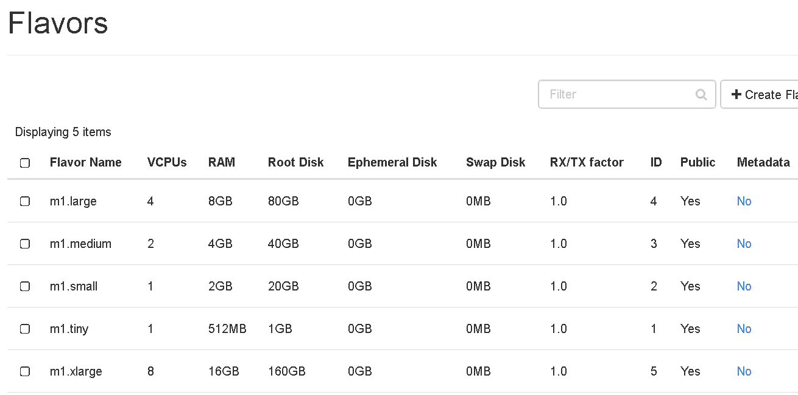
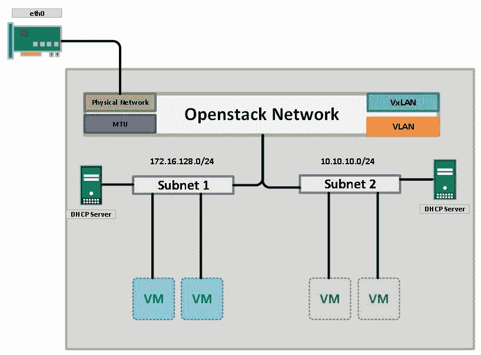
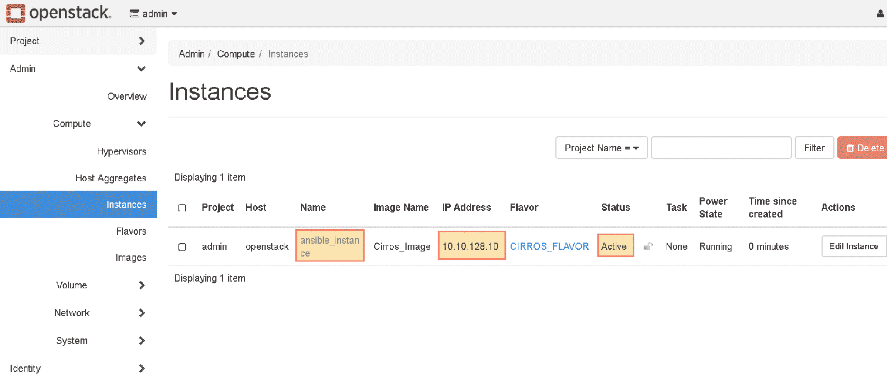

# 十五、与 OpenStack API 交互

长期以来，IT 基础架构依靠商业软件（来自 VMWare、Microsoft 和 Citrix 等供应商）来提供虚拟环境以运行工作负载和管理资源（如计算、存储和网络）。然而，IT 行业正在向云时代迈进，工程师们正在将工作负载和应用程序迁移到云（公共或私有），这需要一个能够管理所有应用程序资源的新框架，提供一个开放和健壮的 API 接口，以与来自其他应用程序的外部调用交互。

OpenStack 提供了一个开放的访问和集成来管理您的所有计算、存储和网络资源，避免了在构建云时被供应商锁定。它可以控制大量计算节点、存储阵列和网络设备，而不考虑每个资源的供应商，并在所有资源之间提供无缝集成。OpenStack 的核心思想是将应用于底层基础设施的所有配置抽象为一个*项目*，该项目负责管理资源。因此，您将发现一个管理计算资源的项目（称为 Nova），另一个为实例（中子）提供网络的项目，以及一个与不同存储类型（Swift 和 Cinder）交互的项目。

您可以在此链接中找到当前 OpenStack 项目的完整列表

[https://www.OpenStack.org/software/project-navigator/](https://www.openstack.org/software/project-navigator/)

OpenStack 还为应用程序开发人员和系统管理员提供统一的 API 访问，以协调资源创建。

在本章中，我们将探索 OpenStack 的新的开放世界，并将学习如何利用 Python 和 Ansible 与之交互。

本章将介绍以下主题：

*   理解 RESTful web 服务
*   建立环境
*   向 OpenStack 发送请求
*   从 Python 创建工作负载
*   使用 Ansible 管理 OpenStack 实例

# 理解 RESTful web 服务

**代表性状态传输**（**REST**）依赖 HTTP 协议在客户端和服务器之间传输消息。HTTP 最初设计用于在请求时将 HTML 页面从 web 服务器（服务器）传递到浏览器（客户端）。页面表示用户想要访问的一组资源，由**通用资源标识符**（**URI**请求）。

HTTP 请求通常包含一个方法，该方法指示需要在资源上执行的操作类型。例如，从浏览器访问网站时，您可以看到（在下面的屏幕截图中）该方法为`GET`：



以下是最常见的 HTTP 方法及其用法：

| 

HTTP 方法

 | 

行动

 |
| `GET` | 客户端将要求服务器检索资源。 |
| `POST` | 客户端将指示服务器创建新资源。 |
| `PUT` | 客户端将要求服务器修改/更新资源。 |
| `DELETE` | 客户端将要求服务器删除该资源。 |

应用程序开发人员可以公开其应用程序的某些资源，供外部世界的客户端使用。将请求从客户端传送到服务器并返回响应的传输协议是 HTTP。它负责保护通信安全，并使用服务器接受的适当数据编码机制对数据包进行编码，这是一种跨这两种机制的无状态通信。

另一方面，数据包有效负载通常用 XML 或 JSON 编码，以表示服务器处理的请求的结构以及客户机希望返回响应的方式。

世界上有许多公司为开发人员提供对其数据的实时公开访问。例如，Twitter API（[https://developer.twitter.com/](https://developer.twitter.com/) 提供实时数据获取，允许其他开发者在第三方应用程序（如广告、搜索和营销）中使用数据。谷歌（[等大公司也是如此 https://developers.google.com/apis-explorer/#p/discovery/v1/](https://developers.google.com/apis-explorer/#p/discovery/v1/) 、LinkedIn（[https://developer.linkedin.com/](https://developer.linkedin.com/) 、Facebook（[https://developers.facebook.com/](https://developers.facebook.com/) 。

Public access to APIs is usually limited to a specific number of requests, either per hour of per day, for a single application, in order to not overwhelm the public resources.

Python 提供了大量的工具和库来使用 API、编码消息和解析响应。例如，Python 有一个`requests`包，可以格式化 HTTP 请求并将其发送到外部资源。此外，它还提供了以 JSON 格式解析响应并将其转换为 Python 标准字典的工具。

Python 还有许多框架可以将您的资源公开给外部世界。`Django`和`Flask`是最好的，作为全栈框架。

# 建立环境

OpenStack 是一个免费的开源项目，与**基础设施即服务**（**IaaS**一起使用，它可以控制 CPU、内存和存储方面的硬件资源，并为许多供应商构建和集成插件提供一个开放的框架。

为了建立我们的实验室，我将使用最新的`OpenStack-rdo`版本（撰写本文时），Queens，并将其安装到 CentOS 7.4.1708 上。安装步骤非常简单，可以在[找到 https://www.rdoproject.org/install/packstack/](https://www.rdoproject.org/install/packstack/) 。

我们的环境由一台具有 100 GB 存储、12 个 vCPU 和 32 GB RAM 的机器组成，该服务器将在同一台服务器上包含 OpenStack 控制器、计算和中子角色。OpenStack 服务器连接到与我们的自动化服务器位于同一子网中的同一交换机。请注意，在生产环境中并不总是这样，但您需要确保运行 Python 代码的服务器可以访问 OpenStack。

实验室拓扑结构如下所示：



# 安装 rdo OpenStack 包

在 RHEL 7.4 和 CentOS 上安装 rdo OpenStack 的步骤如下：

# 关于 RHEL 7.4

首先，确保您的系统是最新的，然后从网站安装`rdo-release.rpm`以获得最新版本。最后，安装将自动化 OpenStack 安装的`OpenStack-packstack`包，如以下代码段所示：

```py
$ sudo yum install -y https://www.rdoproject.org/repos/rdo-release.rpm
$ sudo yum update -y
$ sudo yum install -y OpenStack-packstack
```

# 在 CentOS 7.4 上

首先，确保您的系统是最新的，然后安装 rdoproject 以获得最新版本。最后，安装将自动安装 OpenStack 的`centos-release-OpenStack-queens`包，如以下代码段所示：

```py
$ sudo yum install -y centos-release-OpenStack-queens
$ sudo yum update -y
$ sudo yum install -y OpenStack-packstack
```

# 生成应答文件

现在，您需要生成包含部署参数的应答文件。这些参数中的大多数默认值都很好，但我们将更改一些内容：

```py
# packstack --gen-answer-file=/root/EnterpriseAutomation
```

# 编辑应答文件

使用您喜爱的编辑器编辑`EnterpriseAutomtion`文件，并更改以下内容：

```py
CONFIG_DEFAULT_PASSWORD=access123 CONFIG_CEILOMETER_INSTALL=n CONFIG_AODH_INSTALL=n CONFIG_KEYSTONE_ADMIN_PW=access123 CONFIG_PROVISION_DEMO=n 
```

`CELIOMETER`和`AODH`是 OpenStack 生态系统中的可选项目，在实验室环境中可以忽略。

我们还设置了一个`KEYSTONE`密码，用于生成临时令牌，以便使用 API 访问资源，还用于访问 OpenStack GUI

# 运行 packstack

保存文件并通过`packstack`运行安装：

```py
# packstack answer-file=EnterpriseAutomation
```

此命令将从 Queens 存储库下载包并安装 OpenStack 服务，然后启动它们。安装成功完成后，控制台上将打印以下消息：

```py
 **** Installation completed successfully ******

Additional information:
 * Time synchronization installation was skipped. Please note that unsynchronized time on server instances might be problem for some OpenStack components.
 * File /root/keystonerc_admin has been created on OpenStack client host 10.10.10.150\. To use the command line tools you need to source the file.
 * To access the OpenStack Dashboard browse to http://10.10.10.150/dashboard .
Please, find your login credentials stored in the keystonerc_admin in your home directory.
 * The installation log file is available at: /var/tmp/packstack/20180410-155124-CMpsKR/OpenStack-setup.log
 * The generated manifests are available at: /var/tmp/packstack/20180410-155124-CMpsKR/manifests
```

# 访问 OpenStack GUI

您现在可以使用`http://<server_ip_address>/dashboard`访问 OpenStack GUI。凭证将是 admin 和 access123（取决于您在前面步骤的`CONFIG_KEYSTONE_ADMIN_PW`中所写的内容）：


我们的云现在已经启动并运行，准备接收请求。

# 向 OpenStack keystone 发送请求

OpenStack 包含服务集合，这些服务共同管理虚拟机**创建、读取、更新和删除**（**CRUD**操作。每个服务都可以公开其资源以供外部请求使用。例如，`nova`服务负责生成虚拟机并充当虚拟机监控程序层（尽管它本身不是虚拟机监控程序，但它可以控制其他虚拟机监控程序，如 KVM 和 vSphere）。另一个服务是`glance`，负责以 ISO 或 qcow2 格式托管实例映像。`neutron`服务负责为产生的实例提供网络服务，并确保位于不同租户（项目）上的实例彼此隔离，而相同租户上的实例可以通过覆盖网络（VxLAN 或 GRE）相互联系。

为了访问前面每个服务的 API，您需要有一个在特定时间段内使用的经过身份验证的令牌。这就是`keystone`的角色，它提供身份服务并管理每个用户的角色和权限。

首先，我们需要在自动化服务器上安装 Python 绑定。这些绑定包含用于访问每个服务和使用 KEYSTONE 生成的令牌验证请求的 python 代码。绑定还包含每个项目支持的操作（如创建/删除/更新/列表）：

```py
yum install -y gcc openssl-devel python-pip python-wheel
pip install python-novaclient
pip install python-neutronclient
pip install python-keystoneclient
pip install python-glanceclient
pip install python-cinderclient
pip install python-heatclient
pip install python-OpenStackclient
```

Note that the Python client name is `python-<service_name>client`

您可以下载到站点的全局包或 Python`virtualenv`环境中。然后，您将需要 OpenStack 管理员权限，该权限可在 OpenStack 服务器内的以下路径中找到：

```py
cat /root/keystonerc_admin
unset OS_SERVICE_TOKEN
export OS_USERNAME=admin
export OS_PASSWORD='access123'
export OS_AUTH_URL=http://10.10.10.150:5000/v3
export PS1='[\u@\h \W(keystone_admin)]\$ '

export OS_PROJECT_NAME=admin
export OS_USER_DOMAIN_NAME=Default
export OS_PROJECT_DOMAIN_NAME=Default
export OS_IDENTITY_API_VERSION=3
```

请注意，当我们与 OpenStack keystone 服务通信时，我们将在`OS_AUTH_URL`和`OS_IDENTITY_API_VERSION`参数中使用 keystone 版本 3。大多数 Python 客户端都与旧版本兼容，但需要稍微更改脚本。令牌生成过程中还需要其他参数，因此请确保您有权访问`keystonerc_admin`文件。访问凭证也可以在同一文件的`OS_USERNAME`和`OS_PASSWORD`中找到

我们的 Python 脚本如下所示：

```py
from keystoneauth1.identity import v3
from keystoneauth1 import session

auth = v3.Password(auth_url="http://10.10.10.150:5000/v3",
                   username="admin",
                   password="access123",
                   project_name="admin",
                   user_domain_name="Default",
                   project_domain_name="Default")
sess = session.Session(auth=auth, verify=False)
print(sess)

```

在前面的示例中，以下内容适用：

*   `python-keystoneclient`使用`v3`类（反映 keystone API 版本）向 keystone API 发出请求。此类课程在`keystoneayth1.identity`中提供。
*   然后，我们将取自`keystonerc_admin`文件的完整凭证提供给`auth`变量。
*   最后，我们使用 keystone 客户端中的会话管理器建立了会话。请注意，我们将`verify`设置为`False`，因为我们不使用证书来生成令牌。否则，您可以提供证书路径。
*   生成的令牌可用于任何服务，它将持续一小时，然后过期。此外，如果更改用户角色，令牌将立即过期，而无需等待一小时。

OpenStack administrators can configure the `admin_token` field inside the `/etc/keystone/keystone.conf` file, which never expires. However, this is not recommended in a production environment, for security reasons.

如果您不想在 Python 脚本中存储凭据，可以将它们存储在`ini`文件中，并使用`configparser`模块加载它们。首先，在 automation server 中创建一个`creds.ini`文件，并赋予它相应的 Linux 权限，这样它只能用您自己的帐户打开：

```py
#vim /root/creds.ini [os_creds]
auth_url="http://10.10.10.150:5000/v3"
username="admin"
password="access123"
project_name="admin"
user_domain_name="Default"
project_domain_name="Default"
```

修改后的脚本如下所示：

```py
from keystoneauth1.identity import v3
from keystoneauth1 import session
import ConfigParser
config = ConfigParser.ConfigParser()
config.read("/root/creds.ini")
auth = v3.Password(auth_url=config.get("os_creds","auth_url"),
                   username=config.get("os_creds","username"),
                   password=config.get("os_creds","password"),
                   project_name=config.get("os_creds","project_name"),
                   user_domain_name=config.get("os_creds","user_domain_name"),
                   project_domain_name=config.get("os_creds","project_domain_name"))
sess = session.Session(auth=auth, verify=False)
print(sess)

```

`configparser`模块将解析`creds.ini`文件并查看文件中的`os_creds`部分。然后，使用`get()`方法得到每个参数前面的值。

`config.get()`方法将接受两个参数。第一个参数是`.ini`文件中的节名，第二个参数是参数名。该方法将返回与参数关联的值。

此方法应为您的云凭据提供额外的安全性。另一种保护文件安全的有效方法是使用 Linux`source`命令将`keystonerc_admin`文件加载到环境变量中，并使用`os`模块内部的`environ()`方法读取凭证。

# 从 Python 创建实例

要使实例启动并运行，OpenStack 实例需要三个组件。启动映像（由`glance`提供）、网络端口（由`neutron`提供），最后是定义 CPU 数量、将分配给实例的 RAM 数量和磁盘大小的计算风格。风味由`nova`项目提供。

# 创建图像

我们将首先下载一个`cirros`映像到自动化服务器。`cirros`是一个基于 Linux 的轻量级映像，世界各地的许多 OpenStack 开发人员和测试人员使用它来验证 OpenStack 服务的功能：

```py
#cd /root/ ; wget http://download.cirros-cloud.net/0.4.0/cirros-0.4.0-x86_64-disk.img
```

然后，我们将使用`glanceclient`将图像上传到 OpenStack 图像存储库。请注意，我们首先需要有 keystone 令牌和 session 参数，以便与`glance`通信，否则`glance`将不接受我们的任何 API 请求。

脚本如下：

```py
from keystoneauth1.identity import v3
from keystoneauth1 import session
from glanceclient import client as gclient
from pprint import pprint

auth = v3.Password(auth_url="http://10.10.10.150:5000/v3",
                   username="admin",
                   password="access123",
                   project_name="admin",
                   user_domain_name="Default",
                   project_domain_name="Default")

sess = session.Session(auth=auth, verify=False)

#Upload the image to the Glance
glance = gclient.Client('2', session=sess)

image = glance.images.create(name="CirrosImage",
                             container_format='bare',
                             disk_format='qcow2',
                             )

glance.images.upload(image.id, open('/root/cirros-0.4.0-x86_64-disk.img', 'rb'))

```

在前面的示例中，以下内容适用：

*   由于我们正在与`glance`（图像托管项目）通信，我们将从安装的`glanceclient`模块导入`client`。
*   用于生成保存密钥石令牌的`sess`的密钥石脚本相同。
*   我们创建了 glance 参数，该参数使用`glance`初始化客户机管理器，并提供版本（`version 2`和生成的令牌。
*   您可以通过访问 OpenStack GUI | API 访问选项卡查看所有受支持的 API 版本，如下面的屏幕截图所示。请注意每个项目的支持版本。



*   Gliance 客户端管理器设计用于在 Gliance OpenStack 服务上运行。指示管理器创建一个名为`CirrosImage`的映像，磁盘类型为`qcow2`格式。

*   最后，我们将使用`'rb'`标志以二进制形式打开下载的图像，并将其上载到创建的图像中。现在，`glance`将图像导入到图像存储库中新创建的文件中。

您可以通过两种方式验证操作是否成功：

1.  如果执行`glance.images.upload()`后没有打印回错误，则表示请求格式正确，已被 OpenStack`glance`API 接受。
2.  运行`glance.images.list()`。返回的输出将是一个 generate，您可以对其进行迭代以查看有关上载图像的更多详细信息：

```py
print("==========================Image Details==========================")
for image in glance.images.list(name="CirrosImage"):
    pprint(image)

{u'checksum': u'443b7623e27ecf03dc9e01ee93f67afe',
 u'container_format': u'bare',
 u'created_at': u'2018-04-11T03:11:58Z',
 u'disk_format': u'qcow2',
 u'file': u'/img/3c2614b0-e53c-4be1-b99d-bbd9ce14b287/file',
 u'id': u'3c2614b0-e53c-4be1-b99d-bbd9ce14b287',
 u'min_disk': 0,
 u'min_ram': 0,
 u'name': u'CirrosImage',
 u'owner': u'8922dc52984041af8fe22061aaedcd13',
 u'protected': False,
 u'schema': u'/v2/schemas/image',
 u'size': 12716032,
 u'status': u'active',
 u'tags': [],
 u'updated_at': u'2018-04-11T03:11:58Z',
 u'virtual_size': None,
 u'visibility': u'shared'}
```

# 分配风味

风格用于确定实例的 CPU、内存和存储大小。OpenStack 提供了一组预定义的口味，大小从小到特大不等。对于`cirros`图像，我们将使用 small flavor，它有 2 GB RAM、1 个 vCPU 和 20 GB 存储空间。对 flavors 的访问没有独立的 API 客户端；相反，它是`nova`客户机的一部分。

您可以在 OpenStack GUI | Admin | flavors 上看到所有可用的内置风格：



脚本如下：

```py
from keystoneauth1.identity import v3
from keystoneauth1 import session
from novaclient import client as nclient
from pprint import pprint

auth = v3.Password(auth_url="http://10.10.10.150:5000/v3",
                   username="admin",
                   password="access123",
                   project_name="admin",
                   user_domain_name="Default",
                   project_domain_name="Default")

sess = session.Session(auth=auth, verify=False)

nova = nclient.Client(2.1, session=sess)
instance_flavor = nova.flavors.find(name="m1.small")
print("==========================Flavor Details==========================")
pprint(instance_flavor)
```

在前面的脚本中，以下内容适用：

*   由于我们将与`nova`（计算服务）通信以检索味道，因此我们将`novaclient`模块作为`nclient`导入。
*   相同的 keystone 脚本用于生成保存 keystone 令牌的`sess`。

*   我们创建了用`nova`初始化客户机管理器的`nova`参数，并将版本提供给客户机（版本 2.1）和生成的令牌。
*   最后，我们使用`nova.flavors.find()`方法来定位所需的风味，即`m1.small`。名称必须与 OpenStack 中的名称完全匹配，否则将抛出错误。

# 创建网络和子网

为实例创建网络需要两件事：网络本身和与之关联的子网。首先，我们需要提供网络属性，如 ML2 驱动程序（平面、VLAN、VxLAN 等），如果实例流量需要穿越外部网络，则需要提供区分在同一接口、MTU 和物理接口上运行的网络的分段 ID。其次，我们需要提供子网属性，如网络 CIDR、网关 IP、IPAM 参数（DHCP/DNS 服务器，如果定义），以及与子网关联的网络 ID，如下面的屏幕截图所示：



现在，我们将开发一个 Python 脚本来与中子项目交互，并创建一个带有子网的网络

```py
from keystoneauth1.identity import v3
from keystoneauth1 import session
import neutronclient.neutron.client as neuclient

auth = v3.Password(auth_url="http://10.10.10.150:5000/v3",
                   username="admin",
                   password="access123",
                   project_name="admin",
                   user_domain_name="Default",
                   project_domain_name="Default")

sess = session.Session(auth=auth, verify=False)

neutron = neuclient.Client(2, session=sess)

# Create Network

body_network = {'name': 'python_network',
                'admin_state_up': True,
                #'port_security_enabled': False,
                'shared': True,
                # 'provider:network_type': 'vlan|vxlan',
                # 'provider:segmentation_id': 29
                # 'provider:physical_network': None,
                # 'mtu': 1450,
                }
neutron.create_network({'network':body_network})
network_id = neutron.list_networks(name="python_network")["networks"][0]["id"]

# Create Subnet

body_subnet = {
            "subnets":[
                {
                    "name":"python_network_subnet",
                    "network_id":network_id,
                    "enable_dhcp":True,
                    "cidr": "172.16.128.0/24",
                    "gateway_ip": "172.16.128.1",
                    "allocation_pools":[
                        {
                            "start": "172.16.128.10",
                            "end": "172.16.128.100"
                        }
                    ],
                    "ip_version": 4,
                }
            ]
        }
neutron.create_subnet(body=body_subnet)

```

在前面的脚本中，以下内容适用：

*   由于我们将与`neutron`（网络服务）通信以创建网络和相关子网，因此我们将导入`neutronclient`模块作为`neuclient`。
*   相同的 keystone 脚本用于生成保存稍后用于访问中子资源的 keystone 令牌的`sess`。
*   我们将创建`neutron`参数，该参数使用中子初始化客户机管理器，并向其提供版本（版本 2）和生成的令牌。
*   然后，我们创建了两个 Python 字典，`body_network`和`body_subnet`，分别保存网络和子网的消息体。请注意，字典键是静态的，不能更改，而值可以更改，通常由外部门户系统或 Excel 工作表提供，具体取决于您的部署。此外，我还对网络创建过程中不必要的部分进行了评论，例如`provider:physical_network`和`provider:network_type`，因为我们的`cirros`映像不会与提供商网络（定义在 OpenStack 域之外的网络）通信，但这里提供了供参考的部分。
*   最后，通过`list_networks()`方法获取第一个`network_id`并访问 id，并将其作为`body_subnet`变量内`network_id`键的值，将子网和网络关联在一起。

# 启动实例

最后一部分是把所有东西粘在一起。我们有引导映像、实例风格和连接机器与其他实例的网络。我们已经准备好使用`nova`客户端启动实例（记住`nova`负责虚拟机生命周期和虚拟机上的 CRUD 操作）：

```py

print("=================Launch The Instance=================")

image_name = glance.images.get(image.id)

network1 = neutron.list_networks(name="python_network")
instance_nics = [{'net-id': network1["networks"][0]["id"]}]

server = nova.servers.create(name = "python-instance",
                             image = image_name.id,
                             flavor = instance_flavor.id,
                             nics = instance_nics,)
status = server.status
while status == 'BUILD':
    print("Sleeping 5 seconds till the server status is changed")
    time.sleep(5)
    instance = nova.servers.get(server.id)
    status = instance.status
    print(status)
print("Current Status is: {0}".format(status))
```

在前面的脚本中，我们使用了`nova.servers.create()`方法并传递了生成实例所需的所有信息（实例名称、操作系统、风格和网络）。此外，我们还实现了一种轮询机制，用于轮询 nova 服务的服务器当前状态。如果服务器仍处于`BUILD`阶段，则脚本将休眠 5 秒钟，然后再次轮询。当服务器状态更改为`ACTIVE`或`FAILURE`时，循环将退出，并在最后打印服务器状态。

脚本的输出如下所示：

```py
Sleeping 5 seconds till the server status is changed
Sleeping 5 seconds till the server status is changed
Sleeping 5 seconds till the server status is changed
Current Status is: ACTIVE
```

此外，您还可以从 OpenStack GUI |计算|实例中检查实例：


# 从 Ansible 管理 OpenStack 实例

Ansible 提供了可以管理 OpenStack 实例生命周期的模块，就像我们使用 API 所做的那样。您可以在[找到受支持模块的完整列表 http://docs.ansible.com/ansible/latest/modules/list_of_cloud_modules.html#OpenStack](http://docs.ansible.com/ansible/latest/modules/list_of_cloud_modules.html#openstack) 。

所有 OpenStack 模块都依赖于名为`shade`（[的 Python 库 https://pypi.python.org/pypi/shade](https://pypi.python.org/pypi/shade) ），它为 OpenStack 客户端提供了一个包装器。

在自动化服务器上安装`shade`后，您将可以访问可操作 OpenStack 配置的`os-*`模块，例如`os_image`（处理 OpenStack 映像）、`os_network`（创建网络）、`os_subnet`（创建子网并将其与创建的网络关联）、`os_nova_flavor`（创建风格，给定 RAM、CPU 和磁盘），最后是`os_server`模块（打开 OpenStack 实例）。

# 遮阳和安装

在自动化服务器中，使用 Python`pip`下载并安装`shade`，所有依赖项：

```py
pip install shade
```

安装后，您将在 Python 的正常`site-packages`下使用`shade`，但我们将使用 Ansible。

此外，如果在前几章中没有安装 Ansible，则需要在自动化服务器中安装 Ansible：

```py
# yum install ansible -y
```

通过从命令行查询 Ansible 版本，验证 Ansible 已成功安装：

```py
[root@AutomationServer ~]# ansible --version
ansible 2.5.0
 config file = /etc/ansible/ansible.cfg
 configured module search path = [u'/root/.ansible/plugins/modules', u'/usr/share/ansible/plugins/modules']
 ansible python module location = /usr/lib/python2.7/site-packages/ansible
 executable location = /usr/bin/ansible
 python version = 2.7.5 (default, Aug  4 2017, 00:39:18) [GCC 4.8.5 20150623 (Red Hat 4.8.5-16)]
```

# 构建 Ansible 剧本

正如我们在[第 13 章](13.html#506UG0-9cfcdc5beecd470bbeda046372f0337f)中所看到的，*负责管理*依赖于一个 YAML 文件来包含您需要针对清单中的主机执行的所有内容。在这种情况下，我们将指示 playbook 与自动化服务器上的`shade`库建立本地连接，并向 playbook 提供`keystonerc_admin`凭证，以帮助`shade`向我们的 OpenStack 服务器发送请求。

剧本脚本如下：

```py
---
- hosts: localhost
  vars:
      os_server: '10.10.10.150'
  gather_facts: yes
  connection: local
  environment:
    OS_USERNAME: admin
    OS_PASSWORD: access123
    OS_AUTH_URL: http://{{ os_server }}:5000/v3
    OS_TENANT_NAME: admin
    OS_REGION_NAME: RegionOne
    OS_USER_DOMAIN_NAME: Default
    OS_PROJECT_DOMAIN_NAME: Default

  tasks:
    - name: "Upload the Cirros Image"
      os_image:
        name: Cirros_Image
        container_format: bare
        disk_format: qcow2
        state: present
        filename: /root/cirros-0.4.0-x86_64-disk.img
      ignore_errors: yes

    - name: "CREATE CIRROS_FLAVOR"
      os_nova_flavor:
        state: present
        name: CIRROS_FLAVOR
        ram: 2048
        vcpus: 4
        disk: 35
      ignore_errors: yes

    - name: "Create the Cirros Network"
      os_network:
        state: present
        name: Cirros_network
        external: True
        shared: True
      register: Cirros_network
      ignore_errors: yes

    - name: "Create Subnet for The network Cirros_network"
      os_subnet:
        state: present
        network_name: "{{ Cirros_network.id }}"
        name: Cirros_network_subnet
        ip_version: 4
        cidr: 10.10.128.0/18
        gateway_ip: 10.10.128.1
        enable_dhcp: yes
        dns_nameservers:
          - 8.8.8.8
      register: Cirros_network_subnet
      ignore_errors: yes

    - name: "Create Cirros Machine on Compute"
      os_server:
        state: present
        name: ansible_instance
        image: Cirros_Image
        flavor: CIRROS_FLAVOR
        security_groups: default
        nics:
          - net-name: Cirros_network
      ignore_errors: yes

```

在 playbook 中，我们利用`os_*`模块将图像上传到 OpenStack`glance`服务器，创建一个新的风格（不使用此内置），并创建与子网关联的网络；然后，我们将所有东西粘在`os_server`中，它与`nova`服务器通信以生成机器。

请注意，当我们在环境变量中添加 OpenStack keystone 凭据时，主机将是 localhost（或承载`shade`库的机器名）。

# 运行剧本

将 playbook 上载到自动化服务器，并执行以下命令以运行它：

```py
ansible-playbook os_playbook.yml
```

剧本的输出如下：

```py
 [WARNING]: No inventory was parsed, only implicit localhost is available

 [WARNING]: provided hosts list is empty, only localhost is available. Note that the implicit localhost does not match 'all'

PLAY [localhost] ****************************************************************************

TASK [Gathering Facts] **********************************************************************
ok: [localhost]

TASK [Upload the Cirros Image] **************************************************************
changed: [localhost]

TASK [CREATE CIRROS_FLAVOR] *****************************************************************
ok: [localhost]

TASK [Create the Cirros Network] ************************************************************
changed: [localhost]

TASK [Create Subnet for The network Cirros_network] *****************************************
changed: [localhost]

TASK [Create Cirros Machine on Compute] *****************************************************
changed: [localhost]

PLAY RECAP **********************************************************************************
localhost                  : ok=6    changed=4    unreachable=0    failed=0   
```

您可以访问 OpenStack GUI 以验证实例是否是从 Ansible playbook 创建的：



# 总结

如今，IT 行业正试图通过尽可能转向开源世界来避免供应商锁定。OpenStack 提供了一个进入这个世界的窗口；许多大型组织和电信运营商正在考虑将其工作负载转移到 OpenStack，以便在其数据中心构建私有云。然后，他们可以构建自己的工具来与 OpenStack 提供的开源 API 交互。

在下一章中，我们将探索另一个（付费）公共 Amazon 云，并将学习如何利用 Python 自动创建实例。