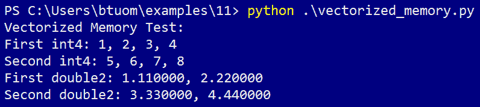
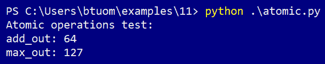
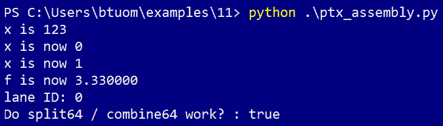

# 十一、CUDA 中的性能优化

在倒数第二章中，我们将介绍一些相当高级的 CUDA 功能，这些功能可用于低级别的性能优化。我们将从学习动态并行开始，它允许内核在 GPU 上启动和管理其他内核，并了解如何使用它直接在 GPU 上实现快速排序。我们将学习矢量化内存访问，当从 GPU 的全局内存读取时，它可以用来提高内存访问速度。然后，我们将了解如何使用 CUDA 原子操作，这是一种线程安全函数，可以在共享数据上操作，而无需线程同步或*互斥锁*锁。我们将学习 Warps，它是由 32 个或更少线程组成的基本块，其中线程可以直接读取或写入彼此的变量，然后对 PTX 组装世界进行一次短暂的探索。我们将通过直接在 CUDA-C 代码中内联编写一些基本的 PTX 程序集来实现这一点，它本身也将内联在我们的 Python 代码中！最后，我们将把所有这些小的低级调整合并到最后一个示例中，在这个示例中，我们将应用它们生成一个非常快的求和内核，并将其与 PyCUDA 的求和进行比较。

本章的学习成果如下：

*   CUDA 中的动态并行
*   在 GPU 上实现动态并行快速排序
*   使用矢量化类型加速设备内存访问
*   使用线程安全的 CUDA 原子操作
*   基本 PTX 组件
*   应用所有这些概念来编写性能优化的求和内核

# 动态并行

首先，我们来看看**动态并行**，这是 CUDA 中的一项功能，允许内核在不代表主机进行任何交互或输入的情况下启动和管理其他内核。这也使得许多通常在 GPU 上可用的主机端 CUDA-C 功能也可用，例如设备内存分配/释放、设备到设备内存拷贝、上下文范围的同步和流。

让我们从一个非常简单的例子开始。我们将在*N*线程上创建一个小内核，该内核将从每个线程向终端打印一条短消息，然后终端将在*N-1*线程上递归地启动另一个内核。此过程将继续，直到*N*达到 1。（当然，除了说明动态并行是如何工作的外，这个例子毫无意义。）

让我们从 Python 中的`import`语句开始：

```py
from __future__ import division
import numpy as np
from pycuda.compiler import DynamicSourceModule
import pycuda.autoinit
```

请注意，我们必须导入`DynamicSourceModule`而不是通常的`SourceModule`！这是因为动态并行特性要求编译器设置特定的配置细节。否则，这将看起来和行为类似于通常的`SourceModule`操作。现在我们可以继续编写内核：

```py
DynamicParallelismCode='''
__global__ void dynamic_hello_ker(int depth)
{
 printf("Hello from thread %d, recursion depth %d!\\n", threadIdx.x, depth);
 if (threadIdx.x == 0 && blockIdx.x == 0 && blockDim.x > 1)
 {
  printf("Launching a new kernel from depth %d .\\n", depth);
  printf("-----------------------------------------\\n");
  dynamic_hello_ker<<< 1, blockDim.x - 1 >>>(depth + 1);
 }
}'''
```

这里需要注意的最重要的一点是：我们必须小心，只有一个线程启动内核的下一次迭代，该线程使用一个位置良好的`if`语句来检查`threadIdx`和`blockIdx`值。如果我们不这样做，那么每个线程将在每次深度迭代中启动远远多于所需的内核实例。另外，请注意，我们可以使用常用的 CUDA-C 三方括号表示法以正常方式启动内核，而不必使用任何模糊或低级命令来利用动态并行性。

When using the CUDA dynamic parallelism feature, always be careful to avoid unnecessary kernel launches. This can be done by having a designated thread launch the next iteration of kernels.

现在，让我们完成这项工作：

```py
dp_mod = DynamicSourceModule(DynamicParallelismCode)
hello_ker = dp_mod.get_function('dynamic_hello_ker')
hello_ker(np.int32(0), grid=(1,1,1), block=(4,1,1))
```

现在我们可以运行前面的代码，它将为我们提供以下输出：


This example can also be found in the `dynamic_hello.py` file under the directory in this book's GitHub repository.

# 动态并行快速排序

现在，让我们来看一个更有趣、更实用的动态并行应用程序**快速排序算法**。正如我们将看到的，这实际上是一个非常适合并行化的算法。

让我们从一个简短的回顾开始。快速排序是一种递归就地排序算法，其平均和最佳情况性能为*O（N log N）*，最坏情况性能为*O（N<sup class="calibre54">2</sup>*。快速排序是通过在未排序的数组中选择称为*枢轴*的任意点来执行的，然后将数组划分为左数组（包含小于枢轴的所有点）、右数组（包含等于或大于枢轴的所有点），枢轴位于两个数组之间。如果一个或两个数组的长度现在都大于 1，那么我们将在一个或两个子数组上递归调用 quicksort，此时轴心点位于其最终位置。

Quicksort can be implemented in a single line in pure Python using functional programming:
`qsort = lambda xs : [] if xs == [] else qsort(filter(lambda x: x < xs[-1] , xs[0:-1])) + [xs[-1]] + qsort(filter(lambda x: x >= xs[-1] , xs[0:-1]))`

我们可以通过在左右数组上递归调用 quicksort 来了解并行性将在何处发挥作用我们可以看到这将从一个线程在初始大数组上运行开始，但是当数组变得非常小时，应该有许多线程在其上运行。在这里，我们将通过在一个*单线程*上启动所有内核来实现这一点！

让我们开始吧，从 import 语句开始。（我们将确保从标准随机模块中导入`shuffle`函数，稍后我们将讨论该示例）：

```py
from __future__ import division
import numpy as np
from pycuda.compiler import DynamicSourceModule
import pycuda.autoinit
from pycuda import gpuarray
from random import shuffle
```

现在我们将编写快速排序内核。我们将为分区步骤编写一个`device`函数，它将获取一个整数指针、分区子数组的最低点和子数组的最高点。此函数还将使用此子阵列的最高点作为轴。最终，完成此功能后，它将返回枢轴的最终静止位置：

```py
DynamicQuicksortCode='''
__device__ int partition(int * a, int lo, int hi)
{
 int i = lo;
 int pivot = a[hi];
 int temp;

 for (int k=lo; k<hi; k++)
 {
  if (a[k] < pivot)
  {
   temp = a[k];
   a[k] = a[i];
   a[i] = temp;
   i++;
  }
 }

 a[hi] = a[i];
 a[i] = pivot;

 return i;
}
```

现在我们可以将实现此分区函数的内核写入并行快速排序。我们必须对流使用 CUDA-C 约定，到目前为止我们还没有看到：要在 CUDA-C 中的流*s*中启动内核*k*，我们使用`k<<<grid, block, sharedMemBytesPerBlock, s>>>(...)`。通过在这里使用两个流，我们可以确保它们是并行启动的。（考虑到我们不会使用共享内存，我们将第三个启动参数设置为“0”。）流对象的创建和销毁应该是不言自明的：

```py
__global__ void quicksort_ker(int *a, int lo, int hi)
{

 cudaStream_t s_left, s_right; 
 cudaStreamCreateWithFlags(&s_left, cudaStreamNonBlocking);
 cudaStreamCreateWithFlags(&s_right, cudaStreamNonBlocking);

 int mid = partition(a, lo, hi);

 if(mid - 1 - lo > 0)
   quicksort_ker<<< 1, 1, 0, s_left >>>(a, lo, mid - 1);
 if(hi - (mid + 1) > 0)
   quicksort_ker<<< 1, 1, 0, s_right >>>(a, mid + 1, hi);

 cudaStreamDestroy(s_left);
 cudaStreamDestroy(s_right);

}
'''
```

现在让我们随机洗牌一个 100 个整数的列表，让我们的内核为我们排序。请注意，我们是如何通过单个线程启动内核的：

```py
qsort_mod = DynamicSourceModule(DynamicQuicksortCode)

qsort_ker = qsort_mod.get_function('quicksort_ker')

if __name__ == '__main__':
    a = range(100)
    shuffle(a)

    a = np.int32(a)

    d_a = gpuarray.to_gpu(a)

    print 'Unsorted array: %s' % a

    qsort_ker(d_a, np.int32(0), np.int32(a.size - 1), grid=(1,1,1), block=(1,1,1))

    a_sorted = list(d_a.get())

    print 'Sorted array: %s' % a_sorted
```

This program is also available in the `dynamic_quicksort.py` file in this book's GitHub repository.

# 矢量化数据类型和内存访问

现在我们来看看 CUDA 的矢量化数据类型。这些是标准数据类型的*矢量化*版本，例如 int 或 double，因为它们可以存储多个值。大小不超过 4 的 32 位类型有*矢量化*版本（例如，`int2`、`int3`、`int4`和`float4`），而 64 位变量只能矢量化为其原始大小的两倍（例如，`double2`和`long2`。对于大小为 4 的矢量化变量，我们使用 C“struct”符号访问每个单独的元素，用于成员`x`、`y`、`z`和`w`，而对于三成员变量，我们使用`x`、`y`和`z`，对于两成员变量，我们只使用`x`和`y`。

这些数据类型现在看起来似乎毫无意义，但是这些数据类型可以用来提高从全局内存加载数组的性能。现在，让我们做一个小测试，看看如何从一个整数数组中加载一些 int4 变量，以及从一个 double 数组中加载 double2。我们必须使用 CUDA`reinterpret_cast`运算符来完成这项操作：

```py
from __future__ import division
import numpy as np
from pycuda.compiler import SourceModule
import pycuda.autoinit
from pycuda import gpuarray

VecCode='''
__global__ void vec_ker(int *ints, double *doubles) { 

 int4 f1, f2;

 f1 = *reinterpret_cast<int4*>(ints);
 f2 = *reinterpret_cast<int4*>(&ints[4]);

 printf("First int4: %d, %d, %d, %d\\n", f1.x, f1.y, f1.z, f1.w);
 printf("Second int4: %d, %d, %d, %d\\n", f2.x, f2.y, f2.z, f2.w);

 double2 d1, d2;

 d1 = *reinterpret_cast<double2*>(doubles);
 d2 = *reinterpret_cast<double2*>(&doubles[2]);

 printf("First double2: %f, %f\\n", d1.x, d1.y);
 printf("Second double2: %f, %f\\n", d2.x, d2.y);

}'''
```

请注意，我们必须如何使用`dereference`运算符`*`来设置向量化变量，以及我们必须如何通过引用（`&ints[4]`、`&doubles[2]`）跳转到下一个地址来加载第二个`int4`和`double2`，方法是使用数组上的引用运算符`&`：



This example is also available in the `vectorized_memory.py` file in this book's GitHub repository.

# 线程安全原子操作

我们现在将了解 CUDA 中的**原子操作**。原子操作是非常简单的线程安全操作，输出到单个全局数组元素或共享内存变量，否则通常会导致竞争条件。

让我们想想一个例子。假设我们有一个内核，并在某个点上跨所有线程设置一个名为`x`的局部变量。然后，我们希望找到所有*x*的最大值，然后将该值设置为我们用`__shared__ int x_largest`声明的共享变量。我们可以通过在每个线程上调用`atomicMax(&x_largest, x)`来实现这一点。

让我们看一个原子操作的简单示例。我们将为两个实验编写一个小程序：

*   将变量设置为 0，然后为每个线程添加 1
*   查找所有线程的最大线程 ID 值

让我们像往常一样将`tid`整数设置为全局线程 ID，然后将全局`add_out`变量设置为 0。过去，我们会让一个线程使用`if`语句更改变量，但现在我们可以在所有线程中使用`atomicExch(add_out, 0)`。让我们进行导入并编写内核，直到现在：

```py
from __future__ import division
import numpy as np
from pycuda.compiler import SourceModule
import pycuda.autoinit
from pycuda import gpuarray
import pycuda.driver as drv

AtomicCode='''
__global__ void atomic_ker(int *add_out, int *max_out) 
{

 int tid = blockIdx.x*blockDim.x + threadIdx.x;

 atomicExch(add_out, 0);
```

应该注意的是，虽然原子确实是线程安全的，但它们绝不保证所有线程都会同时访问它们，而且它们可能在不同的时间由不同的线程执行。这在这里可能有问题，因为我们将在下一步中修改`add_out`。这可能会导致`add_out`在被某些线程部分修改后被重置。让我们执行块同步以防止出现这种情况：

```py
 __syncthreads();
```

我们现在可以使用`atomicAdd`为每个线程将`1`添加到`add_out`，这将为我们提供线程总数：

```py
 atomicAdd(add_out, 1);
```

现在我们使用`atomicMax`检查所有线程的`tid`最大值是多少。然后，我们可以关闭 CUDA 内核：

```py
 atomicMax(max_out, tid);

}
'''
```

现在我们将添加测试代码；让我们试着在 100 个线程的 1 块上启动它。我们这里只需要两个变量，所以我们必须分配一些大小仅为 1 的`gpuarray`对象。然后，我们将打印输出：

```py
atomic_mod = SourceModule(AtomicCode)
atomic_ker = atomic_mod.get_function('atomic_ker')

add_out = gpuarray.empty((1,), dtype=np.int32)
max_out = gpuarray.empty((1,), dtype=np.int32)

atomic_ker(add_out, max_out, grid=(1,1,1), block=(100,1,1))

print 'Atomic operations test:'
print 'add_out: %s' % add_out.get()[0]
print 'max_out: %s' % max_out.get()[0]
```

现在，我们准备运行以下程序：



This example is also available as the `atomic.py` file in this book's GitHub repository.

# 经纱混洗

现在我们来看看所谓的**扭曲混洗**。这是 CUDA 中的一项功能，它允许在同一 CUDA Warp 中同时存在的线程通过直接读写彼此的寄存器（即其本地堆栈空间变量）进行通信，而无需使用*共享*变量或全局设备内存。与其他两个选项相比，扭曲混洗实际上更快、更容易使用。这听起来太好了，几乎不可能是真的，所以一定有一个*捕获-*的确，*捕获*是因为它只在同一 CUDA 经纱上存在的线程之间工作，这将洗牌操作限制为大小为 32 或更小的线程组。另一个问题是，我们只能使用 32 位或更少的数据类型。这意味着我们不能将 64 位*长*整数或*双*浮点值在一个扭曲上混洗。

Only 32-bit (or smaller) datatypes can be used with CUDA Warp shuffling! This means that while we can use integers, floats, and chars, we cannot use doubles or *long long* integers!

在开始任何编码之前，让我们简要回顾一下 CUDA 扭曲。（在我们继续之前，您可能希望查看[第 6](06.html)章*调试和分析 CUDA 代码*中标题为*warp lockstep 属性*的部分。）CUDA**warp**是 CUDA 中由 32 个或更少线程组成的最小执行单元，在 32 个 GPU 内核上运行。正如网格由块组成一样，块也同样由一个或多个扭曲组成，这取决于块使用的线程数——如果一个块由 32 个线程组成，那么它将使用一个扭曲，如果它使用 96 个线程，那么它将由三个扭曲组成。即使扭曲的大小小于 32，也会被视为完全扭曲：这意味着只有一条线的块将使用 32 个核。这也意味着一个由 33 条螺纹组成的块将由两条经线和 31 个芯线组成。

为了记住我们在[第 6 章](06.html)*调试和分析您的 CUDA 代码*中看到的内容，Warp 具有被称为**锁步属性**。这意味着扭曲中的每个线程都将遍历每个指令，与扭曲中的其他线程完全并行。也就是说，单个经纱中的每一条线都将同时通过相同的精确指令，*忽略*任何不适用于特定线的指令——这就是为什么要尽可能避免单个经纱中的线之间出现任何分歧的原因。NVIDIA 将此执行模型称为**单指令多线程**或**SIMT**。到现在为止，您应该明白为什么我们一直试图在整个文本中始终使用 32 个线程的块！

在开始之前，我们还需要学习一个术语——经线中的**通道**是经线中特定线的唯一标识符，它将介于 0 和 31 之间。有时也称为**车道 ID**。

让我们从一个简单的例子开始：我们将使用`__shfl_xor`命令在扭曲中的所有偶数和奇数车道（线程）之间交换特定变量的值。这实际上是非常快速和容易做到的，所以让我们编写内核并看一看：

```py
from __future__ import division
import numpy as np
from pycuda.compiler import SourceModule
import pycuda.autoinit
from pycuda import gpuarray

ShflCode='''
__global__ void shfl_xor_ker(int *input, int * output) {

int temp = input[threadIdx.x];

temp = __shfl_xor (temp, 1, blockDim.x);

output[threadIdx.x] = temp;

}'''
```

除了`__shfl_xor`，这里的一切我们都很熟悉。单个 CUDA 线程就是这样看待这个问题的：这个函数将`temp`的值作为当前线程的输入。它使用`1`对当前线程的二进制通道 ID 执行`XOR`操作，该通道 ID 将是其左邻居（如果该线程通道的最低有效位在二进制中为“1”）或右邻居（如果最低有效位在二进制中为“0”）。然后，它将当前线程的`temp`值发送给它的邻居，同时检索邻居的临时值，即`__shfl_xor`。这将作为输出返回到`temp`。然后，我们在输出数组中设置值，这将交换输入数组的值。

现在，让我们编写其余的测试代码，然后检查输出：

```py
shfl_mod = SourceModule(ShflCode)
shfl_ker = shfl_mod.get_function('shfl_xor_ker')

dinput = gpuarray.to_gpu(np.int32(range(32)))
doutout = gpuarray.empty_like(dinput)

shfl_ker(dinput, doutout, grid=(1,1,1), block=(32,1,1))

print 'input array: %s' % dinput.get()
print 'array after __shfl_xor: %s' % doutout.get()
```

上述代码的输出如下所示：


在继续之前，让我们再做一个 warp shuffling 示例，我们将实现一个操作，对 warp 中所有线程的单个局部变量求和。让我们回忆一下[第 4 章](04.html)中的朴素并行求和算法*内核、线程、块和网格*，它非常快，但使*朴素的*假设我们拥有的处理器数量与我们拥有的数据块数量一样多这是生活中为数不多的情况之一，假设我们正在处理大小为 32 或更小的数组。我们将使用`__shfl_down`函数在单个经纱中实现这一点。`__shfl_down`在第一个参数中采用螺纹变量，并通过*在螺纹之间按照第二个参数中指示的特定步数移动*变量来工作，而第三个参数将指示经纱的总尺寸。

让我们现在就实施这个。同样，如果您不熟悉朴素的并行求和或不记得为什么会这样，请查看[第 4 章](04.html)、*内核、线程、块和网格*。我们将使用`__shfl_down`实现一个直接向上求和，然后在包含整数 0 到 31 的数组上运行它。然后，我们将其与 NumPy 自己的`sum`函数进行比较，以确保正确性：

```py
from __future__ import division
import numpy as np
from pycuda.compiler import SourceModule
import pycuda.autoinit
from pycuda import gpuarray

ShflSumCode='''
__global__ void shfl_sum_ker(int *input, int *out) {

 int temp = input[threadIdx.x];

 for (int i=1; i < 32; i *= 2)
     temp += __shfl_down (temp, i, 32);

 if (threadIdx.x == 0)
     *out = temp;

}'''

shfl_mod = SourceModule(ShflSumCode)
shfl_sum_ker = shfl_mod.get_function('shfl_sum_ker')

array_in = gpuarray.to_gpu(np.int32(range(32)))
out = gpuarray.empty((1,), dtype=np.int32)

shfl_sum_ker(array_in, out, grid=(1,1,1), block=(32,1,1))

print 'Input array: %s' % array_in.get()
print 'Summed value: %s' % out.get()[0]
print 'Does this match with Python''s sum? : %s' % (out.get()[0] == sum(array_in.get()) )
```

这将为我们提供以下输出：


The examples in this section are also available as the `shfl_sum.py` and `shfl_xor.py` files under the `Chapter11` directory in this book's GitHub repository.

# 内联 PTX 组件

现在我们将开始编写 PTX（并行线程执行）汇编语言，它是一种伪汇编语言，可以跨所有 Nvidia GPU 工作，反过来，它由实时（JIT）编译器编译为特定 GPU 的实际机器代码。虽然这显然不是为了日常使用，但如果需要的话，它可以让我们在比 C 更低的级别上工作。一个特殊的用例是，您可以轻松地反汇编 CUDA 二进制文件（主机端可执行文件/库或 CUDA.cubin 二进制文件），并在没有其他可用源代码的情况下检查其 PTX 代码。这可以在 Windows 和 Linux 中通过`cuobjdump.exe -ptx  cuda_binary`命令完成。

如前所述，我们将仅介绍 CUDA-C 中 PTX 的一些基本用法，CUDA-C 具有特定的语法和用法，类似于在 GCC 中使用内联主机端汇编语言。让我们开始编写代码，我们将进行导入并开始编写 GPU 代码：

```py
from __future__ import division
import numpy as np
from pycuda.compiler import SourceModule
import pycuda.autoinit
from pycuda import gpuarray

PtxCode='''
```

我们将在这里通过将代码写入单独的设备函数来进行几个小型实验。让我们从一个简单的函数开始，该函数将输入变量设置为零。（我们可以在 CUDA 中使用 C++Pix-Access 操作符 To.T0，我们将在 AUTYT1 函数中使用。）

```py
__device__ void set_to_zero(int &x)
{
 asm("mov.s32 %0, 0;" : "=r"(x));
}
```

在继续之前，让我们先把它分解一下。当然，`asm`将向`nvcc`编译器指示我们将使用汇编，因此我们必须将该代码放在引号中，以便正确处理。`mov`指令只是复制一个常量或其他值，并将其输入**寄存器**。（寄存器是 GPU 或 CPU 用来存储或操作值的最基本的片上存储单元类型；*本地*变量在 CUDA 中的使用方式就是这样。`mov.s32`的`.s32`部分表明我们正在使用的是有符号的 32 位整数变量 PTX 组件没有*类型*对于 C 意义上的数据，我们必须小心使用正确的特定操作。`%0`告诉`nvcc`使用这里字符串的`0th`参数对应的寄存器，我们用逗号将其与下一个*输入*到`mov`分开，逗号是常量`0`。然后我们用分号结束汇编代码行，就像在 C 中一样，并用引号结束汇编代码字符串。然后我们必须使用冒号（而不是逗号！）来表示我们希望在代码中使用的变量。`"=r"`表示两件事：`=`将指示`nvcc`寄存器将作为输出写入，而`r`表示应将其作为 32 位整数数据类型处理。然后，我们将希望汇编程序处理的变量放在括号中，然后关闭`asm`，就像处理任何 C 函数一样。

所有这些都需要将单个变量的值设置为 0！现在，让我们制作一个小型设备函数，为我们添加两个浮点数：

```py
__device__ void add_floats(float &out, float in1, float in2)
{
 asm("add.f32 %0, %1, %2 ;" : "=f"(out) : "f"(in1) , "f"(in2));
}
```

让我们停下来注意几件事。首先，当然，我们使用`add.f32`来表示我们要将两个 32 位浮点值相加。我们还使用`"=f"`表示我们将写入寄存器，`f`表示我们将仅从寄存器中读取。另外，请注意我们如何使用冒号将`write`寄存器与`nvcc`的`only read`寄存器分开。

在继续之前，让我们看一个更简单的示例，即类似于 C 中的`++`运算符的函数，它将整数增加`1`：

```py
__device__ void plusplus(int &x)
{
 asm("add.s32 %0, %0, 1;" : "+r"(x));
}
```

首先，请注意，我们使用“0th”参数作为输出和第一个输入。接下来，请注意，我们使用的是`+r`而不是`=r`-`+`告诉`nvcc`，在本指令中，该寄存器将从*读取并写入*。

现在，我们再也没有比这更有趣的了，因为即使是用汇编语言编写一个简单的`if`语句也相当费事。但是，让我们看一些在使用 CUDA 扭曲时有用的示例。让我们从一个小函数开始，它将为我们提供当前线程的通道 ID；这非常有用，实际上比使用 CUDA-C 更简单，因为车道 ID 实际上存储在一个名为`%laneid`的特殊寄存器中，我们不能用纯 C 访问该寄存器。（注意我们如何在代码中使用两个`%`符号，这将指示`nvcc`直接使用`%`在`%laneid`引用的汇编代码中，而不是将其解释为`asm`命令的参数。）：

```py
__device__ int laneid()
{
 int id; 
 asm("mov.u32 %0, %%laneid; " : "=r"(id)); 
 return id;
}
```

现在，让我们再编写两个函数，它们对于处理 CUDA 扭曲非常有用。请记住，您只能使用 shuffle 命令通过扭曲传递 32 位变量。这意味着要在一个扭曲上传递一个 64 位变量，我们必须将其拆分为两个 32 位变量，分别将这两个变量洗牌到另一个线程，然后将这些 32 位值重新组合回原始的 64 位变量。我们可以使用`mov.b64`命令将 64 位双精度拆分为两个 32 位整数。请注意，我们必须使用`d`来指示 64 位浮点双精度：

Notice our use of `volatile` in the following code, which will ensure that these commands are executed exactly as written after they are compiled. We do this because sometimes a compiler will make its own optimizations to or around inline assembly code, but for particularly delicate operations such as this, we want this done exactly as written.

```py
__device__ void split64(double val, int & lo, int & hi)
{
 asm volatile("mov.b64 {%0, %1}, %2; ":"=r"(lo),"=r"(hi):"d"(val));
}

__device__ void combine64(double &val, int lo, int hi)
{
 asm volatile("mov.b64 %0, {%1, %2}; ":"=d"(val):"r"(lo),"r"(hi));
}
```

现在，让我们编写一个简单的内核来测试我们编写的所有 PTX 汇编设备函数。然后，我们将在一个线程上启动它，以便我们可以检查所有内容：

```py
__global__ void ptx_test_ker() { 

 int x=123;

 printf("x is %d \\n", x);

 set_to_zero(x);

 printf("x is now %d \\n", x);

 plusplus(x);

 printf("x is now %d \\n", x);

 float f;

 add_floats(f, 1.11, 2.22 );

 printf("f is now %f \\n", f);

 printf("lane ID: %d \\n", laneid() );

 double orig = 3.1415;

 int t1, t2;

 split64(orig, t1, t2);

 double recon;

 combine64(recon, t1, t2);

 printf("Do split64 / combine64 work? : %s \\n", (orig == recon) ? "true" : "false"); 

}'''

ptx_mod = SourceModule(PtxCode)
ptx_test_ker = ptx_mod.get_function('ptx_test_ker')
ptx_test_ker(grid=(1,1,1), block=(1,1,1))
```

现在，我们将运行前面的代码：



This example is also available as the `ptx_assembly.py` file under the `Chapter11` directory in this book's GitHub repository.

# 性能优化阵列和

对于本书的最后一个示例，我们现在将为给定的 double 数组创建一个标准数组求和内核，但这次我们将使用本章中学习的所有技巧使其尽可能快。我们将对照 NumPy 的`sum`函数检查求和内核的输出，然后我们将使用标准 Python`timeit`函数运行一些测试，以比较我们的函数与 PyCUDA 自己的`gpuarray`对象的`sum`函数的比较。

让我们从导入所有必要的库开始，然后从一个`laneid`函数开始，类似于我们在上一节中使用的函数：

```py
from __future__ import division
import numpy as np
from pycuda.compiler import SourceModule
import pycuda.autoinit
from pycuda import gpuarray
import pycuda.driver as drv
from timeit import timeit

SumCode='''
__device__ void __inline__ laneid(int & id)
{
 asm("mov.u32 %0, %%laneid; " : "=r"(id)); 
}
```

让我们注意一些事情，注意我们在设备函数的声明中加入了一个新的内联语句。这将有效地使我们的函数成为一个宏，当我们从内核调用它时，这将减少一点从调用和分支到设备函数的时间。另外，请注意，我们通过引用来设置`id`变量，而不是返回值。在这种情况下，实际上可能需要使用两个整数寄存器，并且应该有一个额外的 copy 命令。这保证了这种情况不会发生。

让我们以类似的方式编写其他设备函数。我们还需要两个以上的设备函数，以便将 64 位双精度计数器拆分并组合为两个 32 位变量：

```py
__device__ void __inline__ split64(double val, int & lo, int & hi)
{
 asm volatile("mov.b64 {%0, %1}, %2; ":"=r"(lo),"=r"(hi):"d"(val));
}

__device__ void __inline__ combine64(double &val, int lo, int hi)
{
 asm volatile("mov.b64 %0, {%1, %2}; ":"=d"(val):"r"(lo),"r"(hi));
}
```

让我们开始编写内核。我们将接收一个名为 input 的 double 数组，然后将整个总和输出到`out`，该值应初始化为`0`。我们将首先获取当前线程的通道 ID，并使用矢量化内存加载将两个值从全局内存加载到当前线程中：

```py
__global__ void sum_ker(double *input, double *out) 
{

 int id;
 laneid(id);

 double2 vals = *reinterpret_cast<double2*> ( &input[(blockDim.x*blockIdx.x + threadIdx.x) * 2] );
```

现在，让我们将 double2`vals`变量中的这些值求和为一个新的双变量`sum_val`，它将跟踪整个线程中的所有求和。我们将创建两个 32 位整数，`s1`和`s2`，用于拆分此值并与 Warp Shuffling 共享，然后为从该 Warp 中的其他线程接收的重构值创建一个`temp`变量：

```py
 double sum_val = vals.x + vals.y;

 double temp;

 int s1, s2;
```

现在，让我们再次在 warp 上使用一个简单的并行求和，这与在 warp 上求 32 位整数的和是一样的，只是我们将在`sum_val`和`temp`上为每个迭代使用`split64`和`combine64`PTX 函数：

```py
 for (int i=1; i < 32; i *= 2)
 {

     // use PTX assembly to split
     split64(sum_val, s1, s2);

     // shuffle to transfer data
     s1 = __shfl_down (s1, i, 32);
     s2 = __shfl_down (s2, i, 32);

     // PTX assembly to combine
     combine64(temp, s1, s2);
     sum_val += temp;
 }
```

现在，我们已经完成了，让每个经纱的`0th`线程使用线程安全`atomicAdd`将其结束值添加到`out`：

```py
 if (id == 0)
     atomicAdd(out, sum_val);

}'''
```

现在，我们将编写带有`timeit`操作的测试代码，以在 10000*2*32 倍的数组上测量内核和 PyCUDA 在 20 次迭代中的平均时间和总和：

```py
sum_mod = SourceModule(SumCode)
sum_ker = sum_mod.get_function('sum_ker')

a = np.float64(np.random.randn(10000*2*32))
a_gpu = gpuarray.to_gpu(a)
out = gpuarray.zeros((1,), dtype=np.float64)

sum_ker(a_gpu, out, grid=(int(np.ceil(a.size/64)),1,1), block=(32,1,1))
drv.Context.synchronize()

print 'Does sum_ker produces the same value as NumPy\'s sum (according allclose)? : %s' % np.allclose(np.sum(a) , out.get()[0])

print 'Performing sum_ker / PyCUDA sum timing tests (20 each)...'

sum_ker_time = timeit('''from __main__ import sum_ker, a_gpu, out, np, drv \nsum_ker(a_gpu, out, grid=(int(np.ceil(a_gpu.size/64)),1,1), block=(32,1,1)) \ndrv.Context.synchronize()''', number=20)
pycuda_sum_time = timeit('''from __main__ import gpuarray, a_gpu, drv \ngpuarray.sum(a_gpu) \ndrv.Context.synchronize()''', number=20)

print 'sum_ker average time duration: %s, PyCUDA\'s gpuarray.sum average time duration: %s' % (sum_ker_time, pycuda_sum_time)
print '(Performance improvement of sum_ker over gpuarray.sum: %s )' % (pycuda_sum_time / sum_ker_time)
```

让我们从 IPython 开始。请确保您事先已经运行了`gpuarray.sum`和`sum_ker`，以确保我们不会同时通过`nvcc`对任何编译进行计时：


因此，虽然求和通常很无聊，但我们可以兴奋地发现，我们巧妙地使用硬件技巧可以大大加快这种平淡而琐碎的算法。

This example is available as the `performance_sum_ker.py` file under the `Chapter11` directory in this book's GitHub repository.

# 总结

本章开始时，我们学习了动态并行，这是一种允许我们从其他内核直接在 GPU 上启动和管理内核的范例。我们看到了如何使用它直接在 GPU 上实现快速排序算法。然后，我们学习了 CUDA 中的矢量化数据类型，并了解了如何使用这些数据类型加快从全局设备内存读取内存的速度。然后我们了解了 CUDA 扭曲，它是 GPU 上 32 个线程或更少的小单元，我们还了解了单个扭曲中的线程如何使用扭曲洗牌直接读写彼此的寄存器。然后，我们研究了如何在 PTX assembly 中编写一些基本操作，包括导入操作，如确定通道 ID 和将 64 位变量拆分为两个 32 位变量。最后，我们在本章结束时编写了一个新的性能优化求和内核，该内核用于 double 数组，几乎应用了我们在本章学到的大部分技巧。我们发现这实际上比长度为 500000 的双数组上的标准 PyCUDA 和快。

我们已经看完了本书的所有技术章节！你应该为自己感到骄傲，因为你现在肯定是一个熟练的 GPU 程序员，拥有很多技巧。现在，我们将进入最后一章，在这里我们将简要介绍几个不同的路径，您可以从这里应用和扩展您的 GPU 编程知识。

# 问题

1.  在原子操作示例中，尝试在启动内核之前将网格大小从 1 更改为 2，同时将总块大小保留为 100。如果这为`add_out`提供了错误的输出（200 以外的任何输出），那么考虑到`atomicExch`是线程安全的，为什么它是错误的呢？
2.  在原子操作示例中，尝试删除`__syncthreads`，然后在网格大小 1 和块大小 100 的原始参数上运行内核。如果这为`add_out`提供了错误的输出（100 以外的任何输出），那么考虑到`atomicExch`是线程安全的，为什么它是错误的呢？
3.  为什么我们不必使用`__syncthreads`在大小为 32 或更小的块上进行同步？

4.  我们看到，对于长度为 640000 的随机值数组（`10000*2*32`）而言，`sum_ker`大约比 PyCUDA 的求和运算快五倍。如果你尝试在这个数字的末尾加上一个零（即乘以 10），你会注意到性能下降到一个点，`sum_ker`的速度只有 PyCUDA 总和的 1.5 倍。如果你在这个数字的末尾再加上一个零，你会发现`sum_ker`的速度只有 PyCUDA 总和的 75%。你认为这是为什么？我们如何改进`sum_ker`以便在更大的阵列上更快？
5.  哪个算法执行更多的加法运算（将对 C+运算符和原子数的调用计算为单个运算）：`sum_ker`还是 PyCUDA 的`sum`？