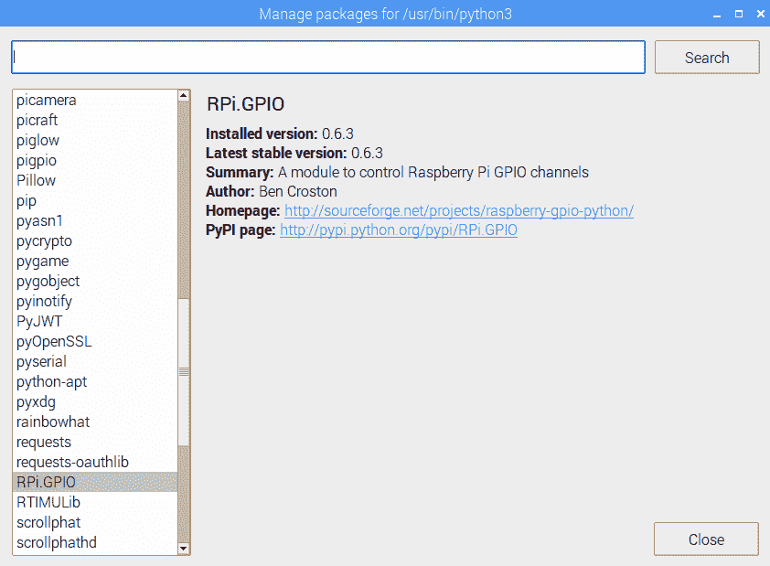
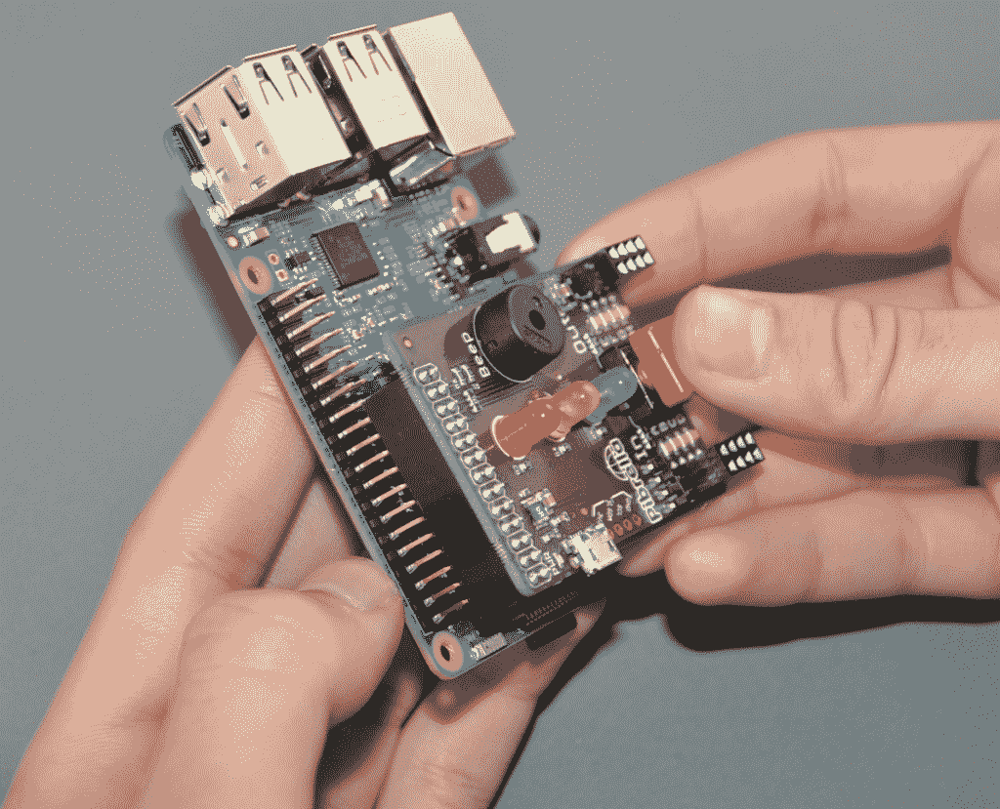
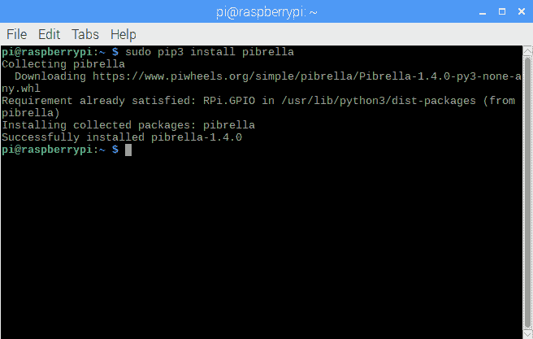
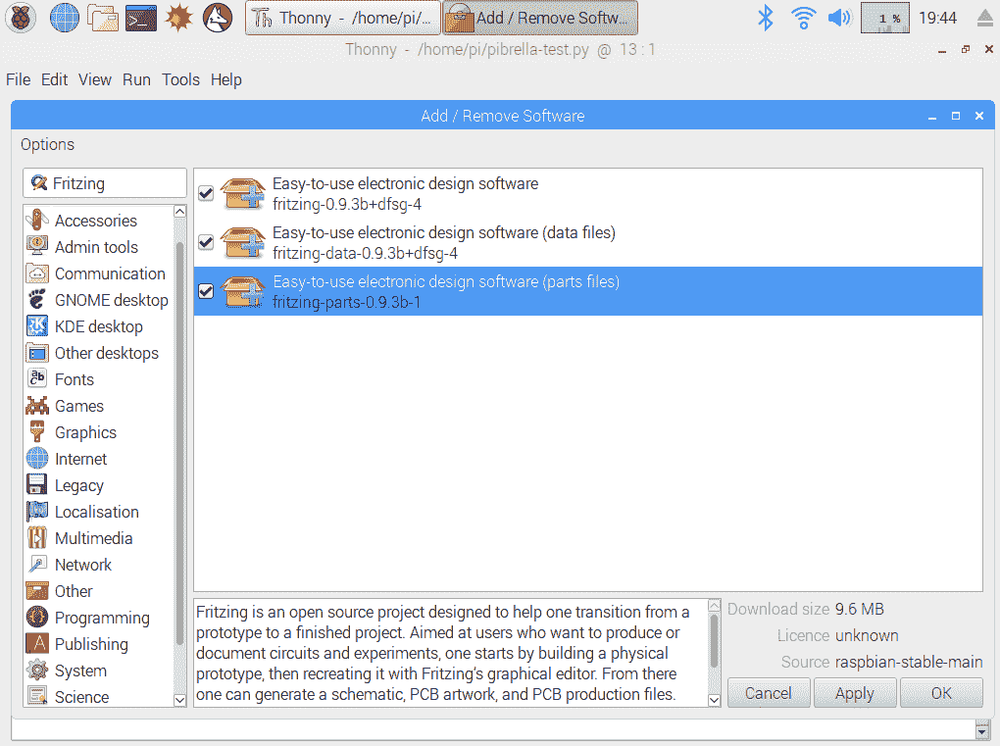
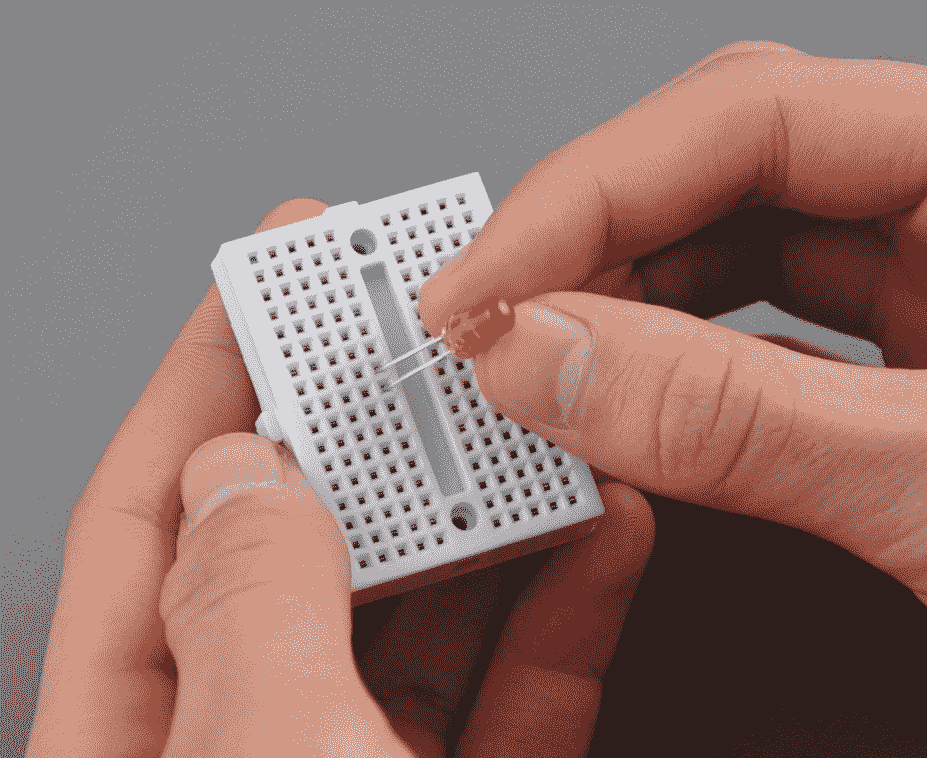

# 三、使用 GPIO 连接到外部世界

在本章中，我们将开始解锁 Raspberry Pi 和 GPIO（通用输入输出）背后的真实功率。GPIO 允许您通过使用可设置为输入或输出的管脚将 Raspberry Pi 连接到外部世界，并通过代码进行控制。

本章将介绍以下主题：

*   用于 Raspberry Pi 的 Python 库
*   访问 Raspberry Pi 的 GPIO
*   设置电路
*   你好 LED

# 项目概述

在本章中，我们首先探讨 Python 中特定于 Raspberry Pi 的库。我们将通过使用 Raspberry Pi 摄像头模块和 Pibrella 帽子的几个示例来演示这些。在继续使用 Fritzing 程序设计物理电路之前，我们将使用 Sense Hat emulator 尝试一些编码示例。使用一个试验板，我们将建立这个电路，并将其连接到我们的树莓 Pi。

在本章的结尾，我们将构建一个莫尔斯电码生成器，用莫尔斯电码传输我们在[第 2 章](02.html)*中创建的类中的天气数据，该类使用 Raspberry Pi*编写 Python 程序。本章需要一个下午才能完成。

# 技术要求

完成本项目需要以下内容：

*   Raspberry Pi 3 型（2015 型或更新型）
*   USB 电源
*   计算机显示器
*   USB 键盘
*   USB 鼠标
*   树莓 Pi 摄像头模块（可选）-[https://www.raspberrypi.org/products/camera-module-v2/](https://www.raspberrypi.org/products/camera-module-v2/)
*   Pribrella 帽子（可选）-[www.pibrella.com](http://www.pibrella.com)
*   感知帽（可选，因为我们将在本章中使用模拟器）-[https://www.raspberrypi.org/products/sense-hat/a](https://www.raspberrypi.org/products/sense-hat/)
*   试验板
*   公-母跨接导线
*   发光二极管

# 用于 Raspberry Pi 的 Python 库

我们将把注意力转向与 Raspbian 一起预装的 Python 库或包。要从 Thonny 查看这些软件包，请单击工具|管理软件包。短暂延迟后，您应该会看到对话框中列出了许多程序包：



让我们探索其中的一些包。

# 皮卡梅拉

Raspberry Pi 上的摄像头端口或 CSI 允许您将专门设计的 Raspberry Pi 摄像头模块连接到 Pi。该相机可以拍摄照片和视频，并具有延时摄影和慢动作视频录制功能。`picamera`包允许我们通过 Python 访问摄像头。以下是通过摄像头端口连接到 Raspberry Pi 3 型号 B 的 Raspberry Pi 摄像头模块的图片：


将 Raspberry Pi 摄像头模块连接到 Pi，打开 Thonny，然后键入以下代码：

```py
import picamera
import time

picam = picamera.PiCamera()
picam.start_preview()
time.sleep(10)
picam.stop_preview()
picam.close()
```

此代码导入`picamera`和`time`包，然后创建一个名为`picam`的`picamera`对象。从那里，我们开始预览，然后睡眠`10`秒，然后停止预览，然后关闭相机。运行程序后，您应该会在屏幕上看到摄像头的`10`秒预览。

# 枕头

枕头包用于 Python 的图像处理。要测试这一点，请将图像下载到与项目文件相同的目录中。在 Thonny 中创建新文件并键入以下内容：

```py
from PIL import Image

img = Image.open('image.png')
print(img.format, img.size)
```

您应该看到在下面的命令行中打印的图像的格式和大小（括号中）。

# sense 帽子和 sense emu

Sense 帽子是一款精致的覆盆子 Pi 附加板。传感帽是 Astro Pi 套件的主要组成部分，该套件是一项让年轻学生为国际空间站设计树莓 Pi 的计划的一部分。

Astro Pi 竞赛于 2015 年 1 月正式向英国所有中小学适龄儿童开放。在国际空间站执行任务期间，英国宇航员蒂姆·皮克在空间站上部署了 Astro-Pi 计算机

获胜的 Astro-Pi 竞赛代码在轨道上加载到 Astro-Pi 上。生成的数据被收集并送回地球。

传感帽包含一组可用作显示器的 LED。传感帽上还装有以下传感器：

*   加速计
*   温度传感器
*   磁强计
*   大气压力传感器
*   湿度传感器
*   陀螺仪

我们可以通过`sense-hat`包访问传感帽上的传感器和 LED。对于没有 Sense 帽子的用户，可以使用 Raspbian 中的 Sense 帽子模拟器。我们使用`sense-emu`软件包访问 Sense HAT 仿真器上的模拟传感器和 LED 显示屏。

要演示这一点，请执行以下步骤：

1.  用 Thonny 创建一个新文件，并将其命名为`sense-hat-test.py`或类似名称。
2.  键入以下代码：

```py
from sense_emu import SenseHat

sense_emulator = SenseHat()
sense_emulator.show_message('Hello World')
```

3.  从应用程序菜单|编程| Sense HAT Emulator 加载 Sense HAT Emulator 程序。
4.  排列屏幕，以便可以看到 Sense HAT emulator 的 LED 显示屏和 Thonny 的整个窗口（请参见以下屏幕截图）：


5.  点击**运行当前脚本**按钮。
6.  您应该可以在 Sense HAT emulator 的 LED 显示屏上看到`Hello World!`消息滚动，一次滚动一个字母（请参见上一个屏幕截图）。

# 访问 Raspberry Pi 的 GPIO

通过 GPIO，我们能够连接到外部世界。以下是 Raspberry Pi GPIO 引脚的示意图：


以下是这些引脚的说明：

*   红色引脚表示 GPIO 输出的电源。GPIO 提供 3.3 伏和 5 伏电压。
*   黑色引脚表示用于电气接地的引脚。如您所见，GPIO 上有 8 个接地引脚。

*   蓝色引脚用于在顶部（**帽子**上添加的覆盆子 Pi**硬件。它们允许 Raspberry Pi 和帽子的**电可擦除可编程只读存储器**（**EEPROM**之间进行通信。**
*   绿色引脚代表我们可以编程的输入和输出引脚。请注意，一些绿色 GPIO 引脚具有额外功能。我们将不讨论此项目的附加功能。

GPIO 是覆盆子 Pi 的核心。我们可以通过 GPIO 将 LED、按钮、蜂鸣器等连接到 Raspberry Pi。我们还可以通过专为树莓 Pi 设计的帽子访问 GPIO。其中一个名为`Pibrella`，我们接下来将使用它来探索如何通过 Python 代码连接到 GPIO。

Raspberry Pi 1 Models A and B only have the first 26 pins (as shown by the dotted line). Models since then, including Raspberry Pi 1 Models A+ and B+, Raspberry Pi 2, Raspberry Pi Zero and Zero W, and Raspberry Pi 3 Model B and B+, have 40 GPIO pins.

# 皮布雷拉

Pibrella 是一款相对便宜的覆盆子皮帽子，可以轻松连接到 GPIO。以下是 Pibrella 的车载部件：

*   1 个红色发光二极管
*   1 个黄色发光二极管
*   1 个绿色 LED
*   小型扬声器
*   按钮
*   4 输入
*   4 产出
*   Micro USB 电源连接器，为输出端提供更多电源

Pibrella 是为早期的 Raspberry Pi 模型设计的，因此只有 26 针输入。但是，它可以通过前 26 个引脚连接到更高型号

要安装 Pibrella 帽子，请将 Pibrella 上的插针连接器与 Raspberry Pi 上的前 26 个插针对齐，然后向下推。在下图中，我们正在 Raspberry Pi 3 B 型上安装 Pibrella：



Pibrella 在安装时应紧密贴合：


连接到 Pibrella 所需的库不是随 Raspbian 预先安装的（在撰写本文时），因此我们必须自己安装它们。为此，我们将使用来自终端的`pip3`命令：

1.  通过单击顶部工具栏（左侧第四个图标）上的终端加载终端。在命令提示下，键入以下内容：

```py
sudo pip3 install pibrella
```

2.  您应该可以在终端上看到软件包的加载情况：



3.  使用`Pibrella`库，访问 GPIO 无需知道 GPIO 引脚号。该功能被包装在我们导入代码的`Pibrella`对象中。我们将做一个简短的演示
4.  在 Thonny 中创建一个名为`pibrella-test.py`的新文件，或者将其命名为类似的名称。键入以下代码：

```py
import pibrella
import time

pibrella.light.red.on()
time.sleep(5)
pibrella.light.red.off()
pibrella.buzzer.success()
```

5.  通过单击运行当前脚本按钮来运行代码。如果您输入的所有内容都正确，您应该会看到 Pibrella 板上的红灯亮起`5`秒，然后在扬声器上播放一段简短的旋律。

祝贺您，您现在已经跨入了物理计算世界的门槛。

# RPi.GPIO

用于访问 GPIO 的标准 Python 包称为`RPi.GPIO`。描述其工作原理的最佳方法是使用一些代码（这仅用于演示目的；我们将在下一节中运行代码以访问 GPIO）：

```py
import RPi.GPIO as GPIO
import time

GPIO.setmode(GPIO.BCM)
GPIO.setup(18, GPIO.OUT)
GPIO.output(18, GPIO.HIGH)
time.sleep(5)
GPIO.output(18, GPIO.LOW)
```

正如您所看到的，这段代码似乎有点混乱。我们将逐步解决这一问题：

1.  首先，我们导入`RPi.GPIO`和`time`库：

```py
import RPi.GPIO as GPIO
import time
```

2.  然后，我们将模式设置为`BCM`：

```py
GPIO.setmode(GPIO.BCM)
```

3.  在 BCM 模式下，我们通过 GPIO 编号（Raspberry Pi GPIO 图形中显示的编号）访问 pin。另一种方法是通过引脚的物理位置访问引脚（`GPIO.BOARD`。
4.  要将 GPIO 引脚`18`设置为输出，我们使用以下行：

```py
GPIO.setup(18, GPIO.OUT)
```

5.  然后我们将 GPIO`18`设置为`HIGH`并持续`5`秒，然后再将其设置为`LOW`：

```py
GPIO.output(18, GPIO.HIGH)
time.sleep(5)
GPIO.output(18, GPIO.LOW)
```

如果我们设置了电路并运行了代码，我们会看到 LED 灯在关闭前`5`秒亮起，类似于 Pibrella 示例

# GPIO 零

`RPi.GPIO`的替代品是 GPIO 零包。与`RPi.GPIO`一样，此软件包预装有 Raspbian。名称中的零表示零样板文件或设置代码（我们每次都被迫输入的代码）。

为了完成相同的任务，打开和关闭 LED`5`秒，我们使用以下代码：

```py
from gipozero import LED
import time

led = LED(18)
led.on()
time.sleep(5)
led.off()
```

与我们的`RPi.GPIO`示例一样，此代码仅用于演示，因为我们尚未设置电路。很明显，GPIO 零代码比`RPi.GPIO`示例简单得多。这段代码很容易解释。

在下面的部分中，我们将开始在带有 LED 的试验板上构建一个物理电路，并使用我们的代码来打开和关闭它。

# 设置电路

Pibrella 帽子为我们提供了一种简单的 GPIO 编程方法，然而，Raspberry Pi 项目的最终目标是创建一个定制的工作电路。现在我们将采取步骤设计电路，然后使用试验板创建电路。

第一步是在计算机上设计电路。

# 熔块

Fritzing 是一款适用于 Windows、macOS 和 Linux 的自由电路设计软件。Raspberry Pi 商店中有一个版本，我们将在 Raspberry Pi 上安装：

1.  从应用程序菜单中，选择首选项|添加/删除软件。在搜索框中，键入`Fritzing`：



2.  选择所有三个框并单击应用，然后单击确定。安装后，您应该能够从应用程序菜单|编程| Fritzing 加载 Fritzing。
3.  单击“试验板”选项卡以访问“试验板设计”屏幕。屏幕中央有一个全尺寸的试验板。我们将使它更小，因为我们的电路小而简单。

4.  点击试验板。在 Inspector 框中，您将看到一个名为 Properties 的标题。
5.  单击“大小”下拉列表并选择“迷你”。
6.  要将树莓 Pi 添加到电路中，请在搜索框中键入`Raspberry Pi`。把树莓派 3 拖到我们的实验板下面。
7.  从这里，我们可以将组件拖放到试验板上。
8.  将 LED 和 330 欧姆电阻器添加到我们的试验板上，如下图所示。我们使用电阻器保护 LED 和 Raspberry Pi 免受可能导致损坏的过大电流的影响：


9.  您会注意到，当我们将鼠标悬停在 Raspberry Pi 组件上的每个引脚上时，会弹出一个带有引脚名称的黄色提示。单击 GPIO 18 并将一条线拖到 LED 的正支脚（较长的支脚）。
10.  同样，将 GND 连接拖到电阻器的左侧。

这是我们将为树莓圆周率建立的电路。

# 构建我们的电路

要构建我们的物理电路，首先要将组件插入到我们的实验板中。参考之前的图表，我们可以看到一些孔是绿色的。这表示电路中存在导通性。例如，我们通过同一垂直柱将 LED 的负支脚连接到 330 欧姆电阻器。因此，两个部件支腿通过试验板连接在一起。

当我们开始在试验板上放置组件时，我们会考虑到这一点：



1.  将 LED 插入我们的试验板，如上图所示。我们正在按照我们的烧结图，并在较低的洞有积极的腿。
2.  按照我们的烧结图，将 330 欧姆电阻器连接起来。使用阴到阳跨接线，将覆盆子 Pi 连接到我们的试验板。
3.  参考我们的 Raspberry Pi GPIO 图，找到 Raspberry Pi 板上的 GPIO 18 和 GND。

It is a good practice to have the Raspberry Pi powered off when connecting jumpers to the GPIO.

如下图所示，整个电路类似于我们的烧结图（只有我们的面包板和覆盆子圆周率是侧向的）：


4.  将 Raspberry Pi 连接至显示器、电源、键盘和鼠标。

我们现在已经准备好编程我们的第一个真正的 GPIO 电路。

# 你好 LED

我们将直接进入代码：

1.  用 Thonny 创建一个新文件，并将其命名为`Hello LED.py`或类似名称。
2.  键入以下代码并运行它：

```py
from gpiozero import LED

led = LED(18)
led.blink(1,1,10)
```

# 使用 gpiozero 闪烁 LED

如果我们连接好电路并正确输入代码，我们应该会看到 LED 在 1 秒的间隔内闪烁 10 秒。`gpiozero LED`对象中的闪烁功能允许我们设置`on_time`（LED 保持亮起的秒数）、`off_time`（LED 关闭的秒数）、`n`或 LED 闪烁的次数，以及`background`（设置为`True`以允许其他代码在 LED 闪烁时运行）。

带有默认参数的`blink`函数调用如下所示：

```py
blink(on_time=1, off_time=1, n=none, background=True)
```

如果未将参数传递到功能中，LED 将以 1 秒的间隔不停闪烁。请注意，我们不需要像使用`RPi.GPIO`包访问 GPIO 时那样导入`time`库。我们只需在`blink`函数中输入一个数字，以秒为单位表示我们希望 LED 亮起或熄灭的时间。

# 莫尔斯电码天气数据

在[第 2 章](02.html)中*使用 Raspberry Pi*编写 Python 程序时，我们编写了模拟调用提供天气信息的 web 服务的代码。根据我们在本章学到的内容，让我们重温该代码，并对其进行物理计算升级。我们将使用 LED 闪烁莫尔斯电码表示我们的天气数据。

Many of us believe that the world only started to become connected in the 1990s with the World Wide Web. Little do we realize that we already had such a world beginning in the 19th century with the introduction of the telegraph and trans-world telegraph cables. The language of this so-called Victorian Internet was Morse code, with the Morse code operator as its gate keeper.

以下是闪烁莫尔斯电码表示天气数据的步骤：

1.  我们首先创建一个`MorseCodeGenerator`类：

```py
from gpiozero import LED
from time import sleep

class MorseCodeGenerator:

    led = LED(18)
    dot_duration = 0.3
    dash_duration = dot_duration * 3
    word_spacing_duration = dot_duration * 7

    MORSE_CODE = {
        'A': '.-', 'B': '-...', 'C': '-.-.', 
        'D': '-..', 'E': '.', 'F': '..-.',
        'G': '--.', 'H': '....', 'I': '..',
        'J': '.---', 'K': '-.-', 'L': '.-..',
        'M': '--', 'N': '-.', 'O': '---',
        'P': '.--.', 'Q': '--.-', 'R': '.-.',
       'S': '...', 'T': '-', 'U': '..-',
        'V': '...-', 'W': '.--', 'X': '-..-',
        'Y': '-.--', 'Z': '--..', '0': '-----',
        '1': '.----', '2': '..---', '3': '...--',
        '4': '....-', '5': '.....', '6': '-....',
        '7': '--...', '8': '---..', '9': '----.',
        ' ': ' '
        } 

    def transmit_message(self, message):
        for letter in message: 
            morse_code_letter = self.MORSE_CODE[letter.upper()]

            for dash_dot in morse_code_letter:

                if dash_dot == '.':
                    self.dot()

                elif dash_dot == '-':
                    self.dash()

                elif dash_dot == ' ':
                    self.word_spacing()

            self.letter_spacing()

    def dot(self):
        self.led.blink(self.dot_duration,self.dot_duration,1,False)

    def dash(self):
        self.led.blink(self.dash_duration,self.dot_duration,1,False)

    def letter_spacing(self):
        sleep(self.dot_duration)

    def word_spacing(self):
        sleep(self.word_spacing_duration-self.dot_duration)

if __name__ == "__main__":

    morse_code_generator = MorseCodeGenerator()
    morse_code_generator.transmit_message('SOS')    
```

2.  在将`gpiozero`和`time`库导入我们的`MorseCodeGenerator`类之后，我们将 GPIO 18 定义为我们的 LED，行为`led=LED(18)`
3.  我们通过`dot_duration = 0.3`行设置`dot`的持续时间
4.  然后，我们根据`dot_duration`定义破折号的持续时间和单词之间的间距
5.  为了加速或减缓莫尔斯电码的变形，我们可以相应地调整`dot_duration`
6.  我们使用名为`MORSE_CODE`的 Python 字典。我们用这本词典把字母翻译成摩尔斯电码
7.  我们的`transmit_message`函数逐步遍历消息的每个字母，然后遍历莫尔斯电码中的每个字符，这相当于使用`dash_dot`变量
8.  我们类的魔力发生在`dot`和`dash`方法中，通过使用`gpiozero`库中的`blink`函数：

```py
def dot(self):
       self.led.blink(self.dot_duration, self.dot_duration,1,False)
```

在`dot`方法中，我们可以看到我们在`dot_duration`中设置的持续时间内打开 LED，然后在相同的时间内关闭 LED。在`blink`方法调用中，我们只闪烁一次，因为它是由数字`1`设置的。我们还将背景参数设置为`False`。

最后一个参数非常重要，如果我们将其保留为默认值`True`，代码将在 LED 有机会闪烁之前继续运行。基本上，除非背景参数设置为`False`，否则代码不会工作。

我们放弃了通常的测试信息`Hello World`，而是使用标准`SOS`，这是大多数普通莫尔斯电码爱好者所熟悉的。我们可以通过点击 Run 按钮来测试我们的课程，如果设置正确，我们将看到 Morse 电码中的 LED 闪烁 SOS。

现在，让我们回顾一下[第 2 章](02.html)中的`CurrentWeather`课程*使用 Raspberry Pi*编写 Python 程序。我们将进行一些小的修改：

```py
from MorseCodeGenerator import MorseCodeGenerator

class CurrentWeather:

    weather_data={
        'Toronto':['13','partly sunny','8 NW'],
        'Montreal':['16','mostly sunny','22 W'],
        'Vancouver':['18','thunder showers','10 NE'],
        'New York':['17','mostly cloudy','5 SE'],
        'Los Angeles':['28','sunny','4 SW'],
        'London':['12','mostly cloudy','8 NW'],
        'Mumbai':['33','humid and foggy','2 S']
    }

    def __init__(self, city):
        self.city = city 

    def getTemperature(self):
        return self.weather_data[self.city][0]

    def getWeatherConditions(self):
        return self.weather_data[self.city][1]

    def getWindSpeed(self):
        return self.weather_data[self.city][2]

    def getCity(self):
        return self.city

if __name__ == "__main__":

    current_weather = CurrentWeather('Toronto')
    morse_code_generator = MorseCodeGenerator()
    morse_code_generator.transmit_message(current_weather.
    getWeatherConditions())

```

我们首先导入`MorseCodeGenerator`类（确保两个文件位于同一目录中）。由于我们没有与`/`等效的摩尔斯电码，我们将`weather_data`数据集中的公里/小时计算出来。本课程的其余部分与[第 2 章](02.html)中的内容相同，即*使用 Raspberry Pi*编写 Python 程序。在我们的测试部分，我们实例化了一个`CurrentWeather`类和一个`MorseCodeGenerator`类。使用`CurrentWeather`类，我们将多伦多的天气条件传递到`MorseCodeGenerator`类。

如果在输入密码时没有任何错误，我们应该看到莫尔斯电码中的 LED 闪烁`partly sunny`。

# 总结

本章涵盖了很多内容。最后，您应该对在 Raspberry Pi 上开发应用程序感到非常满意。

`picamera`、`Pillow`和`sense-hat`库使您可以轻松地使用覆盆子 Pi 与外部世界进行通信。使用 Raspberry Pi 摄像头模块和`picamera`，我们的 Pi 开创了一个全新的可能性世界。我们只谈到了`picamera`能做的一小部分。此外，我们仅对`Pillow`库中的图像处理进行了初步探讨。Sense HAT emulator 让我们节省了购买实际帽子和测试代码的开支。通过`sense-hat`和 Raspberry Pi Sense 帽子，我们真正将触角扩展到了物理世界。

廉价的 Pibrella 帽子提供了一种进入物理计算世界的简单方法。通过安装`pibrella`库，我们可以让 Python 代码访问各种各样的 LED、扬声器和按钮，所有这些都整齐地封装在一顶树莓派帽子中。

然而，物理计算的真正最终目标是构建电子电路，以弥合我们的树莓 Pi 与外部世界之间的差距。我们用 Fritzing circuit builder 开始了构建电子电路的旅程，该产品可从 Raspberry Pi 商店购买。从那里，我们在带有 LED 和电阻器的试验板上构建了第一个电路。

本章结束时，我们使用 Raspberry Pi 和 LED 电路创建了一个莫尔斯电码发生器。在新旧交替中，我们能够通过闪烁的 LED 以摩尔斯电码传输天气数据。

在[第 4 章](04.html)*订阅 Web 服务*中，我们将把 Web 服务融入我们的代码中，从而以一种称为物联网的概念将互联网世界与现实世界连接起来。

# 问题

1.  允许您访问 Raspberry Pi 摄像头模块的 Python 包的名称是什么？
2.  对还是错？国际空间站上部署了一个树莓 Pi，上面有学生编写的代码。
3.  传感帽包括哪些传感器？
4.  对还是错？我们不需要为开发购买 Raspberry Pi Sense 帽子，因为 Raspbian 中存在此帽子的仿真器。
5.  GPIO 上有多少个接地引脚？
6.  对还是错？Raspberry Pi 的 GPIO 具有可同时提供 5V 和 3.3V 电压的引脚。
7.  什么是皮布雷拉？
8.  对还是错？您只能在早期的 Raspberry Pi 计算机上使用 Pibrella。
9.  BCM 模式是什么意思？
10.  对还是错？主板是 BCM 的替代品。
11.  `gpiozero`中的零是指什么？
12.  对还是错？使用 Fritzing，我们能够为我们的 Raspberry Pi 设计 GPIO 电路。
13.  `gpiozero`LED`blink`功能中的默认背景参数设置为什么？
14.  对还是错？使用`gpiozero`库访问 GPIO 要比使用`RPi.GPIO`库容易得多。
15.  什么是维多利亚时代的互联网？

# 进一步阅读

本章涵盖了许多概念，假设所需的技能不超过一般开发人员和修补者。为了进一步巩固对这些概念的理解，请通过谷歌搜索以下内容：

*   如何安装 Raspberry Pi 摄像头模块
*   如何使用试验板
*   烧结电路设计软件简介
*   Python 词典

对于那些像我一样对过去的技术着迷的人来说，下面是一本关于维多利亚时代互联网的好书：*汤姆·斯坦达奇的《维多利亚时代互联网》*。