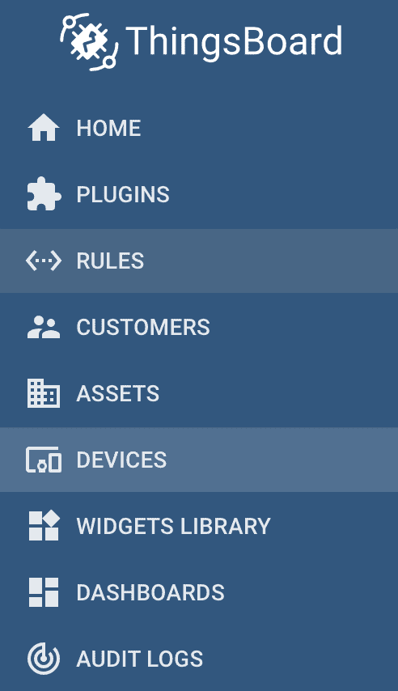
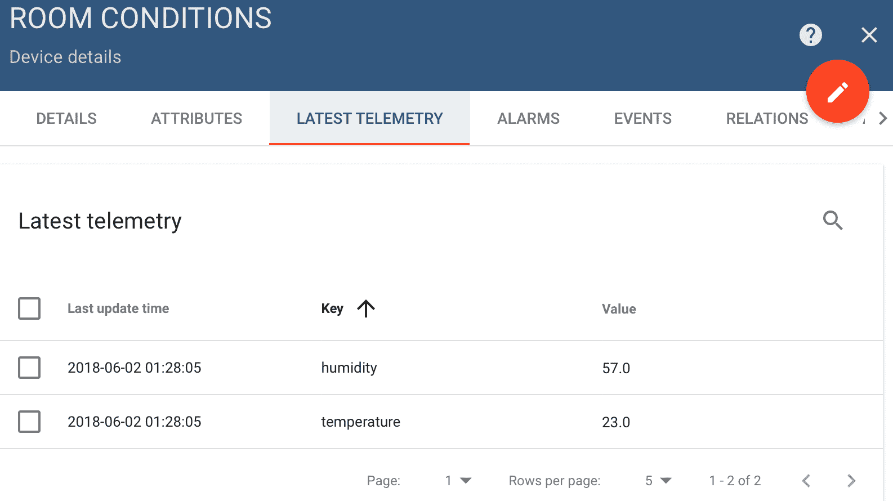
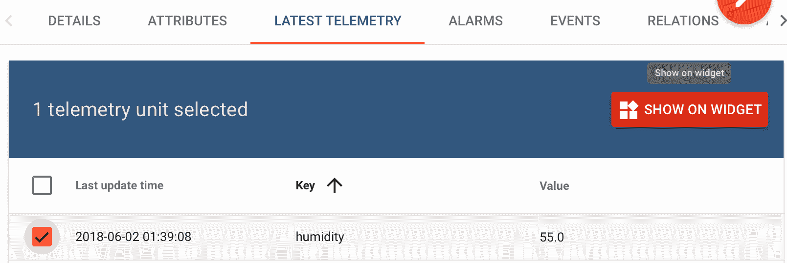
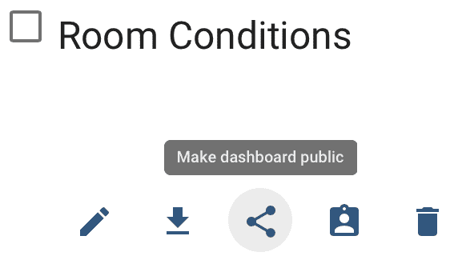
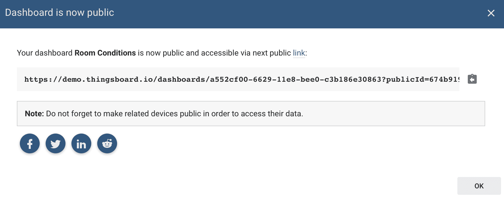
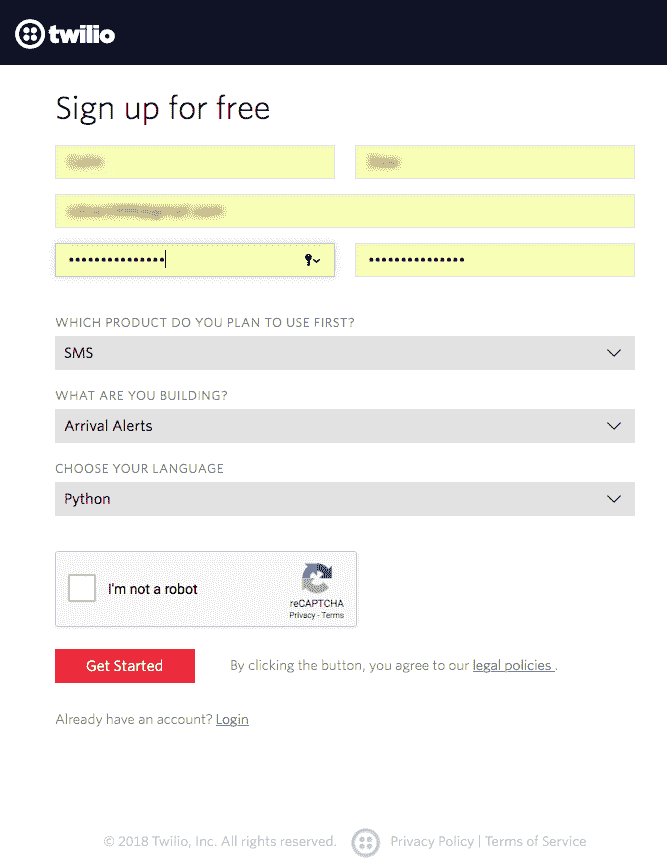
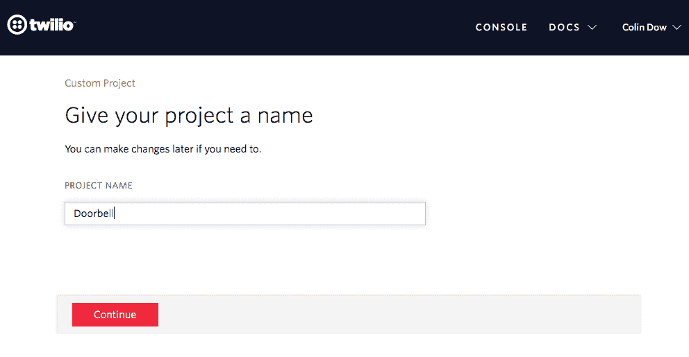
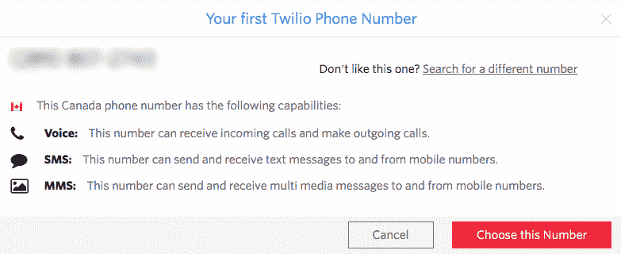
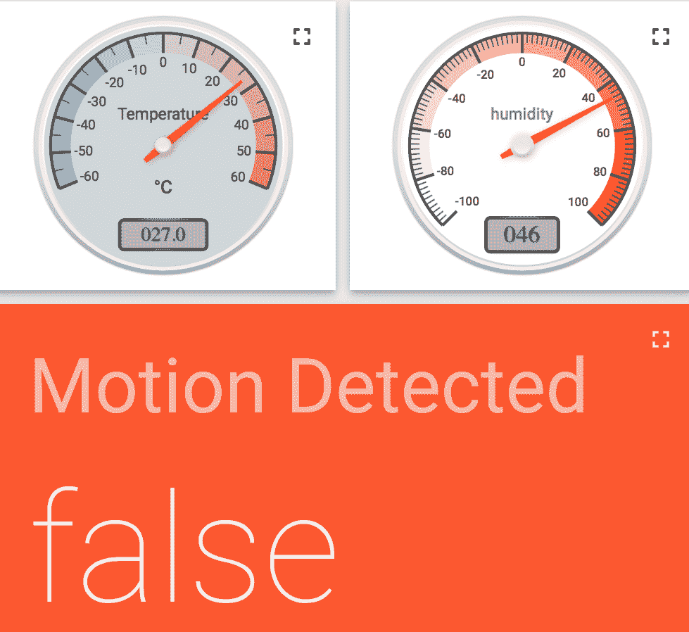

# 十、发布到 Web 服务

物联网的核心是允许与物理设备交互的 web 服务。在本章中，我们将探讨如何使用 web 服务来显示来自 Raspberry Pi 的感官数据。我们还将研究 Twilio，一种短信服务，以及如何使用该服务从 Raspberry Pi 向自己发送短信。

本章将介绍以下主题：

*   将感知数据发布到基于云的服务
*   设置用于发送短信的帐户

# 项目概述

在本章中，我们将编写代码，在物联网仪表板上显示我们的感官数据。除此之外，我们还将探索 Twilio，一种短信服务。然后我们将把这两个概念放在一起，以增强我们在[第 9 章](09.html)中构建的家庭安全仪表板，*构建家庭安全仪表板*。

# 开始

为完成本项目，需要以下各项：

*   Raspberry Pi 3 型（2015 型或更新型）
*   USB 电源
*   计算机显示器
*   USB 键盘
*   USB 鼠标

*   试验板
*   跨接导线
*   DHT-11 型温度传感器
*   PIR 传感器
*   按钮（闭锁）
*   钥匙开关（可选）

# 将感知数据发布到基于云的服务

在本节中，我们将使用 MQTT 协议将感官数据发布到在线仪表板。这将涉及到在 ThingsBoard 网站上建立一个账户，并利用`demo`环境。

# 安装 MQTT 库

我们将使用 MQTT 协议与 ThingsBoard 中的仪表板进行通信。要在 Raspberry Pi 上设置库，请执行以下操作：

1.  从主工具栏打开终端设备
2.  类型`**sudo pip3 install pho-mqtt**`
3.  您应该看到库的安装

# 设置帐户并创建设备

首先，导航至 ThingsBoard 网站[www.ThingsBoard.io](http://www.thingsboard.io)：

1.  单击屏幕顶部的“立即试用”按钮。向下滚动并单击 Thing Board Community Edition 部分下的 LIVE DEMO 按钮：


2.  您将看到一个注册窗口。输入适当的信息以设置帐户。成功设置帐户后，您将看到一个对话框，其中显示以下内容：


3.  点击登录进入应用程序。在此之后，您将在屏幕左侧看到一个菜单：



4.  点击设备。查看屏幕右下方带有加号的圆形橙色图形，如下所示：


5.  单击此橙色圆圈可添加新设备。键入`Room Conditions`作为名称*并在添加设备对话框中选择设备类型*的默认值。不要选择 Is 网关。单击添加：


6.  您应该会在设备下看到一个名为“房间条件”的新框：


7.  单击此框，菜单应从右侧滑动。单击复制访问令牌按钮将此令牌复制到剪贴板：


我们在这里所做的是建立一个 ThingsBoard 帐户，并在 ThingsBoard 中安装一个新设备。我们将使用此设备从树莓派中检索感官信息，并制作这些值的仪表板。

# 读取感官数据并发布到 ThingsBoard

现在是创建电路和代码的时候了。使用 GPIO 引脚 19 安装 DHT-11 传感器（如果您不确定如何将 DHT-11 传感器连接到 Raspberry Pi，请参阅[第 9 章](09.html)*构建家庭安全仪表板*：

1.  打开 Thonny 并创建一个名为`dht11-mqtt.py`的新文件。在文件中键入以下内容并运行它。确保从剪贴板粘贴访问令牌：

```py
from time import sleep
import Adafruit_DHT
import paho.mqtt.client as mqtt
import json

host = 'demo.thingsboard.io'
access_token = '<<access token>>'
dht_sensor = Adafruit_DHT.DHT11
pin = 19

sensor_data = {'temperature': 0, 'humidity': 0}

client = mqtt.Client()
client.username_pw_set(access_token)

while True:
    humidity, temperature = Adafruit_DHT
        .read_retry(dht_sensor, pin)

    print(u"Temperature: {:g}\u00b0C, Humidity
        {:g}%".format(temperature, humidity))

    sensor_data['temperature'] = temperature
    sensor_data['humidity'] = humidity
    client.connect(host, 1883, 20)
    client.publish('v1/devices/me/telemetry', 
        json.dumps(sensor_data), 1)
    client.disconnect()
    sleep(10)
```

2.  您应该在 shell 中看到类似于以下屏幕截图的输出：


3.  每 10 秒应该有一条新线路。正如你所看到的，房间里又热又潮湿

让我们仔细看看前面的代码：

1.  我们的`import`语句允许我们访问代码所需的模块：

```py
from time import sleep
import Adafruit_DHT
import paho.mqtt.client as mqtt
import json
```

我们已经熟悉了`sleep`、`Adafruit_DHT`和`json`。通过`Paho MQTT`库，我们可以访问`client`对象，我们将使用该对象将感官数据发布到仪表板。

2.  代码中的下两行用于为`demo`服务器的 URL 和我们之前从设备检索到的访问令牌设置变量。为了连接到 MQTT 服务器并发布我们的感知数据，我们需要这两个值：

```py
host = 'demo.thingsboard.io'
access_token = '<<access token>>'
```

3.  我们将`dht_sensor`变量定义为`Adafruit`库中的`DHT11`对象。我们使用针`19`作为传感器：

```py
dht_sensor = Adafruit_DHT.DHT11
pin = 19
```

4.  然后，我们定义一个`dictionary`对象来存储将发布到 MQTT 服务器的感知数据：

```py
sensor_data = {'temperature': 0, 'humidity': 0}
```

5.  然后我们创建一个`mqtt Client`类型的`client`对象。用户名和密码由前面代码中定义的`access_token`设置：

```py
client = mqtt.Client()
client.username_pw_set(access_token)
```

6.  连续的`while`循环包含读取感知数据的代码，然后将其发布到 MQTT 服务器。通过读取`read_retry`方法设置湿度和温度，我们设置相应的`sensor_data`字典值如下：

```py
while True:
    humidity, temperature = Adafruit_DHT
                                .read_retry(dht_sensor, pin)

    print(u"Temperature: {:g}\u00b0C, Humidity
               {:g}%".format(temperature, humidity))

    sensor_data['temperature'] = temperature
    sensor_data['humidity'] = humidity
```

7.  以下`client`代码是负责将我们的感知数据发布到 MQTT 服务器的代码。我们使用`client`对象的`connect`方法进行连接，传入主机值、端口（默认端口）和`20`秒的保持时间。与许多 MQTT 示例不同，我们不创建循环并查找回调，因为我们只对发布感知值感兴趣，而不订阅主题。在本例中，根据 ThingsBoard 文档示例代码，我们发布的主题是`v1/devices/me/telemetry`。然后我们断开与`client`的连接：

```py
client.connect(host, 1883, 20)
client.publish('v1/devices/me/telemetry', 
            json.dumps(sensor_data), 1)
client.disconnect()
sleep(10)
```

现在，我们将在 ThingsBoard 中创建一个仪表板，以显示从代码发送的感官值。

# 在 ThingsBoard 中创建仪表板

以下是将湿度值添加到仪表板的步骤：

1.  导航回 ThingsBoard 并单击设备，然后单击房间条件。侧边菜单应从右侧滑动：



2.  单击最新的遥测选项卡。
3.  您应该看到湿度和温度的值，以及这些值上次更新的时间。通过单击左侧的复选框选择湿度。现在，单击小部件上的显示：



4.  选择当前捆绑到模拟仪表，并在仪表之间循环，直到进入湿度刻度盘小部件。单击“添加到仪表板”按钮：


5.  选择新建仪表板，输入`Room Conditions`作为名称：


6.  不要选中“打开仪表板”复选框。单击添加按钮。
7.  对温度值重复前面的步骤。选择一个温度小部件，并将小部件添加到房间条件仪表板。这一次，请在单击“添加”之前选择“打开仪表板”：


您现在应该看到一个仪表板，其湿度和温度值以模拟刻度盘显示。

# 与朋友共享您的仪表板

如果要将此仪表板公开，以便其他人可以看到，则需要执行以下操作：

1.  通过单击仪表板导航到仪表板屏幕：


2.  单击“公开仪表板”选项：



3.  您将看到阅读仪表板的对话框现在是公共的，如下面的屏幕截图所示。您可以复制和粘贴 URL，或通过社交媒体共享：



# 设置用于发送短信的帐户

在本节中，我们将连接到文字信息传输服务，并从 Raspberry Pi 向手机发送文字信息。我们将利用这些信息，以及我们迄今为止在发布感官信息方面所学到的知识，在[第 9 章](09.html)*构建家庭安全仪表板*中对我们的安全仪表板进行增强

# 设置 Twilio 帐户

Twilio 是一项服务，它使软件开发人员能够通过使用其 web 服务 API 以编程方式创建和接收文本和电话呼叫。让我们从设置 Twilio 帐户开始：

1.  在 web 浏览器中，导航至[www.twilio.com](http://www.twilio.com)
2.  单击页面右上角的红色注册
3.  输入适当的个人信息和密码，然后为密码下方的字段选择 SMS、到达警报和 Python：



4.  提供通过 SMS 接收授权码的电话号码，如下所示：


5.  输入您收到的授权码，如下所示：


6.  下一步是命名您将要处理的项目。我们将把它命名为`Doorbell`。输入名称并单击“继续”：



7.  我们需要一个电话号码为我们的帐户，以便能够与之互动。单击获取号码：


8.  我们将向您提供一个号码。如果此号码适合您，请单击选择此号码：



9.  您现在已设置好并准备好使用 Twilio：


Twilio 是一种付费服务。你将得到一个初始数量的工作。请在创建应用程序之前检查使用此服务的成本。

# 在我们的树莓派上安装 Twilio

要从 Python 访问 Twilio，我们需要安装`twilio`库。打开终端并键入以下内容：

```py
pip3 install twilio
```

您应该可以看到终端中安装 Twilio 的进度。

# 通过 Twilio 发送文本

在发送文本之前，我们需要获取凭据。在您的 Twilio 帐户中，单击设置|常规，然后向下滚动到 API 凭据：


我们将同时使用 LIVE 凭据和测试凭据值。打开 Thonny 并创建一个名为`twilio-test.py`的新文件。在文件中键入以下代码并运行它。请确保粘贴 LIVE 凭据（请注意，发送文本将向您的帐户收取费用）：

```py
from twilio.rest import Client

account_sid = '<<your account_sid>>'
auth_token = '<<your auth_token>>'
client = Client(account_sid, auth_token)

message = client.messages.create(
                              body='Twilio says hello!',
                              from_='<<your Twilio number>>',
                              to='<<your cell phone number>>'
                          )
print(message.sid)
```

你应该在手机上看到一条短信，上面写着`Twilio says hello!`。

# 创建新的家庭安全仪表板

在[第 9 章](09.html)*构建家庭安全仪表板*中，我们使用 CherryPy 创建了家庭安全仪表板。物联网背后的力量是能够利用位于世界任何地方的设备构建相互连接的应用程序。我们将把这个想法带到我们的家庭安全仪表板。如果尚未组装，则使用[第 9 章](09.html)、*构建家庭安全仪表板*中的温度传感器构建家庭安全仪表板：

1.  我们将通过将感官数据封装在`class`容器中来启动代码。打开 Thonny 并创建一个名为`SensoryData.py`的新文件：

```py
from gpiozero import MotionSensor
import Adafruit_DHT

class SensoryData:
    humidity=''
    temperature=''
    detected_motion=''

    dht_pin = 19
    dht_sensor = Adafruit_DHT.DHT11
    motion_sensor = MotionSensor(4)

    def __init__(self):
        self.humidity, self.temperature = Adafruit_DHT
                            .read_retry(self.dht_sensor, 
                            self.dht_pin)

        self.motion_detected = self.motion_sensor.motion_detected

    def getTemperature(self):
        return self.temperature

    def getHumidity(self):
        return self.humidity

    def getMotionDetected(self):
        return self.motion_detected

if __name__ == "__main__":

    while True:
        sensory_data = SensoryData()
        print(sensory_data.getTemperature())
        print(sensory_data.getHumidity())
        print(sensory_data.getMotionDetected())

```

2.  运行程序来测试我们的传感器。这里没有什么我们没有讲过的。我们基本上只是测试我们的电路和传感器。您应该看到感官数据在外壳中打印出来。
3.  现在，让我们创建感官仪表板。打开 Thonny 并创建一个名为`SensoryDashboard.py`的新文件。代码如下：

```py
import paho.mqtt.client as mqtt
import json
from SensoryData import SensoryData
from time import sleep

class SensoryDashboard:

    host = 'demo.thingsboard.io'
    access_token = '<<your access_token>>'
    client = mqtt.Client()
    client.username_pw_set(access_token)
    sensory_data = ''

    def __init__(self, sensoryData):
        self.sensoryData = sensoryData

    def publishSensoryData(self):
        sensor_data = {'temperature': 0, 'humidity': 0,
                        'Motion Detected':False}

        sensor_data['temperature'] =  self.sensoryData
                                        .getTemperature()

        sensor_data['humidity'] = self.sensoryData.getHumidity()

        sensor_data['Motion Detected'] = self.sensoryData
                                        .getMotionDetected()

        self.client.connect(self.host, 1883, 20)
        self.client.publish('v1/devices/me/telemetry',         
                                json.dumps(sensor_data), 1)
        self.client.disconnect()

        return sensor_data['Motion Detected']

if __name__=="__main__":

    while True:
        sensoryData = SensoryData()
        sensory_dashboard = SensoryDashboard(sensoryData)

        print("Motion Detected: " +             
                str(sensory_dashboard.publishSensoryData()))

        sleep(10)
```

我们在这里所做的是将前面代码中的`dht-mqtt.py`文件封装在`class`容器中。我们用`SensoryData`对象实例化我们的对象，以便从传感器获取数据。`publishSensoryData()`方法将感官数据发送到我们的 MQTT 仪表板。注意它如何返回运动传感器的状态？我们在主循环中使用这个返回值来打印运动传感器的值。然而，这个返回值在我们未来的代码中会更有用。

让我们将运动传感器添加到 ThingsBoard 仪表板：

1.  在浏览器中打开 ThingsBoard
2.  单击设备菜单
3.  单击房间条件设备
4.  选择最新的遥测
5.  选择运动检测值
6.  点击显示窗口小部件
7.  在“卡片”下，找到由一个大橙色正方形组成的小部件，如下所示：


8.  单击添加到仪表板
9.  选择“现有房间条件”面板
10.  检查打开的仪表板
11.  单击添加

您应该会看到添加到房间条件仪表板的新小部件。通过单击页面右下角的橙色铅笔图标，您可以移动和调整小部件的大小。编辑小部件，使其看起来像以下屏幕截图：



我们在这里所做的是从[第 9 章](09.html)*中重新创建家庭安全仪表板的第一个版本，构建一个具有更分布式架构的家庭安全仪表板*。我们不再依靠我们的树莓派通过樱桃色的网页提供感官信息。我们能够将树莓派的作用降低为感官信息的来源。可以想象，在同一个仪表板上使用多个覆盆子 PI 是非常容易的。

通过靠近 PIR 传感器测试此新仪表板。查看是否可以将运动检测小部件更改为`true`。

为了使我们新的家庭安全仪表板更加分散，让我们添加在 PIR 运动传感器激活时发送文本消息的功能。打开 Thonny 并创建一个名为`SecurityDashboardDist.py`的新文件。以下是要插入到文件中的代码：

```py
from twilio.rest import Client
from SensoryData import SensoryData
from SensoryDashboard import SensoryDashboard
from gpiozero import Button
from time import time, sleep

class SecurityDashboardDist:
    account_sid = ''
    auth_token = ''
    time_sent = 0
    test_env = True 
    switch = Button(8)

    def __init__(self, test_env = True):
        self.test_env = self.setEnvironment(test_env)

    def setEnvironment(self, test_env):
        if test_env:
            self.account_sid = '<<your Twilio test account_sid>>'
            self.auth_token = '<<your Twilio test auth_token>>'
            return True
        else:
            self.account_sid = '<<your Twilio live account_sid>>'
            self.auth_token = '<<your Twilio live auth_token>>'
            return False

    def update_dashboard(self, sensoryDashboard):
        self.sensoryDashboard = sensoryDashboard

        motion_detected = self
                          .sensoryDashboard
                          .publishSensoryData()

        if motion_detected:
            return self.send_alert()
        else:
            return 'Alarm not triggered'

    def send_alert(self):
        if self.switch.is_pressed:
            return self.sendTextMessage()
        else:
            return "Alarm triggered but Not Armed"

    def sendTextMessage(self):
        message_interval = round(time() - self.time_sent)

        if message_interval > 600:
            twilio_client = Client(self.account_sid, 
                                   self.auth_token)

            if self.test_env:
                message = twilio_client.messages.create(
                            body='Intruder Alert',
                            from_= '+15005550006',
                            to='<<your cell number>>'
                          )
            else:
                message = twilio_client.messages.create(
                            body='Intruder Alert',
                            from_= '<<your Twilio number>>',
                            to='<<your cell number>>'
                          )

            self.time_sent=round(time())

            return 'Alarm triggered and text message sent - ' 
                    + message.sid
        else:
             return 'Alarm triggered and text 
                    message sent less than 10 minutes ago'   

if __name__=="__main__":  
    security_dashboard = SecurityDashboardDist()

    while True:
        sensory_data = SensoryData()
        sensory_dashboard = SensoryDashboard(sensory_data)
        print(security_dashboard.update_dashboard(
                sensory_dashboard))

        sleep(5)

```

利用[第 9 章](09.html)*中的第一版家庭安全仪表板电路*构建家庭安全仪表板，此代码使用按键开关，以便在运动传感器检测到运动时触发呼叫以发送文本消息。当钥匙开关处于 off（关闭）位置时，只要运动传感器检测到运动，您就会收到一条信息，内容为`Alarm triggered but Not Armed`。

如果尚未接通，则接通钥匙开关以接通电路。通过四处移动来激活运动传感器。您应该会收到一条短信已发送的通知。消息的 SID 也应该显示。你可能已经注意到你实际上没有收到短信。这是因为代码默认为 Twilio 测试环境。在打开 live 环境之前，让我们先看一下代码。

我们首先导入代码所需的库：

```py
from twilio.rest import Client
from SensoryData import SensoryData
from SensoryDashboard import SensoryDashboard
from gpiozero import Button
from time import time, sleep
```

这里没有太多我们以前没有见过的东西；然而，请注意`SensoryData`和`SensoryDashboard`进口。由于我们已经封装了读取感官数据的代码，现在我们可以把它看作一个黑匣子。我们知道我们需要用于安全仪表板的感官数据，但我们不关心如何获取这些数据以及数据将显示在何处。`SensoryData`允许我们访问所需的感官数据，`SensoryDashboard`将其发送到某个仪表板。我们不必在`SecurityDashboardDist.py`代码中关注这些细节。

我们为分布式安全仪表板创建了一个名为`SecurityDashboardDist`的类。通过名称来区分我们的类，并选择描述`class`是什么的名称，这一点很重要：

```py
class SecurityDashboardDist:
```

在声明了一些可在整个类中访问的类变量之后，我们将进入类初始化方法：

```py
    account_sid = ''
    auth_token = ''
    time_sent = 0
    test_env = True 
    switch = Button(8)

    def __init__(self, test_env = True):
        self.test_env = self.setEnvironment(test_env)
```

在`initialization`方法中，我们设置了类作用域`test_env`变量（对于`test`环境）。默认值为`True`，这意味着我们必须认真地覆盖默认值，以便实时运行仪表板。我们使用`setEnvironment()`方法设置`test_env`：

```py
def setEnvironment(self, test_env):
        if test_env:
            self.account_sid = '<<your Twilio test account_sid>>'
            self.auth_token = '<<your Twilio test auth_token>>'
            return True
        else:
            self.account_sid = '<<your Twilio live account_sid>>'
            self.auth_token = '<<your Twilio live auth_token>>'
            return False
```

`setEnvironment()`方法根据`test_env`的值，为测试环境或活动环境设置类范围的`account_id`和`auth_token`值。我们基本上只是通过`setEnvironment()`方法传回`test_env`的状态，同时设置启用测试或实时短信环境所需的变量。

`update_dashboard()`方法通过使用我们传递给该方法的`SensoryDashboard`对象来调用传感器和感官仪表板。这就是我们采用的面向对象方法的优点，因为我们不需要关心传感器的读取方式或仪表板的更新方式。我们只需传入一个`SensoryDashboard`对象即可完成此操作：

```py
def update_dashboard(self, sensoryDashboard):
        self.sensoryDashboard = sensoryDashboard

        motion_detected = self
                          .sensoryDashboard
                          .publishSensoryData()

        if motion_detected:
            return self.send_alert()
        else:
            return 'Alarm not triggered'
```

`update_dashboard`方法还负责通过检查运动传感器的状态来确定是否发送文本消息。你还记得当我们在`SensoryDashboard`类上调用`publishSensoryData()`方法时，我们是如何返回运动传感器的状态的吗？这就是它真正有用的地方。我们可以使用此返回值来确定是否应发送警报。我们根本不需要在课堂上检查运动传感器的状态，因为它很容易从`SensoryDashboard`课堂上获得。

`send_alert()`方法检查开关的状态，以确定是否应发送文本消息：

```py
def send_alert(self):
        if self.switch.is_pressed:
            return self.sendTextMessage()
        else:
            return "Alarm triggered but Not Armed"
```

您可能想知道为什么我们在这里检查传感器（本例中为开关）的状态，而不是从`SensoryDashboard`类检查它。答案是什么？我们正在通过封装一个感官数据仪表板来构建一个家庭安全仪表板。`SensorDashboard`类中不需要开关，因为它与打开和关闭从 GPIO 到 MQTT 仪表板的感官数据读取和传输无关。交换机是安全系统的域；在本例中，`SecurityDashboardDist`类

`SecurityDasboardDist`类的核心是`sendTextMessage()`方法，概述如下：

```py
def sendTextMessage(self):
        message_interval = round(time() - self.time_sent)

        if message_interval > 600:
            twilio_client = Client(self.account_sid, 
                                   self.auth_token)

            if self.test_env:
                message = twilio_client.messages.create(
                            body='Intruder Alert',
                            from_= '+15005550006',
                            to='<<your cell number>>'
                          )
            else:
                message = twilio_client.messages.create(
                            body='Intruder Alert',
                            from_= '<<your Twilio number>>',
                            to='<<your cell number>>'
                          )

            self.time_sent=round(time())

            return 'Alarm triggered and text message sent - ' 
                    + message.sid
        else:
             return 'Alarm triggered and text 
                    message sent less than 10 minutes ago'   
```

我们使用`message_interval`方法变量来设置文本之间的持续时间。我们不希望每次运动传感器检测到运动时都发送文本消息。在我们的例子中，文本之间的最小间隔时间是`600`秒，或者`10`分钟。

如果这是第一次，或者自上次发送文本消息以来已超过 10 分钟，那么代码将在测试环境中发送文本消息，或者直接在 live 中发送。注意`15005550006`电话号码如何用于测试环境。现场环境需要您的 Twilio 号码，`to`字段需要您自己的电话号码。对于测试环境和实时环境，返回`Alarm triggered and text message sent`消息，然后是消息的 SID。区别在于您实际上不会收到文本消息（尽管代码中有对 Twilio 的调用）。

如果距离上次发送短信不到 10 分钟，则短信将显示为`Alarm triggered and text message sent less than 10 minutes ago`。

在我们的主函数中，我们创建了一个`SecurityDashboardDist`对象并将其命名为`security_dashboard`。通过不传入任何内容，我们允许在默认情况下为测试环境设置仪表板：

```py
if __name__=="__main__":  
    security_dashboard = SecurityDashboardDist()

    while True:
        sensory_data = SensoryData()
        sensory_dashboard = SensoryDashboard(sensory_data)
        print(security_dashboard.update_dashboard(
                sensory_dashboard))

        sleep(5)
```

接下来的连续循环每 5 秒创建一个`SensoryData`和`SensoryDashboard`对象。`SensoryData`对象（`sensory_data`用于实例化`SensoryDashboard`对象（`sensory_dashboard`，因为前者为我们提供当前的感官数据，后者创建感官仪表板。

通过根据类的性质命名我们的类，并根据它们的作用命名我们的方法，代码变得非常不言自明。

然后我们将这个`SensoryDashboard`对象（`sensory_dashboard`传递给`SecurityDashboard`（`security_dashboard`的`update_dashboard`方法。由于`update_dashboard`方法返回一个字符串，我们可以使用它打印到 shell 中，因此每 5 秒可以看到仪表板的状态。我们将`SecurityDashboardDist`对象的实例化排除在循环之外，因为我们只需要设置一次环境。

现在我们了解了代码，是时候在实时 Twilio 环境中运行它了。请注意，当我们切换到 live 时，代码中唯一更改的部分是实际发送的文本消息。要将仪表板变成实时文本发送机器，只需将 main 方法的第一行更改为以下内容：

```py
security_dashboard = SecurityDashboardDist(True)
```

# 总结

完成本章后，我们应该非常熟悉将感官数据发布到物联网仪表板。我们还应该熟悉使用 TwilioWeb 服务从 Raspberry Pi 发送文本消息。

我们将在[第 11 章](11.html)*中查看蓝牙库，使用蓝牙*创建门铃按钮，然后将这些信息和我们在本章中获得的信息结合在一起制作物联网门铃。

# 问题

1.  我们用来从 Raspberry Pi 发送短信的服务的名称是什么？
2.  对还是错？我们使用 PIR 传感器读取温度和湿度值。
3.  如何在 ThingsBoard 中创建仪表板？
4.  对还是错？我们使用感官仪表板构建了增强的安全仪表板。
5.  我们用来读取温度和湿度感官数据的库的名称是什么？
6.  对还是错？我们需要发送文本消息的库预装了 Raspbian。
7.  在代码中命名类时，我们尝试做什么？
8.  是真是假？为了将我们的环境从测试环境更改为实时环境，我们是否必须在增强的家庭安全仪表板中重写整个代码。
9.  对还是错？我们的 Twilio 帐户的`account_sid`编号在实时环境中与在测试环境中相同。
10.  在`SecurityDashboardDist.py`代码中，我们在哪里创建`SecurityDashboardDist`对象？

# 进一步阅读

要进一步了解 Twilio 和 ThingsBoard 背后的技术，请参考以下链接：

*   Twilio 文档： [https://www.twilio.com/docs/quickstart](https://www.twilio.com/docs/quickstart)
*   ThingsBoard 的文档：
    [https://thingsboard.io/docs/](https://thingsboard.io/docs/)