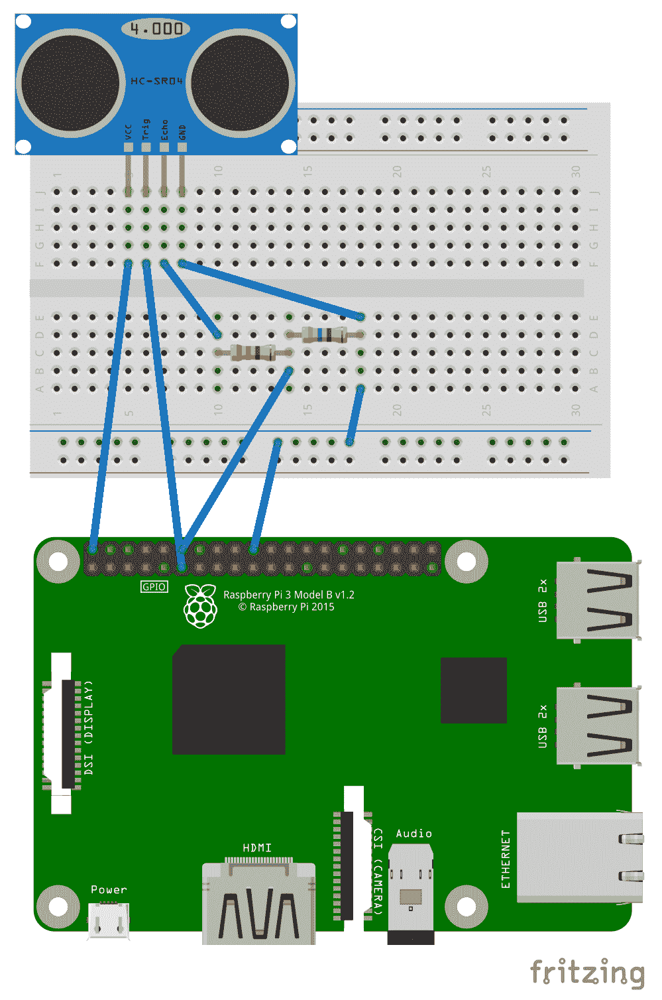
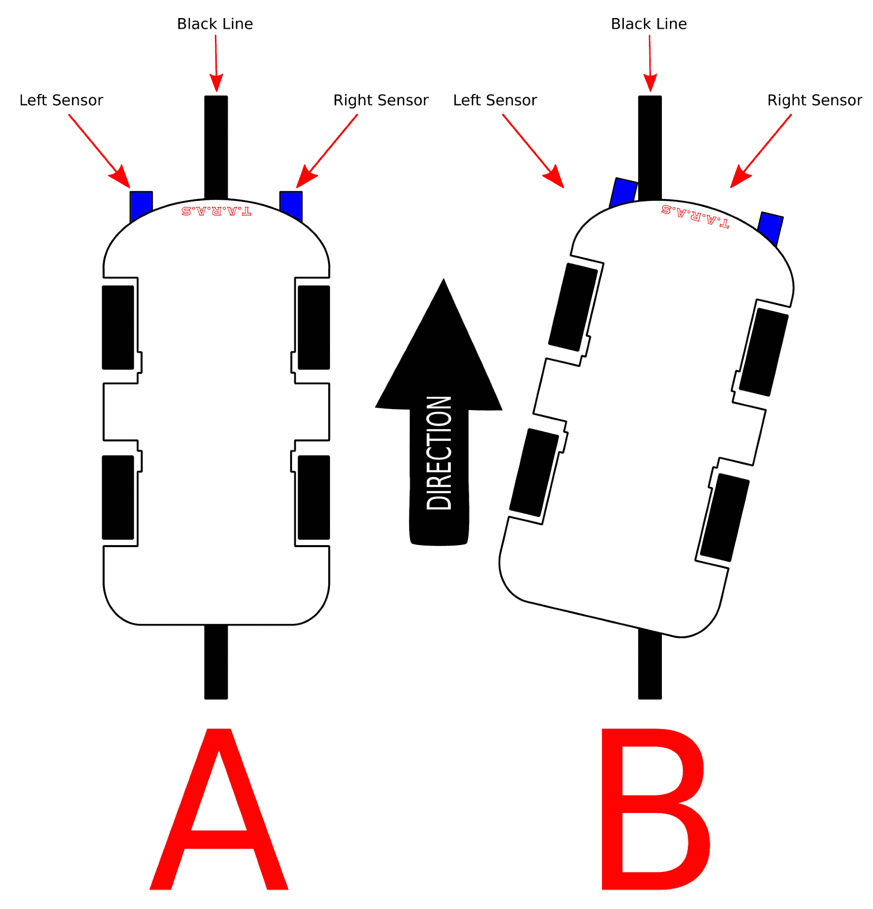
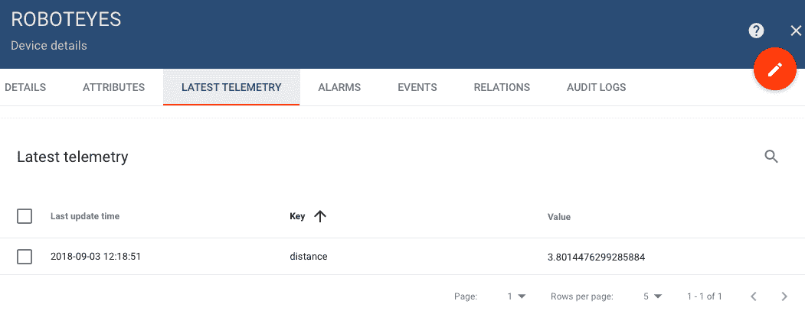
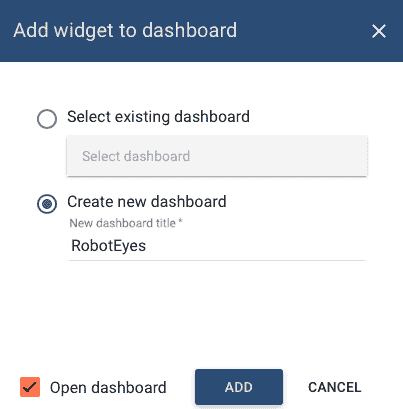

# 十五、将机器人车的感官输入连接到网络

为了使我们的机器人车 T.A.R.A.S 成为真正的物联网**产品**，我们必须将 T.A.R.A.S 连接到互联网。在本章中，我们将通过将距离传感器从 T.A.R.A.S 连接到网络，开始从桌面机器人到互联网机器人的转变。

本章将介绍以下主题：

*   识别机器人车上的传感器
*   用 Python 读取机器人车感知数据
*   向云发布机器人车感知数据

# 完成本章所需的知识

要完成本章，您应该已经建造了一辆 T.a.R.a.S 机器人车，如[第 13 章](13.html)、*介绍覆盆子 Pi 机器人车*中所述。与本书的其他章节一样，需要 Python 的实用知识，以及对面向对象编程的基本理解。

# 项目概述

本章中的项目将涉及从 T.A.R.A.S 向互联网发送感官距离数据。我们将使用 ThingsBoard 创建一个在线仪表板，它将在模拟仪表上显示此距离信息。

这个项目需要几个小时才能完成。

# 开始

为完成本项目，需要以下各项：

*   Raspberry Pi 3 型（2015 型或更新型）
*   USB 电源
*   计算机显示器
*   USB 键盘
*   USB 鼠标
*   一套完整的 T.A.R.A.S 机器人车套件（参见[第 13 章](13.html)、*介绍树莓派机器人车*）

# 识别机器人车上的传感器

在本书的整个过程中，我们使用了一些输入传感器。我们还将这些传感器的数据发布到网络上。T.A.R.A.S。使用距离传感器检测附近的物体，如下图所示：


第一次看 T.A.R.A.S，你不知道距离传感器的位置是可以原谅的。在 T.A.R.A.S 和许多其他机器人上，该传感器位于眼睛中。

以下是 T.a.R.a.S.上使用的 HC-SR04 距离传感器的照片：


If you do a Google image search for HC-SR04 on robots, you will see many, many robots that use this sensor. It is a very popular choice due to its low cost and wide availability, as well as its handy resemblance to eyes.

# 进一步了解 HC-SR04

如上所述，HC-SR04 是一种非常流行的传感器。易于编程，可从[www.aliexpress.com](http://www.aliexpress.com)上的多家供应商处获得。HC-SR04 提供从 2 厘米到 400 厘米的测量值，精确到 3 毫米以内。

GPIO Zero 库使从 HC-SR04 读取数据变得容易。下图是将此传感器与 Raspberry Pi 配合使用的接线图：



如您所见，HC-SR04 有四个引脚，其中两个用于信号输入和输出。接线图是我们在[第 13 章](13.html)*介绍树莓派机器人车*中用于连接 T.a.R.a.S 的接线图的一个子图。连接如下：

*   从 HC-SR04（距离传感器）触发至 Raspberry Pi 上的针脚 17
*   从 HC-SR04（距离传感器）到试验板上 330 欧姆电阻器左侧的回波

*   从 HC-SR04（距离传感器）到 Raspberry Pi 上 5V 的 VCC
*   从分压器到 Raspberry Pi 引脚 18 的输出
*   从 HC-SR04 到试验板上 470 欧姆电阻器右侧的接地

触发器是 HC-SR04 的输入，工作电压为 5V 或 3.3V。Echo 引脚是输出，设计用于 5V 电压。因为这对我们的树莓 Pi 来说有点太多了，所以我们使用分压器电路将电压降低到 3.3V。

我们可以在 T.A.R.A.S 中添加更多的传感器，使其更先进，包括线路跟踪传感器、温度传感器、光线传感器和 PID 传感器。线路跟踪传感器特别令人感兴趣，因为一条简单的线路可以为 T.a.R.a.S 提供一条在执行安全巡逻任务时可以遵循的路线，这是一个非常有用的补充。由于设计已经够复杂了，如果您愿意，我将让您添加此功能。

下图概述了测线跟踪传感器的工作原理：



在示意图中，您将看到机器人车前部有两个传感器。当机器人车转向一边时，一个传感器会将其拾取。在上一个示例中，**B**位置的汽车已向右转向。左侧传感器拾取该信号，程序通过向左转动机器人车进行修正，直到其返回位置**A**。

# 用 Python 读取机器人车感知数据

尽管我们之前已经讨论过这一点，但最好熟悉（或重新熟悉）HC-SR04 的编程：

1.  从应用程序菜单|编程| Thonny Python IDE 打开 Thonny。
2.  单击“新建”以创建新文件。
3.  键入以下内容：

```py
from gpiozero import DistanceSensor
from time import sleep

distance_sensor = DistanceSensor(echo=18, trigger=17)

while True:
    print('Distance: ', distance_sensor.distance*100)
    sleep(1)

```

4.  将文件另存为`distance-sensor-test.py`。
5.  运行代码。
6.  将手放在距离传感器前面。您应该在外壳中看到以下内容（取决于您的手离距离传感器的距离）：

```py
Distance: 5.05452024001
```

7.  当您将手靠近或远离距离传感器时，该值将发生变化。这段代码很容易解释。`distance_sensor = DistanceSensor(echo=18, trigger=17)`行设置一个类类型为`DistanceSensor`的`distance_sensor`对象，该对象具有适当的 pin 定义。每次调用`distance_sensor`的`distance`方法时，我们都会检索对象与 HC-SR04 的距离。要将该值转换为厘米，我们将其乘以 100。

现在，我们可以从距离传感器中检索值了，让我们修改代码，使其更加面向对象友好：

1.  从应用程序菜单|编程| Thonny Python IDE 打开 Thonny
2.  单击“新建”以创建新文件
3.  键入以下内容：

```py
from gpiozero import DistanceSensor
from time import sleep

class RobotEyes:

    distance_sensor = DistanceSensor(echo=18, trigger=17)

    def get_distance(self):
        return self.distance_sensor.distance*100

if __name__=="__main__":

    robot_eyes = RobotEyes()

    while True:
        print('Distance: ', robot_eyes.get_distance())
        sleep(1)
```

4.  将文件另存为`RobotEyes.py`
5.  运行代码

代码应该以与以前完全相同的方式运行。我们所做的唯一一件事就是将其封装在一个类中，以便对其进行抽象。当我们编写更多的代码时，这将使事情变得更容易。我们不需要记住 HC-SR04 连接到哪个引脚，实际上我们也不需要知道它是我们从中获取数据的距离传感器。此代码在视觉上比以前的代码更有意义。

# 将机器人车感知数据发布到云

在[第 10 章](10.html)*发布到 Web 服务*中，我们建立了一个 ThingsBoard 账户来发布感官数据。如果您尚未这样做，请在[www.ThingsBoard.io](https://thingsboard.io/)上设置一个帐户（有关如何操作的说明，请参阅[第 10 章](10.html)、*发布到 Web 服务*）。

# 创建一个 ThingsBoard 设备

要将距离传感器数据发布到 ThingsBoard，我们首先需要创建 ThingsBoard 设备：

1.  在[登录您的帐户 https://demo.thingsboard.io/login](https://demo.thingsboard.io/login)
2.  单击设备，然后单击屏幕右下角的大橙色+符号：


3.  输入`RobotEyes`作为名称，将设备类型保留为`default`，并在“说明”下输入有意义的说明
4.  单击添加
5.  点击`RobotEyes`可获得从右侧滑出的菜单
6.  单击复制访问令牌以将令牌复制到剪贴板上
7.  将令牌粘贴到文本文件中

对于我们的代码，我们将使用 MQTT 协议。如果您的 Raspberry Pi 上尚未安装 Paho MQTT 库，请执行以下操作：

1.  从 Raspberry Pi 主工具栏打开终端应用程序
2.  类型`sudo pip3 install pho-mqtt`

您应该看到库的安装。

现在是时候编写代码，将 T.A.R.A.s 的感官数据发布到 web 上了。我们将修改我们的`RobotEyes`类：

1.  从应用程序菜单|编程| Thonny Python IDE 打开 Thonny
2.  单击“新建”以创建新文件
3.  键入以下内容：

```py
from gpiozero import DistanceSensor
from time import sleep
import paho.mqtt.client as mqtt
import json

class RobotEyes:

    distance_sensor = DistanceSensor(echo=18, trigger=17)
    host = 'demo.thingsboard.io'
    access_token='<<access token>>'

    def get_distance(self):
        return self.distance_sensor.distance*100

    def publish_distance(self):
        distance = self.get_distance()
        sensor_data = {'distance': 0}
        sensor_data['distance'] = distance
        client = mqtt.Client()
        client.username_pw_set(self.access_token)
        client.connect(self.host, 1883, 20)
        client.publish('v1/devices/me/telemetry',
             json.dumps(sensor_data), 1)
        client.disconnect()

if __name__=="__main__":

    robot_eyes = RobotEyes()   
    while True:
        print('Distance: ', robot_eyes.get_distance())
        robot_eyes.publish_distance()
        sleep(5)

```

4.  确保将文本文件中的访问令牌粘贴到`access_token`变量
5.  将文件另存为`RobotEyesIOT.py`
6.  运行代码

您应该在 shell 中看到`distance`值，就像您之前所做的那样。但是，当您转到 ThingsBoard 并单击最新遥测时，您应该会看到相同的值，如下所示：



正如[第 10 章](10.html)*发布到 Web 服务*中一样，我们在这里完成的是将我们的距离传感器信息成功传输到互联网。我们现在可以从世界任何地方看到物体离我们的机器人车有多近。在上一张截图中，我们可以看到*距离*3.801 厘米。

再一次，我们已经编写了尽可能自解释的代码。然而，我们应该指出本课程的`publish_distance`方法：

```py
def publish_distance(self):
 distance = self.get_distance()
 sensor_data = {'distance': 0}
 sensor_data['distance'] = distance
 client = mqtt.Client()
 client.username_pw_set(self.access_token)
 client.connect(self.host, 1883, 20)
 client.publish('v1/devices/me/telemetry',
 json.dumps((sensor_data), 1)
 client.disconnect()
```

在这个方法中，我们首先创建一个名为`distance`的变量，用类`get_distance`方法中的实际距离信息填充该变量。创建了一个名为`sensor_data`的 Python 字典对象，用于存储`distance`值。从那里，我们创建了一个名为`client`的 MQTT 客户机对象。我们将密码设置为从 ThingsBoard 复制的`access_token`，然后使用标准 ThingsBoard 样板代码进行连接。

`client.publish`方法通过`json.dumps`方法将我们的`sensor_data`发送到 ThingsBoard。然后我们断开与`client`的连接以关闭连接。

现在，让我们使用距离感知数据创建一个仪表板小部件：

1.  在 ThingsBoard 中，单击最新遥测，并选中列表中`distance`值旁边的框：


2.  单击小部件上的显示
3.  在当前捆绑下，从下拉菜单中选择`Analogue gauges`，如下所示：


4.  选择最后一个小部件：


5.  单击顶部的“添加到仪表板”

6.  创建一个名为`RobotEyes`的新仪表板，并选中“打开仪表板”框：



7.  单击添加
8.  祝贺我们现在已经为 T.A.R.A.S.的感官距离信息创建了一个物联网仪表板小部件。通过此功能，我们可以全屏轻松查看信息：


# 总结

在本章中，我们通过将距离数据（从 T.A.R.A.S 的眼睛到其视野内任何物体的距离）发布到互联网，将 T.A.R.A.S 转变为真正的物联网。通过将我们的代码封装到一个名为`RobotEyes`的类中，我们可以忘记我们正在处理的是一个距离传感器，而只关注 T.a.R.a.S 的眼睛，就像声纳一样。

通过 ThingsBoard 中的演示平台，我们能够编写代码，将 T.A.R.A.S 的距离信息发送到仪表板小部件进行显示。如果我们真的想创新，我们可以通过伺服连接实际的模拟设备，并以这种方式显示距离信息（就像我们在[第 6 章](06.html)、*中使用伺服控制代码来控制模拟设备*。[第 16 章](16.html)、*中所做的那样）通过 Web 服务调用*来控制机器人车，我们将更进一步，开始从互联网上控制 T.a.R.a.S。

# 问题

1.  为什么我们在将 HC-SR04 连接到 Raspberry Pi 时使用分压器电路？
2.  是真是假？T.A.R.A.S.的眼睛可以透过声纳看到东西
3.  黑板上的装置是什么？
4.  对还是错？我们的类`RobotEyes`封装了 T.A.R.A.S.上使用的 Raspberry Pi 摄像头模块
5.  `RobotEyes.publish_distance`方法的作用是什么？
6.  是真是假？我们需要使用 MQTT 的库是用 Raspbian 预先安装的
7.  为什么我们把我们的班级命名为`RobotEyes`，而不是`RobotDistanceSensor`？
8.  对还是错？将样板代码封装在类中会使代码更难使用
9.  对还是错？GPIO Zero 库不支持距离传感器
10.  `RobotEyes.py`和`RobotEyesIOT.py`之间有什么区别？

# 进一步阅读

ThingsBoard 平台的一个很好的指导来源是它自己的网站。有关更多信息，请访问[www.thingsboard.io/docs/guides](https://thingsboard.io/docs/guides/)。