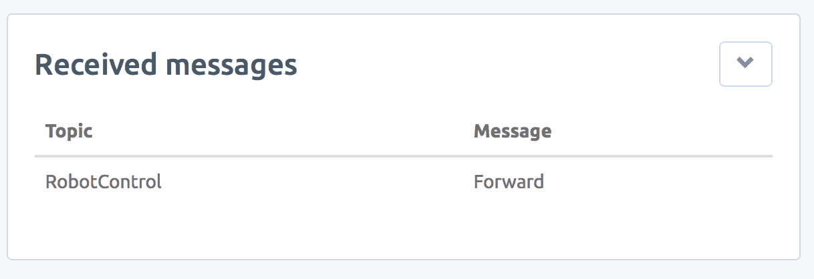
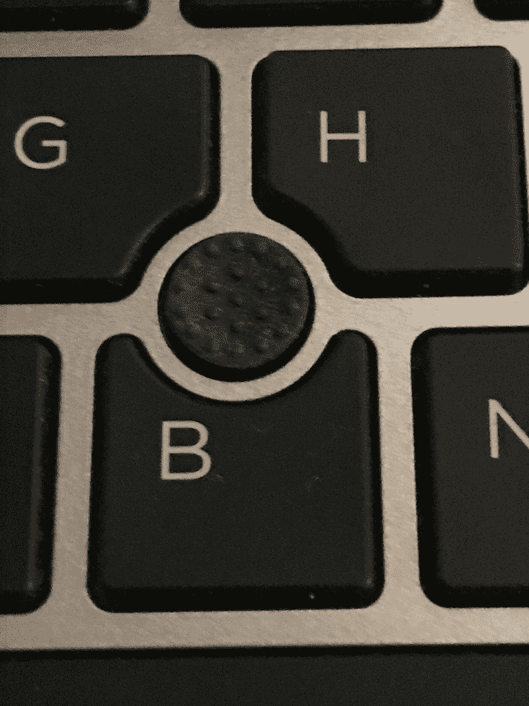

# 十八、把它们放在一起

最后，我们将让 T.A.R.A.S 响应使用 MQTT 从 JavaScript 客户端发送的控制信号。我们将通过修改到目前为止编写的代码来实现这一点。如果你从一开始就在读这本书，谢谢你的毅力。到这里是一段漫长的旅程。我们终于成功了。到本章结束时，我们将完成物联网设备的最终构建，即互联网控制的机器人车。

系好安全带（双关语）-是时候把 T.A.R.A.s 带到下一个层次了。

在本章中，我们将介绍以下主题：

*   构建一个 JavaScript 客户端以连接到我们的 Raspberry Pi
*   JavaScript 客户端访问我们的机器人车的感官数据
*   增强 JavaScript 客户端以控制我们的机器人车

# 项目概述

在本章中，我们将把 T.A.R.A.S 连接到 MQTT 代理。通过 MQTT 消息，我们将控制 T.A.R.A.S 的移动以及 T.A.R.A.S 上距离传感器的读取。下面是我们将要构建的内容的示意图：


我们将首先编写 HTML JavaScript 客户端（图中显示为**HTML 客户端**，并使用它发送和接收 MQTT 消息。然后，我们将把注意力转向在 T.A.R.A.S 上编写代码，以从同一 MQTT 代理发送和接收消息。我们将使用这些消息通过浏览器控制 T.A.R.A.S。最后，我们还将使用浏览器直播 T.A.R.A.S 的视频。

这个项目需要半天才能完成。

# 开始

为完成本项目，需要以下各项：

*   Raspberry Pi 3 型（2015 型或更新型）
*   USB 电源
*   计算机显示器
*   USB 键盘
*   USB 鼠标
*   T.A.R.A.S 机器人车

# 构建 JavaScript 客户端以连接到我们的 Raspberry Pi

下面是我们将构建的 HTML JavaScript 客户端的屏幕截图，用于通过网络控制 T.a.R.a.S。HTML JavaScript 客户端不会赢得任何设计奖项，但它将成为通过互联网发送机器人控制信息的优秀学习平台：


大紫色按钮用于向 T.A.R.A.S.发送`Forward`和`Backwards`命令。较小的绿色按钮向 T.A.R.A.S.发送`Turn Left`和`Turn Right`控制信息。底部的银色小按钮让我们可以使用 T.a.R.a.S 的相机拍照，在 T.a.R.a.S 上发出警报，让 T.a.R.a.S 跳舞。`Track Distance`按钮将 HTML JavaScript 客户端连接到来自 T.A.R.A.S 的远程信息

在为 Raspberry Pi 构建 Python MQTT 客户机之前，我们将使用 CloudMQTT 中的仪表板跟踪控制信息。

# 编写 HTML 代码

我们将首先为我们的 HTML JavaScript 客户端编写 HTML 代码。您可以使用 Raspberry Pi 以外的计算机：

1.  在您的计算机上创建一个`project`文件夹，并将其命名为`HTML JavaScript Client`
2.  将 Paho JavaScript 库从[第 17 章](17.html)*构建 JavaScript 客户端*复制到`project`文件夹中
3.  使用您喜爱的 HTML 编辑器，创建一个名为`index.html`的文件，并将其保存在您在*步骤 1*中创建的文件夹中
4.  在`index.html`中输入以下内容并再次保存：

```py
<html>
    <head>
        <title>T.A.R.A.S Robot Car Control</title>
        <script src="paho.javascript-1.0.3/paho-mqtt.js" 
                        type="text/javascript"></script>        
        <script src="scripts/index.js"        
                        type='text/javascript'></script>            

        <link rel="stylesheet" href="styles/styles.css">        
    </head>
    <body>
        <h2>T.A.R.A.S Robot Car Control</h2>
        <div>
            <button onclick="moveForward()" 
                            class="big_button">    
                <h4>Forward</h4>
            </button>
        </div>
        <div>
            <button onclick="turnLeft()" 
                            class="small_button">
                <h4>Turn Left</h4>
            </button>
            <button onclick="turnRight()" 
                            class="small_button">
                <h4>Turn Right</h4>
            </button>
        </div>
        <div>
            <button onclick="moveBackward()" 
                                class="big_button">        
                <h4>Backwards</h4>
            </button>
        </div>
        <div>
            <button onclick="takePicture()" 
                            class="distance_button">        
                <h4>Take Picture</h4>
            </button>
            <button onclick="TARASAlarm()" 
                            class="distance_button">        
                <h4>T.A.R.A.S Alarm</h4>
            </button>
            <button onclick="makeTARASDance()" 
                            class="distance_button">        
                <h4>T.A.R.A.S Dance</h4>
            </button>
            <button onclick="subscribeDistanceData()" 
                            class="distance_button">
                <h4>Track Distance</h4>
            </button>
            <input type="text" id="messageTxt" value="0" 
                            size=34 class="distance" />        
        </div>
    </body>
</html>
```

在浏览器中查看`index.html`之前，我们必须为样式创建一个`.css`文件。我们还将为 JavaScript 文件创建一个文件夹：

1.  在您的`project`文件夹中，创建一个新文件夹并将其命名为`styles`
2.  在`project`文件夹中创建另一个文件夹，并将其命名为`scripts`

3.  您的`project`目录应如下所示：


4.  在`styles`文件夹中，使用 HTML 编辑器创建一个名为`styles.css`的文件
5.  在`styles.css`文件中键入以下内容并保存：

```py
.big_button {
    background-color: rgb(86, 76, 175);
    border: none;
    color: white;
    padding: 15px 32px;
    text-align: center;
    text-decoration: none;
    display: inline-block;
    font-size: 16px;
    margin: 4px 2px;
    cursor: pointer;
    width: 400px;
}
.small_button {
    background-color: rgb(140, 175, 76);
    border: none;
    color: white;
    padding: 15px 32px;
    text-align: center;
    text-decoration: none;
    display: inline-block;
    font-size: 16px;
    margin: 4px 2px;
    cursor: pointer;
    width: 195px;
}
.distance_button {
    background-color: rgb(192, 192, 192);
    border: none;
    color: white;
    padding: 1px 1px;
    text-align: center;
    text-decoration: none;
    display: inline-block;
    font-size: 10px;
    margin: 2px 2px;
    cursor: pointer;
    width: 60px;
}
.distance {
    background-color: rgb(255, 255, 255);
    border: none;
    color: rgb(192,192,192);
    padding: 1px 1px;
    text-align: top;
    text-decoration: none;
    display: inline-block;
    font-size: 20px;
    margin: 2px 2px;
    cursor: pointer;
    width: 300px;
}
```

6.  打开浏览器并导航到`project`文件夹中的`index.html`文件
7.  你应该看到 T.A.R.A.S 机器人车控制仪表板

在我们添加 JavaScript 代码之前，让我们看看我们刚才写的内容。我们将从导入我们需要的资源开始。我们需要 Paho MQTT 库、一个`index.js`文件（我们尚未编写）和我们的`styles.css`文件：

```py
<script src="paho.javascript-1.0.3/paho-mqtt.js" 
                        type="text/javascript"></script>        
<script src="scripts/index.js"        
                        type='text/javascript'></script>            
<link rel="stylesheet" href="styles/styles.css"> 
```

然后，我们将创建一系列按钮，这些按钮将与即将编写的`index.js`JavaScript 文件中的函数相关联：

```py
<div>
    <button onclick="moveForward()" class="big_button">    
        <h4>Forward</h4>
     </button>
 </div>
```

由于我们的按钮非常相似，我们将只讨论第一个按钮。第一个按钮通过`onclick`属性绑定到 JavaScript 文件中的`moveForward`函数。通过将`class`指定给`big_button`来设置按钮的样式。我们使用第一个按钮向前移动 T.A.R.A.S。

# 编写 JavaScript 代码以与 MQTT 代理通信

现在我们有了 HTML 和 CSS 文件，让我们创建一个 JavaScript 文件，它将实现 MQTT 的魔力：

1.  在`scripts`文件夹中，使用 HTML 编辑器创建一个名为`index.js`的文件。
2.  在`index.js`文件中键入以下内容并保存：

```py
function moveForward() {
    client = new Paho.MQTT.Client("m10.cloudmqtt.com", 38215, "web_" + parseInt(Math.random() * 100, 10));

    // set callback handlers
    client.onConnectionLost = onConnectionLost;
    var options = {
        useSSL: true,
        userName: "vectydkb",
        password: "ZpiPufitxnnT",
        onSuccess: sendMoveForwardMessage,
        onFailure: doFail
    }

    // connect the client
    client.connect(options);
}

// called when the client connects
function sendMoveForwardMessage() {
    message = new Paho.MQTT.Message("Forward");
    message.destinationName = "RobotControl";
    client.send(message);
}

function moveBackward() {
    client = new Paho.MQTT.Client("m10.cloudmqtt.com", 38215, "web_" + parseInt(Math.random() * 100, 10));

    // set callback handlers
    client.onConnectionLost = onConnectionLost;
    var options = {
        useSSL: true,
        userName: "vectydkb",
        password: "ZpiPufitxnnT",
        onSuccess: sendMoveBackwardMessage,
        onFailure: doFail
    }

    // connect the client
    client.connect(options);
}

// called when the client connects
function sendMoveBackwardMessage() {
    message = new Paho.MQTT.Message("Backward");
    message.destinationName = "RobotControl";
    client.send(message);
}

function turnLeft() {
    client = new Paho.MQTT.Client("m10.cloudmqtt.com", 38215, "web_" + parseInt(Math.random() * 100, 10));

    // set callback handlers
    client.onConnectionLost = onConnectionLost;
    var options = {
        useSSL: true,
        userName: "vectydkb",
        password: "ZpiPufitxnnT",
        onSuccess: sendTurnLeftMessage,
        onFailure: doFail
    }

    // connect the client
    client.connect(options);
}

// called when the client connects
function sendTurnLeftMessage() {
    message = new Paho.MQTT.Message("Left");
    message.destinationName = "RobotControl";
    client.send(message);
}

function turnRight() {
    client = new Paho.MQTT.Client("m10.cloudmqtt.com", 38215, "web_" + parseInt(Math.random() * 100, 10));

    // set callback handlers
    client.onConnectionLost = onConnectionLost;
    var options = {
        useSSL: true,
        userName: "vectydkb",
        password: "ZpiPufitxnnT",
        onSuccess: sendTurnRightMessage,
        onFailure: doFail
    }

    // connect the client
    client.connect(options);
}

// called when the client connects
function sendTurnRightMessage() {
    message = new Paho.MQTT.Message("Right");
    message.destinationName = "RobotControl";
    client.send(message);
}

function takePicture() {
    client = new Paho.MQTT.Client("m10.cloudmqtt.com", 38215, "web_" + parseInt(Math.random() * 100, 10));

    // set callback handlers
    client.onConnectionLost = onConnectionLost;
    var options = {
        useSSL: true,
        userName: "vectydkb",
        password: "ZpiPufitxnnT",
        onSuccess: sendTakePictureMessage,
        onFailure: doFail
    }

    // connect the client
    client.connect(options);
}

// called when the client connects
function sendTakePictureMessage() {
    message = new Paho.MQTT.Message("Picture");
    message.destinationName = "RobotControl";
    client.send(message);
}

function TARASAlarm() {
    client = new Paho.MQTT.Client("m10.cloudmqtt.com", 38215, "web_" + parseInt(Math.random() * 100, 10));

    // set callback handlers
    client.onConnectionLost = onConnectionLost;
    var options = {
        useSSL: true,
        userName: "vectydkb",
        password: "ZpiPufitxnnT",
        onSuccess: sendTARASAlarmMessage,
        onFailure: doFail
    }

    // connect the client
    client.connect(options);
}

// called when the client connects
function sendTARASAlarmMessage() {
    message = new Paho.MQTT.Message("Alarm");
    message.destinationName = "RobotControl";
    client.send(message);
}

function makeTARASDance() {
    client = new Paho.MQTT.Client("m10.cloudmqtt.com", 38215, "web_" + parseInt(Math.random() * 100, 10));

    // set callback handlers
    client.onConnectionLost = onConnectionLost;
    var options = {
        useSSL: true,
        userName: "vectydkb",
        password: "ZpiPufitxnnT",
        onSuccess: makeTARASDanceMessage,
        onFailure: doFail
    }

    // connect the client
    client.connect(options);
}

// called when the client connects
function makeTARASDanceMessage() {
    message = new Paho.MQTT.Message("Dance");
    message.destinationName = "RobotControl";
    client.send(message);
}

function doFail() {
    alert("Error!");
}

// called when the client loses its connection
function onConnectionLost(responseObject) {
    if (responseObject.errorCode !== 0) {
        alert("onConnectionLost:" + responseObject.errorMessage);
    }
}

// called when a message arrives
function onMessageArrived(message) {
    document.getElementById('messageTxt').value = message.payloadString; 
}

function onsubsribeDistanceDataSuccess() {
    client.subscribe("distance");
    alert("Subscribed to distance data");
}

function subscribeDistanceData() {
    client = new Paho.MQTT.Client("m10.cloudmqtt.com", 38215, "web_" + parseInt(Math.random() * 100, 10));

    // set callback handlers
    client.onConnectionLost = onConnectionLost;
    client.onMessageArrived = onMessageArrived;
    var options = {
        useSSL: true,
        userName: "vectydkb",
        password: "ZpiPufitxnnT",
        onSuccess: onsubsribeDistanceDataSuccess,
        onFailure: doFail
    }

    // connect the client
    client.connect(options);
}
```

3.  我在代码中保留了 CloudMQTT 实例的值。正如我们在[第 17 章](17.html)*构建 JavaScript 客户端*中所做的那样，将这些值替换为您实例中的值（`Server`、`Websockets Port`、`userName`、`password`）

4.  在浏览器中导航回`index.html`并刷新页面。
5.  我们现在有了 HTML JavaScript 客户端。我们基本上做的是修改[第 17 章](17.html)中的`index.js`代码*构建 JavaScript 客户端*，以便我们可以将控制消息发送给我们的 MQTT 代理，最终发送给我们的机器人车：

```py
function moveForward() {
    client = new Paho.MQTT.Client("m10.cloudmqtt.com", 38215, "web_" + parseInt(Math.random() * 100, 10));

    // set callback handlers
    client.onConnectionLost = onConnectionLost;
    var options = {
        useSSL: true,
        userName: "vectydkb",
        password: "ZpiPufitxnnT",
        onSuccess: sendMoveForwardMessage,
        onFailure: doFail
    }

    // connect the client
    client.connect(options);
}

// called when the client connects
function sendMoveForwardMessage() {
    message = new Paho.MQTT.Message("Forward");
    message.destinationName = "RobotControl";
    client.send(message);
}
```

我们已经更改了前面示例中的代码。`moveForward`函数创建一个名为`client`的 Paho MQTT 客户机，其中包含取自 CloudMQTT 实例的`Server`和`Websockets Port`连接信息。`onConnectionLost`函数设置了连接丢失时要处理的回调处理程序。`options`变量是使用我们的`userName`和`password`信息创建的，这些信息取自我们的 CloudMQTT 实例。我们成功地将 MQTT 代理连接到`sendMoveForwardMessage`函数。然后，我们通过传入`options`变量连接到客户机

`sendMoveForwardMessage`函数创建一个名为`Forward`的新 Paho MQTT 消息。然后将此消息分配给`RobotControl`主题，并使用我们的 Paho MQTT 客户机对象`client`发送。

发送信息向后移动、向右转弯、向左转弯、拍照、触发警报和跳舞的功能以类似于`moveForward`功能的方式编写。

现在我们已经构建了用于通过 web 控制 T.A.R.A.S 的 HTML JavaScript 客户端，让我们使用 CloudMQTT 实例上的`WEBSOCKETS UI`页面进行测试：

1.  导航回您的 CloudMQTT 帐户。
2.  选择获取服务器、用户、密码和 web 套接字端口连接信息的实例（在[第 17 章](17.html)、*构建 JavaScript 客户端*中，我们创建了名为`T.A.R.A.S`的实例）。
3.  单击左侧的 WEBSOCKETS UI 菜单选项。您应该在右侧看到一个通知，指示连接成功。
4.  导航回`index.html`并单击前进按钮。
5.  现在，导航回 CloudMQTT 实例。您应该会在`Received messages`列表中看到一条新消息：



祝贺您刚刚将一个 HTML JavaScript 客户端连接到 MQTT 代理并发送了一条消息。现在，我们将在另一台设备上使用完全不同的编程语言开发另一个客户端，然后使用该客户端订阅来自 HTML JavaScript 客户端的消息。

# 创建一个 JavaScript 客户端来访问我们的机器人车的感官数据

我们创建的`index.js`文件包含将 HTML JavaScript 客户端订阅到`distance`主题的函数：

```py
function subscribeDistanceData() {
    client = new Paho.MQTT.Client("m10.cloudmqtt.com", 38215, "web_" + parseInt(Math.random() * 100, 10));

    // set callback handlers
    client.onConnectionLost = onConnectionLost;
    client.onMessageArrived = onMessageArrived;
    var options = {
        useSSL: true,
        userName: "vectydkb",
        password: "ZpiPufitxnnT",
        onSuccess: onsubsribeDistanceDataSuccess,
        onFailure: doFail
    }

    // connect the client
    client.connect(options);
}

function onsubsribeDistanceDataSuccess() {
    client.subscribe("distance");
    alert("Subscribed to distance data");
}
```

与我们在[第 17 章](17.html)*构建 JavaScript 客户端*中编写的代码类似，`subscribeDistanceData`函数使用我们的 CloudMQTT 实例中的连接信息创建一个 Paho MQTT 客户端。连接成功后，调用`onsubscribeDistanceDataSuccess`函数，订阅`client`到`distance`主题。

还创建了一个警报，告诉我们 HTML JavaScript 客户端现在订阅了`distance`主题。

# 为 T.A.R.A.S.编写代码

现在，我们将把注意力转向 Raspberry Pi 机器人车，并编写 Python 代码与 MQTT 代理以及最终的 HTML JavaScript 客户端进行通信。以下代码应直接从 T.A.R.A.S.运行。如果您想在没有系带的情况下运行 T.A.R.A.S，请使用 USB 电源为 Raspberry Pi 供电，并在运行以下程序后断开 HDMI 电缆的连接：

1.  从应用程序菜单|编程| Thonny Python IDE 打开 Thonny。
2.  单击新建图标创建一个新文件。

3.  在文件中键入以下代码：

```py
import paho.mqtt.client as mqtt
from time import sleep
from RobotDance import RobotDance
from RobotWheels import RobotWheels
from RobotBeep import RobotBeep
from RobotCamera import RobotCamera
from gpiozero import DistanceSensor

distance_sensor = DistanceSensor(echo=18, trigger=17)

def on_message(client, userdata, message):
    command = message.payload.decode("utf-8")

    if command == "Forward":
        move_forward()
    elif command == "Backward":
        move_backward()
    elif command == "Left":
        turn_left()
    elif command == "Right":
        turn_right()
    elif command == "Picture":
        take_picture()
    elif command == "Alarm":
        sound_alarm()
    elif command == "Dance":
        robot_dance()

def move_forward():
    robotWheels = RobotWheels()
    robotWheels.move_forward()
    sleep(1)
    print("Moved forward")
    robotWheels.stop()
    watchMode()

def move_backward():
    robotWheels = RobotWheels()
    robotWheels.move_backwards()
    sleep(1)
    print("Moved backwards")
    robotWheels.stop()
    watchMode()

def turn_left():
    robotWheels = RobotWheels()
    robotWheels.turn_left()
    sleep(1)
    print("Turned left")
    robotWheels.stop()
    watchMode()

def turn_right():
    robotWheels = RobotWheels()
    robotWheels.turn_right()
    print("Turned right")
    robotWheels.stop()
    watchMode()

def take_picture():
    robotCamera = RobotCamera()
    robotCamera.take_picture()
    watchMode()

def sound_alarm():
    robotBeep = RobotBeep()
    robotBeep.play_song()

def robot_dance():
    robotDance = RobotDance()
    robotDance.lets_dance_incognito()
    print("Finished dancing now back to work")
    watchMode()

def watchMode():
    print("Watching.....")
    mqttc = mqtt.Client()
    mqttc.username_pw_set("vectydkb", "ZpiPufitxnnT")
    mqttc.connect('m10.cloudmqtt.com', 18215)
    mqttc.on_message = on_message
    mqttc.subscribe("RobotControl")

    while True:
        distance = distance_sensor.distance*100
        mqttc.loop()
        mqttc.publish("distance", distance)
        sleep(2)

watchMode()
```

4.  将文件另存为`MQTT-RobotControl.py`。
5.  从 Thonny 运行代码。
6.  导航到 HTML JavaScript 客户端并单击“前进”按钮：


7.  T.A.R.A.S 应向前移动一秒钟，然后停止。
8.  底部的灰色小按钮允许您使用 T.A.R.A.S 执行各种任务：


9.  通过单击这些按钮，了解它们的功能。`Take Picture`按钮将拍摄照片并存储在文件系统中，`T.A.R.A.S Alarm`将在 T.a.R.a.S 上发出警报，`T.A.R.A.S Dance`将使 T.a.R.a.S 跳舞。
10.  要订阅来自 T.A.R.A.S 上距离传感器的`distance`数据，请单击轨道距离按钮：


11.  单击“轨迹距离”按钮后，您会看到一个弹出窗口，告诉您您的 HTML JavaScript 客户端现在订阅了`distance`数据：


12.  单击关闭关闭弹出窗口。您现在应该可以看到 T.A.R.A.S 的距离数据信息显示在“轨迹距离”按钮旁边。
13.  与我们迄今为止所编写的所有代码一样，我们编写的代码尽可能简单和自解释。我们代码的核心是`watch_mode`方法：

```py
def watchMode():
    print("Watching.....")
    mqttc = mqtt.Client()
    mqttc.username_pw_set("vectydkb", "ZpiPufitxnnT")
    mqttc.connect('m10.cloudmqtt.com', 18215)
    mqttc.on_message = on_message
    mqttc.subscribe("RobotControl")

    while True:
        distance = distance_sensor.distance*100
        mqttc.loop()
        mqttc.publish("distance", distance)
        sleep(2)
```

`watch_mode`方法是我们代码中的默认方法。它在代码运行后立即调用，并在另一个方法完成时调用。在`watch_mode`中，我们需要创建一个名为`mqttc`的 MQTT 客户机对象，然后使用它连接到我们的 CloudMQTT 实例。从那里，我们将`on_message`回调设置为`on_message`方法。然后我们订阅`RobotControl`主题。随后的 while 循环调用我们的 MQTT 客户机的`loop`方法`mqttc`。由于我们已经设置了`on_message`回调，每当收到来自`RobotControl`主题的消息时，程序就会从 while 循环中取出，并执行代码的`on_message`方法。

在`watch_mode`中，距离感信息每 2 秒发布到`distance`主题。由于我们的 HTML JavaScript 客户端被设置为订阅关于`distance`主题的消息，我们的 HTML JavaScript 客户端将每两秒钟更新页面上的`distance`信息。

# T.A.R.A.S.直播视频

虽然能够从网络上控制 T.A.R.A.S 是令人惊讶的，但如果我们看不到我们在做什么，它也没有多大用处。如果在 Raspberry Pi 上安装 RPi Cam Web 界面，则从 Raspberry Pi 流式传输实时视频实际上非常简单。让我们现在就这样做：

1.  如果您的 Raspberry Pi 上没有安装`git`，请使用终端上的`sudo apt-get install git`进行安装。
2.  使用终端，运行`git clone https://github.com/silvanmelchior/RPi_Cam_Web_Interface.git`命令获取安装文件。
3.  使用`cd RPi_Cam_Web_Interface`命令更改目录。
4.  使用`./install.sh`命令运行安装程序。

5.  您应该看到配置选项屏幕：


6.  点击键盘上的*选项卡*接受所有默认设置，直到 OK 选项突出显示。点击*进入*。
7.  当您看到“立即启动摄影机系统”对话框时，选择“是”：


8.  我们现在准备好从我们的 Raspberry Pi（T.A.R.A.S.）直播视频。在另一台计算机上，打开浏览器并键入地址`http://<<ip address of your raspberry pi>>/html`（在 Raspberry Pi 上使用`ifconfig`以查找您的 IP 地址；在我的情况下，视频流的 URL 是`http://192.168.0.31/html`。
9.  您现在应该可以看到视频流播放器通过 Raspberry Pi 的实时视频加载到浏览器中。下面是我办公室的 T.a.R.a.S.现场直播的屏幕截图，查看我的无人机：


RPi Cam Web 界面实用程序是一个了不起的工具。花一些时间来试验各种可用的选项和功能。

# 增强 JavaScript 客户端以控制我们的机器人车

正如我们已经提到的，我们的 HTML JavaScript 客户端是最有吸引力的接口。为了解释各种概念，我将其设计得尽可能简单明了。但是如果我们想把它提升到另一个层次呢？以下是可用于增强我们的 HTML JavaScript 客户端的 JavaScript 库列表。

# 乳头

乳头.js（[https://www.bypeople.com/touch-screen-joystick/](https://www.bypeople.com/touch-screen-joystick/) 是一个 JavaScript 触摸屏操纵杆库，可用于控制机器人。Stiple.js 基本上是一些笔记本电脑上的指向棒控件的屏幕版本：



如果您正在为触摸屏平板电脑或笔记本电脑创建 JavaScript 客户端，那么 tippy.js 可能是一种很好的构建技术。在我们的设计中加入 Stiple.js 这样的技术需要相当多的编码，以便将动作转化为 T.a.R.a.S 能够理解的信息。简单的转发消息可能不够。该消息可能类似于`Forward-1-Left-2.3`，必须对其进行解析并提取信息，以确定如何转动电机以及移动哪些电机。

# HTML5 游戏板 API

你想连接一个物理操纵杆来控制我们的机器人车吗？您可以使用 HTML5 Gamepad API（[实现此目的 https://www.w3.org/TR/gamepad/](https://www.w3.org/TR/gamepad/) ）。使用 HTML5 Gamepad API，您可以在构建的 web 应用程序中使用标准游戏操纵杆。控制你的机器人车可能和使用 HTML5 Gamepad API 玩你最喜欢的视频游戏一样简单。

# 强尼五号

约翰尼五号（[http://johnny-five.io](http://johnny-five.io) 是一个 JavaScript 机器人和物联网平台。这是一个完全不同于我们开发机器人车的平台。现在，我们已经从零开始建造了我们的机器人车，并且手工编写了控制代码，我们可能有兴趣尝试一些新的东西。约翰尼五号可能是你决定成为专家的下一项技术。

# 总结

我们已经做到了！我们已经走到了 Raspberry Pi 物联网旅程的终点。在本章中，我们将学到的知识结合在一起，创建了自己的 HTML JavaScript 客户端，用于使用网页控制 T.A.R.A.S。我们使用类来控制 T.A.R.A.S 使得创建控制代码相对容易，因为我们只需调用类上的方法，而不必从头开始创建控制代码。

我们简要地谈到了从我们的树莓 Pi 流式直播视频是多么容易。尽管我们做了所有这些来控制我们网络上的机器人车，但不难想象我们如何利用所学知识，使用 Raspberry Pi 构建任意数量的不同物联网项目

我们生活在一个非常激动人心的时代。我们中的任何一个人都可能只用我们的智慧和一些相对便宜的电子元件来构建下一个杀手级应用程序。如果有什么不同的话，我希望我能够激励你使用令人惊叹的树莓 Pi 计算机来构建下一个伟大的项目。

For those who are questioning how we may view this as an Internet of Things project when we are only using our local network, please do some research into how you can open up ports on your router to the outside world. This is not a task that should be taken lightly, though, as there are security concerns that you must address whenever you do something like that. Please note, too, however, that your Internet Service Provider may not be giving you a static IP address and thus anything you build to access your network from the outside will break every time your IP address changes (I once built a PHP page that checked my IP address periodically, stored the latest address, and had outside clients which would go to that PHP for the address instead of having it hardcoded).

# 问题

1.  我们在项目中将控件类型消息发布到哪个主题？
2.  对还是错？MQTT 代理和 MQTT 服务器是用来描述同一事物的词。
3.  对还是错？T.A.R.A.S 发布和订阅同一 MQTT 主题。
4.  HTML JavaScript 客户端中的大向前和向后按钮是什么颜色？

5.  对还是错？使用 HTML JavaScript 客户端，我们可以使用 T.a.R.a.S 上的摄像头远程拍照。
6.  我们用于订阅来自 T.A.R.A.S 的距离数据的 MQTT 主题的名称是什么？
7.  对还是错？我们的 HTML JavaScript 客户端包含了一个屡获殊荣的 UI 设计。
8.  对还是错？使用 CloudMQTT 帐户，我们可以在实例中查看已发布的消息。
9.  我们用来从 T.A.R.A.S.直播视频的技术的名称是什么？
10.  对还是错？Johnny Five 是可口可乐公司开发的一种新型水果饮料的名字。

# 进一步阅读

当我们在 T.A.R.A.S.上设置实时流媒体时，我们简要介绍了 RPi Cam 网络界面。这个 web 界面非常令人惊奇，对它的更深入的理解只会增强我们对 Raspberry Pi 的所有能力的掌握。请访问[https://elinux.org/RPi-Cam-Web-Interface](https://elinux.org/RPi-Cam-Web-Interface) 了解更多信息。