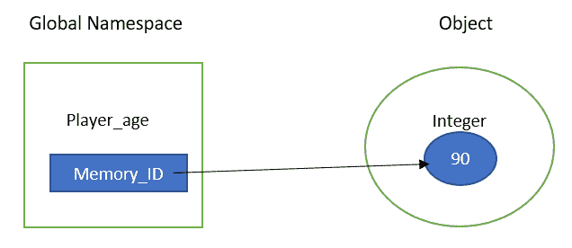
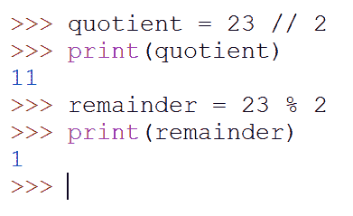
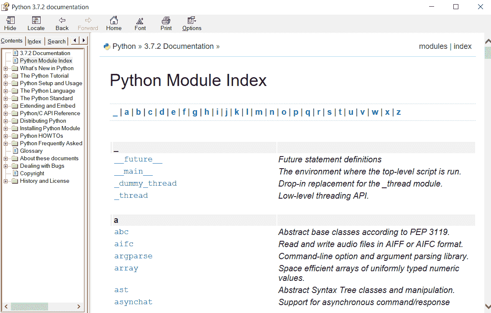
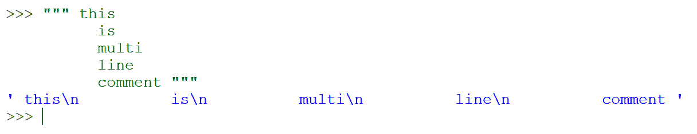
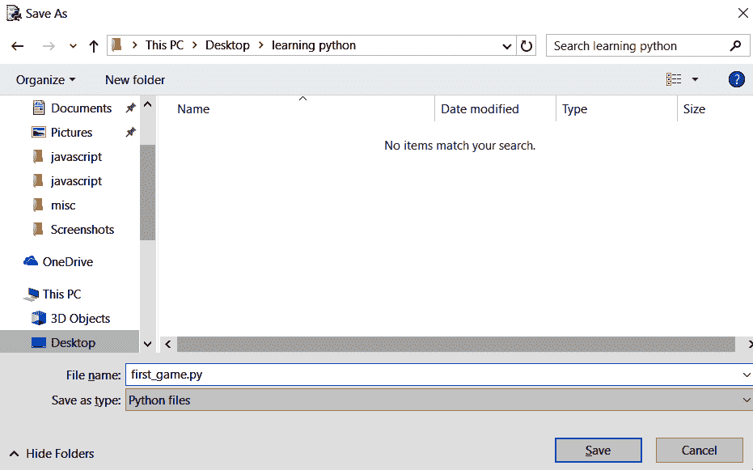

# 二、学习 Python 的基础知识

Python 不需要游戏中的开发、设计和分析，它们被认为是在编程之前完成的步骤。设计和分析需要我们集思广益，寻找想法，为程序建模，并格式化输入。所有这些过程都与数据有关。数据可以是简单的数字列表，也可以是复杂的天气历史。这些数据有自己的类型和结构。数据需要有自己的存储位置，以便我们可以引用它。Python 提供了对象形式的数据抽象，便于我们创建嵌套数据结构。

本章将向您介绍 Python 中的核心编程范例。我们将首先了解可用的不同数据类型以及在变量或存储单元中捕获它们的方法。我们将使用`math`模块学习不同的数学运算（算术和三角运算）。到本章结束时，我们将利用本章所学的知识，制作出我们的第一个游戏“井字游戏”。

在本章中，我们将介绍以下主题：

*   处理值和数据

*   变量和关键字
*   运算符和操作数
*   在代码中编写注释
*   请求用户输入
*   字符串操作
*   打造你的第一场游戏-井字游戏
*   可能的错误和警告
*   游戏测试和可能的修改

# 技术要求

您需要满足以下要求才能充分享受本章的好处：

*   你需要 Python**空闲**
*   本章的代码资产可以在本书的 GitHub 存储库中找到：[https://github.com/PacktPublishing/Learning-Python-by-building-games/tree/master/Chapter02](https://github.com/PacktPublishing/Learning-Python-by-building-games/tree/master/Chapter02)

请查看以下视频以查看代码的运行情况：

[http://bit.ly/2o6Kto2](http://bit.ly/2o6Kto2)

# 处理值和数据

软件根据其处理数据的能力被评估为好的或坏的。每个程序都有自己的数据库设计和实现。数据库是一种模式，其中数据的存储方式可以快速、安全地检索，以便对其进行操作。据推测，Facebook 和 Twitter 等社交网络每天收集 17 亿人的数据。每天收集的如此大量的数据应该得到适当的处理，因为我们没有足够的内存来存储和处理。因此，Python 提供了灵活的内置方法来映射、过滤和减少这些数据集，以便更快地存储和获取这些数据集进行处理。

Python 以模式的形式存储数据的速度非常快。它与 Hadoop 等大数据平台的集成继承了它的兼容性，这是我们在大数据集中使用 Python 的主要原因。NumPy、pandas 和 scikit learn 等功能强大的软件包为当今的数据和分析需求提供了数据支持。

值是程序计算的某些属性的数据表示形式。在这里，属性是任何对象的属性。例如，当我们谈论一个人时，我们会根据姓名、年龄和身高来引用他们。这些属性附带有一个*r*值（属性的内容）和一个*l*值（内存位置）。属性的*内容指存储为变量内容的值，*存储位置*指存储该值的物理位置。例如，`name = "Python"`有一个`name`变量作为属性；它的*r*值是`Python`，它的*l*值是一个唯一的 ID，Python 解析器会自动将其指定为 name 属性的内存位置。*

在 Python 中，值以对象的形式存储。对象有四个细节：ID、名称空间、类型和值。让我们看一个简单的例子来揭示对象的细节：

```py
>>> player_age = 90
```

当`player_age`变量被创建时，它的实例被创建，我们称之为对象。每当创建一个对象时，它都会接收一个唯一的内存存储位置，即唯一的 ID 号，并动态地分配一个类型，即一个整数，因为我们给它分配的是 90。之后，将 player 变量添加到名称空间中，以便我们可以检索其值，即 90。下图试图简化此解释：



每当执行任何赋值语句时，解析器都会创建一个对象，该对象获取一个唯一的内存 ID，我们可以从中引用变量的值。由于 Python 是一种动态类型化语言，它通过分析已分配给变量的值来动态分配变量类型。最后，它将该变量添加到一个全局名称空间中，以便无论何时您想要获取该变量，都可以使用变量名。这里，`memory_ID`是指向对象值的位置。一些编程语言，如 C，将其称为指针。

每个值都有一个与其关联的类型。`1`为整数，`a`为字符，`Hello World`为字符串。`Hello World`是一个字符集合，它被称为字符串，因为它定义了一个字符串。在上一章中，我们看到了一个示例，其中我们要求用户输入。每当用户键入某个内容作为输入时，它都被视为字符串。这些值定义编程中的对象。让我们以鹦鹉为例。它将有一个名称作为字符串，其年龄作为整数，其性别作为男性或女性，由*M*或*F*表示，这是字符。在 Python 中，字符也表示为字符串。为了验证这一点，我们采用了`type`方法。`type`方法表示如下：

```py
>>> type('a')
```

前面命令的输出将是`<class 'str'>`，这意味着该字符也是字符串的一部分。要检查任何值的类型，我们可以使用相同的`type`方法：

```py
>>> type(1)
>>> type('Hello World')
```

前面的命令将分别将类显示为`int`和`str`。

现在，让我们谈谈数字。数字有两种类型：整数和十进制数。正如我们所看到的，整数是整数，而十进制数是浮点数。我们在 Python 中称十进制数为浮点数，因为它们以浮点格式表示，如下所示：

```py
>> type(3.4)
```

前面命令的输出为`<class 'float'>`。

您可以使用`print`方法在终端中打印这些值。`print`方法获取括号内的值，并在解释器中给出结果，如下所示：

```py
>>> print(1)
```

如果您将`1`放在`print`语句中，它会将`1`打印为一个数字。但是，当您将`1`放在双引号内时，它会将`1`打印为字符串，如下所示：

```py
>> print("1")
<class 'str'>
```

Any number, text, or special symbols, such as @, $, %,  or * you put inside a single quote or double quote will eventually be a string. The following is an example of a string: `1`, `Hello`, `False`,  `#$(#`.

当你在`print`语句中的两个值之间加逗号时，会在它们之间加一个空格，如下所示：

```py
>>> print("abc","abc")
```

前面的代码将为您提供`abc abc`的输出，但它们不再被视为字符串。这是我们在 Python 中看到的第一个语义错误。我们将`abc`作为字符串传递，但结果是非类型：

```py
>>> type(print("abc","abc"))
<class 'NoneType'>
```

这是一个语义错误的完美例子。我们得到的输出没有任何错误，但我们没有得到我们想要的结果。

您还可以检查整数。在整数之间用逗号打印是不可能的。Python 解释器将逗号转换为传递的每个值之间的空格：

```py
>>> print(0,000,000)
```

此命令将给我们一个结果`0 0 0`。每个逗号都被转换成空格并打印出来。如果您检查从函数返回的值的类型，它也将是`NoneType`。

现在我们已经了解了值和类型，让我们熟悉变量和关键字。

# 变量和关键字

编程就是接受和操纵我们所学到的值。我们在接受和操作这些值的同时使用变量，以便将来可以引用它们。变量就像盒子，你可以放入不同的东西，并在需要的时候取出它们。创建变量时，会为其指定名称和值。

我们使用等号（`=`来做赋值语句。使用赋值语句创建变量；例如：

```py
>>> myAge = 24
>>> info = "I love Python"
>>> isHonest = True
```

在这里，我们使用赋值语句创建了三个变量。在第一个命令中，我们创建了`myAge`变量并为其分配了一个整数。您不必在 Python 中显式指定变量类型，因为 Python 是在内部指定的。这就是 Python 成为动态类型语言的原因。在第二个命令中，我们创建了`info`变量并为其分配了一个字符串。最后，我们创建了`isHonest`变量并为其分配了一个布尔值。

Boolean types are logic types. They are either `True` or `False`. Creating a Boolean variable is the same as creating other variables, for example, `is_hungry = True`.

变量是数据存储的基本部分。我们可以一次为一个变量指定一个值。无论何时为同一变量名指定另一个值，它都将覆盖原始值。例如，在这里，我们将`info`变量设置为字符串，但如果我将其替换为另一个值，例如`integer`，则这是有效的：

```py
>>> info = 23
```

如果在 Python 中创建变量，它将为每个变量创建单独的内存引用。因此，每当您在另一个值中替换同一变量时，该特定位置的值将被检索并用新值覆盖。变量名是指向保留内存位置中的值的指针。不能在一个变量中存储多个值。要做到这一点，您必须使用高级数据结构。我们将在接下来的章节中介绍这一点（第 4 章：数据结构和功能：通过 AI 品味改进游戏）。

将多个变量分配给不同的变量可以在一行代码中完成。我们可以用一个赋值语句来赋值。变量的名称应该在左边，并且它们之间应该有逗号。使用以下命令，可以在一行中创建任意多个具有不同数据类型的变量：

```py
>>> even, odd, num = 2, 3, 10
```

您可以通过直接在终端中写入变量名称来查看变量的值：

```py
>>> even
```

如果只在脚本中写入变量的名称，则不会打印该值。相反，它将终止。如果你想在屏幕上打印一些东西，你必须使用`print()`方法。要打印任何变量的值，请在 shell 或脚本中键入`print(variable_name)`，如下所示：

```py
>>> print(even)
```

如果您想查看存储在变量中的值的类型，可以调用`type()`方法。要执行此操作，请在括号内传递变量名称：

```py
>>> type(even)
```

前面的命令将给出`<class 'int'>`的输出，这意味着整数值可以存储在变量中。

我们还可以在 Python 中为多个变量分配相同的值。在前面的命令中，我们没有指定多个值，而是为其指定了一个值，如下所示：

```py
>>> even, num = 10
```

在前面的命令中，我们为两个不同的变量`even`和`num`分配了一个 10 的整数值。

Python 不需要变量实例化和声明。因此，Python 中不需要保留内存空间。当我们使用赋值语句创建变量时，Python 会在内部执行此操作。

Python 为特定功能保留了 33 个单词作为关键字。我们不能用它们来命名变量。Python 使用内置脚本在内部使用这些关键字检查变量的名称。每当它检测到其中一个单词时，就会抛出语法错误，如下例所示：

```py
>>> and = 23
```

前面的命令未执行，不能用作变量名，因为它是关键字。Python 使用它来执行一些逻辑操作。但是，如果您创建一个名为`And`的变量并为其赋值，Python 将为您创建`And`变量。对于 Python，`And`和`and`是不同的。它是一种区分大小写的语言。

为了避免变量名出现任何问题，我们可以遵循一些简单的规则。我们将在下一节讨论这些规则。

# 命名变量的规则

我们通常选择有意义的变量名，因为从长远来看，我们可能会完全忘记代码序列和流，而没有正确名称的变量可能会造成混淆。尽管您可以通过遵循一些规则来创建具有任何名称的变量，但强烈建议您创建有意义的变量名称。假设您正在制作一个游戏，您希望为玩家的健康创建一个变量；将该变量命名为`a`不是好的做法。相反，您应该将其命名为`player_Health`，以便您和那些可能查看您的代码的人清楚该变量中的代码的作用。

通常，从编程的角度来看，有两种方法可以有效地为变量命名。其中有两个著名的名字是`CamelCase`和`PascalCase`。按照前面定义的变量`playerHealth`的命名约定，变量的第一个字符应该是小写，其他所有字符都应该是大写。类似地，在`PascalCase`的情况下，变量的每个第一个字符都应该是大写的。因此，使用`PascalCase`，可以将先前定义的变量写入`PlayerHealth`。您可以使用它们中的任何一个来命名变量。

变量名可以是任意长度。它可以包含大写字母（a-Z）、小写字母（a-Z）、数字（0-9）和下划线（30;）的组合。在两个单词之间使用下划线来区分变量中的两个实体。例如，`player_Health`变量由两个单词组成。我们在它们之间使用下划线。或者，您也可以使用`camelCase`，第一个单词以小写字母开头，第二个单词的第一个字母以大写字母开头，例如`playerHealth`。

我们还可以在变量名称的开头使用下划线。如果代码被用作其他人的库，我们会在代码中使用它们。我们也可以在递归语句中使用它们，例如：

```py
>>> _age = 34
```

在命名变量时，我们需要遵循一些规则，否则 Python 将声明它非法并抛出语法错误。以下屏幕截图显示了一些非法分配语句：


为了消除前面的错误，我们必须遵循一些规则。有些是强制性的，有些只是良好做法：

*   我们给变量一个有意义的名称。将年龄变量命名为`age`比将其命名为`a`更有意义。
*   命名变量时不能使用特殊符号（@、#、$和%）。例如 n@me 不是有效的变量名。
*   变量名不应以数字开头。45 age 不是正确的变量名，Python 将抛出一个错误。
*   使用大写名称声明常量，例如`>>> PI = 3.14`。
*   使用`camelCase`创建变量名是一种很好的做法，例如`>>> myCountry = "USA"`。

我们现在已经了解了变量和关键字是什么，以及命名它们时要遵循的一些规则。现在，让我们继续，看看什么是运算符和操作数。

# 运算符和操作数

数学和编程是两个密切相关的不同领域。前者处理理论并提供解决任何问题域的公式化原则，而后者处理使用这些原则解决业务域的问题。编程就是使用模型接受数据，并通过适当的数学运算对其进行操作。运算符用于执行这些操作。Python 中有算术和逻辑运算符。

运算符是执行加法、乘法、除法等计算的符号。使用诸如`+`、`-`和`/`等符号来执行这些操作。应用运算符的值称为操作数。以下代码中显示了一些运算符示例：

```py
>>> 3 + 4
>>> 14 - 5 - 9
>>> 2 * 4
```

在前面的示例中，第一次操作的结果为 7，第二次操作的结果为 0，最后一次操作的结果为 8。您可以在 shell 中添加或减去任意数量的数字。这里，所有的数字都是操作数，`+`、`-`和`*`等符号都是运算符。

Python 中另一个重要的操作符是除法（`/`）。在 Python 3.x 中，除法运算产生浮点数，如示例所示：

```py
>>> 10 / 4
```

前面的操作给出的结果为 2.5。这与我们使用计算器得到的结果相同。

在 Python2.x 中，解释器将截断小数部分，并给出结果 2。如果您想在 Python3.x 中获得相同的结果，应该使用 floor division（`//`）；例如：

```py
>>> 10 // 4
```

前面的操作将给我们一个结果 2，而不是 2.5。

让我们回顾一下到目前为止所学的内容，即值、变量和运算符。让我们将所有这些合并到一个语句中。这称为表达式：

```py
>>> x = 10 + 2 * 5
>>> x
```

您可以将所有这些组合起来生成任何类型的表达式。赋值操作是最简单的表达式。我们在创建变量时看到了赋值操作。

当一个表达式中使用多个运算符时，这些运算的顺序对于求解该表达式非常重要。我们将在下一节中回顾操作顺序。

# 操作顺序

让我们回忆一下我们在学校时主要学习的基础数学。你可能听说过博德马斯法则或佩德马斯法则。当表达式中使用多个运算符时，将按照此优先规则执行运算。括号/括号中的运算、求幂、除法、乘法、加法和减法按以下顺序执行：

*   **括号/括号**：此符号具有最高优先级，表示括号内的操作首先完成。通过在表达式中使用括号，可以告诉解释器显式地强制执行某个表达式。例如，在`(10 - 5) + 5 * 6`中，首先进行括号内的运算，即*10-5*，然后进行乘法运算。
*   **指数/of**：括号内的运算完成后，进行第次指数运算。`9**0+1`的输出不是 9；相反，它是 1。先进行指数运算，然后进行加法运算。
*   **除法**：除法运算在指数 if 运算后进行，包括不在括号内的除法运算。例如，`10 / 2 + 3 + 9 / 3`是 11，但不是 5。如果表达式为`10 / (2 +3) + 9 /3`，则输出为 5。
*   **乘法**：与除法的优先级相同。但是，如果表达式同时具有除法和乘法，则从左到右依次执行运算。从左到右扫描，如果我们在除法之前得到乘法，那么它首先被完成。例如，`3*4 / 3`的输出是`4`而不是 3.999。
*   **加法和减法**：这两种操作的优先级也相同。因此，在从左到右扫描时，我们根据首先出现的内容执行这些操作。例如，对于`5 - 5 + 6`，我们先减去，然后再加，这就得到了 6。

如果您仍然对 BODMAS/PEDMAS 规则感到困惑，您可以简单地使用括号来确保获得预期的结果。在下一节中，我们将学习两个重要的操作符：`//`和`%`。前者称为楼层划分，而后者称为模数运算符。

# 模算子

前面，我们看到了如何使用 floor division（`//`），以及它如何只为我们提供除法操作的商。但是，如果您想要除法的剩余部分，请使用模运算符。当第一个操作数除以第二个操作数时，模运算符将生成的余数。模数运算符的符号为百分号（`%`。以下屏幕截图显示了两个操作：第一个是楼层除法，它将产生商，而下一个是模数运算，它将产生除法的其余部分：



当我们想要搜索数字模式并制作可以基于该模式分割数字的程序时，模运算符非常有用。例如，我们可以检查任意数字与 2 之间的除法余数，以确定该数字是偶数还是奇数：

```py
>>> 5 % 2
```

由于前面的操作将余数设为 1，因此 5 可被视为奇数。

前面的所有操作都非常基本，不需要任何艰苦的计算。然而，我们知道计算机以处理复杂任务而闻名。因此，在下一节中，我们将学习`math`模块，它能够执行复杂的数学运算，如计算三角方程和复杂方程。

# 使用数学模块

数学不仅限于加法和乘法。到目前为止，我们已经学习了各种算术运算。我们还没有讨论逻辑运算符和比较，因为这些将在下一章中讨论。为了整合许多数学领域，Python 为我们提供了一个强大的库，称为`math`模块。我们将包含代码的文件称为模块。这些库也称为内置库，因为每当我们安装 Python 时，它们都是预先打包的。

它们由 Python 生成，我们可以在代码中随时调用它们，而无需手动安装。如果要使用任何内置库的代码，必须首先调用它。调用它们意味着导入它们。要导入和使用该内置库，我们使用`import`关键字。您可能还记得上一章中提到的，它是一个保留字，在 Python 中有特定的用途。因此，`import`关键字将任何库导入到您的代码中。例如，如果要导入`math`模块，只需编写以下内容：

```py
>>> import math
```

您将立即看到下一行的空壳，如下所示：`>>>`。

它只是指定要导入它。Import 语句与 print 或 input 方法不同，它们给我们提供即时响应。为了查看任何响应或结果，我们应该调用该模块中的某些内容。`math`模块为我们提供了许多操作。可通过以下步骤访问这些文件：

1.  打开 IDLE，然后按*F1*打开文档。您将看到以下窗口：


2.  现在，点击模块。您将看到一个包含模块列表的新窗口：



3.  如果您想浏览以字母`m`开头的模块列表，请从该选项卡中搜索数学模块，或者只需按键盘上的*M*：


有这么多的方法可以使用！不要被术语方法弄得不知所措；我们专门用了一节来介绍面向对象编程，在这里我们将学习如何创建我们自己的方法。现在，只要把一个方法看作是我们用来创建表达式的操作。`math`模块提供的方法也将执行简单的算术运算和许多其他复杂的运算。如果你想得到一个平方根，我们没有特定的操作符，也不能执行复杂的数学运算；相反，您必须使用数学模块。我们将在下面的示例中查看平方根。

要得到一个数字的平方根，我们可以使用`sqrt`方法。查看`sqrt`方法的文档，了解更多信息并了解如何调用它。这太简单了！首先，我们写下`math`，然后是一个句点（`.`，这表示我们想要使用数学模块中的某个东西，并使用`sqrt`方法：

```py
>>> import math
>>> math.sqrt(49)
```

`49`的平方根是 7。我们的解释器在`sqrt`执行浮点运算时打印 7.0。

如果您没有导入`math`模块，而是直接调用`sqrt`，您将收到以下错误：


您可能还记得，当我们讨论`print()`函数时，我们没有使用任何模块调用它，因为它是一个内置函数。但是，此`sqrt()`功能不是内置的。它来自一个内置的 Python 库。虽然我们不必像其他任何第三方模块一样安装它，但我们必须在使用它提供的任何功能之前导入它。Python 提供的所有模块都是小写的。

我们可以从数学模块中调用一系列函数和常量。这使我们能够进行许多支持复杂数学计算的操作。如果要打印 PI 的值，可以使用`math`模块进行打印，如下所示：

1.  首先，我们使用`>>> import math`导入。
2.  然后，我们使用`module_name`并提供一个句点（`.`来指定我们要使用该模块以及我们要执行的类型操作，例如`>>> math.pi`。

您可以使用数学函数执行代数、对数、三角、双曲和其他各种操作。但是，本模块不能对复数进行数学运算，例如`z = a + ib`。

对于那些类型的复数，我们必须导入`cmath`模块。导入和使用此模块也类似于`math`模块。

如果您想使用`math`模块提供的函数调用`print()`或`input()`而不加点，可以使用以下命令：

```py
>>> from math import *
```

在前面的命令中，`*`表示您希望导入所有内容。这是经典的说法*从数学模块导入所有*。现在，如果您想从数学模块调用任何函数，您可以直接调用它，类似于我们对输入和打印函数所做的操作：

```py
>>> factorial(4)
```

前面的函数将被完美执行，结果为 24。

你可能想知道为什么在本书的开头没有解释模块的概念。很简单！我们刚刚学习了运算符、运算和表达式，这意味着很容易与数学模块联系起来。我们从`math`模块调用的每个函数都包含运算符、操作数和表达式，但它的实现对我们来说是隐藏的。例如，我们只是使用`sqrt`函数来执行平方根运算，但我们不知道如何使用表达式和逻辑来完成平方根运算。我们将在接下来的章节中介绍流量控制和功能时了解这一点。因此，模块为我们提供了一种执行高级操作的方法，而不必知道它们是如何工作的。但是，如果您想创建自己的库和模块，那么接下来的章节将对您有所帮助。

如果您想了解更多有关模块和功能的信息，只需使用`help`命令即可。Python`help`命令将为您提供内置函数、模块和关键字的完整文档列表，如下例所示：

```py
>>> help([object])
>>> help(input)
Help on built-in function input in module builtins:

input(prompt=None, /)
    Read a string from standard input. The trailing newline is stripped.

    The prompt string, if given, is printed to standard output without a
    trailing newline before reading input.

    If the user hits EOF (*nix: Ctrl-D, Windows: Ctrl-Z+Return), raise 
    EOFError.

    On *nix systems, readline is used if available.
```

关于值和类型的讨论已经足够了。现在，让我们看看如何使我们的代码更具可读性和可重用性，也就是说，其他人应该能够轻松地阅读我们的代码。我们讨论了命名变量时应遵循的规则和约定，这也会提高可读性。有两种使代码可读的方法：

*   在程序中编写注释。
*   python 的方法是生成一个函数。

我们可以通过评论向程序添加注释，这将在下一节中介绍。

# 用代码编写注释

即使您正在制作一个普通的软件，它也必须以某种方式与数据交互。最终，您的代码将变得更长、更复杂，并且变得难以管理、阅读和理解。虽然我们最终会理解我们编写的代码，但从长远来看，这将更加困难。如果您有 50000 行代码，并且希望调试其中的语义和逻辑错误，那么您将很难对它们进行搜索和索引。因此，评论派上了用场。注释是一种与代码一起编写注释的方式，以便任何试图阅读代码的人都知道该程序在做什么。Python 不会解释注释，这意味着每当 Python 解析器看到语句以哈希符号（`#`开头时，它的执行就会被跳过。

Python 设计模式可能是复杂的，这使得任何天真的程序员都很难看到代码并理解它在做什么。因此，我们用我们的母语添加关于程序的简单注释，以解释我们为什么要编写特定的代码。以`#`开头的注释是单行注释。如果您在包含哈希的行下面写了一些内容，则不会将其视为注释。这在以下代码中显示：

```py
>>> # this is single line comment
>>> but this is not comment
```

在 Python 中，没有多行注释。人们通常认为三重双引号（`""" """`）用于多行评论，但事实并非如此。使用哈希是 Python 中唯一的注释方法。在 Python3.x 中，三引号内的字符串被视为常规字符串。可以使用三重双引号删除断开的字符串。如果字符串的范围不是完全封闭的，则认为字符串已断开，如示例所示：

```py
>>> 'Hey it's me'
```

前面的字符串是用一个引号创建的。字符串中使用了撇号，这给解释程序造成了混乱，因为它认为`hey it`是字符串，而忽略了`s me`。这是一根断了的绳子。并不是你遇到的每一段文字都是一个字符串。如果在空闲状态下运行此代码，将出现以下语法错误：


要消除此错误，可以使用三重引号。即使字符串上出现双引号或单引号，三引号也会删除断开的字符串：

```py
>>> """ Hey! it's me """
>>> """ He said, "How may I help you" """
```

许多人认为前一行代码表示多行注释，并执行以下操作：



您可以清楚地看到，它不是忽略执行该命令，而是通过为我们创建字符串来反映我们的命令。如果我们不给变量分配一个用三个双引号括起来的值，它将被视为垃圾收集器，并给我们一个字符串。许多人把它混淆为多行注释，因为它的行为是 docstring。docstring 是放置在函数、模块或类顶部的字符串。例如，这是执行添加操作的函数：

```py
def add:
```

显然，我们还没有学会如何创建函数，但是您可以理解，三重双引号用于提供有关函数、类和模块的一些信息。因此，有些人认为这是一个多行评论。可以看出它不是多行注释，因为可以使用 Python 的特殊函数访问三行引号内的注释。

因为这是 docstring，所以我们可以通过**`obj.__doc__`**访问它。**由于它可以通过一种方法访问，并且解释程序不会忽略它，因此不能将其视为多行注释。因此，我们可以得出结论，Python 中只有单行注释。如果我们确实需要多行注释，那么应该使用三个双引号，但是我们必须确保将它们放在函数、类或模块的定义之上。**

 **在下面的代码中，`\n`表示一个新行。这将导致代码中出现换行。我们可以看到，以下代码在第一行打印`hey`，在下一行打印`it's me`：

```py
>>> print("hey \n it's me")
hey
it's me
```

由此，我们可以得出以下关于评论的结论：

*   评论是多余的。他们只是告诉我们每行代码都在做什么：

```py
      >>> print(customer_info)  # printing customer information
```

*   注释可能包含有关代码的有用信息–甚至是一些我们无法通过查看代码提取的关键信息：

```py
      >>> d = (400, 200) # d is for display of game console 400*200
      >>> TEMP = 23 # temperature is in Celsius
```

正如我们在前一章中所讨论的，我们在创建程序时必须遵循一种方便的模式。虽然这不是强制性的，但始终是良好的做法。在 Python 的*构建块*部分中，第一个块是请求用户输入，这将是我们下一个讨论的主题。

# 请求用户输入

编程的组成部分之一是让用户用键盘输入数据。任何应用程序，无论是管理工具还是游戏，都应该从用户那里获取输入。在用户管理应用程序中，我们收集用户信息，如姓名、地址和年龄，并将其插入数据库。在游戏中，我们从键盘获取用户输入以进行移动。根据用户按下的键，我们可以让角色执行一些动作。例如，按下键盘上的*Shift*键将使字符跳跃。因此，每个应用程序都必须是用户友好的，这意味着它必须让用户与应用程序交互。

让用户在键盘上输入一些东西，并将其存储在变量中，以便我们在需要时进一步处理它，这是一种常见做法。Python 有内置函数来获取用户的输入，这意味着您不必导入或安装任何东西来使用此函数。`input()`功能用于从用户处获取输入：

```py
>>> input()
```

当您输入前面的命令时，它将为您提供一个写东西的位置。解释器保持其其他执行，直到用户按下键盘上的按钮并按下*Enter*。按下*回车*键，程序恢复，并向我们提供用户的文本输入。

以下屏幕截图显示了`input()`函数在 Python 中的工作方式：


在前面的屏幕截图中，我们使用了`input()`方法并输入字符串“我爱 Python”。黑色文本颜色是用户输入的，解释器立即给我们一些输出，这与用户输入的字符串相同。您可以将输入文本存储到变量中，以便我们可以对其执行计算：

```py
>>> message = input()
```

现在，我们已经了解了如何从用户输入数据。最好的做法是向用户提供消息或提示，告诉他们需要在该字段中输入什么。在`input`方法的括号内，应以字符串形式给出消息或提示，如下所示：

```py
>>>user_name = input(" \n Enter your name? : \n")
Enter your name? :
John Doe #this is input from user
'John Doe' #printing content of user_name
```

在前面的示例中，当用户输入某些内容并点击*Enter*时，我们的程序从用户处获取输入并执行指定的任务。但是，如果你想制作一个应用程序，你想从用户那里连续获取数据，我们必须使用循环。我们将在接下来的章节中研究循环：

```py
>>> while True:
        input("Enter user_names: \n")

```

前面的语句不断地从用户获取输入。即使按下*回车*或输入`return`关键字，它也不会停止。在前面的命令中，`while`用于循环。`True`是一种布尔类型，表示逻辑和布尔代数的真值。布尔类型为`True`或`False`。因此，`while True`语句意味着它内部的代码应该无限运行，这要求用户无限输入。结果如下：


调用`input()`方法时，您在键盘上输入的任何内容都将是字符串形式，即使您将其作为整数输入，如示例所示：

```py
>>> a = input()
1 #store integer 1 to the variable a
```

如果您使用`type`方法检查`a`变量的类型，即`>>> type(a)`，您将看到一些意外的结果。我们从用户输入`1`并将其存储在变量`a`中。当我们检查`a`变量中存储的值的类型时，它将不是整数。相反，它将显示`str class: <class 'str'>`，这意味着通过调用`input()`方法在键盘上输入的任何内容都将是字符串类型。但有时，我们可能希望用户输入的整数保持为整数。在这种情况下，我们必须执行类型转换，这将在下一节中介绍。

# 类型转换或类型转换

有时您可能希望将用户的输入数据用作整数。我们看到，来自用户的输入数据将是一个字符串，即使它是一个整数，如示例所示：

```py
>>> age = input("Enter your age? \n")
>>> Enter your age?
29
>>> type(age)
<class 'str'>
>>> age
'29'
```

年龄是用数字来表示的。但是，在前面的代码中，它是一个字符串。因此，我们必须将其转换为整数，以便用户输入的信息对计算有意义。这种类型的转换称为类型转换。但是，如果在此值中进行一些计算，而没有将其转换为适当的类型，则结果将是不理想的。例如，如果要通过将 2 添加到 29 来更改年龄值，则不能将其从 29 更改为 31。这是因为字符串不支持增量；相反，它们支持串联：

```py
>>> age 
'29'
>>> age + 2
Traceback (most recent call last):
  File "<pyshell#3>", line 1, in <module>
    age + 2
TypeError: can only concatenate str (not "int") to str
```

因此，如果您想使用作为整数输入的年龄，我们必须使用类型转换方法。这些方法也是 Python 的内置函数。其中包括：

*   `int(arg1, base)`：此方法将任何其他数据类型转换为整数。如果你在`int`函数的括号内放入一个字符串，它将把它转换成一个整数。`arg1`是要转换的字符串，base 参数表示数据的基数是字符串：

```py
      >>> a = int("10101", 2)
      >>> a
      21 #conversion from string to integer

      >>> b = int("255")
      >>>b
      255
```

*   `float()`：此方法将任意整数转换为浮点数，如示例所示：

```py
      >>> float(3)
      3.0 #this is floating point number           
```

*   `str()`：此方法将任何其他数据类型转换为字符串，如示例所示：

```py
      >>> str(255)
      '255'
```

*   `ord()`：此方法将字符类型转换为整数并返回其 ASCII 值，如本例所示：

```py
       >>> ord('a')
       97  #ASCII value of a is 97
```

其他功能如`tuple()`、`list()`、`set()`和`dict()`将在后续章节中介绍。

现在您已经熟悉了 Python 的第一个构建块，即从用户输入数据，让我们看看如何使用 Python 提供的不同功能格式化这些数据。在下一节中，我们将研究字符串操作，这些操作将依次调用 Python 提供的不同方法来操作用户输入的输入。

# 字符串操作

用双引号（`" "`）或单引号（`' '`）写入的任何数据类型，无论是文本、整数还是布尔值，Python 都将其视为字符串。字符串值揭示了数据的广泛含义。存储为字符串的数据很容易访问，但不能更改。因此，它被视为不可变的数据类型。让我们看看下面的代码：

```py
>>> msg = "happy birthday"
>>> msg.upper() # upper() is inbuilt method of string class that converts string to upper case
'HAPPY BIRTHDAY'
>>> msg
'happy birthday'
```

在前面的代码中，我们创建了`msg`变量并在其中存储了一个字符串。我们使用了`string`类的内置方法来处理该字符串，当我们打印回`msg`变量时，它没有改变。这意味着字符串是不可变的数据类型。如果要更改字符串的内容，应完全覆盖它，如本例所示：

```py
>>> msg = msg.upper()
>>> msg
'HAPPY BIRTHDAY'
```

字符串不支持项分配。如果要向字符串中添加项，则必须创建一个全新的字符串。因此，Python 的这一特性使其不可变，如本例所示：

```py
>>> str1 = "John"
>>> str1[0] = "Hello"
Traceback (most recent call last):
  File "<pyshell#30>", line 1, in <module>
    str1[0] = "Hello"
TypeError: 'str' object does not support item assignment
```

要使用字符串的内置函数，必须对该字符串调用一个方法。让我们来看一个我们可以在内置方法中使用的模式，即`"String".method_name()`：

```py
>>> "Python".capitalize() #capitalize first letter of string
Python
>>> "xyz".join("pqr") #joins every letter of string "pqr" with xyz except for first and last letter
'pxyzqxyzr'

#len function does not have to call like this, call simply len() with string passed inside parenthesis
>>> len("Python") #prints length of string
6
```

可以使用方括号访问字符串的每个元素。我们应该把这个位置放在方括号内。这些位置在 Python 中称为索引。字符串的索引从 0 开始，从左到右增加 1：

```py
>>> info = "Python"
>>> info[2] 
t
>>> info[0]
P
```

您可以在下图中观察索引模式。这里，我们有一个`Python`字符串。字符串的索引从 0 开始。对于它旁边的每个有索引的元素，一个单位将增加到上一个元素的单位。这称为正向索引：


字符串还支持负索引。如果需要字符串的最后一位数字，可以给出一个`-1`索引，如下所示：

```py
>>> info = "Python"
>>> info[-1]
n
>>> info[-3]
h
```

现在，我们已经学习了如何基于索引提取字符串的特定元素。但是，如果要从字符串中提取多个元素，可以使用字符串切片操作。切片操作与比萨饼切片相同，它表示我们正在按顺序取出字符串的某些部分。字符串切片可以使用我们用于从字符串中提取单个字符的相同方括号来完成。当我们用冒号扩展方括号并为其提供开始、结束（独占）和步骤索引时，可以看到这两个操作之间的差异。虽然弦切片的理论看起来很复杂，但编程很容易。让我们看一个例子来澄清这一点：

```py
>>> email = "johndoe@gmail.com"
```

假设我们想从这个电子邮件地址中提取一个人的名字。为此，我们必须跟踪所有索引：


由于我们正在分割该字符串的某些部分，因此我们必须将其想象为一个容器，其中每个字符都有其索引，以便更容易引用它们。要实现字符串切片，请执行以下步骤：

1.  使用`name_of_string[start: stop`：我们使用`[step]]`命令进行字符串切片。这里，`start`是起始索引，`stop`是排他位置，这意味着如果在其上放置索引，将包括-1 的元素，但停止索引处的元素将被排除。在这里，步骤是可选的。我们将在下一章（第 3 章：流量控制：为您的游戏构建决策者）中讨论步骤索引位置

2.  确定首先需要提取的内容。不能随机提取字符串的任何部分。应该按顺序进行。例如，您不能使用单个命令提取`jo`和`mail`。我们可以提取`johndoe`，因为每个元素都是按顺序进行的。让我们试着从代码中提取它：

```py
  >>> email = "johndoe@gmail.com"
  >>> email[0:7:] # 0 is starting position, 7 is stopping position and it is not included
  'johndoe'
  >>> email[:7:] #empty starting position also means start from 0 index
  'johndoe'
```

在前面的代码中，`email[0:7:]`或`email[:7:]`告诉我们第一个索引 0 开始一个字符串的索引，这意味着我们要从`start`开始打印。您也可以不输入 0，而输入 nothing，这表示默认状态，`start`将从开始打印。第二个索引 7 是停止位置，但它是一个排除位置，这意味着解释器将一直打印到`e`字符，而不是`@`，因为`@`位于位置 7。最后，第三个索引位置用于步骤。我们在这里放了一个空格来表示默认情况下它应该保持的值，这意味着我们在打印时不会跳过任何数字。如果将步进设置为`>>> email[0:7:2]`，则得到`jhde`作为输出；它将在它们之间跳过一个字符。

我们还可以对字符串执行加法和乘法运算。将两个字符串相加称为串联。我们使用`+`和`*`等运算符来执行字符串操作，如本例所示：

```py
>>> "-" * 50 #this will create 50 hyphen or dashes (-)
'--------------------------------------------------'

>>> "a" * 4
'aaaa'
```

但是，不能将两种字符串类型相乘。如果要对字符串执行乘法运算，一个必须是字符串，另一个必须是整数：

```py
>>> "a" * "b"
Traceback (most recent call last):
  File "<pyshell#22>", line 1, in <module>
    "a" * "b"
TypeError: can't multiply sequence by non-int of type 'str'
```

如果还要添加字符串，则两个操作数都必须是字符串。否则，它将抛出类型错误：

```py
>>> str1 = "Happy"
>>> str2 = "Birthday"
>>> str3 = "John"
>>> str1 + str2 + str3
'HappyBirthdayJohn' 

>>> str1 + 45 # YOU CANNOT ADD STRING AND INTEGER
Traceback (most recent call last):
  File "<pyshell#28>", line 1, in <module>
    str1 + 45
TypeError: can only concatenate str (not "int") to str
```

现在我们已经了解了字符串操作的基本原理，如赋值、连接和赋值，我们将学习字符串格式。如果我们需要根据输入更改文本的格式，这是一个重要的概念。

# 字符串格式

字符串格式是我们通过用变量内容替换占位符来构建字符串的地方。我们应用%（模数运算符）来执行字符串格式化。如果要指定一个数字作为占位符，则使用`%d`。如果是字符串，则使用`%s`作为占位符。字符串格式化的结果也是一个字符串。让我们看一个小例子：

```py
>>> key = "love"
>>> value = 13

#lets use string formatting technique
>>> print(" I %s number %d"%(key,value))
'I love number 13'
```

在前面的代码中，`%s`的位置替换为键变量的值，`%d`的位置替换为`value`变量的值。因此，`%d`和`%s`是占位符。不能在`%d`中指定字符串值，也不能在`%d`中指定整数值。

传递的值数必须与字符串中使用的格式序列数匹配。否则，它将抛出一个类型错误，如下所示：

```py
>>> '%s %d %s'%("Hello",1)
Traceback (most recent call last):
  File "<pyshell#19>", line 1, in <module>
    '%s %d %s'%("Hello",1)
TypeError: not enough arguments for format string
```

您还可以使用 Python 内置的 format 函数格式化字符串。使用此函数进行格式化相对比较容易。我们可以使用大括号`{}`作为占位符，而不是使用占位符或格式序列，如`%d`和`%s`。我们还可以在大括号内指定数字，以便使用特定值进行格式化，如下所示：

```py
>>> print(" I love {}".format("Python"))
'I love Python'

>>> print(" I love {0} and I hate {1}".format("Python", "Java"))
'I love Python and I hate Java'

>>> print(" I love {1} and I hate {0}".format("Python","Java"))
'I love Java and I hate Python'
```

现在我们已经熟悉了 Python 的核心编程模式，让我们跳到下一节，在那里我们将学习制作我们的第一个游戏：**tic tac toe**。

# 打造你的第一场游戏-井字游戏

Python 语言是一种跨平台语言，这意味着我们可以为任何设备制作游戏。然而，在这里，我们将更多地关注逻辑及其实现，而不是针对特定平台进行编码。与其他语言相比，使用 Python 编写游戏非常简单，因为它的语法更短，并且它提供了丰富的内容库，使制作速度更快。话虽如此，如果在编码之前不制定计划，那就不那么容易了。我们必须将我们的游戏实体分解成几个部分，这样每个实体都可以很容易地调试。从现在开始制作游戏时，我们将遵循以下一般步骤：

*   集思广益和信息收集
*   选择合适的代码编辑器
*   编程模型
*   用户交互用户输入/操作

到目前为止，我们已经涵盖了各种主题，包括变量、运算符、表达式、从用户获取输入以及将其打印给用户。现在让我们应用所有这些技术来制作我们的第一个游戏。

# 集思广益和信息收集

在开始编码之前，让我们考虑一下游戏的设计和界面。拿出你的笔和纸，开始思考游戏的界面！到目前为止，我们对 GUI 有什么了解吗？显然不是！这意味着我们必须为我们的第一个游戏使用一个简单的界面。在了解 Python 的一些高级概念之后，我们将在稍后对其进行修改。Tic tac toe 是一款从用户那里获取输入并根据玩家的动作放置 X 或 O 的游戏。因此，我们的界面应该是这些符号的占位符。现在我们将制作一个包含`_`的简单界面。下划线（`_`将是我们的占位符，我们将根据玩家选择在其中放置 X 或 O：

```py
_ | _ | _
_ | _ | _
_ | _ | _                    
```

前面的代码显示了我们游戏的简单布局。包含`_`（下划线）作为占位符和`|`分隔符号：

```py
_ | _ | O
_ | X | _
_ | _ | X
```

正如您所看到的，每当玩家采取步骤时，我们都会用对应于该用户决定的符号替换该下划线。现在，我们有了一个基本的游戏界面。

现在我们已经规划好了界面，我们需要了解如何跟踪下划线的位置，以及如何找到用适当的符号替换下划线的位置。我们可以为每个下划线分配数字，并告诉用户选择一个数字。然后，基于该数字，我们可以将其符号指定给该位置，如下所示：

```py
0 | 1 | 2
3 | 4 | 5
6 | 7 | 8
```

现在，我们已经收集了足够的信息来开始我们的简单游戏。在复杂的现实游戏中，头脑风暴和信息收集过程大约需要 6 个月。现在，让我们看看如何选择代码编辑器。

# 选择合适的代码编辑器

我们已经在我们的机器上安装了 Python，我们看了一下预先安装的 Python 编辑器 IDLE。我们将在这个项目中使用这个编辑器。让我们开始：

1.  在搜索栏中搜索 IDLE 并打开它。您将获得以下 Shell：


此终端或外壳通常用于在外壳内即时解释命令。这意味着一次将执行一个命令，但我们必须编写多行代码来制作游戏。因此，用这个 Shell 编写游戏是不可能的。我们必须创建一个文件，在这个文件中我们可以编写许多行代码并一次执行它们。Python 为我们提供了一些脚本来解决这个问题。

2.  单击文件，然后单击新建文件，或按*Ctrl*+*N*。将打开一个新的脚本文件，我们可以在其中编写多行代码。


3.  在窗口顶部，我们将看到“无标题”，这意味着我们尚未保存文件。让我们先保存它，因为我们必须在以后保存它。按*Ctrl*+*S*保存。我已将其保存为`first_game.py`。



现在我们已经选择了合适的 IDE 进行开发，让我们开始为游戏开发我们的模型。

# 编程模型或建模

在编程中，模型是表示程序中数据流的一种方式。在我们的游戏中，它是关于如何使用已获得的数据作为用户输入。我们在*集思广益和信息收集*部分中发现了一些信息，在这里我们讨论了位置以及每个数字是如何分配给代表球员选择的位置的。模型不包含表示逻辑；相反，它将处理数据逻辑。计算机不关心布局或界面。另一方面，用户需要一个界面才能做出反应。因此，每个程序都有一个前端和一个后端。前端是您在应用程序中看到的一切，无论它是应用程序的美观部分还是可视部分。**用户体验**（**用户体验**）设计师主要在大型项目的前端工作。后端并不关心设计，它只关心应用于数据层进行数据事务的算法和安全性。模型用作前端和后端之间的通信方式。

计算机不关心模型如何呈现数据，但用户应该以一种信息丰富且美观的方式从模型中获取数据。因此，我们制作了如下简单布局：

```py
_ | _ | _
_ | _ | _
_ | _ | _   
```

让我们开始为表示层创建模型：

```py
#this code is written as scripts
game_board = ['_'] * 9 #this will create 9 underscores
print(game_board[0] + '|' + game_board[1] + '|' + game_board[2])
print(game_board[3] + '|' + game_board[4] + '|' + game_board[5])
print(game_board[6] + '|' + game_board[7] + '|' + game_board[8])
```

前面的代码表示我们游戏的布局。它将显示给用户。让我们把它一行一行地分解：

*   `game_board = ['_'] * 9`：此语句创建 9 个下划线，这是我们游戏角色的占位符。它存储在`game_board`变量中。您可能还记得，一个变量不能存储多个值。如果我们对同一个变量执行多个赋值，该变量将存储添加到该变量的最新值。因此，该板不是一种简单的变量类型。这是一个`list`变量。我们可以在一个列表中存储多条数据。让我们打印电路板的值：

```py
      >>> board = ['_'] * 9
      >>> board 
      ['_', '_', '_', '_', '_', '_', '_', '_', '_'] # 9 underscores is 
        stored in board list
```

*   `>>> print(game_board[0] + '|' + game_board[1] + '|' + game_board[2])`：前面的命令打印布局的第一行。我们已经了解了本章前面的`print`语句。括号内的任何内容（字符串或变量值）都按`print`语句的原样打印。我们通过`board[0]`获取电路板的第一个元素，即第一个下划线（`_`），我们在每个下划线之间打印一个分隔符（`|`。前面语句的输出为`_ | _ | _ `
*   我们必须再打印前面的版面两次，这意味着我们必须再使用两个`print`语句：

```py
      >>> print(game_board[3] + '|' + game_board[4] + '|' + game_board[5])
      >>> print(game_board[6] + '|' + game_board[7] + '|' + game_board[8])
```

*   方括号中插入的数字是我们在编程中通常称为`index`的位置。这是指`list`变量的某个位置。列表索引始终以零索引开始：

```py
     >>> board = [1,2,3,4,5,6]
     >>> board[0] # this will give value 1 from "board" list
     >>> board[5] # this will give value 6 from "board" list
```

*   下面的代码显示了 tic-tac-toe 游戏的最终布局。确保将程序编写为脚本，然后按*F5*运行：

```py
        game_board = ['_'] * 9
        print(game_board[0] + '|' + game_board[1] + '|' + game_board[2])
        print(game_board[3] + '|' + game_board[4] + '|' + game_board[5])
        print(game_board[6] + '|' + game_board[7] + '|' + game_board[8])

        #output
        """ 
            _ | _ | _
            _ | _ | _
            _ | _ | _   

        """ 
```

*   在前面的代码中，我们做了两件事：首先，我们在布局的每个位置打印下划线，然后为每个位置分配一个数字：

```py
      0th | 1st | 2nd
      3rd | 4th | 5th     
      6th | 7th | 8th
```

现在我们已经开发了代表游戏基本布局的编程模型，是时候在编程模型和游戏玩家之间进行交互了。在下一节中，我们将学习如何获取用户输入并对其进行操作，以便与游戏模型进行交互。

# 用户交互–用户输入和操作

我们正在为用户制作游戏。因此，我们应该制作一个界面，这样我们就可以使我们的应用程序更加友好。我们在上一节中这样做了。现在，我们必须从用户那里获取一些输入，并通过模型将其放置到布局中。我们知道从用户那里获取输入的一种简单方法是使用`input()`方法。我们现在就用吧。

为此，我们将考虑以下问题：*我们应该从用户输入什么？它是一个符号，像 X/O，还是位置？*

把输入作为一个符号是无用的，因为在输入之后，我们应该知道把它放在哪里。因此，我们可以从用户处获取位置，并将符号自动放入我们的代码中：

```py
#code from models  

#...................................................................

#code for user input

while True:
     pos = input(" Enter any position you want from (0-8): \n")
     pos = int(pos)
     game_board[pos] = 'X'
     print(game_board[0] + '|' + game_board[1] + '|' + game_board[2])
     print(game_board[3] + '|' + game_board[4] + '|' + game_board[5])
     print(game_board[6] + '|' + game_board[7] + '|' + game_board[8])

```

让我们把它一部分一部分地分解：

*   `while True`：这将运行无限次。我们在*请求用户输入*部分看到了这种情况。因此，我们将无限次地从用户那里获取输入数据，这意味着我们的游戏循环没有终止。
*   `pos = input(" Enter any position you want from (0-8): \n")`：此语句将用户的输入作为从 0 到 8 的位置，并存储在`pos`变量中。
*   `pos`变量中存储的数据将是字符串，但位置应为整数。因此，我们必须使用`int`方法将其类型转换为整数。然后，我们将整数存储在`pos`变量中作为`x = int(x)`。
*   `game_board[pos] = 'X'`：此语句将`X`分配给用户选择的位置。`pos`变量包含用户在上一个命令中选择的从 0 到 8 的位置。现在，我们将`X`指定给该位置，以代替下划线，如下所示：

```py
      0th | 1st | 2nd
      3rd | 4th | 5th     
      6th | 7th | 8th
```

如果用户输入，`4`则我们将`X`置于`4th`位置，如下所示：

```py
      0th | 1st | 2nd
      3rd |  X  | 5th     
      6th | 7th | 8th
```

*   在我们指定一个玩家符号到指定位置后，我们必须用这三个打印语句再次打印棋盘。它应该保持在循环中，因为每次用户从键盘输入新位置时，我们都必须打印电路板。

现在我们已经完成了绘制布局和用户输入的模型，我们可以运行游戏并观察输出。你将要看到的游戏不会吸引人，因为它没有一个合适的布局，也没有我们的 tic-tac-toe 游戏应有的功能。我们将在下一章学习更多 Python 的同时，尽量使游戏具有可玩性。现在，我们来看看游戏中可能遇到的错误和警告。

# 可能的错误和警告

到目前为止，我们只讨论了 Python 的基本原理，因此您不会发现很多语义错误。但是，您可能已经习惯了语法错误。首先也是最重要的一点是，命名变量时可能会导致错误。如果不遵循命名变量的规则或约定，则可能会出现以下错误：

```py
>>> my name = "John Doe"
SyntaxError: invalid syntax
```

前面的名称无效，因为在创建变量名时不能提供空格。您可以在它们之间加下划线，以指定它由两个单词组成。`my_name`是变量的有效名称。

如果变量名拼写错误，将立即出现错误。假设您创建了一个名为`Msg`的变量，并将其用作`msg`。将返回一个错误，指出这是错误的定义。Python 是区分大小写的，这意味着在 Python 中`True`和`true`是不同的。如果您将一个变量命名为`True`，它将是非法的，因为它是 Python 的关键字之一。

但是，您可以调用变量`true`：

```py
>>> True = 45
SyntaxError: can't assign to keyword 
>>> true = 45
>>> true
45
```

同样的规则也适用于命名模块。在本章中，我们了解了如何导入`math`模块并使用其方法。但是，如果您将模块名称拼写错误，从长远来看将导致许多问题。您不会在空闲时看到即时错误；您必须编译脚本才能看到它。因此，空闲时调试要困难得多。因此，请确保正确拼写所有模块及其方法。

`>>> import math`将成功地将`math`模块导入到您的项目中，但是如果您使用了错误的模块名称，您将得到以下错误：

```py
>>> import Math
Traceback (most recent call last):
  File "<pyshell#6>", line 1, in <module>
    import Math
ModuleNotFoundError: No module named 'Math'
```

还有一种错误比语法错误更危险；这些被称为语义错误。当我们没有得到预期的结果时，会发生语义错误。它们不会被解释器检测到，因此很难调试。由于不正确地执行表达式，我们可能会出现语义错误。如果我们对优先规则不够关心，我们最终会对程序做出错误的陈述。

`1 + 3**2`表达式的输出是 10，而不是 16。但是，我们可以通过用括号括住语句，强制解释器将该语句打印为 16。`(1 + 3) **2`将给我们 16 个。

现在，您已经了解了如何纠正程序中遇到的错误，让我们了解修改我们的第一个 tic-tac-toe 游戏的可能方法。

# 游戏测试和可能的修改

有几种方法可以发现游戏中的错误。首先，你可以联系你的朋友，让他们玩你的游戏。第一次测试游戏时收集的建议称为 alpha 测试，它是任何游戏开发生命周期的重要组成部分。在通过面试收集到足够的信息后，你可以开始修改你的游戏。

The things we have learned so far will not be enough to make our game more appealing. We will learn about several topics in upcoming chapters and modify our tic-tac-toe game accordingly.

我们在本节中制作的游戏平淡无奇，并没有激励我们的用户去玩，但我们通过制作它学到了很多东西。我们研究了使用模型和视图概念创建游戏的基本过程。视图指的是我们在其中呈现数据的布局，这些数据有助于我们通过界面与用户交互，而模型指的是我们在程序和用户之间传递数据的方式。我们还没有介绍高级 Python 语言范例，因此我们的能力有限。这意味着本章中的游戏很简单。但是，在我们介绍了条件、循环和函数之后，我们将对此游戏进行更改。

以下是我们可能对游戏进行的一些修改：

*   让我们分析一下我们的代码，看看它的局限性。我们告诉用户显式输入一个从 0 到 8 的数字来指定用户的移动。如果用户没有输入数字和字符串呢？我们的程序将终止循环，并在出现异常时崩溃。因此，我们要做的第一个修改是限制用户只输入数字。如果他们输入任何其他内容，我们可以打印一条用户友好的消息，而不是使程序崩溃。这个概念称为*异常处理*，将在下一章中介绍。
*   目前，这个游戏只适用于一个玩家，但 tic tac toe 是一个多玩家游戏。因此，我们必须了解有助于实现玩家之间转换的条件和流控制。我们将在下一章中这样做。
*   当用户捕获整行、整列或整条对角线时，应将其视为游戏的赢家，游戏应完成执行。然而，我们还没有创造出任何让一个球员成为赢家的逻辑。到目前为止，我们所学到的还不够，但是在我们完成下一章之后，我们将能够对我们的游戏做出重大的改变。

通过查看我们可以对游戏进行的修改，我们可以看到在下一章我们还有更大的事情要做。虽然我们在本章中获得的知识足以创建一个编程模型，并允许我们与单个参与者交互，但这还不足以让我们与多个参与者交互，这需要对循环和条件结构有很好的理解。我们将在下一章介绍这些概念。

# 总结

在本章中，我们介绍了 Python 的两个基本构建块：输入和提供格式化输出。在本章中，我们研究了 Python 的内置数据类型，并从学习不同的数据值及其类型开始，例如整数、字符串、浮点、布尔和无。通过学习变量、数字和`math`模块，我们参观了 Python 生态系统。我们了解了如何使用`math`模块，并很好地掌握了创建变量和使用模块时需要遵循的规则和约定等主题。如果您想开始 Python 编程生涯，这些主题是必不可少的。这些主题不仅为 Python 奠定了坚实的基础，而且还告诉你编程中的好的和坏的实践需要遵循和删除，即使你是一个精通 Python 程序员。编码不仅仅是编写代码，而是以可读和可用的方式呈现信息。因此，我们看到了如何在编程中使用注释，使代码更具可读性，并可供其他程序员重用。

让用户输入数据，然后在我们的程序中使用它，是使应用程序人性化的唯一方法。因此，我们学习了如何让用户输入数据并将其存储在结构中，以便访问数据更容易进行进一步操作。我们最终研究了`input()`方法的异常工作行为，该方法将整数或布尔输入数据转换为字符串。因此，我们了解了类型转换方法，并了解了使用 Python 的内置方法执行数据转换是多么容易。

字符串是最基本、最基本的数据类型，用于存储文本。我们专门用了整整一节来介绍字符串的创建和操作。我们学习了如何访问字符串的元素。我们还了解到字符串赋值是不可能的，因此我们得出结论，字符串是不可变的。我们学习了字符串类的基本方法，如大写、连接、大写、小写和 len。我们研究了字符串的两种格式化技术，即`%s`和`%d`，它们用作占位符并格式化方法。你可以使用它们中的任何一种，不过最好在使用之前了解它们。

然后，我们建立了我们的第一场比赛。我们看到建筑游戏不仅仅是关于编码。我们需要经历各种过程，例如头脑风暴、建模和用户交互。我们学习了模型和视图如何协同工作。然后，我们做了一个简单的游戏，有机会复习到目前为止所学的一切。最后，我们提出了一些修改，我们可以做的井字游戏。在本书中，我们将介绍每一项修改。在下一章中，我们将学习流量控制以及如何为游戏构建决策者。**