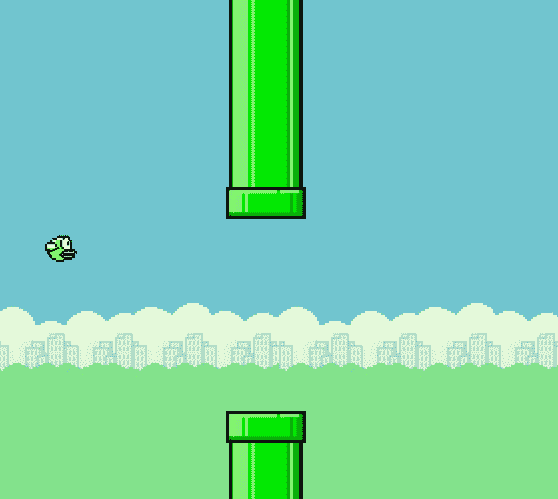
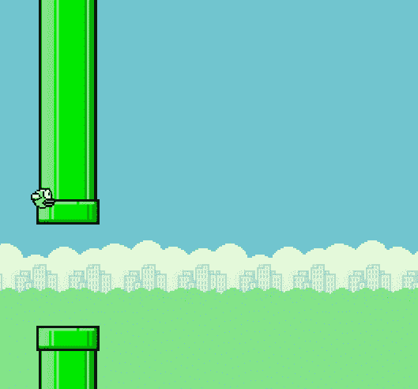
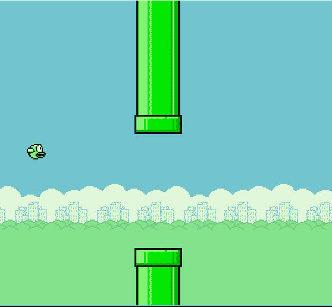

# 十二、学习角色动画、碰撞和移动

*动画是一门艺术*。这就提出了一个问题，即我们如何通过为每个角色添加纹理或皮肤，或者通过维护完美的图形用户界面，来创建一个模拟人或对象物理行为的虚拟世界。创建动画时，我们不需要了解控制器或物理设备如何工作，但动画是物理设备和游戏角色之间的媒介。动画通过在图像视图中用适当的阴影和动作来指导玩家，因此它是一门艺术。作为程序员，我们要对游戏角色在何处以及为什么向特定方向移动负责，而动画师则要对他们的外观和移动负责。

在 Python`pygame`模块中，我们可以使用精灵创建动画和碰撞，精灵是较大图形场景的一部分，是二维图像。也许我们可以自己做一个或者从网上下载一个。在用 pygame 加载这些精灵之后，我们将学习构建游戏的两个基本模块：处理用户事件和构建动画逻辑。动画逻辑是一种简单但功能强大的逻辑，它可以使精灵或图像按照用户事件控制的特定方向移动。

本章结束时，您将熟悉游戏控制器的概念以及使用它为游戏角色创建动画的方法。除此之外，您还将了解碰撞原理以及使用 pygame 掩蔽方法处理碰撞的方法。不仅如此，您还将学习如何处理游戏角色的动作，例如在制作 flappy bird 等游戏时跳跃、轻敲和滚动。

在本章中，我们将介绍以下主题：

*   游戏动画概述
*   滚动背景和角色动画
*   随机目标生成
*   检测碰撞
*   得分和结束屏幕
*   游戏测试

# 技术要求

您需要以下要求列表才能完成本章：

*   Pygame 编辑器（IDLE）版本 3.5 或更高版本。
*   Pycharm IDE（有关安装过程，请参阅[第 1 章](01.html)、*了解 Python–设置 Python 和编辑器*）。
*   Flappy Bird 游戏的代码资产和精灵可在本书的 GitHub 存储库中找到：[https://github.com/PacktPublishing/Learning-Python-by-building-games/tree/master/Chapter12](https://github.com/PacktPublishing/Learning-Python-by-building-games/tree/master/Chapter12)

请查看以下视频以查看代码的运行情况：

[http://bit.ly/2oKQQxC](http://bit.ly/2oKQQxC)

# 理解游戏动画

就像你在电脑游戏中看到的所有东西一样，动画模仿真实世界，或者试图创造一个玩家可以感觉到他们正在与之互动的世界。用二维精灵绘制游戏相当简单，正如我们在上一章为贪食蛇游戏制作蛇角色时所看到的那样。即使是 2D 角色，我们也可以通过适当的着色和运动创建三维运动。使用`pygame`模块可以更轻松地设置单个对象的动画；在上一章中，当我们为贪食蛇游戏创建一个简单的动画时，我们看到了一点这一点。在本节中，我们将使用`pygame`模块为许多对象设置动画。我们将制作一个简单的程序来创建降雪动画。首先，我们将使用一些形状来填充雪花（在本程序中，我们使用的是圆形几何形状，但您可以选择任何形状），然后创建一些动画逻辑，使雪花在环境中移动。

在我们编写代码之前，请确保进行一点头脑风暴。由于我们在上一章中也编写了一些高级逻辑，因此本节可能对您更容易，但请确保您也了解我们在这里所做的工作，因为它对下一节非常有用，在下一节中，我们将开始制作 Flappy Bird 游戏的克隆。

我们知道，雪花动画需要一个位置（*x*、*y*来渲染雪花。这个位置可以任意选择，因此您可以使用随机模块来选择这样的位置。下面的代码显示了如何使用`pygame`模块在随机位置绘制任何形状。由于`for`循环用于迭代，我们将使用它为最多 50 次调用的迭代创建一个范围（值`eachSnow`范围为 0 到 49）。回想上一章，您学习了如何使用 pygame 的`draw`模块在屏幕上绘制任何形状。考虑到这一点，让我们来看看下面的代码：

```py
#creates snow 
for eachSnow in range(50):
     x_pos = random.randrange(0, 500)
     y_pos = random.randrange(0, 500)
     pygame.draw.circle(displayScreen, (255,255,255) , [x_pos, y_pos], 2) #size:2
```

想象一下，我们使用前面的代码制作动画，该代码将依次绘制圆形雪花。运行此命令后，您将在输出中观察到一些异常情况。你可能已经猜到了，但让我来解释一下。前面的代码在某个随机位置创建了一个圆，而先前创建的圆在创建新圆后立即消失。相反，我们希望我们的代码生成雪的数量，并且必须确保之前生成的圆位于右侧位置，而不是消失。您是否发现前面的代码有点错误？既然您知道了错误的原因，那么就慢慢来，想想如何解决这个错误。您可能会想到的一个普遍的想法是使用数据结构来解决这个问题。我更喜欢使用列表。让我们对前面的代码进行一些修改：

```py
for eachSnow in range(50):
     x_pos = random.randrange(0, 500)
     y_pos = random.randrange(0, 500)
     snowArray.append([x_pos, y_pos])
```

现在，在`snowArray`列表中，我们在*x*和*y*位置添加了随机创建的雪的位置。对于多个`x_pos`和`y_pos`雪值，将形成嵌套列表。例如，对于三块随机制作的圆形雪，列表可能看起来像`[[20,40],[40,30],[30,33]]`。

对于使用前面的`for`循环生成的每一块雪，必须使用另一个循环进行渲染。获取`snow_list`变量的长度可能会有所帮助，因为这将让我们了解应该绘制多少雪。对于`snow_list`表示的位置数，我们可以使用`pygame.draw`模块绘制任意形状，如下所示：

```py
for eachSnow in range(len(snowArray)):
 # Draw the snow flake
     pygame.draw.circle(displayScreen, (255,255,255) , snowArray[i], 2)
```

你能看到用`pygame`模块绘图有多容易吗？尽管这对你来说并不是疏远，但这个概念不久就会派上用场。接下来，我们将了解如何使雪向下落下。按照以下步骤创建圆形雪的向下运动：

1.  首先，必须使雪以单位像素向下移动。您只需更改`snowArray`元素的`y_pos`坐标，如下所示：

```py
      color_WHITE = (255, 255, 255)
      for eachSnow in range(len(snowArray)):

       # Draw the snow flake
       pygame.draw.circle(displayScreen, color_WHITE, snow_Array[i], 2)

       # moving snow one step or pixel below
       snowArray[i][1] += 1
```

2.  第二，你必须确保，每当雪落在视线之外时，它都会不断地被创造出来。在*步骤 1*中，我们已经为环形雪创建了一个下降。在某一点上，它将以较低的水平边界走向。如果遇到此问题，则必须重置它以从顶部渲染。通过添加以下代码，将使用随机库在屏幕顶部渲染圆形雪：

```py
      if snowArray[i][1] > 500:
      # Reset it just above the top
      y_pos = random.randrange(-50, -10)
      snowArray[i][1] = y_pos
      # Give it a new x position
      x_pos = random.randrange(0, 500)
      snowArray[i][0] = y_pos
```

此动画的完整代码如下（使用注释编写的代码是不言自明的）：

1.  首先，我们编写的前面的代码需要重新定义和重构，以便代码看起来很好。让我们从初始化它开始：

```py
      import pygame as p
      import random as r

      # Initialize the pygame
      p.init()

      color_code_black = [0, 0, 0]
      color_code_white = [255, 255, 255]

      # Set the height and width of the screen
      DISPLAY = [500, 500]

      WINDOW = p.display.set_mode(DISPLAY)

      # Create an empty list to store position of snow
      snowArray = []
```

2.  现在，在初始化的正下方添加您的`for`循环：

```py
      # Loop 50 times and add a snow flake in a random x,y position
      for eachSnow in range(50):
          x_pos = r.randrange(0, 500)
          y_pos = r.randrange(0, 500)
          snowArray.append([x_pos, y_pos])

          objectClock = game.time.Clock()
```

3.  同样，我们将通过创建主循环来结束逻辑，*循环*，直到用户明确单击关闭按钮：

```py
      # Loop until the user clicks the close button.
      finish = False
      while not finish:

           for anyEvent in p.event.get(): # User did something
               if anyEvent.type == p.QUIT: # If user clicked close
                   finish = True # Flag that we are done so we 
                            exit this loop

       # Set the screen background
               WINDOW.fill(BLACK)

       # Process each snow flake in the list
               for eachSnow in range(len(snowArray)):

       # Draw the snow flake
                   p.draw.circle(WINDOW, color_code_white, snowArray[i], 2)

       # One step down for snow [falling of snow]
                   snowArray[i][1] += 1
```

4.  最后，检查雪是否在边界内：

```py
# checking if snow is out of boundary or not
 if snowArray[i][1] > 500:
 # reset if it from top
 y_pos = r.randrange(-40, -10)
 snowArray[i][1] = y_pos
 # New random x_position
 x_pos = r.randrange(0, 500)
 snowArray[i][0] = x_pos
```

5.  最后，使用已绘制的内容更新屏幕：

```py
      # Update screen with what you've drawn.
          game.display.update()
          objectClock.tick(20)

      #if you remove following line of code, IDLE will hang at exit
      game.quit()
```

前面的代码由许多代码片段组成：初始化游戏变量，然后创建游戏模型。在*步骤 3*中，我们创建了一些控制游戏动画的简单逻辑。我们在*步骤 3*中构建了两个代码模型，让我们的游戏为用户交互（处理用户事件）并生成一个游戏对象（圆形降雪），它通过`for`循环进行渲染。虽然我们将在接下来的章节中创建更复杂的动画，但这是一个很好的动画程序。您可以清楚地看到，在后台，创建动画需要使用循环、条件和游戏对象。我们使用 Python 编程范例，如 if-else 语句、循环、算术和向量操作来创建游戏对象动画。

除了设置几何图形的动画外，您甚至可以设置精灵或图像的动画。要做到这一点，你必须制作自己的精灵或从互联网上下载一些。在下一节中，我们将使用`pygame`模块为精灵设置动画。

# 设置精灵动画

为精灵设置动画与为几何形状设置动画没有什么不同，但它们被认为是复杂的，因为您必须使用动画逻辑为这些图像编写额外的代码位。但是，对于加载的每个图像，该动画逻辑将不相同；每种游戏都不一样。因此，您必须事先分析哪种类型的动画适合您的精灵，以便可以对其进行相应的编码。在本节中，我们不会创建任何自定义图像；相反，我们将下载一些（感谢互联网！）。我们将在这些精灵中嵌入动画逻辑，这样我们的程序将促进足够的着色和移动。

为了让您了解静态图像或精灵的动画制作是多么容易，我们将创建一个简单的程序，它将加载大约 15 个角色的图像（左右移动）。每当用户按下键盘上的左键或右键时，我们将`blit`（渲染）它们。执行以下步骤以了解如何创建动画精灵程序：

1.  首先，您应该为`pygame`程序创建一个基础模板。您必须导入一些重要模块，为动画控制台创建一个曲面，并声明*空闲*友好`quit()`功能：

```py
      import pygame
      pygame.init()

      win = pygame.display.set_mode((500,480))
      pygame.quit()
```

2.  其次，您必须加载*images*目录中列出的所有精灵和图像。此目录包含多个精灵。您必须下载它并将其保存在存储 Python 文件的目录中（sprites/images 文件可在 GitHub 的[上找到）https://github.com/PacktPublishing/Learning-Python-by-building-games/tree/master/Chapter12](https://github.com/PacktPublishing/Learning-Python-by-building-games/tree/master/Chapter12) ：

```py
      #walk_Right contains images in which character is turning towards 
         Right direction 
      walkRight = [pygame.image.load('Right1.png'), 
       pygame.image.load('Right2.png'), pygame.image.load('Right3.png'), 
       pygame.image.load('Right4.png'), pygame.image.load('Right5.png'), 
       pygame.image.load('Right6.png'), pygame.image.load('Right7.png'), 
       pygame.image.load('Right8.png'), pygame.image.load('Right9.png')]

      #walk_left contains images in which character is turning towards 
         left direction
      walkLeft = [pygame.image.load('Left1.png'), 
       pygame.image.load('Left2.png'), pygame.image.load('Left3.png'), 
       pygame.image.load('Left4.png'), pygame.image.load('Left5.png'), 
       pygame.image.load('Left6.png'), pygame.image.load('Left7.png'), 
       pygame.image.load('Left8.png'), pygame.image.load('Left9.png')]

      #Background and stand still images
      background = pygame.image.load('bg.jpg')
      char = pygame.image.load('standing.png')
```

3.  接下来，我们需要声明一些基本变量，例如角色的初始位置及其速度，即游戏精灵每单位击键所走的距离。在下面的代码中，我将速度声明为五个单位，这表明游戏角色将从当前位置移动固定的 5 个像素：

```py
      x = 50
      y = 400
      width = 40
      height = 60
      vel = 5

      clock = pygame.time.Clock()
```

4.  您必须声明更多的变量，以便根据用户在键盘上按下的内容跟踪精灵的移动。如果按左箭头键，`left`变量为`True`，如果按右箭头键，`right`变量为`False`。`walkCount`变量将跟踪按键的次数：

```py
      left = False
      right = False
      walkCount = 0
```

在这里，我们已经完成了任何 pygame 程序的基本布局，包括导入适当的模块、声明变量以跟踪运动、加载精灵等等。课程剩下的两个部分是最重要的，所以请确保您理解它们。我们将像往常一样，首先创建一个主循环。这个主循环将处理用户事件，即当用户按下左键或右键时要做什么。其次，您必须创建一些动画逻辑，它将根据用户事件确定在什么时间点`blit`要显示什么图像。

我们将从处理用户事件开始。请按照以下步骤执行此操作：

1.  首先，您必须声明一个主循环，它可能是一个无限循环。我们将使用`tick`方式为游戏提供**FPS**。您可能还记得，此方法应每帧调用一次。它将计算自上次调用以来经过的毫秒数：

```py
      finish = False 

      while not finish: clock.tick(27)
```

2.  其次，从处理关键用户事件开始。在简单的精灵动画中，可以从处理两个基本动作开始：左和右。在接下来的部分中，我们将通过处理跳跃/敲击动作来制作游戏。此代码应写入 while 循环中：

```py
      while not finish:
           clock.tick(27)
           for anyEvent in pygame.event.get():
              if anyEvent.type == pygame.QUIT:
                  finish = True

           keys = pygame.key.get_pressed()

          #checking key pressed and if character is at x(boundary) or not?
           if keys[pygame.K_LEFT] and x > vel: 
              x -= vel #going left by 5pixels
              left = True
              right = False

          #checking RIGHT key press and is character coincides with 
             RIGHT boundary.
          # value (500 - vel - width) is maximum width of screen, 
             thus x should be less
           elif keys[pygame.K_RIGHT] and x < 500 - vel - width:  
              x += vel #going right by 5pixels
              left = False
              right = True

           else: 
              #not pressing any keys
              left = False
              right = False
              walkCount = 0

          Animation_Logic()
```

观察前面代码的最后一行，`Animation_Logic()`函数的调用完成。但是，此方法尚未声明。此方法是任何由精灵或图像制作的游戏的中心块。在动画逻辑中编写的代码将执行两个不同的任务：

*   从加载精灵时定义的图像列表中 Blit 或渲染图像。在我们的例子中，这些是`walkRight`、`walkLeft`、`bg`和`char`。
*   根据逻辑重新绘制游戏窗口，这将检查要从图像池中选择的图像。请注意，`walkLeft`包含九个不同的图像。此逻辑将从这些图像中进行选择。

现在我们已经处理了用户事件，让我们学习如何为先前加载的精灵制作动画逻辑。

# 动画逻辑

精灵是包含字符并具有透明背景的静态图像。这些精灵的额外阿尔法信息是必不可少的，因为在 2D 游戏中，我们希望用户只看到角色，而不是他们的背景。想象一个游戏中有一个背景平淡的角色 blit。这会给球员们留下一个不好的印象。例如，以下精灵是马里奥角色。假设您正在制作一个马里奥游戏，您从以下精灵中裁剪了一个角色，但忘记删除其蓝色背景。该角色及其蓝色背景将在游戏中渲染，使游戏变得糟糕。因此，我们必须使用在线工具或离线工具（如 GIMP）手动删除（如果有）角色背景。精灵图纸的示例如下所示：


现在，让我们继续我们的精灵动画。到目前为止，我们已经使用`pygame`声明了一个处理事件的模板；现在，让我们编写动画逻辑。正如我们之前所确认的，*动画逻辑是一种简单的逻辑，它将在图像之间进行选择，并相应地进行 blit。*现在让我们来做一个逻辑：

```py
def Animation_Logic():
    global walkCount

    win.blit(background, (0,0))  

    #check_1
    if walkCount + 1 >= 27:
        walkCount = 0

    if left:  
        win.blit(walkLeft[walkCount//3], (x,y))
        walkCount += 1                          
    elif right:
        win.blit(walkRight[walkCount//3], (x,y))
        walkCount += 1
    else:
        win.blit(char, (x, y))
        walkCount = 0

    pygame.display.update()
```

您将看到的第一件事是`global`变量。`walkCount`变量最初在主循环中声明，并统计用户按下任何键的次数。但是，如果删除`global walkCount`语句，则无法在`Animation_Logic`函数中更改`walkCount`的值。如果只想在函数内部访问或打印`walkCount`的值，则不需要将其定义为全局。但是，如果要在函数内操作其值，则必须将其声明为全局变量。`blit`命令将采用两个参数：一个是需要渲染的精灵，另一个是必须在屏幕上渲染精灵的位置。在前面的代码中，`#check_1`之后编写的代码是在字符到达极端位置时对其进行限定。这是一个检查，我们必须呈现一个*字符*图像，这是一个角色的静态图像。

渲染精灵首先要检查左侧移动是否处于活动状态。如果`True`、`blit`在*x*、*y*位置的图像。事件处理程序操作（*x*、*y*的值。每当用户按下左箭头键时，*x*值将从其先前的值减少五个单位，图像将被渲染到该值。由于此动画仅允许角色在正*X*轴或负*X*轴上沿水平方向移动，因此 y 坐标没有变化。同样，对于右移，我们将在（*x*、*y*指定的位置渲染`walkRight`池中的图像。在代码的另一部分中，我们`blit`使用了一个字符图像，这是一个没有移动的字符的空闲图像。因此，`walkCount`等于零。在我们`blit`完成所有事情后，我们必须更新它以反映变化。我们通过调用`display.update`方法来实现这一点。

让我们运行动画并观察输出：


在控制台中，如果按向左箭头键，角色将开始向左移动，如果按向右箭头键，角色将向右移动。由于 y 坐标没有变化，并且我们没有处理主循环中的任何事件来促进垂直移动，因此角色被限制在水平方向上移动。我强烈建议你尝试使用这些精灵，并尝试通过改变 y 坐标来处理垂直运动。虽然我已经为您提供了包含图像列表的资源列表，但如果您想在游戏中使用任何其他精灵，您可以转到以下站点并从那里下载任何精灵：[https://www.spriters-resource.com/](https://www.spriters-resource.com/) 。这个网站是任何 pygame 开发者的天堂，所以请确保您访问它并下载您想要的任何游戏精灵，以便您可以尝试使用它（Mario 最好尝试）。

从下一节开始，我们将开始制作 Flappy Bird 游戏的克隆。我们将学习滚动背景和角色动画、随机对象生成、碰撞和计分等技术。

# 滚动背景和角色动画

现在，您已经对 pygame 精灵和动画有了足够的了解，可以制作一个包含多个对象的复杂精灵动画的游戏了。在本节中，我们将通过制作 Flappy Bird 游戏来学习滚动背景和角色动画。此游戏包含多个对象，其中鸟是游戏的主要角色，管道对用于游戏中的障碍物。如果您以前没有玩过此游戏，请访问其官方网站[试试 https://flappybird.io/](https://flappybird.io/) 。

说到游戏，它并不难制作，但是通过处理游戏编程的多个方面，它对初学者来说可能是一项艰巨的任务。话虽如此，我们不会自己制作任何精灵，它们可以在互联网上免费获得。这使我们的任务更加容易。由于游戏角色的设计是开源的，我们可以直接关注游戏的编码部分。但是如果你想从头开始设计你的游戏角色，开始使用任何简单的绘画应用程序来制作它们。对于这个 Flappy Bird 游戏，我将使用免费提供的精灵。

我在 GitHub 链接中添加了资源。如果打开“图像”文件夹，然后打开背景图像文件，您将看到其中包含特定高度和宽度的背景图像。但是在 Flappy Bird 游戏中，您可以观察到背景图像是连续渲染的。因此，使用 pygame，我们可以制作一个滚动背景，这样我们就可以连续地`blit`背景图像。因此，我们可以使用一个图像并`blit`连续地使用它，而不是使用相同图像的数千个副本作为背景。

让我们先制作一个角色动画和一个滚动背景。以下步骤向我们展示了如何使用面向对象编程为每个游戏角色创建一个类：

1.  首先，您必须开始声明模块，如 math、os（用于加载具有指定文件名的图像）、random、collections 和 pygame。您还必须声明一些表示每秒帧数设置、动画速度以及游戏控制台高度和宽度的变量：

```py
      import math
      import os
      from random import randint
      from collections import deque

      import pygame
      from pygame.locals import *

      Frame_Rate = 60 #FPS
      ANIMATION_SPEED = 0.18  # pixels per millisecond
      WINDOW_WIDTH = 284 * 2  # Background image sprite size: 284x512 px;                                                                                                  
                              #our screen is twice so to rendered twice: *2
      WINDOW_HEIGHT = 512

```

2.  现在，让我们将图像文件夹中的所有图像加载到 Python 项目中。我还将创建另外两个方法，它们将执行帧到毫秒的转换，反之亦然。
3.  让我们通过使用以下代码来了解`loading_Images`函数是如何工作的：

```py

      def loading_Images():
       """Function to load images"""
       def loading_Image(image_name):

      """Return the sprites of pygame by create unique filename so that 
           we can reference them"""

              new_filename = os.path.join('.', 'images', image_name)
              image = pygame.image.load(new_filename) #loading with pygame 
                                                       module 
              image.convert()
              return image

          return {'game_background': loading_Image('background.png'),
       'endPipe': loading_Image('endPipe.png'),
       'bodyPipe': loading_Image('bodyPipe.png'),
       # GIF format file/images are not supported by Pygame
       'WingUp': loading_Image('bird-wingup.png'),
       'WingDown': loading_Image('bird-wingdown.png')}
```

在前面的程序中，我们定义了`loading_Image`函数，该函数加载/提取某个目录中的所有图像，并将它们作为包含名称作为键、图像作为值的字典返回。让我们通过以下参数分析键和值如何存储在这样的字典中：

*   `background.png`：flappy bird 游戏的背景图片。
*   `img:bird-wingup.png`：这张扑翼鸟的图像有一只翅膀朝上，在游戏中点击屏幕时呈现。
*   `img:bird-wingdown.png`：这部分图像是在飞禽自由落体时使用的，即当用户没有点击屏幕时。这张图片中，飞翼鸟的翅膀指向下方。
*   `img:bodyPipe.png`：包含可用于创建单个管道的独立主体部分。例如，在 Flappy Bird 游戏中，应该从顶部和底部渲染两个离散的管道切片，在它们之间留有间隙。
*   `img:endPipe.png`：这部分图像是管道对的基础。此类图像有两种类型：小管道对的小管端图像和大管道对的大管端图像。

类似地，我们有一个嵌套的`loading_Image`函数，它为正在加载的每个精灵创建一个文件名。它从`/images/ folder`加载图像。在依次加载每个图像后，将使用`convert()`方法调用它们，以加快光点显示（渲染）过程。传递给`loading_Image`函数的参数是图像的文件名。`image_name`是指定通过`os.path.join`方法加载的文件名（及其扩展名；`.png`是首选），以及`convert()`方法，以加速 blitting（渲染）过程

加载图像后，我们需要制作两个进行帧速率转换的函数（请参见[第 10 章](10.html)、*用`turtle`升级蛇类游戏*了解更多关于帧速率的信息）。这些函数集主要以指定的帧速率执行从帧到毫秒的转换，反之亦然。帧到毫秒的转换非常重要，因为我们必须使用毫秒来移动`Bird`字符，也就是说，爬升剩余的毫秒数，其中完整爬升持续`Bird.CLIMB_DURATION`毫秒。如果你想让这只鸟在游戏开始时进行一次（小的）攀爬，可以使用这个。让我们制作这两组函数（GitHub 上的[也提供了对代码的详尽描述）https://github.com/PacktPublishing/Learning-Python-by-building-games/tree/master/Chapter12 以下代码中的](https://github.com/PacktPublishing/Learning-Python-by-building-games/tree/master/Chapter12)：

```py
def frames_to_msec(frames, fps=FPS):
    """Convert frames to milliseconds at the specified framerate.

    Arguments:
    frames: How many frames to convert to milliseconds.
    fps: The framerate to use for conversion.  Default: FPS.
    """
    return 1000.0 * frames / fps

def msec_to_frames(milliseconds, fps=FPS):
    """Convert milliseconds to frames at the specified framerate.

    Arguments:
    milliseconds: How many milliseconds to convert to frames.
    fps: The framerate to use for conversion.  Default: FPS.
    """
    return fps * milliseconds / 1000.0
```

现在，为 bird 角色声明一个类。回想一下[第 6 章](06.html)*面向对象编程*中我们了解到每个实体都应该由一个类来表示。在 Flappy Bird 游戏中，代表`PipePair`（障碍物）的实体或模型与另一个实体（比如鸟）不同。因此，我们必须创建一个新类来表示另一个实体。这个类将代表由玩家控制的鸟。因为鸟是我们游戏中的“英雄”，所以为鸟角色定义的任何动作都只允许玩游戏的用户进行。玩家可以通过轻触屏幕让小鸟爬升（快速上升）；否则，它将下沉（缓慢下降）。鸟必须通过管道对之间的空间，每通过一根管道，将获得一分奖励。同样，如果鸟撞到管道上，游戏结束。

现在，我们可以开始编码我们的主角了。你记得怎么做吗？这是任何一个好的游戏程序员最重要的特征之一，他们头脑风暴太多，编写的代码很小但经过优化。所以，让我们先进行头脑风暴，并预测我们希望如何事先构建鸟的角色，以便我们可以在之后完美地编写代码。以下是一些必须定义为 Bird 类成员的基本属性和常量：

*   类的**属性：**`x`为鸟的*X*坐标，`y`为鸟的*Y*坐标，`msec_to_climb`为爬升剩余毫秒数，其中完整爬升持续`Bird.CLIMB_DURATION`毫秒。
*   **常数**：
*   `WIDTH`：鸟类图像的宽度，以像素为单位。
*   `HEIGHT`：鸟类图像的高度，以像素为单位。
*   `SINK_SPEED`：鸟类在一秒钟内下降而不爬升的速度，单位为像素/毫秒。
*   `CLIMB_SPEED`：鸟类平均在一秒钟内爬升的速度，单位为像素/毫秒。详见`Bird.update`单据串。
*   `CLIMB_DURATION`：鸟类完成爬升所需的毫秒数。

现在我们在游戏中有了足够的关于鸟角色的信息，我们可以开始为它编写代码了。以下代码行表示 Bird 类，其成员定义为类属性和常量：

```py
class Bird(pygame.sprite.Sprite):

    WIDTH = HEIGHT = 50
    SINK_SPEED = 0.18
    CLIMB_SPEED = 0.3
    CLIMB_DURATION = 333.3

    def __init__(self, x, y, msec_to_climb, images):
        """Initialize a new Bird instance."""

        super(Bird, self).__init__() 
        self.x, self.y = x, y
        self.msec_to_climb = msec_to_climb
        self._img_wingup, self._img_wingdown = images
        self._mask_wingup = pygame.mask.from_surface(self._img_wingup)
        self._mask_wingdown = pygame.mask.from_surface(self._img_wingdown)
```

让我们讨论一下在 Bird 类中定义的构造函数或初始值设定项。它包含了许多可能让你不知所措的论点，但它们很容易理解。在构造函数中，我们通常定义类的属性，在本例中是表示鸟的位置的 x 和 y 坐标等变量，以及其他参数。现在让我们看一下这些：

*   `x`：鸟的初始*X*坐标。
*   `y`：鸟的初始*Y*坐标。
*   `msec_to_climb`：爬升剩余的毫秒数，其中完整爬升持续`Bird.CLIMB_DURATION`毫秒。如果你想让这只鸟在游戏开始时进行一次（小的）攀爬，可以使用这个。
*   `images`：包含该鸟使用的图像的元组。它必须按以下顺序包含以下图像：
    *   飞起来的鸟翅膀
    *   落下时的鸟翅膀

最后，应该声明三个重要属性。这些属性是`image`、`mask`和`rect`。想象属性是鸟在游戏中所做的事情。它可以上下飞行，这是在图像属性中定义的。然而，bird 类的其他两个属性是完全不同的。`rect`属性将获取鸟的位置、高度和宽度作为`Pygame.Rect`（矩形形式）。记住`pygame`可以使用`rect`属性跟踪每个游戏角色，并且会在精灵周围绘制一个不可见的矩形。mask 属性获取一个位掩码，可用于与障碍物的碰撞检测：

```py
@property
def image(self):
    "Gets a surface containing this bird image"
    if pygame.time.get_ticks() % 500 >= 250:
        return self._img_wingup
    else:
        return self._img_wingdown

@property
def mask(self):
    """Get a bitmask for use in collision detection.

    The bitmask excludes all pixels in self.image with a
    transparency greater than 127."""
    if pygame.time.get_ticks() % 500 >= 250:
        return self._mask_wingup
    else:
        return self._mask_wingdown

@property
def rect(self):
    """Get the bird's position, width, and height, as a pygame.Rect."""
    return Rect(self.x, self.y, Bird.WIDTH, Bird.HEIGHT)
```

因为我们已经熟悉了`rect`和`mask`属性的概念，所以我不想在这里重复我自己，所以让我们详细了解一下 image 属性。image 属性获取指向鸟的当前图像的曲面。这将根据`pygame.time.get_ticks()`决定是否返回鸟的可见翅膀朝上或朝下的图像。即使 pygame 不支持*动画 GIF，这也将使 Flappy Bird 具有动画效果。*

现在是结束 Bird 类的时候了，但在此之前，您必须声明另一个方法，该方法将更新 Bird 的位置。确保您阅读了我在三重引号中添加的说明作为注释：

```py
def update(self, delta_frames=1):
    """Update the bird's position.

    One complete climb lasts CLIMB_DURATION milliseconds, during which
    the bird ascends with an average speed of CLIMB_SPEED px/ms.
    This Bird's msec_to_climb attribute will automatically be
    decreased accordingly if it was > 0 when this method was called.

    Arguments:
    delta_frames: The number of frames elapsed since this method was
        last called.
    """
    if self.msec_to_climb > 0:
        frac_climb_done = 1 - self.msec_to_climb/Bird.CLIMB_DURATION
        #logic for climb movement
        self.y -= (Bird.CLIMB_SPEED * frames_to_msec(delta_frames) *
                   (1 - math.cos(frac_climb_done * math.pi)))
        self.msec_to_climb -= frames_to_msec(delta_frames)
    else:
        self.y += Bird.SINK_SPEED * frames_to_msec(delta_frames)
```

The mathematical `cosine(angle)` function is used to make a smooth climb for the bird. Cosine is an even function, which means it is an even climb and a fall movement is given to the bird: when the bird is in the middle of the screen, a high jump can be performed, but when the bird is near the top/bottom boundary, only a slight jump can be made (this is a basic principle for the Flappy Bird's movement).

让我们运行游戏来检查小鸟是如何被渲染的。然而，我们还没有创建任何逻辑来让玩家玩游戏（我们很快就会这么做）。现在，让我们运行游戏并观察界面的外观：



根据前面的代码，您必须能够使用`rect`创建一个完整的`Bird`类，该类具有屏蔽、更新和获取位置（即高度和宽度）的属性。我们的 Flappy bird 游戏中的鸟角色只与垂直向上或向下移动的运动相关。我们游戏中的下一个角色是管道（鸟的障碍物），这非常复杂。我们必须连续不断地随机进行`blit`管道配对。让我们看看怎么做。

# 理解随机对象生成

在前面的章节中，我们已经介绍了`Bird`角色的动画。它由一系列处理鸟类垂直运动的属性和属性组成。由于`Bird`类仅限于执行鸟角色的移动，因此我们不能向其添加任何其他角色属性。例如，如果你想在游戏中为障碍物（管道）添加属性，就不能将它们添加到`Bird`类中。您必须创建另一个类来定义下一个对象。这一概念被称为封装（我们在[第 6 章](06.html)、*面向对象编程*中了解到了这一点），在这个概念中，代码和数据被包装在一个单元中，这样其他实体就不会对其造成伤害。

让我们创建一个新类来为游戏制造障碍。首先必须定义一个类以及一些常量。我在代码中添加了注释，以便您了解此类的主要用途：

```py
class PipePair(pygame.sprite.Sprite):
    """class that provides obstacles in the way of the bird in the form of pipe-pair.""" 

    WIDTH = 80
    HEIGHT_PIECE = 32
    ADD_INTERVAL = 3000
```

在我们实际编写这个`PipePair`类之前，让我给你们一些关于这个类的简要信息，以便你们能够掌握以下每一个概念。我们将使用不同的属性和常量，如下所示：

*   `PipePair`**等级**：**插入一对管道（两条管道的组合）形成两条管道，管道之间只留有一个小间隙，以便扇形鸟可以穿过。每当小鸟碰到或撞到任何一对管子时，游戏就结束了。**
***   **属性****：**`x`是`pipePair`的*X*位置。此值是一个浮动，以使移动更平滑。`pipePair`没有*Y*位置，因为它在*Y*方向上没有变化；它始终保持为 0。*   `image`：这是`pygame`模块提供的表面，用于`blit`对`pipePair`的操作。*   `mask`：有一个位掩码，它排除`self.image`中透明度大于 127 的所有像素。这可用于碰撞检测。*   `top_pieces`：顶部管道与端件的组合，端件是管道顶部件的底座（这是一对由管道顶部件组成的管道）。*   `bottom_pieces`：落水管（隧道向上）与端件的组合，端件是底部管道的基础*   **常数**：*   `WIDTH`：一根管子的宽度，以像素为单位。因为一根管子只有一片宽，所以这也是`PipePair`图像的宽度。*   `PIECE_HEIGHT`：管段的高度，以像素为单位。*   `ADD_INTERVAL`：添加新管道之间的间隔，以毫秒为单位。**

 **我们已经知道，对于任何类，我们需要做的第一件事是初始化类或构造函数。此方法将初始化新的随机管道对。以下屏幕截图显示了应如何渲染管道对。管道有两部分，即顶部和底部，并在它们之间插入一个小空间：


让我们为`PipePair`类创建一个初始值设定项，该初始值设定项将`blit`管道的底部和顶部，并将其屏蔽。让我们了解需要在此构造函数中初始化的参数：

*   `end_image_pipe`：表示管道底座（端件）的图像
*   `body_image_pipe`：**表示管道垂直部分的图像（管道的一片）**

**The pipe pair only has an x-attribute and the y-attribute is 0\. Therefore, the value of the `x` attribute is assigned as `WIN_WIDTH`, that is, `float(WIN_WIDTH - 1)`.

以下步骤表示需要添加到构造函数中以在游戏界面中创建随机管道对的代码：

1.  让我们为`PipePair`初始化一个新的随机管道对：

```py
      def __init__(self, end_image_pipe, body_image_pipe):
          """Initialises a new random PipePair.
          """
          self.x = float(WINDOW_WIDTH - 1)
          self.score_counted = False

          self.image = pygame.Surface((PipePair.WIDTH, WINDOW_HEIGHT), 
                       SRCALPHA)
          self.image.convert() # speeds up blitting
          self.image.fill((0, 0, 0, 0))

        #Logic 1: **create pipe-pieces**--- Explanation is provided after
                     the code
 total_pipe_body_pieces = int((WINDOW_HEIGHT - # fill window from 
                                                           top to bottom
           3 * Bird.HEIGHT - # make room for bird to fit through
           3 * PipePair.HEIGHT_PIECE) / # 2 end pieces + 1 body piece
           PipePair.HEIGHT_PIECE # to get number of pipe pieces
           )
 self.bottom_pipe_pieces = randint(1, total_pipe_body_pieces)
 self.top_pipe_pieces = total_pipe_body_pieces - 
                                  self.bottom_pieces
```

2.  接下来，我们需要定义两种类型的管道对：底部管道和顶部管道。添加管道对的代码将显示管道图像，并且只关心管道对的*y*位置。管道对不需要水平坐标（应垂直渲染）：

```py
       # bottom pipe
          for i in range(1, self.bottom_pipe_pieces + 1):
              piece_pos = (0, WIN_HEIGHT - i*PipePair.PIECE_HEIGHT)
              self.image.blit(body_image_pipe, piece_pos)
          end_y_bottom_pipe = WIN_HEIGHT - self.bottom_height_px
          bottom_end_piece_pos = (0, end_y_bottom_pipe - 
                                 PipePair.PIECE_HEIGHT)
          self.image.blit(end_image_pipe, bottom_end_piece_pos)

          # top pipe
          for i in range(self.top_pipe_pieces):
              self.image.blit(body_image_pipe, (0, i * 
                   PipePair.PIECE_HEIGHT))
          end_y_top_pipe = self.top_height_px
          self.image.blit(end_image_pipe, (0, end_y_top_pipe))

          # external end pieces are further added to make compensation
          self.top_pipe_pieces += 1
          self.bottom_pipe_pieces += 1

          # for collision detection
          self.mask = pygame.mask.from_surface(self.image)
```

虽然代码旁边提供的注释在理解代码时很有帮助，但我们需要以更简洁的方式了解逻辑。`total_pipe_body_piece`变量存储可在一个框架中添加的管件数量的高度。例如，它可以推断可以插入到当前实例中的底部管道和顶部管道的数量。我们将其类型转换为整数，因为管道对将始终是整数。`bottom_pipe_piece`类属性表示底部管道的高度。其范围可以从 1 到`total_pipe_piece`支持的最大宽度。同样，顶部管件的高度取决于总管件。例如，如果画布的总高度为 10，底部管道的高度为 1，则通过在两个管道对之间留一个间隙（例如，3），剩余高度应为顶部管道的高度（即，其高度为 10-（3+1）=6），这意味着，除了管道对之间的间隙外，不必提供其他间隙。

前面代码中编写的所有内容都是不言自明的。虽然代码很简单，但我希望您关注最后一行代码，我们使用它来检测冲突。这个检测过程非常重要，因为在 Flappy Bird 游戏中，我们必须检查鸟是否与管道对发生碰撞。这通常通过使用`pygame.mask`模块添加遮罩来完成。

现在，是向`PipePair`类添加一些属性的时候了。我们将添加四个属性：`visible`、`rect`、`height_topPipe_px`和`height_bottomPipe_px`。`rect`属性的工作原理与`Bird`类的`rect`调用类似，它返回包含`PipePair`的矩形。类的`visible`属性检查管道对在屏幕中是否可见。其他两个属性以像素为单位返回顶部和底部管道的高度。以下是`PipePair`类前面四个属性的代码：

```py
@property
def height_topPipe_px(self):
 """returns the height of the top pipe, measurement is done in pixels"""
 return (self.top_pipe_pieces * PipePair.HEIGHT_PIECE)

@property
def height_bottomPipe_px(self):
 """returns the height of the bottom pipe, measurement is done in pixels"""
 return (self.bottom_pipe_pieces * PipePair.HEIGHT_PIECE)

@property
def visible(self):
    """Get whether this PipePair on screen, visible to the player."""
    return -PipePair.WIDTH < self.x < WINDOW_WIDTH

@property
def rect(self):
    """Get the Rect which contains this PipePair."""
    return Rect(self.x, 0, PipePair.WIDTH, PipePair.HEIGHT_PIECE)
```

现在，在包装`PipePair`类之前，应该再向该类添加两个方法。第一种方法`collides_with`是检查鸟是否与管道对中的管道碰撞：

```py
def collides_with(self, bird):
    """check whether bird collides with any pipe in the pipe-pair. The 
       collide-mask deploy a method which returns a list of sprites--in 
       this case images of bird--which collides or intersect with 
       another sprites (pipe-pair)

    Arguments:
    bird: The Bird which should be tested for collision with this
        PipePair.
    """
    return pygame.sprite.collide_mask(self, bird)
```

第二种方法`update`将更新管道对的位置：

```py
def update(self, delta_frames=1):
    """Update the PipePair's position.

    Arguments:
    delta_frames: The number of frames elapsed since this method was
        last called.
    """
    self.x -= ANIMATION_SPEED * frames_to_msec(delta_frames)
```

现在我们知道了每个方法的工作原理，让我们看看实际的代码。在运行游戏之前，您不会理解游戏中的任何缺陷。花点时间运行游戏并观察输出：



好吧，这个游戏很吸引人。轻敲事件工作正常，背景图像与鸟类图像以及攀爬和下沉动作的物理效果一起呈现。然而，你可能已经观察到一件奇怪的事情（如果不是，请看前面的截图），那就是，在与管道对碰撞后，我们的鸟能够向前移动。这是我们比赛中的一个大缺陷，我们不想要它。相反，我们希望在这种情况发生时结束比赛。因此，为了克服这种错误，我们必须使用碰撞的概念（一种处理多个游戏对象相互碰撞事件的技术）。

现在我们已经完成了两个游戏角色类，`Bird`和`PipePair`，让我们开始制作游戏的物理部分：初始化显示和处理碰撞。

# 检测碰撞

*处理碰撞*的过程是通过计算两个独立物体相互接触时必须执行的动作来完成的。在上一节中，我们为每个对象添加了一个遮罩，以检查两个对象是否碰撞。`pygame`模块使得检查碰撞过程非常容易；我们可以简单地使用`sprite.collide_mask`来检查两个物体是否接触。但是，此方法采用的参数是掩蔽对象。在上一节中，我们添加了`collides_with`方法来检查鸟是否与管道对中的一条管道碰撞。现在，让我们使用该方法检查碰撞。

除了检测碰撞，我们还将为游戏制作一个物理布局/模板。在本节中，我不强调基本的 pygame 布局，因为它应该是不言自明的，因为我们已经做了很长时间了。以下步骤描述了制作用于检测游戏角色碰撞的模型的布局（`Bird`与`pipePairs`：

1.  首先定义 main 函数，之后将从外部调用该函数：

```py
      def main():
          """Only function that will be externally called, this 
            is main function

          Instead of importing externally, if we call this function from 
            if name == __main__(), this main module will be executed.
          """

          pygame.init()

          display_surface = pygame.display.set_mode((WIN_WIDTH, 
              WIN_HEIGHT)) #display for screen

          objectClock = pygame.time.Clock()
          images = loading_Images()
```

2.  让我们创建一些逻辑，使鸟出现在屏幕的中心。如果您玩过 Flappy Bird 游戏，您将知道该鸟位于画布的中心，它可以垂直向上或向下移动：

```py
       #at any moment of game, bird can only change its y position, 
         so x is constant
          #lets put bird at center

          Objectbird = Bird(50, int(WIN_HEIGHT/2 - Bird.HEIGHT/2), 2,
                      (images['WingUp'], images['WingDown']))

          pipes = deque() 
      #deque is similar to list which is preferred otherwise 
         if we need faster operations like 
      #append and pop

          frame_clock = 0  # this counter is only incremented 
            if the game isn't paused
```

3.  现在，我们必须将管道对图像添加到`pipes`变量中，因为管道是由`pipe-body`与`pipe-end`连接而成的。这种连接是在`PipePair`类内部完成的，因此，在创建实例之后，我们可以将管道对附加到管道列表中：

```py
        done = paused = False
          while not done:
              clock.tick(FPS)

              # Handle this 'manually'.  
                If we used pygame.time.set_timer(),
              # pipe addition would be messed up when paused.
              if not (paused or frame_clock % 
                msec_to_frames(PipePair.ADD_INTERVAL)):
                  pipe_pair = PipePair(images['endPipe'], 
                    images['bodyPipe'])
                  pipes.append(pipe_pair)
```

4.  现在，处理用户的操作。由于 Flappy Bird 游戏是一款点击式游戏，我们将处理鼠标事件（请参阅[第 11 章](11.html)中的*鼠标控制*部分，*使用 Pygame*超越`turtle`-贪食蛇游戏 UI）：

```py
      *#handling events
          **#Since Flappy Bird is Tapped game**
 **#we will handle mouse events***
 *for anyEvent in pygame.event.get():
              #EXIT GAME IF QUIT IS PRESSED*
 *if anyEvent.type == QUIT or (anyEvent.type == KEYUP and 
                anyEvent.key == K_ESCAPE):*
 *done = True
                  break
             elif anyEvent.type == KEYUP and anyEvent.key in 
              (K_PAUSE, K_p):* *paused = not paused*
 *elif anyEvent.type == MOUSEBUTTONUP or 
                (anyEvent.type == KEYUP and anyEvent.key in 
                (K_UP, K_RETURN, K_SPACE)):* *bird.msec_to_climb = 
                Bird.CLIMB_DURATION*

           if paused: 
              continue #not doing anything [halt position]

```

5.  最后，您一直在等待的是：如何借助 Python 的`pygame`模块构建冲突接口。在我们完成这些步骤的其余部分后，将详细讨论以下代码中突出显示的部分：

```py
 # check for collisions
              pipe_collision = any(eachPipe.collides_with(bird) 
                for eachPipe in pipes)
 if pipe_collision or 0 >= bird.y or 
                bird.y >= WIN_HEIGHT - Bird.HEIGHT:
 done = True

              #blit background
              for position_x_coord in (0, WIN_WIDTH / 2):
 display_surface.blit(images['game_background'], 
                    (position_x_coord, 0))

              #pipes that are out of visible, remove them
 while pipes and not pipes[0].visible:
 pipes.popleft()

 for p in pipes:
 p.update()
 display_surface.blit(p.image, p.rect)

 bird.update()
 display_surface.blit(bird.image, bird.rect) 
```

6.  最后，以一些多余的步骤结束程序，例如使用更新功能渲染游戏，向用户提供无关的消息，等等：

```py
              pygame.display.flip()
              frame_clock += 1
          print('Game Over!')
          pygame.quit()
      #----------uptill here add it to main function----------

      if __name__ == '__main__':
        #indicates two things:
        #In case other program import this file, then value of 
           __name__ will be flappybird
        #if we run this program by double clicking filename 
           (flappybird.py), main will be called

          main()     #calling main function
```

前面代码中突出显示的部分很重要，因此请确保您理解它们。这里，`any()`函数通过检查鸟是否与管道对碰撞来返回布尔值。基于该检查，如果是`True`，我们退出游戏。我们还将检查该鸟是否触及最低水平或最高水平边界，如果触及，则退出游戏。

让我们运行游戏并观察输出：



游戏已经足够可玩了，所以让我们在游戏中再添加一个功能，告诉玩家他们得分有多好。

# 得分和结束屏幕

为 Flappy Bird 游戏添加分数非常简单。玩家的分数将是玩家通过的管道或障碍物的数量。如果球员通过 20 根管子，他们的得分将是 20。让我们在游戏中添加一个分数屏幕：

```py
score = 0
scoreFont = pygame.font.SysFont(None, 30, bold=True) #Score default font: WHITE

while not done:
    #after check for collision
    # procedure for displaying and updating scores of player
     for eachPipe in pipes:
         if eachPipe.x + PipePair.WIDTH < bird.x and not 
           eachPipe.score_counted: 
            #when bird crosses each pipe
             score += 1
             eachPipe.score_counted = True

     Surface_Score = scoreFont.render(str(score), 
        True, (255, 255, 255)) #surface
     x_score_dim = WIN_WIDTH/2 - score_surface.get_width()/2 
     #to render score, no y-position
     display_surface.blit(Surface_Score, (x_score_dim, 
        PipePair.HEIGHT_PIECE)) #rendering

     pygame.display.flip() #update
     frame_clock += 1
print('Game over! Score: %i' % score)
pygame.quit()

```

现在，游戏看起来更有吸引力：


在下一节中，我们将了解如何测试所有内容，甚至尝试应用一些修改。

# 游戏测试

虽然可以修改 Flappy Bird 的区域较少，但您始终可以通过修改某些游戏角色属性来测试游戏，以改变游戏的难度。在上一节中，我们运行了我们的游戏，看到一对管道之间有一个巨大的空间。这将使游戏对许多用户来说非常容易玩，因此我们需要通过缩小两个管道对之间的空间来增加难度。例如，在`Bird`类中，我们声明了四个属性。将其更改为不同的值以观察效果：

```py
WIDTH = HEIGHT = 30 #change it to make space between pipe pairs 
                     smaller/bigger
SINK_SPEED = 0.18 #speed at which bird falls
CLIMB_SPEED = 0.3 #when user taps on screen, it is climb speed
                  #make it smaller to make game harder
CLIMB_DURATION = 333.3
```

您还可以改变游戏属性的值，使游戏具有独特的外观。Flappy Bird 中使用的一些不同游戏属性是*每秒帧数*和*动画速度*。您可以更改这些值以实现必要的更改。虽然可以更改动画速度的值，但 FPS 的值为 60 对于 Flappy Bird 游戏来说已经足够了。

您不需要手动调试和搜索可能的修改，只需在调试模式下运行程序即可更快地进行测试。假设您已经在 Pycharm 的 IDE 中编写了 Flappy Bird 游戏（我建议这样做），您可以在调试模式下运行程序，方法是按*Shift*+*F9*或单击 run 选项卡，然后在调试模式下运行程序。运行后，尝试玩游戏，并尝试使其适合用户可能遇到的每种情况。任何错误都将位于程序的终端，您可以从终端跳转到程序中有多个错误的位置。

# 总结

在本章中，我们更深入地探讨了精灵动画和碰撞的概念。我们研究了如何为几何形状制作简单的动画和创建复杂的精灵动画，并了解了在某些场景中哪种效果最好。我们将 pygame 的事件处理方法与动画逻辑相结合，根据当前游戏状态渲染图像。本质上，动画逻辑维护一个队列，用户事件将存储在该队列中。一次获取一个动作会将图像渲染到某个位置。

使用 pygame 制作的游戏原型有三个核心模块：加载蚂蚁精灵（原始精灵或从互联网下载的精灵）、处理用户事件以及控制游戏角色移动的动画逻辑。有时，您可能会有包含角色图像的精灵表，而不是独立的精灵图像。你可以使用在线工具甚至 pygame 的`rect`方法来裁剪它们。在为游戏获得适当的图像或精灵后，我们处理用户事件并创建动画逻辑以使游戏精灵移动。我们还研究了 pygame 的掩蔽特性，该特性可用于检测对象之间的碰撞。

完成本章后，您现在了解了游戏控制器和动画，了解了碰撞原理（包括 pygame 的遮罩属性），了解了精灵动画（创建角色的运行动画），并了解了如何添加交互式分数屏幕以使游戏更为用户友好。

对于大多数 Python pygame 开发人员来说，您可以应用在本章中获得的知识的广泛领域是*纯**金*。处理精灵对于几乎所有基于 pygame 的游戏都很重要。虽然概念简单但功能强大，但角色动画、碰撞和运动是 Python 游戏的三个主要方面，使它们具有吸引力和交互性。现在，尝试创建一个简单的**角色扮演游戏**（**RPG**）游戏，比如 Junction Jam（如果你没听说过，用谷歌搜索），并尝试在其中嵌入碰撞和精灵移动的概念。

在下一章中，我们将通过创建游戏网格和形状来学习 pygame 的原始图形编程。我们将通过编写一个俄罗斯方块游戏来学习多维列表处理和有效空间确定。****