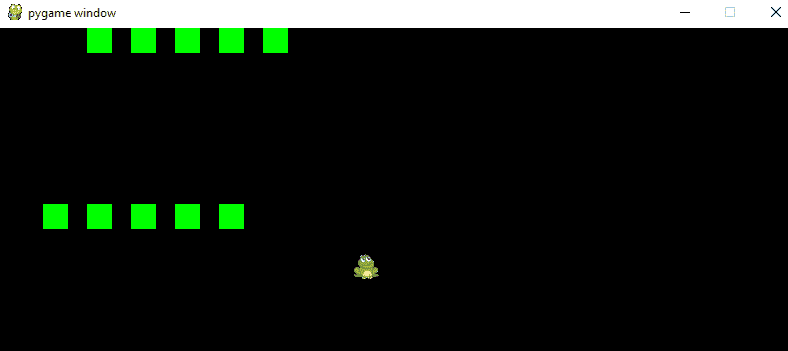
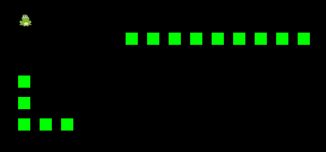

# 十六、学习游戏 AI——构建一个机器人进行游戏

–游戏开发者的目标是创造一款充满挑战和乐趣的游戏。尽管进行了多次尝试，但许多程序员都未能做到这一点。游戏失败的主要原因是人类玩家喜欢在游戏中受到人造玩家的挑战。此类人工玩家的创建结果通常被称为**非玩家角色**（**NPC**）或人工玩家。虽然创建这样一个玩家很有趣（只对程序员而言），但除非我们向这个人工玩家注入一些智能，否则它不会给游戏增加任何价值。创建此类 NPC 并使其与具有一定意识和智力（与人类智力非常相似）的人类玩家互动的过程称为**a****人工智能**（**AI**）。

在本章中，我们将创建一个*智能系统*，它将能够与人类玩家竞争。该系统将足够智能，可以做出类似于人类玩家的动作。该系统将能够自行检查碰撞，检查不同的可能动作，并做出最有利的动作。哪一步是有益的将在很大程度上取决于目标。人工玩家的目标将由程序员明确定义，并基于该目标——计算机玩家将能够做出明智的举动。例如，在蛇类 AI 游戏中，电脑玩家的目标是做出一个让他们更接近蛇食的动作，而在**第一人称射击游戏**（**FPS**）中，人工玩家的目标是接近人类玩家并开始向人类玩家开火。

到本章结束时，您将学习如何通过定义机器状态来创建人工系统，以及如何定义人工玩家在任何情况下的行为。同样，我们将以 Snake AI 为例来说明如何将智能添加到计算机播放器中。我们将为游戏角色创建不同的实体：玩家、计算机和青蛙（蛇食），并探索面向对象和模块化编程的威力。在本章中，您将主要找到我们已经介绍过的内容，并学习如何有效地使用这些内容来制作富有成效的游戏。

本章将介绍以下主题：

*   理解人工智能
*   启动蛇 AI
*   添加计算机播放器
*   给电脑播放器增加智能
*   构建游戏和青蛙实体
*   构建曲面渲染器和处理程序
*   可能的修改

# 技术要求

为了有效地完成本章的工作，必须获得以下要求列表：

*   建议使用 Pygame 编辑器（空闲）-版本 3.5+
*   PyCharm IDE（关于安装过程，请参考[第 1 章](01.html)、*了解 Python–设置 Python 和编辑器*）
*   资产（snake 和 frog`.png`文件）-可从 GitHub 链接[获得 https://github.com/PacktPublishing/Learning-Python-by-building-games/tree/master/Chapter16](https://github.com/PacktPublishing/Learning-Python-by-building-games/tree/master/Chapter16)

请查看以下视频以查看代码的运行情况：

[http://bit.ly/2n79HSP](http://bit.ly/2n79HSP)

# 理解人工智能

随着众多算法和模型的出现，今天的游戏开发者利用它们来创造人工角色，然后让它们与人类玩家竞争。被动地玩一个游戏，与自己竞争，在现实世界的游戏中不再有趣，因此，程序员故意设置一些困难和状态，使游戏更具挑战性和乐趣。在程序员使用的几种方法中，最好、最流行的方法之一是让计算机与人类竞争。听起来既有趣又复杂？begs 的问题是，如何才能创造出这样的算法，从而能够与智能人类竞争。答案很简单。作为程序员，我们将定义几个智能动作，这将允许计算机以类似于我们人类对这种情况的反应的方式执行。

在玩游戏时，人类足够聪明，可以保护他们的游戏角色免受障碍和失败。因此，在本章中，我们的主要目标是为 NPC 提供此类技能。我们将使用之前制作的贪食蛇游戏（[第 11 章](11.html)、*奥多乌龟-贪食蛇游戏 UI 和 Pygame*），对其进行一点改进，并添加一个电脑播放器，它将对食物（蛇吃的东西）的位置以及障碍物的位置有一定程度的了解。从字面上说，我们将为我们的计算机角色定义不同的动作，这样它将有自己的生命。

首先回顾[第 4 章](04.html)、*数据结构和功能*。在那一章中，我们创建了一个简单的井字游戏，并在其中嵌入了一个简单的*智能*算法。在那场井字游戏中，我们能够让人类玩家与计算机竞争。我们从定义模型开始，处理用户事件，最后添加不同的动作，以便计算机能够独立运行。我们还测试了游戏，在某些情况下，电脑能够击败玩家。因此，AI 的基本概念早在[第 4 章](04.html)、*数据结构和功能*中就已经为我们所了解。尽管如此，在本章中，我们将更深入地挖掘 AI 世界，并发现关于*智能算法*的其他酷东西，这些可以添加到我们之前制作的贪食蛇游戏中。

要知道人工智能算法是如何工作的，我们必须有相当多的状态机图表知识。状态机图（通常来源于*计算理论*）定义了 NPC 在不同情况下必须执行的操作。在下一个主题中，我们将学习状态机图表或动画图表。

# 执行国

每个游戏的状态数不同，并且高度依赖于游戏的复杂性。例如，在 FPS 等游戏中，NPC 或敌人必须具有不同的状态：随机寻找人类玩家，在玩家位置内随机产生大量敌人，射击人类玩家，等等。这些状态之间的关系由状态机图定义。此图（不一定是图形）表示从一种状态到另一种状态的变化。例如，敌人应该在什么时候向人类玩家开火？随机数量的敌人应该在什么距离繁殖？

下图表示不同的状态，以及这些状态必须从一种状态更改为另一种状态时：


在观察前面的图表时，您可能不会发现它是外来的。我们以前也做过类似的事情，比如在 tic-tac-toe 游戏中添加智能电脑播放器。在图中，我们从随机的敌人移动开始，因为我们不希望每个敌人都出现在同一个地方。同样，在敌人被渲染后，他们可以接近人类玩家。敌人的行动没有限制。因此，可以在敌人和人类玩家的位置之间执行简单的条件检查，以便为敌人执行向量移动（[第 10 章](10.html)、*升级带`turtle`的贪食蛇游戏*。类似地，每次位置改变后，敌人的位置都会根据人类玩家的位置进行检查，如果他们彼此靠近，那么敌人就可以开始向人类玩家开火。

在每个状态之间，都有一个步骤检查，以确保计算机播放器足够智能，能够与人类播放器竞争。我们可以观察到以下伪代码，它表示前面的机器状态：

```py
#pseudocode for random movement
state.player_movement():
    if state.hits_boundary:
        state.change_movement()
```

在前面的伪代码中，每个状态都定义了代码，为了执行诸如`player_movement`、`hits_boundary`和`change_movements`等检查操作，必须执行这些代码。此外，在接近人类玩家的情况下，伪代码如下所示：

```py
#pseudocode for check if human player and computer are near
if state.player == "explore":
    if human(x, y) == computer(x, y):
        state.fire_player()
    else:
        state.player_movement()
```

前面的伪代码不是实际代码，但它为我们提供了一个蓝图，说明 AI 可以为我们做些什么。在下一个主题中，我们将看到如何利用我们对伪代码和状态机的了解，创建不同的实体，以便在 snake 游戏中实现 AI。

# 启动蛇 AI

正如在 FPS 中所讨论的，类似的机器状态可用于 snake AI。在 Snake AI 游戏中，我们的电脑玩家需要考虑的两个重要状态如下：

*   什么动作对电脑播放器有效？
*   从一种状态到另一种状态发生变化的关键阶段是什么？

关于上述几点，第一点表明，每当计算机玩家接近边界线或墙时，必须改变计算机玩家的动作（确保其保持在边界线内），以便计算机玩家可以与人类玩家竞争。其次，我们必须为电脑蛇玩家定义一个目标。在 FPS 的情况下，如前所述，电脑敌人的主要目标是找到一名人类玩家并执行*射击*操作，但在 snake AI 中，电脑玩家必须接近游戏中的食物。在蛇 AI 中，人类和计算机玩家之间的真正竞争是谁能更快地吃到食物。

现在我们知道了必须为 NPC（计算机播放器）定义的操作，我们可以为游戏定义实体。与我们在[第 11 章](11.html)*中所做的类似，我们的蛇 AI 有三个主要实体，如下所示：*

*   **类**`Player`：代表人类玩家，所有动作都与人类事件处理、渲染、动作相关。
*   **类**`Computer`：代表电脑播放器（AI 的一种形式）。它执行诸如更新位置和更新目标等操作。
*   **类**`Frog`：代表游戏的食物。人类和计算机竞争的目的是尽可能快地接近青蛙。

除了这三个主要游戏实体外，还有两个剩余的游戏实体定义外围任务，它们如下所示：

*   **类**`Collision`：表示将有方法检查任何实体（玩家或计算机）是否与边界发生碰撞的类。
*   **类**`App`：表示将呈现显示屏并检查是否有实体吃过青蛙的类。

现在，在这些实体蓝图的帮助下，我们可以开始编码了。我们将首先添加一个`Player`类，以及可以渲染玩家并处理其移动的方法。打开 PyCharm 编辑器，创建一个包含新 Python 文件的新项目文件夹，并向其中添加以下代码：

```py
from pygame.locals import *
from random import randint
import pygame
import time
from operator import *
```

在前面的代码中，除了`operator`之外，每个模块都是您熟悉的。在编写程序时（特别是在检查游戏实体和边界墙之间的碰撞时），使用数学函数来执行操作非常有用，而不是直接使用数学运算符。例如，如果您想要检查`if value >= 2`，我们可以使用`operator`模块中定义的函数轻松地执行相同的操作。在这种情况下，我们可以调用`ge`方法，它表示*大于等于*：`if ge(value, 2)`。与`ge`方法类似，我们可以调用不同的方法，例如：

*   `gt(a, b)`：如果 a>b，检查 a>b-是否返回`True`；否则，`False`
*   `lt(a, b)`**如果 a<b，则检查 a<b-是否返回`True`；否则，`False`**
***   `le(a, b)`：如果 a<=b，检查 a<=b 是否返回`True`；否则，`False`*   `eq(a, b)`：如果 a==b，检查 a==b 是否返回`True`；否则，`False`**

 **现在您已经导入了必要的模块，让我们通过创建`Player`类来开始有趣的事情：

```py
class Player:
    x = [0] #x-position
    y = [0] #y-position
    size = 44 #step size must be same for Player, Computer, Food
    direction = 0 #to track which direction snake is moving
    length = 3 #initial length of snake

    MaxMoveAllow = 2
    updateMove = 0

    def __init__(self, length):
        self.length = length
        for i in range(0, 1800):
            self.x.append(-100)
            self.y.append(-100)

        # at first rendering no collision
        self.x[0] = 1 * 44
        self.x[0] = 2 * 44
```

在前面的代码中，我们开始定义类属性：（`x`，`y`表示蛇的初始位置，`size`表示蛇块的步长，`direction`（值范围从 0 到 4）表示蛇移动的当前方向，`length`是蛇的原始长度。名为`direction`的属性值范围为 0 到 3，其中 0 表示蛇在*右*方向移动，1 表示蛇在*左*方向移动，类似地，2 和 3 分别表示*上*和*下*方向。

接下来的两个类属性是`MaxMoveAllow`和`update`。这两个属性将在名为`updateMove`的函数中使用（如下代码所示），它们确保玩家不允许蛇移动超过两次。很可能玩家一次输入两个以上的箭头键，但如果所有的效果或箭头键同时被反射，蛇就会不协调地移动。为了省略这一点，我们定义了`maxMoveAllowed`变量，以确保一次最多处理两次箭头键按下。

类似地，我们在类中定义了构造函数，它执行类属性的初始化。这并不局限于在随机位置渲染蛇玩家（由`for`循环完成）后，我们编写了一条语句，确保在游戏开始时（突出显示的部分）没有碰撞。代码意味着蛇的每个块和其他块之间的位置必须相隔三个单位。如果更改`self.x[0] = 2*44 to self.x[0] = 1 *44`的值，则蛇头与蛇头之间会发生碰撞。因此，为了确保在开始时（球员开始比赛之前）没有碰撞，我们必须在区块之间提供特定的位置间隙

现在，让我们使用`MaxMoveAllow`和`updateMove`属性来创建`update`函数：

```py
def update(self):

    self.updateMove = self.updateMove + 1
    if gt(self.updateMove, self.MaxAllowedMove):

        # update previous to new position
        for i in range(self.length - 1, 0, -1):
            self.x[i] = self.x[i - 1]
            self.y[i] = self.y[i - 1]

        # updating the position of snake by size of block (44)
        if self.direction == 0:
            self.x[0] = self.x[0] + self.size
        if self.direction == 1:
            self.x[0] = self.x[0] - self.size
        if self.direction == 2:
            self.y[0] = self.y[0] - self.size
        if self.direction == 3:
            self.y[0] = self.y[0] + self.size

        self.updateMove = 0
```

上述代码对您来说不是外来代码。这种逻辑您以前已经见过很多次了（在[第 6 章](06.html)、*面向对象编程*、在[第 11 章](11.html)、*在处理蛇的位置时，使用 Pygame*超越`turtle`-贪食蛇游戏 UI）。总而言之，前一行代码将人类玩家的当前位置更改为一个新位置，根据该位置按下箭头键。您可以在代码中看到，我们没有处理任何箭头键（稍后我们将在`App`类中处理），但我们创建了一个名为`direction`的属性，它可以跟踪按下了哪个键。如果`direction`等于`0`，则表示右箭头键已被按下，因此我们根据块大小增加*x*-位置。

类似地，如果`direction`是`1`，我们将*x*位置值进行更改，将其递减为`44`块大小，这意味着蛇将向负*x*轴移动。（此信息并不新鲜；详细讨论见[第 9 章](09.html)*数据模型实现。*

现在，为了确保每个`direction`属性都与 0 到 3 之间的值相关联；我们将为它们中的每一个创建函数，如下所示：

```py
def moveRight(self):
    self.direction = 0

def moveLeft(self):
    self.direction = 1

def moveUp(self):
    self.direction = 2

def moveDown(self):
    self.direction = 3

def draw(self, surface, image):
 for item in range(0, self.length):
 surface.blit(image, (self.x[item], self.y[item]))
```

根据前面的代码，您可能已经注意到了`direction`属性的重要性。每个移动都有一个关联的值，在使用`pygame`模块处理用户事件时可以使用该值（我们将在本章后面讨论）。但是，现在，只需看看`draw`函数，它接受蛇（人类玩家）的`surface`和`image`参数，并相应地对它们进行 blit。您可能会有这样一个问题：与其使用`direction`属性来处理用户事件，不如使用传统的方法（从[第 8 章](08.html)开始，我们就一直在这样做，*`turtle`类–在屏幕上画画*？这个问题是正确的，显然你也可以这样做，但是在 Snake AI 中实现这样的代码有很多缺点。由于 Snake AI 有两个主要玩家或游戏实体（人和计算机），每个人的动作必须相互独立。因此，使用传统方法为每个实体处理不同的事件既繁琐又冗长。一个更好的选择是使用一个属性来跟踪哪个键被按下，并为每个玩家唯一地处理它，在本例中，我们将使用`direction`属性来执行此操作。

现在，我们已经完成了主要的人类播放器，我们将接触到计算机播放器。在下一个主题中，我们将开始为`Computers`类编写代码，该类将处理计算机做出的动作。

# 添加计算机播放器

最后，我们将在本章的主要部分-肉食部分-在游戏中添加电脑蛇角色更容易。与外观一样，计算机的动作处理技术必须类似于人类玩家。我们可以重用在`Player`类中编写的代码。唯一不同于`Player`类的是*目标*。在人类玩家的情况下，目标没有定义，因为运动的目标是由玩家的大脑实现的。例如，人类玩家可以通过控制蛇在蛇食方向上的运动来有效地玩游戏。如果蛇食在左边，那么人类玩家将无法按下向右箭头键并将蛇移向相反方向。但是，计算机还不够聪明，无法独立思考赢得比赛的最佳方式。因此，我们必须明确指定计算机播放器的目标。这种为单个玩家/系统指定目标的技术将产生一个智能系统，其应用范围广泛，从游戏到机器人。

现在，让我们复制在`Player`类中编写的代码，并将其添加到名为`Computer`的新类中。以下代码表示`Computer`类及其构造函数的创建：

```py
class Computer:
    x = [0]
    y = [0]
    size = 44 #size of each block of snake
    direction = 0
    length = 3

    MaxAllowedMove = 2
    updateMove = 0

    def __init__(self, length):
        self.length = length
        for item in range(0, 1800):
            self.x.append(-100)
            self.y.append(-100)

      # making sure no collision with player
        self.x[0] = 1 * 44
        self.y[0] = 4 * 44

```

与`Player`类类似，它有四个属性，其中`direction`指定的初始值为`0`，这意味着在计算机实际开始播放之前，蛇会自动向右（正*x*-轴）方向移动。此外，除了代码中突出显示的部分外，构造函数中初始化的所有内容都类似于`Player`类。代码的最后一行有`y[0]`，从`4 *44`开始。回忆起人类玩家的相同代码部分，它是`2*44`，表示列位置。在编写此代码时，我们的意思是在游戏开始时，人类玩家蛇和计算机玩家蛇之间不得发生碰撞。但是，`x[0]`的值是相同的，因为我们希望每一条蛇都从同一行开始，而不是从同一列开始。通过这样做，我们省略了它们的碰撞，每个玩家的蛇都将被正确渲染。

同样，我们需要添加`update`方法，它将根据`direction`属性反映计算机蛇的*x*、*y*位置的变化。以下代码表示`update`方法，该方法将确保 snake 计算机一次只能使用两个箭头键移动的组合：

```py
def update(self):

    self.updateMove = self.updateMove + 1
    if gt(self.updateMove, self.MaxAllowedMove):

        # Previous position changes one by one
        for i in range(self.length - 1, 0, -1):
            self.x[i] = self.x[i - 1]
            self.y[i] = self.y[i - 1]

        # head position change
        if self.direction == 0:
            self.x[0] = self.x[0] + self.size
        if self.direction == 1:
            self.x[0] = self.x[0] - self.size
        if self.direction == 2:
            self.y[0] = self.y[0] - self.size
        if self.direction == 3:
            self.y[0] = self.y[0] + self.size

        self.updateMove = 0
```

前面的代码类似于`Player`类，所以我不想费心解释它。您可以参考`Player`类的`update`函数来了解此方法的工作原理。与`Player`类类似，我们必须添加四种方法，以相应地更改`direction`变量的值：

```py
def moveRight(self):
    self.direction = 0

def moveLeft(self):
    self.direction = 1

def moveUp(self):
    self.direction = 2

def moveDown(self):
    self.direction = 3
```

编写的代码将能够更新电脑播放器的*方向*，但这还不足以做出明智的举动。比方说，如果蛇食在右手边，那么到目前为止编写的代码将无法跟踪食物的位置，因此，计算机蛇可能会去相反的地方。因此，我们必须明确规定，电脑播放器将朝着这样一个方向移动，即接近蛇食的位置。我们将在下一个主题中介绍这一点。

# 给电脑播放器增加智能

到目前为止，已经定义了两个游戏实体，它们都处理玩家的动作。与`Player`类不同，另一个游戏实体（计算机玩家）不会自行决定下一步行动。因此，我们必须明确要求电脑玩家采取行动，使蛇更接近蛇的食物。通过这样做，计算机玩家和人类玩家之间将会有巨大的竞争。这看起来实施起来相当复杂；但是，正如前面所讨论的，这个想法与机器状态图一样。

通过机器状态图，AI 玩家必须适应两件事：

*   检查蛇食的位置，并移动以靠近蛇食。
*   检查蛇的当前位置，确保它没有撞到边界墙。

第一步将执行如下：

```py
def target(self, food_x, food_y):
    if gt(self.x[0] ,  food_x):

        self.moveLeft()

    if lt(self.x[0] , food_x):
        self.moveRight()

    if self.x[0] == food_x:
        if lt(self.y[0] , food_y):
            self.moveDown()

        if gt(self.y[0] , food_y):
            self.moveUp()

def draw(self, surface, image):
     for item in range(0, self.length):
         surface.blit(image, (self.x[item], self.y[item]))
```

在代码的前一行中，我们调用了以前创建的不同方法，例如`moveLeft()`、`moveRight()`等等。这些方法将导致蛇移动，如`direction`属性值所示。`target()`方法包含两个参数：`food_x`和`food_y`，这两个参数综合表示蛇食的位置。操作员`gt`和`lt`用于与蛇*x*头部和*y*头部位置进行比较操作。例如，如果蛇食在负*x*轴上，则比较蛇的*x*位置和食物的*x*位置（`gt(self.x[0], food_x)`。很明显，`food_x`在负*x*轴上，这意味着蛇的*x*位置更大，因此称为`moveLeft()`。正如该方法的签名所示，我们将转弯，将电脑播放器 snake 移向负*x*轴。食物的每个（*x*、*y*位置都会做类似的比较，每次调用不同的方法，这样我们就可以引导电脑玩家走向蛇食。

现在我们已经添加了简单的计算机播放器，它能够穿越多个障碍，让我们在下一个主题中添加`Frog`和`Collision`类。`Frog`类负责在屏幕上任意位置渲染青蛙（蛇食）`Collision`将检查蛇之间和/或蛇与边界墙之间是否发生碰撞。

# 构建游戏和青蛙实体

如前所述，我们将在本主题的代码中再添加两个类。在我们的 Snake AI 中，每个类都有不同的用途。`Game`实体将通过检查传递给其成员方法的参数来检查是否存在任何类型的冲突。对于`Game`实体，我们将定义一个简单但功能强大的方法，名为`checkCollision()`，它将根据冲突返回一个布尔值`True`或`False`。

以下代码表示`Game`类及其成员方法：

```py
class Game:
    def checkCollision(self, x1, y1, x2, y2, blockSize):
        if ge(x1 , x2) and le(x1 , x2 + blockSize):
            if ge(y1 , y2) and le(y1, y2 + blockSize):
                return True
        return False

```

`checkCollision()`方法的调用将在主类内完成（稍后将定义）。但是，您将注意到的重要一点是，所传递的参数（*x*和*y*值）将是 snake 的当前位置，将从中调用此方法。假设您创建了一个`Game`类的实例，并传递人类玩家的（`x1`、`y1`、`x2`和`y2`位置值。这样做，您就为人类玩家调用了`checkCollision`方法。条件语句检查蛇的位置值是否与边界墙相同。如果是，则返回`True`；否则返回`False`。

下一个重要的游戏实体是`Frog`。此类在每次被任何玩家（人类或计算机）吃掉后，以随机位置渲染`Frog`的图像。以下代码表示`Frog`类的声明：

```py
class Frog:
    x = 0
    y = 0
    size = 44

    def __init__(self, x, y):
        self.x = x * self.size
        self.y = y * self.size

    def draw(self, surface, image):
        surface.blit(image, (self.x, self.y))
```

在前面的代码中，我们定义了*x*位置、*y*位置和`draw`方法来渲染青蛙图像。通过从主类创建`Frog`来调用此方法。

在下一个主题中，我们将通过创建和实现最后一个实体来结束我们的程序：主`App`实体。这将是我们游戏的中心导演。

# 构建曲面渲染器和处理程序

首先，让我们回顾一下我们迄今为止所做的工作。我们通过定义两个主要的游戏实体开始编写代码：`Player`和`Computer`。这两个实体在动作和渲染方法方面非常相似，除了在`Computer`类中引入了一个额外的`target()`方法，以确保计算机玩家足够聪明，可以与人类玩家竞争。同样，我们宣布了另外两个实体：`Game`和`Frog`。这两个类为 Snake AI 提供了后端功能，例如添加冲突逻辑和检查要渲染的蛇食的位置。我们在这些不同的实体中创建了多个方法，但我们从未从中创建实例/对象。这样的实例可以从主单个类创建，我们现在将实现它。我将把这个班称为`App`班。

请看以下代码片段，以便为`App`类编写代码：

```py
class App:
    Width = 800 #window dimension
    Height = 600
    player = 0 #to track either human or computer 
    Frog = 0 #food

    def __init__(self):
        self._running = True
        self.surface = None
        self._image_surf = None
        self._Frog_surf = None
        self.game = Game()
        self.player = Player(5) #instance of Player with length 5 (5            
        blocks) 
        self.Frog = Frog(8, 5) #instance of Frog with x and y position
        self.computer = Computer(5) #instance of Computer player with 
        length 5 
```

前面的代码为游戏控制台定义了一些属性，如`Height`和`Width`。类似地，它有一个构造函数，初始化不同的类属性，并创建`Player`、`Frog`和`Computer`实例。

下一步是从计算机加载图像并将其添加到 Python 项目中（请参阅[第 11 章](11.html)、*奥多乌龟-贪食蛇游戏 UI 和 Pygame*，了解更多关于`load`方法的信息）。游戏的资产，如蛇的身体和食物，可以通过这个 GitHub 链接获得：[https://github.com/PacktPublishing/Learning-Python-by-building-games/tree/master/Chapter16](https://github.com/PacktPublishing/Learning-Python-by-building-games/tree/master/Chapter16) 。但是，您也可以创建自己的，并进行实验。在[第 11 章](11.html)中，我已经教过你如何使用 GIMP 和简单的绘画应用程序创建一个透明的精灵，*使用 Pygame*的 Outdo Turtle–Snake 游戏 UI。尝试重述这些概念，然后自己尝试。现在，我将把两个图像加载到 Python 项目中。

It is better to use a .png file for sprites, and don't create a filename with a numeric value in it. For example, a filename for the snake body that is named `snake12.png` is not valid. The filename should be given without numeric values. Similarly, make sure that you add those `.png` files within the Python project folder. Revisit [Chapter 11](11.html), *Outdo Turtle – Snake Game UI with Pygame*, to check how an image is loaded with PyCharm into the Python project.

以下代码将向 Python 项目加载两个图像文件：

```py
def loader(self):
 pygame.init()
 self.surface = pygame.display.set_mode((self.Width, self.Height), 
 pygame.HWSURFACE)

 self._running = True
 self._image_surf = pygame.image.load("snake.png").convert()
 self._Frog_surf = pygame.image.load("frog-main.png").convert()
```

在前一行代码中，我们使用`pygame.display`模块创建了一个`surface`对象。然后，我们将两个图像-`snake.png`和`frog-main.png`加载到 Python 项目中。`convert()`方法将更改渲染对象的像素格式，使其在任何曲面上都能完美工作。

同样，如果游戏有事件，并且与用户交互，则必须实现`on_event`方法：

```py
def on_event(self, event):
    if event.type == QUIT:
        self._running = False
def on_cleanup(self):
    pygame.quit()

```

最后，我们来定义`main`函数：

```py
def main(self):
    self.computer.target(self.Frog.x, self.Frog.y)
    self.player.update()
    self.computer.update()
```

在前面的函数中，我们调用了`target`方法，以确保计算机播放器能够使用其中定义的功能。如前所述，`target()`方法采用食物的*x*、*y*坐标，计算机决定靠近食物。类似地，调用了`Player`类和`Computer`类的`update`方法。

现在让我们定义`renderer()`方法。这种方法会将蛇和食物吸引到游戏表面上。这是使用`pygame`和`draw`模块完成的：

```py
def renderer(self):
    self.surface.fill((0, 0, 0))
    self.player.draw(self.surface, self._image_surf)
    self.Frog.draw(self.surface, self._Frog_surf)
    self.computer.draw(self.surface, self._image_surf)
    pygame.display.flip()
```

如果您觉得不了解`renderer()`方法的工作原理，请转至[第 11 章](11.html)、*使用 Pygame*的 Outdo Turtle–Snake 游戏 UI。总之，此方法将在游戏屏幕上绘制不同的对象（`image_surf`和`Frog_surf`。

最后，让我们创建一个`handler`方法。此方法将处理用户事件。根据用户按下的箭头键，将调用不同的方法，例如`moveUp()`、`moveDown()`、`moveLeft()`、`moveRight()`。这四种方法是在`Player`和`Computer`实体中创建的。以下代码定义了`handler`方法：

```py
def handler(self):
    if self.loader() == False:
        self._running = False

    while (self._running):
        keys = pygame.key.get_pressed()

        if (keys[K_RIGHT]):
            self.player.moveRight()

        if (keys[K_LEFT]):
            self.player.moveLeft()

        if (keys[K_UP]):
            self.player.moveUp()

        if (keys[K_DOWN]):
            self.player.moveDown()

        self.main()
        self.renderer()

        time.sleep(50.0 / 1000.0);
```

前面的`handler`方法之前已经创建了很多次（我们看到了高级和简单的方法），而这一个是最简单的方法。我们使用`pygame`模块监听传入的关键事件，并通过调用不同的方法进行相应的处理。例如，当用户按下向下箭头键时，调用了`moveDown()`方法。最后一个`sleep`方法将嵌入计时器，因此两个连续的按键事件之间存在差异。

最后，我们称之为`handler`方法：

```py
if __name__ == "__main__":
    main = App()
    main.handler()
```

让我们运行游戏并观察输出：



正如预期的那样，这个游戏中必须添加一些东西，包括：当人类玩家和计算机玩家吃食物时会发生什么，当蛇与自身碰撞时会发生什么？如果你一直遵循这本书，这对你来说应该是小菜一碟。我们已经多次添加了相同的逻辑（在[第 7 章](07.html)、*列表推导式和属性*、[第 10 章](10.html)、*用`turtle`升级贪食蛇游戏*、[第 11 章](11.html)、*用 Pygame 升级贪食蛇游戏 UI。但除了这一逻辑，我们还要关注两条相似的蛇：一条必须随着人类玩家的动作移动，另一条则独立移动。电脑蛇意识到了与边界墙的碰撞以及食物的位置。当你运行游戏时，电脑玩家会立即做出反应，并在人类做出反应之前尝试做出明智的举动。这是人工智能在现实游戏行业中的应用。尽管您可能认为 Snake AI 示例更简单，但在现实世界中，AI 也都是关于独立运行的机器，不管算法有多复杂*

但是，在游戏中必须进行一些调整，这将在下一个主题*可能的修改*中介绍。

# 游戏测试和可能的修改

首先，我建议您回顾并观察我们定义`Game`类的部分。我们在其中定义了`checkCollision()`方法。此方法可用于多种用途：首先，检查玩家是否与蛇食发生碰撞；其次，检查玩家是否与边界墙发生碰撞。此时你一定有一个*抓住了*的时刻。[第 7 章](07.html)、*列表推导式和属性*、[第 11 章](11.html)、*与 Pygame*的 Outdo Turtle–Snake 游戏界面，都是关于使用该技术来实现碰撞原理，即*如果食物对象的（x，y）位置与（x，y）任何玩家的坐标，都被称为发生碰撞。*

让我们添加代码来检查是否有玩家与食物发生碰撞：

```py
# Does human player snake eats Frog
for i in range(0, self.player.length):
    if self.game.checkCollision(self.Frog.x, self.Frog.y, 
    self.player.x[i], self.player.y[i], 44):
        #after each player eats frog; next frog should be spawn in next  
        position
        self.Frog.x = randint(2, 9) * 44
        self.Frog.y = randint(2, 9) * 44
        self.player.length = self.player.length + 1

# Does computer player eats Frog
for i in range(0, self.player.length):
    if self.game.checkCollision(self.Frog.x, self.Frog.y, 
        self.computer.x[i], self.computer.y[i], 44):
        self.Frog.x = randint(2, 9) * 44
        self.Frog.y = randint(2, 9) * 44
```

同样，让我们使用相同的函数来检查人类玩家的蛇是否撞到了边界墙。您可能认为在计算机播放器的情况下也需要检查这个，但这是没有用的，因为在`Computer`类中定义的`target`方法不会让这种情况发生。换句话说，电脑播放器永远不会撞到边界墙，因此，检查是否发生碰撞是没有用的。但是，对于人类玩家，我们将使用以下代码进行检查：

```py
# To check if the human player snake collides with its own body
for i in range(2, self.player.length):
    if self.game.checkCollision(self.player.x[0], self.player.y[0], 
   self.player.x[i], self.player.y[i], 40):
        print("You lose!")
        exit(0)

pass
```

我们将在这里结束这个话题，但您可以通过在屏幕上添加一个 g*ame 来让这个游戏更具吸引力，我们在[第 11 章](11.html)、*中学习了如何使用`pygame`来创建这个游戏，*使用 Pygame*的 Outdo Turtle–Snake 游戏 UI。为了在屏幕上创建这样一个游戏，您可以创建一个曲面并渲染一个带有标签的字体，而不是最后的`pass`语句**

但是，在结束本章之前，让我们看看游戏的最终输出：



在游戏中你可能会注意到的另一件事是，电脑玩家的蛇*长度*是恒定的，即使它吃了食物。我故意这么做，这样我的游戏屏幕就不会被污染太多。但是，如果你想增加电脑玩家的蛇的长度（每次蛇吃食物时），你可以在电脑玩家的蛇吃青蛙之后添加一条语句：

```py
self.computer.length = self.computer.length + 1
```

最后，我们到了本章的结尾。我们学到了不同的东西，也在修改旧的东西。与人工智能相关的概念非常广泛；我们刚刚试图接触表面。您可以在使用 Python 的游戏中找到 AI 的其他含义，方法是指向以下 URL:[https://www.pygame.org/tags/ai](https://www.pygame.org/tags/ai) 。

# 总结

在本章中，我们探讨了在游戏中实现 AI 的基本方法。尽管如此，人工智能的运作在很大程度上取决于对智能系统的每一个动作的奖励。我们使用机器状态图为我们的计算机播放器定义可能的状态，并使用它为每个实体执行不同的操作。在这一章中，我们采用了不同的编程范式；事实上，除了为 NPC 使用智能算法之外，这是对我们迄今为止所学知识的总结。

对于每个定义的实体，我们创建了一个类，并基于属性和方法采用了面向对象的范例，如封装和模型。此外，为了实现冲突逻辑，我们定义了不同的类，例如`Frog`和`Game`。为实现单个逻辑而创建单独类的原因是，这些方法应该由每个游戏实体（`Player`和`Computer`单独调用。你可以推断它是多重继承。本书的主要目的是让读者了解如何使用 Python 创建游戏机器人。此外，在某种程度上，我们的目标是在一章中修改我们在本书中学习的所有编程范例。

正如那句古老的格言所说：*已知是一滴。未知是一片海洋*。我希望你仍然渴望了解更多关于 Python 的知识。我建议你多温习一下基本的编程技能，多做些实验，这肯定会让你找到梦想中的工作，成为一名游戏开发者。游戏行业是一个庞大的行业，掌握 Python 知识将带来不同。Python 是一种美丽的语言，因此，您将受到激励，更深入地学习它，本书将是您成为 Python 专家所采取的许多步骤中的第一步。**