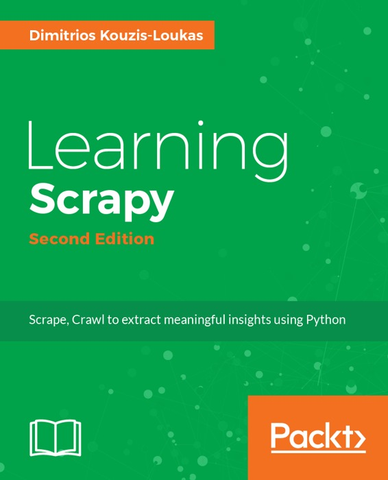

# 零、序言

* * *

序言
[第 1 章 Scrapy 介绍](https://www.jianshu.com/p/b807653e97bb)
[第 2 章 理解 HTML 和 XPath](https://www.jianshu.com/p/90c2c25f0c41)
[第 3 章 爬虫基础](https://www.jianshu.com/p/6ebb898841bc)
[第 4 章 从 Scrapy 到移动应用](https://www.jianshu.com/p/4156e757557f)
[第 5 章 快速构建爬虫](https://www.jianshu.com/p/9d1e00dc40e4)
[第 6 章 Scrapinghub 部署](https://www.jianshu.com/p/441fa74d7aad)
[第 7 章 配置和管理](https://www.jianshu.com/p/674de4eacf15)
[第 8 章 Scrapy 编程](https://www.jianshu.com/p/545d07702e7f)
[第 9 章 使用 Pipeline](https://www.jianshu.com/p/e0287e773d28)
[第 10 章 理解 Scrapy 的性能](https://www.jianshu.com/p/e9710002cb4e)
[第 11 章（完） Scrapyd 分布式抓取和实时分析](https://www.jianshu.com/p/cfca4b7e62f4)

* * *

## 作者简介

Dimitris Kouzis – Loukas 有超过 15 年的软件开发经历。同时他也参与到教学活动中，受众广泛。

他精通数个领域，包括数学、物理和微电子。对这些学科的理解帮助使他得到了提高，超越了软件的“实用方案”。他认为，好的解决方案应该像物理学一样确定，像纠错内存一样拥有健壮性，并且像数学原理一样具有通用性。

Dimitris 现在正在使用最新的数据中心技术，着手开发分布式、低延迟、高可用性的系统。他运用多个编程语言，但更偏爱 Python、C++和 Java。作为开源软硬件的坚定支持者，他希望对独立开发群体和整个人类做出贡献。

* * *

## 审稿人简介

Lazar Telebak 是一名网络开发自由从业者，专精于网络抓取和利用 Python 库和框架进行网页索引。

他的主要工作涉及自动化、网络抓取和数据导出，导出为 CSV、JSON、XML 和 TXT 等多种格式，或是导出到 MongoDB、SQLAlchemy 和 Postgres 等数据库。

他还会使用网络前端技术：HTML、CSS、JS 和 Jquery。

* * *

## 序言

让我大胆猜一下，下面两个故事肯定有一个说的是你。

你第一次碰到 Scrapy 是在搜索“Python 网络抓取”的时候。你瞟了一眼 Scrapy 想，“这个太复杂，我需要个简单的。”然后你就开始用 requests 写 Python 代码，在 BeautifulSoup 上碰到点麻烦，但最后成功了。这个程序有点慢，所以你让它昼夜不停的运行。重启了几次、忽略了一些坏链和非英文字符，早上的时候，大部分网页都存在你的硬盘里了。但是，因为一些未知的技术原因，你再也不想看这段代码了。下次你再抓取网络的时候，你直接登录 scrapy.org，这次 Scrapy 文档看起来合理多了，感觉不用费力就可以解决所有问题。并且，Scrapy 还能解决你没想到的问题。你再也不用以前的方法了。

或者，你是在做网络抓取调研时碰到的 Scrapy。你需要一个可靠快速的企业级工具，毫无疑问，就是只要轻轻一击就能进行网络抓取。这个工具不仅要简单，而且可以根据不同的数据源进行灵活的定制，提供多种的数据输出方式，可以自动 24/7 的可靠运行。比起要价很高的提供网络抓取服务的公司，你偏向于开源的解决方案。从一开始，Scrapy 就是当然的选择。

无论你是如何听说 Scrapy 的，我都热烈欢迎你翻开这本专门为 Scrapy 而写的书。Scrapy 是全世界网络抓取专家的秘密武器。在专家手中，Scrapy 节省了大量时间，表现出众，花费最少。如果你缺少经验，但想像这些专家一样，很可惜，Google 帮不上你什么忙。网上关于 Scrapy 的大部分信息不是过于简化无效，就是太过复杂。对每个想获得准确、可用、规范的 Scrapy 知识的人，这是本必备的书。希望这本书可以扩大 Scrapy 社区，让 Scrapy 被更多人采用。

## 本书的内容

第 1 章，Scrapy 介绍，向你介绍这本书和 Scrapy，使你对 Scrapy 框架和后面章节有清醒的认识。

第 2 章，理解 HTML 和 XPath，让爬虫初学者掌握基础的网页相关技术，以及后面会使用到的技术。

第 3 章，爬虫基础，我们会学习如何安装 Scrapy 和抓取网站。通过一步步搭建实例，让读者理解方法和背后的逻辑。学过这一章，你就可以抓取大部分简单站点了。

第 4 章，从 Scrapy 到移动应用，我们如何使用爬虫生成数据库和向移动应用提供数据支持。通过这一章，你会明白如何用网络抓取获益。

第 5 章，快速构建爬虫，介绍更多关于爬虫的特点，模拟登陆、更快抓取、使用 APIs、爬 URL 的方法。

第 6 章，Scrapinghub 部署，如何将爬虫部署到 Scrapinghub 云服务器，以尝试更快的可用性、简易部署和操作。

第 7 章，配置和管理，详细介绍利用 Scrapy 的配置文件对爬虫进行改进。

第 8 章，Scrapy 编程，使用底层 Twisted 引擎和 Scrapy 架构扩展爬虫功能。

第 9 章，如何使用 Pipelines，在不明显降低性能的条件下，举例实现 Scrapy 连接 MySQL、Elasticsearch、Redis、APIs 和应用。

第 10 章，理解 Scrapy 的性能，Scrapy 的工作机制，如何提高 Scrapy 的性能。

第 11 章，Scrapyd 分布式抓取和实时分析，最后一章介绍如何在多台服务器中使用 Scrapyd 以实现水平伸缩性，并将数据传送到 Apache Spark 进行实时分析。

* * *

序言
[第 1 章 Scrapy 介绍](https://www.jianshu.com/p/b807653e97bb)
[第 2 章 理解 HTML 和 XPath](https://www.jianshu.com/p/90c2c25f0c41)
[第 3 章 爬虫基础](https://www.jianshu.com/p/6ebb898841bc)
[第 4 章 从 Scrapy 到移动应用](https://www.jianshu.com/p/4156e757557f)
[第 5 章 快速构建爬虫](https://www.jianshu.com/p/9d1e00dc40e4)
[第 6 章 Scrapinghub 部署](https://www.jianshu.com/p/441fa74d7aad)
[第 7 章 配置和管理](https://www.jianshu.com/p/674de4eacf15)
[第 8 章 Scrapy 编程](https://www.jianshu.com/p/545d07702e7f)
[第 9 章 使用 Pipeline](https://www.jianshu.com/p/e0287e773d28)
[第 10 章 理解 Scrapy 的性能](https://www.jianshu.com/p/e9710002cb4e)
[第 11 章（完） Scrapyd 分布式抓取和实时分析](https://www.jianshu.com/p/cfca4b7e62f4)

* * *

本书第二版会在 2018 年三月份出版。第二版的目标是对应 Scrapy 1.4 版本。但那时，恐怕 Scrapy 又要升级了。

新版内容增加了 100 页，达到了 365 页。
[https://www.packtpub.com/big-data-and-business-intelligence/learning-scrapy-second-edition](https://link.jianshu.com?t=https://www.packtpub.com/big-data-and-business-intelligence/learning-scrapy-second-edition)