# 十、理解Scrapy的性能


通常，很容易将性能理解错。对于Scrapy，几乎一定会把它的性能理解错，因为这里有许多反直觉的地方。除非你对Scrapy的结构有清楚的了解，你会发现努力提升Scrapy的性能却收效甚微。这就是处理高性能、低延迟、高并发环境的复杂之处。对于优化瓶颈， Amdahl定律仍然适用，但除非找到真正的瓶颈，吞吐量并不会增加。要想学习更多，可以看Dr.Goldratt的《目标》这本书，其中用比喻讲到了更多关于瓶延迟、吞吐量的知识。本章就是来帮你确认Scrapy配置的瓶颈所在，让你避免明显的错误。

请记住，本章相对较难，涉及到许多数学。但计算还算比较简单，并且有图表示意。如果你不喜欢数学，可以直接忽略公式，这样仍然可以搞明白Scrapy的性能是怎么回事。

## Scrapy的引擎——一个直观的方法

并行系统看起来就像管道系统。在计算机科学中，我们使用队列符表示队列并处理元素（见图1的左边）。队列系统的基本定律是Little定律，它指明平衡状态下，队列系统中的总元素个数（N）等于吞吐量（T）乘以总排队/处理时间（S），即N=T*S。另外两种形式，T=N/S和S=N/T也十分有用。

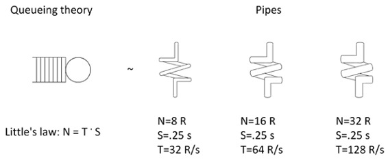图1 Little定律、队列系统、管道

管道（图1的右边）在几何学上也有一个相似的定律。管道的体积（V）等于长度（L）乘以横截面积（A），即V=L*A。

如果假设L代表处理时间S（L≈S），体积代表总元素个数（V≈N），横截面积啊代表吞吐量（A≈T），Little定律和体积公式就是相同的。

> 提示：这个类比合理吗？答案是基本合理。如果我们想象小液滴在管道中以匀速流过，那么L≈S 就完全合理，因为管道越长，液滴流过的时间也越长。V≈N 也是合理的，因为管道越大，它能容下的液滴越多。但是，我们可以通过增大压力的方法，压入更多的液滴。A≈T是真正的类比。在管道中，吞吐量是每秒流进/流出的液滴总数，被称为体积流速，在正常的情况下，它与A^2成正比。这是因为更宽的管道不仅意味更多的液体流出，还具有更快的速度，因为管壁之间的空间变大了。但对于这一章，我们可以忽略这一点，假设压力和速度是不变的，吞吐量只与横截面积成正比。

Little定律与体积公式十分相似，所以管道模型直观上是正确的。再看看图1中的右半部。假设管道代表Scrapy的下载器。第一个十分细的管道，它的总体积/并发等级（N）=8个并发请求。长度/延迟（S）对于一个高速网站，假设为S=250ms。现在可以计算横街面积/吞吐量T=N/S=8/0.25=32请求/秒。

可以看到，延迟率是手远程服务器和网络延迟的影响，不受我们控制。我们可以控制的是下载器的并发等级（N），将8提升到16或32，如图1所示。对于固定的管道长度（这也不受我们控制），我们只能增加横截面积来增加体积，即增加吞吐量。用Little定律来讲，并发如果是16个请求，就有T=N/S=16/0.25=64请求/秒，并发32个请求，就有T=N/S=32/0.25=128请求/秒。貌似如果并发数无限大，吞吐量也就无限大。在得出这个结论之前，我们还得考虑一下串联排队系统。

## 串联排队系统

当你将横截面积/吞吐量不同的管道连接起来时，直观上，人们会认为总系统会受限于最窄的管道（最小的吞吐量T），见图2。

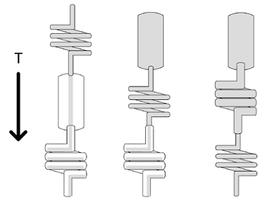图2 不同的串联排队系统

你还可以看到最窄的管道（即瓶颈）放在不同的地方，可以影响其他管道的填充程度。如果将填充程度类比为系统内存需求，瓶颈的摆放就十分重要了。最好能将填充程度达到最高，这样单位工作的花费最小。在Scrapy中，单位工作（抓取一个网页）大体包括下载器之前的一条URL（几个字节）和下载器之后的URL和服务器响应。

> 提示：这就是为什么，Scrapy把瓶颈放在下载器。

## 确认瓶颈

用管道系统的比喻，可以直观的确认瓶颈所在。查看图2，你可以看到瓶颈之前都是满的，瓶颈之后就不是满的。

对于大多数系统，可以用系统的性能指标监测排队系统是否拥挤。通过检测Scrapy的队列，我们可以确定出瓶颈的所在，如果瓶颈不是在下载器的话，我们可以通过调整设置使下载器成为瓶颈。瓶颈没有得到优化，吞吐量就不会有优化。调整其它部分只会使系统变得更糟，很可能将瓶颈移到别处。所以在修改代码和配置之前，你必须找到瓶颈。你会发现在大多数情况下，包括本书中的例子，瓶颈的位置都和预想的不同。

## Scrapy的性能模型

让我们回到Scrapy，详细查看它的性能模型，见图3。

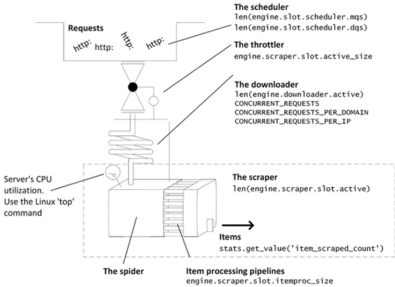图3 Scrapy的性能模型

Scrapy包括以下部分：

*   **调度器**：大量的Request在这里排队，直到下载器处理它们。其中大部分是URL，因此体积不大，也就是说即便有大量请求存在，也可以被下载器及时处理。
*   **阻塞器**：这是抓取器由后向前进行反馈的一个安全阀，如果进程中的响应大于5MB，阻塞器就会暂停更多的请求进入下载器。这可能会造成性能的波动。
*   **下载器**：这是对Scrapy的性能最重要的组件。它用复杂的机制限制了并发数。它的延迟（管道长度）等于远程服务器的响应时间，加上网络/操作系统、Python/Twisted的延迟。我们可以调节并发请求数，但是对其它延迟无能为力。下载器的能力受限于CONCURRENT_REQUESTS*设置。
*   **爬虫**：这是抓取器将Response变为Item和其它Request的组件。只要我们遵循规则来写爬虫，通常它不是瓶颈。
*   **Item Pipelines**：这是抓取器的第二部分。我们的爬虫对每个Request可能产生几百个Items，只有CONCURRENT_ITEMS会被并行处理。这一点很重要，因为，如果你用pipelines连接数据库，你可能无意地向数据库导入数据，pipelines的默认值（100）就会看起来很少。

爬虫和pipelines的代码是异步的，会包含必要的延迟，但二者不会是瓶颈。爬虫和pipelines很少会做繁重的处理工作。如果是的话，服务器的CPU则是瓶颈。

## 使用远程登录控制组件

为了理解Requests/Items是如何在管道中流动的，我们现在还不能真正的测量流动。然而，我们可以检测在Scrapy的每个阶段，有多少个Requests/Responses/Items。

通过Scrapy运行远程登录，我们就可以得到性能信息。我们可以在6023端口运行远程登录命令。然后，会在Scrapy中出现一个Python控制台。注意，如果在这里进行中断操作，比如time.sleep()，就会暂停爬虫。通过内建的est()函数，可以查看一些有趣的信息。其中一些或是非常专业的，或是可以从核心数据推导出来。本章后面会展示后者。下面运行一个例子。当我们运行一个爬虫时，我们在开发机打开第二台终端，在端口6023远程登录，然后运行est()。

> 提示：本章代码位于目录ch10。这个例子位于ch10/speed。

在第一台终端，运行如下命令：

```py
$ pwd
/root/book/ch10/speed
$ ls
scrapy.cfg  speed
$ scrapy crawl speed -s SPEED_PIPELINE_ASYNC_DELAY=1
INFO: Scrapy 1.0.3 started (bot: speed)
... 
```

现在先不关注scrapy crawl speed和它的参数的意义，后面会详解。在第二台终端，运行如下代码：

```py
$ telnet localhost 6023
>>> est()
...
len(engine.downloader.active)                   : 16
...
len(engine.slot.scheduler.mqs)                  : 4475
...
len(engine.scraper.slot.active)                 : 115
engine.scraper.slot.active_size                 : 117760
engine.scraper.slot.itemproc_size               : 105 
```

然后在第二台终端按Ctrl+D退出远程登录，返回第一台终端按Ctrl+C停止抓取。

> 提示：我们现在忽略dqs。如果你通过设置JOBDIR打开了持久支持，你会得到非零的dqs（len(engine.slot.scheduler.dqs)），你应该将它添加到mqs的大小中。

让我们查看这个例子中的数据的意义。mqs指出调度器中等待的项目很少（4475个请求）。len(engine.downloader.active)指出下载器现在正在下载16个请求。这与我们在CONCURRENT_REQUESTS的设置相同。len(engine.scraper.slot.active)说明现在正有115个响应在抓取器中处理。 (engine.scraper.slot.active_size)告诉我们这些响应的大小是115kb。除了响应，105个Items正在pipelines(engine.scraper.slot.itemproc_size)中处理，这说明还有10个在爬虫中。经过总结，我们看到瓶颈是下载器，在下载器之前有很长的任务队列（mqs），下载器在满负荷运转；下载器之后，工作量较高并有一定波动。

另一个可以查看信息的地方是stats对象，抓取之后打印的内容。我们可以以dict的形式访问它，只需通过via stats.get_stats()远程登录，用p()函数打印：

```py
$ p(stats.get_stats())
{'downloader/request_bytes': 558330,
...
 'item_scraped_count': 2485,
...} 
```

这里对我们最重要的是item_scraped_count，它可以通过stats.get_value ('item_scraped_count')之间访问。它告诉我们现在已经抓取了多少个items，以及增长的速率，即吞吐量。

## 评分系统

我为本章写了一个简单的评分系统，它可以让我们评估在不同场景下的性能。它的代码有些复杂，你可以在speed/spiders/speed.py找到，但我们不会深入讲解它。

这个评分系统包括：

*   服务器上[http://localhost:9312/benchmark/](https://link.jianshu.com?t=http://localhost:9312/benchmark/)...的句柄（handlers）。我们可以控制这个假网站的结构（见图4），通过调节URL参数/Scrapy设置，控制网页加载的速度。不用在意细节，我们接下来会看许多例子。现在，先看一下[http://localhost:9312/benchmark/index?p=1](https://link.jianshu.com?t=http://localhost:9312/benchmark/index?p=1)和[http://localhost:9312/benchmark/id:3/rr:5/index?p=1](https://link.jianshu.com?t=http://localhost:9312/benchmark/id:3/rr:5/index?p=1)的不同。第一个网页在半秒内加载完毕，每页只含有一个item，第二个网页加载用了五秒，每页有三个items。我们还可以在网页上添加垃圾信息，降低加载速度。例如，查看[http://localhost:9312/benchmark/ds:100/detail?id0=0](https://link.jianshu.com?t=http://localhost:9312/benchmark/ds:100/detail?id0=0)。默认条件下（见speed/[settings.py](https://link.jianshu.com?t=http://settings.py)），页面渲染用时SPEED_T_RESPONSE = 0.125秒，假网站有SPEED_TOTAL_ITEMS = 5000个Items。

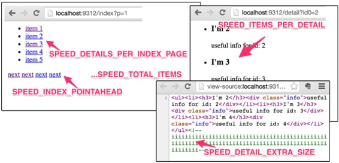图4 评分服务器创建了一个结构可变的假网站

*   爬虫，SpeedSpider，模拟用几种方式取回被SPEED_START_REQUESTS_STYLE控制的start_requests()，并给出一个parse_item()方法。默认下，用crawler.engine.crawl()方法将所有起始URL提供给调度器。
*   pipeline，DummyPipeline，模拟了一些处理过程。它可以引入四种不同的延迟类型。阻塞/计算/同步延迟(SPEED_PIPELINE_BLOCKING_DELAY—很差)，异步延迟(SPEED_PIPELINE_ASYNC_DELAY—不错)，使用远程treq库进行API调用(SPEED_PIPELINE_API_VIA_TREQ—不错)，和使用Scrapy的crawler.engine.download()进行API调用(SPEED_PIPELINE_API_VIA_DOWNLOADER—不怎么好)。默认时，pipeline不添加延迟。
*   settings.py中的一组高性能设置。关闭任何可能使系统降速的项。因为只在本地服务器运行，我们还关闭了每个域的请求限制。
*   一个可以记录数据的扩展，和第8章中的类似。它每隔一段时间，就打印出核心数据。

在上一个例子，我们已经用过了这个系统，让我们重新做一次模拟，并使用Linux的计时器测量总共的执行时间。核心数据打印如下：

```py
$ time scrapy crawl speed
...
INFO:  s/edule  d/load  scrape  p/line    done       mem
INFO:        0       0       0       0       0         0
INFO:     4938      14      16       0      32     16384
INFO:     4831      16       6       0     147      6144
...
INFO:      119      16      16       0    4849     16384
INFO:        2      16      12       0    4970     12288
...
real  0m46.561s
Column          Metric
s/edule         len(engine.slot.scheduler.mqs)
d/load          len(engine.downloader.active)
scrape          len(engine.scraper.slot.active)
p/line          engine.scraper.slot.itemproc_size
done            stats.get_value('item_scraped_count')
mem             engine.scraper.slot.active_size 
```

结果这样显示出来效果很好。调度器中初始有5000条URL，结束时done的列也有5000条。下载器全负荷下并发数是16，与设置相同。抓取器主要是爬虫，因为pipeline是空的，它没有满负荷运转。它用46秒抓取了5000个Items，并发数是16，即每个请求的处理时间是46*16/5000=147ms，而不是预想的125ms，满足要求。

## 标准性能模型

当Scrapy正常运行且下载器为瓶颈时，就是Scrapy的标准性能模型。此时，调度器有一定数量的请求，下载器满负荷运行。抓取器负荷不满，并且加载的响应不会持续增加。

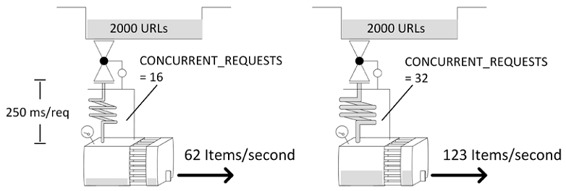图5 标准性能模型和一些试验结果

三项设置负责控制下载器的性能： CONCURRENT_REQUESTS，CONCURRENT_REQUESTS_PER_DOMAIN和CONCURRENT_REQUESTS_PER_IP。第一个是宏观上的控制，无论任何时候，并发数都不能超过CONCURRENT_REQUESTS。另外，如果是单域或几个域，CONCURRENT_REQUESTS_PER_DOMAIN 也可以限制活跃请求数。如果你设置了CONCURRENT_REQUESTS_PER_IP，CONCURRENT_REQUESTS_PER_DOMAIN就会被忽略，活跃请求数就是每个IP的请求数量。对于共享站点，比如，多个域名指向一个服务器，这可以帮助你降低服务器的载荷。

为了更简明的分析，现在把per-IP的限制关闭，即使CONCURRENT_REQUESTS_PER_IP为默认值（0），并设置CONCURRENT_REQUESTS_PER_DOMAIN为一个超大值（1000000）。这样就可以无视其它的设置，让下载器的并发数完全受CONCURRENT_REQUESTS控制。

我们希望吞吐量取决于下载网页的平均时间，包括远程服务器和我们系统（Linux、Twisted/Python）的延迟，t<sub>download</sub>=t<sub>response</sub>+t<sub>overhead</sub>。还可以加上启动和关闭的时间。这包括从取得响应到Items离开pipeline的时间，和取得第一个响应的时间，还有空缓存的内部损耗。

总之，如果你要完成N个请求，在爬虫正常的情况下，需要花费的时间是：

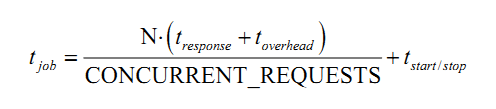

所幸的是，我们只需控制一部分参数就可以了。我们可以用一台更高效的服务器控制t<sub>overhead</sub>，和t<sub>start/stop</sub>，但是后者并不值得，因为每次运行只影响一次。除此之外，最值得关注的就是CONCURRENT_REQUESTS，它取决于我们如何使用服务器。如果将其设置成一个很大的值，在某一时刻就会使服务器或我们电脑的CPU满负荷，这样响应就会不及时，t<sub>response</sub>会急剧升高，因为网站会阻塞、屏蔽进一步的访问，或者服务器会崩溃。

让我们验证一下这个理论。我们抓取2000个items，t<sub>response</sub>∈{0.125s，0.25s，0.5s}，CONCURRENT_REQUESTS∈{8，16，32，64}：

```py
$ for delay in 0.125 0.25 0.50; do for concurrent in 8 16 32 64; do
    time scrapy crawl speed -s SPEED_TOTAL_ITEMS=2000 \
    -s CONCURRENT_REQUESTS=$concurrent -s SPEED_T_RESPONSE=$delay
  done; done 
```

在我的电脑上，我完成2000个请求的时间如下：

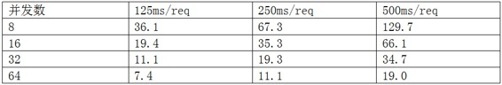

接下来复杂的数学推导，可以跳过。在图5中，可以看到一些结果。将上一个公式变形为y=t<sub>overhead</sub>·x+ t<sub>start/stop</sub>，其中x=N/CONCURRENT_REQUESTS， y=t<sub>job</sub>·x+t<sub>response</sub>。使用最小二乘法（LINEST Excel函数）和前面的数据，可以计算出t<sub>overhead</sub>=6ms，t<sub>start/stop</sub>=3.1s。toverhead可以忽略，但是开始时间相对较长，最好是在数千条URL时长时间运行。因此，可以估算出吞吐量公式是：

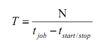

处理N个请求，我们可以估算t<sub>job</sub>，然后可以直接求出T。

## 解决性能问题

现在我们已经明白如何使Scrapy的性能最大化，让我们来看看如何解决实际问题。我们会通过探究症状、运行错误、讨论原因、修复问题，讨论几个实例。呈现的顺序是从系统性的问题到Scrapy的小技术问题，也就是说，更为常见的问题可能会排在后面。请阅读全部章节，再开始处理你自己的问题。

## 实例1——CPU满负荷

症状：当你提高并发数时，性能并没有提高。当你降低并发数，一切工作正常。下载器没有问题，但是每个请求花费时间太长。用Unix/Linux命令ps或Windows的任务管理器查看CPU的情况，CPU的占用率非常高。

案例：假设你运行如下命令：

```py
$ for concurrent in 25 50 100 150 200; do
   time scrapy crawl speed -s SPEED_TOTAL_ITEMS=5000 \
    -s CONCURRENT_REQUESTS=$concurrent
  done 
```

求得抓取5000条URL的时间。预计时间是用之前推导的公式求出的，CPU是用命令查看得到的（可以在另一台终端运行查看命令）：

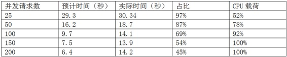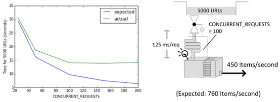图6 当并发数超出一定值时，性能变化趋缓。

在我们的试验中，我们没有进行任何处理工作，所以并发数可以很高。在实际中，很快就可以看到性能趋缓的情况发生。

讨论：Scrapy使用的是单线程，当并发数很高时，CPU可能会成为瓶颈。假设没有使用线程池，CPU的使用率建议是80-90%。可能你还会碰到其他系统性问题，比如带宽、内存、硬盘吞吐量，但是发生这些状况的可能性比较小，并且不属于系统管理，所以就不赘述了。

解决：假设你的代码已经是高效的。你可以通过在一台服务器上运行多个爬虫，使累积并发数超过CONCURRENT_REQUESTS。这可以充分利用CPU的性能。如果还想提高并发数，你可以使用多台服务器（见11章），这样就可以使用更多的内存、带宽和硬盘吞吐量。检查CPU的使用情况是你的首要关切。

## 实例2-阻塞代码

症状：系统的运行得十分奇怪。比起预期的速度，系统运行的十分缓慢。改变并发数，也没有效果。下载器几乎是空的（远小于并发数），抓取器的响应数很少。

案例：使用两个评分设置，SPEED_SPIDER_BLOCKING_DELAY和SPEED_PIPELINE_BLOCKING_DELAY（二者效果相同），使每个响应有100ms的阻塞延迟。在给定的并发数下，100条URL大概要2到3秒，但结果总是13秒左右，并且不受并发数影响：

```py
for concurrent in 16 32 64; do
  time scrapy crawl speed -s SPEED_TOTAL_ITEMS=100 \
  -s CONCURRENT_REQUESTS=$concurrent -s SPEED_SPIDER_BLOCKING_DELAY=0.1
done 
```

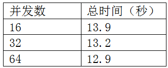

讨论：任何阻塞代码都会是并发数无效，并使得CONCURRENT_REQUESTS=1。公式：100URL*100ms(阻塞延迟)=10秒+tstart/stop，完美解释了发生的状况。

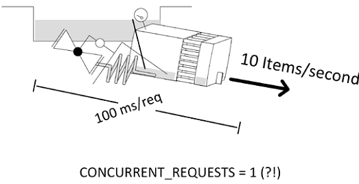图7 阻塞代码使并发数无效化

无论阻塞代码位于pipelines还是爬虫，你都会看到抓取器满负荷，它之前和之后的部分都是空的。看起来这违背了我们之前讲的，但是由于我们并没有一个并行系统，pipeline的规则此处并不适用。这个错误很容易犯（例如，使用了阻塞APIs），然后就会出现之前的状况。相似的讨论也适用于计算复杂的代码。应该为每个代码使用多线程，如第9章所示，或在Scrapy的外部批次运行，第11章会看到例子。

解决：假设代码是继承而来的，你并不知道阻塞代码位于何处。没有pipelines系统也能运行的话，使pipeline无效，看系统能否正常运行。如果是的话，说明阻塞代码位于pipelines。如果不是的话，逐一恢复pipelines，看问题何时发生。如果必须所有组件都在运行，整个系统才能运行的话，给每个pipeline阶段添加日志消息（或者插入可以打印时间戳的伪pipelines），就可以发现哪一步花费的时间最多。如果你想要一个长期可重复使用的解决方案，你可以用在每个meta字段添加时间戳的伪pipelines追踪请求。最后，连接item_scraped信号，打印出时间戳。一旦找到阻塞代码，将其转化为Twisted/异步，或使用Twisted的线程池。要查看转化的效果，将SPEED_PIPELINE_BLOCKING_DELAY替换为SPEED_PIPELINE_ASYNC_DELAY，然后再次运行。可以看到性能改进很大。

## 实例3-下载器中有“垃圾”

症状：吞吐量比预期的低。下载器的请求数貌似比并发数多。

案例：模拟下载1000个网页，每个响应时间是0.25秒。当并发数是16时，根据公式，整个过程大概需要19秒。我们使用一个pipeline，它使用crawler.engine.download()向一个响应时间小于一秒的伪装API做另一个HTTP请求，。你可以在[http://localhost:9312/benchmark/ar:1/api?text=hello](https://link.jianshu.com?t=http://localhost:9312/benchmark/ar:1/api?text=hello)尝试。下面运行爬虫：

```py
$ time scrapy crawl speed -s SPEED_TOTAL_ITEMS=1000 -s SPEED_T_
RESPONSE=0.25 -s SPEED_API_T_RESPONSE=1 -s SPEED_PIPELINE_API_VIA_
DOWNLOADER=1
...
s/edule  d/load  scrape  p/line    done       mem
    968      32      32      32       0     32768
    952      16       0       0      32         0
    936      32      32      32      32     32768
...
real 0m55.151s 
```

很奇怪，不仅时间多花了三倍，并发数也比设置的数值16要大。下载器明显是瓶颈，因为它已经过载了。让我们重新运行爬虫，在另一台终端，远程登录Scrapy。然后就可以查看下载器中运行的Requests是哪个：

```py
$ telnet localhost 6023
>>> engine.downloader.active
set([<POST http://web:9312/ar:1/ti:1000/rr:0.25/benchmark/api>,  ... ]) 
```

貌似下载器主要是在做APIs请求，而不是下载网页。

讨论：你可能希望没人使用crawler.engine.download()，因为它看起来很复杂，但在Scrapy的robots.txt中间件和媒体pipeline，它被使用了两次。因此，当人们需要处理网络APIs时，自然而然要使用它。使用它远比使用阻塞APIs要好，例如前面看过的流行的Python的requests包。比起理解Twisted和使用treq，它使用起来也更简单。这个错误很难调试，所以让我们转而查看下载器中的请求。如果看到有API或媒体URL不是直接抓取的，就说明pipelines使用了crawler.engine.download()进行了HTTP请求。我们的ONCURRENT_REQUESTS限制部队这些请求生效，所以下载器中的请求数总是超过设置的并发数。除非伪请求数小于CONCURRENT_REQUESTS，下载器不会从调度器取得新的网页请求。

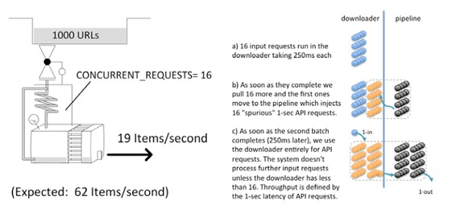图8 伪API请求决定了性能

因此，当原始请求持续1秒（API延迟）而不是0.25秒时（页面下载延迟），吞吐量自然会发生变化。这里容易让人迷惑的地方是，要是API的调用比网页请求还快，我们根本不会观察到性能的下降。

解决：我们可以使用treq而不是crawler.engine.download()解决这个问题，你可以看到抓取器的性能大幅提高，这对API可能不是个好消息。我先将CONCURRENT_REQUESTS设置的很低，然后逐步提高，以确保不让API服务器过载。

下面是使用treq的例子：

```py
$ time scrapy crawl speed -s SPEED_TOTAL_ITEMS=1000 -s SPEED_T_
RESPONSE=0.25 -s SPEED_API_T_RESPONSE=1 -s SPEED_PIPELINE_API_VIA_TREQ=1
...
s/edule  d/load  scrape  p/line    done       mem
    936      16      48      32       0     49152
    887      16      65      64      32     66560
    823      16      65      52      96     66560
...
real 0m19.922s 
```

可以看到一个有趣的现象。pipeline (p/line)的items似乎比下载器(d/load)的还多。这并不是一个问题，弄清楚它是很有意思的。

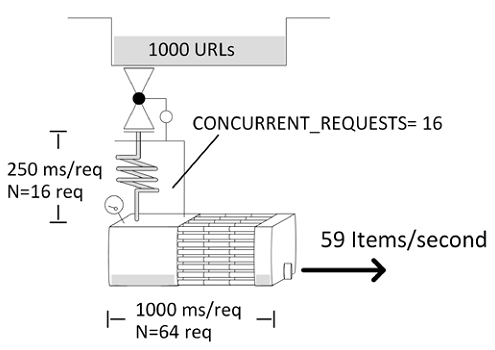图9 使用长pipelines也符合要求

和预期一样，下载器中有16条请求。这意味着系统的吞吐量是T = N/S = 16/0.25 = 64请求/秒。done这一列逐渐升高，可以确认这点。每条请求在下载器中耗时0.25秒，但它在pipelines中会耗时1秒，因为较慢的API请求。这意味着在pipeline中，平均的N = T * S = 64 * 1 = 64 Items。这完全合理。这是说pipelines是瓶颈吗？不是，因为pipelines没有同时处理响应数量的限制。只要这个数字不持续增加，就没有问题。接下来会进一步讨论。

## 实例4-大量响应造成溢出

症状：下载器几乎满负荷运转，一段时间后关闭。这种情况循环发生。抓取器的内存使用很高。

案例：设置和以前相同（使用treq），但响应很高，有大约120kB的HTML。可以看到，这次耗时31秒而不是20秒：

```py
$ time scrapy crawl speed -s SPEED_TOTAL_ITEMS=1000 -s SPEED_T_
RESPONSE=0.25 -s SPEED_API_T_RESPONSE=1 -s SPEED_PIPELINE_API_VIA_TREQ=1 
-s SPEED_DETAIL_EXTRA_SIZE=120000
s/edule  d/load  scrape  p/line    done       mem
    952      16      32      32       0   3842818
    917      16      35      35      32   4203080
    876      16      41      41      67   4923608
    840       4      48      43     108   5764224
    805       3      46      27     149   5524048
...
real  0m30.611s 
```

讨论：我们可能简单的认为延迟的原因是“需要更多的时间创建、传输、处理网页”，但这并不是真正的原因。对于响应的大小有一个强制性的限制，max_active_size = 5000000。每一个响应都和响应体的大小相同，至少为1kB。

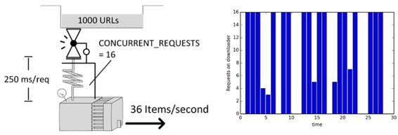图10 下载器中的请求数不规律变化，说明存在响应大小限制

这个限制可能是Scrapy最基本的机制，当存在慢爬虫和pipelines时，以保证性能。如果pipelines的吞吐量小于下载器的吞吐量，这个机制就会起作用。当pipelines的处理时间很长，即便是很小的响应也可能触发这个机制。下面是一个极端的例子，pipelines非常长，80秒后出现问题：

```py
$ time scrapy crawl speed -s SPEED_TOTAL_ITEMS=10000 -s SPEED_T_
RESPONSE=0.25 -s SPEED_PIPELINE_ASYNC_DELAY=85 
```

解决：对于这个问题，在底层结构上很难做什么。当你不再需要响应体的时候，可以立即清除它。这可能是在爬虫的后续清除响应体，但是这么做不会重置抓取器的计数器。你能做的是减少pipelines的处理时间，减少抓取器中的响应数量。用传统的优化方法就可以做到：检查交互中的APIs或数据库是否支持抓取器的吞吐量，估算下载器的能力，将pipelines进行后批次处理，或使用性能更强的服务器或分布式抓取。

## 实例5-item并发受限/过量造成溢出

症状：爬虫对每个响应产生多个Items。吞吐量比预期的小，和之前的实例相似，也呈现出间歇性。

案例：我们有1000个请求，每一个会返回100个items。响应时间是0.25秒，pipelines处理时间是3秒。进行几次试验，CONCURRENT_ITEMS的范围是10到150：

```py
for concurrent_items in 10 20 50 100 150; do
time scrapy crawl speed -s SPEED_TOTAL_ITEMS=100000 -s  \
SPEED_T_RESPONSE=0.25 -s SPEED_ITEMS_PER_DETAIL=100 -s  \
SPEED_PIPELINE_ASYNC_DELAY=3 -s \
CONCURRENT_ITEMS=$concurrent_items
done
...
s/edule  d/load  scrape  p/line    done       mem
    952      16      32     180       0    243714
    920      16      64     640       0    487426
    888      16      96     960       0    731138
... 
```

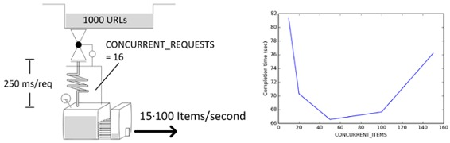图11 以CONCURRENT_ITEMS为参数的抓取时间函数

讨论：只有每个响应产生多个Items时才出现这种情况。这个案例的人为性太强，因为吞吐量达到了每秒1300个Items。吞吐量这么高是因为稳定的低延迟、没进行处理、响应很小。这样的条件很少见。

我们首先观察到的是，以前scrape和p/line两列的数值是相同的，现在p/line显示的是shows CONCURRENT_ITEMS * scrape。这是因为scrape显示Reponses，而p/line显示Items。

第二个是图11中像一个浴缸的函数。部分原因是纵坐标轴造成的。在左侧，有非常高延迟，因为达到了内存极限。右侧，并发数太大，CPU使用率太高。取得最优化并不是那么重要，因为很容易向左或向右变动。

解决：很容易检测出这个例子中的两个错误。如果CPU使用率太高，就降低并发数。如果达到了5MB的响应限制，pipelines就不能很好的衔接下载器的吞吐量，提高并发数就可以解决。如果不能解决问题，就查看一下前面的解决方案，并审视是否系统的其它部分可以支撑抓取器的吞吐量。

## 实例6-下载器没有充分运行

症状：提高了CONCURRENT_REQUESTS，但是下载器中的数量并没有提高，并且没有充分利用。调度器是空的。

案例：首先运行一个没有问题的例子。将响应时间设为1秒，这样可以简化计算，使下载器吞吐量T = N/S = N/1 = CONCURRENT_REQUESTS。然后运行如下代码：

```py
$ time scrapy crawl speed -s SPEED_TOTAL_ITEMS=500 \
-s SPEED_T_RESPONSE=1 -s CONCURRENT_REQUESTS=64
  s/edule  d/load  scrape  p/line    done       mem
     436      64       0       0       0         0
...
real  0m10.99s 
```

下载器满状态运行（64个请求），总时长为11秒，和500条URL、每秒64请求的模型相符，S=N/T+tstart/stop=500/64+3.1=10.91秒。
现在，再做相同的抓取，不再像之前从列表中提取URL，这次使用SPEED_START_REQUESTS_STYLE=UseIndex从索引页提取URL。这与其它章的方法是一样的。每个索引页有20条URL：

```py
$ time scrapy crawl speed -s SPEED_TOTAL_ITEMS=500 \
-s SPEED_T_RESPONSE=1 -s CONCURRENT_REQUESTS=64 \
-s SPEED_START_REQUESTS_STYLE=UseIndex
s/edule  d/load  scrape  p/line    done       mem
       0       1       0       0       0         0
       0      21       0       0       0         0
       0      21       0       0      20         0
...
real 0m32.24s 
```

很明显，与之前的结果不同。下载器没有满负荷运行，吞吐量为T=N/S-tstart/stop=500/(32.2-3.1)=17请求/秒。

讨论：d/load列可以确认下载器没有满负荷运行。这是因为没有足够的URL进入。抓取过程产生URL的速度慢于处理的速度。这时，每个索引页会产生20个URL+下一个索引页。吞吐量不可能超过每秒20个请求，因为产生URL的速度没有这么快。

解决：如果每个索引页有至少两个下一个索引页的链接，呢么我们就可以加快产生URL的速度。如果可以找到能产生更多URL（例如50）的索引页面则会更好。通过模拟观察变化：

```py
$ for details in 10 20 30 40; do for nxtlinks in 1 2 3 4; do
time scrapy crawl speed -s SPEED_TOTAL_ITEMS=500 -s SPEED_T_RESPONSE=1 \
-s CONCURRENT_REQUESTS=64 -s SPEED_START_REQUESTS_STYLE=UseIndex \
-s SPEED_DETAILS_PER_INDEX_PAGE=$details \
-s SPEED_INDEX_POINTAHEAD=$nxtlinks
done; done 
```

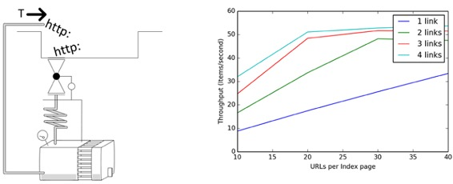图12 以每页能产生的链接数为参数的吞吐量函数

在图12中，我们可以看到吞吐量是如何随每页URL数和索引页链接数变化的。初始都是线性变化，直到到达系统限制。你可以改变爬虫的规则进行试验。如果使用LIFO（默认项）规则，即先发出索引页请求最后收回，可以看到性能有小幅提高。你也可以将索引页的优先级设置为最高。两种方法都不会有太大的提高，但是你可以通过分别设置SPEED_INDEX_RULE_LAST=1和SPEED_INDEX_HIGHER_PRIORITY=1，进行试验。请记住，这两种方法都会首先下载索引页（因为优先级高），因此会在调度器中产生大量URL，这会提高对内存的要求。在完成索引页之前，输出的结果很少。索引页不多时推荐这种做法，有大量索引时不推荐这么做。

另一个简单但高效的方法是分享首页。这需要你使用至少两个首页URL，并且它们之间距离最大。例如，如果首页有100页，你可以选择1和51作为起始。爬虫这样就可以将抓取下一页的速度提高一倍。相似的，对首页中的商品品牌或其他属性也可以这么做，将首页大致分为两个部分。你可以使用-s SPEED_INDEX_SHARDS设置进行模拟：

```py
$ for details in 10 20 30 40; do for shards in 1 2 3 4; do
time scrapy crawl speed -s SPEED_TOTAL_ITEMS=500 -s SPEED_T_RESPONSE=1 \
-s CONCURRENT_REQUESTS=64 -s SPEED_START_REQUESTS_STYLE=UseIndex \
-s SPEED_DETAILS_PER_INDEX_PAGE=$details -s SPEED_INDEX_SHARDS=$shards
done; done 
```

这次的结果比之前的方法要好，并且更加简洁 。

## 解决问题的流程

总结一下，Scrapy的设计初衷就是让下载器作为瓶颈。使CONCURRENT_REQUESTS从小开始，逐渐变大，直到发生以下的限制：

*   CPU利用率 > 80-90%
*   源网站延迟急剧升高
*   抓取器的响应达到内存5Mb上限
    同时，进行如下操作：
*   始终保持调度器（mqs/dqs）中有一定数量的请求，避免下载器是空的
*   不使用阻塞代码或CPU密集型代码

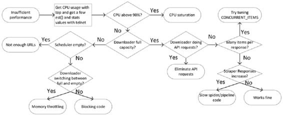图13 解决Scrapy性能问题的路线图

## 总结

在本章中，我们通过案例展示了Scrapy的架构是如何影响性能的。细节可能会在未来的Scrapy版本中变动，但是本章阐述的原理在相当长一段时间内可以帮助你理解以Twisted、Netty Node.js等为基础的异步框架。

谈到具体的Scrapy性能，有三个确定的答案：我不知道也不关心、我不知道但会查出原因，和我知道。本章已多次指出，“更多的服务器/内存/带宽”不能提高Scrapy的性能。唯一的方法是找到瓶颈并解决它。

在最后一章中，我们会学习如何进一步提高性能，不是使用一台服务器，而是在多台服务器上分布多个爬虫。

