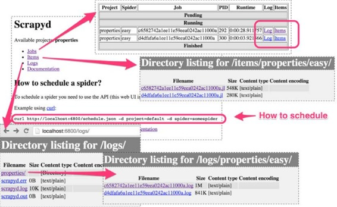
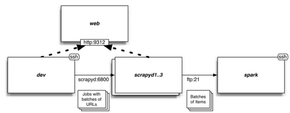
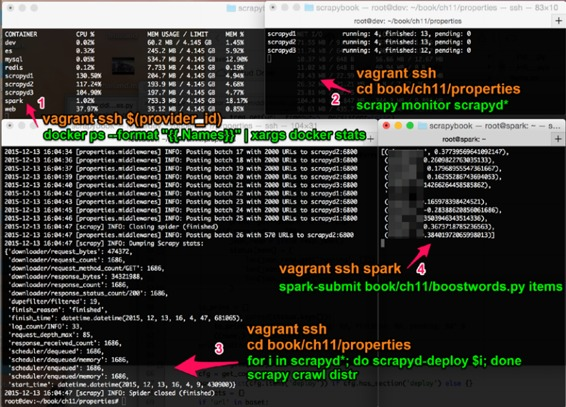

# 十一、Scrapyd 分布式抓取和实时分析

* * *

[序言](https://www.jianshu.com/p/6c9baeb60044)
[第 1 章 Scrapy 介绍](https://www.jianshu.com/p/b807653e97bb)
[第 2 章 理解 HTML 和 XPath](https://www.jianshu.com/p/90c2c25f0c41)
[第 3 章 爬虫基础](https://www.jianshu.com/p/6ebb898841bc)
[第 4 章 从 Scrapy 到移动应用](https://www.jianshu.com/p/4156e757557f)
[第 5 章 快速构建爬虫](https://www.jianshu.com/p/9d1e00dc40e4)
[第 6 章 Scrapinghub 部署](https://www.jianshu.com/p/441fa74d7aad)
[第 7 章 配置和管理](https://www.jianshu.com/p/674de4eacf15)
[第 8 章 Scrapy 编程](https://www.jianshu.com/p/545d07702e7f)
[第 9 章 使用 Pipeline](https://www.jianshu.com/p/e0287e773d28)
[第 10 章 理解 Scrapy 的性能](https://www.jianshu.com/p/e9710002cb4e)
第 11 章（完） Scrapyd 分布式抓取和实时分析

* * *

我们已经学了很多东西。我们先学习了两种基础的网络技术，HTML 和 XPath，然后我们学习了使用 Scrapy 抓取复杂的网站。接着，我们深入学习了 Scrapy 的设置，然后又进一步深入学习了 Scrapy 和 Python 的内部架构和 Twisted 引擎的异步特征。在上一章中，我们学习了 Scrapy 的性能和以及处理复杂的问题以提高性能。

在本章中，我将展示如何在多台服务器上进一步提高性能。我们会发现抓取通常是一个并行问题；因此，我们可以水平延展至多台服务器。为了这么做，我们会使用一个 Scrapy 中间件，我们还会使用 Scrapyd，一个用来管理远程服务器爬虫的应用。它可以让我们像第 6 章那样进行抓取。

我们最后用 Apache Spark 对提取的数据进行实时分析。Spark 一个非常流行的大数据处理框架。收集的数据越多、结果就变得越准确，我们使用 Spark Streaming API 展示结果。最后的结果展示了 Python 的强大和成熟，单单用 Python 的简明代码就全栈开发了从抓取到分析的全过程。

## 房子的标题如何影响价格？

我们要研究个问题是房子的标题和价格有什么关系。我们预计像“按摩浴缸”和“游泳池”可能和高价相关，而“打折”会和低价有关。将标题与地点结合，例如，可以根据地点和描述，实时判断哪个房子最划算。

我们想计算的就是特定名词对价格造成的偏移：


例如，如果平均租金是$1000，我们观察到带有按摩浴缸的房子的平均价格是$1300，没有的价格是$995，因此按摩浴缸的偏移值为 shiftjacuzzi=(1300-995)/1000=30.5%。如果一个带有按摩浴缸的房子的价格直逼平均价格高 5%，那么它的价格就很划算。

因为名词效应会有累加，所以这个指标并不繁琐。例如，标题同时含有按摩浴缸和打折会有一个混合效果。我们收集分析的数据越多，估算就会越准确。稍后回到这个问题，接下来讲一个流媒体解决方案。

## Scrapyd

现在，我们来介绍 Scrapyd。Scrapyd 是一个应用，使用它，我们可以将爬虫附属到服务器上，并对抓取进行规划。我们来看看它的使用是多么容易，我们用第 3 章的代码，只做一点修改。

我们先来看 Scrapyd 的界面，在[http://localhost:6800/](https://link.jianshu.com?t=http://localhost:6800/)。

Scrapyd 的界面

你可以看到，它有几个部分，有 Jobs、Items、Logs 和 Documentation。它还给出了如何规划抓取工作的 API 方法。

为了这么做，我们必须首先将爬虫部署到服务器上。第一步是修改 scrapy.cfg，如下所示：

```py
$ pwd
/root/book/ch03/properties
$ cat scrapy.cfg 
...
[settings]
default = properties.settings
[deploy]
url = http://localhost:6800/
project = properties 
```

我们要做的就是取消 url 的注释。默认的设置适合我们。现在，为了部署爬虫，我们使用 scrapyd-client 提供的工具 scrapyd-deploy。scrapyd-client 以前是 Scrapy 的一部分，但现在是一个独立的模块，可以用 pip install scrapyd-client 进行安装（开发机中已经安装了）：

```py
$ scrapyd-deploy 
Packing version 1450044699
Deploying to project "properties" in http://localhost:6800/addversion.
json
Server response (200):
{"status": "ok", "project": "properties", "version": "1450044699", 
"spiders": 3, "node_name": "dev"} 
```

部署好之后，就可以在 Scrapyd 的界面的 Available projects 看到。我们现在可以根据提示，在当前页提交一个任务：

```py
$ curl http://localhost:6800/schedule.json -d project=properties -d spider=easy
{"status": "ok", "jobid": " d4df...", "node_name": "dev"} 
```

如果我们返回 Jobs，我们可以使用 jobid schedule.json，它可以在之后用 cancel.json 取消任务：

```py
$ curl http://localhost:6800/cancel.json -d project=properties -d job=d4df...
{"status": "ok", "prevstate": "running", "node_name": "dev"} 
```

一定要取消进程，否则会浪费计算资源。

完毕之后，访问 Logs，我们可以看到日志，在 Items 我们可以看到抓取过的 items。这些数据会被周期清空以节省空间，所以一段时间后就会失效。

如果发生冲突或有其它理由的话，我们可以通过 http_port 修改端口，它是 Scrapyd 的诸多设置之一。最好阅读文档[http://scrapyd.readthedocs.org/](https://link.jianshu.com?t=http://scrapyd.readthedocs.org/)，多了解下。我们的部署必须要设置的是 max_proc。如果使用默认值 0，任务的并行数量最多可以是 CPU 核心的四位。因为我们可能会在虚拟机中运行多个 Scrapyd 服务器，我们将 max_proc 设为 4，可以允许 4 个任务同时进行。在真实环境中，使用默认值就可以。

## 分布式系统概述

设计这个系统对我是个挑战。我一开始添加了许多特性，导致复杂度升高，只有高性能的机器才能完成工作。然后，又不得不进行简化，既对硬件性能要求不那么高，也可以让本章的重点仍然是 Scrapy。



最后，系统中会包括我们的开发机和几台服务器。我们用开发机进行首页的水平抓取，提取几批 URL。然后用轮训机制将 URL 分发到 Scrapyd 的结点，并进行抓取。最后，通过 FTP 传递.jl 文件和 Items 到运行 Spark 的服务器上。我选择 FTP 和本地文件系统，而不是 HDFS 或 Apache Kafka，是因为 FTP 内存需求少，并且作为 FEED_URI 被 Scrapy 支持。请记住，只要简单设置 Scrapyd 和 Spark 的配置，我们就可以使用亚马逊 S3 存储这些文件，获得冗余度和可伸缩性等便利，而不用再使用其它技术。

> 笔记：FTP 的缺点之一是，上传过程可能会造成文件不完整。为了避免这点，一旦上传完成，我们便使用 Pure-FTPd 和调回脚本将文件上传到/root/items。

每过几秒，Spark 都读一下目录/root/items，读取任何新文件，取一个小批次进行分析。我们使用 Spark 是因为它支持 Python 作为编程语言，也支持流分析。到现在，我们使用的爬虫都比较短，实际中有的爬虫是 24 小时运行的，不断发出数据流并进行分析，数据越多，分析的结果越准确。我们就是要用 Spark 进行这样的演示。

> 笔记：除了 Spark 和 Scrapy，你还可以使用 MapReduce，Apache Storm 或其它框架。

在本章中，我们不向数据库中插入 items。我们在第 9 章中用的方法也可以在这里使用，但是性能很糟。很少有数据库喜欢每秒被 pipelines 写入几千个文件。如果想进行写入的话，应该用 Spark 专用的方法，即批次导入 Items。你可以修改我们 Spark 的例子，向任何数据库进行批次导入。

还有，这个系统的弹性很差。我们假设每个结点都是健康的，任何一个损坏的话，也不会对总系统造成影响。Spark 提供高可用性的弹性配置。Scrapy 不提供此类内建的功能，除了 Scrapyd 的“持续排队”功能，即当结点恢复时，可以继续失败的任务。这个功能不一定对你有用。如果弹性对你十分重要，你就得搭建一个监督系统和分布式排队方案（例如，基于 Kafka 或 RabbitMQ），可以重启失败的任务。

## 修改爬虫和中间件

为了搭建这个系统，我们要稍稍修改爬虫和中间件。更具体地，我们要做如下工作：

*   微调爬虫，使抓取索引页的速度达到最大
*   写一个中间件，可以将 URL 批次发送给 scrapyd 服务器。
*   使用相同的中间件，使系统启动时就可以将 URL 分批

我们尽量用简明的方式来完成这些工作。理想状态下，整个过程应该对底层的爬虫代码简洁易懂。这是一个底层层面的要求，通过破解爬虫达到相同目的不是好主意。

## 抓取共享首页

第一步是优化抓取首页的速度，速度越快越好。开始之前，先明确一下目的。假设爬虫的并发数是 16，源网站的延迟大概是 0.25 秒。这样，最大吞吐量是 16/0.25=64 页/秒。首页有 5000O 个子页，每个索引页有 30 个子页，那就有 1667 个索引页。预计下载整个首页需要，1667/64=26 秒。

将第 3 章中的爬虫重命名为 easy。我们将首先进行垂直抓取的 Rule（含有 callback='parse_item'的一项）注释掉，因为现在只想抓取索引页。

> 提示：本章的代码位于目录 ch11。

在进行优化之前，我们让 scrapy crawl 只抓取 10 个页面，结果如下：

```py
$ ls
properties  scrapy.cfg
$ pwd
/root/book/ch11/properties
$ time scrapy crawl easy -s CLOSESPIDER_PAGECOUNT=10
...
DEBUG: Crawled (200) <GET ...index_00000.html> (referer: None)
DEBUG: Crawled (200) <GET ...index_00001.html> (referer: ...index_00000.
html)
...
real  0m4.099s 
```

如果 10 个页面用时 4 秒，26 秒内是不可能完成 1700 个页面的。通过查看日志，我们看到每个索引页都来自前一个页面，也就是说，任何时候最多是在处理一个页面。实际上，并发数是 1。我们需要将其并行化，使达到并发数 16。我们将索引页相互共享，即 URL 互相连接，再加入一些其他的链接，以免爬虫中没有 URL。我们将首页分厂 20 个部分。实际上，任何大于 16 的数，都可以提速，但是一旦超过 20，速度反而会下降。我们用下面的方法计算每个部分的起始索引页：

```py
>>> map(lambda x: 1667 * x / 20, range(20))
[0, 83, 166, 250, 333, 416, 500, ...  1166, 1250, 1333, 1416, 1500, 1583] 
```

据此，设置 start_URL 如下：

```py
start_URL = ['http://web:9312/properties/index_%05d.html' % id
              for id in map(lambda x: 1667 * x / 20, range(20))] 
```

这可能会和你的情况不同，所以就不做美化了。将并发数(CONCURRENT_REQUESTS, CONCURRENT_REQUESTS_PER_DOMAIN)设为 16，再次运行爬虫，运行如下：

```py
$ time scrapy crawl easy -s CONCURRENT_REQUESTS=16 -s CONCURRENT_
REQUESTS_PER_DOMAIN=16
...
real  0m32.344s 
```

结果接近了我们的目标。下载速度是 1667 页面/32 秒=52 页面/秒，也就是说，每秒可以产生 52*30=1560 个子页面。我们现在可以注释掉垂直抓取的 Rule，将文件保存成一个爬虫。我们不需要进一步修改爬虫代码，而是用一个功能强大的中间件继续来做。如果只用开发机运行爬虫，假设可以像抓取索引页一样抓取子页，可以在 50000/52=16 分钟内完成抓取。

这里有两个要点。在学习完第 10 章之后，我们在做的都是工程项目。我们可以想方设法计算出系统确切的性能。第二点是，抓取索引页会产生子页，但实际的吞吐量不大。如果产生 URL 的速度快过 scrapyd 处理 URL 的速度，URL 就会在 scrapyd 排队。或者，如果产生 URL 的速度太慢，scrapyd 就会空闲。

## 批次抓取 URL

现在来处理子页面的 URL，并把它们分批，然后直接发送给 scrapyds，而不是继续抓取。

如果检查 Scrapy 的架构，我们可以明白这么做就是为了做一个中间件，它可以执行 process_spider_output()，在 Requests 到达下载器之前就可以进行处理或取消。我们限定中间件只支持 CrawlSpider 的爬虫，并且只支持简单的 GET 请求。如果要提高复杂度，例如，POST 或认证请求，我们必须开发更多的功能，以传递参数、头文件、每个批次进行重新登陆。

打开 Scrapy 的 GitHub，查看 SPIDER_MIDDLEWARES_BASE 设置，看看能否重利用哪个程序。Scrapy 1.0 有以下中间件：HttpErrorMiddleware、OffsiteMiddleware、RefererMiddleware、UrlLengthMiddleware 和 DepthMiddleware。我们看到 OffsiteMiddleware（只有 60 行）好像使我们需要的。它根据爬虫属性 allowed_domains 限定 URL。我们可以用相同的方法吗？不是丢弃 URL，我们转而将它们分批，发送给 scrapyds。我们确实可以这么做，部分代码如下：

```py
def __init__(self, crawler):
    settings = crawler.settings
    self._target = settings.getint('DISTRIBUTED_TARGET_RULE', -1)
    self._seen = set()
    self._URL = []
    self._batch_size = settings.getint('DISTRIBUTED_BATCH_SIZE', 1000)
    ...
def process_spider_output(self, response, result, spider):
    for x in result:
        if not isinstance(x, Request):
            yield x
        else:
            rule = x.meta.get('rule')
            if rule == self._target:
                self._add_to_batch(spider, x)
            else:
                yield x
def _add_to_batch(self, spider, request):
    url = request.url
    if not url in self._seen:
        self._seen.add(url)
        self._URL.append(url)
        if len(self._URL) >= self._batch_size:
            self._flush_URL(spider) 
```

process_spider_output()处理 Item 和 Request。我们只需要 Request，其它就不考虑了。如果查看 CrawlSpider 的源代码，我们看到将 Request/Response 映射到 Rule 的方式是用一个 meta dict 中的名为“rule”的整数字段。我们检查这个数字，如果它指向我们想要的 Rule（DISTRIBUTED_TARGET_RULE 设置），我们调用 _add_to_batch()，将它的 URL 添加到这个批次里面。我们然后取消这个 Request。我们接着产生出其他的请求，例如下一页的链接，不进行改动。The _add_to_batch()方法起到去重的作用。但是，我们前面描述的碎片化过程，意味着有的 URL 可能要提取两次。我们使用 _seen set 检测并去除重复项。然后将这些 URL 添加到 _URL 列表，如果它的大小超过了 _batch_size（根据 DISTRIBUTED_BATCH_SIZE 设置），就会调用 _flush_URL()。这个方法提供了一下功能：

```py
def __init__(self, crawler):
    ...
    self._targets = settings.get("DISTRIBUTED_TARGET_HOSTS")
    self._batch = 1
    self._project = settings.get('BOT_NAME')
    self._feed_uri = settings.get('DISTRIBUTED_TARGET_FEED_URL', None)
    self._scrapyd_submits_to_wait = []
def _flush_URL(self, spider):
    if not self._URL:
        return
    target = self._targets[(self._batch-1) % len(self._targets)]
    data = [
        ("project", self._project),
        ("spider", spider.name),
        ("setting", "FEED_URI=%s" % self._feed_uri),
        ("batch", str(self._batch)),
    ]
    json_URL = json.dumps(self._URL)
    data.append(("setting", "DISTRIBUTED_START_URL=%s" % json_URL))
    d = treq.post("http://%s/schedule.json" % target,
                  data=data, timeout=5, persistent=False)
    self._scrapyd_submits_to_wait.append(d)
    self._URL = []
    self._batch += 1 
```

首先，它使用了批次计数器（_batch）来决定发向哪个 scrapyd 服务器。可用服务器保存在 _targets（见 DISTRIBUTED_TARGET_HOSTS 设置）。我们然后向 scrapyd 的 schedule.json 做一个 POST 请求。这比之前用过的 curl 方法高级，因为它传递了经过仔细选择的参数。基于这些常熟，scrapyd 就规划了一次抓取，如下所示：

```py
scrapy crawl distr \
-s DISTRIBUTED_START_URL='[".../property_000000.html", ... ]' \
-s FEED_URI='ftp://anonymous@spark/%(batch)s_%(name)s_%(time)s.jl' \
-a batch=1 
```

除了项目和爬虫的名字，我们想爬虫传递了一个 FEED_URI 设置。它的值是从 DISTRIBUTED_TARGET_FEED_URL 得到的。

因为 Scrapy 支持 FTP，我们可以让 scrapyds 用一个匿名 FTP 将抓取的 Item 文件上传到 Spark 服务器。它的格式包括爬虫的名字（%(name)s 和时间（%(time)s）。如果只有这两项的话，那么同一时间创建出来的两个文件就会有冲突。为了避免覆盖，我们加入一个参数%(batch)。Scrapy 默认是不知道批次的，所以我们必须给设定一个值。scrapyd 的 schedule.json API 的特点之一是，每个不是设置的参数或已知的参数都被传递给了爬虫。默认时，爬虫的参数成为了爬虫的属性，然后在爬虫的属性中寻找未知的 FEED_URI 参数。因此，将一批参数传递给 schedule.json，我们就可以在 FEED_URI 中使用它，以避免冲突。

最后是将 DISTRIBUTED_START_URL 和这一批次的子页 URL 编译为 JSON，因为 JSON 是最简洁的文本格式。

> 笔记：用命令行将大量数据传递到 Scrapy 并不可取。如果你想将参数存储到数据库（例如 Redis），只传递给 Scrapy 一个 ID。这么做的话，需要小幅修改 _flush_URL()和 process_start_requests()。

我们用 treq.post()来做 POST 请求。Scrapyd 处理持续连接并不好，因此我们用 persistent=False 取消它。我们还设置了一个 5 秒的暂停。这个请求的的延迟项被保存在 _scrapyd_submits_to_wait 列表。要关闭这个函数，我们重置 _URL 列表，并加大当前的 _batch。

奇怪的是，关闭操作中会出现许多方法，如下所示：

```py
def __init__(self, crawler):
    ...
    crawler.signals.connect(self._closed, signal=signals.spider_
closed)
@defer.inlineCallbacks
def _closed(self, spider, reason, signal, sender):
    # Submit any remaining URL
    self._flush_URL(spider)
    yield defer.DeferredList(self._scrapyd_submits_to_wait) 
```

调用 _closed()可能是因为我们按下了 Ctrl + C 或因为抓取结束。两种情况下，我们不想失去任何最后批次的还未发送的 URL。这就是为什么在 _closed()中，第一件事是调用 _flush_URL(spider)加载最后的批次。第二个问题是，因为是非阻塞的，停止抓取时，[treq.post()](https://link.jianshu.com?t=http://treq.post())可能结束也可能没结束。为了避免丢失最后批次，我们要使用前面提到过的 scrapyd_submits_to_wait 列表，它包括所有的[treq.post()](https://link.jianshu.com?t=http://treq.post())延迟项。我们使用 defer.DeferredList()等待，直到全部完成。因为 _closed()使用了@defer.inlineCallbacks，当所有请求完成时，我们只 yield 它并继续。

总结一下，DISTRIBUTED_START_URL 设置中的批次 URL 会被发送到 scrapyds，scrapyds 上面运行着相同的爬虫。很明显，我们需要使用这个设置以启动 start_URL。

## 从 settings 启动 URL

中间件还提供了一个 process_start_requests()方法，使用它可以处理爬虫提供的 start_requests。检测是否设定了 DISTRIBUTED_START_URL，设定了的话，用 JSON 解码，并使用它的 URL 产生相关的请求。对于这些请求，我们设定 CrawlSpider 的 _response_downloaded()方法作为回调函数，再设定参数 meta['rule']，以让恰当的 Rule 处理响应。我们查看 Scrapy 的源码，找到 CrawlSpider 创建请求的方法，并依法而做：

```py
def __init__(self, crawler):
    ...
    self._start_URL = settings.get('DISTRIBUTED_START_URL', None)
    self.is_worker = self._start_URL is not None
def process_start_requests(self, start_requests, spider):
    if not self.is_worker:
        for x in start_requests:
            yield x
    else:
        for url in json.loads(self._start_URL):
            yield Request(url, spider._response_downloaded,
                          meta={'rule': self._target}) 
```

中间件就准备好了。我们在 settings.py 进行设置以启动它：

```py
SPIDER_MIDDLEWARES = {
    'properties.middlewares.Distributed': 100,
}
DISTRIBUTED_TARGET_RULE = 1
DISTRIBUTED_BATCH_SIZE = 2000
DISTRIBUTED_TARGET_FEED_URL = ("ftp://anonymous@spark/"
                               "%(batch)s_%(name)s_%(time)s.jl")
DISTRIBUTED_TARGET_HOSTS = [
    "scrapyd1:6800",
    "scrapyd2:6800",
    "scrapyd3:6800",
] 
```

有人可能认为 DISTRIBUTED_TARGET_RULE 不应该作为设置，因为它会使爬虫差异化。你可以认为这是个默认值，你可以在你的爬虫中使用属性 custom_settings 覆盖它，例如:

```py
custom_settings = {
    'DISTRIBUTED_TARGET_RULE': 3
} 
```

我们的例子并不需要这么做。我们可以做一个测试运行，只抓取一个页面：

```py
$ scrapy crawl distr -s \
DISTRIBUTED_START_URL='["http://web:9312/properties/property_000000.html"]' 
```

这个成功之后，我们进一步，抓取一个页面之后，用 FTP 将它传送到 Spark 服务器：

```py
scrapy crawl distr -s \
DISTRIBUTED_START_URL='["http://web:9312/properties/property_000000.html"]' \
-s FEED_URI='ftp://anonymous@spark/%(batch)s_%(name)s_%(time)s.jl' -a batch=12 
```

用 ssh 连接 Spark 服务器，你可以看到一个文件，例如/root/items 下的 12_distr_date_time.jl。
这个中间件的例子可以让你完成 scrapyd 的分布式抓取。你可以将它当做起点，进行改造。你可能要做如下修改：

*   爬虫的类型。除了 CrawlSpider，你必须让爬虫用恰当的 meta 标记分布式的请求，用惯用命名法执行调回。
*   向 scrapyds 传递 URL 的方式。你可能想限定域名，减少传递的量。例如，你只想传递 IDs。
*   你可以用分布式排队方案，让爬虫可以从失败恢复，让 scrapyds 执行更多的 URL 批次。
*   你可以动态扩展服务器的规模，以适应需求。

## 将项目部署到 scrapyd 服务器

为了将爬虫附属到三台 scrapyd 服务器上，我们必须将它们添加到 scrapy.cfg 文件。文件上的每个[deploy:target-name]定义了一个新的部署目标：

```py
$ pwd
/root/book/ch11/properties
$ cat scrapy.cfg
...
[deploy:scrapyd1]
url = http://scrapyd1:6800/
[deploy:scrapyd2]
url = http://scrapyd2:6800/
[deploy:scrapyd3]
url = http://scrapyd3:6800/ 
```

你可以用 scrapyd-deploy -l 查询可用的服务器：

```py
$ scrapyd-deploy -l
scrapyd1             http://scrapyd1:6800/
scrapyd2             http://scrapyd2:6800/
scrapyd3             http://scrapyd3:6800/ 
```

用 scrapyd-deploy <target name>进行部署：

```py
$ scrapyd-deploy scrapyd1
Packing version 1449991257
Deploying to project "properties" in http://scrapyd1:6800/addversion.json
Server response (200):
{"status": "ok", "project": "properties", "version": "1449991257", 
"spiders": 2, "node_name": "scrapyd1"} 
```

这个过程会产生一些新的目录和文件（build、project.egg-info、setup.py），可以删掉。其实，scrapyd-deploy 做的就是打包你的项目，并用 addversion.json，传递到目标服务器上。

之后，如果我们用 scrapyd-deploy –L 查询服务器，我们可以确认项目被成功部署了：

```py
$ scrapyd-deploy -L scrapyd1
properties 
```

我还用 touch 在项目的目录创建了三个空文件夹，scrapyd1-3。这样可以将 scrapyd 的名字传递给下面的文件，同时也是服务器的名字。然后可以用 bash loop 将其部署服务器： for i in scrapyd*; do scrapyd-deploy $i; done。

## 创建自定义监视命令

如果你想在多台 scrapyd 服务器上监视抓取的进程，你必须亲自编写程序。这是一个练习所学知识的好机会，写一个原生的 Scrapy 命令，scrapy monitor，用它监视一组 scrapyd 服务器。文件命名为[monitor.py](https://link.jianshu.com?t=http://monitor.py)，在[settings.py](https://link.jianshu.com?t=http://settings.py)中添加 COMMANDS_MODULE = 'properties.monitor'。快速查看 scrapyd 的文档，listjobs.json API 给我们提供了关于任务的信息。如果我们想找到给定目标的根 URL，我们可以断定，它只能是在 scrapyd-deploy 的代码中。如果查看[https://github.com/scrapy/scrapyd-client/blob/master/scrapyd-client/scrapyd-deploy](https://link.jianshu.com?t=https://github.com/scrapy/scrapyd-client/blob/master/scrapyd-client/scrapyd-deploy)，我们可以发现一个 _get_targets()函数（执行它不会添加许多值，所以略去了），它可以给出目标的名字和根 URL。我们现在就可以执行命令的第一部分了，如下所示：

```py
class Command(ScrapyCommand):
    requires_project = True
    def run(self, args, opts):
        self._to_monitor = {}
        for name, target in self._get_targets().iteritems():
            if name in args:
               project = self.settings.get('BOT_NAME')
                url = target['url'] + "listjobs.json?project=" + project
               self._to_monitor[name] = url
        l = task.LoopingCall(self._monitor)
        l.start(5)  # call every 5 seconds
        reactor.run() 
```

这段代码将名字和想要监视的 API 的终点提交给 dict _to_monitor。我们然后使用 task.LoopingCall()规划向 _monitor()方法发起递归调用。_monitor()使用 treq 和 deferred，我们使用@defer.inlineCallbacks 对它进行简化。方法如下（省略了一些错误处理和代码美化）：

```py
@defer.inlineCallbacks
def _monitor(self):
    all_deferreds = []
    for name, url in self._to_monitor.iteritems():
        d = treq.get(url, timeout=5, persistent=False)
        d.addBoth(lambda resp, name: (name, resp), name)
        all_deferreds.append(d)
    all_resp = yield defer.DeferredList(all_deferreds)
    for (success, (name, resp)) in all_resp:
        json_resp = yield resp.json()
        print "%-20s running: %d, finished: %d, pending: %d" %
              (name,  len(json_resp['running']),
              len(json_resp['finished']), len(json_resp['pending'])) 
```

这几行代码包括了目前我们学过的所有 Twisted 方法。我们使用 treq 调用 scrapyd 的 API 和 defer.DeferredList，立即处理所有的响应。当 all_resp 有了所有结果之后，我们重复这个过程，取回它们的 JSON 对象。treq Response'json()方法返回延迟项，而不是实际值，以与后续的实际值继续任务。我们最后打印出结果。JSON 响应的列表信息包括悬挂、运行中、结束的任务，我们打印出它的长度。

## 用 Apache Spark streaming 计算偏移值

我们的 Scrapy 系统现在就功能完备了。让我们来看看 Apache Spark 的使用。


让我来看如何执行。请记住这不是 Scrapy 代码，所以看起来会觉得陌生，但是是可以看懂的。你可以在 boostwords.py 文件找到这个应用，这个文件包括了复杂的测试代码，可以忽略。它的主要代码如下：

```py
# Monitor the files and give us a DStream of term-price pairs
raw_data = raw_data = ssc.textFileStream(args[1])
word_prices = preprocess(raw_data)
# Update the counters using Spark's updateStateByKey
running_word_prices = word_prices.updateStateByKey(update_state_
function)
# Calculate shifts out of the counters
shifts = running_word_prices.transform(to_shifts)
# Print the results
shifts.foreachRDD(print_shifts) 
```

Spark 使用 DStream 代表数据流。textFileStream()方法监督文件系统的一个目录，当检测到新文件时，就传出来。我们的 preprocess()函数将它们转化为 term/price 对。我们用 update_state_function()函数和 Spark 的 updateStateByKey()方法累加这些 term/price 对。我们最后通过运行 to_shifts()计算偏移值，并用 print_shifts()函数打印出极值。大多我们的函数修改不大，只是高效重塑了数例据。例外的是 shifts()函数：

```py
def to_shifts(word_prices):
    (sum0, cnt0) = word_prices.values().reduce(add_tuples)
    avg0 = sum0 / cnt0
    def calculate_shift((isum, icnt)):
        avg_with = isum / icnt
        avg_without = (sum0 - isum) / (cnt0 - icnt)
        return (avg_with - avg_without) / avg0
    return word_prices.mapValues(calculate_shift) 
```

这段代码完全是按照公式做的。尽管很简单，Spark 的 mapValues()可以让 calculate_shift 在 Spark 服务器上用最小开销高效运行。

## 进行分布式抓取

我进行四台终端进行抓取。我想让这部分尽量独立，所以我还提供了 vagrant ssh 命令，可以在终端使用。

使用四台终端进行抓取

用终端 1 来检测集群的 CPU 和内存的使用。这可以确认和修复问题。设置方法如下：

```py
$ alias provider_id="vagrant global-status --prune | grep 'docker-
provider' | awk '{print \$1}'"
$ vagrant ssh $(provider_id)
$ docker ps --format "{{.Names}}" | xargs docker stats 
```

前两行可以让我们用 ssh 打开 docker provider VM。如果没有使用 VM，只在 docker Linux 运行，我们只需要最后一行。
终端 2 用作诊断，如下运行 scrapy monitor：

```py
$ vagrant ssh
$ cd book/ch11/properties
$ scrapy monitor scrapyd* 
```

使用 scrapyd*和空文件夹，空文件夹名字是 scrapy monitor，这会扩展到 scrapy monitor scrapyd1 scrapyd2 scrapyd3。

终端 3，是我们启动抓取的终端。除此之外，它基本是闲置的。开始一个新的抓取，我们操作如下：

```py
$ vagrant ssh
$ cd book/ch11/properties
$ for i in scrapyd*; do scrapyd-deploy $i; done
$ scrapy crawl distr 
```

最后两行很重要。首先，我们使用一个 for 循环和 scrapyd-deploy，将爬虫部署到服务器上。然后我们用 scrapy crawl distr 开始抓取。我们随时可以运行小的抓取，例如，scrapy crawl distr -s CLOSESPIDER_PAGECOUNT=100，来抓取 100 个索引页，它会产生大概 3000 个子页。
终端 4 用来连接 Spark 服务器，我们用它进行实时分析：

```py
$ vagrant ssh spark
$ pwd
/root
$ ls
book items
$ spark-submit book/ch11/boostwords.py items 
```

只有最后一行重要，它运行了 boostwords.py，将本地 items 目录传给了监视器。有时，我还使用 watch ls -1 items 来监视 item 文件。
到底哪个词对价格的影响最大呢？这个问题留给读者。

## 系统性能

系统的性能极大地依赖于硬件、CPU 的数量、虚拟机分配内存的大小。在真实情况下，我们可以进行水平扩展，使抓取提速。

理论最大吞吐量是 3 台服务器*4 个 CPU*16 并发数*4 页/秒=768 页/秒。
实际中，使用分配了 4G 内存、8CPU 的虚拟机的 Macbook Pro，2 分 40 秒内下载了 50000 条 URL，即 315 页/秒。在一台亚马逊 EC2 m4.large，它有 2 个 vCPUs、8G 内存，因为 CPU 频率低，用时 6 分 12 秒，即 134 页/秒。在一台台亚马逊 EC2 m4.4xlarge，它有 16 个 vCPUs、64G 内存，用时 1 分 44 秒，即 480 页/秒。在同一台机器上，我将 scrapyd 的数量提高到 6（修改 Vagrantfile、scrapy.cfg 和 settings.py），用时 1 分 15 秒，即 667 页/秒。在最后的例子中，网络服务器似乎是瓶颈。

实际和理论计算存在差距是合理的。我们的粗略计算中没有考虑许多小延迟。尽管我们声明了每个页有 250ms 的延迟，我们在前几章已经看到，实际延迟要更高，这是因为我们还有额外的 Twisted 和操作系统延迟。还有开发机向 scrapyds 传递 URL 的时间，FTP 向 Spark 传递 Items 的时间，还有 scrapyd 发现新文件和规划任务的时间（平均要 2.5 秒，根据 scrapyd 的 poll_interval 设置）。还没计算开发机和 scrapyd 的启动时间。如果不能确定可以提高吞吐量的话，我是不会试图改进这些延迟的。我的下一步是扩大抓取的规模，比如 500000 个页面、网络服务器的负载均衡，在扩大的过程中发现新的挑战。

## 要点

本章的要点是，如果要进行分布式抓取，一定要使用大小合适的批次。
取决于源网站的响应速度，你可能有数百、数千、上万个 URL。你希望它们越大越好（在几分钟的水平），这样就可以分摊启动的费用。另一方面，你也不希望它们太大，以免造成机器故障。在一个有容错的分布式系统中，你需要重试失败的批次，而且重试不要浪费太多时间。

## 总结

希望你能喜欢这本关于 Scrapy 的书。现在你对 Scrapy 应该已经有深入的了解了，并可以解决简单或复杂的问题了。你还学到了 Scrapy 复杂的结构，以及如何发挥出它的最大性能。通过抓取，你可以在应用中使用庞大的数据资源。我们已经看到了如何在移动应用中使用 Scrapy 抓取的数据并进行分析。希望你能用 Scrapy 做出更多强大的应用，为世界做出贡献。祝你好运！

* * *

[序言](https://www.jianshu.com/p/6c9baeb60044)
[第 1 章 Scrapy 介绍](https://www.jianshu.com/p/b807653e97bb)
[第 2 章 理解 HTML 和 XPath](https://www.jianshu.com/p/90c2c25f0c41)
[第 3 章 爬虫基础](https://www.jianshu.com/p/6ebb898841bc)
[第 4 章 从 Scrapy 到移动应用](https://www.jianshu.com/p/4156e757557f)
[第 5 章 快速构建爬虫](https://www.jianshu.com/p/9d1e00dc40e4)
[第 6 章 Scrapinghub 部署](https://www.jianshu.com/p/441fa74d7aad)
[第 7 章 配置和管理](https://www.jianshu.com/p/674de4eacf15)
[第 8 章 Scrapy 编程](https://www.jianshu.com/p/545d07702e7f)
[第 9 章 使用 Pipeline](https://www.jianshu.com/p/e0287e773d28)
[第 10 章 理解 Scrapy 的性能](https://www.jianshu.com/p/e9710002cb4e)
第 11 章（完） Scrapyd 分布式抓取和实时分析

* * *