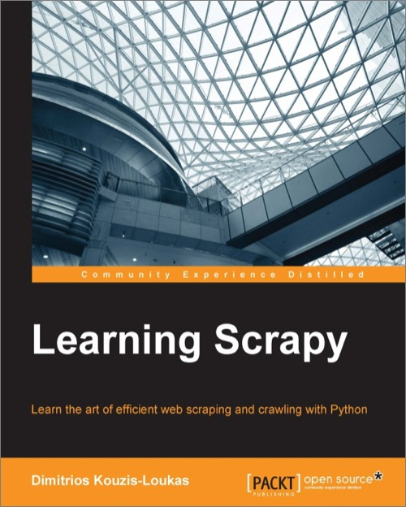

# 一、Scrapy介绍

* * *

[序言](https://www.jianshu.com/p/6c9baeb60044)
第1章 Scrapy介绍
[第2章 理解HTML和XPath](https://www.jianshu.com/p/90c2c25f0c41)
[第3章 爬虫基础](https://www.jianshu.com/p/6ebb898841bc)
[第4章 从Scrapy到移动应用](https://www.jianshu.com/p/4156e757557f)
[第5章 快速构建爬虫](https://www.jianshu.com/p/9d1e00dc40e4)
[第6章 Scrapinghub部署](https://www.jianshu.com/p/441fa74d7aad)
[第7章 配置和管理](https://www.jianshu.com/p/674de4eacf15)
[第8章 Scrapy编程](https://www.jianshu.com/p/545d07702e7f)
[第9章 使用Pipeline](https://www.jianshu.com/p/e0287e773d28)
[第10章 理解Scrapy的性能](https://www.jianshu.com/p/e9710002cb4e)
[第11章（完） Scrapyd分布式抓取和实时分析](https://www.jianshu.com/p/cfca4b7e62f4)

* * *

本书作者使用的Scrapy版本是1.0.3。感兴趣的话，还可以看看[Scrapy1.4最新官方文档总结](https://www.jianshu.com/p/999f3809c98a)。

* * *

下载本书代码：[https://github.com/scalingexcellence/scrapybook](https://link.jianshu.com?t=https://github.com/scalingexcellence/scrapybook)。
下载本书PDF（英文版）：[http://file.allitebooks.com/20160330/Learning%20Scrapy.pdf](https://link.jianshu.com?t=http://file.allitebooks.com/20160330/Learning%20Scrapy.pdf)

* * *

欢迎来到Scrapy之旅。通过这本书，我们希望你可以从只会一点或零基础的初学者，达到熟练使用这个强大的框架海量抓取网络和其他资源的水平。在本章里，我们会向你介绍Scrapy，以及Scrapy能做什么。

## HelloScrapy

Scrapy是一个健壮的抓取网络资源的框架。作为互联网使用者，你可能经常希望可以将网上的资源保存到Excel中（见第3章），以便离线时使用或进行计算。作为开发者，你可能经常希望将不同网站的资源整合起来，但你清楚这么做的复杂性。Scrapy可以帮助你完成简单和复杂的数据提取。

Scrapy是利用健壮高效的方式提取网络资源的多年经验开发的。使用Scrapy，你只需进行一项设置，就可以抵过其它框架使用多个类、插件和配置。看一眼第7章，你就可以知道仅需几行代码就可以完成大量工作。

从开发者的角度，你会喜欢Scrapy的基于事件的架构（见第8章和第9章）。它可以让我们进行串联操作，清洗、形成、丰富数据，或存入数据库等等，同时不会有太大的性能损耗。从技术上说，基于事件的机制，Scrapy可以让吞吐量摆脱延迟，同时开放数千个连接。举一个极端的例子，假设你要从一个网站提取列表，每页有100个列表项。Scrapy可以轻松的同时处理16个请求，假设每个请求在一秒内完成，每秒就可以抓取16个页面。乘以每页的列表数，每秒就可以抓取1600个列表项。然后，你想将每个列表项写入一个高并发的云存储，每个要花3秒。为了支持每秒16个请求，必须要并行进行4800个写入请求（第9章你会看到更多类似的计算）。对于传统的多线程应用，这需要4800个线程，对你和操作系统都是个挑战。在Scrapy中，4800个并发请求很平常，只要操作系统支持就行。更进一步，Scrapy的内存要求和你要抓取的列表项的数据量相关，而对于多线程应用，每个线程的大小都和一个列表的大小相当。

简而言之，速度慢或不可预测的网站、数据库或远程API不会对Scrapy的性能造成影响，因为你可以进行并发请求，用单线程管理。相比于多线程应用，使用更简单的代码反而可以同时运行几个抓取器和其它应用，这样就可以降低费用。

## 喜爱Scrapy的其它理由

Scrapy出现已经有五年多了，现在已经成熟稳定。除了前面提到的性能的优点，以下是Scrapy其它让人喜爱的理由：

*   Scrapy可以读懂破损的HTML

你可以在Scrapy上直接使用BeautifulSoup或lxml，但Scrapy提供Selector，一个相比lxml更高级的XPath解析器。它可以有效的处理破损的HTML代码和费解的编码。

*   社区

Scrapy有一个活跃的社区。可以查看Scrapy的邮件列表[https://groups.google.com/forum/#!forum/scrapy-users](https://link.jianshu.com?t=https://groups.google.com/forum/#!forum/scrapy-users)和Stack Overflow上的数千个问题[http://stackoverflow.com/questions/tagged/scrapy](https://link.jianshu.com?t=http://stackoverflow.com/questions/tagged/scrapy)。多数问题在数分钟之内就会得到解答。[http://scrapy.org/community/](https://link.jianshu.com?t=http://scrapy.org/community/)有更多的社区资源。

*   由社区维护的组织清晰的代码

Scrapy需要用标准的方式组织代码。你用Python来写爬虫和pipelines，就可以自动使引擎的效率提高。如果你在网上搜索，你会发现许多人有使用Scrapy的经验。这意味着，可以方便地找人帮你维护或扩展代码。无论是谁加入你的团队，都不必经过学习曲线理解你特别的爬虫。

*   注重质量的更新

如果查看版本记录（[http://doc.scrapy.org/en/latest/news.html](https://link.jianshu.com?t=http://doc.scrapy.org/en/latest/news.html)），你会看到有不断的更新和稳定性/错误修正。

## 关于此书：目标和用法

对于此书，我们会用例子和真实的数据教你使用Scrapy。大多数章节，要抓取的都是一个房屋租赁网站。我们选择它的原因是，它很有代表性，并可以进行一定的变化，同时也很简单。使用这个例子，可以让我们专注于Scrapy。

我们会从抓取几百页开始，然后扩展到抓取50000页。在这个过程中，我们会教你如何用Scrapy连接MySQL、Redis和Elasticsearch，使用Google geocoding API找到给定地点的坐标，向Apach Spark传入数据，预测影响价格的关键词。

你可能需要多读几遍本书。你可以粗略地浏览一遍，了解一下结构，然后仔细读一两章、进行学习和试验，然后再继续读。如果你对哪章熟悉的话，可以跳过。如果你熟悉HTML和XPath的话，就没必要在第2章浪费太多时间。某些章如第8章，既是示例也是参考，具有一定深度。它就需要你多读几遍，每章之间进行数周的练习。如果没有完全搞懂第8章的话，也可以读第9章的具体应用。后者可以帮你进一步理解概念。

我们已经尝试调整本书的结构，以让其既有趣也容易上手。但我们做不到用这本书教给你如何使用Python。Python的书有很多，但我建议你在学习的过程中尽量保持放松。Python流行的原因之一是，它很简洁，可以像读英语一样读代码。对于Python初学者和专家，Scrapy都是一个高级框架。你可以称它为“Scrapy语言”。因此，我建议你直接从实例学习，如果你觉得Python语法有困难的话，再进行补充学习，可以是在线的Python教程或Coursera的初级课程。放心，就算不是Python专家，你也可以成为一个优秀的Scrapy开发者。

## 掌握自动抓取数据的重要性

对于许多人，对Scrapy这样的新技术有好奇心和满足感，就是学习的动力。学习这个框架的同时，我们可以从数据开发和社区，而不是代码，获得额外的好处。

## 开发高可靠高质量的应用 提供真实的开发进度表

为了开发新颖高质量的应用，我们需要真实和大量的数据，如果可能的话，最好在写代码之前就有数据。现在的软件开发都要实时处理海量的瑕疵数据，以获取知识和洞察力。当软件应用到海量数据时，错误和疏忽很难检测出来，就会造成后果严重的决策。例如，在进行人口统计时，很容易忽略一整个州，仅仅是因为这个州的名字太长，它的数据被丢弃了。通过细心的抓取，有高质量的、海量的真实数据，在开发和设计的过程中，就可以找到并修复bug，然后才能做出正确的决策。

另一个例子，假设你想设计一个类似亚马逊的“如果你喜欢这个，你可能也喜欢那个”的推荐系统。如果在开始之前，你就能抓取手机真实的数据，你就可以快速知道一些问题，比如无效记录、打折商品、重复、无效字符、因为分布导致的性能问题。数据会强制你设计健壮的算法以处理被数千人抢购或无人问津的商品。相比较于数周开发之后却碰到现实问题，这两种方法可能最终会一致，但是在一开始就能对整个进程有所掌握，意义肯定是不同的。从数据开始，可以让软件的开发过程更为愉悦和有预测性。

## 快速开发最小化可行产品

海量真实数据对初创企业更为重要。你可能听说过“精益初创企业”，这是Eric Ries发明的词，用来描述高度不确定的企业发展阶段，尤其是技术初创企业。它的核心概念之一就是最小化可行产品（MVP），一个只包含有限功能的产品，快速开发并投放，以检测市场反应、验证商业假设。根据市场反应，初创企业可以选择追加投资，或选择其他更有希望的项目。

很容易忽略这个过程中的某些方面，这些方面和数据问题密切相关，用Scrapy可以解决数据问题。当我们让潜在用户尝试移动App时，例如，作为开发者或企业家，我们让用户来判断完成的App功能如何。这可能对非专家的用户有点困难。一个应用只展示“产品1”、“产品2”、“用户433”，和另一个应用展示“Samsung UN55J6200 55-Inch TV”，用户“Richard S.”给它打了五星评价，并且有链接可以直接打开商品主页，这两个应用的差距是非常大的。很难让人们对MVP进行客观的评价，除非它使用的数据是真实可信的。

一些初创企业事后才想到数据，是因为考虑到采集数据很贵。事实上，我们通常都是打开表格、屏幕、手动输入数据，或者我们可以用Scrapy抓取几个网站，然后再开始写代码。第4章中，你可以看到如何快速创建一个移动App以使用数据。

## 网络抓取让你的应用快速成长 —— Google不能使用表格

让我们来看看表格是如何影响一个产品的。假如谷歌的创始人创建了搜索引擎的第一个版本，但要求每个网站站长填入信息，并复制粘贴他们的每个网页的链接。他们然后接受谷歌的协议，让谷歌处理、存储、呈现内容，并进行收费。可以想象整个过程工作量巨大。即使市场有搜索引擎的需求，这个引擎也成为不了谷歌，因为它的成长太慢了。即使是最复杂的算法也不能抵消缺失数据。谷歌使用网络爬虫逐页抓取，填充数据库。站长完全不必做任何事。实际上，想屏蔽谷歌，还需要做一番努力。

让谷歌使用表格的主意有点搞笑，但是一个普通网站要用户填多少表呢？登录表单、列表表单、勾选表单等等。这些表单会如何遏制应用的市场扩张？如果你足够了解用户，你会知道他们还会使用其它什么网站，或许已经有了账户。例如，开发者可能有Stack Overflow和GitHub账户。经过用户同意，你能不能直接用这些账户就自动填入照片、介绍和最近的帖子呢？你能否对这些帖子做文本分析，根据结果设置网站的导航结构、推荐商品或服务呢？我希望你能看到将表格换为自动数据抓取可以更好的为用户服务，使网站快速成长。

## 发现并实践

抓取数据自然而然会让你发现和思考你和被抓取目标的关系。当你抓取一个数据源时，自然会有一些问题：我相信他们的数据吗？我相信提供数据的公司吗？我应该和它们正式商谈合作吗？我和他们有竞争吗？从其他渠道获得数据花费是多少？这些商业风险是必然存在的，但是抓取数据可以让我们更早的知道，进行应对。

你还想知道如何反馈给这些网站或社区？给他们免费流量，他们肯定很高兴。另一方面，如果你的应用不能提供价值，继续合作的可能就会变小，除非找到另外合作的方式。通过从各种渠道获得数据，你可以开发对现有生态更友好的产品，甚至打败旧产品。或者，老产品能帮助你扩张，例如，你的应用数据来自两个或三个不同的生态圈，每个生态圈都有十万名用户，结合起来，你的应用或许就能惠及三十万人。假如你的初创企业结合了摇滚乐和T恤印刷行业，就将两个生态圈结合了起来，你和这两个社区都可以得到扩张。

## 在充满爬虫的网络世界做守法公民

开发爬虫还有一些注意事项。不负责任的网络抓取让人不悦，有时甚至是犯罪。两个最重要的要避免的就是拒绝访问攻击（DoS）和侵犯著作权。

对于第一个，普通访问者每隔几秒才访问一个新页面。爬虫的话，每秒可能下载几十个页面。流量超过普通用户的十倍。这会让网站的拥有者不安。使用阻塞器降低流量，模仿普通用户。检测响应时间，如果看到响应时间增加，则降低抓取的强度。好消息是Scrapy提供了两个现成的方法（见第7章）。

对于著作权，可以查看网站的著作权信息，以确认什么可以抓取什么不能抓取。大多数站点允许你处理网站的信息，只要不复制并宣称是你的。一个好的方法是在你请求中使用一个User-Agent字段，告诉网站你是谁，你想用他们的数据做什么。Scrapy请求默认使用你的BOT_NAME作为User-Agent。如果这是一个URL或名字，可以直接指向你的应用，那么源网站的站长就可以访问你的站点，并知道你用他的数据做什么。另一个重要的地方，允许站长可以禁止爬虫访问网站的某个区域。Scrapy提供了功能（RobotsTxtMiddleware），以尊重源网站列在robots.txt文件的意见（在[http://www.google.com/robots.txt](https://link.jianshu.com?t=http://www.google.com/robots.txt)可以看到一个例子）。最后，最好提供可以让站长提出拒绝抓取的方法。至少，可以让他们很容易地找到你，并提出交涉。

每个国家的法律不同，我无意给出法律上的建议。如果你觉得需要的话，请寻求专业的法律建议。这适用于整本书的内容。

## Scrapy不是什么

最后，因为数据抓取和相关的名词定义很模糊，或相互使用，很容易误解Scrapy。我这里解释一下，避免发生误解。

Scrapy不是Apache Nutch，即它不是一个原生的网络爬虫。如果Scrapy访问一个网站，它对网站一无所知，就不能抓取任何东西。Scrapy是用来抓取结构化的信息，并需要手动设置XPath和CSS表达式。Apache Nutch会取得一个原生网页并提取信息，例如关键词。它更适合某些应用，而不适合其它应用。

Scrapy不是Apache Solr、Elasticsearch或Lucene；换句话说，它和搜索引擎无关。Scrapy不是用来给包含“爱因斯坦”的文档寻找参考。你可以使用Scrapy抓取的数据，并将它们插入到Solr或Elasticsearch，如第9章所示，但这只是使用Scrapy的一种途径，而不是嵌入Scrapy的功能。

最后，Scrapy不是类似MySQL、MongoDB、Redis的数据库。它不存储和索引数据。它只是提取数据。也就是说，你需要将Scrapy提取的数据插入到数据库中，可行的数据库有多种。虽然Scrapy不是数据库，它的结果可以方便地输出为文件，或不进行输出。

## 总结

在本章中，我们向你介绍了Scrapy以及它的作用，还有使用这本书的最优方法。通过开发与市场完美结合的高质量应用，我们还介绍了几种自动抓取数据能使你获益的方法。下一章会介绍两个极为重要的网络语言，HTML和XPath，我们在每个Scrapy项目中都会用到。

* * *

[序言](https://www.jianshu.com/p/6c9baeb60044)
第1章 Scrapy介绍
[第2章 理解HTML和XPath](https://www.jianshu.com/p/90c2c25f0c41)
[第3章 爬虫基础](https://www.jianshu.com/p/6ebb898841bc)
[第4章 从Scrapy到移动应用](https://www.jianshu.com/p/4156e757557f)
[第5章 快速构建爬虫](https://www.jianshu.com/p/9d1e00dc40e4)
[第6章 Scrapinghub部署](https://www.jianshu.com/p/441fa74d7aad)
[第7章 配置和管理](https://www.jianshu.com/p/674de4eacf15)
[第8章 Scrapy编程](https://www.jianshu.com/p/545d07702e7f)
[第9章 使用Pipeline](https://www.jianshu.com/p/e0287e773d28)
[第10章 理解Scrapy的性能](https://www.jianshu.com/p/e9710002cb4e)
[第11章（完） Scrapyd分布式抓取和实时分析](https://www.jianshu.com/p/cfca4b7e62f4)

* * *