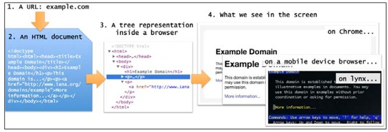
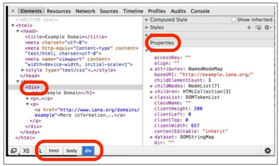
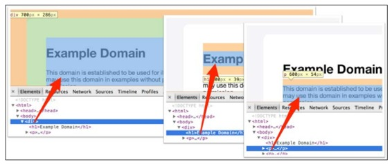
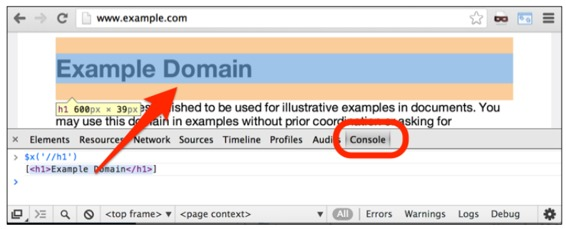
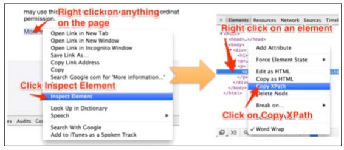

# 二、理解 HTML 和 XPath


为了从网页提取信息，了解网页的结构是非常必要的。我们会快速学习 HTML、HTML 的树结构和用来筛选网页信息的 XPath。

## HTML、DOM 树结构和 XPath

从这本书的角度，键入网址到看见网页的整个过程可以分成四步：

*   在浏览器中输入网址 URL。URL 的第一部分,也即域名（例如 gumtree.com），用来搜寻网络上的服务器。URL 和其他像 cookies 等数据形成了一个发送到服务器的请求 request。
*   服务器向浏览器发送 HTML。服务器也可能发送 XML 或 JSON 等其他格式，目前我们只关注 HTML。
*   HTML 在浏览器内部转化成树结构：文档对象模型（DOM）。
*   根据布局规范，树结构转化成屏幕上的真实页面。



研究下这四个步骤和树结构，可以帮助定位要抓取的文本和编写爬虫。

**URL**
URL 包括两部分：第一部分通过 DNS 定位服务器，例如当你在浏览器输入[https://mail.google.com/mail/u/0/#inbox](https://link.jianshu.com?t=https://mail.google.com/mail/u/0/#inbox)这个地址时，产生了一个[mail.google.com](https://link.jianshu.com?t=http://mail.google.com)的 DNS 请求，后者为你解析了一台服务器的 IP 地址，例如 173.194.71.83。也就是说，[https://mail.google.com/mail/u/0/#inbox](https://link.jianshu.com?t=https://mail.google.com/mail/u/0/#inbox)转换成了[https://173.194.71.83/mail/u/0/#inbox](https://link.jianshu.com?t=https://173.194.71.83/mail/u/0/#inbox)。

URL 其余的部分告诉服务器这个请求具体是关于什么的，可能是一张图片、一份文档或是触发一个动作，例如在服务器上发送一封邮件。

## HTML 文档

服务器读取 URL，了解用户请求，然后回复一个 HTML 文档。HTML 本质是一个文本文件，可以用 TextMate、Notepad、vi 或 Emacs 等软件打开。与大多数文本文件不同，HTML 严格遵循万维网联盟（World Wide Web Consortium）的规定格式。这个格式超出了本书的范畴，这里只看一个简单的 HTML 页面。如果你打开[http://example.com](https://link.jianshu.com?t=http://example.com)，点击查看源代码，就可以看到 HTML 代码，如下所示：

```py
<!doctype html>
<html>
  <head>
      <title>Example Domain</title>
      <meta charset="utf-8" />
      <meta http-equiv="Content-type"
              content="text/html; charset=utf-8" />
      <meta name="viewport" content="width=device-width,
              initial-scale=1" />
      <style type="text/css"> body { background-color: ... 
              } </style>
  <body>
      <div>
              <h1>Example Domain</h1>
              <p>This domain is established to be used for
                 illustrative examples examples in documents.
                 You may use this domain in examples without
                 prior coordination or asking for permission.</p>
              <p><a href="http://www.iana.org/domains/example">
                 More information...</a></p>
      </div>
  </body>
</html> 
```

为了便于阅读，我美化了这个 HTML 文档。你也可以把整篇文档放在一行里。对于 HTML，大多数情况下，空格和换行符不会造成什么影响。

尖括号里的字符称作标签，例如`<html>`或`<head>`。`<html>`是起始标签，`</html>`是结束标签。标签总是成对出现。某些网页没有结束标签，例如只用`<p>`标签分隔段落，浏览器对这种行为是容许的，会智能判断哪里该有结束标签`</p>`。
`<p>`与`</p>`之间的内容称作 HTML 的元素。元素之间可以嵌套元素，比如例子中的`<div>`标签，和第二个`<p>`标签，后者包含了一个`<a>`标签。

有些标签稍显复杂，例如<a href="http://www.iana.org/domains/example">，带有 URL 的 href 部分称作属性。
最后，许多标签元素包含有文本，例如`<h1>`标签中的 Example Domain。对我们而言，`<body>`标签之间的可见内容更为重要。头部标签`<head>`中指明了编码字符，由 Scrapy 对其处理，就不用我们浪费精力了。

## 树结构

不同的浏览器有不同的借以呈现网页的内部数据结构。但 DOM 树是跨平台且不依赖语言的，可以被几乎所有浏览器支持。

只需右键点击，选择查看元素，就可以在浏览器中查看网页的树结构。如果这项功能被禁止了，可以在选项的开发者工具中修改。

你看到的树结构和 HTML 很像，但不完全相同。无论原始 HTML 文件使用了多少空格和换行符，树结构看起来都会是一样的。你可以点击任意元素，或是改变属性，这样可以实时看到对 HTML 网页产生了什么变化。例如，如果你双击了一段文字，并修改了它，然后点击回车，屏幕上这段文字就会根据新的设置发生改变。在右边的方框中，在属性标签下面，你可以看到这个树结构的属性列表。在页面底部，你可以看到一个面包屑路径，指示着选中元素的所在位置。



重要的是记住，HTML 是文本，而树结构是浏览器内存中的一个对象，你可以通过程序查看、操作这个对象。在 Chrome 浏览器中，就是通过开发者工具查看。

## 浏览器中的页面

HTML 文本和树结构和我们平时在浏览器中看到的页面截然不同。这恰恰是 HTML 的成功之处。HTML 文件就是要具有可读性，可以区分网页的内容，但不是按照呈现在屏幕上的方式。这意味着，呈现 HTML 文档、进行美化都是浏览器的职责，无论是对于功能齐备的 Chrome、移动端浏览器、还是 Lynx 这样的文本浏览器。

也就是说，网页的发展对网页开发者和用户都提出了极大的开发网页方面的需求。CSS 就是这样被发明出来，用以服务 HTML 元素。对于 Scrapy，我们不涉及 CSS。

既然如此，树结构对呈现出来的网页有什么作用呢？答案就是盒模型。正如 DOM 树可以包含其它元素或是文字，同样的，盒模型里面也可以内嵌其它内容。所以，我们在屏幕上看到的网页是原始 HTML 的二维呈现。树结构是其中的一维，但它是隐藏的。例如，在下图中，我们看到三个 DOM 元素，一个`<div>`和两个内嵌的`<h1>`和`<p>`，出现在浏览器和 DOM 中：



**用 XPath 选择 HTML 元素**
如果你以前接触过传统的软件工程，并不知道 XPath，你可能会担心，在 HTML 文档中查询某个信息，要进行复杂的字符串匹配、搜索标签、处理特殊字符、解析整个树结构等繁琐工作。对于 XPath，所有的这些都不是问题，你可以轻松提取元素、属性或是文字。

在 Chrome 中使用 XPath，在开发者工具中点击控制台标签，使用$x 功能。例如，在网页[http://example.com/](https://link.jianshu.com?t=http://example.com/)的控制台，输入$x('//h1')，就可以移动到`<h1>`元素，如截图所示：



你在控制台中看到的是一个包含所选元素的 JavaScript 数组。如果你将光标移动到这个数组上，你可以看到被选择的元素被高亮显示。这个功能很有用。

**XPath 表达式**
HTML 文档的层级结构的最高级是`<html>`标签，你可以使用元素名和斜杠线选择任意元素。例如，下面的表达式返回了[http://example.com/](https://link.jianshu.com?t=http://example.com/)上对应的内容：

```py
$x('/html')
  [ <html>...</html> ]
$x('/html/body')
  [ <body>...</body> ]
$x('/html/body/div')
  [ <div>...</div> ]
$x('/html/body/div/h1')
  [ <h1>Example Domain</h1> ]
$x('/html/body/div/p')
  [ <p>...</p>, <p>...</p> ]
$x('/html/body/div/p[1]')
  [ <p>...</p> ]
$x('/html/body/div/p[2]')
  [ <p>...</p> ] 
```

注意，`<p>`标签在`<div>`标签内有两个，所以会返回两个。你可以用 p[1]和 p[2]分别返回两个元素。

从抓取的角度，文档的标题或许是唯一让人感兴趣的，它位于文档的头部，可以用下面的额表达式找到：

```py
$x('//html/head/title')
  [ <title>Example Domain</title> ] 
```

对于大文档，你可能要写很长的 XPath 表达式，以获取所要的内容。为了避免这点，两个斜杠线//可以让你访问到所有的同名元素。例如，//p 可以选择所有的 p 元素，//a 可以选择所有的链接。

```py
$x('//p')
  [ <p>...</p>, <p>...</p> ]
$x('//a')
  [ <a href="http://www.iana.org/domains/example">More information...</a> ] 
```

//a 可以用在更多的地方。例如，如果要找到所有`<div>`标签的链接，你可以使用//div//a。如果 a 前面只有一个斜杠，//div/a 会返回空，因为在上面的例子中`<div>`标签下面没有`<a>`。

```py
$x('//div//a')
  [ <a href="http://www.iana.org/domains/example">More information...</a> ]
$x('//div/a')
  [ ] 
```

你也可以选择属性。[http://example.com/](https://link.jianshu.com?t=http://example.com/)上唯一的属性是链接 href，可以通过下面的方式找到：

```py
$x('//a/@href')
[href="http://www.iana.org/domains/example"] 
```

你也可以只通过 text( )函数选择文字：

```py
$x('//a/text()')
["More information..."] 
```

可以使用*标志选择某层下所有的元素，例如：

```py
$x('//div/*')
[<h1>Example Domain</h1>, <p>...</p>, <p>...</p>] 
```

寻找特定属性，例如@class、或属性有特定值时，你会发现 XPath 非常好用。例如，//a[@href]可以找到所有链接，//a[@href="[http://www.iana.org/domains/example](https://link.jianshu.com?t=http://www.iana.org/domains/example)"]则进行了指定的选择。
当属性值中包含特定字符串时，XPath 会极为方便。例如，

```py
$x('//a[@href]')
[<a href="http://www.iana.org/domains/example">More information...</a>]
$x('//a[@href="http://www.iana.org/domains/example"]')
[<a href="http://www.iana.org/domains/example">More information...</a>]
$x('//a[contains(@href, "iana")]')
[<a href="http://www.iana.org/domains/example">More information...</a>]
$x('//a[starts-with(@href, "http://www.")]')
[<a href="http://www.iana.org/domains/example">More information...</a>]
$x('//a[not(contains(@href, "abc"))]')
[ <a href="http://www.iana.org/domains/example">More information...</a>] 
```

在[http://www.w3schools.com/xsl/xsl_functions.asp](https://link.jianshu.com?t=http://www.w3schools.com/xsl/xsl_functions.asp)在线文档中你可以找到更多类似的函数，但并非都常用。

在 Scrapy 终端中可以使用同样的命令，在命令行中输入

```py
scrapy shell "http://example.com" 
```

终端会向你展示许多写爬虫时碰到的变量。其中最重要的是响应，在 HTML 中是 HtmlResponse，这个类可以让你在 Chrome 使用 xpath( )方法$x。下面是一些例子：

```py
response.xpath('/html').extract()
  [u'<html><head><title>...</body></html>']
response.xpath('/html/body/div/h1').extract()
  [u'<h1>Example Domain</h1>']
response.xpath('/html/body/div/p').extract()
  [u'<p>This domain ... permission.</p>', u'<p><a href="http://www.iana.org/domains/example">More information...</a></p>']
response.xpath('//html/head/title').extract()
  [u'<title>Example Domain</title>']
response.xpath('//a').extract()
  [u'<a href="http://www.iana.org/domains/example">More information...</a>']
response.xpath('//a/@href').extract()
  [u'http://www.iana.org/domains/example']
response.xpath('//a/text()').extract()
  [u'More information...']
response.xpath('//a[starts-with(@href, "http://www.")]').extract()
  [u'<a href="http://www.iana.org/domains/example">More information...</a>'] 
```

这意味着，你可用 Chrome 浏览器生成 XPath 表达式，以便在 Scrapy 爬虫中使用。

## 使用 Chrome 浏览器获得 XPath 表达式

Chrome 浏览器可以帮助我们获取 XPath 表达式这点确实对开发者非常友好。像之前演示的那样检查一个元素：右键选择一个元素，选择检查元素。开发者工具被打开，该元素在 HTML 的树结构中被高亮显示，可以在右键打开的菜单中选择 Copy XPath，表达式就复制到粘贴板中了。



你可以在控制台中检测表达式：

```py
$x('/html/body/div/p[2]/a')
[<a href="http://www.iana.org/domains/example">More information...</a>] 
```

## 常见工作

下面展示一些 XPath 表达式的常见使用。先来看看在维基百科上是怎么使用的。维基百科的页面非常稳定，不会在短时间内改变排版。

*   取得 id 为 firstHeading 的 div 下的 span 的 text：

```py
//h1[@id="firstHeading"]/span/text() 
```

*   取得 id 为 toc 的 div 下的 ul 内的 URL：

```py
//div[@id="toc"]/ul//a/@href 
```

*   在任意 class 包含 ltr 和 class 包含 skin-vector 的元素之内，取得 h1 的 text，这两个字符串可能在同一 class 内，或不在。

```py
//*[contains(@class,"ltr") and contains(@class,"skin-vector")]//h1//text() 
```

实际应用中，你会在 XPath 中频繁地使用 class。在这几个例子中，你需要记住，因为 CSS 的板式原因，你会看到 HTML 的元素总会包含许多特定的 class 属性。这意味着，有的`<div>`的 class 是 link，其他导航栏的`<div>`的 class 就是 link active。后者是当前生效的链接，因此是可见或是用 CSS 特殊色高亮显示的。当抓取的时候，你通常是对含有某个属性的元素感兴趣的，就像之前的 link 和 link active。XPath 的 contains( )函数就可以帮你选择包含某一 class 的所有元素。

*   选择 class 属性是 infobox 的 table 的第一张图片的 URL：

```py
//table[@class="infobox"]//img[1]/@src 
```

*   选择 class 属性是 reflist 开头的 div 下面的所有 URL 链接：

```py
//div[starts-with(@class,"reflist")]//a/@href 
```

*   选择 div 下面的所有 URL 链接，并且这个 div 的下一个相邻元素的子元素包含文字 References：

```py
//*[text()="References"]/../following-sibling::div//a 
```

*   取得所有图片的 URL：

```py
//img/@src 
```

## 提前应对网页发生改变

爬取的目标常常位于远程服务器。这意味着，如果它的 HTML 发生了改变，XPath 表达式就无效了，我们就不得不回过头修改爬虫的程序。因为网页的改变一般就很少，爬虫的改动往往不会很大。然而，我们还是宁肯不要回头修改。一些基本原则可以帮助我们降低表达式失效的概率：

*   避免使用数组序号
    Chrome 常常会在表达式中加入许多常数

```py
//*[@id="myid"]/div/div/div[1]/div[2]/div/div[1]/div[1]/a/img 
```

如果 HTML 上有一个广告窗的话，就会改变文档的结构，这个表达式就会失效。解决的方法是，尽量找到离 img 标签近的元素，根据该元素的 id 或 class 属性，进行抓取，例如：

```py
//div[@class="thumbnail"]/a/img 
```

*   用 class 抓取效果不一定好
    使用 class 属性可以方便的定位要抓取的元素，但是因为 CSS 也要通过 class 修改页面的外观，所以 class 属性可能会发生改变，例如下面用到的 class：

```py
//div[@class="thumbnail"]/a/img 
```

过一段时间之后，可能会变成：

```py
//div[@class="preview green"]/a/img 
```

*   数据指向的 class 优于排版指向的 class
    在上一个例子中，使用 thumbnail 和 green 两个 class 都不好。thumbnail 比 green 好，但这两个都不如 departure-time。前面两个是用来排版的，departure-time 是有语义的，和 div 中的内容有关。所以，在排版发生改变的情况下，departure-time 发生改变的可能性会比较小。应该说，网站作者在开发中十分清楚，为内容设置有意义的、一致的标记，可以让开发过程收益。

*   id 通常是最可靠的
    只要 id 具有语义并且数据相关，id 通常是抓取时最好的选择。部分原因是，JavaScript 和外链锚点总是使用 id 获取文档中特定的部分。例如，下面的 XPath 非常可靠：

```py
//*[@id="more_info"]//text( ) 
```

相反的例子是，指向唯一参考的 id，对抓取没什么帮助，因为抓取总是希望能够获取具有某个特点的所有信息。例如：

```py
//[@id="order-F4982322"] 
```

这是一个非常差的 XPath 表达式。还要记住，尽管 id 最好要有某种特点，但在许多 HTML 文档中，id 都很杂乱无章。

**总结**
编程语言的不断进化，使得创建可靠的 XPath 表达式从 HTML 抓取信息变得越来越容易。在本章中，你学到了 HTML 和 XPath 的基本知识、如何利用 Chrome 自动获取 XPath 表达式。你还学会了如何手工写 XPath 表达式，并区分可靠和不够可靠的 XPath 表达式。第 3 章中，我们会用这些知识来写几个爬虫。

