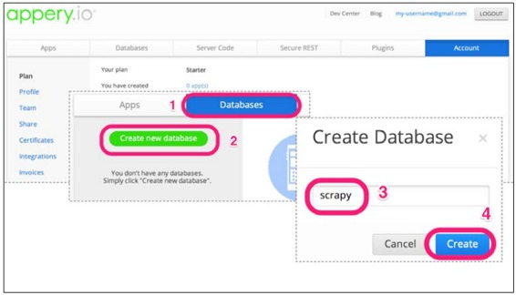
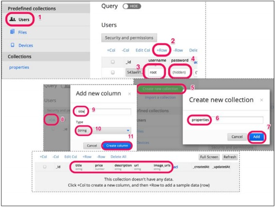
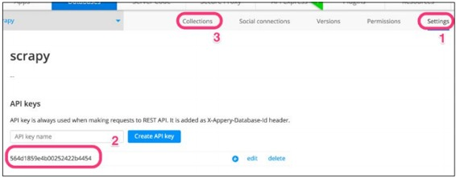
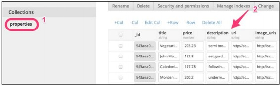
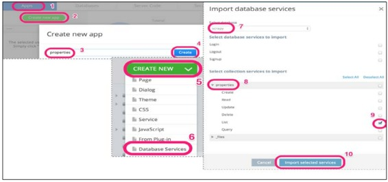
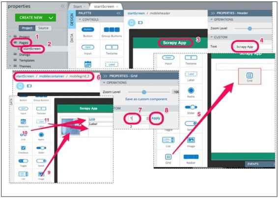
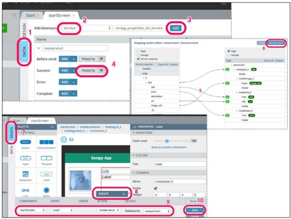
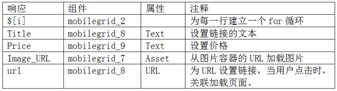
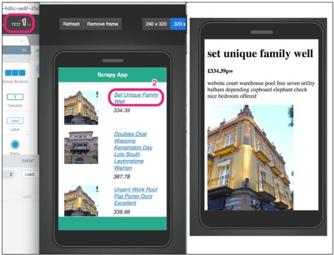
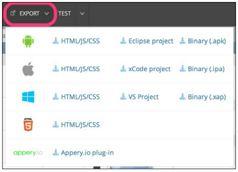

# 四、从 Scrapy 到移动应用


有人问，移动 app 开发平台 Appery.io 和 Scrapy 有什么关系？眼见为实。在几年前，用 Excel 向别人展示数据才可以让人印象深刻。现在，除非你的受众分布很窄，他们彼此之间是非常不同的。接下来几页，你会看到一个快速构建的移动应用，一个最小可行产品。它可以向别人清楚的展示你抓取的数据的力量，为源网站搭建的生态系统带来回报。

我尽量让这个挖掘数据价值的例子简短。要是你自己就有一个使用数据的应用，你可以跳过本章。本章就是告诉你如何用现在最流行的方式，移动应用，让你的数据面向公众。

## 选择移动应用框架

使用适当的工具向移动应用导入数据是相当容易的。跨平台开发移动应用的框架很多，例如 PhoneGap、Appcelerator 和 Appcelerator 云服务、jQuery Mobile 和 Sencha Touch。

本章会使用 Appery.io，因为它可以让我们用 PhoneGap 和 jQuery Mobile 快速开发 iOS、Android、Windows Phone、HTML5 移动应用。我并不是要为 Appery.io 代言，我鼓励你自己去调研下它是否符合你的需求。Appery.io 是一个付费服务，但有 14 天的试用期。在我看来，即使是外行也可以用 Appery.io 快速创建一个应用。我选择它的原因是，它提供了移动和后端两个服务，所以我们不用配置数据库、写 REST APIs、或在服务器和移动端使用不同的语言。你将看到，我们根本不用写任何代码！我们会使用它的在线工具，你可以随时下载 app 作为 PhoneGap 项目，使用 PhoneGap 的全部特性。

使用 Appery.io，你需要连接网络。另外，因为它的网站可能会发生改变，如果和截图不同不要惊讶。

## 创建数据库和集合

第一步是注册 Appery.io，并选择试用。提供名字、Emai 密码之后，你的账户就创立了。登录 Appery.io 工作台，你就可以创建数据库和集合了：



步骤如下：
1.点击 Databases 标签（1）。
2.然后点击绿色的 Create new database 按钮（2）。将新数据库命名为 scrapy（3）。
3.现在点击 Create 按钮（4）。自动打开 Scrapy 数据库工作台，在工作台上可以新建集合。

在 Appery.io 中，数据库是集合的整合。粗略的讲，一个应用使用一个数据库，这个数据库中有许多集合，例如用户、特性、信息等等。Appery.io 已经有了一个 Users 集合，用来存储用户名和密码（Appery.io 有许多内建的功能）。



让我们添加一个用户，用户名是 root，密码是 pass。显然，密码可以更复杂。在侧边栏点击 Users（1），然后点击+Row（2）添加 user/row。在弹出的界面中输入用户名和密码（3,4）。

再为 Scrapy 抓取的数据创建一个集合，命名为 properties。点击 Create new collection 绿色按钮（5），命名为 properties（6），点击 Add 按钮（7）。现在，我们需要自定义这个集合。点击+Col 添加列（8）。列有一些数据类型可以帮助确认值。大多数要填入的是字符串，除了价格是个数字。点击+Col（8）再添加几列，填入列的名字（9）、数据类型（10），然后点击 Create column 按钮（11）。重复五次这个步骤以创建下表：


创建好所有列之后，就可以导入数据了。

## **用 Scrapy 导入数据**

首先，我们需要 API key，在 Settings 中可以找到（1）。复制它（2），然后点击 Collections 标签返回集合（3）：



现在，修改一下上一章的代码，以导入数据。我们把名字是 easy.py 的爬虫中的代码复制到名字是 tomobile.py 的爬虫中：

```py
$ ls
properties  scrapy.cfg
$ cat properties/spiders/tomobile.py
...
class ToMobileSpider(CrawlSpider):
    name = 'tomobile'
    allowed_domains = ["scrapybook.s3.amazonaws.com"]
    # Start on the first index page
    start_URL = (
        'http://scrapybook.s3.amazonaws.com/properties/'
        'index_00000.html',
    )
... 
```

你可能注意到了，我们没有使用网络服务器[http://web:9312](https://link.jianshu.com?t=http://web:9312)。我们用的是我托管在[http://scrapybook.s3.amazonaws.com](https://link.jianshu.com?t=http://scrapybook.s3.amazonaws.com)上的副本。使用它，我们的图片和 URL 所有人都可以访问，更易分享我们的 app。

我们使用 Appery.io pipline 导入数据。Scrapy 的 pipelines 是后处理的、简洁的、可以存储 items 的很小的 Python 类。第 8 章中会详细讲解两者。现在，你可以用 easy_install 或 pip 安装，但如果你用 Vagrant 开发机，因为已经都安装好了，你就不用再安装了：

```py
$ sudo easy_install -U scrapyapperyio 
```

或

```py
$ sudo pip install --upgrade scrapyapperyio 
```

这时，要在 Scrapy 的设置文件中添加 API key。更多关于设置的内容会在第 7 章中介绍。现在，我们只需在在 properties/settings.py 文件后面加入如下代码：

```py
ITEM_PIPELINES = {'scrapyapperyio.ApperyIoPipeline': 300}
APPERYIO_DB_ID = '<<Your API KEY here>>'
APPERYIO_USERNAME = 'root'
APPERYIO_PASSWORD = 'pass'
APPERYIO_COLLECTION_NAME = 'properties' 
```

别忘了将 APPERYIO_DB_ID 替换为 API key。还要确认你的设置有和 Appery.io 相同的用户名和密码。要进行向 Appery.io 注入数据，像之前一样用 Scrapy 抓取：

```py
$ scrapy crawl tomobile -s CLOSESPIDER_ITEMCOUNT=90
INFO: Scrapy 1.0.3 started (bot: properties)
...
INFO: Enabled item pipelines: ApperyIoPipeline
INFO: Spider opened
...
DEBUG: Crawled (200) <GET https://api.appery.io/rest/1/db/login?username=
root&password=pass>
...
DEBUG: Crawled (200) <POST https://api.appery.io/rest/1/db/collections/
properties>
...
INFO: Dumping Scrapy stats:
  {'downloader/response_count': 215,
   'item_scraped_count': 105,
  ...}
INFO: Spider closed (closespider_itemcount) 
```

输出的结果略有不用。你可以看到代码的前几行运行了 ApperyIoPipeline 的项目 pipeline；更显著的是，大概抓取了 100 个项目，有约 200 个请求/响应。这是因为 Appery.io pipeline 为写入每个项目，都额外的做了一次请求。这些请求也出现在日志中，带有 api.appery.io URL。



如果返回 Appery.io，我们可以 properties 集合（1）中填入了数据（2）。

## **创建移动应用**

创建移动应用有点繁琐。点击 Apps 标签（1），然后点击 Create new app（2）。将这个应用命名为 properties（3），再点击 Create 按钮（4）：



## **创建数据库接入服务**

创建应用的选项很多。使用 Appery.io 应用编辑器可以编写复杂应用，但我们的应用力求简单。让我们的应用连接 Scrapy 数据库，点击 CREATE NEW 按钮（5），选择 Datebase Services（6）。弹出一个界面让我们选择连接的对象。我们选择 scrapy 数据库（7）。点击 properties 栏（8），选择 List（9）。这些操作可以让我们爬到的数据可用于数据库。最后点击 Import selected services 完成导入（10）。

设定用户界面
接下来创建 app 的界面。我们在 DESIGN 标签下工作：



在左侧栏中点开 Pages 文件夹（1），然后点击 startScreen（2）。UI 编辑器会打开一个页面，我们在上面添加空间。先修改标题。点击标题栏，在右侧的属性栏修改标题为 Scrapy App。同时，标题栏会更新。

然后，我们添加格栅组件。从左侧的控制板中拖动 Grid 组件（5）。这个组件有两行，而我们只要一行。选择这个格栅组件，选中的时候，它在路径中会变为灰色（6）。选中之后，在右侧的属性栏中编辑 Rows 为 1，然后点击 Apply（7,8）。现在，格栅就只有一行了。

最后，再向格栅中拖进一些组件。先在左边添加一个图片组件（9），然后在右侧添加一个链接（10）。最后，在链接下添加一个标签（11）。

排版结束。接下来将数据从数据库导入用户界面。

## **将数据映射到用户界面**

截止目前，我们只是在 DESIGN 标签下设置界面。为了连接数据和组件，我们切换到 DATA 标签（1）：



我们用 Service（2）作为数据源类型，它会自动选择我们之前建立的唯一可用数据。点击 Add 按钮（3）。点击 Add 之后，可以在下方看到一系列事件，例如 Before send 和 Success。点击 Success 后面的 Mapping 可以调用服务，我们现在对它进行设置。

打开 Mapping action editor，在上面进行连线。编辑器有两个部分。左边是服务的可用响应，右边是 UI 组件的属性。两边都有一个 Expand all，展开所有的项，以查看可用的。接下来按照下表，用从左到右拖动的方式完成五个映射（5）：



## **映射数据字段和用户组件**

前面列表中的数字可能在你的例子中是不同的，但是因为每种组件的类型都是唯一的，所以连线出错的可能性很小。通过映射，我们告诉 Appery.io 当数据库查询成功时载入数据。然后点击 Save and return（6）。

返回 DATA 标签。我们需要返回 UI 编辑器，点击 DESIGN 标签（7）。屏幕下方，你会看到 EVENTS 区域（8）被展开了。利用 EVENTS，我们让 Appery.io 响应 UI 时间。下面是最后一步，就是加载 UI 时调用服务取回数据。我们打开 startScreen 作为组件，事件的默认选项是 Load。然后选择 Invoke service 作为 action，然后用 Datasource 作为默认的 restservice1 选项（9）。点击 Save（10），保存这个移动应用。

## **测试、分享、生成 app**

现在准备测试 app。我们要做的是点击 UI 上方的 TEST 按钮（1）：



这个应用直接在浏览器中运行。链接（2）是启动的，可以进行跳转。你可以设置分辨率和屏幕的横竖。你还可以点击 View on Phone，创建一个二维码，用手机扫描，然后在手机上看。你刚刚创建了一个链接，别人也可以在他们的浏览器中查看。

只需几次点击，我们就用一个移动应用展示了 Scrapy 抓取的数据。你可以在这个网页，[http://devcenter.appery.io/tutorials/](https://link.jianshu.com?t=http://devcenter.appery.io/tutorials/)学习[Appery.io](https://link.jianshu.com?t=http://Appery.io)教程，继续定制这个应用。当你准备好之后，可以点击 EXPORT 按钮输出这个 app：



你可以输出文档到你喜爱的 IDE 继续开发，或是生成在各个平台都能运行的 app。

## **总结**

使用 Scrapy 和 Appery.io 两个工具，我们创建了一个爬虫、抓取了一个网站，并将数据存到数据库之中。我们还创建了 RESTful API 和一个简单的移动端应用。对于更高级的特点和进一步开发，你可以进一步探究这个平台，或将这个应用用于实际或科研。现在，用最少的代码，你就可以用一个小产品展示网络抓取的应用了。

鉴于这么短的开发时间，我们的 app 就有不错的效果。它有真实的数据，而不是 Lorem Ipsum 占字符，所有的链接运行良好。我们成功地制作了一个最小可行产品，它可以融合进源网站的生态，提高流量。

接下来学习在更加复杂的情况下，如何使用 Scrapy 爬虫提取信息。

