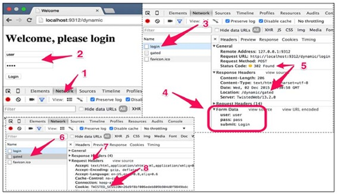
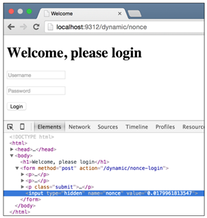
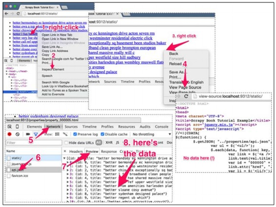
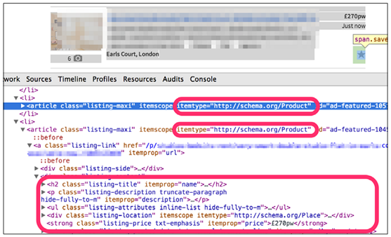
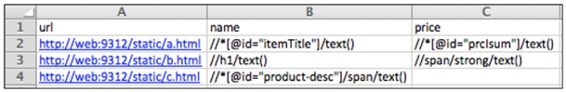

# 五、快速构建爬虫

* * *

[序言](https://www.jianshu.com/p/6c9baeb60044)
[第1章 Scrapy介绍](https://www.jianshu.com/p/b807653e97bb)
[第2章 理解HTML和XPath](https://www.jianshu.com/p/90c2c25f0c41)
[第3章 爬虫基础](https://www.jianshu.com/p/6ebb898841bc)
[第4章 从Scrapy到移动应用](https://www.jianshu.com/p/4156e757557f)
第5章 快速构建爬虫
[第6章 Scrapinghub部署](https://www.jianshu.com/p/441fa74d7aad)
[第7章 配置和管理](https://www.jianshu.com/p/674de4eacf15)
[第8章 Scrapy编程](https://www.jianshu.com/p/545d07702e7f)
[第9章 使用Pipeline](https://www.jianshu.com/p/e0287e773d28)
[第10章 理解Scrapy的性能](https://www.jianshu.com/p/e9710002cb4e)
[第11章（完） Scrapyd分布式抓取和实时分析](https://www.jianshu.com/p/cfca4b7e62f4)

* * *

第3章中，我们学习了如何从网页提取信息并存储到Items中。大多数情况都可以用这一章的知识处理。本章，我们要进一步学习抓取流程UR<sup>2</sup>IM中两个R，Request和Response。

## **一个具有登录功能的爬虫**

你常常需要从具有登录机制的网站抓取数据。多数时候，网站要你提供用户名和密码才能登录。我们的例子，你可以在[http://web:9312/dynamic](https://link.jianshu.com?t=http://web:9312/dynamic)或[http://localhost:9312/dynamic](https://link.jianshu.com?t=http://localhost:9312/dynamic)找到。用用户名“user”、密码“pass”登录之后，你会进入一个有三条房产链接的网页。现在的问题是，如何用Scrapy登录？



让我们使用谷歌Chrome浏览器的开发者工具搞清楚登录的机制。首先，选择Network标签（1）。然后，填入用户名和密码，点击Login（2）。如果用户名和密码是正确的，你会进入下一页。如果是错误的，会看到一个错误页。

一旦你点击了Login，在开发者工具的Network标签栏中，你就会看到一个发往[http://localhost:9312/dynamic/login](https://link.jianshu.com?t=http://localhost:9312/dynamic/login)的请求Request Method: POST。

> 提示：上一章的GET请求，通常用来获取静止数据，例如简单的网页和图片。POST请求通常用来获取的数据，取决于我们发给服务器的数据，例如这个例子中的用户名和密码。

点击这个POST请求，你就可以看到发给服务器的数据，其中包括表单信息，表单信息中有你刚才输入的用户名和密码。所有数据都以文本的形式发给服务器。Chrome开发者工具将它们整理好并展示出来。服务器的响应是302 FOUND（5），然后将我们重定向到新页面：/dynamic/gated。只有登录成功时才会出现此页面。如果没有正确输入用户名和密码就前往[http://localhost:9312/dynamic/gated](https://link.jianshu.com?t=http://localhost:9312/dynamic/gated)，服务器会发现你作弊，并将你重定向到错误页面：[http://localhost:9312/dynamic/error](https://link.jianshu.com?t=http://localhost:9312/dynamic/error)。服务器怎么知道你和密码呢？如果你点击左侧的gated（6），你会发现在RequestHeaders（7）下有一个Cookie（8）。

> 提示：HTTP cookie是通常是一些服务器发送到浏览器的短文本或数字片段。反过来，在每一个后续请求中，浏览器把它发送回服务器，以确定你、用户和期限。这让你可以执行复杂的需要服务器端状态信息的操作，如你购物车中的商品或你的用户名和密码。

总结一下，单单一个操作，如登录，可能涉及多个服务器往返操作，包括POST请求和HTTP重定向。Scrapy处理大多数这些操作是自动的，我们需要编写的代码很简单。
我们将第3章名为easy的爬虫重命名为login，并修改里面名字的属性，如下：

```py
class LoginSpider(CrawlSpider):
    name = 'login' 
```

> 提示：本章的代码github的ch05目录中。这个例子位于ch05/properties。

我们要在[http://localhost:9312/dynamic/login](https://link.jianshu.com?t=http://localhost:9312/dynamic/login)上面模拟一个POST请求登录。我们用Scrapy中的类FormRequest来做。这个类和第3章中的Request很像，但有一个额外的formdata，用来传递参数。要使用这个类，首先必须要引入：

```py
from scrapy.http import FormRequest 
```

我们然后将start_URL替换为start_requests()方法。这么做是因为在本例中，比起URL，我们要做一些自定义的工作。更具体地，用下面的函数，我们创建并返回一个FormRequest：

```py
# Start with a login request
def start_requests(self):
  return [
    FormRequest(
      "http://web:9312/dynamic/login",
      formdata={"user": "user", "pass": "pass"}
         )] 
```

就是这样。CrawlSpider的默认parse()方法，即LoginSpider的基本类，负责处理响应，并如第3章中使用Rules和LinkExtractors。其余的代码很少，因为Scrapy负责了cookies，当我们登录时，Scrapy将cookies传递给后续请求，与浏览器的方式相同。还是用scrapy crawl运行：

```py
$ scrapy crawl login 
INFO: Scrapy 1.0.3 started (bot: properties)
...
DEBUG: Redirecting (302) to <GET .../gated> from <POST .../login >
DEBUG: Crawled (200) <GET .../data.php>
DEBUG: Crawled (200) <GET .../property_000001.html> (referer: .../data.
php)
DEBUG: Scraped from <200 .../property_000001.html>
  {'address': [u'Plaistow, London'],
   'date': [datetime.datetime(2015, 11, 25, 12, 7, 27, 120119)],
   'description': [u'features'],
   'image_URL': [u'http://web:93img/i02.jpg'],
...
INFO: Closing spider (finished)
INFO: Dumping Scrapy stats:
  {...
   'downloader/request_method_count/GET': 4,
   'downloader/request_method_count/POST': 1,
...
   'item_scraped_count': 3, 
```

我们注意到登录跳转从dynamic/login到dynamic/gated，然后就可以像之前一样抓取项目。在统计中，我们看到一个POST请求和四个GET请求；一个是dynamic/gated首页，三个是房产网页。

> 提示：在本例中，我们不保护房产页，而是是这些网页的链接。代码在相反的情况下也是相同的。

如果我们使用了错误的用户名和密码，我们将重定向到一个没有URL的页面，进程并将在这里结束，如下所示：

```py
$ scrapy crawl login
INFO: Scrapy 1.0.3 started (bot: properties)
...
DEBUG: Redirecting (302) to <GET .../dynamic/error > from <POST .../
dynamic/login>
DEBUG: Crawled (200) <GET .../dynamic/error>
...
INFO: Spider closed (closespider_itemcount) 
```

这是一个简单的登录示例，演示了基本的登录机制。大多数网站可能有更复杂的机制，但Scrapy也处理的很好。例如一些网站在执行POST请求时，需要通过从表单页面到登录页面传递某种形式的变量以确定cookies的启用，让你使用大量用户名和密码暴力破解时变得困难。



例如，如果你访问[http://localhost:9312/dynamic/nonce](https://link.jianshu.com?t=http://localhost:9312/dynamic/nonce)，你会看到一个和之前一样的网页，但如果你使用Chrome开发者工具，你会发现这个页面的表单有一个叫做nonce的隐藏字段。当你提交表单[http://localhost:9312/dynamic/nonce-login](https://link.jianshu.com?t=http://localhost:9312/dynamic/nonce-login)时，你必须既要提供正确的用户名密码，还要提交正确的浏览器发给你的nonce值。因为这个值是随机且只能使用一次，你很难猜到。这意味着，如果要成功登陆，必须要进行两次请求。你必须访问表单、登录页，然后传递数值。和以前一样，Scrapy有内建的功能可以解决这个问题。

我们创建一个和之前相似的NonceLoginSpider爬虫。现在，在start_requests()中，我们要向表单页返回一个简单的Request，并通过设定callback为名字是parse_welcome()的方法手动处理响应。在parse_welcome()中，我们使用FormRequest对象中的from_response()方法创建FormRequest，并将原始表单中的字段和值导入FormRequest。FormRequest.from_response()可以模拟提交表单。

> 提示：花时间看from_response()的文档是十分值得的。他有许多有用的功能如formname和formnumber，它可以帮助你当页面有多个表单时，选择特定的表单。

它最大的功能是，一字不差地包含了表单中所有的隐藏字段。我们只需使用formdata参数，填入user和pass字段，并返回FormRequest。代码如下：

```py
# Start on the welcome page
def start_requests(self):
    return [
        Request(
            "http://web:9312/dynamic/nonce",
            callback=self.parse_welcome)
    ]
# Post welcome page's first form with the given user/pass
def parse_welcome(self, response):
    return FormRequest.from_response(
        response,
        formdata={"user": "user", "pass": "pass"}
    ) 
```

像之前一样运行爬虫：

```py
$ scrapy crawl noncelogin 
INFO: Scrapy 1.0.3 started (bot: properties)
...
DEBUG: Crawled (200) <GET .../dynamic/nonce>
DEBUG: Redirecting (302) to <GET .../dynamic/gated > from <POST .../
dynamic/login-nonce>
DEBUG: Crawled (200) <GET .../dynamic/gated>
...
INFO: Dumping Scrapy stats:
  {...
   'downloader/request_method_count/GET': 5,
   'downloader/request_method_count/POST': 1,
...
   'item_scraped_count': 3, 
```

我们看到第一个GET请求先到/dynamic/nonce，然后POST，重定向到/dynamic/nonce-login之后，之后像之前一样，访问了/dynamic/gated。登录过程结束。这个例子的登录含有两步。只要有足够的耐心，无论多少步的登录过程，都可以完成。

## **使用JSON APIs和AJAX页面的爬虫**

有时，你会发现网页的HTML找不到数据。例如，在[http://localhost:9312/static/](https://link.jianshu.com?t=http://localhost:9312/static/)页面上右键点击检查元素（1,2），你就可以在DOM树种看到所有HTML元素。或者，如果你使用scrapy shell或在Chrome中右键点击查看网页源代码（3,4），你会看到这个网页的HTML代码不包含任何和值有关的信息。数据都是从何而来呢？



和以前一样，在开发者工具中打开Network标签（5）查看发生了什么。左侧列表中，可以看到所有的请求。在这个简单的页面中，只有三个请求：static/我们已经检查过了，jquery.min.js是一个流行的JavaScript框架，api.json看起来不同。如果我们点击它（6），然后在右侧点击Preview标签（7），我们可以看到它包含我们要找的信息。事实上，[http://localhost:9312/properties/api.json](https://link.jianshu.com?t=http://localhost:9312/properties/api.json)包含IDs和名字（8），如下所示：

```py
[{
    "id": 0,
    "title": "better set unique family well"
}, 
... {
    "id": 29,
    "title": "better portered mile"
}] 
```

这是一个很简单的JSON API例子。更复杂的APIs可能要求你登录，使用POST请求，或返回某种数据结结构。任何时候，JSON都是最容易解析的格式，因为不需要XPath表达式就可以提取信息。

Python提供了一个强大的JSON解析库。当我们import json时，我们可以使用json.loads（response.body）解析JSON，并转换成等价的Python对象，语句、列表和字典。

复制第3章中的manual.py文件。这是最好的方法，因为我们要根据JSON对象中的IDs手动创建URL和Request。将这个文件重命名为api.py，重命名类为ApiSpider、名字是api。新的start_URL变成：

```py
start_URL = (
    'http://web:9312/properties/api.json',
) 
```

如果你要做POST请求或更复杂的操作，你可以使用start_requests()方法和前面几章介绍的方法。这里，Scrapy会打开这个URL并使用Response作为参数调用parse()方法。我们可以import json，使用下面的代码解析JSON：

```py
def parse(self, response):
    base_url = "http://web:9312/properties/"
    js = json.loads(response.body)
    for item in js:
        id = item["id"]
        url = base_url + "property_%06d.html" % id
        yield Request(url, callback=self.parse_item) 
```

这段代码使用了json.loads（response.body）将响应JSON对象转换为Python列表，然后重复这个过程。对于列表中的每个项，我们设置一个URL，它包含：base_url，property_%06d和.html.base_url，.html.base_url前面定义过的URL前缀。%06d是一个非常有用的Python词，可以让我们结合多个Python变量形成一个新的字符串。在本例中，用id变量替换%06d。id被当做数字（%d的意思就是当做数字进行处理），并扩展成6个字符，位数不够时前面添加0。如果id的值是5，%06d会被替换为000005；id是34322时，%06d会被替换为034322替换。最后的结果是可用的URL。和第3章中的yield一样，我们用URL做一个新的Request请求。运行爬虫：

```py
$ scrapy crawl api
INFO: Scrapy 1.0.3 started (bot: properties)
...
DEBUG: Crawled (200) <GET ...properties/api.json>
DEBUG: Crawled (200) <GET .../property_000029.html>
...
INFO: Closing spider (finished)
INFO: Dumping Scrapy stats:
...
   'downloader/request_count': 31, ...
   'item_scraped_count': 30, 
```

最后一共有31次请求，每个项目一次，api.json一次。

## **在响应间传递参数**

许多时候，你想把JSON APIs中的信息存储到Item中。为了演示，在我们的例子中，对于一个项，JSON API在返回它的名字时，在前面加上“better”。例如，如果一个项的名字时“Covent Garden”，API会返回“Better Covent Garden”。我们要在Items中保存这些含有“bette”的名字。如何将数据从parse()传递到parse_item()中呢？

我们要做的就是在parse()方法产生的Request中进行设置。然后，我们可以从parse_item()的的Response中取回。Request有一个名为meta的字典，在Response中可以直接访问。对于我们的例子，给字典设一个title值以存储从JSON对象的返回值：

```py
title = item["title"]
yield Request(url, meta={"title": title},callback=self.parse_item) 
```

在parse_item()中，我们可以使用这个值，而不用XPath表达式：

```py
l.add_value('title', response.meta['title'],
      MapCompose(unicode.strip, unicode.title)) 
```

你会注意到，我们从调用add_xpath()切换到add_value()，因为对于这个字段不需要使用XPath。我们现在运行爬虫，就可以在PropertyItems中看到api.json中的标题了。

## **一个加速30倍的项目爬虫**

当你学习使用一个框架时，这个框架越复杂，你用它做任何事都会很复杂。可能你觉得Scrapy也是这样。当你就要为XPath和其他方法变得抓狂时，不妨停下来思考一下：我现在抓取网页的方法是最简单的吗？

如果你可以从索引页中提取相同的信息，就可以避免抓取每一个列表页，这样就可以节省大量的工作。

> 提示：许多网站的索引页提供的项目数量是不同的。例如，一个网站可以通过调整一个参数，例如&show=50，给每个索引页面设置10、 50或100个列表项。如果是这样的话，将其设置为可用的最大值。

例如，对于我们的例子，我们需要的所有信息都存在于索引页中，包括标题、描述、价格和图片。这意味着我们抓取单个索引页，提取30个条目和下一个索引页的链接。通过抓取100个索引页，我们得到3000个项，但只有100个请求而不是3000个。

在真实的Gumtree网站上，索引页的描述比列表页的完整描述要短。这是可行的，或者是更推荐的。

> 提示：许多情况下，您不得不在数据质量与请求数量间进行折衷。很多网站都限制请求数量（后面章节详解），所以减少请求可能解决另一个棘手的问题。

在我们的例子中，如果我们查看一个索引页的HTML，我们会发现，每个列表页有自己的节点，itemtype="[http://schema.org/Product](https://link.jianshu.com?t=http://schema.org/Product)"。节点有每个项的全部信息，如下所示：



让我们在Scrapy shell中加载索引首页，并用XPath处理：

```py
$ scrapy shell http://web:9312/properties/index_00000.html
While within the Scrapy shell, let's try to select everything with the Product tag:
>>> p=response.xpath('//*[@itemtype="http://schema.org/Product"]')
>>> len(p)
30
>>> p
[<Selector xpath='//*[@itemtype="http://schema.org/Product"]' data=u'<li 
class="listing-maxi" itemscopeitemt'...] 
```

我们得到了一个包含30个Selector对象的表，每个都指向一个列表。Selector对象和Response对象很像，我们可以用XPath表达式从它们指向的对象中提取信息。不同的是，表达式为有相关性的XPath表达式。相关性XPath表达式与我们之前见过的很像，不同之处是它们前面有一个点“.”。然我们看看如何用.//*[@itemprop="name"][1]/text()提取标题的：

```py
>>> selector = p[3]
>>> selector
<Selector xpath='//*[@itemtype="http://schema.org/Product"]' ... '>
>>> selector.xpath('.//*[@itemprop="name"][1]/text()').extract()
[u'l fun broadband clean people brompton european'] 
```

我们可以在Selector对象表中用for循环提取一个索引页的所有30个项目信息。还是从第3章中的maunal.py文件开始，重命名为fast.py。重复使用大部分代码，修改parse()和parse_item()方法。更新的方法如下所示：

```py
def parse(self, response):
    # Get the next index URL and yield Requests
    next_sel = response.xpath('//*[contains(@class,"next")]//@href')
    for url in next_sel.extract():
        yield Request(urlparse.urljoin(response.url, url))
    # Iterate through products and create PropertiesItems
    selectors = response.xpath(
        '//*[@itemtype="http://schema.org/Product"]')
    for selector in selectors:
        yield self.parse_item(selector, response) 
```

第一部分中用于产生下一条索引请求的代码没有变动。不同的地方是第二部分，我们重复使用选择器调用parse_item()方法，而不是用yield创建请求。这和原先使用的源代码很像：

```py
def parse_item(self, selector, response):
    # Create the loader using the selector
    l = ItemLoader(item=PropertiesItem(), selector=selector)
    # Load fields using XPath expressions
l.add_xpath('title', './/*[@itemprop="name"][1]/text()',
                MapCompose(unicode.strip, unicode.title))
    l.add_xpath('price', './/*[@itemprop="price"][1]/text()',
                MapCompose(lambda i: i.replace(',', ''), float),
                re='[,.0-9]+')
    l.add_xpath('description',
                './/*[@itemprop="description"][1]/text()',
                MapCompose(unicode.strip), Join())
    l.add_xpath('address',
                './/*[@itemtype="http://schema.org/Place"]'
                '[1]/*/text()',
                MapCompose(unicode.strip))
    make_url = lambda i: urlparse.urljoin(response.url, i)
    l.add_xpath('image_URL', './/*[@itemprop="image"][1]/@src',
                MapCompose(make_url))
    # Housekeeping fields
    l.add_xpath('url', './/*[@itemprop="url"][1]/@href',
                MapCompose(make_url))
    l.add_value('project', self.settings.get('BOT_NAME'))
    l.add_value('spider', self.name)
    l.add_value('server', socket.gethostname())
    l.add_value('date', datetime.datetime.now())
    return l.load_item() 
```

我们做出的变动是：

*   ItemLoader现在使用selector作为源，不使用Response。这么做可以让ItemLoader更便捷，可以让我们从特定的区域而不是整个页面抓取信息。
*   通过在前面添加“.”使XPath表达式变为相关XPath。

> 提示：碰巧的是，在我们的例子中，XPath表达式在索引页和介绍页中是相同的。不同的时候，你需要按照索引页修改XPath表达式。

*   在response.url给我们列表页的URL之前，我们必须自己编辑Item的URL。然后，它才能返回我们抓取网页的URL。我们必须用.//*[@itemprop="url"][1]/@href提取URL，然后将它用MapCompose转化为URL绝对路径。

这些小小大量的工作的改动可以节省大量的工作。现在，用以下命令运行爬虫：

```py
$ scrapy crawl fast -s CLOSESPIDER_PAGECOUNT=3
...
INFO: Dumping Scrapy stats:
   'downloader/request_count': 3, ...
   'item_scraped_count': 90,... 
```

就像之前说的，我们用三个请求，就抓取了90个项目。不从索引开始的话，就要用93个请求。

如果你想用scrapy parse来调试，你需要如下设置spider参数：

```py
$ scrapy parse --spider=fast http://web:9312/properties/index_00000.html
...
>>> STATUS DEPTH LEVEL 1 <<<
# Scraped Items  --------------------------------------------
[{'address': [u'Angel, London'],
... 30 items...
# Requests  ---------------------------------------------------
[<GET http://web:9312/properties/index_00001.html>] 
```

正如所料，parse()返回了30个Items和下一个索引页的请求。你还可以继续试验scrapy parse，例如，设置—depth=2。

## **可以抓取Excel文件的爬虫**

大多数时候，你每抓取一个网站就使用一个爬虫，但如果要从多个网站抓取时，不同之处就是使用不同的XPath表达式。为每一个网站配置一个爬虫工作太大。能不能只使用一个爬虫呢？答案是可以。

新建一个项目抓取不同的东西。当前我们是在ch05的properties目录，向上一级：

```py
$ pwd
/root/book/ch05/properties
$ cd ..
$ pwd
/root/book/ch05 
```

新建一个项目，命名为generic，再创建一个名为fromcsv的爬虫：

```py
$ scrapy startproject generic
$ cd generic
$ scrapy genspider fromcsv example.com 
```

新建一个.csv文件，它是我们抓取的目标。我们可以用Excel表建这个文件。如下表所示，填入URL和XPath表达式，在爬虫的目录中（有scrapy.cfg的文件夹）保存为todo.csv。保存格式是csv：



一切正常的话，就可以在终端看见这个文件：

```py
$ cat todo.csv 
url,name,price
a.html,"//*[@id=""itemTitle""]/text()","//*[@id=""prcIsum""]/text()"
b.html,//h1/text(),//span/strong/text()
c.html,"//*[@id=""product-desc""]/span/text()" 
```

Python中有csv文件的内建库。只需import csv，就可以用后面的代码一行一行以dict的形式读取这个csv文件。在当前目录打开Python命令行，然后输入：

```py
$ pwd
/root/book/ch05/generic2
$ python
>>> import csv
>>> with open("todo.csv", "rU") as f:
        reader = csv.DictReader(f)
        for line in reader:
            print line 
```

文件的第一行会被自动作为header，从而导出dict的键名。对于下面的每一行，我们得到一个包含数据的dict。用for循环执行每一行。前面代码的结果如下：

```py
{'url': ' http://a.html', 'price': '//*[@id="prcIsum"]/text()', 'name': '//*[@id="itemTitle"]/text()'}
{'url': ' http://b.html', 'price': '//span/strong/text()', 'name': '//h1/text()'}
{'url': ' http://c.html', 'price': '', 'name': '//*[@id="product-desc"]/span/text()'} 
```

很好。现在编辑generic/spiders/fromcsv.py爬虫。我们使用.csv文件中的URL，并且不希望遇到域名限制的情况。因此第一件事是移除start_URL和allowed_domains。然后再读.csv文件。

因为从文件中读取的URL是我们事先不了解的，所以使用一个start_requests()方法。对于每一行，我们都会创建Request。我们还要从request,meta的csv存储字段名和XPath，以便在我们的parse()函数中使用。然后，我们使用Item和ItemLoader填充Item的字段。下面是所有代码：

```py
import csv
import scrapy
from scrapy.http import Request
from scrapy.loader import ItemLoader
from scrapy.item import Item, Field
class FromcsvSpider(scrapy.Spider):
    name = "fromcsv"
def start_requests(self):
    with open("todo.csv", "rU") as f:
        reader = csv.DictReader(f)
        for line in reader:
            request = Request(line.pop('url'))
            request.meta['fields'] = line
            yield request
def parse(self, response):
    item = Item()
    l = ItemLoader(item=item, response=response)
    for name, xpath in response.meta['fields'].iteritems():
        if xpath:
      item.fields[name] = Field()
            l.add_xpath(name, xpath)
    return l.load_item() 
```

运行爬虫，输出文件保存为csv：

```py
$ scrapy crawl fromcsv -o out.csv
INFO: Scrapy 0.0.3 started (bot: generic)
...
DEBUG: Scraped from <200 a.html>
{'name': [u'My item'], 'price': [u'128']}
DEBUG: Scraped from <200 b.html>
{'name': [u'Getting interesting'], 'price': [u'300']}
DEBUG: Scraped from <200 c.html>
{'name': [u'Buy this now']}
...
INFO: Spider closed (finished)
$ cat out.csv 
price,name
128,My item
300,Getting interesting
,Buy this now 
```

有几点要注意。项目中没有定义一个整个项目的Items，我们必须手动向ItemLoader提供一个：

```py
item = Item()
l = ItemLoader(item=item, response=response) 
```

我们还用Item的fields成员变量添加了动态字段。添加一个新的动态字段，并用ItemLoader填充，使用下面的方法：

```py
item.fields[name] = Field()
l.add_xpath(name, xpath) 
```

最后让代码再漂亮些。硬编码todo.csv不是很好。Scrapy提供了一种便捷的向爬虫传递参数的方法。如果我们使用-a参数，例如，-a variable=value，就创建了一个爬虫项，可以用self.variable取回。为了检查变量（没有的话，提供一个默认变量），我们使用Python的getattr()方法：getattr(self, 'variable', 'default')。总之，原来的with open…替换为：

```py
with open(getattr(self, "file", "todo.csv"), "rU") as f: 
```

现在，todo.csv是默认文件，除非使用参数-a，用一个源文件覆盖它。如果还有一个文件，another_todo.csv，我们可以运行：

```py
$ scrapy crawl fromcsv -a file=another_todo.csv -o out.csv 
```

## **总结**

在本章中，我们进一步学习了Scrapy爬虫。我们使用FormRequest进行登录，用请求/响应中的meta传递变量，使用了相关的XPath表达式和Selectors，使用.csv文件作为数据源等等。

接下来在第6章学习在Scrapinghub云部署爬虫，在第7章学习关于Scrapy的设置。

* * *

[序言](https://www.jianshu.com/p/6c9baeb60044)
[第1章 Scrapy介绍](https://www.jianshu.com/p/b807653e97bb)
[第2章 理解HTML和XPath](https://www.jianshu.com/p/90c2c25f0c41)
[第3章 爬虫基础](https://www.jianshu.com/p/6ebb898841bc)
[第4章 从Scrapy到移动应用](https://www.jianshu.com/p/4156e757557f)
第5章 快速构建爬虫
[第6章 Scrapinghub部署](https://www.jianshu.com/p/441fa74d7aad)
[第7章 配置和管理](https://www.jianshu.com/p/674de4eacf15)
[第8章 Scrapy编程](https://www.jianshu.com/p/545d07702e7f)
[第9章 使用Pipeline](https://www.jianshu.com/p/e0287e773d28)
[第10章 理解Scrapy的性能](https://www.jianshu.com/p/e9710002cb4e)
[第11章（完） Scrapyd分布式抓取和实时分析](https://www.jianshu.com/p/cfca4b7e62f4)

* * *