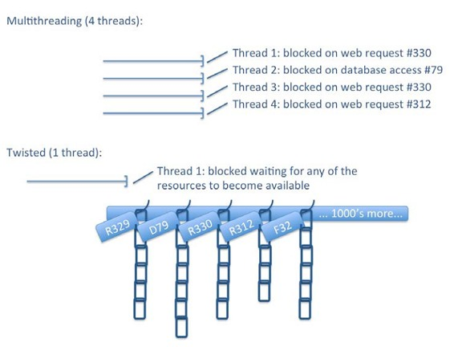
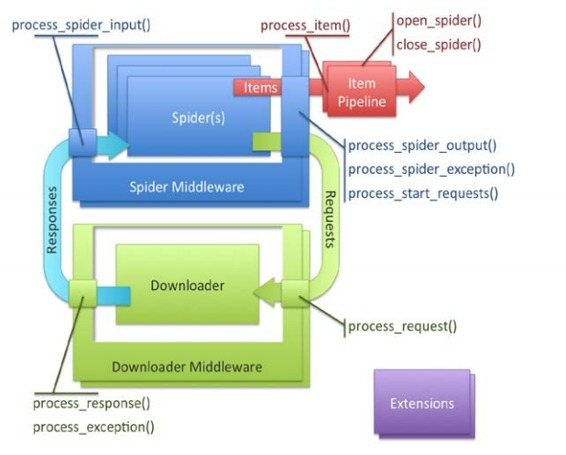
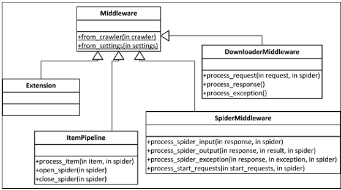
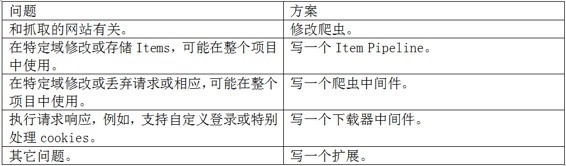
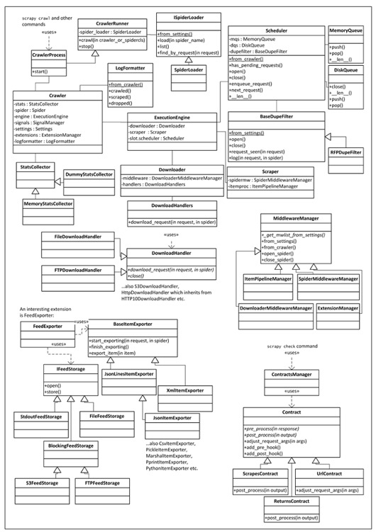

# 八、Scrapy编程

* * *

[序言](https://www.jianshu.com/p/6c9baeb60044)
[第1章 Scrapy介绍](https://www.jianshu.com/p/b807653e97bb)
[第2章 理解HTML和XPath](https://www.jianshu.com/p/90c2c25f0c41)
[第3章 爬虫基础](https://www.jianshu.com/p/6ebb898841bc)
[第4章 从Scrapy到移动应用](https://www.jianshu.com/p/4156e757557f)
[第5章 快速构建爬虫](https://www.jianshu.com/p/9d1e00dc40e4)
[第6章 Scrapinghub部署](https://www.jianshu.com/p/441fa74d7aad)
[第7章 配置和管理](https://www.jianshu.com/p/674de4eacf15)
第8章 Scrapy编程
[第9章 使用Pipeline](https://www.jianshu.com/p/e0287e773d28)
[第10章 理解Scrapy的性能](https://www.jianshu.com/p/e9710002cb4e)
[第11章（完） Scrapyd分布式抓取和实时分析](https://www.jianshu.com/p/cfca4b7e62f4)

* * *

到目前为止，我们创建爬虫的目的是抓取数据，并提取信息。除了爬虫，scrapy可以让我们微调它的功能。例如，你会经常碰到以下状况：

你在同一个项目的爬虫间复制粘贴了很多代码。重复的代码更多是关于处理数据，而不是关于数据源。

你必须写脚本，好让Items复制入口或后处理数值。

你要在项目中架构中使用重复代码。例如，你要登录，并将文件传递到私有仓库，向数据库添加Items，或当爬虫结束时触发后处理操作。

你发现Scrapy有些方面不好用，你想在自己的项目中自定义Scrapy。

Scrapy的开发者设计的架构允许我们解决上述问题。我们会在本章后面查看Scrapy架构。现在，首先让我们来看Scrapy的引擎，Twisted。

**Scrapy是一个Twisted应用**
Scrapy是一个用Twisted Python框架构建的抓取应用。Twisted很不寻常，因为它是事件驱动的，并且鼓励我们编写异步代码。完全弄懂需要一些时间，我们只学习和Scrapy相关的部分。我们还会在处理错误中学习。Scrapy在GitHub上的代码有更多的错误处理，我们会跳过它。

让我们从头开始。Twisted的不同之处在于它自身的结构。

> 提示：在任何时候，都不要让代码发生阻塞。

这个提示很重要。发生阻塞的代码包括：

*   访问文件、数据库或网络的代码
*   产生新进程并占用输出的代码，例如，运行命令行
*   执行系统级操作的代码，例如，在系统中排队

Twisted可以在不发生阻塞的情况下，执行以上操作。

为了展示不同，假设我们有一个典型的同步抓取应用。假设它有四个线程，在某个时刻，其中三个在等待响应而被阻塞，另一个在数据库中向Item文件写入而被阻塞。这时候，只能等待阻塞结束。阻塞结束时，又会有其它应用在几微秒之后占用了线程，又会发生阻塞。整体上，服务器并没有空闲，因为它上面运行着数十个程序、使用了数千个线程，因此，在微调之后，CPUs的利用率照样很高。



Twisted/Scrapy的方法尽量使用一个线程。它使用操作系统的I/O多线路函数（见select()、poll()和epoll()）作为“挂架”。要发生阻塞时，例如，result = i_block()，Twisted会立即返回。然而，它不是返回实际值，而是返回一个钩子，例如deferred = i_dont_block()。我们可以在值变得可用时，例如deferred.addCallback(process_result))，将值返回到任何可以用到该值的进程。Twisted就是延迟操作链组成的。Twisted的单线程被称作Twisted事件反应器，它负责监视“挂架”是否有资源可用（例如，一个服务器响应了我们的请求）。当可用时，事件反应器会将排在最前面的延迟项执行，它执行完之后，会调用下一个。一些延迟项可能引发更多的I/O操作，它会将延迟链继续挂起来，让CPU执行别的操作。因为是单线程，我们不需要其它线程切换上下文和保存资源。换句话，使用这种非阻塞的结构，我们使用一个线程，就相当于有数千个线程。

OS开发者在数十年中不断优化线程操作。但是收效甚微。为一个复杂应用写出正确的多线程代码确实很难。当你搞明白延迟和调回，你会返现Twisted代码比线程代码简单多了。inlineCallbacks生成器可以让代码更简单，下面会继续介绍。

> 笔记：可能目前最成功的非阻塞I/O系统是Node.js，这主要因为从一开始Node.js就要求高性能和并发。每个Node.js只是用非阻塞的APIs。在Java中，Netty可能是最成功的NIO框架，例如Apche Storm和Spark。C++11的std::future和std::promise（与延迟项相似）可以用库，例如libevent或plain POSIX写异步代码。

**延迟项和延迟链**

延迟项是Twisted写出异步代码的最重要机制。Twisted APIs使用延迟项让我们定义事件发生时产生动作的顺序。

> 提示：本章代码位于ch08。这个例子位于ch08/deferreds.py file，你可以用./deferreds.py 0运行。

你可以用Python控制台如下运行：

```py
$ python
>>> from twisted.internet import defer
>>> # Experiment 1
>>> d = defer.Deferred()
>>> d.called
False
>>> d.callback(3)
>>> d.called
True
>>> d.result
3 
```

我们看到，延迟项本质代表一个值。当我们触发d时（调用callback方法），延迟项的called状态变为True，result属性变为调用的值：

```py
>>> # Experiment 2
>>> d = defer.Deferred()
>>> def foo(v):
...     print "foo called"
...     return v+1
... 
>>> d.addCallback(foo)
<Deferred at 0x7f...>
>>> d.called
False
>>> d.callback(3)
foo called
>>> d.called
True
>>> d.result
4 
```

延迟项的最强大之处是，当值确定时，可以在延迟链上添加新的项。在上面的例子中，我们使用foo()作为d的回调。当我们调用callback(3)时，函数foo()被调用并打印出信息。返回值作为d的最后结果：

```py
>>> # Experiment 3
>>> def status(*ds):
...     return [(getattr(d, 'result', "N/A"), len(d.callbacks)) for d in 
ds]
>>> def b_callback(arg):
...     print "b_callback called with arg =", arg
...     return b
>>> def on_done(arg):
...     print "on_done called with arg =", arg
...     return arg
>>> # Experiment 3.a
>>> a = defer.Deferred()
>>> b = defer.Deferred() 
```

这个例子演示了延迟项更复杂的情况。我们看到了一个正常的延迟项a，但它有两个调回。第一个是b_callback()，返回的是b而不是a。第二个是，on_done()打印函数。我们还有一个status()函数，它可以打印延迟项的状态。对于两个调回，刚建立时，有两个相同的状态[('N/A', 2), ('N/A', 0)]，意味着两个延迟项都没有被触发，第一个有两个调回，第二个没有调回。然后，如果我们先触发a，我们进入一个奇怪的状态 [(<Deferred at 0x10e7209e0>, 1), ('N/A', 1)]，它显示a现在有一个值，这是一个延迟值（实际上就是b），它只有一个调回，因为b_callback()已经被调回，只留下on_done()。意料之外的是吗，现在b[(4, 0), (None, 0)]，这正是我们想要的：

```py
>>> # Experiment 3.b
>>> a = defer.Deferred()
>>> b = defer.Deferred()
>>> a.addCallback(b_callback).addCallback(on_done)
>>> status(a, b)
[('N/A', 2), ('N/A', 0)]
>>> b.callback(4)
>>> status(a, b)
[('N/A', 2), (4, 0)]
>>> a.callback(3)
b_callback called with arg = 3
on_done called with arg = 4
>>> status(a, b)
[(4, 0), (None, 0)] 
```

另一方面，在设a为3之前就触发b，b的状态变为 [('N/A', 2), (4, 0)]，然后当a被触发时，两个调用都会被调用，最后的状态和前一个例子一样。无论触发的顺序，结果都是一样的。两者的区别是，在第一种情况中，b的值被延迟更久，因为它是后触发的。而在第二种情况中，先触发b，然后它的值立即被使用。

这时，你应该可以理解什么是延迟项，它们是怎么构成链的和表达值得。我们用第四个例子说明触发取决于其它延迟项的数量，通过使用Twisted中的类defer.DeferredList：

```py
>>> # Experiment 4
>>> deferreds = [defer.Deferred() for i in xrange(5)]
>>> join = defer.DeferredList(deferreds)
>>> join.addCallback(on_done)
>>> for i in xrange(4):
...     deferreds[i].callback(i)
>>> deferreds[4].callback(4)
on_done called with arg = [(True, 0), (True, 1), (True, 2),
                           (True, 3), (True, 4)] 
```

我们看到for声明on_done()触发了五个中的四个，它们并没有被调用，直到所有延迟项都被触发，在最后的调用deferreds[4].callback()之后。on_done()的参数是一个元组表，每个元组对应一个延迟项，包含True是成功/False是失败，和延迟项的值。

**理解Twisted和非阻塞I/O——Python的故事**
现在我们已经有了一个大概的了解，现在让我给你讲一个Python的小故事。所有的角色都是虚构的，如有巧合纯属雷同：

```py
# ~*~ Twisted - A Python tale ~*~
from time import sleep
# Hello, I'm a developer and I mainly setup Wordpress.
def install_wordpress(customer):
   # Our hosting company Threads Ltd. is bad. I start installation 
and...
    print "Start installation for", customer
    # ...then wait till the installation finishes successfully. It is
    # boring and I'm spending most of my time waiting while consuming
    # resources (memory and some CPU cycles). It's because the process
    # is *blocking*.
    sleep(3)
    print "All done for", customer
# I do this all day long for our customers
def developer_day(customers):
    for customer in customers:
        install_wordpress(customer)
developer_day(["Bill", "Elon", "Steve", "Mark"]) 
```

让我们运行它：

```py
$ ./deferreds.py 1
------ Running example 1 ------
Start installation for Bill
All done for Bill
Start installation
...
* Elapsed time: 12.03 seconds 
```

结果是顺序执行的。4名顾客，每人3秒，总和就是12秒。时间有些长，所以我们在第二个例子中，添加线程：

```py
import threading
# The company grew. We now have many customers and I can't handle  
the
# workload. We are now 5 developers doing exactly the same thing.
def developers_day(customers):
    # But we now have to synchronize... a.k.a. bureaucracy
    lock = threading.Lock()
    #
    def dev_day(id):
        print "Goodmorning from developer", id
        # Yuck - I hate locks...
        lock.acquire()
        while customers:
            customer = customers.pop(0)
            lock.release()
            # My Python is less readable
            install_wordpress(customer)
            lock.acquire()
        lock.release()
        print "Bye from developer", id
    # We go to work in the morning
    devs = [threading.Thread(target=dev_day, args=(i,)) for i in  
range(5)]
    [dev.start() for dev in devs]
    # We leave for the evening
    [dev.join() for dev in devs]
# We now get more done in the same time but our dev process got more
# complex. As we grew we spend more time managing queues than doing dev
# work. We even had occasional deadlocks when processes got extremely
# complex. The fact is that we are still mostly pressing buttons and
# waiting but now we also spend some time in meetings.
developers_day(["Customer %d" % i for i in xrange(15)]) 
```

如下运行：

```py
$ ./deferreds.py 2
------ Running example 2 ------
Goodmorning from developer 0Goodmorning from developer 
1Start installation forGoodmorning from developer 2 
Goodmorning from developer 3Customer 0
...
from developerCustomer 13 3Bye from developer 2
* Elapsed time: 9.02 seconds 
```

你用5名工人线程并行执行。15名顾客，每人3秒，单人处理要45秒，但是有5名工人的话，9秒就够了。代码有些复杂。不再关注于算法和逻辑，它只考虑并发。另外，输出结果变得混乱且可读性变差。把简单的多线程代码写的好看也十分困难，现在我们 Twisted怎么来做：

```py
# For years we thought this was all there was... We kept hiring more
# developers, more managers and buying servers. We were trying harder
# optimising processes and fire-fighting while getting mediocre
# performance in return. Till luckily one day our hosting
# company decided to increase their fees and we decided to
# switch to Twisted Ltd.!
from twisted.internet import reactor
from twisted.internet import defer
from twisted.internet import task
# Twisted has a slightly different approach
def schedule_install(customer):
    # They are calling us back when a Wordpress installation completes.
    # They connected the caller recognition system with our CRM and
    # we know exactly what a call is about and what has to be done  
    # next.
    #
    # We now design processes of what has to happen on certain events.
    def schedule_install_wordpress():
        def on_done():
            print "Callback: Finished installation for", customer
        print "Scheduling: Installation for", customer
        return task.deferLater(reactor, 3, on_done)
    #
    def all_done(_):
        print "All done for", customer
    #
    # For each customer, we schedule these processes on the CRM  
    # and that
    # is all our chief-Twisted developer has to do
    d = schedule_install_wordpress()
    d.addCallback(all_done)
    #
    return d
# Yes, we don't need many developers anymore or any synchronization.
# ~~ Super-powered Twisted developer ~~
def twisted_developer_day(customers):
    print "Goodmorning from Twisted developer"
    #
    # Here's what has to be done today
    work = [schedule_install(customer) for customer in customers]
    # Turn off the lights when done
    join = defer.DeferredList(work)
    join.addCallback(lambda _: reactor.stop())
    #
    print "Bye from Twisted developer!"

# Even his day is particularly short!
twisted_developer_day(["Customer %d" % i for i in xrange(15)])
# Reactor, our secretary uses the CRM and follows-up on events!
reactor.run() 
```

让我们运行它：

```py
$ ./deferreds.py 3
------ Running example 3 ------
Goodmorning from Twisted developer
Scheduling: Installation for Customer 0
....
Scheduling: Installation for Customer 14
Bye from Twisted developer!
Callback: Finished installation for Customer 0
All done for Customer 0
Callback: Finished installation for Customer 1
All done for Customer 1
...
All done for Customer 14
* Elapsed time: 3.18 seconds 
```

我们没用线程就得到了十分漂亮的结果。我们并行处理了15名顾客，45秒的工作在3秒内完成。我们的方法是让阻塞的调用进行sleep()，而采用task.deferLater()和调用函数。在其它地方进行处理时，我们可以轻松送出应付15名顾客。

> 笔记：我之前提到在其它地方进行处理。这是作弊吗？不是。计算仍在CPUs中进行。与磁盘和网络操作比起来，如今的CPU运算非常快。CPUs接收发送数据或存储才是最花时间的。通过使用非阻塞I/O操作，我们为CPUs节省了这个时间。与task.deferLater()相似，当数据传输完毕时，触发再进行调用。

另一个重点是Goodmorning from Twisted developer和Bye from Twisted developer!消息。当运行代码时，它们立即就被打印出来。如果代码到达此处这么早，应用什么时候真正运行起来的呢？答案是Twisted应用全部都是在reactor.run()中运行的。当你调用某个方法时，你必须有每个可能要用到的延迟项（相当于前面的故事里，在CRM系统中设定步骤和过程）。你的reactor.run()监控事件并触发调回。

> 笔记：反应器的最主要规则是，只要是非阻塞操作就可以执行。

虽然没有线程了，调回函数还是有点不好看。看下面的例子：

```py
# Twisted gave us utilities that make our code way more readable!
@defer.inlineCallbacks
def inline_install(customer):
    print "Scheduling: Installation for", customer
    yield task.deferLater(reactor, 3, lambda: None)
    print "Callback: Finished installation for", customer
    print "All done for", customer
def twisted_developer_day(customers):
   ... same as previously but using inline_install()
       instead of schedule_install()
twisted_developer_day(["Customer %d" % i for i in xrange(15)])
reactor.run() 
```

运行如下：

```py
$ ./deferreds.py 4
... exactly the same as before 
```

这段代码的功能和之前的一样，但是好看很多。inlineCallbacks生成器用Python机制暂停和继续inline_install()中的代码。inline_install()变成了一个延迟项，而后对每名顾客并行执行。每次yield时，暂停当前的inline_install()，被触发时再继续。

唯一的问题是，当我们不是有15名顾客，而是10000名时，这段代码会同时发起10000个进程（可以是HTTP请求、写入数据库等等）。这可能可以运行，或者会产生严重的问题。在大并发应用中，我们通常会限制并发数。在这个例子中。Scrapy使用了相似的机制，在CONCURRENT_ITEMS设置中限制并发数：

```py
@defer.inlineCallbacks
def inline_install(customer):
   ... same as above
# The new "problem" is that we have to manage all this concurrency to
# avoid causing problems to others, but this is a nice problem to have.
def twisted_developer_day(customers):
    print "Goodmorning from Twisted developer"
    work = (inline_install(customer) for customer in customers)
    #
    # We use the Cooperator mechanism to make the secretary not
    # service more than 5 customers simultaneously.
    coop = task.Cooperator()
    join = defer.DeferredList([coop.coiterate(work) for i in xrange(5)])
    #
    join.addCallback(lambda _: reactor.stop())
    print "Bye from Twisted developer!"
twisted_developer_day(["Customer %d" % i for i in xrange(15)])
reactor.run()
# We are now more lean than ever, our customers happy, our hosting
# bills ridiculously low and our performance stellar.
# ~*~ THE END ~*~ 
```

运行如下：

```py
$ ./deferreds.py 5
------ Running example 5 ------
Goodmorning from Twisted developer
Bye from Twisted developer!
Scheduling: Installation for Customer 0
...
Callback: Finished installation for Customer 4
All done for Customer 4
Scheduling: Installation for Customer 5
...
Callback: Finished installation for Customer 14
All done for Customer 14
* Elapsed time: 9.19 seconds 
```

我们现在看到，一共有五个顾客的处理窗口。只有存在空窗口时，才能服务新顾客。因为处理每名顾客都是3秒，每批次可以处理5名顾客。最终，我们只用一个线程就达到了相同的性能，而且代码很简单。

**Scrapy架构概要**



在架构操作的对象中有三个很眼熟，即Requests，Responses和Items。我们的爬虫位于架构的核心。爬虫产生请求、处理响应、生成Items和更多的请求。

爬虫生成的每个Item都按照Item Pipelins的process_item()方法指定的顺序，进行后处理。一般情况下，process_item()修改Items之后，将它们返回到随后的pipelines。特殊情况时（例如，有两个重复的无效数据），我们需要丢掉一个Item，我们要做的是加入DropItem例外。这时，后继的pipelines就不会接收Item了。如果我们还提供open_spider()和/或close_spider()，将会在爬虫开启和关闭时调用。这时可以进行初始化和清洗。Item Pipelines主要是用来处理问题和底层操作，例如清洗数据或将Items插入到数据库。你还会在项目之间重复使用它，尤其是涉及底层操作时。第4章中，我们使用的Appery.io pipeline就是用来做底层操作，用最少的配置将Items上传到Appery.io。

我们一般从爬虫发出请求，并得到返回的响应。Scrapy负责了cookies、认证、缓存等等，我们要做的只是偶尔进行设置。其中大部分都是靠下载器中间件完成的。下载器中间件通常很复杂，运用高深的方法处理请求响应间隔。你可以自定义下载器中间件，让请求处理可以按照自己的想法运行。好用的中间件可以在许多项目中重复使用，最好能在开发者社区中分享。如果你想查看默认的下载器中间件，可以在Scrapy的GitHub里的settings/default_settings.py中，找到DOWNLOADER_MIDDLEWARES_BASE。

下载器是实际下载的引擎。你不必对其进行修改，除非你是Scrapy贡献者。

有时，你可能不得不要写一个爬虫中间件。它们要在爬虫之后、其它下载器中间件之前处理请求，按相反的顺序处理响应。例如，利用下载器中间件，你想重写所有的URL使用HTTPS而不是HTTP，不管爬虫从网页抓取到什么。中间件专门为你的项目需求而设，并在爬虫间共享。下载器中间件和爬虫中间件的区别是，当下载器中间件有一个请求时，它必须回复一个单一的响应。另一方面，爬虫中间件不喜欢某个请求的话，可以丢掉这个请求，例如，忽略每一个输入请求，如果忽略对应用是有好处的话。你可以认为爬虫中间件是专为请求和响应的，item pipelines是专为Items的。爬虫中间件也可以接收Items，但通常不进行修改，因为用item pipeline修改更容易。如果你想查看默认的爬虫中间件，可以在Scrapy的GitHub里的settings/default_settings.py中，找到SPIDER_MIDDLEWARES_BASE设置。

最后，来看扩展。扩展很常见，是仅次于Item Pipelines常见的。它们是抓取启动时加载的类， 可以接入设置、爬虫、注册调用信号、并定义它们自己的信号。信号是一个基本的Scrapy API，它可以允许系统中有事情发生时，进行调用，例如，当一个Item被抓取、丢弃，或当一个爬虫打开时。有许多有用的预先定义的信号，我们后面会讲到。扩展是一个万金油，因为它可以让你写任何你能想到的功能，但不会提供任何实质性的帮助（例如Item Pipelines的process_item()）。我们必须连接信号，并植入相关的功能。例如，抓取一定页数或Items之后关闭爬虫。如果你想查看默认的扩展，可以在Scrapy的GitHub里的settings/default_settings.py中，找到EXTENSIONS_BASE设置。



严格一点讲，Scrapy将所有的中间件当做类处理（由类MiddlewareManager管理），允许我们通过执行from_crawler()或from_settings()类方法，分别启用爬虫或Settings对象。因为可以从爬虫轻易获取设置（crawler.settings），from_crawler()更流行一些。如果不需要Settings或Crawler，可以不引入它们。

下面的表可以帮助你确定，给定一个问题时，最佳的解决方案是什么：



**案例1——一个简单的pipeline**
假设我们有一个含有若干蜘蛛的应用，它用通常的Python格式提供抓取日期。我们的数据库需要字符串格式以便索引它。我们不想编辑爬虫，因为它们有很多。我们该怎么做呢？一个很简单的pipelines可以后处理items和执行我们需要的转换。让我们看看它是如何做的：

```py
from datetime import datetime
class TidyUp(object):
    def process_item(self, item, spider):
        item['date'] = map(datetime.isoformat, item['date'])
        return item 
```

你可以看到，这就是一个简单的类加一个process_item()方法。这就是我们需要的pipeline。我们可以再利用第3章中的爬虫，在tidyup.py文件中添加上述代码。

> 笔记：我们将pipeline的代码放在任何地方，但最好是在一个独立目录中。

我们现在编辑项目的settings.py文件，将ITEM_PIPELINES设为：

```py
ITEM_PIPELINES = {'properties.pipelines.tidyup.TidyUp': 100 } 
```

前面dict中的100设定了连接的pipelines的等级。如果另一个pipeline有更小的值，会优先将Items连接到这个pipeline。

> 提示：完整代码位于文件夹ch8/properties。

现在运行爬虫：

```py
$ scrapy crawl easy -s CLOSESPIDER_ITEMCOUNT=90
...
INFO: Enabled item pipelines: TidyUp
...
DEBUG: Scraped from <200 ...property_000060.html>
...
   'date': ['2015-11-08T14:47:04.148968'], 
```

和预想的一样，日期现在的格式是ISO字符串了。

**信号**
信号提供了一个可以给系统中发生的事件添加调用的机制，例如、当打开爬虫时，或是抓取一个Item时。你可以使用crawler.signals.connect()方法连接它们（例子见下章）。信号有11种，最好在实际使用中搞清它们。我建了一个项目，其中我创建了一个扩展，让它连接了每种可能的信号。我还建了一个Item Pipeline、一个下载器和一个爬虫中间件，它能记录每个使用过的方法。这个爬虫非常简单，只生成两个items，还有一个例外：

```py
def parse(self, response):
    for i in range(2):
        item = HooksasyncItem()
        item['name'] = "Hello %d" % i
        yield item
    raise Exception("dead") 
```

对于第二个Item，我通过Item P ipeline配置了一个DropItem例外。

> 提示：完整代码位于ch08/hooksasync。

使用这个项目，，我们可以更好地理解特定信号何时发送。看下面的命令行之间的注释（为了简洁起见，进行了省略）：

```py
$ scrapy crawl test
... many lines ...
# First we get those two signals...
INFO: Extension, signals.spider_opened fired
INFO: Extension, signals.engine_started fired
# Then for each URL we get a request_scheduled signal
INFO: Extension, signals.request_scheduled fired
...# when download completes we get response_downloaded
INFO: Extension, signals.response_downloaded fired
INFO: DownloaderMiddlewareprocess_response called for example.com
# Work between response_downloaded and response_received
INFO: Extension, signals.response_received fired
INFO: SpiderMiddlewareprocess_spider_input called for example.com
# here our parse() method gets called... and then SpiderMiddleware used
INFO: SpiderMiddlewareprocess_spider_output called for example.com
# For every Item that goes through pipelines successfully...
INFO: Extension, signals.item_scraped fired
# For every Item that gets dropped using the DropItem exception...
INFO: Extension, signals.item_dropped fired
# If your spider throws something else...
INFO: Extension, signals.spider_error fired
# ... the above process repeats for each URL
# ... till we run out of them. then...
INFO: Extension, signals.spider_idle fired
# by hooking spider_idle you can schedule further Requests. If you don't
# the spider closes.
INFO: Closing spider (finished)
INFO: Extension, signals.spider_closed fired
# ... stats get printed
# and finally engine gets stopped.
INFO: Extension, signals.engine_stopped fired 
```

你可能会觉得只有11的信号太少了，但每个默认的中间件都是用它们实现的，所以肯定足够了。请注意，除了spider_idle、spider_error、request_scheduled、response_received和response_downloaded，你还可以用其它的信号返回的延迟项。

**案例2——一个可以测量吞吐量和延迟的扩展**
用pipelines测量吞吐量（每秒的文件数）和延迟（从计划到完成下载的时间）的变化十分有趣。

Scrapy已经有了一个可以测量吞吐量的扩展，Log Stats（见Scrapy的GitHub页scrapy/extensions/logstats.py），我们用它作为起点。为了测量延迟，我们连接信号request_scheduled、response_received和item_scraped。我们给每个盖上时间戳，通过相减计算延迟，然后再计算平均延迟。通过观察信号的调用参数，我们发现了一些问题。item_scraped只得到了Responses，request_scheduled只得到了Requests，response_received两个都取得了。我们不必破解就可以传递参数。每个Response都有一个Request成员，它指向回Request，更好的是，无论是否有重定向，它都有一个meta dict，并与原生的Requests的meta dict相同。所以可以将时间戳存在里面。

> 笔记：事实上，这不是我的主意。扩展AutoThrottle也使用了相同的机制（scrapy/extensions/throttle.py），它使用了request.meta.get（'download_latency'）。，其中，通过计算器scrapy/core/downloader/webclient.py 求得download_latency。提高写中间件速度的方法是，熟悉Scrapy默认中间件的代码。

以下是扩展的代码：

```py
class Latencies(object):
   @classmethod
   def from_crawler(cls, crawler):
     return cls(crawler)
   def __init__(self, crawler):
     self.crawler = crawler
     self.interval = crawler.settings.getfloat('LATENCIES_INTERVAL')
        if not self.interval:
           raise NotConfigured
     cs = crawler.signals
     cs.connect(self._spider_opened, signal=signals.spider_opened)
     cs.connect(self._spider_closed, signal=signals.spider_closed)
     cs.connect(self._request_scheduled, signal=signals.request_
scheduled)
     cs.connect(self._response_received, signal=signals.response_
received)
     cs.connect(self._item_scraped, signal=signals.item_scraped)
     self.latency, self.proc_latency, self.items = 0, 0, 0
   def _spider_opened(self, spider):
     self.task = task.LoopingCall(self._log, spider)
     self.task.start(self.interval)
   def _spider_closed(self, spider, reason):
     if self.task.running:
         self.task.stop()
   def _request_scheduled(self, request, spider):
     request.meta['schedule_time'] = time()
   def _response_received(self, response, request, spider):
     request.meta['received_time'] = time()
   def _item_scraped(self, item, response, spider):
     self.latency += time() - response.meta['schedule_time']
     self.proc_latency += time() - response.meta['received_time']
     self.items += 1
   def _log(self, spider):
     irate = float(self.items) / self.interval
     latency = self.latency / self.items if self.items else 0
   proc_latency = self.proc_latency / self.items if self.items else 0
     spider.logger.info(("Scraped %d items at %.1f items/s, avg 
latency: "
        "%.2f s and avg time in pipelines: %.2f s") %
        (self.items, irate, latency, proc_latency))
     self.latency, self.proc_latency, self.items = 0, 0, 0 
```

头两个方法非常重要，因为它们具有普遍性。它们用一个Crawler对象启动中间件。你会发现每个重要的中间件都是这么做的。用from_crawler(cls, crawler)是取得crawler对象。然后，我们注意**init**()方法引入crawler.settings并设置了一个NotConfigured例外，如果没有设置的话。你可以看到许多FooBar扩展控制着对应的FOOBAR_ENABLED设置，如果后者没有设置或为False时。这是一个很常见的方式，让settings.py设置（例如，ITEM_PIPELINES）可以包含相应的中间件，但它默认是关闭的，除非手动打开。许多默认的Scrapy中间件（例如，AutoThrottle或HttpCache）使用这种方式。在我们的例子中，我们的扩展是无效的，除非设置LATENCIES_INTERVAL。

而后在**init**()中，我们用crawler.signals.connect()给每个调用设置了信号，并且启动了一些成员变量。其余的类由信号操作。在_spider_opened()，我们启动了一个定时器，每隔LATENCIES_INTERVAL秒，它会调用_log()方法。在_spider_closed()，我们关闭了定时器。在_request_scheduled()和_response_received()，我们在request.meta存储了时间戳。在_item_scraped()，我们得到了两个延迟，被抓取的items数量增加。我们的_log()方法计算了平均值、格式，然后打印消息，并重设了累加器以开始下一个周期。

> 笔记：任何在多线程中写过相似代码的人都会赞赏这种不使用互斥锁的方法。对于这个例子，他们的方法可能不会特别复杂，但是单线程代码无疑更容易，在任何场景下都不会太大。

我们可以将这个扩展的代码添加进和settings.py同级目录的latencies.py文件。要使它生效，在settings.py中添加两行：

```py
EXTENSIONS = { 'properties.latencies.Latencies': 500, }
LATENCIES_INTERVAL = 5 
```

像之前一样运行：

```py
$ pwd
/root/book/ch08/properties
$ scrapy crawl easy -s CLOSESPIDER_ITEMCOUNT=1000 -s LOG_LEVEL=INFO
...
INFO: Crawled 0 pages (at 0 pages/min), scraped 0 items (at 0 items/min)
INFO: Scraped 0 items at 0.0 items/sec, average latency: 0.00 sec and 
average time in pipelines: 0.00 sec
INFO: Scraped 115 items at 23.0 items/s, avg latency: 0.84 s and avg time 
in pipelines: 0.12 s
INFO: Scraped 125 items at 25.0 items/s, avg latency: 0.78 s and avg time 
in pipelines: 0.12 s 
```

日志的第一行来自Log Stats扩展，剩下的来自我们的扩展。我们可以看到吞吐量是每秒24个文件，平均延迟是0.78秒，下载之后，我们对其处理的时间很短。Little定律给系统中文件赋值为N=S*T=43*0.45≅19。无论我们设置CONCURRENT_REQUESTS和CONCURRENT_REQUESTS_PER_DOMAIN是什么，尽管我们没有达到100% CPU，这个值很奇怪没有上过30。更多关于此处的内容请见第10章。

**进一步扩展中间件**
这一部分是为感兴趣的读者写的。只写简单和中级的扩展，可以不用看。

如果你看一眼scrapy/settings/default_settings.py，你会看到很少的类名。Scrapy广泛使用了类似依赖注入的机制，允许我们自定义和扩展它的大部分内部对象。例如，除了DOWNLOAD_HANDLERS_BASE设置中定义的文件、HTTP、HTTPS、S3、和FTP协议，有人还想要支持更多的URL协议。要实现的话，只要创建一个DOWNLOAD_HANDLERS类，并在DOWNLOAD_HANDLERS设置中添加映射。这里的难点是，你自定义的类的接口是什么（即引入什么方法），因为大多数接口都不清晰。你必须阅读源代码，查看这些类是如何使用的。最好的方法是，采用一个现有的程序，然后改造成你的。随着Scrapy版本的进化，接口变得越来越稳定，我尝试将它们和Scrapy的核心类整理成了一篇文档（我省略了中间件等级）。



核心对象位于左上角。当有人使用scrapy crawl，使用CrawlerProcess对象来创建Crawler对象。Crawler对象是最重要的Scrapy类。它包含settings、signals和spider。在一个名为extensions.crawler的ExtensionManager对象中，它还包括所有的扩展。engine指向另一个非常重要的类ExecutionEngine。它包含了Scheduler、Downloader和Scraper。Scheduler可以对URL进行计划、Downloader用来下载、Scraper可以后处理。Downloader包含了DownloaderMiddleware和DownloadHandler，Scraper包含了SpiderMiddleware和ItemPipeline。这四个MiddlewareManager有等级的区别。Scrapy的输出feeds被当做扩展执行，即FeedExporter。它使用两个独立的层级，一个定于输出类型，另一个定义存储类型。这允许我们，通过调整输出URL，将S3的XML文件中的任何东西输出到Pickle编码的控制台中。两个层级可以进行独立扩展，使用FEED_STORAGES和FEED_EXPORTERS设置。最后，通过scrapy check命令，让协议有层级，并可以通过SPIDER_CONTRACTS设置进行扩展。

## 总结

你刚刚深度学习了Scrapy和Twisted编程。你可能要多几遍本章，将这章作为参考。目前，最流行的扩展是Item Processing Pipeline。下章学习如何使用它解决许多常见的问题。

* * *

[序言](https://www.jianshu.com/p/6c9baeb60044)
[第1章 Scrapy介绍](https://www.jianshu.com/p/b807653e97bb)
[第2章 理解HTML和XPath](https://www.jianshu.com/p/90c2c25f0c41)
[第3章 爬虫基础](https://www.jianshu.com/p/6ebb898841bc)
[第4章 从Scrapy到移动应用](https://www.jianshu.com/p/4156e757557f)
[第5章 快速构建爬虫](https://www.jianshu.com/p/9d1e00dc40e4)
[第6章 Scrapinghub部署](https://www.jianshu.com/p/441fa74d7aad)
[第7章 配置和管理](https://www.jianshu.com/p/674de4eacf15)
第8章 Scrapy编程
[第9章 使用Pipeline](https://www.jianshu.com/p/e0287e773d28)
[第10章 理解Scrapy的性能](https://www.jianshu.com/p/e9710002cb4e)
[第11章（完） Scrapyd分布式抓取和实时分析](https://www.jianshu.com/p/cfca4b7e62f4)

* * *