# 六、时间序列数据的统计分析

在金融投资组合中，其组成资产的回报取决于许多因素，如宏观经济和微观经济条件以及各种金融变量。随着因素数量的增加，投资组合行为建模所涉及的复杂性也随之增加。考虑到计算资源是有限的，再加上时间限制，对新因子执行额外计算只会增加投资组合建模计算的瓶颈。一种用于降维的线性技术是**主成分分析**（**PCA**。顾名思义，主成分分析将投资组合资产价格的变动分解为其主要成分或共同因素，以便进行进一步的统计分析。不能解释投资组合资产大部分变动的共同因素在其因素中的权重较小，通常被忽略。通过保留最有用的因素，投资组合分析可以大大简化，而不会影响计算时间和空间成本。

在时间序列数据的统计分析中，为了避免虚假回归，数据必须是平稳的。非平稳数据可能由受趋势、季节效应、单位根的存在或三者的组合影响的潜在过程生成。非平稳数据的统计特性（如均值和方差）随时间而变化。非平稳数据需要转换为平稳数据进行统计分析，以产生一致和可靠的结果。这可以通过去除趋势和季节性成分来实现。此后，平稳数据可用于预测或预测。

在本章中，我们将介绍以下主题：

*   对道琼斯指数及其 30 个组成部分进行主成分分析
*   重建道琼斯指数
*   了解平稳数据和非平稳数据之间的差异
*   检查数据的平稳性
*   平稳和非平稳过程的类型
*   使用增广 Dickey-Fuller 检验检验单位根的存在性
*   通过去趋势、差分和季节分解生成平稳数据
*   使用自回归综合移动平均进行时间序列预测和预测

# 道琼斯工业平均指数及其 30 个组成部分

**道琼斯工业平均指数**（**道琼斯工业平均指数**）是由 30 家最大的美国公司组成的股票市场指数。通常被称为**道琼斯**，由 S&P 道琼斯指数有限责任公司所有，按价格加权计算（见[https://us.spindices.com/index-family/us-equity/dow-jones-averages](https://us.spindices.com/index-family/us-equity/dow-jones-averages) 了解更多道指信息）。

本节涉及将陶氏及其组件的数据集下载到`pandas`数据帧对象中，以供本章后面章节使用。

# 从 Quandl 下载陶氏成分数据集

以下代码从 Quandl 检索 Dow 组件数据集。我们将使用的数据提供者是 WIKI Prices，这是一个由公众成员组成的社区，向公众免费提供数据集。这些数据并非没有错误，因此请谨慎使用。在撰写本文时，Quandl 社区不再积极支持此数据源，尽管过去的数据集仍然可用。我们将下载 2017 年历史每日收盘价：

```py
In [ ]:
    import quandl

    QUANDL_API_KEY = 'BCzkk3NDWt7H9yjzx-DY'  # Your own Quandl key here
    quandl.ApiConfig.api_key = QUANDL_API_KEY

    SYMBOLS = [
        'AAPL','MMM', 'AXP', 'BA', 'CAT',
        'CVX', 'CSCO', 'KO', 'DD', 'XOM',
        'GS', 'HD', 'IBM', 'INTC', 'JNJ',
        'JPM', 'MCD', 'MRK', 'MSFT', 'NKE',
        'PFE', 'PG', 'UNH', 'UTX', 'TRV', 
        'VZ', 'V', 'WMT', 'WBA', 'DIS',
    ]

    wiki_symbols = ['WIKI/%s'%symbol for symbol in SYMBOLS]
    df_components = quandl.get(
        wiki_symbols, 
        start_date='2017-01-01', 
        end_date='2017-12-31', 
        column_index=11)
    df_components.columns = SYMBOLS  # Renaming the columns
```

`wiki_symbols`变量包含我们用于下载的 Quandl 代码列表。请注意，在`quandl.get()`的参数参数中，我们指定了`column_index=11`。这告诉 Quandl 只下载每个数据集的第 11 列，这与调整后的每日收盘价一致。数据集作为单个`pandas`数据帧对象下载到我们的`df_components`变量中。

在使用数据集进行分析之前，让我们对其进行规范化：

```py
In [ ]:
    filled_df_components = df_components.fillna(method='ffill')
    daily_df_components = filled_df_components.resample('24h').ffill()
    daily_df_components = daily_df_components.fillna(method='bfill')
```

如果您检查此数据馈送中的每个值，您将注意到`NaN`值或丢失的数据。由于我们使用的是容易出错的数据，并且为了快速研究主成分分析，我们可以通过传播以前的观察值来临时填充这些未知变量。`fillna(method='ffill')`方法有助于实现这一点，并将结果存储在`filled_df_components`变量中。

规范化的另一个步骤是定期对时间序列重新采样，并将其与我们稍后下载的道琼斯时间序列数据集精确匹配。`daily_df_components`变量存储每天对时间序列重新采样的结果，重新采样期间的任何缺失值都使用正向填充方法传播。最后，为了解释不完整的起始数据，我们只需使用`fillna(method='bfill')`对值进行回填。

For the purpose of PCA demonstration, we have to make do with free, low-quality datasets. If you require high quality datasets, consider subscribing to a data publisher.

Quandl 在 DJIA 上不提供免费数据集。在下一节中，我们将探索另一个名为 Alpha Vantage 的数据提供商，作为下载数据集的替代方法。

# 阿尔法华帝酒店

阿尔法优势（[https://www.alphavantage.co](https://www.alphavantage.co) 是一家数据提供商，提供股票、外汇和加密货币的实时和历史数据。与 Quandl 类似，您可以获得 Alpha Vantage REST API 接口的 Python 包装器，并将免费数据集直接下载到`pandas`数据帧中。

# 获取 Alpha Vantage API 密钥

从您的 web 浏览器访问[https://www.alphavantage.co](https://www.alphavantage.co) ，点击**从主页获取免费 API 密钥**。您将进入注册页面。填写您的基本信息并提交表格。您的 API 密钥将显示在同一页面中。复制此 API 密钥以在下一节中使用：


# 安装 Alpha Vantage Python 包装器

在终端窗口中，键入以下命令以安装 Alpha Vantage 的 Python 模块：

```py
$ pip install alpha_vantage
```

# 从 Alpha Vantage 下载 DJIA 数据集

以下代码连接到 Alpha Vantage 并下载道琼斯指数数据集，股票代码为`^DJI`。用您自己的 API 密钥替换常量变量`ALPHA_VANTAGE_API_KEY`的值：

```py
In [ ]:
    """
    Download the all-time DJIA dataset
    """
    from alpha_vantage.timeseries import TimeSeries

    # Update your Alpha Vantage API key here...
    ALPHA_VANTAGE_API_KEY = 'PZ2ISG9CYY379KLI'

    ts = TimeSeries(key=ALPHA_VANTAGE_API_KEY, output_format='pandas')
    df, meta_data = ts.get_daily_adjusted(symbol='^DJI', outputsize='full')
```

`alpha_vantage.timeseries`模块的`TimeSeries`类用 API 键实例化，并指定数据集作为`pandas`数据帧对象自动下载。带有`outputsize='full'`参数的`get_daily_adjusted()`方法将`df`变量中给定股票代码的所有可用每日调整价格下载为`DataFrame`对象。

让我们使用`info()`命令检查此数据帧：

```py
In [ ]:
    df.info()
Out[ ]:
    <class 'pandas.core.frame.DataFrame'>
    Index: 4760 entries, 2000-01-03 to 2018-11-30
    Data columns (total 8 columns):
    1\. open                 4760 non-null float64
    2\. high                 4760 non-null float64
    3\. low                  4760 non-null float64
    4\. close                4760 non-null float64
    5\. adjusted close       4760 non-null float64
    6\. volume               4760 non-null float64
    7\. dividend amount      4760 non-null float64
    8\. split coefficient    4760 non-null float64
    dtypes: float64(8)
    memory usage: 316.1+ KB
```

我们从 Alpha Vantage 下载的道琼斯数据集为我们提供了最新可用交易日的完整时间序列数据，这些数据可以追溯到 2000 年。它包含几个列，为我们提供了更多信息。

我们还将检查此数据帧的索引：

```py
In [ ]:
    df.index
Out[ ]:
    Index(['2000-01-03', '2000-01-04', '2000-01-05', '2000-01-06', '2000-01-07',
           '2000-01-10', '2000-01-11', '2000-01-12', '2000-01-13', '2000-01-14',
           ...
           '2018-08-17', '2018-08-20', '2018-08-21', '2018-08-22', '2018-08-23',
           '2018-08-24', '2018-08-27', '2018-08-28', '2018-08-29', '2018-08-30'],
          dtype='object', name='date', length=4696)
```

输出表明索引值由字符串类型的对象组成。让我们将此数据帧转换为适合我们分析的内容：

```py
In [ ]:
    import pandas as pd

    # Prepare the dataframe
    df_dji = pd.DataFrame(df['5\. adjusted close'])
    df_dji.columns = ['DJIA']
    df_dji.index = pd.to_datetime(df_dji.index)

    # Trim the new dataframe and resample
    djia_2017 = pd.DataFrame(df_dji.loc['2017-01-01':'2017-12-31'])
    djia_2017 = djia_2017.resample('24h').ffill()
```

这里，我们采用了道琼斯 2017 年调整后的收盘价，每日重新取样。生成的 DataFrame 对象存储在`djia_2017`中，我们可以使用它应用 PCA。

# 应用核主成分分析

在本节中，我们将执行核 PCA 以找到特征向量和特征值，以便重建道琼斯指数。

# 寻找特征向量和特征值

我们可以使用 Python 中`sklearn.decomposition`模块的`KernelPCA`类执行内核 PCA。默认的内核方法是线性的。PCA 中使用的数据集需要规范化，我们可以使用 z 评分进行规范化。以下代码执行此操作：

```py
In [ ]:
    from sklearn.decomposition import KernelPCA

    fn_z_score = lambda x: (x - x.mean()) / x.std()

    df_z_components = daily_df_components.apply(fn_z_score)
    fitted_pca = KernelPCA().fit(df_z_components)
```

`fn_z_score`变量是一个内联函数，用于在`pandas`数据帧上执行 z 评分，并与`apply()`方法一起应用。这些标准化数据集可以通过`fit()`方法拟合到核 PCA 中。每日道指成份股价格的拟合结果存储在`fitted_pca`变量中，该变量与`KernelPCA`对象相同。

PCA 的两个主要输出是特征向量和特征值。**特征向量**是包含主成分线方向的向量，当应用线性变换时，主成分线方向不变。**特征值**是标量值，表示数据在一个方向上相对于特定特征向量的方差量。事实上，具有最高特征值的特征向量构成主分量。

`KernelPCA`对象的`alphas_`和`lambdas_`属性分别返回中心核矩阵数据集的特征向量和特征值。当我们绘制特征值时，我们得到以下结果：

```py
In [ ]:
    %matplotlib inline
    import matplotlib.pyplot as plt

    plt.rcParams['figure.figsize'] = (12,8)
    plt.plot(fitted_pca.lambdas_)
    plt.ylabel('Eigenvalues')
    plt.show();
```

然后我们应该得到以下输出：


我们可以看到，前几个特征值解释了数据中的大部分差异，并且在进一步的分量中变得更加疏忽。以前五个特征值为例，让我们看看通过获得它们的加权平均值，每个特征值给我们提供了多少解释：

```py
In [ ]:
    fn_weighted_avg = lambda x: x / x.sum()
    weighted_values = fn_weighted_avg(fitted_pca.lambdas_)[:5]
In [ ]:
    print(weighted_values)
Out[ ]:
    array([0.64863002, 0.13966718, 0.05558246, 0.05461861, 0.02313883])
```

我们可以看到，第一个分量解释了数据方差的 65%，第二个分量解释了 14%，依此类推。取这些值之和，我们得到以下结果：

```py
In [ ]:
    weighted_values.sum()
Out[ ]:
    0.9216371041932268
```

前五个特征值可以解释数据集中 92%的方差。

# 用主成分分析法重构道琼斯指数

默认情况下，`KernelPCA`是用`n_components=None`参数实例化的，它构造了一个包含非零组件的内核 PCA。我们还可以创建包含五个组件的 PCA 索引：

```py
In [ ]:
    import numpy as np

    kernel_pca = KernelPCA(n_components=5).fit(df_z_components)
    pca_5 = kernel_pca.transform(-daily_df_components)

    weights = fn_weighted_avg(kernel_pca.lambdas_)
    reconstructed_values = np.dot(pca_5, weights)

    # Combine DJIA and PCA index for comparison
    df_combined = djia_2017.copy()
    df_combined['pca_5'] = reconstructed_values
    df_combined = df_combined.apply(fn_z_score)
    df_combined.plot(figsize=(12, 8));
```

通过`fit()`方法，我们使用五分量线性核 PCA 函数拟合归一化数据集。`transform()`方法使用核 PCA 对原始数据集进行变换。这些值使用特征向量指示的权重进行归一化，这些权重通过点阵乘法计算。然后，我们使用`copy()`方法创建道琼斯时间序列`pandas`数据帧的副本，并将其与`df_combined`数据帧中的重构值相结合。

新的数据帧通过 z 评分标准化，并绘制出来，以查看重建的 PCA 指数跟踪原始道琼斯指数走势的情况。这为我们提供了以下输出：

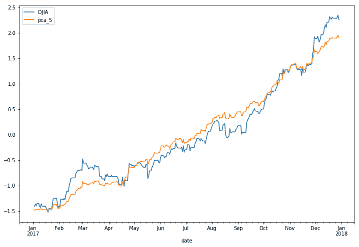

上图显示了 2017 年原始道琼斯指数与重建的道琼斯指数的对比情况，其中包括五个主要成分。

# 平稳和非平稳时间序列

重要的是，用于统计分析的时间序列数据是平稳的，以便正确执行统计建模，因为这种用法可能用于预测和预测。本节介绍时间序列数据中平稳性和非平稳性的概念。

# 平稳性与非平稳性

在实证时间序列研究中，观察到价格运动向某个长期平均值漂移，或向上或向下。平稳时间序列是指其统计特性（如均值、方差和自相关）随时间保持不变的时间序列。相反，非平稳时间序列数据的观测值的统计特性会随时间而变化，这很可能是由于趋势、季节性、单位根的存在或这三者的组合。

在时间序列分析中，假设基础过程的数据是平稳的。否则，从非平稳数据建模可能会产生不可预测的结果。这将导致一种被称为虚假回归的情况。**虚假回归**是一种对独立非平稳变量之间的关系产生误导性统计证据的回归。为了得到一致可靠的结果，需要将非平稳数据转换为平稳数据。

# 检查平稳性

检查时间序列数据是平稳的还是非平稳的方法有很多：

*   **通过可视化**：您可以查看时间序列图，查看趋势或季节性的明显指示。
*   **通过统计汇总**：您可以查看您的数据显著差异的统计汇总。例如，您可以对时间序列数据进行分区，并比较各组的均值和方差。
*   **通过统计测试**：您可以使用统计测试，如增强的 Dickey Fuller 测试来检查是否满足或违反了平稳性预期。

# 非平稳过程的类型

以下几点有助于识别时间序列数据中的非平稳行为，以便在转换平稳数据时加以考虑：

*   **纯随机游动**：具有单位根或随机趋势的过程。这是一个非均值回复过程，其方差随时间演化并趋于无穷大。
*   **带漂移的随机游动**：具有随机游动和恒定漂移的过程。
*   **确定性趋势**：具有围绕固定趋势增长的平均值的过程，该趋势是恒定的，与时间无关。
*   **具有漂移和确定性趋势的随机游动**：将随机游动与漂移分量和确定性趋势相结合的过程。

# 平稳过程的类型

在时间序列研究中，您可能会遇到一些平稳性的定义：

*   **平稳过程**：产生一系列平稳观测值的过程。
*   **趋势平稳**：一个不显示趋势的过程。
*   **季节性平稳**：不表现季节性的过程。
*   **严格静止**：也称为**强静止**。随机变量的无条件联合概率分布在时间（或沿*x*轴）移动时不会改变的过程。
*   **弱平稳**：又称**协方差平稳**或**二阶平稳**。一种过程，其随机变量的均值、方差和相关性随着时间的推移而不变。

# 扩充 Dickey-Fuller 检验

**增广 Dickey-Fuller 检验**（**ADF**是一种统计检验，用于确定时间序列数据中是否存在单位根。在时间序列分析中，单位根可能导致不可预测的结果。在单位根检验上形成一个零假设，以确定时间序列数据受趋势影响的程度。通过接受零假设，我们接受了时间序列数据是非平稳的证据。通过拒绝无效假设或接受替代假设，我们接受了时间序列数据由平稳过程生成的证据。这个过程也称为**趋势平稳。**ADF 检验统计值为负值。ADF 值越低，表明对无效假设的拒绝越强烈。

以下是一些用于 ADF 测试的基本自回归模型：

*   没有常数也没有趋势：


*   没有趋势的常数：

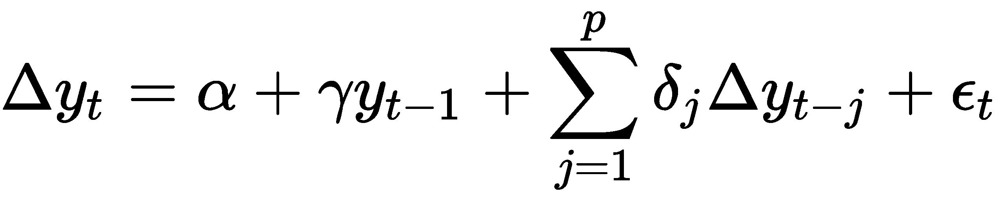

*   随着一个不断变化的趋势：

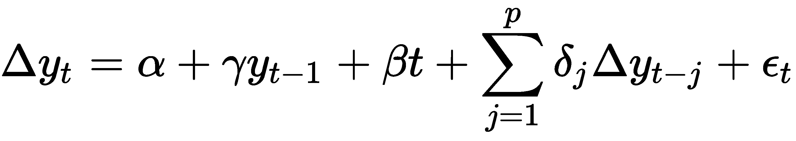

这里，*α*是漂移常数，*β*是时间趋势上的系数，*γ*是我们假设的系数，*p*是第一个差分自回归过程的滞后顺序，*ϵ<sub>t</sub>*是一个独立且分布相同的残差项。当*α=0*和*β=0*时，模型为随机游走过程。当*β=0*时，模型为随机游动，具有漂移过程。应选择滞后时间*p*的长度，以便残差不连续相关。检查选择滞后的信息标准的一些方法是通过最小化**Akaike 信息标准**（**AIC**）、**贝叶斯信息标准**（**BIC**）和**Hannan Quinn 信息标准**。

该假设可表述如下：

*   无效假设，*H<sub>0</sub>*：如果拒绝失败，则表示时间序列包含单位根，是非平稳的
*   替代假设，*H<sub>1</sub>*：如果*H<sub>0</sub>*被拒绝，则表明时间序列不包含单位根，是平稳的

为了接受或拒绝无效假设，我们使用 p 值。如果 p 值低于阈值（如 5%甚至 1%），我们拒绝零假设。如果 p 值高于这个阈值，我们将不能拒绝零假设，并将时间序列看作非平稳的。换句话说，如果我们的阈值为 5%或 0.05，请注意以下几点：

*   p 值>0.05：我们未能拒绝无效假设*H<sub>0</sub>*，并得出数据有单位根且非平稳的结论
*   p 值≤ 0.05：我们拒绝了无效假设*H<sub>0</sub>*，得出数据有单位根且非平稳的结论

`statsmodels`库提供实现此测试的`adfuller()`函数。

# 用趋势分析时间序列

让我们检查一个时间序列数据集。以芝加哥商品交易所交易的黄金期货价格为例。在 Quandl 上，可下载黄金期货连续合约，代码如下：`CHRIS/CME_GC1`。该数据由 Wiki 连续期货社区组管理，仅考虑前一个月的合同。数据集的第六列包含结算价格。以下代码下载 2000 年以后的数据集：

```py
In [ ]:
    import quandl

    QUANDL_API_KEY = 'BCzkk3NDWt7H9yjzx-DY'  # Your Quandl key here
    quandl.ApiConfig.api_key = QUANDL_API_KEY

    df = quandl.get(
        'CHRIS/CME_GC1', 
        column_index=6,
        collapse='monthly',
        start_date='2000-01-01')
```

使用以下命令检查数据集的头部：

```py
In [ ]:
    df.head()
```

我们得到下表：

| 

**结算**

 | 

**日期**

 |
| --- | --- |
| 

**2000-01-31**

 | 283.2 |
| 

**2000-02-29**

 | 294.2 |
| 

**2000-03-31**

 | 278.4 |
| 

**2000-04-30**

 | 274.7 |
| 

**2000-05-31**

 | 271.7 |

分别计算`df_mean`和`df_std`变量的滚动平均值和标准偏差，窗口期为一年：

```py
In [ ] :
    df_settle = df['Settle'].resample('MS').ffill().dropna()

    df_rolling = df_settle.rolling(12)
    df_mean = df_rolling.mean()
    df_std = df_rolling.std()
```

`resample()`方法有助于确保每月平滑数据，`ffill()`方法向前填充任何缺失值。

A list of useful common time series frequencies for specifying the `resample()` method can be found at [http://pandas.pydata.org/pandas-docs/stable/timeseries.html#offset-aliases](http://pandas.pydata.org/pandas-docs/stable/user_guide/timeseries.html)[.](http://pandas.pydata.org/pandas-docs/stable/timeseries.offset-aliases)

让我们将滚动平均值与原始时间序列的曲线图形象化：

```py
In [ ] :
    plt.figure(figsize=(12, 8))
    plt.plot(df_settle, label='Original')
    plt.plot(df_mean, label='Mean')
    plt.legend();
```

我们获得以下输出：

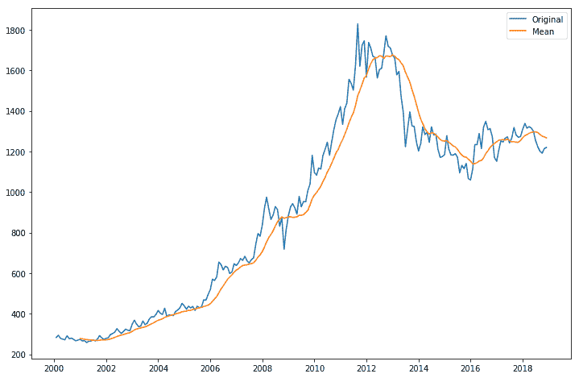

单独可视化滚动标准偏差，我们得到以下结果：

```py
In [ ] :
    df_std.plot(figsize=(12, 8));
```

我们获得以下输出：

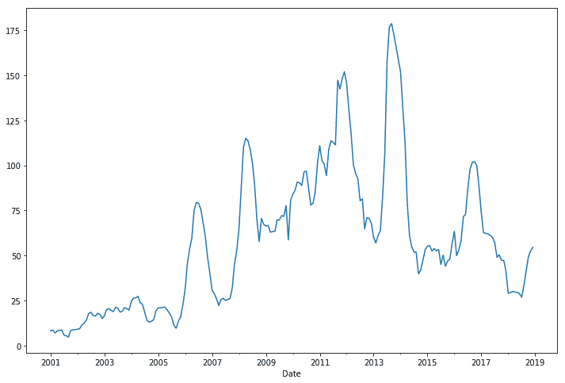

使用`statsmodels`模块，使用`adfuller()`方法对我们的数据集执行 ADF 单位根测试：

```py
In [ ]:
    from statsmodels.tsa.stattools import adfuller

    result = adfuller(df_settle)
    print('ADF statistic: ',  result[0])
    print('p-value:', result[1])

    critical_values = result[4]
    for key, value in critical_values.items():
        print('Critical value (%s): %.3f' % (key, value))
Out[ ]:
    ADF statistic:  -1.4017828015895548
    p-value: 0.5814211232134314
    Critical value (1%): -3.461
    Critical value (5%): -2.875
    Critical value (10%): -2.574
```

`adfuller()`方法返回七个值的元组。特别是，我们对第一个、第二个和第五个值感兴趣，它们分别为我们提供了检验统计量`p-value`和临界值字典。

从图中观察，平均值和标准偏差随时间变化，平均值呈现总体上升趋势。ADF 检验统计值大于临界值（尤其是 5%），且`p-value`大于 0.05。有了这些，我们不能拒绝有单位根的零假设，并认为我们的数据是非平稳的。

# 使时间序列平稳

非平稳时间序列数据可能会受到趋势或季节性的影响。趋势时间序列数据的平均值随时间变化不是常数。受季节性影响的数据在特定的时间间隔内会发生变化。在使时间序列数据保持平稳时，必须消除趋势和季节性影响。去趋势、差分和分解就是这样的方法。由此产生的平稳数据适用于统计预测。

让我们详细看看这三种方法。

# 厌恶

从非平稳数据中删除趋势线的过程称为**去趋势化**。这涉及到将大值规范化为小值的转换步骤。例如，可以是对数函数、平方根函数，甚至是立方根。下一步是从移动平均值中减去变换。

让我们在同一个数据集`df_settle`上执行 detrending，使用对数变换并从两个时段的移动平均值中减去，如以下 Python 代码所示：

```py
In [ ]:
    import numpy as np

    df_log = np.log(df_settle)
In [ ]:
    df_log_ma= df_log.rolling(2).mean()
    df_detrend = df_log - df_log_ma
    df_detrend.dropna(inplace=True)

    # Mean and standard deviation of detrended data
    df_detrend_rolling = df_detrend.rolling(12)
    df_detrend_ma = df_detrend_rolling.mean()
    df_detrend_std = df_detrend_rolling.std()

    # Plot
    plt.figure(figsize=(12, 8))
    plt.plot(df_detrend, label='Detrended')
    plt.plot(df_detrend_ma, label='Mean')
    plt.plot(df_detrend_std, label='Std')
    plt.legend(loc='upper right');

```

`df_log`变量是我们使用`numpy`模块通过对数函数转换的`pandas`数据帧，`df_detrend`变量包含去趋势数据。我们绘制该去趋势数据，以可视化其一年滚动期间的平均值和标准偏差。

我们得到以下输出：


观察平均值和标准偏差不会呈现长期趋势。

查看去趋势数据的 ADF 测试统计，我们得到以下结果：

```py
In [ ]:
    from statsmodels.tsa.stattools import adfuller

    result = adfuller(df_detrend)
    print('ADF statistic: ', result[0])
    print('p-value: %.5f' % result[1])

    critical_values = result[4]
    for key, value in critical_values.items():
        print('Critical value (%s): %.3f' % (key, value))
Out[ ]:
    ADF statistic:  -17.04239232215001
    p-value: 0.00000
    Critical value (1%): -3.460
    Critical value (5%): -2.874
    Critical value (10%): -2.574
```

该去趋势数据的`p-value`小于 0.05。我们的 ADF 测试统计值低于所有临界值。我们可以拒绝零假设，说这些数据是平稳的。

# 用差分法消除趋势

差分包括时间序列值的差分和时滞。时间序列的一阶差由以下公式给出：


我们可以重用上一节中的`df_log`变量作为对数转换的时间序列，并在我们的差分中使用 NumPy 模块的`diff()`和`shift()`方法，代码如下：

```py
In [ ]:
    df_log_diff = df_log.diff(periods=3).dropna()

    # Mean and standard deviation of differenced data
    df_diff_rolling = df_log_diff.rolling(12)
    df_diff_ma = df_diff_rolling.mean()
    df_diff_std = df_diff_rolling.std()

    # Plot the stationary data
    plt.figure(figsize=(12, 8))
    plt.plot(df_log_diff, label='Differenced')
    plt.plot(df_diff_ma, label='Mean')
    plt.plot(df_diff_std, label='Std')
    plt.legend(loc='upper right');
```

`diff()`参数为`periods=3`表示数据集在计算差异时移动了三个周期。

这将提供以下输出：

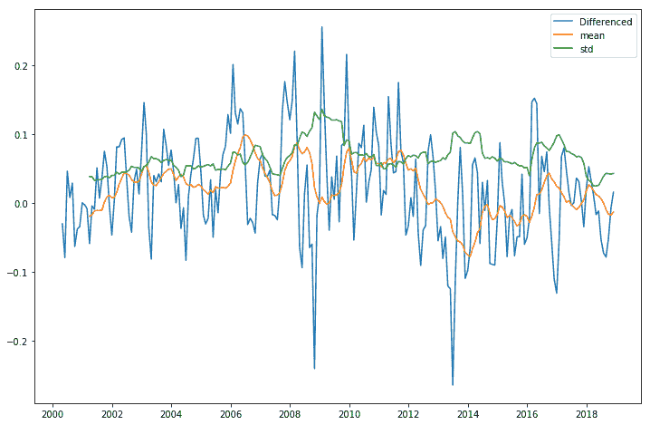

从曲线图中观察到，滚动平均值和标准偏差随时间变化很小。

查看我们的 ADF 测试统计数据，我们得到以下结果：

```py
In [ ]:
    from statsmodels.tsa.stattools import adfuller

    result = adfuller(df_log_diff)

    print('ADF statistic:', result[0])
    print('p-value: %.5f' % result[1])

    critical_values = result[4]
    for key, value in critical_values.items():
        print('Critical value (%s): %.3f' % (key, value))
Out[ ]:
    ADF statistic: -2.931684356800213
    p-value: 0.04179
    Critical value (1%): -3.462
    Critical value (5%): -2.875
    Critical value (10%): -2.574
```

根据 ADF 测试，该数据的`p-value`小于 0.05。我们的 ADF 检验统计值低于 5%的临界值，表明该数据为平稳数据的 95%置信水平。我们可以拒绝零假设，说这些数据是平稳的。

# 季节性分解

分解包括对趋势和季节性进行建模，然后将其删除。我们可以使用`statsmodel.tsa.seasonal`模块使用移动平均对非平稳时间序列数据集进行建模，并去除其趋势和季节成分。

通过重用包含上一节数据集对数的`df_log`变量，我们得到以下结果：

```py
In [ ]:
    from statsmodels.tsa.seasonal import seasonal_decompose

    decompose_result = seasonal_decompose(df_log.dropna(), freq=12)

    df_trend = decompose_result.trend
    df_season = decompose_result.seasonal
    df_residual = decompose_result.resid
```

`statsmodels.tsa.seasonal`的`seasonal_decompose()`方法需要一个参数`freq`，该参数是一个整数值，指定每个季节周期的周期数。由于我们使用的是月度数据，因此我们预计一个季节性年份有 12 个时段。该方法返回一个具有三个属性的对象，主要是趋势和季节性成分，以及最终的`pandas`系列数据，其中趋势和季节性成分被删除。

More information on the `seasonal_decompose()` method of the `statsmodels.tsa.seasonal` module can be found at [https://www.statsmodels.org/dev/generated/statsmodels.tsa.seasonal.seasonal_decompose.html](https://www.statsmodels.org/dev/generated/statsmodels.tsa.seasonal.seasonal_decompose.html).

让我们通过运行以下 Python 代码来可视化不同的绘图：

```py
In [ ]:
    plt.rcParams['figure.figsize'] = (12, 8)
    fig = decompose_result.plot()
```

我们得到以下图表：

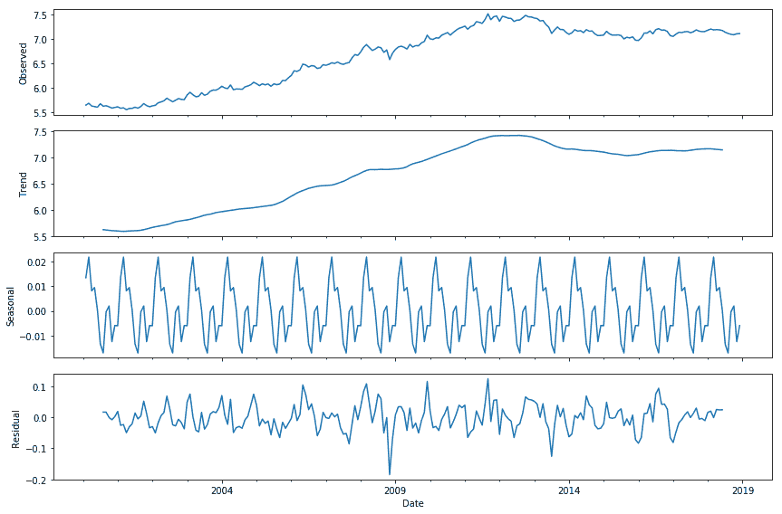

在这里，我们可以看到从数据集中删除并绘制的单个趋势和季节性成分，以及底部绘制的残差。让我们想象一下残差的统计特性：

```py
In [ ]:
    df_log_diff = df_residual.diff().dropna()

    # Mean and standard deviation of differenced data
    df_diff_rolling = df_log_diff.rolling(12)
    df_diff_ma = df_diff_rolling.mean()
    df_diff_std = df_diff_rolling.std()

    # Plot the stationary data
    plt.figure(figsize=(12, 8))
    plt.plot(df_log_diff, label='Differenced')
    plt.plot(df_diff_ma, label='Mean')
    plt.plot(df_diff_std, label='Std')
    plt.legend();
```

我们得到以下图表：

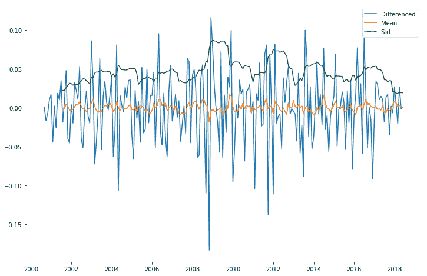

从曲线图中观察到，滚动平均值和标准偏差随时间变化很小。

通过检查剩余数据的平稳性，我们得到以下结果：

```py
In [ ]:
    from statsmodels.tsa.stattools import adfuller    

    result = adfuller(df_residual.dropna())

    print('ADF statistic:',  result[0])
    print('p-value: %.5f' % result[1])

    critical_values = result[4]
    for key, value in critical_values.items():
        print('Critical value (%s): %.3f' % (key, value))
Out[ ]:
    ADF statistic: -6.468683205304995
    p-value: 0.00000
    Critical value (1%): -3.463
    Critical value (5%): -2.876
    Critical value (10%): -2.574
```

根据 ADF 测试，该数据的`p-value`小于 0.05。我们的 ADF 测试统计值低于所有临界值。我们可以拒绝零假设，说这些数据是平稳的。

# ADF 测试的缺陷

以下是使用 ADF 测试可靠检查非平稳数据时的一些注意事项：

*   ADF 测试不能真正区分纯根生成过程和非单位根生成过程。在长期移动平均过程中，ADF 检验在拒绝无效假设方面变得有偏差。其他平稳性测试方法，如**Kwiatkowski–Phillips–Schmidt–Shin**（**KPSS**）测试和**Phillips Perron**测试，在处理单位根的存在时采用了不同的方法。
*   确定滞后长度*p*没有固定的方法。如果*p*太小，误差中剩余的序列相关性可能会影响测试的大小。如果*p*太大，测试的功率会下降。对于该滞后顺序，应给予额外考虑。
*   当确定性项添加到测试回归中时，单位根测试的威力会减弱。

# 预测和预测时间序列

在上一节中，我们确定了时间序列数据中的非平稳性，并讨论了使时间序列数据平稳的技术。对于平稳数据，我们可以继续执行统计建模，如预测和预测。预测涉及生成样本内数据的最佳估计。预测包括生成样本外数据的最佳估计。预测未来价值是基于以前观察到的价值。其中一种常用的方法是自回归综合移动平均法。

# 关于自回归积分移动平均

**自回归综合移动平均**（**ARIMA**是一种基于线性回归的平稳时间序列预测模型。顾名思义，它基于三个组成部分：

*   **自回归**（**AR**）：使用观测值与其滞后值之间的相关性的模型
*   **集成**（**I**）：在使时间序列平稳时，使用将观测值与先前时间戳的观测值进行差分的方法
*   **移动平均****MA**：一种利用观测误差项与先前误差项组合*e*<sub>*t*</sub>之间的相关性的模型

ARIMA 模型由符号*ARIMA（p，d，q）*引用，该符号对应于三个组件的参数。非季节性 ARIMA 模型可以通过改变*p*、*d*和*q*的值来指定，如下所示：

*   **ARIMA*****p*、0,0**：一阶自回归模型，以*AR（p】*表示。*p*为滞后顺序，表示模型中滞后观测的数量。例如，*ARIMA（2,0,0）*为*AR（2）*，表示如下：


此处，*ν<sub>1</sub>*和*П<sub>2</sub>*是模型的参数。

*   **ARIMA**（**0、*d*、0**：积分分量的一阶差分，也称为随机游动，以*I（d）*表示。*d*是差异程度，表示数据减去过去值的次数。例如，*ARIMA（0,1,0）*为*I（1）*，表示如下：

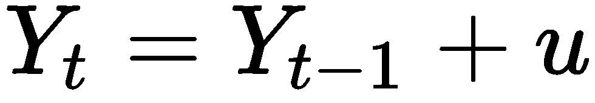

这里，*μ*是季节差异的平均值。

*   **ARIMA（0,0，*q***：移动平均分量，以*MA（q）*表示。*q*顺序决定了模型中包含的术语数量：


# 用网格搜索法寻找模型参数

网格搜索，也称为超参数优化方法，可用于迭代探索用于拟合 ARIMA 模型的不同参数组合。我们可以在每次迭代中使用`statsmodels`模块的`SARIMAX()`函数拟合季节性 ARIMA 模型，返回`MLEResults`类的对象。`MLEResults`对象具有用于返回 AIC 值的`aic`属性。AIC 值最低的模型为我们提供了确定我们的参数*p*、*d*和*q*的最佳拟合模型。有关 SARIMAX 的更多信息，请访问[https://www.statsmodels.org/dev/generated/statsmodels.tsa.statespace.sarimax.SARIMAX.html](https://www.statsmodels.org/dev/generated/statsmodels.tsa.statespace.sarimax.SARIMAX.html) 。

我们将网格搜索过程定义为`arima_grid_search()`函数，如下所示：

```py
In [ ]:
    import itertools    
    import warnings
    from statsmodels.tsa.statespace.sarimax import SARIMAX

    warnings.filterwarnings("ignore")

    def arima_grid_search(dataframe, s):
        p = d = q = range(2)
        param_combinations = list(itertools.product(p, d, q))
        lowest_aic, pdq, pdqs = None, None, None
        total_iterations = 0
        for order in param_combinations:    
            for (p, q, d) in param_combinations:
                seasonal_order = (p, q, d, s)
                total_iterations += 1
                try:
                    model = SARIMAX(df_settle, order=order, 
                        seasonal_order=seasonal_order, 
                        enforce_stationarity=False,
                        enforce_invertibility=False,
                        disp=False
                    )
                    model_result = model.fit(maxiter=200, disp=False)

                    if not lowest_aic or model_result.aic < lowest_aic:
                        lowest_aic = model_result.aic
                        pdq, pdqs = order, seasonal_order

                except Exception as ex:
                    continue

        return lowest_aic, pdq, pdqs 
```

我们的变量`df_settle`保存我们在上一节中下载的期货数据的每月价格。在**SARIMAX（季节性自回归综合移动平均与外生回归模型）**函数中，我们提供了`seasonal_order`参数，即*ARIMA（p，d，q，s）*季节成分，其中*s*是数据集一个季节的周期数。由于我们使用的是月度数据，因此我们使用 12 个周期来定义季节模式。`enforce_stationarity=False`参数不转换 AR 参数以增强模型 AR 分量的平稳性。`enforce_invertibility=False`参数不会转换 MA 参数以强制模型 MA 组件的可逆性。`disp=False`参数在拟合我们的模型时会抑制输出信息。

定义了网格函数后，我们现在可以使用月度数据调用该函数，并打印出 AIC 值最低的模型参数：

```py
In [ ]:
    lowest_aic, order, seasonal_order = arima_grid_search(df_settle, 12)
In [ ]:
    print('ARIMA{}x{}'.format(order, seasonal_order))
    print('Lowest AIC: %.3f'%lowest_aic)
Out[ ]:
    ARIMA(0, 1, 1)x(0, 1, 1, 12)
    Lowest AIC: 2149.636
```

一个`ARIMA(0,1,1,12)`季节性成分模型将给出最低的 AIC 值 2149.636。在下一节中，我们将使用这些参数来拟合我们的 SARIMAX 模型。

# 拟合 SARIMAX 模型

获得最佳模型参数后，使用拟合结果上的`summary()`方法检查模型属性，以查看详细的统计信息：

```py
In [ ]:
    model = SARIMAX(
        df_settle,
        order=order,
        seasonal_order=seasonal_order,
        enforce_stationarity=False,
        enforce_invertibility=False,
        disp=False
    )

    model_results = model.fit(maxiter=200, disp=False)
    print(model_results.summary())
```

这为我们提供了以下输出：

```py
                                 Statespace Model Results                                 
==========================================================================================
Dep. Variable:                             Settle   No. Observations:                  226
Model:             SARIMAX(0, 1, 1)x(0, 1, 1, 12)   Log Likelihood               -1087.247
Date:                            Sun, 02 Dec 2018   AIC                           2180.495
Time:                                    17:38:32   BIC                           2190.375
Sample:                                02-01-2000   HQIC                          2184.494
                                     - 11-01-2018                                         
Covariance Type:                              opg                                         
==============================================================================
                 coef    std err          z      P>|z|      [0.025      0.975]
------------------------------------------------------------------------------
ma.L1         -0.1716      0.044     -3.872      0.000      -0.258      -0.085
ma.S.L12      -1.0000    447.710     -0.002      0.998    -878.496     876.496
sigma2      2854.6342   1.28e+06      0.002      0.998    -2.5e+06    2.51e+06
===================================================================================
Ljung-Box (Q):                       67.93   Jarque-Bera (JB):                52.74
Prob(Q):                              0.00   Prob(JB):                         0.00
Heteroskedasticity (H):               6.98   Skew:                            -0.34
Prob(H) (two-sided):                  0.00   Kurtosis:                         5.43
===================================================================================

Warnings:
[1] Covariance matrix calculated using the outer product of gradients (complex-step).
```

运行模型诊断以调查是否违反了模型假设非常重要：

```py
In [ ]:
    model_results.plot_diagnostics(figsize=(12, 8));
```

我们得到以下输出：

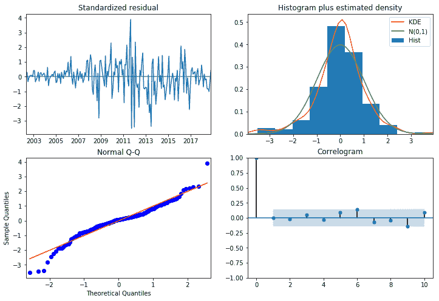

右上角的图显示了标准化残差的**核密度估计**（**KDE**），这表明误差为高斯分布，平均值接近于零。让我们来看看更精确的残差统计：

```py
In [ ] :
    model_results.resid.describe()
Out[ ]:
   count    223.000000
    mean       0.353088
    std       57.734027
    min     -196.799109
    25%      -22.036234
    50%        3.500942
    75%       22.872743
    max      283.200000
    dtype: float64
```

从残差的描述来看，非零均值表明预测可能存在正偏差。

# SARIMAX 模型的预测与预测

`model_results`变量是`statsmodel`模块的`SARIMAXResults`对象，代表 SARIMAX 模型的输出。它包含用于执行样本内预测和样本外预测的`get_prediction()`方法。它还包含一个`conf_int()`方法，该方法返回拟合参数预测的置信区间，包括下限和上限，默认为 95%的置信区间。让我们应用这些方法：

```py
In [ ]:
    n = len(df_settle.index)
    prediction = model_results.get_prediction(
        start=n-12*5, 
        end=n+5
    )
    prediction_ci = prediction.conf_int()
```

`get_prediction()`方法中的`start`参数表示我们正在对最近五年的价格进行样本内预测。同时，通过`end`参数，我们正在对未来五个月进行样本外预测。

通过检查前三个预测置信区间值，我们得到以下结果：

```py
In [ ]:
    print(prediction_ci.head(3))
Out[ ]:
                lower Settle  upper Settle
    2017-09-01   1180.143917   1396.583325
    2017-10-01   1204.307842   1420.747250
    2017-11-01   1176.828881   1393.268289
```

从 2008 年起，让我们根据原始数据集绘制预测和预测价格：

```py
In  [ ]:
    plt.figure(figsize=(12, 6))

    ax = df_settle['2008':].plot(label='actual')
    prediction_ci.plot(
        ax=ax, style=['--', '--'],
        label='predicted/forecasted')

    ci_index = prediction_ci.index
    lower_ci = prediction_ci.iloc[:, 0]
    upper_ci = prediction_ci.iloc[:, 1]

    ax.fill_between(ci_index, lower_ci, upper_ci,
        color='r', alpha=.1)

    ax.set_xlabel('Time (years)')
    ax.set_ylabel('Prices')

    plt.legend()
    plt.show()
```

这为我们提供了以下输出：

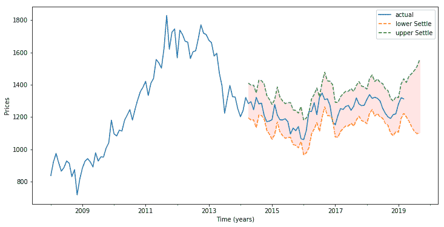

实线图显示了观测值，而虚线图显示了紧随其后的五年滚动预测，并以阴影区域的置信区间为界。请注意，随着未来五个月预测进入未来，信心区间扩大，以反映前景的不确定性。

# 总结

在本章中，我们介绍了 PCA 作为投资组合建模中的降维技术。通过将投资组合的资产价格运动分解为其主成分或公共因素，可以保留最有用的因素，并且可以在不牺牲计算时间和空间复杂性的情况下大大简化投资组合分析。在使用`sklearn.decomposition`模块的`KernelPCA`函数将主成分分析应用于道琼斯指数及其 30 个分量时，我们获得了特征向量和特征值，我们用这些特征向量和特征值重构了道琼斯指数的 5 个分量。

在时间序列数据的统计分析中，数据被认为是平稳的或非平稳的。平稳时间序列数据是统计特性随时间变化而保持不变的数据。非平稳时间序列数据的统计特性随时间而变化，很可能是由于趋势、季节性、单位根的存在或三者的组合。从非平稳数据建模可能会产生虚假回归。为了得到一致可靠的结果，需要将非平稳数据转换为平稳数据。

我们使用统计测试（如 ADF）来检查是否满足或违反了静态预期。`statsmodels.tsa.stattools`模块的`adfuller`方法提供了检验统计量、p 值和临界值，从中我们无法拒绝数据具有单位根且非平稳的无效假设。

我们通过去趋势、差分和季节分解将非平稳数据转换为平稳数据。通过使用 ARIMA，我们使用`statsmodels.tsa.statespace.sarimax`模块的`SARIMAX`函数拟合模型，通过迭代网格搜索程序找到合适的模型参数，给出最低 AIC 值。拟合结果用于预测和预测。

在下一章中，我们将使用 VIX 进行交互式金融分析。

# 第 3 节：实践方法

在本节中，我们将应用[第 1 节](sec1.html)*中涵盖的理论概念，从 Python*和[第 2 节](sec2.html)、*金融概念*开始构建功能齐全的工作系统。

本节将包含以下章节：

*   [第 7 章](07.html)*与 VIX 互动金融分析*
*   [第 8 章](08.html)*搭建算法交易平台*
*   [第 9 章](09.html)*实施回溯测试系统*
*   [第 10 章](10.html)、*金融机器学习*
*   [第 11 章](11.html)*金融深度学习*