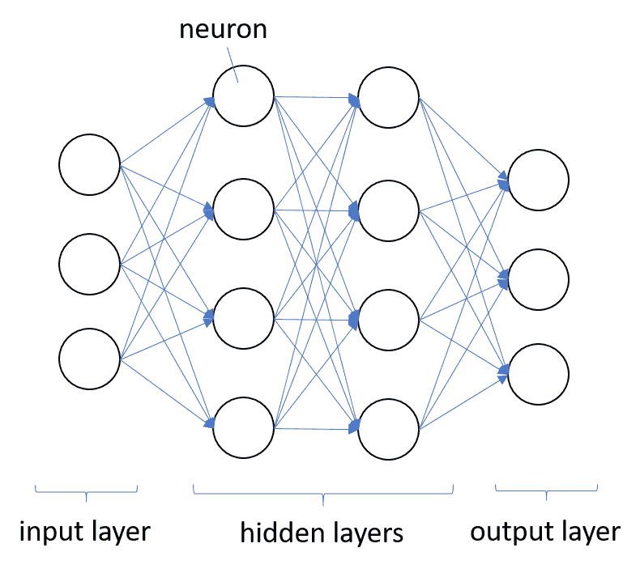
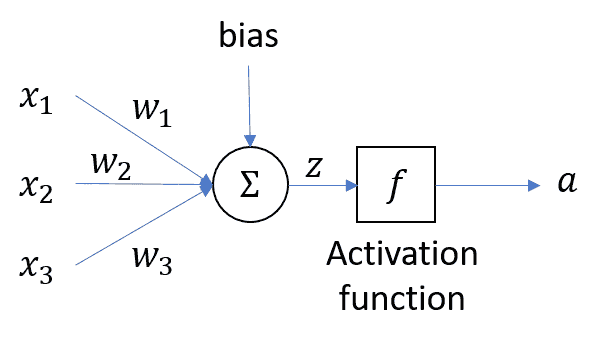
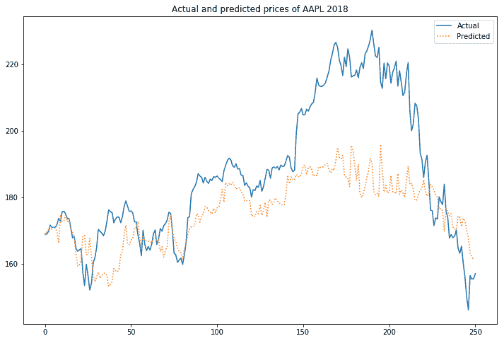
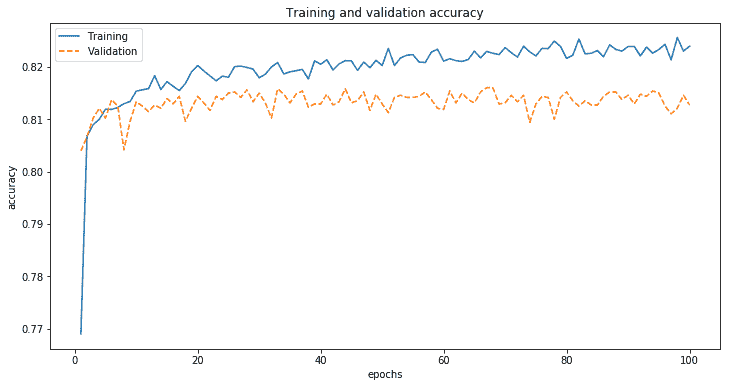

# 十一、金融深度学习

深度学习代表了**人工智能**（**人工智能**的最前沿。与机器学习不同，深度学习采用不同的方法通过使用神经网络进行预测。人工神经网络以人类神经系统为模型，由输入层和输出层组成，中间有一个或多个隐藏层。每一层由并行工作的人工神经元组成，并将输出作为输入传递给下一层。深度学习中的*deep*一词来源于这样一个概念，即当数据通过人工神经网络中更多的隐藏层时，可以提取出更复杂的特征。

**TensorFlow**是谷歌开发的开源、强大的机器学习和深度学习框架。在本章中，我们将通过构建一个具有四个隐藏层的深度学习模型来预测证券的价格，从而采用实际操作的方法来学习 TensorFlow。深度学习模型通过网络前后传递整个数据集进行训练，每次迭代称为一个**历元**。由于输入数据可能太大而无法输入，因此可以成批进行训练，此过程称为**小批量训练**。

另一个流行深度学习 lib 库是 KLAS，它使用 TysFooad 作为后端。我们还将采取实际操作的方法来学习 KERA，并了解构建一个深度学习模型来预测信用卡支付违约是多么容易。

在本章中，我们将介绍以下主题：

*   神经网络简介
*   神经元、激活函数、损失函数和优化器
*   不同类型的神经网络结构
*   如何利用 TensorFlow 构建证券价格预测深度学习模型
*   Keras，一个用户友好的深度学习框架
*   如何利用 Keras 构建信用卡支付违约预测深度学习模型
*   如何在 Keras 历史记录中显示记录的事件

# 深度学习简介

深度学习背后的理论早在 20 世纪 40 年代就开始了。然而，由于计算硬件技术的改进、更智能的算法和深度学习框架的采用，近年来它的普及率猛增。除了这本书之外，还有很多东西要写。本节提供了一个快速指南，帮助您了解以下示例的工作知识，我们将在本章后面部分介绍这些示例。

# 什么是深度学习？

在[第 10 章](10.html)*金融机器学习*中，我们了解了机器学习如何有助于预测。监督学习使用误差最小化技术使模型与训练数据相匹配，可以基于回归或基于分类。

深度学习采用不同的方法，通过使用神经网络进行预测。以人脑和神经系统为模型，人工神经网络由层次结构组成，每一层由许多称为神经元的简单单元组成，并行工作，将输入数据转换为抽象表示形式作为输出数据，作为输入输入输入到下一层。下图说明了人工神经网络：



人工神经网络由三种类型的层组成。接受输入的第一层称为**输入层**。收集输出的最后一层称为**输出层**。输入层和输出层之间的层称为**隐藏层**，因为它们对网络接口是隐藏的。可以有许多隐藏层的组合执行不同的激活功能。自然，更复杂的计算会导致对更强大机器的需求增加，例如计算这些机器所需的 GPU。

# 人工神经元

人工神经元接收一个或多个输入，然后乘以称为**权重**的值，求和并传递给激活函数。由激活函数计算的最终值构成神经元的输出。偏差值可包括在求和项中，以帮助拟合数据。下图显示了一个人工神经元：



求和项可以写成如下线性方程：*Z=x<sub>1</sub>w<sub>1</sub>+x<sub>2</sub>w<sub>2</sub>+…+b。*神经元使用非线性激活函数*f*将输入转换为输出，可以写成。

# 激活函数

激活函数是人工神经元的一部分，它将加权输入的总和转换为下一层的另一个值。通常，此输出值的范围为-1 或 0 到 1。人工神经元在将非零值传递给另一个神经元时被激活。有几种类型的激活功能，主要有：

*   线性的
*   乙状结肠
*   谭
*   深褐色
*   整流线性单元
*   漏泄雷卢
*   Softplus

例如，一个**整流线性单元**（**ReLU**函数被写为：


只有当输入大于零时，ReLU 才会激活具有相同输入值的节点。研究人员更喜欢使用 ReLU，因为它比乙状结肠激活功能训练得更好。我们将在本章后面部分使用 ReLU。

在另一个示例中，泄漏的 ReLU 写为：


当*x*为零及以下时，泄漏的 ReLU 通过在 0.01 左右有一个小的负斜率来解决时失效的 ReLU 问题。

# 损失函数

损失函数计算模型预测值与实际值之间的误差。误差值越小，模型的预测效果越好。基于回归的模型中使用的一些损失函数包括：

*   **均方误差**（**均方误差**损失
*   **平均绝对误差**（**MAE**损失
*   休伯损失
*   分位数损失

基于分类的模型中使用的一些损失函数包括：

*   焦点损失
*   铰链损耗
*   物流损失
*   指数损失

# 优化器

优化器有助于优化调整模型权重，以最小化损失函数。在深度学习中，您可能会遇到几种类型的优化器：

*   **AdaGrad**（**自适应梯度**）
*   **Adam**（**自适应矩估计**
*   **LBFGS**（**有限内存 Broyden Fletcher Goldfarb Shannon**）
*   **Rprop**（**弹性反向传播**）
*   **RMSprop**（**均方根传播**）
*   **新加坡元**（**随机梯度下降**）

Adam 是一个受欢迎的优化器选择，被视为 RMSprop 和 SGD 的组合，并具有动量。它是一种自适应学习率优化算法，计算不同参数的个体学习率。

# 网络体系结构

神经网络的网络结构定义了它的行为。有多种形式的网络架构可用；其中包括：

*   **感知器****P**
*   **前馈**（**FF**）
*   **深度前馈**（**DFF**）
*   **径向基函数网络**（**RBF**）
*   **递归神经网络**（**RNN**）
*   **长/短期记忆**（**LSTM**）
*   **自动编码器****AE**
*   **霍普菲尔德网络****HN**
*   **玻尔兹曼机器**（**BM**）
*   **生成性对抗网络**（**甘**）

最著名、最容易理解的神经网络是前馈多层神经网络。它可以使用输入层、一个或多个隐藏层和单个输出层来表示任何函数。神经网络列表见[http://www.asimovinstitute.org/neural-network-zoo/](http://www.asimovinstitute.org/neural-network-zoo/) 。

# TensorFlow 和其他深度学习框架

TysFooSt 是一个免费的开源谷歌库，可以在 Python、C++、java、Ru 锈和 Go 中使用。它包含用于训练深度学习模型的各种神经网络。TensorFlow 可以应用于各种场景，如图像分类、恶意软件检测和语音识别。TensorFlow 的官方页面为[https://www.tensorflow.org](https://www.tensorflow.org) 。

业内使用的其他流行的深度学习框架有 Theano、PyTorch、CNTK（Microsoft 认知工具包）、ApacheMXnet 和 Keras。

# 什么是张量？

TensorFlow 中的*张量*表示框架定义并运行涉及张量的计算。张量只不过是一种具有某些变换性质的*n*维向量。无量纲张量是一个标量或数。一维张量是一个向量。二维张量是一个矩阵。张量提供了更自然的数据表示，例如在计算机视觉领域的图像中。

向量空间的基本性质和张量的基本数学性质使它们在物理学和工程学中特别有用。

# 基于 TensorFlow 的深度学习价格预测模型

在本节中，我们将学习如何使用 TensorFlow 作为构建价格预测模型的深入学习框架。从 2013 年到 2017 年的五年定价数据将用于培训我们的深度学习模型。我们将尝试预测 2018 年下一年苹果（AAPL）的价格。

# 特征工程我们的模型

我们数据的每日调整收盘价构成目标变量。定义模型特征的自变量由以下技术指标组成：

*   **相对强度指数**（**相对强度指数**）
*   **威廉姆斯%R**（**WR**）
*   **超级振荡器**（**AO**）
*   **成交量加权平均价格**（**VWAP**）
*   **日均交易量**（**ADTV**）
*   5 日**移动平均线**（**毫安**）
*   15 日移动平均线
*   30 日移动平均线

这为我们的模型提供了八个特性。

# 要求

您应该安装 NumPy、pandas、Jupyter 和 scikit 学习库，如前几章所述。以下各节重点介绍了构建深度学习模型的其他重要要求。

# Intrinio 作为我们的数据提供商

Intrinio（[https://intrinio.com/](https://intrinio.com/) 是一家基于 API 的优质金融数据提供商。我们将使用美国基本面和股票价格订阅，这使我们能够访问美国历史股票价格和经过良好计算的技术指标值。注册帐户后，可以在帐户设置中找到 API 密钥，我们稍后将使用这些密钥。

# TensorFlow 的兼容 Python 环境

在撰写本文时，TensorFlow 的最新稳定版本是 r1.13。此版本与 Python 2.7、3.4、3.5 和 3.6 兼容。由于本书前面几章使用的是 Python3.7，因此我们需要设置一个单独的 Python3.6 环境来运行本章中的示例。virtualenv 工具（[https://virtualenv.pypa.io/ 建议使用](https://virtualenv.pypa.io/)隔离 Python 环境。

# 请求图书馆

`requests`Python 库是帮助我们对 Intrinio API 进行 HTTP 调用所必需的。`requests`的官方网页为[http://docs.python-requests.org/en/master/](http://docs.python-requests.org/en/master/) 。通过在您的终端`pip install requests`中运行此命令来安装`requests`。

# TensorFlow 库

TensorFlow 有许多变体可供安装。您可以在仅 CPU 或 GPU 支持版本、alpha 版本和夜间版本之间进行选择。更多安装说明可在[上找到 https://www.tensorflow.org/install/pip](https://www.tensorflow.org/install/pip) 。至少，以下终端命令安装 TensorFlow 的最新仅 CPU 稳定版本：`pip install tensorflow`。

# 下载数据集

本节介绍从 Intrinio 下载所需价格和技术指标值的步骤。有关 API 调用的全面文档可在[中找到 https://docs.intrinio.com/documentation/api_v2](https://docs.intrinio.com/documentation/api_v2) 。如果决定使用其他数据提供程序，请继续并跳过此部分：

1.  编写一个`query_intrinio()`函数，该函数将对 Intrinio 进行 API 调用，代码如下：

```py
In [ ]:
    import requests

    BASE_URL = 'https://api-v2.intrinio.com'

    # REPLACE YOUR INTRINIO API KEY HERE!
    INTRINIO_API_KEY = 'Ojc3NjkzOGNmNDMxMGFiZWZiMmMxMmY0Yjk3MTQzYjdh'

    def query_intrinio(path, **kwargs):   
        url = '%s%s'%(BASE_URL, path)
        kwargs['api_key'] = INTRINIO_API_KEY
        response = requests.get(url, params=kwargs)

        status_code = response.status_code
        if status_code == 401: 
            raise Exception('API key is invalid!')
        if status_code == 429: 
            raise Exception('Page limit hit! Try again in 1 minute')
        if status_code != 200: 
            raise Exception('Request failed with status %s'%status_code)

        return response.json()
```

此功能接受`path`和`kwargs`参数。`path`参数指的是特定的 Intrinio API 上下文路径。`kwargs`关键字参数是作为请求参数传递给 HTTP GET 请求调用的字典。每次 API 调用时，都会将 API 密钥插入此字典，以标识用户帐户。任何 API 响应均应为 JSON 格式，HTTP 状态代码为 200；否则，将引发异常。

2.  编写`get_technicals()`功能，从 Intrinio 下载技术指标值，代码如下：

```py
In [ ]:
    import pandas as pd
    from pandas.io.json import json_normalize

    def get_technicals(ticker, indicator, **kwargs):    
        url_pattern = '/securities/%s/prices/technicals/%s'
        path = url_pattern%(ticker, indicator)
        json_data = query_intrinio(path, **kwargs)

        df = json_normalize(json_data.get('technicals'))    
        df['date_time'] = pd.to_datetime(df['date_time'])
        df = df.set_index('date_time')
        df.index = df.index.rename('date')
        return df
```

`ticker`和`indicator`参数构成了用于下载安全性特定指示符的 API 上下文路径。响应预计为 JSON 格式，一个名为`technicals`的键包含技术指标值列表。pandas 的`json_normalize()`函数有助于将这些值转换为平面表数据帧对象。需要额外的格式设置日期和时间值作为`date`名称下的索引。

3.  定义请求参数的值：

```py
In [ ]:
    ticker = 'AAPL'
    query_params = {'start_date': '2013-01-01', 'page_size': 365*6}
```

我们将查询 2013 年至 2018 年（含）的证券`AAPL`数据。大的`page_size`值为我们提供了足够的空间，可以在一次查询中请求六年的数据。

4.  以每分钟一次的间隔运行以下命令以下载技术指标数据：

```py
In [ ]:
    df_rsi = get_technicals(ticker, 'rsi', **query_params)
    df_wr = get_technicals(ticker, 'wr', **query_params)
    df_vwap = get_technicals(ticker, 'vwap', **query_params)
    df_adtv = get_technicals(ticker, 'adtv', **query_params)
    df_ao = get_technicals(ticker, 'ao', **query_params)
    df_sma_5d = get_technicals(ticker, 'sma', period=5, **query_params)
    df_sma_5d = df_sma_5d.rename(columns={'sma':'sma_5d'})
    df_sma_15d = get_technicals(ticker, 'sma', period=15, **query_params)
    df_sma_15d = df_sma_15d.rename(columns={'sma':'sma_15d'})
    df_sma_30d = get_technicals(ticker, 'sma', period=30, **query_params)
    df_sma_30d = df_sma_30d.rename(columns={'sma':'sma_30d'})
```

Beware of paging limits when performing Intrinio API queries! API requests with a `page_size` greater than 100 are subjected to a per-minute request limit. If a call fails with status code 429, try again in one minute. Information on Intrinio's limits can be found at [https://docs.intrinio.com/documentation/api_v2/limits](https://docs.intrinio.com/documentation/api_v2/limits).

这给了我们八个变量，每个变量都包含各自技术指标值的 DataFrame 对象。MA 数据列被重命名，以避免以后加入数据时出现命名冲突。

5.  编写`get_prices()`函数下载证券的历史价格：

```py
In [ ]:
    def get_prices(ticker, tag, **params):
        url_pattern = '/securities/%s/historical_data/%s'
        path = url_pattern%(ticker, tag)
        json_data = query_intrinio(path, **params)

        df = json_normalize(json_data.get('historical_data'))    
        df['date'] = pd.to_datetime(df['date'])
        df = df.set_index('date')
        df.index = df.index.rename('date')
        return df.rename(columns={'value':tag})
```

`tag`参数指定要下载的安全性的数据标签。JSON 响应应该包含一个名为`historical_data`的键，其中包含值列表。DataFrame 对象中包含价格的列将从`value`重命名为其数据标签。

The Intrinio data tags are used to download specific values from the system. The list of data tags available with explanations can be found at [https://data.intrinio.com/data-tags/all](https://data.intrinio.com/data-tags/all).

6.  使用`get_prices()`功能，下载调整后的 AAPL 收盘价：

```py
In [ ]:
    df_close = get_prices(ticker, 'adj_close_price', **query_params)
```

7.  由于这些功能用于预测第二天的收盘价，我们需要将价格向后移动一天，以调整此映射。创建目标变量：

```py
In [ ]:
    df_target = df_close.shift(1).dropna()
```

8.  最后，使用`join()`命令将所有 DataFrame 对象组合在一起，并删除空值：

```py
In [ ]:
    df = df_rsi.join(df_wr).join(df_vwap).join(df_adtv)\
         .join(df_ao).join(df_sma_5d).join(df_sma_15d)\
         .join(df_sma_30d).join(df_target).dropna()
```

我们的数据集现在已经准备好，包含在`df`数据框中。我们可以继续分割数据进行训练。

# 缩放和拆分数据

我们有兴趣使用最早五年的定价数据来训练我们的模型，最近一年的 2018 年来测试我们的预测。运行以下代码拆分我们的`df`数据集：

```py
In [ ]:
    df_train = df['2017':'2013']
    df_test = df['2018']
```

`df_train`和`df_test`变量分别包含我们的训练和测试数据。

数据预处理的一个重要步骤是规范化数据集。这将把输入特征值转换为零的平均值和一的方差。标准化有助于避免训练期间由于输入特征的不同尺度而产生的偏差。

`sklearn`模块的`MinMaxScaler`功能有助于将每个特征转换为-1 到 0 之间的范围，代码如下：

```py
In [ ]:
    from sklearn.preprocessing import MinMaxScaler

    scaler = MinMaxScaler(feature_range=(-1, 1))
    train_data = scaler.fit_transform(df_train.values)
    test_data = scaler.transform(df_test.values)
```

`fit_transform()`函数计算用于缩放的参数并转换数据，`transform()`函数仅通过重用计算的参数来转换数据。

接下来，将缩放的训练数据集拆分为独立变量和目标变量。目标值位于最后一列，其余列为特征：

```py
In [ ]:
    x_train = train_data[:, :-1]
    y_train = train_data[:, -1]
```

仅对功能的测试数据执行相同操作：

```py
In [ ]:
    x_test = test_data[:, :-1]
```

准备好训练和测试数据集后，让我们开始使用 TensorFlow 构建人工神经网络。

# 用张量流建立人工神经网络

本节将引导您通过四个隐藏层建立用于深度学习的人工神经网络。涉及两个阶段；首先是组装图形，然后是训练模型。

# 阶段 1–组装图形

以下步骤描述了设置 TensorFlow 图的过程：

1.  使用以下代码为输入和标签创建占位符：

```py
In [ ]:
    import tensorflow as tf

    num_features = x_train.shape[1]

    x = tf.placeholder(dtype=tf.float32, shape=[None, num_features])
    y = tf.placeholder(dtype=tf.float32, shape=[None])
```

TensorFlow 操作以占位符开始。在这里，我们定义了两个占位符`x`和`y`，分别用于包含网络输入和输出。`shape`参数定义了要馈送的张量的形状，`None`表示此时观测的数量未知。`x`的第二个维度是我们拥有的特征数量，反映在`num_features`变量中。稍后，我们将看到，占位符值是使用`feed_dict`命令输入的。

2.  为隐藏层创建权重和偏移初始值设定项。我们的模型将由四个隐藏层组成。第一层包含 512 个神经元，大约是输入大小的三倍。第二、第三和第四层分别包含 256、128 和 64 个神经元。后续层中神经元数量的减少压缩了网络中的信息。

初始化器用于在训练前初始化网络变量。重要的是在优化问题开始时使用适当的初始化，以生成基础问题的良好解决方案。下面的代码演示了方差缩放初始值设定项和零初始值设定项的使用：

```py
In [ ]:
    nl_1, nl_2, nl_3, nl_4 = 512, 256, 128, 64

    wi = tf.contrib.layers.variance_scaling_initializer(
         mode='FAN_AVG', uniform=True, factor=1)
    zi = tf.zeros_initializer()

    # 4 Hidden layers
    wt_hidden_1 = tf.Variable(wi([num_features, nl_1]))
    bias_hidden_1 = tf.Variable(zi([nl_1]))

    wt_hidden_2 = tf.Variable(wi([nl_1, nl_2]))
    bias_hidden_2 = tf.Variable(zi([nl_2]))

    wt_hidden_3 = tf.Variable(wi([nl_2, nl_3]))
    bias_hidden_3 = tf.Variable(zi([nl_3]))

    wt_hidden_4 = tf.Variable(wi([nl_3, nl_4]))
    bias_hidden_4 = tf.Variable(zi([nl_4]))

    # Output layer
    wt_out = tf.Variable(wi([nl_4, 1]))
    bias_out = tf.Variable(zi([1]))
```

除了占位符，TensorFlow 中的变量在图形执行期间也会更新。在这里，变量是训练期间将发生变化的权重和偏差。`variance_scaling_initializer()`命令返回一个初始值设定项，该初始值设定项为权重生成张量，而不产生缩放方差。`FAN_AVG`模式指示初始化器使用输入和输出连接的平均数量，`uniform`参数为`True`使用统一随机初始化，比例因子为 1。这类似于训练 DFF 神经网络。

在我们的模型等**多层感知器**（**MLP**）中，权重层的第一维度与前一权重层的第二维度相同。偏置尺寸对应于电流层中神经元的数量。最后一层的神经元预计只有一个输出。

3.  现在是使用以下代码将占位符输入与四个隐藏层的权重和偏差结合起来的时候了：

```py
In [ ]:
    hidden_1 = tf.nn.relu(
        tf.add(tf.matmul(x, wt_hidden_1), bias_hidden_1))
    hidden_2 = tf.nn.relu(
        tf.add(tf.matmul(hidden_1, wt_hidden_2), bias_hidden_2))
    hidden_3 = tf.nn.relu(
        tf.add(tf.matmul(hidden_2, wt_hidden_3), bias_hidden_3))
    hidden_4 = tf.nn.relu(
        tf.add(tf.matmul(hidden_3, wt_hidden_4), bias_hidden_4))
    out = tf.transpose(tf.add(tf.matmul(hidden_4, wt_out), bias_out))
```

`tf.matmul`命令将输入矩阵和权重矩阵相乘，使用`tf.add`命令将偏差值相加。神经网络的每个隐层都通过一个激活函数进行变换。在这个模型中，我们使用 ReLU 作为使用`tf.nn.relu`命令的所有层的激活函数。每个隐藏层的输出被馈送到下一个隐藏层的输入。最后一层是具有单个矢量输出的输出层，必须使用`tf.transpose`命令进行转置。

4.  指定网络的损耗函数，以测量训练期间预测值和实际值之间的误差。对于基于回归的模型，如我们的模型，通常使用 MSE：

```py
In [ ]:
    mse = tf.reduce_mean(tf.squared_difference(out, y))
```

`tf.squared_difference`命令用于返回预测值和实际值之间的平方误差，`tf.reduce_mean`命令是用于在训练期间最小化平均值的损失函数。

5.  使用以下代码创建优化器：

```py
In [ ]:
    optimizer = tf.train.AdamOptimizer().minimize(mse)
```

在最小化损失函数时，优化器帮助计算训练期间的网络权重和偏差。这里，我们使用默认值的 Adam 算法。随着这一重要步骤的完成，我们现在可以开始培训我们的模型的第二阶段。

# 第 2 阶段-培训我们的模型

以下步骤描述了培训模型的过程：

1.  创建一个 TensorFlow`Session`对象来封装神经网络模型运行的环境：

```py
In [ ]:
    session = tf.InteractiveSession()
```

这里，我们指定了一个在交互上下文中使用的会话，在本例中是一个 Jupyter 笔记本。常规的`tf.Session`是非交互式的，在运行操作时需要使用`with`关键字传递一个显式的`Session`对象。`InteractiveSession`消除了这种需要，并且更方便，因为它重用了`session`变量。

2.  TensorFlow 要求在训练之前初始化所有全局变量。使用`session.run`命令执行此操作：

```py
In [ ]:
    session.run(tf.global_variables_initializer())
```

3.  运行以下代码，使用小批量培训对我们的模型进行培训：

```py
In [ ]:
    from numpy import arange
    from numpy.random import permutation

    BATCH_SIZE = 100
    EPOCHS = 100

    for epoch in range(EPOCHS):
        # Shuffle the training data
        shuffle_data = permutation(arange(len(y_train)))
        x_train = x_train[shuffle_data]
        y_train = y_train[shuffle_data]

        # Mini-batch training
        for i in range(len(y_train)//BATCH_SIZE):
            start = i*BATCH_SIZE
            batch_x = x_train[start:start+BATCH_SIZE]
            batch_y = y_train[start:start+BATCH_SIZE]
            session.run(optimizer, feed_dict={x: batch_x, y: batch_y})
```

历元是整个数据集通过网络前后传递的单个迭代。通常对不同排列的训练数据执行几个历元，以便网络了解其行为。对于一个好的模型来说，没有固定的纪元数，因为它取决于数据的多样性。由于数据集可能太大，无法在一个历元内输入到模型中，因此小批量训练将数据集分成多个部分，并将其输入到`session.run`命令中进行学习。第一个参数指定优化算法实例。`feed_dict`参数提供了一个字典，其中包含分别映射到独立值和目标值批次的`x`和`y`占位符。

4.  在我们的模型经过充分训练后，使用它预测包含以下特征的测试数据：

```py
In [ ]:
    [predicted_values] = session.run(out, feed_dict={x: x_test})
```

调用`session.run`命令时，第一个参数作为输出层转换函数。`feed_dict`参数输入我们的测试数据。输出列表中的第一项被读取为最终输出预测值。

5.  由于预测值也已标准化，我们需要将其缩放回原始值：

```py
In [ ]:
    predicted_scaled_data = test_data.copy()
    predicted_scaled_data[:, -1] = predicted_values
    predicted_values = scaler.inverse_transform(predicted_scaled_data)
```

使用`copy()`命令在新的`predicted_scaled_data `变量上创建初始训练数据的副本。最后一列将替换为我们的预测值。接下来，`inverse_transform()`命令将数据缩放回原始大小，给出预测值，以便与实际观察值进行比较。

# 绘制预测值和实际值

让我们将预测值和实际值绘制到一个图表上，以可视化我们的深度学习模型的性能。运行以下代码以提取我们感兴趣的值：

```py
In [ ]:
    predictions = predicted_values[:, -1][::-1]
    actual = df_close['2018']['adj_close_price'].values[::-1]
```

重新缩放的`predicted_values`数据集是一个 NumPy`ndarray`对象，在最后一列上有预测值。这些值和 2018 年的实际调整收盘价分别被提取到`predictions`和`actual`变量中。由于原始数据集的格式是按时间的降序排列的，因此我们将它们按升序反转，以便在图形上打印。运行以下代码以生成图形：

```py
In [ ]:
    %matplotlib inline 
    import matplotlib.pyplot as plt

    plt.figure(figsize=(12,8))
    plt.title('Actual and predicted prices of AAPL 2018')
    plt.plot(actual, label='Actual')
    plt.plot(predictions, linestyle='dotted', label='Predicted')
    plt.legend()
```

产生以下输出：



实线显示实际调整后的收盘价，虚线显示预测价格。请注意，尽管模型对 2018 年的实际价格一无所知，但我们的预测是如何遵循实际价格的总体趋势的。尽管如此，我们的深度学习预测模型仍有很大的改进空间，例如神经元网络结构、隐藏层、激活函数和初始化方案的设计。

# 基于 Keras 的信用卡支付违约预测

另一个流行的深入学习 Python 库是 Keras。在本节中，我们将使用 Keras 构建信用卡支付违约预测模型，并了解构建具有五个隐藏层的人工神经网络、应用激活函数以及与 TensorFlow 相比对该模型进行训练是多么容易。

# 凯拉斯简介

Keras 是深度学习 lib 库，它设计的是高层次、用户友好、模块化、可扩展的。Keras 被认为是一个界面，而不是一个独立的机器学习框架，运行在 TensorFlow、CNTK 和 Theano 之上。拥有超过 200000 用户的庞大社区基础使其成为最受欢迎的深度学习图书馆之一。

# 安装 Keras

Keras 的官方文件页位于[https://keras.io](https://keras.io) 。安装 Keras 最简单的方法是在终端中运行以下命令：`pip install keras`。默认情况下，Keras 将使用 TensorFlow 作为其 tensor 操作库，不过也可以配置另一个后端实现。

# 获取数据集

我们将使用从 UCI 机器学习库下载的默认信用卡客户数据集（[https://archive.ics.uci.edu/ml/datasets/default+of+信用卡+客户](https://archive.ics.uci.edu/ml/datasets/default+of+credit+card+clients)。资料来源：Yeh，I.C.和 Lien，C.H.*（2009 年）。*数据挖掘技术对信用卡客户违约概率预测准确性的比较。专家系统及其应用，36（2），2473-2480。**

 *此数据集包含台湾的客户默认付款。有关用于数据集中列的命名约定，请参阅网页上的“属性信息”部分。由于原始数据集采用 Microsoft Excel 电子表格 XLS 格式，因此需要额外的数据处理。打开文件并删除包含补充属性信息的第一行和第一列，然后将其另存为 CSV 文件。此文件的副本可在源代码存储库的`files\chapter11\default_cc_clients.csv`中找到。

将此数据集作为名为`df`的新变量的`pandas`数据帧对象读取：

```py
In [ ]:
    import pandas as pd

    df = pd.read_csv('files/chapter11/default_cc_clients.csv')
```

使用`info()`命令检查此数据帧：

```py
In [ ]:
    df.info()
Out[ ]:
    <class 'pandas.core.frame.DataFrame'>
    RangeIndex: 30000 entries, 0 to 29999
    Data columns (total 24 columns):
    LIMIT_BAL                     30000 non-null int64
    SEX                           30000 non-null int64
    EDUCATION                     30000 non-null int64
    MARRIAGE                      30000 non-null int64
    AGE                           30000 non-null int64
    PAY_0                         30000 non-null int64
    ...
    PAY_AMT6                      30000 non-null int64
    default payment next month    30000 non-null int64
    dtypes: int64(24)
    memory usage: 5.5 MB
```

输出被截断，但摘要显示我们有 30000 行信用违约数据，其中包含 23 个特性。目标变量是名为`default payment next month`的最后一列。值为 1 表示出现默认值，否则为 0。

如果您有机会打开 CSV 文件，您会注意到数据集中的所有值都是数字格式，并且性别、教育程度和婚姻状况等值已转换为等效整数，从而省去了额外的数据预处理步骤。如果数据集包含字符串或布尔值，请记住执行标签编码并将其转换为伪值或指示符值。

# 拆分和缩放数据

在将数据集输入模型之前，我们必须以适当的格式准备数据集。以下步骤将指导您完成此过程：

1.  将数据集拆分为独立变量和目标变量：

```py
In [ ]:
    feature_columns= df.columns[:-1]
    features = df.loc[:, feature_columns]
    target = df.loc[:, 'default payment next month']
```

数据集最后一列中的目标值分配给`target`变量，而剩余值是特征值，分配给`features`变量。

2.  将数据集拆分为培训数据和测试数据：

```py
In [ ]:
    from sklearn.model_selection import train_test_split

    train_features, test_features, train_target, test_target = \
        train_test_split(features, target, test_size=0.20, random_state=0)
```

`sklearn`的`train_test_split()`命令有助于将数组或矩阵拆分为随机序列和测试子集。提供的每个非关键字参数都提供一对输入的列车测试分割。在这里，我们将获得两对这样的输入和输出数据。`test_size`参数表示我们将在测试分割中包含 20%的输入。`random_state`参数将随机数生成器设置为零。

3.  将拆分数据转换为 NumPy 数组对象：

```py
In [ ]:
    import numpy as np

    train_x, train_y = np.array(train_features), np.array(train_target)
    test_x, test_y = np.array(test_features), np.array(test_target)
```

4.  最后，通过使用`sklearn`模块的`MinMaxScaler()`缩放特征来标准化数据集：

```py
In [ ]:
    from sklearn.preprocessing import MinMaxScaler

    scaler = MinMaxScaler()
    train_scaled_x = scaler.fit_transform(train_x)
    test_scaled_x = scaler.transform(test_x)
```

与上一节一样，应用了`fit_transform()`和`transform()`命令。但是，这次默认的缩放范围是 0 到 1。准备好数据集后，我们可以开始使用 Keras 设计神经网络。

# 用 Keras 设计五层隐层深度神经网络

Keras 在处理模型时使用层的概念。有两种方法可以做到这一点。最简单的方法是对层的线性堆栈使用序列模型。另一个是用于构建复杂模型（如多输出模型、有向无环图或具有共享层的模型）的函数 API。这意味着可以使用层的张量输出来定义模型，或者模型本身可以成为层：

1.  让我们使用 Keras 库创建一个`Sequential`模型：

```py
In [ ]:
    from keras.models import Sequential
    from keras.layers import Dense
    from keras.layers import Dropout
    from keras.layers.normalization import BatchNormalization

    num_features = train_scaled_x.shape[1]

    model = Sequential()
    model.add(Dense(80, input_dim=num_features, activation='relu'))
    model.add(Dropout(0.2))
    model.add(Dense(80, activation='relu'))
    model.add(Dropout(0.2))
    model.add(Dense(40, activation='relu'))
    model.add(BatchNormalization())
    model.add(Dense(1, activation='sigmoid'))
```

`add()`方法只是将层添加到我们的模型中。第一层和最后一层分别是输入层和输出层。每一个`Dense()`指令都会产生一个规则的密集连接神经元层。在它们之间，使用一个下拉层将输入单位随机设置为零，有助于防止过度拟合。在这里，我们指定辍学率为 20%，尽管通常使用 20%到 50%。

第一个值为 80 的`Dense()`命令参数表示输出空间的维度。可选的`input_dim`参数仅指输入层的特征数量。ReLU 激活功能是为除输出层以外的所有层指定的。就在输出层之前，批处理规范化层将激活平均值转换为零，标准偏差接近一。与最终输出层的 sigmoid 激活函数一起，输出值可以四舍五入到最接近的 0 或 1，满足我们的二元分类解决方案。

2.  `summary()`命令打印模型的摘要：

```py
In [ ]:
    model.summary()
Out[ ]:
    _________________________________________________________________
    Layer (type)                 Output Shape              Param #   
    =================================================================
    dense_17 (Dense)             (None, 80)                1920      
    _________________________________________________________________
    dropout_9 (Dropout)          (None, 80)                0         
    _________________________________________________________________
    dense_18 (Dense)             (None, 80)                6480      
    _________________________________________________________________
    dropout_10 (Dropout)         (None, 80)                0         
    _________________________________________________________________
    dense_19 (Dense)             (None, 40)                3240      
    _________________________________________________________________
    batch_normalization_5 (Batch (None, 40)                160       
    _________________________________________________________________
    dense_20 (Dense)             (None, 1)                 41        
    =================================================================
    Total params: 11,841
    Trainable params: 11,761
    Non-trainable params: 80
    _________________________________________________________________
```

我们可以看到每个层中的输出形状和权重。密集层的参数数量计算为权重矩阵的总数加上偏差矩阵中的元素数量。例如，第一个隐藏层`dense_17`将具有 23×80+80=1920 个参数。

The list of activations available in Keras can be found at [https://keras.io/activations/](https://keras.io/activations/).

3.  使用`compile()`命令配置该模型进行训练：

```py
In [ ]:
    import tensorflow as tf

    model.compile(optimizer=tf.train.AdamOptimizer(), 
                  loss='binary_crossentropy',
                  metrics=['accuracy'])
```

`optimizer`参数指定用于训练模型的优化器。Keras 提供了一些优化器，但是我们可以选择一个自定义优化器实例，使用上一节 TensorFlow 中的 Adam 优化器。选择二元交叉熵计算作为损失函数，因为它适用于我们的二元分类问题。`metrics`参数指定培训和测试期间产生的指标列表。在这里，拟合模型后将产生检索精度。

A list of optimizers available in Keras can be found at [https://keras.io/optimizers/](https://keras.io/optimizers/). A list of loss functions available in Keras can be found at [https://keras.io/losses/](https://keras.io/losses/).

4.  现在是使用带有 100 个时代的`fit()`命令来训练我们的模型的时候了：

```py
In [ ]:
    from keras.callbacks import History 

    callback_history = History()

    model.fit(
        train_scaled_x, train_y,
        validation_split=0.2,
        epochs=100, 
        callbacks=[callback_history]
    )
Out [ ]:
    Train on 19200 samples, validate on 4800 samples
    Epoch 1/100
    19200/19200 [==============================] - 2s 106us/step - loss: 0.4209 - acc: 0.8242 - val_loss: 0.4456 - val_acc: 0.8125        
...
```

当模型为每个历元生成详细的训练更新时，前面的输出被截断。创建一个`History()`对象并将其输入模型的回调中，用于记录训练期间的事件。`fit()`命令允许指定历元数和批大小。`validation_split`参数设置为将 20%的训练数据作为验证数据，在每个历元结束时评估损失和模型度量。

Instead of training the data all at once, you can also train your data in batches. Call the `fit()` command with an `epochs` and `batch_size` parameter, like this: `model.fit(x_train, y_train, epochs=5, batch_size=32)`. You can also train batches manually using the `train_on_batch()` command, like this: `model.train_on_batch(x_batch, y_batch)`.

# 衡量我们模型的性能

使用我们的测试数据，我们可以计算模型的损失和准确性：

```py
In [ ]:
    test_loss, test_acc = model.evaluate(test_scaled_x, test_y)
    print('Test loss:', test_loss)
    print('Test accuracy:', test_acc)
Out[ ]:
    6000/6000 [==============================] - 0s 33us/step
    Test loss: 0.432878403028
    Test accuracy: 0.824166666667
```

我们的模型有 82%的预测准确率。

# 运行风险度量

在[第 10 章](10.html)、*金融机器学习*中，我们讨论了测量基于分类的预测时的混淆矩阵、准确度得分、精确度得分、召回得分和 F1 得分。我们也可以在模型上重用这些度量。

由于模型输出为 0 到 1 之间的标准化十进制格式，我们将其四舍五入到最接近的 0 或 1 整数，以获得预测的二进制分类标签：

```py
In [ ]:
    predictions = model.predict(test_scaled_x)
    pred_values = predictions.round().ravel()
```

`ravel()`命令将结果显示为存储在`pred_values`变量中的单个列表。

计算并显示混淆矩阵：

```py
In [ ]:
    from sklearn.metrics import confusion_matrix

    matrix = confusion_matrix(test_y, pred_values)
In [ ]:
    %matplotlib inline
    import seaborn as sns
    import matplotlib.pyplot as plt

    flags = ['No', 'Yes']
    plt.subplots(figsize=(12,8))
    sns.heatmap(matrix.T, square=True, annot=True, fmt='g', cbar=True,
        cmap=plt.cm.Blues, xticklabels=flags, yticklabels=flags)
    plt.xlabel('Actual')
    plt.ylabel('Predicted')
    plt.title('Credit card payment default prediction');
```

这将产生以下输出：


使用`sklearn`模块打印准确度、精度分数、召回分数、F1 分数：

```py
In [ ]:
    from sklearn.metrics import (
        accuracy_score, precision_score, recall_score, f1_score
    )
    actual, predicted = test_y, pred_values
    print('accuracy_score:', accuracy_score(actual, predicted))
    print('precision_score:', precision_score(actual, predicted))
    print('recall_score:', recall_score(actual, predicted))
    print('f1_score:', f1_score(actual, predicted))    
Out[ ]:
    accuracy_score: 0.818666666667
    precision_score: 0.641025641026
    recall_score: 0.366229760987
    f1_score: 0.466143277723
```

低召回分数和略低于平均水平的 F1 分数暗示我们的车型没有足够的竞争力。也许我们可以在下一节中访问历史度量以了解更多信息。

# 显示 Keras 历史记录中记录的事件

让我们回顾一下`callback_history`变量，它是在`fit()`命令期间填充的`History`对象。`History.history`属性是一个包含四个键的字典，用于存储训练和验证期间的准确性和损失值。这些值表示为每个历元后保存的值列表。将此信息提取到单独的变量中：

```py
In [ ]:
    train_acc = callback_history.history['acc']
    val_acc = callback_history.history['val_acc']
    train_loss = callback_history.history['loss']
    val_loss = callback_history.history['val_loss']
```

用以下代码绘制培训和验证损失：

```py
In [ ]:
    %matplotlib inline
    import matplotlib.pyplot as plt

    epochs = range(1, len(train_acc)+1)

    plt.figure(figsize=(12,6))
    plt.plot(epochs, train_loss, label='Training')
    plt.plot(epochs, val_loss, '--', label='Validation')
    plt.title('Training and validation loss')
    plt.xlabel('epochs')
    plt.ylabel('loss')
    plt.legend();
```

这将生成以下损失图：


实线显示了训练损失随着历元数的增加而减少的路径，这意味着随着时间的推移，我们的模型能够更好地学习训练数据。虚线显示验证损失随着历元数的增加而增加，这意味着我们的模型在验证集上的通用性不够好。这些趋势表明我们的模型容易过度拟合。

使用以下代码绘制培训和验证精度：

```py
In [ ]:
    plt.clf()  # Clear the figure
    plt.plot(epochs, train_acc, '-', label='Training')
    plt.plot(epochs, val_acc, '--', label='Validation')
    plt.title('Training and validation accuracy')
    plt.xlabel('epochs')
    plt.ylabel('accuracy')
    plt.legend();
```

这将生成以下图表：



实线表示训练精度随着历元数的增加而增加的路径，而虚线表示验证精度降低。这两张图强烈表明我们的模型过度拟合了训练数据。看来还需要做更多的工作！为了防止过度拟合，可以使用更多的训练数据、减少网络容量、添加权重正则化和/或使用退出层。事实上，深度学习建模需要了解潜在问题，找到合适的神经网络结构，并调查每一层激活函数的效果，以产生良好的结果。

# 总结

在本章中，我们介绍了深度学习和神经网络的使用。人工神经网络由输入层和输出层组成，中间有一个或多个隐藏层。每一层由人工神经元组成，每个人工神经元接收加权输入，加权输入与偏差相加。激活函数将这些输入转换为输出，并将其作为输入提供给另一个神经元。

使用 TensorFlow Python 库，我们构建了一个具有四个隐藏层的深度学习模型来预测证券的价格。数据集通过缩放进行预处理，并分解为训练和测试数据。人工神经元网络的设计包括两个阶段。第一阶段是组装图形，第二阶段是训练模型。TensorFlow 会话对象提供了一个执行环境，在该环境中，培训在多个历元中完成，每个历元使用小批量培训。由于模型输出包括标准化值，我们将数据缩放回其原始表示，以返回预测价格。

另一个深度学习 lib 库是 Keras，它使用 TensorFlow 作为后端。我们构建了另一个深度学习模型，用五个隐藏层预测信用卡支付违约。Keras 在处理模型时使用了层的概念，我们看到了添加层、配置模型、训练模型和评估其性能是多么容易。Keras 的`History`对象记录了历次训练和验证数据的损失和准确性。

事实上，一个好的深度学习模型需要努力和理解潜在的问题，才能产生好的结果。*