# 一、使用 Python 脚本

在本章中，我们将介绍 Python 脚本、集合、函数、异常处理和面向对象编程。我们将回顾如何创建类、对象和 Python 的特性来初始化对象，包括使用特殊属性和方法。此外，还将介绍一种方法、工具和开发环境。

本章将介绍以下主题：

*   编程和安装 Python
*   数据结构和 Python 集合
*   Python 函数和异常管理
*   Python 中的面向对象编程
*   OMSTD 方法，包括如何管理模块、包、依赖项、传递参数、使用虚拟环境，以及 Python 脚本的`STB`模块
*   Python 脚本开发的主要开发环境
*   与 pythonide 交互和调试

# 技术要求

在开始阅读本书之前，您应该了解 Python 编程的基础知识，例如基本语法、变量类型、数据类型元组、列表字典、函数、字符串和方法。两个版本，3.6.5 和 2.7.14，可在[python.org/downloads/](http://python.org/downloads/)上获得。

本章的示例和源代码可在 GitHub 存储库的`chapter 1`文件夹[中找到 https://github.com/PacktPublishing/Mastering-Python-for-Networking-and-Security](https://github.com/PacktPublishing/Mastering-Python-for-Networking-and-Security) 。

# 编程和安装 Python

Python 是一种字节编译的面向对象编程语言，易于读写。该语言非常适合安全专业人员，因为它允许快速创建测试以及可重用项以供将来使用。由于许多安全工具都是用 Python 编写的，因此它为扩展和向已经编写的工具添加功能提供了很多机会。

# 介绍 Python 脚本

在本书中，我们将使用两个版本。如果您使用 Linux 发行版，例如 Debian 或 Kali，那么就不会有问题，因为 Python 是多平台的，并且在大多数 Linux 发行版中默认安装了 2.7 版。

# 为什么选择 Python？

选择 Python 作为主要编程语言有很多原因：

*   多平台和开源语言。
*   简单、快速、健壮且功能强大的语言。
*   许多专注于计算机安全的库、模块和项目都是用 Python 编写的。
*   有很多文档和一个非常大的用户社区。
*   它是一种设计用来用几行代码生成健壮程序的语言，而在其他语言中，只有在包含了每种语言的许多特性之后，才可能实现这一点。
*   是原型和快速概念测试（PoC）的理想选择。

# 多平台

Python 解释器可以在许多平台（Linux、DOS、Windows 和 macOS X）上使用。我们在 Python 中创建的代码在第一次执行时被转换为字节码。因此，在我们将要执行用 Python 开发的程序或脚本的系统中，我们需要安装解释器。

# 面向对象编程

面向对象编程是一种范例，在这种范例中，程序被定义为“对象类”，通过发送消息相互通信。它是过程式、结构化和模块化编程范例的演变，并用 Java、Python 或 C++等语言实现。

类定义在对象中指定的行为和可用状态，并允许更直接地表示建模问题所需的概念，允许用户定义新类型。

对象的特点是：

*   使他们彼此不同的身份
*   通过方法定义他们的行为
*   通过属性和属性定义它们的状态

类允许在新类型的数据和与对象相关联的功能中分组，有利于分离用于其使用的基本属性的实现细节。通过这种方式，目标是不显示更多的相关信息，隐藏类的状态和内部方法，这被称为“封装”，这是从模块化编程继承的原则。

使用类的一个重要方面是，它们不是直接操作的，而是用于定义新类型。类定义对象（类的实例）的属性和行为。类充当一组对象的模板，这些对象被称为属于该类。

面向对象编程中使用的最重要技术有：

*   **抽象**：对象可以执行任务、与其他对象交互或修改并报告其状态，而无需告知这些操作是如何执行的。
*   **封装**：对象阻止其他对象修改其内部状态或调用内部方法，并且仅通过定义它们如何与其他对象关联的清晰接口进行关联。
*   **多态性**：不同的行为可能与同一个名字相关。
*   **继承**：对象通过建立层次结构与其他对象相关联，一些对象可能继承其他对象的属性和方法，扩展其行为和/或专门化。在形成层次结构的类中，对象是这样分组的。

# 获取和安装 Python

Python 在 Linux 和 Windows 平台上的安装速度很快。Windows 用户可以轻松地使用安装程序，从而使配置适合您。在 Linux 中，您可以选择从源代码构建安装，但这不是强制性的，您可以使用经典的包管理依赖项，例如 apt get。

许多 Linux 发行版都预装了 Python 2。在这样的系统上安装 Python3 时，请务必记住，我们并不是在取代 Python2 的安装。这样，当我们安装 Python3 时，它可以与 Python2 并行安装在同一台机器上。安装 Python3 之后，可以使用 Python3 可执行文件调用 Python 解释器。

# 在 Windows 上安装 Python

Windows 用户可以从 Python 主站点[获取安装程序 https://www.python.org/ftp/python/2.7.15/python-2.7.15.msi](https://www.python.org/ftp/python/2.7.15/python-2.7.15.msi) 。只需双击安装程序，然后按照步骤进行安装。应在`C:/Python27/`处创建目录；此目录将安装`Python.exe`解释器以及所有默认库。

Python 安装允许您自定义环境的安装位置。Python 2.7.14 的默认位置是`C:\Python27`，尽管您可以指定其他位置。在查找某些模块和工具时，此路线将是相关的。

如果我们希望包含文档或安装一系列实用程序（如`pip`包管理器或空闲开发环境）来编辑和执行脚本，则可以自定义安装。建议您保留标记的选项，以便安装它们，并且我们拥有尽可能完整的环境：


选中“将 python.exe 添加到路径”框非常重要。这将允许您从任何路径直接从命令提示符运行 Python，而无需转到安装目录。

在安装 PythonforWindows 版本时，您还可以看到它是空闲的，它是 Python 的编辑器或 IDE（集成开发环境），允许我们编写和测试代码。安装后，我们可以验证一切是否正确：

1.  打开安装它的文件夹
2.  输入`C:\Python27\Lib\idlelib`
3.  双击运行`**idle.bat**`文件

Another option we have for Windows users is WinPython, which is available at **[http://winpython.github.io](http://winpython.github.io).**

WinPython 是一个 Python 发行版；您可以将其安装在 Windows 7/8/10 操作系统上，用于科学和教育用途。

此分布与其他分布有所不同，因为它：

*   **不需要安装**：WinPython 完全位于自己的目录中，没有任何操作系统安装
*   **是可移植的**：您可以轻松地压缩您的 python 项目，并以简单的方式安装到其他机器上

# 安装 Python for Linux

Python 默认安装在大多数 Gnu/Linux 发行版中。如果我们想在 Ubuntu 或基于 Debian 的发行版中安装它，我们可以通过`apt-get`软件包管理器：

```py
sudo apt-get install python2.7
```

# Python 集合

在本节中，我们将回顾不同类型的数据收集，例如列表、元组和字典。我们将看到管理这些数据结构的方法和操作，以及一个我们回顾主要用例的实际示例。

# 列表

Python 中的列表相当于 C 等编程语言中作为动态向量的结构。我们可以通过将文本元素括在一对括号中并用逗号分隔来表示文本。列表的第一个元素具有索引 0。索引运算符允许访问元素，并通过将其括号中的索引添加到列表 list[index]以语法方式表示。

请考虑下面的例子：程序员可以通过使用 HydT0Er 方法追加项目来构建列表，打印项目，然后在再次打印之前排序它们。在下面的示例中，我们定义了一个协议列表，并将 Python 列表的主要方法用作 append、index 和 remove：

```py
>>> protocolList = []
>>> protocolList.append("ftp")
>>> protocolList.append("ssh")
>>> protocolList.append("smtp")
>>> protocolList.append("http")
>>> print protocolList
```

```py
['ftp','ssh','smtp','http']
```

```py
>>> protocolList.sort()
>>> print protocolList
```

```py
['ftp','http','smtp','ssh']
```

```py
>>> type(protocolList)
<type 'list'>
>>> len(protocolList)
```

```py
4
```

To access specific positions, we use the `index` method, and to delete an element, we use the remove method:

```py
>>> position = protocolList.index("ssh")
>>> print "ssh position"+str(position)
```

```py
ssh position 3
```

```py
>>> protocolList.remove("ssh")
>>> print protocolList
```

```py
['ftp','http','smtp']
```

```py
>>> count = len(protocolList)
>>> print "Protocol elements "+str(count)
```

```py
Protocol elements 3
```

要打印整个协议列表，请使用以下代码。这将遍历所有元素并打印它们：

```py
>>> for protocol in protocolList:
>>      print (protocol)
```

```py
ftp
http
smtp
```

列表还有一些方法，这些方法有助于操作列表中的值，允许我们在列表中存储多个变量，并为 Python 中的对象数组排序提供了更好的方法。以下是操作列表最常用的方法：

*   **.append（值）：**在列表末尾追加一个元素
*   **.count（'x'）：**获取列表中“x”的编号
*   **.index（'x'）：**返回列表中“x”的索引
*   **。插入（'y'，'x'）：**在位置“y”处插入“x”
*   **.pop（）：**返回最后一个元素，并将其从列表中删除
*   **.remove（'x'）：**从列表中删除第一个'x'
*   **.reverse（）：**反转列表中的元素
*   **.sort（）：**按字母升序或数字升序对列表进行排序

# 颠倒清单

我们在列表中的另一个有趣操作是通过`reverse ()`方法返回列表的可能性：

```py
>>> protocolList.reverse()
>>> print protocolList
```

```py
['smtp','http','ftp']
```

执行相同操作的另一种方法是使用`-1`索引。此快速简便的技术展示了如何以相反的顺序访问列表中的所有元素：

```py
>>> protocolList[::-1]
>>> print protocolList
```

```py
['smtp','http','ftp']
```

# 理解列表

理解列表允许您创建可编辑对象的新列表。基本上，它们包含必须为循环中遍历每个元素的每个元素执行的表达式。

基本语法是：

```py
new_list = [expression for_loop_one_or_more conditions]
```

列表理解也可用于迭代字符串：

```py
>>> protocolList = ["FTP", "HTTP", "SNMP", "SSH"]
>>> protocolList_lower= [protocol.lower() for protocol in protocolList]
>>> print(protocolList_lower) # Output: ['ftp', 'http', 'snmp', 'ssh']
```

# 多元组

元组类似于列表，但其大小和元素是不可变的，也就是说，其值不能更改，也不能添加比最初定义的更多的元素。元组由括号分隔。如果试图修改元组的元素，则会出现一个错误，表明元组对象不支持元素赋值：


# 辞典

Python 字典数据结构允许我们将值与键相关联。键是任何不可变的对象。可以使用索引运算符访问与键关联的值。在 Python 中，字典是使用哈希表实现的。

Python 字典是一种针对键：值对的`storage`方法。Python 字典用花括号括起来，`{}`。字典，也称为关联矩阵，其名称来源于与键和值相关的集合。例如，让我们看一本包含名称和数字的协议字典：

```py
>>> services = {"ftp":21, "ssh":22, "smtp":25, "http":80}
```

字典的限制是我们不能用同一个键创建多个值。这将覆盖重复键的上一个值。字典上的操作是唯一的。我们可以使用`update`方法将两个不同的词典合并为一个。此外，`update`方法将合并现有元素，如果它们发生冲突：

```py
>>> services = {"ftp":21, "ssh":22, "smtp":25, "http":80}
>>> services2 = {"ftp":21, "ssh":22, "snmp":161, "ldap":389}
>>> services.update(services2)
>>> print services
```

这将返回以下词典：

```py
{"ftp":21, "ssh":22, "smtp":25, "http":80,"snmp":161, "ldap":389}
```

第一个值是键，第二个值是与键关联的值。作为键，我们可以使用任何不可变的值：我们可以使用数字、字符串、布尔值或元组，但不能使用列表或字典，因为它们是可变的。

字典与列表或元组之间的主要区别在于，字典中存储的值不是通过索引访问的，因为它们没有顺序，而是通过键访问的，再次使用[]运算符。

与列表和元组中一样，您也可以使用此运算符重新指定值：

```py
>>> services["http"]= 8080
```

构造字典时，每个键都用冒号与其值分隔，我们用逗号分隔项。`.keys ()`方法将返回字典中所有键的列表，`.items ()`方法将返回字典中元素的完整列表。

以下是使用这些方法的示例：

*   `services.keys()`是返回字典中所有键的方法。
*   `services.items()`是返回字典中所有项目列表的方法。


从性能的角度来看，字典中的键在存储时会转换为哈希值，以便在搜索或索引字典时节省空间并提高性能。还可以打印字典并按特定顺序浏览关键字。以下代码提取字典元素，然后对其排序：

```py
>>> items = services.items()
>>> print items
```

```py
[('ftp', 21), ('smtp',25), ('ssh', 22), ('http', 80), ('snmp', 161)]
```

```py
>>> items.sort()
>>> print items
```

```py
[('ftp', 21), ('http', 80), ('smtp', 25), ('snmp', 161), ('ssh', 22)]
```

我们可以提取字典中每个元素的键和值：

```py
>>> keys = services.keys()
>>> print keys
```

```py
['ftp', 'smtp', 'ssh', 'http', 'snmp']
```

```py
>>> keys.sort()
>>> print keys
```

```py
['ftp', 'http', 'smtp', 'snmp', 'ssh']
```

```py
>>> values = services.values()
>>> print values
```

```py
[21, 25, 22, 80, 161]
```

```py
>>> values.sort()
>>> print values
```

```py
[21, 22, 25, 80, 161]
```

```py
>>> services.has_key('http')
```

```py
True
```

```py
>>> services['http']
```

```py
80
```

最后，您可能希望迭代字典，提取并显示所有“key:value”对：

```py
>>> for key,value in services.items():
        print key,value
ftp 21
smtp 25
ssh 22
http 80
snmp 161
```

# Python 函数和异常管理

在本节中，我们将回顾 Python 函数和异常管理。我们将在脚本代码中看到一些声明和使用这两者的示例。我们还将回顾 Python 中的主要异常，以便在脚本中包含这些异常

# Python 函数

在 Python 中，函数提供有组织的可重用代码块。通常，这允许程序员编写代码块来执行单个相关操作。虽然 Python 提供了许多内置函数，但程序员可以创建用户定义的函数。除了通过将程序划分为多个部分来帮助我们编程和调试外，这些函数还允许我们重用代码。

Python 函数是使用 def 关键字和函数名以及函数参数定义的。函数体由要执行的 Python 语句组成。在函数末尾，您可以选择向函数调用方返回值，或者在默认情况下，如果未指定返回值，它将返回 None 对象。

例如，我们可以定义一个函数，给定一个数字序列和一个参数传递的项，如果元素在序列中，则返回 True，否则返回 False：

```py
>>> def contains(sequence,item):
        for element in sequence:
                if element == item:
                        return True
        return False
>>> print contains([100,200,300,400],200)
```

```py
True
```

```py
>>> print contains([100,200,300,400],300)
```

```py
True
```

```py
>>> print contains([100,200,300,400],350)
```

```py
False
```

# 管理异常

异常是 Python 在程序执行期间检测到的错误。当解释器遇到异常情况时，例如尝试将数字除以 0 或尝试访问不存在的文件，它会生成或抛出异常，通知用户存在问题。

如果未捕获异常，则执行流将中断，并在控制台中显示与异常相关的信息，以便程序员能够解决问题。

让我们来看一个小程序，它在尝试将 1 除以 0 时会抛出异常。如果我们执行它，我们将得到以下错误消息：

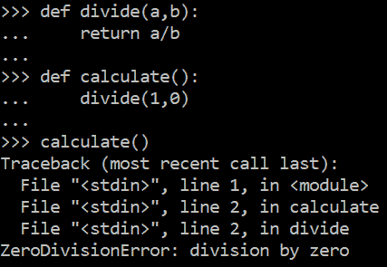

首先显示的是回溯，它由导致异常的调用列表组成。正如我们在堆栈跟踪中看到的，错误是由第 7 行的 calculate（）调用引起的，该调用在第 5 行上调用 division（1，0），并最终执行第 2 行的 a/b 语句。

Python 语言提供了一种异常处理能力来实现这一点。我们使用 try/except 语句来提供异常处理。现在，程序尝试执行零除法。当错误发生时，我们的异常处理会捕获错误并在屏幕上打印一条消息：


在下面的示例中，我们尝试创建文件类型 f 对象。如果文件未作为参数传递，则会引发 IOError 类型的异常，这要归功于我们的 try EXPECT：

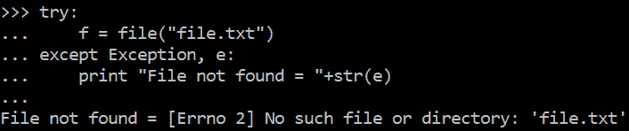

此处列出了默认情况下可用的一些异常（从中派生这些异常的类位于括号中）：

*   **BaseException**：继承所有异常的类。
*   **异常**（BaseException）：所有未输出异常的超类。
*   **ZeroDivisionError**（算术错误）：除法或模块运算的第二个参数为`0`时启动。
*   **环境错误**（StandardError）：与输入/输出相关的错误的父类。
*   **IOError**（环境错误）：输入/输出操作中的错误。
*   **OSError**（环境错误）：系统调用中的错误。
*   **导入错误**（StandardError）：未找到要导入的模块或模块元素。

# Python 作为一种面向对象语言

在本节中，我们将回顾 Python 中的面向对象编程和继承。

面向对象编程是当今最常用的范例之一。虽然它适合我们在日常生活中可以找到的许多情况，但在 Python 中，我们可以将它与其他范例结合起来，以便在保持最佳代码设计的同时充分利用该语言并提高生产率。

Python 是一种面向对象的语言，允许您根据这些定义定义类和实例化对象。以 class 语句开头的块是类定义。块中定义的函数是其方法，也称为成员函数。

Python 创建对象的方式是使用 class 关键字。Python 对象是方法、变量和属性的集合。可以使用相同的类定义创建多个对象。以下是协议对象定义的简单示例：

您可以在`protocol.py`文件中找到以下代码。

```py
class protocol(object):

 def __init__(self, name, number,description):
 self.name = name
 self.number = number
 self.description = description

 def getProtocolInfo(self):
 return self.name+ " "+str(self.number)+ " "+self.description
```

`__init__`方法是一种特殊的方法，顾名思义，它充当构造函数方法来执行任何必要的初始化过程。

该方法的第一个参数是一个特殊的关键字，我们使用自标识符引用当前对象。它是对对象本身的引用，并提供了访问其属性和方法的方法。

self 参数相当于可以在 C++或 Java 等语言中找到的指针。在 Python 中，self 是该语言的保留字，是必需的，它是常规方法的第一个参数，通过它可以访问类的属性和方法。

若要创建对象，请在类名称后面加上括号中所需的任何参数。这些参数将传递给`__init__`方法，该方法是实例化类时调用的方法：

```py
>>> protocol_http= protocol("HTTP", 80, "Hypertext transfer protocol")
```

现在我们已经创建了对象，我们可以通过 object.attribute 和`object.method()`语法访问它的属性和方法：

```py
>>> protocol_http.name
>>> protocol_http.number
>>> protocol_http.description
>>> protocol_http.getProtocolInfo()
```

# 遗产

面向对象编程语言的主要概念是：封装、继承和多态性。在面向对象语言中，对象通过建立层次结构与其他对象相关联，并且一些对象可能继承其他对象的属性和方法，扩展其行为和/或专门化

继承允许我们从另一个类生成一个新类，继承它的属性和方法，根据需要调整或扩展它们。为了指示一个类从另一个类继承，我们需要将继承的类的名称放在括号之间。

在 OOPS 术语中，据说“B 从 A 继承”、“B 是从 A 派生的类”、“A 是 B 的基类”或“A 是 B 的超类”。

这有助于代码的重用，因为您可以在基类中实现基本行为和数据，并在派生类中专门化它们：


# 用于 Python 脚本编写的 OMSTD 方法和 STB 模块

OMSTD 代表面向安全工具开发人员的开放方法论，它是 Python 中用于开发安全工具的一种方法论和一组良好实践。本指南旨在用于 Python 开发，但实际上您可以将相同的思想扩展到其他语言。在这一点上，我将讨论使代码更具可读性和可重用性的方法和一些技巧。

# Python 包和模块

Python 编程语言是一种高级通用语言，具有清晰的语法和完整的标准库。通常被称为脚本语言，安全专家强调 Python 是开发信息安全工具包的语言。模块化设计、可读代码和充分开发的库集为安全研究人员和专家构建工具提供了起点。

Python 附带了一个全面的标准库，它提供了从提供简单 I/O 访问的集成模块到特定于平台的 API 调用的所有内容。Python 的美妙之处在于用户提供的模块、包和单个框架。项目越大，各方之间的秩序和分离就必须越大。在 Python 中，我们可以使用模块概念进行划分。

# Python 中的模块是什么？

模块是我们可以从程序中使用的函数、类和变量的集合。标准 Python 发行版提供了大量模块。

import 语句后跟模块名称，使我们能够访问其中定义的对象。通过模块标识符、点运算符和相关对象的标识符，可以从导入该对象的程序或模块访问导入的对象。

模块可以定义为包含 Python 定义和声明的文件。文件名为模块名，并带有`.py`后缀。首先，我们可以定义一个简单的模块，该模块将存在于与我们要编写的`main.py`脚本相同的目录中的.py 文件中：

*   `main.py`
*   `my_module.py`

在这个`my_module.py`文件中，我们将定义一个简单的`test()`函数，它将打印“这是我的第一个模块”：

```py
 # my_module.py
 def test():
    print("This is my first module")
```

在`main.py`文件中，我们可以将该文件作为模块导入，并使用新定义的 test（）方法，如下所示：

```py
# main.py
 import my_module

 def main():
    my_module.test()

 if __name__ == '__main__':
    main()
```

这就是我们需要在 Python 程序中定义一个非常简单的`python`模块的全部内容。

# Python 模块和 Python 包之间的区别

当我们使用 Python 时，理解 Python 模块和`Python`包之间的区别是很重要的。区分它们很重要；包是包含一个或多个模块的模块。

软件开发的一部分是在编程语言中添加基于模块的功能。随着新方法和创新的出现，开发人员将这些功能构建块作为模块或包提供。在 Python 网络中，这些模块和包中的大多数是免费的，有许多是免费的，包括完整的源代码，允许您增强所提供模块的行为并独立验证代码。

# 在 Python 中传递参数

要开发此任务，最好使用安装 Python 时默认安装的`argparse`模块。

For more information, you can check out the official website: [https://docs.python.org/3/library/argparse.html](https://docs.python.org/3/library/argparse.html).

以下是如何在脚本中使用它的示例：

您可以在文件名`testing_parameters.py`中找到以下代码

```py
import argparse

parser = argparse.ArgumentParser(description='Testing parameters')
parser.add_argument("-p1", dest="param1", help="parameter1")
parser.add_argument("-p2", dest="param2", help="parameter2")
params = parser.parse_args()
print params.param1
print params.param2
```

在 params 变量中，我们有用户从命令行输入的参数。要访问它们，您必须使用以下命令：

```py
params.<Name_dest>
```

**一个有趣的选项是，可以使用 type 属性指示参数的类型。例如，如果我们希望将某个参数视为一个整数，则可以通过以下方式进行处理：**

 **```py
parser.add_argument("-param", dest="param", type="int")
```

另一件可以帮助我们获得更可读代码的事情是声明一个类，该类充当参数的全局对象：

```py
class Parameters:
 """Global parameters"""
    def __init__(self, **kwargs):
        self.param1 = kwargs.get("param1")
        self.param2 = kwargs.get("param2")
```

例如，如果我们想同时向一个函数传递多个参数，我们可以使用这个全局对象，它包含全局执行参数。例如，如果我们有两个参数，我们可以这样构造对象：

您可以在文件名`params_global.py`中找到以下代码

```py
import argparse

class Parameters:
 """Global parameters"""

    def __init__(self, **kwargs):
        self.param1 = kwargs.get("param1")
        self.param2 = kwargs.get("param2")

def view_parameters(input_parameters):
    print input_parameters.param1
    print input_parameters.param2

parser = argparse.ArgumentParser(description='Passing parameters in an object')
parser.add_argument("-p1", dest="param1", help="parameter1")
parser.add_argument("-p2", dest="param2", help="parameter2")
params = parser.parse_args()
input_parameters = Parameters(param1=params.param1,param2=params.param2)
view_parameters(input_parameters)
```

在前面的脚本中，我们可以看到我们使用`argparse`模块获取参数，并使用 parameters 类将这些参数封装在一个对象中。通过这种做法，我们将封装的参数封装在一个对象中，以便于从脚本的不同点检索这些参数。

# 管理 Python 项目中的依赖项

如果我们的项目与其他库有依赖关系，那么理想的做法是在我们有这些依赖关系的文件中创建一个文件，以便我们的模块的安装和分发尽可能简单。对于这个任务，我们可以创建一个名为`requirements.txt`的文件，如果我们使用 pip 实用程序调用它，它将降低相关模块需要的所有依赖关系。

要使用 pip 安装所有依赖项，请执行以下操作：

```py
pip -r requirements.txt
```

这里，`pip`是`Python`包和依赖关系管理器，`requirements.txt`是详细说明项目所有依赖关系的文件。

# 生成 requirements.txt 文件

我们还可以从项目源代码创建`requirements.txt`文件。

对于此任务，我们可以使用`pipreqs`模块，其代码可以从位于[的 GitHub 存储库下载 https://github.com/bndr/pipreqs](https://github.com/bndr/pipreqs)

通过这种方式，可以使用`pip install pipreqs`命令安装模块，也可以使用` python setup.py install`命令通过 GitHub 代码库安装模块。

For more information about the module, you can query the official pypi page: 
[https://pypi.python.org/pypi/pipreqs](https://pypi.python.org/pypi/pipreqs).

要生成`requirements.txt`文件，必须执行以下命令：

```py
 pipreqs <path_project>
```

# 使用虚拟环境

在使用 Python 时，强烈建议您使用 Python 虚拟环境。虚拟环境有助于分离项目所需的依赖项，并保持我们的全局目录中没有`project`包。虚拟环境提供用于安装 Python 模块的单独环境以及 Python 可执行文件和关联文件的独立副本。您可以拥有所需的任意多个虚拟环境，这意味着您可以配置多个模块配置，并且可以轻松地在它们之间切换。

从版本 3 开始，Python 包含一个`venv`模块，该模块提供此功能。文档和示例可在[上找到 https://docs.python.org/3/using/windows.html#virtual-环境](https://docs.python.org/3/using/windows.html#virtual-environments)

早期版本还提供了一个独立的工具，可在以下网址找到：

[https://virtualenv.pypa.io/en/latest](https://virtualenv.pypa.io/en/latest)

# 使用 virtualenv 和 VirtualRapper

当您在本地计算机中安装`Python`模块而不使用虚拟环境时，您是在操作系统中全局安装它。此安装通常需要用户根管理员，并且为每个用户和每个项目安装`Python`模块。

此时，如果需要处理多个 Python 项目，或者需要一种方法来处理许多项目中的所有关联库，那么最好的做法是安装一个 Python 虚拟环境。

Virtualenv 是一个`Python`模块，允许您创建虚拟和隔离的环境。基本上，您可以创建一个包含项目所需的所有可执行文件和模块的文件夹。您可以使用以下命令安装 virtualenv：

```py
$ sudo pip install virtualenv
```

要创建新的虚拟环境，请创建一个文件夹，然后从命令行输入该文件夹：

```py
$ cd your_new_folder $ virtualenv name-of-virtual-environment
```

例如，这将创建一个名为 myVirtualEnv 的新环境，您必须激活该环境才能使用它：

```py
$ cd myVirtualEnv/ $ virtualenv myVirtualEnv $ source bin/activate
```

执行此命令将启动一个文件夹，该文件夹的名称在当前工作目录中指明，其中包含 Python 的所有可执行文件和允许您在虚拟环境中安装不同软件包的`pip`模块。

Virtualenv 就像一个沙箱，在这里，您工作时将安装项目的所有依赖项，并且所有模块和依赖项都是分开的。如果用户的机器上安装了相同版本的 Python，那么相同的代码将在虚拟环境中工作，而无需任何更改。

`Virtualenvwrapper`允许您更好地组织机器上所有虚拟管理的环境，并提供更优化的方式使用`virtualenv`。

我们可以使用 pip 命令来安装`virtualwrapper`，因为它在官方 Python 存储库中可用。安装它的唯一要求是之前安装过`virtualenv`：

```py
$ pip install virtualenvwrapper
```

要在 Windows 中创建虚拟环境，可以使用`virtualenv`命令：

```py
virtualenv venv
```

When we execute previous command, we see this result:

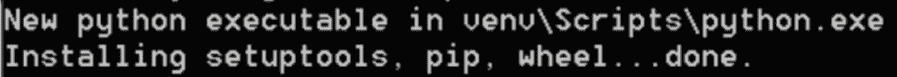

在 Windows 中执行`virtualenv`命令会生成四个文件夹：

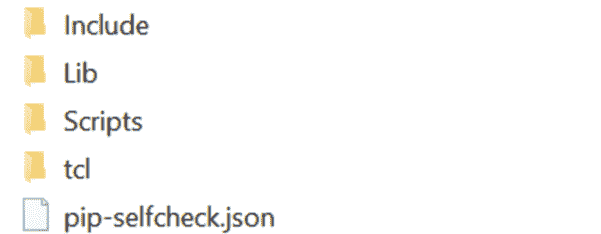

在脚本文件夹中，有一个名为`activate.bat`的脚本来激活虚拟环境。一旦我们将其激活，我们将拥有一个干净的模块和库环境，我们必须下载项目的依赖项，以便使用以下代码将它们复制到此目录中：

```py
cd venv\Scripts\activate (venv) > pip install -r requirements.txt
```

This is the active folder when we can find the active.bat script:

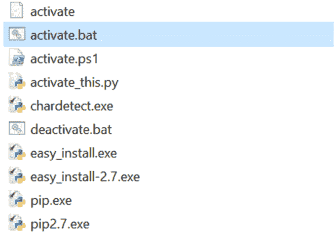

# STB（安全工具生成器）模块

该工具将允许我们创建一个基础项目，在此基础上我们可以开始开发自己的工具。

此工具的官方存储库为[https://github.com/abirtone/STB](https://github.com/abirtone/STB) 。

对于安装，我们可以下载源代码并执行`setup.py`文件，该文件将下载`requirements.txt`文件中的依赖项。

我们也可以通过`**pip install stb**`命令来完成。

执行`**stb**`命令时，我们会看到以下屏幕，询问我们创建项目的信息：

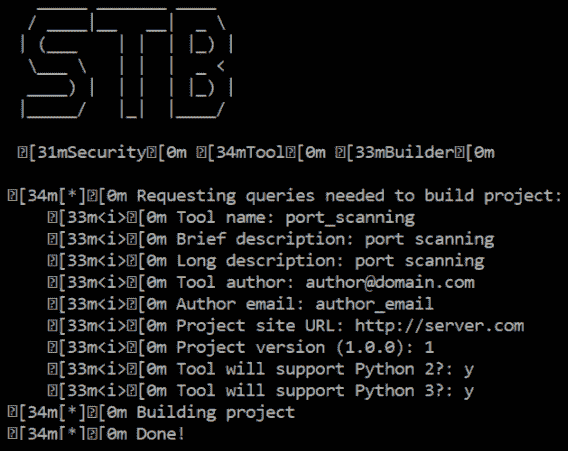

有了这个命令，我们就有了一个带有`setup.py`文件的应用框架，如果我们想将该工具作为命令安装在系统中，我们可以执行该文件。为此，我们可以执行：

```py
python setup.py install
```

执行上一个命令时，我们将获得下一个文件夹结构：

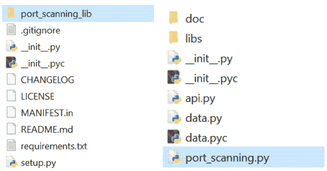

这也创建了一个`port_scanning_lib`文件夹，其中包含允许我们执行它的文件：

```py
python port_scanning.py –h
```

如果我们使用帮助选项（-h）执行脚本，我们会看到可以使用一系列参数：

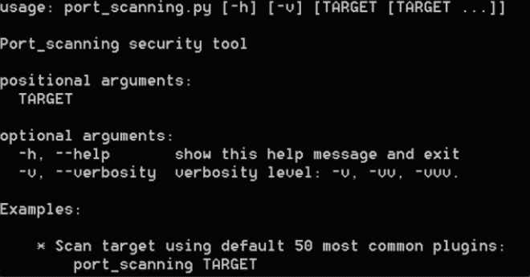

我们可以看到在`port_scanning.py`文件中生成的代码：

```py
parser = argparse.ArgumentParser(description='%s security tool' % "port_scanning".capitalize(), epilog = examples, formatter_class = argparse.RawTextHelpFormatter)

# Main options
parser.add_argument("target", metavar="TARGET", nargs="*")
parser.add_argument("-v", "--verbosity", dest="verbose", action="count", help="verbosity level: -v, -vv, -vvv.", default=1)
parsed_args = parser.parse_args()

# Configure global log
log.setLevel(abs(5 - parsed_args.verbose) % 5)

# Set Global Config
config = GlobalParameters(parsed_args)
```

在这里，我们可以看到定义的参数，`GlobalParameters`对象用于传递`parsed_args`变量内的参数。要执行的方法在`**api.py**`文件中找到。

例如，此时，我们可以检索从命令行输入的参数：

```py
# ----------------------------------------------------------------------
#
# API call
#
# ----------------------------------------------------------------------
def run(config):
    """
    :param config: GlobalParameters option instance
    :type config: `GlobalParameters`

    :raises: TypeError
     """
     if not isinstance(config, GlobalParameters):
         raise TypeError("Expected GlobalParameters, got '%s' instead" % type(config))

# --------------------------------------------------------------------------
# INSERT YOUR CODE HERE # TODO
# --------------------------------------------------------------------------
print config
print config.target
```

我们可以从命令行执行脚本，将 ip 目标作为参数传递：

```py
python port_scanning.py 127.0.0.1
```

如果现在执行，我们将看到如何在输出中获得第一个引入的参数：


# 脚本开发的主要开发环境

在本节中，我们将回顾 Pycharm 和 WingIDE 作为 python 脚本开发环境的情况。

# 建立发展环境

为了快速开发和调试 Python 应用，绝对有必要使用可靠的 IDE。如果您想尝试不同的选项，我们建议您查看 Python 官方网站上的列表，在那里他们可以根据自己的操作系统和需求查看工具：[https://wiki.python.org/moin/IntegratedDevelopmentEnvironments](https://wiki.python.org/moin/IntegratedDevelopmentEnvironments) 。

在所有环境中，我们将重点介绍以下内容：

*   **皮查姆：**[http://www.jetbrains.com/pycharm](http://www.jetbrains.com/pycharm)
*   **机翼侧面**：[https://wingware.com](https://wingware.com)

# 皮查姆

PyCharm 是 Jetbrains 公司开发的 IDE，它基于 IntelliJ IDEA，IntelliJ IDEA 是同一家公司的 IDE，但专注于 Java，是 Android Studio 的基础。

PyCharm 是多平台的，我们可以找到适用于 Windows、Linux 和 macOS X 的二进制文件。PyCharm 有两个版本：**社区版**和**专业版**，在与 web 框架和数据库支持的集成方面有不同的功能。

在这个 url 中，我们可以看到社区版和专业版的比较：[http://www.jetbrains.com/pycharm](http://www.jetbrains.com/pycharm)

这种开发环境的主要优势是：

*   自动完成、语法高亮、分析工具和重构。
*   与 Django、Flask、Pyramid、Web2Py、jQuery 和 AngularJS 等 web 框架集成。
*   高级调试器。
*   与 SQLAlchemy（ORM）、Google 应用引擎、Cython 兼容。
*   与版本控制系统的连接：Git、CVS、Mercurial。

# 温吉德

WingIDE 是一个可用于 Windows、Mac 和 Linux 的多平台环境，提供调试和变量探索级别的所有功能。

WingIDE 拥有丰富的功能集，可以轻松支持复杂 Python 应用的开发。使用 WingIDE，您可以检查变量、堆栈参数和内存位置，而无需在记录它们之前更改它们的任何值。断点是调试进程时最常用的功能。Wing Personal 是这个 Python IDE 的免费版本，可以在[上找到 https://wingware.com/downloads/wingide-personal](https://wingware.com/downloads/wingide-personal)

WingIDE 使用系统中安装的 Python 配置：

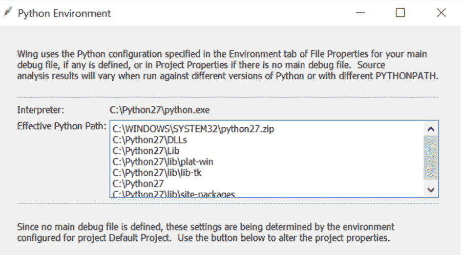

# 使用 WingIDE 进行调试

在本例中，我们正在调试一个 Python 脚本，该脚本接受两个输入参数：

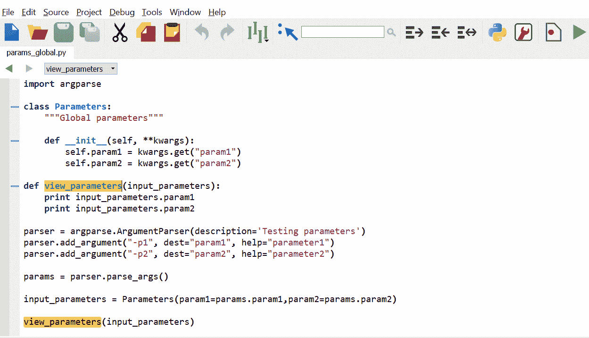

一个有趣的话题是在我们的程序中使用选项`Add Breakpoint`选项添加断点的可能性，这样，我们就可以在我们建立断点的地方调试并查看变量的内容：

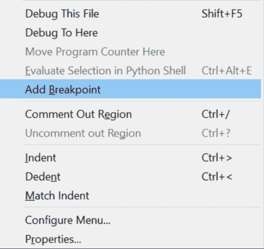

我们可以在`view_parameters`方法的调用中设置断点。

要在带有参数的调试模式下执行脚本，必须编辑脚本的属性，并在调试标记中添加脚本所需的参数：


如果我们在调试模式下执行，函数中有一个断点，我们可以看到本地**字符串变量**中参数的内容：

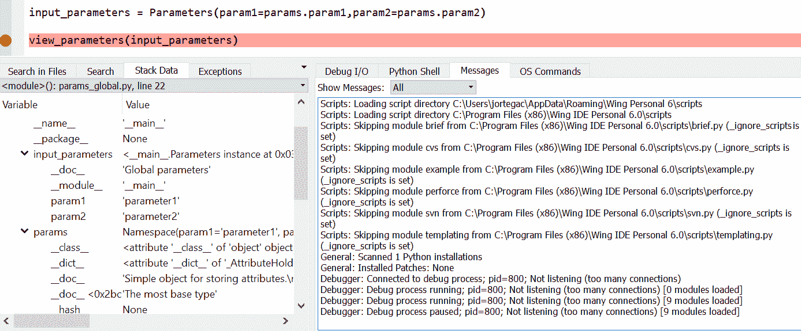

在以下屏幕截图中，我们可以可视化包含我们正在调试的值的 params 变量的值：


# 总结

在本章中，我们学习了如何在 Windows 和 Linux 操作系统上安装 Python。我们回顾了主要的数据结构和集合，如列表、元组和字典。我们还回顾了函数、管理异常、如何创建类和对象，以及属性和特殊方法的使用。然后，我们研究了开发环境和引入 Python 编程的方法。OMSTD 是 Python 中用于开发安全工具的一种方法和一组最佳实践。最后，我们回顾了 Python 脚本开发的主要开发环境 PyCharm 和 WingIDE。

在下一个[章节](02.html)中，我们将探讨用于操作系统和文件系统、线程和并发的编程系统包。

# 问题

1.  Python2.x 和 3.x 之间有什么区别？

2.  Python 开发人员使用的编程范式是什么？该范式背后的主要概念是什么？

3.  Python 中的什么数据结构允许我们将值与键相关联？

4.  Python 脚本的主要开发环境是什么？

5.  在 Python 中，我们可以遵循什么方法来开发安全工具？

6.  帮助创建隔离 Python 环境的`Python`模块是什么？

7.  哪种工具允许我们创建一个基础项目，我们可以在此基础上开始开发自己的工具？

8.  我们如何在 Python 开发环境中调试变量？

9.  如何在`pycharm`中添加断点？

10.  如何在 Wing IDE 中添加断点？

# 进一步阅读

在这些链接中，您将找到有关上述工具和官方 python 文档的更多信息，用于搜索一些已评论的模块：

*   [http://winpython.github.io](http://winpython.github.io)
*   [https://docs.python.org/2.7/library/](https://docs.python.org/2.7/library/)
*   [https://docs.python.org/3.6/library/](https://docs.python.org/3.6/library/)
*   [https://virtualenv.pypa.io/en/latest](https://virtualenv.pypa.io/en/latest)
*   [https://wiki.python.org/moin/IntegratedDevelopmentEnvironments](https://wiki.python.org/moin/IntegratedDevelopmentEnvironments)**