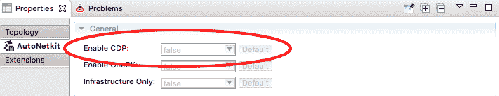
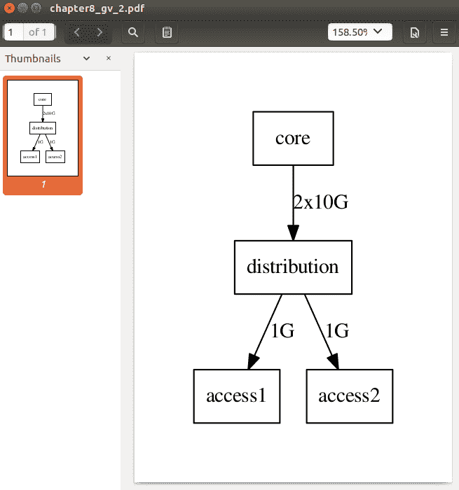
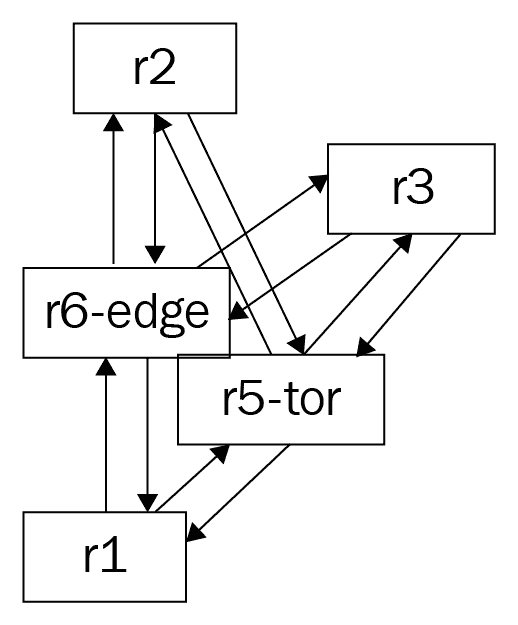
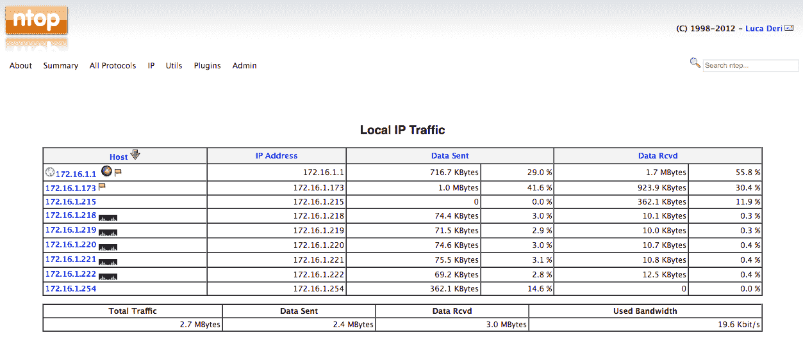
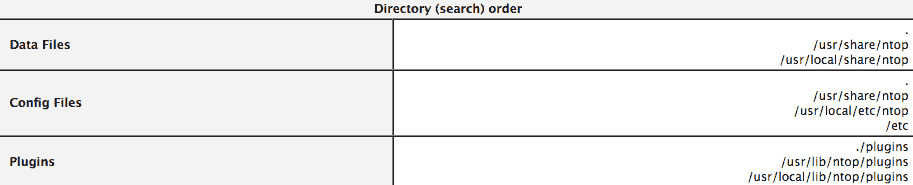
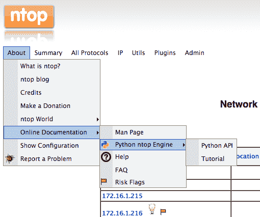
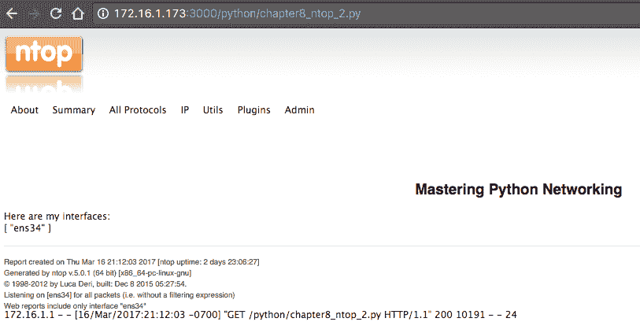
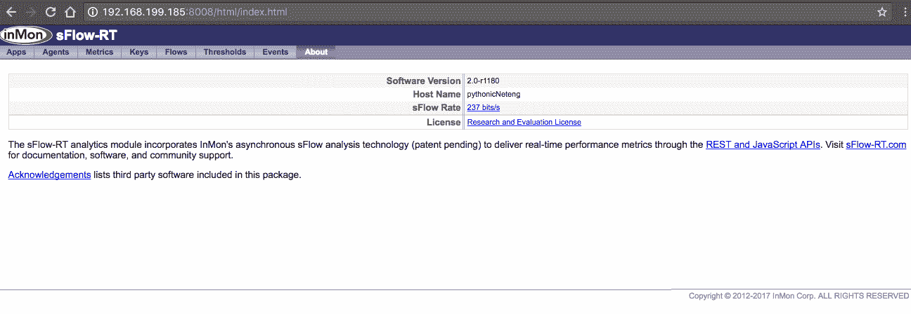
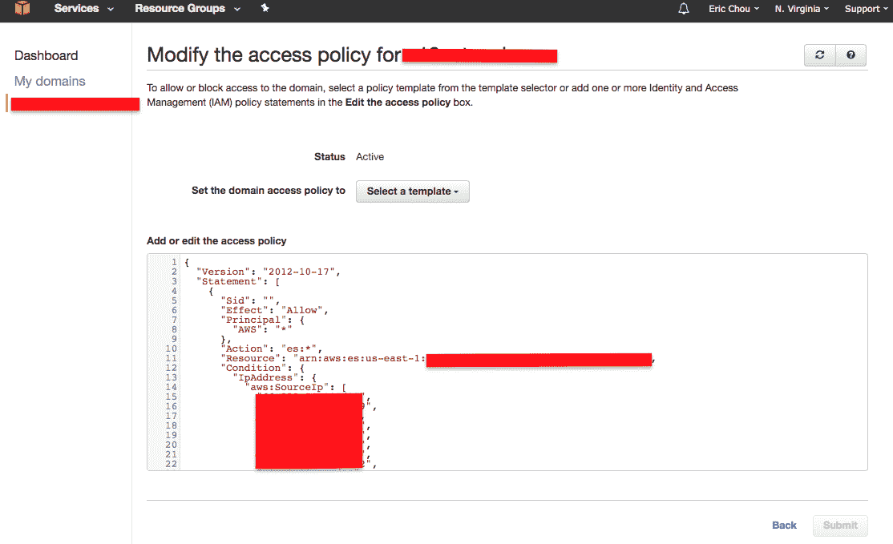

# 八、使用 Python 进行网络监控——第二部分

在[第 7 章](07.html)、*Python 网络监控—第 1 部分*中，我们使用 SNMP 从网络设备查询信息。为此，我们使用 SNMP 管理器查询驻留在网络设备上的 SNMP 代理。SNMP 信息是以层次结构格式构建的，使用特定的对象 ID 作为表示对象值的方式。大多数时候，我们关心的值是一个数字，例如 CPU 负载、内存使用或接口流量。这是我们可以根据时间绘制的图表，让我们了解价值是如何随时间变化的。

我们通常可以将 SNMP 方法归类为`pull`方法，因为我们不断向设备询问特定的答案。这种特殊的方法增加了设备的负担，因为它需要在控制平面上花费一个 CPU 周期来从子系统中查找答案，将答案打包到 SNMP 数据包中，然后将答案传输回轮询器。如果您曾经参加过一次家庭聚会，其中有一位家庭成员一遍又一遍地问您相同的问题，这类似于 SNMP 管理器轮询受管节点

随着时间的推移，如果我们有多个 SNMP 轮询器每 30 秒查询一次相同的设备（您会惊讶于这种情况发生的频率），那么管理开销将变得巨大。在我们给出的同一个家庭团聚的例子中，不是一个家庭成员，而是想象每 30 秒有许多其他人打断你问你一个问题。我不知道你的情况，但我知道即使是一个简单的问题，我也会很生气（如果他们都问同一个问题，情况会更糟）。

我们可以提供更有效的网络监控的另一种方法是将管理站之间的关系从拉模式转换为推模式。换句话说，信息可以以约定的格式从设备推送到管理站。这个概念是基于流的监控的基础。在基于流的模型中，网络设备将称为流的业务信息流传输到管理站。格式可以是 Cisco 专有 NetFlow（版本 5 或版本 9）、行业标准 IPFIX 或开源 sFlow 格式。在本章中，我们将花一些时间研究使用 Python 的 NetFlow、IPFIX 和 sFlow。

并非所有监测都是以时间序列数据的形式进行的。如果确实需要，可以用时间序列格式表示网络拓扑和系统日志等信息，但这并不理想。我们可以使用 Python 来检查网络拓扑信息，并查看拓扑是否随时间而改变。我们可以使用带有 Python 包装器的工具（如 Graphviz）来说明拓扑。如[第 6 章](06.html)、*Python 网络安全*所示，Syslog 包含安全信息。在本章中，我们将介绍使用 ELK 堆栈（Elasticsearch、Logstash、Kibana）作为收集和索引网络日志信息的有效方法。

具体而言，在本章中，我们将介绍以下主题：

*   Graphviz，这是一个开源的图形可视化软件，可以帮助我们快速有效地绘制我们的网络
*   基于流的监视，如 NetFlow、IPFIX 和 sFlow
*   使用 ntop 可视化流程信息
*   使用 Elasticsearch 对我们收集的数据进行索引和分析

让我们先看看如何使用 Graphviz 作为工具来监视网络拓扑变化。

# 格拉夫维兹

Graphviz 是一个开源的图形可视化软件。想象一下，如果我们不得不在没有图片的情况下向同事描述我们的网络拓扑结构。我们可以说，我们的网络由三层组成：核心层、分发层和访问层。核心层包括两个冗余路由器，两个路由器向四个分发路由器全网化；分发路由器也向接入路由器完全啮合。内部路由协议为 OSPF，外部使用 BGP 与服务提供商进行对等。虽然这个描述缺少一些细节，但它可能足以让您的同事对您的网络描绘出一幅非常好的高层画面。

Graphviz 的工作原理与此过程类似，它以 Graphviz 可以理解的文本格式描述图形，然后我们可以将文件提供给 Graphviz 程序来为我们构建图形。这里，图形以称为点（[的文本格式描述 https://en.wikipedia.org/wiki/DOT_（graph_description_language）](https://en.wikipedia.org/wiki/DOT_(graph_description_language))和 Graphviz 根据描述呈现图形。当然，由于计算机缺乏人类的想象力，语言必须非常精确和详细。

For Graphviz-specific DOT grammar definitions, take a look at [http://www.graphviz.org/doc/info/lang.html](http://www.graphviz.org/doc/info/lang.html).

在本节中，我们将使用**链路层发现协议**（**LLDP**）查询设备邻居，并通过 Graphviz 创建网络拓扑图。在完成这个广泛的示例后，我们将看到如何采用一些新的东西，例如 Graphviz，并将其与我们已经学会的东西结合起来，以解决有趣的问题。

让我们从建造我们将要使用的实验室开始。

# 实验室设置

我们将使用 VIRL 来构建我们的实验室。在前面的章节中，我们将构建一个包含多个路由器、一个服务器和一个客户端的实验室。我们将使用五个 IOSv 网络节点以及两台服务器主机：


如果您想知道我们对 IOSv 的选择，而不是 NX-OS 或 IOS-XR 和设备的数量，这里有几个要点供您在构建自己的实验室时考虑：

*   NX-OS 和 IOS-XR 虚拟化的节点比 IOS 占用的内存大得多
*   我使用的 VIRL 虚拟管理器有 8gb 的 RAM，这似乎足以支持 9 个节点，但可能有点不稳定（节点随机从可访问变为不可访问）
*   如果您希望使用 NX-OS，请考虑使用 NX-API 或将返回结构化数据的其他 API 调用。

对于我们的示例，我们将使用 LLDP 作为链路层邻居发现的协议，因为它与供应商无关。注意，VIRL 提供了一个自动启用 CDP 的选项，这可以节省您一些时间，并且在功能上与 LLDP 类似；但是，它是 Cisco 专有技术，因此我们将在实验室禁用它：



实验室启动并运行后，继续安装必要的软件包。

# 安装

可通过`apt`获取图形：

```py
$ sudo apt-get -y install graphviz
```

安装完成后，注意使用`dot`命令进行验证：

```py
$ dot -V
dot - graphviz version 2.38.0 (20140413.2041)~
```

我们将为 Graphviz 使用 Python 包装器，因此现在就让我们安装它：

```py
$ sudo pip install graphviz #Python 2
$ sudo pip3 install graphviz

$ python3
Python 3.5.2 (default, Nov 23 2017, 16:37:01)
[GCC 5.4.0 20160609] on linux
Type "help", "copyright", "credits" or "license" for more information.
>>> import graphviz
>>> graphviz.__version__
'0.8.4'
>>> exit() 
```

让我们来看看我们如何使用这个软件。

# Graphviz 示例

与大多数流行的开源项目一样，Graphviz（[的文档 http://www.graphviz.org/Documentation.php](http://www.graphviz.org/Documentation.php) 是广泛的。对于刚接触软件的人来说，挑战通常是从哪里开始。出于我们的目的，我们将重点关注点图，它将有向图绘制为层次结构（不要与点语言混淆，点语言是一种图形描述语言）。

让我们从一些基本概念开始：

*   节点代表我们的网络实体，如路由器、交换机和服务器
*   边缘表示网络实体之间的链接
*   图形、节点和边都有属性（[https://www.graphviz.org/doc/info/attrs.html](https://www.graphviz.org/doc/info/attrs.html) ）可以调整
*   描述网络后，可以输出网络图（[https://www.graphviz.org/doc/info/output.html](https://www.graphviz.org/doc/info/output.html) ）PNG、JPEG 或 PDF 格式

我们的第一个示例是由四个节点组成的无向点图（`core`、`distribution`、`access1`和`access2`）。边缘由破折号`-`表示，将核心节点连接到分发节点，并将分发节点连接到两个访问节点：

```py
$ cat chapter8_gv_1.gv
graph my_network {
 core -- distribution;
 distribution -- access1;
 distribution -- access2;
}
```

该图形可以在`dot -T<format> source -o <output file>`命令行中输出：

```py
$ dot -Tpng chapter8_gv_1.gv -o output/chapter8_gv_1.png
```

可以从以下输出文件夹查看结果图：


Just like [Chapter 7](07.html), *Network Monitoring with Python – Part 1*, it might be easier to work in the Linux desktop window while working with these graphs so you can see the graphs right away. 

请注意，我们可以通过将图指定为有向图以及使用箭头（`->`符号）表示边来使用方向图。对于节点和边，我们可以修改几个属性，例如节点形状、边标签等。同一图表可以修改如下：

```py
$ cat chapter8_gv_2.gv
digraph my_network {
 node [shape=box];
 size = "50 30";
 core -> distribution [label="2x10G"];
 distribution -> access1 [label="1G"];
 distribution -> access2 [label="1G"];
}
```

这次我们将以 PDF 格式输出文件：

```py
$ dot -Tpdf chapter8_gv_2.gv -o output/chapter8_gv_2.pdf
```

查看新图表中的方向箭头：



现在让我们看一下围绕图形化的 Python 包装器。

# Python 和 Graphviz 示例

我们可以使用我们安装的 Python Graphviz 包再现与之前相同的拓扑图：

```py
$ python3
Python 3.5.2 (default, Nov 17 2016, 17:05:23)
>>> from graphviz import Digraph
>>> my_graph = Digraph(comment="My Network")
>>> my_graph.node("core")
>>> my_graph.node("distribution")
>>> my_graph.node("access1")
>>> my_graph.node("access2")
>>> my_graph.edge("core", "distribution")
>>> my_graph.edge("distribution", "access1")
>>> my_graph.edge("distribution", "access2")
```

这段代码基本上生成了您通常用点语言编写的内容，但以一种更具 python 风格的方式编写。可以在生成图形之前查看图形的源：

```py
>>> print(my_graph.source)
// My Network
digraph {
 core
 distribution
 access1
 access2
 core -> distribution
 distribution -> access1
 distribution -> access2
} 
```

图形可以通过`render()`方法进行渲染；默认情况下，输出格式为 PDF:

```py
>>> my_graph.render("output/chapter8_gv_3.gv")
'output/chapter8_gv_3.gv.pdf'
```

Python 包包装器非常模仿 Graphviz 的所有 API 选项。您可以在 Graphviz 上找到关于选项的文档，请阅读文档网站（[http://graphviz.readthedocs.io/en/latest/index.html](http://graphviz.readthedocs.io/en/latest/index.html) ）。您还可以参考 GitHub 上的源代码了解更多信息（[https://github.com/xflr6/graphviz](https://github.com/xflr6/graphviz) ）。我们现在已经准备好使用该工具来规划我们的网络。

# 邻域图

在本节中，我们将使用绘制 LLDP 邻居的示例来说明多年来帮助我解决问题的模式：

1.  如果可能，将每个任务模块化为更小的部分。在我们的示例中，我们可以组合几个步骤，但如果我们将它们分成更小的部分，我们将能够更容易地重用和改进它们。
2.  使用自动化工具与网络设备交互，但将更复杂的逻辑保留在管理站。例如，路由器提供了一个有点混乱的 LLDP 邻居输出。在本例中，我们将继续使用工作命令和输出，并在管理站使用 Python 脚本解析出我们需要的输出。

3.  当显示相同任务的选项时，请选择可重用的选项。在我们的示例中，我们可以使用低级 Pexpect、Paramiko 或 Ansible 剧本来查询路由器。在我看来，Ansible 是一个更可重用的选项，所以我选择了它。

首先，由于默认情况下路由器上未启用 LLDP，我们需要首先在设备上配置它们。到目前为止，我们知道我们有很多选择；在本例中，我为任务选择了带有`ios_config`模块的 Ansible playbook。`hosts`文件由五个路由器组成：

```py
$ cat hosts
[devices]
r1 ansible_hostname=172.16.1.218
r2 ansible_hostname=172.16.1.219
r3 ansible_hostname=172.16.1.220
r5-tor ansible_hostname=172.16.1.221
r6-edge ansible_hostname=172.16.1.222
```

`cisco_config_lldp.yml`剧本由一个剧本组成，剧本中嵌入了变量，用于配置 LLDP：

```py
<skip>
 vars:
   cli:
     host: "{{ ansible_hostname }}"
     username: cisco
     password: cisco
     transport: cli tasks:
  - name: enable LLDP run
       ios_config:
         lines: lldp run
         provider: "{{ cli }}"
<skip>
```

几秒钟后，为了允许 LLDP 交换，我们可以验证 LLDP 确实在路由器上处于活动状态：

```py
$ ansible-playbook -i hosts cisco_config_lldp.yml

PLAY [Enable LLDP] ***********************************************************
...
PLAY RECAP *********************************************************************
r1 : ok=2 changed=1 unreachable=0 failed=0
r2 : ok=2 changed=1 unreachable=0 failed=0
r3 : ok=2 changed=1 unreachable=0 failed=0
r5-tor : ok=2 changed=1 unreachable=0 failed=0
r6-edge : ok=2 changed=1 unreachable=0 failed=0

## SSH to R1 for verification
r1#show lldp neighbors

Capability codes: (R) Router, (B) Bridge, (T) Telephone, (C) DOCSIS Cable Device (W) WLAN Access Point, (P) Repeater, (S) Station, (O) Other

Device ID Local Intf Hold-time Capability Port ID
r2.virl.info Gi0/0 120 R Gi0/0
r3.virl.info Gi0/0 120 R Gi0/0
r5-tor.virl.info Gi0/0 120 R Gi0/0
r5-tor.virl.info Gi0/1 120 R Gi0/1
r6-edge.virl.info Gi0/2 120 R Gi0/1
r6-edge.virl.info Gi0/0 120 R Gi0/0

Total entries displayed: 6
```

在输出中可以看到`G0/0`配置为管理接口；因此，您将看到 LLDP 对等点，就好像它们位于平面管理网络上一样。我们真正关心的是连接到其他对等方的`G0/1`和`G0/2`接口。当我们准备解析输出并构建拓扑图时，这些知识将派上用场。

# 信息检索

我们现在可以使用另一个 Ansible playbook，即`cisco_discover_lldp.yml`，在设备上执行 LLDP 命令，并将每个设备的输出复制到`tmp`目录：

```py
<skip>
 tasks:
   - name: Query for LLDP Neighbors
     ios_command:
       commands: show lldp neighbors
       provider: "{{ cli }}"
<skip>
```

`./tmp`目录现在包含所有路由器的输出（显示 LLDP 邻居）在其自己的文件中：

```py
$ ls -l tmp/
total 20
-rw-rw-r-- 1 echou echou 630 Mar 13 17:12 r1_lldp_output.txt
-rw-rw-r-- 1 echou echou 630 Mar 13 17:12 r2_lldp_output.txt
-rw-rw-r-- 1 echou echou 701 Mar 12 12:28 r3_lldp_output.txt
-rw-rw-r-- 1 echou echou 772 Mar 12 12:28 r5-tor_lldp_output.txt
-rw-rw-r-- 1 echou echou 630 Mar 13 17:12 r6-edge_lldp_output.txt
```

`r1_lldp_output.txt`内容是 Ansible 剧本中的`output.stdout_lines`变量：

```py
$ cat tmp/r1_lldp_output.txt

[["Capability codes:", " (R) Router, (B) Bridge, (T) Telephone, (C) DOCSIS Cable Device", " (W) WLAN Access Point, (P) Repeater, (S) Station, (O) Other", "", "Device ID Local Intf Hold-time Capability Port ID", "r2.virl.info Gi0/0 120 R Gi0/0", "r3.virl.info Gi0/0 120 R Gi0/0", "r5-tor.virl.info Gi0/0 120 R Gi0/0", "r5-tor.virl.info Gi0/1 120 R Gi0/1", "r6-edge.virl.info Gi0/0 120 R Gi0/0", "", "Total entries displayed: 5", ""]]
```

# Python 解析器脚本

我们现在可以使用 Python 脚本解析每个设备的 LLDP 邻居输出，并根据结果构建网络拓扑图。其目的是自动检查设备，查看是否有任何 LLDP 邻居因链路故障或其他问题而消失。让我们看一下这个文件，看看这是怎么做的。

我们从包的必要导入开始：一个空列表，我们将用节点关系的元组填充它。我们也知道设备上的`Gi0/0`连接到管理网络；因此，我们只在`show LLDP neighbors`输出中搜索`Gi0/[1234]`作为我们的正则表达式模式：

```py
import glob, re
from graphviz import Digraph, Source
pattern = re.compile('Gi0/[1234]')
device_lldp_neighbors = []
```

我们将使用`glob.glob()`方法遍历所有文件的`./tmp`目录，解析出设备名称，并找到设备连接的邻居。脚本中有一些嵌入的 print 语句，我们可以在最终版本中对其进行注释；如果语句未注释，我们可以看到解析结果：

```py
device: r1
 neighbors: r5-tor
 neighbors: r6-edge
device: r5-tor
 neighbors: r2
 neighbors: r3
 neighbors: r1
device: r2
 neighbors: r5-tor
 neighbors: r6-edge
device: r3
 neighbors: r5-tor
 neighbors: r6-edge
device: r6-edge
 neighbors: r2
 neighbors: r3
 neighbors: r1
```

完全填充的边缘列表包含由设备及其邻居组成的元组：

```py
Edges: [('r1', 'r5-tor'), ('r1', 'r6-edge'), ('r5-tor', 'r2'), ('r5-tor', 'r3'), ('r5-tor', 'r1'), ('r2', 'r5-tor'), ('r2', 'r6-edge'), ('r3', 'r5-tor'), ('r3', 'r6-edge'), ('r6-edge', 'r2'), ('r6-edge', 'r3'), ('r6-edge', 'r1')]
```

现在，我们可以使用 Graphviz 包构建网络拓扑图。最重要的部分是解包表示边缘关系的元组：

```py
my_graph = Digraph("My_Network")
<skip>
# construct the edge relationships
for neighbors in device_lldp_neighbors:
    node1, node2 = neighbors
    my_graph.edge(node1, node2)
```

如果我们打印出生成的源点文件，它将是我们网络的准确表示：

```py
digraph My_Network {
   r1 -> "r5-tor"
   r1 -> "r6-edge"
   "r5-tor" -> r2
   "r5-tor" -> r3
   "r5-tor" -> r1
   r2 -> "r5-tor"
   r2 -> "r6-edge"
   r3 -> "r5-tor"
   r3 -> "r6-edge"
   "r6-edge" -> r2
   "r6-edge" -> r3
   "r6-edge" -> r1
}
```

有时，看到同一个链接两次是令人困惑的；例如，`r2`到`r5-tor`链接在前面的图中针对链接的每个方向出现了两次。作为网络工程师，我们知道有时物理链路中的故障会导致单向链路，这是我们希望看到的

如果我们按原样绘制图表，节点的位置会有点奇怪。节点的放置是自动渲染的。下图说明了默认布局和`neato`布局中的渲染，即有向图（`My_Network`、`engine='neato'`）：


`neato`布局表示试图绘制层次更少的无向图：



有时，该工具提供的默认布局很好，尤其是当您的目标是检测故障而不是使其具有视觉吸引力时。但是，在本例中，让我们看看如何将原始点语言旋钮插入源文件。通过研究，我们知道我们可以使用`rank`命令来指定某些节点可以停留在同一级别上的级别。但是，Graphviz Python API 中没有提供任何选项。幸运的是，点源文件只是一个字符串，我们可以使用`replace()`方法将其作为原始点注释插入，方法如下：

```py
source = my_graph.source
original_text = "digraph My_Network {"
new_text = 'digraph My_Network {n{rank=same Client "r6-edge"}n{rank=same r1 r2 r3}n'
new_source = source.replace(original_text, new_text)
new_graph = Source(new_source)new_graph.render("output/chapter8_lldp_graph.gv")
```

最终结果是一个新的源，我们可以从中渲染最终拓扑图：

```py
digraph My_Network {
{rank=same Client "r6-edge"}
{rank=same r1 r2 r3}
                Client -> "r6-edge"
                "r5-tor" -> Server
                r1 -> "r5-tor"
                r1 -> "r6-edge"
                "r5-tor" -> r2
                "r5-tor" -> r3
                "r5-tor" -> r1
                r2 -> "r5-tor"
                r2 -> "r6-edge"
                r3 -> "r5-tor"
                r3 -> "r6-edge"
               "r6-edge" -> r2
               "r6-edge" -> r3
               "r6-edge" -> r1
}
```

现在可以开始绘制图表了：


# 最终剧本

我们现在准备将这个新的解析器脚本合并回我们的剧本中。我们现在可以在`cisco_discover_lldp.yml`中添加额外的任务，通过图形生成呈现输出：

```py
  tasks:
    - name: Query for LLDP Neighbors
      ios_command:
        commands: show lldp neighbors
        provider: "{{ cli }}"

      register: output

    - name: show output
      debug:
        var: output

    - name: copy output to file
      copy: content="{{ output.stdout_lines }}" dest="./tmp/{{ inventory_hostname }}_lldp_output.txt"

    - name: Execute Python script to render output
      command: ./cisco_graph_lldp.py
```

这个剧本现在将包括四个任务，涵盖在 Cisco 设备上执行`show lldp`命令的端到端过程，在屏幕上显示输出，将输出复制到单独的文件，然后通过 Python 脚本呈现输出

现在可以通过`cron`或其他方式定期运行剧本。它将自动查询设备的 LLDP 邻居并构建图，图将表示路由器已知的当前拓扑。

我们可以通过关闭`r6-edge`上的`Gi0/1`和`Go0/2`接口来测试这一点。当 LLDP 邻居通过保持计时器时，它们将从`r6-edge`上的 LLDP 表中消失：

```py
r6-edge#sh lldp neighbors
...
Device ID Local Intf Hold-time Capability Port ID
r2.virl.info Gi0/0 120 R Gi0/0
r3.virl.info Gi0/3 120 R Gi0/2
r3.virl.info Gi0/0 120 R Gi0/0
r5-tor.virl.info Gi0/0 120 R Gi0/0
r1.virl.info Gi0/0 120 R Gi0/0

Total entries displayed: 5
```

如果我们执行 playbook，图形将自动显示`r6-edge`仅连接到`r3`，我们可以开始排除原因：


这是一个比较长的例子。我们使用到目前为止在 Ansible 和 Python 一书中学习的工具来模块化任务并将其分解为可重用的部分。然后，我们使用了一个新的工具，即 Graphviz，来帮助监控网络中的非时间序列数据，例如网络拓扑关系。

# 基于流的监测

如引言一章所述，除了轮询技术（如 SNMP）外，我们还可以使用推送策略，允许设备将网络信息推送到管理站。NetFlow 及其密切相关的同类 IPFIX 和 sFlow 就是此类信息从网络设备的方向推送到管理站的例子。我们可以提出这样的论点：`push`方法更具可持续性，因为网络设备天生负责分配必要的资源来推送信息。例如，如果设备 CPU 忙，它可以选择跳过流导出过程，而选择路由数据包，这正是我们想要的

由 IETF（[定义的流程 https://www.ietf.org/proceedings/39/slides/int/ip1394-background/tsld004.htm](https://www.ietf.org/proceedings/39/slides/int/ip1394-background/tsld004.htm) ），是从发送某物的应用程序移动到接收某物的应用程序的数据包序列。如果我们回到 OSI 模型，流就是构成两个应用程序之间的单个通信单元的部分。每个流包括多个分组；有些流有更多的数据包（如视频流），而有些流只有很少的数据包（如 HTTP 请求）。如果您考虑一下流，您会注意到路由器和交换机可能关心数据包和帧，但应用程序和用户通常更关心网络流。

基于流的监视通常指 NetFlow、IPFIX 和 sFlow：

*   **NetFlow**：NetFlow v5 是一种网络设备通过匹配元组集（源接口、源 IP/端口、目的 IP/端口等）来缓存流条目和聚合数据包的技术。这里，一旦流完成，网络设备将流特征（包括流中的总字节和分组计数）导出到管理站。
*   **IPFIX**：IPFIX 是结构化流媒体的拟议标准，类似于 NetFlow v9，也称为 Flexible NetFlow。本质上，它是一个可定义的流导出，允许用户导出网络设备知道的几乎任何内容。与 NetFlow v5 相比，灵活性往往以牺牲简单性为代价。IPFIX 的配置比传统的 NetFlow v5 更复杂。额外的复杂性使得它不太适合入门学习。但是，熟悉 NetFlow v5 后，只要与模板定义匹配，就可以解析 IPFIX。
*   **sFlow**：sFlow 本身实际上没有流或数据包聚合的概念。它执行两种类型的数据包采样。它从*n*个数据包/应用程序中随机抽取一个，并具有基于时间的采样计数器。它将信息发送给管理站，管理站通过参考随计数器一起接收的数据包样本类型来获取网络流信息。由于 sFlow 不在网络设备上执行任何聚合，因此可以认为 sFlow 比 NetFlow 和 IPFIX 更具可伸缩性。

了解其中每一个的最好方法可能是直接进入示例。

# 用 Python 进行 NetFlow 解析

我们可以使用 Python 来解析正在传输的 NetFlow 数据报。这为我们提供了一种详细查看 NetFlow 数据包的方法，以及在 NetFlow 无法按预期工作时对任何 NetFlow 问题进行故障排除的方法。

首先，让我们通过 VIRL 网络在客户机和服务器之间生成一些流量。我们可以使用 Python 内置的 HTTP 服务器模块，在充当服务器的 VIRL 主机上快速启动一个简单的 HTTP 服务器：

```py
cisco@Server:~$ python3 -m http.server
Serving HTTP on 0.0.0.0 port 8000 ...
```

For Python 2, the module is named `SimpleHTTPServer`; for example, `python2 -m SimpleHTTPServer`.

我们可以在 Python 脚本中创建一个短的`while`循环，将`HTTP GET`连续发送到客户端的 web 服务器：

```py
sudo apt-get install python-pip python3-pip
sudo pip install requests
sudo pip3 install requests

$ cat http_get.py
import requests, time
while True:
 r = requests.get('http://10.0.0.5:8000')
 print(r.text)
 time.sleep(5)
```

客户端应该得到一个非常简单的 HTML 页面：

```py
cisco@Client:~$ python3 http_get.py
<!DOCTYPE html PUBLIC "-//W3C//DTD HTML 3.2 Final//EN"><html>
<title>Directory listing for /</title>
<body>
...
</body>
</html>
```

我们还应该每五秒钟看到来自客户端的连续请求：

```py
cisco@Server:~$ python3 -m http.server
Serving HTTP on 0.0.0.0 port 8000 ...
10.0.0.9 - - [15/Mar/2017 08:28:29] "GET / HTTP/1.1" 200 -
10.0.0.9 - - [15/Mar/2017 08:28:34] "GET / HTTP/1.1" 200 -
```

我们可以从任何设备导出 NetFlow，但由于`r6-edge`是客户端主机的第一个跃点，因此我们将让该路由器将 NetFlow 导出到端口`9995`处的管理主机。

In this example, we use only one device for demonstration; therefore, we manually configure it with the necessary commands. In the next section, when we enable NetFlow on all the devices, we will use an Ansible playbook to configure all the routers at once.

在 Cisco IOS 设备上导出 NetFlow 需要以下配置：

```py
!
ip flow-export version 5
ip flow-export destination 172.16.1.173 9995 vrf Mgmt-intf
!
interface GigabitEthernet0/4
 description to Client
 ip address 10.0.0.10 255.255.255.252
 ip flow ingress
 ip flow egress
...
!
```

接下来，让我们看一下 Python 解析器脚本。

# Python 套接字和结构

剧本`netFlow_v5_parser.py`是根据 Brian Rak 在[上的博客文章修改的 http://blog.devicenull.org/2013/09/04/python-netflow-v5-parser.html](http://blog.devicenull.org/2013/09/04/python-netflow-v5-parser.html) 。修改主要是为了与 Python 3 兼容，以及解析附加的 NetFlow 版本 5 字段。我们选择 NetFlow v5 而不是 NetFlow v9 的原因是 v9 更复杂，并且使用模板来映射字段，这使得在介绍性课程中学习更加困难。但是，由于 NetFlow 版本 9 是原始 NetFlow 版本 5 的扩展格式，因此我们在本节中介绍的所有概念都适用于它。

由于 NetFlow 数据包是以字节表示的，因此我们将使用标准库中包含的 Python struct 模块将字节转换为本地 Python 数据类型。

You'll find more information about the two modules at [https://docs.python.org/3.5/library/socket.html](https://docs.python.org/3.5/library/socket.html) and [https://docs.python.org/3.5/library/struct.html](https://docs.python.org/3.5/library/struct.html).

我们将首先使用套接字模块绑定和侦听 UDP 数据报。在`socket.AF_INET`中，我们打算列出 IPv4 地址套接字；在`socket.SOCK_DGRAM`中，我们指定将看到 UDP 数据报：

```py
sock = socket.socket(socket.AF_INET, socket.SOCK_DGRAM)
sock.bind(('0.0.0.0', 9995))
```

我们将启动一个循环，一次从线路上检索 1500 字节的信息：

```py
while True:
        buf, addr = sock.recvfrom(1500)
```

下面一行是我们开始解构或解包的地方。`!HH`的第一个参数指定了网络的大端字节顺序和感叹号（大端字节）以及 C 类型（`H = 2`字节无符号短整数）的格式：

```py
(version, count) = struct.unpack('!HH',buf[0:4])
```

前四个字节包括该数据包中导出的流的版本和数量。如果您不记得头顶上的 NetFlow version 5 标题（顺便说一句，这是个玩笑；我只在想快速入睡时才读标题），下面是一个快速浏览：


NetFlow v5 header (source:  http://www.cisco.com/c/en/us/td/docs/net_mgmt/netflow_collection_engine/3-6/user/guide/format.html#wp1006108) 

根据字节位置和数据类型，可以相应地解析报头的其余部分：

```py
 (sys_uptime, unix_secs, unix_nsecs, flow_sequence) = struct.unpack('!IIII', buf[4:20])
 (engine_type, engine_id, sampling_interval) = struct.unpack('!BBH', buf[20:24])
```

下面的`while`循环将使用流记录填充`nfdata`字典，该流记录解压源地址和端口、目的地址和端口、数据包计数和字节计数，并将信息打印在屏幕上：

```py
for i in range(0, count):
    try:
        base = SIZE_OF_HEADER+(i*SIZE_OF_RECORD)
        data = struct.unpack('!IIIIHH',buf[base+16:base+36])
        input_int, output_int = struct.unpack('!HH', buf[base+12:base+16])
        nfdata[i] = {}
        nfdata[i]['saddr'] = inet_ntoa(buf[base+0:base+4])
        nfdata[i]['daddr'] = inet_ntoa(buf[base+4:base+8])
        nfdata[i]['pcount'] = data[0]
        nfdata[i]['bcount'] = data[1]
...
```

脚本的输出允许您一眼就看到标题和流内容：

```py
Headers:
NetFlow Version: 5
Flow Count: 9
System Uptime: 290826756
Epoch Time in seconds: 1489636168
Epoch Time in nanoseconds: 401224368
Sequence counter of total flow: 77616
0 192.168.0.1:26828 -> 192.168.0.5:179 1 packts 40 bytes
1 10.0.0.9:52912 -> 10.0.0.5:8000 6 packts 487 bytes
2 10.0.0.9:52912 -> 10.0.0.5:8000 6 packts 487 bytes
3 10.0.0.5:8000 -> 10.0.0.9:52912 5 packts 973 bytes
4 10.0.0.5:8000 -> 10.0.0.9:52912 5 packts 973 bytes
5 10.0.0.9:52913 -> 10.0.0.5:8000 6 packts 487 bytes
6 10.0.0.9:52913 -> 10.0.0.5:8000 6 packts 487 bytes
7 10.0.0.5:8000 -> 10.0.0.9:52913 5 packts 973 bytes
8 10.0.0.5:8000 -> 10.0.0.9:52913 5 packts 973 bytes
```

注意，在 NetFlow 版本 5 中，记录的大小固定为 48 字节；因此，循环和脚本相对简单。但是，在 NetFlow 版本 9 或 IPFIX 的情况下，在标头之后有一个模板流集（[http://www.cisco.com/en/US/technologies/tk648/tk362/technologies_white_paper09186a00800a3db9.html](http://www.cisco.com/en/US/technologies/tk648/tk362/technologies_white_paper09186a00800a3db9.html) ），指定字段计数、字段类型和字段长度。这允许收集器在不事先知道数据格式的情况下解析数据。

通过在脚本中解析 NetFlow 数据，我们对字段有了深入的了解，但这非常繁琐，难以扩展。正如您可能已经猜到的，还有其他工具可以帮助我们解决逐个解析 NetFlow 记录的问题。在下一节中，我们来看一个这样的工具，称为**ntop**。

# ntop 流量监控

就像[第 7 章](07.html)中的 PySNMP 脚本、*使用 Python 进行网络监控–第 1 部分*以及本章中的 NetFlow 解析器脚本一样，我们可以使用 Python 脚本处理线路上的低级任务。然而，也有一些工具，比如 Cacti，它是一个集所有功能于一体的开源软件包，包括数据收集（poller）、数据存储（RRD）和用于可视化的 web 前端。通过将常用功能和软件打包到一个包中，这些工具可以为您节省大量工作

就 NetFlow 而言，有许多开源和商业 NetFlow 收集器可供选择。如果您快速搜索排名前 N 位的开源 NetFlow Analyzer，您将看到许多不同工具的比较研究。各有优缺点,；究竟使用哪一种，实际上是取决于您的偏好、平台以及您对定制的偏好。我建议选择一个既支持 v5 和 v9，又可能支持 sFlow 的工具。第二个考虑因素是，如果工具是用您能理解的语言编写的；我认为拥有 Python 的可扩展性将是一件好事。

我喜欢并使用过的两个开源 NetFlow 工具是 NfSen（NFDUMP 作为后端收集器）和`ntop`（或`ntopng`。在两者之间，`ntop`是比较知名的流量分析仪；它在 Windows 和 Linux 平台上运行，并与 Python 很好地集成。因此，我们在本节中以`ntop`为例。

Ubuntu 主机的安装非常简单：

```py
$ sudo apt-get install ntop
```

安装过程将提示监听和设置管理员密码所需的界面。默认情况下，`ntop`web 接口监听端口`3000`，而探测器监听 UDP 端口`5556`。在网络设备上，我们需要指定 NetFlow 导出器的位置：

```py
!
ip flow-export version 5
ip flow-export destination 172.16.1.173 5556 vrf Mgmt-intf
!
```

By default, IOSv creates a VRF called `Mgmt-intf` and places `Gi0/0` under VRF.

我们还需要在接口配置下指定流量输出的方向，如入口或出口：

```py
!
interface GigabitEthernet0/0
...
 ip flow ingress
 ip flow egress
...
```

为了供您参考，我提供了 Ansible playbook，`cisco_config_netflow.yml`，用于为 NetFlow 导出配置实验室设备。

The `r5-tor` and `r6-edge` have two interfaces more than `r1`, `r2`, and `r3` do.

执行 playbook 并确保在设备上正确应用更改：

```py
$ ansible-playbook -i hosts cisco_config_netflow.yml

TASK [configure netflow export station] ****************************************
changed: [r1]
changed: [r3]
changed: [r2]
changed: [r5-tor]
changed: [r6-edge]

TASK [configure flow export on Gi0/0] ******************************************
changed: [r2]
changed: [r1]
changed: [r6-edge]
changed: [r5-tor]
changed: [r3]
...
PLAY RECAP *********************************************************************
r1 : ok=4 changed=4 unreachable=0 failed=0
r2 : ok=4 changed=4 unreachable=0 failed=0
r3 : ok=4 changed=4 unreachable=0 failed=0
r5-tor : ok=6 changed=6 unreachable=0 failed=0
r6-edge : ok=6 changed=6 unreachable=0 failed=0

##Checking r2 for NetFlow configuration
r2#sh run | i flow
 ip flow ingress
 ip flow egress
 ip flow ingress
 ip flow egress
 ip flow ingress
 ip flow egress
ip flow-export version 5
ip flow-export destination 172.16.1.173 5556 vrf Mgmt-intf 
```

设置好所有内容后，您可以检查 ntop web 界面的本地 IP 流量：



ntop 最常用的功能之一是使用它查看 top talker 图表：


ntop 报告引擎是用 C 编写的；它是快速高效的，但是需要有足够的 C 语言知识才能做一些简单的事情，比如改变 web 前端，这不符合现代敏捷开发的思维方式。

在 2000 年代中期 Perl 出现了一些错误的开端之后，ntop 的好心人最终决定将 Python 作为一个可扩展的脚本引擎嵌入。让我们看一看。

# ntop 的 Python 扩展

我们可以使用 Python 通过 NTOPWeb 服务器扩展 ntop。ntop web 服务器可以执行 Python 脚本。在较高级别上，脚本将执行以下操作：

*   访问 ntop 状态的方法
*   用于处理表单和 URL 参数的 Python CGI 模块
*   制作生成动态 HTML 页面的模板
*   每个 Python 脚本都可以读取`stdin`并打印出`stdout/stderr`
*   `stdout`脚本是返回的 HTTP 页面

Python 集成有几个有用的资源。在 web 界面下，您可以单击 About | Show Configuration 查看 Python 解释器版本以及 Python 脚本的目录：


Python version

您还可以检查 Python 脚本应该驻留的各个目录：



Plugin directories

在关于|在线文档| Python ntop 引擎下，有 Python API 和教程的链接：



Python ntop documentation

如上所述，`ntop`web 服务器直接执行放置在指定目录下的 Python 脚本：

```py
$ pwd
/usr/share/ntop/python
```

我们将把我们的第一个脚本，即`chapter8_ntop_1.py`放在目录中。Python`CGI`模块处理表单并解析 URL 参数：

```py
# Import modules for CGI handling
import cgi, cgitb
import ntop

# Parse URL
cgitb.enable();
```

`ntop`实现了三个 Python 模块；每一个都有一个特定的目的：

*   `ntop`：此模块与`ntop`引擎交互
*   **主机**：此模块用于向下钻取特定主机的信息
*   **接口**：表示本地主机接口信息

在我们的脚本中，我们将使用`ntop`模块检索`ntop`引擎信息，并使用`sendString()`方法发送 HTML 正文文本：

```py
form = cgi.FieldStorage();
name = form.getvalue('Name', default="Eric")

version = ntop.version()
os = ntop.os()
uptime = ntop.uptime()

ntop.printHTMLHeader('Mastering Python Networking', 1, 0)
ntop.sendString("Hello, "+ name +"<br>")
ntop.sendString("Ntop Information: %s %s %s" % (version, os, uptime))
ntop.printHTMLFooter()
```

我们将使用`http://<ip>:3000/python/<script name>`执行 Python 脚本。以下是我们`chapter8_ntop_1.py`脚本的结果：


我们可以看另一个与接口模块交互的示例，`chapter8_ntop_2.py`。我们将使用 API 对接口进行迭代：

```py
import ntop, interface, json

ifnames = []
try:
    for i in range(interface.numInterfaces()):
        ifnames.append(interface.name(i))

except Exception as inst:
    print type(inst) # the exception instance
    print inst.args # arguments stored in .args
    print inst # __str__ allows args to printed directly
...
```

生成的页面将显示 ntop 界面：



除了社区版之外，ntop 还提供一些商业产品供您选择。凭借活跃的开源社区、商业支持和 Python 可扩展性，ntop 是满足 NetFlow 监控需求的良好选择。

接下来，让我们看看 NetFlow 的表兄弟：sFlow。

# 水流

sFlow 代表采样流，最初由 InMon（[开发）http://www.inmon.com](http://www.inmon.com) ），之后通过 RFC 进行标准化。当前版本是 v5。许多业内人士认为 sFlow 的主要优势在于其可扩展性。sFlow 使用`n`包流样本中的随机一个以及计数器样本的轮询间隔来推导流量估计；对于网络设备，这比 NetFlow 占用的 CPU 更少。sFlow 的统计采样与硬件集成，并提供实时原始输出。

出于可扩展性和竞争原因，对于较新的供应商，如 Arista Networks、Vyatta 和 A10 Networks，sFlow 通常优于 NetFlow。虽然 Cisco 在其 Nexus 系列产品上支持 sFlow，但在 Cisco 平台上通常不支持 sFlow。

# 使用 Python 的 SFlowtool 和 SFlowRT

不幸的是，在这一点上，sFlow 是我们的 VIRL lab 设备不支持的（即使使用 NX OSv 虚拟交换机也不支持）。您可以使用 Cisco Nexus 3000 交换机或其他支持 sFlow 的供应商交换机，如 Arista。实验室的另一个好选择是使用 Arista vEOS 虚拟实例。我碰巧可以访问运行 7.0（3）的 Cisco Nexus 3048 交换机，我将在本节中使用它作为 sFlow 导出器。

Cisco Nexus 3000 for sFlow 的配置非常简单：

```py
Nexus-2# sh run | i sflow
feature sflow
sflow max-sampled-size 256
sflow counter-poll-interval 10
sflow collector-ip 192.168.199.185 vrf management
sflow agent-ip 192.168.199.148
sflow data-source interface Ethernet1/48
```

摄入 sFlow 的最简单方法是使用`sflowtool`。有关安装说明，请参阅[中的文件 http://blog.sflow.com/2011/12/sflowtool.html](http://blog.sflow.com/2011/12/sflowtool.html) ：

```py
$ wget http://www.inmon.com/bin/sflowtool-3.22.tar.gz
$ tar -xvzf sflowtool-3.22.tar.gz
$ cd sflowtool-3.22/
$ ./configure
$ make
$ sudo make install
```

安装完成后，您可以启动`sflowtool`并查看 Nexus 3048 在标准输出上发送的数据报：

```py
$ sflowtool
startDatagram =================================
datagramSourceIP 192.168.199.148
datagramSize 88
unixSecondsUTC 1489727283
datagramVersion 5
agentSubId 100
agent 192.168.199.148
packetSequenceNo 5250248
sysUpTime 4017060520
samplesInPacket 1
startSample ----------------------
sampleType_tag 0:4
sampleType COUNTERSSAMPLE
sampleSequenceNo 2503508
sourceId 2:1
counterBlock_tag 0:1001
5s_cpu 0.00
1m_cpu 21.00
5m_cpu 20.80
total_memory_bytes 3997478912
free_memory_bytes 1083838464
endSample ----------------------
endDatagram =================================
```

在`sflowtool`GitHub 存储库（[上有许多很好的使用示例 https://github.com/sflow/sflowtool](https://github.com/sflow/sflowtool) ；其中之一是使用脚本接收`sflowtool`输入并解析输出。为此，我们可以使用 Python 脚本。在`chapter8_sflowtool_1.py`示例中，当我们看到 sFlow 数据包时，我们将使用`sys.stdin.readline`接收输入，并使用正则表达式搜索仅打印出包含单词`agent`的行：

```py
import sys, re
for line in iter(sys.stdin.readline, ''):
    if re.search('agent ', line):
        print(line.strip())
```

脚本可以通过管道发送到`sflowtool`：

```py
$ sflowtool | python3 chapter8_sflowtool_1.py
agent 192.168.199.148
agent 192.168.199.148
```

还有许多其他有用的输出示例，例如`tcpdump`、作为 NetFlow 版本 5 记录输出以及紧凑的逐行输出。这使得`sflowtool`非常灵活，适合您的监控环境

ntop 支持 sFlow，这意味着您可以直接将 sFlow 导出到 ntop 收集器。如果收集器仅支持 NetFlow，则可以使用 NetFlow 版本 5 格式的`sflowtool`输出的`-c`选项：

```py
$ sflowtool --help
...
tcpdump output:
   -t - (output in binary tcpdump(1) format)
   -r file - (read binary tcpdump(1) format)
   -x - (remove all IPV4 content)
   -z pad - (extend tcpdump pkthdr with this many zeros
                          e.g. try -z 8 for tcpdump on Red Hat Linux 6.2)

NetFlow output:
 -c hostname_or_IP - (netflow collector host)
 -d port - (netflow collector UDP port)
 -e - (netflow collector peer_as (default = origin_as))
 -s - (disable scaling of netflow output by sampling rate)
 -S - spoof source of netflow packets to input agent IP
```

或者，您也可以使用 InMon 的 sFlow RT（[http://www.sflow-rt.com/index.php](http://www.sflow-rt.com/index.php) 作为您的 sFlow 分析引擎。将 sFlow RT 与操作员视角区分开来的是其庞大的 REST API，可以对其进行定制以支持您的用例。您还可以轻松地从 API 检索度量。您可以在[上查看其广泛的 API 参考 http://www.sflow-rt.com/reference.php](http://www.sflow-rt.com/reference.php) 。

请注意，sFlow RT 要求 Java 运行以下各项：

```py
$ sudo apt-get install default-jre
$ java -version
openjdk version "1.8.0_121"
OpenJDK Runtime Environment (build 1.8.0_121-8u121-b13-0ubuntu1.16.04.2-b13)
OpenJDK 64-Bit Server VM (build 25.121-b13, mixed mode)
```

安装后，下载和运行 sFlow RT 非常简单（[https://sflow-rt.com/download.php](https://sflow-rt.com/download.php) ：

```py
$ wget http://www.inmon.com/products/sFlow-RT/sflow-rt.tar.gz
$ tar -xvzf sflow-rt.tar.gz
$ cd sflow-rt/
$ ./start.sh
2017-03-17T09:35:01-0700 INFO: Listening, sFlow port 6343
2017-03-17T09:35:02-0700 INFO: Listening, HTTP port 8008
```

我们可以将 web 浏览器指向 HTTP 端口`8008`并验证安装：



sFlow-RT about

一旦 sFlow RT 接收到任何 sFlow 数据包，代理和其他度量将显示：


sFlow-RT agents

下面是使用 Python 请求从 sFlow RT 的 REST API 检索信息的两个示例：

```py
>>> import requests
>>> r = requests.get("http://192.168.199.185:8008/version")
>>> r.text
'2.0-r1180'
>>> r = requests.get("http://192.168.199.185:8008/agents/json")
>>> r.text
'{"192.168.199.148": {n "sFlowDatagramsLost": 0,n "sFlowDatagramSource": ["192.168.199.148"],n "firstSeen": 2195541,n "sFlowFlowDuplicateSamples": 0,n "sFlowDatagramsReceived": 441,n "sFlowCounterDatasources": 2,n "sFlowFlowOutOfOrderSamples": 0,n "sFlowFlowSamples": 0,n "sFlowDatagramsOutOfOrder": 0,n "uptime": 4060470520,n "sFlowCounterDuplicateSamples": 0,n "lastSeen": 3631,n "sFlowDatagramsDuplicates": 0,n "sFlowFlowDrops": 0,n "sFlowFlowLostSamples": 0,n "sFlowCounterSamples": 438,n "sFlowCounterLostSamples": 0,n "sFlowFlowDatasources": 0,n "sFlowCounterOutOfOrderSamples": 0n}}'
```

请参阅参考文档，以了解可满足您需要的其他 REST 端点。接下来，我们将看一看另一个名为**Elasticsearch**的工具，它在系统日志索引和一般网络监控中都非常流行。

# Elasticsearch（麋鹿堆）

正如我们在本章到目前为止所看到的，使用我们已经做过的 Python 工具可以充分监控您的网络，并为所有类型的网络提供足够的可伸缩性，无论大小。然而，我想介绍一个额外的开源、通用、分布式搜索和分析引擎，名为**Elasticsearch**（[https://www.elastic.co/](https://www.elastic.co/) ）。通常将**Elastic**与前端和输入包**Logstash**和**Kibana**相结合，称为**Elastic**或**ELK stack**。

如果你从总体上看网络监控，它实际上是关于分析网络数据并使其有意义。ELK 堆栈包含 Elasticsearch、Logstash 和 Kibana 作为一个完整堆栈，用于使用 Logstash 摄取信息，使用 Elasticsearch 索引和分析数据，并通过 Kibana 显示图形输出。它实际上是三个项目合一。它还可以灵活地用另一个输入代替 Logstash，例如**节拍**。或者，您可以使用其他工具，例如**Grafana**，而不是 Kibana 进行可视化。Elastic Co*将麋鹿堆叠在一起。*还提供了许多附加工具，称为**X-Pack**，用于额外的安全性、警报、监控等。

正如你可能从描述中可以看出的那样，麋鹿（甚至仅 Elasticsearch）是一个很深的主题，有很多关于这个主题的书。即使涵盖基本用法，也会占用比我们在本书中所能腾出的空间更多的空间。我曾考虑过将这一主题从书中删去，仅仅是因为它的深度。然而，对于我正在从事的许多项目，包括网络监控，ELK 已经成为一个非常重要的工具。我觉得把它删掉会对你造成极大的伤害。

因此，我将用几页的篇幅简要介绍该工具和一些用例，以及一些信息，以便您在需要时进行更深入的挖掘。我们将讨论以下主题：

*   建立托管麋鹿服务
*   日志存储格式
*   用于日志存储格式设置的 Python 帮助脚本

# 建立托管麋鹿服务

整个 ELK 堆栈可以作为独立服务器安装，也可以分布在多个服务器上。安装步骤见[https://www.elastic.co/guide/en/elastic-stack/current/installing-elastic-stack.html](https://www.elastic.co/guide/en/elastic-stack/current/installing-elastic-stack.html) 。根据我的经验，即使数据量很小，运行 ELK 堆栈的单个 VM 通常也会扩展资源。我第一次尝试将 ELK 作为一个虚拟机运行，只持续了几天，只有两三个网络设备向它发送日志信息。作为一名初学者，我尝试运行自己的集群时又失败了几次，之后我最终决定将 ELK 堆栈作为托管服务运行，这就是我建议您首先使用的服务。

作为托管服务，您可以考虑两个提供商：

*   **亚马逊弹性搜索服务**[https://aws.amazon.com/elasticsearch-service/](https://aws.amazon.com/elasticsearch-service/)
*   **弹性云**[https://cloud.elastic.co/](https://cloud.elastic.co/)

目前，AWS 提供了一个免费层，该层易于入门，并与当前的 AWS 工具套件紧密集成，如 identity services（[https://aws.amazon.com/iam/](https://aws.amazon.com/iam/) 和 lambda 函数（[https://aws.amazon.com/lambda/](https://aws.amazon.com/lambda/) ）。然而，AWS 的 Elasticsearch 服务没有与 Elastic Cloud 相比的最新功能，也没有扩展的 x-pack 集成。然而，由于 AWS 提供了一个免费的层，我的建议是您从 AWS Elasticsearch 服务开始。如果您后来发现您需要的功能比 AWS 所能提供的更多，您可以随时转到 Elastic Cloud。

设置服务很简单；我们只需要选择我们的地区，并为我们的第一个域名命名。设置后，我们可以使用访问策略限制通过 IP 地址的输入；确保这是 AWS 将视为源 IP 的 IP（如果主机的 IP 地址在 NAT 防火墙后面转换，请指定您的公司公共 IP）：



# 日志存储格式

Logstash 可以安装在您愿意将网络日志发送到的服务器上。安装步骤见[https://www.elastic.co/guide/en/logstash/current/installing-logstash.html](https://www.elastic.co/guide/en/logstash/current/installing-logstash.html) 。默认情况下，您可以将日志存储配置文件放在`/etc/logstash/conf.d/`下。该文件为`input-filter-output`格式（[https://www.elastic.co/guide/en/logstash/current/advanced-pipeline.html](https://www.elastic.co/guide/en/logstash/current/advanced-pipeline.html) ）。在下面的示例中，我们将输入指定为`network log file`，带有用于过滤输入的占位符，将输出指定为将消息打印到控制台以及将输出导出到我们的 AWS Elasticsearch 服务实例：

```py
input {
  file {
    type => "network_log"
    path => "path to your network log file"
 }
}
filter {
  if [type] == "network_log" {
  }
}
output {
  stdout { codec => rubydebug }
  elasticsearch {
  index => "logstash_network_log-%{+YYYY.MM.dd}"
  hosts => ["http://<instance>.<region>.es.amazonaws.com"]
  }
}
```

现在让我们看一下 Python 和 Logstash 可以做的其他事情。

# 用于日志存储格式设置的 Python 帮助程序脚本

前面的日志存储配置将允许我们接收网络日志并在 Elasticsearch 上创建索引。如果我们打算输入 ELK 的文本格式不是标准的日志格式，会发生什么？这就是 Python 可以提供帮助的地方。在下一个示例中，我们将执行以下操作：

1.  使用 Python 脚本检索 Spamhaus 项目认为是下拉列表的 IP 列表（[https://www.spamhaus.org/drop/drop.txt](https://www.spamhaus.org/drop/drop.txt) ）
2.  使用 Python 日志模块格式化信息，使 Logstash 能够接收信息
3.  修改日志存储配置文件，以便将任何新输入发送到 AWS Elasticsearch 服务

`chapter8_logstash_1.py`脚本包含我们将使用的代码。除了模块导入之外，我们还将定义基本的日志配置。本节直接配置输出内容，并应与日志存储格式紧密匹配：

```py
#!/usr/env/bin python

#https://www.spamhaus.org/drop/drop.txt

import logging, pprint, re
import requests, json, datetime
from collections import OrderedDict

#logging configuration
logging.basicConfig(filename='./tmp/spamhaus_drop_list.log', level=logging.INFO, format='%(asctime)s %(message)s', datefmt='%b %d %I:%M:%S')
```

我们将定义更多变量，并将请求中的 IP 地址列表保存在一个变量中：

```py
host = 'python_networking'
process = 'spamhause_drop_list'

r = requests.get('https://www.spamhaus.org/drop/drop.txt')
result = r.text.strip()

timeInUTC = datetime.datetime.utcnow().isoformat()
Item = OrderedDict()
Item["Time"] = timeInUTC
```

脚本的最后一部分是一个循环，用于解析输出并将其写入新日志文件：

```py
for line in result.split('n'):
    if re.match('^;', line) or line == 'r': # comments
        next
    else:
       ip, record_number = line.split(";")
       logging.warning(host + ' ' + process + ': ' + 'src_ip=' + ip.split("/")[0] + ' record_number=' + record_number.strip())
```

以下是日志文件条目的示例：

```py
$ cat tmp/spamhaus_drop_list.log
...
Jul 14 11:35:26 python_networking spamhause_drop_list: src_ip=212.92.127.0 record_number=SBL352250
Jul 14 11:35:26 python_networking spamhause_drop_list: src_ip=216.47.96.0 record_number=SBL125132
Jul 14 11:35:26 python_networking spamhause_drop_list: src_ip=223.0.0.0 record_number=SBL230805
Jul 14 11:35:26 python_networking spamhause_drop_list: src_ip=223.169.0.0 record_number=SBL208009
...
```

然后，我们可以根据新的日志格式修改日志存储配置文件，首先添加输入文件位置：

```py
input {
  file {
    type => "network_log"
    path => "path to your network log file"
 }
  file {
    type => "spamhaus_drop_list"
    path => "/home/echou/Master_Python_Networking/Chapter8/tmp/spamhaus_drop_list.log"
 }
}
```

我们可以使用`grok`添加更多过滤器配置：

```py
filter { 
  if [type] == "spamhaus_drop_list" {
     grok {
       match => [ "message", "%{SYSLOGTIMESTAMP:timestamp} %{SYSLOGHOST:hostname} %{NOTSPACE:process} src_ip=%{IP:src_ip} %{NOTSPACE:record_number}.*"]
       add_tag => ["spamhaus_drop_list"]
     }
  }
}
```

我们可以保持输出部分不变，因为附加条目将存储在同一索引中。我们现在可以使用 ELK 堆栈来查询、存储和查看网络日志以及 Spamhaus IP 信息。

# 总结

在本章中，我们研究了利用 Python 增强网络监控工作的其他方法。我们首先使用 Python 的 Graphviz 包创建网络拓扑图，其中包含网络设备报告的实时 LLDP 信息。这使我们可以毫不费力地显示当前的网络拓扑结构，也可以轻松地注意到任何链路故障。

接下来，我们使用 Python 解析 NetFlow version 5 数据包，以增强对 NetFlow 的理解和故障排除。我们还研究了如何使用 ntop 和 Python 来扩展用于 NetFlow 监控的 ntop。sFlow 是一种替代性的数据包采样技术，我们使用`sflowtool`和 sFlow RT 来解释结果。我们用一个通用的数据分析工具，即 Elasticsearch 或 ELK stack 来结束这一章。

在[第 9 章](09.html)*用 Python*构建网络 Web 服务中，我们将探讨如何使用 Python Web 框架 Flask 构建网络 Web 服务。