# 十、AWS 云网络

云计算是当今计算的主要趋势之一。公共云提供商已经改变了高科技行业以及从头开始推出服务的意义。我们不再需要建设自己的基础设施；我们可以付钱给公共云提供商，让他们租用一部分资源来满足我们的基础设施需求。如今，在任何技术会议或会议上，我们都很难找到一个没有学习、使用或构建基于云的服务的人。云计算就在这里，我们最好习惯使用它。

云计算的服务模式有几种，大致分为**软件即服务**（**SaaS**（[）https://en.wikipedia.org/wiki/Software_as_a_service](https://en.wikipedia.org/wiki/Software_as_a_service) 、**平台即服务**（**PaaS**）（ [https://en.wikipedia.org/wiki/Cloud_computing#Platform_as_a_service_（PaaS）](https://en.wikipedia.org/wiki/Cloud_computing#Platform_as_a_service_(PaaS))和**基础设施即服务**（**IaaS**（[）https://en.wikipedia.org/wiki/Infrastructure_as_a_service](https://en.wikipedia.org/wiki/Infrastructure_as_a_service) 。从用户的角度来看，每个服务模型都提供了不同的抽象级别。对我们来说，网络是基础设施即服务产品的一部分，也是本章的重点。

**亚马逊网络服务****AWS**-[https://aws.amazon.com/](https://aws.amazon.com/) 是第一家提供 IaaS 公共云服务的公司，也是 2018 年该领域市场份额的明确领导者。如果我们将术语**软件定义网络**（**SDN**定义为一组软件服务，共同创建网络结构–IP 地址、访问列表、网络地址转换，路由器——我们可以说 AWS 是世界上最大的 SDN 实现。它们利用其大规模的全球网络、数据中心和主机提供令人惊叹的网络服务。

If you are interested in learning about Amazon's scale and networking, I would highly recommend taking a look at James Hamilton's AWS re:Invent 2014 talk: [https://www.youtube.com/watch?v=JIQETrFC_SQ](https://www.youtube.com/watch?v=JIQETrFC_SQ). It is a rare insider's view of the scale and innovation at AWS. 

在本章中，我们将讨论 AWS 云服务提供的网络服务，以及我们如何使用 Python 来处理这些服务：

*   AWS 设置和网络概述
*   虚拟私有云
*   直接连接和 VPN
*   网络扩展服务
*   其他 AWS 网络服务

# AWS 设置

如果您还没有 AWS 帐户，并且希望继续使用这些示例，请登录到[https://aws.amazon.com/](https://aws.amazon.com/) 并注册。这个过程非常简单明了；你需要一张信用卡和某种形式的验证。AWS 在免费层（[中提供了大量服务 https://aws.amazon.com/free/](https://aws.amazon.com/free/) ），您可以免费使用一些最受欢迎的服务，达到一定程度。

列出的一些服务在第一年是免费的，而其他服务则在一定期限内免费，不受时间限制。请查看 AWS 网站以了解最新产品：


AWS free tier

拥有帐户后，您可以通过 AWS 控制台（[登录 https://console.aws.amazon.com/](https://console.aws.amazon.com/) ），看看 AWS 提供的不同服务。控制台是我们配置所有服务和查看每月账单的地方：


AWS console

# AWS CLI 和 Python SDK

我们还可以通过命令行界面管理 AWS 服务。AWS CLI 是一个 Python 包，可以通过 PIP（[安装 https://docs.aws.amazon.com/cli/latest/userguide/installing.html](https://docs.aws.amazon.com/cli/latest/userguide/installing.html) ）。让我们在 Ubuntu 主机上安装它：

```py
$ sudo pip3 install awscli
$ aws --version
aws-cli/1.15.59 Python/3.5.2 Linux/4.15.0-30-generic botocore/1.10.58
```

安装 AWS CLI 后，为了更方便、更安全地访问，我们将创建一个用户并使用用户凭据配置 AWS CLI。让我们回到 AWS 控制台，选择 IAM 进行用户和访问管理：

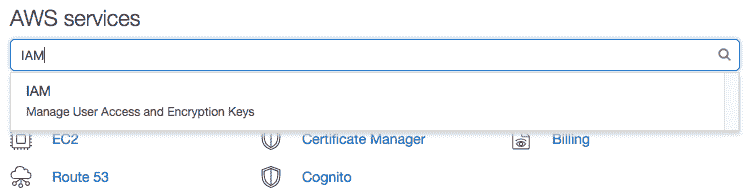

AWS IAM

我们可以在左侧面板上选择`Users`创建一个用户：

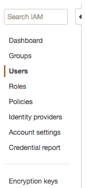

选择编程访问并将用户分配到默认管理员组：


最后一步将显示访问密钥 ID 和秘密访问密钥。将它们复制到文本文件中，并将其保存在安全的地方：

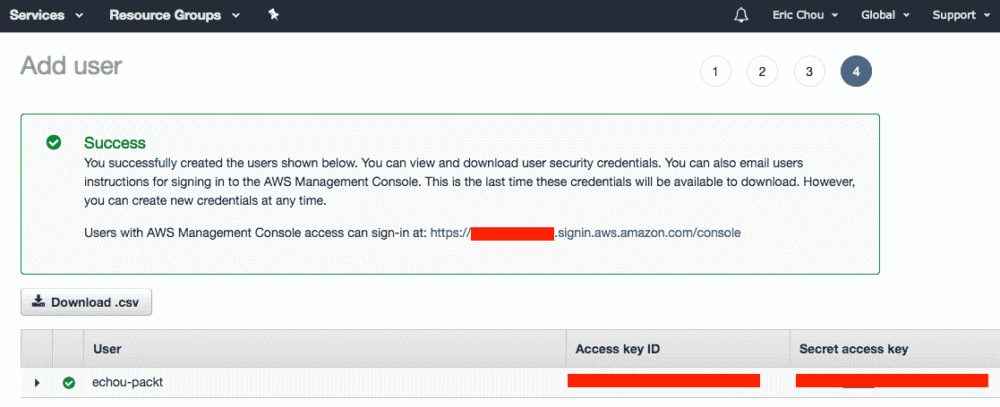

我们将通过终端中的`aws configure`完成 AWS CLI 认证凭证设置。在下一节中，我们将介绍 AWS 地区；我们现在将使用`us-east-1`，但请稍后返回并更改此值：

```py
$ aws configure
AWS Access Key ID [None]: <key>
AWS Secret Access Key [None]: <secret>
Default region name [None]: us-east-1
Default output format [None]: json
```

我们还将安装 AWS Python SDK，Boto3（[https://boto3.readthedocs.io/en/latest/](https://boto3.readthedocs.io/en/latest/) ：

```py
$ sudo pip install boto3
$ sudo pip3 install boto3

# verification
$ python3
Python 3.5.2 (default, Nov 23 2017, 16:37:01)
[GCC 5.4.0 20160609] on linux
Type "help", "copyright", "credits" or "license" for more information.
>>> import boto3
>>> exit()
```

我们现在准备好进入后续章节，首先介绍 AWS 云网络服务

# AWS 网络概述

当我们讨论 AWS 服务时，我们需要从顶部开始讨论区域和可用性区域。它们对我们的所有服务都有重大影响。在撰写本书时，AWS 列出了全球 18 个地区、55 个**可用性****区域**（**AZ**）和一个本地区。用 AWS 全球基础设施的话说，（[）https://aws.amazon.com/about-aws/global-infrastructure/](https://aws.amazon.com/about-aws/global-infrastructure/) ：

"The AWS Cloud infrastructure is built around Regions and Availability Zones (AZs). AWS Regions provide multiple, physically separated and isolated Availability Zones which are connected with low latency, high throughput, and highly redundant networking."

AWS 提供的一些服务是全球性的，但大多数服务是基于地区的。这对我们来说意味着，我们应该在最接近预期用户的地区建设基础设施。这将减少服务对客户的延迟。如果我们的用户在美国东海岸，我们应该选择`us-east-1`（北弗吉尼亚州）或`us-east-2`（俄亥俄州）作为我们的地区，如果服务是基于地区的：


AWS regions 

并非所有地区都可供所有用户使用，例如，默认情况下，美国的用户无法使用 GovCloud 和中国地区。您可以通过`aws ec2 describe-regions`列出您可以使用的地区：

```py
$ aws ec2 describe-regions
{
 "Regions": [
 {
 "RegionName": "ap-south-1",
 "Endpoint": "ec2.ap-south-1.amazonaws.com"
 },
 {
 "RegionName": "eu-west-3",
 "Endpoint": "ec2.eu-west-3.amazonaws.com"
 },
...
```

所有的区域都是完全独立的。大多数资源不是跨区域复制的。如果我们有多个区域，比如说`US-East`和`US-West`，并且它们之间需要冗余，我们将需要自己复制必要的资源。您选择区域的方式位于控制台的右上角：


If the service is region-based, for example, EC2, the portal will only show the service when the right region is selected. If our EC2 instances are in `us-east-1` and we are looking at the us-west-1 portal, none of the EC2 instances will show up. I have made this mistake a few times, and wondered where all of my instances went!

前面 AWS 区域屏幕截图中区域后面的数字表示每个区域中的 AZ 数量。每个区域都有多个可用性区域。每个可用性区域都是隔离的，但区域中的 AZ 是通过低延迟光纤连接连接的：

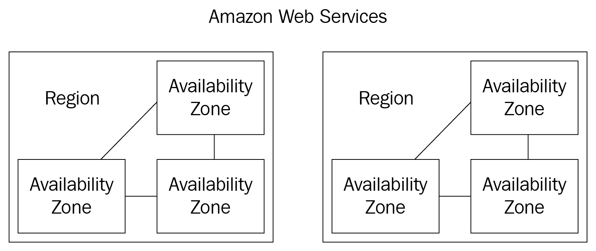

AWS regions and availability zones

我们构建的许多资源都是跨可用性区域复制的。AZ 的概念非常重要，它的约束对于我们将要构建的网络服务非常重要

AWS independently maps availability zones to identifiers for each account. For example, my availability zone, us-eas-1a, might not be the same as `us-east-1a` for another account. 

我们可以在 AWS CLI 中检查区域中的 AZs：

```py
$ aws ec2 describe-availability-zones --region us-east-1
{
 "AvailabilityZones": [
 {
 "Messages": [],
 "RegionName": "us-east-1",
 "State": "available",
 "ZoneName": "us-east-1a"
 },
 {
 "Messages": [],
 "RegionName": "us-east-1",
 "State": "available",
 "ZoneName": "us-east-1b"
 },
...
```

为什么我们如此关心区域和可用性区域？正如我们将在接下来的几节中看到的，网络服务通常受区域和可用性区域的约束。**例如，虚拟私有云**需要完全驻留在一个区域内，每个子网需要完全驻留在一个可用区域内。另一方面，**NAT 网关**是 AZ 绑定的，因此如果需要冗余，我们需要为每个 AZ 创建一个。我们将更详细地介绍这两种服务，但这里提供了它们的用例，作为区域和可用性区域如何成为 AWS 网络服务提供的基础的示例

**AWS 边缘位置**是 26 个国家 59 个城市的**AWS CloudFront**内容交付网络的一部分。这些边缘位置用于分发延迟较低的内容，其占地面积小于 Amazon 为区域和可用性区域构建的完整数据中心。有时，人们会将边缘位置的存在点误认为是完整的 AWS 区域。如果封装外形仅列为边缘位置，则不会提供 AWS 服务，如 EC2 或 S3。我们将在*AWS CloudFront*部分重新查看边缘位置

**AWS 运输中心**是 AWS 网络记录最少的方面之一。詹姆斯·汉密尔顿在 2014 年的《美国焊接学会关于发明》主题演讲（[中提到了这一点 https://www.youtube.com/watch?v=JIQETrFC_SQ](https://www.youtube.com/watch?v=JIQETrFC_SQ) 作为区域内不同 AZ 的聚集点。平心而论，我们不知道经过这么多年后，公交中心是否仍然存在并以同样的方式运行。但是，我们可以对公交中心的位置及其与**AWS 直连**服务的相关性进行有根据的猜测，我们将在本章后面介绍。

James Hamilton, a VP and distinguished engineer from AWS, is one of the most influential technologists at AWS. If there is anybody who I would consider authoritative when it comes to AWS networking, it would be him. You can read more about his visions on his blog, Perspectives, at [https://perspectives.mvdirona.com/](https://perspectives.mvdirona.com/). 

不可能在一章中涵盖与 AWS 相关的所有服务。有些与网络无关的相关服务我们没有足够的空间覆盖，但我们应该熟悉：

*   **识别和访问管理**（**IAM**）**服务，[https://aws.amazon.com/iam/](https://aws.amazon.com/iam/) 是使我们能够安全管理 AWS 服务和资源访问的服务。**
***   **亚马逊资源名称**（**ARNs**）、[https://docs.aws.amazon.com/general/latest/gr/aws-arns-and-namespaces.html](https://docs.aws.amazon.com/general/latest/gr/aws-arns-and-namespaces.html) ，在所有 AWS 中唯一标识 AWS 资源。当我们需要识别需要访问 VPC 资源的服务（如 DynamoDB 和 API 网关）时，此资源名称非常重要*   **亚马逊弹性计算云****EC2**、[https://aws.amazon.com/ec2/](https://aws.amazon.com/ec2/) 是使我们能够通过 AWS 接口获取和提供计算能力的服务，如 Linux 和 Windows 实例。在本章的示例中，我们将使用 EC2 实例**

**For the sake of learning, we will exclude AWS GovCloud (US) and China, neither of which uses the AWS global infrastructure and have their own limitations. 

这是对 AWS 网络概述的一个相对较长的介绍，但也是一个重要的介绍。这些概念和术语将在本书其余章节中提及。在下一节中，我们将了解 AWS 网络最重要的概念（在我看来）：虚拟私有云

# 虚拟私有云

**亚马逊虚拟私有云（Amazon VPC）**允许客户将 AWS 资源发布到专用于客户账户的虚拟网络中。它确实是一个可定制的网络，允许您定义自己的 IP 地址范围、添加和删除子网、创建路由、添加 VPN 网关、关联安全策略、将 EC2 实例连接到自己的数据中心等等。在 VPC 不可用的早期，AZ 中的所有 EC2 实例都位于一个单一的平面网络上，由所有客户共享。客户将其信息放到云中的舒适程度如何？我想不太可能。从 2007 年推出 EC2 到 2009 年推出 VPC，VPC 功能是 AWS 最受欢迎的功能之一

The packets leaving your EC2 host in a VPC are intercepted by the Hypervisor. The Hypervisor will check them with a mapping service which understands our VPC construct. The packets leaving your EC2 hosts are encapsulated with the AWS real servers' source and destination addresses. The encapsulation and mapping service allows for the flexibility of VPC, but also some of the limitations (multicast, sniffing) of VPC. This is, after all, a virtual network. 

自 2013 年 12 月起，所有 EC2 实例均为专有网络。如果我们使用启动向导来创建 EC2 实例，它将自动放入带有虚拟互联网网关的默认 VPC 中，供公众访问。在我看来，除了最基本的用例之外，所有的用例都应该使用默认的 VPC。在大多数情况下，我们需要定义非默认的定制专有网络

让我们使用`us-east-1`中的 AWS 控制台创建以下 VPC：


Our first VPC in US-East-1

如果您还记得，VPC 是 AWS 区域绑定的，子网是基于可用性区域的。我们的第一个专有网络将设在`us-east-1`；这三个子网将分配给 1a、1b 和 1c 中的三个不同可用性区域。

使用 AWS 控制台创建 VPC 和子网非常简单，AWS 在线提供了许多很好的教程。我已在 VPC 仪表板上列出了相关链接的步骤：

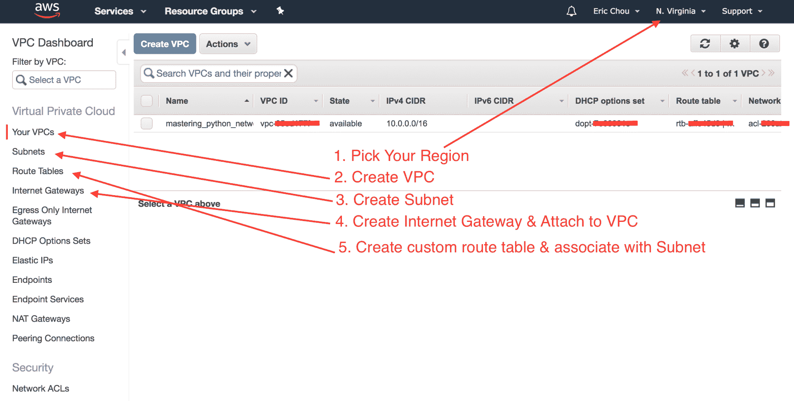

前两个步骤是点击过程，大多数网络工程师即使没有经验也可以完成。VPC 默认只包含本地路由`10.0.0.0/16`。现在，我们将创建一个 internet 网关并将其与 VPC 关联：


然后，我们可以创建一个自定义路由表，其中默认路由指向 internet 网关。我们将此路由表与我们在`us-east-1a``10.0.0.0/24`中的子网相关联，从而允许它面向公众：

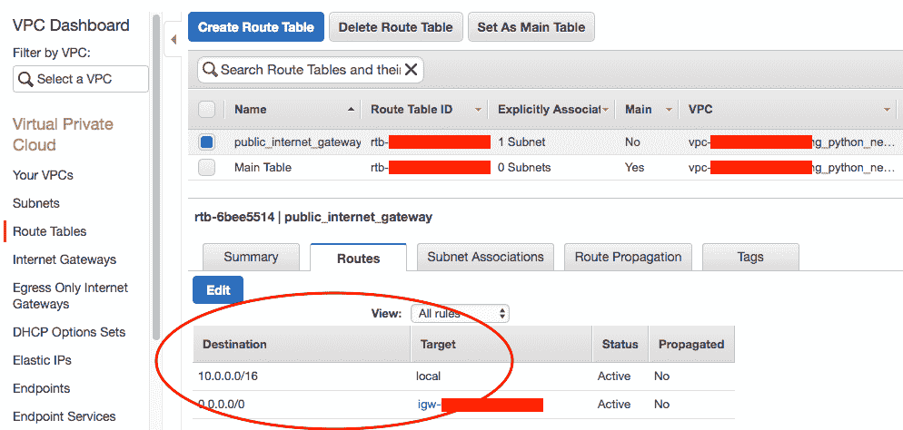

Route table

让我们使用 Boto3 Python SDK 来查看我们创建了什么；我使用标签`mastering_python_networking_demo`作为 VPC 的标签，我们可以将其用作文件管理器：

```py
$ cat Chapter10_1_query_vpc.py
#!/usr/bin/env python3

import json, boto3

region = 'us-east-1'
vpc_name = 'mastering_python_networking_demo'

ec2 = boto3.resource('ec2', region_name=region)
client = boto3.client('ec2')

filters = [{'Name':'tag:Name', 'Values':[vpc_name]}]

vpcs = list(ec2.vpcs.filter(Filters=filters))
for vpc in vpcs:
    response = client.describe_vpcs(
                 VpcIds=[vpc.id,]
                )
    print(json.dumps(response, sort_keys=True, indent=4))
```

此脚本将允许我们以编程方式查询我们创建的 VPC 的区域：

```py
$ python3 Chapter10_1_query_vpc.py
{
 "ResponseMetadata": {
 "HTTPHeaders": {
 "content-type": "text/xml;charset=UTF-8",
 ...
 },
 "HTTPStatusCode": 200,
 "RequestId": "48e19be5-01c1-469b-b6ff-9c45f2745483",
 "RetryAttempts": 0
 },
 "Vpcs": [
 {
 "CidrBlock": "10.0.0.0/16",
 "CidrBlockAssociationSet": [
 {
 "AssociationId": "...",
 "CidrBlock": "10.0.0.0/16",
 "CidrBlockState": {
 "State": "associated"
 }
 }
 ],
 "DhcpOptionsId": "dopt-....",
 "InstanceTenancy": "default",
 "IsDefault": false,
 "State": "available",
 "Tags": [
 {
 "Key": "Name",
 "Value": "mastering_python_networking_demo"
 }
 ],
 "VpcId": "vpc-...."
 }
 ]
}

```

The Boto3 VPC API documentation can be found at [https://boto3.readthedocs.io/en/latest/reference/services/ec2.html#vpc](https://boto3.readthedocs.io/en/latest/reference/services/ec2.html#vpc). 

您可能想知道 VPC 内的子网如何相互连接。在物理网络中，网络需要连接到路由器，以超越其自身的本地网络。在 VPC 中没有什么不同，只是它是一个带有本地网络默认路由表的*隐式路由器*，在我们的示例中是`10.0.0.0/16`。这个隐式路由器是在我们创建 VPC 时创建的

# 路由表和路由目标

路由是网络工程中最重要的课题之一。值得更仔细地研究一下。我们在创建 VPC 时已经看到了一个隐式路由器和主路由表。在上一个示例中，我们创建了一个 internet 网关，一个自定义路由表，其中默认路由指向 internet 网关，并将自定义路由表与子网相关联。

路由目标的概念是 VPC 与传统网络有点不同。总之：

*   每个 VPC 都有一个隐式路由器
*   每个 VPC 都有主路由表，其中填充了本地路由
*   您可以创建自定义路由表
*   每个子网都可以遵循自定义路由表或默认的主路由表
*   路由表路由目标可以是 internet 网关、NAT 网关、VPC 对等点等

我们可以使用 Boto3 查看自定义路由表以及与子网的关联：

```py
$ cat Chapter10_2_query_route_tables.py
#!/usr/bin/env python3

import json, boto3

region = 'us-east-1'
vpc_name = 'mastering_python_networking_demo'

ec2 = boto3.resource('ec2', region_name=region)
client = boto3.client('ec2')

response = client.describe_route_tables()
print(json.dumps(response['RouteTables'][0], sort_keys=True, indent=4))
```

我们只有一个自定义路由表：

```py
$ python3 Chapter10_2_query_route_tables.py
{
 "Associations": [
 {
 ....
 }
 ],
 "PropagatingVgws": [],
 "RouteTableId": "rtb-6bee5514",
 "Routes": [
 {
 "DestinationCidrBlock": "10.0.0.0/16",
 "GatewayId": "local",
 "Origin": "CreateRouteTable",
 "State": "active"
 },
 {
 "DestinationCidrBlock": "0.0.0.0/0",
 "GatewayId": "igw-...",
 "Origin": "CreateRoute",
 "State": "active"
 }
 ],
 "Tags": [
 {
 "Key": "Name",
 "Value": "public_internet_gateway"
 }
 ],
 "VpcId": "vpc-..."
}
```

通过单击左侧子网部分并按照屏幕上的说明直接创建子网。为此，我们将创建三个子网，`10.0.0.0/24`公共子网，`10.0.1.0/24`和`10.0.2.0/24`私有子网

我们现在有一个工作的 VPC，它有三个子网：一个公共子网和两个私有子网。到目前为止，我们已经使用 AWS CLI 和 Boto3 库与 AWS VPC 进行交互。让我们来看看另一个自动化工具，Po.T0.

# 云信息自动化

AWS 云信息（[https://aws.amazon.com/cloudformation/](https://aws.amazon.com/cloudformation/) ），是我们可以使用文本文件描述和启动所需资源的一种方式。我们可以使用 CloudFormation 在`us-west-1`区域提供另一个专有网络：

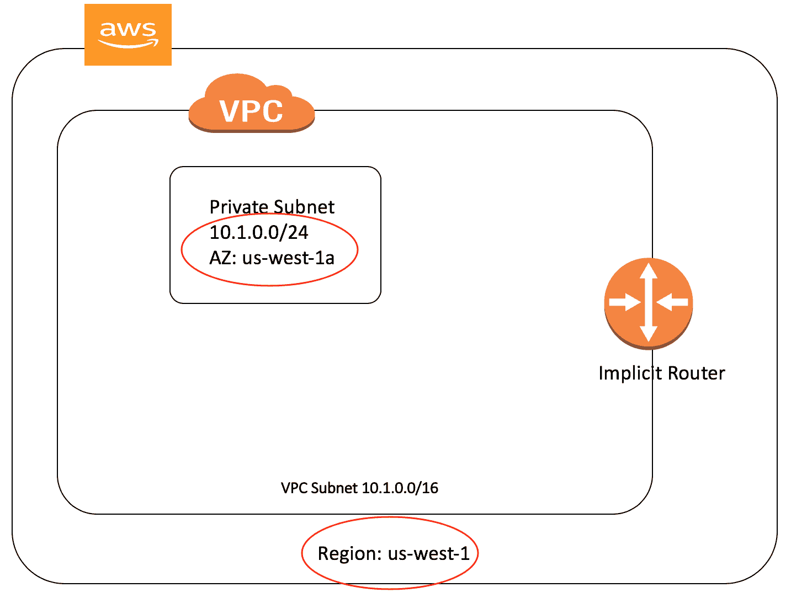

VPC for US-West-1

CloudFormation 模板可以是 YAML 或 JSON 格式；我们将使用 YAML 作为第一个配置模板：

```py
$ cat Chapter10_3_cloud_formation.yml
AWSTemplateFormatVersion: '2010-09-09'
Description: Create VPC in us-west-1
Resources:
 myVPC:
 Type: AWS::EC2::VPC
 Properties:
 CidrBlock: '10.1.0.0/16'
 EnableDnsSupport: 'false'
 EnableDnsHostnames: 'false'
 Tags:
 - Key: Name
 Value: 'mastering_python_networking_demo_2'
```

我们可以通过 AWS CLI 执行模板。请注意，我们在执行中指定了一个区域`us-west-1`：

```py
$ aws --region us-west-1 cloudformation create-stack --stack-name 'mpn-ch10-demo' --template-body file://Chapter10_3_cloud_formation.yml
{
 "StackId": "arn:aws:cloudformation:us-west-1:<skip>:stack/mpn-ch10-demo/<skip>"
}
```

我们可以通过 AWS CLI 验证状态：

```py
$ aws --region us-west-1 cloudformation describe-stacks --stack-name mpn-ch10-demo
{
 "Stacks": [
 {
 "CreationTime": "2018-07-18T18:45:25.690Z",
 "Description": "Create VPC in us-west-1",
 "DisableRollback": false,
 "StackName": "mpn-ch10-demo",
 "RollbackConfiguration": {},
 "StackStatus": "CREATE_COMPLETE",
 "NotificationARNs": [],
 "Tags": [],
 "EnableTerminationProtection": false,
 "StackId": "arn:aws:cloudformation:us-west-1<skip>"
 }
 ]
}
```

出于演示目的，最后一个 CloudFormation 模板创建了一个没有任何子网的 VPC。让我们删除该专有网络，并使用以下模板创建专有网络和子网。请注意，在创建 VPC 之前，我们不会有 VPC id，因此我们将在创建子网时使用一个特殊变量来引用 VPC id。这与我们可用于其他资源（如路由表和 internet 网关）的技术相同：

```py
$ cat Chapter10_4_cloud_formation_full.yml
AWSTemplateFormatVersion: '2010-09-09'
Description: Create subnet in us-west-1
Resources:
 myVPC:
 Type: AWS::EC2::VPC
 Properties:
 CidrBlock: '10.1.0.0/16'
 EnableDnsSupport: 'false'
 EnableDnsHostnames: 'false'
 Tags:
 - Key: Name
 Value: 'mastering_python_networking_demo_2'

 mySubnet:
 Type: AWS::EC2::Subnet
 Properties:
 VpcId: !Ref myVPC
 CidrBlock: '10.1.0.0/24'
 AvailabilityZone: 'us-west-1a'
 Tags:
 - Key: Name
 Value: 'mpn_demo_subnet_1'
```

我们可以按如下方式执行和验证资源的创建：

```py
$ aws --region us-west-1 cloudformation create-stack --stack-name mpn-ch10-demo-2 --template-body file://Chapter10_4_cloud_formation_full.yml
{
 "StackId": "arn:aws:cloudformation:us-west-1:<skip>:stack/mpn-ch10-demo-2/<skip>"
}

$ aws --region us-west-1 cloudformation describe-stacks --stack-name mpn-ch10-demo-2
{
 "Stacks": [
 {
 "StackStatus": "CREATE_COMPLETE",
 ...
 "StackName": "mpn-ch10-demo-2",
 "DisableRollback": false
 }
 ]
}
```

我们还可以从 AWS 控制台验证 VPC 和子网信息。我们将首先从控制台验证 VPC：

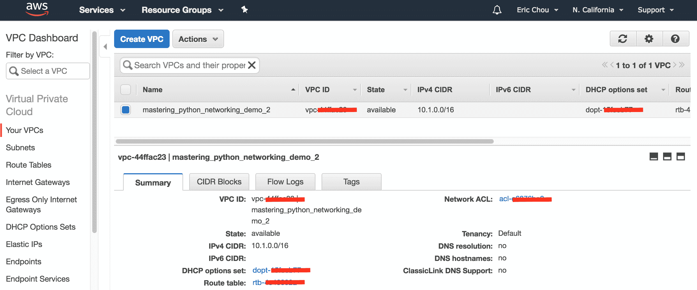

VPC in us-west-1

我们还可以查看子网：


Subnet in us-west-1

我们现在在美国的两个海岸有两个 VPC。它们目前的行为就像两个岛屿，各自独立。这可能是您想要的操作状态，也可能不是。如果您希望 to VPC 能够相互连接，我们可以使用 VPC 对等（[https://docs.aws.amazon.com/AmazonVPC/latest/PeeringGuide/vpc-peering-basics.html](https://docs.aws.amazon.com/AmazonVPC/latest/PeeringGuide/vpc-peering-basics.html) 允许直接通信

VPC peering is not limited to the same account. You can connect VPCs across different accounts, as long as the request was accepted and the other aspects (security, routing, DNS name) are taken care of. 

在下一节中，我们将了解 VPC 安全组和网络访问控制列表

# 安全组和网络 ACL

AWS 安全组和访问控制列表可在 VPC 的安全部分找到：

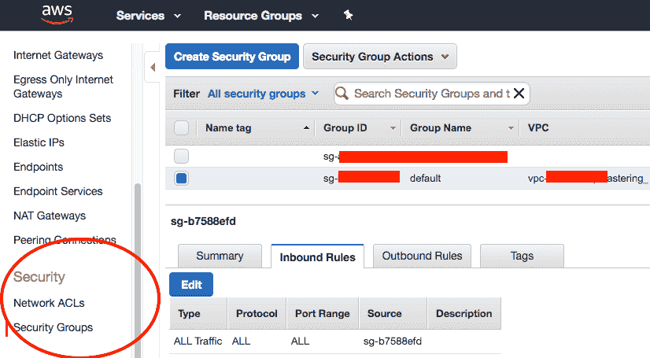

VPC security

安全组是一个有状态的虚拟防火墙，用于控制资源的入站和出站访问。大多数情况下，我们将使用安全组来限制对 EC2 实例的公共访问。目前的限制是每个专有网络中有 500 个安全组。每个安全组最多可以包含 50 条入站和 50 条出站规则。您可以使用以下示例脚本创建安全组和两个简单的入口规则：

```py
$ cat Chapter10_5_security_group.py
#!/usr/bin/env python3

import boto3

ec2 = boto3.client('ec2')

response = ec2.describe_vpcs()
vpc_id = response.get('Vpcs', [{}])[0].get('VpcId', '')

# Query for security group id
response = ec2.create_security_group(GroupName='mpn_security_group',
 Description='mpn_demo_sg',
 VpcId=vpc_id)
security_group_id = response['GroupId']
data = ec2.authorize_security_group_ingress(
 GroupId=security_group_id,
 IpPermissions=[
 {'IpProtocol': 'tcp',
 'FromPort': 80,
 'ToPort': 80,
 'IpRanges': [{'CidrIp': '0.0.0.0/0'}]},
 {'IpProtocol': 'tcp',
 'FromPort': 22,
 'ToPort': 22,
 'IpRanges': [{'CidrIp': '0.0.0.0/0'}]}
 ])
print('Ingress Successfully Set %s' % data)

# Describe security group
#response = ec2.describe_security_groups(GroupIds=[security_group_id])
print(security_group_id)
```

我们可以执行该脚本，并在创建可与其他 AWS 资源关联的安全组时收到确认：

```py
$ python3 Chapter10_5_security_group.py
Ingress Successfully Set {'ResponseMetadata': {'RequestId': '<skip>', 'HTTPStatusCode': 200, 'HTTPHeaders': {'server': 'AmazonEC2', 'content-type': 'text/xml;charset=UTF-8', 'date': 'Wed, 18 Jul 2018 20:51:55 GMT', 'content-length': '259'}, 'RetryAttempts': 0}}
sg-<skip>
```

网络**访问控制列表**（**ACL**）是无状态的附加安全层。VPC 中的每个子网都与一个网络 ACL 相关联。由于 ACL 是无状态的，因此需要同时指定入站和出站规则

安全组和 ACL 之间的重要区别如下：

*   安全组在网络接口级别运行，而 ACL 在子网级别运行
*   对于安全组，我们只能指定允许规则，但不能指定拒绝规则，而 ACL 同时支持允许和拒绝规则
*   安全组是有状态的；自动允许返回交通。返回流量需要在 ACL 中特别允许

让我们看看 AWS 网络最酷的特性之一，即弹性 IP。当我最初学习弹性 IP 时，我被动态分配和重新分配 IP 地址的能力所震撼

# 弹性 IP

**弹性 IP**（**EIP**是一种使用可从互联网访问的公共 IPv4 地址的方式。它可以动态地分配给 EC2 实例、网络接口或其他资源。弹性 IP 的几个特点如下：

*   弹性 IP 与帐户关联，并且是特定于区域的。例如，`us-east-1`中的 EIP 只能与`us-east-1`中的资源关联。
*   您可以解除弹性 IP 与资源的关联，并将其与其他资源重新关联。这种灵活性有时可用于确保高可用性。例如，您可以通过将相同的 IP 地址从较小的 EC2 实例重新分配到较大的 EC2 实例，从较小的 EC2 实例迁移到较大的 EC2 实例。
*   弹性 IP 每小时收取少量费用。

您可以从门户请求弹性 IP。分配后，您可以将其与所需资源关联：

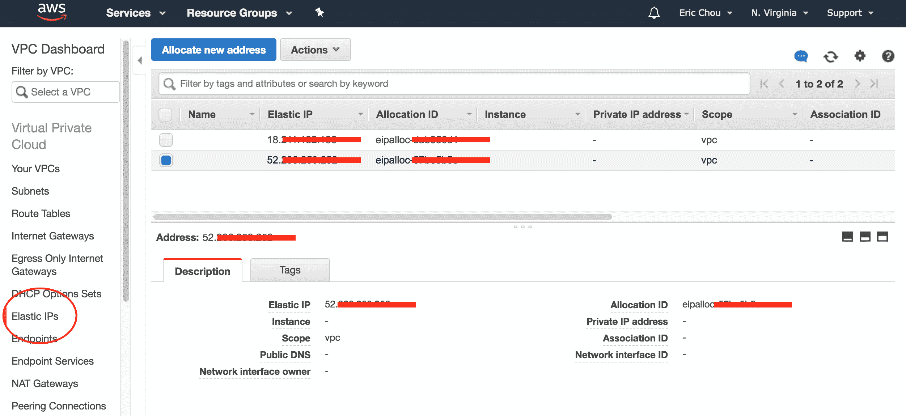

Elastic IP Unfortunately, Elastic IP has a default limit of five per region, [https://docs.aws.amazon.com/vpc/latest/userguide/amazon-vpc-limits.html](https://docs.aws.amazon.com/vpc/latest/userguide/amazon-vpc-limits.html).

在下一节中，我们将了解如何使用 NAT 网关允许私有子网与 internet 进行通信

# NAT 网关

为了允许从 internet 访问 EC2 公共子网中的主机，我们可以分配一个弹性 IP，并将其与 EC2 主机的网络接口相关联。然而，在撰写本书时，每个 EC2-VPC 有五个弹性 IP 的限制（[https://docs.aws.amazon.com/AmazonVPC/latest/UserGuide/VPC_Appendix_Limits.html#vpc-限制 EIP](https://docs.aws.amazon.com/AmazonVPC/latest/UserGuide/VPC_Appendix_Limits.html#vpc-limits-eips)）。有时，允许私有子网中的主机在需要时进行出站访问，而无需在弹性 IP 和 EC2 主机之间创建永久的一对一映射，这将是一件好事

这就是**NAT 网关**可以提供帮助的地方，通过执行**网络地址转换**（**NAT**允许私有子网中的主机临时出站访问。此操作类似于我们通常在公司防火墙上执行的**端口地址转换**（**PAT**）。要使用 NAT 网关，我们可以执行以下步骤：

*   在子网中创建 NAT 网关，通过 AWS CLI、Boto3 库或 AWS 控制台访问 internet 网关。NAT 网关需要分配一个弹性 IP。
*   将专用子网中的默认路由指向 NAT 网关。
*   NAT 网关将遵循到 internet 网关的默认路由进行外部访问。

此操作可在下图中说明：


NAT Gateway operations

NAT 网关最常见的问题之一通常围绕 NAT 网关应该位于哪个子网。经验法则是记住 NAT 网关需要公共访问。因此，应在具有公共 internet 访问的子网中创建，并为其分配可用的弹性 IP：


NAT Gateway creation

在下一节中，我们将了解如何将 AWS 中闪亮的虚拟网络连接到物理网络

# 直接连接和 VPN

到目前为止，我们的专有网络是一个独立的网络，驻留在 AWS 网络中。它是灵活和功能性的，但是要访问 VPC 内部的资源，我们需要使用他们面向 internet 的服务（如 SSH 和 HTTPS）来访问它们

在本节中，我们将介绍 AWS 允许我们从专用网络连接到 VPC 的两种方式：IPSec VPN 网关和直接连接

# VPN 网关

将本地网络连接到 VPC 的第一种方法是使用传统的 IPSec VPN 连接。我们需要一个可公开访问的设备，可以建立到 AWS VPN 设备的 VPN 连接。客户网关需要支持基于路由的 IPSec VPN，其中 VPN 连接被视为路由协议可以在虚拟链路上运行的连接。目前，AWS 建议使用 BGP 交换路由

在 VPC 端，我们可以遵循类似的路由表，其中我们可以将特定子网路由到**虚拟专用网关**目标：


VPC VPN connection (source: [https://docs.aws.amazon.com/AmazonVPC/latest/UserGuide/VPC_VPN.html](https://docs.aws.amazon.com/AmazonVPC/latest/UserGuide/VPC_VPN.html))

除了 IPSecVPN，我们还可以使用专用电路进行连接

# 直接连接

我们看到的 IPSecVPN 连接是一种简单的方式，可以为本地设备提供到 AWS 云资源的连接。然而，它与 internet 上的 IPSec 有着相同的缺点：它不可靠，我们几乎无法控制它。只有很少的性能监控和**服务级别协议**（**SLA**）直到连接到达我们可以控制的互联网部分

由于所有这些原因，任何生产级别的任务关键型流量都更有可能通过 Amazon 提供的第二个选项（即 AWS Direct Connect）进行传输。AWS Direct Connect 允许客户使用专用虚拟电路将其数据中心和托管连接到其 AWS VPC。该操作中有点困难的部分通常是将我们的网络连接到我们可以与 AWS 进行物理连接的地方，通常是在运营商酒店。您可以在此处找到 AWS 直连位置列表：[https://aws.amazon.com/directconnect/details/](https://aws.amazon.com/directconnect/details/) 。直接连接链路只是一种光纤配线连接，您可以从特定的运营商酒店订购，以将网络配线到网络端口，并配置 dot1q 中继的连接

通过具有 MPLS 电路和聚合链路的第三方运营商直接连接的连接选项也越来越多。我发现并使用的最实惠的选择之一是 Equinix 云交换（[https://www.equinix.com/services/interconnection-connectivity/cloud-exchange/](https://www.equinix.com/services/interconnection-connectivity/cloud-exchange/) ）。通过使用 Equinix 云交换，我们可以利用同一条线路并连接到不同的云提供商，只需专用线路的一小部分成本：


Equinix Cloud Exchange (source: [https://www.equinix.com/services/interconnection-connectivity/cloud-exchange/](https://www.equinix.com/services/interconnection-connectivity/cloud-exchange/)[)](https://www.equinix.com/services/interconnection-connectivity/cloud-exchange/)

在下一节中，我们将了解 AWS 提供的一些网络扩展服务

# 网络扩展服务

在本节中，我们将了解 AWS 提供的一些网络服务。许多服务没有直接的网络含义，例如 DNS 和内容分发网络。由于它们与网络和应用程序的性能密切相关，因此在我们的讨论中它们是相关的

# 弹性负载平衡

**弹性负载平衡****ELB**允许来自互联网的传入流量自动分布在多个 EC2 实例上。就像物理世界中的负载平衡器一样，这使我们能够在减少每服务器负载的同时拥有更好的冗余和容错能力。ELB 有两种风格：应用程序和网络负载平衡

应用程序负载平衡器通过 HTTP 和 HTTPS 处理 web 流量；网络负载平衡器在 TCP 级别上运行。如果您的应用程序在 HTTP 或 HTTPS 上运行，通常最好使用应用程序负载平衡器。否则，使用网络负载平衡器是一个不错的选择

有关应用程序和网络负载平衡器的详细比较，请参见[https://aws.amazon.com/elasticloadbalancing/details/](https://aws.amazon.com/elasticloadbalancing/details/) ：

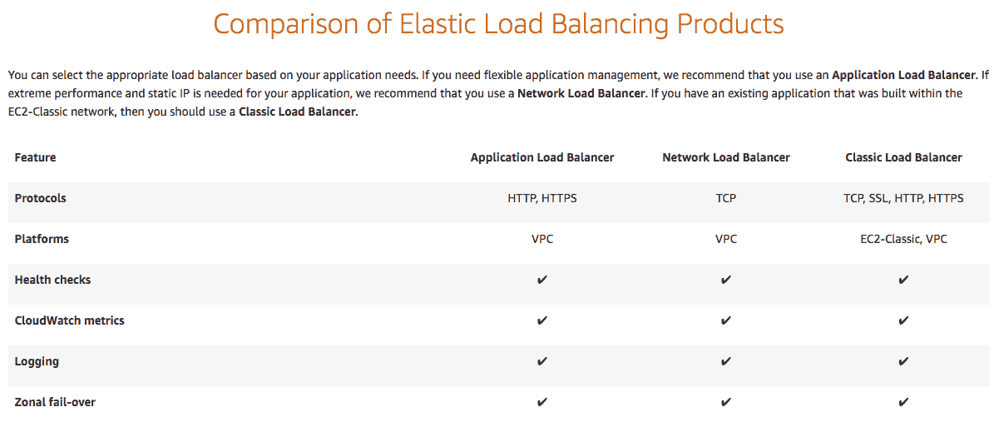

Elastic Load Balancer Comparison (Source: [https://aws.amazon.com/elasticloadbalancing/details/](https://aws.amazon.com/elasticloadbalancing/details/))

弹性负载均衡器提供了一种在流量进入我们地区的资源后进行负载平衡的方法。AWS Route53 DNS 服务允许区域间的地理负载平衡。

# 路由 53 DNS 服务

我们都知道什么是域名服务；路由 53 是 AWS 的 DNS 服务。Route53 是一个全方位服务的域注册器，您可以直接从 AWS 购买和管理域。关于网络服务，DNS 允许通过服务域名在区域之间以循环方式实现地理区域之间的负载平衡

在使用 DNS 进行负载平衡之前，我们需要以下各项：

*   每个预期负载平衡区域中的弹性负载平衡器。
*   注册域名。我们不需要 Route53 作为域注册器。
*   Route53 是域的 DNS 服务。

然后，我们可以在两个弹性负载平衡器之间的活动-活动环境中使用基于路由 53 延迟的路由策略和运行状况检查

# CloudFront CDN 服务

CloudFront 是亚马逊的**内容交付网络**（**CDN**），它通过向更靠近客户的内容提供物理服务来减少内容交付的延迟。内容可以是静态网页内容、视频、应用程序、API 或最近的 Lambda 函数。CloudFront edge 位置包括现有的 AWS 区域，但也位于全球许多其他位置。CloudFront 的高层操作如下：

*   用户访问您的网站以获取一个或多个对象
*   DNS 将请求路由到距离用户请求最近的 Amazon CloudFront edge 位置
*   CloudFrontEdge 位置将通过缓存为内容提供服务，或从源服务器请求对象

AWS CloudFront 和 CDN 服务通常由应用程序开发人员或 DevOps 工程师处理。然而，了解他们的运作总是好的

# 其他 AWS 网络服务

还有很多其他 AWS 网络服务，我们没有足够的空间来覆盖。本节列出了一些更重要的问题：

*   **AWS 公交专用线**[https://aws.amazon.com/blogs/aws/aws-solution-transit-vpc/](https://aws.amazon.com/blogs/aws/aws-solution-transit-vpc/) ：这是一种将多个虚拟私有云连接到作为中转中心的公共 VPC 的方法。这是一项相对较新的服务，但它可以最小化您需要设置和管理的连接。当您需要在单独的 AWS 帐户之间共享资源时，这也可以作为一种工具。
*   **亚马逊卫视**[https://aws.amazon.com/guardduty/](https://aws.amazon.com/guardduty/) ：这是一项托管威胁检测服务，持续监控恶意或未经授权的行为，以帮助保护我们的 AWS 工作负载。它监视 API 调用或可能未经授权的部署。
*   **AWS WAF****[https://aws.amazon.com/waf/](https://aws.amazon.com/waf/) ：这是一个 web 应用程序防火墙，有助于保护 web 应用程序免受常见漏洞攻击。我们可以定义自定义的 web 安全规则来允许或阻止 web 流量。**
***   **AWS 屏蔽**[https://aws.amazon.com/shield/](https://aws.amazon.com/shield/) ：这是一种托管的**分布式拒绝服务**（**DDoS**）保护服务，用于保护 AWS 上运行的应用程序。保护服务对所有基层客户免费；AWS Shield 的高级版本是一项收费服务。**

 **# 总结

在本章中，我们介绍了 AWS 云网络服务。我们浏览了 AWS 网络对区域、可用区域、边缘位置和运输中心的定义。通过了解整个 AWS 网络，我们可以很好地了解其他 AWS 网络服务的一些限制和内容。在本章中，我们使用 AWS CLI、Python Boto3 库以及 CloudFormation 来自动化一些任务

我们通过路由表和路由目标的配置深入介绍了 AWS 虚拟私有云。关于安全组和网络 ACL 的示例控制我们 VPC 的安全。我们还研究了关于允许外部访问的弹性 IP 和 NAT 网关

有两种方法可以将 AWS VPC 连接到本地网络：直接连接和 IPSec VPN。我们简要介绍了每种方法以及使用它们的优点。在本章末尾，我们介绍了 AWS 提供的网络扩展服务，包括弹性负载平衡、Route53 DNS 和 CloudFront

在[第 11 章](11.html)*与 Git*的合作中，我们将更深入地了解我们一直在使用的版本控制系统：Git****