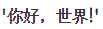

# 七、文本处理和正则表达式

在本章中，我们将学习文本处理和正则表达式。文本处理是创建或修改文本的过程。Python 有一个非常强大的名为正则表达式的库，它执行搜索和提取数据等任务。您将学习如何处理文件，并学习如何读取和写入文件。

我们将学习用于正则表达式和 Python 文本处理的`re`Python 模块。我们将学习`re`模块的`match()`、`search()`、`findall()`和`sub()`功能。我们还将学习如何使用`textwrap`模块在 Python 中进行文本包装。最后，我们将学习 unicode 字符。

在本章中，我们将介绍以下主题：

*   文本换行
*   正则表达式
*   Unicode 字符串

# 文本换行

在本节中，我们将了解`textwrap`Python 模块。此模块提供完成所有工作的`TextWrapper`类。`textwrap`模块用于格式化和包装纯文本。本模块提供五大功能：`wrap()`、`fill()`、`dedent()`、`indent()`、`shorten()`。现在我们将逐一学习这些函数。

# wrap（）函数

`wrap()`函数用于将整个段落包装成单个字符串。输出将是一个输出行列表。

语法为`textwrap.wrap(text, width)`：

*   `text`：要包装的文本。
*   `width`：缠绕线允许的最大长度。默认值为`70`。

现在，我们将看到一个`wrap()`的示例。创建一个`wrap_example.py`脚本，并在其中写入以下内容：

```py
import textwrap

sample_string = '''Python is an interpreted high-level programming language for general-purpose programming. Created by Guido van Rossum and first released in 1991, Python has a design philosophy that emphasizes code readability, notably using significant whitespace.'''

w = textwrap.wrap(text=sample_string, width=30)
print(w)
```

运行脚本，您将获得如下输出：

```py
student@ubuntu:~/work$ python3 wrap_example.py
['Python is an interpreted high-', 'level programming language for', 'general-purpose programming.', 'Created by Guido van Rossum', 'and first released in', '1991, Python has a design', 'philosophy that emphasizes', 'code readability,  notably', 'using significant whitespace.']
```

在前面的示例中，我们使用了 Python 的`textwrap`模块。首先，我们创建了一个名为`sample_string`的字符串。接下来，使用`TextWrapper`类指定宽度。接下来，使用`wrap`函数将字符串包装到`30`的宽度。接下来，我们打印了这些行。

# fill（）函数

`fill()`函数的工作原理与`textwrap.wrap`类似，不同之处在于它将返回的数据合并成一个以换行符分隔的字符串。此函数将输入包装为文本，并返回包含包装文本的单个字符串。

此函数的语法为：

```py
textwrap.fill(text, width)
```

*   `text`：要包装的文本。

*   `width`：缠绕线允许的最大长度。默认值为`70`。

现在，我们将看到一个`fill()`的示例。创建一个`fill_example.py`脚本，并在其中写入以下内容：

```py
import textwrap  sample_string = '''Python is an interpreted high-level programming language.'''  w = textwrap.fill(text=sample_string, width=50) print(w)
```

运行脚本，您将获得如下输出：

```py
student@ubuntu:~/work$ python3 fill_example.py
Python is an interpreted high-level programming
language.
```

在前面的示例中，我们使用了`fill()`函数。程序与我们在`wrap()`中所做的相同。首先，我们创建了一个字符串变量。接下来，我们创建了`textwrap`对象。然后，我们应用了`fill()`函数。最后，我们打印输出。

# dedent（）函数

`dedent()`是`textwrap`模块的另一项功能。此函数用于删除文本每一行的公共前导`whitespaces`。 

此函数的语法如下所示：

```py
 textwrap.dedent(text)
```

`text`是`dedent`的文本。

现在，我们将看到一个`dedent()`的示例。创建一个`dedent_example.py`脚本，并在其中写入以下内容：

```py
import textwrap  str1 = ''' Hello Python World \tThis is Python 101 Scripting language\n Python is an interpreted high-level programming language for general-purpose programming. ''' print("Original: \n", str1) print()  t = textwrap.dedent(str1) print("Dedented: \n", t)
```

运行脚本，您将获得如下输出：

```py
student@ubuntu:~/work$ python3 dedent_example.py 
Hello Python World   This is Python 101
Scripting language

Python is an interpreted high-level programming language for general-purpose programming.
```

在前面的示例中，我们创建了一个`str1`字符串变量。然后我们使用`textwrap.dedent()`删除常见的前导空格。制表符和空格被视为空白，但它们并不相等。因此，删除了唯一常见的空白，在我们的例子中是`tab`。

# indent（）函数

`indent()`函数用于将指定前缀添加到文本中选定行的开头。

此函数的语法为：

```py
 textwrap.indent(text, prefix)
```

*   `text`：主串
*   `prefix`：要添加的前缀

创建一个`indent_example.py`脚本，并在其中写入以下内容：

```py
import textwrap  str1 = "Python is an interpreted high-level programming language for general-purpose programming. Created by Guido van Rossum and first released in 1991, \n\nPython has a design philosophy that emphasizes code readability, notably using significant whitespace."  w = textwrap.fill(str1, width=30) i = textwrap.indent(w, '*') print(i)
```

运行脚本，您将获得如下输出：

```py
student@ubuntu:~/work$ python3 indent_example.py *Python is an interpreted high- *level programming language for *general-purpose programming. *Created by Guido van Rossum *and first released in 1991, *Python has a design philosophy *that emphasizes code *readability, notably using *significant whitespace.
```

在前面的示例中，我们使用了`textwrap`模块的`fill()`和`indent()`函数。首先，我们使用`fill`方法将数据存储到`w`变量中。接下来，我们使用`indent`方法。使用`indent(),`输出中的每一行都会有一个`*`前缀。接下来，我们打印输出。

# shorten（）函数

`textwrap`模块的此功能用于截断文本以适应指定的宽度。例如，如果要创建摘要或预览，请使用`shorten()`函数。使用`shorten()`，文本中的所有空格都将标准化为一个空格。

此函数的语法为：

```py
            textwrap.shorten(text, width)
```

现在我们将看到一个`shorten()`的示例。创建一个`shorten_example.py`脚本，并在其中写入以下内容：

```py
import textwrap str1 = "Python is an interpreted high-level programming language for general-purpose programming. Created by Guido van Rossum and first released in 1991, \n\nPython has a design philosophy that emphasizes code readability, notably using significant whitespace." s = textwrap.shorten(str1, width=50) print(s)
```

运行脚本，您将获得如下输出：

```py
student@ubuntu:~/work$ python3 shorten_example.py Python is an interpreted high-level [...]
```

在前面的示例中，我们使用了`shorten()`函数来截断文本，并将该文本调整到指定的宽度。首先，所有的空格都被截断成一个空格。如果结果符合指定的宽度，则结果将显示在屏幕上。如果没有，则指定宽度的单词将显示在屏幕上，其余的单词将放置在占位符中。

# 正则表达式

在本节中，我们将学习 Python 中的正则表达式。正则表达式是一种专门的编程语言，它嵌入在 Python 中，用户可以通过`re`模块使用它。我们可以为要匹配的字符串集定义规则。使用正则表达式，我们可以从文件、代码、文档、电子表格等中提取特定信息。

在 Python 中，正则表达式表示为`re`，可以通过`re`模块导入。正则表达式支持四个方面：

*   标识符
*   修饰语
*   空白字符
*   旗帜

下表列出了标识符，并对每个标识符进行了说明：

| **标识符** | **说明** |
| `\w` | 匹配字母数字字符，包括下划线（`_`） |
| `\W` | 匹配非字母数字字符，不包括下划线（`_`） |
| `\d` | 匹配一个数字 |
| `\D` | 匹配非数字 |
| `\s` | 匹配一个空格 |
| `\S` | 匹配除空格以外的任何内容 |
| `.` | 匹配一个期间（`.`） |
| `\b` | 匹配除新行以外的任何字符 |

下表列出了修改器，并对每个修改器进行了说明：

| **修饰语** | **说明** |
| `^` | 匹配字符串的开头 |
| `$` | 匹配字符串的结尾 |
| `?` | 匹配`0`或`1` |
| `*` | 匹配`0`或更多 |
| `+` | 匹配`1`或更多 |
| `&#124;` | 匹配或`x/y` |
| `[ ]` | 比赛范围 |
| `{x}` | 前面代码的数量 |

下表列出了空白字符，并对每个字符进行了说明：

| **字符** | **说明** |
| `\s` | 空间 |
| `\t` | 标签 |
| `\n` | 新线 |
| `\e` | 逃跑 |
| `\f` | 饲料 |
| `\r` | 回来 |

下表列出了这些标志，并对每个标志进行了说明：

| **标志** | **说明** |
| `re.IGNORECASE` | 不区分大小写的匹配 |
| `re.DOTALL` | 匹配任何字符，包括新行 |
| `re.MULTILINE` | 多行匹配 |
| `Re.ASCII` | 仅对 ASCII 字符进行转义匹配 |

现在我们将看到一些正则表达式的示例。我们将学习`match()`、`search()`、`findall()`和`sub()`函数。

To use regular expressions in Python, you must import the `re` module in your scripts so that you will be able to use all the functions and methods for regular expressions.

现在，我们将在以下部分中逐一了解这些函数。

# match（）函数

`match()`功能是`re`模块的功能。此函数将指定的`re`模式与字符串匹配。如果找到匹配项，将返回一个`match`对象。`match`对象将包含关于`match`的信息。如果没有找到匹配项，我们将得到结果为`None`。`match`对象有两种方法：

*   `group(num)`：返回整个匹配
*   `groups()`：返回元组中所有匹配的子组

此函数的语法如下所示：

```py
re.match(pattern, string)
```

现在，我们来看一个`re.match()`的例子。创建一个`re_match.py`脚本，并在其中写入以下内容：

```py
import re  str_line = "This is python tutorial. Do you enjoy learning python ?" obj = re.match(r'(.*) enjoy (.*?) .*', str_line) if obj:
 print(obj.groups())
```

运行脚本，您将获得如下输出：

```py
student@ubuntu:~/work$ python3 re_match.py
('This is python tutorial. Do you', 'learning')
```

在前面的脚本中，我们导入了`re`模块，以便在 Python 中使用正则表达式。然后我们创建了一个`str_line`字符串。接下来，我们创建了一个`obj`匹配对象，并将匹配模式结果存储在其中。在本例中，`(.*) enjoy (.*?) .*`模式将打印`enjoy`关键字之前的所有内容，并且只打印`enjoy`关键字之后的一个单词。接下来，我们使用了`match`对象的`groups()`方法。它将打印元组中所有匹配的子字符串。因此，您将得到的输出将是，`('This is python tutorial. Do you', 'learning')`。

# search（）函数

`re`模块的`search()`功能将搜索字符串。它将为指定的`re`模式查找任何位置。`search()`将采用一种模式和文本，它将通过我们指定的字符串搜索匹配项。当找到匹配项时，它将返回一个`match`对象。如果没有找到匹配项，它将返回`None`。`match`对象有两种方法：

*   `group(num)`：返回整个匹配
*   `groups()`：返回元组中所有匹配的子组

此函数的语法如下所示：

```py
re.search(pattern, string)
```

创建一个`re_search.py`脚本，并在其中写入以下内容：

```py
import re pattern = ['programming', 'hello'] str_line = 'Python programming is fun' for p in pattern:
 print("Searching for %s in %s" % (p, str_line)) if re.search(p, str_line): print("Match found") else: print("No match found")
```

运行脚本，您将获得如下输出：

```py
student@ubuntu:~/work$ python3 re_search.py Searching for programming in Python programming is fun Match found Searching for hello in Python programming is fun No match found
```

在前面的示例中，我们使用了`match`对象的`search()`方法来查找`re`模式。导入 re 模块后，我们在列表中指定了模式。在这个列表中，我们写了两个字符串：`programming`和`hello`。接下来，我们创建了一个字符串：`Python programming is fun`。我们编写了一个 for 循环，它将逐个检查指定的模式。如果找到匹配项，将执行`if`块。如果没有找到匹配项，将执行`else`块。

# findall（）函数

这是`match`对象的方法之一。`findall()`方法查找所有匹配项，然后将它们作为字符串列表返回。列表中的每个元素都表示为匹配项。此方法在不重叠的情况下搜索图案。

创建一个`re_findall_example.py`脚本，并在其中写入以下内容：

```py
import re pattern = 'Red' colors = 'Red, Blue, Black, Red, Green' p = re.findall(pattern, colors) print(p) str_line = 'Peter Piper picked a peck of pickled peppers. How many pickled peppers did Peter Piper pick?' pt = re.findall('pe\w+', str_line) pt1 = re.findall('pic\w+', str_line) print(pt) print(pt1) line = 'Hello hello HELLO bye' p = re.findall('he\w+', line, re.IGNORECASE) print(p)
```

运行脚本，您将获得如下输出：

```py
student@ubuntu:~/work$ python3 re_findall_example.py
['Red', 'Red']
['per', 'peck', 'peppers', 'peppers', 'per']
['picked', 'pickled', 'pickled', 'pick']
['Hello', 'hello', 'HELLO']
```

在前面的脚本中，我们已经编写了三个`findall()`方法的示例。在第一个示例中，我们定义了一个模式和一个字符串。我们使用`findall()`方法从字符串中找到该图案，然后将其打印出来。在第二个示例中，我们创建了一个字符串，并使用`findall()`找到前两个字母为`pe`的单词，然后打印它们。我们将得到前两个字母为`pe`的单词列表。

另外，我们找到了前三个字母为`pic`的单词，然后打印出来。在这里，我们还将得到字符串列表。在第三个示例中，我们创建了一个字符串，其中我们用大写和小写指定了`hello`以及一个单词：`bye`。使用`findall()`，我们找到前两个字母为`he`的单词。同样在`findall()`中，我们使用了`re.IGNORECASE`标志，该标志将忽略单词的大小写并打印它们。

# sub（）函数

这是 re 模块最重要的功能之一。`sub()`用于将`re`图案替换为指定的替换品。它将用替换字符串替换所有出现的`re`模式。语法如下：

```py
   re.sub(pattern, repl_str, string, count=0)
```

*   `pattern`：`re`模式。
*   `repl_str`：替换字符串。
*   `string`：主串。
*   `count`：要替换的事件数。默认值为`0`，表示替换所有事件。

现在我们将创建一个`re_sub.py`脚本，并在其中写入以下内容：

```py
import re

str_line = 'Peter Piper picked a peck of pickled peppers. How many pickled peppers did Peter Piper pick?'

print("Original: ", str_line)
p = re.sub('Peter', 'Mary', str_line)
print("Replaced: ", p)

p = re.sub('Peter', 'Mary', str_line, count=1)
print("Replacing only one occurrence of Peter… ")
print("Replaced: ", p)
```

运行脚本，您将获得如下输出：

```py
student@ubuntu:~/work$ python3 re_sub.py
Original:  Peter Piper picked a peck of pickled peppers. How many pickled peppers did Peter Piper pick?
Replaced:  Mary Piper picked a peck of pickled peppers. How many pickled peppers did Mary Piper pick?
Replacing only one occurrence of Peter...
Replaced:  Mary Piper picked a peck of pickled peppers. How many pickled peppers did Peter Piper pick?
```

在前面的示例中，我们使用`sub()`将`re`模式替换为指定的替换字符串。我们将`Peter`替换为`Mary`。因此，所有出现的彼得都将被玛丽取代。接下来，我们还包括了`count`参数。我们提到了`count=1`：这意味着只有一个彼得事件将被替换，其他彼得事件将保持不变。

现在，我们将了解 re 模块的`subn()`功能。`subn()`功能与`sub()`功能相同，但有附加功能。`subn()`函数将返回一个元组，其中包含新字符串和执行的替换次数。让我们来看一个例子`subn()`。创建一个`re_subn.py`脚本，并在其中写入以下内容：

```py
import re

print("str1:- ")
str1 = "Sky is blue. Sky is beautiful."

print("Original: ", str1)
p = re.subn('beautiful', 'stunning', str1)
print("Replaced: ", p)
print()

print("str_line:- ")
str_line = 'Peter Piper picked a peck of pickled peppers. How many pickled peppers did Peter Piper pick?'

print("Original: ", str_line)
p = re.subn('Peter', 'Mary', str_line)
print("Replaced: ", p)
```

运行脚本，您将获得如下输出：

```py
student@ubuntu:~/work$ python3 re_subn.py
str1:-
Original:  Sky is blue. Sky is beautiful.
Replaced:  ('Sky is blue. Sky is stunning.', 1)

str_line:-
Original:  Peter Piper picked a peck of pickled peppers. How many pickled peppers did Peter Piper pick?
Replaced:  ('Mary Piper picked a peck of pickled peppers. How many pickled peppers did Mary Piper pick?', 2)
```

在前面的示例中，我们使用`subn()`函数替换 RE 模式。结果，我们得到了一个元组，其中包含替换的字符串和替换的数量。

# Unicode 字符串

在本节中，我们将学习如何在 Python 中打印 Unicode 字符串。Python 以一种非常简单的方式处理 Unicode 字符串。字符串类型实际上包含 Unicode 字符串，而不是字节序列。

启动系统中的`python3`控制台，并开始写入以下内容：

```py
student@ubuntu:~/work$ python3
Python 3.6.6 (default, Sep 12 2018, 18:26:19)
[GCC 8.0.1 20180414 (experimental) [trunk revision 259383]] on linux
Type "help", "copyright", "credits" or "license" for more information.
>>> 
>>> print ('\u2713')

>>> print ('\u2724')

>>> print ('\u2750')

>>> print ('\u2780')

>>> chinese = '\u4e16\u754c\u60a8\u597d!
>>> chinese
 ----- (Meaning “Hello world!”)
>>>
>>> s = '\u092E\u0941\u0902\u092C\u0908'
>>> s
'मुंबई'                            ------(Unicode translated in Marathi)
>>>
>>> s = '\u10d2\u10d0\u10db\u10d0\u10e0\u10ef\u10dd\u10d1\u10d0'
>>> s
'გამარჯობა'                 ------(Meaning “Hello” in Georgian)
>>>
>>> s = '\u03b3\u03b5\u03b9\u03b1\u03c3\u03b1\u03c2'
>>> s
'γειασας'                     ------(Meaning “Hello” in Greek)
>>> 
```

# Unicode 码点

在本节中，我们将学习 unicode 代码点。Python 有一个名为`ord()`的强大内置函数，用于从给定字符获取 Unicode 代码点。让我们看一个从字符中获取 Unicode 码点的示例，如以下代码所示：

```py
>>> str1 = u'Office'
>>> for char in str1:
... print('U+%04x' % ord(char))
...
U+004f
U+0066
U+0066
U+0069
U+0063
U+0065
>>> str2 = 
>>> for char in str2:
... print('U+%04x' % ord(char))
...
U+4e2d
U+6587

```

# 编码

从 Unicode 代码点到字节字符串的转换称为编码。因此，让我们看一个如何编码 Unicode 代码点的示例，如以下代码所示：

```py
>>> str = u'Office'
>>> enc_str = type(str.encode('utf-8'))
>>> enc_str
<class 'bytes'>
```

# 解码

从字节字符串到 Unicode 代码点的转换称为解码。因此，让我们看一个如何解码字节字符串以获得 Unicode 代码点的示例，如以下代码所示：

```py
>>> str = bytes('Office', encoding='utf-8')
>>> dec_str = str.decode('utf-8')
>>> dec_str
'Office'
```

# 避免数据删除错误

当字节字符串无法解码为 Unicode 代码点时，就会出现`UnicodeDecodeError`。为了避免此异常，我们可以将`replace`、`backslashreplace`或`ignore`传递给`decode`中的错误参数，如下所示：

```py
>>> str = b"\xaf"
>>> str.decode('utf-8', 'strict')
 Traceback (most recent call last):
 File "<stdin>", line 1, in <module>
UnicodeDecodeError: 'utf-8' codec can't decode byte 0xaf in position 0: invalid start byte

>>> str.decode('utf-8', "replace")
'\ufffd'
>>> str.decode('utf-8', "backslashreplace")
'\\xaf'
>>> str.decode('utf-8', "ignore")
' '
```

# 总结

在本章中，我们学习了正则表达式，使用正则表达式，我们可以为要匹配的一组字符串定义规则。我们了解了`re`模块的四个功能：`match()`、`search()`、`findall()`和`sub()`。

我们了解了`textwrap`模块，该模块用于格式化和包装纯文本。我们还了解了`textwrap`模块的`wrap()`、`fill()`、`dedent()`、`indent()`和`shorten()`功能。最后，我们学习了 Unicode 字符以及如何在 Python 中打印 Unicode 字符串。

在下一章中，我们将学习如何使用 Python 标准地记录和报告信息。

# 问题

1.  Python 中的正则表达式是什么？
2.  编写一个 Python 程序来检查字符串是否只包含一组特定的字符（在本例中为`a–z`、`A–Z`和`0–9`）。
3.  Python 中的哪个模块支持正则表达式？
    a】`re`
    b】`regex`
    c】`pyregex`
    d）以上均无
4.  `re.match`函数的作用是什么？
    a）匹配字符串开头的模式
    b）匹配字符串中任何位置的模式
    c）这样的函数不存在
    d）以上都不存在
5.  下面的输出是什么？
    句子：`"we are humans"`
    匹配：`re.match(r'(.*) (.*?) (.*)'`、`sentence)`
    `print(matched.group())`

a） `('we', 'are', 'humans')`
b】`(we, are, humans)`
c】`('we', 'humans')`
d】`'we are humans'`

# 进一步阅读

*   正则表达式：[https://docs.python.org/3.2/library/re.html](https://docs.python.org/3.2/library/re.html)
*   Textwrap 文档：[https://docs.python.org/3/library/textwrap.html](https://docs.python.org/3/library/textwrap.html)
*   Unicode 文档：[https://docs.python.org/3/howto/unicode.html](https://docs.python.org/3/howto/unicode.html)