# 十、统计规划与线性回归

在本章中，我们将介绍以下配方：

*   使用内置的统计信息库
*   计数器中值的平均值
*   计算相关系数
*   计算回归参数
*   计算自相关系数
*   确认数据是随机的–无效假设
*   定位异常值
*   一次分析多个变量

# 导言

对于复杂的现代编程语言来说，数据分析和统计处理是非常重要的应用。主题领域很广。Python 生态系统包括许多附加包，这些附加包提供了复杂的数据探索、分析和决策功能。

我们将介绍一些基本的统计计算，这些计算可以使用 Python 的内置库和数据结构来完成。我们将研究相关性问题以及如何创建回归模型。

我们还将研究随机性和无效假设的问题。必须确保在一组数据中确实存在可测量的统计效应。如果我们不小心，我们可能会浪费大量的计算周期来分析无关紧要的噪声。

我们还将介绍一种常见的优化技术。它有助于快速产生结果。一个设计拙劣的算法应用于一个非常大的数据集可能是一种徒劳的时间浪费。

# 使用内置统计库

大量的**探索性数据分析**（**EDA**）涉及对数据进行总结。有几种类型的摘要可能很有趣：

*   **中心趋势**：平均值、模式和中位数等值可以表征一组数据的中心。
*   **极值**：最小值和最大值与某些数据的中心度量值一样重要。
*   **方差**：方差和标准差用于描述数据的分散。方差大意味着数据分布广泛；小的差异意味着数据紧紧围绕中心值聚集。

如何在 Python 中获得基本的描述性统计信息？

## 准备好了吗

我们将看一些可以用于统计分析的简单数据。我们得到了一个原始数据文件，名为`anscombe.json`。它是一个 JSON 文档，有四个系列（*x*、*y*对）。

我们可以通过以下方式读取这些数据：

```py
>>> from pathlib import Path 
>>> import json 
>>> from collections import OrderedDict 
>>> source_path = Path('code/anscombe.json') 
>>> data = json.loads(source_path.read_text(), object_pairs_hook=OrderedDict)

```

我们已经为数据文件定义了`Path`。然后我们可以使用`Path`对象从这个文件中读取文本。`json.loads()`使用此文本从 JSON 数据构建 Python 对象。

我们已经包含了一个`object_pairs_hook`，因此该函数将使用`OrderedDict`类而不是默认的`dict`类来构建 JSON。这将保留源文档中项目的原始顺序。

我们可以这样检查数据：

```py
>>> [item['series'] for item in data] 
['I', 'II', 'III', 'IV'] 
>>> [len(item['data']) for item in data] 
[11, 11, 11, 11]

```

整个 JSON 文档是一系列子文档，带有键，如`I`和`II`。每个子文档有两个字段-`series`和`data`。在`data`值中，有一个我们想要描述的观察列表。每个观察值都有一对值。

数据如下所示：

```py
    [ 
      { 
        "series": "I", 
        "data": [ 
          { 
            "x": 10.0, 
            "y": 8.04 
          }, 
          { 
            "x": 8.0, 
            "y": 6.95 
          }, 
          ... 
        ] 
      }, 
      ... 
    ] 

```

这是 dict 结构的列表，是典型的 JSON 文档。每个 dict 都有一个序列名和一个键`series`，以及一系列数据值和一个键`data`。`data`中的列表是一个项目序列，每个项目都有一个`x`和一个`y`值。

要在此数据结构中查找特定系列，我们有许多选择：

*   `for...if...return`语句序列：

    ```py
     >>> def get_series(data, series_name): 
          for s in data: 
              if s['series'] == series_name: 
                  return s

    ```

    此`for`语句检查值序列中的每个序列。该系列是一本带有`'series'`键的字典，该键具有系列名称。`if`语句将序列名称与目标名称进行比较，并返回第一个匹配项。对于未知的系列名称，将返回`None`。
*   我们可以这样访问数据：

    ```py
     >>> series_1 = get_series(data, 'I') 
          >>> series_1['series'] 
          'I' 
          >>> len(series_1['data']) 
          11

    ```

*   We can use a filter that finds all matches, from which the first is selected:

    ```py
     >>> def get_series(data, series_name): 
          ...     name_match = lambda series: series['series'] == series_name 
          ...     series = list(filter(name_match, data))[0] 
          ...     return series

    ```

    This `filter()` function examines each series in the sequence of values. The series is a dictionary with a key of `'series'` that has the series name. The `name_match` lambda object will compare the name key of the series with the target name, and return all of the matches. This is used to build a `list` object. If each key is unique, the first item is the only item. This will raise an `IndexError` exception for an unknown series name.

    现在我们可以像这样访问数据：

    ```py
     >>> series_2 = get_series(data, 'II') 
          >>> series_2['series'] 
          'II' 
          >>> len(series_2['data']) 
          11

    ```

*   We can use a generator expression that, similar to the filter, finds all matches. We pick the first from the resulting sequence:

    ```py
     >>> def get_series(data, series_name): 
          ...     series = list( 
          ...         s for s in data 
          ...            if s['series'] == series_name 
          ...         )[0] 
          ...     return series

    ```

    This generator expression examines each series in the sequence of values. The series is a dictionary with a key of `'series'` that has the series name. Instead of a lambda object, or function, the expression `s['series'] == series_name` will compare the name key of the series with the target name, and pass all of the matches. This is used to build a `list` object, and the first item from the list is returned. This will raise an `IndexError` exception for an unknown series name.

    现在我们可以像这样访问数据：

    ```py
     >>> series_3 = get_series(data, 'III') 
          >>> series_3['series'] 
          'III' 
          >>> len(series_3['data']) 
          11

    ```

*   在[第 8 章](08.html#page "Chapter 8. Functional and Reactive Programming Features")中的*实现“存在”处理*配方*功能性和反应性编程特性*中有一些此类处理的示例。一旦我们从数据中选择了一个序列，我们还需要从序列中选择一个变量。这可以通过生成器函数或生成器表达式完成：

    ```py
     >>> def data_iter(series, variable_name): 
          ...     return (item[variable_name] for item in series['data'])

    ```

序列字典有一个带有数据值序列的`data`键。每个数据值是一个带有两个键的字典，`x`和`y`。此`data_iter()`函数将从数据中的每个字典中选择其中一个变量。此函数将生成一系列可用于详细分析的值：

```py
>>> s_4 = get_series(data, 'IV') 
>>> s_4_x = list(data_iter(s_4, 'x')) 
>>> len(s_4_x) 
11

```

在本例中，我们选择了系列`IV`。从该系列中，我们从每次观察中选取了`x`变量。结果列表的长度表明，在这个系列中有 11 个观察结果。

## 怎么做。。。

1.  要计算平均值和中值，请使用`statistics`模块：

    ```py
     >>> import statistics 
          >>> for series_name in 'I', 'II', 'III', 'IV': 
          ...     series = get_series(data, series_name) 
          ...     for variable_name in 'x', 'y': 
          ...         samples = list(data_iter(series, variable_name)) 
          ...         mean = statistics.mean(samples) 
          ...         median = statistics.median(samples) 
          ...         print(series_name, variable_name, round(mean,2), median) 
          I x 9.0 9.0 
          I y 7.5 7.58 
          II x 9.0 9.0 
          II y 7.5 8.14 
          III x 9.0 9.0 
          III y 7.5 7.11 
          IV x 9.0 8.0 
          IV y 7.5 7.04

    ```

    该模块使用`get_series()`和`data_iter()`从给定序列的一个变量中选择样本值。`mean()`和`median()`函数可以很好地处理此任务。中位数计算有几种变化。
2.  To compute `mode` , use the collections module:

    ```py
     >>> import collections 
          >>> for series_name in 'I', 'II', 'III', 'IV': 
          ...     series = get_series(data, series_name) 
          ...     for variable_name in 'x', 'y': 
          ...         samples = data_iter(series, variable_name) 
          ...         mode = collections.Counter(samples).most_common(1) 
          ...         print(series_name, variable_name, mode) 
          I x [(4.0, 1)] 
          I y [(8.81, 1)] 
          II x [(4.0, 1)] 
          II y [(8.74, 1)] 
          III x [(4.0, 1)] 
          III y [(8.84, 1)] 
          IV x [(8.0, 10)] 
          IV y [(7.91, 1)]

    ```

    This uses `get_series()` and `data_iter()` to select sample values from one variable of a given series. The `Counter` object does this job very elegantly. We actually get a complete frequency histogram from this operation. The result of the `most_common()` method shows both the value and the number of times it occurred.

    我们也可以在`statistics`模块中使用`mode()`功能。此函数的优点是在没有明显模式时引发异常。这样做的缺点是没有提供任何附加信息来帮助定位多模式数据。

3.  使用内置的`min()`和`max()`函数计算极值：

    ```py
     >>> for series_name in 'I', 'II', 'III', 'IV': 
          ...     series = get_series(data, series_name) 
          ...     for variable_name in 'x', 'y': 
          ...         samples = list(data_iter(series, variable_name)) 
          ...         least = min(samples) 
          ...         most = max(samples) 
          ...         print(series_name, variable_name, least, most) 
          I x 4.0 14.0 
          I y 4.26 10.84 
          II x 4.0 14.0 
          II y 3.1 9.26 
          III x 4.0 14.0 
          III y 5.39 12.74 
          IV x 8.0 19.0 
          IV y 5.25 12.5

    ```

    使用`get_series()`和`data_iter()`从给定序列的一个变量中选择样本值。内置的`max()`和`min()`函数提供极值值。
4.  为了计算方差（和标准差），我们还可以使用`statistics`模块：

    ```py
     >>> import statistics 
          >>> for series_name in 'I', 'II', 'III', 'IV': 
          ...     series = get_series(data, series_name) 
          ...     for variable_name in 'x', 'y': 
          ...         samples = list(data_iter(series, variable_name)) 
          ...         mean = statistics.mean(samples) 
          ...         variance = statistics.variance(samples, mean) 
          ...         stdev = statistics.stdev(samples, mean) 
          ...         print(series_name, variable_name, 
          ...            round(variance,2), round(stdev,2)) 
          I x 11.0 3.32 
          I y 4.13 2.03 
          II x 11.0 3.32 
          II y 4.13 2.03 
          III x 11.0 3.32 
          III y 4.12 2.03 
          IV x 11.0 3.32 
          IV y 4.12 2.03

    ```

    这使用`get_series()`和`data_iter()`从给定序列的一个变量中选择样本值。统计模块提供计算感兴趣的统计度量的`variance()`和`stdev()`函数。

## 它是如何工作的。。。

这些函数通常是 Python 标准库的第一类部分。我们在三个地方查找了有用的函数：

*   `min()`和`max()`功能是内置的。
*   `collections`模块有`Counter`类，可以创建频率直方图。我们可以从这里得到模式。
*   `statistics`模块有`mean()`、`median()`、`mode()`、`variance()`和`stdev()`，提供了多种统计指标。

注意，`data_iter()`是一个发电机功能。我们只能使用此生成器的结果一次。如果我们只想计算一个统计汇总值，那么这将很好地工作。

当我们想要计算多个值时，我们需要在集合对象中捕获生成器的结果。在这些示例中，我们使用`data_iter()`构建了一个`list`对象，以便可以多次处理它。

## 还有更多。。。

我们最初的数据结构`data`是一系列可变字典。每本字典有两个键-`series`和`data`。我们可以用统计摘要更新这本词典。生成的对象可以保存以供以后分析或显示。

以下是此类处理的起点：

```py
    def set_mean(data): 
        for series in data: 
            for variable_name in 'x', 'y': 
                samples = data_iter(series, variable_name) 
                series['mean_'+variable_name] = statistics.mean(samples) 

```

对于数据系列中的每一个，我们都使用了`data_iter()`函数来提取单个样本。我们已经将`mean()`函数应用于这些样本。使用由函数名、`mean`、`_`字符和`variable_name`组成的字符串键将结果保存回`series`对象。

请注意，此函数的大部分是样板代码。必须重复中位数、模式、最小值、最大值等的整体结构。查看将函数从`mean()`更改为其他内容，可以发现此样板代码中有两个方面发生了更改：

*   用于更新系列数据的键
*   为所选样本序列计算的函数

我们不需要提供函数的名称；我们可以从函数对象中提取名称，如下所示：

```py
>>> statistics.mean.__name__ 
'mean'

```

这意味着我们可以编写一个高阶函数，将多个函数应用于一组样本：

```py
    def set_summary(data, function): 
      for series in data: 
        for variable_name in 'x', 'y': 
          samples = data_iter(series, variable_name) 
          series[function.__name__+'_'+variable_name] = function(samples) 

```

我们已经用参数名`function`替换了特定函数`mean()`，该参数名可以绑定到任何 Python 函数。处理将对`data_iter()`的结果应用给定的函数。然后，使用函数名、`_`字符和`variable_name`更新序列字典。

这个更高级别的`set_summary()`函数如下所示：

```py
    for function in statistics.mean, statistics.median, min, max: 
        set_summary(data, function) 

```

这将使用基于`mean()`、`median()`、`max()`和`min()`的四个摘要更新我们的文档。我们可以使用任何 Python 函数，因此除了前面所示的函数之外，还可以使用诸如`sum()`之类的函数。

因为`statistics.mode()`在没有单一模态值的情况下会引发异常，所以此函数可能需要`try:`块来捕捉异常并将一些有用的结果放入`series`对象。允许异常传播以通知协作函数数据可疑也是合适的。

我们的修订文件如下所示：

```py
    [ 
      { 
        "series": "I", 
        "data": [ 
          { 
            "x": 10.0, 
            "y": 8.04 
          }, 
          { 
            "x": 8.0, 
            "y": 6.95 
          }, 
          ... 
        ], 
        "mean_x": 9.0, 
        "mean_y": 7.500909090909091, 
        "median_x": 9.0, 
        "median_y": 7.58, 
        "min_x": 4.0, 
        "min_y": 4.26, 
        "max_x": 14.0, 
        "max_y": 10.84 
      }, 
      ... 
    ] 

```

我们可以将其保存到一个文件中，并将其用于进一步分析。使用`pathlib`处理文件名，我们可能会执行以下操作：

```py
    target_path = source_path.parent / (source_path.stem+'_stats.json') 
    target_path.write_text(json.dumps(data, indent=2)) 

```

这将创建与源文件相邻的第二个文件。名称将与源文件具有相同的词干，但词干将扩展为字符串`_stats`和后缀`.json`。

# 计数器中数值的平均值

`statistics`模块具有许多有用的功能。这些都是基于每个单独的数据样本可供处理。但是，在某些情况下，数据已分组到存储箱中。我们可能有一个`collections.Counter`对象，而不是一个简单的列表。我们现在有（值、频率）对，而不是值。

我们如何对（值、频率）对进行统计处理？

## 准备好了吗

平均值的一般定义是所有值的总和除以值的数量。通常是这样写的：


我们已经将一些数据集*C*定义为一个独立值序列*C*={*C*<sub>0</sub>*、C*<sub>1</sub>*、C*<sub>2</sub>*、<sub>n</sub>*等等。该集合的平均值μ<sub>*C*</sub>是数值数量*n*上的数值之和。

有一个小小的变化有助于概括这一定义：


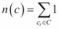

*S*（*C*的值是这些值的总和。*n*（*C*的值是使用一而不是每个值的总和。实际上，*S**C*是*C**i*<sup>1</sup>的和*n**C*是*C*<sub>*i*</sub>的和*n**C*的和 0。我们可以轻松地将这些实现为简单的 Python 生成器表达式。

我们可以在许多地方重复使用这些定义。具体来说，我们现在可以定义平均值μ<sub>*C*</sub>，如下所示：

μ<sub>*C*</sub>=*S*（*C*/*n*（*C*）

我们将利用这一总体思路对已经收集到垃圾箱中的数据进行统计计算。当我们有一个`Counter`对象时，我们有值和频率。数据结构可以这样描述：

*F*={*c*<sub>0</sub>：*F*<sub>0</sub>、*c*<sub>1</sub>：*F*1、*c*<sub>2</sub>：*<sub>、</sub>、、、、*c*、、、、、、、、、、*、*、*、、。。。*c<sub>m</sub>**f<sub>m</sub>*}******

数值*c<sub>i</sub>*与频率*f<sub>i</sub>*配对。这对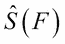和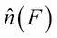进行了两个小改动，以执行类似的计算：


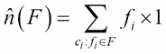

我们定义了使用频率和值的乘积。同样，我们定义了来使用频率。我们在每个名称上添加了 hat，^，以明确这些函数不适用于简单的值列表；这些函数用于（值、频率）对的列表。

这些需要用 Python 实现。例如，我们将使用以下`Counter`对象：

```py
>>> from collections import Counter 
>>> raw_data = [8, 8, 8, 8, 8, 8, 8, 19, 8, 8, 8] 
>>> series_4_x = Counter(raw_data)

```

此数据来自使用内置统计库配方的*。`Counter`对象如下所示：*

```py
>>> series_4_x 
Counter({8: 10, 19: 1})

```

这显示了一组样本中的各种值以及每个不同值的频率。

## 怎么做。。。

1.  定义 a`Counter`

    ```py
     >>> def counter_sum(counter): 
          ...     return sum(f*c for c,f in counter.items())

    ```

    的和，我们可以如下使用：

    ```py
     >>> counter_sum(series_4_x) 
          99

    ```

2.  在`Counter`

    ```py
     >>> def counter_len(counter):

     ...     return sum(f for c,f in counter.items())

    ```

    中定义值的总数，我们可以如下使用：

    ```py
     >>> counter_len(series_4_x) 
          11

    ```

3.  我们现在可以将这些数据组合起来，计算出放入垃圾箱的数据平均值：

    ```py
     >>> def counter_mean(counter): 
          ...    return counter_sum(counter)/counter_len(counter) 
          >>> counter_mean(series_4_x) 
          9.0

    ```

## 它是如何工作的。。。

A`Counter`是一本字典。此字典的键是正在计算的实际值。字典中的值是每个项目的频率。这意味着`items()`方法将产生可用于我们计算的值和频率信息。

我们已经将和的每个定义转换为生成器表达式。由于 Python 的设计目的是严格遵循数学形式，因此代码以相对直接的方式遵循数学。

## 还有更多。。。

为了计算方差（和标准差），我们需要在这个主题上再增加两个变量。我们可以定义频率分布的总体平均值μ<sub>*F*</sub>：

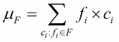

其中*c<sub>i</sub>*是来自`Counter`对象的密钥，*F*，*F<sub>i</sub>*是来自`Counter`对象的给定密钥的频率值。

方差 VAR<sub>*F*</sub>可以根据均值μ<sub>*F*</sub>来定义。公式如下：


这计算值*c*<sub>*i*</sub>与平均值μ<sub>*F*</sub>之间的差值。该值通过该值出现的次数*f<sub>i</sub>*进行加权。这些加权差值之和除以计数，减去一。

标准偏差σ<sub>*F*</sub>是方差的平方根：

σ<sub>*F*</sub>=√变量<sub>*F*</sub>

此版本的标准偏差在数学上非常稳定，因此是首选。它需要对数据进行两次传递，但对于某些边缘情况，进行多次传递的成本比错误的结果要好。

计算的另一个变化不取决于平均值μ<sub>*F*</sub>。这在数学上不如前一个版本稳定。此变化分别计算值的平方和、值的和以及值的计数：


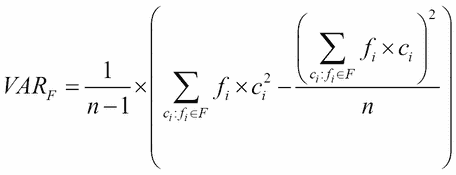

这需要一个额外的求和计算。我们需要计算值的平方和，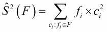：

```py
>>> def counter_sum_2(counter): 
...     return sum(f*c**2 for c,f in counter.items())

```

考虑到这三个求和函数、和，我们可以为组合汇总*F*定义方差：

```py
>>> def counter_variance(counter): 
...    n = counter_len(counter) 
...    return (counter_sum_2(counter)-(counter_sum(counter)**2)/n)/(n-1)

```

`counter_variance()`函数非常符合数学定义。Python 版本将 1/（*n*-1）术语作为一个次要优化进行了移动。

使用`counter_variance()`函数，我们可以计算标准偏差：

```py
>>> import math 
>>> def counter_stdev(counter): 
...    return math.sqrt(counter_variance(counter))

```

这使我们能够看到以下内容：

```py
>>> counter_variance(series_4_x) 
11.0 
>>> round(counter_stdev(series_4_x), 2) 
3.32

```

我们也可以使用`Counter`对象的`elements()`方法。虽然简单，但这将创建一个潜在的大型中间数据结构：

```py
>>> import statistics 
>>> statistics.variance(series_4_x.elements()) 
11.0

```

我们使用了`Counter`对象的`elements()`方法来创建计数器中所有元素的扩展列表。我们可以计算这些元素的统计摘要。对于一个大的`Counter`，这可以成为一个非常大的中间数据结构。

## 另见

*   在[第 6 章](06.html#page "Chapter 6. Basics of Classes and Objects")*类和对象的基础中*设计具有大量处理的*配方的类*中，我们从稍微不同的角度来看待这一点。在这个配方中，我们的目标只是隐藏一个复杂的数据结构。
*   本章中的*在一次通过*配方中分析多个变量将解决一些效率问题。在这个配方中，我们将研究在数据元素的一次传递中计算多个和的方法。

# 计算相关系数

在*中，使用内置的统计库*和*计数器*配方中的平均值，我们研究了总结数据的方法。这些配方说明了如何计算中心值，以及方差和极值。

另一个常见的统计摘要涉及两组数据之间的关联程度。Python 的标准库不直接支持这一点。

一种常用的相关性度量称为**皮尔逊 r**。*r*-值是介于-1 和+1 之间的数字，表示数据值相互关联的概率。

值为零表示数据是随机的。*0.95*表示 95%的值相关，5%的值相关性不好。*-.95*表示 95%的值具有反向相关性：当一个变量增加时，另一个变量减少。

我们如何确定两组数据是否相关？

## 准备好了吗

皮尔逊的*r*的一个表达是：


这依赖于数据集各个部分的大量单独总和。每个∑ *z*操作符可以通过 Python`sum()`函数实现。

我们将使用*中的数据，使用内置的统计库*配方。我们可以通过以下方式读取这些数据：

```py
>>> from pathlib import Path 
>>> import json 
>>> from collections import OrderedDict 
>>> source_path = Path('code/anscombe.json') 
>>> data = json.loads(source_path.read_text(), 
...     object_pairs_hook=OrderedDict)

```

我们已经为数据文件定义了`Path`。然后我们可以使用`Path`对象从这个文件中读取文本。`json.loads()`使用此文本从 JSON 数据构建 Python 对象。

我们已经包含了一个`object_pairs_hook`，因此该函数将使用`OrderedDict`类而不是默认的`dict`类来构建 JSON。这将保留源文档中项目的原始顺序。

我们可以这样检查数据：

```py
>>> [item['series'] for item in data] 
['I', 'II', 'III', 'IV'] 
>>> [len(item['data']) for item in data] 
[11, 11, 11, 11]

```

整个 JSON 文档是一系列子文档，其键类似于`I`。每个子文档有两个字段-`series`和`data`。在`data`值中，有一个我们想要描述的观察列表。每个观察值都有一对值。

数据如下所示：

```py
    [ 
      { 
        "series": "I", 
        "data": [ 
          { 
            "x": 10.0, 
            "y": 8.04 
          }, 
          { 
            "x": 8.0, 
            "y": 6.95 
          }, 
          ... 
        ] 
      }, 
      ... 
    ] 

```

这组数据有四个系列，每个系列都表示为 dict 结构列表。在每个系列中，单独的条目是一个带有`x`和`y`键的字典。

## 怎么做。。。

1.  确定所需的各种金额。对于这个表达式，我们可以看到以下内容：计数*n*实际上可以定义为源数据集中每个数据的 1 之和。这也可以被认为是*x<sub>i</sub>*<sup>∘</sup> 或*y<sub>i</sub>*<sup>∘</sup> 。
    *   ∑ *x<sub>i</sub>、y<sub>i</sub>*
    *   ∑ *x<sub>i</sub>*
    *   ∑ *y<sub>i</sub>*
    *   ∑ *x<sub>i</sub>*<sup>2</sup>
    *   ∑ *y<sub>i</sub>*<sup>2</sup>
    *   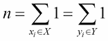The count,
2.  从`math`模块

    ```py
            from math import sqrt 

    ```

    导入`sqrt()`功能
3.  定义一个包装计算的函数：

    ```py
            def correlation(data): 

    ```

4.  使用内置的`sum()`函数写出各种总和。这在函数定义中缩进。我们将使用`data`参数的值：来自给定序列的一系列值。输入数据必须有两个键，`x`和`y`：

    ```py
            sumxy = sum(i['x']*i['y'] for i in data) 
            sumx = sum(i['x'] for i in data) 
            sumy = sum(i['y'] for i in data) 
            sumx2 = sum(i['x']**2 for i in data) 
            sumy2 = sum(i['y']**2 for i in data) 
            n = sum(1 for i in data) 

    ```

5.  根据各种总和写出*r*的最终计算结果。确保缩进正确匹配。更多帮助请参见[第三章](03.html#page "Chapter 3. Function Definitions")、*功能定义*：

    ```py
            r = ( 
                (n*sumxy - sumx*sumy) 
                / (sqrt(n*sumx2-sumx**2)*sqrt(n*sumy2-sumy**2)) 
                ) 
            return r 

    ```

现在，我们可以使用它来确定各个系列之间的关联程度：

```py
    for series in data: 
        r = correlation(series['data']) 
        print(series['series'], 'r=', round(r, 2)) 

```

输出如下所示：

```py
    I r= 0.82
    II r= 0.82
    III r= 0.82
    IV r= 0.82

```

所有四个系列的相关系数大致相同。这并不意味着这个系列是相互关联的。这意味着在每个系列中，82%的*x*值预测了*y*值。这几乎正好是每个系列中 11 个值中的 9 个。

## 它是如何工作的。。。

整个公式看起来相当复杂。但是，它分解为若干单独的和和，以及合并这些和的最终计算。每个求和运算都可以用 Python 非常简洁地表示。

按照惯例，数学符号可能如下所示：


这将以非常直接的方式转换为 Python：

```py
    sum(item['x'] for item in data) 

```

最终的相关比可以稍微简化。当我们将更复杂的外观替换为略具蟒蛇特征的*S*（*x*时，我们可以更好地看到方程的整体形式：


虽然简单，但所示的实现并不是最优的。它对数据进行六次单独的传递，以计算每个不同的减少。作为一种概念证明，此实现运行良好。这种实现的优点是可以证明编程是有效的。它还可以作为创建单元测试和重构算法以优化处理的起点。

## 还有更多。。。

该算法虽然清晰，但效率低下。一个更高效的版本将只处理一次数据。要做到这一点，我们必须编写一个显式的`for`语句，对数据进行单次传递。在`for`语句的主体中，计算各种总和。

优化算法如下所示：

```py
    sumx = sumy = sumxy = sumx2 = sumy2 = n = 0 
    for item in data: 
        x, y = item['x'], item['y'] 
        n += 1 
        sumx += x 
        sumy += y 
        sumxy += x * y 
        sumx2 += x**2 
        sumy2 += y**2 

```

我们已经将一些结果初始化为零，然后从数据项源`data`将值累积到这些结果中。由于这只使用一次数据值，因此它将适用于任何 iterable 数据源。

根据这些总和计算出的*r*没有变化。

重要的是算法的初始版本和修订版本之间的并行结构，修订版本经过优化，可以一次计算所有摘要。两个版本的清晰对称性有助于验证两件事：

*   最初的实现与相当复杂的公式相匹配
*   优化的实现与初始实现和复杂公式匹配

这种对称性加上适当的测试用例，提供了实现正确的信心。

# 计算回归参数

一旦我们确定两个变量之间有某种关系，下一步就是确定一种方法，通过自变量的值来估计因变量。对于大多数真实数据，有许多小因素会导致围绕中心趋势的随机变化。我们将评估一种关系，以使这些错误最小化。

在最简单的情况下，变量之间的关系是线性的。当我们绘制数据点时，它们将倾向于围绕一条线聚集。在其他情况下，我们可以通过计算对数或将其提高到幂来调整其中一个变量，从而创建一个线性模型。在更极端的情况下，需要多项式。

如何计算两个变量之间的线性回归参数？

## 准备好了吗

估算线的方程式如下：


给定自变量*x*，根据α和β参数计算因变量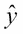的估计值或预测值。

目标是找到α和β的值，这些值在估计值和*y*的实际值之间产生最小的总体误差。以下是β的计算：

β=*r<sub>xy</sub>*（σ<sub>*x*</sub>/σ*<sub>y</sub>*）

其中*r<sub>xy</sub>*为相关系数。参见*计算相关系数*配方。σ<sub>*x*</sub>的定义为*x*的标准差。该值由`statistics`模块直接给出。

下面是α的计算：

α=μ<sub>*y*</sub>-βμ<sub>*x*</sub>

其中μ<sub>*x*</sub>为*x*的均值。这也是由`statistics`模块直接给出的。

我们将使用*中的数据，使用内置的统计库*配方。我们可以通过以下方式读取这些数据：

```py
>>> from pathlib import Path 
>>> import json 
>>> from collections import OrderedDict 
>>> source_path = Path('code/anscombe.json') 
>>> data = json.loads(source_path.read_text(), 
...     object_pairs_hook=OrderedDict)

```

我们已经为数据文件定义了`Path`。然后我们可以使用`Path`对象从这个文件中读取文本。`json.loads()`使用此文本从 JSON 数据构建 Python 对象。

我们已经包含了一个`object_pairs_hook`，因此该函数将使用`OrderedDict`类而不是默认的`dict`类来构建 JSON。这将保留源文档中项目的原始顺序。

我们可以检查如下数据：

```py
>>> [item['series'] for item in data] 
['I', 'II', 'III', 'IV'] 
>>> [len(item['data']) for item in data] 
[11, 11, 11, 11]

```

整个 JSON 文档是一系列带有键的子文档，如`I`。每个子文档有两个字段：`series`和`data`。在`data`值中，有一个我们想要描述的观察列表。每个观察值都有一对值。

数据如下所示：

```py
    [ 
      { 
        "series": "I", 
        "data": [ 
          { 
            "x": 10.0, 
            "y": 8.04 
          }, 
          { 
            "x": 8.0, 
            "y": 6.95 
          }, 
          ... 
        ] 
      }, 
      ... 
    ] 

```

这组数据有四个系列，每个系列都表示为 dict 结构列表。在每个系列中，单独的条目是一个带有`x`和`y`键的字典。

## 怎么做。。。

1.  导入`correlation()`功能和`statistics`模块：

```py
        from ch10_r03 import correlation 
        import statistics 

```

1.  定义将生成回归模型的函数`regression()`：

    ```py
            def regression(data): 

    ```

2.  计算所需的各种值：

    ```py
            m_x = statistics.mean(i['x'] for i in data) 
            m_y = statistics.mean(i['y'] for i in data) 
            s_x = statistics.stdev(i['x'] for i in data) 
            s_y = statistics.stdev(i['y'] for i in data) 
            r_xy = correlation(data) 

    ```

3.  计算β和α值：

    ```py
            b = r_xy * s_y/s_x 
            a = m_y - b * m_x 
            return a, b 

    ```

我们可以使用此`regression()`函数计算回归参数，如下所示：

```py
    for series in data: 
        a, b = regression(series['data']) 
        print(series['series'], 'y=', round(a, 2), '+', round(b,2), '*x') 

```

输出显示了根据给定的`x`值预测预期`y`的公式。输出如下所示：

```py
    I y= 3.0 + 0.5 *x
    II y= 3.0 + 0.5 *x
    III y= 3.0 + 0.5 *x
    IV y= 3.0 + 0.5 *x

```

在所有情况下，方程式均为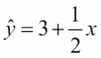。这个估计似乎是对*y*实际值的一个很好的预测。

## 它是如何工作的。。。

α和β的两个目标公式并不复杂。β的公式分解为使用两个标准偏差的相关值。α的公式使用β值和两种平均值。每一个都是先前配方的一部分。相关性计算包含实际的复杂性。

核心设计技术是使用尽可能多的现有功能构建新功能。这将扩展测试用例，以便广泛使用（和测试）基本算法。

*计算相关系数*的性能分析非常重要，在这里也适用。该过程对数据进行五次单独的传递，以获得相关性以及各种平均值和标准偏差。

作为一种概念证明，该实现证明了该算法的有效性。它还可以作为创建单元测试的起点。因此，在给定一个工作算法的情况下，重构代码以优化处理是有意义的。

## 还有更多。。。

前面显示的算法虽然清晰，但效率低下。为了一次性处理数据，我们必须编写一个显式的`for`语句，对数据进行一次传递。在`for`语句的主体中，我们需要计算各种总和。我们还需要计算从总和中得出的一些值，包括平均值和标准偏差：

```py
    sumx = sumy = sumxy = sumx2 = sumy2 = n = 0 
    for item in data: 
        x, y = item['x'], item['y'] 
        n += 1 
        sumx += x 
        sumy += y 
        sumxy += x * y 
        sumx2 += x**2 
        sumy2 += y**2 
    m_x = sumx / n 
    m_y = sumy / n 
    s_x = sqrt((n*sumx2 - sumx**2)/(n*(n-1))) 
    s_y = sqrt((n*sumy2 - sumy**2)/(n*(n-1))) 
    r_xy = (n*sumxy - sumx*sumy) / (sqrt(n*sumx2-sumx**2)*sqrt(n*sumy2-sumy**2)) 
    b = r_xy * s_y/s_x 
    a = m_y - b * m_x 

```

我们已经将一些结果初始化为零，然后从数据项源`data`将值累积到这些结果中。由于这只使用一次数据值，因此它将适用于任何 iterable 数据源。

根据这些总和计算出的`r_xy`与前面的示例没有变化。α或β值`a`和`b`的计算也不适用。由于这些最终结果与前一版本相同，我们有信心此优化将计算相同的答案，但只需对数据进行一次传递。

# 计算自相关

在许多情况下，事件发生在重复的循环中。如果数据与自身相关，则称为自相关。对于一些数据，时间间隔可能很明显，因为存在一些明显的外部影响，如季节或潮汐。对于某些数据，间隔可能很难识别。

在*计算相关*配方的系数时，我们研究了一种测量两组数据之间相关性的方法。

如果我们怀疑我们有循环数据，我们能利用之前的相关函数来计算自相关吗？

## 准备好了吗

自相关背后的核心概念是通过时间偏移 T 进行相关的概念。这种测量有时表示为*r<sub>xx</sub>*（T）：时间偏移为 T 的*x*和*x*之间的相关性。

假设我们有一个方便的相关函数，*R*（*x*、*y*。比较了两个序列，[*x*0、*x*1、*x*2、*y*T20、*y<sub>1</sub>、*y<sub>T22]</sub>…]，并返回两个序列之间的相关系数：**

*r<sub>xy</sub>*=*r*（*x*<sub>0</sub>、*x*<sub>1</sub>、*x*<sub>2</sub>、【T18 y】<sub>、*y*<sub>1</sub>，*y*<sub>2</sub>…）</sub>

我们可以通过将其用作索引值中的时间偏移，将其应用于自相关：

*r<sub>xx</sub>*（T）=*r*（*x*<sub>0</sub>、*x*<sub>1</sub>、*x*2、*x*<sub>T</sub>、*x*T25】、、、、*x*x*<sub>x】，*x*<sub>2+T</sub>…）</sub>*

我们计算了相互偏移 T 的*x*值之间的相关性。如果 T=0，我们将每个项目与自身进行比较，相关性为*r<sub>xx</sub>*（0）=1。

我们将使用一些我们怀疑有季节性信号的数据。这是来自[的数据 http://www.esrl.noaa.gov/gmd/ccgg/trends/](http://www.esrl.noaa.gov/gmd/ccgg/trends/) 。我们可以访问[ftp://ftp.cmdl.noaa.gov/ccg/co2/trends/co2_mm_mlo.txt](ftp://ftp.cmdl.noaa.gov/ccg/co2/trends/co2_mm_mlo.txt) 下载原始数据文件。

该文件有一个以`#`开头的序言行。这些必须从数据中筛选出来。我们将使用[第 8 章](08.html#page "Chapter 8. Functional and Reactive Programming Features")中的*选择子集–三种过滤*配方的方法，*功能性和反应性编程功能*，这将删除无用的行。

其余的行在七列中，以空格作为值之间的分隔符。我们将使用[第 9 章](09.html#page "Chapter 9. Input/Output, Physical Format, and Logical Layout")、*输入/输出、物理格式和逻辑布局*中带有 CSV 模块配方的*读取分隔文件来读取 CSV 数据。在这种情况下，CSV 中的逗号将是一个空格字符。结果使用起来会有点尴尬，因此我们将使用[第 9 章](09.html#page "Chapter 9. Input/Output, Physical Format, and Logical Layout")中的*将 CSV 从 Dictreader 升级到名称空间读取器*的方法，*输入/输出、物理格式和逻辑布局*创建一个更有用的名称空间，并正确转换值。在该配方中，我们导入了`CSV`模块：*

```py
    import csv 

```

这里有两个函数来处理文件物理格式的基本方面。第一个是拒绝注释行的过滤器；或者，以另一种方式查看，传递非注释行：

```py
    def non_comment_iter(source): 
        for line in source: 
            if line[0] == '#': 
                continue 
            yield line 

```

`non_comment_iter()`函数将遍历给定的源并拒绝以`#`开头的行。所有其他线路将保持不变。

`non_comment_iter()`函数可用于构建处理有效数据行的 CSV 读取器。读者需要一些额外的配置来定义数据列和所涉及的 CSV 方言的详细信息：

```py
    def raw_data_iter(source): 
        header = ['year', 'month', 'decimal_date', 'average', 
                  'interpolated', 'trend', 'days'] 
        rdr = csv.DictReader(source, 
            header, delimiter=' ', skipinitialspace=True) 
        return rdr 

```

`raw_data_iter()`函数定义七列标题。它还指定列分隔符是一个空格，并且可以跳过每列数据前面的其他空格。此函数的输入必须去掉注释行，通常使用过滤函数，如`non_comment_iter()`。

此函数的结果是以字典形式显示的数据行，其中包含七个键。这些行如下所示：

```py
    [{'average': '315.71', 'days': '-1', 'year': '1958', 'trend': '314.62',
        'decimal_date': '1958.208', 'interpolated': '315.71', 'month': '3'},
     {'average': '317.45', 'days': '-1', 'year': '1958', 'trend': '315.29',
        'decimal_date': '1958.292', 'interpolated': '317.45', 'month': '4'},
    etc.

```

由于这些值都是字符串，因此需要进行清理和转换。下面是一个可以在生成器表达式中使用的行清理函数。这将构建一个`SimpleNamespace`对象，因此我们需要导入该定义：

```py
    from types import SimpleNamespace 
    def cleanse(row): 
        return SimpleNamespace( 
            year= int(row['year']), 
            month= int(row['month']), 
            decimal_date= float(row['decimal_date']), 
            average= float(row['average']), 
            interpolated= float(row['interpolated']), 
            trend= float(row['trend']), 
            days= int(row['days']) 
        ) 

```

此函数将通过对字典中的值应用转换函数，将每个字典行转换为`SimpleNamespace`。大部分项目都是浮点数，所以使用了`float()`函数。少数项目是整数，`int()`函数用于这些项目。

我们可以编写以下类型的生成器表达式，将此清理函数应用于每一行原始数据：

```py
    cleansed_data = (cleanse(row) for row in raw_data) 

```

这将对每一行数据应用`cleanse()`功能。通常情况下，预期行将来自`raw_data_iter()`。

对每一行应用`cleanse()`函数将创建如下所示的数据：

```py
    [namespace(average=315.71, days=-1, decimal_date=1958.208, 
        interpolated=315.71, month=3, trend=314.62, year=1958), 
     namespace(average=317.45, days=-1, decimal_date=1958.292, 
        interpolated=317.45, month=4, trend=315.29, year=1958), 
    etc. 

```

这些数据很容易处理。单个字段可以用一个简单的名称来标识，并且数据值已转换为 Python 内部数据结构。

这些函数可以组合成一个堆栈，如下所示：

```py
    def get_data(source_file): 
        non_comment_data = non_comment_iter(source_file) 
        raw_data = raw_data_iter(non_comment_data) 
        cleansed_data = (cleanse(row) for row in raw_data) 
        return cleansed_data 

```

`get_data()`生成器函数是生成器函数和生成器表达式的堆栈。它返回一个迭代器，该迭代器将生成源数据的各个行。`non_comment_iter()`函数将读取足够多的行，以便能够生成单个非注释行。`raw_data_iter()`函数将解析一行 CSV 并生成一个包含单行数据的字典。

`cleansed_data`生成器表达式将`cleanse()`函数应用于每个原始数据字典。单独的行是方便的`SimpleNamespace`数据结构，可以在其他地方使用。

此生成器将所有单个步骤绑定到转换管道中。当需要更改步骤时，这将成为更改的焦点。我们可以在这里添加过滤器，或者替换解析或清理函数。

使用`get_data()`函数的上下文如下所示：

```py
    source_path = Path('co2_mm_mlo.txt') 
    with source_path.open() as source_file: 
        for row in get_data(source_file): 
            print(row.year, row.month, row.average) 

```

我们需要打开一个源文件。我们可以将该文件提供给`get_data()`函数。此函数将以易于用于统计处理的形式发出每一行。

## 怎么做。。。

1.  从`ch10_r03`模块

    ```py
            from ch10_r03 import correlation 

    ```

    导入`correlation()`功能
2.  Get the relevant time series data item from the source data:

    ```py
            co2_ppm = list(row.interpolated 
                for row in get_data(source_file)) 

    ```

    In this case, we'll use the interpolated data. If we try to use the average data, there are reporting gaps that would force us to locate periods without the gaps. The interpolated data has values to fill in the gaps.

    我们已经从生成器表达式创建了一个`list`对象，因为我们将对它执行多个摘要操作。

3.  For a number of time offsets, T, compute the correlation. We'll use time offsets from `1` to `20` periods. Since the data is collected monthly, we suspect that T = 12 will have the highest correlation:

    ```py
            for tau in range(1,20): 
                data = [{'x':x, 'y':y} 
                    for x,y in zip(co2_ppm[:-tau], co2_ppm[tau:])] 
                r_tau_0 = correlation(data[:60]) 
                print(tau, r_tau_0) 

    ```

    The `correlation()` function from the *Computing the coefficient of correlation* recipe expects a small dictionary with two keys: `x` and `y` . The first step is to build an array of these dictionaries. We've used the `zip()` function to combine two sequences of data:
    *   `co2_ppm[:-tau]`
    *   `co2_ppm[tau:]`

    `zip()`函数将组合`data`的每个片段的值。第一个切片从开头开始。第二个启动`tau`位置进入序列。一般情况下，第二个序列会更短，`zip()`功能会在序列用尽时停止处理。

    我们使用了`co2_ppm[:-tau]`作为`zip()`函数的参数值之一，以清楚地表明我们跳过了序列末尾的一些项。我们将跳过第二个序列开头省略的相同数量的项。

我们只取了前 60 个值来计算不同时间偏移值的自相关。数据按月提供。我们可以看到很强的年度相关性。我们突出显示了这一行输出：

```py
    r_{xx}(τ= 1) =  0.862
    r_{xx}(τ= 2) =  0.558
    r_{xx}(τ= 3) =  0.215
    r_{xx}(τ= 4) = -0.057
    r_{xx}(τ= 5) = -0.235
    r_{xx}(τ= 6) = -0.319
    r_{xx}(τ= 7) = -0.305
    r_{xx}(τ= 8) = -0.157
    r_{xx}(τ= 9) =  0.141
    r_{xx}(τ=10) =  0.529
    r_{xx}(τ=11) =  0.857   

r_{xx}(τ=12) =  0.981

    r_{xx}(τ=13) =  0.847
    r_{xx}(τ=14) =  0.531
    r_{xx}(τ=15) =  0.179
    r_{xx}(τ=16) = -0.100
    r_{xx}(τ=17) = -0.279
    r_{xx}(τ=18) = -0.363
    r_{xx}(τ=19) = -0.349

```

当时移为`12`时，*r<sub>xx</sub>*（12）=.981。几乎所有数据子集都有类似的显著自相关。这种高度相关性证实了数据的年度周期。

整个数据集包含超过 58 年的近 700 个样本。结果表明，在整个时间跨度内，季节变化信号并不那么清晰。这意味着另一个较长周期的信号正在淹没年度变化信号。

这另一个信号的存在表明有更复杂的事情正在发生。这种影响的时间尺度超过五年。需要进一步分析。

## 它是如何工作的。。。

Python 优雅的特性之一是数组切片概念。在[第 4 章](04.html#page "Chapter 4. Built-in Data Structures – list, set, dict")中的*切分列表*配方中，*内置数据结构–列表、集合、dict*中，我们了解了切分列表的基础知识。在进行自相关计算时，数组切片为我们提供了一个非常好的工具，可以用非常小的复杂性来比较两个数据子集。

算法的基本要素包括：

```py
    data = [{'x':x, 'y':y} 
        for x,y in zip(co2_ppm[:-tau], co2_ppm[tau:])] 

```

这些对是从`co2_ppm`序列的两个切片`A=a zip()`构建的。这两个切片构建用于创建临时对象`data`的预期（`x`、`y`）对。给定此`data`对象，现有`correlation()`函数计算相关度量。

## 还有更多。。。

我们可以使用类似的阵列切片技术在整个数据集中重复观察 12 个月的季节性周期。在本例中，我们使用了以下内容：

```py
    r_tau_0 = correlation(data[:60]) 

```

前面的代码使用可用的`699`的第一个`60`样本。我们可以从不同的位置开始切片，并使用不同大小的切片来确认循环在整个数据中都存在。

我们可以创建一个模型来显示 12 个月数据的行为。因为有一个重复的循环，正弦函数是模型最可能的候选函数。我们将使用以下方法进行调整：


正弦函数本身的平均值为零，因此*K*因子是给定 12 个月周期的平均值。函数*f*（*x*-φ）将月数转换为-2π范围内的适当值≤ *f*（*x*-φ）≤ 2π. 类似于*f*（*x*）=2π（*x*-6）/12 的函数可能是合适的。最后，缩放因子*A*缩放数据，以匹配给定月份的最小值和最大值。

### 长期模型

有趣的是，这项分析并没有找到掩盖年度振荡的长期趋势。为了确定这种趋势，有必要将每个 12 个月的样本序列减少到一个单一的年度中心值。中位数或平均值对此很有效。

我们可以使用以下生成器表达式创建月平均值序列：

```py
    from statistics import mean, median 
    monthly_mean = [ 
        {'x': x, 'y': mean(co2_ppm[x:x+12])}  
            for x in range(0,len(co2_ppm),12) 
    ] 

```

此生成器将生成一系列字典。每个字典都有回归函数使用的必需的`x`和`y`项。`x`值是年和月的简单替代值：它是一个从零增长到 696 的数字。`y`值是 12 个月值的平均值。

回归计算如下所示：

```py
    from ch10_r04 import regression 
    alpha, beta = regression(monthly_mean) 
    print('y=', alpha, '+x*', beta) 

```

这显示了一条明显的线，其方程式如下：


*x*值是数据集中第一个月（1958 年 3 月）的月数偏移量。例如，1968 年 3 月的*x*值为 120。年平均 CO<sub>2</sub>百万分率为*y*=323.1。今年的实际平均数是 323.27。如您所见，这些值非常相似。

此`correlational`模型的*r*<sup>2</sup>值为 0.98，表示方程如何拟合数据。这个上升的斜率是一个信号，从长远来看，它主导着季节性波动。

## 另见

*   *计算相关系数*配方显示了计算一系列值之间相关性的核心功能
*   *计算回归参数*配方显示了确定详细回归参数的额外背景

# 确认数据是随机的–无效假设

其中一个重要的统计问题是关于数据集的无效假设和替代假设。假设我们有两组数据，*S1*和*S2*。我们可以对数据形成两种假设：

*   **空**：任何差异均为轻微随机效应，无显著差异。
*   **备选**：差异有统计学意义。一般来说，这种可能性小于 5%。

我们如何评估数据以确定它是否真的是随机的，或者是否存在一些有意义的变化？

## 准备好了吗

如果我们有很强的统计学背景，我们可以利用统计学理论来评估样本的标准偏差，并确定两个分布之间是否存在显著差异。如果我们在统计学方面很弱，但在编程方面有很强的背景，我们可以做一些编码，在没有理论的情况下获得类似的结果。

我们可以通过多种方式比较数据集，看看它们是否存在显著差异，或者差异是随机变化。在某些情况下，我们可能能够提供这种现象的详细模拟。如果我们使用 Python 内置的随机数生成器，我们将获得与真实随机事件基本相同的数据。我们可以将模拟与测量数据进行比较，看看它们是否相同。

模拟技术只有在模拟合理完成时才起作用。例如，赌场赌博中的离散事件很容易模拟。web 事务中的某些离散事件（例如购物车中的项目）很容易模拟。但有些现象很难精确模拟。

在我们无法进行模拟的情况下，我们有许多可用的重采样技术。我们可以洗牌数据，使用引导，或使用交叉验证。在这些情况下，我们将使用可用的数据来寻找随机效应。

我们将比较*计算自相关*配方中的三个数据子集。这些数据值来自两个相邻年份以及与其他两个年份相距甚远的第三个年份。每年有 12 个样本，我们可以轻松计算这些组的平均值：

```py
>>> from ch10_r05 import get_data 
>>> from pathlib import Path 
>>> source_path = Path('code/co2_mm_mlo.txt') 
>>> with source_path.open() as source_file: 
...     all_data = list(get_data(source_file)) 
>>> y1959 = [r.interpolated for r in all_data if r.year == 1959] 
>>> y1960 = [r.interpolated for r in all_data if r.year == 1960] 
>>> y2014 = [r.interpolated for r in all_data if r.year == 2014]

```

我们已经为三年的可用数据创建了三个子集。每个子集都是通过一个简单的过滤器创建的，该过滤器创建一个值列表，该值的年份与目标值匹配。我们可以计算这些子集的统计信息，如下所示：

```py
>>> from statistics import mean 
>>> round(mean(y1959), 2) 
315.97 
>>> round(mean(y1960), 2) 
316.91 
>>> round(mean(y2014), 2) 
398.61

```

这三个平均数是不同的。我们的假设是，`1959`和`1960`均值之间的差异只是普通的随机变量，没有显著性。然而，`1959`和`2014`平均值之间的差异在统计学上是显著的。

排列或洗牌技术的工作原理如下：

1.  对于汇集数据的每个排列：
2.  观察到的`1959`数据和`1960`数据的平均值之间的差异为*316.91-315.97=0.94*。我们可以称之为*T<sub>obs</sub>*，观察到的测试测量。
    *   创建两个子集，*A*和*B*
    *   计算均值之间的差值，*T*
    *   统计差异的数量，*T*、大于*T<sub>obs</sub>*且小于*T<sub>obs</sub>*

这两个计数向我们展示了我们观察到的差异与所有可能的差异的比较情况。对于较大的数据集，可能会有大量的排列。在我们的案例中，我们知道一次采集 12 个样本的 24 个样本的组合数量由以下公式给出：

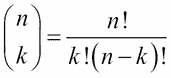

我们可以计算出*n*=24 和*k*=12 的值：

```py
>>> from ch03_r07 import fact_s 
>>> def binom(n, k): 
...     return fact_s(n)//(fact_s(k)*fact_s(n-k)) 
>>> binom(24, 12) 
2704156

```

有超过 270 万个头发排列。我们可以使用`itertools`模块中的函数来生成这些。`combinations()`函数将发出各种子集。处理时间超过 5 分钟（320 秒）。

另一种方案是使用随机子集。使用 270156 个随机样本可以在大约 35 秒内完成。仅使用 10%的组合就可以提供足够准确的答案，以确定两个样本在统计上是否相似，零假设是否正确，或者两个样本是否不同。

## 怎么做。。。

1.  我们将使用`random`和`statistics`模块。`shuffle()`功能是样本随机化的核心。我们还将使用`mean()`函数：

    ```py
            import random 
            from statistics import mean 

    ```

    我们可以简单地计算高于和低于观察到的样本差异的值。相反，我们将创建一个`Counter`并收集 2000 个步骤中从-0.001 到+0.001 的差异。这将使人们相信差异是正态分布的：

    ```py
            from collections import Counter 

    ```

2.  定义一个接受两组独立样本的函数。这些将被合并，并从集合中随机抽取子集：

    ```py
            def randomized(s1, s2, limit=270415): 

    ```

3.  计算观察到的均值之间的差异，*T<sub>obs</sub>*：

    ```py
            T_obs = mean(s2)-mean(s1) 
            print( "T_obs = m_2-m_1 = {:.2f}-{:.2f} = {:.2f}".format( 
                mean(s2), mean(s1), T_obs) 
            ) 

    ```

4.  初始化一个`Counter`来收集详细信息：

    ```py
            counts = Counter() 

    ```

5.  创建样本的组合宇宙。我们可以连接两个列表：

    ```py
            universe = s1+s2 

    ```

6.  使用`for`语句进行大量重采样；270415 可能需要 35 秒。很容易扩展或收缩子集，以平衡对精度和计算速度的需求。大部分处理将嵌套在此循环中：

    ```py
            for resample in range(limit): 

    ```

7.  洗牌数据：

    ```py
                random.shuffle(universe) 

    ```

8.  选择两个在大小上与原始数据集匹配的子集：

    ```py
                a = universe[:len(s2)] 
                b = universe[len(s2):] 

    ```

    由于 Python 列表索引的工作方式，我们确信这两个列表完全分离了宇宙中的值。由于结束索引值`len(s2)`不包括在第一个列表中，因此这种切片可以清楚地分隔所有项目。
9.  计算平均数之间的差值。在本例中，我们将通过`1000`对其进行缩放，并将其转换为整数，以便我们可以累积频率分布：

    ```py
                delta = int(1000*(mean(a) - mean(b))) 
                counts[delta] += 1 

    ```

    创建增量值直方图的另一种方法是对*T<sub>obs</sub>*上方和下方的值进行计数。使用完整的直方图可以确保数据在统计上是正常的。
10.  在`for`循环之后，我们可以总结`counts`，显示有多少高于观察到的差异，有多少低于观察到的差异。如果任何一个值小于 5%，则这是一个具有统计意义的差异：

    ```py
            T = int(1000*T_obs) 
            below = sum(v for k,v in counts.items() if k < T) 
            above = sum(v for k,v in counts.items() if k >= T) 

            print( "below {:,} {:.1%}, above {:,} {:.1%}".format( 
                below, below/(below+above), 
                above, above/(below+above))) 

    ```

当我们对来自`1959`和`1960`的数据运行`randomized()`函数时，我们会看到以下内容：

```py
    print("1959 v. 1960") 
    randomized(y1959, y1960) 

```

输出如下所示：

```py
    1959 v. 1960
    T_obs = m_2-m_1 = 316.91-315.97 = 0.93
    below 239,457 88.6%, above 30,958 11.4%

```

这表明 11%的数据高于观察到的差异，88%的数据低于观察到的差异。这完全在正常统计噪声的范围内。

当我们对来自`1959`和`2014`的数据运行此操作时，我们会看到以下输出：

```py
    1959 v. 2014
    T_obs = m_2-m_1 = 398.61-315.97 = 82.64
    below 270,414 100.0%, above 1 0.0%

```

该数据仅涉及 270415 例中的一例，其均值高于观察到的差异，*T<sub>obs</sub>*。从`1959`到`2014`的变化具有统计学意义，概率为 3.7x10<sup>-6</sup>。

## 它是如何工作的。。。

计算所有 270 万个排列可以给出准确的答案。使用随机化子集比计算所有可能的置换更快。Python 随机数生成器非常优秀，它确保了随机子集的分布是公平的。

我们使用了两种技术来计算数据的随机子集：

1.  用`random.shuffle(u)`洗牌整个宇宙
2.  用类似于`a, b = u[x:], u[:x]`的代码划分宇宙

两个分区的计算方法由`statistics`模块完成。我们可以定义一些更有效的算法，这些算法在一次数据传递中完成洗牌、分区和平均计算。这种更有效的算法将省略为排列差异创建完整的直方图。

前面的算法使用以下方法将每个差值转换为-1000 和+1000 之间的值：

```py
    delta = int(1000*(mean(a) - mean(b))) 

```

这使得我们可以用一个`Counter`来计算频率分布。这将表明大多数差异实际上是零；对于正态分布的数据来说，这是可以预期的。看到这种分布，我们可以确信随机数生成和洗牌算法中没有隐藏的偏差。

我们可以简单地计算上面和下面的值，而不是填充`Counter`。排列差异与观察到的差异*T<sub>obs</sub>*之间比较的最简单形式如下：

```py
    if mean(a) - mean(b) > T_obs: 
        above += 1 

```

这将统计大于观察到的差异的重采样差异数。由此，我们可以通过`below = limit-above`计算观测值下方的数字。这将给我们一个简单的百分比值。

## 还有更多。。。

通过改变计算每个随机子集平均值的方法，我们可以将处理速度提高一点点。

给定一组数字，*P*，我们将创建两个不相交的子集，*a*和*B*，这样：

*A*∪ *B*=*P*∧ *A*∩ *B*=∅

*A*和*B*子集的结合覆盖了整个宇宙*P*。由于*A*与*B*的交集为空集，因此不存在缺失值。

总金额*S<sub>p</sub>*只需计算一次：

*S<sub>P</sub>*=∑ *P*

我们只需要计算一个子集*S<sub>a</sub>*的和：

*S<sub>A</sub>=∑ A*

这意味着另一个子集和只是一个减法。我们不需要一个昂贵的过程来计算第二个和。

同样地，*N<sub>A</sub>*和[T4】N<sub>B</sub>组的大小是恒定的。平均值μ<sub>*A*</sub>和μ<sub>*B*</sub>可以快速计算：

μ<sub>*A*</sub>=（*S<sub>A</sub>*/*N<sub>A</sub>*）

μ<sub>*B*</sub>=（*S<sub>P</sub>*-*S<sub>A</sub>*/*N<sub>B</sub>*

这会导致重采样循环发生轻微变化：

```py
    a_size = len(s1) 
    b_size = len(s2) 
    s_u = sum(universe) 
    for resample in range(limit): 
        random.shuffle(universe) 
        a = universe[:len(s1)] 
        s_a = sum(a) 
        m_a = s_a/a_size 
        m_b = (s_u-s_a)/b_size 
        delta = int(1000*(m_a-m_b)) 
        counts[delta] += 1 

```

通过计算一个和`s_a`，我们减少了随机重采样过程的处理时间。我们不需要计算另一个子集的和，因为我们可以将其计算为整个值的和之间的差。然后我们可以避免使用`mean()`函数，直接从总和和固定计数计算平均值。

这种优化使得很容易快速做出统计决策。使用重采样意味着我们不需要依赖于复杂的统计学理论知识；我们可以对现有数据进行重采样，以表明给定的样本满足无效假设或超出预期，并且需要一些替代假设。

## 另见

*   此过程可应用于其他统计决策程序。这包括*计算回归参数*和*计算自相关*配方。

# 定位异常值

当我们有统计数据时，我们经常会发现可以描述为异常值的数据点。异常值与其他样本不同，可能表明数据不正确或有新发现。根据定义，异常值是罕见事件。

异常值可能是数据收集中的简单错误。它们可能代表一个软件缺陷，或者可能是一个没有正确校准的测量设备。可能是由于服务器崩溃导致日志条目无法读取，或者是由于用户输入数据不正确导致时间戳错误。

离群值也可能很有趣，因为还有其他一些难以检测的信号。它可能是新颖的，或罕见的，或超出我们设备的精确校准范围。在 web 日志中，它可能会为应用程序建议一个新的用例，或者发出一种新的黑客尝试开始的信号。

我们如何定位和标记潜在的异常值？

## 准备好了吗

定位异常值的一种简单方法是对值进行规范化，使其成为 Z 分数。Z 分数将测量值转换为测量值与以标准偏差单位测量的平均值之间的比率：

*Z<sub>i</sub>*=（*x<sub>i</sub>*-μ<sub>*x*</sub>）/σ<sub>*x*</sub>

其中μ<sub>*x*</sub>为给定变量的平均值，*x*，σ<sub>*x*</sub>为该变量的标准偏差。我们可以使用`statistics`模块计算这些值。

然而，这可能有点误导，因为 Z 分数受到所涉及样本数量的限制。因此，*NIST 工程与统计手册**第 1.3.5.17*节建议使用以下规则检测异常值：


使用**MAD**（**中位绝对偏差**）代替标准偏差。MAD 是每个样本*x<sub>i</sub>*和总体中位数*x*之间偏差绝对值的中位数：


使用*0.6745*的比例因子来衡量这些分数，以便将大于 3.5 的*M<sub>i</sub>i*值识别为异常值。请注意，这与样本方差的计算是平行的。方差度量使用平均值，此度量使用中位数。值 0.6745 在文献中广泛用作定位异常值的适当值。

我们将使用*中的一些数据，使用内置的统计库*配方，其中包括一些相对平滑的数据集和一些异常数据集。数据位于一个 JSON 文档中，该文档有四个系列（*x*、*y*对）。

我们可以通过以下方式读取这些数据：

```py
>>> from pathlib import Path 
>>> import json 
>>> from collections import OrderedDict 
>>> source_path = Path('code/anscombe.json') 
>>> data = json.loads(source_path.read_text(), 
...     object_pairs_hook=OrderedDict)

```

我们已经为数据文件定义了`Path`。然后我们可以使用`Path`对象从这个文件中读取文本。`json.loads()`使用此文本从 JSON 数据构建 Python 对象。

我们已经包含了一个`object_pairs_hook`，因此该函数将使用`OrderedDict`类而不是默认的`dict`类来构建 JSON。这将保留源文档中项目的原始顺序。

我们可以检查以下数据：

```py
>>> [item['series'] for item in data] 
['I', 'II', 'III', 'IV'] 
>>> [len(item['data']) for item in data] 
[11, 11, 11, 11]

```

整个 JSON 文档是一系列子文档，带有键，如`I`和`II`。每个子文档有两个字段：`series`和`data`。`data`值是我们想要描述的观察结果列表。每次观察都是一对测量值。

## 怎么做。。。

1.  导入`statistics`模块。我们将进行一些中值计算。此外，我们可以使用`itertools`的一些特性，例如`compress()`和`filterfalse()`。

    ```py
            import statistics 
            import itertools 

    ```

2.  定义`absdev()`映射。这将使用给定的中值或计算样本的实际中值。然后它将返回一个生成器，该生成器提供与中值的所有绝对偏差：

    ```py
            def absdev(data, median=None): 
                if median is None: 
                    median = statistics.median(data) 
                return ( 
                    abs(x-median) for x in data 
                ) 

    ```

3.  定义`median_absdev()`减少量。这将定位绝对偏差值序列的中值。这将计算用于检测异常值的 MAD 值。这可以计算一个中位数，也可以给出一个已经计算的中位数：

    ```py
            def median_absdev(data, median=None): 
                if median is None: 
                    median = statistics.median(data) 
                return statistics.median(absdev(data, median=median)) 

    ```

4.  Define the modified Z-score mapping, `z_mod()` . This will compute the median for the dataset, and use this to compute the MAD. The deviation value is then used to compute modified Z-scores based on this deviation value. The returned value is an iterator over the modified Z-scores. Because multiple passes are made over the data, the input can't be an iterable collection, so it must be a sequence object:

    ```py
            def z_mod(data): 
                median = statistics.median(data) 
                mad = median_absdev(data, median) 
                return ( 
                    0.6745*(x - median)/mad for x in data 
                ) 

    ```

    In this implementation, we've used a constant, `0.6745` . In some vases, we might want to make this a parameter. We might use `def z_mod(data, threshold=0.6745)` to allow changing this value.

    有趣的是，MAD 值可能为零。当大多数值不偏离中值时，可能会发生这种情况。当超过一半的点具有相同的值时，中值绝对偏差将为零。

5.  根据修改后的 Z 映射`z_mod()`定义异常值过滤器。任何超过 3.5 的值都可以标记为异常值。然后，可以使用或不使用异常值计算统计摘要。`itertools`模块具有`compress()`功能，可使用一系列布尔选择器值，根据`z_mod()`计算结果从原始数据序列中选择项目：

    ```py
            def pass_outliers(data): 
                return itertools.compress(data, (z >= 3.5 for z in z_mod(data))) 

            def reject_outliers(data): 
                return itertools.compress(data, (z < 3.5 for z in z_mod(data))) 

    ```

`pass_outliers()`函数只传递异常值。`reject_outliers()`函数传递非异常值。通常，我们会显示两个结果—整个数据集，以及被拒绝的异常值集。

这些函数中的大多数对输入数据参数进行多次引用，但不能使用 iterable。这些函数必须被赋予一个`Sequence`对象。`list`或`tuple`是`Sequence`的示例。

我们可以使用`pass_outliers()`定位异常值。这可以方便地识别可疑数据值。我们可以使用`reject_outliers()`来提供数据，去除考虑中的异常值。

## 它是如何工作的。。。

转换堆栈可以总结如下：

1.  减少人口以计算人口中位数。
2.  将每个值映射到与总体中值的绝对偏差。
3.  减少绝对偏差以创建中间绝对偏差 MAD。
4.  使用人口中位数和 MAD 将每个值映射到修改后的 Z 分数。
5.  根据修改后的 Z 分数过滤结果。

我们在这个堆栈中分别定义了每个转换函数。我们可以使用[第 8 章](08.html#page "Chapter 8. Functional and Reactive Programming Features")、*功能性和反应性编程功能*中的配方来创建更小的函数，并使用内置的`map()`和`filter()`函数来实现此过程。

我们不能轻易地使用内置的`reduce()`函数来定义中值计算。要计算中值，我们必须使用递归中值查找算法，该算法将数据划分为越来越小的子集，其中一个子集具有中值。

下面是我们如何将其应用于给定的示例数据：

```py
    for series_name in 'I', 'II', 'III', 'IV': 
        print(series_name) 
        series_data = [series['data'] 
            for series in data 
                if series['series'] == series_name][0] 

        for variable_name in 'x', 'y': 
            variable = [float(item[variable_name]) for item in series_data] 
            print(variable_name, variable, end=' ') 
            try: 
                print( "outliers", list(pass_outliers(variable))) 
            except ZeroDivisionError: 
                print( "Data Appears Linear") 
        print() 

```

我们在源数据中迭代了每个系列。`series_data`的计算从源数据中提取一个序列。每个系列都有两个变量，`x`和`y`。在样本集中，我们可以使用`pass_outliers()`函数定位数据中的异常值。

`except`子句处理`ZeroDivisionError`异常。对于一组特定的病理数据，`z_mod()`函数会引发此异常。这是一行输出，显示了这些奇怪的数据：

```py
    x [8.0, 8.0, 8.0, 8.0, 8.0, 8.0, 8.0, 19.0, 8.0, 8.0, 8.0] Data Appears Linear

```

在这种情况下，至少有一半的值是相同的。该单一多数值将作为中位数。该子集与中值的绝对偏差为零。因此，MAD 将为零。在这种情况下，离群值的概念是可疑的，因为数据似乎也不能反映普通的统计噪声。

该数据不符合一般模型，必须对该变量进行不同类型的分析。由于数据的特殊性质，异常值的想法可能不得不被拒绝。

## 还有更多。。。

我们使用`itertools.compress()`来传递或拒绝异常值。我们也可以以类似的方式使用`filter()`和`itertools.filterfalse()`函数。我们将研究`compress()`的一些优化，以及使用`filter()`而不是`compress()`的方法。

我们对`pass_outliers`和`reject_outliers`使用了两个类似的函数定义。这种设计遭受着关键程序逻辑令人不快的重复；它打破了干燥的原则。以下是两个功能：

```py
    def pass_outliers(data): 
        return itertools.compress(data, (z >= 3.5 for z in z_mod(data))) 

    def reject_outliers(data): 
        return itertools.compress(data, (z < 3.5 for z in z_mod(data))) 

```

`pass_outliers()`和`reject_outliers()`之间的差异很小，相当于表达式的逻辑否定。我们有一个版本的`>=`和另一个版本的`<`。验证这种代码差异并不总是微不足道的。如果逻辑更复杂，那么执行逻辑求反是一个设计错误可能潜入代码的地方。

我们可以提取筛选规则的一个版本来创建如下内容：

```py
    outlier = lambda z: z >= 3.5 

```

然后我们可以修改`compress()`函数的两种用法，使逻辑否定显式化：

```py
    def pass_outliers(data): 
        return itertools.compress(data, (outlier(z) for z in z_mod(data))) 

    def reject_outliers(data): 
        return itertools.compress(data, (not outlier(z) for z in z_mod(data))) 

```

将筛选规则作为单独的 lambda 对象或函数定义公开有助于减少代码重复。否定变得更加明显。现在可以很容易地比较这两个版本，以确保它们具有适当的语义。

如果我们想使用`filter()`函数，我们必须对处理管道进行彻底的转换。`filter()`高阶函数需要一个决策函数，该函数为每个原始值创建一个真/假结果。处理此操作将结合修改的 Z 分数计算和决策阈值。决策函数必须计算：

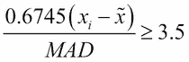

为了确定每个*x<sub>i</sub>*值的异常值状态，必须计算该异常值。该决策函数需要两个额外的输入：人口中位数和 MAD 值。这使得过滤器决策功能相当复杂。它看起来是这样的：

```py
    def outlier(mad, median_x, x): 
        return 0.6745*(x - median_x)/mad >= 3.5 

```

这个`outlier()`函数可以和`filter()`一起用来传递异常值。它可以与`itertools.filterfalse()`一起使用，以拒绝异常值并创建没有错误值的子集。

为了使用这个`outlier()`函数，我们需要创建如下函数：

```py
    def pass_outliers2(data): 
        population_median = median(data) 
        mad = median_absdev(data, population_median) 
        outlier_partial = partial(outlier, mad, population_median) 
        return filter(outlier_partial, data) 

```

这将计算两个总体减少量：`population_median`和`mad`。给定这两个值，我们可以创建一个部分函数，`outlier_partial()`。此函数具有前两个位置参数值`mad`和`population_median`的绑定值。生成的分部函数只需要单个数据值进行处理。

`outlier_partial()`和`filter()`处理等价于此生成器表达式：

```py
    return ( 
        x for x in data if outlier(mad, population_median, x) 
    ) 

```

目前还不清楚这个表达式是否比在`itertools`模块中使用`compress()`函数有明显的优势。然而，对于那些更习惯于使用`filter()`的程序员来说，这可能更清楚一些。

## 另见

*   参见[http://www.itl.nist.gov/div898/handbook/eda/section3/eda35h.htm](http://www.itl.nist.gov/div898/handbook/eda/section3/eda35h.htm) 用于检测异常值

# 一次分析多个变量

在许多情况下，我们将有多个变量的数据，我们想分析。数据可以可视化为填充在网格中，每一行包含一个特定的结果。每个结果行在列中都有多个变量。

我们可以遵循列主顺序的模式，独立地处理每个变量（来自一列数据）。这将导致多次访问每一行数据。或者，我们可以使用行主顺序模式，一次处理每行数据的所有变量。

关注每个变量的优点是，我们可以编写一个相对简单的处理堆栈。我们将有多个堆栈，每个变量一个，但是每个堆栈都可以重用`statistics`模块中的公共函数。

这种关注的缺点是，为一个非常大的数据集处理每个变量需要从操作系统文件中读取原始数据。这部分过程可能是最耗时的。事实上，读取数据所需的时间往往支配着进行统计分析所需的时间。I/O 成本如此之高，以至于 Hadoop 等专门系统被发明出来，以尝试并加速对超大数据集的访问。

我们如何通过一组数据来收集一些描述性统计数据？

## 准备好了吗

我们可能要分析的变量将分为若干类别。例如，统计学家通常将变量分为以下几类：

*   **连续实值数据**：这些变量通常是用浮点值来测量的，它们有一个定义良好的测量单位，并且它们可以接受受测量精度限制的值。
*   **离散或分类数据**：这些变量采用从有限域中选择的值。在某些情况下，我们可以提前枚举域。在其他情况下，必须发现域的值。
*   **序数数据**：提供排名或排序。一般来说，序数值是一个数字，但没有其他统计摘要适用于这个数字，因为它不是一个真正的度量；它没有单位。
*   **计数数据**：该变量是个体离散结果的汇总。通过计算离散计数的实值平均值，可以将其视为连续的。

变量可能相互独立，也可能依赖于其他变量。在研究的初始阶段，依赖性可能未知。在以后的阶段，软件的一个目标是发现依赖关系。稍后，可以使用软件对依赖项进行建模。

由于数据的多样性，我们需要将每个变量视为一个不同的项。我们不能把它们都当作简单的浮点值。正确地承认这些差异将导致类定义的层次结构。每个子类将包含变量的唯一特性。

我们有两种总体设计模式：

*   **急切**：我们可以尽早计算各种总结。在某些情况下，我们不必为此积累太多数据。
*   **懒惰**：我们尽可能晚地计算总结。这意味着我们将积累数据，并使用属性来计算摘要。

对于非常大的数据集，我们希望有一个混合解决方案。我们将急切地计算一些摘要，并使用属性计算这些摘要的最终结果。

我们将使用*中的一些数据，使用内置的统计库*配方，该配方在许多类似的数据系列中只包含两个变量。变量名为*x*和*y*，均为实值变量。*y*变量应取决于*x*变量，因此相关和回归模型适用于该变量。

我们可以使用以下命令读取此数据：

```py
>>> from pathlib import Path 
>>> import json 
>>> from collections import OrderedDict 
>>> source_path = Path('code/anscombe.json') 
>>> data = json.loads(source_path.read_text(), 
...     object_pairs_hook=OrderedDict)

```

我们已经为数据文件定义了`Path`。然后我们可以使用`Path`对象从这个文件中读取文本。`json.loads()`使用此文本从 JSON 数据构建 Python 对象。

我们已经包含了一个`object_pairs_hook`，因此该函数将使用`OrderedDict`类而不是默认的`dict`类来构建 JSON。这将保留源文档中项目的原始顺序。

我们可以检查以下数据：

```py
>>> [item['series'] for item in data] 
['I', 'II', 'III', 'IV'] 
>>> [len(item['data']) for item in data] 
[11, 11, 11, 11]

```

整个 JSON 文档是一系列带有键的子文档，如`'I'`。每个子文档有两个字段：`"series"`和`"data"`。在`"data"`阵列中，有一个我们想要描述的观察列表。每个观察值都有一对值。

## 怎么做。。。

1.  定义一个类来处理变量的分析。这将处理所有转换和清理。我们将使用混合过程方法：在每个数据元素到达时更新总和和计数。在请求这些属性之前，我们不会计算最终平均值或标准偏差：

    ```py
            import math 
            class SimpleStats: 
                def __init__(self, name): 
                    self.name = name 
                    self.count = 0 
                    self.sum = 0 
                    self.sum_2 = 0 
                def cleanse(self, value): 
                    return float(value) 
                def add(self, value): 
                    value = self.cleanse(value) 
                    self.count += 1 
                    self.sum += value 
                    self.sum_2 += value*value 
                @property 
                def mean(self): 
                    return self.sum / self.count 
                @property 
                def stdev(self): 
                    return math.sqrt( 
                        (self.count*self.sum_2-self.sum**2)/(self.count*(self.count-1)) 
                        ) 

    ```

    在本例中，我们定义了`count`、`sum`和平方和的汇总。我们可以扩展这个类来添加更多的计算。对于中间值或模式，我们必须累积各个值，并将设计更改为完全懒惰。
2.  定义实例以处理输入列。我们将创建两个`SimpleStats`类的实例。在这个配方中，我们选择了两个非常相似的变量，一个类涵盖了这两种情况：

    ```py
            x_stats = SimpleStats('x') 
            y_stats = SimpleStats('y') 

    ```

3.  定义从实际列标题到统计计算对象的映射。在某些情况下，列可能无法通过名称标识：我们可能使用列索引。在这种情况下，对象序列将与每行中的列序列相匹配：

    ```py
            column_stats = { 
                'x': x_stats, 
                'y': y_stats 
            } 

    ```

4.  定义一个处理所有行的函数，使用每行中每列的统计计算对象：

    ```py
            def analyze(series_data): 
                x_stats = SimpleStats('x') 
                y_stats = SimpleStats('y') 
                column_stats = { 
                    'x': x_stats, 
                    'y': y_stats 
                } 
                for item in series_data: 
                    for column_name in column_stats: 
                        column_stats[column_name].add(item[column_name]) 
                return column_stats 

    ```

    外部`for`语句处理每行数据。内部的`for`语句处理每行的每一列。处理过程显然是按主要顺序进行的。
5.  显示各种对象的结果或摘要：

    ```py
            column_stats = analyze(series_data) 
            for column_key in column_stats: 
                print(' ', column_key, 
                      column_stats[column_key].mean, 
                      column_stats[column_key].stdev) 

    ```

我们可以将分析函数应用于一系列数据值。这将返回包含统计摘要的词典。

## 它是如何工作的。。。

我们已经创建了一个类，用于处理特定类型列的清理、筛选和统计处理。当遇到各种列时，我们需要多个类定义。其思想是能够轻松创建相关类的层次结构。

我们为要分析的每个特定列创建此类的实例。在本例中，`SimpleStats`是为一列简单浮点值设计的。其他设计适用于离散或顺序数据。

这个类的面向外部的特性是一个`add()`方法。每个单独的数据值都提供给此方法。`mean`和`stdev`属性计算汇总统计信息。

该类还定义了一个`cleanse()`方法来处理数据转换需求。这可以扩展到处理无效数据的可能性。它可能会过滤这些值，而不是引发异常。必须重写此方法以处理更复杂的数据转换。

我们已经创建了单个统计处理对象的集合。在本例中，集合中的两个项都是`SimpleStats`的实例。在大多数情况下，将涉及多个类，并且统计处理对象的收集可能相当复杂。

`SimpleStats`对象的集合应用于每一行数据。`for`语句使用映射的键，这些键也是列名，用于将每列的数据与适当的统计处理对象相关联。

在某些情况下，必须延迟计算统计摘要。例如，为了发现异常值，我们需要所有的数据。定位异常值的一种常见方法是计算中位数，计算中位数的绝对偏差，然后计算这些绝对偏差的中位数。参见*定位异常值*配方。为了计算模式，我们将所有数据值累积到一个`Counter`对象中。

## 还有更多。。。

在这个设计中，我们默认所有列都是完全独立的。在某些情况下，我们需要合并列以派生其他数据项。这将导致更复杂的类定义，其中可能包括对`SimpleStats`的其他实例的引用。为了确保按依赖顺序处理列，这可能会变得相当复杂。

正如我们在[第 8 章](08.html#page "Chapter 8. Functional and Reactive Programming Features")中*使用堆叠生成器表达式*配方、*功能性和反应性编程功能*中所看到的，我们可能有一个涉及到丰富和计算派生值的多级处理。这进一步限制了列处理规则之间的顺序。处理此问题的一种方法是为每个分析仪提供相关其他分析仪的参考。我们可能有如下相当复杂的类定义集。

首先，我们将定义两个类来单独处理日期列和时间列。然后，我们将结合这些元素，基于这两个输入列创建一个时间戳列。

下面是单独处理日期列的类：

```py
    class DateStats: 
        def cleanse(self, value): 
            return datetime.datetime.strptime(date, '%Y-%m-%d').date() 
        def add(self, value): 
            self.current = self.cleanse(value) 

```

`DateStats`类只实现`add()`方法。它会清理数据并保留当前值。我们可以为处理时间列定义类似的内容：

```py
    class TimeStats: 
        def cleanse(self, value): 
            return datetime.datetime.strptime(date, '%H:%M:%S').time() 
        def add(self, value): 
            self.current = self.cleanse(value) 

```

`TimeStats`类与`DateStats`类相似；它只实现了`add()`方法。这两个类都专注于清理源数据和保留当前值。

这里有一个类，它取决于前两个类的结果。这将使用`DateStats`和`TimeStats`对象的`current`属性从以下每个对象获取当前可用的值：

```py
    class DateTimeStats: 
        def __init__(self, date_column, time_column): 
            self.date_column = date_column 
            self.time_column = time_column 
        def add(self, value=None): 
            date = self.date_column.current 
            time = self.time_column.current 
            self.current = datetime.datetime.combine(date, time) 

```

`DateTimeStats`类组合了两个对象的结果。它需要一个`DateStats`类的实例和一个`TimeStats`类的实例。从这两个对象中，当前已清除的值可用作`current`属性。

注意，`value`参数不用于`add()`方法的`DateTimeStats`实现。不再接受`value`作为参数，而是从另外两个清理对象收集一个值。这要求在处理此派生列之前处理其他两列。

为了确保这些值可用，需要对每行进行一些额外的处理。基本日期和时间处理映射到特定列：

```py
    date_stats = DateStats() 
    time_stats = TimeStats() 
    column_stats = { 
        'date': date_stats, 
        'time': time_stats 
    } 

```

此`column_stats`映射可用于对每行数据应用两个基本的数据清理操作。然而，我们也有衍生数据，必须在基础数据完成后进行计算。

我们可能会有这样的情况：

```py
    datetime_stats = DateTimeStats(date_stats, time_stats) 
    derived_stats = { 
        'datetime': datetime_stats 
    } 

```

我们已经构建了一个`DateTimeStats`实例，它依赖于另外两个统计过程对象：`date_stats`和`time_stats`。此对象的`add()`方法将从其他两个对象中的每个对象获取当前值。如果我们有其他派生列，我们可以将它们收集到这个映射中。

此`derived_stats`映射可用于应用统计处理操作来创建和分析衍生数据。整个处理循环现在有两个阶段：

```py
    for item in series_data: 
        for column_name in column_stats: 
            column_stats[column_name].add(item[column_name]) 
        for column_name in derived_stats: 
            derived_stats[column_name].add() 

```

我们已经计算了源数据中存在的列的统计信息。然后我们计算派生列的统计信息。这有一个令人愉快的特性，即只使用两个映射进行配置。我们可以通过更新`column_stats`和`derived_stats`映射来更改所使用的类。

### 使用地图（）

我们使用显式的`for`语句将每个统计对象应用于适当的列数据。我们还可以使用生成器表达式。我们甚至可以尝试使用`map()`函数。参见[第 8 章](08.html#page "Chapter 8. Functional and Reactive Programming Features")*功能性和反应性编程特性*中的*组合映射和减少转换*配方，了解此技术的一些其他背景知识。

另一种数据收集方式可能如下所示：

```py
    data_gathering = { 
        'x': lambda value: x_stats.add(value), 
        'y': lambda value: y_stats.add(value) 
    } 

```

我们提供了一个函数，将对象的`add()`方法应用于给定的数据值，而不是对象。

使用此集合，我们可以使用生成器表达式：

```py
    [data_gathering[k](row[k]) for k in data_gathering)] 

```

这将对行中可用的每个值`k`应用`data_gathering[k]`函数。

## 另见

*   请参见[第 6 章](06.html#page "Chapter 6. Basics of Classes and Objects")、*类和对象基础中的*设计具有大量处理的类*和*使用惰性属性的属性*方法，以了解适合此总体方法的其他设计备选方案*