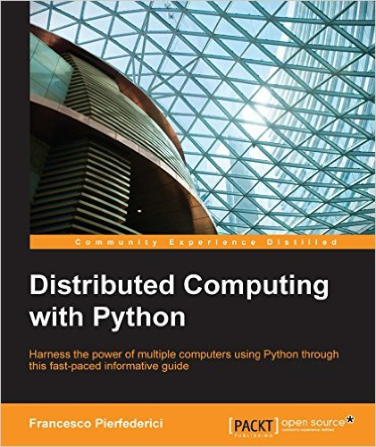

# 零、序言 （Distributed Computing with Python）

* * *

序言
[第 1 章 并行和分布式计算介绍](https://www.jianshu.com/p/a8ec42f6cb4e)
[第 2 章 异步编程](https://www.jianshu.com/p/02893376bfe8)
[第 3 章 Python 的并行计算](https://www.jianshu.com/p/66f47049cc5a)
[第 4 章 Celery 分布式应用](https://www.jianshu.com/p/ee14ed9e4989)
[第 5 章 云平台部署 Python](https://www.jianshu.com/p/84dde3009782)
[第 6 章 超级计算机群使用 Python](https://www.jianshu.com/p/59471509d3d9)
[第 7 章 测试和调试分布式应用](https://www.jianshu.com/p/c92721ff5f3c)
[第 8 章 继续学习](https://www.jianshu.com/p/de89c55f8e8a)

* * *

Python 分布式计算

* * *

## 作者简介

Francesco Pierfederici 是一名喜爱 Python 的软件工程师。过去 20 年间，他的工作领域涉及天文学、生物学和气象预报。

他搭建过上万 CPU 核心的大型分布式系统，并在世界上最快的超级计算机上运行过。他还写过用处不大，但极为有趣的应用。他总是喜欢创造新事物。

“我要感谢我的妻子 Alicia，感谢她在成书过程中的耐心。我还要感谢 Packt 出版社的 Parshva Sheth 和 Aaron Lazar，以及技术审稿人 James King，他们让这本书变得更好。” —— Francesco Pierfederici

* * *

## 审稿人简介

James King 是一名有丰富分布式系统开发经验的工程师。他是许多开源项目的贡献者，包括 OpenStack 和 Mozilla Firefox。他喜欢数学、与孩子们骑马、游戏和艺术。

* * *

## 序言

并行和分布式计算是一个具有吸引力的课题，几年之前，只有大公司和国家实验室的开发者才能接触到。这十年间，情况发生了改变：现在所有人都可以使用各种语言搭建中小型的分布式应用，这些语言中自然包括我们的最爱：Python。

这本书是为搭建分布式系统的 Python 开发者而写的实践指导。它首先介绍了关于并行和分布式计算的基础理论。然后，用 Python 的标准库做了几个并行计算示例。接着，不再使用一台计算机，而是使用第三方库，包括 Celery 和 Pyro，扩展到更多节点。

剩下的章节探讨了分布式应用的部署方案，包括云平台和超级计算机群（High Performance Computing，HPC），分析了各自的优势和难点。

最后，分析了一些难点，监控、登录、概述和调试。

总之，这是一本关注实践的书，它将教会你使用一些流行的框架和方法，使用 Python 搭建并行分布系统。

## 本书的内容

第 1 章，并行和分布式计算介绍，介绍基础理论。
第 2 章，异步编程，介绍两种分布式应用的编程风格：同步和异步。
第 3 章，Python 的并行计算，介绍使用 Python 的标准库，实现同一时间完成多项任务。
第 4 章，Celery 分布式应用，介绍如何使用 Celery 搭建最简单的分布式应用，以及 Celery 的竞争对手 Python-RQ 和 Pyro。
第 5 章，云平台使用 Python，展示如何使用 AWS 将 Python 应用部署到云平台。
第 6 章，超级计算机群使用 Python，介绍将 Python 应用部署到超级计算机群，多应用于大学和国家实验室。
第 7 章，测试和调试分布式应用，讲解了 Python 分布式应用在测试、概述和调试中的难点。
第 8 章，继续学习，回顾前面所学，向感兴趣的读者介绍继续学习的路径。

* * *

序言
[第 1 章 并行和分布式计算介绍](https://www.jianshu.com/p/a8ec42f6cb4e)
[第 2 章 异步编程](https://www.jianshu.com/p/02893376bfe8)
[第 3 章 Python 的并行计算](https://www.jianshu.com/p/66f47049cc5a)
[第 4 章 Celery 分布式应用](https://www.jianshu.com/p/ee14ed9e4989)
[第 5 章 云平台部署 Python](https://www.jianshu.com/p/84dde3009782)
[第 6 章 超级计算机群使用 Python](https://www.jianshu.com/p/59471509d3d9)
[第 7 章 测试和调试分布式应用](https://www.jianshu.com/p/c92721ff5f3c)
[第 8 章 继续学习](https://www.jianshu.com/p/de89c55f8e8a)

* * *