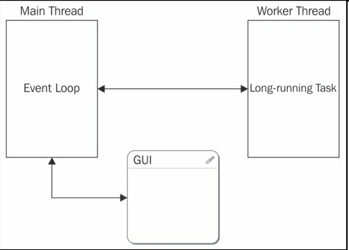
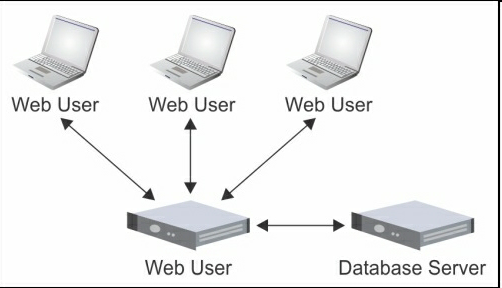
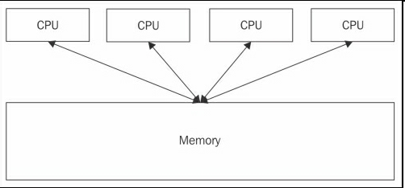
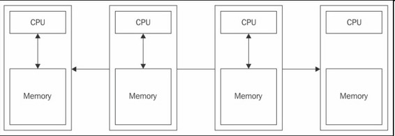
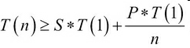
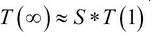
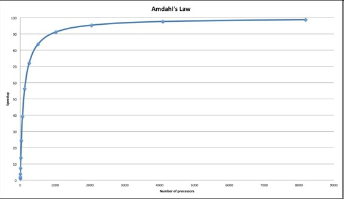

# 一、并行和分布式计算介绍 （Distributed Computing with Python）

本书示例代码适用于Python 3.5及以上。

* * *

当代第一台数字计算机诞生于上世纪30年代末40年代初（Konrad Zuse 1936年的Z1存在争议），也许比本书大多数读者都要早，比作者本人也要早。过去的七十年见证了计算机飞速地发展，计算机变得越来越快、越来越便宜，这在整个工业领域中是独一无二的。如今的手机，iPhone或是安卓，比20年前最快的电脑还要快。而且，计算机变得越来越小：过去的超级计算机能装下整间屋子，现在放在口袋里就行了。

这其中包括两个重要的发明。其一是主板上安装多块处理器（每个处理器含有多个核心），这使得计算机能真正地实现并发。我们知道，一个处理器同一时间只能处理同一事务；后面章节我们会看到，当处理器快到一定程度，就可以给出同一时间进行多项任务的假象。若要真正实现同一时间多任务，就需要多个处理器。

另一项发明是高速计算机网络。它首次让无穷多的电脑实现了相互通讯。联网的电脑可能处于同一地点（称为局域网LAN）或分布在不同地点（称为广域网WAN）。

如今，我们都已熟悉多处理器/多核心计算机，事实上，我们的手机、平板电脑、笔记本电脑都是多核心的。显卡，或图形处理器（GPU），往往是大规模并行机制，含有数百乃至上千个处理单元。我们周围的计算机网络无处不在，包括：Internet、WiFi、4G网络。

本章剩余部分会探讨一些定义。我们会介绍并行和分布式计算的概念。给出一些常见的示例。探讨每个架构的优缺点，和编程的范式。

在开始介绍概念之前，先澄清一些东西。在剩余部分中，除非特别指明，我们会交叉使用处理器和CPU核心。这在概念上显然是不对的：一个处理器会有一个或多个核，每台计算机会有一个或多个处理器。取决于算法和性能要求，在多处理器或单处理器多核的计算机上运行可能会有速度上的不同，假定算法是并行的。然而，我们会忽略这些差异，将注意力集中于概念本身。

## 并行计算

并行计算的概念很多。本书提供一个简洁的概念：

> 并行计算是同时使用多个处理器处理事务。

典型的，这个概念要求这些处理器位于同一块主板，以区别于分布式计算。

分工的历史和人类文明一样久远，也适用于数字世界，当代计算机安装的计算单元越来越多。

并行计算是有用且必要的原因很多。最简单的原因是性能；如果我们要把一个冗长的计算分成小块、打包给不同的处理器，就可以在相同时间内完成更多工作。

或者，并行计算在处理一项任务时，还可以向用户呈现反馈界面。记住一个处理器同一时间只能处理一项任务。有GUIs的应用需要将任务交付给另一个处理器的独立线程，以让另一个处理器能更新GUI，并对输入进行反馈。

下图展示了这个常见的架构，主线程使用事件循环（Event Loop）处理用户和系统输入。需要长时间处理的任务和会阻塞GUI的任务会被移交给后台或worker线程：

一个该并行架构的实际案例可以是一个图片应用。当我们将数码相机或手机连接到电脑上时，图片应用会进行一系列动作，同时它的用户界面要保持交互。例如，应用要将图片从设备拷贝到硬盘上、建立缩略图、提取元数据（拍摄日期及时间）、生成索引、最后更新图片库。与此同时，我们仍然可以浏览以前传输的图片，打开图片、进行编辑等等。

当然，整个过程在单处理器上可能是顺序依次进行的，这个处理器也要处理GUI。这就会造成用户界面反应迟缓，整个应用会变慢。并行运行可以使这个过程流畅，提高用户体验。

敏锐的读者此时可能指出，以前的只有单处理器单核的旧电脑也可以（通过多任务）同时处理多个事件。即使如今，也可以让运行的任务数超过计算机的处理器数目。其实，这是因为一个正在运行的任务被从CPU移出（这可能是自发或被操作系统强制的，例如，响应IO事件），好让另一个任务可以在CPU上运行。类似的中断会时而发生，在应用运行中，各种任务会相继获得会被移出CPU。切换通常很快，这样，用户就会有计算机并行运行任务的感觉。实际上，只有一个任务在特定的时间运行。

通常在并行应用中运行的工具是线程。系统（比如Python）通常对线程有严格的限制（见第3章），开发者要转而使用子进程subprocess（通常的方法是分叉）。子进程取代（或配合）线程，与主进程同时运行。

第一种方法是多线程编程（multithreaded programming）。第二种方法是多进程（multiprocessing）。多进程可以看做是多线程的变通。

许多情况下，多进程要优于多线程。有趣的是，尽管二者都在单机运行，多线程是共享内存架构的例子，而多进程是分布式内存架构的例子（参考本书后续内容）。

## 分布式计算

本书采用如下对分布式计算的定义：

> 分布式计算是指同一时间使用多台计算机处理一个任务。

一般的，与并行计算类似，这个定义也有限制。这个限制通常是要求，对于使用者，这些计算机可以看做一台机器，进而掩盖应用的分布性。本书中，我们更喜欢这个广义的定义。

显然，只有当计算机之间互相连接时，才可以使用分布式计算。事实上，许多时候，这只是对我们在之前部分的并行计算的概念总结。

搭建分布式系统的理由有很多。通常的原因是，要做的任务量太大，一台计算机难以完成，或是不能在一定时间内完成。一个实际的例子就是皮克斯或梦工厂的3D动画电影渲染。

考虑到整部电影要渲染的总帧数（电影两个小时，每秒有30帧），电影工作室需要将海量的工作分配到多台计算机（他们称其为计算机农场）。

另外，应用本身需要分布式的环境。例如，即时聊天和视频会议应用。对于这些应用，性能不是最重要的。最关键的是，应用本身要是分布式的。下图中，我们看到一个非常常见的网络应用架构（另一个分布式应用例子），多个用户与网站相连。同时，应用本身要与LAN中不同主机的系统（例如数据库服务器）通讯：

另一个分布式系统的例子，可能有点反直觉，就是CPU-GPU。如今，显卡本身就是很复杂的计算机。它们高并行运行，处理海量计算密集型任务，不仅是为了在显示器上显示图像。有大量的工具和库（例如NVIDIA的CUDA，OpenCL和OpenAcc）可以让开发者对GPU进行开发，来做广义计算任务。（译者注：比如在比特币中，使用显卡编程来挖矿。）

然而，CPU和GPU组成的系统实际上就是一个分布式系统，网络被PCI总线取代了。任何要使用CPU和GPU的应用都要处理数据在两个子系统之间的移动，就像传统的在网络中运行的应用。

将现存的代码移植到计算机网络（或GPU）不是一件轻松的工作。要移植的话，我发现先在一台计算机上使用多进程完成，是一个很有用的中间步骤。我们会在第3章看到，Python有强大的功能完成这项任务（参考`concurrent.futures`模块）。

一旦完成多进程并行运行，就可以考虑将这些进程分拆给独立的应用，这就不是重点了。

特别要注意的是数据，在哪里存储、如何访问。简单情况下，共享式的文件系统（例如，UNIX的NFS）就足够了；其余情况，就需要数据库或是消息队列。我们会在第4章中看几个这样的实例。要记住，真正的瓶颈往往是数据而不是CPU。

## 共享式内存vs分布式内存

在概念上，并行计算和分布计算很像，毕竟，二者都是要将总计算量分解成小块，再在处理器上运行。有些读者可能会想，一种情况下，使用的处理器全部位于一台计算机之内，另一种情况下，处理器位于不同的计算机。那么，这种技术是不是有点多余？

答案是，可能。正如我们看到的，一些应用本身是分布式的。其它应用则需要更多的性能。对于这些应用，答案就可能是“有点多余”——应用本身不关心算力来自何处。然而，考虑到所有情况，硬件资源的物理存放地点还是有一定意义的。

也许，并行和分布式计算的最明显的差异就是底层的内存架构和访问方式不同。对于并行计算，原则上，所有并发任务可以访问同一块内存空间。这里，我们必须要说原则上，因为我们已经看到并行不一定非要用到线程（线程是可以访问同一块内存空间）。

下图中，我们看到一个典型的共享式内存架构，四个处理器可以访问同一内存地址。如果应用使用线程，如果需要的话，线程就可以访问同一内存空间：

然而，对于分布式应用，不同的并发任务不能正常访问同一内存。原因是，一些任务是在这一台计算机运行，一些任务是在另一台计算机运行，它们是物理分隔的。

因为计算机之间可以靠网络通讯，可以想象写一个软件层（中间件），以一个统一的内存逻辑空间呈现应用。这些中间件就是分布式共享内存架构。此书不涉及这样的系统。

下图中，我们还有有四个CPU，它们处于共享内存架构中。每个CPU都有各自的私有内存，看不到其它CPU的内存空间。四台计算机（包围CPU和内存的方框）通过网络通讯，通过网络进行数据传输：

现实中，计算机是我们之前讲过的两种极端情况的结合体。计算机网络通讯就像一个纯粹的分布式内存架构。然而，每台计算机有多个处理器，运行着共享式内存架构。下图描述了这样的混合式架构：

这些架构有各自的优缺点。对于共享式内存系统，在单一文件的并发线程中分享数据速度极快，远远快过网络传输。另外，使用单一内存地址可以简化编程。

同时，还要注意不要让各个线程发生重叠，或是彼此改变参数。

分布式内存系统扩展性强、组建成本低：需要更高性能，扩展即可。另一优点是，处理器可以访问各自的内存，不必担心发生竞争条件（竞争条件指多个线程或者进程在读写一个共享数据时，结果依赖于它们执行的相对时间的情形）。它的缺点是，开发者需要手动写数据传输的策略，需要考虑数据存储的位置。另外，不是所有算法都能容易移植到这种架构。

## 阿姆达尔定律

本章最后一个重要概念是阿姆达尔定律。简言之，阿姆达尔定律是说，我们可以尽情并行化或分布化计算，添加算力资源获得更高性能。然而，最终代码的速度不能比运行在单处理器的单序列（即非并行）的组件要快。

更正式的，阿姆达尔定律有如下公式。考虑一个部分并行的算法，称`P`为并行分量，`S`为序列分量（即非并行分量），`P+S=100%`。`T(n)`为运行时间，处理器数量为`n`。有如下关系：

这个公式转化成白话就是：在`n`个处理器上运行这个算法的时间大于等于，单处理器上运行序列分量的时间`S*T(1)`加上，并行分量在单处理器上运行的时间`P*T(1)`除以`n`。

当提高处理器的数量`n`，等式右边的第二项变得越来越小，与第一项对比，逐渐变得可以忽略不计。此时，这个公式近似于：

这个公式转化成白话就是：在无限个处理器上运行这个算法的时间近似等于序列分量在单处理器上的运行时间`S*T(1)`。

现在，思考一下阿姆达尔定律的意义。此处的假定过于简单，通常，我们不能使算法完全并行化。

也就是说，大多情况下，我们不能让`S=0`。原因有很多：我们可能必须要拷贝数据和/或代码到不同的处理器可以访问的位置。我们可能必须要分隔数据，将数据块在网络中传输。可能要收集所有并发任务的结果，并进行进一步处理，等等。

无论原因是什么，如果不能使算法完全并行化，最终的运行时间取决于序列分量的表现。并行化的程度越高，加速表现越不明显。

题外话，完全并行通常称作密集并行（Embarrassingly parallel），或者用政治正确的话来说，愉悦并行（pleasantly parallel），它拥有最佳的扩展性能（速度与处理器的数量呈线性关系）。当然，对此不必感到尴尬！不幸的是，密集并行很少见。

让我们给阿姆达尔定律添加一些数字。假定，算法在单处理器耗时100秒。再假设，并行分量为99%，这个数值已经很高了。添加处理器的数量以提高速度。来看以下计算：

我们看到，随着`n`的提高，加速的效果不让人满意。使用10个处理器，是9.2倍速。使用100个处理器，则是50倍速。使用1000个处理器，仅仅是91倍速。

下图描述了倍速与处理器数量的关系。无论使用多少处理器，也无法大于100倍速，即运行时间小于1秒，即小于序列分量运行的时间。

阿姆达尔定律告诉我们两点：我们最快可以将倍速提高到多少；收益减少时，何时应该减少硬件资源的投入。

另一有趣的地方是阿姆达尔定律适用于分布式系统和混合并行-分布式系统。这时，`n`等于所有计算机的处理器总数目。

随着能接触的系统的性能变得越来越高，如果能使用剩余性能，还可以缩短分布式算法运行的时间。

随着应用的的执行时间变短，我们就倾向于处理更复杂的问题。对于这样的算法进化，即问题规模的扩大（计算要求的扩大）达到可接受的性能时，称作古斯塔夫森定律。

## 混合范式

我们现在能买到的电脑大多是多处理器多核的，我们将要写的分布式应用就是要这样的电脑上运行。这使得我们可以既开发分布式计算，也可以开发并行式计算。这种混合分布-并行范式是如今开发网络分布应用的事实标准。现实通常是混合的。

## 总结

这一章讲了基础概念。我们学习了并行和分布式计算，以及两个架构的例子，探讨了优缺点。分析了它们是如何访问内存，并指出现实通常是混合的。最后讲了阿姆达尔定律，它对扩展性能的意义，硬件投入的经济考量。下一章会将概念转化为实践，并写Python代码！

