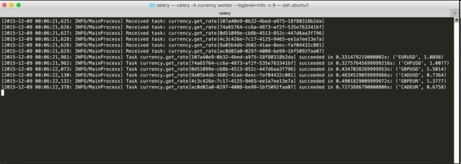

# 四、Celery分布式应用 （Distributed Computing with Python）

* * *

[序言](https://www.jianshu.com/p/ad10480c89d9)
[第1章 并行和分布式计算介绍](https://www.jianshu.com/p/a8ec42f6cb4e)
[第2章 异步编程](https://www.jianshu.com/p/02893376bfe8)
[第3章 Python的并行计算](https://www.jianshu.com/p/66f47049cc5a)
第4章 Celery分布式应用
[第5章 云平台部署Python](https://www.jianshu.com/p/84dde3009782)
[第6章 超级计算机群使用Python](https://www.jianshu.com/p/59471509d3d9)
[第7章 测试和调试分布式应用](https://www.jianshu.com/p/c92721ff5f3c)
[第8章 继续学习](https://www.jianshu.com/p/de89c55f8e8a)

* * *

本章是前面某些知识点的延续。特别的，本章以实例详细的探讨了异步编程和分布式计算。本章关注**Celery**，一个复杂的用于构建分布应用的Python框架。最后，对比了Celery的对手：`Pyro`和`Python-RQ`。

此时，你应该已经明白了并行、分布和异步编程的基本含义。如果没有的话，最好再学习下前面几章。

## 搭建多机环境

学习Celery和其它Python包之前，先来搭建测试环境。我们开发的是分布应用，因此需要多机环境。

可以使用至少两台联网机器的读者可以跳过这部分。其余读者，请继续阅读。对于后者，仍然有免费或便宜的解决方案。

其一是在主机上使用虚拟机VM（例如VirtualBox，[https://www.virtualbox.org](https://link.jianshu.com?t=https://www.virtualbox.org/)）。创建几个VM，安装Linux，让它们在后台运行。因为它们不需要图像化桌面，所以可以很轻量，使用少量RAM和CPU即可。

另一方法是买几个便宜的小型计算机主板，比如树莓派（[https://www.raspberrypi.org](https://link.jianshu.com?t=https://www.raspberrypi.org/)），在它上面安装Linux，连上局域网。

第三种方案是用云服务器，比如Amazon EC2，使用它的虚拟机。如果使用这种方法，要确认这些包的端口在防火墙是打开的。

无论是用哪种方法，紧跟着的问题就是没有在集群上安装完整的DNS。最便捷的方法是在所有机器上编辑`/etc/hosts`文件。查看IP地址，为每台机器起一个名字，并将它们添加到`/etc/hosts`。

我在Mac主机上使用了两个虚拟机，这是我的hosts文件：

```py
$ cat /etc/hosts
##
# Host Database
#
# localhost is used to configure the loopback interface
# when the system is booting.  Do not change this entry.
##
127.0.0.1 localhost
255.255.255.255 broadcasthost
::1             localhost 
fe80::1%lo0 localhost

# Development VMs
192.168.123.150 ubuntu1 ubuntu1.local
192.168.123.151 ubuntu2 ubuntu2.local 
```

相似的，这是我的两个虚拟机（运行Ubuntu 15.04）上的host文件：

```py
$ cat /etc/hosts
127.0.0.1 localhost
192.168.123.151 ubuntu2
192.168.123.150 ubuntu1

# The following lines are desirable for IPv6 capable hosts
::1     ip6-localhost ip6-loopback
fe00::0 ip6-localnet
ff00::0 ip6-mcastprefix
ff02::1 ip6-allnodes
ff02::2 ip6-allrouters 
```

你要确保hosts文件上的IP地址和名字是要使用的机器。本书，会命名这些机器命名为HOST1、HOST2、HOST3等等。

搭建好多机环境之后，就可以开始写分布应用了。

## 安装Celery

目前为止，我们用的都是Python的标准库，Celery（[http://www.celeryproject.org](https://link.jianshu.com?t=http://www.celeryproject.org/)）是用到的第一个第三方库。Celery是一个分布任务队列，就是一个以队列为基础的系统，和之前的某些例子很像。它还是分布式的，意味着工作进程和保存结果的和请求的队列，在不同机器上。

首先安装Celery和它的依赖。在每台机器上建立一个虚拟环境（起名为`book`），代码如下（环境是Unix）：

```py
$ pip install virtualenvwrapper 
```

如果这个命令被拒绝，可以加上`sudo`，用超级用户权限来安装`virtualenvwrapper`，代码如下：

```py
$ sudo pip install virtualenvwrapper 
```

`sudo`命令会向你询问Unix用户密码。或者，可以用下面代码安装`virtualenvwrapper`：

```py
$ pip install --user virtualenvwrapper 
```

不管使用哪种方法，完成安装`virtualenvwrapper`之后，都需要配置它，定义三个环境变量（用于bash类的shell，假定`virtualenvwrapper`安装在`/usr/local/bin`）：

```py
$ export WORKON_HOME=$HOME/venvs
$ export PROJECT_HOME=$HOME/workspace
$ source /usr/local/bin/virtualenvwrapper.sh 
```

你需要修改前置路径，来决定虚拟环境所在的位置（`$WORKON_HOME`）和代码的根目录（`$PROJECT_HOME`）。`virtualenvwrapper.sh`的路径也可能需要变动。这三行代码最好添加到相关的shell启动文件（例如，`~/.bashrc`或`~/.profile`）。

做好了前面的设置，我们就可以创建要使用的虚拟环境了，如下所示：

```py
$ mkvirtualenv book --python=`which python3.5` 
```

这个命令会在`$WORKON_HOME`之下建立新的虚拟环境，名字是`book`，使用的是Python 3.5。以后，可以用下面命令启动这个虚拟环境：

```py
$ workon book 
```

使用虚拟环境的好处是，可以在里面安装所有需要的包，而不污染系统的Python。以后不再需要这个虚拟环境时，可以方便的删除（参考`rmvirtualenv`命令）。

现在就可以安装Celery了。和以前一样，（在每台机器上）使用`pip`：

```py
$ pip install celery 
```

该命令可以在激活的虚拟环境中下载、解压、安装所有的依赖。

快完成了，现在只需安装配置一个中间代理，Celery用它主持任务队列，并向工作进程（只有一台机器，HOST1）发送消息。从文档中可以看到，Celery支持多种中间代理，包括**SQLAlchemy**（[http://www.sqlalchemy.org](https://link.jianshu.com?t=http://www.sqlalchemy.org/)），用以本地开发和测试。这里推荐使用的中间代理是**RabbitMQ**（[https://www.rabbitmq.com](https://link.jianshu.com?t=https://www.rabbitmq.com/)）。

[https://www.rabbitmq.com](https://link.jianshu.com?t=https://www.rabbitmq.com/)上有安装指导、文档和下载。在Mac主机上，安装的最简方法是使用**homebrew**（[http://brew.sh](https://link.jianshu.com?t=http://brew.sh/)），如下所示：

```py
$ brew install rabbitmq 
```

对于Windows用户，最好使用官方的安装包。对于Linux，官方也提供了安装包。

安装好**RabbitMQ**之后，就可以立即使用了。这里还有一个简单的配置步骤，因为在例子中，访问队列不会创建用户和密码。只要编辑RabbitMQ的配置文件（通常位于`/usr/local/etc/rabbitmq/rabbitmq.config`），添加下面的条目，允许网络中的默认`guest`账户：

```py
[
  {rabbit, [{loopback_users, []}]}
]. 
```

手动启动RabbitMQ，如下所示（服务器脚本可能不在`$PATH`环境，通常存储在`/usr/local/sbin`）：

```py
$ sudo rabbitmq-server 
```

`sudo`会向你询问用户密码。对于我们的例子，我们不会进一步配置中间代理，使用默认访客账户就行。

> 注意：感兴趣的读者可以在[http://www.rabbitmq.com/admin-guide.html](https://link.jianshu.com?t=http://www.rabbitmq.com/admin-guide.html)阅读RabbitMQ的管理指导。

到这里，我们就安装好了所有需要的东西，可以开始使用Celery了。有另外一个依赖，也值得考虑安装，尽管不是严格需要的，尤其是我们只想使用Celery。它是结果后台，即Celery的工作进程用其存储计算的结果。它就是Redis（[http://redis.io](https://link.jianshu.com?t=http://redis.io/)）。安装Redis是非必须的，但极力推荐安装，和RabbitMQ类似，Redis运行在另一台机器上，称作HOST2。

Redis的安装十分简单，安装代码适用于Linux，Mac OS X和Windows。我们在Mac上用homebrew安装，如下：

```py
$ brew install redis 
```

在其它操作系统上，例如Linux，可以方便的用二进制码安装（例如对于Ubuntu，`sudo apt-get install redis-server`）。

启动Redis的命令如下：

```py
$ sudo redis-server 
```

本章剩下的部分会假定结果后台存在，如果没有安装，会到时指出配置和代码的不同。同时，任何在生产环境中使用Celery的人，都应该考虑使用结果后台。

## 测试安装

快速尝试一个例子，以验证Celery是正确安装的。我们需要四个终端窗口，三个不同的机器（命名为HOST1、HOST2、HOST3和HOST4）。在HOST1的窗口启动RabbitMQ（确保`rabbitmq-server`路径正确）：

```py
HOST1 $ sudo /usr/local/sbin/rabbitmq-server 
```

在HOST2的窗口，启动Redis（没安装的话，跳到下一段）：

```py
HOST2 $ sudo /usr/local/bin/redis-server 
```

最后，在HOST3的窗口，创建如下Python文件（记得使用`workon book`激活虚拟环境），命名为`test.py`：

```py
import celery

app = celery.Celery('test',
                        broker='amqp://HOST1',
                        backend='redis://HOST2')

@app.task
def echo(message):
    return message 
```

这段代码很简单。先引入了`Celery`包，然后定义了一个Celery应用（`app`），名字是`test`。这个应用使用HOST1的中间代理RabbitMQ和HOST2的Redis数据库的默认账户和消息队列。

要是想用RabbitMQ作为结果后台而不用Redis，需要修改前面的代码，将`backend`进行如下修改：

```py
import celery

app = celery.Celery('test',
                        broker='amqp://HOST1',
                        backend=amqp://HOST1')

@app.task
def echo(message):
    return message 
```

有了应用实例，就可以用它装饰远程的worker（使用装饰器`@app.task`）。在这个例子中，我们装饰一个简单的函数，它可以返回传递给它的消息（`echo`）。

之后，在终端HOST3，建立worker池，如下所示：

```py
HOST3 $ celery -A test worker --loglevel=info 
```

记得要在`test.py`的目录（或将`PYTHONPATH`环境变量指向`test.py`的目录），好让Celery可以引入代码。

`celery`命令会默认启动CPU数目相同的worker进程。worker会使用`test`模块中的应用`app`（我们可以使用实例的名字`celery -A test.app worker`），并使用`INFO`等级在控制台显示日志。在我的电脑上（有`HyperThreading`的四核电脑），Celery默认启用了八个worker进程。

在HOST4终端，复制`test.py`代码，启动`book`虚拟环境，在`test.py`目录打开Python shell，如下所示：

```py
HOST4 $ python3.5
Python 3.5.0 (v3.5.0:374f501f4567, Sep 12 2015, 11:00:19)
[GCC 4.2.1 (Apple Inc. build 5666) (dot 3)] on darwin
Type "help", "copyright", "credits" or "license" for more information. 
```

从复制的`test`模块引入`echo`函数，如下：

```py
>>> from test import echo 
```

我们现在可以像普通Python函数一样调用`echo`，`echo`可以直接在本地（即HOST4）运行，如下所示：

```py
>>> res = echo('Python rocks!')
>>> print(res)
Python rocks! 
```

为了让HOST3的worker进程运行`echo()`函数，我们不能像之前那样直接调用。我们需要调用它的`delay`方法（装饰器`@app.task`注入的），见下面的命令：

```py
>>> res = echo.delay('Python rocks!'); print(type(res)); print(res)
<class 'celery.result.AsyncResult'>
1423ec2b-b6c7-4c16-8769-e62e09c1fced
>>> res.ready()
True
>>> res.result
'Python rocks!' 
```

我们看到，调用`echo.delay('Python rocks!')`不会返回字符串。相反，它在任务队列（运行在HOST1的RabbitMQ服务器）中安排了一个请求以执行`echo`函数，并返回`Future`，准确的说是`AsyncResult`（Celery的Future）。正如`concurrent.futures`模块，这个对象是一个异步调用结果的占位符。在我们的例子中，异步调用的是我们安插在任务队列的`echo`函数，调用它的是其它位置的Celery的worker进程（我们的例子中是HOST3）。

我们可以查询`AsyncResult`对象来确定它们是否预备好。如果是的话，我们可以访问它们的结果，在我们的例子中是字符串'Python rocks!'。

切换到启用worker进程的窗口，我们可以看到worker池接收到了`echo`任务请求，如下所示：

```py
[2015-11-10 08:30:12,869: INFO/MainProcess] Received task: test.echo[1423ec2b-b6c7-4c16-8769-e62e09c1fced]
[2015-11-10 08:30:12,886: INFO/MainProcess] Task test.echo[1423ec2b-b6c7-4c16-8769-e62e09c1fced] succeeded in 0.01469148206524551s: 'Python rocks!' 
```

我们现在可以退出Python shell和worker进程（在发起`celery worker`命令的终端窗口按`CTRL+C`）：Celery安装成功。

## Celery介绍

什么是分布式任务队列，Celery是怎么运行分布式任务队列的呢？分布式任务队列这种架构已经存在一定时间了。这是一种master-worker架构，有一个中间件层，中间件层使用多个任务请求队列（即任务队列），和一个用于存储结果的队列（即结果后台）。

主进程（也叫作`client`或`producer`）将任务请求安插到某个任务队列，从结果后台获取数据。worker进程订阅任务队列以明确任务是什么，并把结果放到结果后台。

这是一个简单灵活的架构。主进程不需要知道有多少个可用的worker，也不需要知道worker运行在哪台机器。它只需要知道队列在哪，以及如何发送任务请求。

worker进程也是如此。它们不需要知道任务请求来自何处，也不需要知道结果用来做什么。它们只需知道从哪里取得任务，存储在哪里。

这样的优点是worker的数量、种类、形态可以随意变化，而不对总系统的功能产生影响（但会影响性能和延迟）。分布式任务队列可以方便地进行扩展（添加新worker），规划优先级（给队列定义不同的优先级，给不同的队列安排不同数量的worker）。

另一个优点是，这个去耦合化的系统在原则上，worker和producer可以用不同语言来写。例如，Python代码生成的工作由C语言写的worker进程来做，这样性能是最高的。

Celery使用了第三方、健壮的、实地验证的系统来做它的队列和结果后台。推荐的中间代理是RabbitMQ，我们之前用过。RabbitMQ是一个非常复杂的消息代理，有许多特性，本书不会对它做深入探索。结果后台也是如此，它可以是一个简单的RabbitMQ队列，或者更优的，使用专门的服务比如Redis。

下图展示了典型的使用RabbitMQ和Redis的Celery应用架构：


每个方框中的进程（即RabbitMQ、Redis、worker和`master.py`）都可以运行在不同的机器上。小型的安装方案是将RabbitMQ和Redis放在同一个主机上，worker几点可能只有一个或两个。大型方案会使用更多的机器，或者专门的服务器。

## 更复杂的Celery应用

我们用Celery做两个简单有趣的应用。第一个仿照第3章中汇率例子，第二个是一个分布式排序算法。

我们还是使用四台机器（HOST1、HOST2、HOST3、HOST4）。和以前一样，HOST1运行RabbitMQ，HOST2运行Redis，HOST3运行Celery的worker，HOST运行主代码。

先从简单的例子开始。创建一个Python文件（`celery/currency.py`），代码如下（如果你没有使用Redis，记得修改`backend`成`'amqp://HOST1'`）：

```py
import celery
import urllib.request

app = celery.Celery('currency',
                    broker='amqp://HOST1',
                    backend='redis://HOST2')

URL = 'http://finance.yahoo.com/d/quotes.csv?s={}=X&f=p'

@app.task
def get_rate(pair, url_tmplt=URL):
    with urllib.request.urlopen(url_tmplt.format(pair)) as res:
        body = res.read()
    return (pair, float(body.strip()))

if __name__ == '__main__':
    import argparse

    parser = argparse.ArgumentParser()
    parser.add_argument('pairs', type=str, nargs='+')
    args = parser.parse_args()

    results = [get_rate.delay(pair) for pair in args.pairs]
    for result in results:
        pair, rate = result.get()
        print(pair, rate) 
```

这段代码和第3章的多线程版本差不多。主要的区别是，因为使用的是Celery，我们不需要创建队列，Celery负责建立队列。另外，除了为每个汇率对建一个线程，我们只需让worker负责从队列获取任务请求，执行相应的函数请求，完毕之后返回结果。

探讨调用的行为是有益的，比如成功的调用、由于缺少worker而不工作的调用、失败且抛出异常的调用。我们从成功的调用开始。

和`echo`的例子一样，在各自的终端启动RabbitMQ和Redis（通过`redis-server`和`rabbitmq-server`命令）。

然后，在worker主机（HOST3）上，复制`currency.py`文件，切换到它的目录，创建worker池（记住，Celery启动的worker数目尽可能和CPU核数一样多）：

```py
HOST3 $ celery -A currency worker --loglevel=info 
```

最后，复制相同的文件到HOST4，并运行如下：

```py
HOST4 $ python3.5 currency.py EURUSD CHFUSD GBPUSD GBPEUR CADUSD CADEUR
EURUSD 1.0644
CHFUSD 0.986
GBPUSD 1.5216
GBPEUR 1.4296
CADUSD 0.751
CADEUR 0.7056 
```

一切工作正常，我么得到了五个汇率。如果查看启动worker池的主机（HOST3），我们会看到类似下图的日志：



这是日志等级`loglevel=info`时，Celery worker的日志。每个任务都被分配了一个独立ID（例如GBP兑USD的任务ID是f8658917-868c-4eb5-b744-6aff997c6dd2），基本的时间信息也被打印了出来。

如果没有可用的worker呢？最简单的方法是停止worker（在终端窗口按`CTRL+C`），返回HOST4的`currency.py`，如下所示：

```py
OST4 $ python3.5 currency.py EURUSD CHFUSD GBPUSD GBPEUR CADUSD CADEUR 
```

什么都没发生，`currency.py`一直处于等待worker的状态。这样的状态可能也可能不是我们想要的：其一，让文件等待而不发生崩溃，是很方便的；其二，我们可能想在一定时间后，停止等待。可以在`result.get()`用`timeout`参数。

例如，修改代码，使用`result.get(timeout=1)`，会有如下结果（还是在没有worker的情况下）：

```py
HOST4 $ python3.5 currency.py EURUSD CHFUSD GBPUSD GBPEUR CADUSD CADEUR
 Traceback (most recent call last):
  File "currency.py", line 29, in <module>
    pair, rate = result.get(timeout=1)
  File "/venvs/book/lib/python3.5/site-packages/celery/result.py", line 169, in get
    no_ack=no_ack,
  File " /venvs/book/lib/python3.5/site-packages/celery/backends/base.py", line 226, in wait_for
    raise TimeoutError('The operation timed out.')
celery.exceptions.TimeoutError: The operation timed out. 
```

当然，我们应该总是使用超时，以捕获对应的异常，作为错误处理的策略。

要记住，默认下，任务队列是持续的，它的日志不会停止（Celery允许用户定制）。这意味着，如果我们现在启动了一些worker，它们就会开始从队列获取悬挂的任务，并返回结果。我们可以用如下命令清空队列：

```py
HOST4 $ celery purge
WARNING: This will remove all tasks from queue: celery.
         There is no undo for this operation!

(to skip this prompt use the -f option)

Are you sure you want to delete all tasks (yes/NO)? yes
Purged 12 messages from 1 known task queue. 
```

接下来看任务产生异常的情况。修改HOST3的`currency.py`文件，让`get_rate`抛出一个异常，如下所示：

```py
@app.task
def get_rate(pair, url_tmplt=URL):
    raise Exception('Booo!') 
```

现在，重启HOST3的worker池（即`HOST3 $ celery -A currency worker --loglevel=info`），然后在HOST4启动主程序：

```py
HOST4 $ python3.5 currency.py EURUSD CHFUSD GBPUSD GBPEUR CADUSD CADEUR
Traceback (most recent call last):
  File "currency.py", line 31, in <module>
    pair, rate = result.get(timeout=1)
  File "/Users/fpierfed/Documents/venvs/book/lib/python3.5/site-packages/celery/result.py", line 175, in get
    raise meta['result']
Exception: Booo! 
```

所有的worker都抛出了异常，异常传递到了调用的代码，在首次调用`result.get()`返回。

任务抛出任何异常，我们都要小心。远程运行的代码失败的原因可能有很多，不一定和代码本身有关，因此需要谨慎应对。

Celery可以用如下的方法提供帮助：我们可以用`timeout`获取结果；重新提交失败的任务（参考`task`装饰器的`retry`参数）。还可以取消任务请求（参考任务的`apply_async`方法的`expires`参数，它比之前我们用过的`delay`功能强大）。

有时，任务图会很复杂。一项任务的结果还要传递给另一个任务。Celery支持复杂的调用方式，但是会有性能损耗。

用第二个例子来探讨：一个分布式的归并排序算法。这是包含两个文件的长代码：一个是算法本身（`mergesory.py`），一个是主代码（`main.py`）。

归并排序是一个简单的基于递归二分输入列表的算法，将两个部分排序，再将结果合并。建立一个新的Python文件（`celery/mergesort.py`），代码如下：

```py
import celery

app = celery.Celery('mergesort',
                        broker='amqp://HOST1',
                        backend='redis://HOST2')

@app.task
def sort(xs):
    lenxs = len(xs)
    if(lenxs <= 1):
        return(xs)

    half_lenxs = lenxs // 2
    left = xs[:half_lenxs]
    right = xs[half_lenxs:]
    return(merge(sort(left), sort(right)))

def merge(left, right):
    nleft = len(left)
    nright = len(right)

    merged = []
    i = 0
    j = 0
    while i < nleft and j < nright:
        if(left[i] < right[j]):
            merged.append(left[i])
            i += 1
        else:
            merged.append(right[j])
            j += 1
    return merged + left[i:] + right[j:] 
```

这段代码很直白。Celery应用命名为`app`，它使用RabbitMQ作为任务队列，使用Redis作为结果后台。然后，定义了`sort`算法，它使用了附属的`merge`函数以合并两个排好序的子列表，成为一个排好序的单列表。

对于主代码，另建一个文件（`celery/main.py`），它的代码如下：

```py
#!/usr/bin/env python3.5
import random
import time
from celery import group
from mergesort import sort, merge

# Create a list of 1,000,000 elements in random order.
sequence = list(range(1000000))
random.shuffle(sequence)

t0 = time.time()

# Split the sequence in a number of chunks and process those 
# independently.
n = 4
l = len(sequence) // n
subseqs = [sequence[i * l:(i + 1) * l] for i in range(n - 1)]
subseqs.append(sequence[(n - 1) * l:])

# Ask the Celery workers to sort each sub-sequence.
# Use a group to run the individual independent tasks as a unit of work.
partials = group(sort.s(seq) for seq in subseqs)().get()

# Merge all the individual sorted sub-lists into our final result.
result = partials[0]
for partial in partials[1:]:
    result = merge(result, partial)

dt = time.time() - t0
print('Distributed mergesort took %.02fs' % (dt))

# Do the same thing locally and compare the times.
t0 = time.time()
truth = sort(sequence)
dt = time.time() - t0
print('Local mergesort took %.02fs' % (dt))

# Final sanity checks.
assert result == truth
assert result == sorted(sequence) 
```

我们先生成一个足够长的无序（`random.shuffle`）整数序列（`sequence = list(range(1000000))`）。然后，分成长度相近的子列表（`n=4`）。

有了子列表，就可以对它们进行并行处理（假设至少有四个可用的worker）。问题是，我们要知道什么时候这些列表排序好了，好进行合并。

Celery提供了多种方法让任务协同执行，`group`是其中之一。它可以在一个虚拟的任务里，将并发的任务捆绑执行。`group`的返回值是`GroupResult`（与类`AsyncResult`的层级相同）。如果没有结果后台，`GroupResult get()`方法是必须要有的。当组中所有的任务完成并返回值，`group`方法会获得一个任务签名（用参数调用任务`s()`方法，比如代码中的`sort.s(seq)`）的列表。任务签名是Celery把任务当做参数，传递给其它任务（但不执行）的机制。

剩下的代码是在本地合并排好序的列表，每次合并两个。进行完分布式排序，我们再用相同的算法重新排序原始列表。最后，对比归并排序结果与内建的`sorted`调用。

要运行这个例子，需要启动RabbitMQ和Redis。然后，在HOST3启动一些worker，如下所示：

```py
HOST3 $ celery -A mergesort worker --loglevel=info 
```

记得拷贝`mergesort.py`文件，并切换到其目录运行（或者，定义`PYTHONPATH`指向它所在的位置）。

之后，在HOST4上运行：

```py
HOST4 $ python3.5 main.py
Distributed mergesort took 10.84s
Local mergesort took 26.18s 
```

查看Celery日志，我们看到worker池接收并执行了n个任务，结果发回给了caller。

性能和预想的不一样。使用多进程（使用`multiprocessing`或`concurrent.futures`）来运行，与前面相比，可以有n倍的性能提升（7秒，使用四个worker）。

这是因为Celery同步耗时长，最好在只有不得不用的时候再使用。Celery持续询问组中的部分结果是否准备好，好进行后续的工作。这会非常消耗资源。

## 生产环境中使用Celery

下面是在生产环境中使用Celery的tips。

第一个建议是在Celery应用中使用配置模块，而不要在worker代码中进行配置。假设，配置文件是`config.py`，可以如下将其传递给Celery应用：

```py
import celery
app = celery.Celery('mergesort')
app.config_from_object('config') 
```

然后，与其他可能相关的配置指令一起，在`config.py`中添加：

```py
BROKER_URL = 'amqp://HOST1'
CELERY_RESULT_BACKEND = 'redis://HOST2' 
```

关于性能的建议是，使用至少两个队列，好让任务按照执行时间划分优先级。使用多个队列，将任务划分给合适的队列，是分配worker的简便方法。Celery提供了详尽的方法将任务划分给队列。分成两步：首先，配置Celery应用，启动worker，如下所示：

```py
# In config.py
CELERY_ROUTES = {project.task1': {'queue': 'queue1'},
                    'project.task2': {'queue': 'queue2'}} 
```

为了在队列中启动worker，在不同的机器中使用下面的代码：

```py
HOST3 $ celery –A project worker –Q queue1
HOST5 $ celery –A project worker –Q queue2 
```

使用Celery命令行工具的`-c`标志，可以控制worker池的大小，例如，启动一个有八个worker的池：

```py
HOST3 $ celery –A project worker –c 8 
```

说道worker，要注意，Celery默认使用多进程模块启动worker池。这意味着，每个worker都是一个完整的Python进程。如果某些worker只处理I/O密集型任务，可以将它们转换成协程或多线程，像前面的例子。这样做的话，可以使用`-P`标志，如下所示：

```py
$ celery –A project worker –P threads 
```

使用线程和协程可以节省资源，但不利于CPU制约型任务，如前面的菲波那切数列的例子。

谈到性能，应该尽量避免同步原语（如前面的`group()`），除非非用不可。当同步无法回避时，好的方法是使用结果后台（如Redis）。另外，如果可能的话，要避免传递复杂的对象给远程任务，因为这些对象需要序列化和去序列化，通常很耗时。

额外的，如果不需要某个任务的结果，应该确保Celery不去获取这些结果。这是通过装饰器`@task(ignore_result=True)`来做的。如果所有的任务结果都忽略了，就不必定义结果后台。这可以让性能大幅提高。

除此之外，还要指出，如何启动worker、在哪里运行worker、如何确保它们持续运行是很重要的。默认的方法是使用工具，例如**supervisord** ([http://supervisord.org](https://link.jianshu.com?t=http://supervisord.org/)) ，来管理worker进程。

Celery带有一个supervisord的配置案例（在安装文件的`extra/supervisord`目录）。一个监督的优秀方案是**flower**([https://github.com/mher/flower](https://link.jianshu.com?t=https://github.com/mher/flower))，一个worker的网络控制和监督工具。

最后，RabbitMQ和Redis结合起来，是一个很好的中间代理和结果后台解决方案，适用于大多数项目。

## Celery的替代方案：Python-RQ

Celery的轻量简易替代方案之一是 Python-RQ ([http://python-rq.org](https://link.jianshu.com?t=http://python-rq.org/))。它单单基于Redis作为任务队列和结果后台。没有复杂任务或任务路由，使用它很好。

因为Celery和Python-RQ在概念上很像，让我们立即重写一个之前的例子。新建一个文件（`rq/currency.py`），代码如下：

```py
import urllib.request

URL = 'http://finance.yahoo.com/d/quotes.csv?s={}=X&f=p'

def get_rate(pair, url_tmplt=URL):
    # raise Exception('Booo!')

    with urllib.request.urlopen(url_tmplt.format(pair)) as res:
        body = res.read()
    return (pair, float(body.strip())) 
```

这就是之前的汇率例子的代码。区别是，与Celery不同，这段代码不需要依赖Python-RQ或Redis。将这段代码拷贝到worker节点（HOST3）。

主程序也同样简单。新建一个Python文件（rq/main.py），代码如下：

```py
#!/usr/bin/env python3
import argparse
import redis
import rq
from currency import get_rate

parser = argparse.ArgumentParser()
parser.add_argument('pairs', type=str, nargs='+')
args = parser.parse_args()

conn = redis.Redis(host='HOST2')
queue = rq.Queue(connection=conn)

jobs = [queue.enqueue(get_rate, pair) for pair in args.pairs]

for job in jobs:
    while job.result is None:
        pass
    print(*job.result) 
```

我们在这里看到Python-RQ是怎么工作的。我们需要连接Redis服务器（HOST2），然后将新建的连接对象传递给`Queue`类构造器。结果`Queue`对象用来向其提交任务请求。这是通过传递函数对象和其它参数给`queue.enqueue`。

函数排队调用的结果是`job`实例，它是个异步调用占位符，之前见过多次。

因为Python-RQ没有Celery的阻塞`AsyncResult.get()`方法，我们要手动建一个事件循环，持续向`job`实例查询，以确认是否它们的`result`不是`None`这种方法不推荐在生产环境中使用，因为持续的查询会浪费资源，查询不足会浪费时间，但对于这个简易例子没有问题。

为了运行代码，首先要安装Python-RQ，用pip进行安装：

```py
$ pip install rq 
```

在所有机器上都要安装。然后，在HOST2运行Redis：

```py
$ sudo redis-server 
```

在HOST3上，启动一些worker。Python-RQ不自动启动worker池。启动多个worker的简易的方法是使用一个文件（`start_workers.py`）：

```py
#!/usr/bin/env python3
import argparse
import subprocess

def terminate(proc, timeout=.5):
    """
    Perform a two-step termination of process `proc`: send a SIGTERM
    and, after `timeout` seconds, send a SIGKILL. This should give 
    `proc` enough time to do any necessary cleanup.
    """
    if proc.poll() is None:
        proc.terminate()
        try:
            proc.wait(timeout)
        except subprocess.TimeoutExpired:
            proc.kill()
    return

parser = argparse.ArgumentParser()
parser.add_argument('N', type=int)
args = parser.parse_args()

workers = []
for _ in range(args.N):
    workers.append(subprocess.Popen(['rqworker',
                                            '-u', 'redis://yippy']))
try:
    running = [w for w in workers if w.poll() is None]
    while running:
        proc = running.pop(0)
        try:
            proc.wait(timeout=1.)
        except subprocess.TimeoutExpired:
            running.append(proc)
except KeyboardInterrupt:
    for w in workers:
        terminate(w) 
```

这个文件会启动用户指定书目的Python-RQ worker进程（通过使用`rqworker`脚本，Python-RQ源码的一部分），通过`Ctrl+C`杀死进程。更健壮的方法是使用类似之前提过的supervisord工具。

在HOST3上运行：

```py
HOST3 $ ./start_workers.py 6 
```

现在可以运行代码。在HOST4，运行`main.py`：

```py
HOST4 $ python3.5 main.py EURUSD CHFUSD GBPUSD GBPEUR CADUSD CADEUR
EURUSD 1.0635
CHFUSD 0.9819
GBPUSD 1.5123
GBPEUR 1.422
CADUSD 0.7484
CADEUR 0.7037 
```

效果与Celery相同。

## Celery的替代方案：Pyro

Pyro ([http://pythonhosted.org/Pyro4/](https://link.jianshu.com?t=http://pythonhosted.org/Pyro4/))的意思是Python Remote Objects，是1998年创建的一个包。因此，它十分稳定，且功能完备。

Pyro使用的任务分布方法与Celery和Python-RQ十分不同，它是在网络中将Python对象作为服务器。然后创建它们的代理对象，让调用代码可以将其看做本地对象。这个架构在90年代末的系统很流行，比如COBRA和Java RMI。

Pyro掩盖了代码中的对象是本地还是远程的，是让人诟病的一点。原因是，远程代码运行错误的原因很多，当远程代码隐藏在代理对象后面执行，就不容易发现错误。

另一个诟病的地方是，Pyro在点对点网络（不是所有主机名都可以解析）中，或者UDP广播无效的网络中，很难正确运行。

尽管如此，大多数开发者认为Pyro非常简易，在生产环境中足够健壮。

Pyro安装很简单，它是纯Python写的，依赖只有几个，使用pip：

```py
$ pip install pyro4 
```

这个命令会安装Pyro 4.x和Serpent，后者是Pyro用来编码和解码Python对象的序列器。

用Pyro重写之前的汇率例子，要比用Python-RQ复杂，它需要另一个软件：Pyro nameserver。但是，不需要中间代理和结果后台，因为Pyro对象之间可以直接进行通讯。

Pyro运行原理如下。每个远程访问的对象都封装在处于连接监听的socket服务器框架中。每当调用远程对象中的方法，被调用的方法，连同它的参数，就被序列化并发送到适当的对象/服务器上。此时，远程对象执行被请求的任务，经由相同的连接，将结果发回到（同样是序列化的）调用它的代码。

因为每个远程对象自身就可以调用远程对象，这个架构可以是相当去中心化的。另外，一旦建立通讯，对象之间就是p2p的，这与分布式任务队列的轻度耦合架构十分不同。另一点，每个远程对象既可以做master，也可以做worker。

接下来重写汇率的例子，来看看具体是怎么运行的。建立一个Python文件（`pyro/worker.py`），代码如下：

```py
import urllib.request
import Pyro4

URL = 'http://finance.yahoo.com/d/quotes.csv?s={}=X&f=p'

@Pyro4.expose(instance_mode="percall")
class Worker(object):
    def get_rate(self, pair, url_tmplt=URL):
        with urllib.request.urlopen(url_tmplt.format(pair)) as res:
            body = res.read()
        return (pair, float(body.strip()))

# Create a Pyro daemon which will run our code.
daemon = Pyro4.Daemon()
uri = daemon.register(Worker)
Pyro4.locateNS().register('MyWorker', uri)

# Sit in an infinite loop accepting connections
print('Accepting connections')
try:
    daemon.requestLoop()
except KeyboardInterrupt:
    daemon.shutdown()
print('All done') 
```

worker的代码和之前的很像，不同点是将`get_rate`函数变成了`Worker`类的一个方法。变动的原因是，Pyro允许导出类的实例，但不能导出函数。

剩下的代码是Pyro特有的。我们需要一个`Daemon`实例（它本质上是后台的网络服务器），它会获得类，并在网络上发布，好让其它的代码可以调用方法。分成两步来做：首先，创建一个类`Pyro4.Daemon`的实例，然后添加类，通过将其传递给`register`方法。

每个Pyro的`Daemon`实例可以隐藏任意数目的类。内部，需要的话，`Daemon`对象会创建隐藏类的实例（也就是说，如果没有代码需要这个类，相应的`Daemon`对象就不会将其实例化）。

每一次网络连接，`Daemon`对象默认会实例化一次注册的类，如果要进行并发任务，这样就不可以。可以通过装饰注册的类修改，`@Pyro4.expose(instance_mode=...)`。

`instance_mode`支持的值有三个：`single`、`session`和`percall`。使用`single`意味`Daemon`只为类创建一个实例，使用它应付所有的客户请求。也可以通过注册一个类的实例（而不是类本身）。

使用`session`可以采用默认模式：每个client连接都会得到一个新的实例，client始终都会使用它。使用`instance_mode="percall"`，会为每个远程方法调用建立一个新实例。

无论创建实例的模式是什么，用`Daemon`对象注册一个类（或实例）都会返回一个唯一的识别符（即URI），其它代码可以用识别符连接对象。我们可以手动传递URI，但更方便的方法是在Pyro nameserver中存储它，这样通过两步来做。先找到nameserver，然后给URI注册一个名字。在前面的代码中，是通过下面来做的：

```py
Pyro4.locateNS().register('MyWorker', uri) 
```

nameserver的运行类似Python的字典，注册两个名字相同的URI，第二个URI就会覆盖第一个。另外，我们看到，client代码使用存储在nameserver中的名字控制了许多远程对象。这意味着，命名需要特别的留意，尤其是当许多worker进程提供的功能相同时。

最后，在前面的代码中，我们用`daemon.requestLoop()`进入了一个`Daemon`事件循环。`Daemon`对象会在无限循环中服务client的请求。

对于client，创建一个Python文件（`pyro/main.py`），它的代码如下：

```py
#!/usr/bin/env python3
import argparse
import time
import Pyro4

parser = argparse.ArgumentParser()
parser.add_argument('pairs', type=str, nargs='+')
args = parser.parse_args()

# Retrieve the rates sequentially.
t0 = time.time()
worker = Pyro4.Proxy("PYRONAME:MyWorker")

for pair in args.pairs:
    print(worker.get_rate(pair))
print('Sync calls: %.02f seconds' % (time.time() - t0))

# Retrieve the rates concurrently.
t0 = time.time()
worker = Pyro4.Proxy("PYRONAME:MyWorker")
async_worker = Pyro4.async(worker)

results = [async_worker.get_rate(pair) for pair in args.pairs]
for result in results:
    print(result.value)
print('Async calls: %.02f seconds' % (time.time() - t0)) 
```

可以看到，client把相同的工作做了两次。这么做的原因是展示Pyro两种调用方式：同步和异步。

来看代码，我们使用`argparse`包从命令行获得汇率对。然后，对于同步的方式，通过名字`worker = Pyro4.Proxy("PYRONAME:MyWorker")`获得了一些远程`worker`对象。前缀`PYRONAME:`告诉Pyro在nameserver中该寻找哪个名字。这样可以避免手动定位nameserver。

一旦有了`worker`对象，可以把它当做本地的`worke`r类的实例，向其调用方法。这就是我们在第一个循环中做的：

```py
for pair in args.pairs:
    print(worker.get_rate(pair)) 
```

对每个`worker.get_rate(pair)`声明，Proxy对象会用它的远程`Daemon`对象连接，发送请求，以运行`get_rate(pair)`。我们例子中的`Daemon`对象，每次会创建一个`Worker`类的的实例，并调用它的`get_rate(pair)`方法。结果序列化之后发送给client，然后打印出来。每个调用都是同步的，任务完成后会封锁。

在第二个循环中，做了同样的事，但是使用的是异步调用。我们需要向远程的类创建一个Proxy对象，然后，将它封装在一个异步handler中。这就是下面代码的功能：

```py
worker = Pyro4.Proxy("PYRONAME:MyWorker")
async_worker = Pyro4.async(worker) 
```

我们现在可以在后台用`async_worker`获取汇率。每次调用`async_worker.get_rate(pair)`是非阻塞的，会返回一个`Pyro4.futures.FutureResult`的实例，它和`concurrent.futures`模块中`Future`对象很像。访问它的`value`需要等待，直到相应的异步调用完成。

为了运行这个例子，需要三台机器的三个窗口：一个是nameserver（HOST1），一个是`Worker`类和它的Daemon（HOST2），第三个（HOST3）是client（即`main.py`）。

在第一个终端，启动nameserver，如下：

```py
HOST1 $ pyro4-ns --host 0.0.0.0
Broadcast server running on 0.0.0.0:9091
NS running on 0.0.0.0:9090 (0.0.0.0)
Warning: HMAC key not set. Anyone can connect to this server!
URI = PYRO:Pyro.NameServer@0.0.0.0:9090 
```

简单来说，nameserver绑定为0.0.0.0，任何人都可以连接它。我们没有设置认证，因此在倒数第二行弹出了一个警告。

nameserver运行起来了，在第二个终端启动worker：

```py
HOST2 $ python3.5 worker.py
Accepting connections 
```

让`Daemon`对象接收连接，现在去第三个终端窗口运行client代码，如下：

```py
HOST3 $ python3.5 main.py EURUSD CHFUSD GBPUSD GBPEUR CADUSD CADEUR
('EURUSD', 1.093)
('CHFUSD', 1.0058)
('GBPUSD', 1.5141)
('GBPEUR', 1.3852)
('CADUSD', 0.7493)
('CADEUR', 0.6856)
Sync calls: 1.55 seconds
('EURUSD', 1.093)
('CHFUSD', 1.0058)
('GBPUSD', 1.5141)
('GBPEUR', 1.3852)
('CADUSD', 0.7493)
('CADEUR', 0.6856)
Async calls: 0.29 seconds 
```

结果和预想一致，IO限制型代码可以方便的进行扩展，异步代码的速度六倍于同步代码。

这里，还有几个提醒。第一是，Pyro的`Daemon`实例要能解析主机的名字。如果不能解析，那么它只能接受127.0.0.1的连接，这意味着，不能被远程连接（只能本地连接）。解决方案是将其与运行的主机进行IP绑定，确保它不是环回地址。可以用下面的Python代码选择一个可用的IP：

```py
from socket import gethostname, gethostbyname_ex

ips = [ip for ip in gethostbyname_ex(gethostname())[-1] 
        if ip != '127.0.0.1']
ip = ips.pop() 
```

另一个要考虑的是：作为Pyro使用“直接连接被命名对象”方法的结果，很难像Celery和Python-RQ那样直接启动一批worker。在Pyro中，必须用不同的名字命名worker，然后用名字进行连接（通过代理）。这就是为什么，Pyro的client用一个mini的规划器来向可用的worker分配工作。

另一个要注意的是，nameserver不会跟踪worker的断开，因此，用名字寻找一个URI对象不代表对应的远程`Daemon`对象是真实运行的。最好总是这样对待Pyro调用：远程服务器的调用可能成功，也可能不成功。

记住这些点，就可以用Pyro搭建复杂的网络和分布式应用。

## 总结

这一章很长。我们学习了Celery，他是一个强大的包，用以构建Python分布式应用。然后学习了Python-RQ，一个轻量且简易的替代方案。两个包都是使用分布任务队列架构，它是用多个机器来运行相同系统的分布式任务。

然后介绍了另一个替代方案，Pyro。Pyro的机理不同，它使用的是代理方式和远程过程调用（RPC）。

两种方案都有各自的优点，你可以选择自己喜欢的。

下一章会学习将分布式应用部署到云平台，会很有趣。

* * *

[序言](https://www.jianshu.com/p/ad10480c89d9)
[第1章 并行和分布式计算介绍](https://www.jianshu.com/p/a8ec42f6cb4e)
[第2章 异步编程](https://www.jianshu.com/p/02893376bfe8)
[第3章 Python的并行计算](https://www.jianshu.com/p/66f47049cc5a)
第4章 Celery分布式应用
[第5章 云平台部署Python](https://www.jianshu.com/p/84dde3009782)
[第6章 超级计算机群使用Python](https://www.jianshu.com/p/59471509d3d9)
[第7章 测试和调试分布式应用](https://www.jianshu.com/p/c92721ff5f3c)
[第8章 继续学习](https://www.jianshu.com/p/de89c55f8e8a)

* * *