# 五、云平台部署Python （Distributed Computing with Python）

上一章介绍了创建Python分布式应用的Celery和其它工具。我们学习了不同的分布式计算架构：分布任务队列和分布对象。然而，还有一个课题没有涉及。这就时在多台机器上部署完成的应用。本章就来学习。

这里，我们来学习Amazon Web Services (AWS)，它是市场领先的云服务产品，以在上面部署分布式应用。云平台不是部署应用的唯一方式，下一章，我们会学习另一种部署方式，HPC集群。部署到AWS或它的竞品是一个相对廉价的方式。

## 云计算和AWS

AWS是云计算的领先提供商，它的产品是基于互联网的按需计算和存储服务，通常是按需定价。

通过接入庞大的算力资源池（虚拟或现实的）和云平台存储，可以让应用方便的进行水平扩展（添加更多机器）或垂直扩展（使用性能更高的硬件）。在非常短的时间内，通过动态添加或减少资源（减少花费），就可以让用户下载应用。配置资源的简易化、使用庞大的云平台资源、云平台的高可用性、低廉的价格，都是进行云平台部署的优点，尤其是对小公司和个人。

云平台的两种主要服务是计算机节点和存储。也会提供其它服务，包括可扩展的数据库服务器（关系型和非关系型数据库）、网络应用缓存、特殊计算框架（例如Hadoop/MapReduce），以及应用服务（比如消息队列或电子邮件服务）。所有这些服务都可以进行动态扩展，以适应使用量的增加，当使用量减小时，再缩小规模。

AWS提供前面所有的服务，然而这章只关注一些主要服务：计算机节点Amazon Elastic Compute Cloud (EC2)，计算机节点虚拟硬盘存储Amazon Elastic Block Store (EBS)，存储应用数据AmazonSimple Storage Server(S3)，应用部署Amazon Elastic Beanstalk。

## 创建AWS账户

为了使用AWS，需要创建一个账户。使用一定量资源的首年是免费的，之后按照标准价格收费。

要创建账户，打开页面[https://aws.amazon.com](https://link.jianshu.com?t=https://aws.amazon.com/)，点击Create a Free Account，如下面截屏所示：

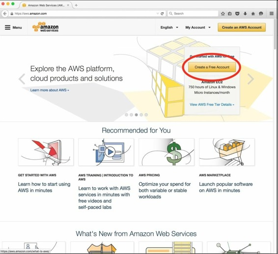

注册需要基本的联系信息，支付手段（必须要用信用卡注册），和一些其它信息。

一旦账户激活，就可以登录管理页面，如下面截图所示：

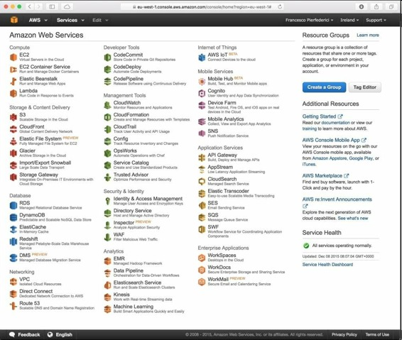

控制台页面功能繁杂，有许多图标，对应着50多项服务。本章会讲如何使用EC2、Elastic Beanstalk，S3和Identity and Access Management服务，它们的图标在下图中标出：

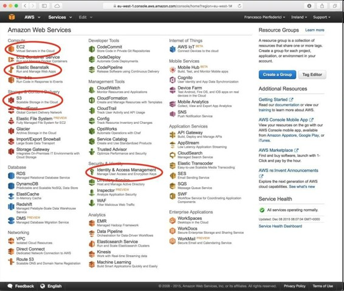

在创建虚拟运行应用和用存储仓保存数据之前，我们需要创建至少一个用户和一个用户组。要这么做，点击第二栏的Identity and Access Management，或打开网页[https://console.aws.amazon.com/iam/](https://link.jianshu.com?t=https://console.aws.amazon.com/iam/)。点击左边栏的Groups，然后点击Create New Group按钮。

然后会让你输入新用户组的名字。我通常使用`Wheel`作为管理组的名字。填入用户组名字之后，点击Next Step按钮。

然后，我们需要选择这个用户组的预定义规则。在这个页面，我们可以选择AdministratorAccess。然后点击Next Step按钮。

在下一页检查之前的选项，如果没有问题，可以点击Create Group。Group页面就会列出新创建的用户组了，如下所示：

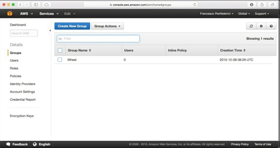

点击用户组的名字（Wheel），然后在Permissions栏就会显示这个组的规则，如下图所示：

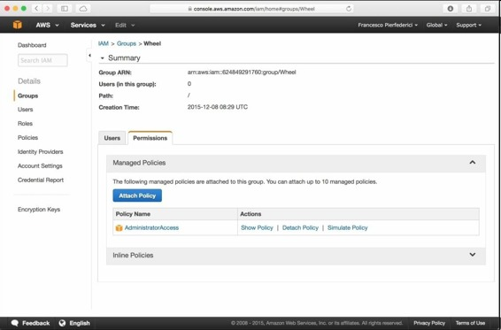

现在，创建至少一个用户，即登录虚拟机的账户。左侧栏点击Users，然后点击页面上方的Create New Users，在打开的页面中，一次最多可以创建五个用户。

现在来创建一个用户。在第一个空格（数字1旁边）输入用户名，确保勾选了选项框Generate an access key for each user，然后点击Create按钮，如下图所示（我选的用户名是bookuser）：

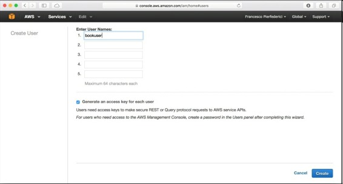

下面的一页很重要，呈现在我们面前的是一个用户创建流程的概括，可以在这里下载用户整数。一定要点击Download Credentials按钮。如果没有做，或将证书（一个csv文件）放错了位置，你可以创建一个新用户，再下载一个证书。

现在，我们需要将创建的用户添加到用户组。要这么做，返回Groups页面（点击左侧栏的Groups），选择之前创建的管理组（Wheel），点击页面上方的Group Actions，在弹出的页面点击Add Users to Group。如果这个条目不能使用，确保勾选了组名旁边的选择框。

来到一个列出所有用户的新页面。点击刚刚创建的用户旁边的勾选框，然后点击页面底部的Add Users。在下一页，点击组名，然后在Users栏会显示刚刚添加的用户，如下图所示：

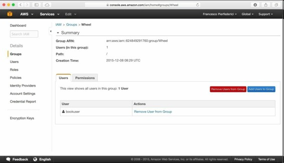

现在，创建密码。返回Users页面（点击左侧导航栏的Users），点击用户名，在打开的页面点击Security Credentials栏。会看到类似下图的页面：

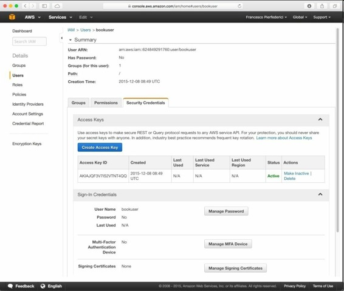

这里，在Sign-In-Credentials下面的Manage Password根据提示设置密码，我们可以让AWS为我们设置密码，或自定义一个密码。

快完成了。剩下的是为用户创建SSH密钥，以让用户能不用密码就登录EC2实例。这也可以用管理台来做。

登出管理台，用刚才创建的用户再次登录。为了这么做，使用刚才页面的URL，[https://console.aws.amazon.com/iam](https://link.jianshu.com?t=https://console.aws.amazon.com/iam)，它的形式是`https://<ACCOUNT NUMBER>.signin.aws.amazon.com/console/`。

现在，在管理台页面，点击EC2图标，然后在左上方的弹出框选择实例的地理位置（我选择的是Ireland）。Amazon EC2虚拟机有多个区域，涵盖美国、欧洲、亚洲和南美。SSH密钥是和区域有关的，也就是说，要使用两个不同区域的机器，我们要为每个区域创建两个不同的SSH密钥对。

选择完区域之后，点击Key Pairs，如下所示：

点击Create Key Pair，给其命名（我起的名字是bookuser-ireland-key），然后点击Create按钮。新创建的私钥会自动下载到你的电脑，格式是`pem`（有事下载的文件的后缀名是`.pem.txt`，可以将其重命名为`.pem`）。

确保将其安全的存放，进行备份，因为不会再次下载。如果放的位置不对，你需要使用AWS控制台新建一个，以删除这个密钥对。

我把密钥保存在`$HOME`的`.ssh`目录。我通常将密钥复制到这里，重命名它的后缀为`.pem`，并且只有我才能访问（即chmod 400 ~/.ssh/bookuser-ireland-key.pem）。

## 创建一个EC2实例

做完了所有的配置，现在可以创建第一个虚拟机了。从我们选择的地理区域开始（记得为每个创建密钥），然后登陆运行的实例。我们现在只是用网页控制台来做。

如果你不在控制台，使用创建的用户登陆（可以使用URL：`https://<ACCOUNTNUMBER>.signin.aws.amazon.com/console/`），然后点击EC2图标。

打开的EC2控制台如下所示：

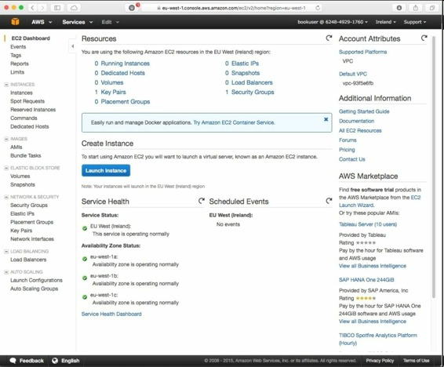

点击页面中间的蓝色按妞Launch Instance。接下来创建虚拟机。首先，选择Amazon Machine Image (AMI)，它是底层的操作系统，和默认的虚拟机软件包集合。

可选的配置有很多。我们选择一个免费的AMI。我喜欢64位的Ubuntu服务器镜像，从上往下数的第四个（你也可以选其它的）：

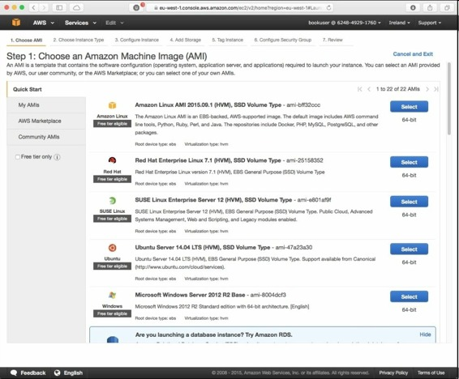

然后，要选择虚拟硬件。Amazon提供多种配置，取决于用户的需求。例如，如果我们想运行深度学习代码，我们就要选择GPU强大的实例。在我们的例子中，我们选择Free tier eligible t2.micro，下面截图中的第一个：

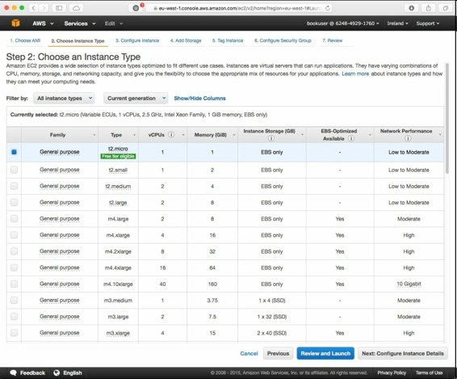

点击Next: Configure Instance Details会打开一个新页面，在上面可以配置将要创建的实例的一些特性。现在，只使用其默认值，但要关注一下Purchasing option。我们现在使用的是Spot instance，意味着如果使用了更高级的实例需要硬件资源，就会关闭之前的虚拟机。

我们现在不需要对这一项进行设置，但是要知道Spot instance是一种可以降低花费的手段。点击Next: Add Storage。

这里，我们可以配置存储选项。现在，还是使用默认值，只是看一下选项的内容。Delete on Termination是默认勾选的，它的作用是当结束实例时，和其相关的数据也会被删除。因为在默认情况下，实例是暂停而非终止，这么设置就可以。然后点击Next: Tag Instance。我们现在不创建任何tag，所以继续点击Next: Configure Security Group。

这个打开的页面很重要，如下所示：

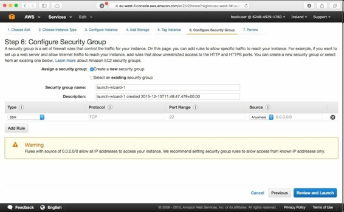

在这一页上，我们来配置实例的服务（网络端口）和登录VM的IP地址。现在，我们只是改变SSH的规则，以允许从My IP的连接（在弹出菜单的Source标题，SSH行）。

例如，向Anywhere打开TCP的80端口，以运行一个网络服务器，或是5672端口（使用RabbitMQ的Celery的端口），供Celery应用的IP使用。

现在不建立任何规则，使用默认的SSH访问规则。设置页面如下：

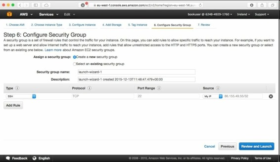

最后，点击Review and Launch，如果没有问题的话，再点击Launch。确保可以访问正确的`.pem`文件，以访问EC2实例，然后点击Launch Instances。

Amazon现在会启动实例，需要几分钟时间。通过点击页面底部的View Instances，可以看到实例的运行或准备状态：

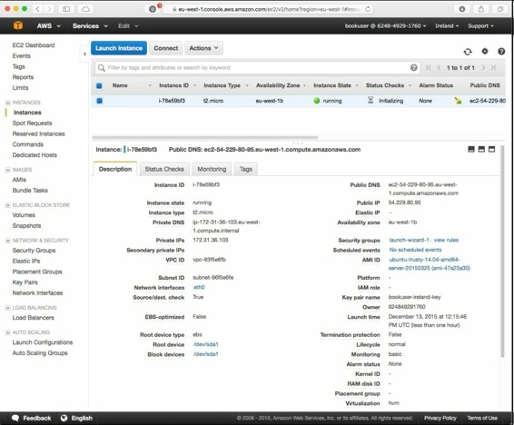

一旦VM运行了，就可以用SSH连接它。通过终端进行连接，使用实例OS的正确Unix用户名（即，Amazon Linux是`ec2-user`，Ubuntu是`ubuntu`，SUSE是`root`或`ec2-user`，Fedora Linux是`fedora`或`ec2-user`）。

在我们的例子中，登录窗口如下：

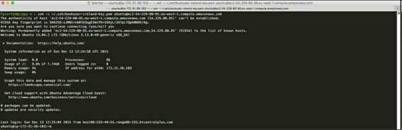

VM中包含了一些预先安装的软件，包括Python 2.7和3.4。为了实用，这个VM是一台Linux服务器。试验结束之后，可以在Actions弹出窗中点击Stop结束实例，选中实例的名字，如下图所示：

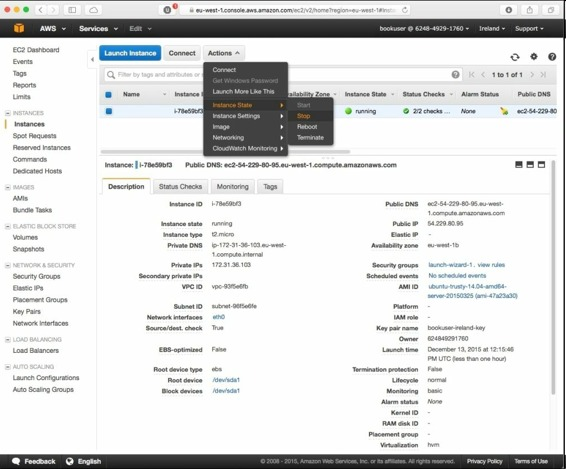

关于EC2实例，特别要注意虚拟的存储和虚拟机在重启、停止、关闭时，存储设备的行为。因为，无论停止还是关闭虚拟机，它的IP地址都会失效，下次启动时会分配新的IP地址。

我们创建的实例（`t2.micro`）使用存储在EBS的虚拟硬盘，它是EC2实例的高性能和高可靠性的存储。

默认情况下，当对应的实例关闭时，存储在EBS的虚拟硬盘会被删除（除非Add Storage页面的Delete on Termination选项没有勾选），但实例停止时，存储不会删除。停止实例会导致存储费用，而关闭实例不会。

重启一个关闭的实例是不可能的，必须要从头新建一个实例，这比重启暂停的VM要花费更长的时间。因为这个原因，如果想重新使用实例，最好停止而不是关闭。然而，保持EBS存储是一笔可观的花费，所以应该使用时间不长的实例应该关闭。

重启、关闭状态下，使应用数据保存在EBS的方法之一是新建一个EBS卷，当相关的EC2实例运行时，将新的卷分配给这个实例。这是通过点击EC2 Dashboard页面的Volumes链接，然而根据提示操作。要记住，初次使用一个卷时，需要进行格式化，这可以通过在运行EC2实例内使用专门的工具，如下图所示：

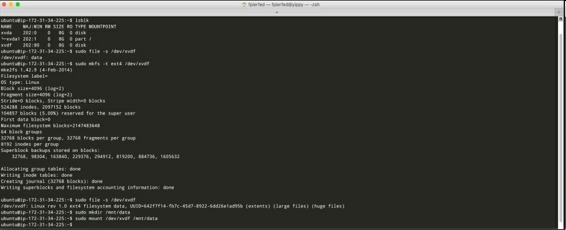

Linux内核重新映射了EBS卷的设备名字，`/dev/sdf to /dev/xvdf`。

分配一个卷就像将硬盘链接电脑，它们的数据在重启之后也会保存，并可以从一个实例移动到另一个实例。要记住，每创建一个卷都要花钱，无论是否使用。

另一种（花费较低的）存储应用数据的方法是使用S3，接下来讨论它。

## 使用Amazon S3存储数据

Amazon Simple Storage Service，S3，是一个存储、读取数据的网络服务。各种文件都可以存储到S3，上到5TB的数据，或是源代码。

S3远比EBS便宜，但是它不提供文件层，而是一个REST API。另一个不同点是，EBS卷一次只能分配一个运行的实例，S3对象可以在多个实例间共享，取决于许可协议，可以网络各处访问。

使用S3很简单，你需要在某个地理区域（为了降低访问时间）创建一些桶（即S3的容器），然后添加数据。过程如下：登录AWS管理台，点击Storage & Content Delivery下面的S3图标，点击Create Bucket按钮，给桶起名字，然后给它选择区域。

对于这个例子，我们起的名气是book-123-456，区域是爱尔兰，如下图所示：

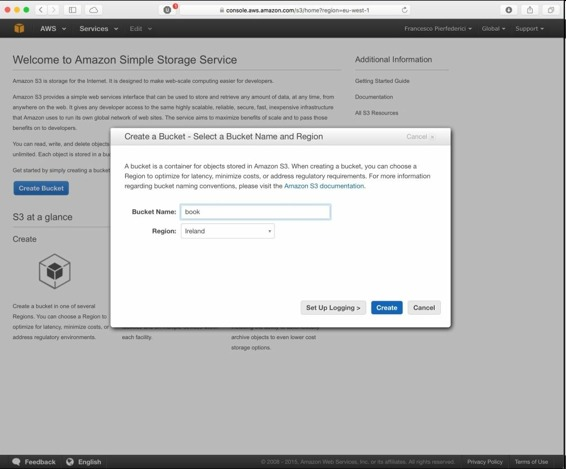

点击Create按钮。因为桶的名字实在S3用户间分享的，像book这样的名字都被使用过了。因此，起的名字最好加上一些识别符。

下一页显示了创建的S3桶列表，见下图（点击桶名字左侧的图标，以显示桶的属性）：

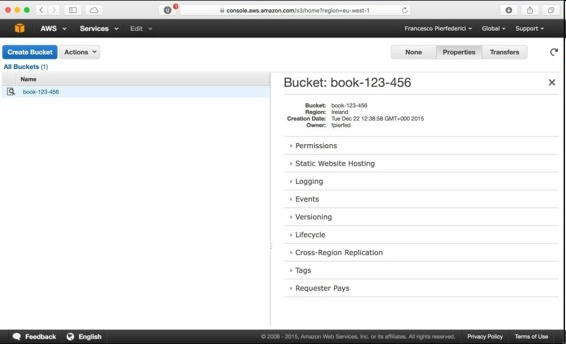

从这页开始，在桶页面上就可以查看桶的内容、上传数据、重命名、或删除，见下面截图：

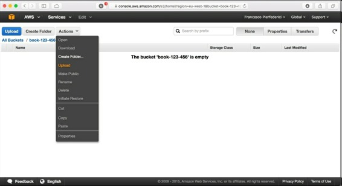

Amazon S3有一个复杂的许可协议，可以根据每个对象、每个桶执行访问。现在，向桶传一些文件，并修改访问权限。

创建一个文本文件夹，并存储一些文本文件。在我的例子中，我创建了一个文件`index.html`，内容是"Hi there!"。使用Upload，上传到S3.

我们可以检查这个文件的属性（包括访问权），通过选择文件，并点击右上角的Properties。从下页可以看到，默认情况下，刚刚上传的文件只能被我们访问到：

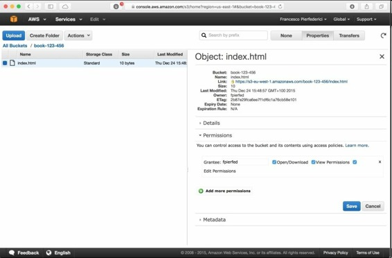

我们可以从终端师徒访问文件（使用文件名属性下方的URL），但是会有错误Access Denied。我们可以添加一个许可，让任何人可以对这个文件进行读写，如下图所示（记得Save访问规则）：

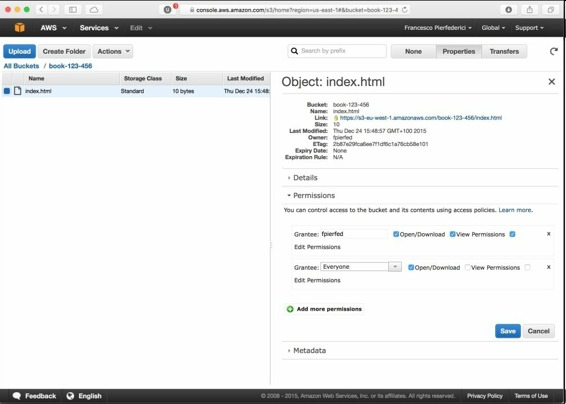

创建这个许可之后，刚上传的文件就是面向公众可读的了，例如，作为网页的静态文件。在S3上存储文件相对便宜，但不是完全免费。

## Amazon elastic beanstalk

Amazon Elastic Beanstalk (EB) 是将应用部署到AWS的简便方法，不必分别处理EC2和S3.Amazon EB功能完备，支持Python。

最好在Python虚拟环境中，用命令行（使用awsebcli包）使用EB。要点是，你需要创建一个Python应用的虚拟环境，以部署到AWS。应用本身保存在一个文件夹内，用来打包。

使用`eb`命令，就可以创建一个初始化部署配置（`eb init`），通过写额外的配置文件（文件夹`.ebextensions`）来进行自定义，配置选项，例如需要的环境变量，或需要进行的推迟安装。

应用在本地测试完毕之后，就可以使用`eb create`部署到AWS，使用`eb terminate`命令进行销毁。

AWS网站有关于部署的教程，例如，一个稍显复杂的Django网页应用（[http://docs.aws.amazon.com/elasticbeanstalk/latest/dg/create-deploy-python-django.html#python-django-configure-for-eb](https://link.jianshu.com?t=http://docs.aws.amazon.com/elasticbeanstalk/latest/dg/create-deploy-python-django.html#python-django-configure-for-eb)），可以让你学习更多的EB。

尽管EB文档大部分都是关于网页应用的，它的应用不局限于HTTP服务器和WSGI应用。

## 创建私有云平台

AWS对大多数个人和公司都是一个不错的选择。但是，使用AWS也会增加成本。或者，公司的政策，或从数据的隐私性考虑，不能使用云平台。

这就需要搭建一个内部的私有云平台。使用现有的硬件，运行虚拟机（EC2）和数据存储中间件（类似于S3），再加上其它服务，比如负载均衡、数据库等等。

这样的免费开源工具很多，比如**OpenStack**([http://www.openstack.org](https://link.jianshu.com?t=http://www.openstack.org/))， **CloudStack**([https://cloudstack.apache.org](https://link.jianshu.com?t=https://cloudstack.apache.org/))，和 **Eucalyptus**([http://www.eucalyptus.com](https://link.jianshu.com?t=http://www.eucalyptus.com/))。

Eucalyptus可以和AWS（EC2和S3）交互。使用它可以构建类似AWS的API。这样，就可以扩展私有云平台，或是迁移到EC2和S3，而不用重新创建虚拟机镜像、工具和管理脚本文件。

另外，Python的与AWS交互的boto工具包（`pip install boto`）是与Eucalyptus兼容的。

## 总结

通过AWS，我们学习了利用云平台进行计算和存储，用户按需支付，只需要给使用的资源付款。

这些平台在开发阶段和运行阶段，都可以用于我们的分布式应用。特别是进行伸缩性测试，让我们自己一下提供许多台机器是不现实的。更不用说，还可以使用海量的云平台资源，以及可靠性保障。

同时，云平台服务是收费。而且，通常定价不菲。另外，从时间和精力，云平台限制颇多，我们不能管理资源、不能安装软件，也不能学习某个软件工具和它的特性。从一个云平台迁移到另一个，还往往很费事。

知道了这些，就可以更好的让云平台适合我们的总体设计、开发、测试、部署。

例如，一个简单的策略是将分布式应用部署到自建的平台上，只在流量增加时使用云平台。所以，要时刻更新VM镜像，并引入到Amazon EC2.

下一章，我们会学习研究者和实验室/大学人员的场景，在大型的高性能计算机（HPC）群上运行Python。

