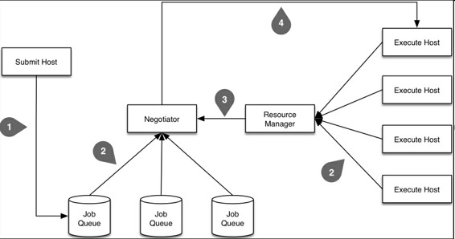
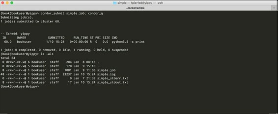
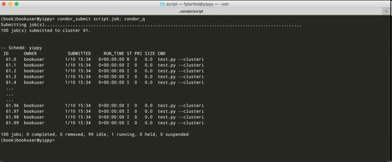
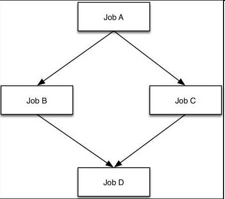

# 六、超级计算机群使用 Python （Distributed Computing with Python）


本章，我们学习另一种部署分布式 Python 应用的的方法。即使用高性能计算机（HPC）群（也叫作超级计算机），它们通常价值数百万美元（或欧元），占地庞大。

真正的 HPC 群往往位于大学和国家实验室，创业公司和小公司因为资金难以运作。它们都是系统巨大，有上万颗 CPU、数千台机器。

经常超算中心的集群规模通常取决于电量供应。使用几兆瓦的 HPC 系统很常见。例如，我使用过有 160000 核、7000 节点的机群，它的功率是 4 兆瓦！

想在 HPC 群运行 Python 的开发者和科学家可以在本章学到有用的东西。不使用 HPC 群的读者，也可以学到一些有用的工具。

## 典型的 HPC 群

HPC 系统有多种形式和规模，然而，它们有一些相同点。它们是匀质的，大量相同的、装在架子上的计算机，处于同一个房间内，通过高速网络相连。有时，在升级的时候，HPC 群会被分成两个运行体系。此时，要特别注意规划代码，以应对两个部分的性能差异。

集群中的大部分机器（称作节点），运行着相同的系统和相同的软件包，只运行计算任务。用户不能直接使用这些机器。

少部分节点的算力不如计算节强大，但是允许用户登录。它们称作服务节点（或登录节点或头节点），只运行用户脚本、编译文件、任务管理软件。用户通常登录这些节点，以访问机群。

另一些节点，介于服务节点和计算节点之间，它们运行着全套计算节点的操作系统，但是由多个用户共享，而纯粹的计算节点的每个核只运行一个线程。

这些节点是用来运行小型的序列化任务，而不需要计算节点的全部资源（安装应用和清理）。例如在 Cray 系统上，这些节点称作 Multiple Application, Multiple User (MAMU)节点。

下图是 NASA 的 2004 Columbia 超级计算机，它有 10240 个处理器，具有一定代表性：


如何在 HPC 群上运行代码呢？通常是在服务节点登录，使用任务规划器（job scheduler）。任务规划器是一个中间件，给它一些代码，它就可以寻找一些计算节点运行代码。

如果此时没有可用的硬件资源，代码就会在一个队列中等待，直到有可用的资源。等待时间可能很长，对于短代码，等待时间可能比运行时间还长。

HPC 系统使用任务规划器，视为了确保各部门和项目可以公平使用，最大化利用机群。

商用和开源的规划器有很多。最常用的是 PBS 和它的衍生品（例如 Torque 和 PBS Pro），HTCondor，LoadLeveler，SLURM、Grid Engine 和 LSF。这里，我们简短介绍下其中两个：HTCondor 和 PBS Pro。

## 任务规划器

如前所述，你不能直接在 HPC 群上运行代码，你必须将任务请求提交给任务规划器。任务规划器会分配算力资源，在分配的节点上运行应用。

这种间接的方法会造成额外的开销，但可以保证每个用户都能公平的分享使用计算机群，同时任务是有优先级的，大多数处理器都处于忙碌状态。

下图展示了任务规划器的基本组件，和任务提交到执行的事件顺序：



首先，先来看一些定义：

*   任务：这是应用的元数据，例如它的可执行文件、输入和输出、它的硬件和软件需求，它的执行环境，等等；
*   机器：这是最小的任务执行硬件。取决于集群的配置，它可能是一部分节点（例如，一台多核电脑的一个核心）和整个节点。

从概念层面，任务规划器的主要部分有：

*   资源管理器
*   一个或多个任务队列
*   协调器

为了提交一个任务请求到任务规划器，需要编写元数据对象，它描述了我们想运行的内容，运行的方式和位置。它往往是一个特殊格式的文本文件，后面有一个例子。

然后，用户使用命令行或库提交任务描述文件（上图中的步骤 1）到任务规划器。这些任务先被分配到一个或多个队列（例如，一个队列负责高优先级任务，一个负责低优先级任务，一个负责小任务）。

同时，资源管理器保持监督（步骤 2）所有计算节点，以确定哪台空闲哪台繁忙。它还监督着正在运行的任务的优先级，在必要时可以释放一些空间给高优先级的任务。另外，它还监督着每台机器的性能指标，能运行什么样的任务（例如，有的机器只能让特定用户使用）。

另外一个守护进程，萧条期，持续监督着任务队列的闲置任务（步骤 2），并将它们分配给何时的机器（步骤 3），其间要考虑用户的优先级、任务优先级、任务需求和偏好、和机器的性能和偏好。如果在这一步（称作协调循环）没有可用的资源来运行任务，任务就保存在队列中。

一旦指派了运行任务的资源，规划器会在分配的机器上运行可执行文件（步骤 4）。有的规划器（例如 HTCondor）会复制可执行文件，向执行机器发送文件。如果不是这样，就必须让代码和数据是在共享式文件系统，或是复制到机器上。

规划器（通常使用监督进程）监督所有的运行任务，如果任务失败则重启任务。如果需要的话，还可以发送任务成功或失败的 email 通知邮件。

大多数系统支持任务间依赖，只有达到一定条件时（比如，新的卷），任务才能执行。

## 使用 HTCondor 运行 Python 任务

这部分设定是用 HTCondor 任务规划器，接入机群。安装 HTCondor 不难（参考管理文档[https://research.cs.wisc.edu/htcondor/manual/](https://link.jianshu.com?t=https://research.cs.wisc.edu/htcondor/manual/)），这里就不介绍了。

HTCondor 有一套命令行工具，可以用来向机群提交任务（`condor_submit`），查看提交任务的状态（`condor_q`），销毁一个任务（`condor_rm`），查看所有机器的状态（`condor_status`）。还有许多其它工具，总数超过 60。但是，我们这里只关注主要的四个。

另一种与 HTCondor 机群交互的方法是使用 Distributed Resource Management Application API (DRMAA)，它内置于多数 HTCondor 安装包，被打包成一个共享库（例如，Linux 上的`libdrmma.so`）。

DRMAA 有任务规划器的大部分功能，所以原则上，相同的代码还可以用来提交、监督和控制机群和规划器的任务。Python 的`drmaa`模块（通过`pip install drmaa`安装），提供了 DRMAA 的功能，包括 HTCondor 和 PBS 的功能。

我们关注的是命令行工具，如何用命令行工具运行代码。我们先创建一个文本文件（称作任务文件或提交文件），描述任务的内容。

打开文本编辑器，创建一个新文件。任务文件的名字不重要。我们现在要做的是在机群上运行下面的代码：

```py
$ python3.5 –c "print('Hello, HTCondor!')" 
```

任务文件（`htcondor/simple/simple.job`）的代码如下：

```py
# Simple Condor job file
# There is no requirement or standard on job file extensions.
# Format is key = value
# keys and values are case insensitive, with the exception of
# paths and file names (depending on the file system).
# Usage: shell> condor_submit simple.job
# Universe is the execution environment for our jobs
# vanilla is the one for shell scripts etc.
Universe = vanilla
# Executable is the path to the executable to run
Executable = /usr/local/bin/python3.5
# The arguments string is passed to the Executable
# The entire string is enclosed in double-quotes
# Arguments with spaces are in single quotes
# Single & double quotes are escaped by repeating them
Arguments = "-c 'print(''Hello, HTCondor!'')'"
# Output is the file where STDOUT will be redirected to
Output = simple_stdout.txt
# Error is the file where STDERR will be redirected to
Error = simple_stderr.txt
# Log is the HTCondor log, not the log for our app
Log = simple.log
# Queue tells HTCondor to enqueue our job
Queue 
```

这段代码很简单。

让人疑惑的可能是`Output`指令，它指向文件进行`STDOUT`重定向，而不是执行代码的结果输出。

另一个会让人疑惑的是`Log`指令，它不知想应用的日志文件，而是任务专门的 HTCondor 日志。指令`Arguments`句法特殊，也要注意下。

我们可以用`condor_submit`提交任务，如下图所示，提交任务之后，立即用`condor_q`查看状态：



HTCondor 给任务分配了一个数字识别符，形式是`cluster id.process id`（这里，进程 ID 专属于 HTCondor，与 Unix 进程 ID 不完全相同）。因为可以向一个任务文件提交多个任务（可以通过`Queue`命令，例如`Queue 5000`，可以启动 5000 个任务的实例），HTCondor 会将其当做集群处理。

每个集群都有一个唯一的识别符，集群中的每个进程都有一个 0 到 N-1 之间的识别符，N 是集群的总进程数（任务实例的数量）。我们的例子中，只提交一个任务，它的识别符是 60.0。

> 注意：严格的讲，前面的任务识别符只是在任务队列/提交奇迹中是唯一的，在整个集群不是唯一的。唯一的是`GlobalJobId`，它是一连串事件的 ID，包括主机名、集群 ID、进程 ID 和任务提交的时间戳。可以用`condor_q -log`显示`GlobalJobId`，和其它内部参数。

取决于 HTCondor 的配置，以及机群的繁忙程度，任务可以立即运行，或是在队列中等待。我们可以用`condor_q`查询状态，`idle`（状态 I），`running`（状态 R），`suspended`（状态 H），`killed`（状态 X）。最近添加了两个新的状态：`in the process of transferring data to the execute node`（<）和`transferring data back to the submit host`（>）。

如果一切正常，任务会在队列中等待一段时间，然后状态变为运行，最后退出（成功或出现错误），从队列消失。

一旦任务完成，查看当前目录，我们可以看到三个新文件：`simple.log`，`simple_stderr.txt`和`simple_stdout.txt`。它们是任务的日志文件，任务的标准错误，和标准输出流。

日志文件有许多有用的信息，包括任务提交的时间和从哪台机器提交的，在队列中等待的时间，运行的时间和机器，退出代码和利用的资源。

我们的 Python 任务退出状态是 0（意味成功），在`STDERR`上没有输出（即`simple_stderr.txt`是空的），然后向`STDOUT`写入`Hello，HTCondor！`（即`simple_stdout.txt`）。如果不是这样，就要进行调试。

现在提交一个简单的 Python 文件。新的任务文件很相似，我们只需更改`Executable`和`Arguments`。我们还要传递一些环境变量给任务，提交 100 个实例。

创建一个新任务文件（`htcondor/script/script.job`），代码如下：

```py
# Simple Condor job file
# There is no requirement or standard on job file extensions.
# Format is key = value
# keys and values are case insensitive, with the exception of
# paths and file names (depending on the file system).
# Usage: shell> condor_submit script.job

# Universe is the execution environment for our jobs
# vanilla is the one for shell scripts etc.
Universe = vanilla
# Executable is the path to the executable to run
Executable = test.py
# The arguments string is passed to the Executable
# The entire string is enclosed in double-quotes
# Arguments with spaces are in single quotes
# Single & double quotes are escaped by repeating them
Arguments = "--clusterid=$(Cluster) --processid=$(Process)"
# We can specify environment variables for our jobs as
# by default jobs execute in a very restricted environment
Environment = "MYVAR1=foo MYVAR2=bar"
# We can also pass our entire environment to the job
# By default this is not the case (i.e. GetEnv is False)
GetEnv = True
# Output is the file where STDOUT will be redirected to
# We will have one file per process otherwise each
# process will overwrite the same file.
Output = script_stdout.$(Cluster).$(Process).txt
# Error is the file where STDERR will be redirected to
Error = script_stderr.$(Cluster).$(Process).txt
# Log is the HTCondor log, not the log for our app
Log = script.log
# Queue tells HTCondor to enqueue our job
Queue 100 
```

接下来写要运行的 Python 文件。创建一个新文件（`htcondor/script/test.py`），代码如下：

```py
#!/usr/bin/env python3.5
import argparse
import getpass
import os
import socket
import sys
ENV_VARS = ('MYVAR1', 'MYVAR2')

parser = argparse.ArgumentParser()
parser.add_argument('--clusterid', type=int)
parser.add_argument('--processid', type=int)
args = parser.parse_args()

cid = args.clusterid
pid = args.processid

print('I am process {} of cluster {}'
      .format(pid, cid))
print('Running on {}'
      .format(socket.gethostname()))
print('$CWD = {}'
      .format(os.getcwd()))
print('$USER = {}'
      .format(getpass.getuser()))

undefined = False
for v in ENV_VARS:
    if v in os.environ:
        print('{} = {}'
              .format(v, os.environ[v]))
    else:
        print('Error: {} undefined'
              .format(v))
        undefined = True
if undefined:
    sys.exit(1)
sys.exit(0) 
```

这段简单的代码很适合初次使用 HPC 机群。它可以清晰的显示任务在哪里运行，和运行的账户。

这是在写 Python 任务时需要知道的重要信息。某些机群有在所有计算节点上都有常规账户，在机群上分享用户的主文件夹。对于我们的例子，用户在登录节点上提交之后就会运行。
在其他机群上，任务都运行在低级用户下（例如，`nobody`用户）。这时，特别要注意许可和任务执行环境。

> 注意：HTCondor 可以在提交主机和执行节点之间高效复制数据文件和/或可执行文件。可以是按需复制，或是总是复制的模式。感兴趣的读者可以查看指令`should_transfer_files`，`transfer_executable`，`transfer_input_files`，和`transfer_output_files`。

前面的任务文件（`htcondor/script/script.job`）有一些地方值得注意。首先，要保证运行任务的用户可以找到 Python 3.5，它的位置可能和不同。我们可以让 HTCondor 向运行的任务传递完整的环境（通过指令`GetEnv = True`）。

我们还提交了 100 个实例（`Queue 100`）。这是数据并行应用的常用方式，数据代码彼此独立运行。

我们需要自定义文件的每个实例。我们可以在任务文件的等号右边用两个变量，$(Process)和$(Cluster)。在提交任务的时候，对于每个进程，HTCondor 用响应的集群 ID 和进程 ID 取代了这两个变量。

像之前一样，提交这个任务：

```py
$ condor_submit script.job 
```

任务提交的结果显示在下图中：



当所有的任务都完成之后，在当前目录，我们会有 100 个`STDOUT`文件和 100 个`STDERR`文件，还有一个 HTCondor 生成的日志文件。

如果一切正常，所有的`STDERR`文件都会是空的，所有的`STDOUT`文件都有以下的文字：

```py
I am process 9 of cluster 61
Running on somehost
$CWD = /tmp/book/htcondor/script
$USER = bookuser
MYVAR1 = foo
MYVAR2 = bar 
```

留给读者一个有趣的练习，向`test.py`文件插入条件化的错误。如下所示：

```py
if pid == 13:
    raise Exception('Booo!')
else:
    sys.exit(0) 
```

或者：

```py
if pid == 13:
    sys.exit(2)
else:
    sys.exit(0) 
```

然后，观察任务集群的变化。

如果做这个试验，会看到在第一种情况下（抛出一个异常），响应的`STDERR`文件不是空的。第二种情况的错误难以察觉。错误是静默的，只是出现在`script.log`文件，如下所示：

```py
005 (034.013.000) 01/09 12:25:13 Job terminated.
    (1) Normal termination (return value 2)
        Usr 0 00:00:00, Sys 0 00:00:00  -  Run Remote Usage
        Usr 0 00:00:00, Sys 0 00:00:00  -  Run Local Usage
        Usr 0 00:00:00, Sys 0 00:00:00  -  Total Remote Usage
        Usr 0 00:00:00, Sys 0 00:00:00  -  Total Local Usage
    0  -  Run Bytes Sent By Job
    0  -  Run Bytes Received By Job
    0  -  Total Bytes Sent By Job
    0  -  Total Bytes Received By Job
    Partitionable Resources :    Usage  Request Allocated
       Cpus                 :                 1         1
       Disk (KB)            :        1        1  12743407
       Memory (MB)          :        0        1      2048 
```

注意到`Normal termination (return value 2)`此行，它说明发生了错误。

习惯上，我们希望发生错误时，会有这样的指示。要这样的话，我们在提交文件中使用下面的指令：

```py
Notification = Error
Notify_User = email@example.com 
```

这样，如果发生错误，HTCondor 就会向`email@example.com`发送报错的电子邮件。通知的可能的值有`Complete`（即，无论退出代码，当任务完成时，发送 email），`Error`（即，退出代码为非零值时，发送 email），和默认值`Never`。

另一个留给读者的练习是指出我们的任务需要哪台机器，任务偏好的机器又是哪台。这两个独立的请求是分别通过指令`Requirements`和`Rank`。`Requirements`是一个布尔表达式，`Rank`是一个浮点表达式。二者在每个协调循环都被评估，以找到一批机器以运行任务。

对于所有`Requirements`被评为`True`的机器，被选中的机器都有最高的`Rank`值。

> 笔记：当然，机器也可以对任务定义`Requirements`和`Rank`（由系统管理员来做）。因此，一个任务只在两个`Requirements`是`True`的机器上运行，二者`Rank`值结合起来一定是最高的。

如果不定义任务文件的`Rank`，它就默认为`0.0.Requirements`。默认会请求相同架构和 OS 作为请求节点，和族都的硬盘保存可执行文件。

例如，我们可以进行一些试验，我们请求运行 64 位 Linux、大于 64GB 内存的机器，倾向于快速机器：

```py
Requirements = (Target.Memory > 64) && (Target.Arch == "X86_64") && (Target.OpSys == "LINUX")
Rank = Target.KFlops 
```

> 笔记：对于`Requirements`和`Rank`的可能的值，你可以查看附录 A 中的 Machine ClassAd Atributes。最可能用到的是`Target.Memory`，`Target.Arch`，`Target.OpSys`，`Target.Disk`，`Target.Subnet`和`Target.KFlops`。

最后，实践中另一个强大的功能是，为不同的任务定义依赖。往往，我们的应用可以分解成一系列步骤，其中一些可以并行执行，其余的不能（可能由于需要等待中间结果）。当只有独立的步骤时，我们可以将它们组织成几个任务集合，就像前面的例子。

HTCondor DAGMan（无回路有向图管理器 Directed Acyclic Graph Manager 的缩写）是一个元规划器，是一个提交任务、监督任务的工具，当任务完成时，它会检查哪个其它的任务准备好了，并提交它。

为了在 DAG 中组织任务，我们需要为每一个任务写一个提交文件。另外，我们需要另写一个文本文件，描述任务的依赖规则。

假设我们有四个任务（单进程或多进程集合）。称为 A、B、C、D，它们的提交文件是`a.job`，`b.job`，`c.job`，`d.job`。比如，我们想染 A 第一个运行，当 A 完成时，同时运行 B 和 C，当 B 和 C 都完成时，再运行 D。

下图，显示了流程：



DAG 文件（`htcondor/dag/simple.dag`）的代码如下所示：

```py
# Simple Condor DAG file
# There is no requirement or standard on DAG file extensions.
# Usage: shell> condor_submit_dag simple.dag

# Define the nodes in the DAG
JOB A a.job
JOB B b.job
JOB C c.job
JOB D d.job

# Define the relationship between nodes
PARENT A CHILD B C
PARENT B C CHILD D 
```

四个提交文件没有那么重要。我们可以使用下面的内容（例如，任务 A 和其它三个都可以使用）：

```py
Universe = vanilla
Executable = /bin/echo
Arguments = "I am job A"
Output = a_stdout.txt
Log = a.log
Queue 
```

提交完整的 DAG，是使用`condor_submit_dag`命令：

```py
$ condor_submit_dag simple.dag 
```

这条命令创建了一个特殊提交文件（`simple.dag.condor.sub`）到`condor_dagman`可执行文件，它的作用是监督运行的任务，在恰当的时间规划任务。

DAGMan 元规划器有还有许多这里没写的功能，包括类似 Makefile 的功能，可以继续运行由于错误停止的任务。

关于性能，你还需要注意几点。DAG 中的每个节点，当被提交时，都要经过一个协调循环，就像一个通常的 HTCondor 任务。这些一系列的循环会导致损耗，损耗与节点的数量成正比。通常，协调循环会与计算重叠，所以在实践中很少看到损耗。

另一点，`condor_dagman`的效率非常高，DAGs 有百万级别甚至更多的节点都很常见。

> 笔记：推荐感兴趣的读者阅读 HTCondor 一章的 DAGMan Applications。

短短一章放不下更多关于 HTCondor 的内容，它的完整手册超过 1000 页！这里介绍的覆盖了日常使用。我们会在本章的末尾介绍调试的方法。接下来，介绍另一个流行的任务规划器：PBS。

## 使用 PBS 运行 Python 任务

Portable Batch System (PBS)是 90 年代初，NASA 开发的。它现在有三个变体：OpenPBS，Torque 和 PBS Pro。这三个都是原先代码的分叉，从用户的角度，它们三个的外观和使用感受十分相似。

这里我们学习 PBS Pro（它是 Altair Engineering 的商用产品，[http://www.pbsworks.com](https://link.jianshu.com?t=http://www.pbsworks.com/)），它的特点和指令在 Torque 和 OpenPBS 上也可以使用，只是有一点不同。另外，为了简洁，我们主要关注 HTCondor 和 PBS 的不同。

从概念上，PBS 和 HTCondor 很像。二者有相似的架构，一个主节点（`pbs_server`），一个协调器和规划器（`pbs_sched`），执行节点的任务监督器（`pbs_mom`）。

用户将任务提交到队列。通常，对不同类型的任务（例如，序列 vsMPI 并行）和不同优先级的任务有多个队列。相反的，HTCondor 对每个提交主机只有一个队列。用户可用命令行工具、DRMAA 和 Python 的 drmaa 模块（`pip install drmaa`）与 PBS 交互。

PBS 任务文件就是一般的可以本地运行的文件（例如，Shell 或 Python 文件）。它们一般都有专门的内嵌的 PBS 指令，作为文件的注释。这些指令的 Windows 批处理脚本形式是#PBS <directive> 或 REM PBS <directive>（例如，`#PBS -q serial or REM PBS –q serial`）。

使用`qsub`命令（类似`condor_submit`），将任务提交到合适的任务队列。一旦成功提交一个任务，`qsub`会打印出任务 ID（形式是`integer.server_hostname`），然后退出。任务 ID 也可以作为任务的环境变量`$PBS_JOBID`。

资源需求和任务特性，可以在`qsub`中指出，或在文件中用指令标明。推荐在文件中用指令标明，而不用`qsub`命令，因为可以增加文件的可读性，也是种记录。

例如，提交我们之前讨论过的`simple.job`，你可以简单的写一个最小化的 shell 文件（`pbs/simple/simple.sh`）：

```py
#!/bin/bash
/usr/local/bin/python3.5 -c "print('Hello, HTCondor!')" 
```

我们看到，没有使用 PBS 指令（它适用于没有需求的简单任务）。我们可以如下提交文件：

```py
$ qsub simple.sh 
```

因为没必要为这样的一个简单任务写 Shell 文件，`qsub`用行内参数就可以了：

```py
$ qsub -- /usr/local/bin/python3.5 -c "print('Hello, HTCondor!')" 
```

但是，不是所有的 PBS 都有这个特性。

在有多个任务队列/规划器的安装版本上，我们可以指定队列和规划器，可以用命令行（即`qsub –q queue@scheduler_name`）或用文件中的指令（即，`#PBS –q queue@scheduler_name`）。

前面的两个示例任务显示了 PBS 和 HTCondor 在提交任务时的不同。使用 HTCondor，我们需要写一个任务提交文件，来处理运行什么以及在哪里运行。使用 PBS，可以直接提交任务。

> 笔记：从 8.0 版本开始，HTCondor 提供了一个命令行工具，`condor_qsub`，像是`qsub`的简化版，非常适合从 PBS 向 HTCondor 转移。

提交成功后，`qsub`会打印出任务 ID，它的形式是`integer.servername`（例如`8682293.pbshead`）。PBS 将任务标准流重新转到`scriptname.oInteger`（给`STDOUT`）和`scriptname.eInteger`（给`STDERR`），`Integer`是任务 ID 的整数部分（例如，我们例子中的 simple.sh.e8682293 和 script.sh.o8682293）。

任务通常（在执行节点）运行在提交账户之下，在一个 PBS 创建的临时目录，之后会自动删除。目录的路径是环境变量`$PBS_TMPDIR`。

通常，PBS 定义定义了许多环境变量，用于运行的任务。一些设定了提交任务的账户的环境，它们的名字通常是`PBS_0`开头（例如，`$PBS_O_HOME`或`$PBS_O_PATH`）。其它是专门用于任务的，如`$PBS_TMPDIR`。

> 笔记：现在，PBS Pro 定义了 30 个任务环境变量。可以在 PBS Professional Reference Guide 的 PBS Environment Variables 一章查到完整列表。

使用指令`#PBS –J start-end[:step]`提交任务数组（命令行或在文件中使用指令）。为了获得提交者的环境，可以使用`-V`指令，或者传递一个自定义环境到任务，使用`#PBS -v "ENV1=VAL1, ENV2=VAL2, …"`。

例如，前面例子的任务数组，可以这样写（`pbs/script/test.py`）：

```py
#!/usr/bin/env python3.5
#PBS -J 0-99
#PBS -V
import argparse
import getpass
import os
import socket
import sys

ENV_VARS = ('MYVAR1', 'MYVAR2')

if 'PBS_ENVIRONMENT' in os.environ:
    # raw_cid has the form integer[].server
    raw_cid = os.environ['PBS_ARRAY_ID']
    cid = int(raw_cid.split('[')[0])
    pid = int(os.environ['PBS_ARRAY_INDEX'])
else:
    parser = argparse.ArgumentParser()
    parser.add_argument('--clusterid', type=int)
    parser.add_argument('--processid', type=int)
    args = parser.parse_args()

    cid = args.clusterid
    pid = args.processid

print('I am process {} of cluster {}'
      .format(pid, cid))
print('Running on {}'
      .format(socket.gethostname()))
print('$CWD = {}'
      .format(os.getcwd()))
print('$USER = {}'
      .format(getpass.getuser()))

undefined = False
for v in ENV_VARS:
    if v in os.environ:
        print('{} = {}'
              .format(v, os.environ[v]))
    else:
        print('Error: {} undefined'
              .format(v))
        undefined = True
if undefined:
    sys.exit(1)
sys.exit(0) 
```

我们完全不需要提交文件。用`qsub`提交，如下所示：

```py
$ MYVAR1=foo MYVAR2=bar qsub test.py 
```

分配的任务 ID 的形式是`integer[].server`（例如`8688459[].pbshead`），它可以指示提交了任务数组，而不是一个简单的任务。这是 HTCondor 和 PBS 的另一不同之处：在 HTCondor 中，一个简单任务是一个任务集合（即，任务数组），只有一个进程。另一不同点是，PBS 任务访问集合 ID 和进程 ID 的唯一方式是通过环境变量，因为没有任务提交文件（提交任务时可以提交变量）。

使用 PBS，我们还需要做一些简单解析以从`$PBS_ARRAY_ID`提取任务数组 ID。但是，我们可以通过检测是否定义了`$PBS_ENVIRONMENT`，来判断代码是否运行。

使用指令`-l`指明资源需求。例如，下面的指令要求 20 台机器，每台机器有 32 核和 16GB 内存：

```py
#PBS –l select=20:ncpus=32:mem=16gb 
```

也可以指定任务的内部依赖，但不如 HTCondor 简单：依赖的规则需要任务 ID，只有在提交任务之后才会显示出来。之前的 DAG`diamond`可以用如下的方法执行（`pbs/dag/dag.sh`）：

```py
#!/bin/bash
A=`qsub -N A job.sh`
echo "Submitted job A as $A"

B=`qsub -N B -W depend=afterok:$A job.sh`
C=`qsub -N C -W depend=afterok:$A job.sh`
echo "Submitted jobs B & C as $B, $C"

D=`qsub -N D -W depend=afterok:$B:$C job.sh`
echo "Submitted job D as $D" 
```

这里，任务文件是：

```py
#!/bin/bash
echo "I am job $PBS_JOBNAME" 
```

这个例子中，使用了`$PBS_JOBNAME`获取任务名，并使用指令`-W depend=`强制了任务执行顺序。

一旦提交了任务，我们可以用命令`qstat`监控，它等同于`condor_q`。销毁一个任务（或在运行之前，将队伍从队列移除），是通过`qdel`（等价于`condor_rm`）。

PBS Pro 和 HTCondor 一样，是一个复杂的系统，功能很多。这里介绍的只是它的表层，但是作为想要在 PBS HPC 机群上操作的人，作为入门足够了。

一些人觉得用 Python 和 Shell 文件提交到 PBS 而不用任务文件非常有吸引力。其他人则喜欢 HTCondor 和 DAGMan 的工具处理任务内依赖。二者都是运行在 HPC 机群的强大系统。

## 调试

一切正常是再好不过，但是，运气不会总是都好。分布式应用，即使是远程运行的简单任务，都很难调试。很难知道任务运行在哪个账户之下，运行的环境是什么，在哪里运行，使用任务规划器，很难预测何时运行。

当发生错误时，通过几种方法，可以知道发生了什么当使用任务规划器时，首先要做的是查看任务提交工具返回错误信息（即，`condor_submit`，`condor_submit_dag`，`or qsub`）。然后要看任务`STDOUT`，`STDERR`和日志文件。

通常，任务规划器本身就有诊断错误任务的工具。例如，HTCondor 提供了`condor_q -better-analyze`，检查为什么任务会在队列中等待过长时间。

通常，任务规划器导致的问题可以分成以下几类：

*   权限不足
*   环境错误
*   受限的网络通讯
*   代码依赖问题
*   任务需求
*   共享 vs 本地文件系统

头三类很容易检测，只需提交一个测试任务，打印出完整的环境、用户名等等，剩下的很难检测到，尤其是在大集群上。

对于这些情况，可以关注任务是在哪台机器运行的，然后启动一个交互 session（即 `qsub –I`、`condor_submit – interactive`或`condor_ssh_to_job`），然后一步一步再运行代码。

如果任务需求的资源不足（例如，需要一个特定版本的 OS 或软件包，或其它特别的硬件）或资源过多，任务规划器就需要大量时间找到合适的资源。

任务规划期通常提供工具以检查哪个资源符合任务的需求（例如，`condor_status –constrain`）。如果任务分配给计算节点的时间不够快，就需要进行检测。

另一个产生问题的来源是提交主机的文件系统的代码、数据不能适用于全部的计算节点。这种情况下，推荐使用数据转移功能（HTCondor 提供），数据阶段的预处理文件。

Python 代码的常用方法是使用虚拟环境，在虚拟环境里先安装好所有的依赖（按照指定的安装版本）。完成之后，再传递给任务规划器。

在有些应用中，传输的数据量十分大，要用许多时间。这种情况下，最好是给数据分配进程。如果不能的话，应该像普通任务一样规划数据的移动，并使用任务依赖，保证数据准备好之后再开始计算。

## 总结

我们在本章学习了如何用任务规划器，在 HPC 机群上运行 Python 代码。

但是由于篇幅的限制，还有许多内容没有涉及。也许，最重要的就是 MPI（Message Passing Interface），它是 HPC 任务的进程间通讯标准库。Python 有 MPI 模块，最常使用的是 mpi4py， [http://pythonhosted.org/mpi4py/](https://link.jianshu.com?t=http://pythonhosted.org/mpi4py/)，和 Python 包目录[https://pypi.python.org/pypi/mpi4py/](https://link.jianshu.com?t=https://pypi.python.org/pypi/mpi4py/)。

另一个没涉及的是在 HPC 机群运行分布式任务队列。对于这种应用，可以提交一系列的任务到机群，一个任务作为消息代理，其它任务启动 worker，最后一个任务启动应用。特别需要注意连接 worker 和应用到消息代理，提交任务的时候不能确定代理是在哪一台机器。与 Pyro 类似的一个策略是使用 nameserver，解决这个问题。

然而，计算节点上有持续的进程是不推荐的，因为不符合任务规划器的原则。大多数系统都会在几个小时之后退出长时间运行的进程。对于长时间运行的应用，最好先咨询机群的管理者。

任务规划器（包括 MPI）是效率非常高的工具，在 HPC 之外也有用途。其中许多都是开源的，并且有活跃的社区，值得一看。

下一章会讲分布式应用发生错误时该怎么做。

