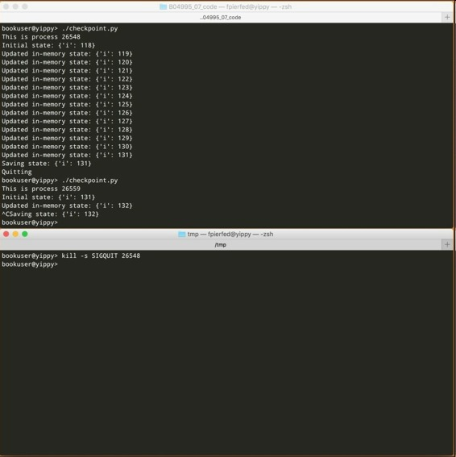

# 七、测试和调试分布式应用 （Distributed Computing with Python）

* * *

[序言](https://www.jianshu.com/p/ad10480c89d9)
[第1章 并行和分布式计算介绍](https://www.jianshu.com/p/a8ec42f6cb4e)
[第2章 异步编程](https://www.jianshu.com/p/02893376bfe8)
[第3章 Python的并行计算](https://www.jianshu.com/p/66f47049cc5a)
[第4章 Celery分布式应用](https://www.jianshu.com/p/ee14ed9e4989)
[第5章 云平台部署Python](https://www.jianshu.com/p/84dde3009782)
[第6章 超级计算机群使用Python](https://www.jianshu.com/p/59471509d3d9)
第7章 测试和调试分布式应用
[第8章 继续学习](https://www.jianshu.com/p/de89c55f8e8a)

* * *

无论大小的分布式应用，测试和调试的难度都非常大。因为是分布在网络中的，各台机器可能十分不同，地理位置也可能不同。

进一步的，使用的电脑可能有不同的用户账户、不同的硬盘、不同的软件包、不同的硬件、不同的性能。还可能在不同的时区。对于错误，分布式应用的开发者需要考虑所有这些。查错的人需要面对所有的这些挑战。

目前为止，本书没有花多少时间处理错误，而是关注于开发和部署应用的工具。

在本章，我们会学习开发者可能会碰到的错误。我们还会学习一些解决方案和工具。

## 概述

测试和调试一个单体应用并不简单，但是有许多工具可以使其变得简单，包括pdb调试器，各种分析工具（有cProfile和line_profile），纠错器（linter），静态代码分析工具，和许多测试框架，其中许多都包括于Python 3.3及更高版本的标准库。

调试分布式应用的困难是，单进程应用调试的工具处理多进程时就失去了一部分功能，特别是当进程运行在不同的机器上时。

调试、分析用C、C++、Fortran语言写成的分布式应用可以用工具，例如Intel VTune、Allinea MAP和DDT。但是Python开发者可用的工具极少，甚至没有。

编写小型和中型的分布式应用并不难。与单线程应用相比，写多线程应用的难点是后者有许多依赖间组件，组件通常运行在不同的硬件上，必须要协调网络。这就是为什么监控和调试分布代码如此困难。

幸运的是，还是可以在Python分布式应用上使用熟悉的调试工具和代码分析工具。但是，这些工具的作用有限，我们必须使用登录和打印语句，以搞清错误在哪里。

## 常见错误——时钟和时间

时间是一个易用的变量。例如，当将不同的数据流整合、数据库排序、重建事件的时间线，使用时间戳是非常自然的。另外，一些工具（比如`GMU make`）单纯的依赖文件修改的时间，很容易被不同机器的错误时间搞混。

因为这些原因，在所有的机器进行时间同步是非常重要的。如果机器位于不同的时区，不仅要同步时间，还要根据UTC时间进行校准。当不能将时间调整为UTC时间时，建议代码内部都是按照UTC来运行，只是在屏幕显示的时候再转化为本地时间。

通常，在分布式系统中进行时间同步是一个复杂的课题，超出了本书的范畴。大多数读者，可以使用网络时间协议（NTP），这是一个完美的同步解决方案。大多数操作系统都支持NTP。

关于时间，另一个需要考虑的是周期动作的计时，例如轮询循环和定时任务。许多应用需要每隔一段时间就产生进程或进行动作（例如，发送email确认或检查新的数据是否可用）。

常用的方法是使用定时器（使用代码或使用OS工具），在某一时刻让所有定时器启动，通常是在某刻和一定时间段之后。这种方法的危险之处是，进程同一时刻开始工作，可能使系统过载。

一个常见的例子是启动许多进程，这些进程都需要从一个共享硬盘读取配置或数据。这种情况下，所有一切正常，知道进程的数量变得太大，以至于共享硬盘无法处理数据传输，就会导致应用变慢。

常见的解决方法是把计时器延迟，让计时器分布在一个范围之内。通常，因为我们不总是控制所有使用的代码，让计时器随机延迟几分钟是可行的。

另一个例子是图片处理服务，需要给隔一段时间就检测新的数据。当发现新的图片，就复制这些图片、重命名、缩放、并转换成常见的格式，最后存档。如果不小心，同一时间上传过多图片，就会很容易使系统过载。

更好的方法是限制应用（使用队列架构），只加载合理数量的图片，而不使系统过载。

## 常见错误——软件环境

另一个常见的问题是所有机器上安装的软件是一致的，升级也是一致的。

不过，往往用几小时调试一个分布式系统，最后发现因为一些未知的原因，一些电脑上的代码或软件是旧版的。有时，还会发现该有的代码反而没有。

软件存在差异的原因很多：可能是加载失败，或部署过程中的错误，或者仅仅是人为的错误。

HPC中常用的解决方法是，在启动应用之前，将代码安装在虚拟环境里。一些项目倾向于静态的依赖链接，以免从动态库加载出现错误。

当和安装完整环境、软件依赖和应用本身相比，这种方法适用于运行时较长的应用。实际意义不大。

幸好，Python可以创建虚拟环境。可以使用两个工具`pyvenv`（Python 3.5以上的标准库支持）和`virtualenv`（PyPI支持）。另外，使用`pip`命令，可以指定包的版本。联合使用这些工具，就可以控制执行环境。

但是，错误往往在细节，不同的节点可能有相同的虚拟环境，但是有不兼容的第三方库。

对于这些问题，可以使用容器技术，例如Docker，或有版本控制的虚拟环境。

如果不能使用容器技术，就想到了HPC机群，最好的方法不是依赖系统软件，而是自己管理环境和软件栈。

## 常见问题——许可和环境

不同的电脑可能是在不同的用户账户下运行我们的代码，我们的应用可能想在一个特定的目录下读取文件或写入数据，然后碰到了一个许可错误。即使我们的代码使用的账户都是相同的，它们的环境可能是不同的。因此，设定的环境变量的值可能是错误的。

当我们的代码使用特殊的低级用户账号运行时，这种问题就很常见。防御性的代码，尤其是访问环境碰到未定义值时，能返回默认设置是十分必要的。

一个常见的方法是，只在特定的用户账号下运行，这个账号由自己控制，指定环境变量，和应用启动文件（它的版本也是受控的）。

但是，一些系统不仅是在极度受限的账户下运行任务，而且还是限制在沙盒内。大多数时候，连接外网也是禁止的。此时，唯一的办法就是本地设置完整环境，并复制到共享硬盘。其它的数据可以来自用户搭建的，运行小任务的服务器。

通常来说，许可错误和用户环境问题与软件环境问题类似，应该协同处理。开发者往往想让代码尽可能独立于环境，用虚拟环境装下代码和环境变量。

## 常见问题——硬件资源可用性

在给定的时间，我们的应用需要的硬件资源可能，也可能不可用。即使可用，也不能保证在相当长的时间内都可用。当网络出现故障时，就容易碰到这个问题，并且很常见（尤其是对于移动app）。在实际中，很难将这种错误和机器或应用崩溃进行区分。

使用分布式框架和任务规划器的应用经常需要依靠框架处理常见的错误。当发生错误或机器不可用时，一些任务规划器还会重新提交任务。

但是，复杂的应用需要特别的策略应对硬件问题。有时，最好的方法是当资源可用时，再次运行应用。

其它时候，重启的代价很大。此时，常用的方法是从检查点重启。也就是说，应用会周期的记录状态，所以可以从检查点重启。

如果从检查点重启，你需要平衡从中途重启和记录状态造成的性能损失。另一个要考虑的是，增加了代码的复杂性，尤其是使用多个进程或线程读写状态信息。

好的方法是，可以快速重新创建的数据和结果不要写入检查点。或者，一些进程需要花费大量时间，此时使用检查点非常合适。

例如，气象模拟可能运行数周或数月。此时，每隔几个小时就写入检查点是非常重要的，因为从头开始成本太高。另外，上传图片和创建缩略图的进程，它的运行特别快，就不需要检查点。

安全起见，状态的写入和更新应该是不可分割的（例如，写入临时文件，只有在写入完全的时候才能取代原先的文件）。

与HPC和AWS竞价实例很相似，进程中的一部分会被从运行的机器驱赶出来。当这种情况发生时，通常会发送一个警告（信号`SIGQUIT`），几秒之后，这些进程就会被销毁（信号`SIGKILL`）。对于AWS竞价实例，可以通过实例元数据的服务确定销毁的时间。无论哪种情况，我们的应用都有时间来记录状态。

Python有强大的功能捕获和处理信号（参考`signal`模块）。例如，下面的示例代码展示了一个检查点策略：

```py
#!/usr/bin/env python3.5
"""
Simple example showing how to catch signals in Python
"""
import json
import os
import signal
import sys

# Path to the file we use to store state. Note that we assume
# $HOME to be defined, which is far from being an obvious
# assumption!
STATE_FILE = os.path.join(os.environ['HOME'],
                               '.checkpoint.json')

class Checkpointer:
    def __init__(self, state_path=STATE_FILE):
        """
        Read the state file, if present, and initialize from that.
        """
        self.state = {}
        self.state_path = state_path
        if os.path.exists(self.state_path):
            with open(self.state_path) as f:
                self.state.update(json.load(f))
        return

    def save(self):
        print('Saving state: {}'.format(self.state))
        with open(self.state_path, 'w') as f:
            json.dump(self.state, f)
        return

    def eviction_handler(self, signum, frame):
        """
        This is the function that gets called when a signal is trapped.
        """
        self.save()

        # Of course, using sys.exit is a bit brutal. We can do better.
        print('Quitting')
        sys.exit(0)
        return

if __name__ == '__main__':
    import time

    print('This is process {}'.format(os.getpid()))

    ckp = Checkpointer()
    print('Initial state: {}'.format(ckp.state))

    # Catch SIGQUIT
    signal.signal(signal.SIGQUIT, ckp.eviction_handler)
    # Get a value from the state.
    i = ckp.state.get('i', 0)
    try:
        while True:
            i += 1
            ckp.state['i'] = i
            print('Updated in-memory state: {}'.format(ckp.state))
            time.sleep(1)
    except KeyboardInterrupt:
        ckp.save() 
```

我们可以在一个终端运行这段代码，然后在另一个终端，我们发送一个信号`SIGQUIT`（例如，`-s SIGQUIT <process id>`）。如果这么做的话，我们可以看到检查点的动作，如下图所示：



> 笔记：使用分布式应用通常需要在性能不同、硬件不同、软件不同的机器上运行。

即使有任务规划器，帮助我们廁何时的软件和硬件环境，我们必须记录各台机器的环境和性能。在高级的架构中，这些性能指标可以提高任务规划的效率。

例如，PBS Pro，再次执行提交任务时就考虑了历史性能。HTCondor持续给每台机器打分，用于选择节点和排名。

最让人没有办法的情况是网络问题或服务器过载，网络请求的时间太长，就会导致代码超时。这可能会导致我们认为服务使不可用的。这些暂时性的问题，是很难调试的。

## 困难——开发环境

另一个分布式系统常见的困难是搭建一个有代表性的开发和测试环境，尤其是对于个人小型团队。开发环境最好能代表最糟糕的开发环境，可以让开发者测试常见的错误，例如硬盘溢出、网络延迟、间歇性网络断开，硬件、软件失效等实际中会发生的故障。

大型团队拥有开发和测试集群的资源，他们总是有专门的软件质量团队对我们的代码进行压力测试。

不幸的是，小团队常常被迫在笔记本电脑上编写代码，并使用非常简单（最好的情况！）的由两台或三台虚拟机组成环境，它们运行在笔记本电脑上以模拟真实系统。

这种务实的方案是可行的，绝对比什么都没有要好。然而，我们应该记住，虚拟机运行在同一主机上表现出不切实际的高可用性和较低的网络延迟。此外，没有人会意外升级它们，而不通知我们或使用错误的操作系统。这个环境太易于控制和稳定，不够真实。

更接近现实的设置是创建一个小型开发集群，比如AWS，使用相同的VM镜像，使用生产环境中相同的软件栈和用户帐户。

简而言之，很难找到替代品。对于基于云平台的应用，我们至少应该在部署版本的小型版本上测试我们的代码。对于HPC应用程序，我们应该使用测试集群、或集群的一部分，用于测试和开发。

理想情况下，我们最好在操作系统的一个克隆版本上进行开发。但是，考虑成本和简易性，我们还是会使用虚拟机：因为它够简单，基本上是免费的，不用网络连接，这一点很重要。

然而，我们应该记住分布式应用并不是很难编写的，只是它们的故障模式比单机模式多的多。其中一些故障（特别是与数据访问相关的），所以需要仔细地选择架构。

在开发阶段后期，纠正由错误假设所导致的架构选择代价高昂。说服管理者尽早给我们提供所需的硬件资源通常是困难的。最后，这是一种微妙的平衡。

## 有效策略——日志

通常情况下，日志就像备份或吃蔬菜，我们都知道应该这样做，但大多数人都忘记了。在分布式应用程序中，我们没有其他选择，日志是必不可少的。不仅如此，记录一切都是必要的。

由于有许多不同的进程在远程资源上运行，理解发生了什么的唯一方法是获得日志信息并使其随时可用，并且以易于检索的格式/系统存储。

在最低限度，我们应该记录进程的启动和退出时间、退出代码和异常（如果有的话），所有的输入参数，输出，完整执行环境、执行主机名和IP，当前工作目录，用户帐户以及完整应用配置，和所有的软件版本。

如果出了问题，我们应该能够使用这些信息登录到同一台机器（如果仍然可用），转到同一目录，并复制我们的代码，重新运行。当然，完全复制执行环境可能做不到（通常是因为需要管理员权限）。

然而，我们应该始终努力模拟实际环境。这是任务规划器的优点所在，它允许我们选择指定的机器，并指定完整的任务环境，这使得复制错误更少。

记录软件版本（不仅是Python版本，还有使用的所有包的版本）可以诊断远程机器上过时的软件栈。Python包管理器，`pip`，可以容易的获取安装的包：`import pip; pip.main(['list'])`。`import sys; print(sys.executable, sys.version_info)`可以显示Python的位置和版本。

创建一个系统，使所有的类和函数调用发出具有相同等级的日志，而且是在对象生命周期的同一位置。常见的方法包括使用装饰器、元类。这正是Python模块`autologging` （PyPI上有）的作用。

一旦日志就位，我们面临的问题是在哪里存储这些日志，对于大型应用，传输日志占用资源很多。简单的应用可以将日志写入硬盘的文本文件。更复杂的应用程序可能需要在数据库中存储这些信息（可以通过创建一个Python日志模块的自定义处理程序完成）或专门的日志聚合器，如Sentry（[https://getsentry.com](https://link.jianshu.com?t=https://getsentry.com/)）。

与日志密切相关的是监督。分布式应用程序可以有许多可移动组件，并且需要知道哪些机器处于繁忙状态，以及哪些进程或任务当前正在运行、等待，或处于错误状态。知道哪些进程比平时花费更长的时间，往往是一个重要的警告信号，表明可能有错误。

Python有一些监督方案（经常与日志系统集成）。比如Celery，推荐使用flower（[http://flower.readthedocs.org](https://link.jianshu.com?t=http://flower.readthedocs.org/)）作为监督和控制。另外，HPC任务规划器，往往缺少通用的监督方案。

在潜在问题变严重之前，最好就监测出来。实际上，监视资源（如可用硬盘空间和触发器动作），甚至是简单的email警告，当它们低于阈值时，监督是有用的。许多部门监督硬件性能和硬盘智能数据，以发现潜在问题。

这些问题更可能是运营而不是开发者感兴趣的，但最好记住。监督也可以集成在我们的应用程序以执行适当的策略，来处理性能下降的问题。

## 有效策略——模拟组件

一个好的，虽然可能耗费时间和精力，测试策略是模拟系统的一些或全部组件。原因是很多：一方面，模拟软件组件使我们能够更直接地测试接口。此时，mock测试库，如`unittest.mock`（Python 3.5的标准库），是非常有用的。

另一个模拟软件组件的原因是，使组件发生错误以观察应用的响应。例如，我们可以将增加REST API或数据库的服务的响应时间，看看会发生什么。有时，超时会让应用误以为服务器崩溃。

特别是在设计和开发复杂分布式应用的早期阶段，人们可能对网络可用性、性能或服务响应时间（如数据库或服务器）做出过于乐观的假设。因此，使一个服务完全失效或修改它的功能，可以检测出代码中的错误。

**Netflix Chaos Monkey** ([https://github.com/Netflix/SimianArmy](https://link.jianshu.com?t=https://github.com/Netflix/SimianArmy))可以随机使系统中的组件失效，用于测试应用的反应。

## 总结

用Python编写或运行小型或中型分布式应用程序并不困难。我们可以利用许多高质量框架，例如，Celery、Pyro、各种任务规划期，Twisted、，MPI绑定（本书中没有讨论），或标准库的模块`multiprocessing`。

然而，真正的困难在于监视和调试应用，特别是因为大部分代码并行运行在许多不同的、通常是远程的计算机上。

潜藏最深的bug是那些最终产生错误结果的bug（例如，由于数据在过程中被污染），而不是引发一个异常，大多数框架都能捕获并抛出。

遗憾的是，Python的监视和调试工具不像用来开发相同代码的框架和库那么功能完备。其结果是，大型团队可以使用自己开发的、通常是非常专业的分布式调试系统，小团队主要依赖日志和打印语句。

分布式应用和动态语言（尤其是Python）需要更多的关于调试方面的工作。

* * *

[序言](https://www.jianshu.com/p/ad10480c89d9)
[第1章 并行和分布式计算介绍](https://www.jianshu.com/p/a8ec42f6cb4e)
[第2章 异步编程](https://www.jianshu.com/p/02893376bfe8)
[第3章 Python的并行计算](https://www.jianshu.com/p/66f47049cc5a)
[第4章 Celery分布式应用](https://www.jianshu.com/p/ee14ed9e4989)
[第5章 云平台部署Python](https://www.jianshu.com/p/84dde3009782)
[第6章 超级计算机群使用Python](https://www.jianshu.com/p/59471509d3d9)
第7章 测试和调试分布式应用
[第8章 继续学习](https://www.jianshu.com/p/de89c55f8e8a)

* * *