# 三、外观定制

在本章中，我们将使用 Python 3 定制 GUI：

*   创建消息框–信息、警告和错误
*   如何创建独立的消息框
*   如何创建 tkinter 窗口窗体的标题
*   更改主根窗口的图标
*   使用旋转框控件
*   小部件的浮雕、凹陷和凸起外观
*   使用 Python 创建工具提示
*   如何使用画布小部件

# 导言

在本章中，我们将通过更改 GUI 中的一些小部件的属性来定制它们。我们还将介绍 tkinter 为我们提供的一些新部件。

*使用 Python*创建工具提示的方法将创建一个工具提示 OOP 样式的类，该类将是我们目前使用的单个 Python 模块的一部分。

# 创建消息框–信息、警告和错误

消息框是向用户提供反馈的弹出窗口。它可以提供信息，暗示潜在的问题，甚至是灾难性的错误。

使用 Python 创建消息框非常简单。

## 准备好了吗

我们将在**帮助****中添加关于我们在上一个配方中创建的**菜单项的功能。在大多数应用程序中，当点击**帮助****关于**菜单时，给用户的典型反馈是信息性的。我们从这些信息开始，然后改变设计模式以显示警告和错误。

## 怎么做。。。

在导入语句所在的模块顶部添加以下代码行：

```py
from tkinter import messagebox as mBox
```

接下来，我们将创建一个回调函数，该函数将显示一个消息框。我们必须将回调代码定位在将回调附加到菜单项的代码之上，因为这仍然是过程性的，而不是 OOP 代码。

在创建“帮助”菜单的行上方添加以下代码：

```py
# Display a Message Box
# Callback function
def _msgBox():
    mBox.showinfo('Python Message Info Box', 'A Python GUI created using tkinter:\nThe year is 2015.')   

# Add another Menu to the Menu Bar and an item
helpMenu = Menu(menuBar, tearoff=0)
helpMenu.add_command(label="About", command=_msgBox)
```

点击**帮助****关于**现在会出现以下弹出窗口：

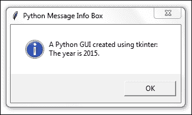

让我们将此代码转换为警告消息框弹出窗口。注释掉前一行并添加以下代码：

```py
# Display a Message Box
def _msgBox():
#    mBox.showinfo('Python Message Info Box', 'A Python GUI 
#      created using tkinter:\nThe year is 2015.')
    mBox.showwarning('Python Message Warning Box', 'A Python GUI created using tkinter:\nWarning: There might be a bug in this code.')
```

运行上述代码将产生以下稍微修改的消息框：


显示错误消息框很简单，通常会警告用户出现严重问题。如上所述，如下所示。注释掉并添加此代码，正如我们在此处所做的：

```py
# Display a Message Box
def _msgBox():
#    mBox.showinfo('Python Message Info Box', 'A Python GUI 
#      created using tkinter:\nThe year is 2015.')
#    mBox.showwarning('Python Message Warning Box', 'A Python GUI 
#      created using tkinter:\nWarning: There might be a bug in 
#      this code.')
    mBox.showerror('Python Message Error Box', 'A Python GUI created using tkinter:\nError: Houston ~ we DO have a serious PROBLEM!')
```

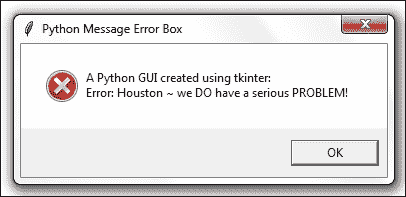

## 它是如何工作的。。。

我们已经添加了另一个回调函数，并将其作为委托附加以处理单击事件。现在，当我们点击**帮助**|**关于**菜单时，一个动作发生了。我们正在创建和显示最常见的弹出消息框对话框。它们是模态的，因此用户只有单击**确定**按钮才能使用 GUI。

在第一个示例中，我们显示了一个信息框，从其左侧的图标可以看出。接下来，我们创建警告和错误消息框，自动更改与弹出窗口关联的图标。我们所要做的就是指定要显示的 mBox。

有不同的消息框显示多个**OK**按钮，我们可以根据用户的选择对响应进行编程。

以下是一个简单的示例，说明了此技术：

```py
# Display a Message Box
def _msgBox():
    answer = mBox.askyesno("Python Message Dual Choice Box", "Are you sure you really wish to do this?")
    print(answer)
```

运行此 GUI 代码会产生一个弹出窗口，其用户响应可用于通过将其保存在`answer`变量中来分支此事件驱动 GUI 循环的答案。


使用 Eclipse 的控制台输出显示，单击**Yes**按钮会将`True`的布尔值分配给`answer`变量。

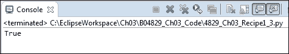

例如，我们可以使用以下代码：

```py
If answer == True:
    <do something>
```

# 如何创建独立的消息框

在此配方中，我们将创建 tkinter 消息框作为独立的顶级 GUI 窗口。

我们首先会注意到，通过这样做，我们最终会得到一个额外的窗口，因此我们将探索隐藏此窗口的方法。

在前面的配方中，我们通过主 GUI 表单中的**帮助****关于**菜单调用了 tkinter 消息框。

那么，我们为什么希望创建一个独立的消息框呢？

一个原因是，我们可以自定义消息框，并在几个 GUI 中重用它们。我们不必将相同的代码复制并粘贴到我们设计的每个 Python GUI 中，我们可以将其从主 GUI 代码中分离出来。这可以创建一个小的可重用组件，，然后我们可以将其导入到不同的 Python GUI 中。

## 准备好了吗

我们已经在前面的配方中创建了消息框的标题。我们不会重复使用前面配方中的代码，而是用很少几行 Python 代码构建一个新的 GUI。

## 怎么做。。。

我们可以创建一个简单的消息框，如下所示：

```py
from tkinter import messagebox as mBox
mBox.showinfo('A Python GUI created using tkinter:\nThe year is 2015')
```

这将导致以下两个窗口：


这看起来和我们的想法不一样。现在我们有两个窗口，一个是不需要的，第二个是显示文本作为标题的窗口。

哎呀。

我们现在来解决这个问题。我们可以通过添加单引号或双引号，后跟逗号来更改 Python 代码。

```py
mBox.showinfo('', 'A Python GUI created using tkinter:\nThe year is 2015')
```

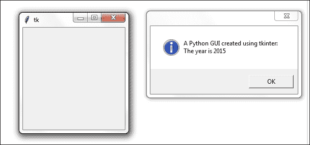

第一个参数是标题，第二个是弹出消息框中显示的文本。通过添加一对空的单引号或双引号，后跟逗号，我们可以将文本从标题移动到弹出消息框中。

我们仍然需要一个标题，我们肯定想摆脱这个不必要的第二窗口。

### 注

在像 C#这样的语言中，出现了第二个窗口的相同现象。它基本上是一个 DOS 风格的调试窗口。许多程序员似乎并不介意有这个额外的窗口。从 GUI 编程的角度来看，我个人觉得它令人厌恶。我们将在下一步删除它。

第二个窗口是由 Windows 事件循环引起的。我们可以通过抑制它来消除它。

添加以下代码：

```py
from tkinter import messagebox as mBox
from tkinter import Tk
root = Tk()
root.withdraw()
mBox.showinfo('', 'A Python GUI created using tkinter:\nThe year is 2015')
```

现在我们只有一个窗口。`withdraw()`函数删除了我们不感兴趣的浮动调试窗口。

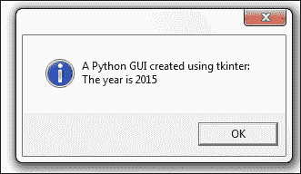

为了添加标题，我们所要做的就是在空的第一个参数中放入一些字符串。

例如：

```py
from tkinter import messagebox as mBox
from tkinter import Tk
root = Tk()
root.withdraw()
mBox.showinfo('This is a Title', 'A Python GUI created using tkinter:\nThe year is 2015')
```

现在，我们的对话框有一个标题：

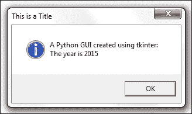

## 它是如何工作的。。。

我们将更多参数传递到消息框的 tkinter 构造函数中，以向窗口窗体添加标题，并在消息框中显示文本，而不是将其显示为标题。这的发生是由于我们正在传递的参数的位置。如果我们省略了空引号或双引号，那么 MessageBox 小部件将参数的第一个位置作为标题，而不是消息框中要显示的文本。通过传递后跟逗号的空引号，我们可以更改消息框显示传递到函数中的文本的位置。

我们通过调用主根窗口上的`withdraw()`方法来抑制 tkinter 消息框小部件自动创建的第二个弹出窗口。

# 如何创建 tkinter 窗体的标题

更改 tkinter 主根窗口标题的原理与前面的配方中讨论的相同。我们只是将字符串作为第一个参数传递给小部件的构造函数。

## 准备好了吗

我们创建主根窗口并给它一个标题，而不是弹出对话框窗口。

此配方中显示的 GUI 是上一章中的代码。它不是建立在本章前面的配方基础上的。

## 怎么做。。。

下面的代码创建主窗口并为其添加标题。我们已经在以前的食谱中这样做了。这里，我们只关注 GUI 的这一方面。

```py
import tkinter as tk
win = tk.Tk()               # Create instance
win.title("Python GUI")     # Add a title
```


## 它是如何工作的。。。

这通过使用内置的 tkinter`title`属性为主根窗口提供标题。在我们创建`Tk()`实例之后，我们可以使用所有内置的 tkinter 属性来定制 GUI。

# 更改主根窗口的图标

定制 GUI 的一种方法是给它一个不同于 tkinter 自带的默认图标的图标。下面是我们如何做到这一点。

## 准备好了吗

我们正在改进上一个配方的 GUI。我们将使用 Python 附带的图标，但您可以使用任何有用的图标。确保在代码中有图标所在位置的完整路径，否则可能会出错。

### 注

虽然这本书最后一章的配方可能有点让人困惑，但最好的方法是下载本书的代码，然后逐步理解代码。

## 怎么做。。。

将以下代码放在主事件循环上方的某个位置。该示例使用我安装 Python3.4 的路径。您可能需要调整它以匹配安装目录。

注意 GUI 左上角的“羽毛”默认图标是如何更改的。

```py
# Change the main windows icon
win.iconbitmap(r'C:\Python34\DLLs\pyc.ico')
```

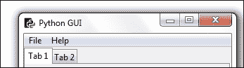

## 它是如何工作的。。。

这是 tkinter 附带的另一个属性，tkinter 附带 Python3.x。`iconbitmap`是我们用来通过将绝对（硬编码）路径传递给图标来更改主根窗口窗体图标的属性。这会覆盖 tkinter 的默认图标，将其替换为我们选择的图标。

### 注

在上面代码中的绝对路径的字符串中使用“r”可以避免反斜杠，因此我们可以使用“raw”字符串来代替写入`C:\\`，这样我们就可以编写更自然的单个反斜杠`C:\`。这是 Python 为我们创造的一个巧妙的技巧。

# 使用旋转箱控件

在这个配方中，我们将使用一个`Spinbox`小部件，并将键盘上的*回车*键绑定到我们的一个小部件上。

## 准备好了吗

我们正在使用我们的选项卡式 GUI，并将在`ScrolledText`控件上方添加一个`Spinbox`小部件。这只需要我们将`ScrolledText`行值增加 1，并在`Entry`小部件上方的行中插入新的`Spinbox`控件。

## 怎么做。。。

首先，我们添加`Spinbox`控件。将以下代码置于`ScrolledText`小部件上方：

```py
# Adding a Spinbox widget
spin = Spinbox(monty, from_=0, to=10)
spin.grid(column=0, row=2)
```

这将修改我们的 GUI，如图所示：

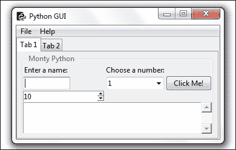

接下来，我们将缩小`Spinbox`小部件的大小。

```py
spin = Spinbox(monty, from_=0, to=10, width=5)
```


接下来，我们添加另一个属性来进一步定制小部件，`bd`是`borderwidth`属性的简写符号。

```py
spin = Spinbox(monty, from_=0, to=10, width=5 , bd=8)
```

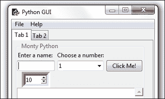

在这里，我们通过创建回调并将其链接到控件，向小部件添加功能。

这将把 Spinbox 的选择打印到`ScrolledText`和标准输出上。名为`scr`的变量是我们对`ScrolledText`小部件的引用。

```py
# Spinbox callback 
def _spin():
    value = spin.get()
    print(value)
    scr.insert(tk.INSERT, value + '\n')

spin = Spinbox(monty, from_=0, to=10, width=5, bd=8, command=_spin)
```


除了使用范围之外，我们还可以指定一组值。

```py
# Adding a Spinbox widget using a set of values
spin = Spinbox(monty, values=(1, 2, 4, 42, 100), width=5, bd=8, command=_spin) 
spin.grid(column=0, row=2)
```

这将创建以下 GUI 输出：

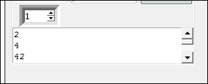

## 它是如何工作的。。。

请注意，在第一个屏幕截图中，我们的新`Spinbox`控件默认宽度为 20，将此列中所有控件的列宽向外推。这不是我们想要的。我们给小部件一个从 0 到 10 的范围，它默认显示`to=10`值，这是最高的值。如果我们尝试将`from_/to`范围从 10 反转到 0，tkinter 不喜欢它。一定要亲自尝试一下。

在第二个屏幕截图中，我们缩小了`Spinbox`控件的宽度，使其与列的中心对齐。

在第三个屏幕截图中，我们添加了 Spinbox 的`borderwidth`属性，它自动使整个`Spinbox`不再是平面而是三维的。

在第四个屏幕截图中，我们添加了一个回调函数来显示在`ScrolledText`小部件中选择的号码，并将其打印到标准输出流中。我们添加了“\n”以在新行上打印。请注意，默认值是如何无法打印的。只有在单击控件时，才会调用回调函数。通过单击默认值为 10 的向上箭头，我们可以打印“10”值。

最后，我们将可用值限制为硬编码集。这也可以从数据源（例如，文本或 XML 文件）读入。

# 小部件的浮雕、凹陷和凸起外观

我们可以通过一个属性来控制我们的`Spinbox`小部件的外观，该属性使它们看起来为浮雕、凹陷或凸起格式。

## 准备好了吗

我们将再添加一个`Spinbox`控件，以使用`Spinbox`控件的 relief 属性演示小部件的可用外观。

## 怎么做。。。

首先，让我们增加`borderwidth`来区分第二个`Spinbox`和第一个`Spinbox`。

```py
# Adding a second Spinbox widget 
spin = Spinbox(monty, values=(0, 50, 100), width=5, bd=20, command=_spin) 
spin.grid(column=1, row=2)
```

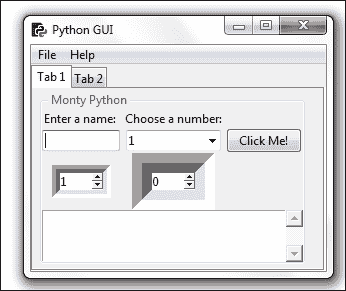

我们上面的两个Spinbox 小部件都有相同的浮雕风格。唯一的区别是，我们在第一个 Spinbox 右侧的新小部件具有更大的边框宽度。

在我们的代码中，我们没有指定要使用的救济属性，因此救济默认为 tk.SUNKEN。

以下是可以设置的可用释压特性选项：

<colgroup><col style="text-align: left"> <col style="text-align: left"> <col style="text-align: left"> <col style="text-align: left"> <col style="text-align: left"></colgroup> 
| 沉没的 | 提高 | 平坦的 | 斜槽 | 蒂克里奇 |

通过为`relief`属性分配不同的可用选项，我们可以为这个小部件创建不同的外观。

将 tk.RIDGE relief 赋值，并将边框宽度减小到与第一个 Spinbox 小部件相同的值，会产生以下 GUI：

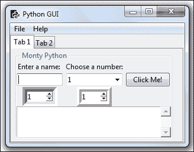

## 它是如何工作的。。。

首先，我们创建了第二个`Spinbox`在第二列中对齐（索引==1）。它默认为`SUNKEN`，因此它看起来与我们的第一个`Spinbox`类似。我们通过增加第二个控件（右边的控件）的边框宽度来区分这两个小部件。

接下来，我们隐式设置 Spinbox 小部件的 relief 属性。我们将边框宽度设置为与第一个 Spinbox 相同的宽度，因为通过对其进行不同的浮雕，可以在不改变任何其他属性的情况下看到差异。

# 使用 Python 创建工具提示

这个配方将向我们展示如何创建工具提示。当用户将鼠标悬停在小部件上时，其他信息将以工具提示的形式提供。

我们将把这些附加信息编码到 GUI 中。

## 准备好了吗

我们正在向 GUI 添加更多有用的功能。令人惊讶的是，向控件添加工具提示应该很简单，但并不像我们希望的那么简单。

为了实现所需的功能，我们将把工具提示代码放入它自己的 OOP 类中。

## 怎么做。。。

将这个类添加到导入语句下方的：

```py
class ToolTip(object):
    def __init__(self, widget):
        self.widget = widget
        self.tipwindow = None
        self.id = None
        self.x = self.y = 0

    def showtip(self, text):
        "Display text in tooltip window"
        self.text = text
        if self.tipwindow or not self.text:
            return
        x, y, _cx, cy = self.widget.bbox("insert")
        x = x + self.widget.winfo_rootx() + 27
        y = y + cy + self.widget.winfo_rooty() +27
        self.tipwindow = tw = tk.Toplevel(self.widget)
        tw.wm_overrideredirect(1)
        tw.wm_geometry("+%d+%d" % (x, y))

        label = tk.Label(tw, text=self.text, justify=tk.LEFT,
   background="#ffffe0", relief=tk.SOLID, borderwidth=1,
                      font=("tahoma", "8", "normal"))

        label.pack(ipadx=1)

    def hidetip(self):
        tw = self.tipwindow
        self.tipwindow = None
        if tw:
            tw.destroy()

#===========================================================
def createToolTip( widget, text):
    toolTip = ToolTip(widget)
    def enter(event):
        toolTip.showtip(text)
    def leave(event):
        toolTip.hidetip()
    widget.bind('<Enter>', enter)
    widget.bind('<Leave>', leave)
```

在**面向对象编程**（**OOP**方法中，我们在 Python模块中创建了一个新类。Python 允许我们在同一个 Python 模块中放置多个类，还允许我们在同一个模块中“混合匹配”类和常规函数。

上面的代码正是这样做的。

`ToolTip`类是一个 Python 类，为了使用它，我们必须实例化它。

如果您不熟悉 OOP 编程，“实例化一个对象以创建类的实例”听起来可能相当无聊。

其原理非常简单，非常类似于通过`def`语句创建 Python 函数，然后在稍后的代码中实际调用该函数。

以非常类似的方式，我们首先创建一个类的蓝图，并通过在类名称中添加括号将其分配给变量，如下所示：

```py
class AClass():
    pass
instanceOfAClass = AClass()
print(instanceOfAClass)
```

上面的代码打印出一个内存地址，还显示我们的变量现在有一个对这个类实例的引用。

OOP 的酷之处在于我们可以创建同一类的多个实例。

在前面的代码中，我们声明了 Python 类，并明确地使它从所有 Python 类基础的对象继承。我们也可以像在`AClass`代码示例中那样省略它，因为它是所有 Python 类的默认值。

在`ToolTip`类中出现了所有必要的工具提示创建代码之后，我们接下来通过在其下方创建一个函数来切换到非 OOP Python 编程。

我们定义了函数`createToolTip()`，它期望我们的一个 GUI 小部件作为参数传入，这样当我们将鼠标悬停在该控件上时，我们就可以显示工具提示。

`createToolTip()`函数实际上为我们调用的每个小部件创建了`ToolTip`类的一个新实例。

我们可以为 Spinbox 小部件添加工具提示，如下所示：

```py
# Add a Tooltip
createToolTip(spin, 'This is a Spin control.')
```

以及我们的所有其他 GUI 小部件以同样的方式。我们只需要传入小部件的父级，我们希望有一个工具提示来显示一些额外的信息。对于我们的 ScrolledText 小部件，我们让变量`scr`指向，因此这就是我们传递给工具提示创建函数的构造函数的内容。

```py
# Using a scrolled Text control    
scrolW  = 30; scrolH  =  3
scr = scrolledtext.ScrolledText(monty, width=scrolW, height=scrolH, wrap=tk.WORD)
scr.grid(column=0, row=3, sticky='WE', columnspan=3)

# Add a Tooltip to the ScrolledText widget
createToolTip(scr, 'This is a ScrolledText widget.')
```

## 它是如何工作的。。。

这是本书中 OOP 编程的开始。这可能看起来有点先进，但不要担心，我们会解释一切，它确实起作用！

那么，运行这段代码实际上到目前为止还不起作用，也没有任何区别。

在创建微调器的下方添加以下代码：

```py
# Add a Tooltip
createToolTip(spin, 'This is a Spin control.')
```

现在，当我们将鼠标悬停在微调器小部件上时，会得到一个工具提示，为用户提供附加信息。


我们调用创建工具提示的函数，然后传入对小部件的引用，以及将鼠标悬停在小部件上时希望显示的文本。

本书中其余的菜谱将在有意义时使用 OOP。这里，我们展示了最简单的 OOP 示例。默认情况下，我们创建的每个 Python 类都继承自`object`基类。Python 作为一种实用的编程语言，简化了类的创建过程。

我们可以编写以下语法：

```py
class ToolTip(object):
    pass
```

我们还可以通过省略默认基类来简化它：

```py
class ToolTip():
    pass
```

在相同的模式中，我们可以继承和扩展任何 tkinter 类。

# 如何使用画布小部件

这个配方展示了如何使用 tkinter 画布小部件向 GUI 添加戏剧性的色彩效果。

## 准备好了吗

我们将通过添加更多颜色来改进以前的代码和 GUI 的外观。

## 怎么做。。。

首先，我们将在 GUI 中创建第三个选项卡，以隔离新代码。

以下是创建新的第三个选项卡的代码：

```py
# Tab Control introduced here --------------------------------
tabControl = ttk.Notebook(win)          # Create Tab Control

tab1 = ttk.Frame(tabControl)            # Create a tab 
tabControl.add(tab1, text='Tab 1')      # Add the tab

tab2 = ttk.Frame(tabControl)            # Add a second tab
tabControl.add(tab2, text='Tab 2')      # Make second tab visible

tab3 = ttk.Frame(tabControl)            # Add a third tab
tabControl.add(tab3, text='Tab 3')      # Make second tab visible

tabControl.pack(expand=1, fill="both")  # Pack to make visible
# ~ Tab Control introduced here -------------------------------
```

接下来，我们使用 tkinter 的另一个内置小部件 canvas。很多人喜欢这个小部件，因为它有强大的功能。

```py
# Tab Control 3 -------------------------------
tab3 = tk.Frame(tab3, bg='blue')
tab3.pack()
for orangeColor in range(2):
    canvas = tk.Canvas(tab3, width=150, height=80, highlightthickness=0, bg='orange')
    canvas.grid(row=orangeColor, column=orangeColor)
```

## 它是如何工作的。。。

下面的屏幕截图显示了通过运行前面的代码并单击新的**选项卡 3**创建的结果。运行代码时，它实际上是橙色和蓝色的。在这本非彩色的书中，这可能不是很明显，但这些颜色是真实的；你可以相信我。

您可以通过在线搜索查看图形和绘图功能。在本书中，我将不深入讨论这个小部件（但它非常酷）。

