# 八、国际化与测试

在本章中，我们将国际化并测试我们的 Python GUI，包括以下配方：

*   以不同语言显示小部件文本
*   一次性更改整个 GUI 语言
*   本地化 GUI
*   为国际化准备 GUI
*   如何以敏捷的方式设计 GUI
*   我们需要测试 GUI 代码吗？
*   设置调试手表
*   配置不同的调试输出级别
*   使用 Python 的 _; main _;部分创建自检代码
*   使用单元测试创建健壮的 GUI
*   如何使用 EclipsePydevIDE 编写单元测试

# 导言

在本章中，我们将用不同的语言在标签、按钮、选项卡和其他小部件上显示文本，从而使 GUI 国际化。

我们将简单地开始，然后探索如何在设计级别为国际化准备 GUI。

我们还将本地化 GUI，这与国际化略有不同。

### 注

由于这些单词很长，它们被缩写为使用单词的第一个字符，后面是介于第一个字符和最后一个字符之间的字符总数，后面是单词的最后一个字符。

因此，国际化变成了 I18N，本地化变成了 L10N。

我们还将测试 GUI 代码和编写单元测试，并探索单元测试在我们的开发工作中可以提供的价值，这将引导我们找到重构代码的最佳实践。

# 以不同语言显示小部件文本

将 Python 中的文本字符串国际化的最简单方法是将它们移动到单独的 Python 模块中，然后通过向该模块传递参数来选择要在 GUI 中显示的语言。

根据在线搜索结果，虽然不推荐使用这种方法，但根据您正在开发的应用程序的具体要求，这种方法可能仍然是最实用、最快的实现方法。

## 准备好了吗

我们将重用前面创建的 Python GUI。我们已经注释掉了一行创建 MySQL 选项卡的 Python 代码，因为在本章中我们不讨论 MySQL 数据库。

## 怎么做。。。

在本食谱中，我们将通过将 Windows 标题从英语更改为另一种语言来开始 I18N 我们的 GUI。

由于名称“GUI”在其他语言中是相同的，我们将首先扩展名称，使我们能够看到更改的视觉效果。

让我们更改前一行代码：

```py
self.win.title("Python GUI")
```

致：

```py
self.win.title("Python Graphical User Interface")
```

前面的代码更改导致我们的 GUI 程序标题如下：

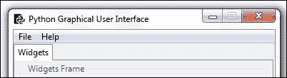

### 注

在本章中，我们将使用英语和德语举例说明 Python GUI 国际化的原则。

将字符串硬编码为代码从来都不是一个好主意，因此我们可以改进代码的第一步是将 GUI 中可见的所有字符串分离为它们自己的 Python 模块。这是 GUI 可见方面国际化的开始。

### 注

当我们进入 I18N 时，我们将在一个步骤中完成非常积极的重构和语言翻译。

让我们创建一个新的 Python 模块，并将其命名为`Resources.py`。接下来，让我们将 GUI 标题的英文字符串移动到此模块中，然后将此模块导入 GUI 代码。

### 注

我们将 GUI 从它显示的语言中分离出来，这是一个 OOP 设计原则。

我们的新 Python 模块包含国际化字符串，现在如下所示：

```py
Class I18N():
'''Internationalization'''
    def __init__(self, language):
        if    language == 'en': self.resourceLanguageEnglish()
        elif  language == 'de': self.resourceLanguageGerman()
        else: raise NotImplementedError('Unsupported language.')

    def resourceLanguageEnglish(self):
        self.title = "Python Graphical User Interface"

    def resourceLanguageGerman(self):
        self.title = 'Python Grafische Benutzeroberflaeche'
```

我们将这个新的 Python 模块导入到主要的 Python GUI 代码中，然后使用它。

```py
from B04829_Ch08_Resources import I18N
class OOP():
    def __init__(self): 
        self.win = tk.Tk()                # Create instance
        self.i18n = I18N('de')            # Select language
        self.win.title(self.i18n.title)   # Add a title
```

根据我们传入 I18N 类的语言，我们的 GUI 将以该语言显示。

运行前面的代码会得到以下国际化结果：

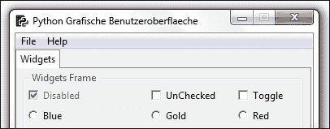

## 它是如何工作的。。。

我们正在将作为 GUI 一部分的硬编码字符串分解成各自的模块。我们通过创建一个类来实现这一点，在类的`__init__()`方法中，我们根据传入的语言参数选择 GUI 将显示的语言。

这很有效。

我们可以通过将国际化字符串分离到单独的文件（可能是 XML 或其他格式）来进一步模块化代码。我们还可以从 MySQL 数据库中读取它们。

### 注

这是一种“关注点分离”的编码方法，它是 OOP 编程的核心。

# 一次更改整个 GUI 语言

在这个配方中，我们将通过将所有以前硬编码的英文字符串重构为一个单独的 Python 模块，然后对这些字符串进行国际化，一次更改整个 GUI 显示名称。

这个方法表明，避免对 GUI 显示的任何字符串进行硬编码，而是将 GUI 代码与 GUI 显示的文本分开，这是一个很好的设计原则。

### 注

以模块化的方式设计 GUI 使其更易于国际化。

## 准备好了吗

我们将继续使用上一个配方中的 GUI。在这个配方中，我们已经将 GUI 的标题国际化了。

## 怎么做。。。

为了国际化所有 GUI 小部件中显示的文本，我们必须将所有硬编码字符串移动到单独的 Python 模块中，这就是我们接下来要做的。

以前，GUI 显示的字符串分散在 Python 代码中。

下面是我们的 GUI 在没有 I18N 的情况下的样子。

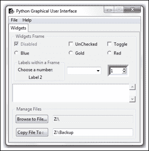

每个小部件的每个字符串，包括 GUI 的标题、选项卡控件名称等，都是硬编码的，并与创建 GUI 的代码混合在一起。

### 注

在 GUI 软件开发过程的设计阶段，考虑如何最好地国际化 GUI 是一个好主意。

下面是代码的摘录。

```py
WIDGET_LABEL = ' Widgets Frame '
class OOP():
    def __init__(self): 
        self.win = tk.Tk()              # Create instance
        self.win.title("Python GUI")    # Add a title

    # Radiobutton callback function
    def radCall(self):
        radSel=self.radVar.get()
        if   radSel == 0: self.monty2.configure(text='Blue')
        elif radSel == 1: self.monty2.configure(text='Gold')
        elif radSel == 2: self.monty2.configure(text='Red')
```

在这个配方中，我们将对 GUI 小部件中显示的所有字符串进行国际化。我们不会将输入的文本*国际化到我们的 GUI 中，因为这取决于您电脑上的本地设置。*

以下是英文国际化字符串的代码：

```py
classI18N():
'''Internationalization'''

    def __init__(self, language):
        if   language == 'en': self.resourceLanguageEnglish()
        elif language == 'de': self.resourceLanguageGerman()
        else: raiseNotImplementedError('Unsupported language.')

    def resourceLanguageEnglish(self):
        self.title = "Python Graphical User Interface"

        self.file  = "File"
        self.new   = "New"
        self.exit  = "Exit"
        self.help  = "Help"
        self.about = "About"

        self.WIDGET_LABEL = ' Widgets Frame '

        self.disabled  = "Disabled"
        self.unChecked = "UnChecked"
        self.toggle    = "Toggle"

        # Radiobutton list
        self.colors   = ["Blue", "Gold", "Red"]
        self.colorsIn = ["in Blue", "in Gold", "in Red"]

        self.labelsFrame  = ' Labels within a Frame '
        self.chooseNumber = "Choose a number:"
        self.label2       = "Label 2"

        self.mgrFiles = ' Manage Files '

        self.browseTo = "Browse to File..."
        self.copyTo   = "Copy File To :   "
```

在我们的 PythonGUI 模块中，所有以前硬编码的字符串现在都被新 I18N 类的一个实例所取代，该类位于`Resources.py`模块中。

下面是我们重构的`GUI.py`模块中的示例：

```py
from B04829_Ch08_Resources import I18N

class OOP():
    def __init__(self): 
        self.win = tk.Tk()              # Create instance
        self.i18n = I18N('de')          # Select language
        self.win.title(self.i18n.title) # Add a title

    # Radiobutton callback function
    def radCall(self):
          radSel = self.radVar.get()
        if   radSel == 0: self.widgetFrame.configure(text=self.i18n.WIDGET_LABEL + self.i18n.colorsIn[0])
        elif radSel == 1: self.widgetFrame.configure(text=self.i18n.WIDGET_LABEL + self.i18n.colorsIn[1])
        elif radSel == 2: self.widgetFrame.configure(text=self.i18n.WIDGET_LABEL + self.i18n.colorsIn[2])
```

请注意，所有以前硬编码的英文字符串都已被对新 I18N 类实例的调用所取代。

一个例子是`self.win.title(self.i18n.title)`。

这给了我们国际化 GUI 的能力。我们只需使用相同的变量名，并通过传入一个参数来组合它们，以选择我们希望显示的语言。

作为 GUI 的一部分，我们也可以动态地更改语言，或者我们可以阅读本地 PC 设置，并根据这些设置决定 GUI 文本应显示哪种语言。

我们现在可以通过简单地用相应的单词填充变量名来实现德语翻译。

```py

class I18N():
    '''Internationalization'''
    def __init__(self, language):      
        if   language == 'en': self.resourceLanguageEnglish()
        elif language == 'de': self.resourceLanguageGerman()
        else: raise NotImplementedError('Unsupported language.')

def resourceLanguageGerman(self):
        self.file  = "Datei"
        self.new   = "Neu"
        self.exit  = "Schliessen"
        self.help  = "Hilfe"
        self.about = "Ueber"

        self.WIDGET_LABEL = ' Widgets Rahmen '

        self.disabled  = "Deaktiviert"
        self.unChecked = "NichtMarkiert"
        self.toggle    = "Markieren"

        # Radiobutton list
        self.colors   = ["Blau", "Gold", "Rot"]    
        self.colorsIn = ["in Blau", "in Gold", "in Rot"]  

        self.labelsFrame  = ' EtikettenimRahmen '
        self.chooseNumber = "WaehleeineNummer:"
        self.label2       = "Etikette 2"

        self.mgrFiles = ' DateienOrganisieren '

        self.browseTo = "WaehleeineDatei... "
        self.copyTo   = "KopiereDateizu :     "
```

在我们的GUI 代码中，我们现在可以在一行 Python 代码中更改整个 GUI 显示语言。

```py
class OOP():
    def __init__(self): 
        self.win = tk.Tk()        # Create instance
        self.i18n = I18N('de')    # Pass in language
```

运行上述代码将创建以下国际化 GUI：


## 它是如何工作的。。。

为了国际化我们的 GUI，我们将硬编码字符串重构成一个单独的模块，然后使用相同的类成员通过传入字符串作为 I18N 类的初始值设定项来国际化我们的 GUI，有效地控制 GUI 显示的语言。

# 图形用户界面本地化

在我们的 GUI 国际化的第一步之后，下一步就是本地化。我们为什么要这样做？

在美国，我们都是牛仔，生活在不同的时区。

因此，当我们“国际化”到美国时，我们的马确实会在不同的时区醒来（并且确实希望按照它们自己的马时区时间表进食）。

这就是本地化的意义所在。

## 准备好了吗

我们正在通过本地化扩展我们在上一个配方中开发的 GUI。

## 怎么做。。。

我们首先使用 pip 安装 Python pytz 时区模块。我们在命令处理器提示符中键入以下命令：

```py
pip install pytz

```

### 注

在本书中，我们使用的是 Python 3.4，它内置了`pip`模块。如果您使用的是较旧版本的 Python，那么您可能必须首先安装`pip`模块。

如果成功，我们将得到以下结果。

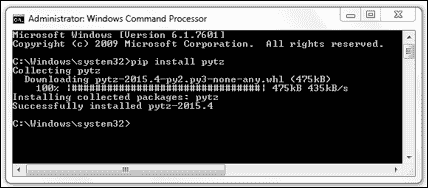

### 注

屏幕截图显示命令下载了`.whl`格式。如果您没有这样做，您可能必须首先安装 Python`wheel`模块。

这将 Python`pytz`模块安装到`site-packages`文件夹中，因此现在我们可以从 Python GUI 代码导入此模块。

我们可以通过运行以下代码列出所有现有时区，这些代码将在`ScrolledText`小部件中显示时区。首先，我们在 GUI 中添加一个新的`Button`小部件。

```py
import pytz
class OOP():

    # TZ Button callback
    def allTimeZones(self):
        for tz in all_timezones:
            self.scr.insert(tk.INSERT, tz + '\n')

    def createWidgets(self):
        # Adding a TZ Button
        self.allTZs = ttk.Button(self.widgetFrame, 
                                 text=self.i18n.timeZones, 
                                 command=self.allTimeZones)
        self.allTZs.grid(column=0, row=9, sticky='WE')
```

点击我们新的`Button`小部件，结果如下：

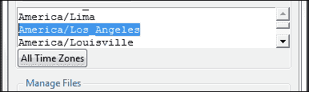

安装 tzlocal Python 模块后，可以通过运行以下代码打印当前区域设置：

```py
    # TZ Local Button callback
    def localZone(self):   
        from tzlocal import get_localzone
        self.scr.insert(tk.INSERT, get_localzone())

    def createWidgets(self):
        # Adding local TZ Button
        self.localTZ = ttk.Button(self.widgetFrame, 
                                  text=self.i18n.localZone, 
                                  command=self.localZone
        self.localTZ.grid(column=1, row=9, sticky='WE')
```

我们已经在`Resources.py`中国际化了我们两个新动作`Buttons`的字符串。

英文版：

```py
        self.timeZones = "All Time Zones"
        self.localZone = "Local Zone"
```

德文版：

```py
        self.timeZones = "Alle Zeitzonen"
        self.localZone = "Lokale Zone"
```

点击我们的新按钮现在告诉我们我们在哪个时区（嘿，我们不知道，不是吗…）。

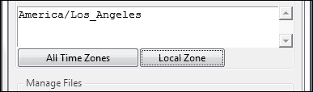

我们现在可以把当地时间转换成不同的时区。让我们以美国东部标准时间为例。

通过改进现有代码，我们在未使用的标签 2 中显示当前的本地时间。

```py
import pytz
from datetime import datetime
class OOP():
    # Format local US time
    def getDateTime(self):
        fmtStrZone = ""%Y-%m-%d %H:%M:%S""
        self.lbl2.set(datetime.now().strftime(fmtStrZone))

        # Place labels into the container element
        ttk.Label(labelsFrame, text=self.i18n.chooseNumber).grid(column=0, row=0)
        self.lbl2 = tk.StringVar()
        self.lbl2.set(self.i18n.label2)
        ttk.Label(labelsFrame, textvariable=self.lbl2).grid(column=0, row=1)

        # Adding getTimeTZ Button
        self.dt = ttk.Button(self.widgetFrame, text=self.i18n.getTime, command=self.getDateTime)
        self.dt.grid(column=2, row=9, sticky='WE')
```

当我们运行代码时，我们的国际化标签 2（德语显示为`Etikette 2`）将显示当前的本地时间。

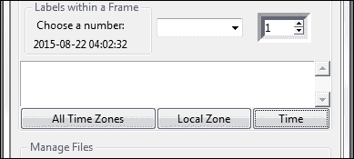

我们现在可以将本地时间更改为美国东部时间，首先将其转换为**协调世界时**（**UTC**，然后应用导入的`pytz`模块的`timezone`功能。

```py
import pytz
class OOP():
    # Format local US time with TimeZone info
    def getDateTime(self):
        fmtStrZone = "%Y-%m-%d %H:%M:%S %Z%z"
        # Get Coordinated Universal Time
        utc = datetime.now(timezone('UTC'))
        print(utc.strftime(fmtStrZone))

        # Convert UTC datetime object to Los Angeles TimeZone
        la = utc.astimezone(timezone('America/Los_Angeles'))
        print(la.strftime(fmtStrZone))

        # Convert UTC datetime object to New York TimeZone
        ny = utc.astimezone(timezone('America/New_York'))
        print(ny.strftime(fmtStrZone))

        # update GUI label with NY Time and Zone
        self.lbl2.set(ny.strftime(fmtStrZone))
```

单击现在重命名为“纽约”的按钮将产生以下输出：

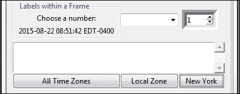

我们的标签 2 已使用纽约的当前时间进行了更新，我们正在使用美国日期格式字符串将洛杉矶和纽约的 UTC 时间及其各自的时区转换（相对于 UTC 时间）打印到 Eclipse 控制台。

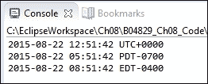

### 注

UTC从不遵守夏令时。在**东部夏时制**（**东部夏令时**）期间，UTC 比当地时间提前四小时；在**标准时间**（**东部夏令时**期间，UTC 比当地时间提前五小时。

## 它是如何工作的。。。

为了本地化日期和时间信息，我们首先需要将本地时间转换为 UTC 时间。然后我们应用`timezone`信息，使用`pytz`Python 时区模块中的`astimezone`函数将其转换为全球任何时区！

在此配方中，我们将美国西海岸的当地时间转换为 UTC，然后在 GUI 的标签 2 中显示美国东海岸时间。

# 为国际化做 GUI 准备

在这个配方中，我们将通过意识到并非所有的事情都像将英语翻译成外语时所期望的那样容易，从而为我们的 GUI 国际化做好准备。

我们还有一个问题需要解决，那就是如何正确显示来自外语的非英语 Unicode 字符。

有人可能会认为，Python 3 会自动处理德语字母、ö和üUnicode umlaut 字符的显示，但事实并非如此。

## 准备好了吗

我们将继续使用在最近几章中开发的 Python GUI。首先，我们将在`GUI.py`初始化代码中将默认语言更改为德语。

我们通过取消对行`self.i18n = I18N('de')`的注释来实现这一点。

## 怎么做。。。

当我们使用 umlaut 字符将单词`Ueber`改为正确的德语`Űber`时，EclipsePydev 插件并不太高兴。


我们得到一条错误消息，这有点令人困惑，因为当我们从 EclipsePydev 控制台中运行同一行代码时，我们得到了预期的结果。

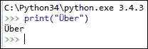

当我们要求 Python 默认编码时，我们得到了预期的结果，即 UTF-8。


### 注

当然，我们总是可以求助于 Unicode 的直接表示。

使用Windows 的内置字符映射，我们可以找到 umlaut 字符的 Unicode 表示形式，即 U+00DC 表示大写字母 U 和 umlaut。


虽然这种变通方法确实很难看，但它确实奏效了。我们不需要输入文字字符Ü，而是可以传入\u00DC 的 Unicode 以在 GUI 中正确显示该字符。


我们也可以只接受使用 Eclipse 的 PyDev 将默认编码从 Cp1252 更改为 UTF-8，但我们可能并不总是得到这样做的提示。

相反，我们可能会看到显示以下错误消息：

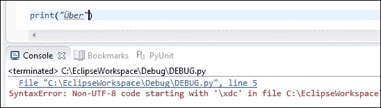

解决此问题的方法是将 PyDev 项目的**文本文件编码**属性更改为 UTF-8。


更改 PyDev 默认编码后，我们现在可以显示那些德语 umlaut 字符。我们还更新了标题以使用正确的德语字符。


## 它是如何工作的。。。

国际化和使用外语 Unicode 字符通常不像我们希望的那样简单。有时，我们必须找到解决办法，通过 Python 使用直接表示法通过在`\u`前面加上前缀来表达 Unicode 字符，这样做就可以了。

在其他时候，我们只需要找到开发环境的设置来进行调整。

# 如何以敏捷的方式设计 GUI

现代敏捷软件开发的设计和编码方法来自于软件专业人员的经验教训。此方法适用于 GUI 和任何其他代码。敏捷软件开发的关键之一是不断应用的重构过程。

重构代码如何帮助我们进行软件开发工作的一个实际例子是，首先使用函数实现一些简单的功能。

随着代码复杂性的增加，我们可能希望将函数重构为类的方法。这种方法将使我们能够删除全局变量，并且在类中放置方法的位置上更加灵活。

虽然我们代码的功能没有改变，但结构已经改变。

在这个过程中，我们编码、测试、重构，然后再次测试。我们在很短的周期内完成这项工作，通常从实现某些功能所需的最少代码开始。

### 注

测试驱动的软件开发是敏捷开发方法的一种特殊风格。

虽然我们的 GUI 工作得很好，但我们的主要代码的复杂性一直在增加，并且开始变得有点难以维护代码的概述。

这意味着我们需要重构代码。

## 准备好了吗

我们将重构在前几章中创建的 GUI。我们将使用 GUI 的英文版本。

## 怎么做。。。

在上一个配方中将 GUI 国际化时，我们已经列出了 GUI 显示的所有名称。这是重构代码的良好开端。

### 注

重构是改进现有代码的结构、可读性和可维护性的过程。我们没有添加新功能。

在前面的章节和方法中，我们一直在以“从上到下”的瀑布式开发方法扩展 GUI，在现有代码的顶部添加`import`，在底部添加代码。

虽然这在查看代码时很有用，但现在看起来有点凌乱，我们可以对此进行改进，以帮助将来的开发。

让我们先清理一下我们的`import`语句部分，它现在看起来是这样的：

```py
#======================
# imports
#======================
import tkinter as tk
from tkinter import ttk
from tkinter import scrolledtext
from tkinter import Menu
from tkinter import Spinbox
import B04829_Ch08_ToolTip as tt
from threading import Thread
from time import sleep
from queue import Queue
from tkinter import filedialog as fd
from os import path 
from tkinter import messagebox as mBox
from B04829_Ch08_MySQL import MySQL
from B04829_Ch08_Resources import I18N
from datetime import datetime
from pytz import all_timezones, timezone

# Module level GLOBALS
GLOBAL_CONST = 42
```

通过简单地对相关导入进行分组，我们可以减少代码行的数量，从而提高导入的可读性，使它们看起来不那么拥挤。

```py
#======================
# imports
#======================
import tkinter as tk
from tkinter import ttk, scrolledtext, Menu, Spinbox, filedialog as fd, messagebox as mBox
from queue import Queue
from os import path 
import B04829_Ch08_ToolTip as tt
from B04829_Ch08_MySQL import MySQL
from B04829_Ch08_Resources import I18N
from B04829_Ch08_Callbacks_Refactored import Callbacks
from B04829_Ch08_Logger import Logger, LogLevel

# Module level GLOBALS
GLOBAL_CONST = 42
```

我们可以通过将回调方法分解到它们自己的模块中来进一步重构代码。这通过将不同的导入语句分离到所需的模块中来提高可读性。

让我们将我们的`GUI.py`重命名为`GUI_Refactored.py`并创建一个新模块，我们将其命名为`Callbacks_Refactored.py`。

这给了我们这种新的架构。

```py
#======================
# imports
#======================
import tkinter as tk
from tkinter import ttk, scrolledtext, Menu, Spinbox, \
                    filedialog as fd, messagebox as mBox
from queue import Queue
from os import path 
import B04829_Ch08_ToolTip as tt
from B04829_Ch08_MySQL import MySQL
from B04829_Ch08_Resources import I18N
from B04829_Ch08_Callbacks_Refactored import Callbacks

# Module level GLOBALS
GLOBAL_CONST = 42

class OOP():
    def __init__(self): 

        # Callback methods now in different module
        self.callBacks = Callbacks(self)
```

请注意，在调用`Callbacks`初始值设定项时，我们是如何传入自己的 GUI 类（`self`的实例的。

我们新的`Callbacks`课程如下：

```py
#======================
# imports
#======================
import tkinter as tk
from time import sleep
from threading import Thread
from pytz import all_timezones, timezone
from datetime import datetime

class Callbacks():
    def __init__(self, oop):
        self.oop = oop

    def defaultFileEntries(self): 
        self.oop.fileEntry.delete(0, tk.END)
        self.oop.fileEntry.insert(0, 'Z:\\')        # bogus path
        self.oop.fileEntry.config(state='readonly')         
        self.oop.netwEntry.delete(0, tk.END)
        self.oop.netwEntry.insert(0, 'Z:\\Backup')  # bogus path

    # Combobox callback 
    def _combo(self, val=0):
        value = self.oop.combo.get()
        self.oop.scr.insert(tk.INSERT, value + '\n')
```

在我们新类的初始值设定项中，传入的 GUI 实例以`self.oop`的名称保存，并在整个新 Python 类模块中使用。

运行重构的 GUI 代码仍然有效。我们只是提高了代码的可读性，降低了代码的复杂性，为进一步的开发工作做准备。

## 它是如何工作的。。。

我们首先通过对相关的导入语句进行分组来提高代码的可读性。接下来，我们将回调方法分解为它们自己的类和模块，以进一步降低代码的复杂性。

我们已经采用了相同的 OOP 方法，将`ToolTip`类驻留在其自己的模块中，并在前面的方法中将所有 GUI 字符串国际化。

在这个方法中，我们通过将自己的实例传递到 GUI 所依赖的回调方法类中，进一步进行了重构。

### 注

现在我们更好地理解了模块化软件开发方法的价值，我们很可能在未来的软件设计中从这种方法开始。

# 我们需要测试 GUI 代码吗？

测试我们的软件是编码阶段以及发布 service Pack 或 bug 修复时的一项重要活动。

有不同级别的测试。第一个层次是开发人员测试，它通常从编译器或解释器开始，不允许我们运行错误代码，迫使我们在单个方法层次上测试代码的一小部分。

这是第一级防御。

防御性编码的第二个层次是当我们的源代码控制系统告诉我们一些需要解决的冲突时，不允许我们签入修改过的代码。

当我们在一个专业的开发团队中工作时，这是非常有用和绝对必要的。源代码控制系统是我们的朋友，它指出了我们自己或其他开发人员对某个特定分支或树顶所做的更改，并告诉我们本地版本的代码已经过时，并且在我们将代码提交到存储库之前需要解决一些冲突。

本部分假设您使用源代码管理系统来管理和存储代码。示例包括 git、mercurial、svn 和其他几种。Git 是一种非常流行的源代码管理，它对单个用户是免费的。

第三个级别是 API 级别，我们通过只允许通过发布的接口与代码交互来封装代码未来可能发生的更改。

### 注

请参阅第 17 页*设计模式*中的“程序到接口，而不是实现”。

另一个测试级别是集成测试，当我们最终构建的桥梁的一半与其他开发团队创建的另一半相遇时，这两个桥梁的高度不相同（比如，其中一半比另一半高出两米或两码…）。

然后是最终用户测试。虽然我们构建了他们指定的内容，但这并不是他们真正想要的。

哦，好吧……我想前面所有的例子都是我们需要在设计和实现阶段测试代码的正当理由。

## 准备好了吗

我们将测试我们在最近的食谱和章节中创建的 GUI。我们还将展示一些简单的例子，说明哪些地方可能出错，以及为什么我们需要继续测试代码和通过 API 调用的代码。

## 怎么做。。。

尽管许多经验丰富的开发人员在调试时在代码上撒满了`printf()`语句，但 21 世纪的许多开发人员已经习惯了现代 IDE 开发环境，这些环境可以有效地加快开发时间。

在本书中，我们将使用 Eclipse IDE 的 PyDev Python 插件。

若您刚刚开始在 PyDev 插件中使用类似 Eclipse 的 IDE，那个么一开始可能会有点不知所措。Python3 附带的 PythonIdle 工具还有一个更简单的调试器，您可能希望先了解一下。

无论何时代码出现错误，我们都必须对其进行调试。执行此操作的第一步是设置断点，然后逐行或逐方法逐步完成代码。

在代码顺利运行之前，进出代码是一项日常活动。

在 PythonGUI 编程中，首先可能出现错误的事情之一是缺少导入所需模块或导入现有模块。

下面是一个简单的例子：


我们正在尝试创建 tkinter 类的一个实例，但是事情并没有按照预期的那样进行。

好吧，我们只是忘记了导入模块，我们可以通过在类创建（import 语句所在的位置）上方添加一行 Python 代码来解决这个问题。

```py
#======================
# imports
#======================
import tkinter as tk
```

这是我们的开发环境为我们进行测试的一个例子。我们只需要进行调试和代码修复。

另一个与开发人员测试更密切相关的例子是，我们编写条件语句，并且在常规开发过程中，没有执行所有逻辑分支。

使用上一章中的示例，假设我们点击**获取报价**按钮，这是可行的，但我们从未点击**么迪报价**按钮。第一次单击按钮会创建所需的结果，但第二次单击按钮会引发一个异常（因为我们还没有实现这段代码，可能已经忘记了它）。

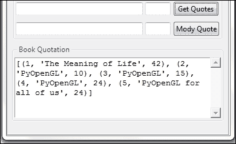

点击**Mody Quote**按钮创建以下结果：

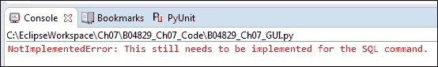

另一个潜在的 bug 区域是当函数或方法突然不再返回预期结果时。假设我们正在调用以下函数，该函数返回预期结果。


然后，有人犯了错误，我们不再得到以前的结果。


我们不是在乘法，而是在用传入数的幂来提高，结果不再是过去的样子。

### 注

在软件测试中，这种缺陷称为回归。

## 它是如何工作的。。。

在这个配方中，我们通过展示代码可能出错和引入软件缺陷（也称 bug）的几个示例，强调了软件开发生命周期的几个阶段中软件测试的重要性。

# 设置调试表

在现代**集成开发环境**（**IDEs**）中，如 Eclipse 中的PyDev 插件或其他 IDE（如 NetBeans），我们可以设置调试手表，以在代码执行期间监控 GUI 的状态。

这与 Visual Studio 的 Microsoft IDE 以及 Visual Studio.NET 的最新版本非常相似。

### 注

设置调试表是帮助我们进行开发工作的一种非常方便的方法。

## 准备好了吗

在此配方中，我们将重用在早期配方中开发的 Python GUI。我们正在逐步完成之前开发的代码并设置调试手表。

## 怎么做。。。

### 注

虽然此方法适用于基于 Java 的 EclipseIDE 中的 PyDev 插件，但其原理也适用于许多现代 IDE。

我们希望放置断点的第一个位置是通过调用 tkinter 主事件循环使 GUI 可见的位置。

左边的绿色气球符号是 PyDev/Eclipse 中的断点。当我们在调试模式下执行代码时，一旦执行到达断点，代码的执行就会停止。此时，我们可以看到当前范围内所有变量的值。我们还可以在其中一个调试器窗口中键入表达式，该窗口将执行这些表达式，并向我们显示结果。如果结果是我们想要的，我们可能会决定使用我们刚刚学到的内容更改代码。

我们通常通过点击 IDE 工具栏中的图标或使用键盘快捷键（如按*F5*进入代码，*F6*跳转，*F7*跳出当前方法）逐步完成代码。


把断点放在我们所做的地方，然后进入这段代码，结果是一个问题，因为我们最终得到了一些我们现在真的不想调试的低级 tkinter 代码。我们通过单击跳出工具栏图标（项目菜单右下方的第三个黄色箭头）或按*F7*（假设我们在 Eclipse 中使用 PyDev）退出低级 tkinter 代码。

我们通过单击屏幕截图右侧的 bug 工具栏图标开始调试会话。如果我们在没有调试的情况下执行，我们会单击带有白色三角形的绿色圆圈，这是 bug 图标右侧的图标。


更好的办法是将断点放在更靠近我们自己的代码的位置，以便观察我们自己的一些 Python 变量的值。

在现代 GUI 的事件驱动世界中，我们必须将断点放在事件期间调用的代码上，例如按钮单击。

目前，我们的主要功能之一存在于按钮点击事件中。当我们单击标记为**纽约**的按钮时，我们会创建一个事件，然后在 GUI 中发生一些事情。

让我们在**纽约**按钮回调方法上放置一个断点，我们将其命名为`getDateTime()`。

当我们现在运行调试会话时，我们将在断点处停止，然后我们可以启用范围内变量的监视。

在 Eclipse 中使用 PyDev，我们可以右键单击一个变量，然后从弹出菜单中选择 watch 命令。变量的名称、类型和当前值将显示在下一个屏幕截图中显示的表达式调试窗口中。我们也可以直接在“表达式”窗口中键入。

我们关注的变量不限于简单的数据类型。我们可以观看类实例、列表、字典等。

在查看这些更复杂的对象时，我们可以在“表达式”窗口中展开它们，并深入到类实例、字典等的所有值中。

我们通过单击所关注变量左侧的三角形来完成此操作，该三角形显示在每个变量旁边的**名称**列的最左侧。

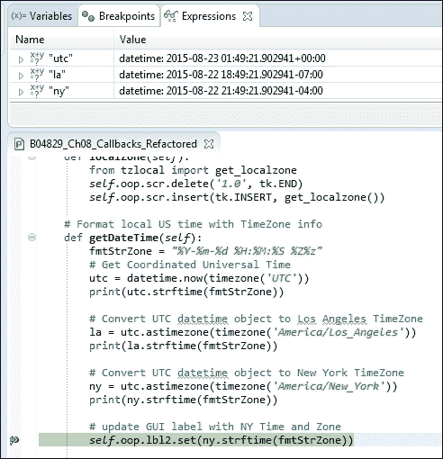

当我们打印出不同时区位置的值时，从长远来看，设置调试手表更方便、更高效。我们不必用老式的 C 风格的`printf()`语句把代码弄得乱七八糟。

### 注

如果您有兴趣学习如何使用 PyDev 插件安装 Eclipse for Python，那么有一个很棒的教程可以让您开始安装所有必要的免费软件，然后通过创建一个简单的、可运行的 Python 程序，向您介绍 Eclipse 中的 PyDev。[http://www.vogella.com/tutorials/Python/article.html](http://www.vogella.com/tutorials/Python/article.html)

## 它是如何工作的。。。

我们使用 21 世纪的现代集成开发环境（IDE），这些环境免费提供，帮助我们创建可靠的代码。

这个食谱展示了如何设置调试手表，这是每个开发人员技能集中的一个基本工具。即使在不查找 bug 的情况下，也要逐步检查自己的代码，这样可以确保我们理解代码，并通过重构改进代码。

下面是我读的第一本编程书中的一段话，*用 Java 思考*，由 Bruce Eckel 撰写。

|   | *“抵制匆忙的冲动，它只会让你慢下来。”* |   |
|   | --*布鲁斯·埃克尔* |

近二十年后，这一建议通过了时间的考验。

### 注

调试手表帮助我们创建可靠的代码，而不是浪费时间。

# 配置不同的调试输出级别

在这个配方中，我们将配置不同的调试级别，我们可以在运行时选择和更改这些级别。这允许我们在调试代码时控制要深入代码的程度。

我们将创建两个新的 Python 类，并将它们放在同一个模块中。

我们将使用四种不同的日志记录级别，并将调试输出写入我们将创建的日志文件。如果日志文件夹不存在，我们也将自动创建它。

日志文件的名称是正在执行的脚本的名称，它是我们重构的`GUI.py`。我们还可以通过向 logger 类的初始值设定项传递完整路径来为日志文件选择其他名称。

## 准备好了吗

我们将继续使用上一个配方中经过重构的`GUI.py`代码。

## 怎么做。。。

首先，我们创建一个新的 Python 模块，在其中放置两个新的`classes`。第一个`class`非常简单，定义了日志记录级别。这基本上是一个`enumeration`。

```py
class LogLevel:
'''Define logging levels.'''
    OFF     = 0
    MINIMUM = 1
    NORMAL  = 2
    DEBUG   = 3
```

第二个`class`使用传入的文件名完整路径创建日志文件，并将其放入`logs`文件夹中。第一次运行时，`logs`文件夹可能不存在，因此代码会自动创建该文件夹。

```py
class Logger:   
    ''' Create a test log and write to it. '''     
    #-------------------------------------------------------
    def __init__(self, fullTestName, loglevel=LogLevel.DEBUG):
        testName = os.path.splitext(os.path.basename(fullTestName))[0]
        logName  = testName  + '.log'    

        logsFolder = 'logs'          
        if not os.path.exists(logsFolder):                     
            os.makedirs(logsFolder, exist_ok = True)

        self.log = os.path.join(logsFolder, logName)           
        self.createLog()

        self.loggingLevel = loglevel
        self.startTime    = time.perf_counter()

    #------------------------------------------------------
    def createLog(self):    
        with open(self.log, mode='w', encoding='utf-8') as logFile:
            logFile.write(self.getDateTime() + 
                          '\t\t*** Starting Test ***\n')
        logFile.close()
```

为了写入日志文件，我们使用`writeToLog()`方法。在该方法中，我们要做的第一件事是检查消息的日志记录级别是否高于我们设置所需日志记录输出的限制。如果消息的级别较低，我们将丢弃它并立即从方法返回。

如果消息具有我们想要显示的日志级别，那么我们会检查它是否以换行符开头，如果是，我们会使用 Python 的切片运算符（`msg = msg[1:]`对从索引 1 开始的方法进行切片，从而丢弃换行符。

然后我们在日志文件中写入一行，包括当前日期时间戳、两个制表符空格、消息，并以换行符结尾。

```py
    def writeToLog(self, msg='', loglevel=LogLevel.DEBUG): 
        # control how much gets logged
        if loglevel > self.loggingLevel:
            return

        # open log file in append mode 
        with open(self.log, mode='a', encoding='utf-8') as logFile:
            msg = str(msg)
            if msg.startswith('\n'):
                msg = msg[1:]
            logFile.write(self.getDateTime() + '\t\t' + msg + '\n')

        logFile.close()
```

现在我们可以导入新的 Python 模块，在 GUI 代码的`__init__`部分中，我们可以创建`Logger`类的实例。

```py
from os import path 
from B04829_Ch08_Logger import Logger
class OOP():
    def __init__(self): 
        # create Logger instance
        fullPath = path.realpath(__file__)
        self.log = Logger(fullPath)
        print(self.log)
```

我们正在通过`path.realpath(__file__)`检索运行 GUI 脚本的完整路径，并将其传递给`Logger`类的初始值设定项。如果`logs`文件夹不存在，它将由我们的 Python 代码自动创建。

这将产生以下结果：

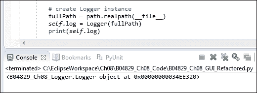

前面的屏幕截图显示我们创建了一个新的`Logger`类的实例，下面的屏幕截图显示`logs`文件夹和日志都已创建。


打开日志时，可以看到当前日期和时间以及默认字符串已写入日志。

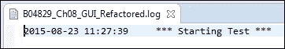

## 它是如何工作的。。。

在这个配方中，我们创建了自己的日志类。虽然 Python 附带了一个日志模块，但创建自己的日志模块非常容易，这使我们能够绝对控制日志格式。当我们将自己的日志输出与 MS Excel 或 Matplotlib 结合起来时，这是非常有用的，我们在上一章的前几节中探讨了 Matplotlib。

在下一个配方中，我们将使用 Python 的内置`__main__`功能来使用我们刚刚创建的四个不同日志记录级别。

# 使用 Python 的“主”部分创建自检代码

Python附带了一个非常好的特性，使每个模块都能够进行自检。使用此功能是确保代码更改不会破坏现有代码的一个好方法，`__main__`自测部分可以作为每个模块工作方式的文档。

### 注

几个月或几年后，我们有时会忘记我们的代码在做什么，因此在代码中编写解释确实是一个很大的帮助。

如果可能的话，最好总是在每个 Python 模块中添加一个自测试部分。有时这是不可能的，但在大多数模块中，这是可能的。

## 准备好了吗

我们将扩展上一个配方，因此，为了理解这个配方中的代码在做什么，我们必须首先阅读和理解上一个配方的代码。

## 怎么做。。。

首先，我们将通过将这个自测试部分添加到我们的`Resources.py`模块来探索 Python`__main__`自测试部分的功能。每当我们运行一个模块，该模块的自测部分位于该模块的底部，当该模块自行执行时，该代码就会运行。

当该模块从其他模块导入使用时，`__main__`自检部分的代码不执行。

下面的屏幕截图中也显示了该代码：

```py
if __name__ == '__main__':
    language = 'en'
    inst = I18N(language)
    print(inst.title)

    language = 'de'
    inst = I18N(language)
    print(inst.title)
```

在添加了自测试部分之后，我们现在可以自己运行这个模块，它创建了有用的输出，同时向我们展示了我们的代码按预期工作。


我们首先以英语作为要在 GUI 中显示的语言传递，然后以德语作为 GUI 将显示的语言传递。

我们正在打印 GUI 的标题，以显示 Python 模块按照我们的预期工作。

### 注

下一步是使用我们在前面的配方中创建的日志功能。

为此，我们首先在重构的`GUI.py`模块中添加`__main__`自检部分，然后验证是否创建了`Logger`类的实例。

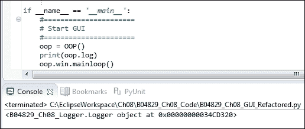

我们下一步使用所示的命令写入日志文件。我们将日志记录级别设计为默认记录每条消息，这是调试级别，因此，我们不需要更改任何内容。我们只是将要记录的消息传递给`writeToLog`方法。

```py
if __name__ == '__main__':
#======================
# Start GUI
#======================
oop = OOP()
    print(oop.log)
    oop.log.writeToLog('Test message')
    oop.win.mainloop()
```

这会写入我们的日志文件，如以下日志屏幕截图所示：

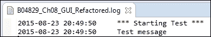

现在，我们可以通过向日志语句添加日志级别来控制日志记录，并设置希望输出的级别。让我们将此功能添加到`Callbacks.py`模块中的`getDateTime`方法中的纽约按钮回调方法中。

我们使用不同的调试级别将前面的`print`语句更改为`log`语句。

在`GUI.py`中，我们从 logger 模块导入两个新类。

```py
from B04829_Ch08_Logger import Logger, LogLevel
```

接下来，我们创建这些类的本地实例。

```py
# create Logger instance
fullPath = path.realpath(__file__)
self.log = Logger(fullPath)

# create Log Level instance
self.level = LogLevel()
```

由于我们正在将 GUI 类的实例传递给`Callbacks.py`初始值设定项，因此我们可以根据我们创建的`LogLevel`类使用日志级别约束。

```py
    # Format local US time with TimeZone info
    def getDateTime(self):
        fmtStrZone = "%Y-%m-%d %H:%M:%S %Z%z"
        # Get Coordinated Universal Time
        utc = datetime.now(timezone('UTC'))
        self.oop.log.writeToLog(utc.strftime(fmtStrZone), 
                                self.oop.level.MINIMUM)

        # Convert UTC datetime object to Los Angeles TimeZone
        la = utc.astimezone(timezone('America/Los_Angeles'))
        self.oop.log.writeToLog(la.strftime(fmtStrZone), 
                                self.oop.level.NORMAL)

        # Convert UTC datetime object to New York TimeZone
        ny = utc.astimezone(timezone('America/New_York'))
        self.oop.log.writeToLog(ny.strftime(fmtStrZone), 
                                self.oop.level.DEBUG)

        # update GUI label with NY Time and Zone
        self.oop.lbl2.set(ny.strftime(fmtStrZone))
```

当我们现在单击纽约按钮时，根据所选的日志记录级别，我们会得到写入日志文件的不同输出。默认日志记录级别为`DEBUG`，这意味着所有内容都会写入我们的日志。

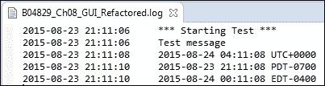

当我们更改日志记录级别时，我们可以控制写入日志的内容。我们通过调用`Logger`类的`setLoggingLevel`方法来实现这一点。

```py
    #----------------------------------------------------------------
    def setLoggingLevel(self, level):  
        '''change logging level in the middle of a test.''' 
        self.loggingLevel = level
```

在 GUI 的部分`__main__`中，我们将日志记录级别更改为`MINIMUM`，这导致写入日志文件的输出减少。

```py
if __name__ == '__main__':
#======================
# Start GUI
#======================
oop = OOP()
    oop.log.setLoggingLevel(oop.level.MINIMUM)
    oop.log.writeToLog('Test message')
    oop.win.mainloop()
```

现在，我们的日志文件不再显示`Test Message`，只显示满足设置日志级别的消息。


## 它是如何工作的。。。

在这个方法中，我们充分利用了 Python 内置的`__main__`自测试部分。我们介绍了自己的日志文件，同时介绍了如何创建不同的日志级别。

通过这样做，我们可以完全控制写入日志文件的内容。

# 使用单元测试创建健壮的 GUI

Python附带了一个内置的单元测试框架，在此配方中，我们将开始使用此框架测试 Python GUI 代码。

在开始编写单元测试之前，我们希望设计我们的测试策略。我们可以很容易地将单元测试与他们正在测试的代码混合，但是更好的策略是将应用程序代码与单元测试代码分离。

### 注

PyUnit 是根据所有其他 xUnit 测试框架的原理设计的。

## 准备好了吗

我们将测试我们在本章前面创建的国际化 GUI。

## 怎么做。。。

为了使用 Python 内置的单元测试框架，我们必须导入 Python`unittest`模块。让我们创建一个新模块，并将其命名为`UnitTests.py`。

我们首先导入`unittest`模块，然后创建我们自己的类，并在这个类中继承和扩展`unittest.TestCase`类。

最简单的代码如下所示：

```py
import unittest

class GuiUnitTests(unittest.TestCase):
    pass

if __name__ == '__main__':
    unittest.main()
```

代码还没有做很多工作，但是当我们运行它时，我们没有得到任何错误，这是一个好迹象。


实际上，我们确实得到了写入控制台的输出，表明我们成功地运行了零测试…

嗯，这个输出有点误导，因为到目前为止我们所做的只是创建一个不包含实际测试方法的类。

我们添加了执行实际单元测试的测试方法，方法是按照所有测试方法的默认命名，以单词“test”开头。这是一个可以更改的选项，但坚持这种命名约定似乎更容易、更清晰。

让我们添加一个测试方法来测试 GUI 的标题。这将验证通过传递预期参数，我们是否得到预期结果。

```py
import unittest
from B04829_Ch08_Resources import I18N

class GuiUnitTests(unittest.TestCase):

    def test_TitleIsEnglish(self):
        i18n = I18N('en')
        self.assertEqual(i18n.title, 
                       "Python Graphical User Interface")
```

我们正在从我们的`Resources.py`模块导入我们的`I18N`类，以英语作为显示在 GUI 中的语言进行传递。由于这是我们的第一次单元测试，我们也在打印标题结果，以确保我们知道我们得到了什么。接下来我们使用`unittest assertEqual`方法来验证我们的标题是否正确。

运行此代码会给我们一个**OK**，这意味着单元测试通过了。


机组测试运行成功，由一个点和“OK”字表示。如果它失败或出现错误，我们将不会得到点，而是一个“F”或“E”作为输出。

我们现在可以通过验证德国版 GUI 的标题来执行相同的自动单元测试检查。

我们只需复制、粘贴和修改代码。

```py
import unittest
from B04829_Ch08_Resources import I18N

class GuiUnitTests(unittest.TestCase):

    def test_TitleIsEnglish(self):
        i18n = I18N('en')
        self.assertEqual(i18n.title, 
                         "Python Graphical User Interface")

    def test_TitleIsGerman(self):
        i18n = I18N('en')           
        self.assertEqual(i18n.title, 
                         'Python Grafische Benutzeroberfl' 
                       + "\u00E4" + 'che')
```

现在，我们正在用两种语言测试国际化 GUI 标题，并在运行代码时得到以下结果：

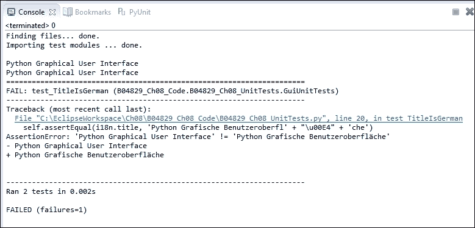

我们运行了两个单元测试，但我们没有得到 OK，而是失败了。怎么搞的？

我们的`assertion`在我们的 GUI 的德语版本中失败了…

在调试代码时，我们发现在单元测试代码的复制、粘贴和修改方法中，我们忘记了通过德语作为语言。我们可以很容易地解决这个问题。

```py
    def test_TitleIsGerman(self):
        # i18n = I18N('en')           # <= Bug in Unit Test
        i18n = I18N('de') 
        self.assertEqual(i18n.title, 
                         'Python Grafische Benutzeroberfl' 
                         + "\u00E4" + 'che')
```

当我们重新运行单元测试时，我们再次得到所有测试通过的预期结果。


### 注

单元测试代码是代码，也可能有 bug。

虽然编写单元测试的目的实际上是测试我们的应用程序代码，但我们必须确保我们的测试编写正确。来自**测试驱动开发**（**TDD**方法）的一种方法可能对我们有所帮助。

### 注

在 TDD 中，我们在实际编写应用程序代码之前开发单元测试。现在，如果一个测试通过了一个甚至不存在的方法，那么一定是出了问题。下一步是创建不存在的方法并确保它将失败。之后，我们可以编写使单元测试通过所需的最少代码量。

## 它是如何工作的。。。

在这个配方中，我们已经开始测试 Python GUI，用 Python 编写单元测试。我们已经看到 Python 单元测试代码只是代码，可能包含需要更正的错误。在下一个配方中，我们将扩展此配方的代码，并使用 EclipseIDE 的 PyDev 插件附带的图形单元测试运行程序。

# 如何使用 EclipsePydevIDE 编写单元测试

在之前的配方中，我们开始使用Python 的单元测试功能，在这个配方中，我们将通过进一步使用这个功能来确保 GUI 代码的质量。

我们将对 GUI 进行单元测试，以确保 GUI 显示的国际化字符串符合预期。

在前面的配方中，我们在单元测试代码中遇到了一些 bug，但是，通常情况下，我们的单元测试会发现由修改现有应用程序代码而不是单元测试代码引起的回归 bug。一旦我们验证了我们的单元测试代码是正确的，我们通常不会更改它。

### 注

我们的单元测试还可以作为我们期望代码执行的操作的文档。

默认情况下，Python 的单元测试是通过一个纹理单元测试运行程序执行的，我们可以在 Eclipse IDE 的 PyDev 插件中运行它。我们也可以从控制台窗口运行相同的单元测试。

除了本配方中的文本运行程序之外，我们还将探索 PyDev 的图形单元测试特性，该特性可以从 EclipseIDE 中使用。

## 准备好了吗

我们正在扩展前面的配方，在中，我们开始使用 Python 单元测试。

## 怎么做。。。

Python单元测试框架附带了所谓的 fixture。

关于测试夹具的描述，请参考以下 URL：

*   [https://docs.python.org/3.4/library/unittest.html](https://docs.python.org/3.4/library/unittest.html)
*   [https://en.wikipedia.org/wiki/Test_fixture](https://en.wikipedia.org/wiki/Test_fixture)
*   [http://www.boost.org/doc/libs/1_51_0/libs/test/doc/html/utf/user-guide/fixture.html](http://www.boost.org/doc/libs/1_51_0/libs/test/doc/html/utf/user-guide/fixture.html)

这意味着我们可以创建`setup()`和`teardown()`单元测试方法，以便在开始执行任何单个测试之前调用`setup()`方法，在每个单个单元测试结束时调用`teardown()`方法。

### 注

这个 fixture 功能为我们提供了一个非常受控的环境，我们可以在其中运行单元测试。它类似于使用前置和后置条件。

让我们设置单元测试环境。我们将创建一个新的测试类，它关注前面提到的代码的正确性。

### 注

`unittest.main()`运行以前缀“test”开头的任何方法，无论我们在给定 Python 模块中创建了多少类。

```py
import unittest
from B04829_Ch08_Resources import I18N
from B04829_Ch08_GUI_Refactored import OOP as GUI

class GuiUnitTests(unittest.TestCase):

    def test_TitleIsEnglish(self):
        i18n = I18N('en')
        self.assertEqual(i18n.title, 
                         "Python Graphical User Interface")

    def test_TitleIsGerman(self):
        # i18n = I18N('en')           # <= Bug in Unit Test
        i18n = I18N('de') 
        self.assertEqual(i18n.title, 
                         'Python Grafische Benutzeroberfl' 
                         + "\u00E4" + 'che')

class WidgetsTestsEnglish(unittest.TestCase):

    def setUp(self):
        self.gui = GUI('en')

    def tearDown(self):
        self.gui = None

    def test_WidgetLabels(self):
        self.assertEqual(self.gui.i18n.file, "File")
        self.assertEqual(self.gui.i18n.mgrFiles, ' Manage Files ')
        self.assertEqual(self.gui.i18n.browseTo, 
                                            "Browse to File...")
if __name__ == '__main__':
    unittest.main()
```

此创建以下输出：


前面的单元测试代码显示，我们可以创建多个单元测试类，通过调用`unittest.main`它们都可以在同一个模块中运行。

它还显示了`setup()`方法在单元测试报告的输出中不算为测试（测试计数为 3），同时，它完成了预期的工作，因为我们现在可以从单元测试方法中访问类实例变量`self.gui`。

我们感兴趣的是测试所有标签的正确性，尤其是在我们对代码进行更改时捕获 bug。

如果我们已经将字符串从我们的应用程序代码复制并粘贴到测试代码中，它将通过点击单元测试框架按钮捕获任何意外的更改。

我们还想测试在任何语言中调用任何`Radiobutton`小部件都会导致`labelframe`小部件`text`被更新。为了自动测试这一点，我们必须做两件事。

首先，我们必须检索`labelframe text`小部件的值，并将该值分配给我们命名为`labelFrameText`的变量。我们必须使用以下语法，因为此小部件的属性是通过字典数据类型传入和检索的：

```py
self.gui.widgetFrame['text']
```

我们现在可以通过编程方式单击其中一个 Radiobutton 小部件来验证默认文本，然后验证国际化版本。

```py
class WidgetsTestsGerman(unittest.TestCase):

    def setUp(self):
        self.gui = GUI('de')

    def test_WidgetLabels(self):
        self.assertEqual(self.gui.i18n.file, "Datei")
        self.assertEqual(self.gui.i18n.mgrFiles, 
                                        ' Dateien Organisieren ')
        self.assertEqual(self.gui.i18n.browseTo, 
                                        "Waehle eine Datei... ")

    def test_LabelFrameText(self):
        labelFrameText = self.gui.widgetFrame['text']
        self.assertEqual(labelFrameText, " Widgets Rahmen ")
        self.gui.radVar.set(1)
        self.gui.callBacks.radCall()
        labelFrameText = self.gui.widgetFrame['text']
        self.assertEqual(labelFrameText, 
                                    " Widgets Rahmen in Gold")
```

在验证默认值`labelFrameText`之后，我们通过编程将单选按钮设置为索引 1，然后通过编程调用单选按钮的回调方法。

```py
        self.gui.radVar.set(1)
        self.gui.callBacks.radCall()
```

### 注

这与在 GUI 中单击单选按钮基本相同，但我们通过单元测试中的代码来执行此按钮单击事件。

然后我们验证`labelframe`小部件中的文本是否已按预期更改。

当使用 Python PyDev 插件在 Eclipse 中运行单元测试时，我们会将以下输出写入 Eclipse 控制台。


在命令提示符下运行时，一旦导航到代码当前所在的文件夹，就会得到类似的输出。

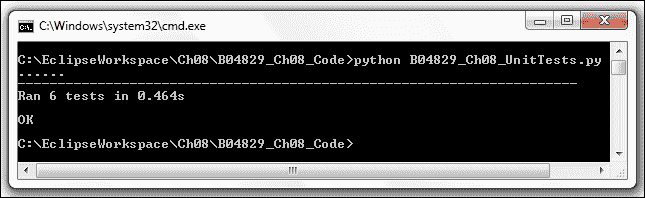

使用 Eclipse，我们还可以选择运行单元测试，不是作为一个简单的 Python 脚本，而是作为一个 Python 单元测试脚本，它为我们提供了一些丰富多彩的输出，而不是旧 DOS 提示符的黑白世界。

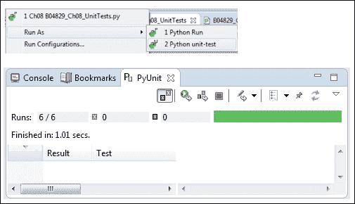

单元测试结果栏为绿色，表示我们所有的单元测试都通过了。前面的屏幕截图还显示 GUI 测试运行程序比文本测试运行程序慢得多：1.01 秒，而 Eclipse 中为 0.466 秒。

## 它是如何工作的。。。

我们通过测试`labels`，以编程方式调用`Radiobutton`，然后在单元测试中验证`labelframe`小部件的相应`text`属性是否已按预期更改，从而扩展了单元测试代码。我们测试了两种不同的语言。

然后，我们继续使用内置的 Eclipse/PyDev 图形单元测试运行程序。