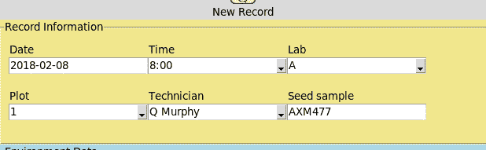

# 十、使用 SQL 改进数据存储

几周过去了，实验室里出现了一个日益严重的问题：CSV 文件无处不在！冲突的副本、丢失的文件、非数据录入人员更改的记录以及其他与 CSV 相关的挫折困扰着项目。很明显，单独的 CSV 文件不能作为存储实验数据的方式。需要更好的东西。

该设施有一台安装了 PostgreSQL 数据库的旧 Linux 服务器。已要求您更新程序，使其将数据存储在 PostgreSQL 数据库中，而不是 CSV 文件中。这将是对您的应用的重大更新！

在本章中，您将学习以下主题：

*   安装和配置 PostgreSQL 数据库系统
*   在数据库中结构化数据以获得良好的性能和可靠性
*   SQL 查询的基础知识
*   使用`psycopg2`库将您的程序连接到 PostgreSQL

# PostgreSQL

PostgreSQL（通常发音为 post-gress）是一个免费、开源、跨平台的关系数据库系统。它作为网络服务运行，您可以使用客户端程序或软件库与之通信。在撰写本文时，该项目刚刚发布了 10.0 版。

虽然 ABQ 提供了一个已经安装和配置的 PostgreSQL server，但出于开发目的，您需要在工作站上下载并安装该软件。

Shared production resources such as databases and web services should never be used for testing or development. Always set up a separate development copy of these resources on your own workstation or a separate server machine.

# 安装和配置 PostgreSQL

要下载 PostgreSQL，请访问[https://www.postgresql.org/download/](https://www.postgresql.org/download/) 。EnterpriseDB 公司为 Windows、macOS 和 Linux 提供安装程序，该公司是一家为 PostgreSQL 提供付费支持的商业实体。这些包包括服务器、命令行客户机和 pgAdmin 图形客户机，它们都在一个包中。

要安装软件，请使用具有管理权限的帐户启动安装程序，并按照安装向导中的屏幕进行操作。

安装后，启动 pgAdmin 并通过选择 Object | create | Login/Group Role 为自己创建一个新的管理员用户。确保访问特权选项卡以检查超级用户，访问定义选项卡以设置密码。然后，通过选择 Object | create | database 创建一个数据库。确保将您的用户设置为所有者。要在数据库上运行 SQL 命令，请选择数据库并单击工具|查询工具。

喜欢命令行的 MacOS 或 Linux 用户也可以使用以下命令：

```py
sudo -u postgres createuser -sP myusername
sudo -u postgres createdb -O myusername mydatabasename
psql -d mydatabasename -U myusername
```

Although Enterprise DB provides binary installers for Linux, most Linux users will prefer to use packages supplied by their distribution. You may end up with a slightly older version of PostgreSQL, but that won't matter for most basic use cases. Be aware that pgAdmin is usually part of a separate package, and that the latest version (pgAdmin 4) may not be available. Regardless, you should have no trouble following this chapter with the older version.

# 连接 psycopg2

为了从我们的应用进行 SQL 查询，我们需要安装一个 Python 库，它可以直接与我们的数据库通信。最受欢迎的选择是`psycopg2`。`psycopg2`库不是 Python 标准库的一部分。您可以在[找到最新的安装说明 http://initd.org/psycopg/docs/install.html](http://initd.org/psycopg/docs/install.html) ；然而，首选方法是使用`pip`。

对于 Windows、macOS 和 Linux，应使用以下命令：

```py
pip install --user psycopg2-binary
```

如果这不起作用，或者您希望从源代码处安装，请查看网站上的要求。`psycopg2`库是用 C 编写的，而不是 Python，因此它需要一个 C 编译器和一些其他开发包。Linux 用户通常可以从发行版的软件包管理系统安装`psycopg2`。我们将在本章后面深入讨论`psycopg2`的用法。

# SQL 和关系数据库基础

在我们开始将 PostgreSQL 与 Python 结合使用之前，您至少需要对 SQL 有一个基本的了解。如果你已经有了，你可以跳到下一节；否则，请准备一个关于关系数据库和 SQL 的超短速成课程。

三十多年来，关系数据库系统一直是存储业务数据的事实标准。在使用**结构化查询语言**（**SQL**）与它们交互后，它们通常被称为**SQL 数据库**。

SQL 数据库由表组成。表类似于我们的 CSV 文件，因为它有表示单个项的行和表示与每个项关联的数据值的列。SQL 表与我们的 CSV 文件有一些重要的区别。首先，为表中的每一列指定一个严格执行的数据类型；正如 Python 在尝试将`abcd`用作`int`时会产生错误一样，如果您尝试将字母插入数字列或其他非字符串列，SQL 数据库也会抱怨。SQL 数据库通常支持文本、数字、日期和时间、布尔值、二进制数据等数据类型。

SQL 表还可以具有约束，这进一步加强了插入到表中的数据的有效性。例如，可以为一个列指定一个唯一约束，该约束防止两行具有相同的值，或者为一个非空约束，该约束意味着每一行必须具有一个值。

SQL 数据库通常包含许多表；这些表可以连接在一起以表示更复杂的数据结构。通过将数据分解为多个链接表，它可以以比我们的二维明文 CSV 文件更高效、更具弹性的方式存储。

# 基本 SQL 操作

SQL 是一种功能强大、表达能力强的语言，用于对表格数据进行大规模操作，但基本知识可以很快掌握。SQL 作为单个查询执行，这些查询定义或操作数据库中的数据。不同的关系数据库产品之间的 SQL 方言有所不同，但大多数都支持 ANSI/ISO 标准 SQL 进行核心操作。虽然在本章中我们将使用 PostgreSQL，但我们编写的大多数 SQL 语句都可以移植到不同的数据库。

要按照本节操作，请使用`psql`命令行工具、pgAdmin 4 图形工具或您选择的其他数据库客户端软件连接到 PostgreSQL 数据库服务器上的空数据库。

# 与 Python 的语法差异

如果您只使用过 Python 编程，SQL 一开始可能会感到奇怪，因为规则和语法非常不同。

我们将讨论各个命令和关键字，但以下是与 Python 的一些一般区别：

*   **SQL（大部分）不区分大小写**：尽管出于可读性目的，通常在所有 CAP 中键入 SQL 关键字，但大多数 SQL 实现都不区分大小写。这里和那里都有一些小的例外，但是，在大多数情况下，您可以在任何对您来说最简单的情况下键入 SQL。
*   **空白不重要**：在 Python 中，新行和缩进可以改变代码的含义。在 SQL 中，空格不重要，语句以分号结尾。查询中的缩进和新行仅用于可读性。
*   **SQL 是声明性的**：Python 可以被描述为一种命令式编程语言：我们通过告诉 Python 如何做来告诉它我们希望它做什么。SQL 更像是一种声明性语言：我们描述我们想要什么，而 SQL 引擎知道如何做到这一点。

在查看特定的 SQL 代码示例时，我们将遇到其他语法差异。

# 定义表和插入数据

使用`CREATE TABLE`命令创建 SQL 表，如下 SQL 查询所示：

```py
CREATE TABLE musicians (id SERIAL PRIMARY KEY, name TEXT NOT NULL, born DATE, died DATE CHECK(died > born));
```

在本例中，我们正在创建一个名为`musicians`的表。在名称之后，我们指定列定义列表。每列定义采用`column_name data_type constraints`格式。

在本例中，我们有以下四列：

*   `id`列为任意行 ID，类型为`SERIAL`，表示为自增整数字段，约束为`PRIMARY KEY`，表示作为行的唯一标识符。
*   `name`字段的类型为`TEXT`，因此它可以容纳任意长度的字符串。其约束为`NOT NULL`表示此字段中不允许使用`NULL`值。
*   `born`和`died`字段是`DATE`字段，因此它们只能保存日期值。`born`字段没有约束，但`died`有`CHECK`约束，强制其值必须大于任何给定行的`born`值。

虽然这不是必需的，但为每个表指定主键是一种良好的做法。主键可以是一个字段，也可以是字段的组合，但对于任何给定行，该值都必须是唯一的。例如，如果我们将`name`设为主键字段，则表中不能有两个同名音乐家。

要将数据行添加到此表中，我们使用`INSERT INTO`命令如下：

```py
INSERT INTO musicians (name, born, died) VALUES ('Robert Fripp', '1946-05-16', NULL),   ('Keith Emerson', '1944-11-02', '2016-03-11'), ('Greg Lake', '1947-11-10', '2016-12-7'),   ('Bill Bruford', '1949-05-17', NULL), ('David Gilmour', '1946-03-06', NULL);
```

`INSERT INTO`命令采用表名和可选列表，指定要接收数据的字段；其他字段将接收它们的默认值（`NULL`如果在`CREATE`语句中没有另外指定）。`VALUES`关键字表示要遵循的数据值列表，格式为逗号分隔的元组列表。每个元组对应一个表行，并且必须与表名后指定的字段列表匹配。

请注意，字符串由单引号字符分隔。与 Python 不同，单引号和双引号在 SQL 中有不同的含义：单引号表示字符串文字，而双引号用于包含空格或需要保留大小写的对象名称。如果我们在这里使用双引号，就会导致错误。

让我们创建并填充一个`instruments`表：

```py
CREATE TABLE instruments (id SERIAL PRIMARY KEY, name TEXT NOT NULL);
INSERT INTO instruments (name) VALUES ('bass'), ('drums'), ('guitar'), ('keyboards');
```

请注意，`VALUES`列表必须始终在每行周围使用括号，即使每行只有一个值。

使用`ALTER TABLE`命令创建表后，可以更改表，如下所示：

```py
ALTER TABLE musicians ADD COLUMN main_instrument INT REFERENCES instruments(id);
```

`ALTER TABLE`命令采用一个表名，然后是一个改变表的某些方面的命令。在本例中，我们添加了一个名为`main_instrument`的新列，它将是一个整数。我们指定的`REFERENCES`约束称为**外键**约束；它将`main_instrument`的可能值限制为`instruments`表中的现有 ID 号。

# 从表中检索数据

为了从表中检索数据，我们使用`SELECT`语句如下：

```py
SELECT name FROM musicians;
```

`SELECT`命令采用列或逗号分隔的列列表，后跟`FROM`子句，该子句指定包含指定列的一个或多个表。此查询要求从`musicians`表中获取`name`列。

其产出如下：

| `name` |
| `Bill Bruford` |
| `Keith Emerson` |
| `Greg Lake` |
| `Robert Fripp` |
| `David Gilmour` |

我们还可以指定星号，而不是列列表，星号表示以下查询中显示的所有列：

```py
SELECT * FROM musicians;
```

前面的 SQL 查询返回以下数据表：

| `ID` | `name` | `born` | `died` | `main_instrument` |
| `4` | `Bill Bruford` | `1949-05-17` |  |  |
| `2` | `Keith Emerson` | `1944-11-02` | `2016-03-11` |  |
| `3` | `Greg Lake` | `1947-11-10` | `2016-12-07` |  |
| `1` | `Robert Fripp` | `1946-05-16` |  |  |
| `5` | `David Gilmour` | `1946-03-06` |  |  |

要过滤掉我们不想要的行，我们可以指定一个`WHERE`子句，如下所示：

```py
SELECT name FROM musicians WHERE died IS NULL;
```

`WHERE`命令后面必须跟一个条件语句；将显示满足条件的行，而不满足条件的行将被忽略。在本例中，我们询问了没有死亡日期的音乐家的姓名。

我们可以使用`AND`和`OR`运算符指定复杂条件，如下所示：

```py
SELECT name FROM musicians WHERE born < '1945-01-01' AND died IS NULL;
```

在这种情况下，我们只会得到 1945 年之前出生的、没有死亡的音乐家。

`SELECT`命令还可以对字段进行操作，或按某些列对结果重新排序：

```py
SELECT name, age(born), (died - born)/365 AS "age at death" FROM musicians ORDER BY born DESC;
```

在本例中，我们使用`age()`函数从音乐家的出生日期确定他们的年龄。我们还在计算`died`和`born`日期，以确定那些已经死亡的人的死亡年龄。请注意，我们正在使用`AS`关键字重命名或别名生成的列。

当您运行此查询时，请注意，`age at death`对于那些没有死亡日期的人来说是`NULL`。对`NULL`值的数学或逻辑运算总是返回`NULL`的答案。

`ORDER BY`子句指定了一列或列列表，结果应按其排序。它还需要一个参数`DESC`或`ASC`来指定降序或升序。我们已经按出生日期按降序排列了输出。请注意，每个数据类型都有自己的数据排序规则，就像 Python 中一样。日期按日历位置排序，字符串按字母顺序排序，数字按数值排序。

# 更新行、删除行和更多 WHERE 子句

要更新或删除现有行，我们使用`UPDATE`和`DELETE FROM`关键字以及`WHERE`子句来选择受影响的行。

删除相当简单，如下所示：

```py
DELETE FROM instruments WHERE id=4;
```

`DELETE FROM`命令将删除任何符合`WHERE`条件的行。在这种情况下，我们匹配主键以确保只删除一行。如果没有符合`WHERE`条件的行，则不会删除任何行。但是，请注意，`WHERE`子句在技术上是可选的：`DELETE FROM instruments`将简单地删除表中的所有行。

更新与此类似，只是它包含一个`SET`子句来指定新的列值，如下所示：

```py
UPDATE musicians SET main_instrument=3 WHERE id=1;
UPDATE musicians SET main_instrument=2 WHERE name='Bill Bruford';
```

这里，我们将`main_instrument`设置为两位音乐家对应的`instruments`主键值。我们可以通过主键、名称或任何有效的条件集选择要更新的音乐家记录。与`DELETE`一样，省略`WHERE`子句会影响所有行。

`SET`条款中可以更新任意数量的列：

```py
UPDATE musicians SET main_instrument=4, name='Keith Noel Emerson' WHERE name LIKE 'Keith%';
```

其他列更新仅用逗号分隔。注意，我们还使用`LIKE`运算符和`%`通配符匹配了记录。`LIKE`可与文本和字符串数据类型一起使用，以匹配部分值。标准 SQL 支持两个通配符：`%`（匹配任意数量的字符）和`_`（匹配单个字符）。

我们还可以匹配转换后的列值：

```py
UPDATE musicians SET main_instrument=1 WHERE LOWER(name) LIKE '%lake';
```

这里，我们使用了`LOWER`函数将字符串与列值的小写版本进行匹配。这不会永久更改表中的数据；它只是临时更改检查的值。

标准 SQL 指定`LIKE`是区分大小写的匹配。PostgreSQL 提供了一个进行不区分大小写匹配的`ILIKE`运算符，以及一个使用更高级正则表达式语法进行匹配的`SIMILAR TO`运算符。

# 子查询

我们不必每次都使用`instruments`表的原始主键值，而是可以使用如下 SQL 查询所示的子查询：

```py
UPDATE musicians SET main_instrument=(SELECT id FROM instruments WHERE name='guitar') WHERE name IN ('Robert Fripp', 'David Gilmour');
```

子查询是 SQL 查询中的 SQL 查询。如果可以保证子查询返回单个值，则可以在任何使用文本值的地方使用它。在本例中，我们让我们的数据库来计算出`guitar`的主键是什么，并将其插入到我们的`main_instrument`值中。

在`WHERE`子句中，我们还使用了`IN`操作符来匹配值列表。这允许我们匹配一系列值。

`IN`可以与子查询一起使用，如下所示：

```py
SELECT name FROM musicians WHERE main_instrument IN (SELECT id FROM instruments WHERE name like '%r%')
```

由于`IN`旨在与值列表一起使用，因此任何返回具有任意行数的单个列的查询都是有效的。

返回多行和多列的子查询可以在任何可以使用表的地方使用：

```py
SELECT name FROM (SELECT * FROM musicians WHERE died IS NULL) AS living_musicians;
```

注意，`FROM`子句中的子查询需要别名；我们将子查询别名为`living_musicians`。

# 连接表

子查询是同时使用多个表的一种方式，但更灵活、更强大的方式是使用`JOIN`。

`JOIN`用于 SQL 语句的`FROM`子句中，如下所示：

```py
SELECT musicians.name, instruments.name as main_instrument FROM musicians JOIN instruments ON musicians.main_instrument = instruments.id;
```

`JOIN`语句需要一个`ON`子句，指定用于匹配每个表中的行的条件。`ON`子句的作用类似于过滤器，与`WHERE`子句的作用非常相似；您可以想象，`JOIN`创建了一个新表，其中包含两个表中所有可能的行组合，然后过滤掉不符合`ON`条件的行。表通常通过匹配公共字段中的值（如外键约束中指定的值）来连接。在本例中，我们的`musicians.main_instrument`列包含`instrument`表中的`id`值，因此我们可以基于此连接两个表。

联接用于实现以下四种类型的表关系：

*   一对一联接将第一个表中的一行恰好匹配到第二个表中的一行。
*   多对一联接将第一个表中的多行与第二个表中的一行完全匹配。
*   一对多联接将第一个表中的一行与第二个表中的多行相匹配。
*   多对多联接匹配两个表中的多行。这种联接需要使用中间表。

前面的查询显示了多对一连接，因为许多音乐家可以拥有相同的主乐器。当列的值应限制为一组选项时，通常使用多对一联接，例如 GUI 可能用`ComboBox`小部件表示的字段。连接的表称为**查找表**。

如果我们将其逆转，它将是一对多：

```py
SELECT instruments.name AS instrument, musicians.name AS musician FROM instruments JOIN musicians ON musicians.main_instrument = instruments.id;
```

当一个记录有一系列与其相关联的子记录时，通常使用一对多联接；在这种情况下，每个乐器都有一个音乐家列表，他们认为这是他们的主要乐器。连接的表通常称为**明细表**。

前面的 SQL 查询将提供以下输出：

| `instrument` | `musician` |
| `drums` | `Bill Bruford` |
| `keyboards` | `Keith Emerson` |
| `bass` | `Greg Lake` |
| `guitar` | `Robert Fripp` |
| `guitar` | `David Gilmour` |

请注意，`guitar`在仪器列表中重复。连接两个表时，结果行不再引用同一类型的对象。仪表表中的一行表示仪表。`musician`表中的一行代表一位音乐家。此表中的一行表示一个`instrument`-`musician`关系。

但是假设我们想要保持输出，使得一行代表一种乐器，但仍然可以在每行中包含相关音乐家的信息。为此，我们需要使用聚合函数和`GROUP BY`子句聚合匹配的行，如以下 SQL 查询所示：

```py
SELECT instruments.name AS instrument, count(musicians.id) as musicians FROM instruments JOIN musicians ON musicians.main_instrument = instruments.id GROUP BY instruments.name;
```

`GROUP BY`子句指定哪一列或几列描述输出表中每一行所代表的内容。然后必须使用聚合函数将不在`GROUP BY`子句中的输出列缩减为单个值。在本例中，我们使用`count()`函数来计算与每种乐器相关联的音乐家记录的总数。标准 SQL 包含多个聚合函数，如`min()`、`max()`和`sum()`，大多数 SQL 实现也使用自己的函数对其进行扩展。

多对一和一对多连接并不能完全覆盖数据库需要建模的所有可能情况；通常，需要多对多关系。

为了演示多对多连接，我们创建一个名为`bands`的新表，如下所示：

```py
CREATE TABLE bands (id SERIAL PRIMARY KEY, name TEXT NOT NULL);
INSERT INTO bands(name) VALUES ('ABWH'), ('ELP'), ('King Crimson'), ('Pink Floyd'), ('Yes');
```

一个乐队有多个音乐家，音乐家可以是多个乐队的一部分。我们如何在音乐家和乐队之间建立关系？如果我们在`musicians`表中添加一个`band`字段，这将限制每个音乐家只能使用一个乐队。如果我们在`band`表中添加`musician`字段，则每个乐队只能有一名音乐家。为了建立连接，我们需要创建一个**连接表**，其中每一行代表音乐家在乐队中的成员身份。

按照惯例，我们称之为`musicians_bands`：

```py
CREATE TABLE musicians_bands (musician_id INT REFERENCES musicians(id), band_id INT REFERENCES bands(id), PRIMARY KEY (musician_id, band_id));
INSERT INTO musicians_bands(musician_id, band_id) VALUES (1, 3), (2, 2), (3, 2), (3, 3), (4, 1), (4, 2), (4, 5), (5,4);
```

`musicians_bands`表仅包含两个外键字段，一个指向音乐家 ID，另一个指向乐队 ID。请注意，我们使用两个字段的组合作为主键，而不是创建或指定一个字段作为主键。让多行中有相同的两个值是没有意义的，因此这种组合构成了一个可接受的主键。要编写使用此关系的查询，我们的`FROM`子句需要指定两个`JOIN`语句：一个是从`musicians`到`musicians_bands`，另一个是从`bands`到`musicians_bands`。

例如，让我们了解每位音乐家参加过的乐队名称：

```py
SELECT musicians.name, array_agg(bands.name) AS bands FROM musicians JOIN musicians_bands ON musicians.id = musicians_bands.musician_id JOIN bands ON bands.id = musicians_bands.band_id GROUP BY musicians.name ORDER BY musicians.name ASC;
```

这个查询使用连接表将`musicians`与`bands`联系起来，然后在他们所在乐队的汇总列表旁边显示音乐家姓名，并按音乐家姓名排序。

前面的 SQL 查询提供以下输出：

| `name` | `bands` |
| `Bill Bruford` | `{ABWH,"King Crimson",Yes}` |
| `David Gilmour` | `{"Pink Floyd"}` |
| `Greg Lake` | `{ELP,"King Crimson"}` |
| `Keith Emerson` | `{ELP}` |
| `Robert Fripp` | ``{"King Crimson"}`` |

The `array_agg()` function used here aggregates string values into an array structure. This method and the `ARRAY` data type are specific to PostgreSQL. There is no SQL standard function for aggregating string values, but most SQL implementations have a solution for it.

# 学习更多

这是对 SQL 概念和语法的快速概述；我们已经介绍了编写简单数据库应用所需的大部分知识，但还有更多需要学习的内容。PostgreSQL 手册，可在[获取 https://www.postgresql.org/docs/manuals/](https://www.postgresql.org/docs/manuals/) 是 SQL 语法和 PostgreSQL 特定功能的重要资源和参考。

# 关系数据建模

我们的应用目前将数据存储在单个 CSV 文件中；像这样的文件通常被称为**平面文件**，因为数据已被展平到二维。虽然这种格式适用于我们的应用，并且可以直接转换为 SQL 表，但更准确、更有用的数据模型需要更高的复杂性。

# 规范化

将平面数据文件分解为多个表的过程称为**规范化**。标准化是一个涉及一系列称为**标准形式**的层次的过程，它逐步消除重复并创建我们存储的数据的更精确模型。尽管有许多标准形式，但在常见业务数据中遇到的大多数问题都可以通过遵循前三种形式来处理。

粗略地说，这需要以下条件：

*   **第一范式**要求每个字段只包含一个值，并且必须消除重复列。
*   **第二范式***另外要求每个值必须依赖于整个主键。换句话说，如果表具有主键字段`A`、`B`和`C`，并且`X`列的值仅取决于`A`列的值，而不考虑`B`或`C`，则该表违反第二范式。*
**   **第三范式**还要求表*中的每个值仅依赖于主键。换句话说，给定一个主键为`A`的表，数据字段为`X`和`Y`，则`Y`的值不能依赖于`X`的值。**

 **使数据符合这些表格可以消除冗余、冲突或未定义数据情况的可能性

# 实体关系图

帮助规范化数据并为关系数据库做好准备的一个有效方法是分析数据并创建一个**实体关系图**或**ERD**。ERD 是一种绘制数据库存储的信息以及这些信息之间关系的图表的方法。

这些东西被称为**实体**。**实体**是唯一可识别的对象；它对应于单个表的一行。实体具有与其表中的列相对应的属性。实体与其他实体有关系，这些关系对应于我们在 SQL 中定义的外键关系。

让我们考虑我们实验室场景中的实体及其属性和关系：

*   有实验室。每个实验室都有一个名字。
*   有阴谋。每个地块都属于一个实验室，并有一个编号。一个种子样本被种植在这块地上。
*   有实验室技术人员，每个人都有一个名字。
*   有实验室检查，由实验室技术人员在给定的实验室进行。每个检查都有日期和时间。
*   有绘图检查，即在实验室检查期间在绘图处收集的数据。每个地块检查都记录了各种工厂和环境数据。

这些实体和关系的下图如下所示：


在上图中，实体由矩形表示。我们有五个实体：**实验室**、**地块**、**实验室技术**、**实验室检查**和**地块检查**。每个实体都有属性，由椭圆表示。这些关系由菱形表示，文字描述了从左到右的关系。例如，**实验室技术**执行**实验室检查**，而**实验室检查**在**实验室**中执行。注意关系周围的小**1**和**n**字符：这些字符表示关系是一对多、多对一还是多对多。

此图表示数据的合理规范化结构。为了在 SQL 中实现它，我们只需要为每个实体创建一个表，为每个属性创建一个列，并为每个关系创建一个外键关系（可能包括一个中间表）。在我们做到这一点之前，让我们考虑 SQL 数据类型。

# 分配数据类型

标准 SQL 定义了 16 种数据类型，包括各种大小的整数和浮点数的类型、固定或可变大小的 ASCII 或 Unicode 字符串、日期和时间类型以及位类型。几乎每个 SQL 引擎都会使用更多类型来扩展它，以适应二进制数据、特殊类型的字符串或数字等。许多数据类型似乎有点冗余，而且有些数据类型的别名在实现之间可能有所不同。为列选择数据类型可能会令人惊讶地困惑！

对于 PostgreSQL，下图提供了一些合理的选择：

| **正在存储的数据** | **推荐型号** | **注释** |
| 定长字符串 | `CHAR` | 需要一个长度。 |
| 短至中字符串 | `VARCHAR` | 需要最大长度参数，例如，`VARCHAR(256)`。 |
| 自由格式的长文本 | `TEXT` | 长度不限，性能较慢。 |
| 小整数 | `SMALLINT` | 最高可达±32767。 |
| 大多数整数 | `INT` | 高达约±21 亿。 |
| 大整数 | `BIGINT` | 高达约±922 万亿。 |
| 小数 | `NUMERIC` | 接受可选的长度和精度参数。 |
| 整数主键 | `SERIAL`、`BIGSERIAL` | 自动递增整数或大整数。 |
| 布尔值 | `BOOLEAN` |  |
| 日期和时间 | `TIMESTAMP WITH TIMEZONE` | 存储日期、时间和时区。精确到 1µs。 |
| 没有时间的日期 | `DATE` |  |
| 没有日期的时间 | `TIME` | 可以有时区也可以没有时区。 |

在大多数应用中，这些类型可能满足您的绝大多数需求，我们将在 ABQ 数据库中使用其中的一个子集。在创建表时，我们将参考数据字典并为列选择适当的数据类型。

Be careful not to choose overly specific or restrictive data types. Any data can ultimately be stored in a `TEXT` field; the purpose of choosing more specific types is mainly to enable the use of operators, functions, or sorting specific to that type. If those aren't required, consider a more generic type. For example, phone numbers and U.S. Social Security numbers can be represented purely with digits, but that's no reason to make them `INTEGER` or `NUMERIC` fields; after all, you wouldn't do arithmetic with them!

# 创建 ABQ 数据库

现在，我们已经对数据进行了建模，并对可用的数据类型有了感觉，现在是构建数据库的时候了。首先，在 SQL server 上创建一个名为`abq`的数据库，并让自己成为所有者。

接下来，在项目根文件夹下，创建一个名为`sql`的新目录。在`sql`文件夹中，创建一个名为`create_db.sql`的文件。我们将开始在此文件中编写数据库创建代码。

# 创建我们的表

我们创建表的顺序很重要。在定义关系之前，外键关系中引用的任何表都需要存在。因此，最好从查找表开始，遵循一对多关系链，直到创建所有表为止。在我们的 ERD 中，我们大致从左上角到右下角。

# 创建查找表

我们需要创建以下三个查找表：

*   `labs`：此查找表将包含我们实验室的 ID 字符串。
*   `lab_techs`：此查找表将包含实验室技术人员的姓名，由其员工 ID 号标识。
*   `plots`：该查找表将为每个物理绘图设置一行，由实验室和绘图编号标识。它还将跟踪当前在地块中种植的种子样本。

将创建这些表的 SQL 查询添加到`create_db.sql`中，如下所示：

```py
CREATE TABLE labs (id CHAR(1) PRIMARY KEY);
CREATE TABLE lab_techs (id SMALLINT PRIMARY KEY, name VARCHAR(512) UNIQUE NOT NULL);
CREATE TABLE plots (lab_id CHAR(1) NOT NULL REFERENCES labs(id), 
    plot SMALLINT NOT NULL, current_seed_sample CHAR(6), 
    PRIMARY KEY(lab_id, plot), 
    CONSTRAINT valid_plot CHECK (plot BETWEEN 1 AND 20));
```

在使用数据库之前，需要填充查找表：

*   `labs`应具有五个实验室的`A`至`E`值。
*   `lab_techs`需要我们四名实验室技术人员的姓名和身份证号码：`J Simms`（`4291`）、`P Taylor`（`4319`）、`Q Murphy`（`4478`）和`L Taniff`（`5607`）。
*   `plots`需要所有 100 个图，每个实验室编号为`1`到`20`，种子样本在`AXM477`、`AXM478`、`AXM479`和`AXM480`四个值之间旋转。

您可以使用 pgAdmin 手动填充这些表，或者使用示例代码中包含的`db_populate.sql`脚本。

# 实验室检查桌子

`lab_check`表是技师在给定日期的给定时间检查实验室所有绘图的实例，如以下 SQL 查询所示：

```py
CREATE TABLE lab_checks(
    date DATE NOT NULL, time TIME NOT NULL, 
    lab_id CHAR(1) NOT NULL REFERENCES labs(id), 
    lab_tech_id SMALLINT NOT NULL REFERENCES lab_techs(id), 
    PRIMARY KEY(date, time, lab_id));
```

`date`、`time`和`lab_id`列一起唯一标识实验室检查，因此我们将它们指定为主键列。执行检查的实验室技术人员的 ID 是此表中唯一的属性

# 绘图检查表

绘图检查是在单个绘图中收集的实际数据记录。这些是实验室检查的一部分，因此必须参考现有实验室检查。

我们将从主键列开始：

```py
CREATE TABLE plot_checks(date DATE NOT NULL, time TIME NOT NULL,
lab_id CHAR(1) NOT NULL REFERENCES labs(id), plot SMALLINT NOT NULL,
```

这是一个`lab_check`表的主键加上一个`plot`号；其关键约束如下所示：

```py
PRIMARY KEY(date, time, lab_id, plot),
FOREIGN KEY(date, time, lab_id)
    REFERENCES lab_checks(date, time, lab_id),
FOREIGN KEY(lab_id, plot) REFERENCES plots(lab_id, plot),
```

现在我们可以添加属性列：

```py
seed_sample CHAR(6) NOT NULL, 
humidity NUMERIC(4, 2) CHECK (humidity BETWEEN 0.5 AND 52.0),
light NUMERIC(5, 2) CHECK (light BETWEEN 0 AND 100),
temperature NUMERIC(4, 2) CHECK (temperature BETWEEN 4 AND 40),
equipment_fault BOOLEAN NOT NULL,
blossoms SMALLINT NOT NULL CHECK (blossoms BETWEEN 0 AND 1000),
plants SMALLINT NOT NULL CHECK (plants BETWEEN 0 AND 20),
fruit SMALLINT NOT NULL CHECK (fruit BETWEEN 0 AND 1000),
max_height NUMERIC(6, 2) NOT NULL CHECK (max_height BETWEEN 0 AND 1000),
min_height NUMERIC(6, 2) NOT NULL CHECK (min_height BETWEEN 0 AND 1000),
median_height NUMERIC(6, 2) NOT NULL 
    CHECK (median_height BETWEEN min_height AND max_height),
notes TEXT);
```

注意我们使用数据类型和`CHECK`约束来复制`data`字典中的限制。使用这些，我们利用了数据库的强大功能来保护无效数据。

# 创建视图

在完成数据库设计之前，我们将创建一个视图，以简化对数据的访问。视图在大多数方面的行为类似于表，但不包含实际数据；这实际上只是一个存储的`SELECT`查询。我们的视图将格式化数据，以便与 GUI 进行更轻松的交互。

使用`CREATE VIEW`命令创建视图，如下所示：

```py
CREATE VIEW data_record_view AS (
```

在括号内，我们放置了将返回视图的表数据的`SELECT`查询：

```py
SELECT pc.date AS "Date", to_char(pc.time, 'FMHH24:MI') AS "Time",
    lt.name AS "Technician", pc.lab_id AS "Lab", pc.plot AS "Plot",
    pc.seed_sample AS "Seed sample", pc.humidity AS "Humidity",
    pc.light AS "Light", pc.temperature AS "Temperature",
    pc.plants AS "Plants", pc.blossoms AS "Blossoms", pc.fruit AS 
    "Fruit",
    pc.max_height AS "Max Height", pc.min_height AS "Min Height",
    pc.median_height AS "Median Height", pc.notes AS "Notes"
FROM plot_checks AS pc JOIN lab_checks AS lc ON pc.lab_id = lc.lab_id AND pc.date = lc.date AND pc.time = lc.time JOIN lab_techs AS lt ON lc.lab_tech_id = lt.id);
```

我们正在选择`plot_checks`表，并通过外键关系将其连接到`lab_checks`和`lab_techs`。请注意，我们使用`AS`关键字为这些表添加了别名。这样的短别名有助于提高大型查询的可读性。我们还将每个字段别名为应用数据结构中使用的名称。它们必须用双引号括起来，以允许使用空格并保留大小写。通过使列名与应用中的`data`字典键匹配，我们不需要在应用代码中翻译字段名。

SQL database engines such as PostgreSQL are highly efficient at joining and transforming tabular data. Whenever possible, leverage this power and make the database do the work of formatting the data for the convenience of your application.

这就完成了数据库创建脚本。在 PostgreSQL 客户端中运行此脚本，并验证四个表和视图是否已创建。

# 将 SQL 集成到我们的应用中

将我们的应用转换为 SQL 后端将是一项不小的任务。该应用是围绕 CSV 文件的假设构建的，尽管我们已经注意到要分离我们的关注点，但很多事情都需要改变。

让我们将需要采取的步骤分解为：

*   我们需要编写一个 SQL 模型
*   我们的`Application`类将需要使用 SQL 模型
*   记录表单需要重新排序，以确定密钥的优先级，使用新的查找，并使用数据库自动填充
*   需要调整记录列表以使用新的数据模型和主键

在此过程中，我们需要修复其他 bug，或者根据需要实现一些新的 UI 元素。让我们开始吧！

# 创建新模型

我们将从`models.py`开始导入`psycopg2`和`DictCursor`：

```py
import psycopg2 as pg
from psycopg2.extras import DictCursor
```

`DictCursor`将允许我们在 Python 字典中获取结果，而不是在我们的应用中更容易使用的默认元组。

开始一个名为`SQLModel`的新模型类，并从`CSVModel`复制`fields`属性。

首先清除`Technician`、`Lab`和`Plot`中的值列表，并将`Technician`设置为`FT.string_list`类型：

```py
class SQLModel:
    fields = {
        ...
        "Technician": {'req': True, 'type': FT.string_list, 
                       'values': []},
        "Lab": {'req': True, 'type': FT.string_list, 'values': []},
        "Plot": {'req': True, 'type': FT.string_list,'values': []},

```

这些列表将从我们的查找表中填充，而不是硬编码到模型中。

我们将通过`__init__()`方法来实现：

```py
    def __init__(self, host, database, user, password):
        self.connection = pg.connect(host=host, database=database,
            user=user, password=password, cursor_factory=DictCursor)

        techs = self.query("SELECT * FROM lab_techs ORDER BY name")
        labs = self.query("SELECT id FROM labs ORDER BY id")
        plots = self.query(
        "SELECT DISTINCT plot FROM plots ORDER BY plot")
        self.fields['Technician']['values'] = [x['name'] for x in 
        techs]
        self.fields['Lab']['values'] = [x['id'] for x in labs]
        self.fields['Plot']['values'] = [str(x['plot']) for x in plots]
```

`__init__()`获取我们的基本数据库连接详细信息，并使用`psycopg2.connect()`建立到数据库的连接。因为我们将`DictCursor`作为`cursor_factory`传入，所以此连接将返回所有数据查询的字典列表

然后，我们在数据库中查询三个查找表中的相关列，并使用列表理解来展平`values`列表的每个查询结果

这里使用的`query`方法是我们接下来需要编写的包装器：

```py
    def query(self, query, parameters=None):
        cursor = self.connection.cursor()
        try:
            cursor.execute(query, parameters)
        except (pg.Error) as e:
            self.connection.rollback()
            raise e
        else:
            self.connection.commit()
            if cursor.description is not None:
                return cursor.fetchall()
```

使用`psycopg2`查询数据库涉及从连接生成`cursor`对象，然后使用查询字符串和可选参数数据调用其`execute()`方法。默认情况下，所有查询都在事务中执行，这意味着在提交更改之前，它们不会生效。如果查询因任何原因（SQL 语法错误、约束冲突、连接问题等）引发异常，则事务将进入损坏状态，必须回滚（恢复到事务的开始状态），然后才能再次使用连接。因此，我们将在`try`块中执行我们的查询，并在出现任何`psycopg2`相关异常（均源自`pg.Error`的情况下）时使用`connection.rollback()`回滚事务。

要在执行查询后从游标检索数据，我们使用`fetchall()`方法，该方法将所有结果作为列表检索。但是，如果查询不是返回数据的查询（例如`INSERT`），`fetchall()`将抛出异常。为了避免这种情况，我们首先检查`cursor.description`：如果查询返回数据（即使是一组空数据），`cursor.description`将包含关于返回表的元数据（例如列名）。如果不是，则为`None`。

让我们通过编写`get_all_records()`方法来测试我们的`query()`方法：

```py
    def get_all_records(self, all_dates=False):
        query = ('SELECT * FROM data_record_view '
            'WHERE NOT %(all_dates)s OR "Date" = CURRENT_DATE '
            'ORDER BY "Date", "Time", "Lab", "Plot"')
        return self.query(query, {'all_dates': all_dates})
```

由于我们的用户习惯于只处理当天的数据，因此默认情况下我们只显示该数据，但如果需要检索所有数据，则添加一个可选标志。在大多数 SQL 实现中，我们可以使用`CURRENT_DATE`常量获取当前日期，我们在这里使用了这个常量。为了使用`all_dates`标志，我们使用了一个准备好的查询

语法`%(all_dates)s`定义了一个参数；它告诉`psycopg2`检查包含的参数字典中的键`all_dates`，并将其值替换到查询中。`psycopg2`库将以一种既安全又能正确处理各种数据类型（如`None`或布尔值）的方式自动执行此操作。

Always use prepared queries to pass data into a SQL query. Never use string formatting or concatenation! Not only is it harder than you think to get it right, it can leave you open to accidental or malicious database corruption.

接下来，我们创建`get_record()`：

```py
def get_record(self, date, time, lab, plot):
    query = ('SELECT * FROM data_record_view '
        'WHERE "Date" = %(date)s AND "Time" = %(time)s '
        'AND "Lab" = %(lab)s AND "Plot" = %(plot)s')
    result = self.query(
        query, {"date": date, "time": time, "lab": lab, "plot": plot})
    return result[0] if result else {}
```

我们不再像`CSVModel`那样处理行号，因此该方法需要所有四个关键字段来检索记录。我们再次使用一个准备好的查询，为四个字段指定参数。注意参数右括号后的`s`；这是必需的格式说明符，应始终为`s`。

即使只有一行，`query()`也将在列表中返回结果。我们的应用需要一个来自`get_record()`的单行字典，因此我们的`return`语句提取`result`中的第一项（如果列表不为空），或者提取一个空的`dict`。

检索实验室检查记录非常类似：

```py
    def get_lab_check(self, date, time, lab):
        query = ('SELECT date, time, lab_id, lab_tech_id, '
            'lt.name as lab_tech FROM lab_checks JOIN lab_techs lt '
            'ON lab_checks.lab_tech_id = lt.id WHERE '
            'lab_id = %(lab)s AND date = %(date)s AND time = %(time)s')
        results = self.query(
            query, {'date': date, 'time': time, 'lab': lab})
        return results[0] if results else {}
```

在这个查询中，我们使用一个连接来确保我们有可用的技术人员姓名，而不仅仅是 ID。这个方法在我们的`save_record()`方法和表单数据自动填充方法中非常有用。

`save_record()`方法将需要四个查询：`lab_checks`和`plot_checks`中的每一个都需要一个`INSERT`和`UPDATE`查询。为了保持方法合理简洁，让我们创建查询字符串作为类属性。

我们将从实验室检查查询开始：

```py
    lc_update_query = ('UPDATE lab_checks SET lab_tech_id = '
        '(SELECT id FROM lab_techs WHERE name = %(Technician)s) '
        'WHERE date=%(Date)s AND time=%(Time)s AND lab_id=%(Lab)s')
    lc_insert_query = ('INSERT INTO lab_checks VALUES (%(Date)s, 
        '%(Time)s, %(Lab)s,(SELECT id FROM lab_techs '
        'WHERE name=%(Technician)s))')
```

这些查询相当简单，不过请注意，我们在每种情况下都使用子查询来填充`lab_tech_id`。我们的应用不知道实验室技术人员的 ID 是什么，所以我们需要按名称查找 ID。另外，请注意，我们的参数名称与应用字段中使用的名称相匹配。这将使我们不必重新格式化从表单中获取的记录数据。

打印检查查询不再复杂，但不再复杂：

```py
    pc_update_query = (
        'UPDATE plot_checks SET seed_sample = %(Seed sample)s, '
        'humidity = %(Humidity)s, light = %(Light)s, '
        'temperature = %(Temperature)s, '
        'equipment_fault = %(Equipment Fault)s, '
        'blossoms = %(Blossoms)s, plants = %(Plants)s, '
        'fruit = %(Fruit)s, max_height = %(Max Height)s, '
        'min_height = %(Min Height)s, median_height = '
        '%(Median Height)s, notes = %(Notes)s '
        'WHERE date=%(Date)s AND time=%(Time)s '
        'AND lab_id=%(Lab)s AND plot=%(Plot)s')

    pc_insert_query = (
        'INSERT INTO plot_checks VALUES (%(Date)s, %(Time)s, %(Lab)s,'
        ' %(Plot)s, %(Seed sample)s, %(Humidity)s, %(Light)s,'
        ' %(Temperature)s, %(Equipment Fault)s, %(Blossoms)s,'
        ' %(Plants)s, %(Fruit)s, %(Max Height)s, %(Min Height)s,'
        ' %(Median Height)s, %(Notes)s)')
```

查询完成后，我们可以启动`save_record()`方法：

```py
    def save_record(self, record):
        date = record['Date']
        time = record['Time']
        lab = record['Lab']
        plot = record['Plot']
```

`CSVModel.save_record()`方法使用了`record`字典和`rownum`，但我们不再需要`rownum`，因为它毫无意义。我们所有的关键信息都已记录在案。为了方便起见，我们将提取这四个字段并为它们指定局部变量名。

当我们尝试在此数据库中保存记录时，有三种可能性：

*   实验室检查或绘图检查记录均不存在。两者都需要创建。
*   实验室检查存在，但绘图检查不存在。如果用户想要更正技师值，则需要更新实验室检查，并且需要添加绘图检查。
*   实验室检查和绘图检查都存在。两者都需要使用提交的值进行更新。

为了确定哪种可能性是正确的，我们将使用我们的`get_`方法：

```py
        if self.get_lab_check(date, time, lab):
            lc_query = self.lc_update_query
        else:
            lc_query = self.lc_insert_query
        if self.get_record(date, time, lab, plot):
            pc_query = self.pc_update_query
        else:
            pc_query = self.pc_insert_query
```

对于实验室检查和绘图检查，我们尝试使用键值从相应的表中检索记录。如果找到一个，我们将使用更新查询；否则，我们将使用 insert 查询。

现在，我们只是以`record`作为参数列表运行这些查询：

```py
        self.query(lc_query, record)
        self.query(pc_query, record)
```

请注意，`psycopg2`对于我们传递带有查询中未引用的额外参数的字典没有问题，因此我们不需要费心过滤`record`中不需要的项。

这里我们还需要做一件事：记住我们的`Application`需要跟踪更新和插入的行。因为我们不再处理行号，所以只有数据库模型知道是否执行了插入或更新。

让我们创建一个实例属性来共享该信息：

```py
        if self.get_record(date, time, lab, plot):
            pc_query = self.pc_update_query
            self.last_write = 'update'
        else:
            pc_query = self.pc_insert_query
            self.last_write = 'insert'
```

现在`Application`可以在调用`save_record()`后检查`last_write`的值，以确定做了哪些操作。

这个模型还需要最后一种方法；由于我们的数据库知道每个绘图中当前有什么样的种子样本，因此我们希望表单为用户自动填充该样本。我们需要一个接受`lab`和`plot_id`并返回种子样本名称的方法。

我们称之为`get_current_seed_sample()`：

```py
    def get_current_seed_sample(self, lab, plot):
        result = self.query('SELECT current_seed_sample FROM plots '
            'WHERE lab_id=%(lab)s AND plot=%(plot)s',
            {'lab': lab, 'plot': plot})
        return result[0]['current_seed_sample'] if result else ''
```

这一次，我们的`return`语句不仅仅是提取第一行结果，而是从第一行提取`current_seed_sample`列的值。如果没有`result`，则返回一个空字符串。

这就完成了我们的模型课；现在让我们将其合并到应用中。

# 调整 SQL 后端的应用类

`Application`类需要的第一件事是传递给模型的数据库连接信息。

对于主机名和数据库名，我们只需在`SettingsModel`中添加设置即可：

```py
    variables = {
        ...
        'db_host': {'type': 'str', 'value': 'localhost'},
        'db_name': {'type': 'str', 'value': 'abq'}
```

这些可以保存在我们的 JSON`config`文件中，可以编辑该文件以从开发切换到生产，但我们的用户名和密码需要用户输入。为此，我们需要构建一个登录对话框。

# 构建登录窗口

Tkinter 并没有为我们提供现成的登录对话框，但它确实为我们提供了一个通用的`Dialog`类，该类可以被子类化以创建自定义对话框。

将此类从`tkinter.simpledialog`导入我们的`views.py`文件：

```py
from tkinter.simpledialog import Dialog
```

让我们从类声明和`__init__()`方法开始：

```py
class LoginDialog(Dialog):

    def __init__(self, parent, title, error=''):
        self.pw = tk.StringVar()
        self.user = tk.StringVar()
        self.error = tk.StringVar(value=error)
        super().__init__(parent, title=title)
```

我们班将照常使用一个`parent`、一个窗口`title`和一个可选的`error`，以防我们需要重新显示带有`error`消息的对话框（例如，如果密码错误）。`__init__()`的其余部分为密码、用户名和`error`字符串设置一些 Tkinter 变量；然后，它以习惯性地调用`super()`结束。

表格本身未在`__init__()`中定义；相反，我们需要覆盖`body()`方法：

```py
    def body(self, parent):
        lf = tk.Frame(self)
        ttk.Label(lf, text='Login to ABQ', font='Sans 20').grid()
```

我们要做的第一件事是制作一个框架，并使用大字体将标题标签添加到第一行。

接下来，我们将检查`error`字符串，如果有，则以适当的样式显示它：

```py
        if self.error.get():
            tk.Label(lf, textvariable=self.error,
                     bg='darkred', fg='white').grid()
```

现在，我们将在对话框中添加用户名和密码字段以及`pack`我们的框架：

```py
        ttk.Label(lf, text='User name:').grid()
        self.username_inp = ttk.Entry(lf, textvariable=self.user)
        self.username_inp.grid()
        ttk.Label(lf, text='Password:').grid()
        self.password_inp = ttk.Entry(lf, show='*', 
        textvariable=self.pw)
        self.password_inp.grid()
        lf.pack()
        return self.username_inp
```

请注意，我们在密码输入中使用了`show`选项，它用我们指定的字符替换任何键入的文本，以创建隐藏的文本字段。另外，请注意，我们从方法返回用户名输入小部件。`Dialog`将在显示时聚焦此处返回的任何小部件。

`Dialog`自动提供确认和取消按钮；我们想知道单击了哪个按钮，如果是 OK 按钮，则检索输入的信息。

点击 OK 调用`apply()`方法，我们可以覆盖它来设置`result`值：

```py
        def apply(self):
            self.result = (self.user.get(), self.pw.get())
```

`Dialog`默认创建一个名为`result`的属性，该属性设置为`None`。但是现在，如果我们的用户单击 OK，`result`将是一个包含用户名和密码的元组。我们将使用此属性确定单击的内容和输入的内容。

# 使用登录窗口

要使用该对话框，我们的应用需要一种方法，该方法将在无限循环中显示该对话框，直到用户单击“取消”或提供的凭据成功验证为止。

在`Application`中启动一个新的`database_login()`方法：

```py
        def database_login(self):
            error = ''
            db_host = self.settings['db_host'].get()
            db_name = self.settings['db_name'].get()
            title = "Login to {} at {}".format(db_name, db_host)
```

我们首先设置一个空的`error`字符串和一个`title`字符串传递给我们的`LoginDialog`类。

现在我们开始无限循环：

```py
        while True:
            login = v.LoginDialog(self, title, error)
            if not login.result:
                break
```

在循环内部，我们创建了一个`LoginDialog`，它将被阻止，直到用户单击一个按钮或另一个按钮。对话框返回后，如果`login.result`为`None`，则用户点击了取消，因此我们跳出循环并退出该方法。

如果我们有一个非-`None``login.result`，我们将尝试使用它登录：

```py
        else:
            username, password = login.result
            try:
                self.data_model = m.SQLModel(
                 db_host, db_name, username, password)
            except m.pg.OperationalError:
                error = "Login Failed"
            else:
                break
```

从`result`元组中提取`username`和`password`后，我们尝试用它创建一个`SQLModel`实例。如果凭证失败，`psycopg2.connect`将引发一个`OperationalError`，在这种情况下，我们只需填充`error`字符串，让无限循环再次迭代。

如果数据模型创建成功，我们只需跳出循环并退出该方法。

回到`__init__()`，在设置好我们的设置后，让我们将`database_login()`投入工作：

```py
        self.database_login()
        if not hasattr(self, 'data_model'):
            self.destroy()
            return
```

在我们调用`self.database_login()`之后，`Application`要么有`data_model`属性（因为登录成功），要么没有（因为用户单击了取消）。如果没有，我们将通过破坏主窗口并立即从`__init__()`返回来退出应用。

当然，在这个逻辑起作用之前，我们需要删除`CSVModel`的创建：

```py
        # Delete this line:
        self.data_model = m.CSVModel(filename=self.filename.get())
```

# 修复一些模型不兼容

从理论上讲，我们应该能够使用相同的方法调用在新模型中进行交换，我们的应用对象将正常工作，但事实并非如此。我们需要做一些小的修改，才能使用我们的新型号。

# DataRecordForm 创建

首先，让我们修复`Application.__init__()`中的`DataRecordForm`实例化：

```py
        # The data record form
        self.recordform = v.DataRecordForm(
            self, self.data_model.fields, self.settings, 
            self.callbacks)
```

之前，我们从`CSVModel`的静态类属性中提取了`fields`参数。我们需要从数据模型实例中提取它，因为该实例正在设置一些值。

# 修复 open_record（）方法

接下来，我们需要修正我们的`open_record()`方法。目前需要一个`rownum`，但我们不再有行号；我们有`date`、`time`、`lab`和`plot`。

为了反映这一点，将所有的`rownum`实例替换为`rowkey`：

```py
    def open_record(self, rowkey=None):
        if rowkey is None:
        # ...etc
```

最后，在`get_record()`调用中展开`rowkey`，因为它需要四个位置参数：

```py
        record = self.data_model.get_record(*rowkey)
```

# 正在修复 on_save（）方法

`on_save()`的错误处理部分还可以，但在`if errors:`块之后，我们将开始更改：

```py
        data = self.recordform.get()
        try:
            self.data_model.save_record(data)
```

我们不再需要提取行号或将其传递到`save_record()`中，我们可以删除`IndexError`的处理，因为`SQLModel`不会引发该异常。我们还需要重写`inserted_rows`和`updated_rows`的更新。

调用`self.status.set()`后，删除此方法中的所有代码，并替换为：

```py
        key = (data['Date'], data['Time'], data['Lab'], data['Plot'])
        if self.data_model.last_write == 'update':
            self.updated_rows.append(key)
        else:
            self.inserted_rows.append(key)
        self.populate_recordlist()
        if self.data_model.last_write == 'insert':
            self.recordform.reset()
```

从传入方法的`data`构建主键元组后，我们使用`last_write`的值将其附加到适当的列表中。最后，我们在插入的情况下重置记录表单。

# 创建新回调

我们希望记录表单有两个回调。当用户输入一个`lab`和`plot`值时，我们希望自动填充当前种植在该`plot`中的正确`seed`值。此外，当输入了`date`、`time`和`lab`值，并且我们有一个匹配的现有实验室检查时，我们应该填写进行该检查的实验室技术人员的姓名。

当然，如果我们的用户不喜欢自动填充数据，我们不应该做这两件事。

让我们从`get_current_seed_sample()`方法开始：

```py
    def get_current_seed_sample(self, *args):
        if not (hasattr(self, 'recordform')
            and self.settings['autofill sheet data'].get()):
            return
        data = self.recordform.get()
        plot = data['Plot']
        lab = data['Lab']
        if plot and lab:
            seed = self.data_model.get_current_seed_sample(lab, plot)
            self.recordform.inputs['Seed sample'].set(seed)
```

我们首先检查是否创建了记录表单对象，以及用户是否希望自动填充数据。如果没有，则退出该方法。接下来，我们从表单的当前数据中获取`plot`和`lab`。如果两者都有，我们使用它们从模型中获取`seed`样本值，并相应地设置表单的`Seed sample`值。

我们将对实验室技术价值进行类似的操作：

```py
    def get_tech_for_lab_check(self, *args):
        if not (hasattr(self, 'recordform')
            and self.settings['autofill sheet data'].get()):
            return
        data = self.recordform.get()
        date = data['Date']
        time = data['Time']
        lab = data['Lab']

        if all([date, time, lab]):
            check = self.data_model.get_lab_check(date, time, lab)
            tech = check['lab_tech'] if check else ''
            self.recordform.inputs['Technician'].set(tech)
```

这一次，我们需要`date`、`time`和`lab`参数来获取实验室检查记录。因为我们无法确定是否存在与值匹配的检查，如果找不到匹配的实验室检查，我们会将`tech`设置为空字符串。

将这两个方法添加到`callbacks`字典中，`Application`类就可以开始了。

# 更新 SQL 后端的视图

让我们回顾一下我们需要在视图中进行的更改：

*   重新安排字段，将所有主键放在前面
*   修正表单的`load_record()`方法以使用新的键结构
*   在表单中添加触发器以填充`Technician`和`Seed sample`
*   修复记录列表以使用新密钥

让我们从记录表开始。

# 数据记录表

我们的第一项任务是移动田地。这实际上只是一个剪切和粘贴代码的问题，然后修复我们的`grid()`参数。按正确的键顺序放置：日期、时间、实验室、绘图。然后，将技师和种子样本留在记录信息部分的末尾。

应该是这样的：



此更改的原因是，所有可能触发技术人员或种子样本自动填充的字段将位于这些字段之前。如果其中任何一个出现在后面，我们将毫无用处地自动填充用户已经填充的字段。

在`__init__()`的末尾，让我们添加触发器来填充技师和种子样本：

```py
        for field in ('Lab', 'Plot'):
            self.inputs[field].variable.trace(
                'w', self.callbacks['get_seed_sample'])
        for field in ('Date', 'Time', 'Lab'):
            self.inputs[field].variable.trace(
                'w', self.callbacks['get_check_tech'])
```

我们正在跟踪实验室检查和绘图的关键变量；如果有任何更改，我们将调用相应的回调来自动填充表单。

在`load_record()`中，为了清晰起见，将`rownum`替换为`rowkey`，然后固定标签`text`使其有意义：

```py
        self.record_label.config(
            text='Record for Lab {2}, Plot {3} at {0} {1}'
            .format(*rowkey))
```

`DataRecordForm`的最后一个变化涉及一个小的可用性问题。当我们自动填充表单时，确定下一步需要关注哪个字段变得越来越混乱。我们将通过创建一个方法来解决这个问题，该方法查找并聚焦表单中的第一个空字段。

我们称之为`focus_next_empty()`：

```py
    def focus_next_empty(self):
        for labelwidget in self.inputs.values():
            if (labelwidget.get() == ''):
                labelwidget.input.focus()
                break
```

在这个方法中，我们只是迭代所有的输入并检查它们的当前值。当我们发现其中一个返回一个空字符串时，我们将其聚焦，然后突破循环，以便不再检查。我们可以从`DataRecordForm.reset()`中删除对焦点字段的任何调用，并将其替换为对该方法的调用。您还可以将其添加到我们应用的自动填充方法`get_current_seed_sample()`和`get_tech_for_lab_check()`。

# 记录列表

在`RecordList`中，`Row`列不再包含我们希望显示的有用信息。

我们无法删除它，但可以使用以下代码隐藏它：

```py
self.treeview.config(show='headings')
```

`show`配置选项采用两个值中的任意一个或两个：`tree`和`headings`。`tree`参数表示`#0`列，因为它用于扩展`tree`。`headings`参数表示剩余的列。通过在此处仅指定`headings`，隐藏`#0`列。

我们还需要处理我们的`populate()`方法，它严重依赖`rownum`。

我们将首先更改填充值的`for`循环：

```py
        for rowdata in rows:
            rowkey = (str(rowdata['Date']), rowdata['Time'],
            rowdata['Lab'], str(rowdata['Plot']))
            values = [rowdata[key] for key in valuekeys]
```

我们可以删除`enumerate()`调用，只处理行数据，通过获取`Date`、`Time`、`Lab`和`Plot`从中提取`rowkey`元组。这些需要转换为字符串，因为它们作为 Python 对象（如`date`和`int`）从数据库中出来，我们需要将它们与`inserted`和`updated`中的键进行匹配，它们都是字符串值（因为它们是从我们的表单中提取的）。

让我们进行比较并设置行标记：

```py
        if self.inserted and rowkey in self.inserted:
            tag = 'inserted'
        elif self.updated and rowkey in self.updated:
            tag = 'updated'
        else:
            tag = ''
```

现在，我们需要决定如何处理行的`iid`值。`iid`值必须是字符串；当我们的主键是一个整数（可以很容易地从字符串中转换）时，这不是一个问题，但是我们的元组必须以某种我们可以很容易地反转的方式序列化。

解决此问题的一种简单方法是将元组转换为分隔字符串：

```py
        stringkey = '{}|{}|{}|{}'.format(*rowkey)
```

任何不会出现在数据中的字符都可以用作分隔符；我们选择在本例中使用管道字符。

现在我们可以使用`treeview`中键的字符串版本：

```py
        self.treeview.insert('', 'end', iid=stringkey,
            text=stringkey, values=values, tag=tag)
```

此方法的最后一部分将重点放在键盘用户的第一行。为了聚焦之前的第一行，我们依赖于这样一个事实：第一个`iid`始终是`0`。现在它将是一些依赖于数据的元组，因此我们必须先检索第一个`iid`，然后才能设置选择和焦点。

我们可以使用`Treeview.identify_row()`方法来实现这一点：

```py
        if len(rows) > 0:
            firstrow = self.treeview.identify_row(0)
            self.treeview.focus_set()
            self.treeview.selection_set(firstrow)
            self.treeview.focus(firstrow)
```

`identify_row()`方法获取一个行号并返回该行的`iid`。一旦我们有了它，我们就可以把它传递给`selection_set()`和`focus()`。

我们最后的改变是`on_open_record()`方法。因为我们已经使用序列化的元组作为`iid`值，我们显然需要将其转换回一个元组，该元组可以传递回`on_open_record()`方法。

这就像呼叫`split()`一样简单：

```py
        self.callbacks['on_open_record'](selected_id.split('|'))
```

这修复了我们所有的视图代码，我们的程序已经准备好运行了！

# 最后的变化

呸！那是一段相当长的旅程，但你还没有完成。作为家庭作业，您需要更新单元测试以适应数据库和登录。最好的方法是模拟数据库和登录对话框。

还有一些残留的 CSV 后端，如文件菜单中的选择目标…项。您可以删除这些 UI 元素，但保留后端代码，因为它可能在不久的将来派上用场。

# 总结

在本章中，您学习了用于处理关系数据库和 SQL 的语言。您学习了如何建模和规范化数据以减少不一致的可能性，以及如何将平面文件转换为关系数据。您学习了如何使用`psycopg2`库，并完成了将应用转换为使用 SQL 后端的艰巨任务。

在下一章中，我们将接触云。我们需要联系一些使用不同网络协议的远程服务器来交换数据。您将了解 Python 标准库中用于使用 HTTP 和 FTP 的模块，并使用它们下载和上载数据。**